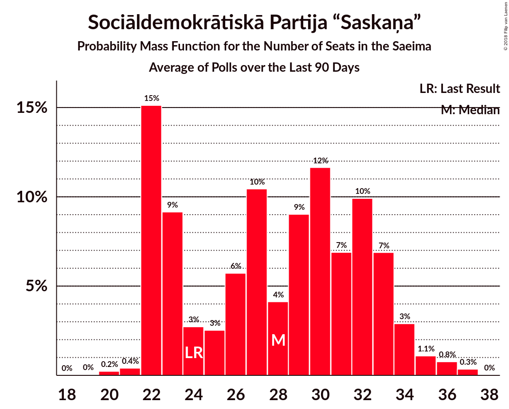

# Sociāldemokrātiskā Partija “Saskaņa”

<a href="#voting-intentions">Voting Intentions</a> | <a href="#seats">Seats</a>

## Voting Intentions

Last result: **23.0%** (General Election of 4 October 2014)

### Confidence Intervals

| Period     | Polling firm/Commissioner(s) | Median | 80% Confidence Interval | 90% Confidence Interval | 95% Confidence Interval | 99% Confidence Interval |
|:----------:|:----------------:|:-----------:|:-----------------------:|:-----------------------:|:-----------------------:|:-----------------------:|
| N/A | [Poll Average](average.html) | 24.6% | 20.3–28.6% | 19.8–29.5% | 19.3–30.3% | 18.1–31.7% |
| [24–30 September 2018](2018-09-30-FACTUM.html) | FACTUM | 20.8% | 19.8–21.9% | 19.5–22.2% | 19.2–22.4% | 18.8–23.0% |
| [17–23 September 2018](2018-09-23-FACTUM.html) | FACTUM | 19.2% | 18.2–20.3% | 17.9–20.6% | 17.6–20.8% | 17.2–21.4% |
| [8–18 September 2018](2018-09-18-SKDS.html) | SKDS   Latvijas Televīzija | 27.8% | 25.6–30.2% | 25.0–30.9% | 24.4–31.5% | 23.4–32.7% |
| [10–16 September 2018](2018-09-16-FACTUM.html) | FACTUM | 20.6% | 19.2–22.2% | 18.7–22.6% | 18.4–23.0% | 17.7–23.8% |
| [10–14 September 2018](2018-09-14-Norstat.html) | Norstat | 22.8% | 19.8–26.2% | 19.0–27.2% | 18.3–28.0% | 17.0–29.7% |
| [8 August–12 September 2018](2018-09-12-KantarTNS.html) | Kantar TNS   Delfi | 25.7% | 23.7–28.0% | 23.1–28.6% | 22.6–29.1% | 21.6–30.2% |
| [31 August–9 September 2018](2018-09-09-FACTUM.html) | FACTUM | 20.6% | 19.2–22.1% | 18.8–22.5% | 18.5–22.9% | 17.8–23.6% |
| [30 August–5 September 2018](2018-09-05-FACTUM.html) | FACTUM | 21.4% | 20.2–22.6% | 19.9–22.9% | 19.6–23.2% | 19.1–23.9% |
| [27 August–2 September 2018](2018-09-02-FACTUM.html) | FACTUM | 23.3% | 22.1–24.6% | 21.7–24.9% | 21.4–25.2% | 20.9–25.9% |
| [25–31 August 2018](2018-08-31-FACTUM.html) | FACTUM | 21.9% | 20.7–23.2% | 20.3–23.6% | 20.0–23.9% | 19.4–24.5% |
| [22–28 August 2018](2018-08-28-FACTUM.html) | FACTUM | 21.4% | 20.6–23.5% | 20.2–23.9% | 19.8–24.3% | 19.2–25.0% |
| [20–26 August 2018](2018-08-26-FACTUM.html) | FACTUM | 20.0% | 19.2–22.1% | 18.8–22.5% | 18.5–22.8% | 17.9–23.6% |
| [1–23 August 2018](2018-08-23-SKDS.html) | SKDS   Latvijas Televīzija | 33.0% | 30.7–35.7% | 30.1–36.5% | 29.5–37.1% | 28.3–38.3% |
| [13–19 August 2018](2018-08-19-FACTUM.html) | FACTUM | 20.4% | 19.1–21.8% | 18.7–22.2% | 18.4–22.5% | 17.8–23.2% |
| [17–23 July 2018](2018-07-23-FACTUM.html) | FACTUM | 19.4% | 18.7–21.4% | 18.4–21.8% | 18.1–22.1% | 17.5–22.8% |
| [1–30 June 2018](2018-06-30-SKDS.html) | SKDS   Latvijas Televīzija | 33.4% | 31.1–35.9% | 30.4–36.6% | 29.9–37.2% | 28.8–38.4% |
| [1–31 May 2018](2018-05-31-SKDS.html) | SKDS   Latvijas Televīzija | 32.7% | 30.1–35.0% | 29.4–35.8% | 28.8–36.4% | 27.7–37.6% |
| [1–31 May 2018](2018-05-31-Norstat.html) | Norstat   TV3 Latvija | 22.8% | 20.9–24.9% | 20.3–25.5% | 19.9–26.0% | 19.0–27.1% |
| [1–30 April 2018](2018-04-30-SKDS.html) | SKDS   Latvijas Televīzija | 36.8% | 34.4–39.3% | 33.7–40.0% | 33.1–40.6% | 32.0–41.8% |
| [1–31 March 2018](2018-03-31-SKDS.html) | SKDS   Latvijas Televīzija | 35.6% | 33.2–38.4% | 32.5–39.1% | 31.9–39.8% | 30.7–41.0% |
| [1–28 February 2018](2018-02-28-SKDS.html) | SKDS   Latvijas Televīzija | 34.2% | 31.9–36.8% | 31.2–37.5% | 30.6–38.1% | 29.5–39.3% |
| [1–31 January 2018](2018-01-31-SKDS.html) | SKDS   Latvijas Televīzija | 35.5% | 33.0–38.1% | 32.3–38.8% | 31.7–39.5% | 30.5–40.7% |

### Probability Mass Function

The following table shows the probability mass function per percentage block of voting intentions for the [poll average](average.html) for Sociāldemokrātiskā Partija “Saskaņa”.

| Voting Intentions | Probability | Accumulated | Special Marks |
|:-----------------:|:-----------:|:-----------:|:-------------:|
| 14.5–15.5% | 0% | 100% |  |
| 15.5–16.5% | 0.1% | 100% |  |
| 16.5–17.5% | 0.2% | 99.9% |  |
| 17.5–18.5% | 0.6% | 99.7% |  |
| 18.5–19.5% | 3% | 99.2% |  |
| 19.5–20.5% | 10% | 97% |  |
| 20.5–21.5% | 14% | 87% |  |
| 21.5–22.5% | 9% | 72% |  |
| 22.5–23.5% | 6% | 64% | Last Result |
| 23.5–24.5% | 8% | 58% |  |
| 24.5–25.5% | 10% | 50% | Median |
| 25.5–26.5% | 11% | 40% |  |
| 26.5–27.5% | 10% | 29% |  |
| 27.5–28.5% | 8% | 19% |  |
| 28.5–29.5% | 6% | 11% |  |
| 29.5–30.5% | 3% | 5% |  |
| 30.5–31.5% | 1.3% | 2% |  |
| 31.5–32.5% | 0.5% | 0.6% |  |
| 32.5–33.5% | 0.1% | 0.2% |  |
| 33.5–34.5% | 0% | 0% |  |

## Seats

Last result: **24** seats (General Election of 4 October 2014)

### Confidence Intervals

| Period     | Polling firm/Commissioner(s) | Median | 80% Confidence Interval | 90% Confidence Interval | 95% Confidence Interval | 99% Confidence Interval |
|:----------:|:----------------:|:------:|:-----------------------:|:-----------------------:|:-----------------------:|:-----------------------:|
| N/A | [Poll Average](average.html) | 28 | 22–33 | 22–34 | 22–34 | 21–36 |
| [24–30 September 2018](2018-09-30-FACTUM.html) | FACTUM | 22 | 22–23 | 22–24 | 22–25 | 20–26 |
| [17–23 September 2018](2018-09-23-FACTUM.html) | FACTUM | 22 | 20–22 | 20–23 | 20–23 | 19–24 |
| [8–18 September 2018](2018-09-18-SKDS.html) | SKDS   Latvijas Televīzija | 32 | 28–34 | 27–35 | 27–36 | 26–37 |
| [10–16 September 2018](2018-09-16-FACTUM.html) | FACTUM | 23 | 22–26 | 22–26 | 21–26 | 20–27 |
| [10–14 September 2018](2018-09-14-Norstat.html) | Norstat | 27 | 24–32 | 23–33 | 22–34 | 20–37 |
| [8 August–12 September 2018](2018-09-12-KantarTNS.html) | Kantar TNS   Delfi | 30 | 27–33 | 26–33 | 26–33 | 24–35 |
| [31 August–9 September 2018](2018-09-09-FACTUM.html) | FACTUM | 26 | 25–27 | 25–28 | 24–28 | 22–29 |
| [30 August–5 September 2018](2018-09-05-FACTUM.html) | FACTUM | 27 | 26–29 | 26–29 | 25–29 | 24–30 |
| [27 August–2 September 2018](2018-09-02-FACTUM.html) | FACTUM | 30 | 28–32 | 28–32 | 27–32 | 26–33 |
| [25–31 August 2018](2018-08-31-FACTUM.html) | FACTUM | 27 | 27–30 | 26–31 | 26–31 | 25–31 |
| [22–28 August 2018](2018-08-28-FACTUM.html) | FACTUM | 27 | 26–28 | 25–29 | 25–29 | 24–31 |
| [20–26 August 2018](2018-08-26-FACTUM.html) | FACTUM | 22 | 22–23 | 22–24 | 21–25 | 20–26 |
| [1–23 August 2018](2018-08-23-SKDS.html) | SKDS   Latvijas Televīzija | 38 | 36–41 | 35–42 | 34–43 | 32–46 |
| [13–19 August 2018](2018-08-19-FACTUM.html) | FACTUM | 26 | 25–28 | 25–29 | 24–31 | 22–32 |
| [17–23 July 2018](2018-07-23-FACTUM.html) | FACTUM | 22 | 21–24 | 20–25 | 20–25 | 19–26 |
| [1–30 June 2018](2018-06-30-SKDS.html) | SKDS   Latvijas Televīzija | 35 | 33–39 | 33–40 | 32–41 | 30–43 |
| [1–31 May 2018](2018-05-31-SKDS.html) | SKDS   Latvijas Televīzija | 40 | 35–42 | 33–42 | 32–42 | 31–45 |
| [1–31 May 2018](2018-05-31-Norstat.html) | Norstat   TV3 Latvija | 28 | 24–32 | 24–32 | 23–33 | 22–33 |
| [1–30 April 2018](2018-04-30-SKDS.html) | SKDS   Latvijas Televīzija | 41 | 38–45 | 38–46 | 37–46 | 36–47 |
| [1–31 March 2018](2018-03-31-SKDS.html) | SKDS   Latvijas Televīzija | 41 | 37–43 | 37–43 | 36–46 | 34–47 |
| [1–28 February 2018](2018-02-28-SKDS.html) | SKDS   Latvijas Televīzija | 39 | 37–41 | 37–42 | 36–43 | 34–46 |
| [1–31 January 2018](2018-01-31-SKDS.html) | SKDS   Latvijas Televīzija | 41 | 38–45 | 37–46 | 37–46 | 35–48 |

### Probability Mass Function

The following table shows the probability mass function per seat for the [poll average](average.html) for Sociāldemokrātiskā Partija “Saskaņa”.

| Number of Seats | Probability | Accumulated | Special Marks |
|:---------------:|:-----------:|:-----------:|:-------------:|
| 19 | 0% | 100% |  |
| 20 | 0.2% | 99.9% |  |
| 21 | 0.4% | 99.7% |  |
| 22 | 15% | 99.3% |  |
| 23 | 9% | 84% |  |
| 24 | 3% | 75% | Last Result |
| 25 | 3% | 72% |  |
| 26 | 6% | 70% |  |
| 27 | 10% | 64% |  |
| 28 | 4% | 54% | Median |
| 29 | 9% | 49% |  |
| 30 | 12% | 40% |  |
| 31 | 7% | 29% |  |
| 32 | 10% | 22% |  |
| 33 | 7% | 12% |  |
| 34 | 3% | 5% |  |
| 35 | 1.1% | 2% |  |
| 36 | 0.8% | 1.1% |  |
| 37 | 0.3% | 0.4% |  |
| 38 | 0% | 0% |  |

