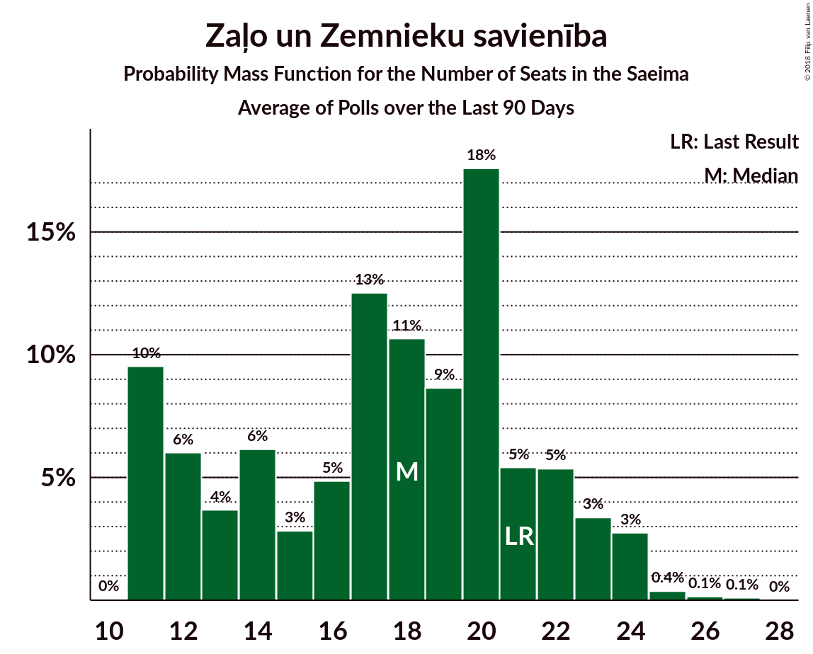

# Zaļo un Zemnieku savienība

<a href="#voting-intentions">Voting Intentions</a> | <a href="#seats">Seats</a>

## Voting Intentions

Last result: **19.5%** (General Election of 4 October 2014)

### Confidence Intervals

| Period     | Polling firm/Commissioner(s) | Median | 80% Confidence Interval | 90% Confidence Interval | 95% Confidence Interval | 99% Confidence Interval |
|:----------:|:----------------:|:-----------:|:-----------------------:|:-----------------------:|:-----------------------:|:-----------------------:|
| N/A | [Poll Average](average.html) | 15.0% | 10.7–17.9% | 10.4–18.6% | 10.1–19.2% | 9.6–20.4% |
| [24–30 September 2018](2018-09-30-FACTUM.html) | FACTUM | 10.9% | 10.1–11.7% | 9.9–12.0% | 9.7–12.2% | 9.4–12.6% |
| [17–23 September 2018](2018-09-23-FACTUM.html) | FACTUM | 12.1% | 11.3–13.0% | 11.1–13.3% | 10.9–13.5% | 10.5–14.0% |
| [8–18 September 2018](2018-09-18-SKDS.html) | SKDS   Latvijas Televīzija | 15.2% | 13.5–17.2% | 13.0–17.8% | 12.6–18.3% | 11.8–19.2% |
| [10–16 September 2018](2018-09-16-FACTUM.html) | FACTUM | 9.8% | 8.7–11.0% | 8.5–11.3% | 8.2–11.6% | 7.7–12.2% |
| [10–14 September 2018](2018-09-14-Norstat.html) | Norstat | 14.7% | 12.3–17.7% | 11.7–18.6% | 11.1–19.3% | 10.0–20.9% |
| [8 August–12 September 2018](2018-09-12-KantarTNS.html) | Kantar TNS   Delfi | 17.0% | 15.2–18.9% | 14.7–19.5% | 14.3–20.0% | 13.5–20.9% |
| [31 August–9 September 2018](2018-09-09-FACTUM.html) | FACTUM | 8.8% | 7.9–9.9% | 7.6–10.2% | 7.4–10.5% | 7.0–11.0% |
| [30 August–5 September 2018](2018-09-05-FACTUM.html) | FACTUM | 8.7% | 8.0–9.6% | 7.7–9.9% | 7.6–10.1% | 7.2–10.5% |
| [27 August–2 September 2018](2018-09-02-FACTUM.html) | FACTUM | 8.7% | 7.9–9.6% | 7.7–9.9% | 7.5–10.1% | 7.2–10.5% |
| [25–31 August 2018](2018-08-31-FACTUM.html) | FACTUM | 9.5% | 8.7–10.5% | 8.5–10.8% | 8.2–11.0% | 7.9–11.5% |
| [22–28 August 2018](2018-08-28-FACTUM.html) | FACTUM | 10.7% | 10.0–12.2% | 9.7–12.5% | 9.4–12.8% | 8.9–13.4% |
| [20–26 August 2018](2018-08-26-FACTUM.html) | FACTUM | 11.4% | 10.7–13.0% | 10.4–13.3% | 10.2–13.6% | 9.7–14.2% |
| [1–23 August 2018](2018-08-23-SKDS.html) | SKDS   Latvijas Televīzija | 17.6% | 15.9–19.9% | 15.3–20.6% | 14.9–21.1% | 14.0–22.2% |
| [13–19 August 2018](2018-08-19-FACTUM.html) | FACTUM | 11.7% | 10.6–12.8% | 10.3–13.1% | 10.1–13.4% | 9.6–14.0% |
| [17–23 July 2018](2018-07-23-FACTUM.html) | FACTUM | 12.2% | 11.6–13.8% | 11.3–14.1% | 11.1–14.4% | 10.6–15.0% |
| [1–30 June 2018](2018-06-30-SKDS.html) | SKDS   Latvijas Televīzija | 23.0% | 20.9–25.2% | 20.4–25.9% | 19.9–26.4% | 18.9–27.5% |
| [1–31 May 2018](2018-05-31-SKDS.html) | SKDS   Latvijas Televīzija | 25.0% | 22.6–27.2% | 22.0–27.9% | 21.5–28.5% | 20.5–29.7% |
| [1–31 May 2018](2018-05-31-Norstat.html) | Norstat   TV3 Latvija | 23.9% | 21.9–26.0% | 21.4–26.7% | 20.9–27.2% | 20.0–28.2% |
| [1–30 April 2018](2018-04-30-SKDS.html) | SKDS   Latvijas Televīzija | 20.3% | 18.3–22.5% | 17.8–23.1% | 17.3–23.6% | 16.4–24.7% |
| [1–31 March 2018](2018-03-31-SKDS.html) | SKDS   Latvijas Televīzija | 24.2% | 22.1–26.8% | 21.5–27.4% | 21.0–28.0% | 20.0–29.2% |
| [1–28 February 2018](2018-02-28-SKDS.html) | SKDS   Latvijas Televīzija | 23.4% | 21.3–25.7% | 20.8–26.4% | 20.3–26.9% | 19.3–28.0% |
| [1–31 January 2018](2018-01-31-SKDS.html) | SKDS   Latvijas Televīzija | 26.6% | 24.3–29.1% | 23.7–29.8% | 23.2–30.4% | 22.1–31.6% |

### Probability Mass Function

The following table shows the probability mass function per percentage block of voting intentions for the [poll average](average.html) for Zaļo un Zemnieku savienība.

| Voting Intentions | Probability | Accumulated | Special Marks |
|:-----------------:|:-----------:|:-----------:|:-------------:|
| 7.5–8.5% | 0% | 100% |  |
| 8.5–9.5% | 0.4% | 100% |  |
| 9.5–10.5% | 7% | 99.6% |  |
| 10.5–11.5% | 15% | 93% |  |
| 11.5–12.5% | 6% | 78% |  |
| 12.5–13.5% | 6% | 72% |  |
| 13.5–14.5% | 10% | 66% |  |
| 14.5–15.5% | 14% | 56% | Median |
| 15.5–16.5% | 15% | 42% |  |
| 16.5–17.5% | 13% | 26% |  |
| 17.5–18.5% | 8% | 14% |  |
| 18.5–19.5% | 4% | 5% |  |
| 19.5–20.5% | 1.3% | 2% | Last Result |
| 20.5–21.5% | 0.3% | 0.4% |  |
| 21.5–22.5% | 0.1% | 0.1% |  |
| 22.5–23.5% | 0% | 0% |  |

## Seats

Last result: **21** seats (General Election of 4 October 2014)

### Confidence Intervals

| Period     | Polling firm/Commissioner(s) | Median | 80% Confidence Interval | 90% Confidence Interval | 95% Confidence Interval | 99% Confidence Interval |
|:----------:|:----------------:|:------:|:-----------------------:|:-----------------------:|:-----------------------:|:-----------------------:|
| N/A | [Poll Average](average.html) | 18 | 12–22 | 11–23 | 11–24 | 11–25 |
| [24–30 September 2018](2018-09-30-FACTUM.html) | FACTUM | 12 | 11–14 | 11–14 | 11–14 | 11–15 |
| [17–23 September 2018](2018-09-23-FACTUM.html) | FACTUM | 15 | 14–15 | 14–15 | 13–15 | 11–15 |
| [8–18 September 2018](2018-09-18-SKDS.html) | SKDS   Latvijas Televīzija | 18 | 16–20 | 16–22 | 15–23 | 15–24 |
| [10–16 September 2018](2018-09-16-FACTUM.html) | FACTUM | 11 | 11–14 | 11–14 | 10–14 | 8–15 |
| [10–14 September 2018](2018-09-14-Norstat.html) | Norstat | 18 | 16–22 | 15–23 | 14–24 | 13–26 |
| [8 August–12 September 2018](2018-09-12-KantarTNS.html) | Kantar TNS   Delfi | 20 | 18–23 | 17–24 | 17–24 | 17–25 |
| [31 August–9 September 2018](2018-09-09-FACTUM.html) | FACTUM | 11 | 11–13 | 10–14 | 10–14 | 9–15 |
| [30 August–5 September 2018](2018-09-05-FACTUM.html) | FACTUM | 11 | 10–14 | 10–14 | 10–15 | 10–15 |
| [27 August–2 September 2018](2018-09-02-FACTUM.html) | FACTUM | 13 | 11–14 | 10–15 | 10–15 | 9–15 |
| [25–31 August 2018](2018-08-31-FACTUM.html) | FACTUM | 14 | 12–15 | 11–15 | 11–15 | 11–16 |
| [22–28 August 2018](2018-08-28-FACTUM.html) | FACTUM | 15 | 14–16 | 13–16 | 13–17 | 11–18 |
| [20–26 August 2018](2018-08-26-FACTUM.html) | FACTUM | 14 | 13–15 | 12–15 | 11–15 | 11–16 |
| [1–23 August 2018](2018-08-23-SKDS.html) | SKDS   Latvijas Televīzija | 23 | 19–24 | 19–26 | 19–26 | 17–28 |
| [13–19 August 2018](2018-08-19-FACTUM.html) | FACTUM | 16 | 15–17 | 15–18 | 15–19 | 14–20 |
| [17–23 July 2018](2018-07-23-FACTUM.html) | FACTUM | 15 | 14–16 | 14–17 | 13–17 | 11–18 |
| [1–30 June 2018](2018-06-30-SKDS.html) | SKDS   Latvijas Televīzija | 26 | 24–29 | 24–30 | 24–30 | 23–32 |
| [1–31 May 2018](2018-05-31-SKDS.html) | SKDS   Latvijas Televīzija | 32 | 28–34 | 26–34 | 25–36 | 24–37 |
| [1–31 May 2018](2018-05-31-Norstat.html) | Norstat   TV3 Latvija | 29 | 24–33 | 23–33 | 23–33 | 23–35 |
| [1–30 April 2018](2018-04-30-SKDS.html) | SKDS   Latvijas Televīzija | 25 | 23–28 | 23–28 | 22–29 | 19–31 |
| [1–31 March 2018](2018-03-31-SKDS.html) | SKDS   Latvijas Televīzija | 29 | 26–34 | 26–34 | 25–35 | 24–35 |
| [1–28 February 2018](2018-02-28-SKDS.html) | SKDS   Latvijas Televīzija | 29 | 26–31 | 25–32 | 25–32 | 24–34 |
| [1–31 January 2018](2018-01-31-SKDS.html) | SKDS   Latvijas Televīzija | 33 | 29–36 | 28–37 | 27–37 | 26–39 |

### Probability Mass Function

The following table shows the probability mass function per seat for the [poll average](average.html) for Zaļo un Zemnieku savienība.

| Number of Seats | Probability | Accumulated | Special Marks |
|:---------------:|:-----------:|:-----------:|:-------------:|
| 11 | 10% | 100% |  |
| 12 | 6% | 90% |  |
| 13 | 4% | 84% |  |
| 14 | 6% | 81% |  |
| 15 | 3% | 75% |  |
| 16 | 5% | 72% |  |
| 17 | 13% | 67% |  |
| 18 | 11% | 54% | Median |
| 19 | 9% | 44% |  |
| 20 | 18% | 35% |  |
| 21 | 5% | 18% | Last Result |
| 22 | 5% | 12% |  |
| 23 | 3% | 7% |  |
| 24 | 3% | 3% |  |
| 25 | 0.4% | 0.7% |  |
| 26 | 0.1% | 0.3% |  |
| 27 | 0.1% | 0.1% |  |
| 28 | 0% | 0% |  |

