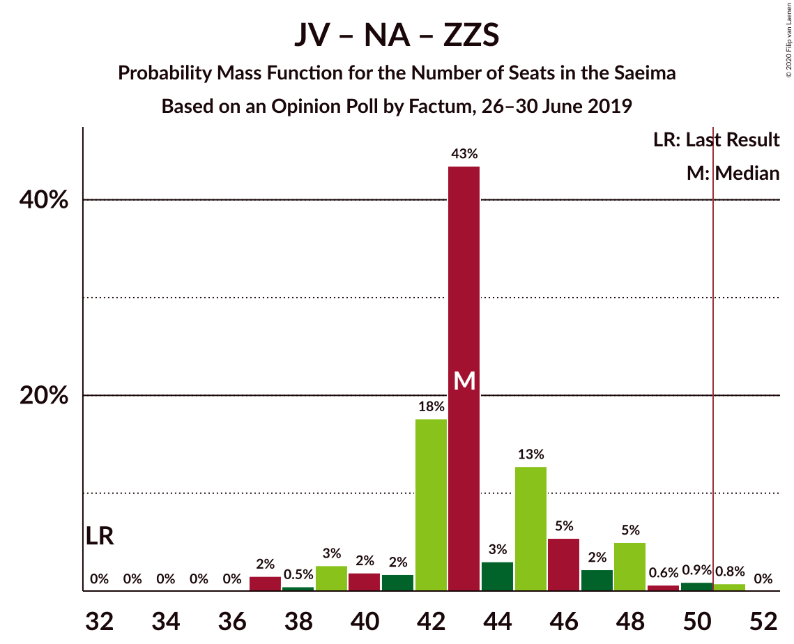
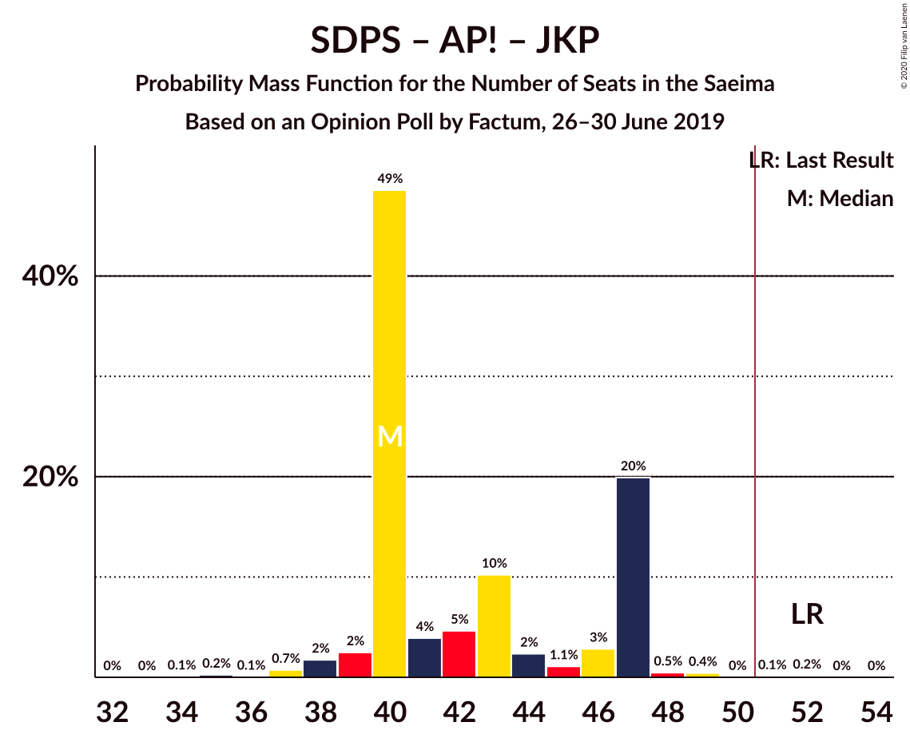

# Opinion Poll by Factum, 26–30 June 2019

<a href="#voting-intentions">Voting Intentions</a> | <a href="#seats">Seats</a> | <a href="#coalitions">Coalitions</a> | <a href="#technical-information">Technical Information</a>

## Voting Intentions

### Confidence Intervals

| Party | Last Result | Poll Result | 80% Confidence Interval | 90% Confidence Interval | 95% Confidence Interval | 99% Confidence Interval |
|:-----:|:-----------:|:-----------:|:-----------------------:|:-----------------------:|:-----------------------:|:-----------------------:|
| Sociāldemokrātiskā partija “Saskaņa” | 19.8% | 17.0% | 15.4–18.7% |15.0–19.2% |14.6–19.6% |13.9–20.5% |
| Jaunā VIENOTĪBA | 6.7% | 17.0% | 15.4–18.7% |15.0–19.2% |14.6–19.6% |13.9–20.5% |
| Nacionālā apvienība „Visu Latvijai!”–„Tēvzemei un Brīvībai/LNNK” | 11.0% | 15.0% | 13.5–16.7% |13.1–17.1% |12.8–17.5% |12.1–18.4% |
| Attīstībai/Par! | 12.0% | 12.0% | 10.7–13.5% |10.3–13.9% |10.0–14.3% |9.4–15.1% |
| Jaunā konservatīvā partija | 13.6% | 10.0% | 8.8–11.4% |8.5–11.8% |8.2–12.2% |7.6–12.9% |
| Zaļo un Zemnieku savienība | 9.9% | 9.0% | 7.8–10.3% |7.5–10.7% |7.2–11.1% |6.7–11.8% |
| Latvijas Reģionu Apvienība | 4.1% | 5.9% | 5.0–7.1% |4.8–7.4% |4.5–7.7% |4.1–8.3% |
| PROGRESĪVIE | 2.6% | 5.9% | 5.0–7.1% |4.8–7.4% |4.5–7.7% |4.1–8.3% |
| Politiskā partija „KPV LV” | 14.2% | 4.0% | 3.2–5.0% |3.0–5.2% |2.8–5.5% |2.5–6.0% |
| Latvijas Krievu savienība | 3.2% | 4.0% | 3.2–5.0% |3.0–5.2% |2.8–5.5% |2.5–6.0% |

*Note:* The poll result column reflects the actual value used in the calculations. Published results may vary slightly, and in addition be rounded to fewer digits.

## Seats

### Confidence Intervals

| Party | Last Result | Median | 80% Confidence Interval | 90% Confidence Interval | 95% Confidence Interval | 99% Confidence Interval |
|:-----:|:-----------:|:------:|:-----------------------:|:-----------------------:|:-----------------------:|:-----------------------:|
| <a href="#sociāldemokrātiskā-partija-“saskaņa”">Sociāldemokrātiskā partija “Saskaņa”</a> | 23 | 19 | 16–21 |16–21 |16–23 |16–24 |
| <a href="#jaunā-vienotība">Jaunā VIENOTĪBA</a> | 8 | 18 | 17–20 |17–20 |17–20 |14–24 |
| <a href="#nacionālā-apvienība-„visu-latvijai!”–„tēvzemei-un-brīvībai/lnnk”">Nacionālā apvienība „Visu Latvijai!”–„Tēvzemei un Brīvībai/LNNK”</a> | 13 | 14 | 13–17 |13–17 |13–19 |13–19 |
| <a href="#attīstībai/par!">Attīstībai/Par!</a> | 13 | 11 | 10–15 |10–15 |10–15 |10–16 |
| <a href="#jaunā-konservatīvā-partija">Jaunā konservatīvā partija</a> | 16 | 11 | 9–13 |9–13 |9–13 |8–13 |
| <a href="#zaļo-un-zemnieku-savienība">Zaļo un Zemnieku savienība</a> | 11 | 11 | 8–12 |7–12 |7–12 |7–14 |
| <a href="#latvijas-reģionu-apvienība">Latvijas Reģionu Apvienība</a> | 0 | 6 | 6–7 |6–7 |0–7 |0–8 |
| <a href="#progresīvie">PROGRESĪVIE</a> | 0 | 6 | 5–7 |5–8 |0–8 |0–9 |
| <a href="#politiskā-partija-„kpv-lv”">Politiskā partija „KPV LV”</a> | 16 | 0 | 0 |0–5 |0–5 |0–7 |
| <a href="#latvijas-krievu-savienība">Latvijas Krievu savienība</a> | 0 | 0 | 0–5 |0–5 |0–5 |0–7 |

### Sociāldemokrātiskā partija “Saskaņa”

*For a full overview of the results for this party, see the [Sociāldemokrātiskā partija “Saskaņa”](party-sociāldemokrātiskāpartija“saskaņa”.html) page.*

| Number of Seats | Probability | Accumulated | Special Marks |
|:---------------:|:-----------:|:-----------:|:-------------:|
| 14 | 0.1% | 100% |  |
| 15 | 0% | 99.9% |  |
| 16 | 10% | 99.9% |  |
| 17 | 4% | 90% |  |
| 18 | 10% | 86% |  |
| 19 | 43% | 76% | Median |
| 20 | 20% | 32% |  |
| 21 | 7% | 12% |  |
| 22 | 2% | 5% |  |
| 23 | 2% | 3% | Last Result |
| 24 | 0.5% | 0.8% |  |
| 25 | 0.3% | 0.3% |  |
| 26 | 0% | 0% |  |

### Jaunā VIENOTĪBA

*For a full overview of the results for this party, see the [Jaunā VIENOTĪBA](party-jaunāvienotība.html) page.*

| Number of Seats | Probability | Accumulated | Special Marks |
|:---------------:|:-----------:|:-----------:|:-------------:|
| 8 | 0% | 100% | Last Result |
| 9 | 0% | 100% |  |
| 10 | 0% | 100% |  |
| 11 | 0% | 100% |  |
| 12 | 0% | 100% |  |
| 13 | 0% | 100% |  |
| 14 | 0.6% | 100% |  |
| 15 | 0.3% | 99.4% |  |
| 16 | 1.1% | 99.1% |  |
| 17 | 12% | 98% |  |
| 18 | 51% | 86% | Median |
| 19 | 3% | 35% |  |
| 20 | 30% | 33% |  |
| 21 | 1.0% | 2% |  |
| 22 | 0.5% | 1.4% |  |
| 23 | 0.1% | 0.9% |  |
| 24 | 0.7% | 0.7% |  |
| 25 | 0% | 0% |  |

### Nacionālā apvienība „Visu Latvijai!”–„Tēvzemei un Brīvībai/LNNK”

*For a full overview of the results for this party, see the [Nacionālā apvienība „Visu Latvijai!”–„Tēvzemei un Brīvībai/LNNK”](party-nacionālāapvienība„visulatvijai”–„tēvzemeiunbrīvībailnnk”.html) page.*

| Number of Seats | Probability | Accumulated | Special Marks |
|:---------------:|:-----------:|:-----------:|:-------------:|
| 13 | 12% | 100% | Last Result |
| 14 | 61% | 88% | Median |
| 15 | 4% | 27% |  |
| 16 | 9% | 23% |  |
| 17 | 10% | 14% |  |
| 18 | 0.5% | 4% |  |
| 19 | 3% | 3% |  |
| 20 | 0.4% | 0.4% |  |
| 21 | 0% | 0% |  |

### Attīstībai/Par!

*For a full overview of the results for this party, see the [Attīstībai/Par!](party-attīstībaipar.html) page.*

| Number of Seats | Probability | Accumulated | Special Marks |
|:---------------:|:-----------:|:-----------:|:-------------:|
| 9 | 0.1% | 100% |  |
| 10 | 46% | 99.9% |  |
| 11 | 4% | 54% | Median |
| 12 | 4% | 49% |  |
| 13 | 10% | 46% | Last Result |
| 14 | 14% | 35% |  |
| 15 | 21% | 22% |  |
| 16 | 0.4% | 0.7% |  |
| 17 | 0.3% | 0.4% |  |
| 18 | 0% | 0% |  |

### Jaunā konservatīvā partija

*For a full overview of the results for this party, see the [Jaunā konservatīvā partija](party-jaunākonservatīvāpartija.html) page.*

| Number of Seats | Probability | Accumulated | Special Marks |
|:---------------:|:-----------:|:-----------:|:-------------:|
| 7 | 0.3% | 100% |  |
| 8 | 2% | 99.7% |  |
| 9 | 17% | 98% |  |
| 10 | 4% | 81% |  |
| 11 | 44% | 77% | Median |
| 12 | 16% | 33% |  |
| 13 | 16% | 17% |  |
| 14 | 0.1% | 0.2% |  |
| 15 | 0% | 0% |  |
| 16 | 0% | 0% | Last Result |

### Zaļo un Zemnieku savienība

*For a full overview of the results for this party, see the [Zaļo un Zemnieku savienība](party-zaļounzemniekusavienība.html) page.*

| Number of Seats | Probability | Accumulated | Special Marks |
|:---------------:|:-----------:|:-----------:|:-------------:|
| 6 | 0.3% | 100% |  |
| 7 | 8% | 99.7% |  |
| 8 | 16% | 92% |  |
| 9 | 0.2% | 76% |  |
| 10 | 5% | 75% |  |
| 11 | 54% | 71% | Last Result, Median |
| 12 | 15% | 16% |  |
| 13 | 0.5% | 1.1% |  |
| 14 | 0.6% | 0.6% |  |
| 15 | 0% | 0% |  |

### Latvijas Reģionu Apvienība

*For a full overview of the results for this party, see the [Latvijas Reģionu Apvienība](party-latvijasreģionuapvienība.html) page.*

| Number of Seats | Probability | Accumulated | Special Marks |
|:---------------:|:-----------:|:-----------:|:-------------:|
| 0 | 3% | 100% | Last Result |
| 1 | 0% | 97% |  |
| 2 | 0% | 97% |  |
| 3 | 0% | 97% |  |
| 4 | 0% | 97% |  |
| 5 | 0% | 97% |  |
| 6 | 86% | 97% | Median |
| 7 | 10% | 11% |  |
| 8 | 0.5% | 0.6% |  |
| 9 | 0.1% | 0.2% |  |
| 10 | 0.1% | 0.1% |  |
| 11 | 0% | 0% |  |

### PROGRESĪVIE

*For a full overview of the results for this party, see the [PROGRESĪVIE](party-progresīvie.html) page.*

| Number of Seats | Probability | Accumulated | Special Marks |
|:---------------:|:-----------:|:-----------:|:-------------:|
| 0 | 5% | 100% | Last Result |
| 1 | 0% | 95% |  |
| 2 | 0% | 95% |  |
| 3 | 0% | 95% |  |
| 4 | 0% | 95% |  |
| 5 | 19% | 95% |  |
| 6 | 53% | 77% | Median |
| 7 | 16% | 24% |  |
| 8 | 7% | 8% |  |
| 9 | 1.0% | 1.0% |  |
| 10 | 0% | 0% |  |

### Politiskā partija „KPV LV”

*For a full overview of the results for this party, see the [Politiskā partija „KPV LV”](party-politiskāpartija„kpvlv”.html) page.*

| Number of Seats | Probability | Accumulated | Special Marks |
|:---------------:|:-----------:|:-----------:|:-------------:|
| 0 | 93% | 100% | Median |
| 1 | 0% | 7% |  |
| 2 | 0% | 7% |  |
| 3 | 0% | 7% |  |
| 4 | 0% | 7% |  |
| 5 | 5% | 7% |  |
| 6 | 1.2% | 2% |  |
| 7 | 0.8% | 0.8% |  |
| 8 | 0% | 0% |  |
| 9 | 0% | 0% |  |
| 10 | 0% | 0% |  |
| 11 | 0% | 0% |  |
| 12 | 0% | 0% |  |
| 13 | 0% | 0% |  |
| 14 | 0% | 0% |  |
| 15 | 0% | 0% |  |
| 16 | 0% | 0% | Last Result |

### Latvijas Krievu savienība

*For a full overview of the results for this party, see the [Latvijas Krievu savienība](party-latvijaskrievusavienība.html) page.*

| Number of Seats | Probability | Accumulated | Special Marks |
|:---------------:|:-----------:|:-----------:|:-------------:|
| 0 | 57% | 100% | Last Result, Median |
| 1 | 0% | 43% |  |
| 2 | 0% | 43% |  |
| 3 | 0% | 43% |  |
| 4 | 0% | 43% |  |
| 5 | 42% | 43% |  |
| 6 | 0.8% | 2% |  |
| 7 | 0.3% | 0.7% |  |
| 8 | 0.4% | 0.4% |  |
| 9 | 0% | 0% |  |

## Coalitions

### Confidence Intervals

| Coalition | Last Result | Median | Majority? | 80% Confidence Interval | 90% Confidence Interval | 95% Confidence Interval | 99% Confidence Interval |
|:---------:|:-----------:|:------:|:---------:|:-----------------------:|:-----------------------:|:-----------------------:|:-----------------------:|
| Jaunā VIENOTĪBA – Nacionālā apvienība „Visu Latvijai!”–„Tēvzemei un Brīvībai/LNNK” – Attīstībai/Par! – Jaunā konservatīvā partija – Zaļo un Zemnieku savienība | 61 | 65 | 100% | 64–72 | 63–72 | 61–73 | 60–75 |
| Jaunā VIENOTĪBA – Nacionālā apvienība „Visu Latvijai!”–„Tēvzemei un Brīvībai/LNNK” – Attīstībai/Par! – Jaunā konservatīvā partija – Politiskā partija „KPV LV” | 66 | 56 | 100% | 53–61 | 53–61 | 53–63 | 53–65 |
| Jaunā VIENOTĪBA – Nacionālā apvienība „Visu Latvijai!”–„Tēvzemei un Brīvībai/LNNK” – Attīstībai/Par! – Jaunā konservatīvā partija | 50 | 55 | 99.4% | 53–61 | 53–61 | 52–63 | 50–65 |
| Jaunā VIENOTĪBA – Nacionālā apvienība „Visu Latvijai!”–„Tēvzemei un Brīvībai/LNNK” – Attīstībai/Par! – Zaļo un Zemnieku savienība | 45 | 54 | 98% | 53–61 | 52–61 | 52–61 | 48–65 |
| Jaunā VIENOTĪBA – Nacionālā apvienība „Visu Latvijai!”–„Tēvzemei un Brīvībai/LNNK” – Jaunā konservatīvā partija – Zaļo un Zemnieku savienība | 48 | 54 | 96% | 53–58 | 51–58 | 50–59 | 48–63 |
| Nacionālā apvienība „Visu Latvijai!”–„Tēvzemei un Brīvībai/LNNK” – Attīstībai/Par! – Jaunā konservatīvā partija – Zaļo un Zemnieku savienība | 53 | 48 | 17% | 46–52 | 46–52 | 44–52 | 43–55 |
| Jaunā VIENOTĪBA – Nacionālā apvienība „Visu Latvijai!”–„Tēvzemei un Brīvībai/LNNK” – Attīstībai/Par! – Politiskā partija „KPV LV” | 50 | 46 | 4% | 42–50 | 42–50 | 42–52 | 42–54 |
| Jaunā VIENOTĪBA – Nacionālā apvienība „Visu Latvijai!”–„Tēvzemei un Brīvībai/LNNK” – Jaunā konservatīvā partija – Politiskā partija „KPV LV” | 53 | 44 | 2% | 43–46 | 43–49 | 42–50 | 41–52 |
| Jaunā VIENOTĪBA – Nacionālā apvienība „Visu Latvijai!”–„Tēvzemei un Brīvībai/LNNK” – Zaļo un Zemnieku savienība | 32 | 43 | 0.8% | 42–46 | 40–48 | 39–48 | 37–51 |
| Jaunā VIENOTĪBA – Attīstībai/Par! – Jaunā konservatīvā partija – Politiskā partija „KPV LV” | 53 | 41 | 0.1% | 39–47 | 39–47 | 39–47 | 38–49 |
| Sociāldemokrātiskā partija “Saskaņa” – Attīstībai/Par! – Jaunā konservatīvā partija | 52 | 40 | 0.3% | 40–47 | 39–47 | 38–47 | 37–49 |
| Nacionālā apvienība „Visu Latvijai!”–„Tēvzemei un Brīvībai/LNNK” – Attīstībai/Par! – Jaunā konservatīvā partija – Politiskā partija „KPV LV” | 58 | 38 | 0% | 35–41 | 35–43 | 35–44 | 35–45 |
| Nacionālā apvienība „Visu Latvijai!”–„Tēvzemei un Brīvībai/LNNK” – Attīstībai/Par! – Zaļo un Zemnieku savienība | 37 | 37 | 0% | 35–41 | 35–43 | 34–43 | 31–45 |
| Nacionālā apvienība „Visu Latvijai!”–„Tēvzemei un Brīvībai/LNNK” – Jaunā konservatīvā partija – Zaļo un Zemnieku savienība | 40 | 36 | 0% | 34–38 | 34–39 | 33–40 | 30–41 |
| Sociāldemokrātiskā partija “Saskaņa” – Attīstībai/Par! | 36 | 30 | 0% | 29–35 | 29–35 | 29–37 | 27–38 |
| Sociāldemokrātiskā partija “Saskaņa” – Zaļo un Zemnieku savienība – Politiskā partija „KPV LV” | 50 | 30 | 0% | 28–33 | 28–35 | 27–35 | 25–36 |
| Sociāldemokrātiskā partija “Saskaņa” – Politiskā partija „KPV LV” | 39 | 19 | 0% | 16–22 | 16–23 | 16–26 | 16–27 |

### Jaunā VIENOTĪBA – Nacionālā apvienība „Visu Latvijai!”–„Tēvzemei un Brīvībai/LNNK” – Attīstībai/Par! – Jaunā konservatīvā partija – Zaļo un Zemnieku savienība

| Number of Seats | Probability | Accumulated | Special Marks |
|:---------------:|:-----------:|:-----------:|:-------------:|
| 59 | 0% | 100% |  |
| 60 | 0.6% | 99.9% |  |
| 61 | 2% | 99.4% | Last Result |
| 62 | 0.3% | 97% |  |
| 63 | 2% | 97% |  |
| 64 | 42% | 95% |  |
| 65 | 3% | 53% | Median |
| 66 | 6% | 50% |  |
| 67 | 4% | 44% |  |
| 68 | 3% | 39% |  |
| 69 | 17% | 37% |  |
| 70 | 9% | 20% |  |
| 71 | 0.3% | 11% |  |
| 72 | 9% | 11% |  |
| 73 | 0.8% | 3% |  |
| 74 | 0.6% | 2% |  |
| 75 | 1.0% | 1.1% |  |
| 76 | 0.1% | 0.1% |  |
| 77 | 0% | 0.1% |  |
| 78 | 0% | 0% |  |

### Jaunā VIENOTĪBA – Nacionālā apvienība „Visu Latvijai!”–„Tēvzemei un Brīvībai/LNNK” – Attīstībai/Par! – Jaunā konservatīvā partija – Politiskā partija „KPV LV”

| Number of Seats | Probability | Accumulated | Special Marks |
|:---------------:|:-----------:|:-----------:|:-------------:|
| 51 | 0% | 100% | Majority |
| 52 | 0.2% | 99.9% |  |
| 53 | 40% | 99.8% |  |
| 54 | 1.2% | 59% | Median |
| 55 | 4% | 58% |  |
| 56 | 6% | 54% |  |
| 57 | 2% | 48% |  |
| 58 | 8% | 46% |  |
| 59 | 8% | 38% |  |
| 60 | 9% | 30% |  |
| 61 | 16% | 21% |  |
| 62 | 2% | 5% |  |
| 63 | 1.1% | 3% |  |
| 64 | 0.3% | 2% |  |
| 65 | 1.3% | 2% |  |
| 66 | 0.1% | 0.4% | Last Result |
| 67 | 0.1% | 0.3% |  |
| 68 | 0.2% | 0.2% |  |
| 69 | 0% | 0% |  |

### Jaunā VIENOTĪBA – Nacionālā apvienība „Visu Latvijai!”–„Tēvzemei un Brīvībai/LNNK” – Attīstībai/Par! – Jaunā konservatīvā partija

| Number of Seats | Probability | Accumulated | Special Marks |
|:---------------:|:-----------:|:-----------:|:-------------:|
| 50 | 0.6% | 100% | Last Result |
| 51 | 1.4% | 99.4% | Majority |
| 52 | 2% | 98% |  |
| 53 | 41% | 96% |  |
| 54 | 4% | 56% | Median |
| 55 | 4% | 52% |  |
| 56 | 4% | 47% |  |
| 57 | 0.9% | 43% |  |
| 58 | 8% | 42% |  |
| 59 | 6% | 35% |  |
| 60 | 9% | 29% |  |
| 61 | 15% | 20% |  |
| 62 | 2% | 5% |  |
| 63 | 1.0% | 3% |  |
| 64 | 0.3% | 2% |  |
| 65 | 1.2% | 1.4% |  |
| 66 | 0% | 0.2% |  |
| 67 | 0% | 0.1% |  |
| 68 | 0.1% | 0.1% |  |
| 69 | 0% | 0% |  |

### Jaunā VIENOTĪBA – Nacionālā apvienība „Visu Latvijai!”–„Tēvzemei un Brīvībai/LNNK” – Attīstībai/Par! – Zaļo un Zemnieku savienība

| Number of Seats | Probability | Accumulated | Special Marks |
|:---------------:|:-----------:|:-----------:|:-------------:|
| 45 | 0% | 100% | Last Result |
| 46 | 0% | 100% |  |
| 47 | 0% | 100% |  |
| 48 | 2% | 100% |  |
| 49 | 0.1% | 98% |  |
| 50 | 0.1% | 98% |  |
| 51 | 0.6% | 98% | Majority |
| 52 | 3% | 98% |  |
| 53 | 42% | 95% |  |
| 54 | 5% | 53% | Median |
| 55 | 3% | 48% |  |
| 56 | 3% | 46% |  |
| 57 | 19% | 43% |  |
| 58 | 2% | 24% |  |
| 59 | 9% | 22% |  |
| 60 | 2% | 14% |  |
| 61 | 9% | 11% |  |
| 62 | 1.0% | 2% |  |
| 63 | 0.1% | 0.9% |  |
| 64 | 0% | 0.8% |  |
| 65 | 0.7% | 0.8% |  |
| 66 | 0% | 0.1% |  |
| 67 | 0% | 0% |  |

### Jaunā VIENOTĪBA – Nacionālā apvienība „Visu Latvijai!”–„Tēvzemei un Brīvībai/LNNK” – Jaunā konservatīvā partija – Zaļo un Zemnieku savienība

| Number of Seats | Probability | Accumulated | Special Marks |
|:---------------:|:-----------:|:-----------:|:-------------:|
| 47 | 0.3% | 100% |  |
| 48 | 0.9% | 99.7% | Last Result |
| 49 | 0.2% | 98.8% |  |
| 50 | 2% | 98.6% |  |
| 51 | 2% | 96% | Majority |
| 52 | 4% | 95% |  |
| 53 | 3% | 90% |  |
| 54 | 61% | 87% | Median |
| 55 | 5% | 26% |  |
| 56 | 3% | 21% |  |
| 57 | 7% | 18% |  |
| 58 | 8% | 11% |  |
| 59 | 0.4% | 3% |  |
| 60 | 0.4% | 2% |  |
| 61 | 1.0% | 2% |  |
| 62 | 0.1% | 1.0% |  |
| 63 | 0.9% | 0.9% |  |
| 64 | 0% | 0.1% |  |
| 65 | 0% | 0% |  |

### Nacionālā apvienība „Visu Latvijai!”–„Tēvzemei un Brīvībai/LNNK” – Attīstībai/Par! – Jaunā konservatīvā partija – Zaļo un Zemnieku savienība

| Number of Seats | Probability | Accumulated | Special Marks |
|:---------------:|:-----------:|:-----------:|:-------------:|
| 42 | 0% | 100% |  |
| 43 | 0.7% | 99.9% |  |
| 44 | 2% | 99.2% |  |
| 45 | 0.5% | 97% |  |
| 46 | 43% | 96% |  |
| 47 | 3% | 53% | Median |
| 48 | 7% | 50% |  |
| 49 | 17% | 43% |  |
| 50 | 9% | 26% |  |
| 51 | 2% | 17% | Majority |
| 52 | 13% | 15% |  |
| 53 | 0.6% | 2% | Last Result |
| 54 | 0.7% | 2% |  |
| 55 | 0.8% | 1.0% |  |
| 56 | 0.1% | 0.2% |  |
| 57 | 0% | 0.1% |  |
| 58 | 0% | 0.1% |  |
| 59 | 0% | 0.1% |  |
| 60 | 0% | 0% |  |

### Jaunā VIENOTĪBA – Nacionālā apvienība „Visu Latvijai!”–„Tēvzemei un Brīvībai/LNNK” – Attīstībai/Par! – Politiskā partija „KPV LV”

| Number of Seats | Probability | Accumulated | Special Marks |
|:---------------:|:-----------:|:-----------:|:-------------:|
| 41 | 0.3% | 100% |  |
| 42 | 41% | 99.7% |  |
| 43 | 1.5% | 58% | Median |
| 44 | 2% | 57% |  |
| 45 | 3% | 55% |  |
| 46 | 2% | 52% |  |
| 47 | 14% | 50% |  |
| 48 | 2% | 35% |  |
| 49 | 22% | 33% |  |
| 50 | 7% | 11% | Last Result |
| 51 | 0.9% | 4% | Majority |
| 52 | 0.6% | 3% |  |
| 53 | 0.7% | 2% |  |
| 54 | 2% | 2% |  |
| 55 | 0.1% | 0.2% |  |
| 56 | 0% | 0.1% |  |
| 57 | 0% | 0.1% |  |
| 58 | 0% | 0.1% |  |
| 59 | 0.1% | 0.1% |  |
| 60 | 0% | 0% |  |

### Jaunā VIENOTĪBA – Nacionālā apvienība „Visu Latvijai!”–„Tēvzemei un Brīvībai/LNNK” – Jaunā konservatīvā partija – Politiskā partija „KPV LV”

| Number of Seats | Probability | Accumulated | Special Marks |
|:---------------:|:-----------:|:-----------:|:-------------:|
| 39 | 0% | 100% |  |
| 40 | 0.3% | 99.9% |  |
| 41 | 1.2% | 99.6% |  |
| 42 | 1.2% | 98% |  |
| 43 | 46% | 97% | Median |
| 44 | 6% | 51% |  |
| 45 | 6% | 45% |  |
| 46 | 30% | 39% |  |
| 47 | 1.2% | 9% |  |
| 48 | 3% | 8% |  |
| 49 | 2% | 5% |  |
| 50 | 2% | 4% |  |
| 51 | 0.6% | 2% | Majority |
| 52 | 1.0% | 1.2% |  |
| 53 | 0% | 0.2% | Last Result |
| 54 | 0.1% | 0.1% |  |
| 55 | 0% | 0% |  |

### Jaunā VIENOTĪBA – Nacionālā apvienība „Visu Latvijai!”–„Tēvzemei un Brīvībai/LNNK” – Zaļo un Zemnieku savienība

| Number of Seats | Probability | Accumulated | Special Marks |
|:---------------:|:-----------:|:-----------:|:-------------:|
| 32 | 0% | 100% | Last Result |
| 33 | 0% | 100% |  |
| 34 | 0% | 100% |  |
| 35 | 0% | 100% |  |
| 36 | 0% | 100% |  |
| 37 | 2% | 100% |  |
| 38 | 0.5% | 98% |  |
| 39 | 3% | 98% |  |
| 40 | 2% | 95% |  |
| 41 | 2% | 94% |  |
| 42 | 18% | 92% |  |
| 43 | 43% | 74% | Median |
| 44 | 3% | 31% |  |
| 45 | 13% | 28% |  |
| 46 | 5% | 15% |  |
| 47 | 2% | 10% |  |
| 48 | 5% | 7% |  |
| 49 | 0.6% | 2% |  |
| 50 | 0.9% | 2% |  |
| 51 | 0.8% | 0.8% | Majority |
| 52 | 0% | 0% |  |

### Jaunā VIENOTĪBA – Attīstībai/Par! – Jaunā konservatīvā partija – Politiskā partija „KPV LV”

| Number of Seats | Probability | Accumulated | Special Marks |
|:---------------:|:-----------:|:-----------:|:-------------:|
| 35 | 0.1% | 100% |  |
| 36 | 0.1% | 99.9% |  |
| 37 | 0.1% | 99.8% |  |
| 38 | 1.0% | 99.8% |  |
| 39 | 44% | 98.7% |  |
| 40 | 3% | 55% | Median |
| 41 | 5% | 52% |  |
| 42 | 11% | 47% |  |
| 43 | 3% | 37% |  |
| 44 | 4% | 34% |  |
| 45 | 3% | 30% |  |
| 46 | 3% | 27% |  |
| 47 | 23% | 24% |  |
| 48 | 0.3% | 1.1% |  |
| 49 | 0.4% | 0.8% |  |
| 50 | 0.2% | 0.4% |  |
| 51 | 0.1% | 0.1% | Majority |
| 52 | 0% | 0% |  |
| 53 | 0% | 0% | Last Result |

### Sociāldemokrātiskā partija “Saskaņa” – Attīstībai/Par! – Jaunā konservatīvā partija

| Number of Seats | Probability | Accumulated | Special Marks |
|:---------------:|:-----------:|:-----------:|:-------------:|
| 34 | 0.1% | 100% |  |
| 35 | 0.2% | 99.9% |  |
| 36 | 0.1% | 99.7% |  |
| 37 | 0.7% | 99.6% |  |
| 38 | 2% | 98.9% |  |
| 39 | 2% | 97% |  |
| 40 | 49% | 95% |  |
| 41 | 4% | 46% | Median |
| 42 | 5% | 42% |  |
| 43 | 10% | 38% |  |
| 44 | 2% | 27% |  |
| 45 | 1.1% | 25% |  |
| 46 | 3% | 24% |  |
| 47 | 20% | 21% |  |
| 48 | 0.5% | 1.2% |  |
| 49 | 0.4% | 0.7% |  |
| 50 | 0% | 0.3% |  |
| 51 | 0.1% | 0.3% | Majority |
| 52 | 0.2% | 0.2% | Last Result |
| 53 | 0% | 0% |  |

### Nacionālā apvienība „Visu Latvijai!”–„Tēvzemei un Brīvībai/LNNK” – Attīstībai/Par! – Jaunā konservatīvā partija – Politiskā partija „KPV LV”

| Number of Seats | Probability | Accumulated | Special Marks |
|:---------------:|:-----------:|:-----------:|:-------------:|
| 34 | 0.3% | 100% |  |
| 35 | 42% | 99.7% |  |
| 36 | 1.0% | 58% | Median |
| 37 | 2% | 57% |  |
| 38 | 6% | 55% |  |
| 39 | 7% | 49% |  |
| 40 | 14% | 42% |  |
| 41 | 18% | 28% |  |
| 42 | 3% | 9% |  |
| 43 | 4% | 6% |  |
| 44 | 0.5% | 3% |  |
| 45 | 2% | 2% |  |
| 46 | 0.1% | 0.5% |  |
| 47 | 0.1% | 0.4% |  |
| 48 | 0.1% | 0.2% |  |
| 49 | 0% | 0.1% |  |
| 50 | 0.1% | 0.1% |  |
| 51 | 0% | 0% | Majority |
| 52 | 0% | 0% |  |
| 53 | 0% | 0% |  |
| 54 | 0% | 0% |  |
| 55 | 0% | 0% |  |
| 56 | 0% | 0% |  |
| 57 | 0% | 0% |  |
| 58 | 0% | 0% | Last Result |

### Nacionālā apvienība „Visu Latvijai!”–„Tēvzemei un Brīvībai/LNNK” – Attīstībai/Par! – Zaļo un Zemnieku savienība

| Number of Seats | Probability | Accumulated | Special Marks |
|:---------------:|:-----------:|:-----------:|:-------------:|
| 31 | 2% | 100% |  |
| 32 | 0% | 98% |  |
| 33 | 0.2% | 98% |  |
| 34 | 0.8% | 98% |  |
| 35 | 44% | 97% |  |
| 36 | 2% | 53% | Median |
| 37 | 20% | 51% | Last Result |
| 38 | 4% | 31% |  |
| 39 | 10% | 26% |  |
| 40 | 4% | 16% |  |
| 41 | 6% | 12% |  |
| 42 | 0.8% | 6% |  |
| 43 | 4% | 6% |  |
| 44 | 0.3% | 1.2% |  |
| 45 | 0.8% | 0.9% |  |
| 46 | 0% | 0.1% |  |
| 47 | 0% | 0.1% |  |
| 48 | 0% | 0% |  |

### Nacionālā apvienība „Visu Latvijai!”–„Tēvzemei un Brīvībai/LNNK” – Jaunā konservatīvā partija – Zaļo un Zemnieku savienība

| Number of Seats | Probability | Accumulated | Special Marks |
|:---------------:|:-----------:|:-----------:|:-------------:|
| 29 | 0.1% | 100% |  |
| 30 | 0.8% | 99.8% |  |
| 31 | 0% | 99.1% |  |
| 32 | 0.3% | 99.1% |  |
| 33 | 3% | 98.8% |  |
| 34 | 19% | 96% |  |
| 35 | 4% | 77% |  |
| 36 | 47% | 73% | Median |
| 37 | 12% | 26% |  |
| 38 | 8% | 14% |  |
| 39 | 2% | 6% |  |
| 40 | 2% | 4% | Last Result |
| 41 | 1.3% | 2% |  |
| 42 | 0.1% | 0.2% |  |
| 43 | 0% | 0.1% |  |
| 44 | 0.1% | 0.1% |  |
| 45 | 0% | 0.1% |  |
| 46 | 0% | 0% |  |

### Sociāldemokrātiskā partija “Saskaņa” – Attīstībai/Par!

| Number of Seats | Probability | Accumulated | Special Marks |
|:---------------:|:-----------:|:-----------:|:-------------:|
| 26 | 0.3% | 100% |  |
| 27 | 0.3% | 99.7% |  |
| 28 | 1.4% | 99.4% |  |
| 29 | 43% | 98% |  |
| 30 | 10% | 55% | Median |
| 31 | 12% | 45% |  |
| 32 | 2% | 33% |  |
| 33 | 7% | 30% |  |
| 34 | 4% | 24% |  |
| 35 | 15% | 19% |  |
| 36 | 1.4% | 4% | Last Result |
| 37 | 2% | 3% |  |
| 38 | 0.4% | 0.7% |  |
| 39 | 0.2% | 0.3% |  |
| 40 | 0.1% | 0.1% |  |
| 41 | 0% | 0% |  |

### Sociāldemokrātiskā partija “Saskaņa” – Zaļo un Zemnieku savienība – Politiskā partija „KPV LV”

| Number of Seats | Probability | Accumulated | Special Marks |
|:---------------:|:-----------:|:-----------:|:-------------:|
| 23 | 0.1% | 100% |  |
| 24 | 0.3% | 99.9% |  |
| 25 | 0.5% | 99.6% |  |
| 26 | 2% | 99.1% |  |
| 27 | 2% | 98% |  |
| 28 | 30% | 95% |  |
| 29 | 5% | 65% |  |
| 30 | 41% | 60% | Median |
| 31 | 6% | 19% |  |
| 32 | 2% | 13% |  |
| 33 | 3% | 11% |  |
| 34 | 3% | 8% |  |
| 35 | 4% | 5% |  |
| 36 | 1.2% | 1.2% |  |
| 37 | 0% | 0.1% |  |
| 38 | 0% | 0.1% |  |
| 39 | 0% | 0% |  |
| 40 | 0% | 0% |  |
| 41 | 0% | 0% |  |
| 42 | 0% | 0% |  |
| 43 | 0% | 0% |  |
| 44 | 0% | 0% |  |
| 45 | 0% | 0% |  |
| 46 | 0% | 0% |  |
| 47 | 0% | 0% |  |
| 48 | 0% | 0% |  |
| 49 | 0% | 0% |  |
| 50 | 0% | 0% | Last Result |

### Sociāldemokrātiskā partija “Saskaņa” – Politiskā partija „KPV LV”

| Number of Seats | Probability | Accumulated | Special Marks |
|:---------------:|:-----------:|:-----------:|:-------------:|
| 14 | 0.1% | 100% |  |
| 15 | 0% | 99.9% |  |
| 16 | 10% | 99.9% |  |
| 17 | 3% | 90% |  |
| 18 | 7% | 87% |  |
| 19 | 43% | 80% | Median |
| 20 | 20% | 37% |  |
| 21 | 7% | 17% |  |
| 22 | 1.2% | 10% |  |
| 23 | 5% | 9% |  |
| 24 | 0.9% | 5% |  |
| 25 | 0.7% | 4% |  |
| 26 | 1.4% | 3% |  |
| 27 | 2% | 2% |  |
| 28 | 0% | 0% |  |
| 29 | 0% | 0% |  |
| 30 | 0% | 0% |  |
| 31 | 0% | 0% |  |
| 32 | 0% | 0% |  |
| 33 | 0% | 0% |  |
| 34 | 0% | 0% |  |
| 35 | 0% | 0% |  |
| 36 | 0% | 0% |  |
| 37 | 0% | 0% |  |
| 38 | 0% | 0% |  |
| 39 | 0% | 0% | Last Result |

## Technical Information

### Opinion Poll

+ **Polling firm:** Factum
+ **Commissioner(s):** —
+ **Fieldwork period:** 26–30 June 2019

### Calculations

+ **Sample size:** 860
+ **Simulations done:** 131,072
+ **Error estimate:** 4.08%

