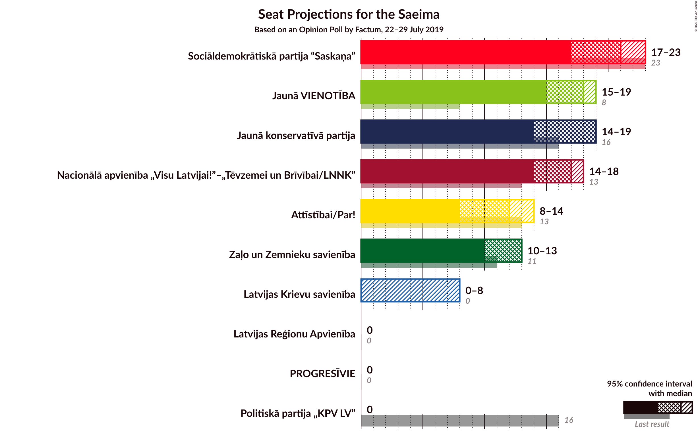
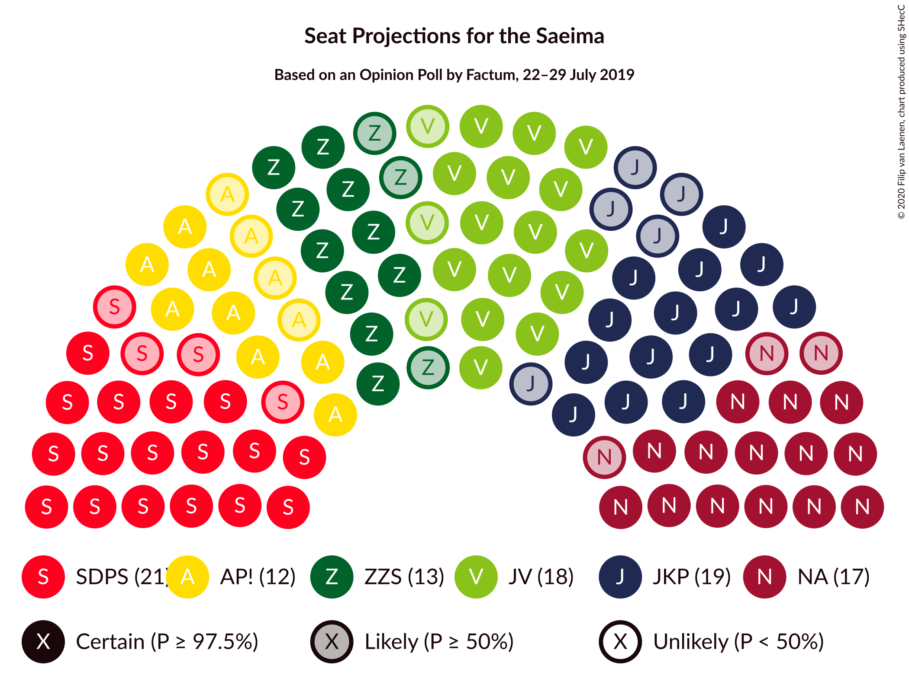
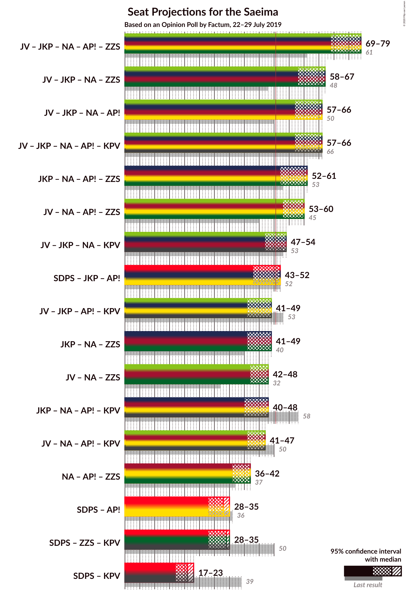
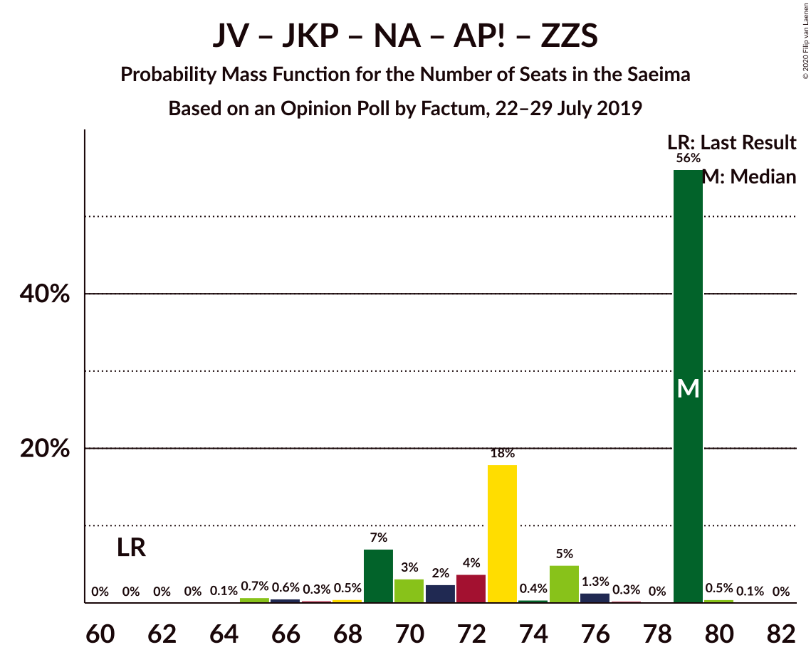
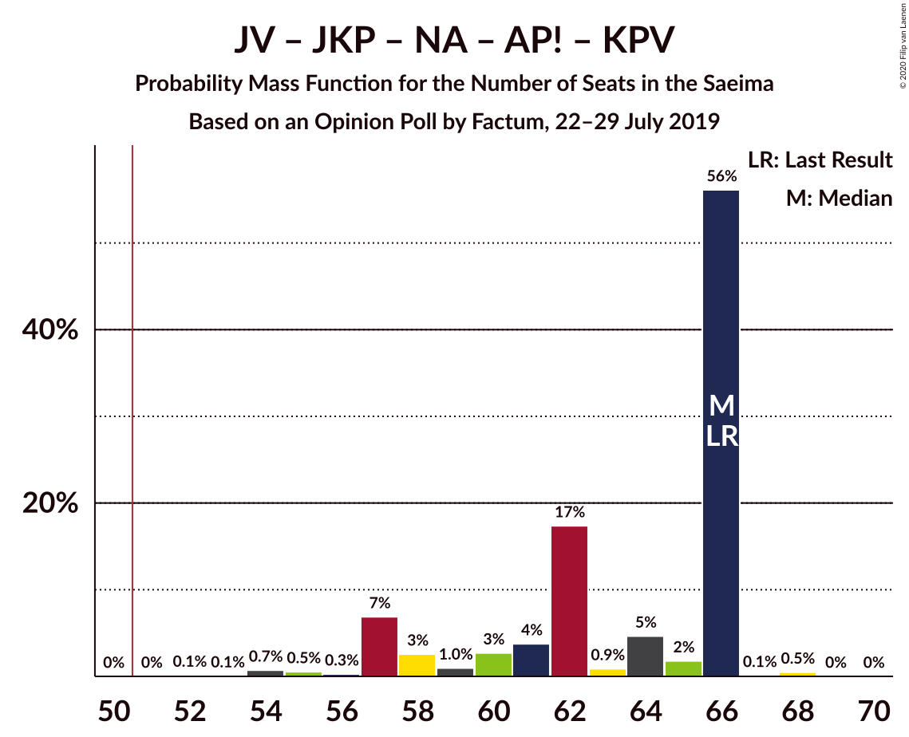
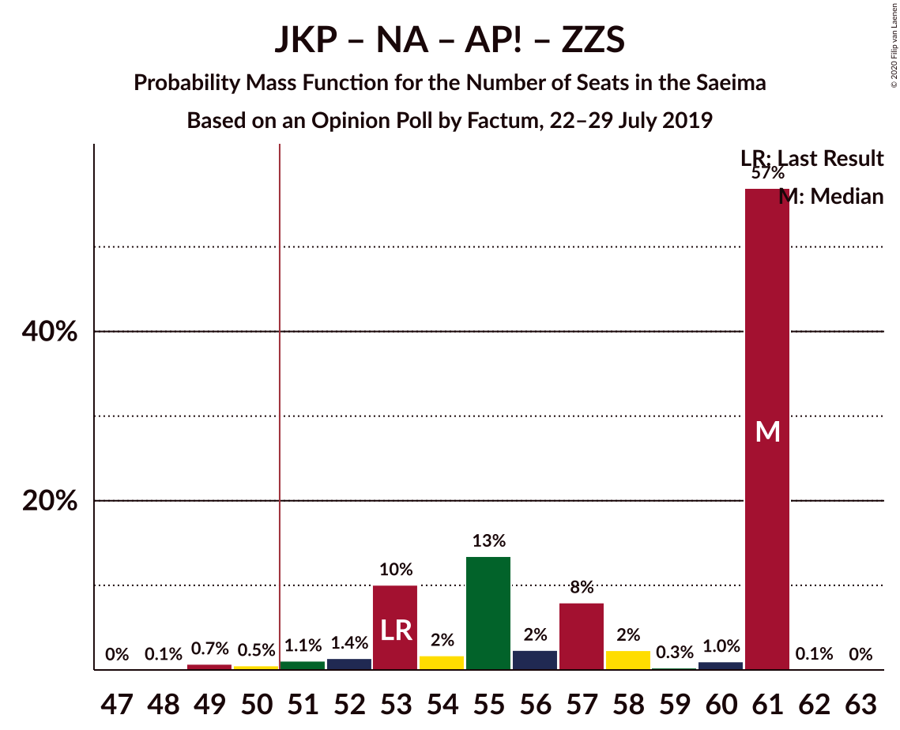
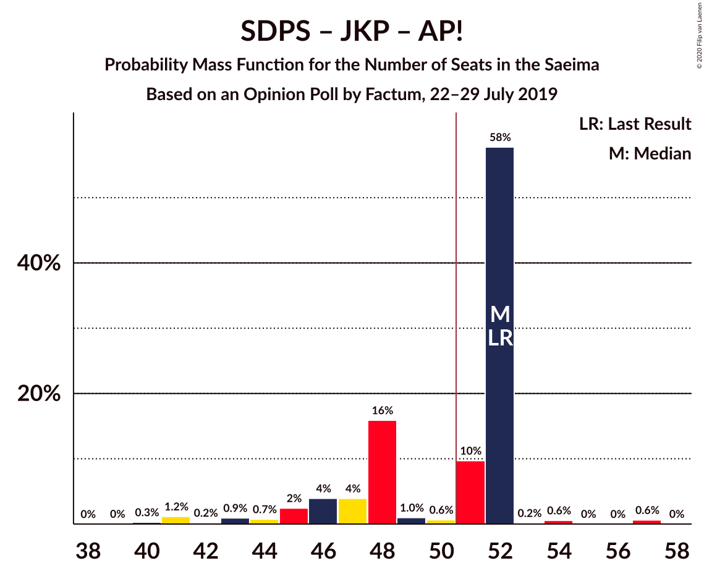
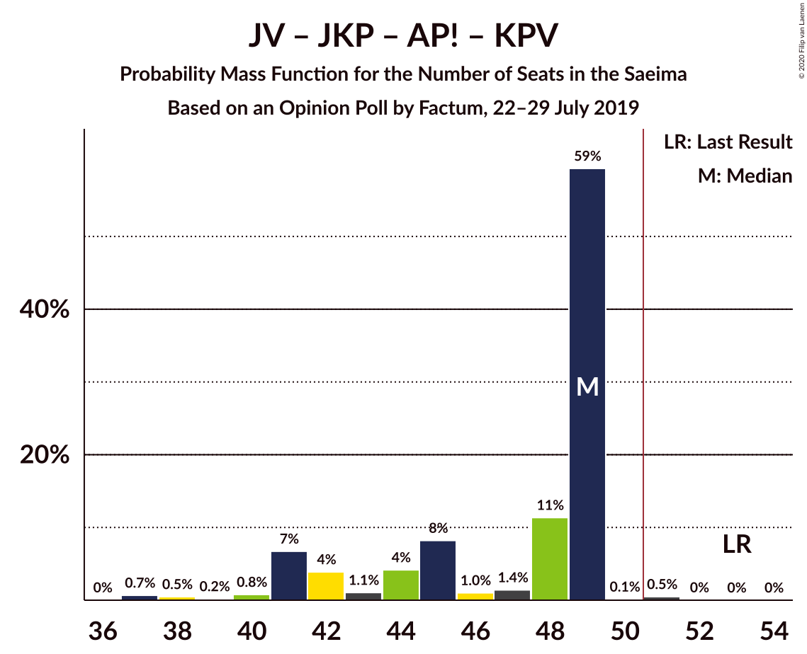
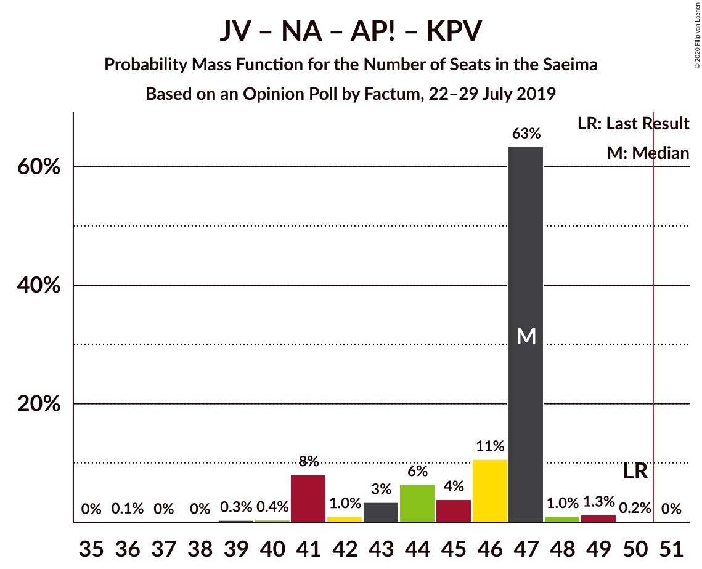
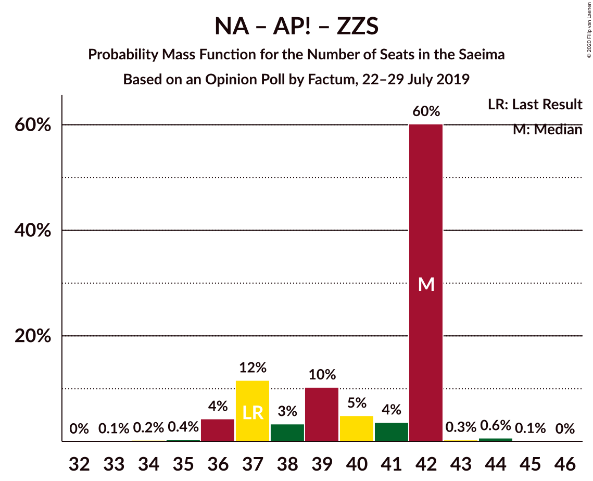

# Opinion Poll by Factum, 22–29 July 2019

<a href="#voting-intentions">Voting Intentions</a> | <a href="#seats">Seats</a> | <a href="#coalitions">Coalitions</a> | <a href="#technical-information">Technical Information</a>

## Voting Intentions

### Confidence Intervals

| Party | Last Result | Poll Result | 80% Confidence Interval | 90% Confidence Interval | 95% Confidence Interval | 99% Confidence Interval |
|:-----:|:-----------:|:-----------:|:-----------------------:|:-----------------------:|:-----------------------:|:-----------------------:|
| Sociāldemokrātiskā partija “Saskaņa” | 19.8% | 17.8% | 16.3–19.4% |15.9–19.9% |15.5–20.3% |14.8–21.1% |
| Jaunā konservatīvā partija | 13.6% | 14.9% | 13.5–16.4% |13.1–16.8% |12.8–17.2% |12.1–18.0% |
| Nacionālā apvienība „Visu Latvijai!”–„Tēvzemei un Brīvībai/LNNK” | 11.0% | 14.9% | 13.5–16.4% |13.1–16.8% |12.8–17.2% |12.1–18.0% |
| Jaunā VIENOTĪBA | 6.7% | 14.9% | 13.5–16.4% |13.1–16.8% |12.8–17.2% |12.1–18.0% |
| Attīstībai/Par! | 12.0% | 9.9% | 8.8–11.2% |8.5–11.6% |8.2–11.9% |7.7–12.6% |
| Zaļo un Zemnieku savienība | 9.9% | 9.9% | 8.8–11.2% |8.5–11.6% |8.2–11.9% |7.7–12.6% |
| Latvijas Krievu savienība | 3.2% | 6.0% | 5.1–7.0% |4.8–7.4% |4.6–7.6% |4.3–8.2% |
| Latvijas Reģionu Apvienība | 4.1% | 3.9% | 3.2–4.9% |3.1–5.1% |2.9–5.3% |2.6–5.8% |
| PROGRESĪVIE | 2.6% | 3.9% | 3.2–4.9% |3.1–5.1% |2.9–5.3% |2.6–5.8% |
| Politiskā partija „KPV LV” | 14.2% | 2.0% | 1.6–2.7% |1.4–2.9% |1.3–3.1% |1.1–3.5% |

*Note:* The poll result column reflects the actual value used in the calculations. Published results may vary slightly, and in addition be rounded to fewer digits.

## Seats

### Confidence Intervals

| Party | Last Result | Median | 80% Confidence Interval | 90% Confidence Interval | 95% Confidence Interval | 99% Confidence Interval |
|:-----:|:-----------:|:------:|:-----------------------:|:-----------------------:|:-----------------------:|:-----------------------:|
| <a href="#sociāldemokrātiskā-partija-“saskaņa”">Sociāldemokrātiskā partija “Saskaņa”</a> | 23 | 21 | 19–22 |17–23 |17–23 |17–24 |
| <a href="#jaunā-konservatīvā-partija">Jaunā konservatīvā partija</a> | 16 | 19 | 16–19 |15–19 |14–19 |13–20 |
| <a href="#nacionālā-apvienība-„visu-latvijai!”–„tēvzemei-un-brīvībai/lnnk”">Nacionālā apvienība „Visu Latvijai!”–„Tēvzemei un Brīvībai/LNNK”</a> | 13 | 17 | 14–17 |14–17 |14–18 |14–19 |
| <a href="#jaunā-vienotība">Jaunā VIENOTĪBA</a> | 8 | 18 | 16–18 |16–18 |15–19 |13–19 |
| <a href="#attīstībai/par!">Attīstībai/Par!</a> | 13 | 12 | 9–14 |9–14 |8–14 |8–14 |
| <a href="#zaļo-un-zemnieku-savienība">Zaļo un Zemnieku savienība</a> | 11 | 13 | 11–13 |11–13 |10–13 |7–13 |
| <a href="#latvijas-krievu-savienība">Latvijas Krievu savienība</a> | 0 | 0 | 0–8 |0–8 |0–8 |0–9 |
| <a href="#latvijas-reģionu-apvienība">Latvijas Reģionu Apvienība</a> | 0 | 0 | 0 |0 |0 |0–6 |
| <a href="#progresīvie">PROGRESĪVIE</a> | 0 | 0 | 0 |0 |0 |0–7 |
| <a href="#politiskā-partija-„kpv-lv”">Politiskā partija „KPV LV”</a> | 16 | 0 | 0 |0 |0 |0 |

### Sociāldemokrātiskā partija “Saskaņa”

*For a full overview of the results for this party, see the [Sociāldemokrātiskā partija “Saskaņa”](party-sociāldemokrātiskāpartija“saskaņa”.html) page.*

| Number of Seats | Probability | Accumulated | Special Marks |
|:---------------:|:-----------:|:-----------:|:-------------:|
| 16 | 0.2% | 100% |  |
| 17 | 5% | 99.8% |  |
| 18 | 0.7% | 95% |  |
| 19 | 10% | 94% |  |
| 20 | 5% | 84% |  |
| 21 | 67% | 79% | Median |
| 22 | 4% | 12% |  |
| 23 | 7% | 8% | Last Result |
| 24 | 1.1% | 1.3% |  |
| 25 | 0% | 0.2% |  |
| 26 | 0.2% | 0.2% |  |
| 27 | 0% | 0% |  |

### Jaunā konservatīvā partija

*For a full overview of the results for this party, see the [Jaunā konservatīvā partija](party-jaunākonservatīvāpartija.html) page.*

| Number of Seats | Probability | Accumulated | Special Marks |
|:---------------:|:-----------:|:-----------:|:-------------:|
| 13 | 2% | 100% |  |
| 14 | 1.2% | 98% |  |
| 15 | 6% | 97% |  |
| 16 | 20% | 90% | Last Result |
| 17 | 7% | 70% |  |
| 18 | 3% | 63% |  |
| 19 | 59% | 60% | Median |
| 20 | 2% | 2% |  |
| 21 | 0% | 0% |  |

### Nacionālā apvienība „Visu Latvijai!”–„Tēvzemei un Brīvībai/LNNK”

*For a full overview of the results for this party, see the [Nacionālā apvienība „Visu Latvijai!”–„Tēvzemei un Brīvībai/LNNK”](party-nacionālāapvienība„visulatvijai”–„tēvzemeiunbrīvībailnnk”.html) page.*

| Number of Seats | Probability | Accumulated | Special Marks |
|:---------------:|:-----------:|:-----------:|:-------------:|
| 13 | 0.2% | 100% | Last Result |
| 14 | 11% | 99.8% |  |
| 15 | 5% | 88% |  |
| 16 | 8% | 84% |  |
| 17 | 71% | 76% | Median |
| 18 | 2% | 4% |  |
| 19 | 1.4% | 2% |  |
| 20 | 0.4% | 0.4% |  |
| 21 | 0% | 0% |  |

### Jaunā VIENOTĪBA

*For a full overview of the results for this party, see the [Jaunā VIENOTĪBA](party-jaunāvienotība.html) page.*

| Number of Seats | Probability | Accumulated | Special Marks |
|:---------------:|:-----------:|:-----------:|:-------------:|
| 8 | 0% | 100% | Last Result |
| 9 | 0% | 100% |  |
| 10 | 0% | 100% |  |
| 11 | 0% | 100% |  |
| 12 | 0.1% | 100% |  |
| 13 | 0.4% | 99.9% |  |
| 14 | 2% | 99.5% |  |
| 15 | 3% | 98% |  |
| 16 | 12% | 95% |  |
| 17 | 4% | 83% |  |
| 18 | 76% | 79% | Median |
| 19 | 3% | 3% |  |
| 20 | 0.1% | 0.2% |  |
| 21 | 0.1% | 0.1% |  |
| 22 | 0.1% | 0.1% |  |
| 23 | 0% | 0% |  |

### Attīstībai/Par!

*For a full overview of the results for this party, see the [Attīstībai/Par!](party-attīstībaipar.html) page.*

| Number of Seats | Probability | Accumulated | Special Marks |
|:---------------:|:-----------:|:-----------:|:-------------:|
| 7 | 0.1% | 100% |  |
| 8 | 2% | 99.9% |  |
| 9 | 14% | 97% |  |
| 10 | 4% | 84% |  |
| 11 | 1.1% | 80% |  |
| 12 | 57% | 79% | Median |
| 13 | 3% | 22% | Last Result |
| 14 | 19% | 19% |  |
| 15 | 0.1% | 0.1% |  |
| 16 | 0% | 0% |  |

### Zaļo un Zemnieku savienība

*For a full overview of the results for this party, see the [Zaļo un Zemnieku savienība](party-zaļounzemniekusavienība.html) page.*

| Number of Seats | Probability | Accumulated | Special Marks |
|:---------------:|:-----------:|:-----------:|:-------------:|
| 7 | 0.5% | 100% |  |
| 8 | 0.1% | 99.5% |  |
| 9 | 0.1% | 99.4% |  |
| 10 | 2% | 99.3% |  |
| 11 | 30% | 97% | Last Result |
| 12 | 8% | 67% |  |
| 13 | 58% | 58% | Median |
| 14 | 0.2% | 0.3% |  |
| 15 | 0.1% | 0.1% |  |
| 16 | 0% | 0% |  |

### Latvijas Krievu savienība

*For a full overview of the results for this party, see the [Latvijas Krievu savienība](party-latvijaskrievusavienība.html) page.*

| Number of Seats | Probability | Accumulated | Special Marks |
|:---------------:|:-----------:|:-----------:|:-------------:|
| 0 | 59% | 100% | Last Result, Median |
| 1 | 0% | 41% |  |
| 2 | 0% | 41% |  |
| 3 | 0% | 41% |  |
| 4 | 0% | 41% |  |
| 5 | 0.8% | 41% |  |
| 6 | 9% | 41% |  |
| 7 | 0.9% | 31% |  |
| 8 | 29% | 30% |  |
| 9 | 0.7% | 0.9% |  |
| 10 | 0.3% | 0.3% |  |
| 11 | 0% | 0% |  |

### Latvijas Reģionu Apvienība

*For a full overview of the results for this party, see the [Latvijas Reģionu Apvienība](party-latvijasreģionuapvienība.html) page.*

| Number of Seats | Probability | Accumulated | Special Marks |
|:---------------:|:-----------:|:-----------:|:-------------:|
| 0 | 98.5% | 100% | Last Result, Median |
| 1 | 0% | 1.5% |  |
| 2 | 0% | 1.5% |  |
| 3 | 0% | 1.5% |  |
| 4 | 0% | 1.5% |  |
| 5 | 0% | 1.5% |  |
| 6 | 1.5% | 1.5% |  |
| 7 | 0% | 0% |  |

### PROGRESĪVIE

*For a full overview of the results for this party, see the [PROGRESĪVIE](party-progresīvie.html) page.*

| Number of Seats | Probability | Accumulated | Special Marks |
|:---------------:|:-----------:|:-----------:|:-------------:|
| 0 | 98% | 100% | Last Result, Median |
| 1 | 0% | 2% |  |
| 2 | 0% | 2% |  |
| 3 | 0% | 2% |  |
| 4 | 0% | 2% |  |
| 5 | 0.2% | 2% |  |
| 6 | 0.4% | 2% |  |
| 7 | 2% | 2% |  |
| 8 | 0% | 0% |  |

### Politiskā partija „KPV LV”

*For a full overview of the results for this party, see the [Politiskā partija „KPV LV”](party-politiskāpartija„kpvlv”.html) page.*

| Number of Seats | Probability | Accumulated | Special Marks |
|:---------------:|:-----------:|:-----------:|:-------------:|
| 0 | 100% | 100% | Median |
| 1 | 0% | 0% |  |
| 2 | 0% | 0% |  |
| 3 | 0% | 0% |  |
| 4 | 0% | 0% |  |
| 5 | 0% | 0% |  |
| 6 | 0% | 0% |  |
| 7 | 0% | 0% |  |
| 8 | 0% | 0% |  |
| 9 | 0% | 0% |  |
| 10 | 0% | 0% |  |
| 11 | 0% | 0% |  |
| 12 | 0% | 0% |  |
| 13 | 0% | 0% |  |
| 14 | 0% | 0% |  |
| 15 | 0% | 0% |  |
| 16 | 0% | 0% | Last Result |

## Coalitions

### Confidence Intervals

| Coalition | Last Result | Median | Majority? | 80% Confidence Interval | 90% Confidence Interval | 95% Confidence Interval | 99% Confidence Interval |
|:---------:|:-----------:|:------:|:---------:|:-----------------------:|:-----------------------:|:-----------------------:|:-----------------------:|
| Jaunā VIENOTĪBA – Jaunā konservatīvā partija – Nacionālā apvienība „Visu Latvijai!”–„Tēvzemei un Brīvībai/LNNK” – Attīstībai/Par! – Zaļo un Zemnieku savienība | 61 | 79 | 100% | 70–79 | 69–79 | 69–79 | 65–80 |
| Jaunā VIENOTĪBA – Jaunā konservatīvā partija – Nacionālā apvienība „Visu Latvijai!”–„Tēvzemei un Brīvībai/LNNK” – Zaļo un Zemnieku savienība | 48 | 67 | 100% | 59–67 | 59–67 | 58–67 | 55–67 |
| Jaunā VIENOTĪBA – Jaunā konservatīvā partija – Nacionālā apvienība „Visu Latvijai!”–„Tēvzemei un Brīvībai/LNNK” – Attīstībai/Par! | 50 | 66 | 100% | 58–66 | 57–66 | 57–66 | 54–67 |
| Jaunā VIENOTĪBA – Jaunā konservatīvā partija – Nacionālā apvienība „Visu Latvijai!”–„Tēvzemei un Brīvībai/LNNK” – Attīstībai/Par! – Politiskā partija „KPV LV” | 66 | 66 | 100% | 58–66 | 57–66 | 57–66 | 54–67 |
| Jaunā konservatīvā partija – Nacionālā apvienība „Visu Latvijai!”–„Tēvzemei un Brīvībai/LNNK” – Attīstībai/Par! – Zaļo un Zemnieku savienība | 53 | 61 | 98.7% | 53–61 | 53–61 | 52–61 | 49–61 |
| Jaunā VIENOTĪBA – Nacionālā apvienība „Visu Latvijai!”–„Tēvzemei un Brīvībai/LNNK” – Attīstībai/Par! – Zaļo un Zemnieku savienība | 45 | 60 | 99.4% | 54–60 | 53–60 | 53–60 | 50–61 |
| Jaunā VIENOTĪBA – Jaunā konservatīvā partija – Nacionālā apvienība „Visu Latvijai!”–„Tēvzemei un Brīvībai/LNNK” – Politiskā partija „KPV LV” | 53 | 54 | 67% | 48–54 | 48–54 | 47–54 | 44–55 |
| Sociāldemokrātiskā partija “Saskaņa” – Jaunā konservatīvā partija – Attīstībai/Par! | 52 | 52 | 69% | 47–52 | 45–52 | 43–52 | 41–57 |
| Jaunā VIENOTĪBA – Jaunā konservatīvā partija – Attīstībai/Par! – Politiskā partija „KPV LV” | 53 | 49 | 0.5% | 42–49 | 41–49 | 41–49 | 37–51 |
| Jaunā konservatīvā partija – Nacionālā apvienība „Visu Latvijai!”–„Tēvzemei un Brīvībai/LNNK” – Zaļo un Zemnieku savienība | 40 | 49 | 0.1% | 41–49 | 41–49 | 41–49 | 40–49 |
| Jaunā VIENOTĪBA – Nacionālā apvienība „Visu Latvijai!”–„Tēvzemei un Brīvībai/LNNK” – Zaļo un Zemnieku savienība | 32 | 48 | 0% | 43–48 | 43–48 | 42–48 | 40–49 |
| Jaunā konservatīvā partija – Nacionālā apvienība „Visu Latvijai!”–„Tēvzemei un Brīvībai/LNNK” – Attīstībai/Par! – Politiskā partija „KPV LV” | 58 | 48 | 0% | 41–48 | 41–48 | 40–48 | 38–50 |
| Jaunā VIENOTĪBA – Nacionālā apvienība „Visu Latvijai!”–„Tēvzemei un Brīvībai/LNNK” – Attīstībai/Par! – Politiskā partija „KPV LV” | 50 | 47 | 0% | 43–47 | 41–47 | 41–47 | 40–49 |
| Nacionālā apvienība „Visu Latvijai!”–„Tēvzemei un Brīvībai/LNNK” – Attīstībai/Par! – Zaļo un Zemnieku savienība | 37 | 42 | 0% | 37–42 | 37–42 | 36–42 | 35–44 |
| Sociāldemokrātiskā partija “Saskaņa” – Attīstībai/Par! | 36 | 33 | 0% | 31–35 | 28–35 | 28–35 | 26–37 |
| Sociāldemokrātiskā partija “Saskaņa” – Zaļo un Zemnieku savienība – Politiskā partija „KPV LV” | 50 | 34 | 0% | 30–34 | 28–35 | 28–35 | 27–35 |
| Sociāldemokrātiskā partija “Saskaņa” – Politiskā partija „KPV LV” | 39 | 21 | 0% | 19–22 | 17–23 | 17–23 | 17–24 |

### Jaunā VIENOTĪBA – Jaunā konservatīvā partija – Nacionālā apvienība „Visu Latvijai!”–„Tēvzemei un Brīvībai/LNNK” – Attīstībai/Par! – Zaļo un Zemnieku savienība

| Number of Seats | Probability | Accumulated | Special Marks |
|:---------------:|:-----------:|:-----------:|:-------------:|
| 61 | 0% | 100% | Last Result |
| 62 | 0% | 100% |  |
| 63 | 0% | 100% |  |
| 64 | 0.1% | 100% |  |
| 65 | 0.7% | 99.8% |  |
| 66 | 0.6% | 99.1% |  |
| 67 | 0.3% | 98.6% |  |
| 68 | 0.5% | 98% |  |
| 69 | 7% | 98% |  |
| 70 | 3% | 91% |  |
| 71 | 2% | 88% |  |
| 72 | 4% | 85% |  |
| 73 | 18% | 82% |  |
| 74 | 0.4% | 64% |  |
| 75 | 5% | 63% |  |
| 76 | 1.3% | 58% |  |
| 77 | 0.3% | 57% |  |
| 78 | 0% | 57% |  |
| 79 | 56% | 57% | Median |
| 80 | 0.5% | 0.5% |  |
| 81 | 0.1% | 0.1% |  |
| 82 | 0% | 0% |  |

### Jaunā VIENOTĪBA – Jaunā konservatīvā partija – Nacionālā apvienība „Visu Latvijai!”–„Tēvzemei un Brīvībai/LNNK” – Zaļo un Zemnieku savienība

| Number of Seats | Probability | Accumulated | Special Marks |
|:---------------:|:-----------:|:-----------:|:-------------:|
| 48 | 0% | 100% | Last Result |
| 49 | 0% | 100% |  |
| 50 | 0% | 100% |  |
| 51 | 0% | 100% | Majority |
| 52 | 0% | 100% |  |
| 53 | 0% | 100% |  |
| 54 | 0.4% | 100% |  |
| 55 | 0.1% | 99.6% |  |
| 56 | 0.2% | 99.5% |  |
| 57 | 2% | 99.2% |  |
| 58 | 2% | 98% |  |
| 59 | 15% | 96% |  |
| 60 | 7% | 81% |  |
| 61 | 8% | 74% |  |
| 62 | 1.4% | 66% |  |
| 63 | 2% | 65% |  |
| 64 | 4% | 63% |  |
| 65 | 1.1% | 59% |  |
| 66 | 0.8% | 57% |  |
| 67 | 56% | 57% | Median |
| 68 | 0.3% | 0.4% |  |
| 69 | 0% | 0% |  |

### Jaunā VIENOTĪBA – Jaunā konservatīvā partija – Nacionālā apvienība „Visu Latvijai!”–„Tēvzemei un Brīvībai/LNNK” – Attīstībai/Par!

| Number of Seats | Probability | Accumulated | Special Marks |
|:---------------:|:-----------:|:-----------:|:-------------:|
| 50 | 0% | 100% | Last Result |
| 51 | 0% | 100% | Majority |
| 52 | 0.1% | 100% |  |
| 53 | 0.1% | 99.9% |  |
| 54 | 0.7% | 99.8% |  |
| 55 | 0.5% | 99.1% |  |
| 56 | 0.3% | 98.6% |  |
| 57 | 7% | 98% |  |
| 58 | 3% | 91% |  |
| 59 | 1.0% | 89% |  |
| 60 | 3% | 88% |  |
| 61 | 4% | 85% |  |
| 62 | 17% | 81% |  |
| 63 | 0.9% | 64% |  |
| 64 | 5% | 63% |  |
| 65 | 2% | 59% |  |
| 66 | 56% | 57% | Median |
| 67 | 0.1% | 0.6% |  |
| 68 | 0.5% | 0.5% |  |
| 69 | 0% | 0% |  |

### Jaunā VIENOTĪBA – Jaunā konservatīvā partija – Nacionālā apvienība „Visu Latvijai!”–„Tēvzemei un Brīvībai/LNNK” – Attīstībai/Par! – Politiskā partija „KPV LV”

| Number of Seats | Probability | Accumulated | Special Marks |
|:---------------:|:-----------:|:-----------:|:-------------:|
| 52 | 0.1% | 100% |  |
| 53 | 0.1% | 99.9% |  |
| 54 | 0.7% | 99.8% |  |
| 55 | 0.5% | 99.1% |  |
| 56 | 0.3% | 98.6% |  |
| 57 | 7% | 98% |  |
| 58 | 3% | 91% |  |
| 59 | 1.0% | 89% |  |
| 60 | 3% | 88% |  |
| 61 | 4% | 85% |  |
| 62 | 17% | 81% |  |
| 63 | 0.9% | 64% |  |
| 64 | 5% | 63% |  |
| 65 | 2% | 59% |  |
| 66 | 56% | 57% | Last Result, Median |
| 67 | 0.1% | 0.6% |  |
| 68 | 0.5% | 0.5% |  |
| 69 | 0% | 0% |  |

### Jaunā konservatīvā partija – Nacionālā apvienība „Visu Latvijai!”–„Tēvzemei un Brīvībai/LNNK” – Attīstībai/Par! – Zaļo un Zemnieku savienība

| Number of Seats | Probability | Accumulated | Special Marks |
|:---------------:|:-----------:|:-----------:|:-------------:|
| 48 | 0.1% | 100% |  |
| 49 | 0.7% | 99.9% |  |
| 50 | 0.5% | 99.2% |  |
| 51 | 1.1% | 98.7% | Majority |
| 52 | 1.4% | 98% |  |
| 53 | 10% | 96% | Last Result |
| 54 | 2% | 86% |  |
| 55 | 13% | 84% |  |
| 56 | 2% | 71% |  |
| 57 | 8% | 69% |  |
| 58 | 2% | 61% |  |
| 59 | 0.3% | 58% |  |
| 60 | 1.0% | 58% |  |
| 61 | 57% | 57% | Median |
| 62 | 0.1% | 0.1% |  |
| 63 | 0% | 0% |  |

### Jaunā VIENOTĪBA – Nacionālā apvienība „Visu Latvijai!”–„Tēvzemei un Brīvībai/LNNK” – Attīstībai/Par! – Zaļo un Zemnieku savienība

| Number of Seats | Probability | Accumulated | Special Marks |
|:---------------:|:-----------:|:-----------:|:-------------:|
| 45 | 0% | 100% | Last Result |
| 46 | 0% | 100% |  |
| 47 | 0% | 100% |  |
| 48 | 0.1% | 100% |  |
| 49 | 0% | 99.9% |  |
| 50 | 0.4% | 99.9% |  |
| 51 | 0.4% | 99.4% | Majority |
| 52 | 0.9% | 99.1% |  |
| 53 | 7% | 98% |  |
| 54 | 6% | 92% |  |
| 55 | 5% | 86% |  |
| 56 | 3% | 80% |  |
| 57 | 11% | 77% |  |
| 58 | 8% | 66% |  |
| 59 | 0.7% | 58% |  |
| 60 | 57% | 57% | Median |
| 61 | 0.6% | 0.7% |  |
| 62 | 0% | 0.1% |  |
| 63 | 0.1% | 0.1% |  |
| 64 | 0% | 0% |  |

### Jaunā VIENOTĪBA – Jaunā konservatīvā partija – Nacionālā apvienība „Visu Latvijai!”–„Tēvzemei un Brīvībai/LNNK” – Politiskā partija „KPV LV”

| Number of Seats | Probability | Accumulated | Special Marks |
|:---------------:|:-----------:|:-----------:|:-------------:|
| 42 | 0.1% | 100% |  |
| 43 | 0.3% | 99.9% |  |
| 44 | 0.1% | 99.6% |  |
| 45 | 0.3% | 99.5% |  |
| 46 | 2% | 99.2% |  |
| 47 | 1.3% | 98% |  |
| 48 | 22% | 96% |  |
| 49 | 2% | 74% |  |
| 50 | 6% | 73% |  |
| 51 | 2% | 67% | Majority |
| 52 | 2% | 64% |  |
| 53 | 4% | 62% | Last Result |
| 54 | 57% | 59% | Median |
| 55 | 1.4% | 1.4% |  |
| 56 | 0.1% | 0.1% |  |
| 57 | 0% | 0% |  |

### Sociāldemokrātiskā partija “Saskaņa” – Jaunā konservatīvā partija – Attīstībai/Par!

| Number of Seats | Probability | Accumulated | Special Marks |
|:---------------:|:-----------:|:-----------:|:-------------:|
| 40 | 0.3% | 100% |  |
| 41 | 1.2% | 99.7% |  |
| 42 | 0.2% | 98.5% |  |
| 43 | 0.9% | 98% |  |
| 44 | 0.7% | 97% |  |
| 45 | 2% | 97% |  |
| 46 | 4% | 94% |  |
| 47 | 4% | 90% |  |
| 48 | 16% | 86% |  |
| 49 | 1.0% | 70% |  |
| 50 | 0.6% | 69% |  |
| 51 | 10% | 69% | Majority |
| 52 | 58% | 59% | Last Result, Median |
| 53 | 0.2% | 1.4% |  |
| 54 | 0.6% | 1.2% |  |
| 55 | 0% | 0.7% |  |
| 56 | 0% | 0.6% |  |
| 57 | 0.6% | 0.6% |  |
| 58 | 0% | 0% |  |

### Jaunā VIENOTĪBA – Jaunā konservatīvā partija – Attīstībai/Par! – Politiskā partija „KPV LV”

| Number of Seats | Probability | Accumulated | Special Marks |
|:---------------:|:-----------:|:-----------:|:-------------:|
| 37 | 0.7% | 100% |  |
| 38 | 0.5% | 99.3% |  |
| 39 | 0.2% | 98.8% |  |
| 40 | 0.8% | 98.6% |  |
| 41 | 7% | 98% |  |
| 42 | 4% | 91% |  |
| 43 | 1.1% | 87% |  |
| 44 | 4% | 86% |  |
| 45 | 8% | 82% |  |
| 46 | 1.0% | 74% |  |
| 47 | 1.4% | 73% |  |
| 48 | 11% | 71% |  |
| 49 | 59% | 60% | Median |
| 50 | 0.1% | 0.7% |  |
| 51 | 0.5% | 0.5% | Majority |
| 52 | 0% | 0% |  |
| 53 | 0% | 0% | Last Result |

### Jaunā konservatīvā partija – Nacionālā apvienība „Visu Latvijai!”–„Tēvzemei un Brīvībai/LNNK” – Zaļo un Zemnieku savienība

| Number of Seats | Probability | Accumulated | Special Marks |
|:---------------:|:-----------:|:-----------:|:-------------:|
| 39 | 0.3% | 100% |  |
| 40 | 1.0% | 99.6% | Last Result |
| 41 | 10% | 98.7% |  |
| 42 | 2% | 88% |  |
| 43 | 10% | 87% |  |
| 44 | 11% | 77% |  |
| 45 | 2% | 66% |  |
| 46 | 4% | 64% |  |
| 47 | 1.2% | 60% |  |
| 48 | 2% | 59% |  |
| 49 | 56% | 56% | Median |
| 50 | 0.1% | 0.1% |  |
| 51 | 0% | 0.1% | Majority |
| 52 | 0% | 0% |  |

### Jaunā VIENOTĪBA – Nacionālā apvienība „Visu Latvijai!”–„Tēvzemei un Brīvībai/LNNK” – Zaļo un Zemnieku savienība

| Number of Seats | Probability | Accumulated | Special Marks |
|:---------------:|:-----------:|:-----------:|:-------------:|
| 32 | 0% | 100% | Last Result |
| 33 | 0% | 100% |  |
| 34 | 0% | 100% |  |
| 35 | 0% | 100% |  |
| 36 | 0% | 100% |  |
| 37 | 0% | 100% |  |
| 38 | 0.1% | 100% |  |
| 39 | 0% | 99.9% |  |
| 40 | 1.2% | 99.9% |  |
| 41 | 0.7% | 98.7% |  |
| 42 | 2% | 98% |  |
| 43 | 10% | 96% |  |
| 44 | 17% | 86% |  |
| 45 | 4% | 69% |  |
| 46 | 5% | 65% |  |
| 47 | 2% | 60% |  |
| 48 | 57% | 58% | Median |
| 49 | 1.0% | 1.1% |  |
| 50 | 0.1% | 0.1% |  |
| 51 | 0% | 0% | Majority |

### Jaunā konservatīvā partija – Nacionālā apvienība „Visu Latvijai!”–„Tēvzemei un Brīvībai/LNNK” – Attīstībai/Par! – Politiskā partija „KPV LV”

| Number of Seats | Probability | Accumulated | Special Marks |
|:---------------:|:-----------:|:-----------:|:-------------:|
| 37 | 0.1% | 100% |  |
| 38 | 0.7% | 99.9% |  |
| 39 | 0.9% | 99.3% |  |
| 40 | 2% | 98% |  |
| 41 | 7% | 96% |  |
| 42 | 2% | 89% |  |
| 43 | 2% | 87% |  |
| 44 | 14% | 85% |  |
| 45 | 2% | 71% |  |
| 46 | 8% | 69% |  |
| 47 | 3% | 61% |  |
| 48 | 56% | 58% | Median |
| 49 | 1.4% | 2% |  |
| 50 | 0.5% | 0.5% |  |
| 51 | 0% | 0% | Majority |
| 52 | 0% | 0% |  |
| 53 | 0% | 0% |  |
| 54 | 0% | 0% |  |
| 55 | 0% | 0% |  |
| 56 | 0% | 0% |  |
| 57 | 0% | 0% |  |
| 58 | 0% | 0% | Last Result |

### Jaunā VIENOTĪBA – Nacionālā apvienība „Visu Latvijai!”–„Tēvzemei un Brīvībai/LNNK” – Attīstībai/Par! – Politiskā partija „KPV LV”

| Number of Seats | Probability | Accumulated | Special Marks |
|:---------------:|:-----------:|:-----------:|:-------------:|
| 36 | 0.1% | 100% |  |
| 37 | 0% | 99.9% |  |
| 38 | 0% | 99.9% |  |
| 39 | 0.3% | 99.9% |  |
| 40 | 0.4% | 99.5% |  |
| 41 | 8% | 99.1% |  |
| 42 | 1.0% | 91% |  |
| 43 | 3% | 90% |  |
| 44 | 6% | 87% |  |
| 45 | 4% | 80% |  |
| 46 | 11% | 76% |  |
| 47 | 63% | 66% | Median |
| 48 | 1.0% | 2% |  |
| 49 | 1.3% | 1.5% |  |
| 50 | 0.2% | 0.2% | Last Result |
| 51 | 0% | 0% | Majority |

### Nacionālā apvienība „Visu Latvijai!”–„Tēvzemei un Brīvībai/LNNK” – Attīstībai/Par! – Zaļo un Zemnieku savienība

| Number of Seats | Probability | Accumulated | Special Marks |
|:---------------:|:-----------:|:-----------:|:-------------:|
| 33 | 0.1% | 100% |  |
| 34 | 0.2% | 99.9% |  |
| 35 | 0.4% | 99.7% |  |
| 36 | 4% | 99.3% |  |
| 37 | 12% | 95% | Last Result |
| 38 | 3% | 83% |  |
| 39 | 10% | 80% |  |
| 40 | 5% | 70% |  |
| 41 | 4% | 65% |  |
| 42 | 60% | 61% | Median |
| 43 | 0.3% | 1.1% |  |
| 44 | 0.6% | 0.8% |  |
| 45 | 0.1% | 0.1% |  |
| 46 | 0% | 0% |  |

### Sociāldemokrātiskā partija “Saskaņa” – Attīstībai/Par!

| Number of Seats | Probability | Accumulated | Special Marks |
|:---------------:|:-----------:|:-----------:|:-------------:|
| 26 | 0.7% | 100% |  |
| 27 | 1.5% | 99.3% |  |
| 28 | 5% | 98% |  |
| 29 | 2% | 93% |  |
| 30 | 1.2% | 91% |  |
| 31 | 8% | 90% |  |
| 32 | 7% | 82% |  |
| 33 | 63% | 75% | Median |
| 34 | 2% | 12% |  |
| 35 | 9% | 11% |  |
| 36 | 0.4% | 1.2% | Last Result |
| 37 | 0.6% | 0.7% |  |
| 38 | 0.1% | 0.1% |  |
| 39 | 0% | 0% |  |

### Sociāldemokrātiskā partija “Saskaņa” – Zaļo un Zemnieku savienība – Politiskā partija „KPV LV”

| Number of Seats | Probability | Accumulated | Special Marks |
|:---------------:|:-----------:|:-----------:|:-------------:|
| 26 | 0.5% | 100% |  |
| 27 | 0.4% | 99.5% |  |
| 28 | 5% | 99.1% |  |
| 29 | 1.1% | 94% |  |
| 30 | 9% | 93% |  |
| 31 | 5% | 84% |  |
| 32 | 12% | 79% |  |
| 33 | 0.9% | 67% |  |
| 34 | 59% | 67% | Median |
| 35 | 8% | 8% |  |
| 36 | 0.1% | 0.4% |  |
| 37 | 0.2% | 0.2% |  |
| 38 | 0% | 0% |  |
| 39 | 0% | 0% |  |
| 40 | 0% | 0% |  |
| 41 | 0% | 0% |  |
| 42 | 0% | 0% |  |
| 43 | 0% | 0% |  |
| 44 | 0% | 0% |  |
| 45 | 0% | 0% |  |
| 46 | 0% | 0% |  |
| 47 | 0% | 0% |  |
| 48 | 0% | 0% |  |
| 49 | 0% | 0% |  |
| 50 | 0% | 0% | Last Result |

### Sociāldemokrātiskā partija “Saskaņa” – Politiskā partija „KPV LV”

| Number of Seats | Probability | Accumulated | Special Marks |
|:---------------:|:-----------:|:-----------:|:-------------:|
| 16 | 0.2% | 100% |  |
| 17 | 5% | 99.8% |  |
| 18 | 0.7% | 95% |  |
| 19 | 10% | 94% |  |
| 20 | 5% | 84% |  |
| 21 | 67% | 79% | Median |
| 22 | 4% | 12% |  |
| 23 | 7% | 8% |  |
| 24 | 1.1% | 1.3% |  |
| 25 | 0% | 0.2% |  |
| 26 | 0.2% | 0.2% |  |
| 27 | 0% | 0% |  |
| 28 | 0% | 0% |  |
| 29 | 0% | 0% |  |
| 30 | 0% | 0% |  |
| 31 | 0% | 0% |  |
| 32 | 0% | 0% |  |
| 33 | 0% | 0% |  |
| 34 | 0% | 0% |  |
| 35 | 0% | 0% |  |
| 36 | 0% | 0% |  |
| 37 | 0% | 0% |  |
| 38 | 0% | 0% |  |
| 39 | 0% | 0% | Last Result |

## Technical Information

### Opinion Poll

+ **Polling firm:** Factum
+ **Commissioner(s):** —
+ **Fieldwork period:** 22–29 July 2019

### Calculations

+ **Sample size:** 989
+ **Simulations done:** 131,072
+ **Error estimate:** 2.15%

