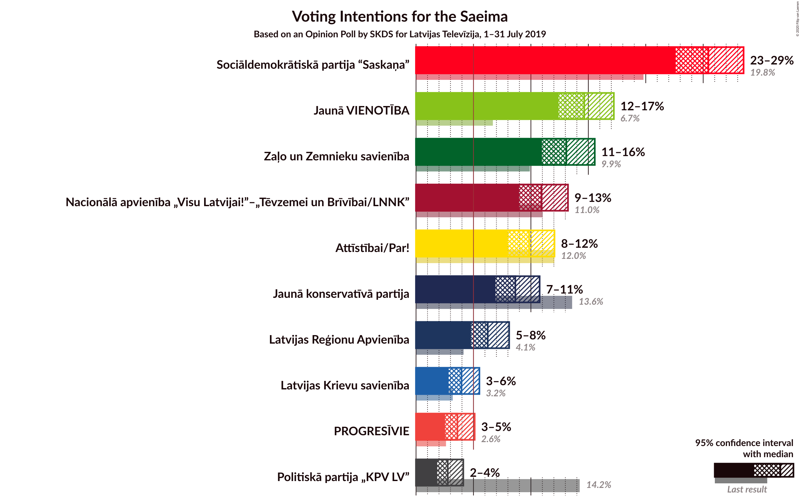
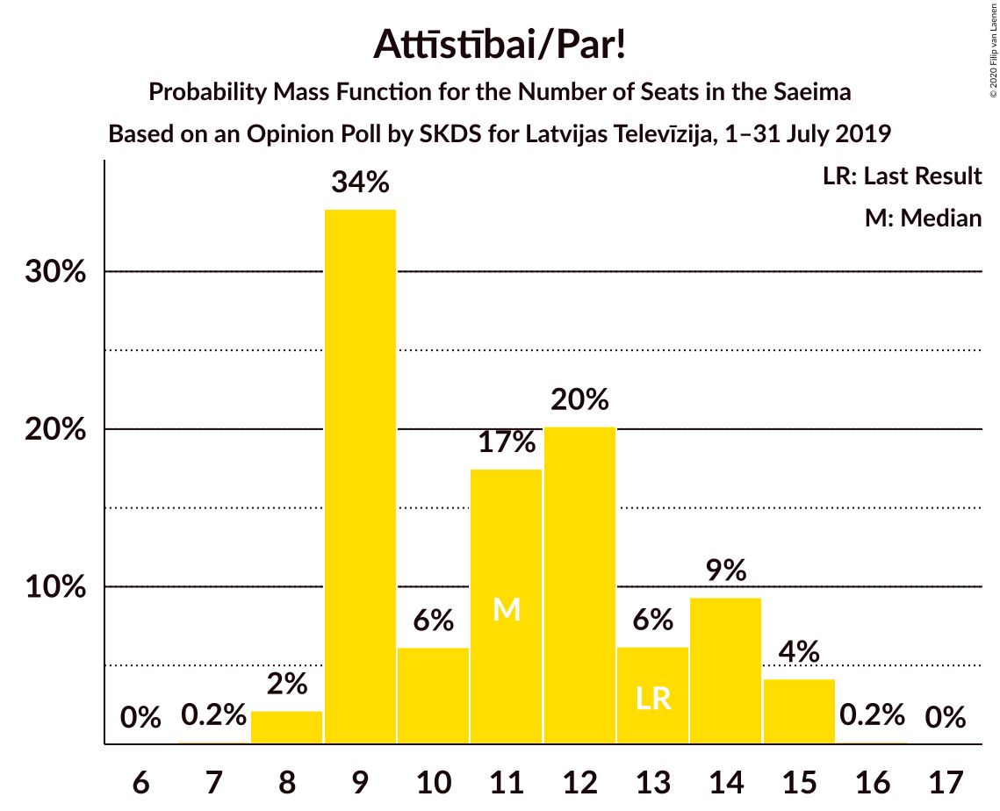
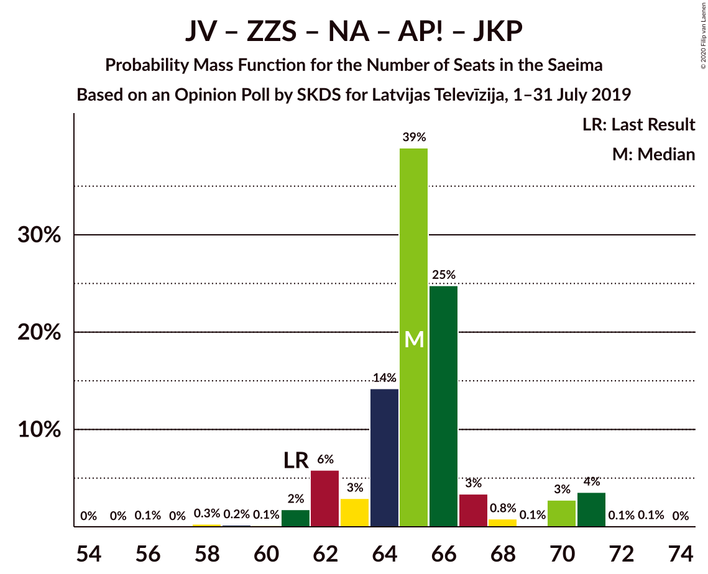
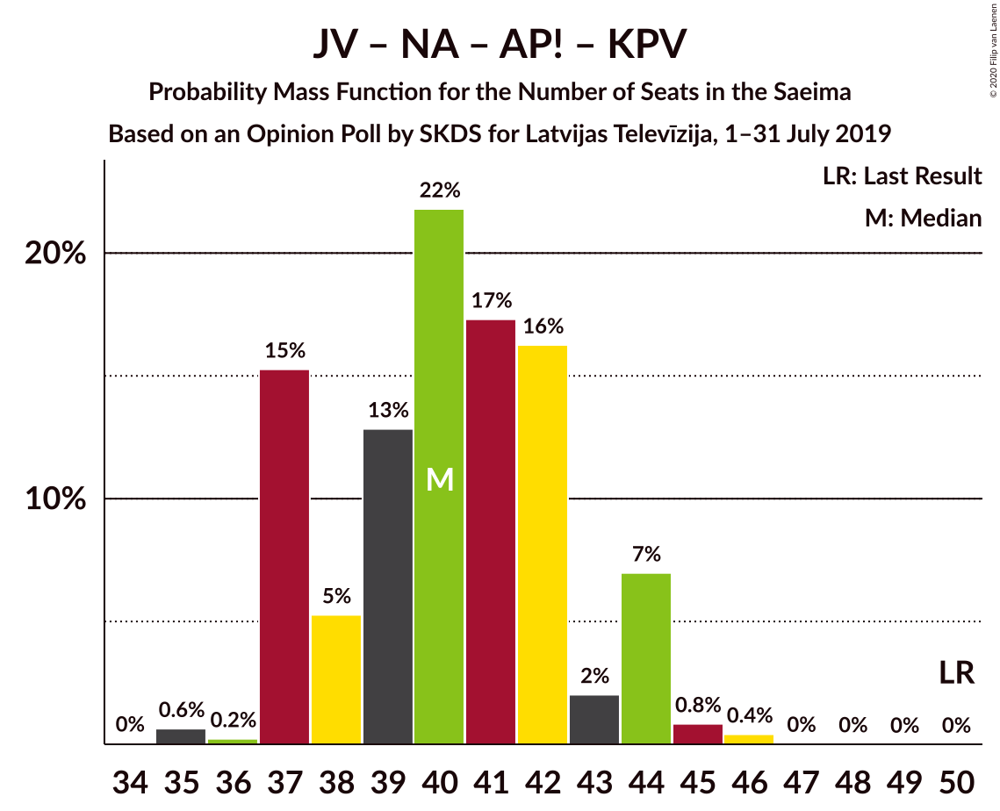
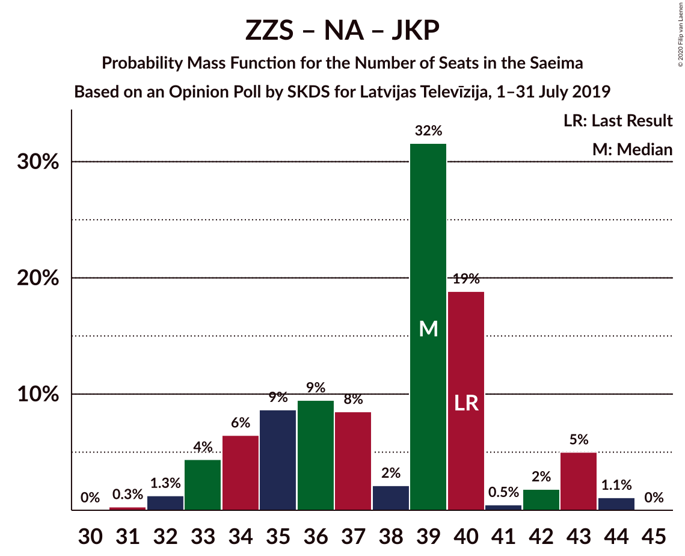
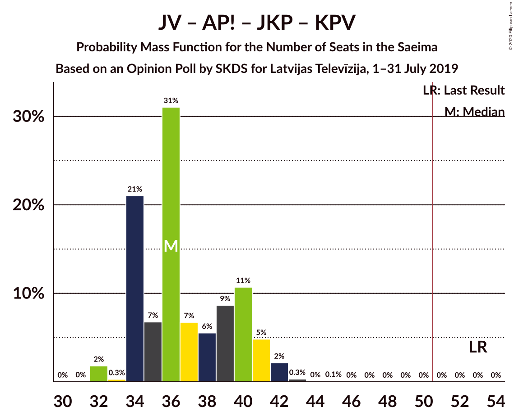

# Opinion Poll by SKDS for Latvijas Televīzija, 1–31 July 2019

<a href="#voting-intentions">Voting Intentions</a> | <a href="#seats">Seats</a> | <a href="#coalitions">Coalitions</a> | <a href="#technical-information">Technical Information</a>

## Voting Intentions

### Confidence Intervals

| Party | Last Result | Poll Result | 80% Confidence Interval | 90% Confidence Interval | 95% Confidence Interval | 99% Confidence Interval |
|:-----:|:-----------:|:-----------:|:-----------------------:|:-----------------------:|:-----------------------:|:-----------------------:|
| Sociāldemokrātiskā partija “Saskaņa” | 19.8% | 25.5% | 23.6–27.5% |23.1–28.0% |22.6–28.5% |21.7–29.5% |
| Jaunā VIENOTĪBA | 6.7% | 14.6% | 13.2–16.3% |12.8–16.8% |12.4–17.2% |11.7–18.0% |
| Zaļo un Zemnieku savienība | 9.9% | 13.1% | 11.7–14.7% |11.3–15.2% |11.0–15.6% |10.3–16.4% |
| Nacionālā apvienība „Visu Latvijai!”–„Tēvzemei un Brīvībai/LNNK” | 11.0% | 10.9% | 9.6–12.4% |9.3–12.9% |9.0–13.2% |8.4–14.0% |
| Attīstībai/Par! | 12.0% | 9.8% | 8.6–11.3% |8.3–11.7% |8.0–12.1% |7.5–12.8% |
| Jaunā konservatīvā partija | 13.6% | 8.6% | 7.5–10.0% |7.2–10.4% |6.9–10.8% |6.4–11.4% |
| Latvijas Reģionu Apvienība | 4.1% | 6.2% | 5.3–7.5% |5.0–7.8% |4.8–8.1% |4.4–8.7% |
| Latvijas Krievu savienība | 3.2% | 4.0% | 3.2–5.0% |3.0–5.3% |2.8–5.5% |2.5–6.0% |
| PROGRESĪVIE | 2.6% | 3.6% | 2.9–4.6% |2.7–4.9% |2.5–5.1% |2.2–5.6% |
| Politiskā partija „KPV LV” | 14.2% | 2.8% | 2.1–3.6% |2.0–3.9% |1.8–4.1% |1.6–4.6% |

*Note:* The poll result column reflects the actual value used in the calculations. Published results may vary slightly, and in addition be rounded to fewer digits.

## Seats

### Confidence Intervals

| Party | Last Result | Median | 80% Confidence Interval | 90% Confidence Interval | 95% Confidence Interval | 99% Confidence Interval |
|:-----:|:-----------:|:------:|:-----------------------:|:-----------------------:|:-----------------------:|:-----------------------:|
| <a href="#sociāldemokrātiskā-partija-“saskaņa”">Sociāldemokrātiskā partija “Saskaņa”</a> | 23 | 28 | 26–29 |25–30 |25–30 |24–31 |
| <a href="#jaunā-vienotība">Jaunā VIENOTĪBA</a> | 8 | 17 | 13–18 |13–19 |13–19 |12–21 |
| <a href="#zaļo-un-zemnieku-savienība">Zaļo un Zemnieku savienība</a> | 11 | 16 | 13–17 |12–17 |12–17 |11–20 |
| <a href="#nacionālā-apvienība-„visu-latvijai!”–„tēvzemei-un-brīvībai/lnnk”">Nacionālā apvienība „Visu Latvijai!”–„Tēvzemei un Brīvībai/LNNK”</a> | 13 | 13 | 11–14 |11–14 |11–14 |11–15 |
| <a href="#attīstībai/par!">Attīstībai/Par!</a> | 13 | 11 | 9–14 |9–14 |9–15 |8–15 |
| <a href="#jaunā-konservatīvā-partija">Jaunā konservatīvā partija</a> | 16 | 9 | 8–12 |7–12 |7–13 |7–13 |
| <a href="#latvijas-reģionu-apvienība">Latvijas Reģionu Apvienība</a> | 0 | 7 | 6–7 |0–7 |0–9 |0–9 |
| <a href="#latvijas-krievu-savienība">Latvijas Krievu savienība</a> | 0 | 0 | 0 |0–7 |0–7 |0–7 |
| <a href="#progresīvie">PROGRESĪVIE</a> | 0 | 0 | 0 |0 |0 |0–6 |
| <a href="#politiskā-partija-„kpv-lv”">Politiskā partija „KPV LV”</a> | 16 | 0 | 0 |0 |0 |0 |

### Sociāldemokrātiskā partija “Saskaņa”

*For a full overview of the results for this party, see the [Sociāldemokrātiskā partija “Saskaņa”](party-sociāldemokrātiskāpartija“saskaņa”.html) page.*

| Number of Seats | Probability | Accumulated | Special Marks |
|:---------------:|:-----------:|:-----------:|:-------------:|
| 23 | 0.1% | 100% | Last Result |
| 24 | 2% | 99.8% |  |
| 25 | 6% | 98% |  |
| 26 | 3% | 92% |  |
| 27 | 25% | 88% |  |
| 28 | 29% | 64% | Median |
| 29 | 29% | 34% |  |
| 30 | 5% | 5% |  |
| 31 | 0.1% | 0.5% |  |
| 32 | 0.2% | 0.5% |  |
| 33 | 0% | 0.3% |  |
| 34 | 0.1% | 0.3% |  |
| 35 | 0.2% | 0.2% |  |
| 36 | 0% | 0% |  |

### Jaunā VIENOTĪBA

*For a full overview of the results for this party, see the [Jaunā VIENOTĪBA](party-jaunāvienotība.html) page.*

| Number of Seats | Probability | Accumulated | Special Marks |
|:---------------:|:-----------:|:-----------:|:-------------:|
| 8 | 0% | 100% | Last Result |
| 9 | 0% | 100% |  |
| 10 | 0% | 100% |  |
| 11 | 0.1% | 100% |  |
| 12 | 0.5% | 99.9% |  |
| 13 | 13% | 99.4% |  |
| 14 | 2% | 86% |  |
| 15 | 13% | 84% |  |
| 16 | 19% | 71% |  |
| 17 | 29% | 52% | Median |
| 18 | 18% | 24% |  |
| 19 | 4% | 6% |  |
| 20 | 1.0% | 2% |  |
| 21 | 0.9% | 0.9% |  |
| 22 | 0% | 0% |  |

### Zaļo un Zemnieku savienība

*For a full overview of the results for this party, see the [Zaļo un Zemnieku savienība](party-zaļounzemniekusavienība.html) page.*

| Number of Seats | Probability | Accumulated | Special Marks |
|:---------------:|:-----------:|:-----------:|:-------------:|
| 11 | 1.2% | 100% | Last Result |
| 12 | 5% | 98.8% |  |
| 13 | 14% | 94% |  |
| 14 | 8% | 80% |  |
| 15 | 9% | 72% |  |
| 16 | 18% | 63% | Median |
| 17 | 43% | 45% |  |
| 18 | 0.1% | 2% |  |
| 19 | 0.1% | 2% |  |
| 20 | 2% | 2% |  |
| 21 | 0% | 0% |  |

### Nacionālā apvienība „Visu Latvijai!”–„Tēvzemei un Brīvībai/LNNK”

*For a full overview of the results for this party, see the [Nacionālā apvienība „Visu Latvijai!”–„Tēvzemei un Brīvībai/LNNK”](party-nacionālāapvienība„visulatvijai”–„tēvzemeiunbrīvībailnnk”.html) page.*

| Number of Seats | Probability | Accumulated | Special Marks |
|:---------------:|:-----------:|:-----------:|:-------------:|
| 9 | 0.1% | 100% |  |
| 10 | 0.4% | 99.9% |  |
| 11 | 17% | 99.5% |  |
| 12 | 20% | 82% |  |
| 13 | 16% | 63% | Last Result, Median |
| 14 | 44% | 47% |  |
| 15 | 2% | 2% |  |
| 16 | 0.2% | 0.3% |  |
| 17 | 0.1% | 0.1% |  |
| 18 | 0% | 0% |  |

### Attīstībai/Par!

*For a full overview of the results for this party, see the [Attīstībai/Par!](party-attīstībaipar.html) page.*

| Number of Seats | Probability | Accumulated | Special Marks |
|:---------------:|:-----------:|:-----------:|:-------------:|
| 7 | 0.2% | 100% |  |
| 8 | 2% | 99.8% |  |
| 9 | 34% | 98% |  |
| 10 | 6% | 64% |  |
| 11 | 17% | 58% | Median |
| 12 | 20% | 40% |  |
| 13 | 6% | 20% | Last Result |
| 14 | 9% | 14% |  |
| 15 | 4% | 4% |  |
| 16 | 0.2% | 0.2% |  |
| 17 | 0% | 0% |  |

### Jaunā konservatīvā partija

*For a full overview of the results for this party, see the [Jaunā konservatīvā partija](party-jaunākonservatīvāpartija.html) page.*

| Number of Seats | Probability | Accumulated | Special Marks |
|:---------------:|:-----------:|:-----------:|:-------------:|
| 7 | 7% | 100% |  |
| 8 | 21% | 93% |  |
| 9 | 36% | 73% | Median |
| 10 | 7% | 36% |  |
| 11 | 18% | 29% |  |
| 12 | 7% | 11% |  |
| 13 | 5% | 5% |  |
| 14 | 0% | 0% |  |
| 15 | 0% | 0% |  |
| 16 | 0% | 0% | Last Result |

### Latvijas Reģionu Apvienība

*For a full overview of the results for this party, see the [Latvijas Reģionu Apvienība](party-latvijasreģionuapvienība.html) page.*

| Number of Seats | Probability | Accumulated | Special Marks |
|:---------------:|:-----------:|:-----------:|:-------------:|
| 0 | 7% | 100% | Last Result |
| 1 | 0% | 93% |  |
| 2 | 0% | 93% |  |
| 3 | 0% | 93% |  |
| 4 | 0% | 93% |  |
| 5 | 0% | 93% |  |
| 6 | 34% | 93% |  |
| 7 | 54% | 59% | Median |
| 8 | 1.1% | 5% |  |
| 9 | 3% | 4% |  |
| 10 | 0.1% | 0.2% |  |
| 11 | 0.2% | 0.2% |  |
| 12 | 0% | 0% |  |

### Latvijas Krievu savienība

*For a full overview of the results for this party, see the [Latvijas Krievu savienība](party-latvijaskrievusavienība.html) page.*

| Number of Seats | Probability | Accumulated | Special Marks |
|:---------------:|:-----------:|:-----------:|:-------------:|
| 0 | 90% | 100% | Last Result, Median |
| 1 | 0% | 10% |  |
| 2 | 0% | 10% |  |
| 3 | 0% | 10% |  |
| 4 | 0% | 10% |  |
| 5 | 1.0% | 10% |  |
| 6 | 3% | 9% |  |
| 7 | 6% | 6% |  |
| 8 | 0% | 0% |  |

### PROGRESĪVIE

*For a full overview of the results for this party, see the [PROGRESĪVIE](party-progresīvie.html) page.*

| Number of Seats | Probability | Accumulated | Special Marks |
|:---------------:|:-----------:|:-----------:|:-------------:|
| 0 | 99.0% | 100% | Last Result, Median |
| 1 | 0% | 1.0% |  |
| 2 | 0% | 1.0% |  |
| 3 | 0% | 1.0% |  |
| 4 | 0% | 1.0% |  |
| 5 | 0.2% | 1.0% |  |
| 6 | 0.7% | 0.8% |  |
| 7 | 0.1% | 0.1% |  |
| 8 | 0% | 0% |  |

### Politiskā partija „KPV LV”

*For a full overview of the results for this party, see the [Politiskā partija „KPV LV”](party-politiskāpartija„kpvlv”.html) page.*

| Number of Seats | Probability | Accumulated | Special Marks |
|:---------------:|:-----------:|:-----------:|:-------------:|
| 0 | 100% | 100% | Median |
| 1 | 0% | 0% |  |
| 2 | 0% | 0% |  |
| 3 | 0% | 0% |  |
| 4 | 0% | 0% |  |
| 5 | 0% | 0% |  |
| 6 | 0% | 0% |  |
| 7 | 0% | 0% |  |
| 8 | 0% | 0% |  |
| 9 | 0% | 0% |  |
| 10 | 0% | 0% |  |
| 11 | 0% | 0% |  |
| 12 | 0% | 0% |  |
| 13 | 0% | 0% |  |
| 14 | 0% | 0% |  |
| 15 | 0% | 0% |  |
| 16 | 0% | 0% | Last Result |

## Coalitions

### Confidence Intervals

| Coalition | Last Result | Median | Majority? | 80% Confidence Interval | 90% Confidence Interval | 95% Confidence Interval | 99% Confidence Interval |
|:---------:|:-----------:|:------:|:---------:|:-----------------------:|:-----------------------:|:-----------------------:|:-----------------------:|
| Jaunā VIENOTĪBA – Zaļo un Zemnieku savienība – Nacionālā apvienība „Visu Latvijai!”–„Tēvzemei un Brīvībai/LNNK” – Attīstībai/Par! – Jaunā konservatīvā partija | 61 | 65 | 100% | 63–67 | 62–70 | 61–71 | 59–71 |
| Jaunā VIENOTĪBA – Zaļo un Zemnieku savienība – Nacionālā apvienība „Visu Latvijai!”–„Tēvzemei un Brīvībai/LNNK” – Jaunā konservatīvā partija | 48 | 54 | 93% | 51–57 | 49–60 | 49–61 | 49–61 |
| Jaunā VIENOTĪBA – Zaļo un Zemnieku savienība – Nacionālā apvienība „Visu Latvijai!”–„Tēvzemei un Brīvībai/LNNK” – Attīstībai/Par! | 45 | 56 | 99.5% | 54–57 | 53–58 | 53–60 | 50–61 |
| Jaunā VIENOTĪBA – Nacionālā apvienība „Visu Latvijai!”–„Tēvzemei un Brīvībai/LNNK” – Attīstībai/Par! – Jaunā konservatīvā partija | 50 | 49 | 31% | 48–53 | 47–54 | 46–55 | 45–55 |
| Jaunā VIENOTĪBA – Nacionālā apvienība „Visu Latvijai!”–„Tēvzemei un Brīvībai/LNNK” – Attīstībai/Par! – Jaunā konservatīvā partija – Politiskā partija „KPV LV” | 66 | 49 | 31% | 48–53 | 47–54 | 46–55 | 45–55 |
| Zaļo un Zemnieku savienība – Nacionālā apvienība „Visu Latvijai!”–„Tēvzemei un Brīvībai/LNNK” – Attīstībai/Par! – Jaunā konservatīvā partija | 53 | 49 | 23% | 46–52 | 45–53 | 45–53 | 43–54 |
| Sociāldemokrātiskā partija “Saskaņa” – Attīstībai/Par! – Jaunā konservatīvā partija | 52 | 48 | 26% | 45–52 | 45–53 | 44–53 | 42–54 |
| Jaunā VIENOTĪBA – Zaļo un Zemnieku savienība – Nacionālā apvienība „Visu Latvijai!”–„Tēvzemei un Brīvībai/LNNK” | 32 | 45 | 2% | 42–48 | 40–48 | 40–48 | 39–52 |
| Sociāldemokrātiskā partija “Saskaņa” – Zaļo un Zemnieku savienība – Politiskā partija „KPV LV” | 50 | 44 | 0% | 40–46 | 39–46 | 39–47 | 37–50 |
| Jaunā VIENOTĪBA – Nacionālā apvienība „Visu Latvijai!”–„Tēvzemei un Brīvībai/LNNK” – Jaunā konservatīvā partija – Politiskā partija „KPV LV” | 53 | 39 | 0% | 36–42 | 36–44 | 35–45 | 35–45 |
| Jaunā VIENOTĪBA – Nacionālā apvienība „Visu Latvijai!”–„Tēvzemei un Brīvībai/LNNK” – Attīstībai/Par! – Politiskā partija „KPV LV” | 50 | 40 | 0% | 37–43 | 37–44 | 37–44 | 35–45 |
| Sociāldemokrātiskā partija “Saskaņa” – Attīstībai/Par! | 36 | 38 | 0% | 36–41 | 36–44 | 35–44 | 33–44 |
| Zaļo un Zemnieku savienība – Nacionālā apvienība „Visu Latvijai!”–„Tēvzemei un Brīvībai/LNNK” – Attīstībai/Par! | 37 | 40 | 0% | 37–41 | 36–42 | 36–43 | 33–43 |
| Zaļo un Zemnieku savienība – Nacionālā apvienība „Visu Latvijai!”–„Tēvzemei un Brīvībai/LNNK” – Jaunā konservatīvā partija | 40 | 39 | 0% | 34–40 | 33–43 | 33–43 | 32–44 |
| Jaunā VIENOTĪBA – Attīstībai/Par! – Jaunā konservatīvā partija – Politiskā partija „KPV LV” | 53 | 36 | 0% | 34–40 | 34–41 | 34–42 | 32–42 |
| Nacionālā apvienība „Visu Latvijai!”–„Tēvzemei un Brīvībai/LNNK” – Attīstībai/Par! – Jaunā konservatīvā partija – Politiskā partija „KPV LV” | 58 | 34 | 0% | 31–35 | 31–37 | 29–37 | 29–39 |
| Sociāldemokrātiskā partija “Saskaņa” – Politiskā partija „KPV LV” | 39 | 28 | 0% | 26–29 | 25–30 | 25–30 | 24–31 |

### Jaunā VIENOTĪBA – Zaļo un Zemnieku savienība – Nacionālā apvienība „Visu Latvijai!”–„Tēvzemei un Brīvībai/LNNK” – Attīstībai/Par! – Jaunā konservatīvā partija

| Number of Seats | Probability | Accumulated | Special Marks |
|:---------------:|:-----------:|:-----------:|:-------------:|
| 56 | 0.1% | 100% |  |
| 57 | 0% | 99.9% |  |
| 58 | 0.3% | 99.9% |  |
| 59 | 0.2% | 99.6% |  |
| 60 | 0.1% | 99.4% |  |
| 61 | 2% | 99.3% | Last Result |
| 62 | 6% | 97% |  |
| 63 | 3% | 92% |  |
| 64 | 14% | 89% |  |
| 65 | 39% | 75% |  |
| 66 | 25% | 36% | Median |
| 67 | 3% | 11% |  |
| 68 | 0.8% | 7% |  |
| 69 | 0.1% | 7% |  |
| 70 | 3% | 6% |  |
| 71 | 4% | 4% |  |
| 72 | 0.1% | 0.2% |  |
| 73 | 0.1% | 0.1% |  |
| 74 | 0% | 0% |  |

### Jaunā VIENOTĪBA – Zaļo un Zemnieku savienība – Nacionālā apvienība „Visu Latvijai!”–„Tēvzemei un Brīvībai/LNNK” – Jaunā konservatīvā partija

| Number of Seats | Probability | Accumulated | Special Marks |
|:---------------:|:-----------:|:-----------:|:-------------:|
| 47 | 0.1% | 100% |  |
| 48 | 0.3% | 99.9% | Last Result |
| 49 | 5% | 99.6% |  |
| 50 | 1.4% | 94% |  |
| 51 | 6% | 93% | Majority |
| 52 | 19% | 87% |  |
| 53 | 14% | 68% |  |
| 54 | 4% | 54% |  |
| 55 | 12% | 50% | Median |
| 56 | 22% | 38% |  |
| 57 | 9% | 16% |  |
| 58 | 1.2% | 8% |  |
| 59 | 0.4% | 7% |  |
| 60 | 1.1% | 6% |  |
| 61 | 5% | 5% |  |
| 62 | 0% | 0.1% |  |
| 63 | 0% | 0% |  |

### Jaunā VIENOTĪBA – Zaļo un Zemnieku savienība – Nacionālā apvienība „Visu Latvijai!”–„Tēvzemei un Brīvībai/LNNK” – Attīstībai/Par!

| Number of Seats | Probability | Accumulated | Special Marks |
|:---------------:|:-----------:|:-----------:|:-------------:|
| 45 | 0% | 100% | Last Result |
| 46 | 0.1% | 100% |  |
| 47 | 0.1% | 99.9% |  |
| 48 | 0.2% | 99.9% |  |
| 49 | 0.1% | 99.6% |  |
| 50 | 0.1% | 99.6% |  |
| 51 | 0.1% | 99.5% | Majority |
| 52 | 2% | 99.3% |  |
| 53 | 7% | 98% |  |
| 54 | 22% | 90% |  |
| 55 | 10% | 68% |  |
| 56 | 12% | 58% |  |
| 57 | 37% | 46% | Median |
| 58 | 5% | 9% |  |
| 59 | 0.3% | 3% |  |
| 60 | 0.9% | 3% |  |
| 61 | 2% | 2% |  |
| 62 | 0.2% | 0.3% |  |
| 63 | 0% | 0% |  |

### Jaunā VIENOTĪBA – Nacionālā apvienība „Visu Latvijai!”–„Tēvzemei un Brīvībai/LNNK” – Attīstībai/Par! – Jaunā konservatīvā partija

| Number of Seats | Probability | Accumulated | Special Marks |
|:---------------:|:-----------:|:-----------:|:-------------:|
| 43 | 0% | 100% |  |
| 44 | 0.1% | 99.9% |  |
| 45 | 2% | 99.8% |  |
| 46 | 0.7% | 98% |  |
| 47 | 3% | 97% |  |
| 48 | 39% | 94% |  |
| 49 | 10% | 54% |  |
| 50 | 13% | 44% | Last Result, Median |
| 51 | 12% | 31% | Majority |
| 52 | 4% | 19% |  |
| 53 | 10% | 16% |  |
| 54 | 2% | 6% |  |
| 55 | 4% | 4% |  |
| 56 | 0.1% | 0.2% |  |
| 57 | 0.1% | 0.1% |  |
| 58 | 0% | 0% |  |

### Jaunā VIENOTĪBA – Nacionālā apvienība „Visu Latvijai!”–„Tēvzemei un Brīvībai/LNNK” – Attīstībai/Par! – Jaunā konservatīvā partija – Politiskā partija „KPV LV”

| Number of Seats | Probability | Accumulated | Special Marks |
|:---------------:|:-----------:|:-----------:|:-------------:|
| 44 | 0.1% | 100% |  |
| 45 | 2% | 99.8% |  |
| 46 | 0.7% | 98% |  |
| 47 | 3% | 97% |  |
| 48 | 39% | 94% |  |
| 49 | 10% | 54% |  |
| 50 | 13% | 44% | Median |
| 51 | 12% | 31% | Majority |
| 52 | 4% | 19% |  |
| 53 | 10% | 16% |  |
| 54 | 2% | 6% |  |
| 55 | 4% | 4% |  |
| 56 | 0.1% | 0.2% |  |
| 57 | 0.1% | 0.1% |  |
| 58 | 0% | 0% |  |
| 59 | 0% | 0% |  |
| 60 | 0% | 0% |  |
| 61 | 0% | 0% |  |
| 62 | 0% | 0% |  |
| 63 | 0% | 0% |  |
| 64 | 0% | 0% |  |
| 65 | 0% | 0% |  |
| 66 | 0% | 0% | Last Result |

### Zaļo un Zemnieku savienība – Nacionālā apvienība „Visu Latvijai!”–„Tēvzemei un Brīvībai/LNNK” – Attīstībai/Par! – Jaunā konservatīvā partija

| Number of Seats | Probability | Accumulated | Special Marks |
|:---------------:|:-----------:|:-----------:|:-------------:|
| 40 | 0.1% | 100% |  |
| 41 | 0.1% | 99.9% |  |
| 42 | 0.2% | 99.8% |  |
| 43 | 0.2% | 99.6% |  |
| 44 | 1.4% | 99.5% |  |
| 45 | 4% | 98% |  |
| 46 | 6% | 94% |  |
| 47 | 8% | 88% |  |
| 48 | 29% | 79% |  |
| 49 | 14% | 51% | Median |
| 50 | 13% | 37% |  |
| 51 | 4% | 23% | Majority |
| 52 | 15% | 20% |  |
| 53 | 4% | 5% | Last Result |
| 54 | 1.1% | 1.4% |  |
| 55 | 0.2% | 0.2% |  |
| 56 | 0.1% | 0.1% |  |
| 57 | 0% | 0% |  |

### Sociāldemokrātiskā partija “Saskaņa” – Attīstībai/Par! – Jaunā konservatīvā partija

| Number of Seats | Probability | Accumulated | Special Marks |
|:---------------:|:-----------:|:-----------:|:-------------:|
| 41 | 0.1% | 100% |  |
| 42 | 0.5% | 99.9% |  |
| 43 | 2% | 99.5% |  |
| 44 | 2% | 98% |  |
| 45 | 24% | 96% |  |
| 46 | 7% | 72% |  |
| 47 | 10% | 65% |  |
| 48 | 8% | 55% | Median |
| 49 | 10% | 47% |  |
| 50 | 10% | 36% |  |
| 51 | 2% | 26% | Majority |
| 52 | 17% | 24% | Last Result |
| 53 | 6% | 7% |  |
| 54 | 0.6% | 0.9% |  |
| 55 | 0.1% | 0.2% |  |
| 56 | 0.2% | 0.2% |  |
| 57 | 0% | 0% |  |

### Jaunā VIENOTĪBA – Zaļo un Zemnieku savienība – Nacionālā apvienība „Visu Latvijai!”–„Tēvzemei un Brīvībai/LNNK”

| Number of Seats | Probability | Accumulated | Special Marks |
|:---------------:|:-----------:|:-----------:|:-------------:|
| 32 | 0% | 100% | Last Result |
| 33 | 0% | 100% |  |
| 34 | 0% | 100% |  |
| 35 | 0% | 100% |  |
| 36 | 0% | 100% |  |
| 37 | 0% | 100% |  |
| 38 | 0.1% | 100% |  |
| 39 | 0.7% | 99.8% |  |
| 40 | 5% | 99.1% |  |
| 41 | 2% | 94% |  |
| 42 | 19% | 93% |  |
| 43 | 14% | 73% |  |
| 44 | 4% | 59% |  |
| 45 | 11% | 54% |  |
| 46 | 13% | 43% | Median |
| 47 | 4% | 30% |  |
| 48 | 24% | 26% |  |
| 49 | 0.1% | 2% |  |
| 50 | 0.3% | 2% |  |
| 51 | 0% | 2% | Majority |
| 52 | 2% | 2% |  |
| 53 | 0% | 0% |  |

### Sociāldemokrātiskā partija “Saskaņa” – Zaļo un Zemnieku savienība – Politiskā partija „KPV LV”

| Number of Seats | Probability | Accumulated | Special Marks |
|:---------------:|:-----------:|:-----------:|:-------------:|
| 35 | 0.2% | 100% |  |
| 36 | 0.1% | 99.8% |  |
| 37 | 1.4% | 99.8% |  |
| 38 | 0.3% | 98% |  |
| 39 | 7% | 98% |  |
| 40 | 3% | 91% |  |
| 41 | 11% | 88% |  |
| 42 | 10% | 77% |  |
| 43 | 14% | 67% |  |
| 44 | 12% | 53% | Median |
| 45 | 21% | 41% |  |
| 46 | 17% | 20% |  |
| 47 | 1.3% | 3% |  |
| 48 | 0.2% | 2% |  |
| 49 | 0% | 2% |  |
| 50 | 2% | 2% | Last Result |
| 51 | 0% | 0% | Majority |

### Jaunā VIENOTĪBA – Nacionālā apvienība „Visu Latvijai!”–„Tēvzemei un Brīvībai/LNNK” – Jaunā konservatīvā partija – Politiskā partija „KPV LV”

| Number of Seats | Probability | Accumulated | Special Marks |
|:---------------:|:-----------:|:-----------:|:-------------:|
| 33 | 0.1% | 100% |  |
| 34 | 0.2% | 99.8% |  |
| 35 | 3% | 99.7% |  |
| 36 | 22% | 96% |  |
| 37 | 15% | 74% |  |
| 38 | 0.7% | 59% |  |
| 39 | 30% | 58% | Median |
| 40 | 9% | 27% |  |
| 41 | 5% | 19% |  |
| 42 | 4% | 14% |  |
| 43 | 2% | 10% |  |
| 44 | 4% | 7% |  |
| 45 | 3% | 3% |  |
| 46 | 0% | 0.1% |  |
| 47 | 0% | 0% |  |
| 48 | 0% | 0% |  |
| 49 | 0% | 0% |  |
| 50 | 0% | 0% |  |
| 51 | 0% | 0% | Majority |
| 52 | 0% | 0% |  |
| 53 | 0% | 0% | Last Result |

### Jaunā VIENOTĪBA – Nacionālā apvienība „Visu Latvijai!”–„Tēvzemei un Brīvībai/LNNK” – Attīstībai/Par! – Politiskā partija „KPV LV”

| Number of Seats | Probability | Accumulated | Special Marks |
|:---------------:|:-----------:|:-----------:|:-------------:|
| 34 | 0% | 100% |  |
| 35 | 0.6% | 99.9% |  |
| 36 | 0.2% | 99.3% |  |
| 37 | 15% | 99.1% |  |
| 38 | 5% | 84% |  |
| 39 | 13% | 79% |  |
| 40 | 22% | 66% |  |
| 41 | 17% | 44% | Median |
| 42 | 16% | 27% |  |
| 43 | 2% | 10% |  |
| 44 | 7% | 8% |  |
| 45 | 0.8% | 1.3% |  |
| 46 | 0.4% | 0.5% |  |
| 47 | 0% | 0.1% |  |
| 48 | 0% | 0% |  |
| 49 | 0% | 0% |  |
| 50 | 0% | 0% | Last Result |

### Sociāldemokrātiskā partija “Saskaņa” – Attīstībai/Par!

| Number of Seats | Probability | Accumulated | Special Marks |
|:---------------:|:-----------:|:-----------:|:-------------:|
| 32 | 0.1% | 100% |  |
| 33 | 2% | 99.9% |  |
| 34 | 0.5% | 98% |  |
| 35 | 2% | 98% |  |
| 36 | 12% | 96% | Last Result |
| 37 | 24% | 84% |  |
| 38 | 13% | 61% |  |
| 39 | 10% | 48% | Median |
| 40 | 2% | 38% |  |
| 41 | 29% | 36% |  |
| 42 | 0.9% | 7% |  |
| 43 | 0.3% | 6% |  |
| 44 | 5% | 6% |  |
| 45 | 0.2% | 0.4% |  |
| 46 | 0% | 0.1% |  |
| 47 | 0% | 0.1% |  |
| 48 | 0.1% | 0.1% |  |
| 49 | 0% | 0% |  |

### Zaļo un Zemnieku savienība – Nacionālā apvienība „Visu Latvijai!”–„Tēvzemei un Brīvībai/LNNK” – Attīstībai/Par!

| Number of Seats | Probability | Accumulated | Special Marks |
|:---------------:|:-----------:|:-----------:|:-------------:|
| 30 | 0.1% | 100% |  |
| 31 | 0.1% | 99.9% |  |
| 32 | 0.3% | 99.9% |  |
| 33 | 1.2% | 99.6% |  |
| 34 | 0.2% | 98% |  |
| 35 | 0.3% | 98% |  |
| 36 | 7% | 98% |  |
| 37 | 4% | 91% | Last Result |
| 38 | 12% | 87% |  |
| 39 | 14% | 75% |  |
| 40 | 30% | 61% | Median |
| 41 | 25% | 31% |  |
| 42 | 3% | 6% |  |
| 43 | 3% | 3% |  |
| 44 | 0.2% | 0.3% |  |
| 45 | 0% | 0.1% |  |
| 46 | 0.1% | 0.1% |  |
| 47 | 0% | 0% |  |

### Zaļo un Zemnieku savienība – Nacionālā apvienība „Visu Latvijai!”–„Tēvzemei un Brīvībai/LNNK” – Jaunā konservatīvā partija

| Number of Seats | Probability | Accumulated | Special Marks |
|:---------------:|:-----------:|:-----------:|:-------------:|
| 31 | 0.3% | 100% |  |
| 32 | 1.3% | 99.7% |  |
| 33 | 4% | 98% |  |
| 34 | 6% | 94% |  |
| 35 | 9% | 88% |  |
| 36 | 9% | 79% |  |
| 37 | 8% | 69% |  |
| 38 | 2% | 61% | Median |
| 39 | 32% | 59% |  |
| 40 | 19% | 27% | Last Result |
| 41 | 0.5% | 8% |  |
| 42 | 2% | 8% |  |
| 43 | 5% | 6% |  |
| 44 | 1.1% | 1.1% |  |
| 45 | 0% | 0% |  |

### Jaunā VIENOTĪBA – Attīstībai/Par! – Jaunā konservatīvā partija – Politiskā partija „KPV LV”

| Number of Seats | Probability | Accumulated | Special Marks |
|:---------------:|:-----------:|:-----------:|:-------------:|
| 31 | 0% | 100% |  |
| 32 | 2% | 99.9% |  |
| 33 | 0.3% | 98% |  |
| 34 | 21% | 98% |  |
| 35 | 7% | 77% |  |
| 36 | 31% | 70% |  |
| 37 | 7% | 39% | Median |
| 38 | 6% | 32% |  |
| 39 | 9% | 27% |  |
| 40 | 11% | 18% |  |
| 41 | 5% | 7% |  |
| 42 | 2% | 3% |  |
| 43 | 0.3% | 0.5% |  |
| 44 | 0% | 0.1% |  |
| 45 | 0.1% | 0.1% |  |
| 46 | 0% | 0% |  |
| 47 | 0% | 0% |  |
| 48 | 0% | 0% |  |
| 49 | 0% | 0% |  |
| 50 | 0% | 0% |  |
| 51 | 0% | 0% | Majority |
| 52 | 0% | 0% |  |
| 53 | 0% | 0% | Last Result |

### Nacionālā apvienība „Visu Latvijai!”–„Tēvzemei un Brīvībai/LNNK” – Attīstībai/Par! – Jaunā konservatīvā partija – Politiskā partija „KPV LV”

| Number of Seats | Probability | Accumulated | Special Marks |
|:---------------:|:-----------:|:-----------:|:-------------:|
| 26 | 0.1% | 100% |  |
| 27 | 0% | 99.9% |  |
| 28 | 0.1% | 99.9% |  |
| 29 | 3% | 99.8% |  |
| 30 | 0.3% | 97% |  |
| 31 | 22% | 96% |  |
| 32 | 10% | 74% |  |
| 33 | 8% | 64% | Median |
| 34 | 25% | 56% |  |
| 35 | 21% | 31% |  |
| 36 | 2% | 10% |  |
| 37 | 6% | 7% |  |
| 38 | 0.6% | 2% |  |
| 39 | 1.0% | 1.1% |  |
| 40 | 0% | 0% |  |
| 41 | 0% | 0% |  |
| 42 | 0% | 0% |  |
| 43 | 0% | 0% |  |
| 44 | 0% | 0% |  |
| 45 | 0% | 0% |  |
| 46 | 0% | 0% |  |
| 47 | 0% | 0% |  |
| 48 | 0% | 0% |  |
| 49 | 0% | 0% |  |
| 50 | 0% | 0% |  |
| 51 | 0% | 0% | Majority |
| 52 | 0% | 0% |  |
| 53 | 0% | 0% |  |
| 54 | 0% | 0% |  |
| 55 | 0% | 0% |  |
| 56 | 0% | 0% |  |
| 57 | 0% | 0% |  |
| 58 | 0% | 0% | Last Result |

### Sociāldemokrātiskā partija “Saskaņa” – Politiskā partija „KPV LV”

| Number of Seats | Probability | Accumulated | Special Marks |
|:---------------:|:-----------:|:-----------:|:-------------:|
| 23 | 0.1% | 100% |  |
| 24 | 2% | 99.8% |  |
| 25 | 6% | 98% |  |
| 26 | 3% | 92% |  |
| 27 | 25% | 88% |  |
| 28 | 29% | 64% | Median |
| 29 | 29% | 34% |  |
| 30 | 5% | 5% |  |
| 31 | 0.1% | 0.5% |  |
| 32 | 0.2% | 0.5% |  |
| 33 | 0% | 0.3% |  |
| 34 | 0.1% | 0.3% |  |
| 35 | 0.2% | 0.2% |  |
| 36 | 0% | 0% |  |
| 37 | 0% | 0% |  |
| 38 | 0% | 0% |  |
| 39 | 0% | 0% | Last Result |

## Technical Information

### Opinion Poll

+ **Polling firm:** SKDS
+ **Commissioner(s):** Latvijas Televīzija
+ **Fieldwork period:** 1–31 July 2019

### Calculations

+ **Sample size:** 833
+ **Simulations done:** 131,072
+ **Error estimate:** 1.31%

