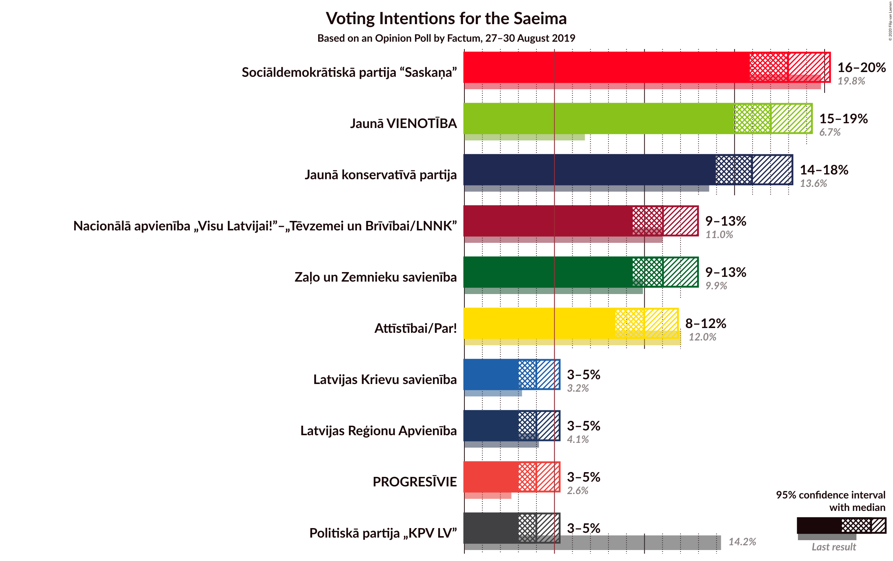
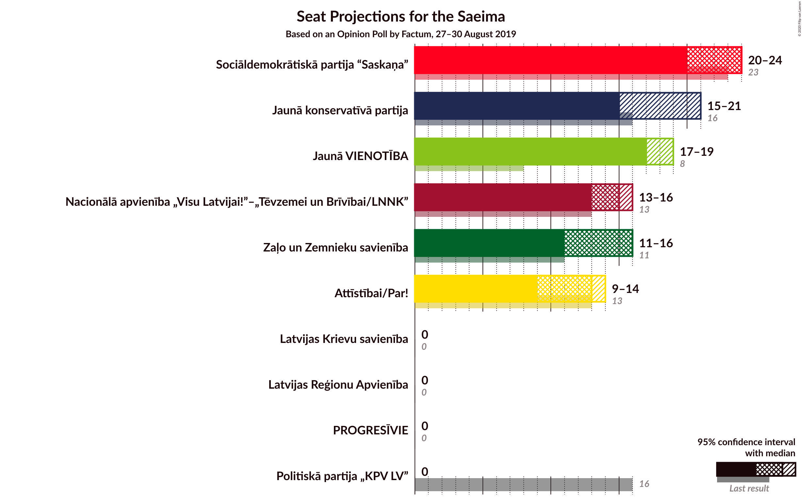
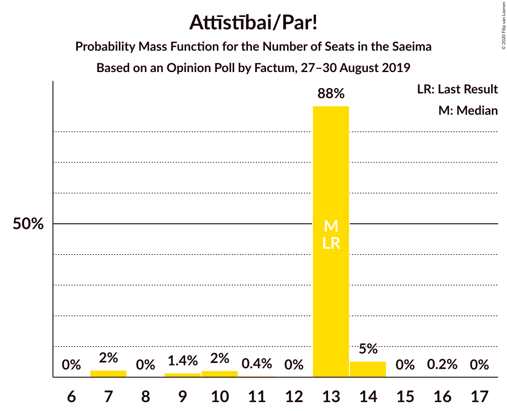
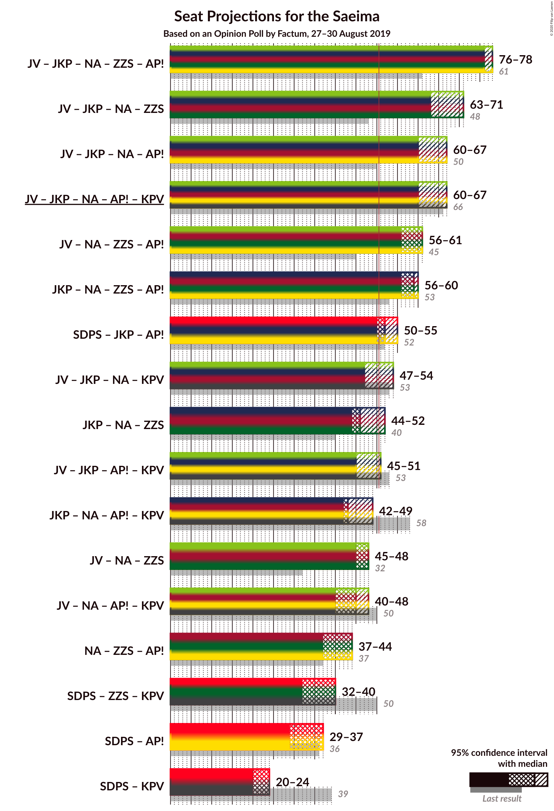
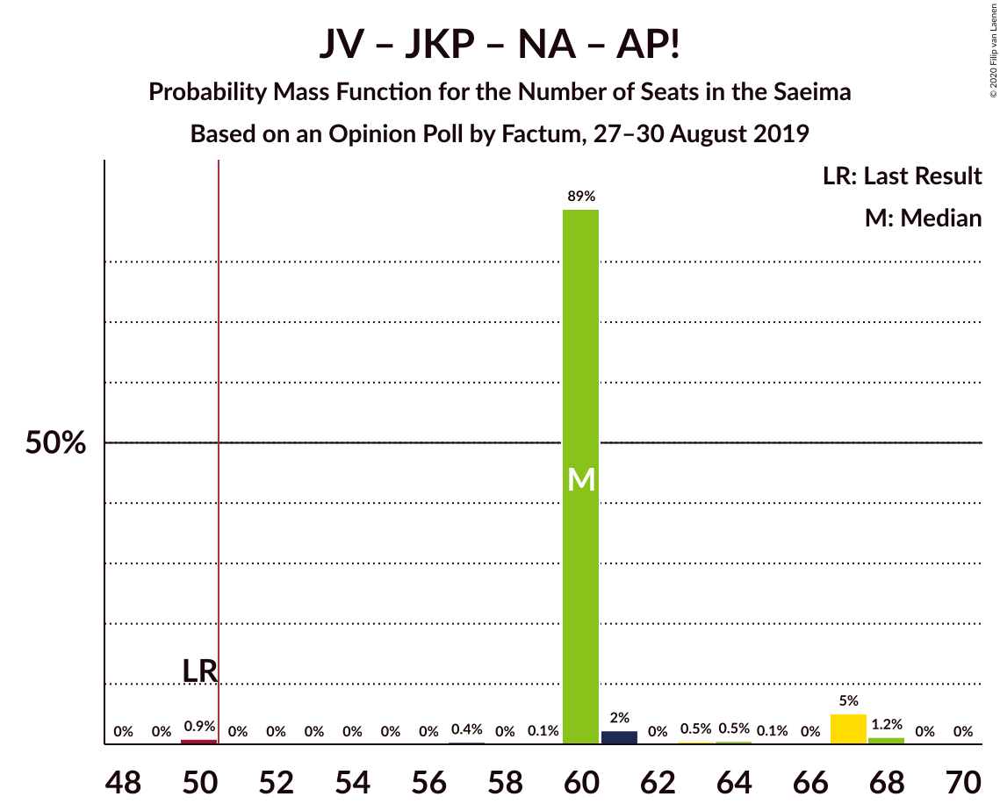
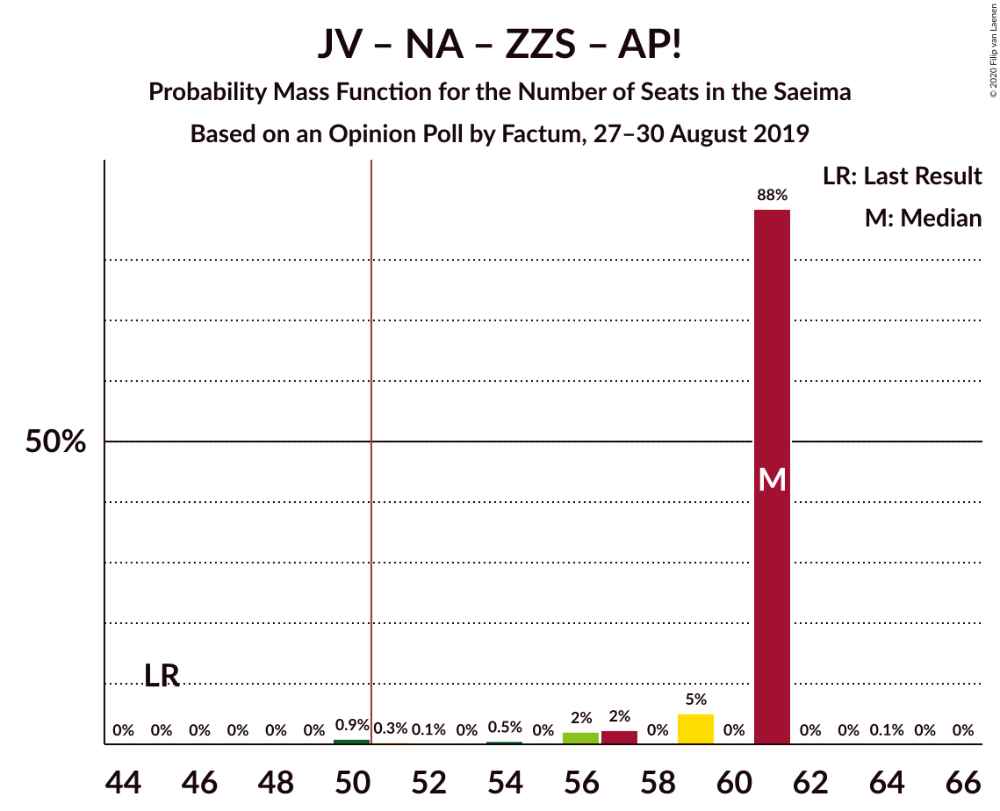
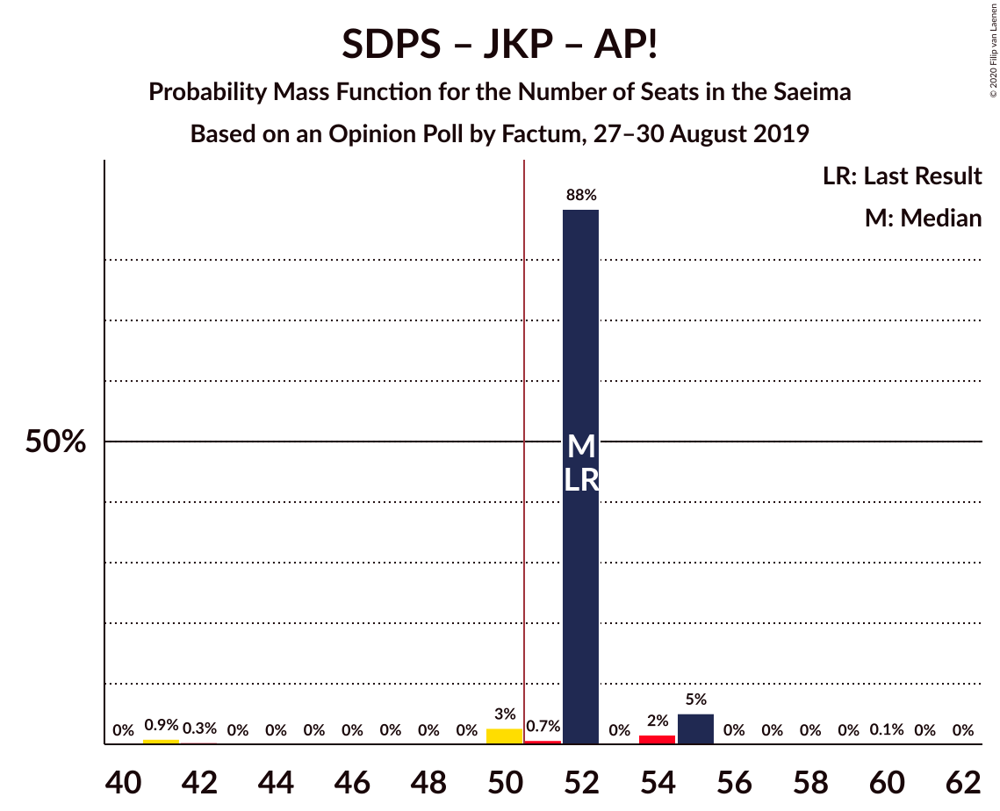
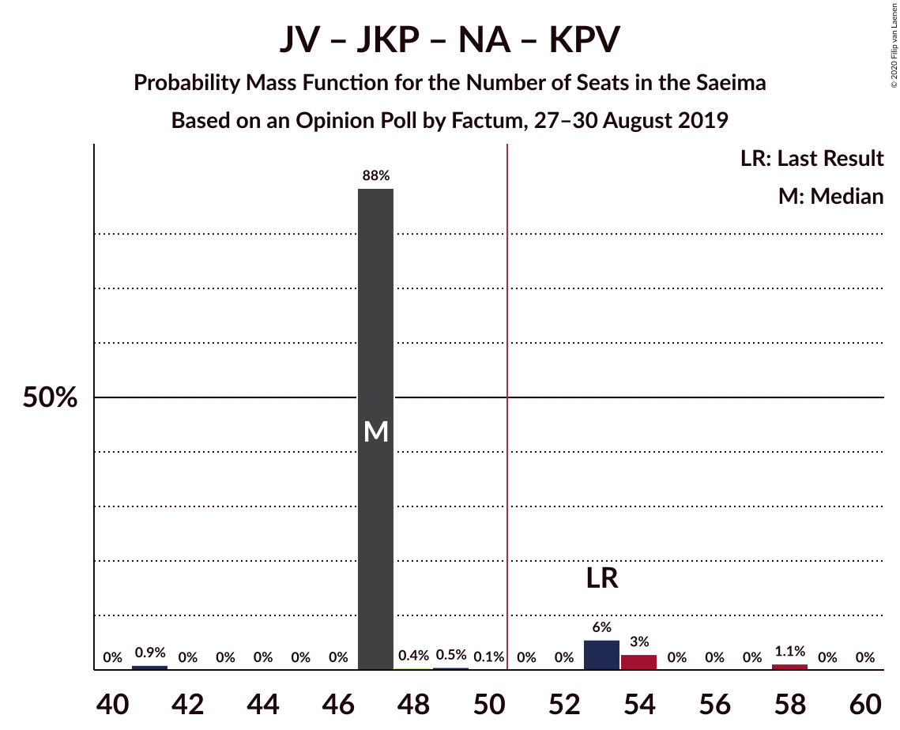
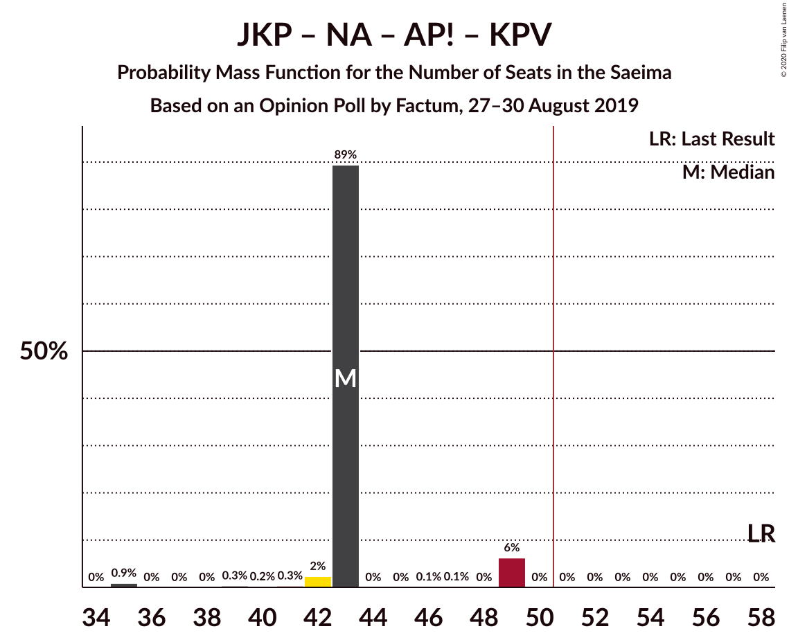
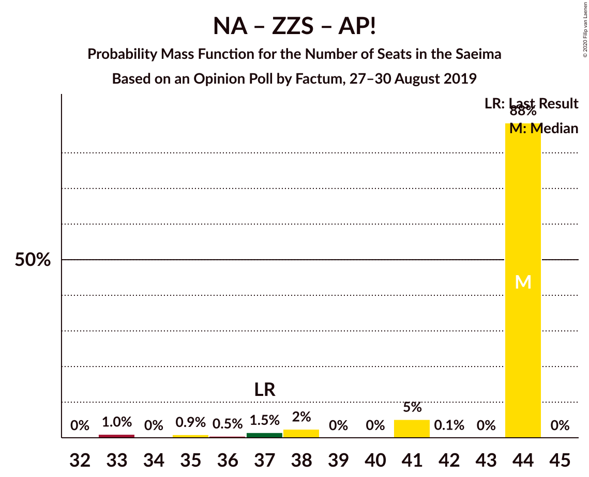

# Opinion Poll by Factum, 27–30 August 2019

<a href="#voting-intentions">Voting Intentions</a> | <a href="#seats">Seats</a> | <a href="#coalitions">Coalitions</a> | <a href="#technical-information">Technical Information</a>

## Voting Intentions

### Confidence Intervals

| Party | Last Result | Poll Result | 80% Confidence Interval | 90% Confidence Interval | 95% Confidence Interval | 99% Confidence Interval |
|:-----:|:-----------:|:-----------:|:-----------------------:|:-----------------------:|:-----------------------:|:-----------------------:|
| Sociāldemokrātiskā partija “Saskaņa” | 19.8% | 18.0% | 16.6–19.5% |16.2–19.9% |15.9–20.3% |15.2–21.0% |
| Jaunā VIENOTĪBA | 6.7% | 17.0% | 15.7–18.5% |15.3–18.9% |15.0–19.3% |14.3–20.0% |
| Jaunā konservatīvā partija | 13.6% | 16.0% | 14.6–17.4% |14.3–17.8% |14.0–18.2% |13.4–18.9% |
| Nacionālā apvienība „Visu Latvijai!”–„Tēvzemei un Brīvībai/LNNK” | 11.0% | 11.0% | 9.9–12.3% |9.6–12.7% |9.3–13.0% |8.8–13.6% |
| Zaļo un Zemnieku savienība | 9.9% | 11.0% | 9.9–12.3% |9.6–12.7% |9.3–13.0% |8.8–13.6% |
| Attīstībai/Par! | 12.0% | 10.0% | 8.9–11.2% |8.6–11.6% |8.4–11.9% |7.9–12.5% |
| Politiskā partija „KPV LV” | 14.2% | 4.0% | 3.3–4.8% |3.2–5.1% |3.0–5.3% |2.7–5.7% |
| Latvijas Reģionu Apvienība | 4.1% | 4.0% | 3.3–4.8% |3.2–5.1% |3.0–5.3% |2.7–5.7% |
| Latvijas Krievu savienība | 3.2% | 4.0% | 3.3–4.8% |3.2–5.1% |3.0–5.3% |2.7–5.7% |
| PROGRESĪVIE | 2.6% | 4.0% | 3.3–4.8% |3.2–5.1% |3.0–5.3% |2.7–5.7% |

*Note:* The poll result column reflects the actual value used in the calculations. Published results may vary slightly, and in addition be rounded to fewer digits.

## Seats

### Confidence Intervals

| Party | Last Result | Median | 80% Confidence Interval | 90% Confidence Interval | 95% Confidence Interval | 99% Confidence Interval |
|:-----:|:-----------:|:------:|:-----------------------:|:-----------------------:|:-----------------------:|:-----------------------:|
| <a href="#sociāldemokrātiskā-partija-“saskaņa”">Sociāldemokrātiskā partija “Saskaņa”</a> | 23 | 24 | 22–24 |22–24 |20–24 |18–24 |
| <a href="#jaunā-vienotība">Jaunā VIENOTĪBA</a> | 8 | 17 | 17–18 |17–18 |17–19 |15–21 |
| <a href="#jaunā-konservatīvā-partija">Jaunā konservatīvā partija</a> | 16 | 15 | 15–19 |15–19 |15–21 |14–25 |
| <a href="#nacionālā-apvienība-„visu-latvijai!”–„tēvzemei-un-brīvībai/lnnk”">Nacionālā apvienība „Visu Latvijai!”–„Tēvzemei un Brīvībai/LNNK”</a> | 13 | 15 | 15 |14–16 |13–16 |11–16 |
| <a href="#zaļo-un-zemnieku-savienība">Zaļo un Zemnieku savienība</a> | 11 | 16 | 16 |11–16 |11–16 |11–17 |
| <a href="#attīstībai/par!">Attīstībai/Par!</a> | 13 | 13 | 13 |10–14 |9–14 |7–14 |
| <a href="#politiskā-partija-„kpv-lv”">Politiskā partija „KPV LV”</a> | 16 | 0 | 0 |0 |0 |0 |
| <a href="#latvijas-reģionu-apvienība">Latvijas Reģionu Apvienība</a> | 0 | 0 | 0 |0 |0 |0–6 |
| <a href="#latvijas-krievu-savienība">Latvijas Krievu savienība</a> | 0 | 0 | 0 |0 |0 |0–7 |
| <a href="#progresīvie">PROGRESĪVIE</a> | 0 | 0 | 0 |0 |0 |0–6 |

### Sociāldemokrātiskā partija “Saskaņa”

*For a full overview of the results for this party, see the [Sociāldemokrātiskā partija “Saskaņa”](party-sociāldemokrātiskāpartija“saskaņa”.html) page.*

| Number of Seats | Probability | Accumulated | Special Marks |
|:---------------:|:-----------:|:-----------:|:-------------:|
| 16 | 0.4% | 100% |  |
| 17 | 0% | 99.6% |  |
| 18 | 0.9% | 99.6% |  |
| 19 | 1.2% | 98.7% |  |
| 20 | 0.6% | 98% |  |
| 21 | 0.1% | 97% |  |
| 22 | 8% | 97% |  |
| 23 | 0% | 89% | Last Result |
| 24 | 89% | 89% | Median |
| 25 | 0% | 0% |  |

### Jaunā VIENOTĪBA

*For a full overview of the results for this party, see the [Jaunā VIENOTĪBA](party-jaunāvienotība.html) page.*

| Number of Seats | Probability | Accumulated | Special Marks |
|:---------------:|:-----------:|:-----------:|:-------------:|
| 8 | 0% | 100% | Last Result |
| 9 | 0% | 100% |  |
| 10 | 0% | 100% |  |
| 11 | 0% | 100% |  |
| 12 | 0% | 100% |  |
| 13 | 0% | 100% |  |
| 14 | 0% | 100% |  |
| 15 | 0.9% | 100% |  |
| 16 | 0% | 99.1% |  |
| 17 | 89% | 99.1% | Median |
| 18 | 6% | 11% |  |
| 19 | 4% | 5% |  |
| 20 | 0.4% | 1.0% |  |
| 21 | 0.5% | 0.6% |  |
| 22 | 0.1% | 0.1% |  |
| 23 | 0% | 0% |  |

### Jaunā konservatīvā partija

*For a full overview of the results for this party, see the [Jaunā konservatīvā partija](party-jaunākonservatīvāpartija.html) page.*

| Number of Seats | Probability | Accumulated | Special Marks |
|:---------------:|:-----------:|:-----------:|:-------------:|
| 14 | 0.9% | 100% |  |
| 15 | 89% | 99.1% | Median |
| 16 | 0% | 10% | Last Result |
| 17 | 0% | 10% |  |
| 18 | 0% | 10% |  |
| 19 | 5% | 10% |  |
| 20 | 0.7% | 5% |  |
| 21 | 3% | 4% |  |
| 22 | 0% | 1.2% |  |
| 23 | 0% | 1.1% |  |
| 24 | 0% | 1.1% |  |
| 25 | 1.1% | 1.1% |  |
| 26 | 0% | 0% |  |

### Nacionālā apvienība „Visu Latvijai!”–„Tēvzemei un Brīvībai/LNNK”

*For a full overview of the results for this party, see the [Nacionālā apvienība „Visu Latvijai!”–„Tēvzemei un Brīvībai/LNNK”](party-nacionālāapvienība„visulatvijai”–„tēvzemeiunbrīvībailnnk”.html) page.*

| Number of Seats | Probability | Accumulated | Special Marks |
|:---------------:|:-----------:|:-----------:|:-------------:|
| 11 | 0.6% | 100% |  |
| 12 | 1.4% | 99.4% |  |
| 13 | 0.5% | 98% | Last Result |
| 14 | 3% | 97% |  |
| 15 | 89% | 94% | Median |
| 16 | 5% | 5% |  |
| 17 | 0.1% | 0.1% |  |
| 18 | 0% | 0% |  |

### Zaļo un Zemnieku savienība

*For a full overview of the results for this party, see the [Zaļo un Zemnieku savienība](party-zaļounzemniekusavienība.html) page.*

| Number of Seats | Probability | Accumulated | Special Marks |
|:---------------:|:-----------:|:-----------:|:-------------:|
| 11 | 6% | 100% | Last Result |
| 12 | 0% | 94% |  |
| 13 | 2% | 94% |  |
| 14 | 0.9% | 92% |  |
| 15 | 0% | 91% |  |
| 16 | 88% | 91% | Median |
| 17 | 2% | 2% |  |
| 18 | 0% | 0% |  |

### Attīstībai/Par!

*For a full overview of the results for this party, see the [Attīstībai/Par!](party-attīstībaipar.html) page.*

| Number of Seats | Probability | Accumulated | Special Marks |
|:---------------:|:-----------:|:-----------:|:-------------:|
| 7 | 2% | 100% |  |
| 8 | 0% | 98% |  |
| 9 | 1.4% | 98% |  |
| 10 | 2% | 96% |  |
| 11 | 0.4% | 94% |  |
| 12 | 0% | 94% |  |
| 13 | 88% | 94% | Last Result, Median |
| 14 | 5% | 5% |  |
| 15 | 0% | 0.2% |  |
| 16 | 0.2% | 0.2% |  |
| 17 | 0% | 0% |  |

### Politiskā partija „KPV LV”

*For a full overview of the results for this party, see the [Politiskā partija „KPV LV”](party-politiskāpartija„kpvlv”.html) page.*

| Number of Seats | Probability | Accumulated | Special Marks |
|:---------------:|:-----------:|:-----------:|:-------------:|
| 0 | 100% | 100% | Median |
| 1 | 0% | 0% |  |
| 2 | 0% | 0% |  |
| 3 | 0% | 0% |  |
| 4 | 0% | 0% |  |
| 5 | 0% | 0% |  |
| 6 | 0% | 0% |  |
| 7 | 0% | 0% |  |
| 8 | 0% | 0% |  |
| 9 | 0% | 0% |  |
| 10 | 0% | 0% |  |
| 11 | 0% | 0% |  |
| 12 | 0% | 0% |  |
| 13 | 0% | 0% |  |
| 14 | 0% | 0% |  |
| 15 | 0% | 0% |  |
| 16 | 0% | 0% | Last Result |

### Latvijas Reģionu Apvienība

*For a full overview of the results for this party, see the [Latvijas Reģionu Apvienība](party-latvijasreģionuapvienība.html) page.*

| Number of Seats | Probability | Accumulated | Special Marks |
|:---------------:|:-----------:|:-----------:|:-------------:|
| 0 | 99.0% | 100% | Last Result, Median |
| 1 | 0% | 1.0% |  |
| 2 | 0% | 1.0% |  |
| 3 | 0% | 1.0% |  |
| 4 | 0% | 1.0% |  |
| 5 | 0% | 1.0% |  |
| 6 | 1.0% | 1.0% |  |
| 7 | 0% | 0% |  |

### Latvijas Krievu savienība

*For a full overview of the results for this party, see the [Latvijas Krievu savienība](party-latvijaskrievusavienība.html) page.*

| Number of Seats | Probability | Accumulated | Special Marks |
|:---------------:|:-----------:|:-----------:|:-------------:|
| 0 | 98% | 100% | Last Result, Median |
| 1 | 0% | 2% |  |
| 2 | 0% | 2% |  |
| 3 | 0% | 2% |  |
| 4 | 0% | 2% |  |
| 5 | 0% | 2% |  |
| 6 | 0.9% | 2% |  |
| 7 | 0.3% | 0.7% |  |
| 8 | 0.3% | 0.3% |  |
| 9 | 0% | 0% |  |

### PROGRESĪVIE

*For a full overview of the results for this party, see the [PROGRESĪVIE](party-progresīvie.html) page.*

| Number of Seats | Probability | Accumulated | Special Marks |
|:---------------:|:-----------:|:-----------:|:-------------:|
| 0 | 98% | 100% | Last Result, Median |
| 1 | 0% | 2% |  |
| 2 | 0% | 2% |  |
| 3 | 0% | 2% |  |
| 4 | 0% | 2% |  |
| 5 | 0.5% | 2% |  |
| 6 | 1.3% | 1.4% |  |
| 7 | 0% | 0% |  |

## Coalitions

### Confidence Intervals

| Coalition | Last Result | Median | Majority? | 80% Confidence Interval | 90% Confidence Interval | 95% Confidence Interval | 99% Confidence Interval |
|:---------:|:-----------:|:------:|:---------:|:-----------------------:|:-----------------------:|:-----------------------:|:-----------------------:|
| Jaunā VIENOTĪBA – Jaunā konservatīvā partija – Nacionālā apvienība „Visu Latvijai!”–„Tēvzemei un Brīvībai/LNNK” – Zaļo un Zemnieku savienība – Attīstībai/Par! | 61 | 76 | 100% | 76 | 76–78 | 76–78 | 64–81 |
| Jaunā VIENOTĪBA – Jaunā konservatīvā partija – Nacionālā apvienība „Visu Latvijai!”–„Tēvzemei un Brīvībai/LNNK” – Zaļo un Zemnieku savienība | 48 | 63 | 100% | 63 | 63–64 | 63–71 | 55–71 |
| Jaunā VIENOTĪBA – Jaunā konservatīvā partija – Nacionālā apvienība „Visu Latvijai!”–„Tēvzemei un Brīvībai/LNNK” – Attīstībai/Par! | 50 | 60 | 99.1% | 60 | 60–67 | 60–67 | 50–68 |
| Jaunā VIENOTĪBA – Jaunā konservatīvā partija – Nacionālā apvienība „Visu Latvijai!”–„Tēvzemei un Brīvībai/LNNK” – Attīstībai/Par! – Politiskā partija „KPV LV” | 66 | 60 | 99.1% | 60 | 60–67 | 60–67 | 50–68 |
| Jaunā VIENOTĪBA – Nacionālā apvienība „Visu Latvijai!”–„Tēvzemei un Brīvībai/LNNK” – Zaļo un Zemnieku savienība – Attīstībai/Par! | 45 | 61 | 99.1% | 59–61 | 57–61 | 56–61 | 50–61 |
| Jaunā konservatīvā partija – Nacionālā apvienība „Visu Latvijai!”–„Tēvzemei un Brīvībai/LNNK” – Zaļo un Zemnieku savienība – Attīstībai/Par! | 53 | 59 | 99.1% | 59 | 59–60 | 56–60 | 49–62 |
| Sociāldemokrātiskā partija “Saskaņa” – Jaunā konservatīvā partija – Attīstībai/Par! | 52 | 52 | 96% | 52 | 52–55 | 50–55 | 41–55 |
| Jaunā VIENOTĪBA – Jaunā konservatīvā partija – Nacionālā apvienība „Visu Latvijai!”–„Tēvzemei un Brīvībai/LNNK” – Politiskā partija „KPV LV” | 53 | 47 | 10% | 47–49 | 47–53 | 47–54 | 41–58 |
| Jaunā konservatīvā partija – Nacionālā apvienība „Visu Latvijai!”–„Tēvzemei un Brīvībai/LNNK” – Zaļo un Zemnieku savienība | 40 | 46 | 3% | 46 | 46 | 44–52 | 40–52 |
| Jaunā VIENOTĪBA – Jaunā konservatīvā partija – Attīstībai/Par! – Politiskā partija „KPV LV” | 53 | 45 | 7% | 45–46 | 45–51 | 45–51 | 38–54 |
| Jaunā konservatīvā partija – Nacionālā apvienība „Visu Latvijai!”–„Tēvzemei un Brīvībai/LNNK” – Attīstībai/Par! – Politiskā partija „KPV LV” | 58 | 43 | 0% | 43 | 43–49 | 42–49 | 35–49 |
| Jaunā VIENOTĪBA – Nacionālā apvienība „Visu Latvijai!”–„Tēvzemei un Brīvībai/LNNK” – Zaļo un Zemnieku savienība | 32 | 48 | 0% | 48 | 45–48 | 45–48 | 41–50 |
| Jaunā VIENOTĪBA – Nacionālā apvienība „Visu Latvijai!”–„Tēvzemei un Brīvībai/LNNK” – Attīstībai/Par! – Politiskā partija „KPV LV” | 50 | 45 | 0.1% | 45 | 43–48 | 40–48 | 36–48 |
| Nacionālā apvienība „Visu Latvijai!”–„Tēvzemei un Brīvībai/LNNK” – Zaļo un Zemnieku savienība – Attīstībai/Par! | 37 | 44 | 0% | 41–44 | 38–44 | 37–44 | 33–44 |
| Sociāldemokrātiskā partija “Saskaņa” – Zaļo un Zemnieku savienība – Politiskā partija „KPV LV” | 50 | 40 | 0% | 39–40 | 33–40 | 32–40 | 31–40 |
| Sociāldemokrātiskā partija “Saskaņa” – Attīstībai/Par! | 36 | 37 | 0% | 36–37 | 30–37 | 29–37 | 27–37 |
| Sociāldemokrātiskā partija “Saskaņa” – Politiskā partija „KPV LV” | 39 | 24 | 0% | 22–24 | 22–24 | 20–24 | 18–24 |

### Jaunā VIENOTĪBA – Jaunā konservatīvā partija – Nacionālā apvienība „Visu Latvijai!”–„Tēvzemei un Brīvībai/LNNK” – Zaļo un Zemnieku savienība – Attīstībai/Par!

| Number of Seats | Probability | Accumulated | Special Marks |
|:---------------:|:-----------:|:-----------:|:-------------:|
| 61 | 0% | 100% | Last Result |
| 62 | 0% | 100% |  |
| 63 | 0% | 100% |  |
| 64 | 0.9% | 100% |  |
| 65 | 0% | 99.1% |  |
| 66 | 0% | 99.1% |  |
| 67 | 0% | 99.1% |  |
| 68 | 0% | 99.1% |  |
| 69 | 0% | 99.1% |  |
| 70 | 0.3% | 99.1% |  |
| 71 | 0.4% | 98.7% |  |
| 72 | 0.1% | 98% |  |
| 73 | 0% | 98% |  |
| 74 | 0% | 98% |  |
| 75 | 0.6% | 98% |  |
| 76 | 89% | 98% | Median |
| 77 | 0% | 9% |  |
| 78 | 7% | 9% |  |
| 79 | 0.1% | 1.2% |  |
| 80 | 0% | 1.2% |  |
| 81 | 1.1% | 1.2% |  |
| 82 | 0% | 0% |  |

### Jaunā VIENOTĪBA – Jaunā konservatīvā partija – Nacionālā apvienība „Visu Latvijai!”–„Tēvzemei un Brīvībai/LNNK” – Zaļo un Zemnieku savienība

| Number of Seats | Probability | Accumulated | Special Marks |
|:---------------:|:-----------:|:-----------:|:-------------:|
| 48 | 0% | 100% | Last Result |
| 49 | 0% | 100% |  |
| 50 | 0% | 100% |  |
| 51 | 0% | 100% | Majority |
| 52 | 0% | 100% |  |
| 53 | 0% | 100% |  |
| 54 | 0% | 100% |  |
| 55 | 0.9% | 100% |  |
| 56 | 0% | 99.1% |  |
| 57 | 0% | 99.1% |  |
| 58 | 0% | 99.1% |  |
| 59 | 0% | 99.1% |  |
| 60 | 0.5% | 99.1% |  |
| 61 | 0.3% | 98.5% |  |
| 62 | 0% | 98% |  |
| 63 | 89% | 98% | Median |
| 64 | 5% | 10% |  |
| 65 | 0.6% | 4% |  |
| 66 | 0.4% | 4% |  |
| 67 | 0% | 3% |  |
| 68 | 0% | 3% |  |
| 69 | 0% | 3% |  |
| 70 | 0% | 3% |  |
| 71 | 3% | 3% |  |
| 72 | 0% | 0% |  |

### Jaunā VIENOTĪBA – Jaunā konservatīvā partija – Nacionālā apvienība „Visu Latvijai!”–„Tēvzemei un Brīvībai/LNNK” – Attīstībai/Par!

| Number of Seats | Probability | Accumulated | Special Marks |
|:---------------:|:-----------:|:-----------:|:-------------:|
| 50 | 0.9% | 100% | Last Result |
| 51 | 0% | 99.1% | Majority |
| 52 | 0% | 99.1% |  |
| 53 | 0% | 99.1% |  |
| 54 | 0% | 99.1% |  |
| 55 | 0% | 99.1% |  |
| 56 | 0% | 99.1% |  |
| 57 | 0.4% | 99.1% |  |
| 58 | 0% | 98.7% |  |
| 59 | 0.1% | 98.7% |  |
| 60 | 89% | 98.6% | Median |
| 61 | 2% | 10% |  |
| 62 | 0% | 7% |  |
| 63 | 0.5% | 7% |  |
| 64 | 0.5% | 7% |  |
| 65 | 0.1% | 6% |  |
| 66 | 0% | 6% |  |
| 67 | 5% | 6% |  |
| 68 | 1.2% | 1.2% |  |
| 69 | 0% | 0% |  |

### Jaunā VIENOTĪBA – Jaunā konservatīvā partija – Nacionālā apvienība „Visu Latvijai!”–„Tēvzemei un Brīvībai/LNNK” – Attīstībai/Par! – Politiskā partija „KPV LV”

| Number of Seats | Probability | Accumulated | Special Marks |
|:---------------:|:-----------:|:-----------:|:-------------:|
| 50 | 0.9% | 100% |  |
| 51 | 0% | 99.1% | Majority |
| 52 | 0% | 99.1% |  |
| 53 | 0% | 99.1% |  |
| 54 | 0% | 99.1% |  |
| 55 | 0% | 99.1% |  |
| 56 | 0% | 99.1% |  |
| 57 | 0.4% | 99.1% |  |
| 58 | 0% | 98.7% |  |
| 59 | 0.1% | 98.7% |  |
| 60 | 89% | 98.6% | Median |
| 61 | 2% | 10% |  |
| 62 | 0% | 7% |  |
| 63 | 0.5% | 7% |  |
| 64 | 0.5% | 7% |  |
| 65 | 0.1% | 6% |  |
| 66 | 0% | 6% | Last Result |
| 67 | 5% | 6% |  |
| 68 | 1.2% | 1.2% |  |
| 69 | 0% | 0% |  |

### Jaunā VIENOTĪBA – Nacionālā apvienība „Visu Latvijai!”–„Tēvzemei un Brīvībai/LNNK” – Zaļo un Zemnieku savienība – Attīstībai/Par!

| Number of Seats | Probability | Accumulated | Special Marks |
|:---------------:|:-----------:|:-----------:|:-------------:|
| 45 | 0% | 100% | Last Result |
| 46 | 0% | 100% |  |
| 47 | 0% | 100% |  |
| 48 | 0% | 100% |  |
| 49 | 0% | 100% |  |
| 50 | 0.9% | 100% |  |
| 51 | 0.3% | 99.1% | Majority |
| 52 | 0.1% | 98.8% |  |
| 53 | 0% | 98.6% |  |
| 54 | 0.5% | 98.6% |  |
| 55 | 0% | 98% |  |
| 56 | 2% | 98% |  |
| 57 | 2% | 96% |  |
| 58 | 0% | 94% |  |
| 59 | 5% | 94% |  |
| 60 | 0% | 89% |  |
| 61 | 88% | 88% | Median |
| 62 | 0% | 0.1% |  |
| 63 | 0% | 0.1% |  |
| 64 | 0.1% | 0.1% |  |
| 65 | 0% | 0% |  |

### Jaunā konservatīvā partija – Nacionālā apvienība „Visu Latvijai!”–„Tēvzemei un Brīvībai/LNNK” – Zaļo un Zemnieku savienība – Attīstībai/Par!

| Number of Seats | Probability | Accumulated | Special Marks |
|:---------------:|:-----------:|:-----------:|:-------------:|
| 49 | 0.9% | 100% |  |
| 50 | 0% | 99.1% |  |
| 51 | 0% | 99.1% | Majority |
| 52 | 0.7% | 99.1% |  |
| 53 | 0.1% | 98% | Last Result |
| 54 | 0.6% | 98% |  |
| 55 | 0% | 98% |  |
| 56 | 0.5% | 98% |  |
| 57 | 0.1% | 97% |  |
| 58 | 0.1% | 97% |  |
| 59 | 91% | 97% | Median |
| 60 | 5% | 6% |  |
| 61 | 0% | 1.1% |  |
| 62 | 1.1% | 1.1% |  |
| 63 | 0% | 0% |  |

### Sociāldemokrātiskā partija “Saskaņa” – Jaunā konservatīvā partija – Attīstībai/Par!

| Number of Seats | Probability | Accumulated | Special Marks |
|:---------------:|:-----------:|:-----------:|:-------------:|
| 41 | 0.9% | 100% |  |
| 42 | 0.3% | 99.1% |  |
| 43 | 0% | 98.8% |  |
| 44 | 0% | 98.8% |  |
| 45 | 0% | 98.8% |  |
| 46 | 0% | 98.7% |  |
| 47 | 0% | 98.7% |  |
| 48 | 0% | 98.7% |  |
| 49 | 0% | 98.7% |  |
| 50 | 3% | 98.7% |  |
| 51 | 0.7% | 96% | Majority |
| 52 | 88% | 95% | Last Result, Median |
| 53 | 0% | 7% |  |
| 54 | 2% | 7% |  |
| 55 | 5% | 5% |  |
| 56 | 0% | 0.2% |  |
| 57 | 0% | 0.1% |  |
| 58 | 0% | 0.1% |  |
| 59 | 0% | 0.1% |  |
| 60 | 0.1% | 0.1% |  |
| 61 | 0% | 0% |  |

### Jaunā VIENOTĪBA – Jaunā konservatīvā partija – Nacionālā apvienība „Visu Latvijai!”–„Tēvzemei un Brīvībai/LNNK” – Politiskā partija „KPV LV”

| Number of Seats | Probability | Accumulated | Special Marks |
|:---------------:|:-----------:|:-----------:|:-------------:|
| 41 | 0.9% | 100% |  |
| 42 | 0% | 99.1% |  |
| 43 | 0% | 99.1% |  |
| 44 | 0% | 99.1% |  |
| 45 | 0% | 99.1% |  |
| 46 | 0% | 99.1% |  |
| 47 | 88% | 99.0% | Median |
| 48 | 0.4% | 11% |  |
| 49 | 0.5% | 10% |  |
| 50 | 0.1% | 10% |  |
| 51 | 0% | 10% | Majority |
| 52 | 0% | 10% |  |
| 53 | 6% | 10% | Last Result |
| 54 | 3% | 4% |  |
| 55 | 0% | 1.2% |  |
| 56 | 0% | 1.2% |  |
| 57 | 0% | 1.2% |  |
| 58 | 1.1% | 1.1% |  |
| 59 | 0% | 0% |  |

### Jaunā konservatīvā partija – Nacionālā apvienība „Visu Latvijai!”–„Tēvzemei un Brīvībai/LNNK” – Zaļo un Zemnieku savienība

| Number of Seats | Probability | Accumulated | Special Marks |
|:---------------:|:-----------:|:-----------:|:-------------:|
| 40 | 0.9% | 100% | Last Result |
| 41 | 0.4% | 99.1% |  |
| 42 | 0.1% | 98.7% |  |
| 43 | 0.5% | 98.6% |  |
| 44 | 0.7% | 98% |  |
| 45 | 0% | 97% |  |
| 46 | 94% | 97% | Median |
| 47 | 0% | 3% |  |
| 48 | 0% | 3% |  |
| 49 | 0% | 3% |  |
| 50 | 0% | 3% |  |
| 51 | 0% | 3% | Majority |
| 52 | 3% | 3% |  |
| 53 | 0% | 0% |  |

### Jaunā VIENOTĪBA – Jaunā konservatīvā partija – Attīstībai/Par! – Politiskā partija „KPV LV”

| Number of Seats | Probability | Accumulated | Special Marks |
|:---------------:|:-----------:|:-----------:|:-------------:|
| 38 | 0.9% | 100% |  |
| 39 | 0% | 99.1% |  |
| 40 | 0% | 99.1% |  |
| 41 | 0% | 99.1% |  |
| 42 | 0% | 99.1% |  |
| 43 | 0% | 99.1% |  |
| 44 | 0% | 99.1% |  |
| 45 | 89% | 99.1% | Median |
| 46 | 0.4% | 10% |  |
| 47 | 2% | 10% |  |
| 48 | 0.2% | 8% |  |
| 49 | 0% | 7% |  |
| 50 | 0.4% | 7% |  |
| 51 | 5% | 7% | Majority |
| 52 | 0.5% | 2% |  |
| 53 | 0% | 1.3% | Last Result |
| 54 | 1.3% | 1.3% |  |
| 55 | 0% | 0% |  |

### Jaunā konservatīvā partija – Nacionālā apvienība „Visu Latvijai!”–„Tēvzemei un Brīvībai/LNNK” – Attīstībai/Par! – Politiskā partija „KPV LV”

| Number of Seats | Probability | Accumulated | Special Marks |
|:---------------:|:-----------:|:-----------:|:-------------:|
| 35 | 0.9% | 100% |  |
| 36 | 0% | 99.1% |  |
| 37 | 0% | 99.1% |  |
| 38 | 0% | 99.1% |  |
| 39 | 0.3% | 99.1% |  |
| 40 | 0.2% | 98.7% |  |
| 41 | 0.3% | 98.6% |  |
| 42 | 2% | 98% |  |
| 43 | 89% | 96% | Median |
| 44 | 0% | 6% |  |
| 45 | 0% | 6% |  |
| 46 | 0.1% | 6% |  |
| 47 | 0.1% | 6% |  |
| 48 | 0% | 6% |  |
| 49 | 6% | 6% |  |
| 50 | 0% | 0% |  |
| 51 | 0% | 0% | Majority |
| 52 | 0% | 0% |  |
| 53 | 0% | 0% |  |
| 54 | 0% | 0% |  |
| 55 | 0% | 0% |  |
| 56 | 0% | 0% |  |
| 57 | 0% | 0% |  |
| 58 | 0% | 0% | Last Result |

### Jaunā VIENOTĪBA – Nacionālā apvienība „Visu Latvijai!”–„Tēvzemei un Brīvībai/LNNK” – Zaļo un Zemnieku savienība

| Number of Seats | Probability | Accumulated | Special Marks |
|:---------------:|:-----------:|:-----------:|:-------------:|
| 32 | 0% | 100% | Last Result |
| 33 | 0% | 100% |  |
| 34 | 0% | 100% |  |
| 35 | 0% | 100% |  |
| 36 | 0% | 100% |  |
| 37 | 0% | 100% |  |
| 38 | 0% | 100% |  |
| 39 | 0% | 100% |  |
| 40 | 0.1% | 100% |  |
| 41 | 0.9% | 99.9% |  |
| 42 | 0.4% | 99.0% |  |
| 43 | 0.2% | 98.6% |  |
| 44 | 0.6% | 98% |  |
| 45 | 5% | 98% |  |
| 46 | 2% | 92% |  |
| 47 | 0% | 91% |  |
| 48 | 88% | 91% | Median |
| 49 | 0% | 2% |  |
| 50 | 2% | 2% |  |
| 51 | 0% | 0% | Majority |

### Jaunā VIENOTĪBA – Nacionālā apvienība „Visu Latvijai!”–„Tēvzemei un Brīvībai/LNNK” – Attīstībai/Par! – Politiskā partija „KPV LV”

| Number of Seats | Probability | Accumulated | Special Marks |
|:---------------:|:-----------:|:-----------:|:-------------:|
| 36 | 0.9% | 100% |  |
| 37 | 0% | 99.1% |  |
| 38 | 0.3% | 99.1% |  |
| 39 | 0.1% | 98.8% |  |
| 40 | 2% | 98.6% |  |
| 41 | 0% | 96% |  |
| 42 | 0% | 96% |  |
| 43 | 2% | 96% |  |
| 44 | 0% | 94% |  |
| 45 | 89% | 94% | Median |
| 46 | 0% | 5% |  |
| 47 | 0% | 5% |  |
| 48 | 5% | 5% |  |
| 49 | 0% | 0.1% |  |
| 50 | 0% | 0.1% | Last Result |
| 51 | 0% | 0.1% | Majority |
| 52 | 0% | 0.1% |  |
| 53 | 0.1% | 0.1% |  |
| 54 | 0% | 0% |  |

### Nacionālā apvienība „Visu Latvijai!”–„Tēvzemei un Brīvībai/LNNK” – Zaļo un Zemnieku savienība – Attīstībai/Par!

| Number of Seats | Probability | Accumulated | Special Marks |
|:---------------:|:-----------:|:-----------:|:-------------:|
| 33 | 1.0% | 100% |  |
| 34 | 0% | 99.0% |  |
| 35 | 0.9% | 99.0% |  |
| 36 | 0.5% | 98% |  |
| 37 | 1.5% | 98% | Last Result |
| 38 | 2% | 96% |  |
| 39 | 0% | 94% |  |
| 40 | 0% | 94% |  |
| 41 | 5% | 94% |  |
| 42 | 0.1% | 89% |  |
| 43 | 0% | 88% |  |
| 44 | 88% | 88% | Median |
| 45 | 0% | 0% |  |

### Sociāldemokrātiskā partija “Saskaņa” – Zaļo un Zemnieku savienība – Politiskā partija „KPV LV”

| Number of Seats | Probability | Accumulated | Special Marks |
|:---------------:|:-----------:|:-----------:|:-------------:|
| 27 | 0.3% | 100% |  |
| 28 | 0% | 99.7% |  |
| 29 | 0% | 99.6% |  |
| 30 | 0% | 99.6% |  |
| 31 | 0.6% | 99.6% |  |
| 32 | 2% | 99.1% |  |
| 33 | 5% | 97% |  |
| 34 | 0% | 92% |  |
| 35 | 0.6% | 92% |  |
| 36 | 0% | 91% |  |
| 37 | 0.5% | 91% |  |
| 38 | 0% | 91% |  |
| 39 | 2% | 91% |  |
| 40 | 88% | 88% | Median |
| 41 | 0% | 0% |  |
| 42 | 0% | 0% |  |
| 43 | 0% | 0% |  |
| 44 | 0% | 0% |  |
| 45 | 0% | 0% |  |
| 46 | 0% | 0% |  |
| 47 | 0% | 0% |  |
| 48 | 0% | 0% |  |
| 49 | 0% | 0% |  |
| 50 | 0% | 0% | Last Result |

### Sociāldemokrātiskā partija “Saskaņa” – Attīstībai/Par!

| Number of Seats | Probability | Accumulated | Special Marks |
|:---------------:|:-----------:|:-----------:|:-------------:|
| 27 | 1.3% | 100% |  |
| 28 | 0% | 98.7% |  |
| 29 | 3% | 98.7% |  |
| 30 | 0.5% | 95% |  |
| 31 | 0.5% | 95% |  |
| 32 | 0.1% | 94% |  |
| 33 | 0% | 94% |  |
| 34 | 0.5% | 94% |  |
| 35 | 0.1% | 94% |  |
| 36 | 5% | 94% | Last Result |
| 37 | 88% | 89% | Median |
| 38 | 0% | 0.2% |  |
| 39 | 0% | 0.2% |  |
| 40 | 0.1% | 0.2% |  |
| 41 | 0% | 0% |  |

### Sociāldemokrātiskā partija “Saskaņa” – Politiskā partija „KPV LV”

| Number of Seats | Probability | Accumulated | Special Marks |
|:---------------:|:-----------:|:-----------:|:-------------:|
| 16 | 0.4% | 100% |  |
| 17 | 0% | 99.6% |  |
| 18 | 0.9% | 99.6% |  |
| 19 | 1.1% | 98.7% |  |
| 20 | 0.6% | 98% |  |
| 21 | 0.1% | 97% |  |
| 22 | 8% | 97% |  |
| 23 | 0% | 89% |  |
| 24 | 89% | 89% | Median |
| 25 | 0% | 0% |  |
| 26 | 0% | 0% |  |
| 27 | 0% | 0% |  |
| 28 | 0% | 0% |  |
| 29 | 0% | 0% |  |
| 30 | 0% | 0% |  |
| 31 | 0% | 0% |  |
| 32 | 0% | 0% |  |
| 33 | 0% | 0% |  |
| 34 | 0% | 0% |  |
| 35 | 0% | 0% |  |
| 36 | 0% | 0% |  |
| 37 | 0% | 0% |  |
| 38 | 0% | 0% |  |
| 39 | 0% | 0% | Last Result |

## Technical Information

### Opinion Poll

+ **Polling firm:** Factum
+ **Commissioner(s):** —
+ **Fieldwork period:** 27–30 August 2019

### Calculations

+ **Sample size:** 1152
+ **Simulations done:** 1,024
+ **Error estimate:** 4.60%

