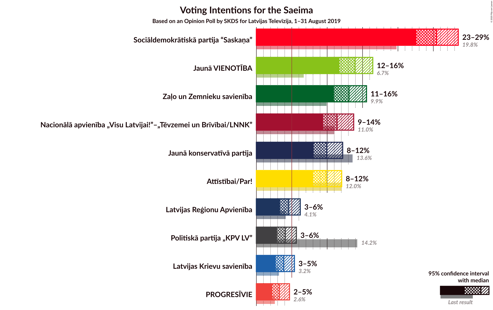
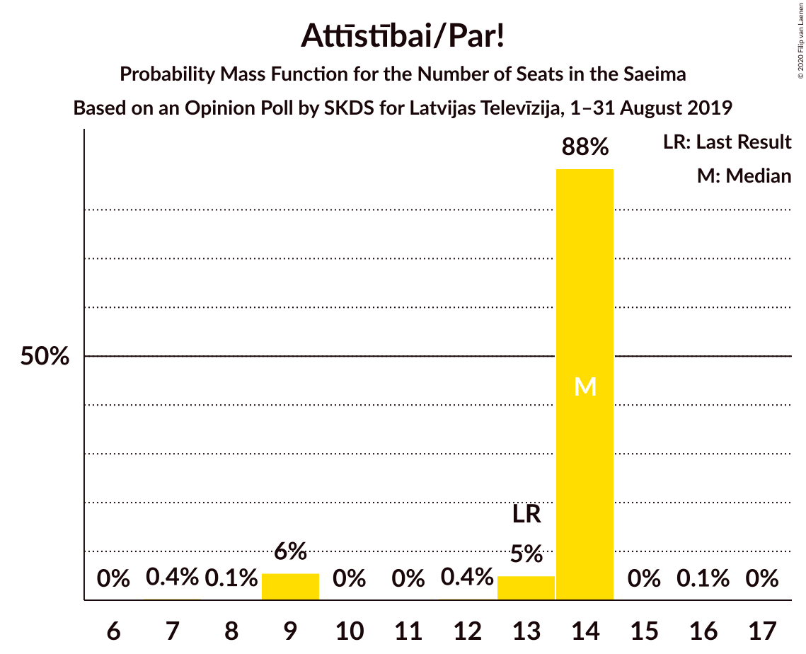
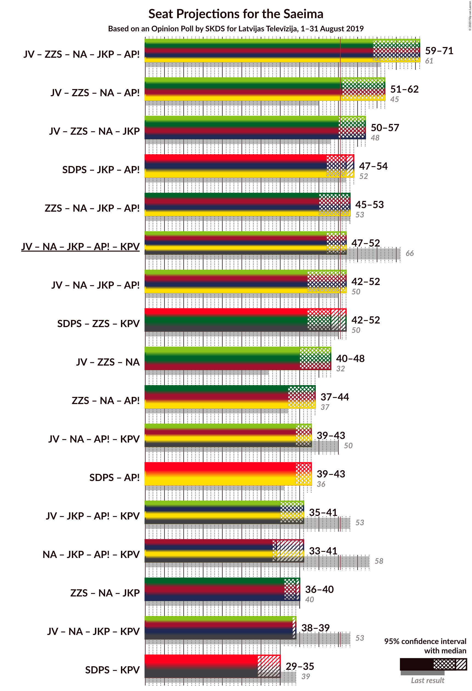
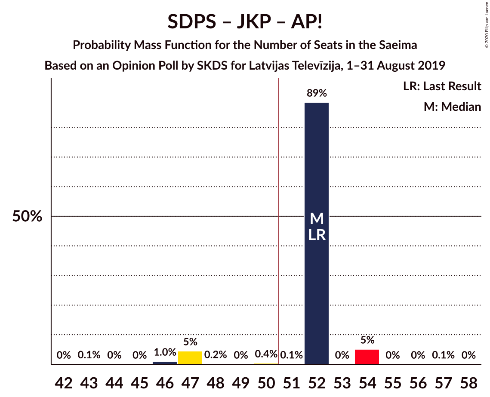
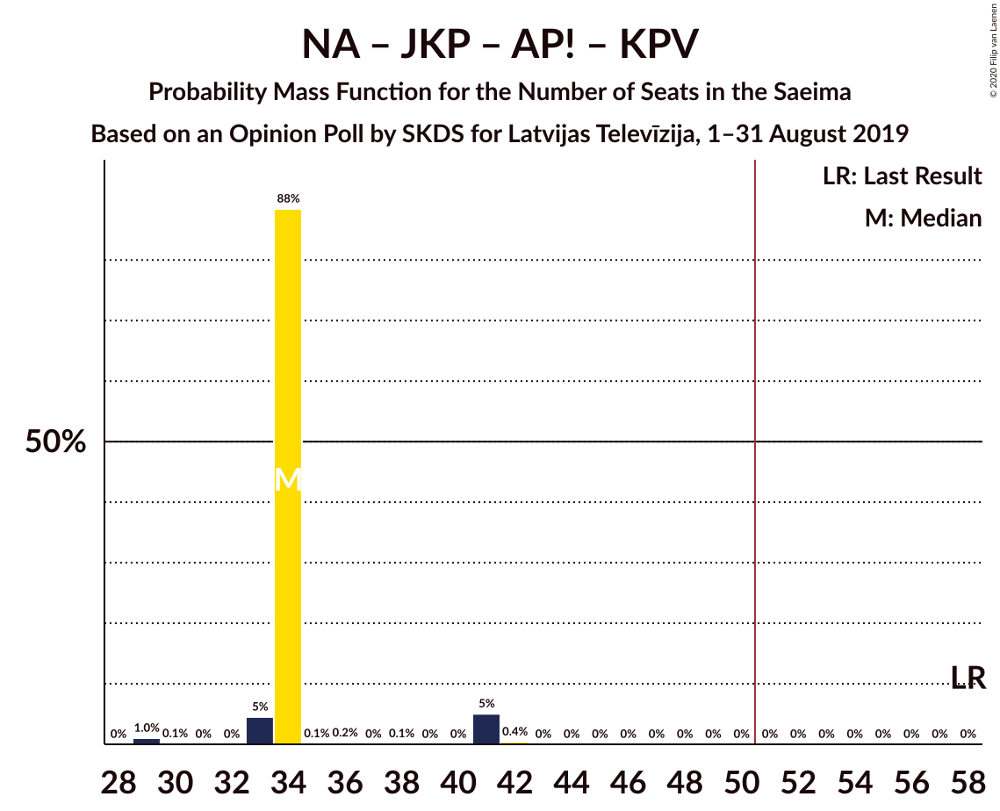

# Opinion Poll by SKDS for Latvijas Televīzija, 1–31 August 2019

<a href="#voting-intentions">Voting Intentions</a> | <a href="#seats">Seats</a> | <a href="#coalitions">Coalitions</a> | <a href="#technical-information">Technical Information</a>

## Voting Intentions

### Confidence Intervals

| Party | Last Result | Poll Result | 80% Confidence Interval | 90% Confidence Interval | 95% Confidence Interval | 99% Confidence Interval |
|:-----:|:-----------:|:-----------:|:-----------------------:|:-----------------------:|:-----------------------:|:-----------------------:|
| Sociāldemokrātiskā partija “Saskaņa” | 19.8% | 25.5% | 23.6–27.5% |23.1–28.0% |22.6–28.5% |21.7–29.5% |
| Jaunā VIENOTĪBA | 6.7% | 13.9% | 12.5–15.6% |12.1–16.0% |11.7–16.4% |11.1–17.3% |
| Zaļo un Zemnieku savienība | 9.9% | 13.1% | 11.7–14.7% |11.3–15.2% |11.0–15.6% |10.3–16.4% |
| Nacionālā apvienība „Visu Latvijai!”–„Tēvzemei un Brīvībai/LNNK” | 11.0% | 11.4% | 10.1–12.9% |9.7–13.4% |9.4–13.7% |8.8–14.5% |
| Jaunā konservatīvā partija | 13.6% | 10.0% | 8.7–11.4% |8.4–11.8% |8.1–12.2% |7.6–12.9% |
| Attīstībai/Par! | 12.0% | 9.8% | 8.6–11.3% |8.3–11.7% |8.0–12.1% |7.5–12.8% |
| Latvijas Reģionu Apvienība | 4.1% | 4.6% | 3.7–5.6% |3.5–5.9% |3.3–6.2% |3.0–6.8% |
| Politiskā partija „KPV LV” | 14.2% | 4.1% | 3.3–5.1% |3.1–5.4% |2.9–5.7% |2.6–6.2% |
| Latvijas Krievu savienība | 3.2% | 3.8% | 3.1–4.8% |2.9–5.1% |2.7–5.4% |2.4–5.9% |
| PROGRESĪVIE | 2.6% | 3.2% | 2.6–4.2% |2.4–4.5% |2.2–4.7% |2.0–5.2% |

*Note:* The poll result column reflects the actual value used in the calculations. Published results may vary slightly, and in addition be rounded to fewer digits.

## Seats

### Confidence Intervals

| Party | Last Result | Median | 80% Confidence Interval | 90% Confidence Interval | 95% Confidence Interval | 99% Confidence Interval |
|:-----:|:-----------:|:------:|:-----------------------:|:-----------------------:|:-----------------------:|:-----------------------:|
| <a href="#sociāldemokrātiskā-partija-“saskaņa”">Sociāldemokrātiskā partija “Saskaņa”</a> | 23 | 29 | 29–30 |29–30 |29–30 |27–30 |
| <a href="#jaunā-vienotība">Jaunā VIENOTĪBA</a> | 8 | 18 | 16–18 |11–18 |11–18 |11–18 |
| <a href="#zaļo-un-zemnieku-savienība">Zaļo un Zemnieku savienība</a> | 11 | 19 | 17–19 |12–19 |12–19 |11–19 |
| <a href="#nacionālā-apvienība-„visu-latvijai!”–„tēvzemei-un-brīvībai/lnnk”">Nacionālā apvienība „Visu Latvijai!”–„Tēvzemei un Brīvībai/LNNK”</a> | 13 | 11 | 11 |11–17 |11–17 |10–17 |
| <a href="#jaunā-konservatīvā-partija">Jaunā konservatīvā partija</a> | 16 | 9 | 9 |9–11 |8–11 |8–11 |
| <a href="#attīstībai/par!">Attīstībai/Par!</a> | 13 | 14 | 13–14 |9–14 |9–14 |9–14 |
| <a href="#latvijas-reģionu-apvienība">Latvijas Reģionu Apvienība</a> | 0 | 0 | 0–6 |0–6 |0–6 |0–6 |
| <a href="#politiskā-partija-„kpv-lv”">Politiskā partija „KPV LV”</a> | 16 | 0 | 0 |0–5 |0–5 |0–6 |
| <a href="#latvijas-krievu-savienība">Latvijas Krievu savienība</a> | 0 | 0 | 0 |0 |0 |0–5 |
| <a href="#progresīvie">PROGRESĪVIE</a> | 0 | 0 | 0 |0 |0 |0–5 |

### Sociāldemokrātiskā partija “Saskaņa”

*For a full overview of the results for this party, see the [Sociāldemokrātiskā partija “Saskaņa”](party-sociāldemokrātiskāpartija“saskaņa”.html) page.*

| Number of Seats | Probability | Accumulated | Special Marks |
|:---------------:|:-----------:|:-----------:|:-------------:|
| 23 | 0% | 100% | Last Result |
| 24 | 0% | 100% |  |
| 25 | 0% | 100% |  |
| 26 | 0% | 100% |  |
| 27 | 1.4% | 100% |  |
| 28 | 0% | 98.6% |  |
| 29 | 89% | 98.6% | Median |
| 30 | 10% | 10% |  |
| 31 | 0.2% | 0.3% |  |
| 32 | 0% | 0.1% |  |
| 33 | 0.1% | 0.1% |  |
| 34 | 0.1% | 0.1% |  |
| 35 | 0% | 0% |  |

### Jaunā VIENOTĪBA

*For a full overview of the results for this party, see the [Jaunā VIENOTĪBA](party-jaunāvienotība.html) page.*

| Number of Seats | Probability | Accumulated | Special Marks |
|:---------------:|:-----------:|:-----------:|:-------------:|
| 8 | 0% | 100% | Last Result |
| 9 | 0% | 100% |  |
| 10 | 0% | 100% |  |
| 11 | 5% | 100% |  |
| 12 | 0.4% | 95% |  |
| 13 | 0% | 95% |  |
| 14 | 5% | 95% |  |
| 15 | 0% | 90% |  |
| 16 | 0.3% | 90% |  |
| 17 | 1.1% | 90% |  |
| 18 | 89% | 89% | Median |
| 19 | 0% | 0% |  |

### Zaļo un Zemnieku savienība

*For a full overview of the results for this party, see the [Zaļo un Zemnieku savienība](party-zaļounzemniekusavienība.html) page.*

| Number of Seats | Probability | Accumulated | Special Marks |
|:---------------:|:-----------:|:-----------:|:-------------:|
| 11 | 1.4% | 100% | Last Result |
| 12 | 5% | 98.6% |  |
| 13 | 0.1% | 94% |  |
| 14 | 0.1% | 93% |  |
| 15 | 0% | 93% |  |
| 16 | 0% | 93% |  |
| 17 | 5% | 93% |  |
| 18 | 0% | 88% |  |
| 19 | 88% | 88% | Median |
| 20 | 0% | 0% |  |

### Nacionālā apvienība „Visu Latvijai!”–„Tēvzemei un Brīvībai/LNNK”

*For a full overview of the results for this party, see the [Nacionālā apvienība „Visu Latvijai!”–„Tēvzemei un Brīvībai/LNNK”](party-nacionālāapvienība„visulatvijai”–„tēvzemeiunbrīvībailnnk”.html) page.*

| Number of Seats | Probability | Accumulated | Special Marks |
|:---------------:|:-----------:|:-----------:|:-------------:|
| 10 | 1.0% | 100% |  |
| 11 | 93% | 99.0% | Median |
| 12 | 0.1% | 6% |  |
| 13 | 0.5% | 6% | Last Result |
| 14 | 0.1% | 5% |  |
| 15 | 0.1% | 5% |  |
| 16 | 0.1% | 5% |  |
| 17 | 5% | 5% |  |
| 18 | 0% | 0% |  |

### Jaunā konservatīvā partija

*For a full overview of the results for this party, see the [Jaunā konservatīvā partija](party-jaunākonservatīvāpartija.html) page.*

| Number of Seats | Probability | Accumulated | Special Marks |
|:---------------:|:-----------:|:-----------:|:-------------:|
| 7 | 0.1% | 100% |  |
| 8 | 5% | 99.9% |  |
| 9 | 88% | 95% | Median |
| 10 | 1.2% | 7% |  |
| 11 | 5% | 6% |  |
| 12 | 0% | 0.2% |  |
| 13 | 0.1% | 0.2% |  |
| 14 | 0.1% | 0.1% |  |
| 15 | 0% | 0% |  |
| 16 | 0% | 0% | Last Result |

### Attīstībai/Par!

*For a full overview of the results for this party, see the [Attīstībai/Par!](party-attīstībaipar.html) page.*

| Number of Seats | Probability | Accumulated | Special Marks |
|:---------------:|:-----------:|:-----------:|:-------------:|
| 7 | 0.4% | 100% |  |
| 8 | 0.1% | 99.6% |  |
| 9 | 6% | 99.5% |  |
| 10 | 0% | 94% |  |
| 11 | 0% | 94% |  |
| 12 | 0.4% | 94% |  |
| 13 | 5% | 94% | Last Result |
| 14 | 88% | 89% | Median |
| 15 | 0% | 0.1% |  |
| 16 | 0.1% | 0.1% |  |
| 17 | 0% | 0% |  |

### Latvijas Reģionu Apvienība

*For a full overview of the results for this party, see the [Latvijas Reģionu Apvienība](party-latvijasreģionuapvienība.html) page.*

| Number of Seats | Probability | Accumulated | Special Marks |
|:---------------:|:-----------:|:-----------:|:-------------:|
| 0 | 89% | 100% | Last Result, Median |
| 1 | 0% | 11% |  |
| 2 | 0% | 11% |  |
| 3 | 0% | 11% |  |
| 4 | 0% | 11% |  |
| 5 | 0% | 11% |  |
| 6 | 11% | 11% |  |
| 7 | 0% | 0.4% |  |
| 8 | 0.4% | 0.4% |  |
| 9 | 0% | 0% |  |

### Politiskā partija „KPV LV”

*For a full overview of the results for this party, see the [Politiskā partija „KPV LV”](party-politiskāpartija„kpvlv”.html) page.*

| Number of Seats | Probability | Accumulated | Special Marks |
|:---------------:|:-----------:|:-----------:|:-------------:|
| 0 | 95% | 100% | Median |
| 1 | 0% | 5% |  |
| 2 | 0% | 5% |  |
| 3 | 0% | 5% |  |
| 4 | 0% | 5% |  |
| 5 | 5% | 5% |  |
| 6 | 0.7% | 0.7% |  |
| 7 | 0% | 0% |  |
| 8 | 0% | 0% |  |
| 9 | 0% | 0% |  |
| 10 | 0% | 0% |  |
| 11 | 0% | 0% |  |
| 12 | 0% | 0% |  |
| 13 | 0% | 0% |  |
| 14 | 0% | 0% |  |
| 15 | 0% | 0% |  |
| 16 | 0% | 0% | Last Result |

### Latvijas Krievu savienība

*For a full overview of the results for this party, see the [Latvijas Krievu savienība](party-latvijaskrievusavienība.html) page.*

| Number of Seats | Probability | Accumulated | Special Marks |
|:---------------:|:-----------:|:-----------:|:-------------:|
| 0 | 99.0% | 100% | Last Result, Median |
| 1 | 0% | 1.0% |  |
| 2 | 0% | 1.0% |  |
| 3 | 0% | 1.0% |  |
| 4 | 0% | 1.0% |  |
| 5 | 1.0% | 1.0% |  |
| 6 | 0% | 0% |  |

### PROGRESĪVIE

*For a full overview of the results for this party, see the [PROGRESĪVIE](party-progresīvie.html) page.*

| Number of Seats | Probability | Accumulated | Special Marks |
|:---------------:|:-----------:|:-----------:|:-------------:|
| 0 | 99.0% | 100% | Last Result, Median |
| 1 | 0% | 1.0% |  |
| 2 | 0% | 1.0% |  |
| 3 | 0% | 1.0% |  |
| 4 | 0% | 1.0% |  |
| 5 | 1.0% | 1.0% |  |
| 6 | 0% | 0% |  |

## Coalitions

### Confidence Intervals

| Coalition | Last Result | Median | Majority? | 80% Confidence Interval | 90% Confidence Interval | 95% Confidence Interval | 99% Confidence Interval |
|:---------:|:-----------:|:------:|:---------:|:-----------------------:|:-----------------------:|:-----------------------:|:-----------------------:|
| Jaunā VIENOTĪBA – Zaļo un Zemnieku savienība – Nacionālā apvienība „Visu Latvijai!”–„Tēvzemei un Brīvībai/LNNK” – Jaunā konservatīvā partija – Attīstībai/Par! | 61 | 71 | 100% | 64–71 | 59–71 | 59–71 | 57–71 |
| Jaunā VIENOTĪBA – Zaļo un Zemnieku savienība – Nacionālā apvienība „Visu Latvijai!”–„Tēvzemei un Brīvībai/LNNK” – Attīstībai/Par! | 45 | 62 | 98% | 53–62 | 51–62 | 51–62 | 47–62 |
| Jaunā VIENOTĪBA – Zaļo un Zemnieku savienība – Nacionālā apvienība „Visu Latvijai!”–„Tēvzemei un Brīvībai/LNNK” – Jaunā konservatīvā partija | 48 | 57 | 94% | 51–57 | 50–57 | 50–57 | 48–57 |
| Sociāldemokrātiskā partija “Saskaņa” – Jaunā konservatīvā partija – Attīstībai/Par! | 52 | 52 | 94% | 52 | 47–54 | 47–54 | 46–54 |
| Zaļo un Zemnieku savienība – Nacionālā apvienība „Visu Latvijai!”–„Tēvzemei un Brīvībai/LNNK” – Jaunā konservatīvā partija – Attīstībai/Par! | 53 | 53 | 94% | 53 | 45–53 | 45–53 | 40–53 |
| Jaunā VIENOTĪBA – Nacionālā apvienība „Visu Latvijai!”–„Tēvzemei un Brīvībai/LNNK” – Jaunā konservatīvā partija – Attīstībai/Par! – Politiskā partija „KPV LV” | 66 | 52 | 94% | 52 | 47–52 | 47–52 | 46–54 |
| Jaunā VIENOTĪBA – Nacionālā apvienība „Visu Latvijai!”–„Tēvzemei un Brīvībai/LNNK” – Jaunā konservatīvā partija – Attīstībai/Par! | 50 | 52 | 94% | 52 | 46–52 | 42–52 | 42–52 |
| Sociāldemokrātiskā partija “Saskaņa” – Zaļo un Zemnieku savienība – Politiskā partija „KPV LV” | 50 | 48 | 5% | 48 | 42–48 | 42–52 | 38–52 |
| Jaunā VIENOTĪBA – Zaļo un Zemnieku savienība – Nacionālā apvienība „Visu Latvijai!”–„Tēvzemei un Brīvībai/LNNK” | 32 | 48 | 0.1% | 42–48 | 40–48 | 40–48 | 38–48 |
| Zaļo un Zemnieku savienība – Nacionālā apvienība „Visu Latvijai!”–„Tēvzemei un Brīvībai/LNNK” – Attīstībai/Par! | 37 | 44 | 0% | 42–44 | 37–44 | 37–44 | 30–44 |
| Jaunā VIENOTĪBA – Nacionālā apvienība „Visu Latvijai!”–„Tēvzemei un Brīvībai/LNNK” – Attīstībai/Par! – Politiskā partija „KPV LV” | 50 | 43 | 0% | 41–43 | 39–43 | 39–43 | 36–43 |
| Sociāldemokrātiskā partija “Saskaņa” – Attīstībai/Par! | 36 | 43 | 0% | 43 | 39–43 | 39–43 | 36–43 |
| Jaunā VIENOTĪBA – Jaunā konservatīvā partija – Attīstībai/Par! – Politiskā partija „KPV LV” | 53 | 41 | 0% | 36–41 | 35–41 | 35–41 | 35–41 |
| Nacionālā apvienība „Visu Latvijai!”–„Tēvzemei un Brīvībai/LNNK” – Jaunā konservatīvā partija – Attīstībai/Par! – Politiskā partija „KPV LV” | 58 | 34 | 0% | 34 | 33–41 | 33–41 | 29–41 |
| Zaļo un Zemnieku savienība – Nacionālā apvienība „Visu Latvijai!”–„Tēvzemei un Brīvībai/LNNK” – Jaunā konservatīvā partija | 40 | 39 | 0% | 39 | 36–40 | 36–40 | 31–40 |
| Jaunā VIENOTĪBA – Nacionālā apvienība „Visu Latvijai!”–„Tēvzemei un Brīvībai/LNNK” – Jaunā konservatīvā partija – Politiskā partija „KPV LV” | 53 | 38 | 0% | 38 | 38–39 | 38–39 | 37–42 |
| Sociāldemokrātiskā partija “Saskaņa” – Politiskā partija „KPV LV” | 39 | 29 | 0% | 29–30 | 29–33 | 29–35 | 27–35 |

### Jaunā VIENOTĪBA – Zaļo un Zemnieku savienība – Nacionālā apvienība „Visu Latvijai!”–„Tēvzemei un Brīvībai/LNNK” – Jaunā konservatīvā partija – Attīstībai/Par!

| Number of Seats | Probability | Accumulated | Special Marks |
|:---------------:|:-----------:|:-----------:|:-------------:|
| 57 | 1.0% | 100% |  |
| 58 | 0% | 99.0% |  |
| 59 | 5% | 99.0% |  |
| 60 | 0.1% | 94% |  |
| 61 | 0.1% | 94% | Last Result |
| 62 | 0% | 94% |  |
| 63 | 0.2% | 94% |  |
| 64 | 5% | 94% |  |
| 65 | 0.1% | 89% |  |
| 66 | 0% | 89% |  |
| 67 | 0% | 89% |  |
| 68 | 0% | 89% |  |
| 69 | 0% | 89% |  |
| 70 | 0.1% | 89% |  |
| 71 | 88% | 88% | Median |
| 72 | 0% | 0% |  |

### Jaunā VIENOTĪBA – Zaļo un Zemnieku savienība – Nacionālā apvienība „Visu Latvijai!”–„Tēvzemei un Brīvībai/LNNK” – Attīstībai/Par!

| Number of Seats | Probability | Accumulated | Special Marks |
|:---------------:|:-----------:|:-----------:|:-------------:|
| 45 | 0% | 100% | Last Result |
| 46 | 0% | 100% |  |
| 47 | 1.1% | 100% |  |
| 48 | 0.4% | 98.9% |  |
| 49 | 0% | 98.5% |  |
| 50 | 0.1% | 98.5% |  |
| 51 | 5% | 98% | Majority |
| 52 | 0% | 94% |  |
| 53 | 5% | 94% |  |
| 54 | 0% | 89% |  |
| 55 | 0% | 89% |  |
| 56 | 0% | 89% |  |
| 57 | 0% | 89% |  |
| 58 | 0.1% | 89% |  |
| 59 | 0.1% | 89% |  |
| 60 | 0% | 88% |  |
| 61 | 0% | 88% |  |
| 62 | 88% | 88% | Median |
| 63 | 0% | 0% |  |

### Jaunā VIENOTĪBA – Zaļo un Zemnieku savienība – Nacionālā apvienība „Visu Latvijai!”–„Tēvzemei un Brīvībai/LNNK” – Jaunā konservatīvā partija

| Number of Seats | Probability | Accumulated | Special Marks |
|:---------------:|:-----------:|:-----------:|:-------------:|
| 47 | 0.4% | 100% |  |
| 48 | 1.0% | 99.6% | Last Result |
| 49 | 0% | 98.6% |  |
| 50 | 5% | 98.6% |  |
| 51 | 5% | 94% | Majority |
| 52 | 0.1% | 89% |  |
| 53 | 0% | 89% |  |
| 54 | 0.1% | 89% |  |
| 55 | 0% | 89% |  |
| 56 | 0.2% | 89% |  |
| 57 | 88% | 89% | Median |
| 58 | 0.1% | 0.2% |  |
| 59 | 0% | 0.1% |  |
| 60 | 0% | 0.1% |  |
| 61 | 0.1% | 0.1% |  |
| 62 | 0% | 0% |  |

### Sociāldemokrātiskā partija “Saskaņa” – Jaunā konservatīvā partija – Attīstībai/Par!

| Number of Seats | Probability | Accumulated | Special Marks |
|:---------------:|:-----------:|:-----------:|:-------------:|
| 43 | 0.1% | 100% |  |
| 44 | 0% | 99.9% |  |
| 45 | 0% | 99.9% |  |
| 46 | 1.0% | 99.9% |  |
| 47 | 5% | 98.8% |  |
| 48 | 0.2% | 94% |  |
| 49 | 0% | 94% |  |
| 50 | 0.4% | 94% |  |
| 51 | 0.1% | 94% | Majority |
| 52 | 89% | 94% | Last Result, Median |
| 53 | 0% | 5% |  |
| 54 | 5% | 5% |  |
| 55 | 0% | 0.1% |  |
| 56 | 0% | 0.1% |  |
| 57 | 0.1% | 0.1% |  |
| 58 | 0% | 0% |  |

### Zaļo un Zemnieku savienība – Nacionālā apvienība „Visu Latvijai!”–„Tēvzemei un Brīvībai/LNNK” – Jaunā konservatīvā partija – Attīstībai/Par!

| Number of Seats | Probability | Accumulated | Special Marks |
|:---------------:|:-----------:|:-----------:|:-------------:|
| 40 | 1.0% | 100% |  |
| 41 | 0% | 99.0% |  |
| 42 | 0% | 99.0% |  |
| 43 | 0% | 99.0% |  |
| 44 | 0.1% | 99.0% |  |
| 45 | 5% | 98.9% |  |
| 46 | 0.1% | 94% |  |
| 47 | 0.6% | 94% |  |
| 48 | 0% | 94% |  |
| 49 | 0% | 94% |  |
| 50 | 0% | 94% |  |
| 51 | 0% | 94% | Majority |
| 52 | 0% | 94% |  |
| 53 | 93% | 94% | Last Result, Median |
| 54 | 0% | 0.1% |  |
| 55 | 0% | 0.1% |  |
| 56 | 0.1% | 0.1% |  |
| 57 | 0% | 0% |  |

### Jaunā VIENOTĪBA – Nacionālā apvienība „Visu Latvijai!”–„Tēvzemei un Brīvībai/LNNK” – Jaunā konservatīvā partija – Attīstībai/Par! – Politiskā partija „KPV LV”

| Number of Seats | Probability | Accumulated | Special Marks |
|:---------------:|:-----------:|:-----------:|:-------------:|
| 46 | 1.0% | 100% |  |
| 47 | 5% | 99.0% |  |
| 48 | 0.1% | 94% |  |
| 49 | 0% | 94% |  |
| 50 | 0% | 94% |  |
| 51 | 0% | 94% | Majority |
| 52 | 94% | 94% | Median |
| 53 | 0.1% | 0.6% |  |
| 54 | 0.4% | 0.5% |  |
| 55 | 0% | 0.1% |  |
| 56 | 0.1% | 0.1% |  |
| 57 | 0% | 0% |  |
| 58 | 0% | 0% |  |
| 59 | 0% | 0% |  |
| 60 | 0% | 0% |  |
| 61 | 0% | 0% |  |
| 62 | 0% | 0% |  |
| 63 | 0% | 0% |  |
| 64 | 0% | 0% |  |
| 65 | 0% | 0% |  |
| 66 | 0% | 0% | Last Result |

### Jaunā VIENOTĪBA – Nacionālā apvienība „Visu Latvijai!”–„Tēvzemei un Brīvībai/LNNK” – Jaunā konservatīvā partija – Attīstībai/Par!

| Number of Seats | Probability | Accumulated | Special Marks |
|:---------------:|:-----------:|:-----------:|:-------------:|
| 42 | 5% | 100% |  |
| 43 | 0% | 95% |  |
| 44 | 0% | 95% |  |
| 45 | 0% | 95% |  |
| 46 | 1.2% | 95% |  |
| 47 | 0% | 94% |  |
| 48 | 0.5% | 94% |  |
| 49 | 0% | 94% |  |
| 50 | 0% | 94% | Last Result |
| 51 | 0% | 94% | Majority |
| 52 | 93% | 94% | Median |
| 53 | 0.1% | 0.2% |  |
| 54 | 0% | 0.1% |  |
| 55 | 0% | 0.1% |  |
| 56 | 0.1% | 0.1% |  |
| 57 | 0% | 0% |  |

### Sociāldemokrātiskā partija “Saskaņa” – Zaļo un Zemnieku savienība – Politiskā partija „KPV LV”

| Number of Seats | Probability | Accumulated | Special Marks |
|:---------------:|:-----------:|:-----------:|:-------------:|
| 38 | 1.0% | 100% |  |
| 39 | 0% | 99.0% |  |
| 40 | 0% | 99.0% |  |
| 41 | 0.1% | 98.9% |  |
| 42 | 5% | 98.9% |  |
| 43 | 0% | 94% |  |
| 44 | 0.4% | 94% |  |
| 45 | 0% | 93% |  |
| 46 | 0.1% | 93% |  |
| 47 | 0.1% | 93% |  |
| 48 | 88% | 93% | Median |
| 49 | 0% | 5% |  |
| 50 | 0% | 5% | Last Result |
| 51 | 0% | 5% | Majority |
| 52 | 5% | 5% |  |
| 53 | 0% | 0.2% |  |
| 54 | 0.2% | 0.2% |  |
| 55 | 0% | 0% |  |

### Jaunā VIENOTĪBA – Zaļo un Zemnieku savienība – Nacionālā apvienība „Visu Latvijai!”–„Tēvzemei un Brīvībai/LNNK”

| Number of Seats | Probability | Accumulated | Special Marks |
|:---------------:|:-----------:|:-----------:|:-------------:|
| 32 | 0% | 100% | Last Result |
| 33 | 0% | 100% |  |
| 34 | 0% | 100% |  |
| 35 | 0% | 100% |  |
| 36 | 0.4% | 100% |  |
| 37 | 0% | 99.6% |  |
| 38 | 1.0% | 99.6% |  |
| 39 | 0% | 98.6% |  |
| 40 | 5% | 98.6% |  |
| 41 | 0% | 94% |  |
| 42 | 5% | 94% |  |
| 43 | 0.1% | 89% |  |
| 44 | 0% | 89% |  |
| 45 | 0% | 89% |  |
| 46 | 0.2% | 89% |  |
| 47 | 0% | 89% |  |
| 48 | 88% | 89% | Median |
| 49 | 0% | 0.2% |  |
| 50 | 0.1% | 0.2% |  |
| 51 | 0.1% | 0.1% | Majority |
| 52 | 0% | 0% |  |

### Zaļo un Zemnieku savienība – Nacionālā apvienība „Visu Latvijai!”–„Tēvzemei un Brīvībai/LNNK” – Attīstībai/Par!

| Number of Seats | Probability | Accumulated | Special Marks |
|:---------------:|:-----------:|:-----------:|:-------------:|
| 30 | 1.0% | 100% |  |
| 31 | 0.1% | 99.0% |  |
| 32 | 0% | 98.9% |  |
| 33 | 0.1% | 98.9% |  |
| 34 | 0.1% | 98.8% |  |
| 35 | 0% | 98.8% |  |
| 36 | 0.4% | 98.8% |  |
| 37 | 5% | 98% | Last Result |
| 38 | 0% | 94% |  |
| 39 | 0% | 94% |  |
| 40 | 0.1% | 94% |  |
| 41 | 0.1% | 94% |  |
| 42 | 5% | 94% |  |
| 43 | 0% | 89% |  |
| 44 | 88% | 89% | Median |
| 45 | 0.1% | 0.1% |  |
| 46 | 0% | 0% |  |

### Jaunā VIENOTĪBA – Nacionālā apvienība „Visu Latvijai!”–„Tēvzemei un Brīvībai/LNNK” – Attīstībai/Par! – Politiskā partija „KPV LV”

| Number of Seats | Probability | Accumulated | Special Marks |
|:---------------:|:-----------:|:-----------:|:-------------:|
| 36 | 1.0% | 100% |  |
| 37 | 0% | 99.0% |  |
| 38 | 0% | 99.0% |  |
| 39 | 5% | 99.0% |  |
| 40 | 0.1% | 94% |  |
| 41 | 5% | 94% |  |
| 42 | 0.3% | 89% |  |
| 43 | 89% | 89% | Median |
| 44 | 0% | 0.1% |  |
| 45 | 0.1% | 0.1% |  |
| 46 | 0% | 0% |  |
| 47 | 0% | 0% |  |
| 48 | 0% | 0% |  |
| 49 | 0% | 0% |  |
| 50 | 0% | 0% | Last Result |

### Sociāldemokrātiskā partija “Saskaņa” – Attīstībai/Par!

| Number of Seats | Probability | Accumulated | Special Marks |
|:---------------:|:-----------:|:-----------:|:-------------:|
| 36 | 1.1% | 100% | Last Result |
| 37 | 0% | 98.8% |  |
| 38 | 0.2% | 98.8% |  |
| 39 | 5% | 98.6% |  |
| 40 | 0.1% | 94% |  |
| 41 | 0% | 94% |  |
| 42 | 0.1% | 94% |  |
| 43 | 93% | 94% | Median |
| 44 | 0% | 0.1% |  |
| 45 | 0% | 0.1% |  |
| 46 | 0.1% | 0.1% |  |
| 47 | 0% | 0% |  |

### Jaunā VIENOTĪBA – Jaunā konservatīvā partija – Attīstībai/Par! – Politiskā partija „KPV LV”

| Number of Seats | Probability | Accumulated | Special Marks |
|:---------------:|:-----------:|:-----------:|:-------------:|
| 32 | 0.1% | 100% |  |
| 33 | 0% | 99.9% |  |
| 34 | 0% | 99.9% |  |
| 35 | 5% | 99.9% |  |
| 36 | 6% | 95% |  |
| 37 | 0% | 89% |  |
| 38 | 0% | 89% |  |
| 39 | 0.3% | 89% |  |
| 40 | 0.1% | 89% |  |
| 41 | 89% | 89% | Median |
| 42 | 0% | 0.1% |  |
| 43 | 0.1% | 0.1% |  |
| 44 | 0% | 0% |  |
| 45 | 0% | 0% |  |
| 46 | 0% | 0% |  |
| 47 | 0% | 0% |  |
| 48 | 0% | 0% |  |
| 49 | 0% | 0% |  |
| 50 | 0% | 0% |  |
| 51 | 0% | 0% | Majority |
| 52 | 0% | 0% |  |
| 53 | 0% | 0% | Last Result |

### Nacionālā apvienība „Visu Latvijai!”–„Tēvzemei un Brīvībai/LNNK” – Jaunā konservatīvā partija – Attīstībai/Par! – Politiskā partija „KPV LV”

| Number of Seats | Probability | Accumulated | Special Marks |
|:---------------:|:-----------:|:-----------:|:-------------:|
| 29 | 1.0% | 100% |  |
| 30 | 0.1% | 99.0% |  |
| 31 | 0% | 98.9% |  |
| 32 | 0% | 98.9% |  |
| 33 | 5% | 98.9% |  |
| 34 | 88% | 94% | Median |
| 35 | 0.1% | 6% |  |
| 36 | 0.2% | 6% |  |
| 37 | 0% | 6% |  |
| 38 | 0.1% | 6% |  |
| 39 | 0% | 5% |  |
| 40 | 0% | 5% |  |
| 41 | 5% | 5% |  |
| 42 | 0.4% | 0.4% |  |
| 43 | 0% | 0% |  |
| 44 | 0% | 0% |  |
| 45 | 0% | 0% |  |
| 46 | 0% | 0% |  |
| 47 | 0% | 0% |  |
| 48 | 0% | 0% |  |
| 49 | 0% | 0% |  |
| 50 | 0% | 0% |  |
| 51 | 0% | 0% | Majority |
| 52 | 0% | 0% |  |
| 53 | 0% | 0% |  |
| 54 | 0% | 0% |  |
| 55 | 0% | 0% |  |
| 56 | 0% | 0% |  |
| 57 | 0% | 0% |  |
| 58 | 0% | 0% | Last Result |

### Zaļo un Zemnieku savienība – Nacionālā apvienība „Visu Latvijai!”–„Tēvzemei un Brīvībai/LNNK” – Jaunā konservatīvā partija

| Number of Seats | Probability | Accumulated | Special Marks |
|:---------------:|:-----------:|:-----------:|:-------------:|
| 31 | 1.0% | 100% |  |
| 32 | 0% | 99.0% |  |
| 33 | 0% | 99.0% |  |
| 34 | 0% | 99.0% |  |
| 35 | 0.4% | 99.0% |  |
| 36 | 5% | 98.6% |  |
| 37 | 0% | 94% |  |
| 38 | 0.1% | 94% |  |
| 39 | 88% | 94% | Median |
| 40 | 5% | 5% | Last Result |
| 41 | 0% | 0.1% |  |
| 42 | 0% | 0.1% |  |
| 43 | 0% | 0.1% |  |
| 44 | 0% | 0% |  |

### Jaunā VIENOTĪBA – Nacionālā apvienība „Visu Latvijai!”–„Tēvzemei un Brīvībai/LNNK” – Jaunā konservatīvā partija – Politiskā partija „KPV LV”

| Number of Seats | Probability | Accumulated | Special Marks |
|:---------------:|:-----------:|:-----------:|:-------------:|
| 37 | 1.0% | 100% |  |
| 38 | 93% | 99.0% | Median |
| 39 | 5% | 6% |  |
| 40 | 0.1% | 1.0% |  |
| 41 | 0.1% | 0.9% |  |
| 42 | 0.4% | 0.8% |  |
| 43 | 0% | 0.4% |  |
| 44 | 0.1% | 0.4% |  |
| 45 | 0.3% | 0.3% |  |
| 46 | 0% | 0.1% |  |
| 47 | 0.1% | 0.1% |  |
| 48 | 0% | 0% |  |
| 49 | 0% | 0% |  |
| 50 | 0% | 0% |  |
| 51 | 0% | 0% | Majority |
| 52 | 0% | 0% |  |
| 53 | 0% | 0% | Last Result |

### Sociāldemokrātiskā partija “Saskaņa” – Politiskā partija „KPV LV”

| Number of Seats | Probability | Accumulated | Special Marks |
|:---------------:|:-----------:|:-----------:|:-------------:|
| 27 | 1.0% | 100% |  |
| 28 | 0% | 98.9% |  |
| 29 | 89% | 98.9% | Median |
| 30 | 5% | 10% |  |
| 31 | 0% | 5% |  |
| 32 | 0% | 5% |  |
| 33 | 0.4% | 5% |  |
| 34 | 0% | 5% |  |
| 35 | 5% | 5% |  |
| 36 | 0% | 0.3% |  |
| 37 | 0.2% | 0.3% |  |
| 38 | 0% | 0.1% |  |
| 39 | 0.1% | 0.1% | Last Result |
| 40 | 0.1% | 0.1% |  |
| 41 | 0% | 0% |  |

## Technical Information

### Opinion Poll

+ **Polling firm:** SKDS
+ **Commissioner(s):** Latvijas Televīzija
+ **Fieldwork period:** 1–31 August 2019

### Calculations

+ **Sample size:** 833
+ **Simulations done:** 1,024
+ **Error estimate:** 5.26%

