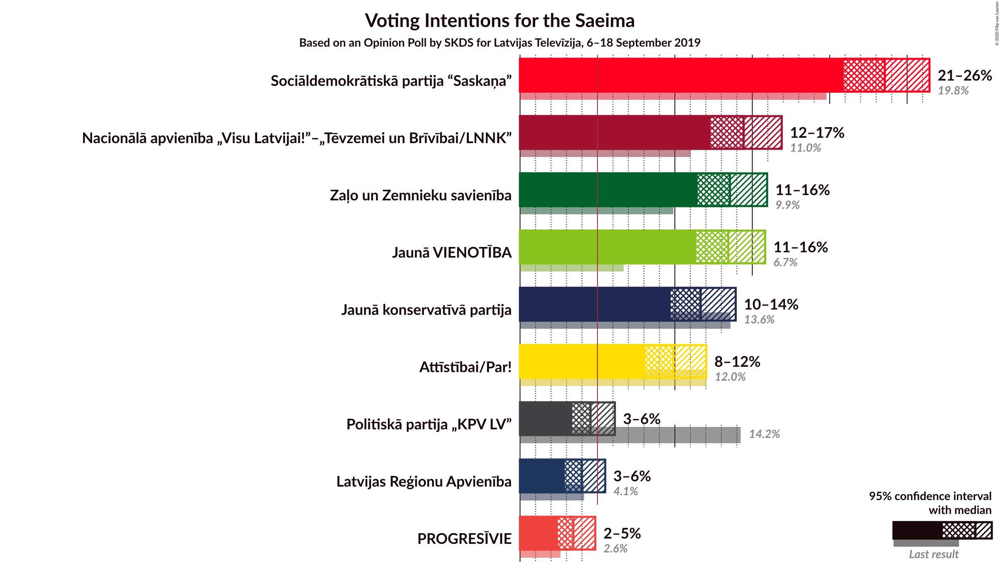
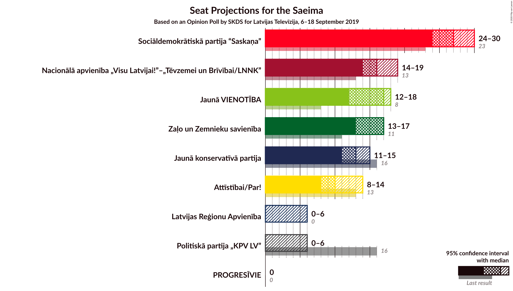
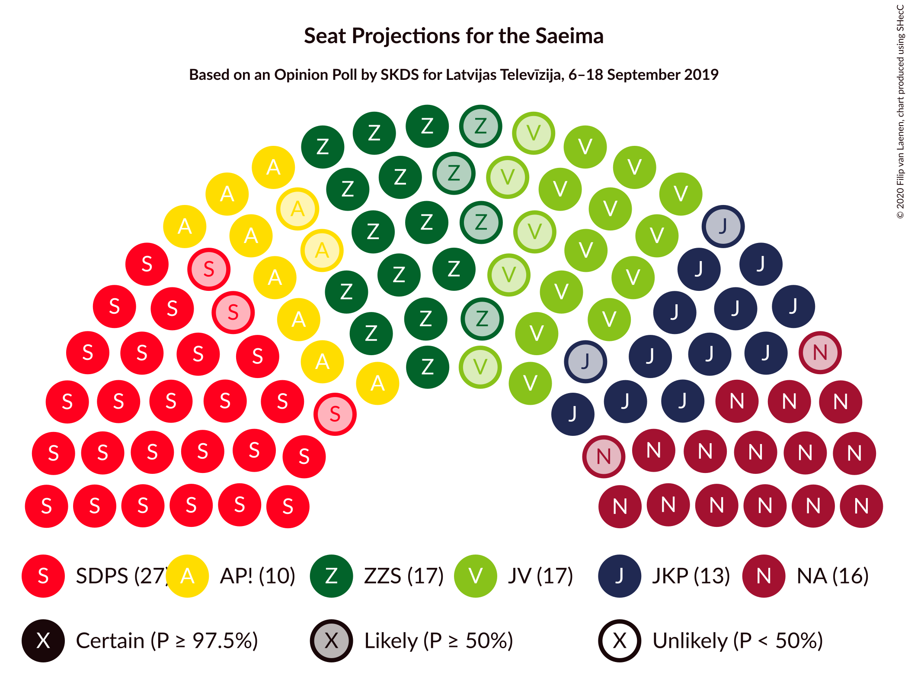
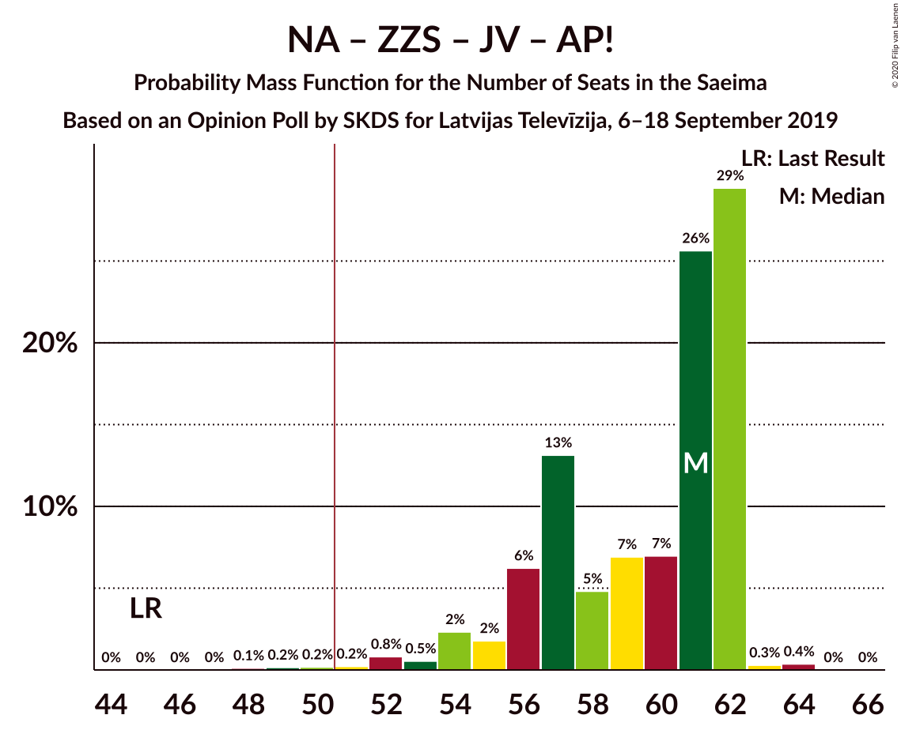
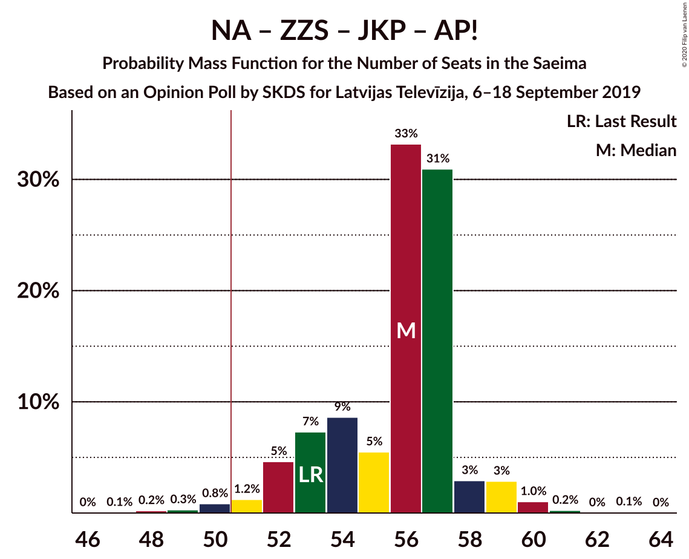
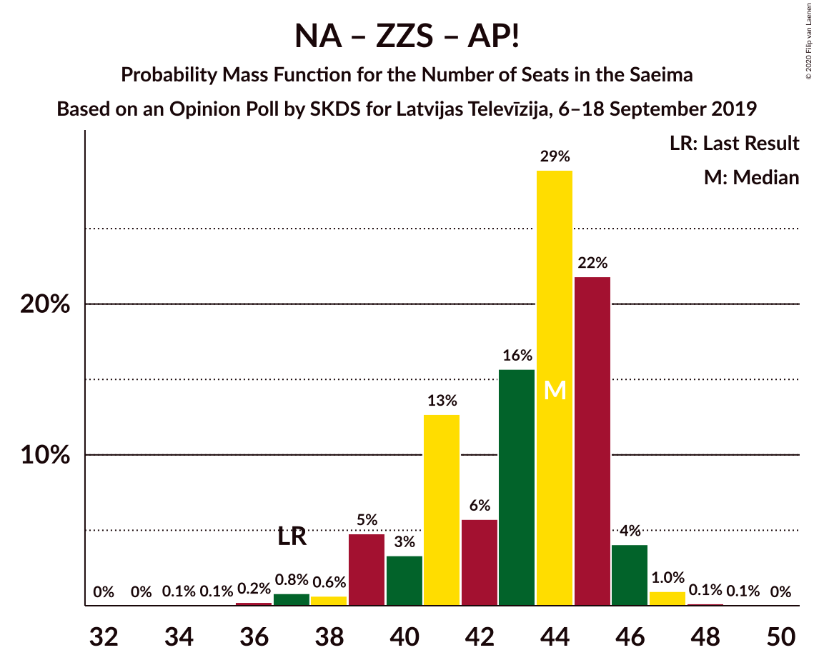
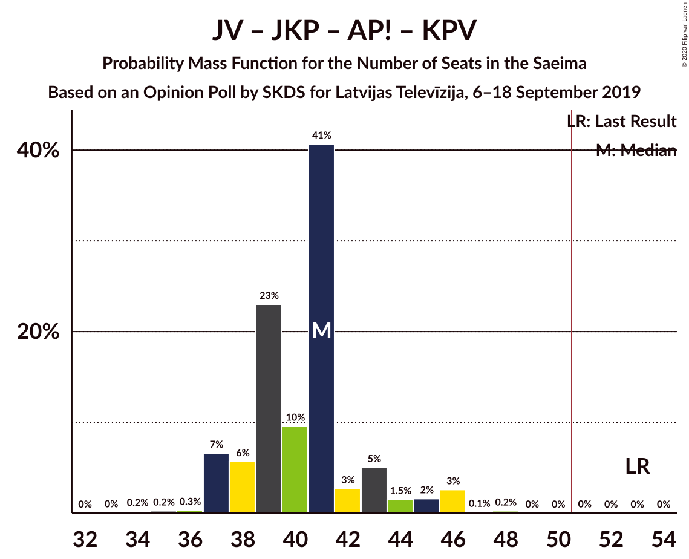

# Opinion Poll by SKDS for Latvijas Televīzija, 6–18 September 2019

<a href="#voting-intentions">Voting Intentions</a> | <a href="#seats">Seats</a> | <a href="#coalitions">Coalitions</a> | <a href="#technical-information">Technical Information</a>

## Voting Intentions

### Confidence Intervals

| Party | Last Result | Poll Result | 80% Confidence Interval | 90% Confidence Interval | 95% Confidence Interval | 99% Confidence Interval |
|:-----:|:-----------:|:-----------:|:-----------------------:|:-----------------------:|:-----------------------:|:-----------------------:|
| Sociāldemokrātiskā partija “Saskaņa” | 19.8% | 23.6% | 21.8–25.4% |21.3–26.0% |20.9–26.4% |20.1–27.4% |
| Nacionālā apvienība „Visu Latvijai!”–„Tēvzemei un Brīvībai/LNNK” | 11.0% | 14.4% | 13.0–16.0% |12.6–16.5% |12.3–16.9% |11.6–17.7% |
| Zaļo un Zemnieku savienība | 9.9% | 13.6% | 12.2–15.1% |11.8–15.6% |11.5–16.0% |10.8–16.7% |
| Jaunā VIENOTĪBA | 6.7% | 13.4% | 12.1–15.0% |11.7–15.5% |11.4–15.8% |10.7–16.6% |
| Jaunā konservatīvā partija | 13.6% | 11.7% | 10.4–13.2% |10.0–13.6% |9.7–13.9% |9.1–14.7% |
| Attīstībai/Par! | 12.0% | 9.9% | 8.7–11.3% |8.4–11.7% |8.1–12.0% |7.6–12.7% |
| Politiskā partija „KPV LV” | 14.2% | 4.6% | 3.8–5.6% |3.6–5.9% |3.4–6.1% |3.0–6.7% |
| Latvijas Reģionu Apvienība | 4.1% | 4.0% | 3.3–5.0% |3.1–5.2% |2.9–5.5% |2.6–6.0% |
| PROGRESĪVIE | 2.6% | 3.4% | 2.8–4.4% |2.6–4.6% |2.4–4.9% |2.1–5.3% |

*Note:* The poll result column reflects the actual value used in the calculations. Published results may vary slightly, and in addition be rounded to fewer digits.

## Seats

### Confidence Intervals

| Party | Last Result | Median | 80% Confidence Interval | 90% Confidence Interval | 95% Confidence Interval | 99% Confidence Interval |
|:-----:|:-----------:|:------:|:-----------------------:|:-----------------------:|:-----------------------:|:-----------------------:|
| <a href="#sociāldemokrātiskā-partija-“saskaņa”">Sociāldemokrātiskā partija “Saskaņa”</a> | 23 | 27 | 25–29 |25–30 |24–30 |22–31 |
| <a href="#nacionālā-apvienība-„visu-latvijai!”–„tēvzemei-un-brīvībai/lnnk”">Nacionālā apvienība „Visu Latvijai!”–„Tēvzemei un Brīvībai/LNNK”</a> | 13 | 16 | 15–17 |14–18 |14–19 |13–20 |
| <a href="#zaļo-un-zemnieku-savienība">Zaļo un Zemnieku savienība</a> | 11 | 17 | 14–17 |14–17 |13–17 |12–20 |
| <a href="#jaunā-vienotība">Jaunā VIENOTĪBA</a> | 8 | 17 | 15–18 |13–18 |12–18 |11–18 |
| <a href="#jaunā-konservatīvā-partija">Jaunā konservatīvā partija</a> | 16 | 13 | 11–13 |11–13 |11–15 |10–15 |
| <a href="#attīstībai/par!">Attīstībai/Par!</a> | 13 | 10 | 9–13 |9–13 |8–14 |8–14 |
| <a href="#politiskā-partija-„kpv-lv”">Politiskā partija „KPV LV”</a> | 16 | 0 | 0–5 |0–6 |0–6 |0–6 |
| <a href="#latvijas-reģionu-apvienība">Latvijas Reģionu Apvienība</a> | 0 | 0 | 0 |0–6 |0–6 |0–6 |
| <a href="#progresīvie">PROGRESĪVIE</a> | 0 | 0 | 0 |0 |0 |0 |

### Sociāldemokrātiskā partija “Saskaņa”

*For a full overview of the results for this party, see the [Sociāldemokrātiskā partija “Saskaņa”](party-sociāldemokrātiskāpartija“saskaņa”.html) page.*

| Number of Seats | Probability | Accumulated | Special Marks |
|:---------------:|:-----------:|:-----------:|:-------------:|
| 21 | 0.1% | 100% |  |
| 22 | 0.6% | 99.9% |  |
| 23 | 0.5% | 99.3% | Last Result |
| 24 | 2% | 98.9% |  |
| 25 | 29% | 97% |  |
| 26 | 17% | 67% |  |
| 27 | 17% | 50% | Median |
| 28 | 18% | 33% |  |
| 29 | 8% | 15% |  |
| 30 | 6% | 7% |  |
| 31 | 1.1% | 1.3% |  |
| 32 | 0.1% | 0.2% |  |
| 33 | 0% | 0% |  |

### Nacionālā apvienība „Visu Latvijai!”–„Tēvzemei un Brīvībai/LNNK”

*For a full overview of the results for this party, see the [Nacionālā apvienība „Visu Latvijai!”–„Tēvzemei un Brīvībai/LNNK”](party-nacionālāapvienība„visulatvijai”–„tēvzemeiunbrīvībailnnk”.html) page.*

| Number of Seats | Probability | Accumulated | Special Marks |
|:---------------:|:-----------:|:-----------:|:-------------:|
| 13 | 1.2% | 100% | Last Result |
| 14 | 5% | 98.8% |  |
| 15 | 23% | 94% |  |
| 16 | 26% | 71% | Median |
| 17 | 38% | 44% |  |
| 18 | 3% | 6% |  |
| 19 | 2% | 3% |  |
| 20 | 1.1% | 1.1% |  |
| 21 | 0% | 0% |  |

### Zaļo un Zemnieku savienība

*For a full overview of the results for this party, see the [Zaļo un Zemnieku savienība](party-zaļounzemniekusavienība.html) page.*

| Number of Seats | Probability | Accumulated | Special Marks |
|:---------------:|:-----------:|:-----------:|:-------------:|
| 11 | 0.3% | 100% | Last Result |
| 12 | 1.3% | 99.7% |  |
| 13 | 3% | 98% |  |
| 14 | 6% | 96% |  |
| 15 | 10% | 89% |  |
| 16 | 14% | 79% |  |
| 17 | 62% | 65% | Median |
| 18 | 0.8% | 2% |  |
| 19 | 0% | 2% |  |
| 20 | 1.5% | 1.5% |  |
| 21 | 0% | 0% |  |

### Jaunā VIENOTĪBA

*For a full overview of the results for this party, see the [Jaunā VIENOTĪBA](party-jaunāvienotība.html) page.*

| Number of Seats | Probability | Accumulated | Special Marks |
|:---------------:|:-----------:|:-----------:|:-------------:|
| 8 | 0% | 100% | Last Result |
| 9 | 0% | 100% |  |
| 10 | 0% | 100% |  |
| 11 | 2% | 100% |  |
| 12 | 3% | 98% |  |
| 13 | 1.3% | 96% |  |
| 14 | 4% | 94% |  |
| 15 | 10% | 91% |  |
| 16 | 27% | 81% |  |
| 17 | 21% | 54% | Median |
| 18 | 33% | 33% |  |
| 19 | 0.1% | 0.1% |  |
| 20 | 0% | 0% |  |

### Jaunā konservatīvā partija

*For a full overview of the results for this party, see the [Jaunā konservatīvā partija](party-jaunākonservatīvāpartija.html) page.*

| Number of Seats | Probability | Accumulated | Special Marks |
|:---------------:|:-----------:|:-----------:|:-------------:|
| 9 | 0.2% | 100% |  |
| 10 | 0.6% | 99.8% |  |
| 11 | 22% | 99.2% |  |
| 12 | 7% | 77% |  |
| 13 | 67% | 71% | Median |
| 14 | 0.6% | 4% |  |
| 15 | 2% | 3% |  |
| 16 | 0.5% | 0.5% | Last Result |
| 17 | 0% | 0% |  |

### Attīstībai/Par!

*For a full overview of the results for this party, see the [Attīstībai/Par!](party-attīstībaipar.html) page.*

| Number of Seats | Probability | Accumulated | Special Marks |
|:---------------:|:-----------:|:-----------:|:-------------:|
| 7 | 0.5% | 100% |  |
| 8 | 2% | 99.5% |  |
| 9 | 13% | 97% |  |
| 10 | 49% | 85% | Median |
| 11 | 5% | 36% |  |
| 12 | 14% | 31% |  |
| 13 | 13% | 17% | Last Result |
| 14 | 4% | 4% |  |
| 15 | 0% | 0.1% |  |
| 16 | 0% | 0% |  |

### Politiskā partija „KPV LV”

*For a full overview of the results for this party, see the [Politiskā partija „KPV LV”](party-politiskāpartija„kpvlv”.html) page.*

| Number of Seats | Probability | Accumulated | Special Marks |
|:---------------:|:-----------:|:-----------:|:-------------:|
| 0 | 88% | 100% | Median |
| 1 | 0% | 12% |  |
| 2 | 0% | 12% |  |
| 3 | 0% | 12% |  |
| 4 | 0% | 12% |  |
| 5 | 5% | 12% |  |
| 6 | 6% | 7% |  |
| 7 | 0.4% | 0.4% |  |
| 8 | 0% | 0% |  |
| 9 | 0% | 0% |  |
| 10 | 0% | 0% |  |
| 11 | 0% | 0% |  |
| 12 | 0% | 0% |  |
| 13 | 0% | 0% |  |
| 14 | 0% | 0% |  |
| 15 | 0% | 0% |  |
| 16 | 0% | 0% | Last Result |

### Latvijas Reģionu Apvienība

*For a full overview of the results for this party, see the [Latvijas Reģionu Apvienība](party-latvijasreģionuapvienība.html) page.*

| Number of Seats | Probability | Accumulated | Special Marks |
|:---------------:|:-----------:|:-----------:|:-------------:|
| 0 | 93% | 100% | Last Result, Median |
| 1 | 0% | 7% |  |
| 2 | 0% | 7% |  |
| 3 | 0% | 7% |  |
| 4 | 0% | 7% |  |
| 5 | 0% | 7% |  |
| 6 | 7% | 7% |  |
| 7 | 0% | 0% |  |

### PROGRESĪVIE

*For a full overview of the results for this party, see the [PROGRESĪVIE](party-progresīvie.html) page.*

| Number of Seats | Probability | Accumulated | Special Marks |
|:---------------:|:-----------:|:-----------:|:-------------:|
| 0 | 99.6% | 100% | Last Result, Median |
| 1 | 0% | 0.4% |  |
| 2 | 0% | 0.4% |  |
| 3 | 0% | 0.4% |  |
| 4 | 0% | 0.4% |  |
| 5 | 0.3% | 0.4% |  |
| 6 | 0% | 0.1% |  |
| 7 | 0.1% | 0.1% |  |
| 8 | 0% | 0% |  |

## Coalitions

### Confidence Intervals

| Coalition | Last Result | Median | Majority? | 80% Confidence Interval | 90% Confidence Interval | 95% Confidence Interval | 99% Confidence Interval |
|:---------:|:-----------:|:------:|:---------:|:-----------------------:|:-----------------------:|:-----------------------:|:-----------------------:|
| Nacionālā apvienība „Visu Latvijai!”–„Tēvzemei un Brīvībai/LNNK” – Zaļo un Zemnieku savienība – Jaunā VIENOTĪBA – Jaunā konservatīvā partija – Attīstībai/Par! | 61 | 73 | 100% | 69–75 | 67–75 | 66–75 | 63–75 |
| Nacionālā apvienība „Visu Latvijai!”–„Tēvzemei un Brīvībai/LNNK” – Zaļo un Zemnieku savienība – Jaunā VIENOTĪBA – Jaunā konservatīvā partija | 48 | 61 | 100% | 59–65 | 57–65 | 55–65 | 53–65 |
| Nacionālā apvienība „Visu Latvijai!”–„Tēvzemei un Brīvībai/LNNK” – Zaļo un Zemnieku savienība – Jaunā VIENOTĪBA – Attīstībai/Par! | 45 | 61 | 99.5% | 56–62 | 55–62 | 54–62 | 51–63 |
| Nacionālā apvienība „Visu Latvijai!”–„Tēvzemei un Brīvībai/LNNK” – Jaunā VIENOTĪBA – Jaunā konservatīvā partija – Attīstībai/Par! – Politiskā partija „KPV LV” | 66 | 57 | 99.6% | 53–59 | 52–60 | 52–61 | 51–62 |
| Nacionālā apvienība „Visu Latvijai!”–„Tēvzemei un Brīvībai/LNNK” – Jaunā VIENOTĪBA – Jaunā konservatīvā partija – Attīstībai/Par! | 50 | 56 | 98% | 52–58 | 52–59 | 51–60 | 49–61 |
| Nacionālā apvienība „Visu Latvijai!”–„Tēvzemei un Brīvībai/LNNK” – Zaļo un Zemnieku savienība – Jaunā konservatīvā partija – Attīstībai/Par! | 53 | 56 | 98.6% | 53–57 | 52–58 | 51–59 | 49–60 |
| Sociāldemokrātiskā partija “Saskaņa” – Jaunā konservatīvā partija – Attīstībai/Par! | 52 | 50 | 48% | 48–52 | 46–53 | 46–54 | 45–55 |
| Nacionālā apvienība „Visu Latvijai!”–„Tēvzemei un Brīvībai/LNNK” – Zaļo un Zemnieku savienība – Jaunā VIENOTĪBA | 32 | 49 | 32% | 46–52 | 44–52 | 43–52 | 40–52 |
| Nacionālā apvienība „Visu Latvijai!”–„Tēvzemei un Brīvībai/LNNK” – Jaunā VIENOTĪBA – Jaunā konservatīvā partija – Politiskā partija „KPV LV” | 53 | 46 | 4% | 43–48 | 43–50 | 42–51 | 41–51 |
| Nacionālā apvienība „Visu Latvijai!”–„Tēvzemei un Brīvībai/LNNK” – Zaļo un Zemnieku savienība – Jaunā konservatīvā partija | 40 | 45 | 0.1% | 43–47 | 41–47 | 40–49 | 39–50 |
| Nacionālā apvienība „Visu Latvijai!”–„Tēvzemei un Brīvībai/LNNK” – Jaunā VIENOTĪBA – Attīstībai/Par! – Politiskā partija „KPV LV” | 50 | 45 | 0.1% | 40–47 | 40–48 | 40–48 | 38–49 |
| Sociāldemokrātiskā partija “Saskaņa” – Zaļo un Zemnieku savienība – Politiskā partija „KPV LV” | 50 | 44 | 0.3% | 42–47 | 41–48 | 40–48 | 38–50 |
| Nacionālā apvienība „Visu Latvijai!”–„Tēvzemei un Brīvībai/LNNK” – Zaļo un Zemnieku savienība – Attīstībai/Par! | 37 | 44 | 0% | 41–45 | 39–46 | 39–46 | 37–47 |
| Jaunā VIENOTĪBA – Jaunā konservatīvā partija – Attīstībai/Par! – Politiskā partija „KPV LV” | 53 | 41 | 0% | 38–43 | 37–44 | 37–46 | 36–46 |
| Nacionālā apvienība „Visu Latvijai!”–„Tēvzemei un Brīvībai/LNNK” – Jaunā konservatīvā partija – Attīstībai/Par! – Politiskā partija „KPV LV” | 58 | 40 | 0% | 37–43 | 36–45 | 36–46 | 35–47 |
| Sociāldemokrātiskā partija “Saskaņa” – Attīstībai/Par! | 36 | 37 | 0% | 35–40 | 34–40 | 34–41 | 32–42 |
| Sociāldemokrātiskā partija “Saskaņa” – Politiskā partija „KPV LV” | 39 | 27 | 0% | 25–30 | 25–31 | 25–32 | 24–35 |

### Nacionālā apvienība „Visu Latvijai!”–„Tēvzemei un Brīvībai/LNNK” – Zaļo un Zemnieku savienība – Jaunā VIENOTĪBA – Jaunā konservatīvā partija – Attīstībai/Par!

| Number of Seats | Probability | Accumulated | Special Marks |
|:---------------:|:-----------:|:-----------:|:-------------:|
| 61 | 0.1% | 100% | Last Result |
| 62 | 0.3% | 99.9% |  |
| 63 | 0.2% | 99.6% |  |
| 64 | 0.2% | 99.5% |  |
| 65 | 2% | 99.3% |  |
| 66 | 2% | 98% |  |
| 67 | 1.3% | 96% |  |
| 68 | 0.4% | 95% |  |
| 69 | 9% | 94% |  |
| 70 | 9% | 85% |  |
| 71 | 6% | 76% |  |
| 72 | 18% | 70% |  |
| 73 | 16% | 52% | Median |
| 74 | 17% | 36% |  |
| 75 | 19% | 19% |  |
| 76 | 0.3% | 0.3% |  |
| 77 | 0% | 0% |  |

### Nacionālā apvienība „Visu Latvijai!”–„Tēvzemei un Brīvībai/LNNK” – Zaļo un Zemnieku savienība – Jaunā VIENOTĪBA – Jaunā konservatīvā partija

| Number of Seats | Probability | Accumulated | Special Marks |
|:---------------:|:-----------:|:-----------:|:-------------:|
| 48 | 0% | 100% | Last Result |
| 49 | 0% | 100% |  |
| 50 | 0% | 100% |  |
| 51 | 0.1% | 100% | Majority |
| 52 | 0.1% | 99.9% |  |
| 53 | 0.8% | 99.8% |  |
| 54 | 1.4% | 99.0% |  |
| 55 | 1.4% | 98% |  |
| 56 | 0.7% | 96% |  |
| 57 | 2% | 96% |  |
| 58 | 0.8% | 94% |  |
| 59 | 8% | 93% |  |
| 60 | 29% | 85% |  |
| 61 | 9% | 56% |  |
| 62 | 10% | 48% |  |
| 63 | 6% | 38% | Median |
| 64 | 16% | 32% |  |
| 65 | 16% | 17% |  |
| 66 | 0% | 0% |  |

### Nacionālā apvienība „Visu Latvijai!”–„Tēvzemei un Brīvībai/LNNK” – Zaļo un Zemnieku savienība – Jaunā VIENOTĪBA – Attīstībai/Par!

| Number of Seats | Probability | Accumulated | Special Marks |
|:---------------:|:-----------:|:-----------:|:-------------:|
| 45 | 0% | 100% | Last Result |
| 46 | 0% | 100% |  |
| 47 | 0% | 100% |  |
| 48 | 0.1% | 100% |  |
| 49 | 0.2% | 99.9% |  |
| 50 | 0.2% | 99.7% |  |
| 51 | 0.2% | 99.5% | Majority |
| 52 | 0.8% | 99.3% |  |
| 53 | 0.5% | 98% |  |
| 54 | 2% | 98% |  |
| 55 | 2% | 96% |  |
| 56 | 6% | 94% |  |
| 57 | 13% | 88% |  |
| 58 | 5% | 74% |  |
| 59 | 7% | 70% |  |
| 60 | 7% | 63% | Median |
| 61 | 26% | 56% |  |
| 62 | 29% | 30% |  |
| 63 | 0.3% | 0.7% |  |
| 64 | 0.4% | 0.4% |  |
| 65 | 0% | 0% |  |

### Nacionālā apvienība „Visu Latvijai!”–„Tēvzemei un Brīvībai/LNNK” – Jaunā VIENOTĪBA – Jaunā konservatīvā partija – Attīstībai/Par! – Politiskā partija „KPV LV”

| Number of Seats | Probability | Accumulated | Special Marks |
|:---------------:|:-----------:|:-----------:|:-------------:|
| 49 | 0.1% | 100% |  |
| 50 | 0.3% | 99.9% |  |
| 51 | 0.1% | 99.6% | Majority |
| 52 | 6% | 99.5% |  |
| 53 | 6% | 94% |  |
| 54 | 2% | 88% |  |
| 55 | 21% | 86% |  |
| 56 | 13% | 65% | Median |
| 57 | 8% | 52% |  |
| 58 | 33% | 44% |  |
| 59 | 3% | 11% |  |
| 60 | 3% | 8% |  |
| 61 | 4% | 5% |  |
| 62 | 0.8% | 0.9% |  |
| 63 | 0% | 0.1% |  |
| 64 | 0% | 0.1% |  |
| 65 | 0% | 0% |  |
| 66 | 0% | 0% | Last Result |

### Nacionālā apvienība „Visu Latvijai!”–„Tēvzemei un Brīvībai/LNNK” – Jaunā VIENOTĪBA – Jaunā konservatīvā partija – Attīstībai/Par!

| Number of Seats | Probability | Accumulated | Special Marks |
|:---------------:|:-----------:|:-----------:|:-------------:|
| 47 | 0.2% | 100% |  |
| 48 | 0.2% | 99.7% |  |
| 49 | 0.2% | 99.5% |  |
| 50 | 1.0% | 99.3% | Last Result |
| 51 | 0.8% | 98% | Majority |
| 52 | 9% | 97% |  |
| 53 | 8% | 89% |  |
| 54 | 2% | 81% |  |
| 55 | 21% | 79% |  |
| 56 | 16% | 58% | Median |
| 57 | 7% | 42% |  |
| 58 | 29% | 35% |  |
| 59 | 2% | 5% |  |
| 60 | 3% | 4% |  |
| 61 | 0.8% | 1.1% |  |
| 62 | 0.3% | 0.3% |  |
| 63 | 0% | 0% |  |

### Nacionālā apvienība „Visu Latvijai!”–„Tēvzemei un Brīvībai/LNNK” – Zaļo un Zemnieku savienība – Jaunā konservatīvā partija – Attīstībai/Par!

| Number of Seats | Probability | Accumulated | Special Marks |
|:---------------:|:-----------:|:-----------:|:-------------:|
| 47 | 0.1% | 100% |  |
| 48 | 0.2% | 99.9% |  |
| 49 | 0.3% | 99.7% |  |
| 50 | 0.8% | 99.4% |  |
| 51 | 1.2% | 98.6% | Majority |
| 52 | 5% | 97% |  |
| 53 | 7% | 93% | Last Result |
| 54 | 9% | 85% |  |
| 55 | 5% | 77% |  |
| 56 | 33% | 71% | Median |
| 57 | 31% | 38% |  |
| 58 | 3% | 7% |  |
| 59 | 3% | 4% |  |
| 60 | 1.0% | 1.4% |  |
| 61 | 0.2% | 0.4% |  |
| 62 | 0% | 0.1% |  |
| 63 | 0.1% | 0.1% |  |
| 64 | 0% | 0% |  |

### Sociāldemokrātiskā partija “Saskaņa” – Jaunā konservatīvā partija – Attīstībai/Par!

| Number of Seats | Probability | Accumulated | Special Marks |
|:---------------:|:-----------:|:-----------:|:-------------:|
| 44 | 0.1% | 100% |  |
| 45 | 0.6% | 99.9% |  |
| 46 | 4% | 99.3% |  |
| 47 | 1.1% | 95% |  |
| 48 | 23% | 94% |  |
| 49 | 17% | 71% |  |
| 50 | 7% | 54% | Median |
| 51 | 29% | 48% | Majority |
| 52 | 13% | 18% | Last Result |
| 53 | 2% | 5% |  |
| 54 | 1.2% | 4% |  |
| 55 | 2% | 2% |  |
| 56 | 0.1% | 0.3% |  |
| 57 | 0.1% | 0.1% |  |
| 58 | 0% | 0% |  |

### Nacionālā apvienība „Visu Latvijai!”–„Tēvzemei un Brīvībai/LNNK” – Zaļo un Zemnieku savienība – Jaunā VIENOTĪBA

| Number of Seats | Probability | Accumulated | Special Marks |
|:---------------:|:-----------:|:-----------:|:-------------:|
| 32 | 0% | 100% | Last Result |
| 33 | 0% | 100% |  |
| 34 | 0% | 100% |  |
| 35 | 0% | 100% |  |
| 36 | 0% | 100% |  |
| 37 | 0% | 100% |  |
| 38 | 0.1% | 100% |  |
| 39 | 0.1% | 99.9% |  |
| 40 | 0.8% | 99.9% |  |
| 41 | 0.7% | 99.0% |  |
| 42 | 0.5% | 98% |  |
| 43 | 1.2% | 98% |  |
| 44 | 2% | 97% |  |
| 45 | 3% | 94% |  |
| 46 | 5% | 92% |  |
| 47 | 4% | 86% |  |
| 48 | 17% | 82% |  |
| 49 | 28% | 65% |  |
| 50 | 6% | 38% | Median |
| 51 | 15% | 32% | Majority |
| 52 | 17% | 17% |  |
| 53 | 0.1% | 0.1% |  |
| 54 | 0% | 0% |  |

### Nacionālā apvienība „Visu Latvijai!”–„Tēvzemei un Brīvībai/LNNK” – Jaunā VIENOTĪBA – Jaunā konservatīvā partija – Politiskā partija „KPV LV”

| Number of Seats | Probability | Accumulated | Special Marks |
|:---------------:|:-----------:|:-----------:|:-------------:|
| 38 | 0% | 100% |  |
| 39 | 0.1% | 99.9% |  |
| 40 | 0.3% | 99.9% |  |
| 41 | 0.3% | 99.6% |  |
| 42 | 2% | 99.3% |  |
| 43 | 25% | 97% |  |
| 44 | 9% | 72% |  |
| 45 | 10% | 64% |  |
| 46 | 7% | 54% | Median |
| 47 | 11% | 47% |  |
| 48 | 30% | 36% |  |
| 49 | 1.4% | 7% |  |
| 50 | 2% | 5% |  |
| 51 | 3% | 4% | Majority |
| 52 | 0.4% | 0.5% |  |
| 53 | 0% | 0.1% | Last Result |
| 54 | 0% | 0% |  |

### Nacionālā apvienība „Visu Latvijai!”–„Tēvzemei un Brīvībai/LNNK” – Zaļo un Zemnieku savienība – Jaunā konservatīvā partija

| Number of Seats | Probability | Accumulated | Special Marks |
|:---------------:|:-----------:|:-----------:|:-------------:|
| 37 | 0.1% | 100% |  |
| 38 | 0.2% | 99.9% |  |
| 39 | 0.5% | 99.7% |  |
| 40 | 2% | 99.2% | Last Result |
| 41 | 2% | 97% |  |
| 42 | 4% | 95% |  |
| 43 | 11% | 90% |  |
| 44 | 21% | 79% |  |
| 45 | 11% | 58% |  |
| 46 | 16% | 48% | Median |
| 47 | 27% | 31% |  |
| 48 | 1.2% | 4% |  |
| 49 | 2% | 3% |  |
| 50 | 0.7% | 0.8% |  |
| 51 | 0% | 0.1% | Majority |
| 52 | 0% | 0% |  |

### Nacionālā apvienība „Visu Latvijai!”–„Tēvzemei un Brīvībai/LNNK” – Jaunā VIENOTĪBA – Attīstībai/Par! – Politiskā partija „KPV LV”

| Number of Seats | Probability | Accumulated | Special Marks |
|:---------------:|:-----------:|:-----------:|:-------------:|
| 36 | 0.1% | 100% |  |
| 37 | 0.1% | 99.9% |  |
| 38 | 0.6% | 99.7% |  |
| 39 | 1.5% | 99.2% |  |
| 40 | 10% | 98% |  |
| 41 | 2% | 88% |  |
| 42 | 10% | 85% |  |
| 43 | 5% | 75% | Median |
| 44 | 16% | 70% |  |
| 45 | 40% | 54% |  |
| 46 | 2% | 13% |  |
| 47 | 6% | 11% |  |
| 48 | 5% | 6% |  |
| 49 | 0.8% | 1.1% |  |
| 50 | 0.2% | 0.2% | Last Result |
| 51 | 0% | 0.1% | Majority |
| 52 | 0% | 0% |  |

### Sociāldemokrātiskā partija “Saskaņa” – Zaļo un Zemnieku savienība – Politiskā partija „KPV LV”

| Number of Seats | Probability | Accumulated | Special Marks |
|:---------------:|:-----------:|:-----------:|:-------------:|
| 37 | 0% | 100% |  |
| 38 | 0.5% | 99.9% |  |
| 39 | 0.9% | 99.4% |  |
| 40 | 3% | 98.6% |  |
| 41 | 2% | 95% |  |
| 42 | 34% | 93% |  |
| 43 | 8% | 59% |  |
| 44 | 16% | 51% | Median |
| 45 | 21% | 35% |  |
| 46 | 1.3% | 14% |  |
| 47 | 8% | 13% |  |
| 48 | 4% | 5% |  |
| 49 | 0.2% | 0.8% |  |
| 50 | 0.3% | 0.6% | Last Result |
| 51 | 0.1% | 0.3% | Majority |
| 52 | 0% | 0.1% |  |
| 53 | 0.1% | 0.1% |  |
| 54 | 0% | 0% |  |

### Nacionālā apvienība „Visu Latvijai!”–„Tēvzemei un Brīvībai/LNNK” – Zaļo un Zemnieku savienība – Attīstībai/Par!

| Number of Seats | Probability | Accumulated | Special Marks |
|:---------------:|:-----------:|:-----------:|:-------------:|
| 34 | 0.1% | 100% |  |
| 35 | 0.1% | 99.9% |  |
| 36 | 0.2% | 99.9% |  |
| 37 | 0.8% | 99.7% | Last Result |
| 38 | 0.6% | 98.8% |  |
| 39 | 5% | 98% |  |
| 40 | 3% | 93% |  |
| 41 | 13% | 90% |  |
| 42 | 6% | 77% |  |
| 43 | 16% | 72% | Median |
| 44 | 29% | 56% |  |
| 45 | 22% | 27% |  |
| 46 | 4% | 5% |  |
| 47 | 1.0% | 1.2% |  |
| 48 | 0.1% | 0.2% |  |
| 49 | 0.1% | 0.1% |  |
| 50 | 0% | 0% |  |

### Jaunā VIENOTĪBA – Jaunā konservatīvā partija – Attīstībai/Par! – Politiskā partija „KPV LV”

| Number of Seats | Probability | Accumulated | Special Marks |
|:---------------:|:-----------:|:-----------:|:-------------:|
| 34 | 0.2% | 100% |  |
| 35 | 0.2% | 99.8% |  |
| 36 | 0.3% | 99.5% |  |
| 37 | 7% | 99.2% |  |
| 38 | 6% | 93% |  |
| 39 | 23% | 87% |  |
| 40 | 10% | 64% | Median |
| 41 | 41% | 54% |  |
| 42 | 3% | 14% |  |
| 43 | 5% | 11% |  |
| 44 | 1.5% | 6% |  |
| 45 | 2% | 5% |  |
| 46 | 3% | 3% |  |
| 47 | 0.1% | 0.4% |  |
| 48 | 0.2% | 0.3% |  |
| 49 | 0% | 0% |  |
| 50 | 0% | 0% |  |
| 51 | 0% | 0% | Majority |
| 52 | 0% | 0% |  |
| 53 | 0% | 0% | Last Result |

### Nacionālā apvienība „Visu Latvijai!”–„Tēvzemei un Brīvībai/LNNK” – Jaunā konservatīvā partija – Attīstībai/Par! – Politiskā partija „KPV LV”

| Number of Seats | Probability | Accumulated | Special Marks |
|:---------------:|:-----------:|:-----------:|:-------------:|
| 34 | 0.1% | 100% |  |
| 35 | 1.2% | 99.9% |  |
| 36 | 5% | 98.7% |  |
| 37 | 5% | 94% |  |
| 38 | 5% | 89% |  |
| 39 | 25% | 85% | Median |
| 40 | 35% | 59% |  |
| 41 | 3% | 25% |  |
| 42 | 7% | 22% |  |
| 43 | 7% | 15% |  |
| 44 | 2% | 8% |  |
| 45 | 2% | 6% |  |
| 46 | 4% | 4% |  |
| 47 | 0.5% | 0.6% |  |
| 48 | 0% | 0.1% |  |
| 49 | 0% | 0% |  |
| 50 | 0% | 0% |  |
| 51 | 0% | 0% | Majority |
| 52 | 0% | 0% |  |
| 53 | 0% | 0% |  |
| 54 | 0% | 0% |  |
| 55 | 0% | 0% |  |
| 56 | 0% | 0% |  |
| 57 | 0% | 0% |  |
| 58 | 0% | 0% | Last Result |

### Sociāldemokrātiskā partija “Saskaņa” – Attīstībai/Par!

| Number of Seats | Probability | Accumulated | Special Marks |
|:---------------:|:-----------:|:-----------:|:-------------:|
| 32 | 0.7% | 100% |  |
| 33 | 0.2% | 99.3% |  |
| 34 | 5% | 99.1% |  |
| 35 | 23% | 94% |  |
| 36 | 17% | 71% | Last Result |
| 37 | 7% | 54% | Median |
| 38 | 10% | 48% |  |
| 39 | 9% | 37% |  |
| 40 | 24% | 28% |  |
| 41 | 4% | 4% |  |
| 42 | 0.2% | 0.5% |  |
| 43 | 0.1% | 0.3% |  |
| 44 | 0.1% | 0.2% |  |
| 45 | 0% | 0% |  |

### Sociāldemokrātiskā partija “Saskaņa” – Politiskā partija „KPV LV”

| Number of Seats | Probability | Accumulated | Special Marks |
|:---------------:|:-----------:|:-----------:|:-------------:|
| 23 | 0% | 100% |  |
| 24 | 0.4% | 99.9% |  |
| 25 | 23% | 99.5% |  |
| 26 | 17% | 76% |  |
| 27 | 17% | 59% | Median |
| 28 | 19% | 42% |  |
| 29 | 7% | 24% |  |
| 30 | 9% | 17% |  |
| 31 | 5% | 8% |  |
| 32 | 0.5% | 3% |  |
| 33 | 0.2% | 2% |  |
| 34 | 1.1% | 2% |  |
| 35 | 0.9% | 1.2% |  |
| 36 | 0.1% | 0.3% |  |
| 37 | 0.1% | 0.2% |  |
| 38 | 0.1% | 0.1% |  |
| 39 | 0% | 0% | Last Result |

## Technical Information

### Opinion Poll

+ **Polling firm:** SKDS
+ **Commissioner(s):** Latvijas Televīzija
+ **Fieldwork period:** 6–18 September 2019

### Calculations

+ **Sample size:** 900
+ **Simulations done:** 131,072
+ **Error estimate:** 1.59%

