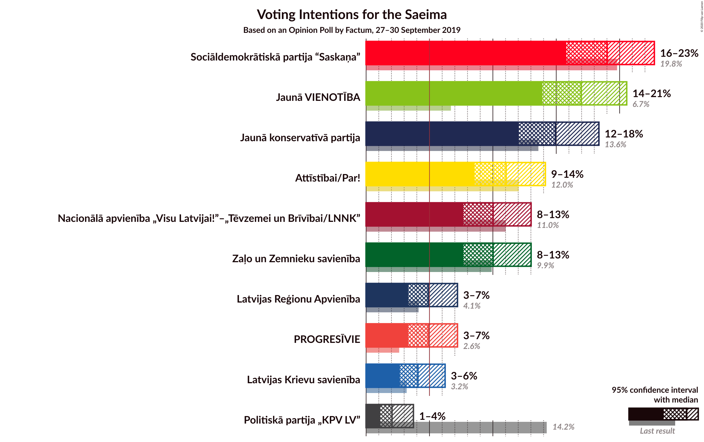
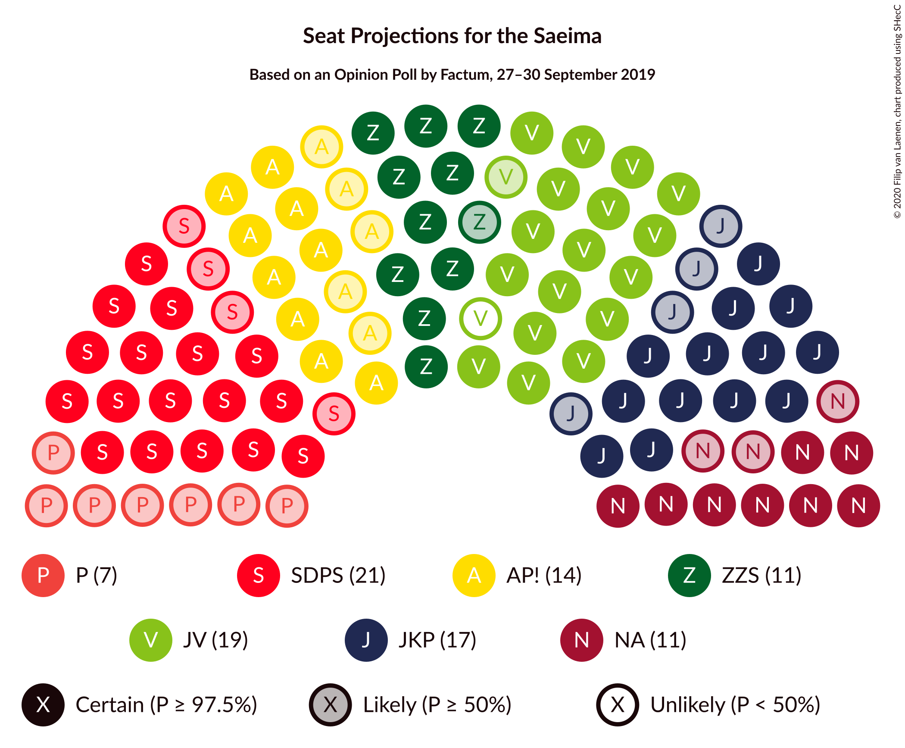
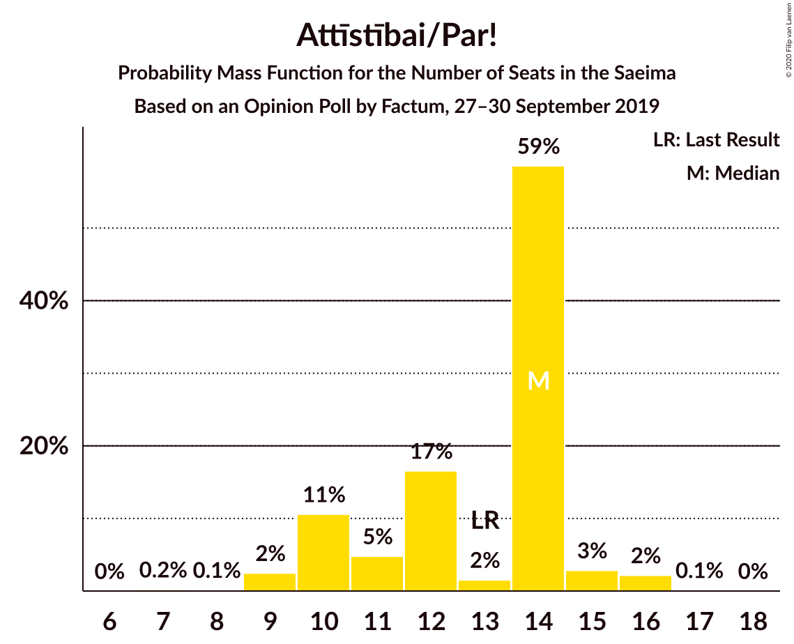
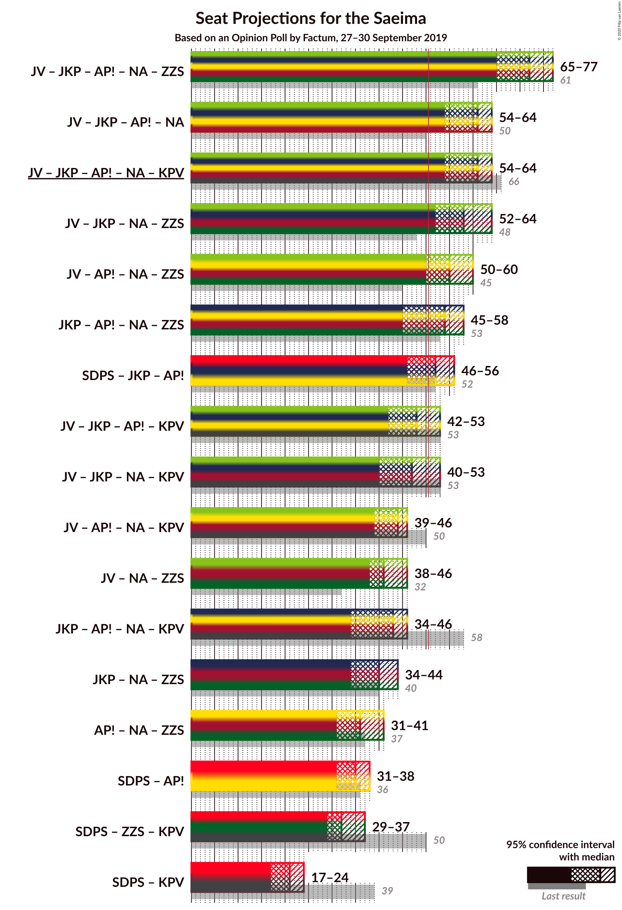
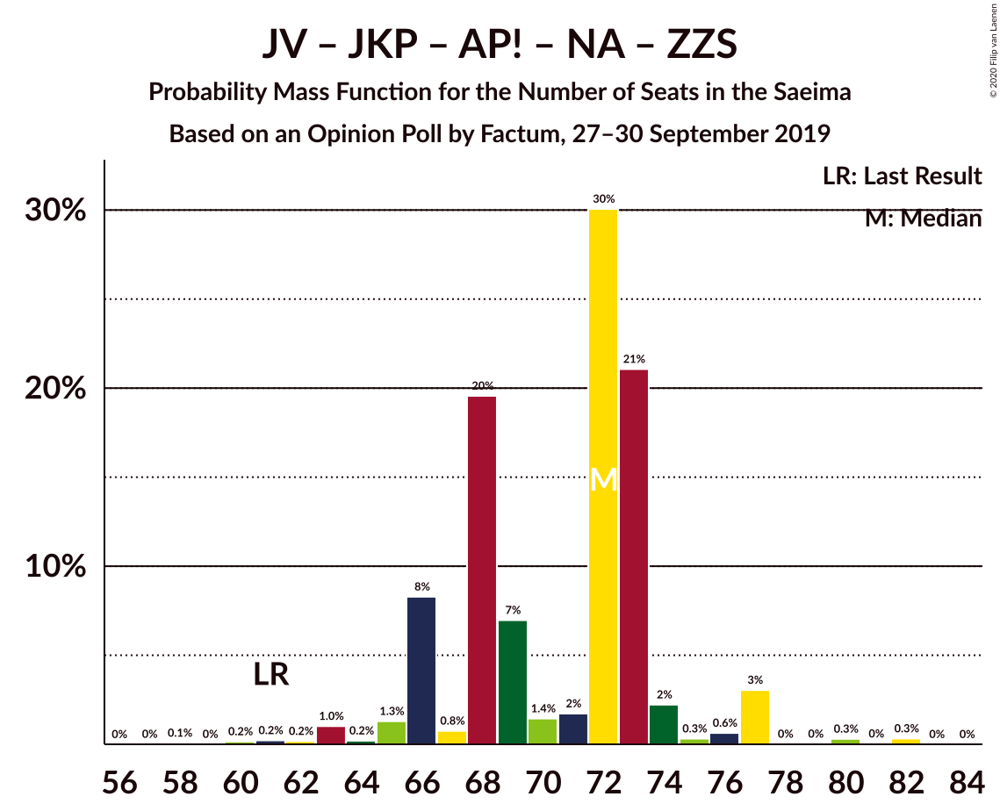
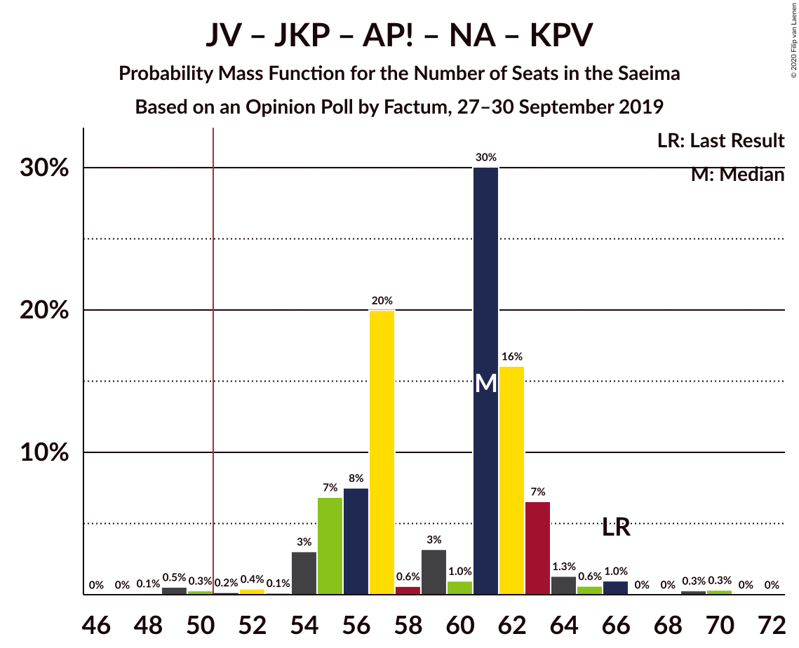
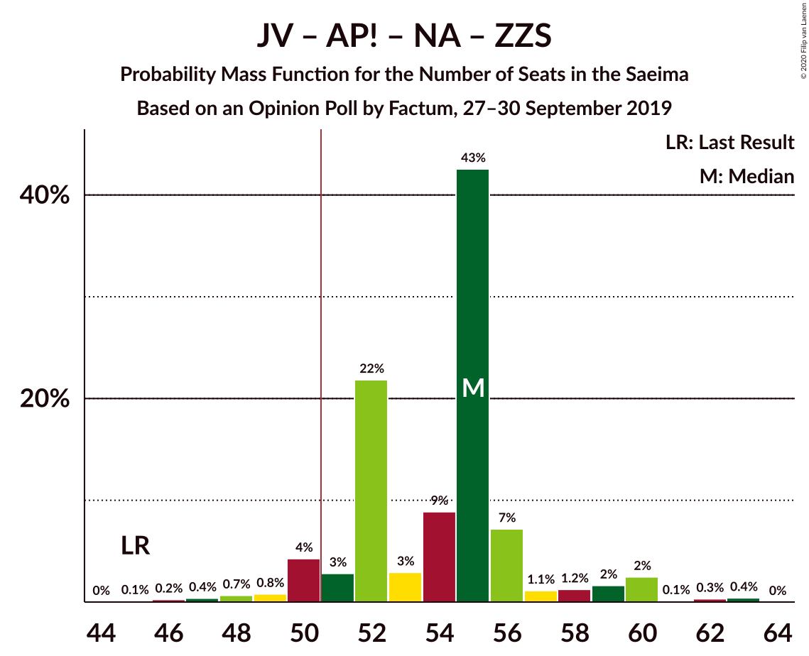
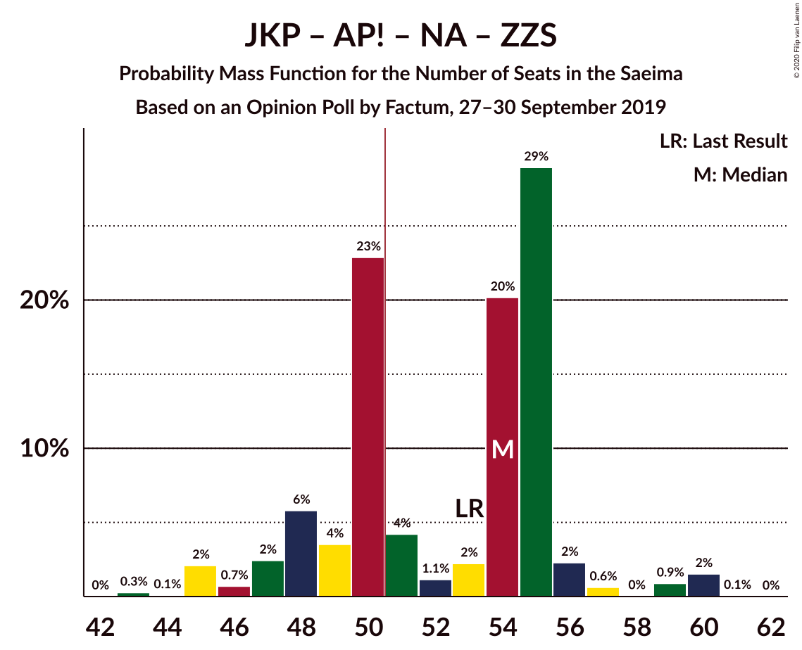
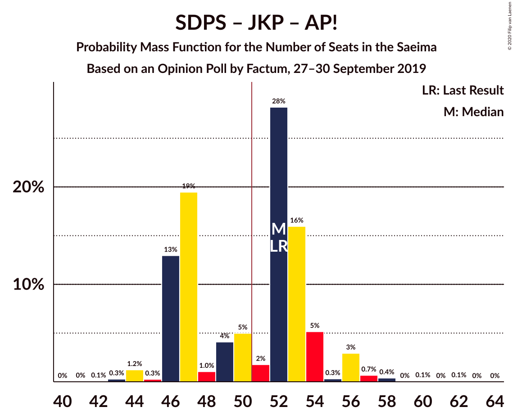

# Opinion Poll by Factum, 27–30 September 2019

<a href="#voting-intentions">Voting Intentions</a> | <a href="#seats">Seats</a> | <a href="#coalitions">Coalitions</a> | <a href="#technical-information">Technical Information</a>

## Voting Intentions

### Confidence Intervals

| Party | Last Result | Poll Result | 80% Confidence Interval | 90% Confidence Interval | 95% Confidence Interval | 99% Confidence Interval |
|:-----:|:-----------:|:-----------:|:-----------------------:|:-----------------------:|:-----------------------:|:-----------------------:|
| Sociāldemokrātiskā partija “Saskaņa” | 19.8% | 19.0% | 16.9–21.4% |16.3–22.1% |15.8–22.7% |14.8–23.9% |
| Jaunā VIENOTĪBA | 6.7% | 17.0% | 15.0–19.3% |14.4–20.0% |13.9–20.6% |13.0–21.7% |
| Jaunā konservatīvā partija | 13.6% | 14.9% | 13.0–17.2% |12.5–17.8% |12.0–18.4% |11.2–19.5% |
| Attīstībai/Par! | 12.0% | 11.0% | 9.4–13.1% |8.9–13.6% |8.6–14.1% |7.8–15.2% |
| Nacionālā apvienība „Visu Latvijai!”–„Tēvzemei un Brīvībai/LNNK” | 11.0% | 10.0% | 8.5–12.0% |8.0–12.5% |7.7–13.0% |7.0–14.0% |
| Zaļo un Zemnieku savienība | 9.9% | 10.0% | 8.5–12.0% |8.0–12.5% |7.7–13.0% |7.0–14.0% |
| Latvijas Reģionu Apvienība | 4.1% | 4.9% | 3.9–6.4% |3.6–6.8% |3.3–7.2% |2.9–8.0% |
| PROGRESĪVIE | 2.6% | 4.9% | 3.9–6.4% |3.6–6.8% |3.3–7.2% |2.9–8.0% |
| Latvijas Krievu savienība | 3.2% | 4.1% | 3.1–5.5% |2.9–5.9% |2.7–6.2% |2.3–7.0% |
| Politiskā partija „KPV LV” | 14.2% | 2.0% | 1.4–3.1% |1.2–3.4% |1.1–3.7% |0.9–4.3% |

*Note:* The poll result column reflects the actual value used in the calculations. Published results may vary slightly, and in addition be rounded to fewer digits.

## Seats

### Confidence Intervals

| Party | Last Result | Median | 80% Confidence Interval | 90% Confidence Interval | 95% Confidence Interval | 99% Confidence Interval |
|:-----:|:-----------:|:------:|:-----------------------:|:-----------------------:|:-----------------------:|:-----------------------:|
| <a href="#sociāldemokrātiskā-partija-“saskaņa”">Sociāldemokrātiskā partija “Saskaņa”</a> | 23 | 21 | 19–22 |19–23 |17–24 |17–26 |
| <a href="#jaunā-vienotība">Jaunā VIENOTĪBA</a> | 8 | 18 | 17–19 |17–21 |17–21 |15–24 |
| <a href="#jaunā-konservatīvā-partija">Jaunā konservatīvā partija</a> | 16 | 17 | 13–18 |13–19 |13–20 |13–20 |
| <a href="#attīstībai/par!">Attīstībai/Par!</a> | 13 | 14 | 10–14 |10–15 |9–15 |9–16 |
| <a href="#nacionālā-apvienība-„visu-latvijai!”–„tēvzemei-un-brīvībai/lnnk”">Nacionālā apvienība „Visu Latvijai!”–„Tēvzemei un Brīvībai/LNNK”</a> | 13 | 11 | 10–13 |10–13 |8–13 |6–15 |
| <a href="#zaļo-un-zemnieku-savienība">Zaļo un Zemnieku savienība</a> | 11 | 11 | 11–13 |10–13 |10–14 |9–15 |
| <a href="#latvijas-reģionu-apvienība">Latvijas Reģionu Apvienība</a> | 0 | 0 | 0–6 |0–6 |0–6 |0–8 |
| <a href="#progresīvie">PROGRESĪVIE</a> | 0 | 7 | 0–7 |0–7 |0–7 |0–7 |
| <a href="#latvijas-krievu-savienība">Latvijas Krievu savienība</a> | 0 | 0 | 0–6 |0–7 |0–7 |0–8 |
| <a href="#politiskā-partija-„kpv-lv”">Politiskā partija „KPV LV”</a> | 16 | 0 | 0 |0 |0 |0 |

### Sociāldemokrātiskā partija “Saskaņa”

*For a full overview of the results for this party, see the [Sociāldemokrātiskā partija “Saskaņa”](party-sociāldemokrātiskāpartija“saskaņa”.html) page.*

| Number of Seats | Probability | Accumulated | Special Marks |
|:---------------:|:-----------:|:-----------:|:-------------:|
| 16 | 0% | 100% |  |
| 17 | 3% | 99.9% |  |
| 18 | 0.7% | 97% |  |
| 19 | 22% | 97% |  |
| 20 | 5% | 74% |  |
| 21 | 54% | 69% | Median |
| 22 | 8% | 16% |  |
| 23 | 4% | 8% | Last Result |
| 24 | 2% | 4% |  |
| 25 | 0.3% | 2% |  |
| 26 | 1.2% | 2% |  |
| 27 | 0.3% | 0.4% |  |
| 28 | 0.1% | 0.1% |  |
| 29 | 0% | 0% |  |

### Jaunā VIENOTĪBA

*For a full overview of the results for this party, see the [Jaunā VIENOTĪBA](party-jaunāvienotība.html) page.*

| Number of Seats | Probability | Accumulated | Special Marks |
|:---------------:|:-----------:|:-----------:|:-------------:|
| 8 | 0% | 100% | Last Result |
| 9 | 0% | 100% |  |
| 10 | 0% | 100% |  |
| 11 | 0% | 100% |  |
| 12 | 0% | 100% |  |
| 13 | 0.1% | 100% |  |
| 14 | 0.1% | 99.9% |  |
| 15 | 0.9% | 99.8% |  |
| 16 | 1.1% | 98.9% |  |
| 17 | 31% | 98% |  |
| 18 | 26% | 66% | Median |
| 19 | 33% | 41% |  |
| 20 | 1.2% | 8% |  |
| 21 | 4% | 7% |  |
| 22 | 0.2% | 2% |  |
| 23 | 1.4% | 2% |  |
| 24 | 0.5% | 0.6% |  |
| 25 | 0.1% | 0.1% |  |
| 26 | 0% | 0% |  |

### Jaunā konservatīvā partija

*For a full overview of the results for this party, see the [Jaunā konservatīvā partija](party-jaunākonservatīvāpartija.html) page.*

| Number of Seats | Probability | Accumulated | Special Marks |
|:---------------:|:-----------:|:-----------:|:-------------:|
| 13 | 11% | 100% |  |
| 14 | 7% | 89% |  |
| 15 | 4% | 83% |  |
| 16 | 17% | 78% | Last Result |
| 17 | 30% | 62% | Median |
| 18 | 22% | 32% |  |
| 19 | 7% | 9% |  |
| 20 | 2% | 3% |  |
| 21 | 0.1% | 0.4% |  |
| 22 | 0.2% | 0.3% |  |
| 23 | 0.1% | 0.1% |  |
| 24 | 0% | 0% |  |

### Attīstībai/Par!

*For a full overview of the results for this party, see the [Attīstībai/Par!](party-attīstībaipar.html) page.*

| Number of Seats | Probability | Accumulated | Special Marks |
|:---------------:|:-----------:|:-----------:|:-------------:|
| 7 | 0.2% | 100% |  |
| 8 | 0.1% | 99.8% |  |
| 9 | 2% | 99.6% |  |
| 10 | 11% | 97% |  |
| 11 | 5% | 87% |  |
| 12 | 17% | 82% |  |
| 13 | 2% | 65% | Last Result |
| 14 | 59% | 64% | Median |
| 15 | 3% | 5% |  |
| 16 | 2% | 2% |  |
| 17 | 0.1% | 0.1% |  |
| 18 | 0% | 0% |  |

### Nacionālā apvienība „Visu Latvijai!”–„Tēvzemei un Brīvībai/LNNK”

*For a full overview of the results for this party, see the [Nacionālā apvienība „Visu Latvijai!”–„Tēvzemei un Brīvībai/LNNK”](party-nacionālāapvienība„visulatvijai”–„tēvzemeiunbrīvībailnnk”.html) page.*

| Number of Seats | Probability | Accumulated | Special Marks |
|:---------------:|:-----------:|:-----------:|:-------------:|
| 6 | 2% | 100% |  |
| 7 | 0.1% | 98% |  |
| 8 | 0.2% | 98% |  |
| 9 | 0.8% | 97% |  |
| 10 | 12% | 97% |  |
| 11 | 42% | 84% | Median |
| 12 | 5% | 42% |  |
| 13 | 36% | 38% | Last Result |
| 14 | 0.9% | 2% |  |
| 15 | 0.9% | 1.3% |  |
| 16 | 0.1% | 0.4% |  |
| 17 | 0.3% | 0.3% |  |
| 18 | 0% | 0% |  |

### Zaļo un Zemnieku savienība

*For a full overview of the results for this party, see the [Zaļo un Zemnieku savienība](party-zaļounzemniekusavienība.html) page.*

| Number of Seats | Probability | Accumulated | Special Marks |
|:---------------:|:-----------:|:-----------:|:-------------:|
| 7 | 0.3% | 100% |  |
| 8 | 0.1% | 99.6% |  |
| 9 | 0.2% | 99.5% |  |
| 10 | 6% | 99.3% |  |
| 11 | 79% | 94% | Last Result, Median |
| 12 | 3% | 15% |  |
| 13 | 7% | 12% |  |
| 14 | 3% | 5% |  |
| 15 | 2% | 2% |  |
| 16 | 0.4% | 0.4% |  |
| 17 | 0.1% | 0.1% |  |
| 18 | 0% | 0% |  |

### Latvijas Reģionu Apvienība

*For a full overview of the results for this party, see the [Latvijas Reģionu Apvienība](party-latvijasreģionuapvienība.html) page.*

| Number of Seats | Probability | Accumulated | Special Marks |
|:---------------:|:-----------:|:-----------:|:-------------:|
| 0 | 51% | 100% | Last Result, Median |
| 1 | 0% | 49% |  |
| 2 | 0% | 49% |  |
| 3 | 0% | 49% |  |
| 4 | 0% | 49% |  |
| 5 | 0% | 49% |  |
| 6 | 46% | 49% |  |
| 7 | 1.2% | 2% |  |
| 8 | 0.7% | 1.0% |  |
| 9 | 0.3% | 0.3% |  |
| 10 | 0% | 0% |  |

### PROGRESĪVIE

*For a full overview of the results for this party, see the [PROGRESĪVIE](party-progresīvie.html) page.*

| Number of Seats | Probability | Accumulated | Special Marks |
|:---------------:|:-----------:|:-----------:|:-------------:|
| 0 | 33% | 100% | Last Result |
| 1 | 0% | 67% |  |
| 2 | 0% | 67% |  |
| 3 | 0% | 67% |  |
| 4 | 0% | 67% |  |
| 5 | 8% | 67% |  |
| 6 | 7% | 59% |  |
| 7 | 52% | 52% | Median |
| 8 | 0.3% | 0.3% |  |
| 9 | 0% | 0% |  |

### Latvijas Krievu savienība

*For a full overview of the results for this party, see the [Latvijas Krievu savienība](party-latvijaskrievusavienība.html) page.*

| Number of Seats | Probability | Accumulated | Special Marks |
|:---------------:|:-----------:|:-----------:|:-------------:|
| 0 | 81% | 100% | Last Result, Median |
| 1 | 0% | 19% |  |
| 2 | 0% | 19% |  |
| 3 | 0% | 19% |  |
| 4 | 0% | 19% |  |
| 5 | 1.3% | 19% |  |
| 6 | 10% | 18% |  |
| 7 | 6% | 8% |  |
| 8 | 2% | 2% |  |
| 9 | 0% | 0% |  |

### Politiskā partija „KPV LV”

*For a full overview of the results for this party, see the [Politiskā partija „KPV LV”](party-politiskāpartija„kpvlv”.html) page.*

| Number of Seats | Probability | Accumulated | Special Marks |
|:---------------:|:-----------:|:-----------:|:-------------:|
| 0 | 100% | 100% | Median |
| 1 | 0% | 0% |  |
| 2 | 0% | 0% |  |
| 3 | 0% | 0% |  |
| 4 | 0% | 0% |  |
| 5 | 0% | 0% |  |
| 6 | 0% | 0% |  |
| 7 | 0% | 0% |  |
| 8 | 0% | 0% |  |
| 9 | 0% | 0% |  |
| 10 | 0% | 0% |  |
| 11 | 0% | 0% |  |
| 12 | 0% | 0% |  |
| 13 | 0% | 0% |  |
| 14 | 0% | 0% |  |
| 15 | 0% | 0% |  |
| 16 | 0% | 0% | Last Result |

## Coalitions

### Confidence Intervals

| Coalition | Last Result | Median | Majority? | 80% Confidence Interval | 90% Confidence Interval | 95% Confidence Interval | 99% Confidence Interval |
|:---------:|:-----------:|:------:|:---------:|:-----------------------:|:-----------------------:|:-----------------------:|:-----------------------:|
| Jaunā VIENOTĪBA – Jaunā konservatīvā partija – Attīstībai/Par! – Nacionālā apvienība „Visu Latvijai!”–„Tēvzemei un Brīvībai/LNNK” – Zaļo un Zemnieku savienība | 61 | 72 | 100% | 66–73 | 66–74 | 65–77 | 62–80 |
| Jaunā VIENOTĪBA – Jaunā konservatīvā partija – Attīstībai/Par! – Nacionālā apvienība „Visu Latvijai!”–„Tēvzemei un Brīvībai/LNNK” | 50 | 61 | 99.1% | 55–63 | 55–63 | 54–64 | 49–69 |
| Jaunā VIENOTĪBA – Jaunā konservatīvā partija – Attīstībai/Par! – Nacionālā apvienība „Visu Latvijai!”–„Tēvzemei un Brīvībai/LNNK” – Politiskā partija „KPV LV” | 66 | 61 | 99.1% | 55–63 | 55–63 | 54–64 | 49–69 |
| Jaunā VIENOTĪBA – Jaunā konservatīvā partija – Nacionālā apvienība „Visu Latvijai!”–„Tēvzemei un Brīvībai/LNNK” – Zaļo un Zemnieku savienība | 48 | 58 | 99.2% | 55–60 | 54–61 | 52–64 | 49–66 |
| Jaunā VIENOTĪBA – Attīstībai/Par! – Nacionālā apvienība „Visu Latvijai!”–„Tēvzemei un Brīvībai/LNNK” – Zaļo un Zemnieku savienība | 45 | 55 | 94% | 52–56 | 50–58 | 50–60 | 47–62 |
| Jaunā konservatīvā partija – Attīstībai/Par! – Nacionālā apvienība „Visu Latvijai!”–„Tēvzemei un Brīvībai/LNNK” – Zaļo un Zemnieku savienība | 53 | 54 | 62% | 48–55 | 47–56 | 45–58 | 45–60 |
| Sociāldemokrātiskā partija “Saskaņa” – Jaunā konservatīvā partija – Attīstībai/Par! | 52 | 52 | 56% | 46–53 | 46–54 | 46–56 | 44–58 |
| Jaunā VIENOTĪBA – Jaunā konservatīvā partija – Attīstībai/Par! – Politiskā partija „KPV LV” | 53 | 48 | 23% | 44–51 | 42–52 | 42–53 | 39–56 |
| Jaunā VIENOTĪBA – Jaunā konservatīvā partija – Nacionālā apvienība „Visu Latvijai!”–„Tēvzemei un Brīvībai/LNNK” – Politiskā partija „KPV LV” | 53 | 47 | 4% | 42–49 | 42–50 | 40–53 | 38–55 |
| Jaunā VIENOTĪBA – Attīstībai/Par! – Nacionālā apvienība „Visu Latvijai!”–„Tēvzemei un Brīvībai/LNNK” – Politiskā partija „KPV LV” | 50 | 44 | 0.6% | 41–44 | 39–45 | 39–46 | 35–51 |
| Jaunā VIENOTĪBA – Nacionālā apvienība „Visu Latvijai!”–„Tēvzemei un Brīvībai/LNNK” – Zaļo un Zemnieku savienība | 32 | 41 | 0% | 40–43 | 39–44 | 38–46 | 36–48 |
| Jaunā konservatīvā partija – Attīstībai/Par! – Nacionālā apvienība „Visu Latvijai!”–„Tēvzemei un Brīvībai/LNNK” – Politiskā partija „KPV LV” | 58 | 43 | 0% | 37–44 | 36–44 | 34–46 | 32–47 |
| Jaunā konservatīvā partija – Nacionālā apvienība „Visu Latvijai!”–„Tēvzemei un Brīvībai/LNNK” – Zaļo un Zemnieku savienība | 40 | 40 | 0% | 36–41 | 36–42 | 34–44 | 31–45 |
| Attīstībai/Par! – Nacionālā apvienība „Visu Latvijai!”–„Tēvzemei un Brīvībai/LNNK” – Zaļo un Zemnieku savienība | 37 | 36 | 0% | 32–38 | 32–39 | 31–41 | 30–43 |
| Sociāldemokrātiskā partija “Saskaņa” – Attīstībai/Par! | 36 | 35 | 0% | 31–35 | 31–36 | 31–38 | 28–40 |
| Sociāldemokrātiskā partija “Saskaņa” – Zaļo un Zemnieku savienība – Politiskā partija „KPV LV” | 50 | 32 | 0% | 30–33 | 30–36 | 29–37 | 28–38 |
| Sociāldemokrātiskā partija “Saskaņa” – Politiskā partija „KPV LV” | 39 | 21 | 0% | 19–22 | 19–23 | 17–24 | 17–26 |

### Jaunā VIENOTĪBA – Jaunā konservatīvā partija – Attīstībai/Par! – Nacionālā apvienība „Visu Latvijai!”–„Tēvzemei un Brīvībai/LNNK” – Zaļo un Zemnieku savienība

| Number of Seats | Probability | Accumulated | Special Marks |
|:---------------:|:-----------:|:-----------:|:-------------:|
| 58 | 0.1% | 100% |  |
| 59 | 0% | 99.9% |  |
| 60 | 0.2% | 99.9% |  |
| 61 | 0.2% | 99.7% | Last Result |
| 62 | 0.2% | 99.5% |  |
| 63 | 1.0% | 99.3% |  |
| 64 | 0.2% | 98% |  |
| 65 | 1.3% | 98% |  |
| 66 | 8% | 97% |  |
| 67 | 0.8% | 89% |  |
| 68 | 20% | 88% |  |
| 69 | 7% | 68% |  |
| 70 | 1.4% | 61% |  |
| 71 | 2% | 60% | Median |
| 72 | 30% | 58% |  |
| 73 | 21% | 28% |  |
| 74 | 2% | 7% |  |
| 75 | 0.3% | 5% |  |
| 76 | 0.6% | 4% |  |
| 77 | 3% | 4% |  |
| 78 | 0% | 0.7% |  |
| 79 | 0% | 0.7% |  |
| 80 | 0.3% | 0.7% |  |
| 81 | 0% | 0.4% |  |
| 82 | 0.3% | 0.3% |  |
| 83 | 0% | 0% |  |

### Jaunā VIENOTĪBA – Jaunā konservatīvā partija – Attīstībai/Par! – Nacionālā apvienība „Visu Latvijai!”–„Tēvzemei un Brīvībai/LNNK”

| Number of Seats | Probability | Accumulated | Special Marks |
|:---------------:|:-----------:|:-----------:|:-------------:|
| 48 | 0.1% | 100% |  |
| 49 | 0.5% | 99.9% |  |
| 50 | 0.3% | 99.3% | Last Result |
| 51 | 0.2% | 99.1% | Majority |
| 52 | 0.4% | 98.9% |  |
| 53 | 0.1% | 98% |  |
| 54 | 3% | 98% |  |
| 55 | 7% | 95% |  |
| 56 | 8% | 88% |  |
| 57 | 20% | 81% |  |
| 58 | 0.6% | 61% |  |
| 59 | 3% | 60% |  |
| 60 | 1.0% | 57% | Median |
| 61 | 30% | 56% |  |
| 62 | 16% | 26% |  |
| 63 | 7% | 10% |  |
| 64 | 1.3% | 4% |  |
| 65 | 0.6% | 2% |  |
| 66 | 1.0% | 2% |  |
| 67 | 0% | 0.7% |  |
| 68 | 0% | 0.7% |  |
| 69 | 0.3% | 0.6% |  |
| 70 | 0.3% | 0.3% |  |
| 71 | 0% | 0% |  |

### Jaunā VIENOTĪBA – Jaunā konservatīvā partija – Attīstībai/Par! – Nacionālā apvienība „Visu Latvijai!”–„Tēvzemei un Brīvībai/LNNK” – Politiskā partija „KPV LV”

| Number of Seats | Probability | Accumulated | Special Marks |
|:---------------:|:-----------:|:-----------:|:-------------:|
| 48 | 0.1% | 100% |  |
| 49 | 0.5% | 99.9% |  |
| 50 | 0.3% | 99.3% |  |
| 51 | 0.2% | 99.1% | Majority |
| 52 | 0.4% | 98.9% |  |
| 53 | 0.1% | 98% |  |
| 54 | 3% | 98% |  |
| 55 | 7% | 95% |  |
| 56 | 8% | 88% |  |
| 57 | 20% | 81% |  |
| 58 | 0.6% | 61% |  |
| 59 | 3% | 60% |  |
| 60 | 1.0% | 57% | Median |
| 61 | 30% | 56% |  |
| 62 | 16% | 26% |  |
| 63 | 7% | 10% |  |
| 64 | 1.3% | 4% |  |
| 65 | 0.6% | 2% |  |
| 66 | 1.0% | 2% | Last Result |
| 67 | 0% | 0.7% |  |
| 68 | 0% | 0.7% |  |
| 69 | 0.3% | 0.6% |  |
| 70 | 0.3% | 0.3% |  |
| 71 | 0% | 0% |  |

### Jaunā VIENOTĪBA – Jaunā konservatīvā partija – Nacionālā apvienība „Visu Latvijai!”–„Tēvzemei un Brīvībai/LNNK” – Zaļo un Zemnieku savienība

| Number of Seats | Probability | Accumulated | Special Marks |
|:---------------:|:-----------:|:-----------:|:-------------:|
| 47 | 0.1% | 100% |  |
| 48 | 0% | 99.9% | Last Result |
| 49 | 0.5% | 99.8% |  |
| 50 | 0.2% | 99.4% |  |
| 51 | 1.1% | 99.2% | Majority |
| 52 | 2% | 98% |  |
| 53 | 0.7% | 96% |  |
| 54 | 0.7% | 95% |  |
| 55 | 7% | 94% |  |
| 56 | 21% | 87% |  |
| 57 | 3% | 67% | Median |
| 58 | 31% | 64% |  |
| 59 | 22% | 33% |  |
| 60 | 2% | 11% |  |
| 61 | 5% | 9% |  |
| 62 | 2% | 4% |  |
| 63 | 0.2% | 3% |  |
| 64 | 2% | 3% |  |
| 65 | 0.3% | 1.1% |  |
| 66 | 0.3% | 0.7% |  |
| 67 | 0.3% | 0.4% |  |
| 68 | 0% | 0.1% |  |
| 69 | 0% | 0.1% |  |
| 70 | 0% | 0% |  |

### Jaunā VIENOTĪBA – Attīstībai/Par! – Nacionālā apvienība „Visu Latvijai!”–„Tēvzemei un Brīvībai/LNNK” – Zaļo un Zemnieku savienība

| Number of Seats | Probability | Accumulated | Special Marks |
|:---------------:|:-----------:|:-----------:|:-------------:|
| 45 | 0.1% | 100% | Last Result |
| 46 | 0.2% | 99.9% |  |
| 47 | 0.4% | 99.6% |  |
| 48 | 0.7% | 99.2% |  |
| 49 | 0.8% | 98.6% |  |
| 50 | 4% | 98% |  |
| 51 | 3% | 94% | Majority |
| 52 | 22% | 91% |  |
| 53 | 3% | 69% |  |
| 54 | 9% | 66% | Median |
| 55 | 43% | 57% |  |
| 56 | 7% | 14% |  |
| 57 | 1.1% | 7% |  |
| 58 | 1.2% | 6% |  |
| 59 | 2% | 5% |  |
| 60 | 2% | 3% |  |
| 61 | 0.1% | 0.8% |  |
| 62 | 0.3% | 0.7% |  |
| 63 | 0.4% | 0.4% |  |
| 64 | 0% | 0% |  |

### Jaunā konservatīvā partija – Attīstībai/Par! – Nacionālā apvienība „Visu Latvijai!”–„Tēvzemei un Brīvībai/LNNK” – Zaļo un Zemnieku savienība

| Number of Seats | Probability | Accumulated | Special Marks |
|:---------------:|:-----------:|:-----------:|:-------------:|
| 43 | 0.3% | 100% |  |
| 44 | 0.1% | 99.7% |  |
| 45 | 2% | 99.6% |  |
| 46 | 0.7% | 97% |  |
| 47 | 2% | 97% |  |
| 48 | 6% | 94% |  |
| 49 | 4% | 89% |  |
| 50 | 23% | 85% |  |
| 51 | 4% | 62% | Majority |
| 52 | 1.1% | 58% |  |
| 53 | 2% | 57% | Last Result, Median |
| 54 | 20% | 55% |  |
| 55 | 29% | 34% |  |
| 56 | 2% | 5% |  |
| 57 | 0.6% | 3% |  |
| 58 | 0% | 3% |  |
| 59 | 0.9% | 2% |  |
| 60 | 2% | 2% |  |
| 61 | 0.1% | 0.1% |  |
| 62 | 0% | 0% |  |

### Sociāldemokrātiskā partija “Saskaņa” – Jaunā konservatīvā partija – Attīstībai/Par!

| Number of Seats | Probability | Accumulated | Special Marks |
|:---------------:|:-----------:|:-----------:|:-------------:|
| 41 | 0% | 100% |  |
| 42 | 0.1% | 99.9% |  |
| 43 | 0.3% | 99.9% |  |
| 44 | 1.2% | 99.6% |  |
| 45 | 0.3% | 98% |  |
| 46 | 13% | 98% |  |
| 47 | 19% | 85% |  |
| 48 | 1.0% | 66% |  |
| 49 | 4% | 65% |  |
| 50 | 5% | 61% |  |
| 51 | 2% | 56% | Majority |
| 52 | 28% | 54% | Last Result, Median |
| 53 | 16% | 26% |  |
| 54 | 5% | 10% |  |
| 55 | 0.3% | 4% |  |
| 56 | 3% | 4% |  |
| 57 | 0.7% | 1.3% |  |
| 58 | 0.4% | 0.6% |  |
| 59 | 0% | 0.2% |  |
| 60 | 0.1% | 0.2% |  |
| 61 | 0% | 0.1% |  |
| 62 | 0.1% | 0.1% |  |
| 63 | 0% | 0% |  |

### Jaunā VIENOTĪBA – Jaunā konservatīvā partija – Attīstībai/Par! – Politiskā partija „KPV LV”

| Number of Seats | Probability | Accumulated | Special Marks |
|:---------------:|:-----------:|:-----------:|:-------------:|
| 37 | 0.1% | 100% |  |
| 38 | 0.2% | 99.9% |  |
| 39 | 0.3% | 99.7% |  |
| 40 | 0.1% | 99.4% |  |
| 41 | 0.3% | 99.3% |  |
| 42 | 5% | 98.9% |  |
| 43 | 3% | 94% |  |
| 44 | 1.3% | 91% |  |
| 45 | 1.2% | 90% |  |
| 46 | 24% | 89% |  |
| 47 | 4% | 65% |  |
| 48 | 31% | 61% |  |
| 49 | 1.3% | 30% | Median |
| 50 | 6% | 29% |  |
| 51 | 15% | 23% | Majority |
| 52 | 6% | 8% |  |
| 53 | 2% | 3% | Last Result |
| 54 | 0.1% | 0.8% |  |
| 55 | 0% | 0.7% |  |
| 56 | 0.3% | 0.7% |  |
| 57 | 0.3% | 0.3% |  |
| 58 | 0% | 0% |  |

### Jaunā VIENOTĪBA – Jaunā konservatīvā partija – Nacionālā apvienība „Visu Latvijai!”–„Tēvzemei un Brīvībai/LNNK” – Politiskā partija „KPV LV”

| Number of Seats | Probability | Accumulated | Special Marks |
|:---------------:|:-----------:|:-----------:|:-------------:|
| 36 | 0.2% | 100% |  |
| 37 | 0.1% | 99.8% |  |
| 38 | 0.5% | 99.8% |  |
| 39 | 0.1% | 99.3% |  |
| 40 | 3% | 99.1% |  |
| 41 | 0.3% | 96% |  |
| 42 | 7% | 96% |  |
| 43 | 0.8% | 89% |  |
| 44 | 2% | 88% |  |
| 45 | 21% | 86% |  |
| 46 | 3% | 64% | Median |
| 47 | 32% | 61% |  |
| 48 | 16% | 29% |  |
| 49 | 7% | 13% |  |
| 50 | 3% | 7% |  |
| 51 | 1.1% | 4% | Majority |
| 52 | 0.1% | 3% |  |
| 53 | 1.0% | 3% | Last Result |
| 54 | 0.8% | 1.5% |  |
| 55 | 0.6% | 0.7% |  |
| 56 | 0% | 0% |  |

### Jaunā VIENOTĪBA – Attīstībai/Par! – Nacionālā apvienība „Visu Latvijai!”–„Tēvzemei un Brīvībai/LNNK” – Politiskā partija „KPV LV”

| Number of Seats | Probability | Accumulated | Special Marks |
|:---------------:|:-----------:|:-----------:|:-------------:|
| 34 | 0.4% | 100% |  |
| 35 | 0.4% | 99.6% |  |
| 36 | 0.5% | 99.2% |  |
| 37 | 0.3% | 98.7% |  |
| 38 | 0.9% | 98% |  |
| 39 | 4% | 98% |  |
| 40 | 3% | 94% |  |
| 41 | 23% | 91% |  |
| 42 | 1.4% | 67% |  |
| 43 | 11% | 66% | Median |
| 44 | 49% | 55% |  |
| 45 | 2% | 6% |  |
| 46 | 2% | 4% |  |
| 47 | 0.5% | 2% |  |
| 48 | 0.1% | 2% |  |
| 49 | 1.0% | 2% |  |
| 50 | 0.2% | 0.8% | Last Result |
| 51 | 0.6% | 0.6% | Majority |
| 52 | 0% | 0% |  |

### Jaunā VIENOTĪBA – Nacionālā apvienība „Visu Latvijai!”–„Tēvzemei un Brīvībai/LNNK” – Zaļo un Zemnieku savienība

| Number of Seats | Probability | Accumulated | Special Marks |
|:---------------:|:-----------:|:-----------:|:-------------:|
| 32 | 0% | 100% | Last Result |
| 33 | 0% | 100% |  |
| 34 | 0.3% | 100% |  |
| 35 | 0.1% | 99.7% |  |
| 36 | 0.8% | 99.6% |  |
| 37 | 1.2% | 98.8% |  |
| 38 | 2% | 98% |  |
| 39 | 2% | 96% |  |
| 40 | 25% | 94% | Median |
| 41 | 43% | 69% |  |
| 42 | 14% | 25% |  |
| 43 | 4% | 11% |  |
| 44 | 4% | 7% |  |
| 45 | 0.7% | 4% |  |
| 46 | 0.8% | 3% |  |
| 47 | 1.1% | 2% |  |
| 48 | 0.9% | 0.9% |  |
| 49 | 0% | 0.1% |  |
| 50 | 0% | 0.1% |  |
| 51 | 0% | 0% | Majority |

### Jaunā konservatīvā partija – Attīstībai/Par! – Nacionālā apvienība „Visu Latvijai!”–„Tēvzemei un Brīvībai/LNNK” – Politiskā partija „KPV LV”

| Number of Seats | Probability | Accumulated | Special Marks |
|:---------------:|:-----------:|:-----------:|:-------------:|
| 31 | 0.1% | 100% |  |
| 32 | 0.6% | 99.9% |  |
| 33 | 2% | 99.4% |  |
| 34 | 0.2% | 98% |  |
| 35 | 0.3% | 97% |  |
| 36 | 3% | 97% |  |
| 37 | 12% | 94% |  |
| 38 | 4% | 82% |  |
| 39 | 17% | 78% |  |
| 40 | 4% | 61% |  |
| 41 | 3% | 57% |  |
| 42 | 2% | 54% | Median |
| 43 | 15% | 53% |  |
| 44 | 33% | 37% |  |
| 45 | 1.4% | 4% |  |
| 46 | 2% | 3% |  |
| 47 | 0.4% | 0.5% |  |
| 48 | 0.1% | 0.2% |  |
| 49 | 0% | 0% |  |
| 50 | 0% | 0% |  |
| 51 | 0% | 0% | Majority |
| 52 | 0% | 0% |  |
| 53 | 0% | 0% |  |
| 54 | 0% | 0% |  |
| 55 | 0% | 0% |  |
| 56 | 0% | 0% |  |
| 57 | 0% | 0% |  |
| 58 | 0% | 0% | Last Result |

### Jaunā konservatīvā partija – Nacionālā apvienība „Visu Latvijai!”–„Tēvzemei un Brīvībai/LNNK” – Zaļo un Zemnieku savienība

| Number of Seats | Probability | Accumulated | Special Marks |
|:---------------:|:-----------:|:-----------:|:-------------:|
| 30 | 0.1% | 100% |  |
| 31 | 2% | 99.9% |  |
| 32 | 0.1% | 98% |  |
| 33 | 0.2% | 98% |  |
| 34 | 1.4% | 98% |  |
| 35 | 0.9% | 96% |  |
| 36 | 7% | 95% |  |
| 37 | 0.8% | 89% |  |
| 38 | 23% | 88% |  |
| 39 | 5% | 65% | Median |
| 40 | 22% | 60% | Last Result |
| 41 | 32% | 38% |  |
| 42 | 2% | 6% |  |
| 43 | 0.2% | 4% |  |
| 44 | 3% | 4% |  |
| 45 | 0.8% | 1.2% |  |
| 46 | 0.3% | 0.4% |  |
| 47 | 0% | 0.1% |  |
| 48 | 0% | 0.1% |  |
| 49 | 0% | 0% |  |

### Attīstībai/Par! – Nacionālā apvienība „Visu Latvijai!”–„Tēvzemei un Brīvībai/LNNK” – Zaļo un Zemnieku savienība

| Number of Seats | Probability | Accumulated | Special Marks |
|:---------------:|:-----------:|:-----------:|:-------------:|
| 27 | 0% | 100% |  |
| 28 | 0% | 99.9% |  |
| 29 | 0.1% | 99.9% |  |
| 30 | 0.4% | 99.8% |  |
| 31 | 4% | 99.4% |  |
| 32 | 5% | 95% |  |
| 33 | 4% | 90% |  |
| 34 | 21% | 86% |  |
| 35 | 7% | 65% |  |
| 36 | 15% | 58% | Median |
| 37 | 9% | 43% | Last Result |
| 38 | 28% | 34% |  |
| 39 | 2% | 6% |  |
| 40 | 1.2% | 4% |  |
| 41 | 1.4% | 3% |  |
| 42 | 0.1% | 2% |  |
| 43 | 2% | 2% |  |
| 44 | 0% | 0.1% |  |
| 45 | 0% | 0% |  |

### Sociāldemokrātiskā partija “Saskaņa” – Attīstībai/Par!

| Number of Seats | Probability | Accumulated | Special Marks |
|:---------------:|:-----------:|:-----------:|:-------------:|
| 26 | 0% | 100% |  |
| 27 | 0.1% | 99.9% |  |
| 28 | 0.4% | 99.8% |  |
| 29 | 0.2% | 99.4% |  |
| 30 | 1.2% | 99.3% |  |
| 31 | 23% | 98% |  |
| 32 | 8% | 75% |  |
| 33 | 8% | 67% |  |
| 34 | 4% | 59% |  |
| 35 | 49% | 55% | Median |
| 36 | 1.4% | 6% | Last Result |
| 37 | 0.8% | 5% |  |
| 38 | 1.3% | 4% |  |
| 39 | 2% | 2% |  |
| 40 | 0.6% | 0.8% |  |
| 41 | 0% | 0.2% |  |
| 42 | 0% | 0.1% |  |
| 43 | 0.1% | 0.1% |  |
| 44 | 0% | 0% |  |

### Sociāldemokrātiskā partija “Saskaņa” – Zaļo un Zemnieku savienība – Politiskā partija „KPV LV”

| Number of Seats | Probability | Accumulated | Special Marks |
|:---------------:|:-----------:|:-----------:|:-------------:|
| 27 | 0% | 100% |  |
| 28 | 2% | 99.9% |  |
| 29 | 0.6% | 98% |  |
| 30 | 16% | 97% |  |
| 31 | 7% | 81% |  |
| 32 | 56% | 74% | Median |
| 33 | 8% | 18% |  |
| 34 | 1.4% | 9% |  |
| 35 | 3% | 8% |  |
| 36 | 2% | 5% |  |
| 37 | 2% | 4% |  |
| 38 | 0.8% | 1.2% |  |
| 39 | 0.3% | 0.4% |  |
| 40 | 0% | 0.1% |  |
| 41 | 0% | 0% |  |
| 42 | 0% | 0% |  |
| 43 | 0% | 0% |  |
| 44 | 0% | 0% |  |
| 45 | 0% | 0% |  |
| 46 | 0% | 0% |  |
| 47 | 0% | 0% |  |
| 48 | 0% | 0% |  |
| 49 | 0% | 0% |  |
| 50 | 0% | 0% | Last Result |

### Sociāldemokrātiskā partija “Saskaņa” – Politiskā partija „KPV LV”

| Number of Seats | Probability | Accumulated | Special Marks |
|:---------------:|:-----------:|:-----------:|:-------------:|
| 16 | 0% | 100% |  |
| 17 | 3% | 99.9% |  |
| 18 | 0.7% | 97% |  |
| 19 | 22% | 97% |  |
| 20 | 5% | 74% |  |
| 21 | 54% | 69% | Median |
| 22 | 8% | 16% |  |
| 23 | 4% | 8% |  |
| 24 | 2% | 4% |  |
| 25 | 0.3% | 2% |  |
| 26 | 1.2% | 2% |  |
| 27 | 0.3% | 0.4% |  |
| 28 | 0.1% | 0.1% |  |
| 29 | 0% | 0% |  |
| 30 | 0% | 0% |  |
| 31 | 0% | 0% |  |
| 32 | 0% | 0% |  |
| 33 | 0% | 0% |  |
| 34 | 0% | 0% |  |
| 35 | 0% | 0% |  |
| 36 | 0% | 0% |  |
| 37 | 0% | 0% |  |
| 38 | 0% | 0% |  |
| 39 | 0% | 0% | Last Result |

## Technical Information

### Opinion Poll

+ **Polling firm:** Factum
+ **Commissioner(s):** —
+ **Fieldwork period:** 27–30 September 2019

### Calculations

+ **Sample size:** 489
+ **Simulations done:** 131,072
+ **Error estimate:** 1.48%

