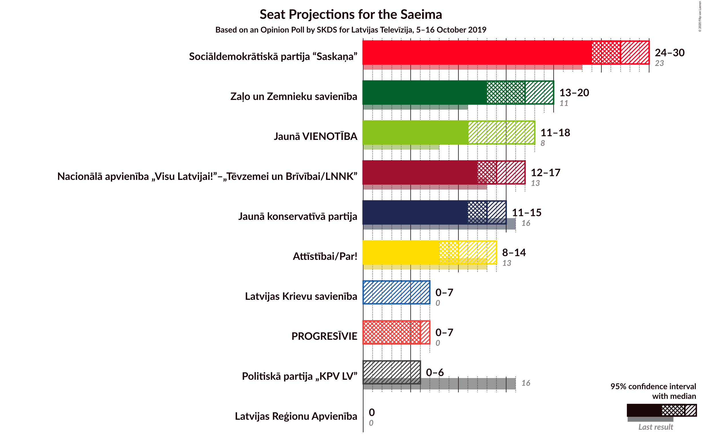
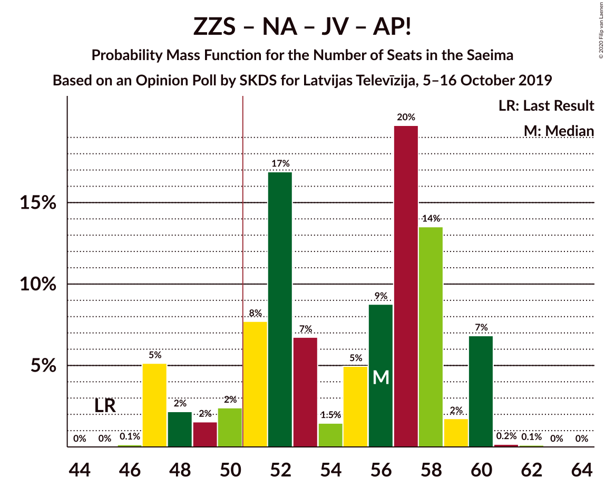
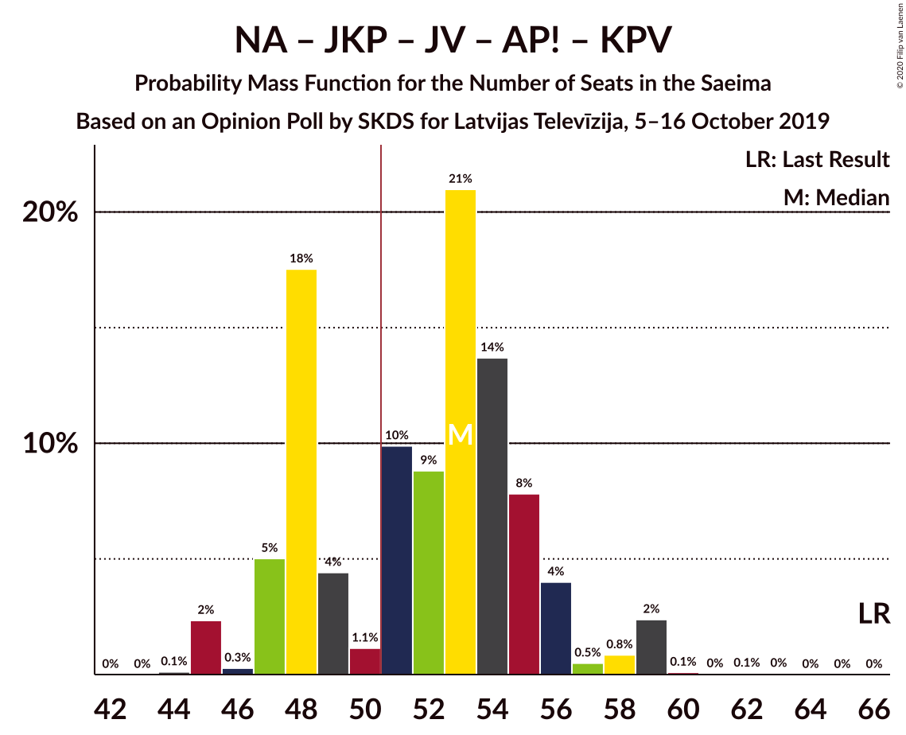
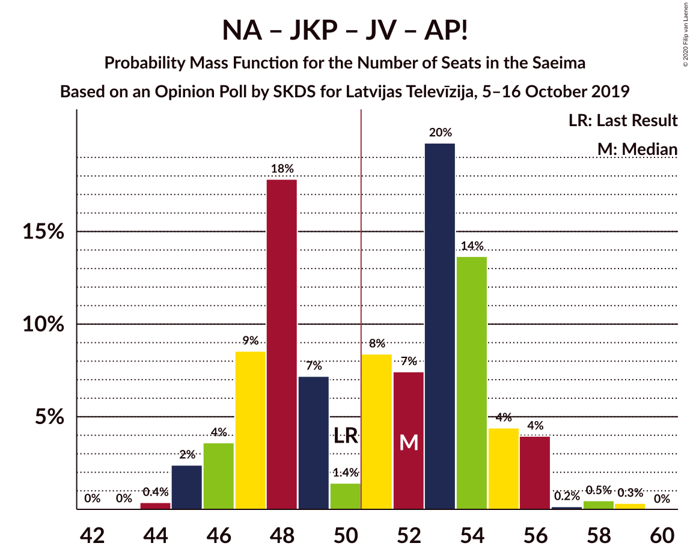
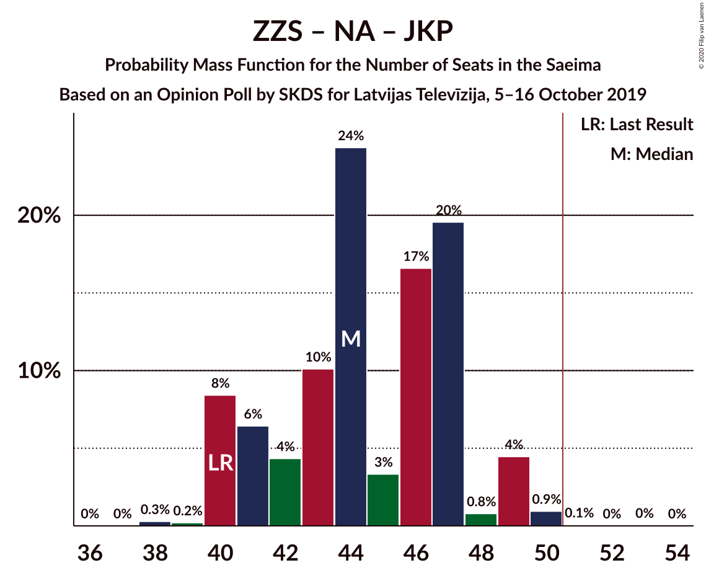
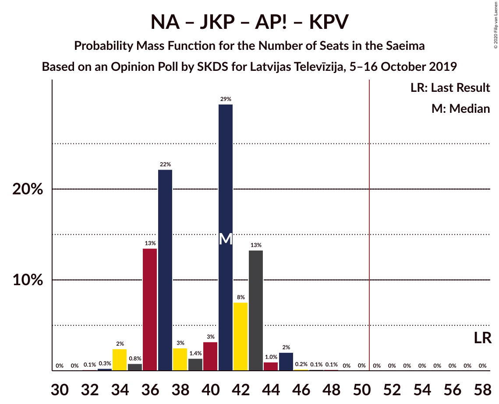

# Opinion Poll by SKDS for Latvijas Televīzija, 5–16 October 2019

<a href="#voting-intentions">Voting Intentions</a> | <a href="#seats">Seats</a> | <a href="#coalitions">Coalitions</a> | <a href="#technical-information">Technical Information</a>

## Voting Intentions

### Confidence Intervals

| Party | Last Result | Poll Result | 80% Confidence Interval | 90% Confidence Interval | 95% Confidence Interval | 99% Confidence Interval |
|:-----:|:-----------:|:-----------:|:-----------------------:|:-----------------------:|:-----------------------:|:-----------------------:|
| Sociāldemokrātiskā partija “Saskaņa” | 19.8% | 22.7% | 21.0–24.5% |20.5–25.0% |20.1–25.5% |19.3–26.4% |
| Zaļo un Zemnieku savienība | 9.9% | 14.1% | 12.7–15.7% |12.3–16.1% |12.0–16.5% |11.3–17.3% |
| Nacionālā apvienība „Visu Latvijai!”–„Tēvzemei un Brīvībai/LNNK” | 11.0% | 12.9% | 11.5–14.4% |11.2–14.8% |10.9–15.2% |10.2–16.0% |
| Jaunā konservatīvā partija | 13.6% | 11.8% | 10.5–13.2% |10.1–13.7% |9.8–14.0% |9.3–14.8% |
| Jaunā VIENOTĪBA | 6.7% | 11.4% | 10.2–12.9% |9.8–13.3% |9.5–13.7% |9.0–14.4% |
| Attīstībai/Par! | 12.0% | 9.2% | 8.1–10.6% |7.8–11.0% |7.5–11.3% |7.0–12.0% |
| PROGRESĪVIE | 2.6% | 5.0% | 4.1–6.0% |3.9–6.3% |3.7–6.6% |3.4–7.1% |
| Politiskā partija „KPV LV” | 14.2% | 4.4% | 3.6–5.4% |3.4–5.7% |3.2–5.9% |2.9–6.5% |
| Latvijas Reģionu Apvienība | 4.1% | 3.9% | 3.1–4.8% |2.9–5.1% |2.8–5.3% |2.5–5.8% |
| Latvijas Krievu savienība | 3.2% | 3.9% | 3.1–4.8% |2.9–5.1% |2.8–5.3% |2.5–5.8% |

*Note:* The poll result column reflects the actual value used in the calculations. Published results may vary slightly, and in addition be rounded to fewer digits.

## Seats

### Confidence Intervals

| Party | Last Result | Median | 80% Confidence Interval | 90% Confidence Interval | 95% Confidence Interval | 99% Confidence Interval |
|:-----:|:-----------:|:------:|:-----------------------:|:-----------------------:|:-----------------------:|:-----------------------:|
| <a href="#sociāldemokrātiskā-partija-“saskaņa”">Sociāldemokrātiskā partija “Saskaņa”</a> | 23 | 27 | 24–29 |24–30 |24–30 |22–31 |
| <a href="#zaļo-un-zemnieku-savienība">Zaļo un Zemnieku savienība</a> | 11 | 17 | 14–17 |13–19 |13–20 |12–21 |
| <a href="#nacionālā-apvienība-„visu-latvijai!”–„tēvzemei-un-brīvībai/lnnk”">Nacionālā apvienība „Visu Latvijai!”–„Tēvzemei un Brīvībai/LNNK”</a> | 13 | 14 | 13–17 |13–17 |12–17 |11–19 |
| <a href="#jaunā-konservatīvā-partija">Jaunā konservatīvā partija</a> | 16 | 13 | 12–13 |12–15 |11–15 |10–17 |
| <a href="#jaunā-vienotība">Jaunā VIENOTĪBA</a> | 8 | 11 | 11–15 |11–16 |11–18 |10–18 |
| <a href="#attīstībai/par!">Attīstībai/Par!</a> | 13 | 10 | 9–14 |8–14 |8–14 |7–14 |
| <a href="#progresīvie">PROGRESĪVIE</a> | 0 | 6 | 0–7 |0–7 |0–7 |0–7 |
| <a href="#politiskā-partija-„kpv-lv”">Politiskā partija „KPV LV”</a> | 16 | 0 | 0–6 |0–6 |0–6 |0–7 |
| <a href="#latvijas-reģionu-apvienība">Latvijas Reģionu Apvienība</a> | 0 | 0 | 0 |0 |0 |0–6 |
| <a href="#latvijas-krievu-savienība">Latvijas Krievu savienība</a> | 0 | 0 | 0 |0–7 |0–7 |0–7 |

### Sociāldemokrātiskā partija “Saskaņa”

*For a full overview of the results for this party, see the [Sociāldemokrātiskā partija “Saskaņa”](party-sociāldemokrātiskāpartija“saskaņa”.html) page.*

| Number of Seats | Probability | Accumulated | Special Marks |
|:---------------:|:-----------:|:-----------:|:-------------:|
| 21 | 0.1% | 100% |  |
| 22 | 0.9% | 99.9% |  |
| 23 | 0.4% | 99.1% | Last Result |
| 24 | 21% | 98.7% |  |
| 25 | 5% | 77% |  |
| 26 | 12% | 72% |  |
| 27 | 14% | 61% | Median |
| 28 | 23% | 47% |  |
| 29 | 18% | 24% |  |
| 30 | 6% | 6% |  |
| 31 | 0.4% | 0.6% |  |
| 32 | 0% | 0.3% |  |
| 33 | 0% | 0.2% |  |
| 34 | 0.2% | 0.2% |  |
| 35 | 0% | 0% |  |

### Zaļo un Zemnieku savienība

*For a full overview of the results for this party, see the [Zaļo un Zemnieku savienība](party-zaļounzemniekusavienība.html) page.*

| Number of Seats | Probability | Accumulated | Special Marks |
|:---------------:|:-----------:|:-----------:|:-------------:|
| 11 | 0% | 100% | Last Result |
| 12 | 0.5% | 100% |  |
| 13 | 6% | 99.5% |  |
| 14 | 5% | 94% |  |
| 15 | 8% | 89% |  |
| 16 | 3% | 81% |  |
| 17 | 70% | 78% | Median |
| 18 | 1.4% | 8% |  |
| 19 | 2% | 7% |  |
| 20 | 3% | 4% |  |
| 21 | 1.1% | 1.2% |  |
| 22 | 0.1% | 0.1% |  |
| 23 | 0% | 0% |  |

### Nacionālā apvienība „Visu Latvijai!”–„Tēvzemei un Brīvībai/LNNK”

*For a full overview of the results for this party, see the [Nacionālā apvienība „Visu Latvijai!”–„Tēvzemei un Brīvībai/LNNK”](party-nacionālāapvienība„visulatvijai”–„tēvzemeiunbrīvībailnnk”.html) page.*

| Number of Seats | Probability | Accumulated | Special Marks |
|:---------------:|:-----------:|:-----------:|:-------------:|
| 11 | 0.8% | 100% |  |
| 12 | 3% | 99.2% |  |
| 13 | 9% | 97% | Last Result |
| 14 | 46% | 88% | Median |
| 15 | 2% | 42% |  |
| 16 | 15% | 40% |  |
| 17 | 23% | 24% |  |
| 18 | 0.2% | 2% |  |
| 19 | 1.3% | 1.3% |  |
| 20 | 0% | 0% |  |

### Jaunā konservatīvā partija

*For a full overview of the results for this party, see the [Jaunā konservatīvā partija](party-jaunākonservatīvāpartija.html) page.*

| Number of Seats | Probability | Accumulated | Special Marks |
|:---------------:|:-----------:|:-----------:|:-------------:|
| 10 | 2% | 100% |  |
| 11 | 3% | 98% |  |
| 12 | 7% | 95% |  |
| 13 | 80% | 88% | Median |
| 14 | 0.3% | 8% |  |
| 15 | 7% | 8% |  |
| 16 | 0.1% | 0.7% | Last Result |
| 17 | 0.4% | 0.6% |  |
| 18 | 0% | 0.1% |  |
| 19 | 0% | 0.1% |  |
| 20 | 0.1% | 0.1% |  |
| 21 | 0% | 0% |  |

### Jaunā VIENOTĪBA

*For a full overview of the results for this party, see the [Jaunā VIENOTĪBA](party-jaunāvienotība.html) page.*

| Number of Seats | Probability | Accumulated | Special Marks |
|:---------------:|:-----------:|:-----------:|:-------------:|
| 8 | 0% | 100% | Last Result |
| 9 | 0% | 100% |  |
| 10 | 1.2% | 100% |  |
| 11 | 52% | 98.8% | Median |
| 12 | 21% | 47% |  |
| 13 | 5% | 26% |  |
| 14 | 5% | 21% |  |
| 15 | 10% | 16% |  |
| 16 | 3% | 6% |  |
| 17 | 0.1% | 3% |  |
| 18 | 3% | 3% |  |
| 19 | 0% | 0% |  |

### Attīstībai/Par!

*For a full overview of the results for this party, see the [Attīstībai/Par!](party-attīstībaipar.html) page.*

| Number of Seats | Probability | Accumulated | Special Marks |
|:---------------:|:-----------:|:-----------:|:-------------:|
| 7 | 0.6% | 100% |  |
| 8 | 6% | 99.4% |  |
| 9 | 8% | 93% |  |
| 10 | 44% | 86% | Median |
| 11 | 21% | 42% |  |
| 12 | 0.4% | 22% |  |
| 13 | 4% | 21% | Last Result |
| 14 | 17% | 18% |  |
| 15 | 0.2% | 0.2% |  |
| 16 | 0.1% | 0.1% |  |
| 17 | 0% | 0% |  |

### PROGRESĪVIE

*For a full overview of the results for this party, see the [PROGRESĪVIE](party-progresīvie.html) page.*

| Number of Seats | Probability | Accumulated | Special Marks |
|:---------------:|:-----------:|:-----------:|:-------------:|
| 0 | 37% | 100% | Last Result |
| 1 | 0% | 63% |  |
| 2 | 0% | 63% |  |
| 3 | 0% | 63% |  |
| 4 | 0% | 63% |  |
| 5 | 1.2% | 63% |  |
| 6 | 23% | 62% | Median |
| 7 | 39% | 39% |  |
| 8 | 0.1% | 0.1% |  |
| 9 | 0% | 0% |  |

### Politiskā partija „KPV LV”

*For a full overview of the results for this party, see the [Politiskā partija „KPV LV”](party-politiskāpartija„kpvlv”.html) page.*

| Number of Seats | Probability | Accumulated | Special Marks |
|:---------------:|:-----------:|:-----------:|:-------------:|
| 0 | 86% | 100% | Median |
| 1 | 0% | 14% |  |
| 2 | 0% | 14% |  |
| 3 | 0% | 14% |  |
| 4 | 0% | 14% |  |
| 5 | 3% | 14% |  |
| 6 | 10% | 11% |  |
| 7 | 0.7% | 0.7% |  |
| 8 | 0% | 0.1% |  |
| 9 | 0% | 0% |  |
| 10 | 0% | 0% |  |
| 11 | 0% | 0% |  |
| 12 | 0% | 0% |  |
| 13 | 0% | 0% |  |
| 14 | 0% | 0% |  |
| 15 | 0% | 0% |  |
| 16 | 0% | 0% | Last Result |

### Latvijas Reģionu Apvienība

*For a full overview of the results for this party, see the [Latvijas Reģionu Apvienība](party-latvijasreģionuapvienība.html) page.*

| Number of Seats | Probability | Accumulated | Special Marks |
|:---------------:|:-----------:|:-----------:|:-------------:|
| 0 | 98% | 100% | Last Result, Median |
| 1 | 0% | 2% |  |
| 2 | 0% | 2% |  |
| 3 | 0% | 2% |  |
| 4 | 0% | 2% |  |
| 5 | 0% | 2% |  |
| 6 | 2% | 2% |  |
| 7 | 0% | 0% |  |

### Latvijas Krievu savienība

*For a full overview of the results for this party, see the [Latvijas Krievu savienība](party-latvijaskrievusavienība.html) page.*

| Number of Seats | Probability | Accumulated | Special Marks |
|:---------------:|:-----------:|:-----------:|:-------------:|
| 0 | 94% | 100% | Last Result, Median |
| 1 | 0% | 6% |  |
| 2 | 0% | 6% |  |
| 3 | 0% | 6% |  |
| 4 | 0% | 6% |  |
| 5 | 0.3% | 6% |  |
| 6 | 0.9% | 6% |  |
| 7 | 5% | 5% |  |
| 8 | 0.5% | 0.5% |  |
| 9 | 0% | 0% |  |

## Coalitions

### Confidence Intervals

| Coalition | Last Result | Median | Majority? | 80% Confidence Interval | 90% Confidence Interval | 95% Confidence Interval | 99% Confidence Interval |
|:---------:|:-----------:|:------:|:---------:|:-----------------------:|:-----------------------:|:-----------------------:|:-----------------------:|
| Zaļo un Zemnieku savienība – Nacionālā apvienība „Visu Latvijai!”–„Tēvzemei un Brīvībai/LNNK” – Jaunā konservatīvā partija – Jaunā VIENOTĪBA – Attīstībai/Par! | 61 | 68 | 100% | 63–71 | 60–73 | 60–75 | 60–75 |
| Zaļo un Zemnieku savienība – Nacionālā apvienība „Visu Latvijai!”–„Tēvzemei un Brīvībai/LNNK” – Jaunā konservatīvā partija – Jaunā VIENOTĪBA | 48 | 57 | 99.5% | 52–62 | 51–62 | 51–62 | 51–63 |
| Zaļo un Zemnieku savienība – Nacionālā apvienība „Visu Latvijai!”–„Tēvzemei un Brīvībai/LNNK” – Jaunā konservatīvā partija – Attīstībai/Par! | 53 | 54 | 90% | 51–60 | 49–60 | 49–62 | 49–62 |
| Zaļo un Zemnieku savienība – Nacionālā apvienība „Visu Latvijai!”–„Tēvzemei un Brīvībai/LNNK” – Jaunā VIENOTĪBA – Attīstībai/Par! | 45 | 56 | 89% | 50–58 | 47–60 | 47–60 | 47–60 |
| Nacionālā apvienība „Visu Latvijai!”–„Tēvzemei un Brīvībai/LNNK” – Jaunā konservatīvā partija – Jaunā VIENOTĪBA – Attīstībai/Par! – Politiskā partija „KPV LV” | 66 | 53 | 69% | 48–55 | 47–56 | 46–59 | 45–59 |
| Sociāldemokrātiskā partija “Saskaņa” – Jaunā konservatīvā partija – Attīstībai/Par! | 52 | 51 | 53% | 48–56 | 47–56 | 47–56 | 45–57 |
| Nacionālā apvienība „Visu Latvijai!”–„Tēvzemei un Brīvībai/LNNK” – Jaunā konservatīvā partija – Jaunā VIENOTĪBA – Attīstībai/Par! | 50 | 52 | 59% | 47–54 | 46–55 | 45–56 | 45–58 |
| Sociāldemokrātiskā partija “Saskaņa” – Zaļo un Zemnieku savienība – Politiskā partija „KPV LV” | 50 | 45 | 4% | 41–47 | 39–49 | 39–51 | 38–53 |
| Zaļo un Zemnieku savienība – Nacionālā apvienība „Visu Latvijai!”–„Tēvzemei un Brīvībai/LNNK” – Jaunā konservatīvā partija | 40 | 44 | 0.1% | 41–47 | 40–49 | 40–49 | 39–50 |
| Zaļo un Zemnieku savienība – Nacionālā apvienība „Visu Latvijai!”–„Tēvzemei un Brīvībai/LNNK” – Jaunā VIENOTĪBA | 32 | 44 | 0.3% | 39–47 | 38–49 | 38–49 | 38–49 |
| Nacionālā apvienība „Visu Latvijai!”–„Tēvzemei un Brīvībai/LNNK” – Jaunā konservatīvā partija – Jaunā VIENOTĪBA – Politiskā partija „KPV LV” | 53 | 41 | 0.1% | 38–45 | 38–45 | 37–48 | 36–49 |
| Zaļo un Zemnieku savienība – Nacionālā apvienība „Visu Latvijai!”–„Tēvzemei un Brīvībai/LNNK” – Attīstībai/Par! | 37 | 41 | 0% | 38–47 | 36–47 | 36–47 | 36–47 |
| Nacionālā apvienība „Visu Latvijai!”–„Tēvzemei un Brīvībai/LNNK” – Jaunā konservatīvā partija – Attīstībai/Par! – Politiskā partija „KPV LV” | 58 | 41 | 0% | 36–43 | 36–43 | 34–45 | 34–45 |
| Nacionālā apvienība „Visu Latvijai!”–„Tēvzemei un Brīvībai/LNNK” – Jaunā VIENOTĪBA – Attīstībai/Par! – Politiskā partija „KPV LV” | 50 | 40 | 0% | 35–42 | 34–44 | 33–45 | 32–46 |
| Sociāldemokrātiskā partija “Saskaņa” – Attīstībai/Par! | 36 | 38 | 0% | 35–43 | 34–43 | 34–43 | 32–43 |
| Jaunā konservatīvā partija – Jaunā VIENOTĪBA – Attīstībai/Par! – Politiskā partija „KPV LV” | 53 | 37 | 0% | 34–41 | 33–42 | 32–43 | 31–45 |
| Sociāldemokrātiskā partija “Saskaņa” – Politiskā partija „KPV LV” | 39 | 28 | 0% | 24–31 | 24–33 | 24–34 | 23–36 |

### Zaļo un Zemnieku savienība – Nacionālā apvienība „Visu Latvijai!”–„Tēvzemei un Brīvībai/LNNK” – Jaunā konservatīvā partija – Jaunā VIENOTĪBA – Attīstībai/Par!

| Number of Seats | Probability | Accumulated | Special Marks |
|:---------------:|:-----------:|:-----------:|:-------------:|
| 59 | 0.3% | 100% |  |
| 60 | 5% | 99.7% |  |
| 61 | 3% | 95% | Last Result |
| 62 | 0.4% | 92% |  |
| 63 | 2% | 91% |  |
| 64 | 8% | 89% |  |
| 65 | 18% | 81% | Median |
| 66 | 8% | 63% |  |
| 67 | 0.9% | 55% |  |
| 68 | 7% | 54% |  |
| 69 | 3% | 47% |  |
| 70 | 20% | 44% |  |
| 71 | 14% | 24% |  |
| 72 | 3% | 10% |  |
| 73 | 4% | 7% |  |
| 74 | 0.1% | 3% |  |
| 75 | 3% | 3% |  |
| 76 | 0.1% | 0.1% |  |
| 77 | 0% | 0% |  |

### Zaļo un Zemnieku savienība – Nacionālā apvienība „Visu Latvijai!”–„Tēvzemei un Brīvībai/LNNK” – Jaunā konservatīvā partija – Jaunā VIENOTĪBA

| Number of Seats | Probability | Accumulated | Special Marks |
|:---------------:|:-----------:|:-----------:|:-------------:|
| 48 | 0% | 100% | Last Result |
| 49 | 0.1% | 100% |  |
| 50 | 0.4% | 99.9% |  |
| 51 | 8% | 99.5% | Majority |
| 52 | 4% | 92% |  |
| 53 | 2% | 87% |  |
| 54 | 4% | 85% |  |
| 55 | 18% | 81% | Median |
| 56 | 9% | 62% |  |
| 57 | 13% | 53% |  |
| 58 | 7% | 40% |  |
| 59 | 17% | 33% |  |
| 60 | 4% | 16% |  |
| 61 | 0.8% | 12% |  |
| 62 | 11% | 11% |  |
| 63 | 0.2% | 0.5% |  |
| 64 | 0.3% | 0.4% |  |
| 65 | 0% | 0.1% |  |
| 66 | 0% | 0.1% |  |
| 67 | 0% | 0% |  |

### Zaļo un Zemnieku savienība – Nacionālā apvienība „Visu Latvijai!”–„Tēvzemei un Brīvībai/LNNK” – Jaunā konservatīvā partija – Attīstībai/Par!

| Number of Seats | Probability | Accumulated | Special Marks |
|:---------------:|:-----------:|:-----------:|:-------------:|
| 47 | 0.1% | 100% |  |
| 48 | 0.2% | 99.8% |  |
| 49 | 5% | 99.6% |  |
| 50 | 4% | 95% |  |
| 51 | 2% | 90% | Majority |
| 52 | 6% | 88% |  |
| 53 | 12% | 82% | Last Result |
| 54 | 23% | 70% | Median |
| 55 | 5% | 47% |  |
| 56 | 3% | 42% |  |
| 57 | 0.5% | 39% |  |
| 58 | 20% | 39% |  |
| 59 | 2% | 19% |  |
| 60 | 14% | 17% |  |
| 61 | 0.2% | 3% |  |
| 62 | 3% | 3% |  |
| 63 | 0% | 0.1% |  |
| 64 | 0.1% | 0.1% |  |
| 65 | 0% | 0% |  |

### Zaļo un Zemnieku savienība – Nacionālā apvienība „Visu Latvijai!”–„Tēvzemei un Brīvībai/LNNK” – Jaunā VIENOTĪBA – Attīstībai/Par!

| Number of Seats | Probability | Accumulated | Special Marks |
|:---------------:|:-----------:|:-----------:|:-------------:|
| 45 | 0% | 100% | Last Result |
| 46 | 0.1% | 100% |  |
| 47 | 5% | 99.8% |  |
| 48 | 2% | 95% |  |
| 49 | 2% | 93% |  |
| 50 | 2% | 91% |  |
| 51 | 8% | 89% | Majority |
| 52 | 17% | 81% | Median |
| 53 | 7% | 64% |  |
| 54 | 1.5% | 57% |  |
| 55 | 5% | 56% |  |
| 56 | 9% | 51% |  |
| 57 | 20% | 42% |  |
| 58 | 14% | 22% |  |
| 59 | 2% | 9% |  |
| 60 | 7% | 7% |  |
| 61 | 0.2% | 0.3% |  |
| 62 | 0.1% | 0.1% |  |
| 63 | 0% | 0% |  |

### Nacionālā apvienība „Visu Latvijai!”–„Tēvzemei un Brīvībai/LNNK” – Jaunā konservatīvā partija – Jaunā VIENOTĪBA – Attīstībai/Par! – Politiskā partija „KPV LV”

| Number of Seats | Probability | Accumulated | Special Marks |
|:---------------:|:-----------:|:-----------:|:-------------:|
| 44 | 0.1% | 100% |  |
| 45 | 2% | 99.9% |  |
| 46 | 0.3% | 98% |  |
| 47 | 5% | 97% |  |
| 48 | 18% | 92% | Median |
| 49 | 4% | 75% |  |
| 50 | 1.1% | 70% |  |
| 51 | 10% | 69% | Majority |
| 52 | 9% | 59% |  |
| 53 | 21% | 50% |  |
| 54 | 14% | 29% |  |
| 55 | 8% | 16% |  |
| 56 | 4% | 8% |  |
| 57 | 0.5% | 4% |  |
| 58 | 0.8% | 3% |  |
| 59 | 2% | 3% |  |
| 60 | 0.1% | 0.2% |  |
| 61 | 0% | 0.1% |  |
| 62 | 0.1% | 0.1% |  |
| 63 | 0% | 0% |  |
| 64 | 0% | 0% |  |
| 65 | 0% | 0% |  |
| 66 | 0% | 0% | Last Result |

### Sociāldemokrātiskā partija “Saskaņa” – Jaunā konservatīvā partija – Attīstībai/Par!

| Number of Seats | Probability | Accumulated | Special Marks |
|:---------------:|:-----------:|:-----------:|:-------------:|
| 42 | 0% | 100% |  |
| 43 | 0.2% | 99.9% |  |
| 44 | 0.2% | 99.8% |  |
| 45 | 0.6% | 99.5% |  |
| 46 | 0.5% | 99.0% |  |
| 47 | 5% | 98% |  |
| 48 | 29% | 93% |  |
| 49 | 4% | 64% |  |
| 50 | 7% | 60% | Median |
| 51 | 24% | 53% | Majority |
| 52 | 4% | 29% | Last Result |
| 53 | 6% | 25% |  |
| 54 | 5% | 19% |  |
| 55 | 0.7% | 14% |  |
| 56 | 13% | 13% |  |
| 57 | 0.2% | 0.5% |  |
| 58 | 0.2% | 0.3% |  |
| 59 | 0.1% | 0.1% |  |
| 60 | 0% | 0% |  |

### Nacionālā apvienība „Visu Latvijai!”–„Tēvzemei un Brīvībai/LNNK” – Jaunā konservatīvā partija – Jaunā VIENOTĪBA – Attīstībai/Par!

| Number of Seats | Probability | Accumulated | Special Marks |
|:---------------:|:-----------:|:-----------:|:-------------:|
| 43 | 0% | 100% |  |
| 44 | 0.4% | 99.9% |  |
| 45 | 2% | 99.6% |  |
| 46 | 4% | 97% |  |
| 47 | 9% | 94% |  |
| 48 | 18% | 85% | Median |
| 49 | 7% | 67% |  |
| 50 | 1.4% | 60% | Last Result |
| 51 | 8% | 59% | Majority |
| 52 | 7% | 50% |  |
| 53 | 20% | 43% |  |
| 54 | 14% | 23% |  |
| 55 | 4% | 9% |  |
| 56 | 4% | 5% |  |
| 57 | 0.2% | 1.0% |  |
| 58 | 0.5% | 0.8% |  |
| 59 | 0.3% | 0.4% |  |
| 60 | 0% | 0% |  |

### Sociāldemokrātiskā partija “Saskaņa” – Zaļo un Zemnieku savienība – Politiskā partija „KPV LV”

| Number of Seats | Probability | Accumulated | Special Marks |
|:---------------:|:-----------:|:-----------:|:-------------:|
| 35 | 0.3% | 100% |  |
| 36 | 0% | 99.7% |  |
| 37 | 0.1% | 99.7% |  |
| 38 | 0.1% | 99.6% |  |
| 39 | 5% | 99.5% |  |
| 40 | 0.4% | 95% |  |
| 41 | 21% | 94% |  |
| 42 | 2% | 73% |  |
| 43 | 7% | 71% |  |
| 44 | 8% | 64% | Median |
| 45 | 23% | 55% |  |
| 46 | 14% | 32% |  |
| 47 | 8% | 18% |  |
| 48 | 4% | 10% |  |
| 49 | 2% | 6% |  |
| 50 | 0.1% | 4% | Last Result |
| 51 | 2% | 4% | Majority |
| 52 | 0.1% | 2% |  |
| 53 | 2% | 2% |  |
| 54 | 0.1% | 0.1% |  |
| 55 | 0% | 0% |  |

### Zaļo un Zemnieku savienība – Nacionālā apvienība „Visu Latvijai!”–„Tēvzemei un Brīvībai/LNNK” – Jaunā konservatīvā partija

| Number of Seats | Probability | Accumulated | Special Marks |
|:---------------:|:-----------:|:-----------:|:-------------:|
| 38 | 0.3% | 100% |  |
| 39 | 0.2% | 99.7% |  |
| 40 | 8% | 99.5% | Last Result |
| 41 | 6% | 91% |  |
| 42 | 4% | 85% |  |
| 43 | 10% | 80% |  |
| 44 | 24% | 70% | Median |
| 45 | 3% | 46% |  |
| 46 | 17% | 42% |  |
| 47 | 20% | 26% |  |
| 48 | 0.8% | 6% |  |
| 49 | 4% | 6% |  |
| 50 | 0.9% | 1.1% |  |
| 51 | 0.1% | 0.1% | Majority |
| 52 | 0% | 0.1% |  |
| 53 | 0% | 0.1% |  |
| 54 | 0% | 0% |  |

### Zaļo un Zemnieku savienība – Nacionālā apvienība „Visu Latvijai!”–„Tēvzemei un Brīvībai/LNNK” – Jaunā VIENOTĪBA

| Number of Seats | Probability | Accumulated | Special Marks |
|:---------------:|:-----------:|:-----------:|:-------------:|
| 32 | 0% | 100% | Last Result |
| 33 | 0% | 100% |  |
| 34 | 0% | 100% |  |
| 35 | 0% | 100% |  |
| 36 | 0% | 100% |  |
| 37 | 0.4% | 100% |  |
| 38 | 7% | 99.6% |  |
| 39 | 5% | 93% |  |
| 40 | 2% | 87% |  |
| 41 | 5% | 85% |  |
| 42 | 17% | 80% | Median |
| 43 | 7% | 63% |  |
| 44 | 13% | 56% |  |
| 45 | 5% | 43% |  |
| 46 | 23% | 38% |  |
| 47 | 8% | 16% |  |
| 48 | 0.9% | 7% |  |
| 49 | 6% | 7% |  |
| 50 | 0.1% | 0.3% |  |
| 51 | 0.3% | 0.3% | Majority |
| 52 | 0% | 0% |  |

### Nacionālā apvienība „Visu Latvijai!”–„Tēvzemei un Brīvībai/LNNK” – Jaunā konservatīvā partija – Jaunā VIENOTĪBA – Politiskā partija „KPV LV”

| Number of Seats | Probability | Accumulated | Special Marks |
|:---------------:|:-----------:|:-----------:|:-------------:|
| 35 | 0.2% | 100% |  |
| 36 | 0.3% | 99.8% |  |
| 37 | 3% | 99.5% |  |
| 38 | 26% | 97% | Median |
| 39 | 5% | 71% |  |
| 40 | 14% | 66% |  |
| 41 | 11% | 52% |  |
| 42 | 20% | 41% |  |
| 43 | 4% | 21% |  |
| 44 | 0.5% | 17% |  |
| 45 | 13% | 16% |  |
| 46 | 0.2% | 4% |  |
| 47 | 0.3% | 3% |  |
| 48 | 0.8% | 3% |  |
| 49 | 2% | 2% |  |
| 50 | 0.1% | 0.2% |  |
| 51 | 0.1% | 0.1% | Majority |
| 52 | 0% | 0% |  |
| 53 | 0% | 0% | Last Result |

### Zaļo un Zemnieku savienība – Nacionālā apvienība „Visu Latvijai!”–„Tēvzemei un Brīvībai/LNNK” – Attīstībai/Par!

| Number of Seats | Probability | Accumulated | Special Marks |
|:---------------:|:-----------:|:-----------:|:-------------:|
| 35 | 0.3% | 100% |  |
| 36 | 5% | 99.6% |  |
| 37 | 3% | 94% | Last Result |
| 38 | 3% | 91% |  |
| 39 | 6% | 89% |  |
| 40 | 7% | 83% |  |
| 41 | 28% | 76% | Median |
| 42 | 5% | 48% |  |
| 43 | 3% | 43% |  |
| 44 | 3% | 40% |  |
| 45 | 21% | 38% |  |
| 46 | 2% | 17% |  |
| 47 | 15% | 15% |  |
| 48 | 0.1% | 0.2% |  |
| 49 | 0.1% | 0.1% |  |
| 50 | 0% | 0% |  |

### Nacionālā apvienība „Visu Latvijai!”–„Tēvzemei un Brīvībai/LNNK” – Jaunā konservatīvā partija – Attīstībai/Par! – Politiskā partija „KPV LV”

| Number of Seats | Probability | Accumulated | Special Marks |
|:---------------:|:-----------:|:-----------:|:-------------:|
| 32 | 0.1% | 100% |  |
| 33 | 0.3% | 99.9% |  |
| 34 | 2% | 99.6% |  |
| 35 | 0.8% | 97% |  |
| 36 | 13% | 96% |  |
| 37 | 22% | 83% | Median |
| 38 | 3% | 61% |  |
| 39 | 1.4% | 58% |  |
| 40 | 3% | 57% |  |
| 41 | 29% | 54% |  |
| 42 | 8% | 24% |  |
| 43 | 13% | 17% |  |
| 44 | 1.0% | 3% |  |
| 45 | 2% | 3% |  |
| 46 | 0.2% | 0.5% |  |
| 47 | 0.1% | 0.3% |  |
| 48 | 0.1% | 0.2% |  |
| 49 | 0% | 0% |  |
| 50 | 0% | 0% |  |
| 51 | 0% | 0% | Majority |
| 52 | 0% | 0% |  |
| 53 | 0% | 0% |  |
| 54 | 0% | 0% |  |
| 55 | 0% | 0% |  |
| 56 | 0% | 0% |  |
| 57 | 0% | 0% |  |
| 58 | 0% | 0% | Last Result |

### Nacionālā apvienība „Visu Latvijai!”–„Tēvzemei un Brīvībai/LNNK” – Jaunā VIENOTĪBA – Attīstībai/Par! – Politiskā partija „KPV LV”

| Number of Seats | Probability | Accumulated | Special Marks |
|:---------------:|:-----------:|:-----------:|:-------------:|
| 32 | 2% | 100% |  |
| 33 | 0.3% | 98% |  |
| 34 | 5% | 97% |  |
| 35 | 16% | 92% | Median |
| 36 | 5% | 76% |  |
| 37 | 2% | 71% |  |
| 38 | 6% | 69% |  |
| 39 | 12% | 63% |  |
| 40 | 24% | 50% |  |
| 41 | 14% | 27% |  |
| 42 | 3% | 13% |  |
| 43 | 4% | 10% |  |
| 44 | 3% | 5% |  |
| 45 | 0.5% | 3% |  |
| 46 | 2% | 2% |  |
| 47 | 0.1% | 0.2% |  |
| 48 | 0.1% | 0.1% |  |
| 49 | 0% | 0.1% |  |
| 50 | 0% | 0% | Last Result |

### Sociāldemokrātiskā partija “Saskaņa” – Attīstībai/Par!

| Number of Seats | Probability | Accumulated | Special Marks |
|:---------------:|:-----------:|:-----------:|:-------------:|
| 30 | 0% | 100% |  |
| 31 | 0.1% | 99.9% |  |
| 32 | 0.8% | 99.8% |  |
| 33 | 0.7% | 99.1% |  |
| 34 | 6% | 98% |  |
| 35 | 22% | 93% |  |
| 36 | 7% | 71% | Last Result |
| 37 | 8% | 64% | Median |
| 38 | 31% | 56% |  |
| 39 | 4% | 24% |  |
| 40 | 2% | 20% |  |
| 41 | 4% | 18% |  |
| 42 | 0.4% | 13% |  |
| 43 | 13% | 13% |  |
| 44 | 0.2% | 0.5% |  |
| 45 | 0.1% | 0.2% |  |
| 46 | 0.1% | 0.1% |  |
| 47 | 0% | 0% |  |

### Jaunā konservatīvā partija – Jaunā VIENOTĪBA – Attīstībai/Par! – Politiskā partija „KPV LV”

| Number of Seats | Probability | Accumulated | Special Marks |
|:---------------:|:-----------:|:-----------:|:-------------:|
| 31 | 1.4% | 100% |  |
| 32 | 3% | 98.5% |  |
| 33 | 5% | 96% |  |
| 34 | 19% | 91% | Median |
| 35 | 4% | 71% |  |
| 36 | 16% | 67% |  |
| 37 | 7% | 51% |  |
| 38 | 18% | 44% |  |
| 39 | 12% | 26% |  |
| 40 | 3% | 14% |  |
| 41 | 6% | 12% |  |
| 42 | 2% | 5% |  |
| 43 | 2% | 4% |  |
| 44 | 0.2% | 1.2% |  |
| 45 | 0.6% | 1.0% |  |
| 46 | 0.3% | 0.4% |  |
| 47 | 0% | 0.1% |  |
| 48 | 0% | 0% |  |
| 49 | 0% | 0% |  |
| 50 | 0% | 0% |  |
| 51 | 0% | 0% | Majority |
| 52 | 0% | 0% |  |
| 53 | 0% | 0% | Last Result |

### Sociāldemokrātiskā partija “Saskaņa” – Politiskā partija „KPV LV”

| Number of Seats | Probability | Accumulated | Special Marks |
|:---------------:|:-----------:|:-----------:|:-------------:|
| 22 | 0.4% | 100% |  |
| 23 | 0.2% | 99.6% |  |
| 24 | 17% | 99.3% |  |
| 25 | 3% | 82% |  |
| 26 | 12% | 78% |  |
| 27 | 11% | 67% | Median |
| 28 | 20% | 56% |  |
| 29 | 18% | 36% |  |
| 30 | 7% | 17% |  |
| 31 | 2% | 10% |  |
| 32 | 2% | 8% |  |
| 33 | 2% | 6% |  |
| 34 | 2% | 5% |  |
| 35 | 0.1% | 2% |  |
| 36 | 2% | 2% |  |
| 37 | 0% | 0.1% |  |
| 38 | 0% | 0% |  |
| 39 | 0% | 0% | Last Result |

## Technical Information

### Opinion Poll

+ **Polling firm:** SKDS
+ **Commissioner(s):** Latvijas Televīzija
+ **Fieldwork period:** 5–16 October 2019

### Calculations

+ **Sample size:** 909
+ **Simulations done:** 131,072
+ **Error estimate:** 3.32%

