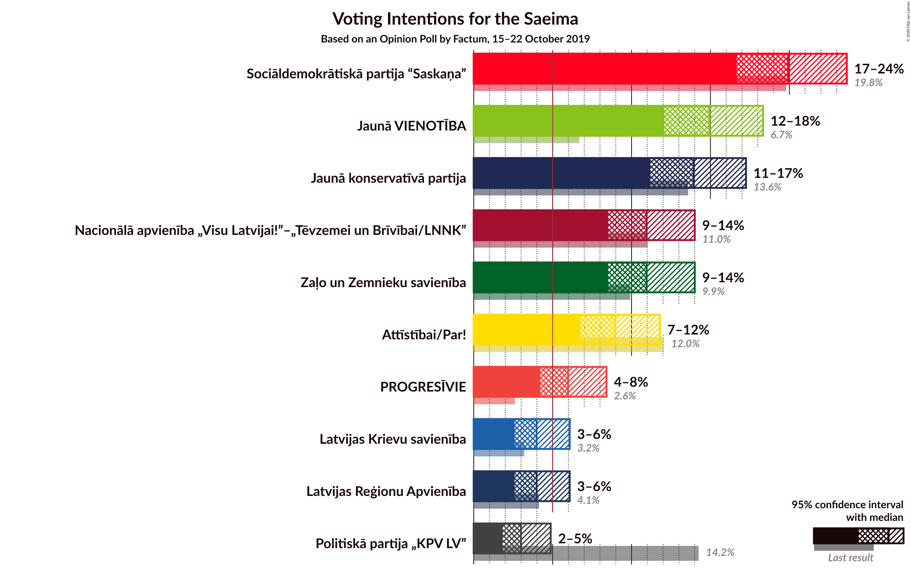
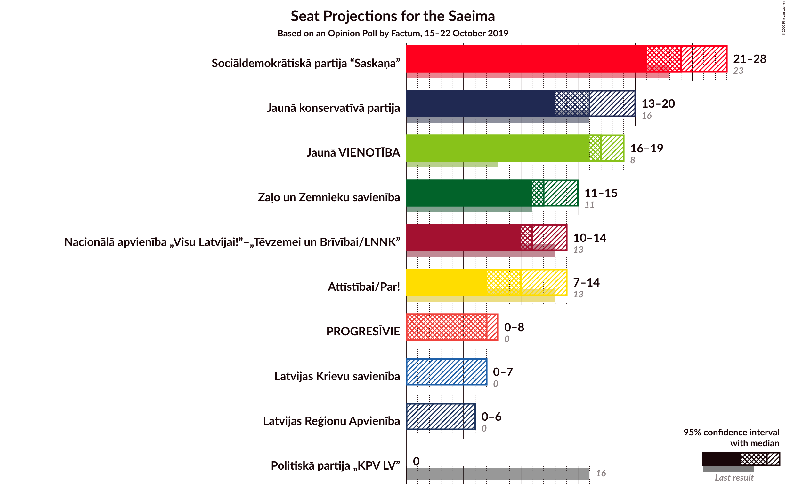
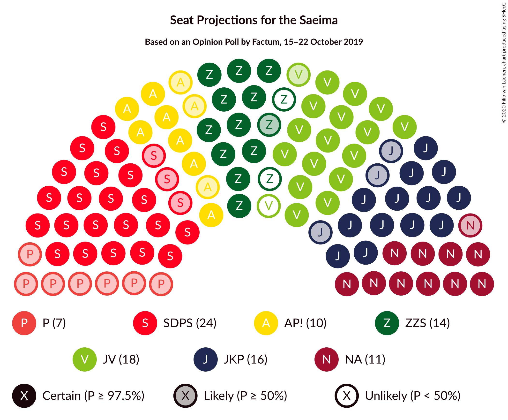
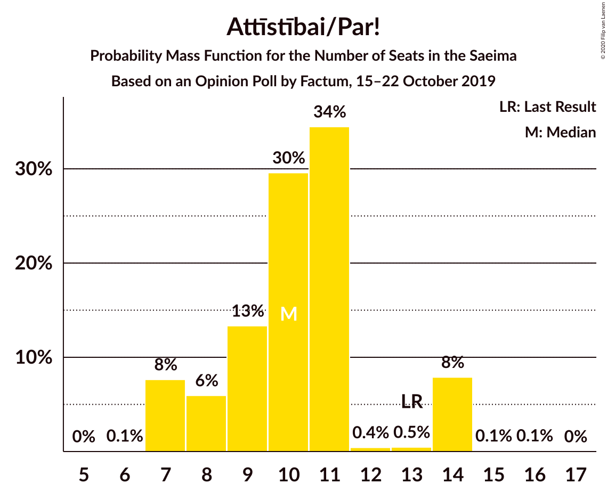
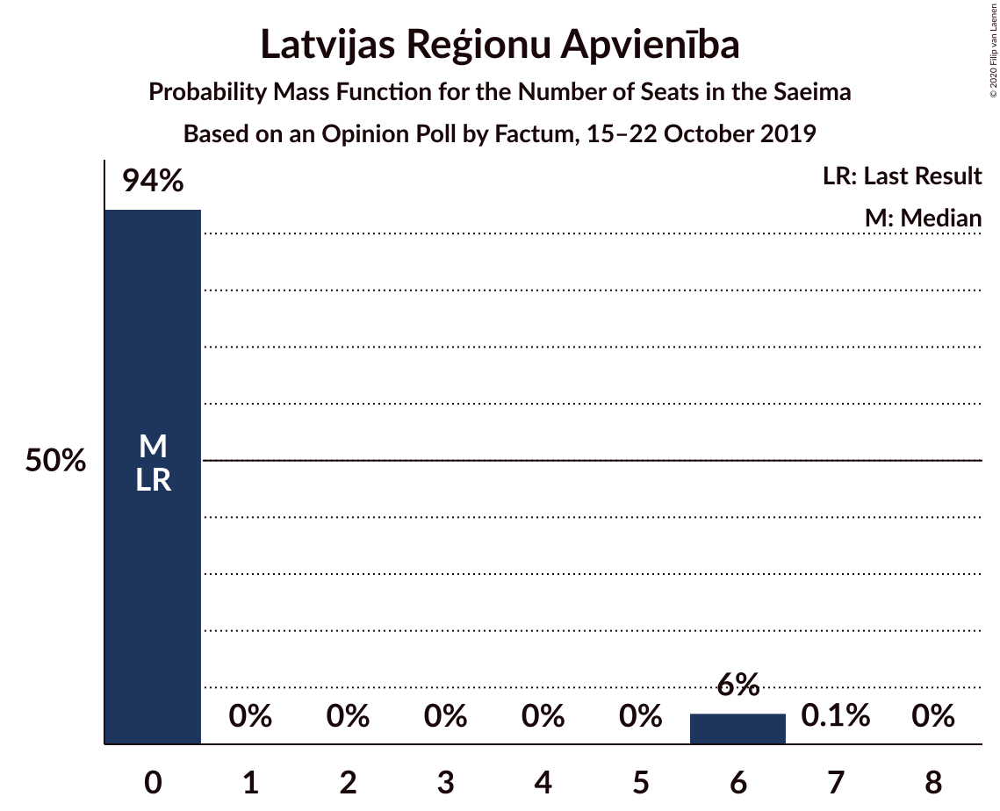
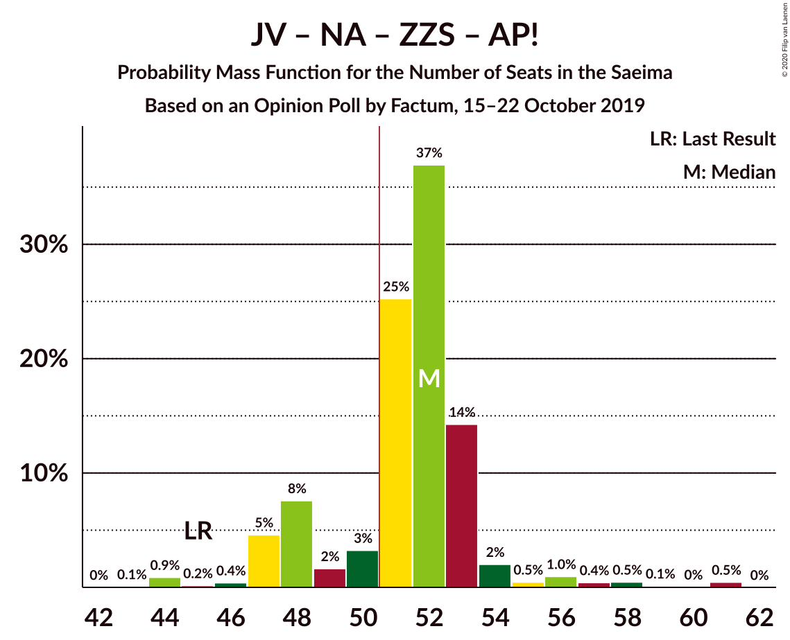
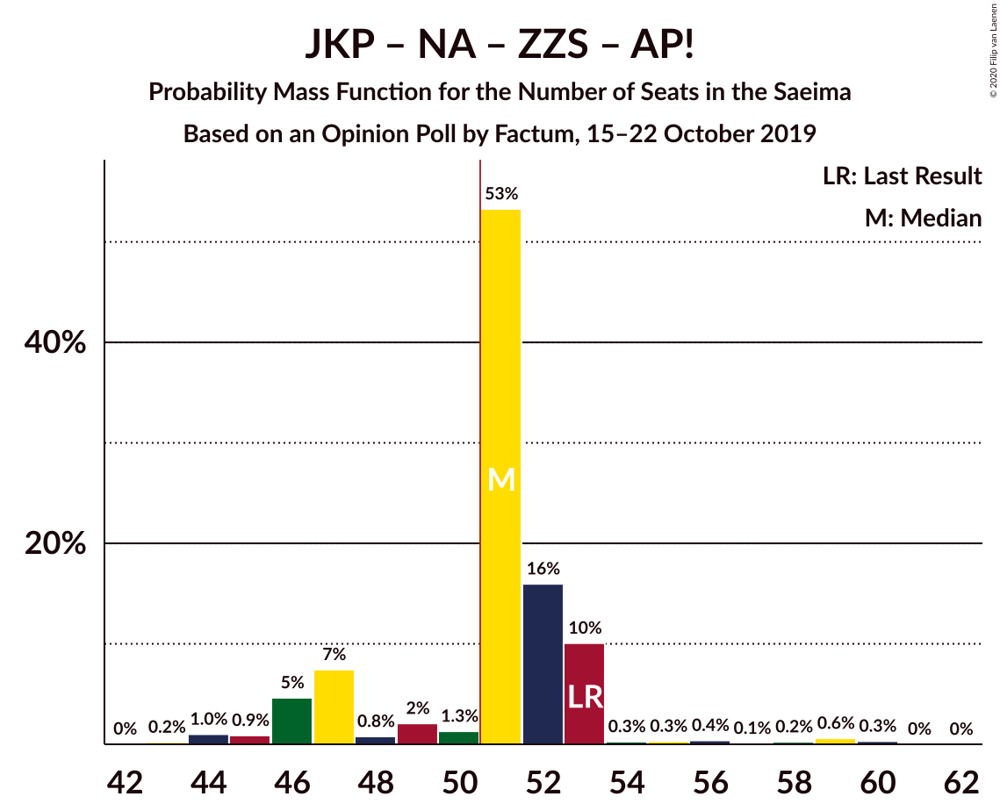
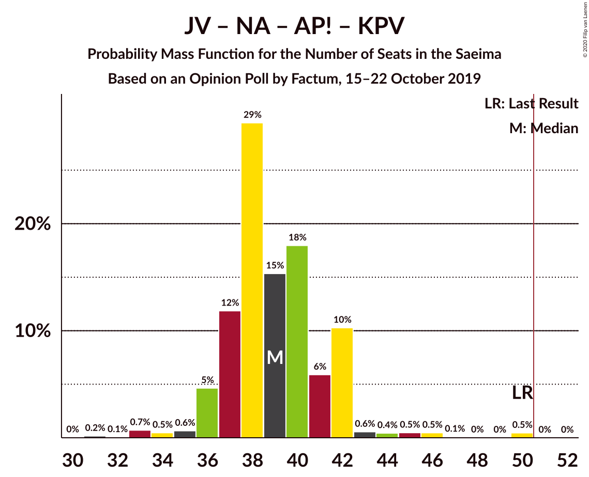
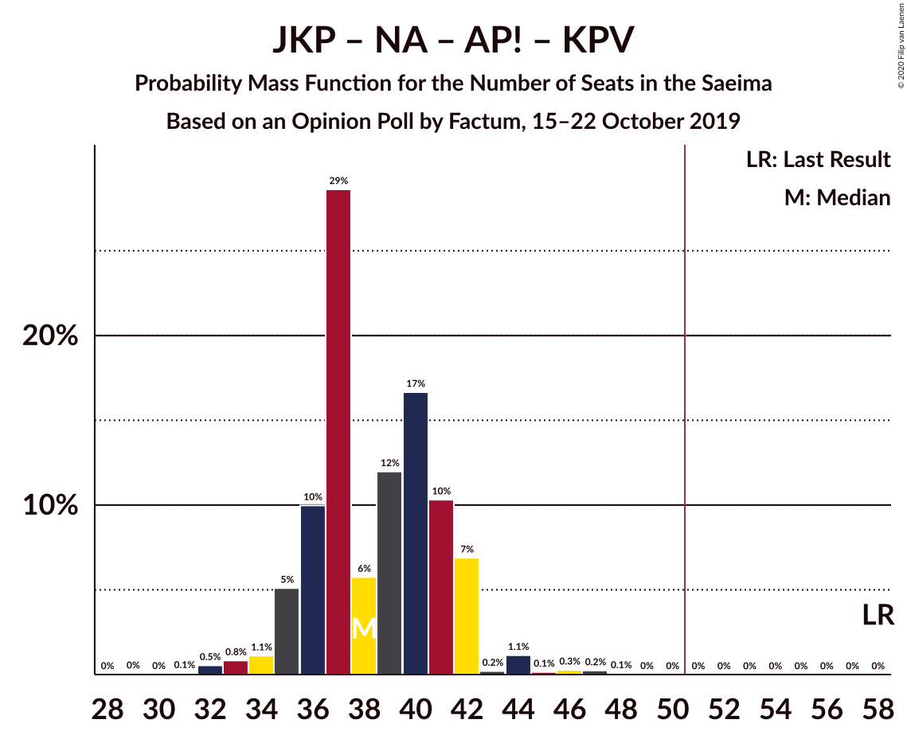
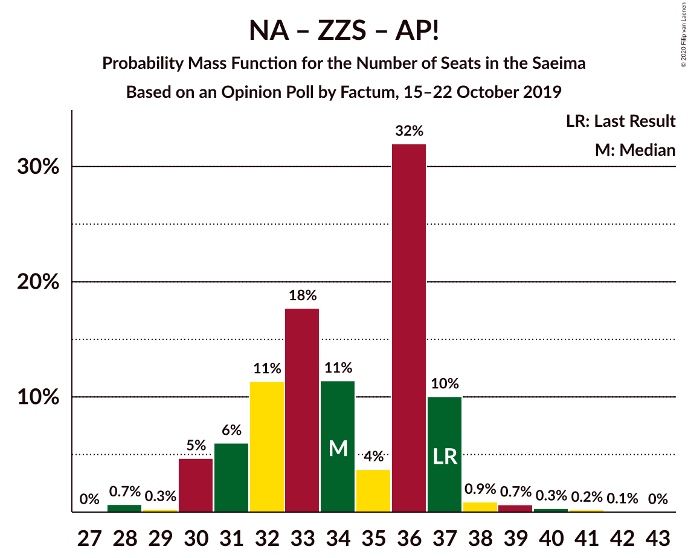

# Opinion Poll by Factum, 15–22 October 2019

<a href="#voting-intentions">Voting Intentions</a> | <a href="#seats">Seats</a> | <a href="#coalitions">Coalitions</a> | <a href="#technical-information">Technical Information</a>

## Voting Intentions

### Confidence Intervals

| Party | Last Result | Poll Result | 80% Confidence Interval | 90% Confidence Interval | 95% Confidence Interval | 99% Confidence Interval |
|:-----:|:-----------:|:-----------:|:-----------------------:|:-----------------------:|:-----------------------:|:-----------------------:|
| Sociāldemokrātiskā partija “Saskaņa” | 19.8% | 19.9% | 17.8–22.4% |17.2–23.0% |16.7–23.6% |15.7–24.8% |
| Jaunā VIENOTĪBA | 6.7% | 14.9% | 13.1–17.2% |12.5–17.8% |12.1–18.3% |11.2–19.4% |
| Jaunā konservatīvā partija | 13.6% | 13.9% | 12.1–16.1% |11.6–16.7% |11.2–17.3% |10.4–18.3% |
| Nacionālā apvienība „Visu Latvijai!”–„Tēvzemei un Brīvībai/LNNK” | 11.0% | 11.0% | 9.3–12.9% |8.9–13.5% |8.5–14.0% |7.8–15.0% |
| Zaļo un Zemnieku savienība | 9.9% | 11.0% | 9.3–12.9% |8.9–13.5% |8.5–14.0% |7.8–15.0% |
| Attīstībai/Par! | 12.0% | 9.0% | 7.5–10.8% |7.1–11.3% |6.8–11.8% |6.1–12.7% |
| PROGRESĪVIE | 2.6% | 6.0% | 4.8–7.6% |4.5–8.0% |4.2–8.4% |3.7–9.2% |
| Latvijas Reģionu Apvienība | 4.1% | 4.0% | 3.1–5.3% |2.8–5.7% |2.6–6.1% |2.2–6.8% |
| Latvijas Krievu savienība | 3.2% | 4.0% | 3.1–5.3% |2.8–5.7% |2.6–6.1% |2.2–6.8% |
| Politiskā partija „KPV LV” | 14.2% | 3.0% | 2.2–4.2% |2.0–4.6% |1.8–4.9% |1.5–5.5% |

*Note:* The poll result column reflects the actual value used in the calculations. Published results may vary slightly, and in addition be rounded to fewer digits.

## Seats

### Confidence Intervals

| Party | Last Result | Median | 80% Confidence Interval | 90% Confidence Interval | 95% Confidence Interval | 99% Confidence Interval |
|:-----:|:-----------:|:------:|:-----------------------:|:-----------------------:|:-----------------------:|:-----------------------:|
| <a href="#sociāldemokrātiskā-partija-“saskaņa”">Sociāldemokrātiskā partija “Saskaņa”</a> | 23 | 24 | 23–26 |22–26 |21–28 |20–29 |
| <a href="#jaunā-vienotība">Jaunā VIENOTĪBA</a> | 8 | 17 | 16–19 |16–19 |16–19 |13–24 |
| <a href="#jaunā-konservatīvā-partija">Jaunā konservatīvā partija</a> | 16 | 16 | 15–19 |15–19 |13–20 |13–20 |
| <a href="#nacionālā-apvienība-„visu-latvijai!”–„tēvzemei-un-brīvībai/lnnk”">Nacionālā apvienība „Visu Latvijai!”–„Tēvzemei un Brīvībai/LNNK”</a> | 13 | 11 | 11–13 |11–14 |10–14 |8–15 |
| <a href="#zaļo-un-zemnieku-savienība">Zaļo un Zemnieku savienība</a> | 11 | 12 | 11–14 |11–14 |11–15 |10–16 |
| <a href="#attīstībai/par!">Attīstībai/Par!</a> | 13 | 10 | 8–11 |7–14 |7–14 |7–14 |
| <a href="#progresīvie">PROGRESĪVIE</a> | 0 | 7 | 6–8 |0–8 |0–8 |0–9 |
| <a href="#latvijas-reģionu-apvienība">Latvijas Reģionu Apvienība</a> | 0 | 0 | 0 |0–6 |0–6 |0–6 |
| <a href="#latvijas-krievu-savienība">Latvijas Krievu savienība</a> | 0 | 0 | 0–6 |0–7 |0–7 |0–8 |
| <a href="#politiskā-partija-„kpv-lv”">Politiskā partija „KPV LV”</a> | 16 | 0 | 0 |0 |0 |0–6 |

### Sociāldemokrātiskā partija “Saskaņa”

*For a full overview of the results for this party, see the [Sociāldemokrātiskā partija “Saskaņa”](party-sociāldemokrātiskāpartija“saskaņa”.html) page.*

| Number of Seats | Probability | Accumulated | Special Marks |
|:---------------:|:-----------:|:-----------:|:-------------:|
| 17 | 0% | 100% |  |
| 18 | 0.1% | 99.9% |  |
| 19 | 0.3% | 99.9% |  |
| 20 | 0.5% | 99.6% |  |
| 21 | 3% | 99.0% |  |
| 22 | 6% | 96% |  |
| 23 | 27% | 91% | Last Result |
| 24 | 29% | 64% | Median |
| 25 | 1.1% | 35% |  |
| 26 | 29% | 34% |  |
| 27 | 2% | 5% |  |
| 28 | 1.0% | 3% |  |
| 29 | 2% | 2% |  |
| 30 | 0.2% | 0.2% |  |
| 31 | 0% | 0% |  |

### Jaunā VIENOTĪBA

*For a full overview of the results for this party, see the [Jaunā VIENOTĪBA](party-jaunāvienotība.html) page.*

| Number of Seats | Probability | Accumulated | Special Marks |
|:---------------:|:-----------:|:-----------:|:-------------:|
| 8 | 0% | 100% | Last Result |
| 9 | 0% | 100% |  |
| 10 | 0% | 100% |  |
| 11 | 0.4% | 100% |  |
| 12 | 0% | 99.6% |  |
| 13 | 0.4% | 99.6% |  |
| 14 | 0.4% | 99.2% |  |
| 15 | 1.0% | 98.8% |  |
| 16 | 43% | 98% |  |
| 17 | 14% | 54% | Median |
| 18 | 30% | 41% |  |
| 19 | 9% | 11% |  |
| 20 | 0.4% | 2% |  |
| 21 | 0.2% | 1.2% |  |
| 22 | 0.2% | 0.9% |  |
| 23 | 0.1% | 0.7% |  |
| 24 | 0.2% | 0.7% |  |
| 25 | 0.5% | 0.5% |  |
| 26 | 0% | 0% |  |

### Jaunā konservatīvā partija

*For a full overview of the results for this party, see the [Jaunā konservatīvā partija](party-jaunākonservatīvāpartija.html) page.*

| Number of Seats | Probability | Accumulated | Special Marks |
|:---------------:|:-----------:|:-----------:|:-------------:|
| 11 | 0.1% | 100% |  |
| 12 | 0.1% | 99.9% |  |
| 13 | 3% | 99.8% |  |
| 14 | 0.2% | 97% |  |
| 15 | 37% | 97% |  |
| 16 | 18% | 60% | Last Result, Median |
| 17 | 6% | 42% |  |
| 18 | 24% | 36% |  |
| 19 | 9% | 13% |  |
| 20 | 3% | 3% |  |
| 21 | 0.1% | 0.2% |  |
| 22 | 0.1% | 0.1% |  |
| 23 | 0% | 0% |  |

### Nacionālā apvienība „Visu Latvijai!”–„Tēvzemei un Brīvībai/LNNK”

*For a full overview of the results for this party, see the [Nacionālā apvienība „Visu Latvijai!”–„Tēvzemei un Brīvībai/LNNK”](party-nacionālāapvienība„visulatvijai”–„tēvzemeiunbrīvībailnnk”.html) page.*

| Number of Seats | Probability | Accumulated | Special Marks |
|:---------------:|:-----------:|:-----------:|:-------------:|
| 7 | 0.1% | 100% |  |
| 8 | 0.7% | 99.9% |  |
| 9 | 0.2% | 99.2% |  |
| 10 | 2% | 99.0% |  |
| 11 | 49% | 97% | Median |
| 12 | 31% | 48% |  |
| 13 | 10% | 17% | Last Result |
| 14 | 6% | 7% |  |
| 15 | 0.8% | 0.9% |  |
| 16 | 0.1% | 0.2% |  |
| 17 | 0% | 0% |  |

### Zaļo un Zemnieku savienība

*For a full overview of the results for this party, see the [Zaļo un Zemnieku savienība](party-zaļounzemniekusavienība.html) page.*

| Number of Seats | Probability | Accumulated | Special Marks |
|:---------------:|:-----------:|:-----------:|:-------------:|
| 7 | 0.1% | 100% |  |
| 8 | 0.1% | 99.9% |  |
| 9 | 0.1% | 99.8% |  |
| 10 | 0.7% | 99.7% |  |
| 11 | 44% | 99.0% | Last Result |
| 12 | 12% | 55% | Median |
| 13 | 8% | 43% |  |
| 14 | 32% | 35% |  |
| 15 | 1.0% | 3% |  |
| 16 | 2% | 2% |  |
| 17 | 0.3% | 0.3% |  |
| 18 | 0% | 0% |  |

### Attīstībai/Par!

*For a full overview of the results for this party, see the [Attīstībai/Par!](party-attīstībaipar.html) page.*

| Number of Seats | Probability | Accumulated | Special Marks |
|:---------------:|:-----------:|:-----------:|:-------------:|
| 6 | 0.1% | 100% |  |
| 7 | 8% | 99.9% |  |
| 8 | 6% | 92% |  |
| 9 | 13% | 86% |  |
| 10 | 30% | 73% | Median |
| 11 | 34% | 43% |  |
| 12 | 0.4% | 9% |  |
| 13 | 0.5% | 9% | Last Result |
| 14 | 8% | 8% |  |
| 15 | 0.1% | 0.2% |  |
| 16 | 0.1% | 0.1% |  |
| 17 | 0% | 0% |  |

### PROGRESĪVIE

*For a full overview of the results for this party, see the [PROGRESĪVIE](party-progresīvie.html) page.*

| Number of Seats | Probability | Accumulated | Special Marks |
|:---------------:|:-----------:|:-----------:|:-------------:|
| 0 | 5% | 100% | Last Result |
| 1 | 0% | 95% |  |
| 2 | 0% | 95% |  |
| 3 | 0% | 95% |  |
| 4 | 0% | 95% |  |
| 5 | 0.3% | 95% |  |
| 6 | 4% | 94% |  |
| 7 | 70% | 90% | Median |
| 8 | 19% | 20% |  |
| 9 | 0.6% | 1.0% |  |
| 10 | 0.2% | 0.4% |  |
| 11 | 0.1% | 0.3% |  |
| 12 | 0.2% | 0.2% |  |
| 13 | 0% | 0% |  |

### Latvijas Reģionu Apvienība

*For a full overview of the results for this party, see the [Latvijas Reģionu Apvienība](party-latvijasreģionuapvienība.html) page.*

| Number of Seats | Probability | Accumulated | Special Marks |
|:---------------:|:-----------:|:-----------:|:-------------:|
| 0 | 94% | 100% | Last Result, Median |
| 1 | 0% | 6% |  |
| 2 | 0% | 6% |  |
| 3 | 0% | 6% |  |
| 4 | 0% | 6% |  |
| 5 | 0% | 6% |  |
| 6 | 6% | 6% |  |
| 7 | 0.1% | 0.1% |  |
| 8 | 0% | 0% |  |

### Latvijas Krievu savienība

*For a full overview of the results for this party, see the [Latvijas Krievu savienība](party-latvijaskrievusavienība.html) page.*

| Number of Seats | Probability | Accumulated | Special Marks |
|:---------------:|:-----------:|:-----------:|:-------------:|
| 0 | 89% | 100% | Last Result, Median |
| 1 | 0% | 11% |  |
| 2 | 0% | 11% |  |
| 3 | 0% | 11% |  |
| 4 | 0% | 11% |  |
| 5 | 0.7% | 11% |  |
| 6 | 5% | 10% |  |
| 7 | 5% | 6% |  |
| 8 | 1.1% | 1.1% |  |
| 9 | 0% | 0.1% |  |
| 10 | 0% | 0% |  |

### Politiskā partija „KPV LV”

*For a full overview of the results for this party, see the [Politiskā partija „KPV LV”](party-politiskāpartija„kpvlv”.html) page.*

| Number of Seats | Probability | Accumulated | Special Marks |
|:---------------:|:-----------:|:-----------:|:-------------:|
| 0 | 99.3% | 100% | Median |
| 1 | 0% | 0.7% |  |
| 2 | 0% | 0.7% |  |
| 3 | 0% | 0.7% |  |
| 4 | 0% | 0.7% |  |
| 5 | 0.1% | 0.7% |  |
| 6 | 0.3% | 0.6% |  |
| 7 | 0.3% | 0.3% |  |
| 8 | 0% | 0% |  |
| 9 | 0% | 0% |  |
| 10 | 0% | 0% |  |
| 11 | 0% | 0% |  |
| 12 | 0% | 0% |  |
| 13 | 0% | 0% |  |
| 14 | 0% | 0% |  |
| 15 | 0% | 0% |  |
| 16 | 0% | 0% | Last Result |

## Coalitions

### Confidence Intervals

| Coalition | Last Result | Median | Majority? | 80% Confidence Interval | 90% Confidence Interval | 95% Confidence Interval | 99% Confidence Interval |
|:---------:|:-----------:|:------:|:---------:|:-----------------------:|:-----------------------:|:-----------------------:|:-----------------------:|
| Jaunā VIENOTĪBA – Jaunā konservatīvā partija – Nacionālā apvienība „Visu Latvijai!”–„Tēvzemei un Brīvībai/LNNK” – Zaļo un Zemnieku savienība – Attīstībai/Par! | 61 | 68 | 100% | 64–70 | 63–71 | 63–72 | 60–77 |
| Jaunā VIENOTĪBA – Jaunā konservatīvā partija – Nacionālā apvienība „Visu Latvijai!”–„Tēvzemei un Brīvībai/LNNK” – Zaļo un Zemnieku savienība | 48 | 56 | 99.8% | 55–61 | 54–62 | 53–63 | 51–65 |
| Jaunā VIENOTĪBA – Jaunā konservatīvā partija – Nacionālā apvienība „Visu Latvijai!”–„Tēvzemei un Brīvībai/LNNK” – Attīstībai/Par! | 50 | 54 | 98% | 52–59 | 52–59 | 51–60 | 49–65 |
| Jaunā VIENOTĪBA – Jaunā konservatīvā partija – Nacionālā apvienība „Visu Latvijai!”–„Tēvzemei un Brīvībai/LNNK” – Attīstībai/Par! – Politiskā partija „KPV LV” | 66 | 55 | 98% | 52–59 | 52–59 | 51–60 | 49–65 |
| Sociāldemokrātiskā partija “Saskaņa” – Jaunā konservatīvā partija – Attīstībai/Par! | 52 | 51 | 70% | 47–53 | 47–54 | 47–56 | 44–57 |
| Jaunā VIENOTĪBA – Nacionālā apvienība „Visu Latvijai!”–„Tēvzemei un Brīvībai/LNNK” – Zaļo un Zemnieku savienība – Attīstībai/Par! | 45 | 52 | 81% | 48–53 | 47–53 | 47–55 | 44–60 |
| Jaunā konservatīvā partija – Nacionālā apvienība „Visu Latvijai!”–„Tēvzemei un Brīvībai/LNNK” – Zaļo un Zemnieku savienība – Attīstībai/Par! | 53 | 51 | 82% | 47–53 | 46–53 | 46–53 | 44–59 |
| Jaunā VIENOTĪBA – Jaunā konservatīvā partija – Nacionālā apvienība „Visu Latvijai!”–„Tēvzemei un Brīvībai/LNNK” – Politiskā partija „KPV LV” | 53 | 44 | 2% | 42–49 | 42–49 | 42–50 | 40–53 |
| Jaunā VIENOTĪBA – Jaunā konservatīvā partija – Attīstībai/Par! – Politiskā partija „KPV LV” | 53 | 43 | 2% | 41–47 | 40–47 | 40–48 | 37–53 |
| Jaunā VIENOTĪBA – Nacionālā apvienība „Visu Latvijai!”–„Tēvzemei un Brīvībai/LNNK” – Zaļo un Zemnieku savienība | 32 | 41 | 0% | 39–43 | 39–44 | 38–44 | 35–47 |
| Jaunā konservatīvā partija – Nacionālā apvienība „Visu Latvijai!”–„Tēvzemei un Brīvībai/LNNK” – Zaļo un Zemnieku savienība | 40 | 40 | 0.1% | 38–42 | 37–44 | 37–44 | 35–47 |
| Jaunā VIENOTĪBA – Nacionālā apvienība „Visu Latvijai!”–„Tēvzemei un Brīvībai/LNNK” – Attīstībai/Par! – Politiskā partija „KPV LV” | 50 | 39 | 0% | 37–42 | 36–42 | 36–43 | 33–47 |
| Jaunā konservatīvā partija – Nacionālā apvienība „Visu Latvijai!”–„Tēvzemei un Brīvībai/LNNK” – Attīstībai/Par! – Politiskā partija „KPV LV” | 58 | 38 | 0% | 36–41 | 35–42 | 34–42 | 32–46 |
| Sociāldemokrātiskā partija “Saskaņa” – Zaļo un Zemnieku savienība – Politiskā partija „KPV LV” | 50 | 35 | 0% | 34–40 | 33–40 | 32–41 | 31–43 |
| Sociāldemokrātiskā partija “Saskaņa” – Attīstībai/Par! | 36 | 34 | 0% | 31–37 | 31–38 | 31–39 | 29–39 |
| Nacionālā apvienība „Visu Latvijai!”–„Tēvzemei un Brīvībai/LNNK” – Zaļo un Zemnieku savienība – Attīstībai/Par! | 37 | 34 | 0% | 31–37 | 30–37 | 30–37 | 28–40 |
| Sociāldemokrātiskā partija “Saskaņa” – Politiskā partija „KPV LV” | 39 | 24 | 0% | 23–26 | 22–27 | 21–29 | 20–29 |

### Jaunā VIENOTĪBA – Jaunā konservatīvā partija – Nacionālā apvienība „Visu Latvijai!”–„Tēvzemei un Brīvībai/LNNK” – Zaļo un Zemnieku savienība – Attīstībai/Par!

| Number of Seats | Probability | Accumulated | Special Marks |
|:---------------:|:-----------:|:-----------:|:-------------:|
| 59 | 0.1% | 100% |  |
| 60 | 1.0% | 99.9% |  |
| 61 | 0.2% | 98.9% | Last Result |
| 62 | 1.1% | 98.6% |  |
| 63 | 7% | 98% |  |
| 64 | 5% | 90% |  |
| 65 | 1.0% | 86% |  |
| 66 | 2% | 85% | Median |
| 67 | 28% | 82% |  |
| 68 | 5% | 54% |  |
| 69 | 25% | 49% |  |
| 70 | 17% | 24% |  |
| 71 | 4% | 6% |  |
| 72 | 0.4% | 3% |  |
| 73 | 0.6% | 2% |  |
| 74 | 0.1% | 2% |  |
| 75 | 0.2% | 2% |  |
| 76 | 0.7% | 1.3% |  |
| 77 | 0.3% | 0.6% |  |
| 78 | 0.2% | 0.3% |  |
| 79 | 0.1% | 0.1% |  |
| 80 | 0% | 0% |  |

### Jaunā VIENOTĪBA – Jaunā konservatīvā partija – Nacionālā apvienība „Visu Latvijai!”–„Tēvzemei un Brīvībai/LNNK” – Zaļo un Zemnieku savienība

| Number of Seats | Probability | Accumulated | Special Marks |
|:---------------:|:-----------:|:-----------:|:-------------:|
| 48 | 0% | 100% | Last Result |
| 49 | 0.1% | 100% |  |
| 50 | 0.1% | 99.8% |  |
| 51 | 0.8% | 99.8% | Majority |
| 52 | 0.1% | 99.0% |  |
| 53 | 4% | 98.9% |  |
| 54 | 1.5% | 95% |  |
| 55 | 11% | 94% |  |
| 56 | 33% | 82% | Median |
| 57 | 5% | 50% |  |
| 58 | 1.4% | 45% |  |
| 59 | 19% | 43% |  |
| 60 | 8% | 24% |  |
| 61 | 9% | 17% |  |
| 62 | 5% | 8% |  |
| 63 | 2% | 3% |  |
| 64 | 0.5% | 1.1% |  |
| 65 | 0.2% | 0.6% |  |
| 66 | 0.3% | 0.4% |  |
| 67 | 0.1% | 0.1% |  |
| 68 | 0% | 0.1% |  |
| 69 | 0.1% | 0.1% |  |
| 70 | 0% | 0% |  |

### Jaunā VIENOTĪBA – Jaunā konservatīvā partija – Nacionālā apvienība „Visu Latvijai!”–„Tēvzemei un Brīvībai/LNNK” – Attīstībai/Par!

| Number of Seats | Probability | Accumulated | Special Marks |
|:---------------:|:-----------:|:-----------:|:-------------:|
| 47 | 0.1% | 100% |  |
| 48 | 0.3% | 99.8% |  |
| 49 | 0.9% | 99.5% |  |
| 50 | 0.4% | 98.6% | Last Result |
| 51 | 2% | 98% | Majority |
| 52 | 8% | 97% |  |
| 53 | 34% | 89% |  |
| 54 | 5% | 55% | Median |
| 55 | 1.4% | 50% |  |
| 56 | 1.1% | 48% |  |
| 57 | 7% | 47% |  |
| 58 | 29% | 40% |  |
| 59 | 7% | 11% |  |
| 60 | 2% | 4% |  |
| 61 | 0.2% | 2% |  |
| 62 | 0.6% | 2% |  |
| 63 | 0.4% | 1.3% |  |
| 64 | 0.4% | 1.0% |  |
| 65 | 0.5% | 0.6% |  |
| 66 | 0.1% | 0.1% |  |
| 67 | 0% | 0% |  |

### Jaunā VIENOTĪBA – Jaunā konservatīvā partija – Nacionālā apvienība „Visu Latvijai!”–„Tēvzemei un Brīvībai/LNNK” – Attīstībai/Par! – Politiskā partija „KPV LV”

| Number of Seats | Probability | Accumulated | Special Marks |
|:---------------:|:-----------:|:-----------:|:-------------:|
| 47 | 0.1% | 100% |  |
| 48 | 0.3% | 99.9% |  |
| 49 | 0.9% | 99.6% |  |
| 50 | 0.3% | 98.7% |  |
| 51 | 1.4% | 98% | Majority |
| 52 | 8% | 97% |  |
| 53 | 34% | 89% |  |
| 54 | 5% | 55% | Median |
| 55 | 1.4% | 50% |  |
| 56 | 1.1% | 49% |  |
| 57 | 7% | 48% |  |
| 58 | 29% | 40% |  |
| 59 | 7% | 11% |  |
| 60 | 2% | 4% |  |
| 61 | 0.2% | 2% |  |
| 62 | 0.7% | 2% |  |
| 63 | 0.4% | 1.4% |  |
| 64 | 0.4% | 1.0% |  |
| 65 | 0.5% | 0.6% |  |
| 66 | 0.1% | 0.1% | Last Result |
| 67 | 0% | 0% |  |

### Sociāldemokrātiskā partija “Saskaņa” – Jaunā konservatīvā partija – Attīstībai/Par!

| Number of Seats | Probability | Accumulated | Special Marks |
|:---------------:|:-----------:|:-----------:|:-------------:|
| 41 | 0.1% | 100% |  |
| 42 | 0.2% | 99.9% |  |
| 43 | 0.1% | 99.7% |  |
| 44 | 0.8% | 99.7% |  |
| 45 | 0.3% | 98.9% |  |
| 46 | 0.6% | 98.6% |  |
| 47 | 9% | 98% |  |
| 48 | 0.8% | 89% |  |
| 49 | 4% | 88% |  |
| 50 | 13% | 84% | Median |
| 51 | 23% | 70% | Majority |
| 52 | 37% | 48% | Last Result |
| 53 | 2% | 11% |  |
| 54 | 5% | 8% |  |
| 55 | 0.4% | 3% |  |
| 56 | 2% | 3% |  |
| 57 | 0.2% | 0.6% |  |
| 58 | 0.3% | 0.4% |  |
| 59 | 0.1% | 0.1% |  |
| 60 | 0% | 0% |  |

### Jaunā VIENOTĪBA – Nacionālā apvienība „Visu Latvijai!”–„Tēvzemei un Brīvībai/LNNK” – Zaļo un Zemnieku savienība – Attīstībai/Par!

| Number of Seats | Probability | Accumulated | Special Marks |
|:---------------:|:-----------:|:-----------:|:-------------:|
| 43 | 0.1% | 100% |  |
| 44 | 0.9% | 99.9% |  |
| 45 | 0.2% | 99.0% | Last Result |
| 46 | 0.4% | 98.9% |  |
| 47 | 5% | 98% |  |
| 48 | 8% | 94% |  |
| 49 | 2% | 86% |  |
| 50 | 3% | 85% | Median |
| 51 | 25% | 81% | Majority |
| 52 | 37% | 56% |  |
| 53 | 14% | 19% |  |
| 54 | 2% | 5% |  |
| 55 | 0.5% | 3% |  |
| 56 | 1.0% | 2% |  |
| 57 | 0.4% | 2% |  |
| 58 | 0.5% | 1.1% |  |
| 59 | 0.1% | 0.6% |  |
| 60 | 0% | 0.5% |  |
| 61 | 0.5% | 0.5% |  |
| 62 | 0% | 0% |  |

### Jaunā konservatīvā partija – Nacionālā apvienība „Visu Latvijai!”–„Tēvzemei un Brīvībai/LNNK” – Zaļo un Zemnieku savienība – Attīstībai/Par!

| Number of Seats | Probability | Accumulated | Special Marks |
|:---------------:|:-----------:|:-----------:|:-------------:|
| 42 | 0% | 100% |  |
| 43 | 0.2% | 99.9% |  |
| 44 | 1.0% | 99.7% |  |
| 45 | 0.9% | 98.7% |  |
| 46 | 5% | 98% |  |
| 47 | 7% | 93% |  |
| 48 | 0.8% | 86% |  |
| 49 | 2% | 85% | Median |
| 50 | 1.3% | 83% |  |
| 51 | 53% | 82% | Majority |
| 52 | 16% | 28% |  |
| 53 | 10% | 12% | Last Result |
| 54 | 0.3% | 2% |  |
| 55 | 0.3% | 2% |  |
| 56 | 0.4% | 2% |  |
| 57 | 0.1% | 1.3% |  |
| 58 | 0.2% | 1.2% |  |
| 59 | 0.6% | 0.9% |  |
| 60 | 0.3% | 0.3% |  |
| 61 | 0% | 0% |  |

### Jaunā VIENOTĪBA – Jaunā konservatīvā partija – Nacionālā apvienība „Visu Latvijai!”–„Tēvzemei un Brīvībai/LNNK” – Politiskā partija „KPV LV”

| Number of Seats | Probability | Accumulated | Special Marks |
|:---------------:|:-----------:|:-----------:|:-------------:|
| 37 | 0% | 100% |  |
| 38 | 0.1% | 99.9% |  |
| 39 | 0.1% | 99.8% |  |
| 40 | 1.0% | 99.7% |  |
| 41 | 0.6% | 98.8% |  |
| 42 | 32% | 98% |  |
| 43 | 8% | 66% |  |
| 44 | 11% | 59% | Median |
| 45 | 5% | 48% |  |
| 46 | 0.8% | 43% |  |
| 47 | 0.6% | 42% |  |
| 48 | 18% | 41% |  |
| 49 | 20% | 24% |  |
| 50 | 2% | 4% |  |
| 51 | 1.0% | 2% | Majority |
| 52 | 0.3% | 0.8% |  |
| 53 | 0.3% | 0.5% | Last Result |
| 54 | 0.1% | 0.2% |  |
| 55 | 0.1% | 0.1% |  |
| 56 | 0% | 0% |  |

### Jaunā VIENOTĪBA – Jaunā konservatīvā partija – Attīstībai/Par! – Politiskā partija „KPV LV”

| Number of Seats | Probability | Accumulated | Special Marks |
|:---------------:|:-----------:|:-----------:|:-------------:|
| 35 | 0% | 100% |  |
| 36 | 0.3% | 99.9% |  |
| 37 | 0.5% | 99.6% |  |
| 38 | 1.2% | 99.1% |  |
| 39 | 0.3% | 98% |  |
| 40 | 5% | 98% |  |
| 41 | 5% | 93% |  |
| 42 | 36% | 88% |  |
| 43 | 4% | 52% | Median |
| 44 | 5% | 48% |  |
| 45 | 7% | 44% |  |
| 46 | 25% | 37% |  |
| 47 | 8% | 12% |  |
| 48 | 2% | 4% |  |
| 49 | 0.5% | 2% |  |
| 50 | 0.2% | 2% |  |
| 51 | 0.7% | 2% | Majority |
| 52 | 0.3% | 0.9% |  |
| 53 | 0.1% | 0.6% | Last Result |
| 54 | 0.5% | 0.5% |  |
| 55 | 0% | 0% |  |

### Jaunā VIENOTĪBA – Nacionālā apvienība „Visu Latvijai!”–„Tēvzemei un Brīvībai/LNNK” – Zaļo un Zemnieku savienība

| Number of Seats | Probability | Accumulated | Special Marks |
|:---------------:|:-----------:|:-----------:|:-------------:|
| 32 | 0% | 100% | Last Result |
| 33 | 0% | 100% |  |
| 34 | 0.1% | 100% |  |
| 35 | 0.9% | 99.8% |  |
| 36 | 0.2% | 98.9% |  |
| 37 | 0.2% | 98.8% |  |
| 38 | 3% | 98.6% |  |
| 39 | 11% | 95% |  |
| 40 | 6% | 84% | Median |
| 41 | 50% | 79% |  |
| 42 | 14% | 29% |  |
| 43 | 6% | 15% |  |
| 44 | 7% | 9% |  |
| 45 | 0.5% | 2% |  |
| 46 | 0.4% | 2% |  |
| 47 | 0.8% | 1.1% |  |
| 48 | 0.2% | 0.3% |  |
| 49 | 0% | 0.1% |  |
| 50 | 0% | 0.1% |  |
| 51 | 0% | 0% | Majority |

### Jaunā konservatīvā partija – Nacionālā apvienība „Visu Latvijai!”–„Tēvzemei un Brīvībai/LNNK” – Zaļo un Zemnieku savienība

| Number of Seats | Probability | Accumulated | Special Marks |
|:---------------:|:-----------:|:-----------:|:-------------:|
| 33 | 0.2% | 100% |  |
| 34 | 0.1% | 99.8% |  |
| 35 | 0.8% | 99.7% |  |
| 36 | 0.3% | 98.9% |  |
| 37 | 5% | 98.6% |  |
| 38 | 5% | 94% |  |
| 39 | 11% | 89% | Median |
| 40 | 31% | 78% | Last Result |
| 41 | 20% | 47% |  |
| 42 | 17% | 27% |  |
| 43 | 2% | 10% |  |
| 44 | 6% | 8% |  |
| 45 | 0.8% | 2% |  |
| 46 | 0.6% | 1.3% |  |
| 47 | 0.3% | 0.7% |  |
| 48 | 0.1% | 0.4% |  |
| 49 | 0.2% | 0.3% |  |
| 50 | 0% | 0.1% |  |
| 51 | 0.1% | 0.1% | Majority |
| 52 | 0% | 0% |  |

### Jaunā VIENOTĪBA – Nacionālā apvienība „Visu Latvijai!”–„Tēvzemei un Brīvībai/LNNK” – Attīstībai/Par! – Politiskā partija „KPV LV”

| Number of Seats | Probability | Accumulated | Special Marks |
|:---------------:|:-----------:|:-----------:|:-------------:|
| 31 | 0.2% | 100% |  |
| 32 | 0.1% | 99.8% |  |
| 33 | 0.7% | 99.7% |  |
| 34 | 0.5% | 99.0% |  |
| 35 | 0.6% | 98.6% |  |
| 36 | 5% | 98% |  |
| 37 | 12% | 93% |  |
| 38 | 29% | 81% | Median |
| 39 | 15% | 52% |  |
| 40 | 18% | 37% |  |
| 41 | 6% | 19% |  |
| 42 | 10% | 13% |  |
| 43 | 0.6% | 3% |  |
| 44 | 0.4% | 2% |  |
| 45 | 0.5% | 2% |  |
| 46 | 0.5% | 1.1% |  |
| 47 | 0.1% | 0.6% |  |
| 48 | 0% | 0.5% |  |
| 49 | 0% | 0.5% |  |
| 50 | 0.5% | 0.5% | Last Result |
| 51 | 0% | 0% | Majority |

### Jaunā konservatīvā partija – Nacionālā apvienība „Visu Latvijai!”–„Tēvzemei un Brīvībai/LNNK” – Attīstībai/Par! – Politiskā partija „KPV LV”

| Number of Seats | Probability | Accumulated | Special Marks |
|:---------------:|:-----------:|:-----------:|:-------------:|
| 29 | 0% | 100% |  |
| 30 | 0% | 99.9% |  |
| 31 | 0.1% | 99.9% |  |
| 32 | 0.5% | 99.9% |  |
| 33 | 0.8% | 99.3% |  |
| 34 | 1.1% | 98% |  |
| 35 | 5% | 97% |  |
| 36 | 10% | 92% |  |
| 37 | 29% | 82% | Median |
| 38 | 6% | 54% |  |
| 39 | 12% | 48% |  |
| 40 | 17% | 36% |  |
| 41 | 10% | 19% |  |
| 42 | 7% | 9% |  |
| 43 | 0.2% | 2% |  |
| 44 | 1.1% | 2% |  |
| 45 | 0.1% | 0.7% |  |
| 46 | 0.3% | 0.6% |  |
| 47 | 0.2% | 0.3% |  |
| 48 | 0.1% | 0.1% |  |
| 49 | 0% | 0% |  |
| 50 | 0% | 0% |  |
| 51 | 0% | 0% | Majority |
| 52 | 0% | 0% |  |
| 53 | 0% | 0% |  |
| 54 | 0% | 0% |  |
| 55 | 0% | 0% |  |
| 56 | 0% | 0% |  |
| 57 | 0% | 0% |  |
| 58 | 0% | 0% | Last Result |

### Sociāldemokrātiskā partija “Saskaņa” – Zaļo un Zemnieku savienība – Politiskā partija „KPV LV”

| Number of Seats | Probability | Accumulated | Special Marks |
|:---------------:|:-----------:|:-----------:|:-------------:|
| 29 | 0.1% | 100% |  |
| 30 | 0.2% | 99.8% |  |
| 31 | 0.4% | 99.6% |  |
| 32 | 2% | 99.2% |  |
| 33 | 5% | 97% |  |
| 34 | 16% | 92% |  |
| 35 | 28% | 76% |  |
| 36 | 3% | 48% | Median |
| 37 | 5% | 45% |  |
| 38 | 5% | 40% |  |
| 39 | 1.2% | 36% |  |
| 40 | 31% | 34% |  |
| 41 | 2% | 3% |  |
| 42 | 0.7% | 1.2% |  |
| 43 | 0.3% | 0.6% |  |
| 44 | 0.1% | 0.3% |  |
| 45 | 0.2% | 0.2% |  |
| 46 | 0% | 0% |  |
| 47 | 0% | 0% |  |
| 48 | 0% | 0% |  |
| 49 | 0% | 0% |  |
| 50 | 0% | 0% | Last Result |

### Sociāldemokrātiskā partija “Saskaņa” – Attīstībai/Par!

| Number of Seats | Probability | Accumulated | Special Marks |
|:---------------:|:-----------:|:-----------:|:-------------:|
| 26 | 0% | 100% |  |
| 27 | 0.1% | 99.9% |  |
| 28 | 0.1% | 99.9% |  |
| 29 | 0.4% | 99.7% |  |
| 30 | 2% | 99.3% |  |
| 31 | 10% | 98% |  |
| 32 | 13% | 87% |  |
| 33 | 16% | 74% |  |
| 34 | 13% | 58% | Median |
| 35 | 4% | 45% |  |
| 36 | 2% | 40% | Last Result |
| 37 | 30% | 38% |  |
| 38 | 6% | 8% |  |
| 39 | 2% | 3% |  |
| 40 | 0.3% | 0.4% |  |
| 41 | 0.1% | 0.1% |  |
| 42 | 0% | 0.1% |  |
| 43 | 0% | 0% |  |

### Nacionālā apvienība „Visu Latvijai!”–„Tēvzemei un Brīvībai/LNNK” – Zaļo un Zemnieku savienība – Attīstībai/Par!

| Number of Seats | Probability | Accumulated | Special Marks |
|:---------------:|:-----------:|:-----------:|:-------------:|
| 28 | 0.7% | 100% |  |
| 29 | 0.3% | 99.3% |  |
| 30 | 5% | 99.0% |  |
| 31 | 6% | 94% |  |
| 32 | 11% | 88% |  |
| 33 | 18% | 77% | Median |
| 34 | 11% | 59% |  |
| 35 | 4% | 48% |  |
| 36 | 32% | 44% |  |
| 37 | 10% | 12% | Last Result |
| 38 | 0.9% | 2% |  |
| 39 | 0.7% | 1.3% |  |
| 40 | 0.3% | 0.6% |  |
| 41 | 0.2% | 0.3% |  |
| 42 | 0.1% | 0.1% |  |
| 43 | 0% | 0% |  |

### Sociāldemokrātiskā partija “Saskaņa” – Politiskā partija „KPV LV”

| Number of Seats | Probability | Accumulated | Special Marks |
|:---------------:|:-----------:|:-----------:|:-------------:|
| 17 | 0% | 100% |  |
| 18 | 0.1% | 99.9% |  |
| 19 | 0.3% | 99.9% |  |
| 20 | 0.5% | 99.6% |  |
| 21 | 2% | 99.1% |  |
| 22 | 5% | 97% |  |
| 23 | 27% | 91% |  |
| 24 | 29% | 64% | Median |
| 25 | 1.2% | 36% |  |
| 26 | 29% | 35% |  |
| 27 | 2% | 6% |  |
| 28 | 1.0% | 4% |  |
| 29 | 2% | 3% |  |
| 30 | 0.2% | 0.5% |  |
| 31 | 0.2% | 0.3% |  |
| 32 | 0% | 0.1% |  |
| 33 | 0% | 0.1% |  |
| 34 | 0% | 0% |  |
| 35 | 0% | 0% |  |
| 36 | 0% | 0% |  |
| 37 | 0% | 0% |  |
| 38 | 0% | 0% |  |
| 39 | 0% | 0% | Last Result |

## Technical Information

### Opinion Poll

+ **Polling firm:** Factum
+ **Commissioner(s):** —
+ **Fieldwork period:** 15–22 October 2019

### Calculations

+ **Sample size:** 502
+ **Simulations done:** 131,072
+ **Error estimate:** 4.59%

