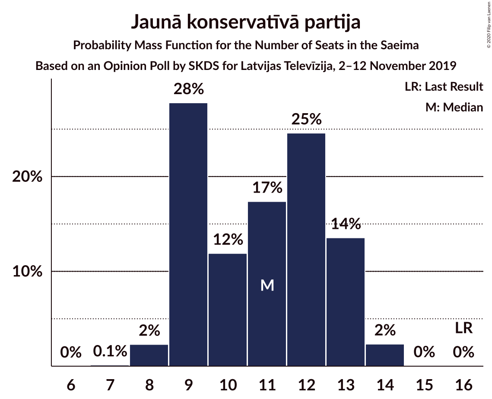
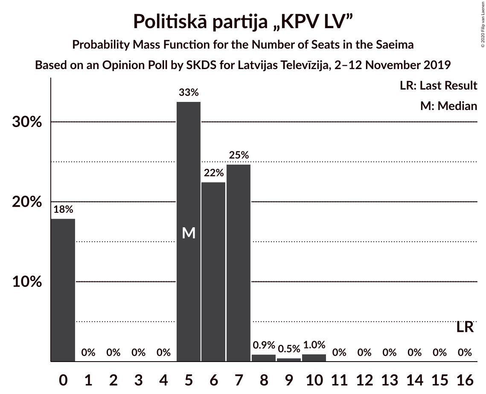
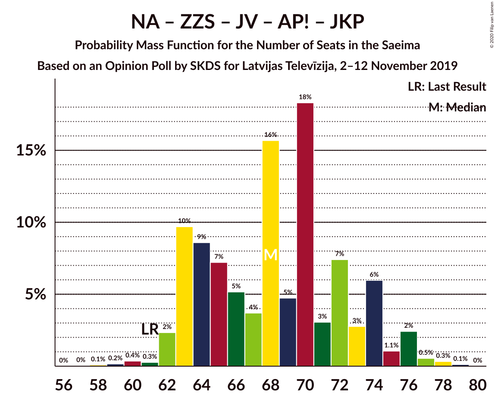
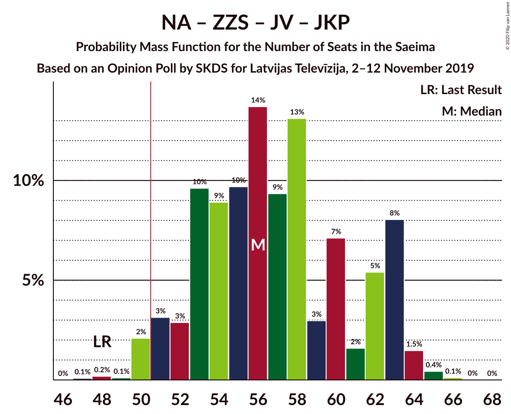
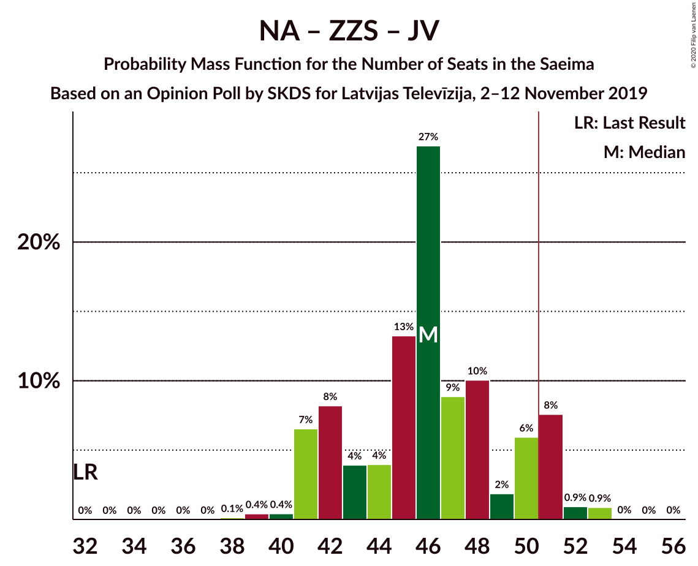
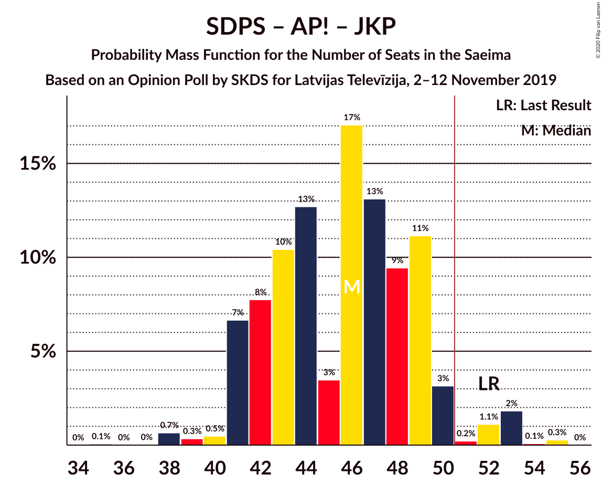
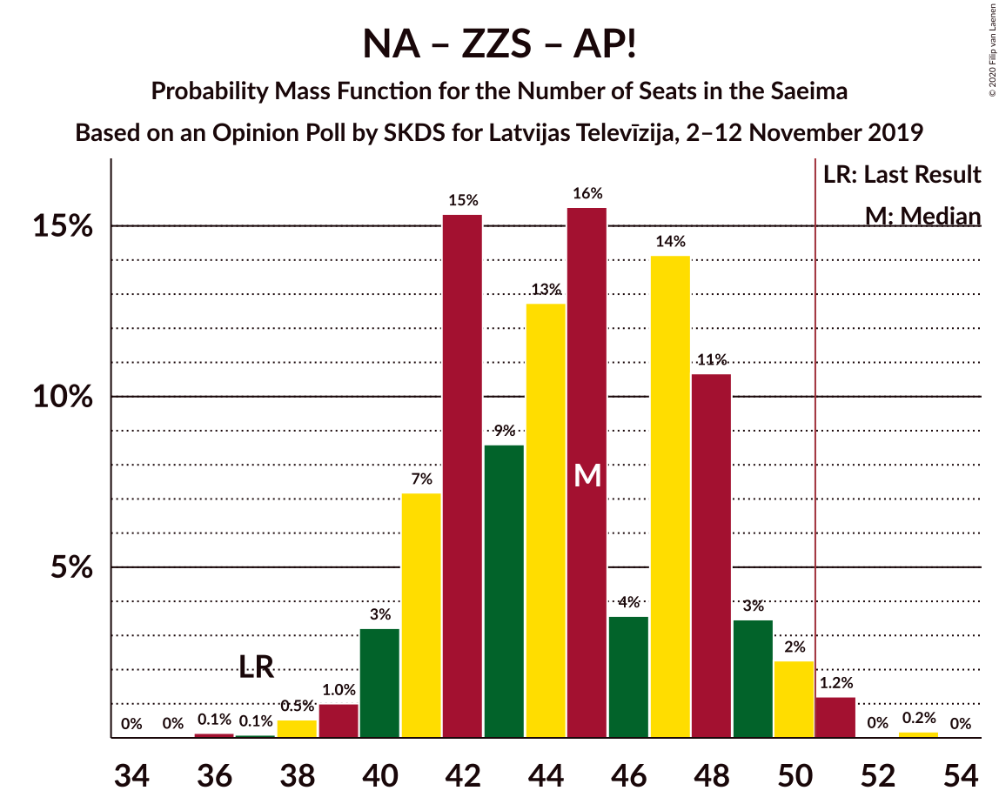
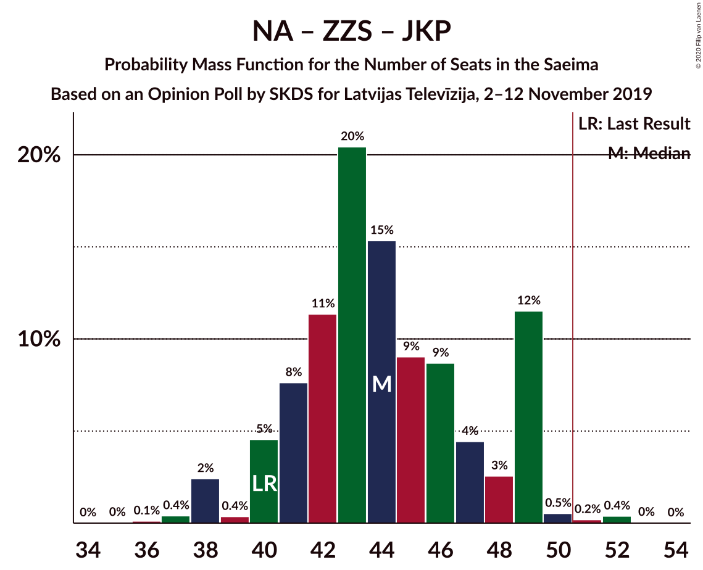

# Opinion Poll by SKDS for Latvijas Televīzija, 2–12 November 2019

<a href="#voting-intentions">Voting Intentions</a> | <a href="#seats">Seats</a> | <a href="#coalitions">Coalitions</a> | <a href="#technical-information">Technical Information</a>

## Voting Intentions

### Confidence Intervals

| Party | Last Result | Poll Result | 80% Confidence Interval | 90% Confidence Interval | 95% Confidence Interval | 99% Confidence Interval |
|:-----:|:-----------:|:-----------:|:-----------------------:|:-----------------------:|:-----------------------:|:-----------------------:|
| Sociāldemokrātiskā partija “Saskaņa” | 19.8% | 20.4% | 18.7–22.2% |18.2–22.7% |17.8–23.2% |17.1–24.0% |
| Nacionālā apvienība „Visu Latvijai!”–„Tēvzemei un Brīvībai/LNNK” | 11.0% | 16.0% | 14.5–17.6% |14.0–18.1% |13.7–18.5% |13.0–19.3% |
| Zaļo un Zemnieku savienība | 9.9% | 13.7% | 12.3–15.3% |11.9–15.7% |11.6–16.1% |10.9–16.9% |
| Jaunā VIENOTĪBA | 6.7% | 11.8% | 10.5–13.3% |10.1–13.7% |9.8–14.1% |9.2–14.8% |
| Attīstībai/Par! | 12.0% | 10.2% | 9.0–11.6% |8.6–12.0% |8.4–12.4% |7.8–13.1% |
| Jaunā konservatīvā partija | 13.6% | 9.8% | 8.7–11.2% |8.3–11.6% |8.0–12.0% |7.5–12.7% |
| Politiskā partija „KPV LV” | 14.2% | 5.4% | 4.6–6.5% |4.3–6.9% |4.1–7.1% |3.7–7.7% |
| Latvijas Reģionu Apvienība | 4.1% | 5.1% | 4.3–6.2% |4.0–6.5% |3.8–6.8% |3.5–7.3% |
| PROGRESĪVIE | 2.6% | 3.8% | 3.1–4.8% |2.9–5.1% |2.8–5.3% |2.5–5.8% |
| Latvijas Krievu savienība | 3.2% | 3.6% | 2.9–4.6% |2.7–4.8% |2.6–5.1% |2.3–5.6% |

*Note:* The poll result column reflects the actual value used in the calculations. Published results may vary slightly, and in addition be rounded to fewer digits.

## Seats

### Confidence Intervals

| Party | Last Result | Median | 80% Confidence Interval | 90% Confidence Interval | 95% Confidence Interval | 99% Confidence Interval |
|:-----:|:-----------:|:------:|:-----------------------:|:-----------------------:|:-----------------------:|:-----------------------:|
| <a href="#sociāldemokrātiskā-partija-“saskaņa”">Sociāldemokrātiskā partija “Saskaņa”</a> | 23 | 23 | 21–26 |21–26 |21–27 |19–27 |
| <a href="#nacionālā-apvienība-„visu-latvijai!”–„tēvzemei-un-brīvībai/lnnk”">Nacionālā apvienība „Visu Latvijai!”–„Tēvzemei un Brīvībai/LNNK”</a> | 13 | 16 | 16–20 |16–20 |15–20 |14–21 |
| <a href="#zaļo-un-zemnieku-savienība">Zaļo un Zemnieku savienība</a> | 11 | 16 | 14–16 |14–17 |13–17 |11–18 |
| <a href="#jaunā-vienotība">Jaunā VIENOTĪBA</a> | 8 | 14 | 11–17 |11–17 |11–17 |10–17 |
| <a href="#attīstībai/par!">Attīstībai/Par!</a> | 13 | 10 | 10–13 |10–13 |9–13 |7–14 |
| <a href="#jaunā-konservatīvā-partija">Jaunā konservatīvā partija</a> | 16 | 12 | 8–13 |8–13 |8–13 |8–13 |
| <a href="#politiskā-partija-„kpv-lv”">Politiskā partija „KPV LV”</a> | 16 | 5 | 0–6 |0–7 |0–7 |0–9 |
| <a href="#latvijas-reģionu-apvienība">Latvijas Reģionu Apvienība</a> | 0 | 6 | 0–6 |0–7 |0–7 |0–9 |
| <a href="#progresīvie">PROGRESĪVIE</a> | 0 | 0 | 0 |0–7 |0–7 |0–7 |
| <a href="#latvijas-krievu-savienība">Latvijas Krievu savienība</a> | 0 | 0 | 0 |0 |0 |0–6 |

### Sociāldemokrātiskā partija “Saskaņa”

*For a full overview of the results for this party, see the [Sociāldemokrātiskā partija “Saskaņa”](party-sociāldemokrātiskāpartija“saskaņa”.html) page.*

| Number of Seats | Probability | Accumulated | Special Marks |
|:---------------:|:-----------:|:-----------:|:-------------:|
| 18 | 0.2% | 100% |  |
| 19 | 1.3% | 99.8% |  |
| 20 | 0.4% | 98% |  |
| 21 | 41% | 98% |  |
| 22 | 2% | 57% |  |
| 23 | 6% | 55% | Last Result, Median |
| 24 | 29% | 49% |  |
| 25 | 9% | 20% |  |
| 26 | 7% | 11% |  |
| 27 | 3% | 4% |  |
| 28 | 0.1% | 0.4% |  |
| 29 | 0.3% | 0.3% |  |
| 30 | 0.1% | 0.1% |  |
| 31 | 0% | 0% |  |

### Nacionālā apvienība „Visu Latvijai!”–„Tēvzemei un Brīvībai/LNNK”

*For a full overview of the results for this party, see the [Nacionālā apvienība „Visu Latvijai!”–„Tēvzemei un Brīvībai/LNNK”](party-nacionālāapvienība„visulatvijai”–„tēvzemeiunbrīvībailnnk”.html) page.*

| Number of Seats | Probability | Accumulated | Special Marks |
|:---------------:|:-----------:|:-----------:|:-------------:|
| 13 | 0.1% | 100% | Last Result |
| 14 | 1.2% | 99.9% |  |
| 15 | 2% | 98.6% |  |
| 16 | 57% | 97% | Median |
| 17 | 16% | 40% |  |
| 18 | 3% | 24% |  |
| 19 | 2% | 21% |  |
| 20 | 18% | 18% |  |
| 21 | 0.5% | 0.5% |  |
| 22 | 0% | 0% |  |

### Zaļo un Zemnieku savienība

*For a full overview of the results for this party, see the [Zaļo un Zemnieku savienība](party-zaļounzemniekusavienība.html) page.*

| Number of Seats | Probability | Accumulated | Special Marks |
|:---------------:|:-----------:|:-----------:|:-------------:|
| 11 | 0.7% | 100% | Last Result |
| 12 | 0.9% | 99.3% |  |
| 13 | 3% | 98% |  |
| 14 | 17% | 96% |  |
| 15 | 24% | 78% |  |
| 16 | 47% | 55% | Median |
| 17 | 6% | 8% |  |
| 18 | 1.3% | 2% |  |
| 19 | 0.4% | 0.5% |  |
| 20 | 0.1% | 0.1% |  |
| 21 | 0% | 0% |  |

### Jaunā VIENOTĪBA

*For a full overview of the results for this party, see the [Jaunā VIENOTĪBA](party-jaunāvienotība.html) page.*

| Number of Seats | Probability | Accumulated | Special Marks |
|:---------------:|:-----------:|:-----------:|:-------------:|
| 8 | 0% | 100% | Last Result |
| 9 | 0% | 100% |  |
| 10 | 0.5% | 99.9% |  |
| 11 | 11% | 99.5% |  |
| 12 | 10% | 89% |  |
| 13 | 8% | 79% |  |
| 14 | 43% | 71% | Median |
| 15 | 17% | 28% |  |
| 16 | 1.1% | 11% |  |
| 17 | 10% | 10% |  |
| 18 | 0% | 0.1% |  |
| 19 | 0% | 0% |  |

### Attīstībai/Par!

*For a full overview of the results for this party, see the [Attīstībai/Par!](party-attīstībaipar.html) page.*

| Number of Seats | Probability | Accumulated | Special Marks |
|:---------------:|:-----------:|:-----------:|:-------------:|
| 7 | 0.9% | 100% |  |
| 8 | 1.2% | 99.1% |  |
| 9 | 3% | 98% |  |
| 10 | 64% | 95% | Median |
| 11 | 2% | 31% |  |
| 12 | 14% | 28% |  |
| 13 | 13% | 15% | Last Result |
| 14 | 2% | 2% |  |
| 15 | 0.1% | 0.1% |  |
| 16 | 0% | 0% |  |

### Jaunā konservatīvā partija

*For a full overview of the results for this party, see the [Jaunā konservatīvā partija](party-jaunākonservatīvāpartija.html) page.*

| Number of Seats | Probability | Accumulated | Special Marks |
|:---------------:|:-----------:|:-----------:|:-------------:|
| 7 | 0.1% | 100% |  |
| 8 | 12% | 99.9% |  |
| 9 | 4% | 88% |  |
| 10 | 5% | 84% |  |
| 11 | 18% | 80% |  |
| 12 | 43% | 62% | Median |
| 13 | 19% | 20% |  |
| 14 | 0.1% | 0.3% |  |
| 15 | 0% | 0.2% |  |
| 16 | 0.1% | 0.1% | Last Result |
| 17 | 0% | 0% |  |

### Politiskā partija „KPV LV”

*For a full overview of the results for this party, see the [Politiskā partija „KPV LV”](party-politiskāpartija„kpvlv”.html) page.*

| Number of Seats | Probability | Accumulated | Special Marks |
|:---------------:|:-----------:|:-----------:|:-------------:|
| 0 | 24% | 100% |  |
| 1 | 0% | 76% |  |
| 2 | 0% | 76% |  |
| 3 | 0% | 76% |  |
| 4 | 0% | 76% |  |
| 5 | 48% | 76% | Median |
| 6 | 20% | 28% |  |
| 7 | 7% | 8% |  |
| 8 | 0.3% | 0.9% |  |
| 9 | 0.2% | 0.6% |  |
| 10 | 0.3% | 0.3% |  |
| 11 | 0% | 0% |  |
| 12 | 0% | 0% |  |
| 13 | 0% | 0% |  |
| 14 | 0% | 0% |  |
| 15 | 0% | 0% |  |
| 16 | 0% | 0% | Last Result |

### Latvijas Reģionu Apvienība

*For a full overview of the results for this party, see the [Latvijas Reģionu Apvienība](party-latvijasreģionuapvienība.html) page.*

| Number of Seats | Probability | Accumulated | Special Marks |
|:---------------:|:-----------:|:-----------:|:-------------:|
| 0 | 34% | 100% | Last Result |
| 1 | 0% | 66% |  |
| 2 | 0% | 66% |  |
| 3 | 0% | 66% |  |
| 4 | 0% | 66% |  |
| 5 | 0% | 66% |  |
| 6 | 58% | 66% | Median |
| 7 | 7% | 8% |  |
| 8 | 0% | 0.7% |  |
| 9 | 0.6% | 0.6% |  |
| 10 | 0% | 0% |  |

### PROGRESĪVIE

*For a full overview of the results for this party, see the [PROGRESĪVIE](party-progresīvie.html) page.*

| Number of Seats | Probability | Accumulated | Special Marks |
|:---------------:|:-----------:|:-----------:|:-------------:|
| 0 | 92% | 100% | Last Result, Median |
| 1 | 0% | 8% |  |
| 2 | 0% | 8% |  |
| 3 | 0% | 8% |  |
| 4 | 0% | 8% |  |
| 5 | 0.3% | 8% |  |
| 6 | 3% | 8% |  |
| 7 | 5% | 5% |  |
| 8 | 0% | 0% |  |

### Latvijas Krievu savienība

*For a full overview of the results for this party, see the [Latvijas Krievu savienība](party-latvijaskrievusavienība.html) page.*

| Number of Seats | Probability | Accumulated | Special Marks |
|:---------------:|:-----------:|:-----------:|:-------------:|
| 0 | 99.2% | 100% | Last Result, Median |
| 1 | 0% | 0.8% |  |
| 2 | 0% | 0.8% |  |
| 3 | 0% | 0.8% |  |
| 4 | 0% | 0.8% |  |
| 5 | 0.2% | 0.8% |  |
| 6 | 0.6% | 0.7% |  |
| 7 | 0.1% | 0.1% |  |
| 8 | 0% | 0% |  |

## Coalitions

### Confidence Intervals

| Coalition | Last Result | Median | Majority? | 80% Confidence Interval | 90% Confidence Interval | 95% Confidence Interval | 99% Confidence Interval |
|:---------:|:-----------:|:------:|:---------:|:-----------------------:|:-----------------------:|:-----------------------:|:-----------------------:|
| Nacionālā apvienība „Visu Latvijai!”–„Tēvzemei un Brīvībai/LNNK” – Zaļo un Zemnieku savienība – Jaunā VIENOTĪBA – Attīstībai/Par! – Jaunā konservatīvā partija | 61 | 68 | 100% | 63–76 | 62–76 | 62–76 | 60–76 |
| Nacionālā apvienība „Visu Latvijai!”–„Tēvzemei un Brīvībai/LNNK” – Zaļo un Zemnieku savienība – Jaunā VIENOTĪBA – Jaunā konservatīvā partija | 48 | 58 | 99.2% | 53–63 | 52–63 | 52–63 | 50–64 |
| Nacionālā apvienība „Visu Latvijai!”–„Tēvzemei un Brīvībai/LNNK” – Zaļo un Zemnieku savienība – Jaunā VIENOTĪBA – Attīstībai/Par! | 45 | 56 | 98% | 54–63 | 51–63 | 51–63 | 49–64 |
| Nacionālā apvienība „Visu Latvijai!”–„Tēvzemei un Brīvībai/LNNK” – Jaunā VIENOTĪBA – Attīstībai/Par! – Jaunā konservatīvā partija – Politiskā partija „KPV LV” | 66 | 57 | 95% | 53–62 | 50–62 | 49–62 | 49–63 |
| Nacionālā apvienība „Visu Latvijai!”–„Tēvzemei un Brīvībai/LNNK” – Zaļo un Zemnieku savienība – Attīstībai/Par! – Jaunā konservatīvā partija | 53 | 54 | 91% | 51–61 | 50–61 | 50–61 | 49–61 |
| Nacionālā apvienība „Visu Latvijai!”–„Tēvzemei un Brīvībai/LNNK” – Jaunā VIENOTĪBA – Attīstībai/Par! – Jaunā konservatīvā partija | 50 | 52 | 75% | 49–61 | 47–61 | 47–61 | 45–61 |
| Nacionālā apvienība „Visu Latvijai!”–„Tēvzemei un Brīvībai/LNNK” – Jaunā VIENOTĪBA – Jaunā konservatīvā partija – Politiskā partija „KPV LV” | 53 | 47 | 3% | 43–50 | 39–50 | 39–53 | 38–53 |
| Nacionālā apvienība „Visu Latvijai!”–„Tēvzemei un Brīvībai/LNNK” – Zaļo un Zemnieku savienība – Jaunā VIENOTĪBA | 32 | 46 | 3% | 43–50 | 41–50 | 41–51 | 39–52 |
| Nacionālā apvienība „Visu Latvijai!”–„Tēvzemei un Brīvībai/LNNK” – Jaunā VIENOTĪBA – Attīstībai/Par! – Politiskā partija „KPV LV” | 50 | 45 | 12% | 42–51 | 40–51 | 37–51 | 37–51 |
| Sociāldemokrātiskā partija “Saskaņa” – Attīstībai/Par! – Jaunā konservatīvā partija | 52 | 44 | 0.3% | 43–50 | 41–50 | 41–50 | 39–50 |
| Sociāldemokrātiskā partija “Saskaņa” – Zaļo un Zemnieku savienība – Politiskā partija „KPV LV” | 50 | 42 | 0.2% | 39–47 | 38–47 | 37–49 | 36–49 |
| Nacionālā apvienība „Visu Latvijai!”–„Tēvzemei un Brīvībai/LNNK” – Zaļo un Zemnieku savienība – Attīstībai/Par! | 37 | 42 | 0.1% | 41–48 | 40–48 | 40–48 | 38–49 |
| Nacionālā apvienība „Visu Latvijai!”–„Tēvzemei un Brīvībai/LNNK” – Zaļo un Zemnieku savienība – Jaunā konservatīvā partija | 40 | 44 | 0.1% | 41–48 | 40–48 | 40–48 | 37–50 |
| Nacionālā apvienība „Visu Latvijai!”–„Tēvzemei un Brīvībai/LNNK” – Attīstībai/Par! – Jaunā konservatīvā partija – Politiskā partija „KPV LV” | 58 | 43 | 0% | 40–46 | 38–46 | 38–48 | 37–50 |
| Jaunā VIENOTĪBA – Attīstībai/Par! – Jaunā konservatīvā partija – Politiskā partija „KPV LV” | 53 | 41 | 0% | 36–46 | 33–46 | 33–46 | 32–46 |
| Sociāldemokrātiskā partija “Saskaņa” – Attīstībai/Par! | 36 | 33 | 0% | 31–37 | 31–37 | 30–37 | 29–39 |
| Sociāldemokrātiskā partija “Saskaņa” – Politiskā partija „KPV LV” | 39 | 26 | 0% | 24–32 | 24–32 | 21–34 | 19–34 |

### Nacionālā apvienība „Visu Latvijai!”–„Tēvzemei un Brīvībai/LNNK” – Zaļo un Zemnieku savienība – Jaunā VIENOTĪBA – Attīstībai/Par! – Jaunā konservatīvā partija

| Number of Seats | Probability | Accumulated | Special Marks |
|:---------------:|:-----------:|:-----------:|:-------------:|
| 58 | 0.1% | 100% |  |
| 59 | 0% | 99.8% |  |
| 60 | 1.1% | 99.8% |  |
| 61 | 0.5% | 98.7% | Last Result |
| 62 | 7% | 98% |  |
| 63 | 3% | 91% |  |
| 64 | 5% | 88% |  |
| 65 | 6% | 83% |  |
| 66 | 6% | 77% |  |
| 67 | 0.3% | 70% |  |
| 68 | 38% | 70% | Median |
| 69 | 4% | 33% |  |
| 70 | 12% | 29% |  |
| 71 | 0.9% | 16% |  |
| 72 | 0.1% | 16% |  |
| 73 | 0.5% | 15% |  |
| 74 | 0.2% | 15% |  |
| 75 | 2% | 15% |  |
| 76 | 12% | 12% |  |
| 77 | 0.1% | 0.2% |  |
| 78 | 0% | 0.1% |  |
| 79 | 0% | 0% |  |

### Nacionālā apvienība „Visu Latvijai!”–„Tēvzemei un Brīvībai/LNNK” – Zaļo un Zemnieku savienība – Jaunā VIENOTĪBA – Jaunā konservatīvā partija

| Number of Seats | Probability | Accumulated | Special Marks |
|:---------------:|:-----------:|:-----------:|:-------------:|
| 48 | 0.1% | 100% | Last Result |
| 49 | 0.1% | 99.8% |  |
| 50 | 0.5% | 99.7% |  |
| 51 | 0.6% | 99.2% | Majority |
| 52 | 8% | 98.6% |  |
| 53 | 3% | 91% |  |
| 54 | 6% | 87% |  |
| 55 | 6% | 81% |  |
| 56 | 5% | 75% |  |
| 57 | 1.1% | 70% |  |
| 58 | 48% | 69% | Median |
| 59 | 0.4% | 21% |  |
| 60 | 5% | 21% |  |
| 61 | 0.5% | 16% |  |
| 62 | 0.4% | 15% |  |
| 63 | 14% | 15% |  |
| 64 | 0.9% | 0.9% |  |
| 65 | 0% | 0.1% |  |
| 66 | 0% | 0.1% |  |
| 67 | 0% | 0.1% |  |
| 68 | 0% | 0% |  |

### Nacionālā apvienība „Visu Latvijai!”–„Tēvzemei un Brīvībai/LNNK” – Zaļo un Zemnieku savienība – Jaunā VIENOTĪBA – Attīstībai/Par!

| Number of Seats | Probability | Accumulated | Special Marks |
|:---------------:|:-----------:|:-----------:|:-------------:|
| 45 | 0% | 100% | Last Result |
| 46 | 0% | 100% |  |
| 47 | 0% | 100% |  |
| 48 | 0.4% | 100% |  |
| 49 | 0.1% | 99.6% |  |
| 50 | 1.1% | 99.5% |  |
| 51 | 6% | 98% | Majority |
| 52 | 0.5% | 92% |  |
| 53 | 0.5% | 91% |  |
| 54 | 7% | 91% |  |
| 55 | 5% | 84% |  |
| 56 | 42% | 78% | Median |
| 57 | 6% | 37% |  |
| 58 | 4% | 31% |  |
| 59 | 10% | 27% |  |
| 60 | 0.9% | 17% |  |
| 61 | 0.4% | 16% |  |
| 62 | 1.2% | 15% |  |
| 63 | 12% | 14% |  |
| 64 | 2% | 2% |  |
| 65 | 0.1% | 0.4% |  |
| 66 | 0.3% | 0.3% |  |
| 67 | 0% | 0% |  |

### Nacionālā apvienība „Visu Latvijai!”–„Tēvzemei un Brīvībai/LNNK” – Jaunā VIENOTĪBA – Attīstībai/Par! – Jaunā konservatīvā partija – Politiskā partija „KPV LV”

| Number of Seats | Probability | Accumulated | Special Marks |
|:---------------:|:-----------:|:-----------:|:-------------:|
| 47 | 0.3% | 100% |  |
| 48 | 0% | 99.7% |  |
| 49 | 3% | 99.7% |  |
| 50 | 2% | 97% |  |
| 51 | 0.3% | 95% | Majority |
| 52 | 3% | 94% |  |
| 53 | 8% | 92% |  |
| 54 | 7% | 84% |  |
| 55 | 5% | 77% |  |
| 56 | 1.0% | 72% |  |
| 57 | 38% | 71% | Median |
| 58 | 7% | 34% |  |
| 59 | 0.6% | 27% |  |
| 60 | 0.3% | 26% |  |
| 61 | 13% | 26% |  |
| 62 | 10% | 13% |  |
| 63 | 2% | 2% |  |
| 64 | 0.1% | 0.3% |  |
| 65 | 0.2% | 0.2% |  |
| 66 | 0% | 0% | Last Result |

### Nacionālā apvienība „Visu Latvijai!”–„Tēvzemei un Brīvībai/LNNK” – Zaļo un Zemnieku savienība – Attīstībai/Par! – Jaunā konservatīvā partija

| Number of Seats | Probability | Accumulated | Special Marks |
|:---------------:|:-----------:|:-----------:|:-------------:|
| 45 | 0% | 100% |  |
| 46 | 0.1% | 99.9% |  |
| 47 | 0.2% | 99.9% |  |
| 48 | 0.2% | 99.7% |  |
| 49 | 2% | 99.5% |  |
| 50 | 7% | 98% |  |
| 51 | 6% | 91% | Majority |
| 52 | 4% | 85% |  |
| 53 | 17% | 81% | Last Result |
| 54 | 41% | 64% | Median |
| 55 | 3% | 23% |  |
| 56 | 2% | 20% |  |
| 57 | 0.7% | 18% |  |
| 58 | 2% | 17% |  |
| 59 | 0.9% | 15% |  |
| 60 | 2% | 14% |  |
| 61 | 12% | 12% |  |
| 62 | 0% | 0.2% |  |
| 63 | 0.2% | 0.2% |  |
| 64 | 0% | 0% |  |

### Nacionālā apvienība „Visu Latvijai!”–„Tēvzemei un Brīvībai/LNNK” – Jaunā VIENOTĪBA – Attīstībai/Par! – Jaunā konservatīvā partija

| Number of Seats | Probability | Accumulated | Special Marks |
|:---------------:|:-----------:|:-----------:|:-------------:|
| 44 | 0% | 100% |  |
| 45 | 1.2% | 99.9% |  |
| 46 | 0.2% | 98.8% |  |
| 47 | 7% | 98.5% |  |
| 48 | 0.7% | 92% |  |
| 49 | 9% | 91% |  |
| 50 | 7% | 82% | Last Result |
| 51 | 5% | 75% | Majority |
| 52 | 39% | 70% | Median |
| 53 | 2% | 31% |  |
| 54 | 2% | 30% |  |
| 55 | 1.4% | 28% |  |
| 56 | 10% | 27% |  |
| 57 | 2% | 17% |  |
| 58 | 3% | 15% |  |
| 59 | 0.1% | 12% |  |
| 60 | 0% | 12% |  |
| 61 | 12% | 12% |  |
| 62 | 0% | 0% |  |

### Nacionālā apvienība „Visu Latvijai!”–„Tēvzemei un Brīvībai/LNNK” – Jaunā VIENOTĪBA – Jaunā konservatīvā partija – Politiskā partija „KPV LV”

| Number of Seats | Probability | Accumulated | Special Marks |
|:---------------:|:-----------:|:-----------:|:-------------:|
| 37 | 0% | 100% |  |
| 38 | 2% | 99.9% |  |
| 39 | 3% | 98% |  |
| 40 | 0.6% | 95% |  |
| 41 | 0.6% | 94% |  |
| 42 | 1.1% | 94% |  |
| 43 | 8% | 93% |  |
| 44 | 8% | 84% |  |
| 45 | 4% | 76% |  |
| 46 | 3% | 72% |  |
| 47 | 38% | 69% | Median |
| 48 | 17% | 31% |  |
| 49 | 0.4% | 14% |  |
| 50 | 10% | 14% |  |
| 51 | 0.4% | 3% | Majority |
| 52 | 0.1% | 3% |  |
| 53 | 3% | 3% | Last Result |
| 54 | 0% | 0.2% |  |
| 55 | 0.2% | 0.2% |  |
| 56 | 0% | 0% |  |

### Nacionālā apvienība „Visu Latvijai!”–„Tēvzemei un Brīvībai/LNNK” – Zaļo un Zemnieku savienība – Jaunā VIENOTĪBA

| Number of Seats | Probability | Accumulated | Special Marks |
|:---------------:|:-----------:|:-----------:|:-------------:|
| 32 | 0% | 100% | Last Result |
| 33 | 0% | 100% |  |
| 34 | 0% | 100% |  |
| 35 | 0% | 100% |  |
| 36 | 0% | 100% |  |
| 37 | 0% | 100% |  |
| 38 | 0.4% | 100% |  |
| 39 | 0.2% | 99.6% |  |
| 40 | 0.2% | 99.4% |  |
| 41 | 7% | 99.3% |  |
| 42 | 2% | 92% |  |
| 43 | 0.2% | 90% |  |
| 44 | 9% | 90% |  |
| 45 | 6% | 81% |  |
| 46 | 38% | 75% | Median |
| 47 | 17% | 37% |  |
| 48 | 2% | 20% |  |
| 49 | 2% | 18% |  |
| 50 | 13% | 16% |  |
| 51 | 1.0% | 3% | Majority |
| 52 | 2% | 2% |  |
| 53 | 0% | 0.1% |  |
| 54 | 0% | 0.1% |  |
| 55 | 0% | 0% |  |

### Nacionālā apvienība „Visu Latvijai!”–„Tēvzemei un Brīvībai/LNNK” – Jaunā VIENOTĪBA – Attīstībai/Par! – Politiskā partija „KPV LV”

| Number of Seats | Probability | Accumulated | Special Marks |
|:---------------:|:-----------:|:-----------:|:-------------:|
| 37 | 3% | 100% |  |
| 38 | 0.4% | 97% |  |
| 39 | 0% | 97% |  |
| 40 | 3% | 97% |  |
| 41 | 2% | 94% |  |
| 42 | 5% | 92% |  |
| 43 | 1.1% | 87% |  |
| 44 | 0.8% | 86% |  |
| 45 | 45% | 85% | Median |
| 46 | 7% | 40% |  |
| 47 | 6% | 33% |  |
| 48 | 13% | 28% |  |
| 49 | 2% | 15% |  |
| 50 | 0.8% | 13% | Last Result |
| 51 | 11% | 12% | Majority |
| 52 | 0.3% | 0.4% |  |
| 53 | 0.1% | 0.1% |  |
| 54 | 0% | 0% |  |

### Sociāldemokrātiskā partija “Saskaņa” – Attīstībai/Par! – Jaunā konservatīvā partija

| Number of Seats | Probability | Accumulated | Special Marks |
|:---------------:|:-----------:|:-----------:|:-------------:|
| 38 | 0.1% | 100% |  |
| 39 | 2% | 99.9% |  |
| 40 | 0.5% | 98% |  |
| 41 | 6% | 98% |  |
| 42 | 1.4% | 92% |  |
| 43 | 40% | 91% |  |
| 44 | 7% | 51% |  |
| 45 | 3% | 43% | Median |
| 46 | 7% | 40% |  |
| 47 | 11% | 33% |  |
| 48 | 9% | 23% |  |
| 49 | 0.6% | 13% |  |
| 50 | 13% | 13% |  |
| 51 | 0% | 0.3% | Majority |
| 52 | 0.1% | 0.2% | Last Result |
| 53 | 0% | 0.1% |  |
| 54 | 0% | 0.1% |  |
| 55 | 0% | 0% |  |

### Sociāldemokrātiskā partija “Saskaņa” – Zaļo un Zemnieku savienība – Politiskā partija „KPV LV”

| Number of Seats | Probability | Accumulated | Special Marks |
|:---------------:|:-----------:|:-----------:|:-------------:|
| 35 | 0.1% | 100% |  |
| 36 | 0.9% | 99.9% |  |
| 37 | 3% | 99.0% |  |
| 38 | 3% | 96% |  |
| 39 | 12% | 93% |  |
| 40 | 0.9% | 80% |  |
| 41 | 1.2% | 80% |  |
| 42 | 40% | 78% |  |
| 43 | 3% | 38% |  |
| 44 | 20% | 35% | Median |
| 45 | 2% | 15% |  |
| 46 | 0.9% | 13% |  |
| 47 | 7% | 12% |  |
| 48 | 0.2% | 5% |  |
| 49 | 4% | 5% |  |
| 50 | 0% | 0.2% | Last Result |
| 51 | 0.1% | 0.2% | Majority |
| 52 | 0.1% | 0.1% |  |
| 53 | 0% | 0% |  |

### Nacionālā apvienība „Visu Latvijai!”–„Tēvzemei un Brīvībai/LNNK” – Zaļo un Zemnieku savienība – Attīstībai/Par!

| Number of Seats | Probability | Accumulated | Special Marks |
|:---------------:|:-----------:|:-----------:|:-------------:|
| 35 | 0% | 100% |  |
| 36 | 0.4% | 99.9% |  |
| 37 | 0.1% | 99.6% | Last Result |
| 38 | 0.4% | 99.5% |  |
| 39 | 1.4% | 99.1% |  |
| 40 | 7% | 98% |  |
| 41 | 1.2% | 91% |  |
| 42 | 57% | 90% | Median |
| 43 | 9% | 32% |  |
| 44 | 3% | 23% |  |
| 45 | 3% | 21% |  |
| 46 | 2% | 17% |  |
| 47 | 1.3% | 16% |  |
| 48 | 12% | 15% |  |
| 49 | 2% | 2% |  |
| 50 | 0.2% | 0.3% |  |
| 51 | 0% | 0.1% | Majority |
| 52 | 0.1% | 0.1% |  |
| 53 | 0% | 0% |  |

### Nacionālā apvienība „Visu Latvijai!”–„Tēvzemei un Brīvībai/LNNK” – Zaļo un Zemnieku savienība – Jaunā konservatīvā partija

| Number of Seats | Probability | Accumulated | Special Marks |
|:---------------:|:-----------:|:-----------:|:-------------:|
| 34 | 0.1% | 100% |  |
| 35 | 0% | 99.9% |  |
| 36 | 0% | 99.9% |  |
| 37 | 0.7% | 99.9% |  |
| 38 | 0.1% | 99.2% |  |
| 39 | 0.9% | 99.1% |  |
| 40 | 7% | 98% | Last Result |
| 41 | 16% | 91% |  |
| 42 | 6% | 75% |  |
| 43 | 9% | 70% |  |
| 44 | 39% | 61% | Median |
| 45 | 3% | 22% |  |
| 46 | 0.4% | 19% |  |
| 47 | 3% | 18% |  |
| 48 | 15% | 16% |  |
| 49 | 0.2% | 1.0% |  |
| 50 | 0.6% | 0.7% |  |
| 51 | 0.1% | 0.1% | Majority |
| 52 | 0% | 0% |  |

### Nacionālā apvienība „Visu Latvijai!”–„Tēvzemei un Brīvībai/LNNK” – Attīstībai/Par! – Jaunā konservatīvā partija – Politiskā partija „KPV LV”

| Number of Seats | Probability | Accumulated | Special Marks |
|:---------------:|:-----------:|:-----------:|:-------------:|
| 33 | 0.3% | 100% |  |
| 34 | 0% | 99.7% |  |
| 35 | 0% | 99.7% |  |
| 36 | 0.1% | 99.7% |  |
| 37 | 0.1% | 99.6% |  |
| 38 | 5% | 99.4% |  |
| 39 | 2% | 94% |  |
| 40 | 5% | 93% |  |
| 41 | 10% | 87% |  |
| 42 | 2% | 78% |  |
| 43 | 41% | 76% | Median |
| 44 | 4% | 35% |  |
| 45 | 14% | 31% |  |
| 46 | 13% | 17% |  |
| 47 | 0.5% | 5% |  |
| 48 | 3% | 4% |  |
| 49 | 0.8% | 1.3% |  |
| 50 | 0.5% | 0.5% |  |
| 51 | 0% | 0% | Majority |
| 52 | 0% | 0% |  |
| 53 | 0% | 0% |  |
| 54 | 0% | 0% |  |
| 55 | 0% | 0% |  |
| 56 | 0% | 0% |  |
| 57 | 0% | 0% |  |
| 58 | 0% | 0% | Last Result |

### Jaunā VIENOTĪBA – Attīstībai/Par! – Jaunā konservatīvā partija – Politiskā partija „KPV LV”

| Number of Seats | Probability | Accumulated | Special Marks |
|:---------------:|:-----------:|:-----------:|:-------------:|
| 30 | 0.5% | 100% |  |
| 31 | 0% | 99.5% |  |
| 32 | 0.3% | 99.5% |  |
| 33 | 4% | 99.3% |  |
| 34 | 3% | 95% |  |
| 35 | 1.1% | 92% |  |
| 36 | 8% | 91% |  |
| 37 | 5% | 83% |  |
| 38 | 2% | 78% |  |
| 39 | 5% | 76% |  |
| 40 | 3% | 71% |  |
| 41 | 53% | 68% | Median |
| 42 | 2% | 15% |  |
| 43 | 2% | 13% |  |
| 44 | 0.3% | 11% |  |
| 45 | 0.3% | 11% |  |
| 46 | 10% | 10% |  |
| 47 | 0.3% | 0.3% |  |
| 48 | 0% | 0% |  |
| 49 | 0% | 0% |  |
| 50 | 0% | 0% |  |
| 51 | 0% | 0% | Majority |
| 52 | 0% | 0% |  |
| 53 | 0% | 0% | Last Result |

### Sociāldemokrātiskā partija “Saskaņa” – Attīstībai/Par!

| Number of Seats | Probability | Accumulated | Special Marks |
|:---------------:|:-----------:|:-----------:|:-------------:|
| 29 | 1.4% | 100% |  |
| 30 | 2% | 98.6% |  |
| 31 | 38% | 97% |  |
| 32 | 1.3% | 59% |  |
| 33 | 10% | 58% | Median |
| 34 | 7% | 49% |  |
| 35 | 5% | 42% |  |
| 36 | 18% | 36% | Last Result |
| 37 | 17% | 19% |  |
| 38 | 0.6% | 1.4% |  |
| 39 | 0.4% | 0.8% |  |
| 40 | 0.3% | 0.4% |  |
| 41 | 0% | 0.1% |  |
| 42 | 0% | 0.1% |  |
| 43 | 0% | 0% |  |

### Sociāldemokrātiskā partija “Saskaņa” – Politiskā partija „KPV LV”

| Number of Seats | Probability | Accumulated | Special Marks |
|:---------------:|:-----------:|:-----------:|:-------------:|
| 19 | 0.8% | 100% |  |
| 20 | 0.1% | 99.2% |  |
| 21 | 2% | 99.1% |  |
| 22 | 0.1% | 97% |  |
| 23 | 0.2% | 97% |  |
| 24 | 16% | 97% |  |
| 25 | 4% | 81% |  |
| 26 | 37% | 76% |  |
| 27 | 1.1% | 39% |  |
| 28 | 7% | 38% | Median |
| 29 | 2% | 31% |  |
| 30 | 16% | 29% |  |
| 31 | 2% | 13% |  |
| 32 | 7% | 11% |  |
| 33 | 0.1% | 4% |  |
| 34 | 3% | 4% |  |
| 35 | 0.2% | 0.3% |  |
| 36 | 0.1% | 0.1% |  |
| 37 | 0% | 0% |  |
| 38 | 0% | 0% |  |
| 39 | 0% | 0% | Last Result |

## Technical Information

### Opinion Poll

+ **Polling firm:** SKDS
+ **Commissioner(s):** Latvijas Televīzija
+ **Fieldwork period:** 2–12 November 2019

### Calculations

+ **Sample size:** 884
+ **Simulations done:** 131,072
+ **Error estimate:** 1.49%

