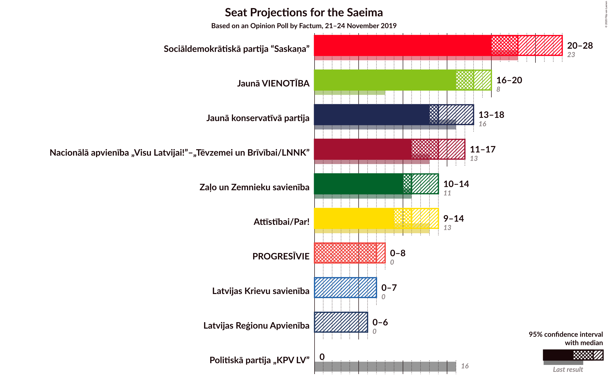
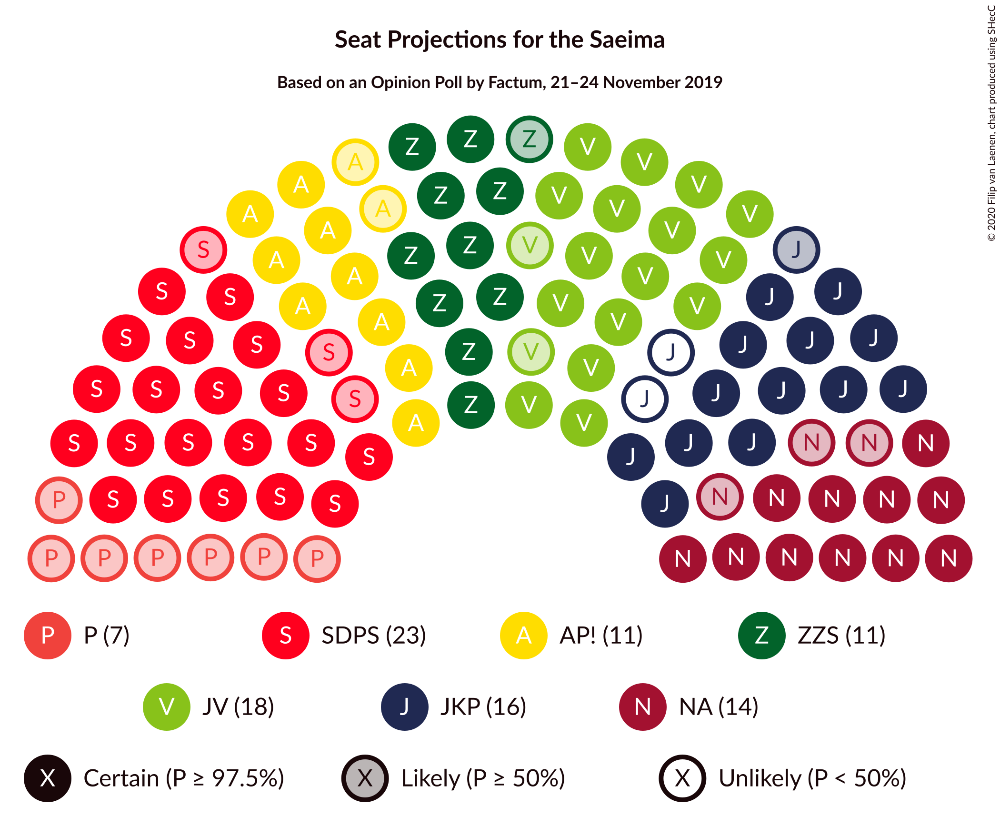
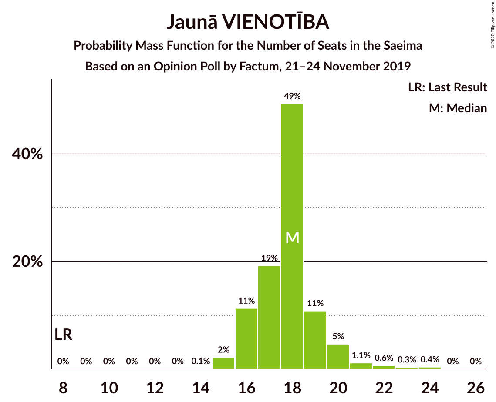
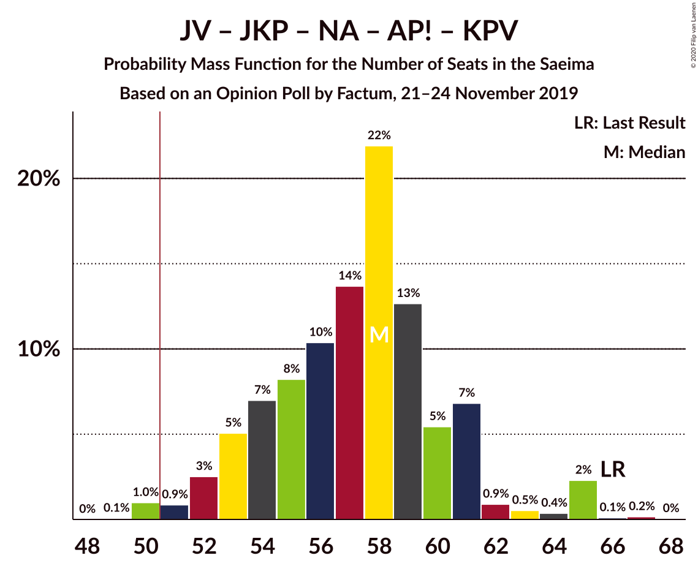
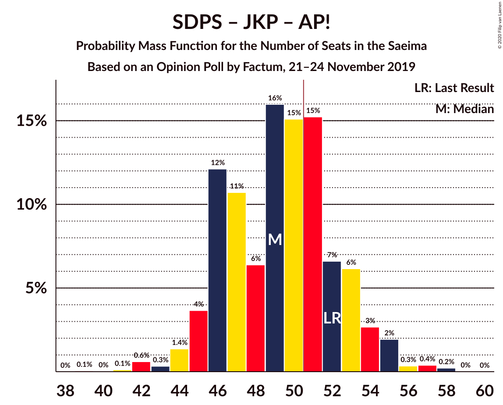
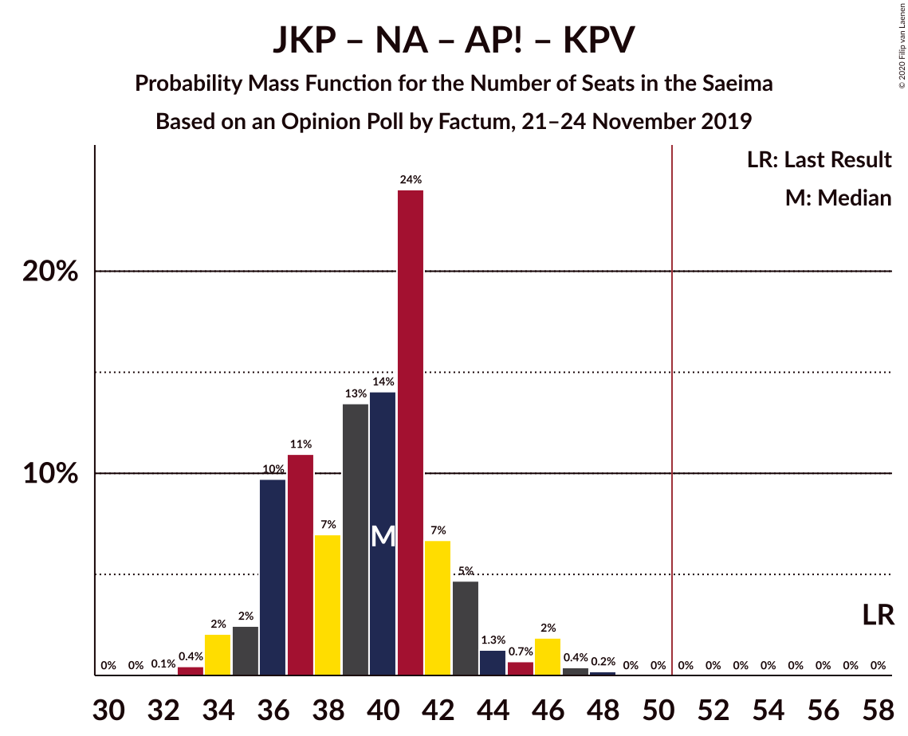
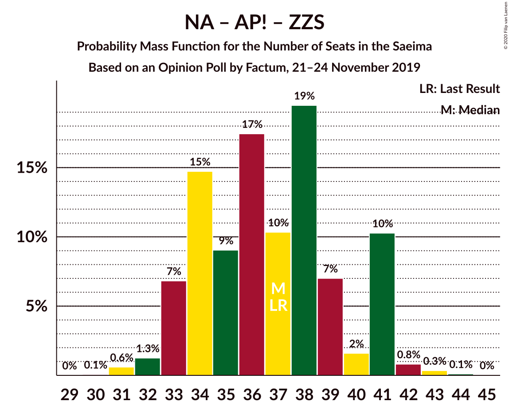

# Opinion Poll by Factum, 21–24 November 2019

<a href="#voting-intentions">Voting Intentions</a> | <a href="#seats">Seats</a> | <a href="#coalitions">Coalitions</a> | <a href="#technical-information">Technical Information</a>

## Voting Intentions

### Confidence Intervals

| Party | Last Result | Poll Result | 80% Confidence Interval | 90% Confidence Interval | 95% Confidence Interval | 99% Confidence Interval |
|:-----:|:-----------:|:-----------:|:-----------------------:|:-----------------------:|:-----------------------:|:-----------------------:|
| Sociāldemokrātiskā partija “Saskaņa” | 19.8% | 19.8% | 18.2–21.5% |17.8–22.0% |17.4–22.4% |16.6–23.3% |
| Jaunā VIENOTĪBA | 6.7% | 15.8% | 14.4–17.4% |14.0–17.9% |13.7–18.3% |13.0–19.1% |
| Jaunā konservatīvā partija | 13.6% | 12.8% | 11.5–14.3% |11.2–14.7% |10.9–15.1% |10.3–15.8% |
| Nacionālā apvienība „Visu Latvijai!”–„Tēvzemei un Brīvībai/LNNK” | 11.0% | 11.9% | 10.7–13.3% |10.3–13.7% |10.0–14.1% |9.4–14.8% |
| Attīstībai/Par! | 12.0% | 9.9% | 8.8–11.3% |8.5–11.7% |8.2–12.0% |7.7–12.7% |
| Zaļo un Zemnieku savienība | 9.9% | 9.9% | 8.8–11.3% |8.5–11.7% |8.2–12.0% |7.7–12.7% |
| PROGRESĪVIE | 2.6% | 5.9% | 5.0–7.0% |4.8–7.3% |4.6–7.6% |4.2–8.1% |
| Latvijas Reģionu Apvienība | 4.1% | 3.9% | 3.2–4.9% |3.0–5.1% |2.9–5.4% |2.6–5.8% |
| Latvijas Krievu savienība | 3.2% | 3.9% | 3.2–4.9% |3.0–5.1% |2.9–5.4% |2.6–5.8% |
| Politiskā partija „KPV LV” | 14.2% | 3.0% | 2.4–3.8% |2.2–4.1% |2.1–4.3% |1.8–4.7% |

*Note:* The poll result column reflects the actual value used in the calculations. Published results may vary slightly, and in addition be rounded to fewer digits.

## Seats

### Confidence Intervals

| Party | Last Result | Median | 80% Confidence Interval | 90% Confidence Interval | 95% Confidence Interval | 99% Confidence Interval |
|:-----:|:-----------:|:------:|:-----------------------:|:-----------------------:|:-----------------------:|:-----------------------:|
| <a href="#sociāldemokrātiskā-partija-“saskaņa”">Sociāldemokrātiskā partija “Saskaņa”</a> | 23 | 23 | 21–26 |20–26 |20–28 |19–29 |
| <a href="#jaunā-vienotība">Jaunā VIENOTĪBA</a> | 8 | 18 | 16–19 |16–20 |16–21 |15–24 |
| <a href="#jaunā-konservatīvā-partija">Jaunā konservatīvā partija</a> | 16 | 13 | 13–16 |13–17 |13–17 |11–20 |
| <a href="#nacionālā-apvienība-„visu-latvijai!”–„tēvzemei-un-brīvībai/lnnk”">Nacionālā apvienība „Visu Latvijai!”–„Tēvzemei un Brīvībai/LNNK”</a> | 13 | 13 | 12–15 |12–15 |11–16 |11–17 |
| <a href="#attīstībai/par!">Attīstībai/Par!</a> | 13 | 11 | 10–14 |9–14 |9–14 |8–15 |
| <a href="#zaļo-un-zemnieku-savienība">Zaļo un Zemnieku savienība</a> | 11 | 11 | 11–13 |11–14 |10–15 |10–15 |
| <a href="#progresīvie">PROGRESĪVIE</a> | 0 | 7 | 5–7 |0–8 |0–8 |0–8 |
| <a href="#latvijas-reģionu-apvienība">Latvijas Reģionu Apvienība</a> | 0 | 0 | 0–6 |0–6 |0–6 |0–6 |
| <a href="#latvijas-krievu-savienība">Latvijas Krievu savienība</a> | 0 | 0 | 0–6 |0–6 |0–7 |0–8 |
| <a href="#politiskā-partija-„kpv-lv”">Politiskā partija „KPV LV”</a> | 16 | 0 | 0 |0 |0 |0 |

### Sociāldemokrātiskā partija “Saskaņa”

*For a full overview of the results for this party, see the [Sociāldemokrātiskā partija “Saskaņa”](party-sociāldemokrātiskāpartija“saskaņa”.html) page.*

| Number of Seats | Probability | Accumulated | Special Marks |
|:---------------:|:-----------:|:-----------:|:-------------:|
| 17 | 0.1% | 100% |  |
| 18 | 0.1% | 99.9% |  |
| 19 | 0.9% | 99.9% |  |
| 20 | 4% | 98.9% |  |
| 21 | 7% | 95% |  |
| 22 | 27% | 88% |  |
| 23 | 25% | 61% | Last Result, Median |
| 24 | 15% | 36% |  |
| 25 | 8% | 21% |  |
| 26 | 8% | 13% |  |
| 27 | 0.8% | 4% |  |
| 28 | 3% | 4% |  |
| 29 | 0.6% | 0.6% |  |
| 30 | 0% | 0% |  |

### Jaunā VIENOTĪBA

*For a full overview of the results for this party, see the [Jaunā VIENOTĪBA](party-jaunāvienotība.html) page.*

| Number of Seats | Probability | Accumulated | Special Marks |
|:---------------:|:-----------:|:-----------:|:-------------:|
| 8 | 0% | 100% | Last Result |
| 9 | 0% | 100% |  |
| 10 | 0% | 100% |  |
| 11 | 0% | 100% |  |
| 12 | 0% | 100% |  |
| 13 | 0% | 100% |  |
| 14 | 0.1% | 100% |  |
| 15 | 0.5% | 99.9% |  |
| 16 | 11% | 99.4% |  |
| 17 | 30% | 88% |  |
| 18 | 41% | 58% | Median |
| 19 | 9% | 17% |  |
| 20 | 5% | 7% |  |
| 21 | 2% | 3% |  |
| 22 | 0.3% | 1.1% |  |
| 23 | 0.3% | 0.8% |  |
| 24 | 0.5% | 0.5% |  |
| 25 | 0% | 0% |  |

### Jaunā konservatīvā partija

*For a full overview of the results for this party, see the [Jaunā konservatīvā partija](party-jaunākonservatīvāpartija.html) page.*

| Number of Seats | Probability | Accumulated | Special Marks |
|:---------------:|:-----------:|:-----------:|:-------------:|
| 11 | 0.8% | 100% |  |
| 12 | 2% | 99.2% |  |
| 13 | 58% | 98% | Median |
| 14 | 16% | 39% |  |
| 15 | 12% | 24% |  |
| 16 | 6% | 11% | Last Result |
| 17 | 3% | 6% |  |
| 18 | 2% | 2% |  |
| 19 | 0.3% | 0.9% |  |
| 20 | 0.6% | 0.6% |  |
| 21 | 0% | 0% |  |

### Nacionālā apvienība „Visu Latvijai!”–„Tēvzemei un Brīvībai/LNNK”

*For a full overview of the results for this party, see the [Nacionālā apvienība „Visu Latvijai!”–„Tēvzemei un Brīvībai/LNNK”](party-nacionālāapvienība„visulatvijai”–„tēvzemeiunbrīvībailnnk”.html) page.*

| Number of Seats | Probability | Accumulated | Special Marks |
|:---------------:|:-----------:|:-----------:|:-------------:|
| 10 | 0.1% | 100% |  |
| 11 | 4% | 99.9% |  |
| 12 | 22% | 96% |  |
| 13 | 24% | 74% | Last Result, Median |
| 14 | 36% | 50% |  |
| 15 | 9% | 14% |  |
| 16 | 3% | 5% |  |
| 17 | 1.3% | 1.4% |  |
| 18 | 0% | 0.1% |  |
| 19 | 0.1% | 0.1% |  |
| 20 | 0% | 0% |  |

### Attīstībai/Par!

*For a full overview of the results for this party, see the [Attīstībai/Par!](party-attīstībaipar.html) page.*

| Number of Seats | Probability | Accumulated | Special Marks |
|:---------------:|:-----------:|:-----------:|:-------------:|
| 7 | 0.3% | 100% |  |
| 8 | 2% | 99.7% |  |
| 9 | 6% | 98% |  |
| 10 | 35% | 93% |  |
| 11 | 17% | 58% | Median |
| 12 | 4% | 40% |  |
| 13 | 4% | 36% | Last Result |
| 14 | 32% | 33% |  |
| 15 | 0.4% | 0.8% |  |
| 16 | 0.4% | 0.4% |  |
| 17 | 0% | 0% |  |

### Zaļo un Zemnieku savienība

*For a full overview of the results for this party, see the [Zaļo un Zemnieku savienība](party-zaļounzemniekusavienība.html) page.*

| Number of Seats | Probability | Accumulated | Special Marks |
|:---------------:|:-----------:|:-----------:|:-------------:|
| 8 | 0.2% | 100% |  |
| 9 | 0.2% | 99.8% |  |
| 10 | 2% | 99.5% |  |
| 11 | 61% | 97% | Last Result, Median |
| 12 | 6% | 37% |  |
| 13 | 20% | 30% |  |
| 14 | 7% | 10% |  |
| 15 | 3% | 3% |  |
| 16 | 0.2% | 0.2% |  |
| 17 | 0.1% | 0.1% |  |
| 18 | 0% | 0% |  |

### PROGRESĪVIE

*For a full overview of the results for this party, see the [PROGRESĪVIE](party-progresīvie.html) page.*

| Number of Seats | Probability | Accumulated | Special Marks |
|:---------------:|:-----------:|:-----------:|:-------------:|
| 0 | 9% | 100% | Last Result |
| 1 | 0% | 91% |  |
| 2 | 0% | 91% |  |
| 3 | 0% | 91% |  |
| 4 | 0% | 91% |  |
| 5 | 1.3% | 91% |  |
| 6 | 7% | 89% |  |
| 7 | 77% | 83% | Median |
| 8 | 6% | 6% |  |
| 9 | 0.2% | 0.3% |  |
| 10 | 0.1% | 0.1% |  |
| 11 | 0% | 0% |  |

### Latvijas Reģionu Apvienība

*For a full overview of the results for this party, see the [Latvijas Reģionu Apvienība](party-latvijasreģionuapvienība.html) page.*

| Number of Seats | Probability | Accumulated | Special Marks |
|:---------------:|:-----------:|:-----------:|:-------------:|
| 0 | 82% | 100% | Last Result, Median |
| 1 | 0% | 18% |  |
| 2 | 0% | 18% |  |
| 3 | 0% | 18% |  |
| 4 | 0% | 18% |  |
| 5 | 0% | 18% |  |
| 6 | 18% | 18% |  |
| 7 | 0% | 0% |  |

### Latvijas Krievu savienība

*For a full overview of the results for this party, see the [Latvijas Krievu savienība](party-latvijaskrievusavienība.html) page.*

| Number of Seats | Probability | Accumulated | Special Marks |
|:---------------:|:-----------:|:-----------:|:-------------:|
| 0 | 82% | 100% | Last Result, Median |
| 1 | 0% | 18% |  |
| 2 | 0% | 18% |  |
| 3 | 0% | 18% |  |
| 4 | 0% | 18% |  |
| 5 | 4% | 18% |  |
| 6 | 8% | 13% |  |
| 7 | 4% | 5% |  |
| 8 | 1.1% | 1.1% |  |
| 9 | 0% | 0% |  |

### Politiskā partija „KPV LV”

*For a full overview of the results for this party, see the [Politiskā partija „KPV LV”](party-politiskāpartija„kpvlv”.html) page.*

| Number of Seats | Probability | Accumulated | Special Marks |
|:---------------:|:-----------:|:-----------:|:-------------:|
| 0 | 99.7% | 100% | Median |
| 1 | 0% | 0.3% |  |
| 2 | 0% | 0.3% |  |
| 3 | 0% | 0.3% |  |
| 4 | 0% | 0.3% |  |
| 5 | 0.1% | 0.3% |  |
| 6 | 0.1% | 0.2% |  |
| 7 | 0% | 0% |  |
| 8 | 0% | 0% |  |
| 9 | 0% | 0% |  |
| 10 | 0% | 0% |  |
| 11 | 0% | 0% |  |
| 12 | 0% | 0% |  |
| 13 | 0% | 0% |  |
| 14 | 0% | 0% |  |
| 15 | 0% | 0% |  |
| 16 | 0% | 0% | Last Result |

## Coalitions

### Confidence Intervals

| Coalition | Last Result | Median | Majority? | 80% Confidence Interval | 90% Confidence Interval | 95% Confidence Interval | 99% Confidence Interval |
|:---------:|:-----------:|:------:|:---------:|:-----------------------:|:-----------------------:|:-----------------------:|:-----------------------:|
| Jaunā VIENOTĪBA – Jaunā konservatīvā partija – Nacionālā apvienība „Visu Latvijai!”–„Tēvzemei un Brīvībai/LNNK” – Attīstībai/Par! – Zaļo un Zemnieku savienība | 61 | 69 | 100% | 64–71 | 63–72 | 62–75 | 62–76 |
| Jaunā VIENOTĪBA – Jaunā konservatīvā partija – Nacionālā apvienība „Visu Latvijai!”–„Tēvzemei un Brīvībai/LNNK” – Zaļo un Zemnieku savienība | 48 | 57 | 100% | 54–60 | 53–61 | 53–62 | 52–65 |
| Jaunā VIENOTĪBA – Jaunā konservatīvā partija – Nacionālā apvienība „Visu Latvijai!”–„Tēvzemei un Brīvībai/LNNK” – Attīstībai/Par! | 50 | 57 | 98% | 53–60 | 52–61 | 51–62 | 50–65 |
| Jaunā VIENOTĪBA – Jaunā konservatīvā partija – Nacionālā apvienība „Visu Latvijai!”–„Tēvzemei un Brīvībai/LNNK” – Attīstībai/Par! – Politiskā partija „KPV LV” | 66 | 57 | 98% | 53–60 | 52–61 | 51–62 | 50–65 |
| Jaunā VIENOTĪBA – Nacionālā apvienība „Visu Latvijai!”–„Tēvzemei un Brīvībai/LNNK” – Attīstībai/Par! – Zaļo un Zemnieku savienība | 45 | 54 | 90% | 51–58 | 50–58 | 49–59 | 49–63 |
| Jaunā konservatīvā partija – Nacionālā apvienība „Visu Latvijai!”–„Tēvzemei un Brīvībai/LNNK” – Attīstībai/Par! – Zaļo un Zemnieku savienība | 53 | 51 | 53% | 47–54 | 46–55 | 46–56 | 44–58 |
| Sociāldemokrātiskā partija “Saskaņa” – Jaunā konservatīvā partija – Attīstībai/Par! | 52 | 49 | 25% | 46–52 | 45–53 | 44–55 | 42–57 |
| Jaunā VIENOTĪBA – Jaunā konservatīvā partija – Nacionālā apvienība „Visu Latvijai!”–„Tēvzemei un Brīvībai/LNNK” – Politiskā partija „KPV LV” | 53 | 44 | 2% | 43–48 | 42–50 | 41–50 | 41–52 |
| Jaunā VIENOTĪBA – Jaunā konservatīvā partija – Attīstībai/Par! – Politiskā partija „KPV LV” | 53 | 43 | 0.3% | 40–46 | 39–47 | 38–48 | 38–50 |
| Jaunā VIENOTĪBA – Nacionālā apvienība „Visu Latvijai!”–„Tēvzemei un Brīvībai/LNNK” – Zaļo un Zemnieku savienība | 32 | 43 | 0.7% | 40–45 | 40–47 | 40–47 | 39–51 |
| Jaunā VIENOTĪBA – Nacionālā apvienība „Visu Latvijai!”–„Tēvzemei un Brīvībai/LNNK” – Attīstībai/Par! – Politiskā partija „KPV LV” | 50 | 43 | 0.5% | 39–45 | 39–46 | 38–47 | 37–51 |
| Jaunā konservatīvā partija – Nacionālā apvienība „Visu Latvijai!”–„Tēvzemei un Brīvībai/LNNK” – Zaļo un Zemnieku savienība | 40 | 39 | 0% | 36–42 | 36–43 | 36–44 | 35–46 |
| Jaunā konservatīvā partija – Nacionālā apvienība „Visu Latvijai!”–„Tēvzemei un Brīvībai/LNNK” – Attīstībai/Par! – Politiskā partija „KPV LV” | 58 | 39 | 0% | 36–41 | 35–42 | 34–44 | 33–47 |
| Nacionālā apvienība „Visu Latvijai!”–„Tēvzemei un Brīvībai/LNNK” – Attīstībai/Par! – Zaļo un Zemnieku savienība | 37 | 36 | 0% | 33–41 | 33–41 | 32–41 | 31–43 |
| Sociāldemokrātiskā partija “Saskaņa” – Zaļo un Zemnieku savienība – Politiskā partija „KPV LV” | 50 | 35 | 0% | 32–37 | 32–39 | 31–39 | 30–42 |
| Sociāldemokrātiskā partija “Saskaņa” – Attīstībai/Par! | 36 | 35 | 0% | 32–37 | 31–39 | 30–39 | 29–42 |
| Sociāldemokrātiskā partija “Saskaņa” – Politiskā partija „KPV LV” | 39 | 23 | 0% | 21–26 | 20–26 | 20–28 | 19–29 |

### Jaunā VIENOTĪBA – Jaunā konservatīvā partija – Nacionālā apvienība „Visu Latvijai!”–„Tēvzemei un Brīvībai/LNNK” – Attīstībai/Par! – Zaļo un Zemnieku savienība

| Number of Seats | Probability | Accumulated | Special Marks |
|:---------------:|:-----------:|:-----------:|:-------------:|
| 60 | 0.1% | 100% |  |
| 61 | 0% | 99.9% | Last Result |
| 62 | 3% | 99.9% |  |
| 63 | 5% | 97% |  |
| 64 | 8% | 92% |  |
| 65 | 9% | 84% |  |
| 66 | 3% | 75% | Median |
| 67 | 12% | 73% |  |
| 68 | 7% | 60% |  |
| 69 | 11% | 53% |  |
| 70 | 11% | 42% |  |
| 71 | 21% | 31% |  |
| 72 | 5% | 10% |  |
| 73 | 2% | 5% |  |
| 74 | 0.5% | 3% |  |
| 75 | 0.8% | 3% |  |
| 76 | 1.5% | 2% |  |
| 77 | 0.1% | 0.4% |  |
| 78 | 0.1% | 0.3% |  |
| 79 | 0.2% | 0.2% |  |
| 80 | 0% | 0% |  |

### Jaunā VIENOTĪBA – Jaunā konservatīvā partija – Nacionālā apvienība „Visu Latvijai!”–„Tēvzemei un Brīvībai/LNNK” – Zaļo un Zemnieku savienība

| Number of Seats | Probability | Accumulated | Special Marks |
|:---------------:|:-----------:|:-----------:|:-------------:|
| 48 | 0% | 100% | Last Result |
| 49 | 0% | 100% |  |
| 50 | 0% | 100% |  |
| 51 | 0.1% | 100% | Majority |
| 52 | 0.7% | 99.8% |  |
| 53 | 7% | 99.1% |  |
| 54 | 17% | 92% |  |
| 55 | 7% | 76% | Median |
| 56 | 14% | 69% |  |
| 57 | 25% | 55% |  |
| 58 | 9% | 30% |  |
| 59 | 6% | 21% |  |
| 60 | 6% | 14% |  |
| 61 | 4% | 8% |  |
| 62 | 2% | 4% |  |
| 63 | 1.1% | 2% |  |
| 64 | 0.4% | 1.2% |  |
| 65 | 0.7% | 0.8% |  |
| 66 | 0.1% | 0.1% |  |
| 67 | 0% | 0.1% |  |
| 68 | 0% | 0% |  |

### Jaunā VIENOTĪBA – Jaunā konservatīvā partija – Nacionālā apvienība „Visu Latvijai!”–„Tēvzemei un Brīvībai/LNNK” – Attīstībai/Par!

| Number of Seats | Probability | Accumulated | Special Marks |
|:---------------:|:-----------:|:-----------:|:-------------:|
| 49 | 0.1% | 100% |  |
| 50 | 2% | 99.9% | Last Result |
| 51 | 2% | 98% | Majority |
| 52 | 4% | 96% |  |
| 53 | 8% | 92% |  |
| 54 | 11% | 84% |  |
| 55 | 6% | 73% | Median |
| 56 | 15% | 67% |  |
| 57 | 7% | 52% |  |
| 58 | 24% | 45% |  |
| 59 | 10% | 21% |  |
| 60 | 4% | 11% |  |
| 61 | 4% | 7% |  |
| 62 | 0.9% | 3% |  |
| 63 | 0.4% | 2% |  |
| 64 | 0.1% | 1.4% |  |
| 65 | 1.1% | 1.3% |  |
| 66 | 0.1% | 0.3% |  |
| 67 | 0.1% | 0.2% |  |
| 68 | 0.1% | 0.1% |  |
| 69 | 0% | 0% |  |

### Jaunā VIENOTĪBA – Jaunā konservatīvā partija – Nacionālā apvienība „Visu Latvijai!”–„Tēvzemei un Brīvībai/LNNK” – Attīstībai/Par! – Politiskā partija „KPV LV”

| Number of Seats | Probability | Accumulated | Special Marks |
|:---------------:|:-----------:|:-----------:|:-------------:|
| 49 | 0.1% | 100% |  |
| 50 | 2% | 99.9% |  |
| 51 | 2% | 98% | Majority |
| 52 | 4% | 96% |  |
| 53 | 8% | 92% |  |
| 54 | 11% | 84% |  |
| 55 | 6% | 74% | Median |
| 56 | 15% | 67% |  |
| 57 | 7% | 52% |  |
| 58 | 24% | 45% |  |
| 59 | 10% | 21% |  |
| 60 | 4% | 11% |  |
| 61 | 4% | 7% |  |
| 62 | 0.9% | 3% |  |
| 63 | 0.5% | 2% |  |
| 64 | 0.1% | 1.5% |  |
| 65 | 1.1% | 1.4% |  |
| 66 | 0.1% | 0.3% | Last Result |
| 67 | 0.1% | 0.2% |  |
| 68 | 0.1% | 0.1% |  |
| 69 | 0% | 0% |  |

### Jaunā VIENOTĪBA – Nacionālā apvienība „Visu Latvijai!”–„Tēvzemei un Brīvībai/LNNK” – Attīstībai/Par! – Zaļo un Zemnieku savienība

| Number of Seats | Probability | Accumulated | Special Marks |
|:---------------:|:-----------:|:-----------:|:-------------:|
| 45 | 0% | 100% | Last Result |
| 46 | 0% | 100% |  |
| 47 | 0% | 100% |  |
| 48 | 0.1% | 100% |  |
| 49 | 3% | 99.8% |  |
| 50 | 6% | 97% |  |
| 51 | 8% | 90% | Majority |
| 52 | 15% | 82% |  |
| 53 | 5% | 67% | Median |
| 54 | 13% | 62% |  |
| 55 | 7% | 49% |  |
| 56 | 15% | 43% |  |
| 57 | 5% | 28% |  |
| 58 | 18% | 22% |  |
| 59 | 2% | 4% |  |
| 60 | 0.6% | 2% |  |
| 61 | 0.9% | 2% |  |
| 62 | 0.3% | 0.8% |  |
| 63 | 0.4% | 0.6% |  |
| 64 | 0.1% | 0.1% |  |
| 65 | 0.1% | 0.1% |  |
| 66 | 0% | 0% |  |

### Jaunā konservatīvā partija – Nacionālā apvienība „Visu Latvijai!”–„Tēvzemei un Brīvībai/LNNK” – Attīstībai/Par! – Zaļo un Zemnieku savienība

| Number of Seats | Probability | Accumulated | Special Marks |
|:---------------:|:-----------:|:-----------:|:-------------:|
| 43 | 0.1% | 100% |  |
| 44 | 0.8% | 99.9% |  |
| 45 | 0.8% | 99.1% |  |
| 46 | 6% | 98% |  |
| 47 | 14% | 92% |  |
| 48 | 8% | 78% | Median |
| 49 | 7% | 70% |  |
| 50 | 10% | 63% |  |
| 51 | 12% | 53% | Majority |
| 52 | 12% | 41% |  |
| 53 | 6% | 29% | Last Result |
| 54 | 18% | 23% |  |
| 55 | 2% | 5% |  |
| 56 | 2% | 3% |  |
| 57 | 0.6% | 2% |  |
| 58 | 0.8% | 1.0% |  |
| 59 | 0.2% | 0.3% |  |
| 60 | 0.1% | 0.1% |  |
| 61 | 0% | 0% |  |

### Sociāldemokrātiskā partija “Saskaņa” – Jaunā konservatīvā partija – Attīstībai/Par!

| Number of Seats | Probability | Accumulated | Special Marks |
|:---------------:|:-----------:|:-----------:|:-------------:|
| 41 | 0.2% | 100% |  |
| 42 | 1.0% | 99.8% |  |
| 43 | 0.4% | 98.7% |  |
| 44 | 2% | 98% |  |
| 45 | 6% | 96% |  |
| 46 | 19% | 90% |  |
| 47 | 9% | 72% | Median |
| 48 | 7% | 63% |  |
| 49 | 25% | 56% |  |
| 50 | 6% | 31% |  |
| 51 | 14% | 25% | Majority |
| 52 | 4% | 12% | Last Result |
| 53 | 3% | 8% |  |
| 54 | 1.5% | 5% |  |
| 55 | 2% | 3% |  |
| 56 | 0.5% | 1.4% |  |
| 57 | 0.8% | 0.9% |  |
| 58 | 0.1% | 0.2% |  |
| 59 | 0% | 0% |  |

### Jaunā VIENOTĪBA – Jaunā konservatīvā partija – Nacionālā apvienība „Visu Latvijai!”–„Tēvzemei un Brīvībai/LNNK” – Politiskā partija „KPV LV”

| Number of Seats | Probability | Accumulated | Special Marks |
|:---------------:|:-----------:|:-----------:|:-------------:|
| 40 | 0.2% | 100% |  |
| 41 | 3% | 99.8% |  |
| 42 | 5% | 96% |  |
| 43 | 18% | 91% |  |
| 44 | 25% | 74% | Median |
| 45 | 15% | 49% |  |
| 46 | 13% | 34% |  |
| 47 | 9% | 21% |  |
| 48 | 5% | 13% |  |
| 49 | 3% | 8% |  |
| 50 | 3% | 5% |  |
| 51 | 1.3% | 2% | Majority |
| 52 | 0.8% | 1.2% |  |
| 53 | 0.3% | 0.4% | Last Result |
| 54 | 0% | 0.1% |  |
| 55 | 0.1% | 0.1% |  |
| 56 | 0% | 0% |  |

### Jaunā VIENOTĪBA – Jaunā konservatīvā partija – Attīstībai/Par! – Politiskā partija „KPV LV”

| Number of Seats | Probability | Accumulated | Special Marks |
|:---------------:|:-----------:|:-----------:|:-------------:|
| 37 | 0.2% | 100% |  |
| 38 | 3% | 99.8% |  |
| 39 | 3% | 97% |  |
| 40 | 11% | 94% |  |
| 41 | 7% | 82% |  |
| 42 | 17% | 75% | Median |
| 43 | 10% | 58% |  |
| 44 | 24% | 49% |  |
| 45 | 6% | 25% |  |
| 46 | 10% | 19% |  |
| 47 | 4% | 9% |  |
| 48 | 3% | 5% |  |
| 49 | 1.0% | 2% |  |
| 50 | 0.4% | 0.7% |  |
| 51 | 0.1% | 0.3% | Majority |
| 52 | 0% | 0.3% |  |
| 53 | 0.2% | 0.2% | Last Result |
| 54 | 0% | 0% |  |

### Jaunā VIENOTĪBA – Nacionālā apvienība „Visu Latvijai!”–„Tēvzemei un Brīvībai/LNNK” – Zaļo un Zemnieku savienība

| Number of Seats | Probability | Accumulated | Special Marks |
|:---------------:|:-----------:|:-----------:|:-------------:|
| 32 | 0% | 100% | Last Result |
| 33 | 0% | 100% |  |
| 34 | 0% | 100% |  |
| 35 | 0% | 100% |  |
| 36 | 0% | 100% |  |
| 37 | 0.1% | 100% |  |
| 38 | 0.1% | 99.9% |  |
| 39 | 1.2% | 99.8% |  |
| 40 | 10% | 98.6% |  |
| 41 | 17% | 89% |  |
| 42 | 19% | 71% | Median |
| 43 | 11% | 53% |  |
| 44 | 26% | 42% |  |
| 45 | 7% | 17% |  |
| 46 | 4% | 10% |  |
| 47 | 4% | 6% |  |
| 48 | 0.6% | 2% |  |
| 49 | 0.7% | 2% |  |
| 50 | 0.1% | 0.8% |  |
| 51 | 0.6% | 0.7% | Majority |
| 52 | 0.1% | 0.1% |  |
| 53 | 0% | 0% |  |

### Jaunā VIENOTĪBA – Nacionālā apvienība „Visu Latvijai!”–„Tēvzemei un Brīvībai/LNNK” – Attīstībai/Par! – Politiskā partija „KPV LV”

| Number of Seats | Probability | Accumulated | Special Marks |
|:---------------:|:-----------:|:-----------:|:-------------:|
| 37 | 2% | 100% |  |
| 38 | 2% | 98% |  |
| 39 | 6% | 96% |  |
| 40 | 8% | 89% |  |
| 41 | 18% | 81% |  |
| 42 | 8% | 63% | Median |
| 43 | 13% | 55% |  |
| 44 | 6% | 42% |  |
| 45 | 29% | 36% |  |
| 46 | 3% | 7% |  |
| 47 | 1.2% | 4% |  |
| 48 | 1.2% | 2% |  |
| 49 | 0.5% | 1.3% |  |
| 50 | 0.2% | 0.8% | Last Result |
| 51 | 0% | 0.5% | Majority |
| 52 | 0.5% | 0.5% |  |
| 53 | 0% | 0% |  |

### Jaunā konservatīvā partija – Nacionālā apvienība „Visu Latvijai!”–„Tēvzemei un Brīvībai/LNNK” – Zaļo un Zemnieku savienība

| Number of Seats | Probability | Accumulated | Special Marks |
|:---------------:|:-----------:|:-----------:|:-------------:|
| 34 | 0.2% | 100% |  |
| 35 | 1.0% | 99.8% |  |
| 36 | 14% | 98.7% |  |
| 37 | 13% | 85% | Median |
| 38 | 18% | 72% |  |
| 39 | 7% | 53% |  |
| 40 | 27% | 47% | Last Result |
| 41 | 9% | 20% |  |
| 42 | 4% | 11% |  |
| 43 | 4% | 7% |  |
| 44 | 1.2% | 3% |  |
| 45 | 1.0% | 2% |  |
| 46 | 0.4% | 0.7% |  |
| 47 | 0.2% | 0.2% |  |
| 48 | 0% | 0% |  |

### Jaunā konservatīvā partija – Nacionālā apvienība „Visu Latvijai!”–„Tēvzemei un Brīvībai/LNNK” – Attīstībai/Par! – Politiskā partija „KPV LV”

| Number of Seats | Probability | Accumulated | Special Marks |
|:---------------:|:-----------:|:-----------:|:-------------:|
| 32 | 0.1% | 100% |  |
| 33 | 0.9% | 99.8% |  |
| 34 | 4% | 99.0% |  |
| 35 | 3% | 95% |  |
| 36 | 18% | 93% |  |
| 37 | 10% | 75% | Median |
| 38 | 10% | 65% |  |
| 39 | 11% | 55% |  |
| 40 | 8% | 44% |  |
| 41 | 27% | 36% |  |
| 42 | 4% | 9% |  |
| 43 | 2% | 5% |  |
| 44 | 1.3% | 3% |  |
| 45 | 0.9% | 2% |  |
| 46 | 0.4% | 1.1% |  |
| 47 | 0.4% | 0.6% |  |
| 48 | 0.2% | 0.2% |  |
| 49 | 0% | 0% |  |
| 50 | 0% | 0% |  |
| 51 | 0% | 0% | Majority |
| 52 | 0% | 0% |  |
| 53 | 0% | 0% |  |
| 54 | 0% | 0% |  |
| 55 | 0% | 0% |  |
| 56 | 0% | 0% |  |
| 57 | 0% | 0% |  |
| 58 | 0% | 0% | Last Result |

### Nacionālā apvienība „Visu Latvijai!”–„Tēvzemei un Brīvībai/LNNK” – Attīstībai/Par! – Zaļo un Zemnieku savienība

| Number of Seats | Probability | Accumulated | Special Marks |
|:---------------:|:-----------:|:-----------:|:-------------:|
| 30 | 0.1% | 100% |  |
| 31 | 1.0% | 99.9% |  |
| 32 | 1.5% | 98.9% |  |
| 33 | 11% | 97% |  |
| 34 | 16% | 86% |  |
| 35 | 5% | 70% | Median |
| 36 | 17% | 65% |  |
| 37 | 10% | 49% | Last Result |
| 38 | 12% | 39% |  |
| 39 | 5% | 26% |  |
| 40 | 2% | 21% |  |
| 41 | 17% | 19% |  |
| 42 | 0.9% | 2% |  |
| 43 | 0.7% | 0.8% |  |
| 44 | 0.1% | 0.2% |  |
| 45 | 0% | 0% |  |

### Sociāldemokrātiskā partija “Saskaņa” – Zaļo un Zemnieku savienība – Politiskā partija „KPV LV”

| Number of Seats | Probability | Accumulated | Special Marks |
|:---------------:|:-----------:|:-----------:|:-------------:|
| 29 | 0.1% | 100% |  |
| 30 | 0.8% | 99.9% |  |
| 31 | 3% | 99.1% |  |
| 32 | 7% | 97% |  |
| 33 | 11% | 90% |  |
| 34 | 20% | 79% | Median |
| 35 | 25% | 59% |  |
| 36 | 11% | 34% |  |
| 37 | 13% | 22% |  |
| 38 | 3% | 9% |  |
| 39 | 5% | 7% |  |
| 40 | 0.8% | 2% |  |
| 41 | 0.3% | 1.0% |  |
| 42 | 0.5% | 0.7% |  |
| 43 | 0.2% | 0.2% |  |
| 44 | 0% | 0% |  |
| 45 | 0% | 0% |  |
| 46 | 0% | 0% |  |
| 47 | 0% | 0% |  |
| 48 | 0% | 0% |  |
| 49 | 0% | 0% |  |
| 50 | 0% | 0% | Last Result |

### Sociāldemokrātiskā partija “Saskaņa” – Attīstībai/Par!

| Number of Seats | Probability | Accumulated | Special Marks |
|:---------------:|:-----------:|:-----------:|:-------------:|
| 28 | 0.2% | 100% |  |
| 29 | 1.2% | 99.8% |  |
| 30 | 1.2% | 98.6% |  |
| 31 | 4% | 97% |  |
| 32 | 6% | 93% |  |
| 33 | 23% | 87% |  |
| 34 | 12% | 64% | Median |
| 35 | 8% | 52% |  |
| 36 | 24% | 44% | Last Result |
| 37 | 11% | 20% |  |
| 38 | 3% | 9% |  |
| 39 | 5% | 7% |  |
| 40 | 1.2% | 2% |  |
| 41 | 0.4% | 1.2% |  |
| 42 | 0.4% | 0.7% |  |
| 43 | 0.3% | 0.4% |  |
| 44 | 0% | 0% |  |

### Sociāldemokrātiskā partija “Saskaņa” – Politiskā partija „KPV LV”

| Number of Seats | Probability | Accumulated | Special Marks |
|:---------------:|:-----------:|:-----------:|:-------------:|
| 17 | 0.1% | 100% |  |
| 18 | 0.1% | 99.9% |  |
| 19 | 0.9% | 99.9% |  |
| 20 | 4% | 98.9% |  |
| 21 | 7% | 95% |  |
| 22 | 27% | 88% |  |
| 23 | 25% | 61% | Median |
| 24 | 15% | 36% |  |
| 25 | 8% | 21% |  |
| 26 | 8% | 13% |  |
| 27 | 0.8% | 5% |  |
| 28 | 3% | 4% |  |
| 29 | 0.6% | 0.8% |  |
| 30 | 0.1% | 0.2% |  |
| 31 | 0% | 0.1% |  |
| 32 | 0.1% | 0.1% |  |
| 33 | 0% | 0% |  |
| 34 | 0% | 0% |  |
| 35 | 0% | 0% |  |
| 36 | 0% | 0% |  |
| 37 | 0% | 0% |  |
| 38 | 0% | 0% |  |
| 39 | 0% | 0% | Last Result |

## Technical Information

### Opinion Poll

+ **Polling firm:** Factum
+ **Commissioner(s):** —
+ **Fieldwork period:** 21–24 November 2019

### Calculations

+ **Sample size:** 966
+ **Simulations done:** 524,288
+ **Error estimate:** 2.19%

