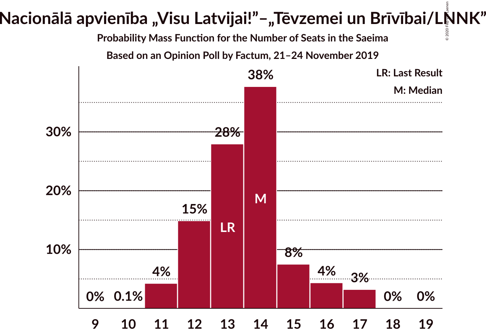

# Opinion Poll by Factum, 21–24 November 2019

<a href="#voting-intentions">Voting Intentions</a> | <a href="#seats">Seats</a> | <a href="#coalitions">Coalitions</a> | <a href="#technical-information">Technical Information</a>

## Voting Intentions

### Confidence Intervals

| Party | Last Result | Poll Result | 80% Confidence Interval | 90% Confidence Interval | 95% Confidence Interval | 99% Confidence Interval |
|:-----:|:-----------:|:-----------:|:-----------------------:|:-----------------------:|:-----------------------:|:-----------------------:|
| Sociāldemokrātiskā partija “Saskaņa” | 19.8% | 19.8% | 18.2–21.5% |17.8–22.0% |17.4–22.4% |16.6–23.3% |
| Jaunā VIENOTĪBA | 6.7% | 15.8% | 14.4–17.4% |14.0–17.9% |13.7–18.3% |13.0–19.1% |
| Jaunā konservatīvā partija | 13.6% | 12.8% | 11.5–14.3% |11.2–14.7% |10.9–15.1% |10.3–15.8% |
| Nacionālā apvienība „Visu Latvijai!”–„Tēvzemei un Brīvībai/LNNK” | 11.0% | 11.9% | 10.7–13.3% |10.3–13.7% |10.0–14.1% |9.4–14.8% |
| Attīstībai/Par! | 12.0% | 9.9% | 8.8–11.3% |8.5–11.7% |8.2–12.0% |7.7–12.7% |
| Zaļo un Zemnieku savienība | 9.9% | 9.9% | 8.8–11.3% |8.5–11.7% |8.2–12.0% |7.7–12.7% |
| PROGRESĪVIE | 2.6% | 5.9% | 5.0–7.0% |4.8–7.3% |4.6–7.6% |4.2–8.1% |
| Latvijas Reģionu Apvienība | 4.1% | 3.9% | 3.2–4.9% |3.0–5.1% |2.9–5.4% |2.6–5.8% |
| Latvijas Krievu savienība | 3.2% | 3.9% | 3.2–4.9% |3.0–5.1% |2.9–5.4% |2.6–5.8% |
| Politiskā partija „KPV LV” | 14.2% | 3.0% | 2.4–3.8% |2.2–4.1% |2.1–4.3% |1.8–4.7% |

*Note:* The poll result column reflects the actual value used in the calculations. Published results may vary slightly, and in addition be rounded to fewer digits.

## Seats

### Confidence Intervals

| Party | Last Result | Median | 80% Confidence Interval | 90% Confidence Interval | 95% Confidence Interval | 99% Confidence Interval |
|:-----:|:-----------:|:------:|:-----------------------:|:-----------------------:|:-----------------------:|:-----------------------:|
| <a href="#sociāldemokrātiskā-partija-“saskaņa”">Sociāldemokrātiskā partija “Saskaņa”</a> | 23 | 22 | 20–24 |19–24 |19–24 |19–28 |
| <a href="#jaunā-vienotība">Jaunā VIENOTĪBA</a> | 8 | 18 | 16–18 |16–19 |16–19 |15–23 |
| <a href="#jaunā-konservatīvā-partija">Jaunā konservatīvā partija</a> | 16 | 13 | 13–14 |13–14 |13–15 |11–18 |
| <a href="#nacionālā-apvienība-„visu-latvijai!”–„tēvzemei-un-brīvībai/lnnk”">Nacionālā apvienība „Visu Latvijai!”–„Tēvzemei un Brīvībai/LNNK”</a> | 13 | 11 | 11–14 |11–14 |11–15 |11–17 |
| <a href="#attīstībai/par!">Attīstībai/Par!</a> | 13 | 13 | 12–14 |10–14 |10–14 |9–14 |
| <a href="#zaļo-un-zemnieku-savienība">Zaļo un Zemnieku savienība</a> | 11 | 11 | 11–13 |11–13 |11–14 |11–15 |
| <a href="#progresīvie">PROGRESĪVIE</a> | 0 | 7 | 5–8 |5–8 |5–8 |0–8 |
| <a href="#latvijas-reģionu-apvienība">Latvijas Reģionu Apvienība</a> | 0 | 0 | 0 |0–6 |0–6 |0–6 |
| <a href="#latvijas-krievu-savienība">Latvijas Krievu savienība</a> | 0 | 5 | 0–5 |0–8 |0–8 |0–8 |
| <a href="#politiskā-partija-„kpv-lv”">Politiskā partija „KPV LV”</a> | 16 | 0 | 0 |0 |0 |0 |

### Sociāldemokrātiskā partija “Saskaņa”

*For a full overview of the results for this party, see the [Sociāldemokrātiskā partija “Saskaņa”](party-sociāldemokrātiskāpartija“saskaņa”.html) page.*

| Number of Seats | Probability | Accumulated | Special Marks |
|:---------------:|:-----------:|:-----------:|:-------------:|
| 19 | 8% | 100% |  |
| 20 | 3% | 92% |  |
| 21 | 1.0% | 89% |  |
| 22 | 46% | 88% | Median |
| 23 | 1.3% | 42% | Last Result |
| 24 | 38% | 41% |  |
| 25 | 0.3% | 2% |  |
| 26 | 0.1% | 2% |  |
| 27 | 0.1% | 2% |  |
| 28 | 2% | 2% |  |
| 29 | 0% | 0% |  |

### Jaunā VIENOTĪBA

*For a full overview of the results for this party, see the [Jaunā VIENOTĪBA](party-jaunāvienotība.html) page.*

| Number of Seats | Probability | Accumulated | Special Marks |
|:---------------:|:-----------:|:-----------:|:-------------:|
| 8 | 0% | 100% | Last Result |
| 9 | 0% | 100% |  |
| 10 | 0% | 100% |  |
| 11 | 0% | 100% |  |
| 12 | 0% | 100% |  |
| 13 | 0% | 100% |  |
| 14 | 0.4% | 100% |  |
| 15 | 2% | 99.6% |  |
| 16 | 41% | 98% |  |
| 17 | 2% | 58% |  |
| 18 | 50% | 55% | Median |
| 19 | 3% | 5% |  |
| 20 | 0% | 2% |  |
| 21 | 1.0% | 2% |  |
| 22 | 0% | 1.5% |  |
| 23 | 1.4% | 1.4% |  |
| 24 | 0% | 0% |  |

### Jaunā konservatīvā partija

*For a full overview of the results for this party, see the [Jaunā konservatīvā partija](party-jaunākonservatīvāpartija.html) page.*

| Number of Seats | Probability | Accumulated | Special Marks |
|:---------------:|:-----------:|:-----------:|:-------------:|
| 11 | 0.7% | 100% |  |
| 12 | 0% | 99.3% |  |
| 13 | 89% | 99.3% | Median |
| 14 | 8% | 11% |  |
| 15 | 2% | 3% |  |
| 16 | 0.1% | 0.8% | Last Result |
| 17 | 0.1% | 0.7% |  |
| 18 | 0.3% | 0.6% |  |
| 19 | 0.3% | 0.3% |  |
| 20 | 0% | 0% |  |

### Nacionālā apvienība „Visu Latvijai!”–„Tēvzemei un Brīvībai/LNNK”

*For a full overview of the results for this party, see the [Nacionālā apvienība „Visu Latvijai!”–„Tēvzemei un Brīvībai/LNNK”](party-nacionālāapvienība„visulatvijai”–„tēvzemeiunbrīvībailnnk”.html) page.*

| Number of Seats | Probability | Accumulated | Special Marks |
|:---------------:|:-----------:|:-----------:|:-------------:|
| 11 | 52% | 100% | Median |
| 12 | 28% | 48% |  |
| 13 | 8% | 20% | Last Result |
| 14 | 9% | 12% |  |
| 15 | 1.3% | 3% |  |
| 16 | 0.3% | 2% |  |
| 17 | 1.3% | 1.3% |  |
| 18 | 0% | 0% |  |

### Attīstībai/Par!

*For a full overview of the results for this party, see the [Attīstībai/Par!](party-attīstībaipar.html) page.*

| Number of Seats | Probability | Accumulated | Special Marks |
|:---------------:|:-----------:|:-----------:|:-------------:|
| 9 | 2% | 100% |  |
| 10 | 5% | 98% |  |
| 11 | 2% | 93% |  |
| 12 | 5% | 91% |  |
| 13 | 46% | 86% | Last Result, Median |
| 14 | 40% | 40% |  |
| 15 | 0% | 0% |  |

### Zaļo un Zemnieku savienība

*For a full overview of the results for this party, see the [Zaļo un Zemnieku savienība](party-zaļounzemniekusavienība.html) page.*

| Number of Seats | Probability | Accumulated | Special Marks |
|:---------------:|:-----------:|:-----------:|:-------------:|
| 8 | 0.1% | 100% |  |
| 9 | 0% | 99.9% |  |
| 10 | 0% | 99.9% |  |
| 11 | 60% | 99.9% | Last Result, Median |
| 12 | 0.6% | 40% |  |
| 13 | 35% | 39% |  |
| 14 | 2% | 4% |  |
| 15 | 1.3% | 1.3% |  |
| 16 | 0% | 0% |  |

### PROGRESĪVIE

*For a full overview of the results for this party, see the [PROGRESĪVIE](party-progresīvie.html) page.*

| Number of Seats | Probability | Accumulated | Special Marks |
|:---------------:|:-----------:|:-----------:|:-------------:|
| 0 | 2% | 100% | Last Result |
| 1 | 0% | 98% |  |
| 2 | 0% | 98% |  |
| 3 | 0% | 98% |  |
| 4 | 0% | 98% |  |
| 5 | 8% | 98% |  |
| 6 | 0% | 89% |  |
| 7 | 58% | 89% | Median |
| 8 | 31% | 31% |  |
| 9 | 0% | 0.1% |  |
| 10 | 0% | 0.1% |  |
| 11 | 0.1% | 0.1% |  |
| 12 | 0% | 0% |  |

### Latvijas Reģionu Apvienība

*For a full overview of the results for this party, see the [Latvijas Reģionu Apvienība](party-latvijasreģionuapvienība.html) page.*

| Number of Seats | Probability | Accumulated | Special Marks |
|:---------------:|:-----------:|:-----------:|:-------------:|
| 0 | 94% | 100% | Last Result, Median |
| 1 | 0% | 6% |  |
| 2 | 0% | 6% |  |
| 3 | 0% | 6% |  |
| 4 | 0% | 6% |  |
| 5 | 0% | 6% |  |
| 6 | 6% | 6% |  |
| 7 | 0% | 0% |  |

### Latvijas Krievu savienība

*For a full overview of the results for this party, see the [Latvijas Krievu savienība](party-latvijaskrievusavienība.html) page.*

| Number of Seats | Probability | Accumulated | Special Marks |
|:---------------:|:-----------:|:-----------:|:-------------:|
| 0 | 47% | 100% | Last Result |
| 1 | 0% | 53% |  |
| 2 | 0% | 53% |  |
| 3 | 0% | 53% |  |
| 4 | 0% | 53% |  |
| 5 | 45% | 53% | Median |
| 6 | 0% | 9% |  |
| 7 | 0% | 8% |  |
| 8 | 8% | 8% |  |
| 9 | 0% | 0% |  |

### Politiskā partija „KPV LV”

*For a full overview of the results for this party, see the [Politiskā partija „KPV LV”](party-politiskāpartija„kpvlv”.html) page.*

| Number of Seats | Probability | Accumulated | Special Marks |
|:---------------:|:-----------:|:-----------:|:-------------:|
| 0 | 99.9% | 100% | Median |
| 1 | 0% | 0.1% |  |
| 2 | 0% | 0.1% |  |
| 3 | 0% | 0.1% |  |
| 4 | 0% | 0.1% |  |
| 5 | 0.1% | 0.1% |  |
| 6 | 0% | 0% |  |
| 7 | 0% | 0% |  |
| 8 | 0% | 0% |  |
| 9 | 0% | 0% |  |
| 10 | 0% | 0% |  |
| 11 | 0% | 0% |  |
| 12 | 0% | 0% |  |
| 13 | 0% | 0% |  |
| 14 | 0% | 0% |  |
| 15 | 0% | 0% |  |
| 16 | 0% | 0% | Last Result |

## Coalitions

### Confidence Intervals

| Coalition | Last Result | Median | Majority? | 80% Confidence Interval | 90% Confidence Interval | 95% Confidence Interval | 99% Confidence Interval |
|:---------:|:-----------:|:------:|:---------:|:-----------------------:|:-----------------------:|:-----------------------:|:-----------------------:|
| Jaunā VIENOTĪBA – Jaunā konservatīvā partija – Nacionālā apvienība „Visu Latvijai!”–„Tēvzemei un Brīvībai/LNNK” – Attīstībai/Par! – Zaļo un Zemnieku savienība | 61 | 67 | 100% | 66–68 | 66–69 | 66–70 | 63–76 |
| Jaunā VIENOTĪBA – Jaunā konservatīvā partija – Nacionālā apvienība „Visu Latvijai!”–„Tēvzemei un Brīvībai/LNNK” – Zaļo un Zemnieku savienība | 48 | N/A | N/A | 53–56 | 53–57 | 53–59 | 53–62 |
| Jaunā VIENOTĪBA – Jaunā konservatīvā partija – Nacionālā apvienība „Visu Latvijai!”–„Tēvzemei un Brīvībai/LNNK” – Attīstībai/Par! | 50 | 55 | 100% | 55–57 | 55–57 | 53–58 | 52–65 |
| Jaunā VIENOTĪBA – Jaunā konservatīvā partija – Nacionālā apvienība „Visu Latvijai!”–„Tēvzemei un Brīvībai/LNNK” – Attīstībai/Par! – Politiskā partija „KPV LV” | 66 | 55 | 100% | 55–57 | 55–57 | 53–58 | 52–65 |
| Jaunā VIENOTĪBA – Nacionālā apvienība „Visu Latvijai!”–„Tēvzemei un Brīvībai/LNNK” – Attīstībai/Par! – Zaļo un Zemnieku savienība | 45 | N/A | N/A | 53–55 | 53–56 | 50–57 | 50–63 |
| Jaunā konservatīvā partija – Nacionālā apvienība „Visu Latvijai!”–„Tēvzemei un Brīvībai/LNNK” – Attīstībai/Par! – Zaļo un Zemnieku savienība | 53 | 48 | 48% | 48–52 | 48–52 | 47–53 | 46–55 |
| Sociāldemokrātiskā partija “Saskaņa” – Jaunā konservatīvā partija – Attīstībai/Par! | 52 | N/A | N/A | 47–51 | 46–51 | 43–51 | 43–54 |
| Jaunā VIENOTĪBA – Jaunā konservatīvā partija – Nacionālā apvienība „Visu Latvijai!”–„Tēvzemei un Brīvībai/LNNK” – Politiskā partija „KPV LV” | 53 | N/A | N/A | 41–43 | 41–44 | 41–48 | 41–51 |
| Jaunā VIENOTĪBA – Nacionālā apvienība „Visu Latvijai!”–„Tēvzemei un Brīvībai/LNNK” – Zaļo un Zemnieku savienība | 32 | N/A | N/A | 40–43 | 40–44 | 40–46 | 40–49 |
| Jaunā VIENOTĪBA – Nacionālā apvienība „Visu Latvijai!”–„Tēvzemei un Brīvībai/LNNK” – Attīstībai/Par! – Politiskā partija „KPV LV” | 50 | N/A | N/A | 42–43 | 40–43 | 39–46 | 39–52 |
| Jaunā VIENOTĪBA – Jaunā konservatīvā partija – Attīstībai/Par! – Politiskā partija „KPV LV” | 53 | 44 | 0% | 42–44 | 41–45 | 41–45 | 38–50 |
| Jaunā konservatīvā partija – Nacionālā apvienība „Visu Latvijai!”–„Tēvzemei un Brīvībai/LNNK” – Attīstībai/Par! – Politiskā partija „KPV LV” | 58 | 37 | 0% | 37–40 | 36–41 | 35–41 | 34–42 |
| Jaunā konservatīvā partija – Nacionālā apvienība „Visu Latvijai!”–„Tēvzemei un Brīvībai/LNNK” – Zaļo un Zemnieku savienība | 40 | N/A | N/A | 35–38 | 35–40 | 35–41 | 35–42 |
| Nacionālā apvienība „Visu Latvijai!”–„Tēvzemei un Brīvībai/LNNK” – Attīstībai/Par! – Zaļo un Zemnieku savienība | 37 | N/A | N/A | 35–39 | 34–39 | 34–40 | 33–42 |
| Sociāldemokrātiskā partija “Saskaņa” – Attīstībai/Par! | 36 | N/A | N/A | 33–38 | 33–38 | 30–38 | 30–39 |
| Sociāldemokrātiskā partija “Saskaņa” – Zaļo un Zemnieku savienība – Politiskā partija „KPV LV” | 50 | N/A | N/A | 33–37 | 30–37 | 30–38 | 30–39 |
| Sociāldemokrātiskā partija “Saskaņa” – Politiskā partija „KPV LV” | 39 | N/A | N/A | 20–24 | 19–24 | 19–24 | 19–28 |

