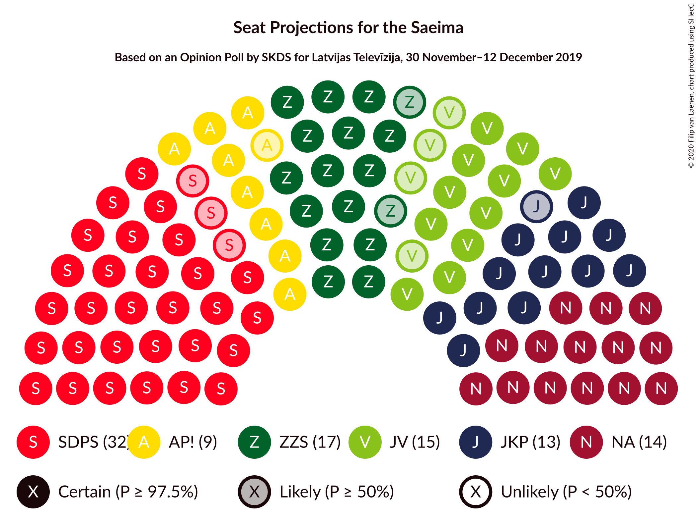
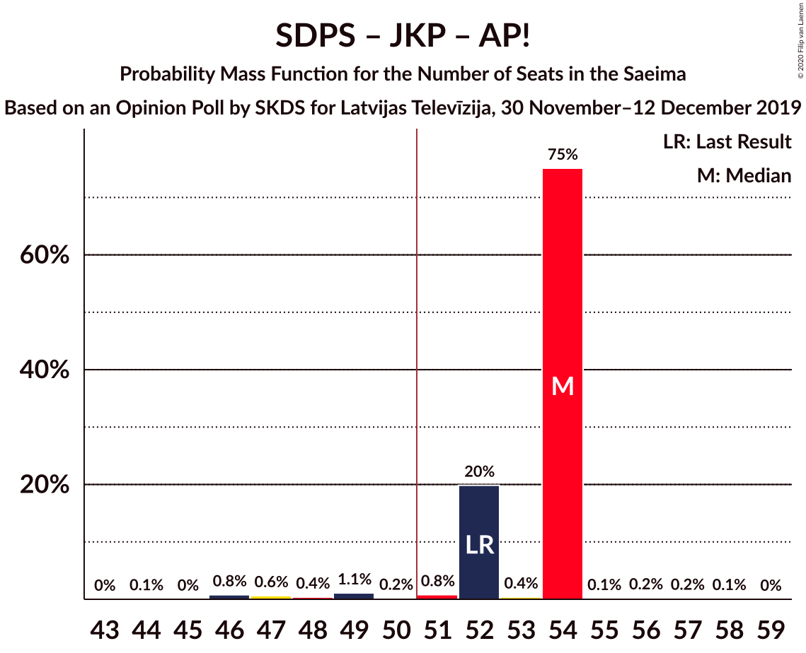
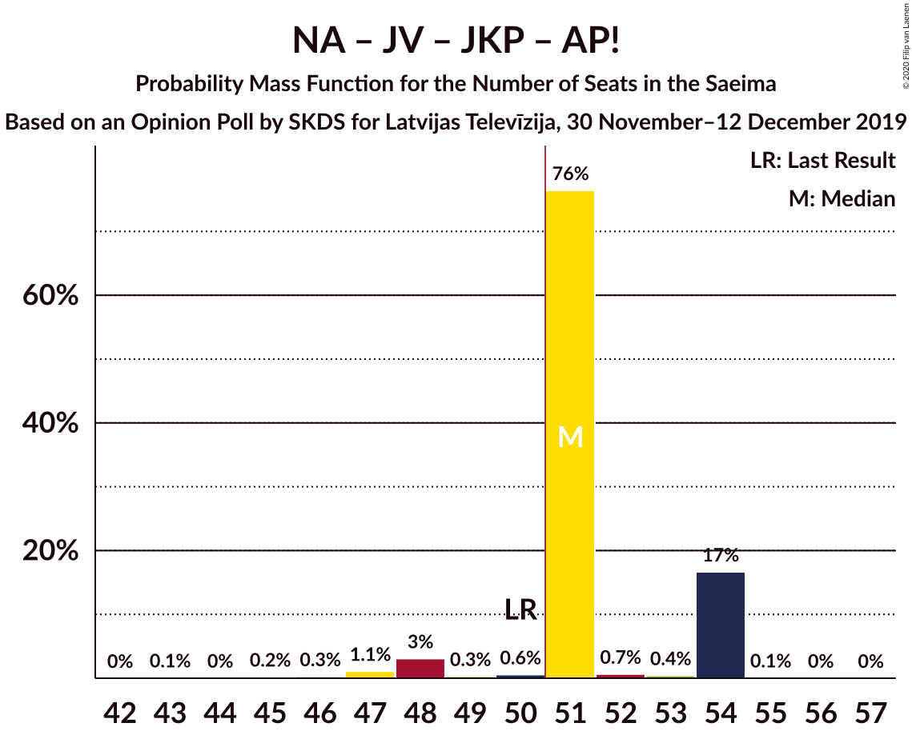
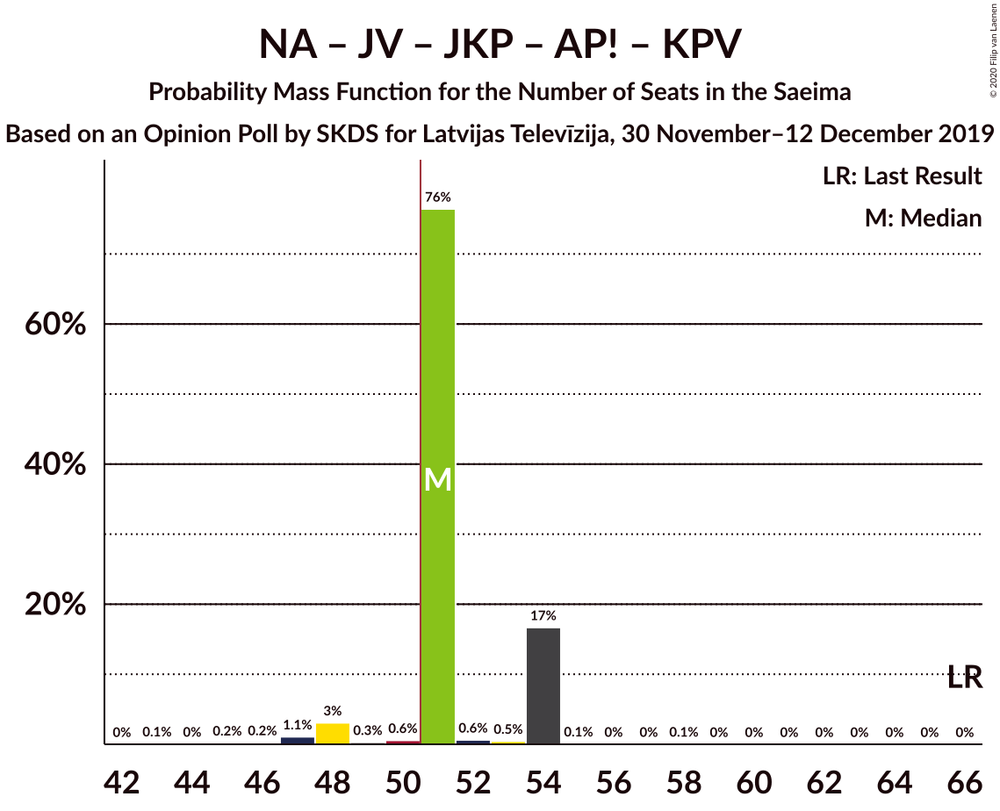
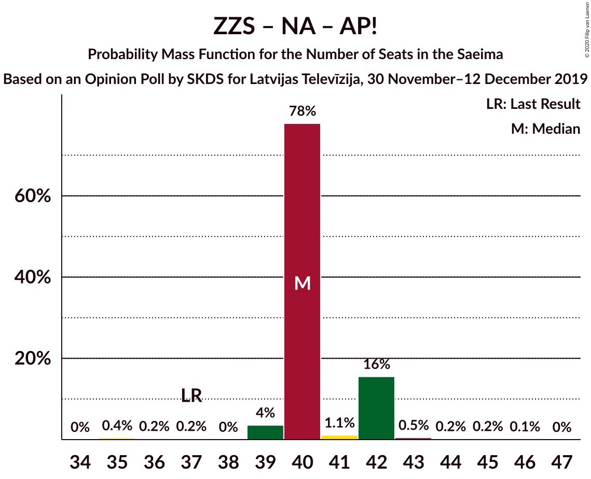
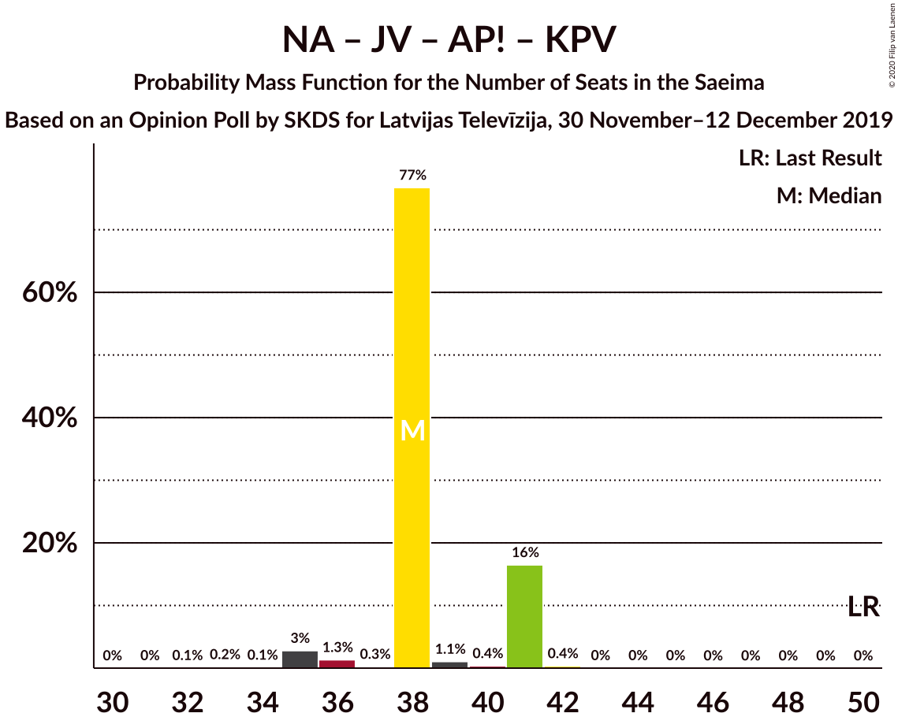
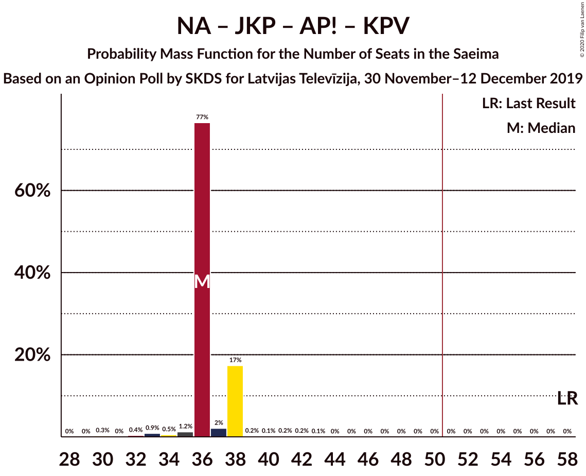

# Opinion Poll by SKDS for Latvijas Televīzija, 30 November–12 December 2019

<a href="#voting-intentions">Voting Intentions</a> | <a href="#seats">Seats</a> | <a href="#coalitions">Coalitions</a> | <a href="#technical-information">Technical Information</a>

## Voting Intentions

### Confidence Intervals

| Party | Last Result | Poll Result | 80% Confidence Interval | 90% Confidence Interval | 95% Confidence Interval | 99% Confidence Interval |
|:-----:|:-----------:|:-----------:|:-----------------------:|:-----------------------:|:-----------------------:|:-----------------------:|
| Sociāldemokrātiskā partija “Saskaņa” | 19.8% | 25.5% | 23.6–27.5% |23.1–28.0% |22.6–28.5% |21.7–29.5% |
| Zaļo un Zemnieku savienība | 9.9% | 14.6% | 13.2–16.3% |12.8–16.8% |12.4–17.2% |11.7–18.0% |
| Nacionālā apvienība „Visu Latvijai!”–„Tēvzemei un Brīvībai/LNNK” | 11.0% | 12.7% | 11.3–14.3% |11.0–14.8% |10.6–15.2% |10.0–16.0% |
| Jaunā VIENOTĪBA | 6.7% | 12.5% | 11.1–14.1% |10.7–14.5% |10.4–14.9% |9.8–15.7% |
| Jaunā konservatīvā partija | 13.6% | 10.8% | 9.5–12.3% |9.2–12.7% |8.9–13.1% |8.3–13.9% |
| Attīstībai/Par! | 12.0% | 8.4% | 7.3–9.8% |7.0–10.2% |6.7–10.5% |6.2–11.2% |
| PROGRESĪVIE | 2.6% | 4.4% | 3.6–5.5% |3.4–5.8% |3.2–6.1% |2.9–6.6% |
| Latvijas Krievu savienība | 3.2% | 4.0% | 3.2–5.0% |3.0–5.3% |2.8–5.5% |2.5–6.0% |
| Latvijas Reģionu Apvienība | 4.1% | 3.7% | 3.0–4.7% |2.8–5.0% |2.6–5.2% |2.3–5.8% |
| Politiskā partija „KPV LV” | 14.2% | 3.2% | 2.6–4.2% |2.4–4.5% |2.2–4.7% |2.0–5.2% |

*Note:* The poll result column reflects the actual value used in the calculations. Published results may vary slightly, and in addition be rounded to fewer digits.

## Seats

### Confidence Intervals

| Party | Last Result | Median | 80% Confidence Interval | 90% Confidence Interval | 95% Confidence Interval | 99% Confidence Interval |
|:-----:|:-----------:|:------:|:-----------------------:|:-----------------------:|:-----------------------:|:-----------------------:|
| <a href="#sociāldemokrātiskā-partija-“saskaņa”">Sociāldemokrātiskā partija “Saskaņa”</a> | 23 | 32 | 29–32 |29–32 |29–32 |27–33 |
| <a href="#zaļo-un-zemnieku-savienība">Zaļo un Zemnieku savienība</a> | 11 | 17 | 17 |16–17 |15–17 |14–19 |
| <a href="#nacionālā-apvienība-„visu-latvijai!”–„tēvzemei-un-brīvībai/lnnk”">Nacionālā apvienība „Visu Latvijai!”–„Tēvzemei un Brīvībai/LNNK”</a> | 13 | 14 | 14–15 |14–15 |14–15 |12–17 |
| <a href="#jaunā-vienotība">Jaunā VIENOTĪBA</a> | 8 | 15 | 15–16 |13–16 |11–16 |11–18 |
| <a href="#jaunā-konservatīvā-partija">Jaunā konservatīvā partija</a> | 16 | 13 | 13 |13 |12–13 |9–13 |
| <a href="#attīstībai/par!">Attīstībai/Par!</a> | 13 | 9 | 9–10 |9–10 |8–10 |7–11 |
| <a href="#progresīvie">PROGRESĪVIE</a> | 0 | 0 | 0 |0 |0–7 |0–7 |
| <a href="#latvijas-krievu-savienība">Latvijas Krievu savienība</a> | 0 | 0 | 0 |0 |0 |0–6 |
| <a href="#latvijas-reģionu-apvienība">Latvijas Reģionu Apvienība</a> | 0 | 0 | 0 |0 |0 |0 |
| <a href="#politiskā-partija-„kpv-lv”">Politiskā partija „KPV LV”</a> | 16 | 0 | 0 |0 |0 |0 |

### Sociāldemokrātiskā partija “Saskaņa”

*For a full overview of the results for this party, see the [Sociāldemokrātiskā partija “Saskaņa”](party-sociāldemokrātiskāpartija“saskaņa”.html) page.*

| Number of Seats | Probability | Accumulated | Special Marks |
|:---------------:|:-----------:|:-----------:|:-------------:|
| 23 | 0% | 100% | Last Result |
| 24 | 0.1% | 100% |  |
| 25 | 0.2% | 99.9% |  |
| 26 | 0.2% | 99.7% |  |
| 27 | 0.2% | 99.5% |  |
| 28 | 2% | 99.3% |  |
| 29 | 19% | 98% |  |
| 30 | 2% | 78% |  |
| 31 | 0.5% | 76% |  |
| 32 | 75% | 75% | Median |
| 33 | 0.3% | 0.7% |  |
| 34 | 0.2% | 0.4% |  |
| 35 | 0.1% | 0.1% |  |
| 36 | 0% | 0% |  |

### Zaļo un Zemnieku savienība

*For a full overview of the results for this party, see the [Zaļo un Zemnieku savienība](party-zaļounzemniekusavienība.html) page.*

| Number of Seats | Probability | Accumulated | Special Marks |
|:---------------:|:-----------:|:-----------:|:-------------:|
| 11 | 0% | 100% | Last Result |
| 12 | 0% | 100% |  |
| 13 | 0.3% | 100% |  |
| 14 | 2% | 99.7% |  |
| 15 | 0.8% | 98% |  |
| 16 | 3% | 97% |  |
| 17 | 93% | 94% | Median |
| 18 | 0.5% | 2% |  |
| 19 | 0.9% | 1.1% |  |
| 20 | 0.1% | 0.2% |  |
| 21 | 0.1% | 0.1% |  |
| 22 | 0% | 0% |  |

### Nacionālā apvienība „Visu Latvijai!”–„Tēvzemei un Brīvībai/LNNK”

*For a full overview of the results for this party, see the [Nacionālā apvienība „Visu Latvijai!”–„Tēvzemei un Brīvībai/LNNK”](party-nacionālāapvienība„visulatvijai”–„tēvzemeiunbrīvībailnnk”.html) page.*

| Number of Seats | Probability | Accumulated | Special Marks |
|:---------------:|:-----------:|:-----------:|:-------------:|
| 12 | 0.7% | 100% |  |
| 13 | 0.6% | 99.2% | Last Result |
| 14 | 79% | 98.6% | Median |
| 15 | 19% | 20% |  |
| 16 | 0.4% | 1.0% |  |
| 17 | 0.5% | 0.6% |  |
| 18 | 0.1% | 0.1% |  |
| 19 | 0% | 0.1% |  |
| 20 | 0% | 0% |  |

### Jaunā VIENOTĪBA

*For a full overview of the results for this party, see the [Jaunā VIENOTĪBA](party-jaunāvienotība.html) page.*

| Number of Seats | Probability | Accumulated | Special Marks |
|:---------------:|:-----------:|:-----------:|:-------------:|
| 8 | 0% | 100% | Last Result |
| 9 | 0% | 100% |  |
| 10 | 0.3% | 100% |  |
| 11 | 3% | 99.7% |  |
| 12 | 0.3% | 97% |  |
| 13 | 3% | 97% |  |
| 14 | 1.0% | 94% |  |
| 15 | 75% | 93% | Median |
| 16 | 16% | 18% |  |
| 17 | 0.4% | 2% |  |
| 18 | 2% | 2% |  |
| 19 | 0% | 0% |  |

### Jaunā konservatīvā partija

*For a full overview of the results for this party, see the [Jaunā konservatīvā partija](party-jaunākonservatīvāpartija.html) page.*

| Number of Seats | Probability | Accumulated | Special Marks |
|:---------------:|:-----------:|:-----------:|:-------------:|
| 9 | 0.5% | 100% |  |
| 10 | 0.1% | 99.5% |  |
| 11 | 1.5% | 99.4% |  |
| 12 | 0.8% | 98% |  |
| 13 | 97% | 97% | Median |
| 14 | 0.2% | 0.3% |  |
| 15 | 0.1% | 0.1% |  |
| 16 | 0% | 0% | Last Result |

### Attīstībai/Par!

*For a full overview of the results for this party, see the [Attīstībai/Par!](party-attīstībaipar.html) page.*

| Number of Seats | Probability | Accumulated | Special Marks |
|:---------------:|:-----------:|:-----------:|:-------------:|
| 6 | 0.1% | 100% |  |
| 7 | 2% | 99.9% |  |
| 8 | 0.6% | 98% |  |
| 9 | 77% | 97% | Median |
| 10 | 20% | 21% |  |
| 11 | 0.5% | 0.9% |  |
| 12 | 0.2% | 0.4% |  |
| 13 | 0% | 0.2% | Last Result |
| 14 | 0.2% | 0.2% |  |
| 15 | 0% | 0% |  |

### PROGRESĪVIE

*For a full overview of the results for this party, see the [PROGRESĪVIE](party-progresīvie.html) page.*

| Number of Seats | Probability | Accumulated | Special Marks |
|:---------------:|:-----------:|:-----------:|:-------------:|
| 0 | 95% | 100% | Last Result, Median |
| 1 | 0% | 5% |  |
| 2 | 0% | 5% |  |
| 3 | 0% | 5% |  |
| 4 | 0% | 5% |  |
| 5 | 0.4% | 5% |  |
| 6 | 2% | 5% |  |
| 7 | 3% | 3% |  |
| 8 | 0% | 0% |  |

### Latvijas Krievu savienība

*For a full overview of the results for this party, see the [Latvijas Krievu savienība](party-latvijaskrievusavienība.html) page.*

| Number of Seats | Probability | Accumulated | Special Marks |
|:---------------:|:-----------:|:-----------:|:-------------:|
| 0 | 98% | 100% | Last Result, Median |
| 1 | 0% | 2% |  |
| 2 | 0% | 2% |  |
| 3 | 0% | 2% |  |
| 4 | 0% | 2% |  |
| 5 | 0.2% | 2% |  |
| 6 | 2% | 2% |  |
| 7 | 0% | 0.1% |  |
| 8 | 0.1% | 0.1% |  |
| 9 | 0% | 0% |  |

### Latvijas Reģionu Apvienība

*For a full overview of the results for this party, see the [Latvijas Reģionu Apvienība](party-latvijasreģionuapvienība.html) page.*

| Number of Seats | Probability | Accumulated | Special Marks |
|:---------------:|:-----------:|:-----------:|:-------------:|
| 0 | 99.8% | 100% | Last Result, Median |
| 1 | 0% | 0.2% |  |
| 2 | 0% | 0.2% |  |
| 3 | 0% | 0.2% |  |
| 4 | 0% | 0.2% |  |
| 5 | 0% | 0.2% |  |
| 6 | 0.2% | 0.2% |  |
| 7 | 0% | 0% |  |

### Politiskā partija „KPV LV”

*For a full overview of the results for this party, see the [Politiskā partija „KPV LV”](party-politiskāpartija„kpvlv”.html) page.*

| Number of Seats | Probability | Accumulated | Special Marks |
|:---------------:|:-----------:|:-----------:|:-------------:|
| 0 | 99.9% | 100% | Median |
| 1 | 0% | 0.1% |  |
| 2 | 0% | 0.1% |  |
| 3 | 0% | 0.1% |  |
| 4 | 0% | 0.1% |  |
| 5 | 0% | 0.1% |  |
| 6 | 0.1% | 0.1% |  |
| 7 | 0% | 0% |  |
| 8 | 0% | 0% |  |
| 9 | 0% | 0% |  |
| 10 | 0% | 0% |  |
| 11 | 0% | 0% |  |
| 12 | 0% | 0% |  |
| 13 | 0% | 0% |  |
| 14 | 0% | 0% |  |
| 15 | 0% | 0% |  |
| 16 | 0% | 0% | Last Result |

## Coalitions

### Confidence Intervals

| Coalition | Last Result | Median | Majority? | 80% Confidence Interval | 90% Confidence Interval | 95% Confidence Interval | 99% Confidence Interval |
|:---------:|:-----------:|:------:|:---------:|:-----------------------:|:-----------------------:|:-----------------------:|:-----------------------:|
| Zaļo un Zemnieku savienība – Nacionālā apvienība „Visu Latvijai!”–„Tēvzemei un Brīvībai/LNNK” – Jaunā VIENOTĪBA – Jaunā konservatīvā partija – Attīstībai/Par! | 61 | 68 | 100% | 68–71 | 65–71 | 64–71 | 63–71 |
| Zaļo un Zemnieku savienība – Nacionālā apvienība „Visu Latvijai!”–„Tēvzemei un Brīvībai/LNNK” – Jaunā VIENOTĪBA – Jaunā konservatīvā partija | 48 | 59 | 100% | 59–61 | 56–61 | 54–61 | 54–62 |
| Zaļo un Zemnieku savienība – Nacionālā apvienība „Visu Latvijai!”–„Tēvzemei un Brīvībai/LNNK” – Jaunā VIENOTĪBA – Attīstībai/Par! | 45 | 55 | 99.7% | 55–58 | 53–58 | 52–58 | 51–58 |
| Zaļo un Zemnieku savienība – Nacionālā apvienība „Visu Latvijai!”–„Tēvzemei un Brīvībai/LNNK” – Jaunā konservatīvā partija – Attīstībai/Par! | 53 | 53 | 98.9% | 53–55 | 52–55 | 52–55 | 47–56 |
| Sociāldemokrātiskā partija “Saskaņa” – Jaunā konservatīvā partija – Attīstībai/Par! | 52 | 54 | 97% | 52–54 | 52–54 | 49–54 | 46–56 |
| Nacionālā apvienība „Visu Latvijai!”–„Tēvzemei un Brīvībai/LNNK” – Jaunā VIENOTĪBA – Jaunā konservatīvā partija – Attīstībai/Par! | 50 | 51 | 94% | 51–54 | 49–54 | 48–54 | 46–54 |
| Nacionālā apvienība „Visu Latvijai!”–„Tēvzemei un Brīvībai/LNNK” – Jaunā VIENOTĪBA – Jaunā konservatīvā partija – Attīstībai/Par! – Politiskā partija „KPV LV” | 66 | 51 | 94% | 51–54 | 49–54 | 48–54 | 46–54 |
| Sociāldemokrātiskā partija “Saskaņa” – Zaļo un Zemnieku savienība – Politiskā partija „KPV LV” | 50 | 49 | 0.4% | 46–49 | 46–49 | 43–49 | 43–49 |
| Zaļo un Zemnieku savienība – Nacionālā apvienība „Visu Latvijai!”–„Tēvzemei un Brīvībai/LNNK” – Jaunā VIENOTĪBA | 32 | 46 | 0.3% | 46–48 | 44–48 | 42–48 | 41–49 |
| Zaļo un Zemnieku savienība – Nacionālā apvienība „Visu Latvijai!”–„Tēvzemei un Brīvībai/LNNK” – Jaunā konservatīvā partija | 40 | 44 | 0% | 44–45 | 43–45 | 42–45 | 40–46 |
| Nacionālā apvienība „Visu Latvijai!”–„Tēvzemei un Brīvībai/LNNK” – Jaunā VIENOTĪBA – Jaunā konservatīvā partija – Politiskā partija „KPV LV” | 53 | 42 | 0% | 42–44 | 40–44 | 38–44 | 37–45 |
| Zaļo un Zemnieku savienība – Nacionālā apvienība „Visu Latvijai!”–„Tēvzemei un Brīvībai/LNNK” – Attīstībai/Par! | 37 | 40 | 0% | 40–42 | 40–42 | 39–42 | 36–44 |
| Sociāldemokrātiskā partija “Saskaņa” – Attīstībai/Par! | 36 | 41 | 0% | 39–41 | 39–41 | 38–41 | 35–43 |
| Nacionālā apvienība „Visu Latvijai!”–„Tēvzemei un Brīvībai/LNNK” – Jaunā VIENOTĪBA – Attīstībai/Par! – Politiskā partija „KPV LV” | 50 | 38 | 0% | 38–41 | 38–41 | 35–41 | 35–41 |
| Jaunā VIENOTĪBA – Jaunā konservatīvā partija – Attīstībai/Par! – Politiskā partija „KPV LV” | 53 | 37 | 0% | 37–39 | 36–39 | 34–39 | 32–40 |
| Nacionālā apvienība „Visu Latvijai!”–„Tēvzemei un Brīvībai/LNNK” – Jaunā konservatīvā partija – Attīstībai/Par! – Politiskā partija „KPV LV” | 58 | 36 | 0% | 36–38 | 36–38 | 35–38 | 32–40 |
| Sociāldemokrātiskā partija “Saskaņa” – Politiskā partija „KPV LV” | 39 | 32 | 0% | 29–32 | 29–32 | 29–32 | 27–33 |

### Zaļo un Zemnieku savienība – Nacionālā apvienība „Visu Latvijai!”–„Tēvzemei un Brīvībai/LNNK” – Jaunā VIENOTĪBA – Jaunā konservatīvā partija – Attīstībai/Par!

| Number of Seats | Probability | Accumulated | Special Marks |
|:---------------:|:-----------:|:-----------:|:-------------:|
| 59 | 0.1% | 100% |  |
| 60 | 0.1% | 99.9% |  |
| 61 | 0% | 99.8% | Last Result |
| 62 | 0.1% | 99.7% |  |
| 63 | 0.3% | 99.6% |  |
| 64 | 2% | 99.4% |  |
| 65 | 3% | 97% |  |
| 66 | 1.3% | 94% |  |
| 67 | 0.5% | 93% |  |
| 68 | 75% | 92% | Median |
| 69 | 0.5% | 18% |  |
| 70 | 2% | 17% |  |
| 71 | 15% | 15% |  |
| 72 | 0% | 0.1% |  |
| 73 | 0% | 0.1% |  |
| 74 | 0% | 0.1% |  |
| 75 | 0.1% | 0.1% |  |
| 76 | 0% | 0% |  |

### Zaļo un Zemnieku savienība – Nacionālā apvienība „Visu Latvijai!”–„Tēvzemei un Brīvībai/LNNK” – Jaunā VIENOTĪBA – Jaunā konservatīvā partija

| Number of Seats | Probability | Accumulated | Special Marks |
|:---------------:|:-----------:|:-----------:|:-------------:|
| 48 | 0% | 100% | Last Result |
| 49 | 0% | 100% |  |
| 50 | 0% | 100% |  |
| 51 | 0.1% | 100% | Majority |
| 52 | 0% | 99.9% |  |
| 53 | 0.2% | 99.9% |  |
| 54 | 2% | 99.7% |  |
| 55 | 2% | 97% |  |
| 56 | 1.1% | 95% |  |
| 57 | 0.4% | 94% |  |
| 58 | 0.7% | 94% |  |
| 59 | 76% | 93% | Median |
| 60 | 0.3% | 17% |  |
| 61 | 16% | 17% |  |
| 62 | 0.4% | 0.7% |  |
| 63 | 0.1% | 0.3% |  |
| 64 | 0.3% | 0.3% |  |
| 65 | 0% | 0% |  |

### Zaļo un Zemnieku savienība – Nacionālā apvienība „Visu Latvijai!”–„Tēvzemei un Brīvībai/LNNK” – Jaunā VIENOTĪBA – Attīstībai/Par!

| Number of Seats | Probability | Accumulated | Special Marks |
|:---------------:|:-----------:|:-----------:|:-------------:|
| 45 | 0% | 100% | Last Result |
| 46 | 0.1% | 100% |  |
| 47 | 0% | 99.9% |  |
| 48 | 0.2% | 99.9% |  |
| 49 | 0% | 99.7% |  |
| 50 | 0% | 99.7% |  |
| 51 | 2% | 99.7% | Majority |
| 52 | 2% | 98% |  |
| 53 | 1.3% | 95% |  |
| 54 | 0.2% | 94% |  |
| 55 | 76% | 94% | Median |
| 56 | 1.0% | 18% |  |
| 57 | 2% | 17% |  |
| 58 | 15% | 16% |  |
| 59 | 0% | 0.2% |  |
| 60 | 0.1% | 0.1% |  |
| 61 | 0% | 0.1% |  |
| 62 | 0.1% | 0.1% |  |
| 63 | 0% | 0% |  |

### Zaļo un Zemnieku savienība – Nacionālā apvienība „Visu Latvijai!”–„Tēvzemei un Brīvībai/LNNK” – Jaunā konservatīvā partija – Attīstībai/Par!

| Number of Seats | Probability | Accumulated | Special Marks |
|:---------------:|:-----------:|:-----------:|:-------------:|
| 46 | 0% | 100% |  |
| 47 | 0.5% | 99.9% |  |
| 48 | 0.1% | 99.4% |  |
| 49 | 0.2% | 99.3% |  |
| 50 | 0.2% | 99.1% |  |
| 51 | 0.6% | 98.9% | Majority |
| 52 | 4% | 98% |  |
| 53 | 78% | 94% | Last Result, Median |
| 54 | 0.3% | 16% |  |
| 55 | 16% | 16% |  |
| 56 | 0.1% | 0.6% |  |
| 57 | 0.1% | 0.5% |  |
| 58 | 0.2% | 0.4% |  |
| 59 | 0.2% | 0.2% |  |
| 60 | 0% | 0% |  |

### Sociāldemokrātiskā partija “Saskaņa” – Jaunā konservatīvā partija – Attīstībai/Par!

| Number of Seats | Probability | Accumulated | Special Marks |
|:---------------:|:-----------:|:-----------:|:-------------:|
| 44 | 0.1% | 100% |  |
| 45 | 0% | 99.9% |  |
| 46 | 0.8% | 99.9% |  |
| 47 | 0.6% | 99.1% |  |
| 48 | 0.4% | 98% |  |
| 49 | 1.1% | 98% |  |
| 50 | 0.2% | 97% |  |
| 51 | 0.8% | 97% | Majority |
| 52 | 20% | 96% | Last Result |
| 53 | 0.4% | 76% |  |
| 54 | 75% | 76% | Median |
| 55 | 0.1% | 0.7% |  |
| 56 | 0.2% | 0.5% |  |
| 57 | 0.2% | 0.3% |  |
| 58 | 0.1% | 0.1% |  |
| 59 | 0% | 0% |  |

### Nacionālā apvienība „Visu Latvijai!”–„Tēvzemei un Brīvībai/LNNK” – Jaunā VIENOTĪBA – Jaunā konservatīvā partija – Attīstībai/Par!

| Number of Seats | Probability | Accumulated | Special Marks |
|:---------------:|:-----------:|:-----------:|:-------------:|
| 43 | 0.1% | 100% |  |
| 44 | 0% | 99.9% |  |
| 45 | 0.2% | 99.9% |  |
| 46 | 0.3% | 99.6% |  |
| 47 | 1.1% | 99.4% |  |
| 48 | 3% | 98% |  |
| 49 | 0.3% | 95% |  |
| 50 | 0.6% | 95% | Last Result |
| 51 | 76% | 94% | Median, Majority |
| 52 | 0.7% | 18% |  |
| 53 | 0.4% | 17% |  |
| 54 | 17% | 17% |  |
| 55 | 0.1% | 0.1% |  |
| 56 | 0% | 0.1% |  |
| 57 | 0% | 0% |  |

### Nacionālā apvienība „Visu Latvijai!”–„Tēvzemei un Brīvībai/LNNK” – Jaunā VIENOTĪBA – Jaunā konservatīvā partija – Attīstībai/Par! – Politiskā partija „KPV LV”

| Number of Seats | Probability | Accumulated | Special Marks |
|:---------------:|:-----------:|:-----------:|:-------------:|
| 43 | 0.1% | 100% |  |
| 44 | 0% | 99.9% |  |
| 45 | 0.2% | 99.9% |  |
| 46 | 0.2% | 99.7% |  |
| 47 | 1.1% | 99.4% |  |
| 48 | 3% | 98% |  |
| 49 | 0.3% | 95% |  |
| 50 | 0.6% | 95% |  |
| 51 | 76% | 94% | Median, Majority |
| 52 | 0.6% | 18% |  |
| 53 | 0.5% | 17% |  |
| 54 | 17% | 17% |  |
| 55 | 0.1% | 0.2% |  |
| 56 | 0% | 0.1% |  |
| 57 | 0% | 0.1% |  |
| 58 | 0.1% | 0.1% |  |
| 59 | 0% | 0% |  |
| 60 | 0% | 0% |  |
| 61 | 0% | 0% |  |
| 62 | 0% | 0% |  |
| 63 | 0% | 0% |  |
| 64 | 0% | 0% |  |
| 65 | 0% | 0% |  |
| 66 | 0% | 0% | Last Result |

### Sociāldemokrātiskā partija “Saskaņa” – Zaļo un Zemnieku savienība – Politiskā partija „KPV LV”

| Number of Seats | Probability | Accumulated | Special Marks |
|:---------------:|:-----------:|:-----------:|:-------------:|
| 40 | 0.1% | 100% |  |
| 41 | 0.1% | 99.9% |  |
| 42 | 0.2% | 99.9% |  |
| 43 | 2% | 99.7% |  |
| 44 | 0.2% | 97% |  |
| 45 | 2% | 97% |  |
| 46 | 17% | 95% |  |
| 47 | 2% | 78% |  |
| 48 | 0.7% | 76% |  |
| 49 | 75% | 75% | Median |
| 50 | 0.1% | 0.4% | Last Result |
| 51 | 0.2% | 0.4% | Majority |
| 52 | 0.1% | 0.2% |  |
| 53 | 0% | 0.1% |  |
| 54 | 0% | 0% |  |

### Zaļo un Zemnieku savienība – Nacionālā apvienība „Visu Latvijai!”–„Tēvzemei un Brīvībai/LNNK” – Jaunā VIENOTĪBA

| Number of Seats | Probability | Accumulated | Special Marks |
|:---------------:|:-----------:|:-----------:|:-------------:|
| 32 | 0% | 100% | Last Result |
| 33 | 0% | 100% |  |
| 34 | 0% | 100% |  |
| 35 | 0% | 100% |  |
| 36 | 0% | 100% |  |
| 37 | 0% | 100% |  |
| 38 | 0% | 100% |  |
| 39 | 0% | 100% |  |
| 40 | 0.1% | 99.9% |  |
| 41 | 2% | 99.9% |  |
| 42 | 2% | 98% |  |
| 43 | 0.6% | 96% |  |
| 44 | 0.4% | 95% |  |
| 45 | 1.1% | 95% |  |
| 46 | 76% | 94% | Median |
| 47 | 0.2% | 18% |  |
| 48 | 17% | 18% |  |
| 49 | 0.3% | 0.7% |  |
| 50 | 0.1% | 0.4% |  |
| 51 | 0.3% | 0.3% | Majority |
| 52 | 0% | 0% |  |

### Zaļo un Zemnieku savienība – Nacionālā apvienība „Visu Latvijai!”–„Tēvzemei un Brīvībai/LNNK” – Jaunā konservatīvā partija

| Number of Seats | Probability | Accumulated | Special Marks |
|:---------------:|:-----------:|:-----------:|:-------------:|
| 38 | 0% | 100% |  |
| 39 | 0.1% | 99.9% |  |
| 40 | 0.6% | 99.9% | Last Result |
| 41 | 0.6% | 99.2% |  |
| 42 | 2% | 98.7% |  |
| 43 | 4% | 97% |  |
| 44 | 75% | 93% | Median |
| 45 | 17% | 17% |  |
| 46 | 0.4% | 0.7% |  |
| 47 | 0.1% | 0.3% |  |
| 48 | 0.1% | 0.2% |  |
| 49 | 0.1% | 0.1% |  |
| 50 | 0% | 0% |  |

### Nacionālā apvienība „Visu Latvijai!”–„Tēvzemei un Brīvībai/LNNK” – Jaunā VIENOTĪBA – Jaunā konservatīvā partija – Politiskā partija „KPV LV”

| Number of Seats | Probability | Accumulated | Special Marks |
|:---------------:|:-----------:|:-----------:|:-------------:|
| 35 | 0.1% | 100% |  |
| 36 | 0.1% | 99.9% |  |
| 37 | 0.5% | 99.8% |  |
| 38 | 3% | 99.3% |  |
| 39 | 0.7% | 97% |  |
| 40 | 1.1% | 96% |  |
| 41 | 2% | 95% |  |
| 42 | 75% | 93% | Median |
| 43 | 0.7% | 18% |  |
| 44 | 15% | 17% |  |
| 45 | 2% | 2% |  |
| 46 | 0.1% | 0.3% |  |
| 47 | 0.2% | 0.3% |  |
| 48 | 0% | 0.1% |  |
| 49 | 0% | 0% |  |
| 50 | 0% | 0% |  |
| 51 | 0% | 0% | Majority |
| 52 | 0% | 0% |  |
| 53 | 0% | 0% | Last Result |

### Zaļo un Zemnieku savienība – Nacionālā apvienība „Visu Latvijai!”–„Tēvzemei un Brīvībai/LNNK” – Attīstībai/Par!

| Number of Seats | Probability | Accumulated | Special Marks |
|:---------------:|:-----------:|:-----------:|:-------------:|
| 35 | 0.4% | 100% |  |
| 36 | 0.2% | 99.6% |  |
| 37 | 0.2% | 99.3% | Last Result |
| 38 | 0% | 99.1% |  |
| 39 | 4% | 99.1% |  |
| 40 | 78% | 95% | Median |
| 41 | 1.1% | 18% |  |
| 42 | 16% | 17% |  |
| 43 | 0.5% | 1.0% |  |
| 44 | 0.2% | 0.5% |  |
| 45 | 0.2% | 0.4% |  |
| 46 | 0.1% | 0.1% |  |
| 47 | 0% | 0% |  |

### Sociāldemokrātiskā partija “Saskaņa” – Attīstībai/Par!

| Number of Seats | Probability | Accumulated | Special Marks |
|:---------------:|:-----------:|:-----------:|:-------------:|
| 33 | 0.1% | 100% |  |
| 34 | 0.1% | 99.9% |  |
| 35 | 1.4% | 99.7% |  |
| 36 | 0.3% | 98% | Last Result |
| 37 | 0.4% | 98% |  |
| 38 | 1.2% | 98% |  |
| 39 | 20% | 96% |  |
| 40 | 0.8% | 77% |  |
| 41 | 75% | 76% | Median |
| 42 | 0.4% | 0.9% |  |
| 43 | 0.2% | 0.6% |  |
| 44 | 0.2% | 0.3% |  |
| 45 | 0.1% | 0.2% |  |
| 46 | 0% | 0.1% |  |
| 47 | 0.1% | 0.1% |  |
| 48 | 0% | 0% |  |

### Nacionālā apvienība „Visu Latvijai!”–„Tēvzemei un Brīvībai/LNNK” – Jaunā VIENOTĪBA – Attīstībai/Par! – Politiskā partija „KPV LV”

| Number of Seats | Probability | Accumulated | Special Marks |
|:---------------:|:-----------:|:-----------:|:-------------:|
| 31 | 0% | 100% |  |
| 32 | 0.1% | 99.9% |  |
| 33 | 0.2% | 99.9% |  |
| 34 | 0.1% | 99.7% |  |
| 35 | 3% | 99.6% |  |
| 36 | 1.3% | 97% |  |
| 37 | 0.3% | 95% |  |
| 38 | 77% | 95% | Median |
| 39 | 1.1% | 18% |  |
| 40 | 0.4% | 17% |  |
| 41 | 16% | 17% |  |
| 42 | 0.4% | 0.5% |  |
| 43 | 0% | 0.1% |  |
| 44 | 0% | 0.1% |  |
| 45 | 0% | 0% |  |
| 46 | 0% | 0% |  |
| 47 | 0% | 0% |  |
| 48 | 0% | 0% |  |
| 49 | 0% | 0% |  |
| 50 | 0% | 0% | Last Result |

### Jaunā VIENOTĪBA – Jaunā konservatīvā partija – Attīstībai/Par! – Politiskā partija „KPV LV”

| Number of Seats | Probability | Accumulated | Special Marks |
|:---------------:|:-----------:|:-----------:|:-------------:|
| 30 | 0.2% | 100% |  |
| 31 | 0.1% | 99.8% |  |
| 32 | 1.1% | 99.7% |  |
| 33 | 0.8% | 98.6% |  |
| 34 | 2% | 98% |  |
| 35 | 0.4% | 95% |  |
| 36 | 2% | 95% |  |
| 37 | 76% | 93% | Median |
| 38 | 0.5% | 17% |  |
| 39 | 15% | 17% |  |
| 40 | 1.1% | 1.3% |  |
| 41 | 0% | 0.2% |  |
| 42 | 0.1% | 0.1% |  |
| 43 | 0% | 0% |  |
| 44 | 0% | 0% |  |
| 45 | 0% | 0% |  |
| 46 | 0% | 0% |  |
| 47 | 0% | 0% |  |
| 48 | 0% | 0% |  |
| 49 | 0% | 0% |  |
| 50 | 0% | 0% |  |
| 51 | 0% | 0% | Majority |
| 52 | 0% | 0% |  |
| 53 | 0% | 0% | Last Result |

### Nacionālā apvienība „Visu Latvijai!”–„Tēvzemei un Brīvībai/LNNK” – Jaunā konservatīvā partija – Attīstībai/Par! – Politiskā partija „KPV LV”

| Number of Seats | Probability | Accumulated | Special Marks |
|:---------------:|:-----------:|:-----------:|:-------------:|
| 30 | 0.3% | 100% |  |
| 31 | 0% | 99.7% |  |
| 32 | 0.4% | 99.7% |  |
| 33 | 0.9% | 99.3% |  |
| 34 | 0.5% | 98% |  |
| 35 | 1.2% | 98% |  |
| 36 | 77% | 97% | Median |
| 37 | 2% | 20% |  |
| 38 | 17% | 18% |  |
| 39 | 0.2% | 0.7% |  |
| 40 | 0.1% | 0.5% |  |
| 41 | 0.2% | 0.4% |  |
| 42 | 0.2% | 0.2% |  |
| 43 | 0.1% | 0.1% |  |
| 44 | 0% | 0% |  |
| 45 | 0% | 0% |  |
| 46 | 0% | 0% |  |
| 47 | 0% | 0% |  |
| 48 | 0% | 0% |  |
| 49 | 0% | 0% |  |
| 50 | 0% | 0% |  |
| 51 | 0% | 0% | Majority |
| 52 | 0% | 0% |  |
| 53 | 0% | 0% |  |
| 54 | 0% | 0% |  |
| 55 | 0% | 0% |  |
| 56 | 0% | 0% |  |
| 57 | 0% | 0% |  |
| 58 | 0% | 0% | Last Result |

### Sociāldemokrātiskā partija “Saskaņa” – Politiskā partija „KPV LV”

| Number of Seats | Probability | Accumulated | Special Marks |
|:---------------:|:-----------:|:-----------:|:-------------:|
| 24 | 0.1% | 100% |  |
| 25 | 0.2% | 99.9% |  |
| 26 | 0.2% | 99.7% |  |
| 27 | 0.2% | 99.6% |  |
| 28 | 2% | 99.4% |  |
| 29 | 19% | 98% |  |
| 30 | 2% | 78% |  |
| 31 | 0.5% | 76% |  |
| 32 | 75% | 76% | Median |
| 33 | 0.3% | 0.7% |  |
| 34 | 0.2% | 0.4% |  |
| 35 | 0.1% | 0.2% |  |
| 36 | 0.1% | 0.1% |  |
| 37 | 0% | 0% |  |
| 38 | 0% | 0% |  |
| 39 | 0% | 0% | Last Result |

## Technical Information

### Opinion Poll

+ **Polling firm:** SKDS
+ **Commissioner(s):** Latvijas Televīzija
+ **Fieldwork period:** 30 November–12 December 2019

### Calculations

+ **Sample size:** 833
+ **Simulations done:** 131,072
+ **Error estimate:** 2.99%

