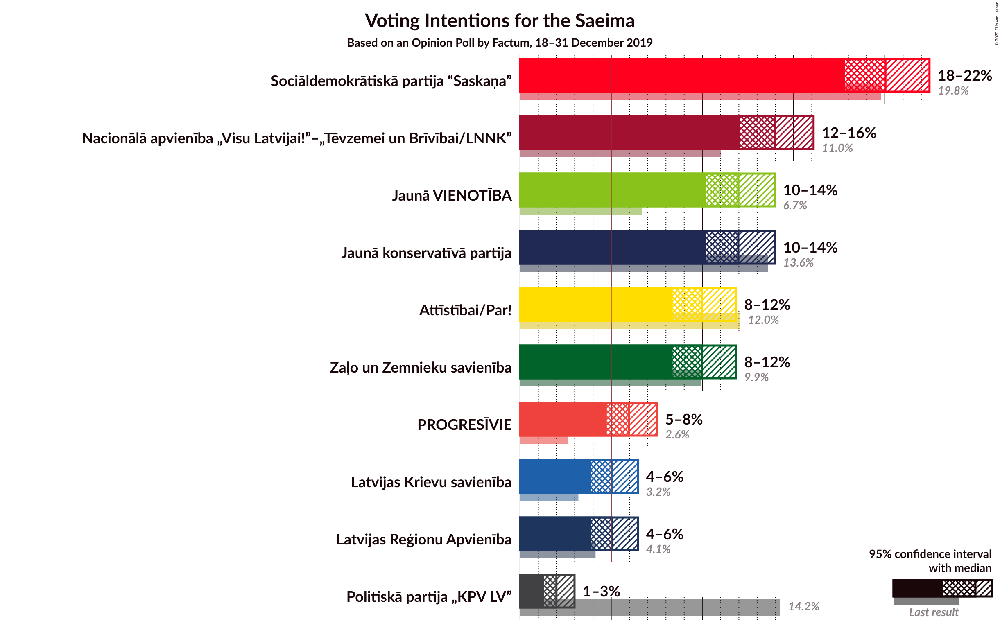
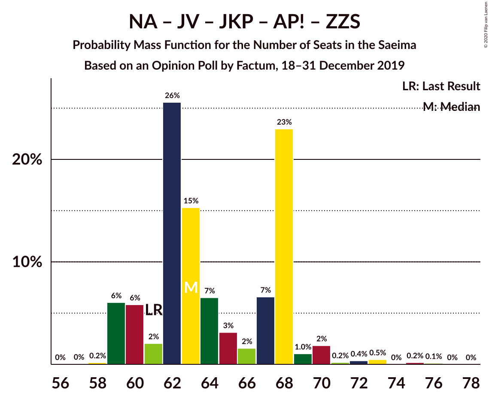
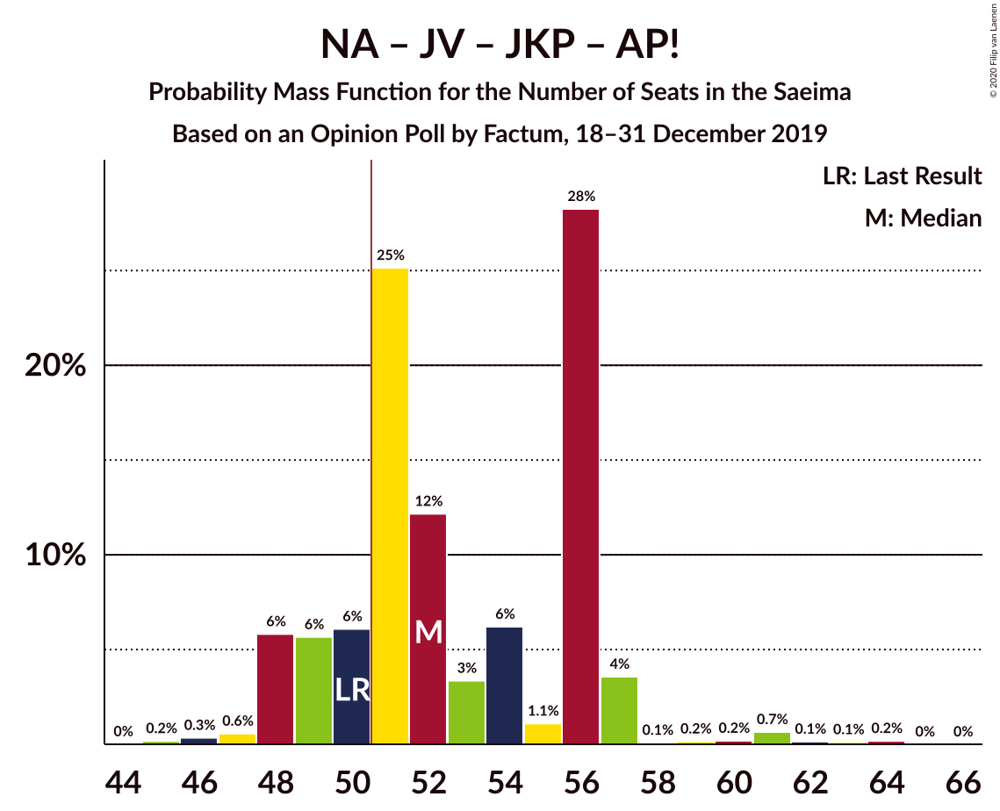
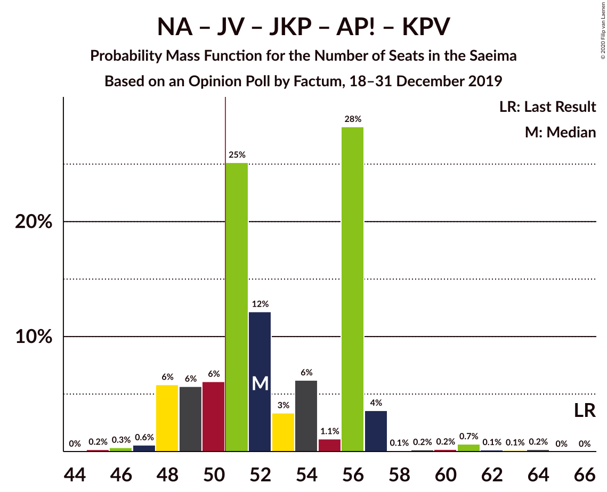
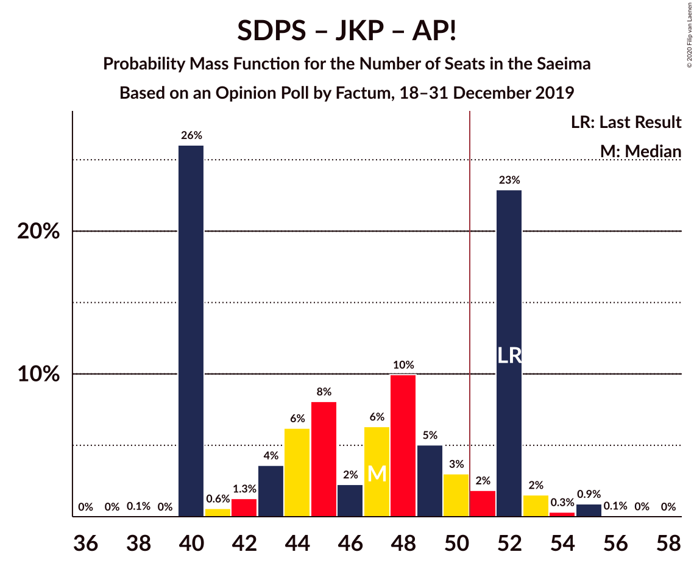

# Opinion Poll by Factum, 18–31 December 2019

<a href="#voting-intentions">Voting Intentions</a> | <a href="#seats">Seats</a> | <a href="#coalitions">Coalitions</a> | <a href="#technical-information">Technical Information</a>

## Voting Intentions

### Confidence Intervals

| Party | Last Result | Poll Result | 80% Confidence Interval | 90% Confidence Interval | 95% Confidence Interval | 99% Confidence Interval |
|:-----:|:-----------:|:-----------:|:-----------------------:|:-----------------------:|:-----------------------:|:-----------------------:|
| Sociāldemokrātiskā partija “Saskaņa” | 19.8% | 20.0% | 18.6–21.6% |18.2–22.1% |17.8–22.5% |17.1–23.2% |
| Nacionālā apvienība „Visu Latvijai!”–„Tēvzemei un Brīvībai/LNNK” | 11.0% | 14.0% | 12.7–15.3% |12.4–15.7% |12.1–16.1% |11.5–16.8% |
| Jaunā konservatīvā partija | 13.6% | 12.0% | 10.8–13.3% |10.5–13.7% |10.2–14.0% |9.7–14.6% |
| Jaunā VIENOTĪBA | 6.7% | 12.0% | 10.8–13.3% |10.5–13.7% |10.2–14.0% |9.7–14.6% |
| Attīstībai/Par! | 12.0% | 10.0% | 8.9–11.2% |8.6–11.5% |8.4–11.8% |7.9–12.5% |
| Zaļo un Zemnieku savienība | 9.9% | 10.0% | 8.9–11.2% |8.6–11.5% |8.4–11.8% |7.9–12.5% |
| PROGRESĪVIE | 2.6% | 6.0% | 5.2–7.0% |4.9–7.3% |4.8–7.5% |4.4–8.0% |
| Latvijas Reģionu Apvienība | 4.1% | 5.0% | 4.3–6.0% |4.1–6.2% |3.9–6.5% |3.6–6.9% |
| Latvijas Krievu savienība | 3.2% | 5.0% | 4.3–6.0% |4.1–6.2% |3.9–6.5% |3.6–6.9% |
| Politiskā partija „KPV LV” | 14.2% | 2.0% | 1.6–2.6% |1.4–2.8% |1.3–3.0% |1.1–3.3% |

*Note:* The poll result column reflects the actual value used in the calculations. Published results may vary slightly, and in addition be rounded to fewer digits.

## Seats

### Confidence Intervals

| Party | Last Result | Median | 80% Confidence Interval | 90% Confidence Interval | 95% Confidence Interval | 99% Confidence Interval |
|:-----:|:-----------:|:------:|:-----------------------:|:-----------------------:|:-----------------------:|:-----------------------:|
| <a href="#sociāldemokrātiskā-partija-“saskaņa”">Sociāldemokrātiskā partija “Saskaņa”</a> | 23 | 23 | 18–25 |18–25 |18–25 |17–28 |
| <a href="#nacionālā-apvienība-„visu-latvijai!”–„tēvzemei-un-brīvībai/lnnk”">Nacionālā apvienība „Visu Latvijai!”–„Tēvzemei un Brīvībai/LNNK”</a> | 13 | 14 | 14–17 |13–17 |13–17 |13–18 |
| <a href="#jaunā-konservatīvā-partija">Jaunā konservatīvā partija</a> | 16 | 13 | 13 |12–15 |11–15 |11–16 |
| <a href="#jaunā-vienotība">Jaunā VIENOTĪBA</a> | 8 | 15 | 12–15 |11–15 |11–16 |10–17 |
| <a href="#attīstībai/par!">Attīstībai/Par!</a> | 13 | 11 | 9–14 |9–14 |7–14 |7–15 |
| <a href="#zaļo-un-zemnieku-savienība">Zaļo un Zemnieku savienība</a> | 11 | 11 | 11–12 |11–13 |10–13 |10–15 |
| <a href="#progresīvie">PROGRESĪVIE</a> | 0 | 6 | 0–7 |0–8 |0–8 |0–9 |
| <a href="#latvijas-reģionu-apvienība">Latvijas Reģionu Apvienība</a> | 0 | 6 | 0–6 |0–6 |0–7 |0–7 |
| <a href="#latvijas-krievu-savienība">Latvijas Krievu savienība</a> | 0 | 7 | 0–8 |0–8 |0–8 |0–8 |
| <a href="#politiskā-partija-„kpv-lv”">Politiskā partija „KPV LV”</a> | 16 | 0 | 0 |0 |0 |0 |

### Sociāldemokrātiskā partija “Saskaņa”

*For a full overview of the results for this party, see the [Sociāldemokrātiskā partija “Saskaņa”](party-sociāldemokrātiskāpartija“saskaņa”.html) page.*

| Number of Seats | Probability | Accumulated | Special Marks |
|:---------------:|:-----------:|:-----------:|:-------------:|
| 17 | 0.6% | 100% |  |
| 18 | 23% | 99.4% |  |
| 19 | 7% | 76% |  |
| 20 | 0.6% | 69% |  |
| 21 | 1.4% | 69% |  |
| 22 | 15% | 67% |  |
| 23 | 22% | 52% | Last Result, Median |
| 24 | 4% | 31% |  |
| 25 | 24% | 26% |  |
| 26 | 0.8% | 2% |  |
| 27 | 0.6% | 1.2% |  |
| 28 | 0.1% | 0.6% |  |
| 29 | 0.4% | 0.5% |  |
| 30 | 0% | 0% |  |

### Nacionālā apvienība „Visu Latvijai!”–„Tēvzemei un Brīvībai/LNNK”

*For a full overview of the results for this party, see the [Nacionālā apvienība „Visu Latvijai!”–„Tēvzemei un Brīvībai/LNNK”](party-nacionālāapvienība„visulatvijai”–„tēvzemeiunbrīvībailnnk”.html) page.*

| Number of Seats | Probability | Accumulated | Special Marks |
|:---------------:|:-----------:|:-----------:|:-------------:|
| 12 | 0.2% | 100% |  |
| 13 | 6% | 99.8% | Last Result |
| 14 | 60% | 94% | Median |
| 15 | 11% | 33% |  |
| 16 | 9% | 23% |  |
| 17 | 13% | 14% |  |
| 18 | 0.5% | 0.8% |  |
| 19 | 0% | 0.3% |  |
| 20 | 0.3% | 0.3% |  |
| 21 | 0% | 0% |  |

### Jaunā konservatīvā partija

*For a full overview of the results for this party, see the [Jaunā konservatīvā partija](party-jaunākonservatīvāpartija.html) page.*

| Number of Seats | Probability | Accumulated | Special Marks |
|:---------------:|:-----------:|:-----------:|:-------------:|
| 10 | 0% | 100% |  |
| 11 | 5% | 99.9% |  |
| 12 | 0.9% | 95% |  |
| 13 | 88% | 94% | Median |
| 14 | 0.9% | 7% |  |
| 15 | 4% | 6% |  |
| 16 | 2% | 2% | Last Result |
| 17 | 0.1% | 0.4% |  |
| 18 | 0.2% | 0.3% |  |
| 19 | 0.1% | 0.1% |  |
| 20 | 0% | 0% |  |

### Jaunā VIENOTĪBA

*For a full overview of the results for this party, see the [Jaunā VIENOTĪBA](party-jaunāvienotība.html) page.*

| Number of Seats | Probability | Accumulated | Special Marks |
|:---------------:|:-----------:|:-----------:|:-------------:|
| 8 | 0% | 100% | Last Result |
| 9 | 0.2% | 100% |  |
| 10 | 0.3% | 99.8% |  |
| 11 | 9% | 99.5% |  |
| 12 | 15% | 90% |  |
| 13 | 16% | 75% |  |
| 14 | 6% | 60% |  |
| 15 | 50% | 54% | Median |
| 16 | 3% | 4% |  |
| 17 | 0.4% | 0.5% |  |
| 18 | 0.1% | 0.1% |  |
| 19 | 0% | 0% |  |

### Attīstībai/Par!

*For a full overview of the results for this party, see the [Attīstībai/Par!](party-attīstībaipar.html) page.*

| Number of Seats | Probability | Accumulated | Special Marks |
|:---------------:|:-----------:|:-----------:|:-------------:|
| 7 | 3% | 100% |  |
| 8 | 2% | 97% |  |
| 9 | 32% | 95% |  |
| 10 | 11% | 64% |  |
| 11 | 4% | 53% | Median |
| 12 | 13% | 49% |  |
| 13 | 1.4% | 36% | Last Result |
| 14 | 33% | 34% |  |
| 15 | 1.0% | 1.0% |  |
| 16 | 0% | 0% |  |

### Zaļo un Zemnieku savienība

*For a full overview of the results for this party, see the [Zaļo un Zemnieku savienība](party-zaļounzemniekusavienība.html) page.*

| Number of Seats | Probability | Accumulated | Special Marks |
|:---------------:|:-----------:|:-----------:|:-------------:|
| 10 | 3% | 100% |  |
| 11 | 64% | 96% | Last Result, Median |
| 12 | 25% | 32% |  |
| 13 | 6% | 7% |  |
| 14 | 0.4% | 2% |  |
| 15 | 1.0% | 1.1% |  |
| 16 | 0.1% | 0.1% |  |
| 17 | 0% | 0% |  |

### PROGRESĪVIE

*For a full overview of the results for this party, see the [PROGRESĪVIE](party-progresīvie.html) page.*

| Number of Seats | Probability | Accumulated | Special Marks |
|:---------------:|:-----------:|:-----------:|:-------------:|
| 0 | 19% | 100% | Last Result |
| 1 | 0% | 81% |  |
| 2 | 0% | 81% |  |
| 3 | 0% | 81% |  |
| 4 | 0% | 81% |  |
| 5 | 8% | 81% |  |
| 6 | 27% | 73% | Median |
| 7 | 40% | 46% |  |
| 8 | 6% | 7% |  |
| 9 | 0.5% | 0.7% |  |
| 10 | 0.1% | 0.1% |  |
| 11 | 0% | 0% |  |

### Latvijas Reģionu Apvienība

*For a full overview of the results for this party, see the [Latvijas Reģionu Apvienība](party-latvijasreģionuapvienība.html) page.*

| Number of Seats | Probability | Accumulated | Special Marks |
|:---------------:|:-----------:|:-----------:|:-------------:|
| 0 | 39% | 100% | Last Result |
| 1 | 0% | 61% |  |
| 2 | 0% | 61% |  |
| 3 | 0% | 61% |  |
| 4 | 0% | 61% |  |
| 5 | 0% | 61% |  |
| 6 | 57% | 61% | Median |
| 7 | 3% | 3% |  |
| 8 | 0% | 0% |  |

### Latvijas Krievu savienība

*For a full overview of the results for this party, see the [Latvijas Krievu savienība](party-latvijaskrievusavienība.html) page.*

| Number of Seats | Probability | Accumulated | Special Marks |
|:---------------:|:-----------:|:-----------:|:-------------:|
| 0 | 33% | 100% | Last Result |
| 1 | 0% | 67% |  |
| 2 | 0% | 67% |  |
| 3 | 0% | 67% |  |
| 4 | 0% | 67% |  |
| 5 | 6% | 67% |  |
| 6 | 5% | 60% |  |
| 7 | 14% | 55% | Median |
| 8 | 41% | 41% |  |
| 9 | 0% | 0% |  |

### Politiskā partija „KPV LV”

*For a full overview of the results for this party, see the [Politiskā partija „KPV LV”](party-politiskāpartija„kpvlv”.html) page.*

| Number of Seats | Probability | Accumulated | Special Marks |
|:---------------:|:-----------:|:-----------:|:-------------:|
| 0 | 100% | 100% | Median |
| 1 | 0% | 0% |  |
| 2 | 0% | 0% |  |
| 3 | 0% | 0% |  |
| 4 | 0% | 0% |  |
| 5 | 0% | 0% |  |
| 6 | 0% | 0% |  |
| 7 | 0% | 0% |  |
| 8 | 0% | 0% |  |
| 9 | 0% | 0% |  |
| 10 | 0% | 0% |  |
| 11 | 0% | 0% |  |
| 12 | 0% | 0% |  |
| 13 | 0% | 0% |  |
| 14 | 0% | 0% |  |
| 15 | 0% | 0% |  |
| 16 | 0% | 0% | Last Result |

## Coalitions

### Confidence Intervals

| Coalition | Last Result | Median | Majority? | 80% Confidence Interval | 90% Confidence Interval | 95% Confidence Interval | 99% Confidence Interval |
|:---------:|:-----------:|:------:|:---------:|:-----------------------:|:-----------------------:|:-----------------------:|:-----------------------:|
| Nacionālā apvienība „Visu Latvijai!”–„Tēvzemei un Brīvībai/LNNK” – Jaunā VIENOTĪBA – Jaunā konservatīvā partija – Attīstībai/Par! – Zaļo un Zemnieku savienība | 61 | 63 | 100% | 60–68 | 59–68 | 59–70 | 59–73 |
| Nacionālā apvienība „Visu Latvijai!”–„Tēvzemei un Brīvībai/LNNK” – Jaunā VIENOTĪBA – Jaunā konservatīvā partija – Zaļo un Zemnieku savienība | 48 | 53 | 85% | 50–56 | 50–56 | 49–57 | 49–60 |
| Nacionālā apvienība „Visu Latvijai!”–„Tēvzemei un Brīvībai/LNNK” – Jaunā VIENOTĪBA – Jaunā konservatīvā partija – Attīstībai/Par! | 50 | 52 | 81% | 49–56 | 48–57 | 48–57 | 46–61 |
| Nacionālā apvienība „Visu Latvijai!”–„Tēvzemei un Brīvībai/LNNK” – Jaunā VIENOTĪBA – Jaunā konservatīvā partija – Attīstībai/Par! – Politiskā partija „KPV LV” | 66 | 52 | 81% | 49–56 | 48–57 | 48–57 | 46–61 |
| Nacionālā apvienība „Visu Latvijai!”–„Tēvzemei un Brīvībai/LNNK” – Jaunā konservatīvā partija – Attīstībai/Par! – Zaļo un Zemnieku savienība | 53 | 51 | 51% | 47–54 | 46–55 | 46–56 | 46–59 |
| Nacionālā apvienība „Visu Latvijai!”–„Tēvzemei un Brīvībai/LNNK” – Jaunā VIENOTĪBA – Attīstībai/Par! – Zaļo un Zemnieku savienība | 45 | 50 | 44% | 48–55 | 46–55 | 46–55 | 46–58 |
| Sociāldemokrātiskā partija “Saskaņa” – Jaunā konservatīvā partija – Attīstībai/Par! | 52 | 47 | 28% | 40–52 | 40–52 | 40–53 | 40–55 |
| Nacionālā apvienība „Visu Latvijai!”–„Tēvzemei un Brīvībai/LNNK” – Jaunā VIENOTĪBA – Jaunā konservatīvā partija – Politiskā partija „KPV LV” | 53 | 42 | 0% | 39–43 | 39–45 | 38–45 | 37–48 |
| Nacionālā apvienība „Visu Latvijai!”–„Tēvzemei un Brīvībai/LNNK” – Jaunā konservatīvā partija – Attīstībai/Par! – Politiskā partija „KPV LV” | 58 | 39 | 0% | 35–43 | 35–44 | 35–44 | 35–48 |
| Nacionālā apvienība „Visu Latvijai!”–„Tēvzemei un Brīvībai/LNNK” – Jaunā VIENOTĪBA – Zaļo un Zemnieku savienība | 32 | 40 | 0% | 37–41 | 37–43 | 36–43 | 36–46 |
| Nacionālā apvienība „Visu Latvijai!”–„Tēvzemei un Brīvībai/LNNK” – Jaunā konservatīvā partija – Zaļo un Zemnieku savienība | 40 | 39 | 0% | 37–42 | 37–43 | 36–43 | 36–45 |
| Nacionālā apvienība „Visu Latvijai!”–„Tēvzemei un Brīvībai/LNNK” – Jaunā VIENOTĪBA – Attīstībai/Par! – Politiskā partija „KPV LV” | 50 | 39 | 0% | 37–43 | 35–43 | 35–43 | 34–46 |
| Jaunā VIENOTĪBA – Jaunā konservatīvā partija – Attīstībai/Par! – Politiskā partija „KPV LV” | 53 | 37 | 0% | 35–42 | 33–42 | 33–43 | 32–44 |
| Nacionālā apvienība „Visu Latvijai!”–„Tēvzemei un Brīvībai/LNNK” – Attīstībai/Par! – Zaļo un Zemnieku savienība | 37 | 38 | 0% | 34–40 | 33–42 | 33–42 | 33–43 |
| Sociāldemokrātiskā partija “Saskaņa” – Attīstībai/Par! | 36 | 34 | 0% | 27–39 | 27–39 | 27–39 | 27–40 |
| Sociāldemokrātiskā partija “Saskaņa” – Zaļo un Zemnieku savienība – Politiskā partija „KPV LV” | 50 | 34 | 0% | 29–37 | 29–37 | 29–37 | 28–40 |
| Sociāldemokrātiskā partija “Saskaņa” – Politiskā partija „KPV LV” | 39 | 23 | 0% | 18–25 | 18–25 | 18–25 | 17–28 |

### Nacionālā apvienība „Visu Latvijai!”–„Tēvzemei un Brīvībai/LNNK” – Jaunā VIENOTĪBA – Jaunā konservatīvā partija – Attīstībai/Par! – Zaļo un Zemnieku savienība

| Number of Seats | Probability | Accumulated | Special Marks |
|:---------------:|:-----------:|:-----------:|:-------------:|
| 57 | 0% | 100% |  |
| 58 | 0.2% | 99.9% |  |
| 59 | 6% | 99.7% |  |
| 60 | 6% | 94% |  |
| 61 | 2% | 88% | Last Result |
| 62 | 26% | 86% |  |
| 63 | 15% | 60% |  |
| 64 | 7% | 45% | Median |
| 65 | 3% | 38% |  |
| 66 | 2% | 35% |  |
| 67 | 7% | 34% |  |
| 68 | 23% | 27% |  |
| 69 | 1.0% | 4% |  |
| 70 | 2% | 3% |  |
| 71 | 0.2% | 1.3% |  |
| 72 | 0.4% | 1.1% |  |
| 73 | 0.5% | 0.8% |  |
| 74 | 0% | 0.3% |  |
| 75 | 0.2% | 0.3% |  |
| 76 | 0.1% | 0.1% |  |
| 77 | 0% | 0% |  |

### Nacionālā apvienība „Visu Latvijai!”–„Tēvzemei un Brīvībai/LNNK” – Jaunā VIENOTĪBA – Jaunā konservatīvā partija – Zaļo un Zemnieku savienība

| Number of Seats | Probability | Accumulated | Special Marks |
|:---------------:|:-----------:|:-----------:|:-------------:|
| 46 | 0.1% | 100% |  |
| 47 | 0% | 99.9% |  |
| 48 | 0.1% | 99.9% | Last Result |
| 49 | 3% | 99.8% |  |
| 50 | 12% | 97% |  |
| 51 | 14% | 85% | Majority |
| 52 | 2% | 71% |  |
| 53 | 30% | 68% | Median |
| 54 | 24% | 38% |  |
| 55 | 4% | 14% |  |
| 56 | 8% | 10% |  |
| 57 | 1.2% | 3% |  |
| 58 | 0.4% | 2% |  |
| 59 | 0.4% | 1.2% |  |
| 60 | 0.4% | 0.8% |  |
| 61 | 0.3% | 0.4% |  |
| 62 | 0.1% | 0.1% |  |
| 63 | 0% | 0% |  |

### Nacionālā apvienība „Visu Latvijai!”–„Tēvzemei un Brīvībai/LNNK” – Jaunā VIENOTĪBA – Jaunā konservatīvā partija – Attīstībai/Par!

| Number of Seats | Probability | Accumulated | Special Marks |
|:---------------:|:-----------:|:-----------:|:-------------:|
| 45 | 0.2% | 100% |  |
| 46 | 0.3% | 99.8% |  |
| 47 | 0.6% | 99.5% |  |
| 48 | 6% | 98.9% |  |
| 49 | 6% | 93% |  |
| 50 | 6% | 87% | Last Result |
| 51 | 25% | 81% | Majority |
| 52 | 12% | 56% |  |
| 53 | 3% | 44% | Median |
| 54 | 6% | 41% |  |
| 55 | 1.1% | 34% |  |
| 56 | 28% | 33% |  |
| 57 | 4% | 5% |  |
| 58 | 0.1% | 2% |  |
| 59 | 0.2% | 1.4% |  |
| 60 | 0.2% | 1.3% |  |
| 61 | 0.7% | 1.1% |  |
| 62 | 0.1% | 0.4% |  |
| 63 | 0.1% | 0.3% |  |
| 64 | 0.2% | 0.2% |  |
| 65 | 0% | 0% |  |

### Nacionālā apvienība „Visu Latvijai!”–„Tēvzemei un Brīvībai/LNNK” – Jaunā VIENOTĪBA – Jaunā konservatīvā partija – Attīstībai/Par! – Politiskā partija „KPV LV”

| Number of Seats | Probability | Accumulated | Special Marks |
|:---------------:|:-----------:|:-----------:|:-------------:|
| 45 | 0.2% | 100% |  |
| 46 | 0.3% | 99.8% |  |
| 47 | 0.6% | 99.5% |  |
| 48 | 6% | 98.9% |  |
| 49 | 6% | 93% |  |
| 50 | 6% | 87% |  |
| 51 | 25% | 81% | Majority |
| 52 | 12% | 56% |  |
| 53 | 3% | 44% | Median |
| 54 | 6% | 41% |  |
| 55 | 1.1% | 34% |  |
| 56 | 28% | 33% |  |
| 57 | 4% | 5% |  |
| 58 | 0.1% | 2% |  |
| 59 | 0.2% | 1.4% |  |
| 60 | 0.2% | 1.3% |  |
| 61 | 0.7% | 1.1% |  |
| 62 | 0.1% | 0.4% |  |
| 63 | 0.1% | 0.3% |  |
| 64 | 0.2% | 0.2% |  |
| 65 | 0% | 0% |  |
| 66 | 0% | 0% | Last Result |

### Nacionālā apvienība „Visu Latvijai!”–„Tēvzemei un Brīvībai/LNNK” – Jaunā konservatīvā partija – Attīstībai/Par! – Zaļo un Zemnieku savienība

| Number of Seats | Probability | Accumulated | Special Marks |
|:---------------:|:-----------:|:-----------:|:-------------:|
| 45 | 0.1% | 100% |  |
| 46 | 10% | 99.9% |  |
| 47 | 23% | 90% |  |
| 48 | 2% | 67% |  |
| 49 | 5% | 65% | Median |
| 50 | 9% | 60% |  |
| 51 | 11% | 51% | Majority |
| 52 | 4% | 40% |  |
| 53 | 25% | 36% | Last Result |
| 54 | 2% | 11% |  |
| 55 | 6% | 9% |  |
| 56 | 2% | 3% |  |
| 57 | 0.4% | 1.1% |  |
| 58 | 0.2% | 0.7% |  |
| 59 | 0.4% | 0.5% |  |
| 60 | 0% | 0.1% |  |
| 61 | 0.1% | 0.1% |  |
| 62 | 0% | 0% |  |

### Nacionālā apvienība „Visu Latvijai!”–„Tēvzemei un Brīvībai/LNNK” – Jaunā VIENOTĪBA – Attīstībai/Par! – Zaļo un Zemnieku savienība

| Number of Seats | Probability | Accumulated | Special Marks |
|:---------------:|:-----------:|:-----------:|:-------------:|
| 45 | 0% | 100% | Last Result |
| 46 | 6% | 100% |  |
| 47 | 3% | 94% |  |
| 48 | 2% | 91% |  |
| 49 | 29% | 89% |  |
| 50 | 17% | 61% |  |
| 51 | 8% | 44% | Median, Majority |
| 52 | 2% | 36% |  |
| 53 | 2% | 34% |  |
| 54 | 6% | 33% |  |
| 55 | 24% | 26% |  |
| 56 | 1.3% | 2% |  |
| 57 | 0.3% | 1.1% |  |
| 58 | 0.3% | 0.8% |  |
| 59 | 0.2% | 0.5% |  |
| 60 | 0.2% | 0.3% |  |
| 61 | 0% | 0.1% |  |
| 62 | 0.1% | 0.1% |  |
| 63 | 0% | 0% |  |

### Sociāldemokrātiskā partija “Saskaņa” – Jaunā konservatīvā partija – Attīstībai/Par!

| Number of Seats | Probability | Accumulated | Special Marks |
|:---------------:|:-----------:|:-----------:|:-------------:|
| 38 | 0.1% | 100% |  |
| 39 | 0% | 99.9% |  |
| 40 | 26% | 99.9% |  |
| 41 | 0.6% | 74% |  |
| 42 | 1.3% | 73% |  |
| 43 | 4% | 72% |  |
| 44 | 6% | 68% |  |
| 45 | 8% | 62% |  |
| 46 | 2% | 54% |  |
| 47 | 6% | 52% | Median |
| 48 | 10% | 46% |  |
| 49 | 5% | 36% |  |
| 50 | 3% | 31% |  |
| 51 | 2% | 28% | Majority |
| 52 | 23% | 26% | Last Result |
| 53 | 2% | 3% |  |
| 54 | 0.3% | 1.3% |  |
| 55 | 0.9% | 1.0% |  |
| 56 | 0.1% | 0.1% |  |
| 57 | 0% | 0% |  |

### Nacionālā apvienība „Visu Latvijai!”–„Tēvzemei un Brīvībai/LNNK” – Jaunā VIENOTĪBA – Jaunā konservatīvā partija – Politiskā partija „KPV LV”

| Number of Seats | Probability | Accumulated | Special Marks |
|:---------------:|:-----------:|:-----------:|:-------------:|
| 35 | 0.1% | 100% |  |
| 36 | 0.2% | 99.9% |  |
| 37 | 0.3% | 99.7% |  |
| 38 | 3% | 99.4% |  |
| 39 | 9% | 96% |  |
| 40 | 17% | 87% |  |
| 41 | 4% | 69% |  |
| 42 | 51% | 66% | Median |
| 43 | 5% | 15% |  |
| 44 | 3% | 9% |  |
| 45 | 3% | 6% |  |
| 46 | 1.1% | 2% |  |
| 47 | 0.3% | 1.2% |  |
| 48 | 0.5% | 0.9% |  |
| 49 | 0.2% | 0.4% |  |
| 50 | 0.3% | 0.3% |  |
| 51 | 0% | 0% | Majority |
| 52 | 0% | 0% |  |
| 53 | 0% | 0% | Last Result |

### Nacionālā apvienība „Visu Latvijai!”–„Tēvzemei un Brīvībai/LNNK” – Jaunā konservatīvā partija – Attīstībai/Par! – Politiskā partija „KPV LV”

| Number of Seats | Probability | Accumulated | Special Marks |
|:---------------:|:-----------:|:-----------:|:-------------:|
| 34 | 0.2% | 100% |  |
| 35 | 10% | 99.8% |  |
| 36 | 24% | 90% |  |
| 37 | 5% | 66% |  |
| 38 | 5% | 61% | Median |
| 39 | 7% | 56% |  |
| 40 | 11% | 49% |  |
| 41 | 25% | 38% |  |
| 42 | 1.1% | 14% |  |
| 43 | 6% | 13% |  |
| 44 | 5% | 7% |  |
| 45 | 1.2% | 2% |  |
| 46 | 0% | 0.7% |  |
| 47 | 0.2% | 0.7% |  |
| 48 | 0.5% | 0.5% |  |
| 49 | 0% | 0% |  |
| 50 | 0% | 0% |  |
| 51 | 0% | 0% | Majority |
| 52 | 0% | 0% |  |
| 53 | 0% | 0% |  |
| 54 | 0% | 0% |  |
| 55 | 0% | 0% |  |
| 56 | 0% | 0% |  |
| 57 | 0% | 0% |  |
| 58 | 0% | 0% | Last Result |

### Nacionālā apvienība „Visu Latvijai!”–„Tēvzemei un Brīvībai/LNNK” – Jaunā VIENOTĪBA – Zaļo un Zemnieku savienība

| Number of Seats | Probability | Accumulated | Special Marks |
|:---------------:|:-----------:|:-----------:|:-------------:|
| 32 | 0% | 100% | Last Result |
| 33 | 0% | 100% |  |
| 34 | 0% | 100% |  |
| 35 | 0.1% | 100% |  |
| 36 | 3% | 99.9% |  |
| 37 | 9% | 97% |  |
| 38 | 14% | 88% |  |
| 39 | 6% | 74% |  |
| 40 | 32% | 68% | Median |
| 41 | 26% | 36% |  |
| 42 | 2% | 10% |  |
| 43 | 6% | 8% |  |
| 44 | 0.3% | 2% |  |
| 45 | 0.7% | 1.3% |  |
| 46 | 0.5% | 0.6% |  |
| 47 | 0% | 0.1% |  |
| 48 | 0.1% | 0.1% |  |
| 49 | 0% | 0% |  |

### Nacionālā apvienība „Visu Latvijai!”–„Tēvzemei un Brīvībai/LNNK” – Jaunā konservatīvā partija – Zaļo un Zemnieku savienība

| Number of Seats | Probability | Accumulated | Special Marks |
|:---------------:|:-----------:|:-----------:|:-------------:|
| 35 | 0.1% | 100% |  |
| 36 | 4% | 99.9% |  |
| 37 | 6% | 96% |  |
| 38 | 30% | 90% | Median |
| 39 | 36% | 60% |  |
| 40 | 5% | 23% | Last Result |
| 41 | 8% | 18% |  |
| 42 | 5% | 11% |  |
| 43 | 4% | 6% |  |
| 44 | 2% | 2% |  |
| 45 | 0.6% | 0.8% |  |
| 46 | 0.1% | 0.3% |  |
| 47 | 0.1% | 0.2% |  |
| 48 | 0% | 0% |  |

### Nacionālā apvienība „Visu Latvijai!”–„Tēvzemei un Brīvībai/LNNK” – Jaunā VIENOTĪBA – Attīstībai/Par! – Politiskā partija „KPV LV”

| Number of Seats | Probability | Accumulated | Special Marks |
|:---------------:|:-----------:|:-----------:|:-------------:|
| 33 | 0.3% | 100% |  |
| 34 | 0.7% | 99.7% |  |
| 35 | 6% | 98.9% |  |
| 36 | 2% | 93% |  |
| 37 | 6% | 91% |  |
| 38 | 28% | 85% |  |
| 39 | 15% | 57% |  |
| 40 | 4% | 43% | Median |
| 41 | 5% | 38% |  |
| 42 | 3% | 34% |  |
| 43 | 28% | 31% |  |
| 44 | 1.1% | 2% |  |
| 45 | 0.4% | 1.3% |  |
| 46 | 0.4% | 0.9% |  |
| 47 | 0% | 0.5% |  |
| 48 | 0.2% | 0.4% |  |
| 49 | 0.2% | 0.2% |  |
| 50 | 0% | 0% | Last Result |

### Jaunā VIENOTĪBA – Jaunā konservatīvā partija – Attīstībai/Par! – Politiskā partija „KPV LV”

| Number of Seats | Probability | Accumulated | Special Marks |
|:---------------:|:-----------:|:-----------:|:-------------:|
| 31 | 0.2% | 100% |  |
| 32 | 0.5% | 99.8% |  |
| 33 | 4% | 99.2% |  |
| 34 | 2% | 95% |  |
| 35 | 12% | 93% |  |
| 36 | 1.1% | 81% |  |
| 37 | 34% | 80% |  |
| 38 | 11% | 46% |  |
| 39 | 7% | 35% | Median |
| 40 | 1.3% | 28% |  |
| 41 | 0.4% | 27% |  |
| 42 | 22% | 26% |  |
| 43 | 3% | 4% |  |
| 44 | 0.6% | 1.1% |  |
| 45 | 0% | 0.5% |  |
| 46 | 0.2% | 0.4% |  |
| 47 | 0.2% | 0.2% |  |
| 48 | 0% | 0% |  |
| 49 | 0% | 0% |  |
| 50 | 0% | 0% |  |
| 51 | 0% | 0% | Majority |
| 52 | 0% | 0% |  |
| 53 | 0% | 0% | Last Result |

### Nacionālā apvienība „Visu Latvijai!”–„Tēvzemei un Brīvībai/LNNK” – Attīstībai/Par! – Zaļo un Zemnieku savienība

| Number of Seats | Probability | Accumulated | Special Marks |
|:---------------:|:-----------:|:-----------:|:-------------:|
| 32 | 0.1% | 100% |  |
| 33 | 6% | 99.9% |  |
| 34 | 23% | 94% |  |
| 35 | 6% | 71% |  |
| 36 | 5% | 66% | Median |
| 37 | 10% | 60% | Last Result |
| 38 | 12% | 50% |  |
| 39 | 3% | 38% |  |
| 40 | 26% | 35% |  |
| 41 | 3% | 9% |  |
| 42 | 5% | 6% |  |
| 43 | 0.3% | 0.7% |  |
| 44 | 0.1% | 0.3% |  |
| 45 | 0.1% | 0.3% |  |
| 46 | 0% | 0.1% |  |
| 47 | 0.1% | 0.1% |  |
| 48 | 0% | 0% |  |

### Sociāldemokrātiskā partija “Saskaņa” – Attīstībai/Par!

| Number of Seats | Probability | Accumulated | Special Marks |
|:---------------:|:-----------:|:-----------:|:-------------:|
| 25 | 0.1% | 100% |  |
| 26 | 0% | 99.9% |  |
| 27 | 23% | 99.9% |  |
| 28 | 0.1% | 77% |  |
| 29 | 5% | 77% |  |
| 30 | 4% | 72% |  |
| 31 | 6% | 69% |  |
| 32 | 9% | 63% |  |
| 33 | 3% | 54% |  |
| 34 | 6% | 50% | Median |
| 35 | 8% | 44% |  |
| 36 | 8% | 36% | Last Result |
| 37 | 3% | 28% |  |
| 38 | 0.2% | 25% |  |
| 39 | 23% | 25% |  |
| 40 | 2% | 2% |  |
| 41 | 0.2% | 0.2% |  |
| 42 | 0% | 0% |  |

### Sociāldemokrātiskā partija “Saskaņa” – Zaļo un Zemnieku savienība – Politiskā partija „KPV LV”

| Number of Seats | Probability | Accumulated | Special Marks |
|:---------------:|:-----------:|:-----------:|:-------------:|
| 28 | 0.6% | 100% |  |
| 29 | 23% | 99.4% |  |
| 30 | 7% | 76% |  |
| 31 | 0.6% | 69% |  |
| 32 | 0.8% | 69% |  |
| 33 | 15% | 68% |  |
| 34 | 17% | 52% | Median |
| 35 | 5% | 35% |  |
| 36 | 1.4% | 30% |  |
| 37 | 27% | 29% |  |
| 38 | 0.7% | 2% |  |
| 39 | 0.5% | 1.3% |  |
| 40 | 0.4% | 0.8% |  |
| 41 | 0.3% | 0.4% |  |
| 42 | 0.1% | 0.1% |  |
| 43 | 0% | 0% |  |
| 44 | 0% | 0% |  |
| 45 | 0% | 0% |  |
| 46 | 0% | 0% |  |
| 47 | 0% | 0% |  |
| 48 | 0% | 0% |  |
| 49 | 0% | 0% |  |
| 50 | 0% | 0% | Last Result |

### Sociāldemokrātiskā partija “Saskaņa” – Politiskā partija „KPV LV”

| Number of Seats | Probability | Accumulated | Special Marks |
|:---------------:|:-----------:|:-----------:|:-------------:|
| 17 | 0.6% | 100% |  |
| 18 | 23% | 99.4% |  |
| 19 | 7% | 76% |  |
| 20 | 0.6% | 69% |  |
| 21 | 1.4% | 69% |  |
| 22 | 15% | 67% |  |
| 23 | 22% | 52% | Median |
| 24 | 4% | 31% |  |
| 25 | 24% | 26% |  |
| 26 | 0.8% | 2% |  |
| 27 | 0.6% | 1.2% |  |
| 28 | 0.1% | 0.6% |  |
| 29 | 0.4% | 0.5% |  |
| 30 | 0% | 0% |  |
| 31 | 0% | 0% |  |
| 32 | 0% | 0% |  |
| 33 | 0% | 0% |  |
| 34 | 0% | 0% |  |
| 35 | 0% | 0% |  |
| 36 | 0% | 0% |  |
| 37 | 0% | 0% |  |
| 38 | 0% | 0% |  |
| 39 | 0% | 0% | Last Result |

## Technical Information

### Opinion Poll

+ **Polling firm:** Factum
+ **Commissioner(s):** —
+ **Fieldwork period:** 18–31 December 2019

### Calculations

+ **Sample size:** 1153
+ **Simulations done:** 65,536
+ **Error estimate:** 3.57%

