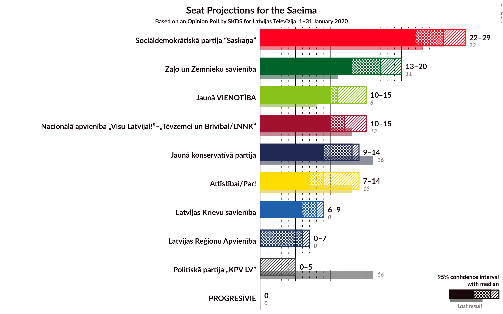
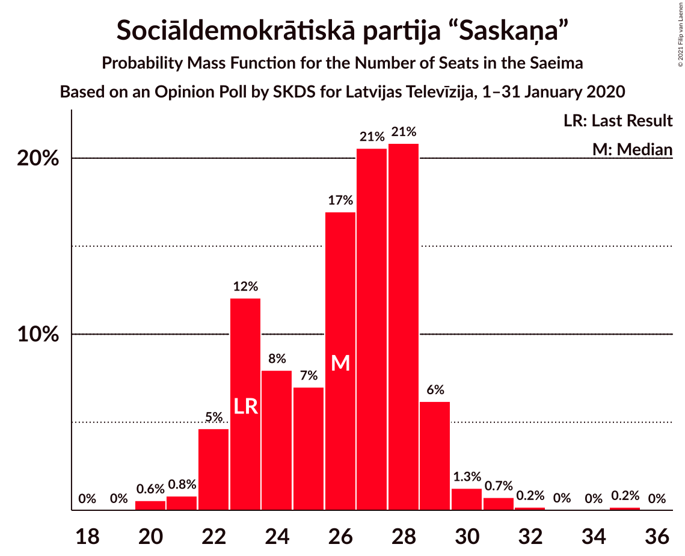
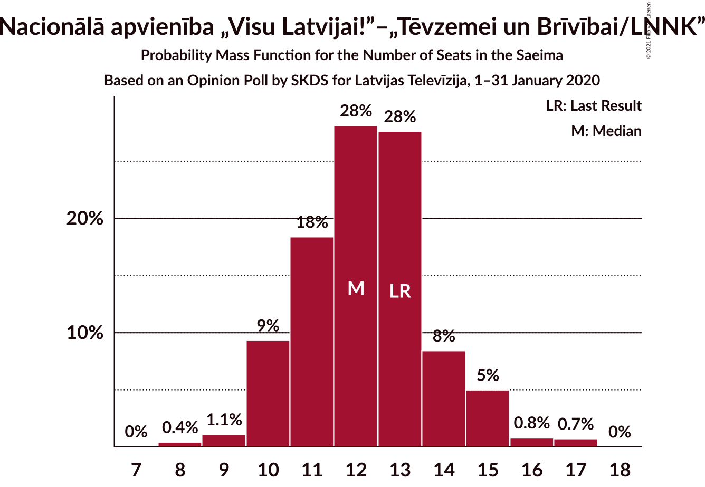
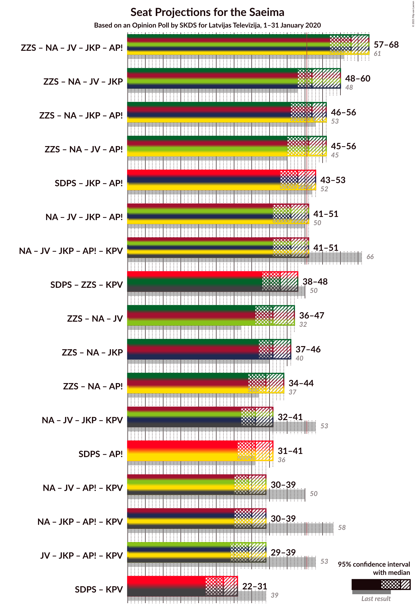
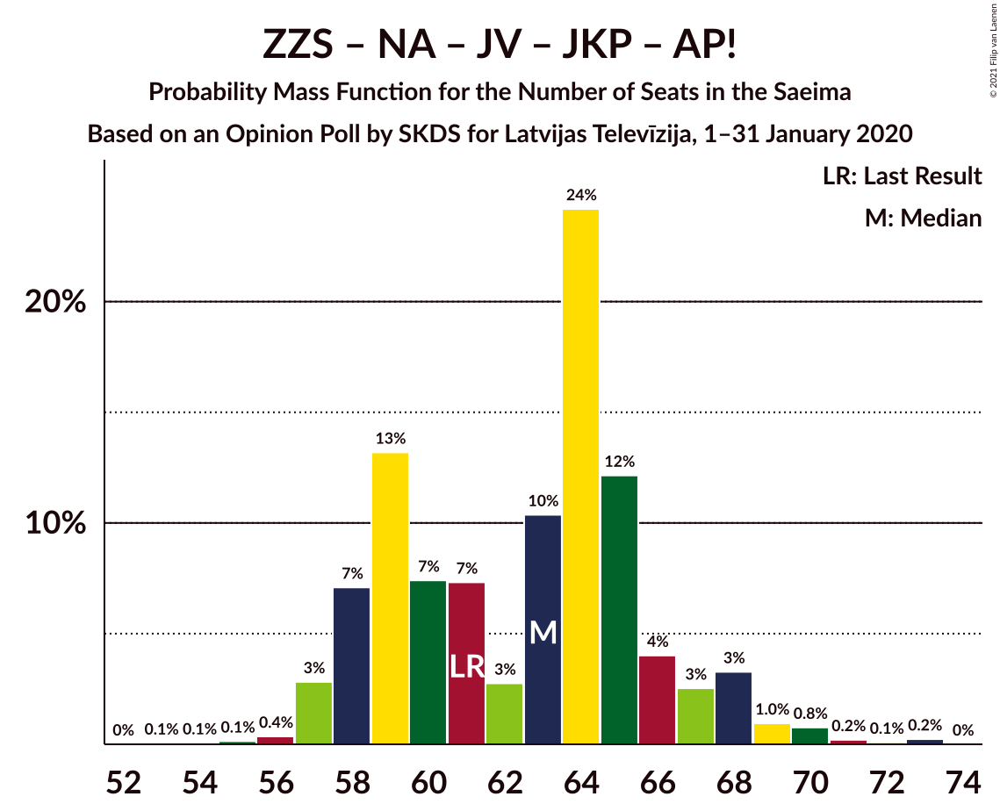
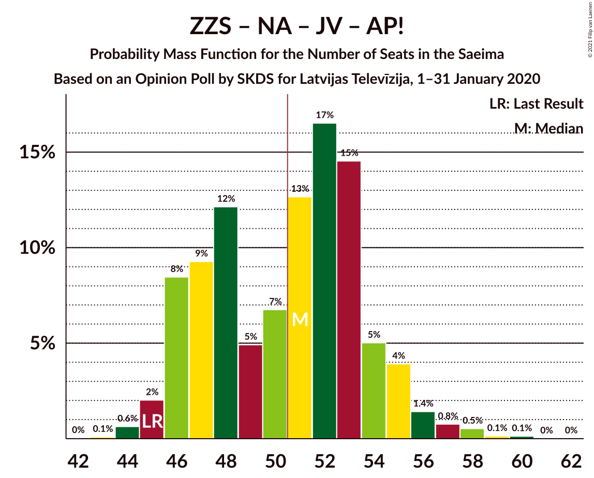
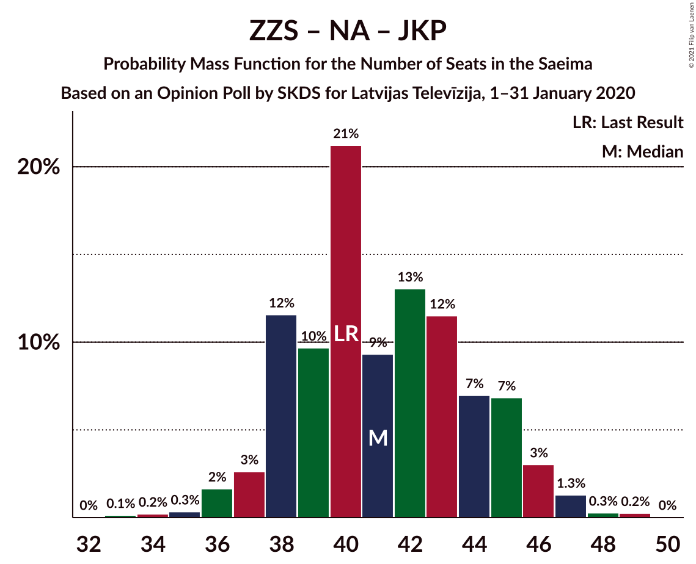
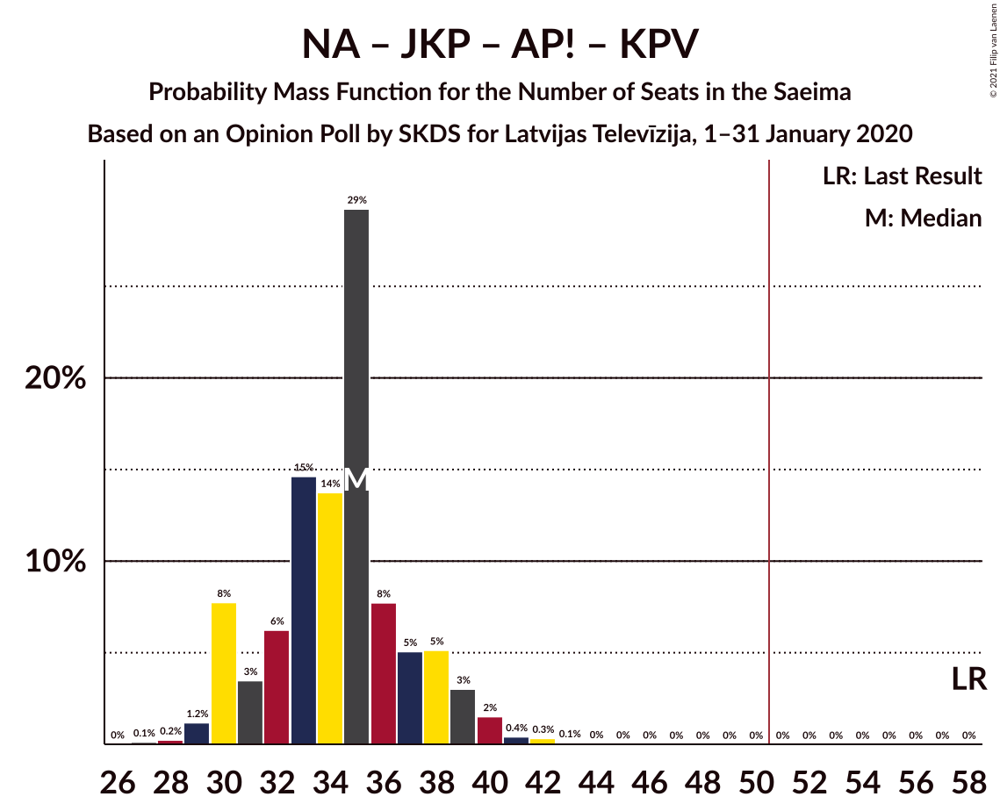

# Opinion Poll by SKDS for Latvijas Televīzija, 1–31 January 2020

<a href="#voting-intentions">Voting Intentions</a> | <a href="#seats">Seats</a> | <a href="#coalitions">Coalitions</a> | <a href="#technical-information">Technical Information</a>

## Voting Intentions

### Confidence Intervals

| Party | Last Result | Poll Result | 80% Confidence Interval | 90% Confidence Interval | 95% Confidence Interval | 99% Confidence Interval |
|:-----:|:-----------:|:-----------:|:-----------------------:|:-----------------------:|:-----------------------:|:-----------------------:|
| Sociāldemokrātiskā partija “Saskaņa” | 19.8% | 23.6% | 21.5–25.8% |21.0–26.4% |20.5–27.0% |19.5–28.0% |
| Zaļo un Zemnieku savienība | 9.9% | 15.0% | 13.4–17.0% |12.9–17.5% |12.5–18.0% |11.8–18.9% |
| Nacionālā apvienība „Visu Latvijai!”–„Tēvzemei un Brīvībai/LNNK” | 11.0% | 10.9% | 9.5–12.7% |9.1–13.1% |8.8–13.6% |8.1–14.4% |
| Jaunā konservatīvā partija | 13.6% | 10.6% | 9.2–12.3% |8.8–12.8% |8.5–13.2% |7.9–14.1% |
| Jaunā VIENOTĪBA | 6.7% | 10.6% | 9.2–12.3% |8.8–12.8% |8.5–13.2% |7.9–14.1% |
| Attīstībai/Par! | 12.0% | 9.4% | 8.1–11.0% |7.7–11.5% |7.4–11.9% |6.8–12.7% |
| Latvijas Krievu savienība | 3.2% | 6.8% | 5.7–8.3% |5.4–8.7% |5.2–9.0% |4.7–9.8% |
| Latvijas Reģionu Apvienība | 4.1% | 5.0% | 4.1–6.3% |3.8–6.6% |3.6–7.0% |3.2–7.6% |
| Politiskā partija „KPV LV” | 14.2% | 3.5% | 2.7–4.6% |2.5–4.9% |2.3–5.2% |2.0–5.8% |
| PROGRESĪVIE | 2.6% | 3.2% | 2.5–4.3% |2.3–4.6% |2.1–4.8% |1.8–5.4% |

*Note:* The poll result column reflects the actual value used in the calculations. Published results may vary slightly, and in addition be rounded to fewer digits.

## Seats

### Confidence Intervals

| Party | Last Result | Median | 80% Confidence Interval | 90% Confidence Interval | 95% Confidence Interval | 99% Confidence Interval |
|:-----:|:-----------:|:------:|:-----------------------:|:-----------------------:|:-----------------------:|:-----------------------:|
| <a href="#sociāldemokrātiskā-partija-“saskaņa”">Sociāldemokrātiskā partija “Saskaņa”</a> | 23 | 27 | 25–28 |24–28 |23–29 |21–35 |
| <a href="#zaļo-un-zemnieku-savienība">Zaļo un Zemnieku savienība</a> | 11 | 17 | 14–19 |14–20 |14–20 |13–20 |
| <a href="#nacionālā-apvienība-„visu-latvijai!”–„tēvzemei-un-brīvībai/lnnk”">Nacionālā apvienība „Visu Latvijai!”–„Tēvzemei un Brīvībai/LNNK”</a> | 13 | 12 | 10–13 |10–14 |10–15 |9–16 |
| <a href="#jaunā-konservatīvā-partija">Jaunā konservatīvā partija</a> | 16 | 12 | 11–13 |11–13 |10–13 |9–15 |
| <a href="#jaunā-vienotība">Jaunā VIENOTĪBA</a> | 8 | 11 | 10–12 |10–13 |10–14 |8–15 |
| <a href="#attīstībai/par!">Attīstībai/Par!</a> | 13 | 9 | 9–13 |8–13 |8–14 |7–15 |
| <a href="#latvijas-krievu-savienība">Latvijas Krievu savienība</a> | 0 | 8 | 6–9 |6–10 |0–10 |0–10 |
| <a href="#latvijas-reģionu-apvienība">Latvijas Reģionu Apvienība</a> | 0 | 6 | 0–7 |0–7 |0–7 |0–7 |
| <a href="#politiskā-partija-„kpv-lv”">Politiskā partija „KPV LV”</a> | 16 | 0 | 0 |0 |0 |0–6 |
| <a href="#progresīvie">PROGRESĪVIE</a> | 0 | 0 | 0 |0 |0 |0–6 |

### Sociāldemokrātiskā partija “Saskaņa”

*For a full overview of the results for this party, see the [Sociāldemokrātiskā partija “Saskaņa”](party-sociāldemokrātiskāpartija“saskaņa”.html) page.*

| Number of Seats | Probability | Accumulated | Special Marks |
|:---------------:|:-----------:|:-----------:|:-------------:|
| 20 | 0.1% | 100% |  |
| 21 | 0.6% | 99.9% |  |
| 22 | 1.1% | 99.3% |  |
| 23 | 2% | 98% | Last Result |
| 24 | 5% | 96% |  |
| 25 | 2% | 92% |  |
| 26 | 13% | 90% |  |
| 27 | 45% | 77% | Median |
| 28 | 28% | 32% |  |
| 29 | 2% | 4% |  |
| 30 | 0.5% | 2% |  |
| 31 | 0.1% | 1.5% |  |
| 32 | 0% | 1.3% |  |
| 33 | 0.1% | 1.3% |  |
| 34 | 0% | 1.3% |  |
| 35 | 1.2% | 1.2% |  |
| 36 | 0% | 0% |  |

### Zaļo un Zemnieku savienība

*For a full overview of the results for this party, see the [Zaļo un Zemnieku savienība](party-zaļounzemniekusavienība.html) page.*

| Number of Seats | Probability | Accumulated | Special Marks |
|:---------------:|:-----------:|:-----------:|:-------------:|
| 11 | 0% | 100% | Last Result |
| 12 | 0.2% | 100% |  |
| 13 | 1.0% | 99.8% |  |
| 14 | 23% | 98.8% |  |
| 15 | 8% | 76% |  |
| 16 | 2% | 68% |  |
| 17 | 48% | 66% | Median |
| 18 | 4% | 18% |  |
| 19 | 3% | 13% |  |
| 20 | 9% | 10% |  |
| 21 | 0.3% | 0.4% |  |
| 22 | 0.1% | 0.1% |  |
| 23 | 0% | 0% |  |

### Nacionālā apvienība „Visu Latvijai!”–„Tēvzemei un Brīvībai/LNNK”

*For a full overview of the results for this party, see the [Nacionālā apvienība „Visu Latvijai!”–„Tēvzemei un Brīvībai/LNNK”](party-nacionālāapvienība„visulatvijai”–„tēvzemeiunbrīvībailnnk”.html) page.*

| Number of Seats | Probability | Accumulated | Special Marks |
|:---------------:|:-----------:|:-----------:|:-------------:|
| 7 | 0% | 100% |  |
| 8 | 0.1% | 99.9% |  |
| 9 | 0.4% | 99.8% |  |
| 10 | 41% | 99.4% |  |
| 11 | 4% | 58% |  |
| 12 | 31% | 54% | Median |
| 13 | 18% | 23% | Last Result |
| 14 | 3% | 6% |  |
| 15 | 2% | 3% |  |
| 16 | 0.5% | 0.7% |  |
| 17 | 0.2% | 0.2% |  |
| 18 | 0% | 0% |  |

### Jaunā konservatīvā partija

*For a full overview of the results for this party, see the [Jaunā konservatīvā partija](party-jaunākonservatīvāpartija.html) page.*

| Number of Seats | Probability | Accumulated | Special Marks |
|:---------------:|:-----------:|:-----------:|:-------------:|
| 7 | 0.2% | 100% |  |
| 8 | 0.3% | 99.8% |  |
| 9 | 2% | 99.6% |  |
| 10 | 2% | 98% |  |
| 11 | 37% | 96% |  |
| 12 | 10% | 59% | Median |
| 13 | 46% | 49% |  |
| 14 | 0.5% | 2% |  |
| 15 | 2% | 2% |  |
| 16 | 0.1% | 0.3% | Last Result |
| 17 | 0.1% | 0.1% |  |
| 18 | 0% | 0% |  |

### Jaunā VIENOTĪBA

*For a full overview of the results for this party, see the [Jaunā VIENOTĪBA](party-jaunāvienotība.html) page.*

| Number of Seats | Probability | Accumulated | Special Marks |
|:---------------:|:-----------:|:-----------:|:-------------:|
| 8 | 0.7% | 100% | Last Result |
| 9 | 0.6% | 99.3% |  |
| 10 | 12% | 98.7% |  |
| 11 | 58% | 86% | Median |
| 12 | 21% | 28% |  |
| 13 | 2% | 7% |  |
| 14 | 3% | 5% |  |
| 15 | 1.0% | 1.2% |  |
| 16 | 0.2% | 0.2% |  |
| 17 | 0% | 0.1% |  |
| 18 | 0% | 0% |  |

### Attīstībai/Par!

*For a full overview of the results for this party, see the [Attīstībai/Par!](party-attīstībaipar.html) page.*

| Number of Seats | Probability | Accumulated | Special Marks |
|:---------------:|:-----------:|:-----------:|:-------------:|
| 7 | 2% | 100% |  |
| 8 | 8% | 98% |  |
| 9 | 70% | 90% | Median |
| 10 | 3% | 21% |  |
| 11 | 3% | 18% |  |
| 12 | 2% | 15% |  |
| 13 | 8% | 13% | Last Result |
| 14 | 3% | 5% |  |
| 15 | 2% | 2% |  |
| 16 | 0% | 0% |  |

### Latvijas Krievu savienība

*For a full overview of the results for this party, see the [Latvijas Krievu savienība](party-latvijaskrievusavienība.html) page.*

| Number of Seats | Probability | Accumulated | Special Marks |
|:---------------:|:-----------:|:-----------:|:-------------:|
| 0 | 3% | 100% | Last Result |
| 1 | 0% | 97% |  |
| 2 | 0% | 97% |  |
| 3 | 0% | 97% |  |
| 4 | 0% | 97% |  |
| 5 | 0.2% | 97% |  |
| 6 | 8% | 97% |  |
| 7 | 23% | 89% |  |
| 8 | 52% | 66% | Median |
| 9 | 10% | 15% |  |
| 10 | 5% | 5% |  |
| 11 | 0.3% | 0.3% |  |
| 12 | 0% | 0% |  |

### Latvijas Reģionu Apvienība

*For a full overview of the results for this party, see the [Latvijas Reģionu Apvienība](party-latvijasreģionuapvienība.html) page.*

| Number of Seats | Probability | Accumulated | Special Marks |
|:---------------:|:-----------:|:-----------:|:-------------:|
| 0 | 30% | 100% | Last Result |
| 1 | 0% | 70% |  |
| 2 | 0% | 70% |  |
| 3 | 0% | 70% |  |
| 4 | 0% | 70% |  |
| 5 | 0% | 70% |  |
| 6 | 49% | 70% | Median |
| 7 | 20% | 21% |  |
| 8 | 0.2% | 0.3% |  |
| 9 | 0.1% | 0.2% |  |
| 10 | 0% | 0% |  |

### Politiskā partija „KPV LV”

*For a full overview of the results for this party, see the [Politiskā partija „KPV LV”](party-politiskāpartija„kpvlv”.html) page.*

| Number of Seats | Probability | Accumulated | Special Marks |
|:---------------:|:-----------:|:-----------:|:-------------:|
| 0 | 98% | 100% | Median |
| 1 | 0% | 2% |  |
| 2 | 0% | 2% |  |
| 3 | 0% | 2% |  |
| 4 | 0% | 2% |  |
| 5 | 0.1% | 2% |  |
| 6 | 2% | 2% |  |
| 7 | 0% | 0% |  |
| 8 | 0% | 0% |  |
| 9 | 0% | 0% |  |
| 10 | 0% | 0% |  |
| 11 | 0% | 0% |  |
| 12 | 0% | 0% |  |
| 13 | 0% | 0% |  |
| 14 | 0% | 0% |  |
| 15 | 0% | 0% |  |
| 16 | 0% | 0% | Last Result |

### PROGRESĪVIE

*For a full overview of the results for this party, see the [PROGRESĪVIE](party-progresīvie.html) page.*

| Number of Seats | Probability | Accumulated | Special Marks |
|:---------------:|:-----------:|:-----------:|:-------------:|
| 0 | 98% | 100% | Last Result, Median |
| 1 | 0% | 2% |  |
| 2 | 0% | 2% |  |
| 3 | 0% | 2% |  |
| 4 | 0% | 2% |  |
| 5 | 0.1% | 2% |  |
| 6 | 2% | 2% |  |
| 7 | 0.1% | 0.1% |  |
| 8 | 0% | 0% |  |

## Coalitions

### Confidence Intervals

| Coalition | Last Result | Median | Majority? | 80% Confidence Interval | 90% Confidence Interval | 95% Confidence Interval | 99% Confidence Interval |
|:---------:|:-----------:|:------:|:---------:|:-----------------------:|:-----------------------:|:-----------------------:|:-----------------------:|
| Zaļo un Zemnieku savienība – Nacionālā apvienība „Visu Latvijai!”–„Tēvzemei un Brīvībai/LNNK” – Jaunā VIENOTĪBA – Jaunā konservatīvā partija – Attīstībai/Par! | 61 | 59 | 100% | 58–65 | 58–67 | 58–69 | 57–73 |
| Zaļo un Zemnieku savienība – Nacionālā apvienība „Visu Latvijai!”–„Tēvzemei un Brīvībai/LNNK” – Jaunā VIENOTĪBA – Jaunā konservatīvā partija | 48 | 50 | 39% | 49–56 | 49–56 | 49–59 | 47–59 |
| Zaļo un Zemnieku savienība – Nacionālā apvienība „Visu Latvijai!”–„Tēvzemei un Brīvībai/LNNK” – Jaunā konservatīvā partija – Attīstībai/Par! | 53 | 48 | 31% | 47–55 | 47–55 | 47–56 | 45–62 |
| Zaļo un Zemnieku savienība – Nacionālā apvienība „Visu Latvijai!”–„Tēvzemei un Brīvībai/LNNK” – Jaunā VIENOTĪBA – Attīstībai/Par! | 45 | 48 | 29% | 46–53 | 46–55 | 46–56 | 45–60 |
| Sociāldemokrātiskā partija “Saskaņa” – Jaunā konservatīvā partija – Attīstībai/Par! | 52 | 49 | 15% | 47–51 | 46–52 | 44–55 | 42–57 |
| Nacionālā apvienība „Visu Latvijai!”–„Tēvzemei un Brīvībai/LNNK” – Jaunā VIENOTĪBA – Jaunā konservatīvā partija – Attīstībai/Par! – Politiskā partija „KPV LV” | 66 | 45 | 3% | 41–48 | 41–50 | 41–52 | 41–54 |
| Nacionālā apvienība „Visu Latvijai!”–„Tēvzemei un Brīvībai/LNNK” – Jaunā VIENOTĪBA – Jaunā konservatīvā partija – Attīstībai/Par! | 50 | 45 | 2% | 41–48 | 41–50 | 41–50 | 41–54 |
| Sociāldemokrātiskā partija “Saskaņa” – Zaļo un Zemnieku savienība – Politiskā partija „KPV LV” | 50 | 44 | 1.4% | 41–46 | 41–47 | 40–48 | 36–55 |
| Zaļo un Zemnieku savienība – Nacionālā apvienība „Visu Latvijai!”–„Tēvzemei un Brīvībai/LNNK” – Jaunā konservatīvā partija | 40 | 39 | 0% | 38–45 | 38–45 | 38–46 | 36–48 |
| Zaļo un Zemnieku savienība – Nacionālā apvienība „Visu Latvijai!”–„Tēvzemei un Brīvībai/LNNK” – Jaunā VIENOTĪBA | 32 | 39 | 0% | 37–43 | 37–43 | 36–46 | 35–47 |
| Zaļo un Zemnieku savienība – Nacionālā apvienība „Visu Latvijai!”–„Tēvzemei un Brīvībai/LNNK” – Attīstībai/Par! | 37 | 36 | 0% | 35–43 | 35–43 | 35–44 | 34–47 |
| Sociāldemokrātiskā partija “Saskaņa” – Attīstībai/Par! | 36 | 36 | 0% | 36–39 | 34–41 | 33–41 | 30–44 |
| Nacionālā apvienība „Visu Latvijai!”–„Tēvzemei un Brīvībai/LNNK” – Jaunā VIENOTĪBA – Jaunā konservatīvā partija – Politiskā partija „KPV LV” | 53 | 35 | 0% | 32–37 | 32–40 | 32–41 | 32–42 |
| Nacionālā apvienība „Visu Latvijai!”–„Tēvzemei un Brīvībai/LNNK” – Jaunā konservatīvā partija – Attīstībai/Par! – Politiskā partija „KPV LV” | 58 | 34 | 0% | 30–38 | 30–39 | 30–40 | 30–42 |
| Jaunā VIENOTĪBA – Jaunā konservatīvā partija – Attīstībai/Par! – Politiskā partija „KPV LV” | 53 | 33 | 0% | 31–35 | 31–38 | 31–39 | 28–41 |
| Nacionālā apvienība „Visu Latvijai!”–„Tēvzemei un Brīvībai/LNNK” – Jaunā VIENOTĪBA – Attīstībai/Par! – Politiskā partija „KPV LV” | 50 | 32 | 0% | 30–36 | 30–38 | 30–39 | 29–41 |
| Sociāldemokrātiskā partija “Saskaņa” – Politiskā partija „KPV LV” | 39 | 27 | 0% | 26–28 | 24–29 | 23–30 | 22–35 |

### Zaļo un Zemnieku savienība – Nacionālā apvienība „Visu Latvijai!”–„Tēvzemei un Brīvībai/LNNK” – Jaunā VIENOTĪBA – Jaunā konservatīvā partija – Attīstībai/Par!

| Number of Seats | Probability | Accumulated | Special Marks |
|:---------------:|:-----------:|:-----------:|:-------------:|
| 54 | 0% | 100% |  |
| 55 | 0% | 99.9% |  |
| 56 | 0.1% | 99.9% |  |
| 57 | 0.6% | 99.8% |  |
| 58 | 18% | 99.1% |  |
| 59 | 41% | 81% |  |
| 60 | 6% | 40% |  |
| 61 | 3% | 33% | Last Result, Median |
| 62 | 1.4% | 31% |  |
| 63 | 3% | 29% |  |
| 64 | 4% | 26% |  |
| 65 | 16% | 23% |  |
| 66 | 0.4% | 6% |  |
| 67 | 2% | 6% |  |
| 68 | 1.3% | 4% |  |
| 69 | 0.9% | 3% |  |
| 70 | 0.7% | 2% |  |
| 71 | 0% | 1.1% |  |
| 72 | 0.2% | 1.1% |  |
| 73 | 0.9% | 0.9% |  |
| 74 | 0% | 0% |  |

### Zaļo un Zemnieku savienība – Nacionālā apvienība „Visu Latvijai!”–„Tēvzemei un Brīvībai/LNNK” – Jaunā VIENOTĪBA – Jaunā konservatīvā partija

| Number of Seats | Probability | Accumulated | Special Marks |
|:---------------:|:-----------:|:-----------:|:-------------:|
| 45 | 0.1% | 100% |  |
| 46 | 0.3% | 99.9% |  |
| 47 | 0.2% | 99.6% |  |
| 48 | 0.3% | 99.3% | Last Result |
| 49 | 19% | 99.1% |  |
| 50 | 41% | 80% |  |
| 51 | 3% | 39% | Majority |
| 52 | 16% | 36% | Median |
| 53 | 4% | 20% |  |
| 54 | 2% | 16% |  |
| 55 | 2% | 14% |  |
| 56 | 8% | 11% |  |
| 57 | 0.3% | 4% |  |
| 58 | 0.7% | 3% |  |
| 59 | 2% | 3% |  |
| 60 | 0.2% | 0.5% |  |
| 61 | 0.2% | 0.2% |  |
| 62 | 0.1% | 0.1% |  |
| 63 | 0% | 0% |  |

### Zaļo un Zemnieku savienība – Nacionālā apvienība „Visu Latvijai!”–„Tēvzemei un Brīvībai/LNNK” – Jaunā konservatīvā partija – Attīstībai/Par!

| Number of Seats | Probability | Accumulated | Special Marks |
|:---------------:|:-----------:|:-----------:|:-------------:|
| 43 | 0.1% | 100% |  |
| 44 | 0.2% | 99.9% |  |
| 45 | 0.5% | 99.7% |  |
| 46 | 0.6% | 99.2% |  |
| 47 | 37% | 98.6% |  |
| 48 | 22% | 62% |  |
| 49 | 7% | 39% |  |
| 50 | 1.3% | 32% | Median |
| 51 | 3% | 31% | Majority |
| 52 | 2% | 27% |  |
| 53 | 3% | 26% | Last Result |
| 54 | 10% | 23% |  |
| 55 | 9% | 13% |  |
| 56 | 3% | 4% |  |
| 57 | 0.3% | 1.3% |  |
| 58 | 0% | 1.0% |  |
| 59 | 0% | 1.0% |  |
| 60 | 0.1% | 1.0% |  |
| 61 | 0% | 0.9% |  |
| 62 | 0.9% | 0.9% |  |
| 63 | 0% | 0% |  |

### Zaļo un Zemnieku savienība – Nacionālā apvienība „Visu Latvijai!”–„Tēvzemei un Brīvībai/LNNK” – Jaunā VIENOTĪBA – Attīstībai/Par!

| Number of Seats | Probability | Accumulated | Special Marks |
|:---------------:|:-----------:|:-----------:|:-------------:|
| 43 | 0.1% | 100% |  |
| 44 | 0.1% | 99.8% |  |
| 45 | 2% | 99.7% | Last Result |
| 46 | 21% | 98% |  |
| 47 | 23% | 77% |  |
| 48 | 23% | 55% |  |
| 49 | 1.4% | 31% | Median |
| 50 | 1.4% | 30% |  |
| 51 | 5% | 29% | Majority |
| 52 | 9% | 24% |  |
| 53 | 7% | 15% |  |
| 54 | 2% | 8% |  |
| 55 | 2% | 5% |  |
| 56 | 0.6% | 3% |  |
| 57 | 0.5% | 2% |  |
| 58 | 1.0% | 2% |  |
| 59 | 0.4% | 0.9% |  |
| 60 | 0.5% | 0.5% |  |
| 61 | 0% | 0% |  |

### Sociāldemokrātiskā partija “Saskaņa” – Jaunā konservatīvā partija – Attīstībai/Par!

| Number of Seats | Probability | Accumulated | Special Marks |
|:---------------:|:-----------:|:-----------:|:-------------:|
| 40 | 0.1% | 100% |  |
| 41 | 0.1% | 99.9% |  |
| 42 | 0.9% | 99.7% |  |
| 43 | 0.8% | 98.8% |  |
| 44 | 1.0% | 98% |  |
| 45 | 1.5% | 97% |  |
| 46 | 2% | 96% |  |
| 47 | 20% | 94% |  |
| 48 | 22% | 74% | Median |
| 49 | 33% | 52% |  |
| 50 | 5% | 19% |  |
| 51 | 9% | 15% | Majority |
| 52 | 0.8% | 5% | Last Result |
| 53 | 0.3% | 5% |  |
| 54 | 2% | 4% |  |
| 55 | 0.1% | 3% |  |
| 56 | 0.9% | 2% |  |
| 57 | 1.5% | 2% |  |
| 58 | 0% | 0% |  |

### Nacionālā apvienība „Visu Latvijai!”–„Tēvzemei un Brīvībai/LNNK” – Jaunā VIENOTĪBA – Jaunā konservatīvā partija – Attīstībai/Par! – Politiskā partija „KPV LV”

| Number of Seats | Probability | Accumulated | Special Marks |
|:---------------:|:-----------:|:-----------:|:-------------:|
| 39 | 0.1% | 100% |  |
| 40 | 0.2% | 99.9% |  |
| 41 | 17% | 99.7% |  |
| 42 | 20% | 83% |  |
| 43 | 3% | 63% |  |
| 44 | 2% | 60% | Median |
| 45 | 37% | 58% |  |
| 46 | 1.3% | 21% |  |
| 47 | 0.5% | 20% |  |
| 48 | 11% | 19% |  |
| 49 | 2% | 9% |  |
| 50 | 4% | 7% |  |
| 51 | 0.9% | 3% | Majority |
| 52 | 0.5% | 3% |  |
| 53 | 1.3% | 2% |  |
| 54 | 0.3% | 0.8% |  |
| 55 | 0.4% | 0.5% |  |
| 56 | 0.1% | 0.1% |  |
| 57 | 0% | 0% |  |
| 58 | 0% | 0% |  |
| 59 | 0% | 0% |  |
| 60 | 0% | 0% |  |
| 61 | 0% | 0% |  |
| 62 | 0% | 0% |  |
| 63 | 0% | 0% |  |
| 64 | 0% | 0% |  |
| 65 | 0% | 0% |  |
| 66 | 0% | 0% | Last Result |

### Nacionālā apvienība „Visu Latvijai!”–„Tēvzemei un Brīvībai/LNNK” – Jaunā VIENOTĪBA – Jaunā konservatīvā partija – Attīstībai/Par!

| Number of Seats | Probability | Accumulated | Special Marks |
|:---------------:|:-----------:|:-----------:|:-------------:|
| 38 | 0% | 100% |  |
| 39 | 0.1% | 99.9% |  |
| 40 | 0.2% | 99.9% |  |
| 41 | 17% | 99.6% |  |
| 42 | 20% | 83% |  |
| 43 | 3% | 63% |  |
| 44 | 3% | 59% | Median |
| 45 | 37% | 57% |  |
| 46 | 1.5% | 20% |  |
| 47 | 0.6% | 18% |  |
| 48 | 10% | 17% |  |
| 49 | 1.4% | 7% |  |
| 50 | 3% | 6% | Last Result |
| 51 | 0.4% | 2% | Majority |
| 52 | 0.2% | 2% |  |
| 53 | 1.2% | 2% |  |
| 54 | 0.3% | 0.6% |  |
| 55 | 0.3% | 0.3% |  |
| 56 | 0% | 0% |  |

### Sociāldemokrātiskā partija “Saskaņa” – Zaļo un Zemnieku savienība – Politiskā partija „KPV LV”

| Number of Seats | Probability | Accumulated | Special Marks |
|:---------------:|:-----------:|:-----------:|:-------------:|
| 35 | 0.1% | 100% |  |
| 36 | 0.5% | 99.8% |  |
| 37 | 0.1% | 99.4% |  |
| 38 | 0.5% | 99.3% |  |
| 39 | 1.1% | 98.8% |  |
| 40 | 0.9% | 98% |  |
| 41 | 22% | 97% |  |
| 42 | 6% | 75% |  |
| 43 | 16% | 70% |  |
| 44 | 18% | 53% | Median |
| 45 | 24% | 35% |  |
| 46 | 2% | 11% |  |
| 47 | 7% | 10% |  |
| 48 | 0.7% | 3% |  |
| 49 | 0.4% | 2% |  |
| 50 | 0.1% | 1.4% | Last Result |
| 51 | 0.1% | 1.4% | Majority |
| 52 | 0% | 1.3% |  |
| 53 | 0% | 1.3% |  |
| 54 | 0% | 1.3% |  |
| 55 | 1.2% | 1.2% |  |
| 56 | 0% | 0% |  |

### Zaļo un Zemnieku savienība – Nacionālā apvienība „Visu Latvijai!”–„Tēvzemei un Brīvībai/LNNK” – Jaunā konservatīvā partija

| Number of Seats | Probability | Accumulated | Special Marks |
|:---------------:|:-----------:|:-----------:|:-------------:|
| 34 | 0.1% | 100% |  |
| 35 | 0.3% | 99.9% |  |
| 36 | 0.7% | 99.5% |  |
| 37 | 0.6% | 98.9% |  |
| 38 | 37% | 98% |  |
| 39 | 22% | 61% |  |
| 40 | 3% | 39% | Last Result |
| 41 | 11% | 36% | Median |
| 42 | 12% | 25% |  |
| 43 | 1.2% | 13% |  |
| 44 | 1.0% | 12% |  |
| 45 | 8% | 11% |  |
| 46 | 1.4% | 3% |  |
| 47 | 0.3% | 1.5% |  |
| 48 | 1.1% | 1.1% |  |
| 49 | 0.1% | 0.1% |  |
| 50 | 0% | 0% |  |

### Zaļo un Zemnieku savienība – Nacionālā apvienība „Visu Latvijai!”–„Tēvzemei un Brīvībai/LNNK” – Jaunā VIENOTĪBA

| Number of Seats | Probability | Accumulated | Special Marks |
|:---------------:|:-----------:|:-----------:|:-------------:|
| 32 | 0% | 100% | Last Result |
| 33 | 0.1% | 100% |  |
| 34 | 0.1% | 99.8% |  |
| 35 | 0.7% | 99.8% |  |
| 36 | 2% | 99.1% |  |
| 37 | 21% | 97% |  |
| 38 | 19% | 76% |  |
| 39 | 29% | 58% |  |
| 40 | 11% | 29% | Median |
| 41 | 1.3% | 18% |  |
| 42 | 3% | 17% |  |
| 43 | 9% | 14% |  |
| 44 | 2% | 5% |  |
| 45 | 0.4% | 3% |  |
| 46 | 2% | 3% |  |
| 47 | 0.3% | 0.6% |  |
| 48 | 0.2% | 0.3% |  |
| 49 | 0.1% | 0.1% |  |
| 50 | 0% | 0% |  |

### Zaļo un Zemnieku savienība – Nacionālā apvienība „Visu Latvijai!”–„Tēvzemei un Brīvībai/LNNK” – Attīstībai/Par!

| Number of Seats | Probability | Accumulated | Special Marks |
|:---------------:|:-----------:|:-----------:|:-------------:|
| 31 | 0.1% | 100% |  |
| 32 | 0% | 99.9% |  |
| 33 | 0.1% | 99.9% |  |
| 34 | 0.9% | 99.7% |  |
| 35 | 23% | 98.8% |  |
| 36 | 42% | 76% |  |
| 37 | 3% | 34% | Last Result |
| 38 | 4% | 32% | Median |
| 39 | 1.0% | 28% |  |
| 40 | 4% | 27% |  |
| 41 | 9% | 24% |  |
| 42 | 2% | 15% |  |
| 43 | 9% | 13% |  |
| 44 | 2% | 4% |  |
| 45 | 0.9% | 2% |  |
| 46 | 0.1% | 1.1% |  |
| 47 | 1.0% | 1.0% |  |
| 48 | 0% | 0.1% |  |
| 49 | 0% | 0% |  |

### Sociāldemokrātiskā partija “Saskaņa” – Attīstībai/Par!

| Number of Seats | Probability | Accumulated | Special Marks |
|:---------------:|:-----------:|:-----------:|:-------------:|
| 29 | 0.1% | 100% |  |
| 30 | 0.6% | 99.9% |  |
| 31 | 0.7% | 99.3% |  |
| 32 | 1.0% | 98.6% |  |
| 33 | 2% | 98% |  |
| 34 | 4% | 95% |  |
| 35 | 2% | 92% |  |
| 36 | 50% | 90% | Last Result, Median |
| 37 | 24% | 40% |  |
| 38 | 2% | 16% |  |
| 39 | 8% | 14% |  |
| 40 | 0.7% | 6% |  |
| 41 | 4% | 5% |  |
| 42 | 0.3% | 2% |  |
| 43 | 0% | 1.4% |  |
| 44 | 1.3% | 1.4% |  |
| 45 | 0% | 0.1% |  |
| 46 | 0% | 0.1% |  |
| 47 | 0.1% | 0.1% |  |
| 48 | 0% | 0% |  |

### Nacionālā apvienība „Visu Latvijai!”–„Tēvzemei un Brīvībai/LNNK” – Jaunā VIENOTĪBA – Jaunā konservatīvā partija – Politiskā partija „KPV LV”

| Number of Seats | Probability | Accumulated | Special Marks |
|:---------------:|:-----------:|:-----------:|:-------------:|
| 30 | 0.1% | 100% |  |
| 31 | 0.4% | 99.9% |  |
| 32 | 17% | 99.5% |  |
| 33 | 22% | 82% |  |
| 34 | 2% | 60% |  |
| 35 | 11% | 58% | Median |
| 36 | 32% | 47% |  |
| 37 | 7% | 15% |  |
| 38 | 0.7% | 8% |  |
| 39 | 2% | 7% |  |
| 40 | 2% | 5% |  |
| 41 | 1.0% | 3% |  |
| 42 | 1.4% | 2% |  |
| 43 | 0.3% | 0.4% |  |
| 44 | 0.1% | 0.1% |  |
| 45 | 0% | 0% |  |
| 46 | 0% | 0% |  |
| 47 | 0% | 0% |  |
| 48 | 0% | 0% |  |
| 49 | 0% | 0% |  |
| 50 | 0% | 0% |  |
| 51 | 0% | 0% | Majority |
| 52 | 0% | 0% |  |
| 53 | 0% | 0% | Last Result |

### Nacionālā apvienība „Visu Latvijai!”–„Tēvzemei un Brīvībai/LNNK” – Jaunā konservatīvā partija – Attīstībai/Par! – Politiskā partija „KPV LV”

| Number of Seats | Probability | Accumulated | Special Marks |
|:---------------:|:-----------:|:-----------:|:-------------:|
| 27 | 0.1% | 100% |  |
| 28 | 0.1% | 99.9% |  |
| 29 | 0.2% | 99.8% |  |
| 30 | 36% | 99.6% |  |
| 31 | 2% | 64% |  |
| 32 | 1.2% | 62% |  |
| 33 | 3% | 61% | Median |
| 34 | 37% | 57% |  |
| 35 | 3% | 21% |  |
| 36 | 2% | 18% |  |
| 37 | 3% | 16% |  |
| 38 | 8% | 14% |  |
| 39 | 3% | 5% |  |
| 40 | 1.1% | 3% |  |
| 41 | 0.4% | 2% |  |
| 42 | 1.1% | 1.4% |  |
| 43 | 0.2% | 0.3% |  |
| 44 | 0% | 0.1% |  |
| 45 | 0.1% | 0.1% |  |
| 46 | 0% | 0% |  |
| 47 | 0% | 0% |  |
| 48 | 0% | 0% |  |
| 49 | 0% | 0% |  |
| 50 | 0% | 0% |  |
| 51 | 0% | 0% | Majority |
| 52 | 0% | 0% |  |
| 53 | 0% | 0% |  |
| 54 | 0% | 0% |  |
| 55 | 0% | 0% |  |
| 56 | 0% | 0% |  |
| 57 | 0% | 0% |  |
| 58 | 0% | 0% | Last Result |

### Jaunā VIENOTĪBA – Jaunā konservatīvā partija – Attīstībai/Par! – Politiskā partija „KPV LV”

| Number of Seats | Probability | Accumulated | Special Marks |
|:---------------:|:-----------:|:-----------:|:-------------:|
| 27 | 0.2% | 100% |  |
| 28 | 0.5% | 99.8% |  |
| 29 | 0.2% | 99.3% |  |
| 30 | 0.7% | 99.1% |  |
| 31 | 17% | 98% |  |
| 32 | 27% | 81% | Median |
| 33 | 31% | 54% |  |
| 34 | 2% | 23% |  |
| 35 | 13% | 21% |  |
| 36 | 1.1% | 8% |  |
| 37 | 1.5% | 7% |  |
| 38 | 1.5% | 6% |  |
| 39 | 2% | 4% |  |
| 40 | 1.1% | 2% |  |
| 41 | 0.7% | 1.0% |  |
| 42 | 0.3% | 0.3% |  |
| 43 | 0.1% | 0.1% |  |
| 44 | 0% | 0% |  |
| 45 | 0% | 0% |  |
| 46 | 0% | 0% |  |
| 47 | 0% | 0% |  |
| 48 | 0% | 0% |  |
| 49 | 0% | 0% |  |
| 50 | 0% | 0% |  |
| 51 | 0% | 0% | Majority |
| 52 | 0% | 0% |  |
| 53 | 0% | 0% | Last Result |

### Nacionālā apvienība „Visu Latvijai!”–„Tēvzemei un Brīvībai/LNNK” – Jaunā VIENOTĪBA – Attīstībai/Par! – Politiskā partija „KPV LV”

| Number of Seats | Probability | Accumulated | Special Marks |
|:---------------:|:-----------:|:-----------:|:-------------:|
| 27 | 0% | 100% |  |
| 28 | 0.2% | 99.9% |  |
| 29 | 0.5% | 99.7% |  |
| 30 | 19% | 99.2% |  |
| 31 | 22% | 81% |  |
| 32 | 35% | 59% | Median |
| 33 | 2% | 24% |  |
| 34 | 1.3% | 21% |  |
| 35 | 3% | 20% |  |
| 36 | 9% | 17% |  |
| 37 | 2% | 9% |  |
| 38 | 3% | 6% |  |
| 39 | 0.9% | 3% |  |
| 40 | 0.7% | 2% |  |
| 41 | 1.3% | 2% |  |
| 42 | 0.4% | 0.5% |  |
| 43 | 0% | 0.1% |  |
| 44 | 0% | 0.1% |  |
| 45 | 0.1% | 0.1% |  |
| 46 | 0% | 0% |  |
| 47 | 0% | 0% |  |
| 48 | 0% | 0% |  |
| 49 | 0% | 0% |  |
| 50 | 0% | 0% | Last Result |

### Sociāldemokrātiskā partija “Saskaņa” – Politiskā partija „KPV LV”

| Number of Seats | Probability | Accumulated | Special Marks |
|:---------------:|:-----------:|:-----------:|:-------------:|
| 20 | 0.1% | 100% |  |
| 21 | 0.2% | 99.9% |  |
| 22 | 1.0% | 99.7% |  |
| 23 | 1.3% | 98.7% |  |
| 24 | 5% | 97% |  |
| 25 | 2% | 93% |  |
| 26 | 12% | 91% |  |
| 27 | 45% | 79% | Median |
| 28 | 28% | 33% |  |
| 29 | 2% | 6% |  |
| 30 | 0.7% | 3% |  |
| 31 | 0.6% | 2% |  |
| 32 | 0.3% | 2% |  |
| 33 | 0.2% | 1.5% |  |
| 34 | 0% | 1.3% |  |
| 35 | 1.2% | 1.2% |  |
| 36 | 0% | 0% |  |
| 37 | 0% | 0% |  |
| 38 | 0% | 0% |  |
| 39 | 0% | 0% | Last Result |

## Technical Information

### Opinion Poll

+ **Polling firm:** SKDS
+ **Commissioner(s):** Latvijas Televīzija
+ **Fieldwork period:** 1–31 January 2020

### Calculations

+ **Sample size:** 658
+ **Simulations done:** 131,072
+ **Error estimate:** 3.06%

