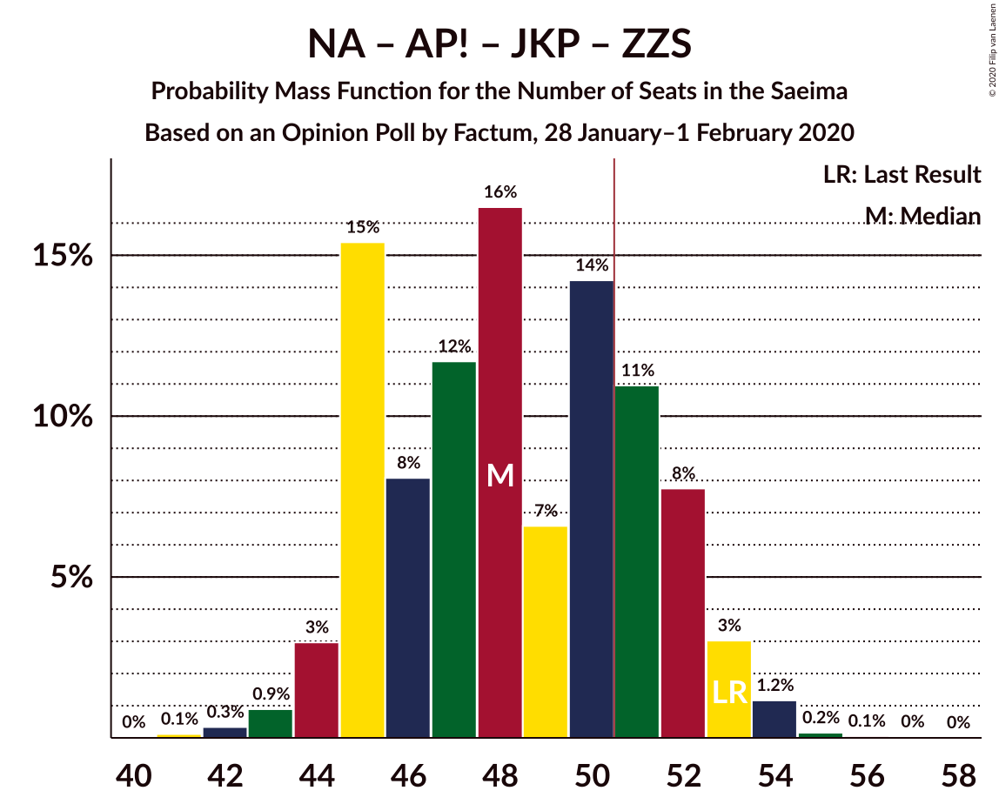
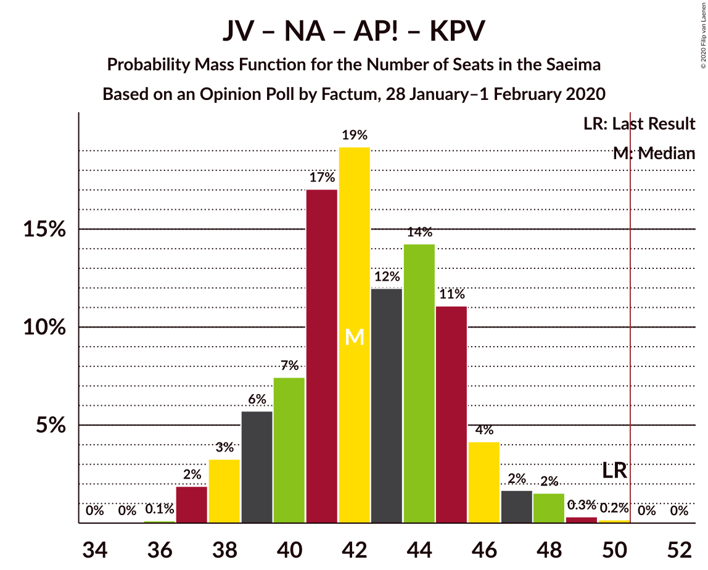

# Opinion Poll by Factum, 28 January–1 February 2020

<a href="#voting-intentions">Voting Intentions</a> | <a href="#seats">Seats</a> | <a href="#coalitions">Coalitions</a> | <a href="#technical-information">Technical Information</a>

## Voting Intentions

### Confidence Intervals

| Party | Last Result | Poll Result | 80% Confidence Interval | 90% Confidence Interval | 95% Confidence Interval | 99% Confidence Interval |
|:-----:|:-----------:|:-----------:|:-----------------------:|:-----------------------:|:-----------------------:|:-----------------------:|
| Sociāldemokrātiskā partija “Saskaņa” | 19.8% | 21.1% | 19.2–23.2% |18.6–23.7% |18.2–24.3% |17.3–25.3% |
| Jaunā VIENOTĪBA | 6.7% | 15.9% | 14.3–17.9% |13.8–18.4% |13.4–18.9% |12.6–19.8% |
| Nacionālā apvienība „Visu Latvijai!”–„Tēvzemei un Brīvībai/LNNK” | 11.0% | 12.0% | 10.5–13.7% |10.1–14.2% |9.8–14.6% |9.1–15.5% |
| Jaunā konservatīvā partija | 13.6% | 11.0% | 9.6–12.7% |9.2–13.1% |8.8–13.5% |8.2–14.4% |
| Attīstībai/Par! | 12.0% | 11.0% | 9.6–12.7% |9.2–13.1% |8.8–13.5% |8.2–14.4% |
| Zaļo un Zemnieku savienība | 9.9% | 9.9% | 8.6–11.6% |8.2–12.0% |7.9–12.4% |7.3–13.2% |
| PROGRESĪVIE | 2.6% | 7.0% | 5.9–8.4% |5.6–8.8% |5.3–9.2% |4.8–9.9% |
| Latvijas Reģionu Apvienība | 4.1% | 5.0% | 4.1–6.2% |3.8–6.6% |3.6–6.9% |3.2–7.5% |
| Latvijas Krievu savienība | 3.2% | 3.1% | 2.4–4.1% |2.2–4.4% |2.0–4.6% |1.7–5.2% |
| Politiskā partija „KPV LV” | 14.2% | 2.0% | 1.5–2.9% |1.3–3.2% |1.2–3.4% |1.0–3.9% |

*Note:* The poll result column reflects the actual value used in the calculations. Published results may vary slightly, and in addition be rounded to fewer digits.

## Seats

### Confidence Intervals

| Party | Last Result | Median | 80% Confidence Interval | 90% Confidence Interval | 95% Confidence Interval | 99% Confidence Interval |
|:-----:|:-----------:|:------:|:-----------------------:|:-----------------------:|:-----------------------:|:-----------------------:|
| <a href="#sociāldemokrātiskā-partija-“saskaņa”">Sociāldemokrātiskā partija “Saskaņa”</a> | 23 | 24 | 22–27 |21–28 |20–28 |19–28 |
| <a href="#jaunā-vienotība">Jaunā VIENOTĪBA</a> | 8 | 18 | 16–18 |15–19 |15–20 |13–22 |
| <a href="#nacionālā-apvienība-„visu-latvijai!”–„tēvzemei-un-brīvībai/lnnk”">Nacionālā apvienība „Visu Latvijai!”–„Tēvzemei un Brīvībai/LNNK”</a> | 13 | 13 | 11–14 |11–16 |11–16 |11–17 |
| <a href="#jaunā-konservatīvā-partija">Jaunā konservatīvā partija</a> | 16 | 13 | 10–13 |9–13 |9–14 |9–16 |
| <a href="#attīstībai/par!">Attīstībai/Par!</a> | 13 | 12 | 10–14 |10–14 |10–15 |8–16 |
| <a href="#zaļo-un-zemnieku-savienība">Zaļo un Zemnieku savienība</a> | 11 | 11 | 11–13 |10–14 |9–14 |7–15 |
| <a href="#progresīvie">PROGRESĪVIE</a> | 0 | 7 | 7–8 |6–9 |6–10 |0–11 |
| <a href="#latvijas-reģionu-apvienība">Latvijas Reģionu Apvienība</a> | 0 | 6 | 0–6 |0–7 |0–7 |0–7 |
| <a href="#latvijas-krievu-savienība">Latvijas Krievu savienība</a> | 0 | 0 | 0 |0 |0 |0–5 |
| <a href="#politiskā-partija-„kpv-lv”">Politiskā partija „KPV LV”</a> | 16 | 0 | 0 |0 |0 |0 |

### Sociāldemokrātiskā partija “Saskaņa”

*For a full overview of the results for this party, see the [Sociāldemokrātiskā partija “Saskaņa”](party-sociāldemokrātiskāpartija“saskaņa”.html) page.*

| Number of Seats | Probability | Accumulated | Special Marks |
|:---------------:|:-----------:|:-----------:|:-------------:|
| 18 | 0.2% | 100% |  |
| 19 | 0.8% | 99.8% |  |
| 20 | 2% | 99.0% |  |
| 21 | 2% | 97% |  |
| 22 | 15% | 95% |  |
| 23 | 23% | 80% | Last Result |
| 24 | 28% | 58% | Median |
| 25 | 8% | 29% |  |
| 26 | 5% | 22% |  |
| 27 | 11% | 16% |  |
| 28 | 5% | 5% |  |
| 29 | 0.4% | 0.4% |  |
| 30 | 0% | 0% |  |

### Jaunā VIENOTĪBA

*For a full overview of the results for this party, see the [Jaunā VIENOTĪBA](party-jaunāvienotība.html) page.*

| Number of Seats | Probability | Accumulated | Special Marks |
|:---------------:|:-----------:|:-----------:|:-------------:|
| 8 | 0% | 100% | Last Result |
| 9 | 0% | 100% |  |
| 10 | 0% | 100% |  |
| 11 | 0.1% | 100% |  |
| 12 | 0.2% | 99.9% |  |
| 13 | 0.4% | 99.7% |  |
| 14 | 0.7% | 99.4% |  |
| 15 | 7% | 98.7% |  |
| 16 | 16% | 91% |  |
| 17 | 24% | 76% |  |
| 18 | 43% | 51% | Median |
| 19 | 5% | 8% |  |
| 20 | 1.1% | 3% |  |
| 21 | 1.2% | 2% |  |
| 22 | 0.5% | 0.9% |  |
| 23 | 0.3% | 0.3% |  |
| 24 | 0.1% | 0.1% |  |
| 25 | 0% | 0% |  |

### Nacionālā apvienība „Visu Latvijai!”–„Tēvzemei un Brīvībai/LNNK”

*For a full overview of the results for this party, see the [Nacionālā apvienība „Visu Latvijai!”–„Tēvzemei un Brīvībai/LNNK”](party-nacionālāapvienība„visulatvijai”–„tēvzemeiunbrīvībailnnk”.html) page.*

| Number of Seats | Probability | Accumulated | Special Marks |
|:---------------:|:-----------:|:-----------:|:-------------:|
| 9 | 0% | 100% |  |
| 10 | 0.4% | 99.9% |  |
| 11 | 13% | 99.5% |  |
| 12 | 27% | 86% |  |
| 13 | 34% | 60% | Last Result, Median |
| 14 | 16% | 25% |  |
| 15 | 4% | 9% |  |
| 16 | 4% | 5% |  |
| 17 | 1.4% | 1.4% |  |
| 18 | 0% | 0% |  |

### Jaunā konservatīvā partija

*For a full overview of the results for this party, see the [Jaunā konservatīvā partija](party-jaunākonservatīvāpartija.html) page.*

| Number of Seats | Probability | Accumulated | Special Marks |
|:---------------:|:-----------:|:-----------:|:-------------:|
| 7 | 0.1% | 100% |  |
| 8 | 0.1% | 99.9% |  |
| 9 | 9% | 99.8% |  |
| 10 | 9% | 90% |  |
| 11 | 20% | 81% |  |
| 12 | 10% | 61% |  |
| 13 | 47% | 52% | Median |
| 14 | 3% | 4% |  |
| 15 | 0.7% | 1.3% |  |
| 16 | 0.4% | 0.6% | Last Result |
| 17 | 0.1% | 0.2% |  |
| 18 | 0.1% | 0.1% |  |
| 19 | 0% | 0% |  |

### Attīstībai/Par!

*For a full overview of the results for this party, see the [Attīstībai/Par!](party-attīstībaipar.html) page.*

| Number of Seats | Probability | Accumulated | Special Marks |
|:---------------:|:-----------:|:-----------:|:-------------:|
| 7 | 0.2% | 100% |  |
| 8 | 0.4% | 99.8% |  |
| 9 | 0.8% | 99.4% |  |
| 10 | 27% | 98.6% |  |
| 11 | 13% | 72% |  |
| 12 | 11% | 59% | Median |
| 13 | 9% | 48% | Last Result |
| 14 | 34% | 39% |  |
| 15 | 2% | 4% |  |
| 16 | 2% | 2% |  |
| 17 | 0% | 0% |  |

### Zaļo un Zemnieku savienība

*For a full overview of the results for this party, see the [Zaļo un Zemnieku savienība](party-zaļounzemniekusavienība.html) page.*

| Number of Seats | Probability | Accumulated | Special Marks |
|:---------------:|:-----------:|:-----------:|:-------------:|
| 6 | 0.1% | 100% |  |
| 7 | 1.1% | 99.9% |  |
| 8 | 0.6% | 98.8% |  |
| 9 | 3% | 98% |  |
| 10 | 3% | 95% |  |
| 11 | 66% | 92% | Last Result, Median |
| 12 | 12% | 26% |  |
| 13 | 7% | 14% |  |
| 14 | 6% | 6% |  |
| 15 | 0.6% | 0.8% |  |
| 16 | 0.1% | 0.2% |  |
| 17 | 0.1% | 0.1% |  |
| 18 | 0% | 0% |  |

### PROGRESĪVIE

*For a full overview of the results for this party, see the [PROGRESĪVIE](party-progresīvie.html) page.*

| Number of Seats | Probability | Accumulated | Special Marks |
|:---------------:|:-----------:|:-----------:|:-------------:|
| 0 | 0.5% | 100% | Last Result |
| 1 | 0% | 99.5% |  |
| 2 | 0% | 99.5% |  |
| 3 | 0% | 99.5% |  |
| 4 | 0% | 99.5% |  |
| 5 | 0.7% | 99.5% |  |
| 6 | 4% | 98.7% |  |
| 7 | 75% | 94% | Median |
| 8 | 13% | 20% |  |
| 9 | 4% | 7% |  |
| 10 | 0.9% | 3% |  |
| 11 | 2% | 2% |  |
| 12 | 0.2% | 0.2% |  |
| 13 | 0% | 0% |  |

### Latvijas Reģionu Apvienība

*For a full overview of the results for this party, see the [Latvijas Reģionu Apvienība](party-latvijasreģionuapvienība.html) page.*

| Number of Seats | Probability | Accumulated | Special Marks |
|:---------------:|:-----------:|:-----------:|:-------------:|
| 0 | 50% | 100% | Last Result |
| 1 | 0% | 50% |  |
| 2 | 0% | 50% |  |
| 3 | 0% | 50% |  |
| 4 | 0% | 50% |  |
| 5 | 0% | 50% |  |
| 6 | 42% | 50% | Median |
| 7 | 8% | 8% |  |
| 8 | 0.1% | 0.1% |  |
| 9 | 0% | 0% |  |

### Latvijas Krievu savienība

*For a full overview of the results for this party, see the [Latvijas Krievu savienība](party-latvijaskrievusavienība.html) page.*

| Number of Seats | Probability | Accumulated | Special Marks |
|:---------------:|:-----------:|:-----------:|:-------------:|
| 0 | 99.5% | 100% | Last Result, Median |
| 1 | 0% | 0.5% |  |
| 2 | 0% | 0.5% |  |
| 3 | 0% | 0.5% |  |
| 4 | 0% | 0.5% |  |
| 5 | 0.2% | 0.5% |  |
| 6 | 0.2% | 0.3% |  |
| 7 | 0.1% | 0.1% |  |
| 8 | 0% | 0% |  |

### Politiskā partija „KPV LV”

*For a full overview of the results for this party, see the [Politiskā partija „KPV LV”](party-politiskāpartija„kpvlv”.html) page.*

| Number of Seats | Probability | Accumulated | Special Marks |
|:---------------:|:-----------:|:-----------:|:-------------:|
| 0 | 100% | 100% | Median |
| 1 | 0% | 0% |  |
| 2 | 0% | 0% |  |
| 3 | 0% | 0% |  |
| 4 | 0% | 0% |  |
| 5 | 0% | 0% |  |
| 6 | 0% | 0% |  |
| 7 | 0% | 0% |  |
| 8 | 0% | 0% |  |
| 9 | 0% | 0% |  |
| 10 | 0% | 0% |  |
| 11 | 0% | 0% |  |
| 12 | 0% | 0% |  |
| 13 | 0% | 0% |  |
| 14 | 0% | 0% |  |
| 15 | 0% | 0% |  |
| 16 | 0% | 0% | Last Result |

## Coalitions

### Confidence Intervals

| Coalition | Last Result | Median | Majority? | 80% Confidence Interval | 90% Confidence Interval | 95% Confidence Interval | 99% Confidence Interval |
|:---------:|:-----------:|:------:|:---------:|:-----------------------:|:-----------------------:|:-----------------------:|:-----------------------:|
| Jaunā VIENOTĪBA – Nacionālā apvienība „Visu Latvijai!”–„Tēvzemei un Brīvībai/LNNK” – Attīstībai/Par! – Jaunā konservatīvā partija – Zaļo un Zemnieku savienība | 61 | 65 | 100% | 62–70 | 62–70 | 61–71 | 60–72 |
| Jaunā VIENOTĪBA – Nacionālā apvienība „Visu Latvijai!”–„Tēvzemei un Brīvībai/LNNK” – Attīstībai/Par! – Jaunā konservatīvā partija | 50 | 54 | 96% | 51–58 | 51–58 | 50–59 | 49–61 |
| Jaunā VIENOTĪBA – Nacionālā apvienība „Visu Latvijai!”–„Tēvzemei un Brīvībai/LNNK” – Attīstībai/Par! – Jaunā konservatīvā partija – Politiskā partija „KPV LV” | 66 | 54 | 96% | 51–58 | 51–58 | 50–59 | 49–61 |
| Jaunā VIENOTĪBA – Nacionālā apvienība „Visu Latvijai!”–„Tēvzemei un Brīvībai/LNNK” – Attīstībai/Par! – Zaļo un Zemnieku savienība | 45 | 53 | 88% | 50–57 | 49–58 | 48–59 | 48–60 |
| Jaunā VIENOTĪBA – Nacionālā apvienība „Visu Latvijai!”–„Tēvzemei un Brīvībai/LNNK” – Jaunā konservatīvā partija – Zaļo un Zemnieku savienība | 48 | 53 | 89% | 50–57 | 49–57 | 49–58 | 48–60 |
| Sociāldemokrātiskā partija “Saskaņa” – Attīstībai/Par! – Jaunā konservatīvā partija | 52 | 48 | 21% | 45–52 | 44–54 | 43–54 | 42–54 |
| Nacionālā apvienība „Visu Latvijai!”–„Tēvzemei un Brīvībai/LNNK” – Attīstībai/Par! – Jaunā konservatīvā partija – Zaļo un Zemnieku savienība | 53 | 48 | 23% | 45–52 | 45–52 | 44–53 | 43–54 |
| Jaunā VIENOTĪBA – Nacionālā apvienība „Visu Latvijai!”–„Tēvzemei un Brīvībai/LNNK” – Attīstībai/Par! – Politiskā partija „KPV LV” | 50 | 42 | 0.1% | 39–45 | 38–46 | 38–47 | 37–49 |
| Jaunā VIENOTĪBA – Nacionālā apvienība „Visu Latvijai!”–„Tēvzemei un Brīvībai/LNNK” – Jaunā konservatīvā partija – Politiskā partija „KPV LV” | 53 | 42 | 0.1% | 40–45 | 38–46 | 38–46 | 37–48 |
| Jaunā VIENOTĪBA – Attīstībai/Par! – Jaunā konservatīvā partija – Politiskā partija „KPV LV” | 53 | 41 | 0% | 39–45 | 38–45 | 37–46 | 36–48 |
| Jaunā VIENOTĪBA – Nacionālā apvienība „Visu Latvijai!”–„Tēvzemei un Brīvībai/LNNK” – Zaļo un Zemnieku savienība | 32 | 41 | 0% | 39–44 | 38–45 | 37–46 | 36–48 |
| Nacionālā apvienība „Visu Latvijai!”–„Tēvzemei un Brīvībai/LNNK” – Attīstībai/Par! – Jaunā konservatīvā partija – Politiskā partija „KPV LV” | 58 | 37 | 0% | 34–40 | 33–41 | 33–41 | 32–42 |
| Nacionālā apvienība „Visu Latvijai!”–„Tēvzemei un Brīvībai/LNNK” – Attīstībai/Par! – Zaļo un Zemnieku savienība | 37 | 37 | 0% | 33–39 | 32–40 | 32–41 | 31–42 |
| Sociāldemokrātiskā partija “Saskaņa” – Attīstībai/Par! | 36 | 36 | 0% | 33–40 | 33–41 | 32–41 | 30–42 |
| Nacionālā apvienība „Visu Latvijai!”–„Tēvzemei un Brīvībai/LNNK” – Jaunā konservatīvā partija – Zaļo un Zemnieku savienība | 40 | 36 | 0% | 34–39 | 32–39 | 32–41 | 31–42 |
| Sociāldemokrātiskā partija “Saskaņa” – Zaļo un Zemnieku savienība – Politiskā partija „KPV LV” | 50 | 35 | 0% | 33–38 | 32–39 | 31–39 | 30–40 |
| Sociāldemokrātiskā partija “Saskaņa” – Politiskā partija „KPV LV” | 39 | 24 | 0% | 22–27 | 21–28 | 20–28 | 19–28 |

### Jaunā VIENOTĪBA – Nacionālā apvienība „Visu Latvijai!”–„Tēvzemei un Brīvībai/LNNK” – Attīstībai/Par! – Jaunā konservatīvā partija – Zaļo un Zemnieku savienība

| Number of Seats | Probability | Accumulated | Special Marks |
|:---------------:|:-----------:|:-----------:|:-------------:|
| 58 | 0.1% | 100% |  |
| 59 | 0.4% | 99.9% |  |
| 60 | 0.7% | 99.6% |  |
| 61 | 3% | 98.8% | Last Result |
| 62 | 8% | 96% |  |
| 63 | 17% | 88% |  |
| 64 | 8% | 71% |  |
| 65 | 18% | 63% |  |
| 66 | 12% | 45% |  |
| 67 | 4% | 33% | Median |
| 68 | 8% | 29% |  |
| 69 | 9% | 21% |  |
| 70 | 8% | 12% |  |
| 71 | 3% | 3% |  |
| 72 | 0.5% | 0.7% |  |
| 73 | 0.1% | 0.3% |  |
| 74 | 0% | 0.1% |  |
| 75 | 0.1% | 0.1% |  |
| 76 | 0.1% | 0.1% |  |
| 77 | 0% | 0% |  |

### Jaunā VIENOTĪBA – Nacionālā apvienība „Visu Latvijai!”–„Tēvzemei un Brīvībai/LNNK” – Attīstībai/Par! – Jaunā konservatīvā partija

| Number of Seats | Probability | Accumulated | Special Marks |
|:---------------:|:-----------:|:-----------:|:-------------:|
| 47 | 0.1% | 100% |  |
| 48 | 0.2% | 99.9% |  |
| 49 | 0.7% | 99.7% |  |
| 50 | 3% | 98.9% | Last Result |
| 51 | 8% | 96% | Majority |
| 52 | 16% | 88% |  |
| 53 | 8% | 72% |  |
| 54 | 18% | 63% |  |
| 55 | 18% | 46% |  |
| 56 | 7% | 27% | Median |
| 57 | 8% | 20% |  |
| 58 | 8% | 12% |  |
| 59 | 3% | 4% |  |
| 60 | 0.5% | 1.1% |  |
| 61 | 0.4% | 0.6% |  |
| 62 | 0.1% | 0.2% |  |
| 63 | 0% | 0.1% |  |
| 64 | 0% | 0.1% |  |
| 65 | 0% | 0% |  |

### Jaunā VIENOTĪBA – Nacionālā apvienība „Visu Latvijai!”–„Tēvzemei un Brīvībai/LNNK” – Attīstībai/Par! – Jaunā konservatīvā partija – Politiskā partija „KPV LV”

| Number of Seats | Probability | Accumulated | Special Marks |
|:---------------:|:-----------:|:-----------:|:-------------:|
| 47 | 0.1% | 100% |  |
| 48 | 0.2% | 99.9% |  |
| 49 | 0.7% | 99.7% |  |
| 50 | 3% | 98.9% |  |
| 51 | 8% | 96% | Majority |
| 52 | 16% | 88% |  |
| 53 | 8% | 72% |  |
| 54 | 18% | 63% |  |
| 55 | 18% | 46% |  |
| 56 | 7% | 27% | Median |
| 57 | 8% | 20% |  |
| 58 | 8% | 12% |  |
| 59 | 3% | 4% |  |
| 60 | 0.5% | 1.1% |  |
| 61 | 0.4% | 0.6% |  |
| 62 | 0.1% | 0.2% |  |
| 63 | 0% | 0.1% |  |
| 64 | 0% | 0.1% |  |
| 65 | 0% | 0% |  |
| 66 | 0% | 0% | Last Result |

### Jaunā VIENOTĪBA – Nacionālā apvienība „Visu Latvijai!”–„Tēvzemei un Brīvībai/LNNK” – Attīstībai/Par! – Zaļo un Zemnieku savienība

| Number of Seats | Probability | Accumulated | Special Marks |
|:---------------:|:-----------:|:-----------:|:-------------:|
| 45 | 0% | 100% | Last Result |
| 46 | 0.1% | 100% |  |
| 47 | 0.1% | 99.9% |  |
| 48 | 2% | 99.8% |  |
| 49 | 4% | 97% |  |
| 50 | 6% | 94% |  |
| 51 | 7% | 88% | Majority |
| 52 | 17% | 81% |  |
| 53 | 14% | 64% |  |
| 54 | 10% | 50% | Median |
| 55 | 13% | 40% |  |
| 56 | 11% | 27% |  |
| 57 | 8% | 16% |  |
| 58 | 3% | 8% |  |
| 59 | 3% | 5% |  |
| 60 | 2% | 2% |  |
| 61 | 0.2% | 0.3% |  |
| 62 | 0.1% | 0.2% |  |
| 63 | 0.1% | 0.1% |  |
| 64 | 0% | 0% |  |

### Jaunā VIENOTĪBA – Nacionālā apvienība „Visu Latvijai!”–„Tēvzemei un Brīvībai/LNNK” – Jaunā konservatīvā partija – Zaļo un Zemnieku savienība

| Number of Seats | Probability | Accumulated | Special Marks |
|:---------------:|:-----------:|:-----------:|:-------------:|
| 46 | 0% | 100% |  |
| 47 | 0.3% | 99.9% |  |
| 48 | 2% | 99.6% | Last Result |
| 49 | 4% | 98% |  |
| 50 | 4% | 93% |  |
| 51 | 12% | 89% | Majority |
| 52 | 17% | 77% |  |
| 53 | 14% | 60% |  |
| 54 | 13% | 47% |  |
| 55 | 11% | 33% | Median |
| 56 | 10% | 23% |  |
| 57 | 8% | 12% |  |
| 58 | 1.3% | 4% |  |
| 59 | 2% | 2% |  |
| 60 | 0.3% | 0.8% |  |
| 61 | 0.3% | 0.4% |  |
| 62 | 0.1% | 0.1% |  |
| 63 | 0% | 0% |  |

### Sociāldemokrātiskā partija “Saskaņa” – Attīstībai/Par! – Jaunā konservatīvā partija

| Number of Seats | Probability | Accumulated | Special Marks |
|:---------------:|:-----------:|:-----------:|:-------------:|
| 40 | 0.1% | 100% |  |
| 41 | 0.3% | 99.9% |  |
| 42 | 0.7% | 99.7% |  |
| 43 | 2% | 99.0% |  |
| 44 | 3% | 97% |  |
| 45 | 10% | 94% |  |
| 46 | 17% | 84% |  |
| 47 | 13% | 67% |  |
| 48 | 11% | 53% |  |
| 49 | 10% | 42% | Median |
| 50 | 12% | 32% |  |
| 51 | 7% | 21% | Majority |
| 52 | 7% | 14% | Last Result |
| 53 | 1.0% | 7% |  |
| 54 | 5% | 6% |  |
| 55 | 0.4% | 0.4% |  |
| 56 | 0% | 0% |  |

### Nacionālā apvienība „Visu Latvijai!”–„Tēvzemei un Brīvībai/LNNK” – Attīstībai/Par! – Jaunā konservatīvā partija – Zaļo un Zemnieku savienība

| Number of Seats | Probability | Accumulated | Special Marks |
|:---------------:|:-----------:|:-----------:|:-------------:|
| 41 | 0.1% | 100% |  |
| 42 | 0.3% | 99.9% |  |
| 43 | 0.9% | 99.5% |  |
| 44 | 3% | 98.6% |  |
| 45 | 15% | 96% |  |
| 46 | 8% | 80% |  |
| 47 | 12% | 72% |  |
| 48 | 16% | 60% |  |
| 49 | 7% | 44% | Median |
| 50 | 14% | 37% |  |
| 51 | 11% | 23% | Majority |
| 52 | 8% | 12% |  |
| 53 | 3% | 4% | Last Result |
| 54 | 1.2% | 1.4% |  |
| 55 | 0.2% | 0.3% |  |
| 56 | 0.1% | 0.1% |  |
| 57 | 0% | 0% |  |

### Jaunā VIENOTĪBA – Nacionālā apvienība „Visu Latvijai!”–„Tēvzemei un Brīvībai/LNNK” – Attīstībai/Par! – Politiskā partija „KPV LV”

| Number of Seats | Probability | Accumulated | Special Marks |
|:---------------:|:-----------:|:-----------:|:-------------:|
| 35 | 0% | 100% |  |
| 36 | 0.1% | 99.9% |  |
| 37 | 2% | 99.8% |  |
| 38 | 3% | 98% |  |
| 39 | 6% | 95% |  |
| 40 | 7% | 89% |  |
| 41 | 17% | 81% |  |
| 42 | 19% | 64% |  |
| 43 | 12% | 45% | Median |
| 44 | 14% | 33% |  |
| 45 | 11% | 19% |  |
| 46 | 4% | 8% |  |
| 47 | 2% | 4% |  |
| 48 | 2% | 2% |  |
| 49 | 0.3% | 0.6% |  |
| 50 | 0.2% | 0.2% | Last Result |
| 51 | 0% | 0.1% | Majority |
| 52 | 0% | 0% |  |

### Jaunā VIENOTĪBA – Nacionālā apvienība „Visu Latvijai!”–„Tēvzemei un Brīvībai/LNNK” – Jaunā konservatīvā partija – Politiskā partija „KPV LV”

| Number of Seats | Probability | Accumulated | Special Marks |
|:---------------:|:-----------:|:-----------:|:-------------:|
| 36 | 0.2% | 100% |  |
| 37 | 1.4% | 99.7% |  |
| 38 | 4% | 98% |  |
| 39 | 4% | 94% |  |
| 40 | 12% | 90% |  |
| 41 | 18% | 78% |  |
| 42 | 16% | 59% |  |
| 43 | 20% | 44% |  |
| 44 | 13% | 23% | Median |
| 45 | 4% | 11% |  |
| 46 | 4% | 6% |  |
| 47 | 0.8% | 2% |  |
| 48 | 0.8% | 1.2% |  |
| 49 | 0.2% | 0.4% |  |
| 50 | 0.1% | 0.1% |  |
| 51 | 0% | 0.1% | Majority |
| 52 | 0% | 0% |  |
| 53 | 0% | 0% | Last Result |

### Jaunā VIENOTĪBA – Attīstībai/Par! – Jaunā konservatīvā partija – Politiskā partija „KPV LV”

| Number of Seats | Probability | Accumulated | Special Marks |
|:---------------:|:-----------:|:-----------:|:-------------:|
| 34 | 0% | 100% |  |
| 35 | 0.2% | 99.9% |  |
| 36 | 0.7% | 99.7% |  |
| 37 | 2% | 99.0% |  |
| 38 | 5% | 97% |  |
| 39 | 14% | 91% |  |
| 40 | 16% | 78% |  |
| 41 | 15% | 62% |  |
| 42 | 12% | 47% |  |
| 43 | 16% | 35% | Median |
| 44 | 5% | 18% |  |
| 45 | 11% | 13% |  |
| 46 | 1.4% | 3% |  |
| 47 | 0.8% | 1.3% |  |
| 48 | 0.5% | 0.6% |  |
| 49 | 0.1% | 0.1% |  |
| 50 | 0% | 0% |  |
| 51 | 0% | 0% | Majority |
| 52 | 0% | 0% |  |
| 53 | 0% | 0% | Last Result |

### Jaunā VIENOTĪBA – Nacionālā apvienība „Visu Latvijai!”–„Tēvzemei un Brīvībai/LNNK” – Zaļo un Zemnieku savienība

| Number of Seats | Probability | Accumulated | Special Marks |
|:---------------:|:-----------:|:-----------:|:-------------:|
| 32 | 0% | 100% | Last Result |
| 33 | 0% | 100% |  |
| 34 | 0.1% | 100% |  |
| 35 | 0.4% | 99.9% |  |
| 36 | 0.5% | 99.5% |  |
| 37 | 2% | 99.0% |  |
| 38 | 5% | 97% |  |
| 39 | 14% | 92% |  |
| 40 | 10% | 79% |  |
| 41 | 19% | 68% |  |
| 42 | 16% | 50% | Median |
| 43 | 16% | 33% |  |
| 44 | 9% | 17% |  |
| 45 | 4% | 8% |  |
| 46 | 2% | 3% |  |
| 47 | 0.8% | 1.4% |  |
| 48 | 0.4% | 0.6% |  |
| 49 | 0.2% | 0.2% |  |
| 50 | 0% | 0% |  |

### Nacionālā apvienība „Visu Latvijai!”–„Tēvzemei un Brīvībai/LNNK” – Attīstībai/Par! – Jaunā konservatīvā partija – Politiskā partija „KPV LV”

| Number of Seats | Probability | Accumulated | Special Marks |
|:---------------:|:-----------:|:-----------:|:-------------:|
| 30 | 0% | 100% |  |
| 31 | 0.3% | 99.9% |  |
| 32 | 0.9% | 99.7% |  |
| 33 | 4% | 98.8% |  |
| 34 | 14% | 95% |  |
| 35 | 8% | 81% |  |
| 36 | 12% | 73% |  |
| 37 | 22% | 61% |  |
| 38 | 10% | 39% | Median |
| 39 | 15% | 30% |  |
| 40 | 9% | 15% |  |
| 41 | 4% | 5% |  |
| 42 | 0.6% | 1.0% |  |
| 43 | 0.3% | 0.4% |  |
| 44 | 0.1% | 0.1% |  |
| 45 | 0% | 0% |  |
| 46 | 0% | 0% |  |
| 47 | 0% | 0% |  |
| 48 | 0% | 0% |  |
| 49 | 0% | 0% |  |
| 50 | 0% | 0% |  |
| 51 | 0% | 0% | Majority |
| 52 | 0% | 0% |  |
| 53 | 0% | 0% |  |
| 54 | 0% | 0% |  |
| 55 | 0% | 0% |  |
| 56 | 0% | 0% |  |
| 57 | 0% | 0% |  |
| 58 | 0% | 0% | Last Result |

### Nacionālā apvienība „Visu Latvijai!”–„Tēvzemei un Brīvībai/LNNK” – Attīstībai/Par! – Zaļo un Zemnieku savienība

| Number of Seats | Probability | Accumulated | Special Marks |
|:---------------:|:-----------:|:-----------:|:-------------:|
| 30 | 0.2% | 100% |  |
| 31 | 0.4% | 99.7% |  |
| 32 | 6% | 99.3% |  |
| 33 | 7% | 93% |  |
| 34 | 13% | 86% |  |
| 35 | 11% | 73% |  |
| 36 | 12% | 63% | Median |
| 37 | 12% | 50% | Last Result |
| 38 | 18% | 39% |  |
| 39 | 13% | 21% |  |
| 40 | 5% | 9% |  |
| 41 | 2% | 4% |  |
| 42 | 2% | 2% |  |
| 43 | 0.2% | 0.3% |  |
| 44 | 0.1% | 0.1% |  |
| 45 | 0% | 0% |  |

### Sociāldemokrātiskā partija “Saskaņa” – Attīstībai/Par!

| Number of Seats | Probability | Accumulated | Special Marks |
|:---------------:|:-----------:|:-----------:|:-------------:|
| 28 | 0.1% | 100% |  |
| 29 | 0.2% | 99.9% |  |
| 30 | 0.5% | 99.7% |  |
| 31 | 0.7% | 99.2% |  |
| 32 | 3% | 98% |  |
| 33 | 7% | 96% |  |
| 34 | 21% | 89% |  |
| 35 | 7% | 68% |  |
| 36 | 17% | 62% | Last Result, Median |
| 37 | 15% | 45% |  |
| 38 | 10% | 30% |  |
| 39 | 9% | 20% |  |
| 40 | 4% | 11% |  |
| 41 | 6% | 7% |  |
| 42 | 0.8% | 0.8% |  |
| 43 | 0% | 0.1% |  |
| 44 | 0% | 0% |  |

### Nacionālā apvienība „Visu Latvijai!”–„Tēvzemei un Brīvībai/LNNK” – Jaunā konservatīvā partija – Zaļo un Zemnieku savienība

| Number of Seats | Probability | Accumulated | Special Marks |
|:---------------:|:-----------:|:-----------:|:-------------:|
| 30 | 0.1% | 100% |  |
| 31 | 2% | 99.8% |  |
| 32 | 3% | 98% |  |
| 33 | 2% | 95% |  |
| 34 | 16% | 93% |  |
| 35 | 21% | 76% |  |
| 36 | 16% | 56% |  |
| 37 | 13% | 40% | Median |
| 38 | 12% | 26% |  |
| 39 | 10% | 15% |  |
| 40 | 2% | 4% | Last Result |
| 41 | 2% | 3% |  |
| 42 | 0.8% | 1.0% |  |
| 43 | 0.2% | 0.2% |  |
| 44 | 0% | 0% |  |

### Sociāldemokrātiskā partija “Saskaņa” – Zaļo un Zemnieku savienība – Politiskā partija „KPV LV”

| Number of Seats | Probability | Accumulated | Special Marks |
|:---------------:|:-----------:|:-----------:|:-------------:|
| 29 | 0.2% | 100% |  |
| 30 | 0.8% | 99.7% |  |
| 31 | 3% | 99.0% |  |
| 32 | 2% | 96% |  |
| 33 | 14% | 94% |  |
| 34 | 15% | 80% |  |
| 35 | 26% | 65% | Median |
| 36 | 8% | 39% |  |
| 37 | 8% | 31% |  |
| 38 | 16% | 22% |  |
| 39 | 5% | 7% |  |
| 40 | 1.2% | 2% |  |
| 41 | 0.2% | 0.4% |  |
| 42 | 0.1% | 0.2% |  |
| 43 | 0% | 0% |  |
| 44 | 0% | 0% |  |
| 45 | 0% | 0% |  |
| 46 | 0% | 0% |  |
| 47 | 0% | 0% |  |
| 48 | 0% | 0% |  |
| 49 | 0% | 0% |  |
| 50 | 0% | 0% | Last Result |

### Sociāldemokrātiskā partija “Saskaņa” – Politiskā partija „KPV LV”

| Number of Seats | Probability | Accumulated | Special Marks |
|:---------------:|:-----------:|:-----------:|:-------------:|
| 18 | 0.2% | 100% |  |
| 19 | 0.8% | 99.8% |  |
| 20 | 2% | 99.0% |  |
| 21 | 2% | 97% |  |
| 22 | 15% | 95% |  |
| 23 | 23% | 80% |  |
| 24 | 28% | 58% | Median |
| 25 | 8% | 29% |  |
| 26 | 5% | 22% |  |
| 27 | 11% | 16% |  |
| 28 | 5% | 5% |  |
| 29 | 0.4% | 0.5% |  |
| 30 | 0% | 0% |  |
| 31 | 0% | 0% |  |
| 32 | 0% | 0% |  |
| 33 | 0% | 0% |  |
| 34 | 0% | 0% |  |
| 35 | 0% | 0% |  |
| 36 | 0% | 0% |  |
| 37 | 0% | 0% |  |
| 38 | 0% | 0% |  |
| 39 | 0% | 0% | Last Result |

## Technical Information

### Opinion Poll

+ **Polling firm:** Factum
+ **Commissioner(s):** —
+ **Fieldwork period:** 28 January–1 February 2020

### Calculations

+ **Sample size:** 684
+ **Simulations done:** 1,048,576
+ **Error estimate:** 2.27%

