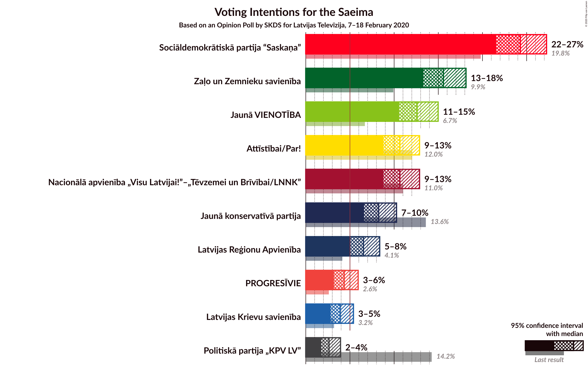
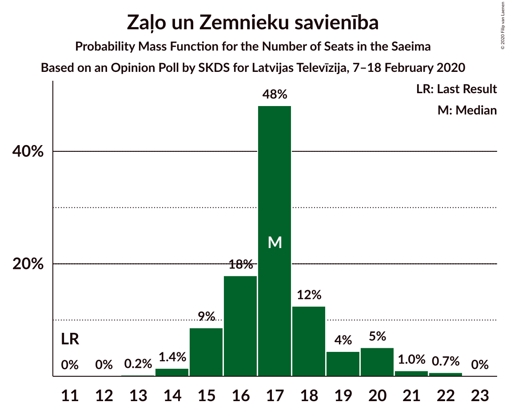
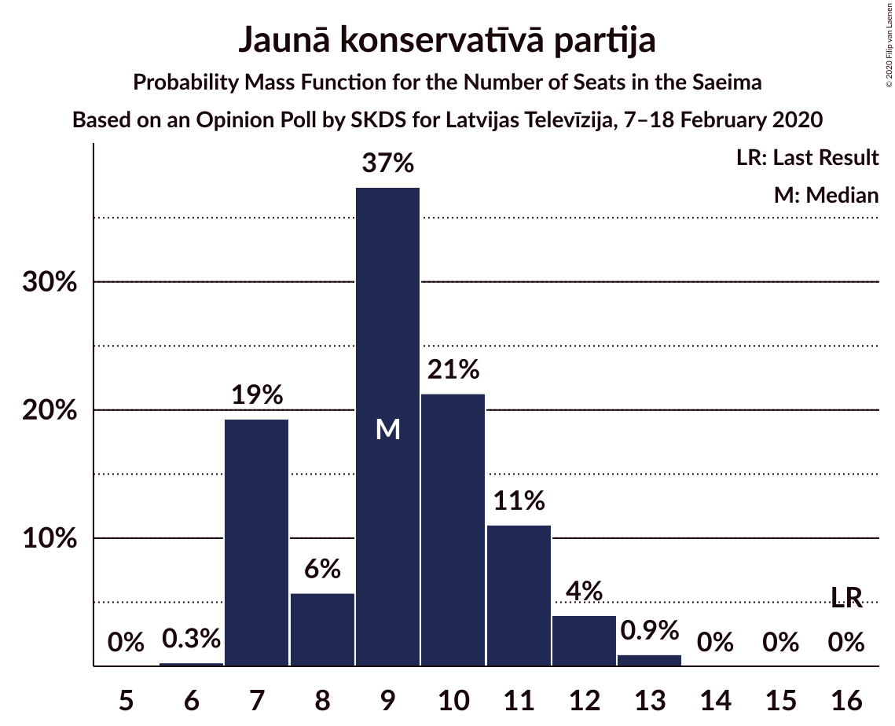
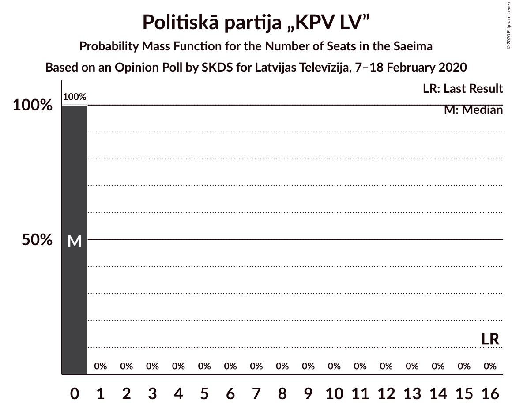
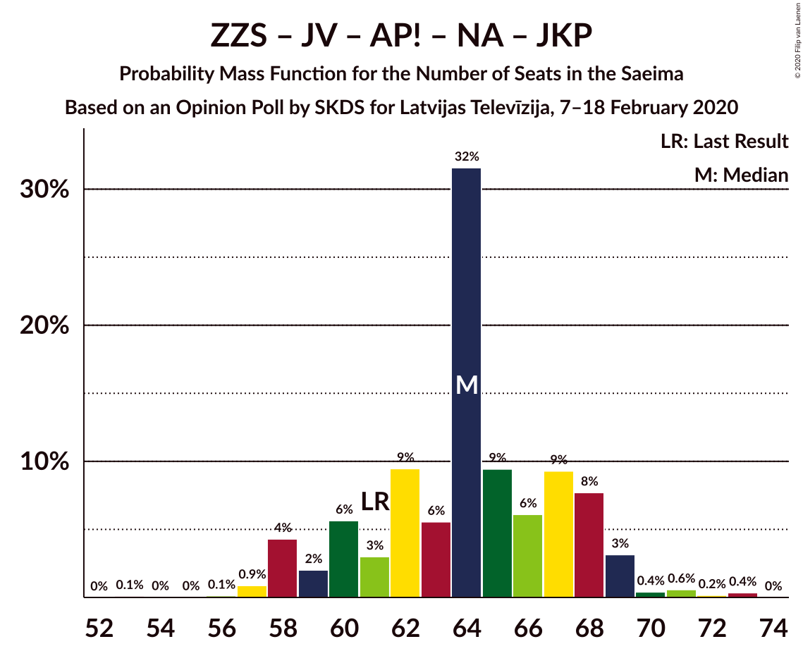
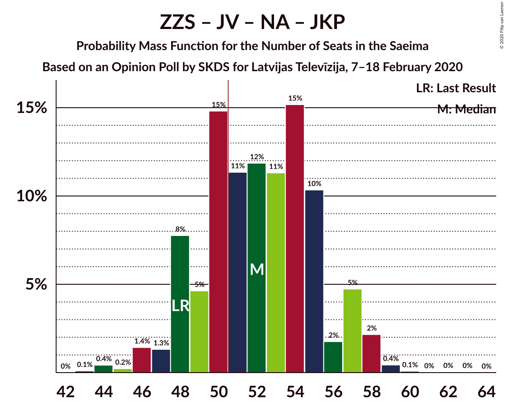
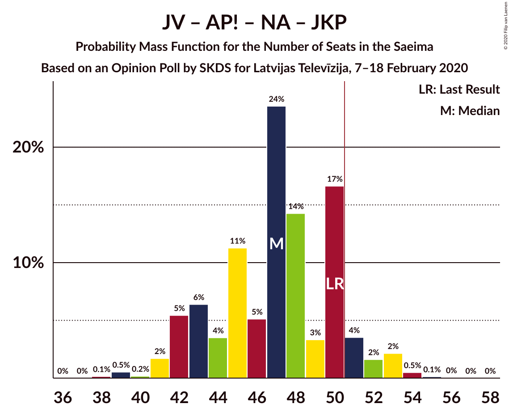

# Opinion Poll by SKDS for Latvijas Televīzija, 7–18 February 2020

<a href="#voting-intentions">Voting Intentions</a> | <a href="#seats">Seats</a> | <a href="#coalitions">Coalitions</a> | <a href="#technical-information">Technical Information</a>

## Voting Intentions

### Confidence Intervals

| Party | Last Result | Poll Result | 80% Confidence Interval | 90% Confidence Interval | 95% Confidence Interval | 99% Confidence Interval |
|:-----:|:-----------:|:-----------:|:-----------------------:|:-----------------------:|:-----------------------:|:-----------------------:|
| Sociāldemokrātiskā partija “Saskaņa” | 19.8% | 24.3% | 22.5–26.2% |22.0–26.8% |21.6–27.3% |20.7–28.2% |
| Zaļo un Zemnieku savienība | 9.9% | 15.6% | 14.1–17.3% |13.7–17.7% |13.3–18.1% |12.6–19.0% |
| Jaunā VIENOTĪBA | 6.7% | 12.6% | 11.3–14.1% |10.9–14.6% |10.6–15.0% |10.0–15.7% |
| Attīstībai/Par! | 12.0% | 10.7% | 9.4–12.1% |9.1–12.5% |8.8–12.9% |8.2–13.6% |
| Nacionālā apvienība „Visu Latvijai!”–„Tēvzemei un Brīvībai/LNNK” | 11.0% | 10.7% | 9.4–12.1% |9.1–12.5% |8.8–12.9% |8.2–13.6% |
| Jaunā konservatīvā partija | 13.6% | 8.2% | 7.2–9.6% |6.9–9.9% |6.6–10.3% |6.1–10.9% |
| Latvijas Reģionu Apvienība | 4.1% | 6.5% | 5.6–7.7% |5.3–8.1% |5.1–8.4% |4.6–9.0% |
| PROGRESĪVIE | 2.6% | 4.4% | 3.6–5.4% |3.4–5.7% |3.2–5.9% |2.9–6.4% |
| Latvijas Krievu savienība | 3.2% | 3.9% | 3.2–4.9% |3.0–5.2% |2.8–5.4% |2.5–5.9% |
| Politiskā partija „KPV LV” | 14.2% | 2.6% | 2.1–3.5% |1.9–3.7% |1.8–3.9% |1.5–4.4% |

*Note:* The poll result column reflects the actual value used in the calculations. Published results may vary slightly, and in addition be rounded to fewer digits.

## Seats

### Confidence Intervals

| Party | Last Result | Median | 80% Confidence Interval | 90% Confidence Interval | 95% Confidence Interval | 99% Confidence Interval |
|:-----:|:-----------:|:------:|:-----------------------:|:-----------------------:|:-----------------------:|:-----------------------:|
| <a href="#sociāldemokrātiskā-partija-“saskaņa”">Sociāldemokrātiskā partija “Saskaņa”</a> | 23 | 27 | 24–29 |24–30 |23–31 |23–33 |
| <a href="#zaļo-un-zemnieku-savienība">Zaļo un Zemnieku savienība</a> | 11 | 17 | 16–18 |16–20 |15–20 |14–22 |
| <a href="#jaunā-vienotība">Jaunā VIENOTĪBA</a> | 8 | 14 | 11–16 |11–17 |11–17 |11–18 |
| <a href="#attīstībai/par!">Attīstībai/Par!</a> | 13 | 12 | 9–14 |9–15 |9–15 |8–15 |
| <a href="#nacionālā-apvienība-„visu-latvijai!”–„tēvzemei-un-brīvībai/lnnk”">Nacionālā apvienība „Visu Latvijai!”–„Tēvzemei un Brīvībai/LNNK”</a> | 13 | 12 | 10–14 |10–14 |10–14 |9–14 |
| <a href="#jaunā-konservatīvā-partija">Jaunā konservatīvā partija</a> | 16 | 9 | 7–11 |7–11 |7–12 |7–13 |
| <a href="#latvijas-reģionu-apvienība">Latvijas Reģionu Apvienība</a> | 0 | 7 | 6–7 |6–8 |6–9 |0–11 |
| <a href="#progresīvie">PROGRESĪVIE</a> | 0 | 0 | 0–6 |0–7 |0–7 |0–7 |
| <a href="#latvijas-krievu-savienība">Latvijas Krievu savienība</a> | 0 | 0 | 0 |0–6 |0–6 |0–7 |
| <a href="#politiskā-partija-„kpv-lv”">Politiskā partija „KPV LV”</a> | 16 | 0 | 0 |0 |0 |0 |

### Sociāldemokrātiskā partija “Saskaņa”

*For a full overview of the results for this party, see the [Sociāldemokrātiskā partija “Saskaņa”](party-sociāldemokrātiskāpartija“saskaņa”.html) page.*

| Number of Seats | Probability | Accumulated | Special Marks |
|:---------------:|:-----------:|:-----------:|:-------------:|
| 22 | 0.1% | 100% |  |
| 23 | 3% | 99.9% | Last Result |
| 24 | 8% | 97% |  |
| 25 | 8% | 89% |  |
| 26 | 14% | 81% |  |
| 27 | 20% | 67% | Median |
| 28 | 6% | 47% |  |
| 29 | 34% | 42% |  |
| 30 | 5% | 8% |  |
| 31 | 2% | 3% |  |
| 32 | 0.2% | 0.8% |  |
| 33 | 0.5% | 0.6% |  |
| 34 | 0.1% | 0.1% |  |
| 35 | 0% | 0% |  |

### Zaļo un Zemnieku savienība

*For a full overview of the results for this party, see the [Zaļo un Zemnieku savienība](party-zaļounzemniekusavienība.html) page.*

| Number of Seats | Probability | Accumulated | Special Marks |
|:---------------:|:-----------:|:-----------:|:-------------:|
| 11 | 0% | 100% | Last Result |
| 12 | 0% | 100% |  |
| 13 | 0.3% | 99.9% |  |
| 14 | 1.5% | 99.6% |  |
| 15 | 3% | 98% |  |
| 16 | 18% | 96% |  |
| 17 | 55% | 77% | Median |
| 18 | 13% | 23% |  |
| 19 | 4% | 10% |  |
| 20 | 3% | 5% |  |
| 21 | 1.4% | 2% |  |
| 22 | 0.7% | 0.7% |  |
| 23 | 0.1% | 0.1% |  |
| 24 | 0% | 0% |  |

### Jaunā VIENOTĪBA

*For a full overview of the results for this party, see the [Jaunā VIENOTĪBA](party-jaunāvienotība.html) page.*

| Number of Seats | Probability | Accumulated | Special Marks |
|:---------------:|:-----------:|:-----------:|:-------------:|
| 8 | 0% | 100% | Last Result |
| 9 | 0% | 100% |  |
| 10 | 0.1% | 100% |  |
| 11 | 18% | 99.9% |  |
| 12 | 11% | 82% |  |
| 13 | 5% | 71% |  |
| 14 | 29% | 67% | Median |
| 15 | 20% | 38% |  |
| 16 | 13% | 18% |  |
| 17 | 4% | 5% |  |
| 18 | 1.2% | 1.3% |  |
| 19 | 0.1% | 0.1% |  |
| 20 | 0% | 0% |  |

### Attīstībai/Par!

*For a full overview of the results for this party, see the [Attīstībai/Par!](party-attīstībaipar.html) page.*

| Number of Seats | Probability | Accumulated | Special Marks |
|:---------------:|:-----------:|:-----------:|:-------------:|
| 7 | 0.2% | 100% |  |
| 8 | 0.4% | 99.8% |  |
| 9 | 22% | 99.4% |  |
| 10 | 8% | 78% |  |
| 11 | 6% | 69% |  |
| 12 | 16% | 63% | Median |
| 13 | 15% | 47% | Last Result |
| 14 | 27% | 32% |  |
| 15 | 5% | 5% |  |
| 16 | 0.2% | 0.2% |  |
| 17 | 0% | 0% |  |

### Nacionālā apvienība „Visu Latvijai!”–„Tēvzemei un Brīvībai/LNNK”

*For a full overview of the results for this party, see the [Nacionālā apvienība „Visu Latvijai!”–„Tēvzemei un Brīvībai/LNNK”](party-nacionālāapvienība„visulatvijai”–„tēvzemeiunbrīvībailnnk”.html) page.*

| Number of Seats | Probability | Accumulated | Special Marks |
|:---------------:|:-----------:|:-----------:|:-------------:|
| 7 | 0.1% | 100% |  |
| 8 | 0.1% | 99.9% |  |
| 9 | 0.7% | 99.8% |  |
| 10 | 13% | 99.1% |  |
| 11 | 25% | 86% |  |
| 12 | 15% | 61% | Median |
| 13 | 15% | 46% | Last Result |
| 14 | 31% | 31% |  |
| 15 | 0.2% | 0.4% |  |
| 16 | 0.1% | 0.2% |  |
| 17 | 0.1% | 0.1% |  |
| 18 | 0% | 0% |  |

### Jaunā konservatīvā partija

*For a full overview of the results for this party, see the [Jaunā konservatīvā partija](party-jaunākonservatīvāpartija.html) page.*

| Number of Seats | Probability | Accumulated | Special Marks |
|:---------------:|:-----------:|:-----------:|:-------------:|
| 6 | 0.5% | 100% |  |
| 7 | 29% | 99.5% |  |
| 8 | 6% | 71% |  |
| 9 | 30% | 65% | Median |
| 10 | 14% | 34% |  |
| 11 | 17% | 20% |  |
| 12 | 3% | 3% |  |
| 13 | 0.6% | 0.6% |  |
| 14 | 0% | 0% |  |
| 15 | 0% | 0% |  |
| 16 | 0% | 0% | Last Result |

### Latvijas Reģionu Apvienība

*For a full overview of the results for this party, see the [Latvijas Reģionu Apvienība](party-latvijasreģionuapvienība.html) page.*

| Number of Seats | Probability | Accumulated | Special Marks |
|:---------------:|:-----------:|:-----------:|:-------------:|
| 0 | 2% | 100% | Last Result |
| 1 | 0% | 98% |  |
| 2 | 0% | 98% |  |
| 3 | 0% | 98% |  |
| 4 | 0% | 98% |  |
| 5 | 0% | 98% |  |
| 6 | 18% | 98% |  |
| 7 | 73% | 80% | Median |
| 8 | 2% | 7% |  |
| 9 | 3% | 5% |  |
| 10 | 1.2% | 2% |  |
| 11 | 1.0% | 1.0% |  |
| 12 | 0% | 0% |  |

### PROGRESĪVIE

*For a full overview of the results for this party, see the [PROGRESĪVIE](party-progresīvie.html) page.*

| Number of Seats | Probability | Accumulated | Special Marks |
|:---------------:|:-----------:|:-----------:|:-------------:|
| 0 | 78% | 100% | Last Result, Median |
| 1 | 0% | 22% |  |
| 2 | 0% | 22% |  |
| 3 | 0% | 22% |  |
| 4 | 0% | 22% |  |
| 5 | 5% | 22% |  |
| 6 | 12% | 17% |  |
| 7 | 5% | 5% |  |
| 8 | 0% | 0% |  |

### Latvijas Krievu savienība

*For a full overview of the results for this party, see the [Latvijas Krievu savienība](party-latvijaskrievusavienība.html) page.*

| Number of Seats | Probability | Accumulated | Special Marks |
|:---------------:|:-----------:|:-----------:|:-------------:|
| 0 | 93% | 100% | Last Result, Median |
| 1 | 0% | 7% |  |
| 2 | 0% | 7% |  |
| 3 | 0% | 7% |  |
| 4 | 0% | 7% |  |
| 5 | 2% | 7% |  |
| 6 | 4% | 5% |  |
| 7 | 0.5% | 0.6% |  |
| 8 | 0.1% | 0.1% |  |
| 9 | 0% | 0% |  |

### Politiskā partija „KPV LV”

*For a full overview of the results for this party, see the [Politiskā partija „KPV LV”](party-politiskāpartija„kpvlv”.html) page.*

| Number of Seats | Probability | Accumulated | Special Marks |
|:---------------:|:-----------:|:-----------:|:-------------:|
| 0 | 100% | 100% | Median |
| 1 | 0% | 0% |  |
| 2 | 0% | 0% |  |
| 3 | 0% | 0% |  |
| 4 | 0% | 0% |  |
| 5 | 0% | 0% |  |
| 6 | 0% | 0% |  |
| 7 | 0% | 0% |  |
| 8 | 0% | 0% |  |
| 9 | 0% | 0% |  |
| 10 | 0% | 0% |  |
| 11 | 0% | 0% |  |
| 12 | 0% | 0% |  |
| 13 | 0% | 0% |  |
| 14 | 0% | 0% |  |
| 15 | 0% | 0% |  |
| 16 | 0% | 0% | Last Result |

## Coalitions

### Confidence Intervals

| Coalition | Last Result | Median | Majority? | 80% Confidence Interval | 90% Confidence Interval | 95% Confidence Interval | 99% Confidence Interval |
|:---------:|:-----------:|:------:|:---------:|:-----------------------:|:-----------------------:|:-----------------------:|:-----------------------:|
| Zaļo un Zemnieku savienība – Jaunā VIENOTĪBA – Attīstībai/Par! – Nacionālā apvienība „Visu Latvijai!”–„Tēvzemei un Brīvībai/LNNK” – Jaunā konservatīvā partija | 61 | 64 | 100% | 60–67 | 59–69 | 58–69 | 57–73 |
| Zaļo un Zemnieku savienība – Jaunā VIENOTĪBA – Attīstībai/Par! – Nacionālā apvienība „Visu Latvijai!”–„Tēvzemei un Brīvībai/LNNK” | 45 | 55 | 93% | 52–57 | 50–60 | 49–60 | 48–64 |
| Zaļo un Zemnieku savienība – Jaunā VIENOTĪBA – Nacionālā apvienība „Visu Latvijai!”–„Tēvzemei un Brīvībai/LNNK” – Jaunā konservatīvā partija | 48 | 52 | 69% | 50–56 | 49–57 | 47–57 | 44–59 |
| Zaļo un Zemnieku savienība – Attīstībai/Par! – Nacionālā apvienība „Visu Latvijai!”–„Tēvzemei un Brīvībai/LNNK” – Jaunā konservatīvā partija | 53 | 50 | 46% | 46–53 | 44–55 | 44–55 | 43–56 |
| Sociāldemokrātiskā partija “Saskaņa” – Attīstībai/Par! – Jaunā konservatīvā partija | 52 | 48 | 20% | 43–52 | 43–52 | 42–53 | 39–54 |
| Jaunā VIENOTĪBA – Attīstībai/Par! – Nacionālā apvienība „Visu Latvijai!”–„Tēvzemei un Brīvībai/LNNK” – Jaunā konservatīvā partija | 50 | 47 | 7% | 43–50 | 42–52 | 41–53 | 39–54 |
| Jaunā VIENOTĪBA – Attīstībai/Par! – Nacionālā apvienība „Visu Latvijai!”–„Tēvzemei un Brīvībai/LNNK” – Jaunā konservatīvā partija – Politiskā partija „KPV LV” | 66 | 47 | 7% | 43–50 | 42–52 | 41–53 | 39–54 |
| Sociāldemokrātiskā partija “Saskaņa” – Zaļo un Zemnieku savienība – Politiskā partija „KPV LV” | 50 | 45 | 0.3% | 41–47 | 40–48 | 40–49 | 39–50 |
| Zaļo un Zemnieku savienība – Jaunā VIENOTĪBA – Nacionālā apvienība „Visu Latvijai!”–„Tēvzemei un Brīvībai/LNNK” | 32 | 43 | 0.2% | 40–46 | 39–47 | 39–48 | 37–50 |
| Zaļo un Zemnieku savienība – Attīstībai/Par! – Nacionālā apvienība „Visu Latvijai!”–„Tēvzemei un Brīvībai/LNNK” | 37 | 42 | 0% | 37–45 | 37–45 | 37–46 | 35–47 |
| Jaunā VIENOTĪBA – Attīstībai/Par! – Nacionālā apvienība „Visu Latvijai!”–„Tēvzemei un Brīvībai/LNNK” – Politiskā partija „KPV LV” | 50 | 39 | 0% | 35–40 | 32–43 | 32–44 | 31–45 |
| Sociāldemokrātiskā partija “Saskaņa” – Attīstībai/Par! | 36 | 39 | 0% | 36–43 | 34–43 | 34–43 | 32–44 |
| Zaļo un Zemnieku savienība – Nacionālā apvienība „Visu Latvijai!”–„Tēvzemei un Brīvībai/LNNK” – Jaunā konservatīvā partija | 40 | 38 | 0% | 35–42 | 35–42 | 34–42 | 33–44 |
| Jaunā VIENOTĪBA – Attīstībai/Par! – Jaunā konservatīvā partija – Politiskā partija „KPV LV” | 53 | 34 | 0% | 32–38 | 31–39 | 30–40 | 28–40 |
| Jaunā VIENOTĪBA – Nacionālā apvienība „Visu Latvijai!”–„Tēvzemei un Brīvībai/LNNK” – Jaunā konservatīvā partija – Politiskā partija „KPV LV” | 53 | 35 | 0% | 32–39 | 31–39 | 30–40 | 29–41 |
| Attīstībai/Par! – Nacionālā apvienība „Visu Latvijai!”–„Tēvzemei un Brīvībai/LNNK” – Jaunā konservatīvā partija – Politiskā partija „KPV LV” | 58 | 33 | 0% | 28–36 | 27–37 | 27–38 | 27–39 |
| Sociāldemokrātiskā partija “Saskaņa” – Politiskā partija „KPV LV” | 39 | 27 | 0% | 24–29 | 24–30 | 23–31 | 23–33 |

### Zaļo un Zemnieku savienība – Jaunā VIENOTĪBA – Attīstībai/Par! – Nacionālā apvienība „Visu Latvijai!”–„Tēvzemei un Brīvībai/LNNK” – Jaunā konservatīvā partija

| Number of Seats | Probability | Accumulated | Special Marks |
|:---------------:|:-----------:|:-----------:|:-------------:|
| 53 | 0.2% | 100% |  |
| 54 | 0% | 99.8% |  |
| 55 | 0% | 99.7% |  |
| 56 | 0.2% | 99.7% |  |
| 57 | 0.8% | 99.5% |  |
| 58 | 2% | 98.7% |  |
| 59 | 2% | 97% |  |
| 60 | 10% | 94% |  |
| 61 | 5% | 84% | Last Result |
| 62 | 3% | 79% |  |
| 63 | 6% | 76% |  |
| 64 | 36% | 70% | Median |
| 65 | 3% | 34% |  |
| 66 | 9% | 31% |  |
| 67 | 13% | 22% |  |
| 68 | 3% | 9% |  |
| 69 | 4% | 6% |  |
| 70 | 0.7% | 2% |  |
| 71 | 0.4% | 1.1% |  |
| 72 | 0.1% | 0.7% |  |
| 73 | 0.6% | 0.6% |  |
| 74 | 0% | 0% |  |

### Zaļo un Zemnieku savienība – Jaunā VIENOTĪBA – Attīstībai/Par! – Nacionālā apvienība „Visu Latvijai!”–„Tēvzemei un Brīvībai/LNNK”

| Number of Seats | Probability | Accumulated | Special Marks |
|:---------------:|:-----------:|:-----------:|:-------------:|
| 45 | 0% | 100% | Last Result |
| 46 | 0.2% | 100% |  |
| 47 | 0% | 99.7% |  |
| 48 | 2% | 99.7% |  |
| 49 | 1.2% | 98% |  |
| 50 | 3% | 97% |  |
| 51 | 3% | 93% | Majority |
| 52 | 5% | 91% |  |
| 53 | 12% | 86% |  |
| 54 | 7% | 73% |  |
| 55 | 17% | 66% | Median |
| 56 | 19% | 50% |  |
| 57 | 21% | 30% |  |
| 58 | 1.4% | 10% |  |
| 59 | 2% | 8% |  |
| 60 | 3% | 6% |  |
| 61 | 1.3% | 2% |  |
| 62 | 0.2% | 0.9% |  |
| 63 | 0.1% | 0.7% |  |
| 64 | 0.6% | 0.6% |  |
| 65 | 0% | 0% |  |

### Zaļo un Zemnieku savienība – Jaunā VIENOTĪBA – Nacionālā apvienība „Visu Latvijai!”–„Tēvzemei un Brīvībai/LNNK” – Jaunā konservatīvā partija

| Number of Seats | Probability | Accumulated | Special Marks |
|:---------------:|:-----------:|:-----------:|:-------------:|
| 44 | 0.9% | 100% |  |
| 45 | 0.2% | 99.1% |  |
| 46 | 1.3% | 98.9% |  |
| 47 | 0.8% | 98% |  |
| 48 | 0.9% | 97% | Last Result |
| 49 | 5% | 96% |  |
| 50 | 22% | 90% |  |
| 51 | 12% | 69% | Majority |
| 52 | 21% | 57% | Median |
| 53 | 4% | 36% |  |
| 54 | 18% | 32% |  |
| 55 | 2% | 14% |  |
| 56 | 2% | 12% |  |
| 57 | 7% | 9% |  |
| 58 | 0.9% | 2% |  |
| 59 | 0.8% | 1.0% |  |
| 60 | 0.2% | 0.3% |  |
| 61 | 0% | 0.1% |  |
| 62 | 0.1% | 0.1% |  |
| 63 | 0% | 0% |  |

### Zaļo un Zemnieku savienība – Attīstībai/Par! – Nacionālā apvienība „Visu Latvijai!”–„Tēvzemei un Brīvībai/LNNK” – Jaunā konservatīvā partija

| Number of Seats | Probability | Accumulated | Special Marks |
|:---------------:|:-----------:|:-----------:|:-------------:|
| 42 | 0.3% | 100% |  |
| 43 | 0.3% | 99.7% |  |
| 44 | 6% | 99.4% |  |
| 45 | 2% | 93% |  |
| 46 | 2% | 91% |  |
| 47 | 6% | 89% |  |
| 48 | 5% | 84% |  |
| 49 | 16% | 79% |  |
| 50 | 17% | 63% | Median |
| 51 | 9% | 46% | Majority |
| 52 | 10% | 37% |  |
| 53 | 20% | 27% | Last Result |
| 54 | 1.2% | 7% |  |
| 55 | 4% | 6% |  |
| 56 | 1.1% | 1.3% |  |
| 57 | 0.2% | 0.2% |  |
| 58 | 0.1% | 0.1% |  |
| 59 | 0% | 0% |  |

### Sociāldemokrātiskā partija “Saskaņa” – Attīstībai/Par! – Jaunā konservatīvā partija

| Number of Seats | Probability | Accumulated | Special Marks |
|:---------------:|:-----------:|:-----------:|:-------------:|
| 39 | 0.8% | 100% |  |
| 40 | 0.5% | 99.2% |  |
| 41 | 0.2% | 98.7% |  |
| 42 | 2% | 98.5% |  |
| 43 | 7% | 97% |  |
| 44 | 5% | 90% |  |
| 45 | 2% | 85% |  |
| 46 | 8% | 83% |  |
| 47 | 6% | 75% |  |
| 48 | 23% | 69% | Median |
| 49 | 4% | 46% |  |
| 50 | 22% | 43% |  |
| 51 | 6% | 20% | Majority |
| 52 | 11% | 15% | Last Result |
| 53 | 3% | 4% |  |
| 54 | 0.9% | 1.1% |  |
| 55 | 0.1% | 0.2% |  |
| 56 | 0.1% | 0.1% |  |
| 57 | 0% | 0% |  |

### Jaunā VIENOTĪBA – Attīstībai/Par! – Nacionālā apvienība „Visu Latvijai!”–„Tēvzemei un Brīvībai/LNNK” – Jaunā konservatīvā partija

| Number of Seats | Probability | Accumulated | Special Marks |
|:---------------:|:-----------:|:-----------:|:-------------:|
| 38 | 0.3% | 100% |  |
| 39 | 0.2% | 99.7% |  |
| 40 | 0.2% | 99.5% |  |
| 41 | 3% | 99.3% |  |
| 42 | 2% | 96% |  |
| 43 | 13% | 94% |  |
| 44 | 3% | 82% |  |
| 45 | 7% | 78% |  |
| 46 | 3% | 71% |  |
| 47 | 27% | 68% | Median |
| 48 | 18% | 41% |  |
| 49 | 3% | 24% |  |
| 50 | 14% | 21% | Last Result |
| 51 | 2% | 7% | Majority |
| 52 | 1.4% | 6% |  |
| 53 | 4% | 4% |  |
| 54 | 0.8% | 0.8% |  |
| 55 | 0% | 0.1% |  |
| 56 | 0% | 0% |  |

### Jaunā VIENOTĪBA – Attīstībai/Par! – Nacionālā apvienība „Visu Latvijai!”–„Tēvzemei un Brīvībai/LNNK” – Jaunā konservatīvā partija – Politiskā partija „KPV LV”

| Number of Seats | Probability | Accumulated | Special Marks |
|:---------------:|:-----------:|:-----------:|:-------------:|
| 38 | 0.3% | 100% |  |
| 39 | 0.2% | 99.7% |  |
| 40 | 0.2% | 99.5% |  |
| 41 | 3% | 99.3% |  |
| 42 | 2% | 96% |  |
| 43 | 13% | 94% |  |
| 44 | 3% | 82% |  |
| 45 | 7% | 78% |  |
| 46 | 3% | 71% |  |
| 47 | 27% | 68% | Median |
| 48 | 18% | 41% |  |
| 49 | 3% | 24% |  |
| 50 | 14% | 21% |  |
| 51 | 2% | 7% | Majority |
| 52 | 1.4% | 6% |  |
| 53 | 4% | 4% |  |
| 54 | 0.8% | 0.8% |  |
| 55 | 0% | 0.1% |  |
| 56 | 0% | 0% |  |
| 57 | 0% | 0% |  |
| 58 | 0% | 0% |  |
| 59 | 0% | 0% |  |
| 60 | 0% | 0% |  |
| 61 | 0% | 0% |  |
| 62 | 0% | 0% |  |
| 63 | 0% | 0% |  |
| 64 | 0% | 0% |  |
| 65 | 0% | 0% |  |
| 66 | 0% | 0% | Last Result |

### Sociāldemokrātiskā partija “Saskaņa” – Zaļo un Zemnieku savienība – Politiskā partija „KPV LV”

| Number of Seats | Probability | Accumulated | Special Marks |
|:---------------:|:-----------:|:-----------:|:-------------:|
| 36 | 0.1% | 100% |  |
| 37 | 0% | 99.9% |  |
| 38 | 0.1% | 99.9% |  |
| 39 | 1.0% | 99.8% |  |
| 40 | 5% | 98.8% |  |
| 41 | 6% | 94% |  |
| 42 | 4% | 87% |  |
| 43 | 16% | 83% |  |
| 44 | 10% | 66% | Median |
| 45 | 21% | 56% |  |
| 46 | 23% | 35% |  |
| 47 | 4% | 13% |  |
| 48 | 5% | 8% |  |
| 49 | 2% | 4% |  |
| 50 | 2% | 2% | Last Result |
| 51 | 0.2% | 0.3% | Majority |
| 52 | 0.1% | 0.1% |  |
| 53 | 0% | 0% |  |

### Zaļo un Zemnieku savienība – Jaunā VIENOTĪBA – Nacionālā apvienība „Visu Latvijai!”–„Tēvzemei un Brīvībai/LNNK”

| Number of Seats | Probability | Accumulated | Special Marks |
|:---------------:|:-----------:|:-----------:|:-------------:|
| 32 | 0% | 100% | Last Result |
| 33 | 0% | 100% |  |
| 34 | 0% | 100% |  |
| 35 | 0% | 100% |  |
| 36 | 0.3% | 99.9% |  |
| 37 | 1.0% | 99.6% |  |
| 38 | 0.6% | 98.7% |  |
| 39 | 5% | 98% |  |
| 40 | 5% | 93% |  |
| 41 | 15% | 88% |  |
| 42 | 7% | 73% |  |
| 43 | 23% | 66% | Median |
| 44 | 11% | 42% |  |
| 45 | 20% | 32% |  |
| 46 | 2% | 12% |  |
| 47 | 6% | 9% |  |
| 48 | 1.3% | 3% |  |
| 49 | 0.7% | 2% |  |
| 50 | 0.9% | 1.0% |  |
| 51 | 0% | 0.2% | Majority |
| 52 | 0.1% | 0.1% |  |
| 53 | 0% | 0% |  |

### Zaļo un Zemnieku savienība – Attīstībai/Par! – Nacionālā apvienība „Visu Latvijai!”–„Tēvzemei un Brīvībai/LNNK”

| Number of Seats | Probability | Accumulated | Special Marks |
|:---------------:|:-----------:|:-----------:|:-------------:|
| 33 | 0.1% | 100% |  |
| 34 | 0.1% | 99.9% |  |
| 35 | 0.4% | 99.8% |  |
| 36 | 1.3% | 99.4% |  |
| 37 | 10% | 98% | Last Result |
| 38 | 4% | 88% |  |
| 39 | 8% | 84% |  |
| 40 | 14% | 76% |  |
| 41 | 10% | 62% | Median |
| 42 | 17% | 52% |  |
| 43 | 15% | 35% |  |
| 44 | 10% | 20% |  |
| 45 | 7% | 10% |  |
| 46 | 2% | 3% |  |
| 47 | 1.0% | 1.1% |  |
| 48 | 0% | 0.1% |  |
| 49 | 0.1% | 0.1% |  |
| 50 | 0% | 0% |  |

### Jaunā VIENOTĪBA – Attīstībai/Par! – Nacionālā apvienība „Visu Latvijai!”–„Tēvzemei un Brīvībai/LNNK” – Politiskā partija „KPV LV”

| Number of Seats | Probability | Accumulated | Special Marks |
|:---------------:|:-----------:|:-----------:|:-------------:|
| 30 | 0.1% | 100% |  |
| 31 | 2% | 99.9% |  |
| 32 | 3% | 98% |  |
| 33 | 2% | 95% |  |
| 34 | 3% | 93% |  |
| 35 | 8% | 90% |  |
| 36 | 13% | 82% |  |
| 37 | 5% | 69% |  |
| 38 | 11% | 65% | Median |
| 39 | 25% | 53% |  |
| 40 | 20% | 28% |  |
| 41 | 2% | 9% |  |
| 42 | 2% | 7% |  |
| 43 | 0.6% | 5% |  |
| 44 | 4% | 4% |  |
| 45 | 0.7% | 0.7% |  |
| 46 | 0% | 0% |  |
| 47 | 0% | 0% |  |
| 48 | 0% | 0% |  |
| 49 | 0% | 0% |  |
| 50 | 0% | 0% | Last Result |

### Sociāldemokrātiskā partija “Saskaņa” – Attīstībai/Par!

| Number of Seats | Probability | Accumulated | Special Marks |
|:---------------:|:-----------:|:-----------:|:-------------:|
| 32 | 1.3% | 100% |  |
| 33 | 0.4% | 98.7% |  |
| 34 | 4% | 98% |  |
| 35 | 3% | 94% |  |
| 36 | 14% | 92% | Last Result |
| 37 | 6% | 78% |  |
| 38 | 6% | 73% |  |
| 39 | 20% | 66% | Median |
| 40 | 5% | 46% |  |
| 41 | 19% | 41% |  |
| 42 | 4% | 23% |  |
| 43 | 17% | 19% |  |
| 44 | 1.2% | 1.4% |  |
| 45 | 0.1% | 0.2% |  |
| 46 | 0.1% | 0.1% |  |
| 47 | 0% | 0% |  |

### Zaļo un Zemnieku savienība – Nacionālā apvienība „Visu Latvijai!”–„Tēvzemei un Brīvībai/LNNK” – Jaunā konservatīvā partija

| Number of Seats | Probability | Accumulated | Special Marks |
|:---------------:|:-----------:|:-----------:|:-------------:|
| 31 | 0.1% | 100% |  |
| 32 | 0.1% | 99.9% |  |
| 33 | 1.0% | 99.8% |  |
| 34 | 2% | 98.8% |  |
| 35 | 17% | 97% |  |
| 36 | 5% | 80% |  |
| 37 | 4% | 75% |  |
| 38 | 30% | 72% | Median |
| 39 | 9% | 42% |  |
| 40 | 16% | 33% | Last Result |
| 41 | 6% | 17% |  |
| 42 | 9% | 11% |  |
| 43 | 0.6% | 2% |  |
| 44 | 1.0% | 1.4% |  |
| 45 | 0.2% | 0.3% |  |
| 46 | 0.1% | 0.1% |  |
| 47 | 0% | 0% |  |

### Jaunā VIENOTĪBA – Attīstībai/Par! – Jaunā konservatīvā partija – Politiskā partija „KPV LV”

| Number of Seats | Probability | Accumulated | Special Marks |
|:---------------:|:-----------:|:-----------:|:-------------:|
| 27 | 0.3% | 100% |  |
| 28 | 0.2% | 99.7% |  |
| 29 | 0.5% | 99.5% |  |
| 30 | 3% | 99.0% |  |
| 31 | 4% | 96% |  |
| 32 | 15% | 91% |  |
| 33 | 21% | 76% |  |
| 34 | 13% | 55% |  |
| 35 | 5% | 43% | Median |
| 36 | 7% | 38% |  |
| 37 | 2% | 31% |  |
| 38 | 20% | 29% |  |
| 39 | 3% | 8% |  |
| 40 | 4% | 5% |  |
| 41 | 0.3% | 0.5% |  |
| 42 | 0.2% | 0.2% |  |
| 43 | 0% | 0% |  |
| 44 | 0% | 0% |  |
| 45 | 0% | 0% |  |
| 46 | 0% | 0% |  |
| 47 | 0% | 0% |  |
| 48 | 0% | 0% |  |
| 49 | 0% | 0% |  |
| 50 | 0% | 0% |  |
| 51 | 0% | 0% | Majority |
| 52 | 0% | 0% |  |
| 53 | 0% | 0% | Last Result |

### Jaunā VIENOTĪBA – Nacionālā apvienība „Visu Latvijai!”–„Tēvzemei un Brīvībai/LNNK” – Jaunā konservatīvā partija – Politiskā partija „KPV LV”

| Number of Seats | Probability | Accumulated | Special Marks |
|:---------------:|:-----------:|:-----------:|:-------------:|
| 28 | 0.2% | 100% |  |
| 29 | 1.1% | 99.8% |  |
| 30 | 2% | 98.7% |  |
| 31 | 2% | 97% |  |
| 32 | 6% | 95% |  |
| 33 | 16% | 89% |  |
| 34 | 21% | 72% |  |
| 35 | 16% | 51% | Median |
| 36 | 3% | 34% |  |
| 37 | 15% | 32% |  |
| 38 | 6% | 16% |  |
| 39 | 8% | 11% |  |
| 40 | 2% | 3% |  |
| 41 | 0.3% | 0.6% |  |
| 42 | 0.2% | 0.3% |  |
| 43 | 0% | 0% |  |
| 44 | 0% | 0% |  |
| 45 | 0% | 0% |  |
| 46 | 0% | 0% |  |
| 47 | 0% | 0% |  |
| 48 | 0% | 0% |  |
| 49 | 0% | 0% |  |
| 50 | 0% | 0% |  |
| 51 | 0% | 0% | Majority |
| 52 | 0% | 0% |  |
| 53 | 0% | 0% | Last Result |

### Attīstībai/Par! – Nacionālā apvienība „Visu Latvijai!”–„Tēvzemei un Brīvībai/LNNK” – Jaunā konservatīvā partija – Politiskā partija „KPV LV”

| Number of Seats | Probability | Accumulated | Special Marks |
|:---------------:|:-----------:|:-----------:|:-------------:|
| 26 | 0.1% | 100% |  |
| 27 | 7% | 99.8% |  |
| 28 | 3% | 93% |  |
| 29 | 1.4% | 89% |  |
| 30 | 3% | 88% |  |
| 31 | 5% | 85% |  |
| 32 | 8% | 80% |  |
| 33 | 32% | 71% | Median |
| 34 | 8% | 40% |  |
| 35 | 9% | 32% |  |
| 36 | 15% | 23% |  |
| 37 | 5% | 8% |  |
| 38 | 2% | 3% |  |
| 39 | 0.6% | 0.6% |  |
| 40 | 0% | 0.1% |  |
| 41 | 0% | 0% |  |
| 42 | 0% | 0% |  |
| 43 | 0% | 0% |  |
| 44 | 0% | 0% |  |
| 45 | 0% | 0% |  |
| 46 | 0% | 0% |  |
| 47 | 0% | 0% |  |
| 48 | 0% | 0% |  |
| 49 | 0% | 0% |  |
| 50 | 0% | 0% |  |
| 51 | 0% | 0% | Majority |
| 52 | 0% | 0% |  |
| 53 | 0% | 0% |  |
| 54 | 0% | 0% |  |
| 55 | 0% | 0% |  |
| 56 | 0% | 0% |  |
| 57 | 0% | 0% |  |
| 58 | 0% | 0% | Last Result |

### Sociāldemokrātiskā partija “Saskaņa” – Politiskā partija „KPV LV”

| Number of Seats | Probability | Accumulated | Special Marks |
|:---------------:|:-----------:|:-----------:|:-------------:|
| 22 | 0.1% | 100% |  |
| 23 | 3% | 99.9% |  |
| 24 | 8% | 97% |  |
| 25 | 8% | 89% |  |
| 26 | 14% | 81% |  |
| 27 | 20% | 67% | Median |
| 28 | 6% | 47% |  |
| 29 | 34% | 42% |  |
| 30 | 5% | 8% |  |
| 31 | 2% | 3% |  |
| 32 | 0.2% | 0.8% |  |
| 33 | 0.6% | 0.6% |  |
| 34 | 0.1% | 0.1% |  |
| 35 | 0% | 0% |  |
| 36 | 0% | 0% |  |
| 37 | 0% | 0% |  |
| 38 | 0% | 0% |  |
| 39 | 0% | 0% | Last Result |

## Technical Information

### Opinion Poll

+ **Polling firm:** SKDS
+ **Commissioner(s):** Latvijas Televīzija
+ **Fieldwork period:** 7–18 February 2020

### Calculations

+ **Sample size:** 873
+ **Simulations done:** 524,288
+ **Error estimate:** 2.64%

