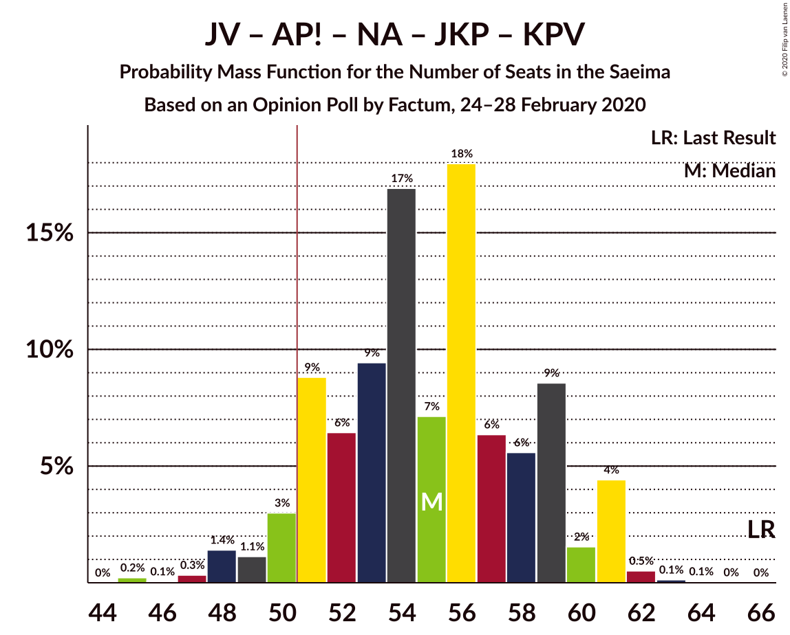
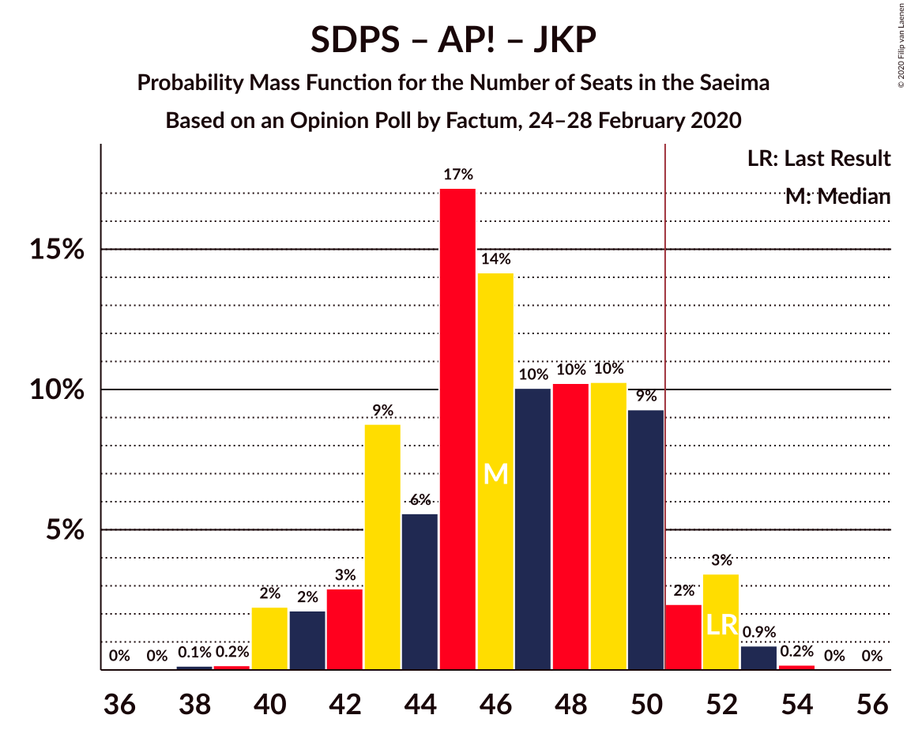
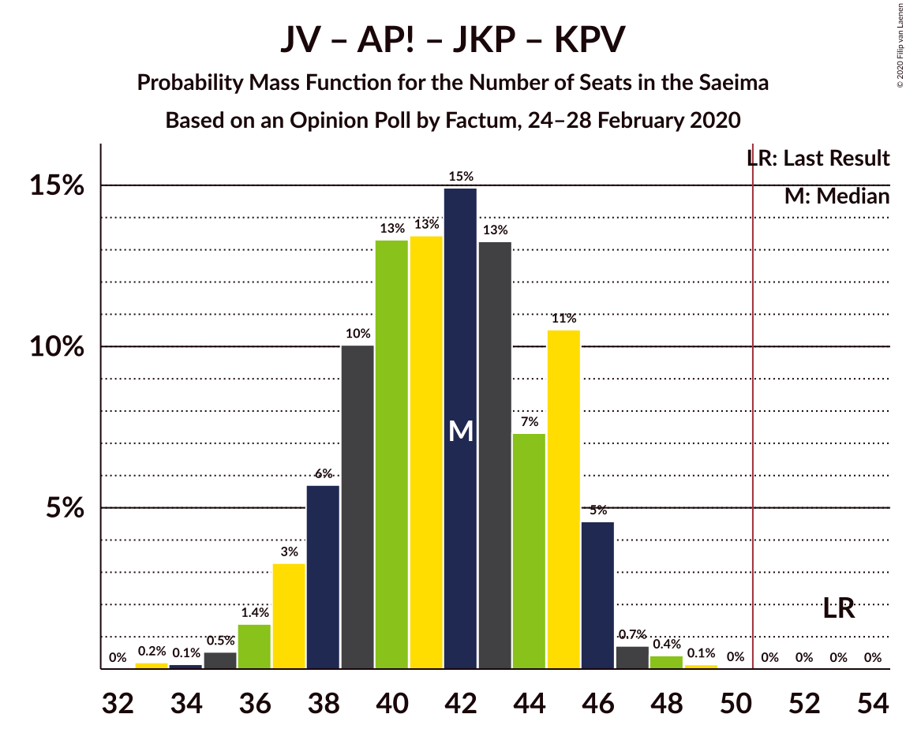
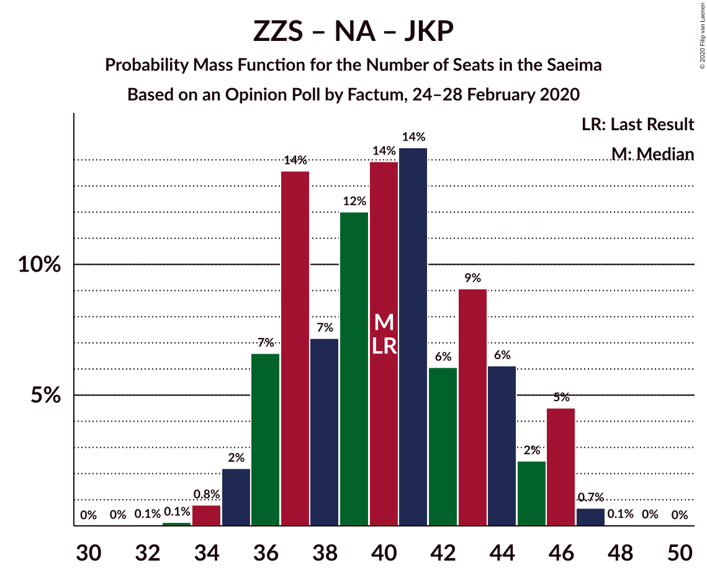

# Opinion Poll by Factum, 24–28 February 2020

<a href="#voting-intentions">Voting Intentions</a> | <a href="#seats">Seats</a> | <a href="#coalitions">Coalitions</a> | <a href="#technical-information">Technical Information</a>

## Voting Intentions

### Confidence Intervals

| Party | Last Result | Poll Result | 80% Confidence Interval | 90% Confidence Interval | 95% Confidence Interval | 99% Confidence Interval |
|:-----:|:-----------:|:-----------:|:-----------------------:|:-----------------------:|:-----------------------:|:-----------------------:|
| Sociāldemokrātiskā partija “Saskaņa” | 19.8% | 18.0% | 16.3–19.9% |15.9–20.4% |15.5–20.9% |14.7–21.8% |
| Jaunā VIENOTĪBA | 6.7% | 14.0% | 12.6–15.8% |12.1–16.2% |11.8–16.7% |11.1–17.5% |
| Zaļo un Zemnieku savienība | 9.9% | 13.0% | 11.6–14.7% |11.2–15.2% |10.9–15.6% |10.2–16.4% |
| Attīstībai/Par! | 12.0% | 12.0% | 10.6–13.6% |10.2–14.1% |9.9–14.5% |9.3–15.3% |
| Nacionālā apvienība „Visu Latvijai!”–„Tēvzemei un Brīvībai/LNNK” | 11.0% | 12.0% | 10.6–13.6% |10.2–14.1% |9.9–14.5% |9.3–15.3% |
| Jaunā konservatīvā partija | 13.6% | 11.0% | 9.7–12.5% |9.3–13.0% |9.0–13.4% |8.4–14.2% |
| PROGRESĪVIE | 2.6% | 6.0% | 5.0–7.2% |4.8–7.6% |4.5–7.9% |4.1–8.5% |
| Latvijas Reģionu Apvienība | 4.1% | 5.0% | 4.1–6.1% |3.9–6.4% |3.7–6.8% |3.3–7.3% |
| Latvijas Krievu savienība | 3.2% | 4.0% | 3.2–5.0% |3.0–5.3% |2.8–5.6% |2.5–6.1% |
| Politiskā partija „KPV LV” | 14.2% | 2.9% | 2.3–3.9% |2.1–4.1% |2.0–4.4% |1.7–4.9% |

*Note:* The poll result column reflects the actual value used in the calculations. Published results may vary slightly, and in addition be rounded to fewer digits.

## Seats

### Confidence Intervals

| Party | Last Result | Median | 80% Confidence Interval | 90% Confidence Interval | 95% Confidence Interval | 99% Confidence Interval |
|:-----:|:-----------:|:------:|:-----------------------:|:-----------------------:|:-----------------------:|:-----------------------:|
| <a href="#sociāldemokrātiskā-partija-“saskaņa”">Sociāldemokrātiskā partija “Saskaņa”</a> | 23 | 21 | 18–23 |18–24 |17–24 |17–26 |
| <a href="#jaunā-vienotība">Jaunā VIENOTĪBA</a> | 8 | 16 | 14–18 |12–18 |12–18 |11–19 |
| <a href="#zaļo-un-zemnieku-savienība">Zaļo un Zemnieku savienība</a> | 11 | 15 | 12–17 |12–18 |12–18 |11–18 |
| <a href="#attīstībai/par!">Attīstībai/Par!</a> | 13 | 14 | 10–15 |10–15 |10–16 |10–17 |
| <a href="#nacionālā-apvienība-„visu-latvijai!”–„tēvzemei-un-brīvībai/lnnk”">Nacionālā apvienība „Visu Latvijai!”–„Tēvzemei un Brīvībai/LNNK”</a> | 13 | 13 | 11–16 |11–16 |11–16 |10–17 |
| <a href="#jaunā-konservatīvā-partija">Jaunā konservatīvā partija</a> | 16 | 13 | 10–13 |9–13 |9–14 |9–16 |
| <a href="#progresīvie">PROGRESĪVIE</a> | 0 | 7 | 0–8 |0–8 |0–8 |0–9 |
| <a href="#latvijas-reģionu-apvienība">Latvijas Reģionu Apvienība</a> | 0 | 0 | 0–6 |0–6 |0–7 |0–7 |
| <a href="#latvijas-krievu-savienība">Latvijas Krievu savienība</a> | 0 | 0 | 0–5 |0–6 |0–7 |0–8 |
| <a href="#politiskā-partija-„kpv-lv”">Politiskā partija „KPV LV”</a> | 16 | 0 | 0 |0 |0 |0 |

### Sociāldemokrātiskā partija “Saskaņa”

*For a full overview of the results for this party, see the [Sociāldemokrātiskā partija “Saskaņa”](party-sociāldemokrātiskāpartija“saskaņa”.html) page.*

| Number of Seats | Probability | Accumulated | Special Marks |
|:---------------:|:-----------:|:-----------:|:-------------:|
| 16 | 0.1% | 100% |  |
| 17 | 4% | 99.9% |  |
| 18 | 9% | 96% |  |
| 19 | 10% | 87% |  |
| 20 | 6% | 77% |  |
| 21 | 23% | 71% | Median |
| 22 | 27% | 47% |  |
| 23 | 11% | 20% | Last Result |
| 24 | 8% | 9% |  |
| 25 | 0.3% | 1.2% |  |
| 26 | 0.7% | 1.0% |  |
| 27 | 0.2% | 0.2% |  |
| 28 | 0% | 0% |  |

### Jaunā VIENOTĪBA

*For a full overview of the results for this party, see the [Jaunā VIENOTĪBA](party-jaunāvienotība.html) page.*

| Number of Seats | Probability | Accumulated | Special Marks |
|:---------------:|:-----------:|:-----------:|:-------------:|
| 8 | 0% | 100% | Last Result |
| 9 | 0% | 100% |  |
| 10 | 0% | 100% |  |
| 11 | 0.7% | 100% |  |
| 12 | 5% | 99.3% |  |
| 13 | 4% | 95% |  |
| 14 | 5% | 91% |  |
| 15 | 20% | 85% |  |
| 16 | 20% | 66% | Median |
| 17 | 29% | 46% |  |
| 18 | 15% | 17% |  |
| 19 | 2% | 2% |  |
| 20 | 0.2% | 0.2% |  |
| 21 | 0% | 0% |  |

### Zaļo un Zemnieku savienība

*For a full overview of the results for this party, see the [Zaļo un Zemnieku savienība](party-zaļounzemniekusavienība.html) page.*

| Number of Seats | Probability | Accumulated | Special Marks |
|:---------------:|:-----------:|:-----------:|:-------------:|
| 11 | 2% | 100% | Last Result |
| 12 | 10% | 98% |  |
| 13 | 18% | 88% |  |
| 14 | 17% | 71% |  |
| 15 | 8% | 53% | Median |
| 16 | 15% | 46% |  |
| 17 | 25% | 31% |  |
| 18 | 6% | 6% |  |
| 19 | 0.1% | 0.2% |  |
| 20 | 0.1% | 0.1% |  |
| 21 | 0% | 0% |  |

### Attīstībai/Par!

*For a full overview of the results for this party, see the [Attīstībai/Par!](party-attīstībaipar.html) page.*

| Number of Seats | Probability | Accumulated | Special Marks |
|:---------------:|:-----------:|:-----------:|:-------------:|
| 9 | 0.3% | 100% |  |
| 10 | 12% | 99.7% |  |
| 11 | 2% | 88% |  |
| 12 | 7% | 86% |  |
| 13 | 27% | 79% | Last Result |
| 14 | 23% | 52% | Median |
| 15 | 26% | 29% |  |
| 16 | 2% | 3% |  |
| 17 | 1.2% | 1.2% |  |
| 18 | 0% | 0% |  |

### Nacionālā apvienība „Visu Latvijai!”–„Tēvzemei un Brīvībai/LNNK”

*For a full overview of the results for this party, see the [Nacionālā apvienība „Visu Latvijai!”–„Tēvzemei un Brīvībai/LNNK”](party-nacionālāapvienība„visulatvijai”–„tēvzemeiunbrīvībailnnk”.html) page.*

| Number of Seats | Probability | Accumulated | Special Marks |
|:---------------:|:-----------:|:-----------:|:-------------:|
| 10 | 1.0% | 100% |  |
| 11 | 12% | 99.0% |  |
| 12 | 7% | 86% |  |
| 13 | 32% | 80% | Last Result, Median |
| 14 | 23% | 48% |  |
| 15 | 15% | 26% |  |
| 16 | 10% | 11% |  |
| 17 | 0.5% | 0.7% |  |
| 18 | 0.1% | 0.1% |  |
| 19 | 0% | 0% |  |

### Jaunā konservatīvā partija

*For a full overview of the results for this party, see the [Jaunā konservatīvā partija](party-jaunākonservatīvāpartija.html) page.*

| Number of Seats | Probability | Accumulated | Special Marks |
|:---------------:|:-----------:|:-----------:|:-------------:|
| 8 | 0.1% | 100% |  |
| 9 | 7% | 99.8% |  |
| 10 | 10% | 93% |  |
| 11 | 8% | 82% |  |
| 12 | 18% | 74% |  |
| 13 | 53% | 56% | Median |
| 14 | 2% | 4% |  |
| 15 | 0.7% | 2% |  |
| 16 | 0.8% | 0.9% | Last Result |
| 17 | 0% | 0.1% |  |
| 18 | 0% | 0% |  |

### PROGRESĪVIE

*For a full overview of the results for this party, see the [PROGRESĪVIE](party-progresīvie.html) page.*

| Number of Seats | Probability | Accumulated | Special Marks |
|:---------------:|:-----------:|:-----------:|:-------------:|
| 0 | 19% | 100% | Last Result |
| 1 | 0% | 81% |  |
| 2 | 0% | 81% |  |
| 3 | 0% | 81% |  |
| 4 | 0% | 81% |  |
| 5 | 0.3% | 81% |  |
| 6 | 21% | 81% |  |
| 7 | 49% | 60% | Median |
| 8 | 10% | 11% |  |
| 9 | 0.6% | 0.7% |  |
| 10 | 0% | 0% |  |

### Latvijas Reģionu Apvienība

*For a full overview of the results for this party, see the [Latvijas Reģionu Apvienība](party-latvijasreģionuapvienība.html) page.*

| Number of Seats | Probability | Accumulated | Special Marks |
|:---------------:|:-----------:|:-----------:|:-------------:|
| 0 | 56% | 100% | Last Result, Median |
| 1 | 0% | 44% |  |
| 2 | 0% | 44% |  |
| 3 | 0% | 44% |  |
| 4 | 0% | 44% |  |
| 5 | 0% | 44% |  |
| 6 | 39% | 44% |  |
| 7 | 4% | 5% |  |
| 8 | 0.2% | 0.3% |  |
| 9 | 0% | 0% |  |

### Latvijas Krievu savienība

*For a full overview of the results for this party, see the [Latvijas Krievu savienība](party-latvijaskrievusavienība.html) page.*

| Number of Seats | Probability | Accumulated | Special Marks |
|:---------------:|:-----------:|:-----------:|:-------------:|
| 0 | 89% | 100% | Last Result, Median |
| 1 | 0% | 11% |  |
| 2 | 0% | 11% |  |
| 3 | 0% | 11% |  |
| 4 | 0% | 11% |  |
| 5 | 3% | 11% |  |
| 6 | 4% | 8% |  |
| 7 | 3% | 4% |  |
| 8 | 1.2% | 1.2% |  |
| 9 | 0% | 0% |  |

### Politiskā partija „KPV LV”

*For a full overview of the results for this party, see the [Politiskā partija „KPV LV”](party-politiskāpartija„kpvlv”.html) page.*

| Number of Seats | Probability | Accumulated | Special Marks |
|:---------------:|:-----------:|:-----------:|:-------------:|
| 0 | 99.9% | 100% | Median |
| 1 | 0% | 0.1% |  |
| 2 | 0% | 0.1% |  |
| 3 | 0% | 0.1% |  |
| 4 | 0% | 0.1% |  |
| 5 | 0.1% | 0.1% |  |
| 6 | 0% | 0.1% |  |
| 7 | 0% | 0% |  |
| 8 | 0% | 0% |  |
| 9 | 0% | 0% |  |
| 10 | 0% | 0% |  |
| 11 | 0% | 0% |  |
| 12 | 0% | 0% |  |
| 13 | 0% | 0% |  |
| 14 | 0% | 0% |  |
| 15 | 0% | 0% |  |
| 16 | 0% | 0% | Last Result |

## Coalitions

### Confidence Intervals

| Coalition | Last Result | Median | Majority? | 80% Confidence Interval | 90% Confidence Interval | 95% Confidence Interval | 99% Confidence Interval |
|:---------:|:-----------:|:------:|:---------:|:-----------------------:|:-----------------------:|:-----------------------:|:-----------------------:|
| Jaunā VIENOTĪBA – Zaļo un Zemnieku savienība – Attīstībai/Par! – Nacionālā apvienība „Visu Latvijai!”–„Tēvzemei un Brīvībai/LNNK” – Jaunā konservatīvā partija | 61 | 70 | 100% | 64–74 | 64–78 | 64–78 | 60–78 |
| Jaunā VIENOTĪBA – Zaļo un Zemnieku savienība – Attīstībai/Par! – Nacionālā apvienība „Visu Latvijai!”–„Tēvzemei un Brīvībai/LNNK” | 45 | 58 | 98.6% | 52–62 | 52–65 | 51–65 | 48–65 |
| Jaunā VIENOTĪBA – Zaļo un Zemnieku savienība – Nacionālā apvienība „Visu Latvijai!”–„Tēvzemei un Brīvībai/LNNK” – Jaunā konservatīvā partija | 48 | 57 | 95% | 51–61 | 50–63 | 50–63 | 48–63 |
| Jaunā VIENOTĪBA – Attīstībai/Par! – Nacionālā apvienība „Visu Latvijai!”–„Tēvzemei un Brīvībai/LNNK” – Jaunā konservatīvā partija | 50 | 55 | 92% | 51–59 | 50–61 | 48–61 | 47–61 |
| Jaunā VIENOTĪBA – Attīstībai/Par! – Nacionālā apvienība „Visu Latvijai!”–„Tēvzemei un Brīvībai/LNNK” – Jaunā konservatīvā partija – Politiskā partija „KPV LV” | 66 | 55 | 92% | 51–59 | 50–61 | 48–61 | 47–61 |
| Zaļo un Zemnieku savienība – Attīstībai/Par! – Nacionālā apvienība „Visu Latvijai!”–„Tēvzemei un Brīvībai/LNNK” – Jaunā konservatīvā partija | 53 | 54 | 82% | 49–59 | 49–61 | 48–61 | 47–61 |
| Sociāldemokrātiskā partija “Saskaņa” – Attīstībai/Par! – Jaunā konservatīvā partija | 52 | 46 | 7% | 43–50 | 42–51 | 41–52 | 40–53 |
| Jaunā VIENOTĪBA – Zaļo un Zemnieku savienība – Nacionālā apvienība „Visu Latvijai!”–„Tēvzemei un Brīvībai/LNNK” | 32 | 45 | 0.3% | 40–48 | 39–50 | 38–50 | 35–50 |
| Jaunā VIENOTĪBA – Attīstībai/Par! – Nacionālā apvienība „Visu Latvijai!”–„Tēvzemei un Brīvībai/LNNK” – Politiskā partija „KPV LV” | 50 | 43 | 0.2% | 39–47 | 38–48 | 37–48 | 34–49 |
| Zaļo un Zemnieku savienība – Attīstībai/Par! – Nacionālā apvienība „Visu Latvijai!”–„Tēvzemei un Brīvībai/LNNK” | 37 | 42 | 0% | 37–46 | 37–48 | 37–48 | 35–48 |
| Jaunā VIENOTĪBA – Attīstībai/Par! – Jaunā konservatīvā partija – Politiskā partija „KPV LV” | 53 | 41 | 0% | 38–45 | 37–45 | 37–46 | 35–48 |
| Jaunā VIENOTĪBA – Nacionālā apvienība „Visu Latvijai!”–„Tēvzemei un Brīvībai/LNNK” – Jaunā konservatīvā partija – Politiskā partija „KPV LV” | 53 | 42 | 0% | 38–45 | 36–46 | 35–46 | 34–46 |
| Zaļo un Zemnieku savienība – Nacionālā apvienība „Visu Latvijai!”–„Tēvzemei un Brīvībai/LNNK” – Jaunā konservatīvā partija | 40 | 41 | 0% | 36–44 | 36–46 | 35–46 | 34–46 |
| Attīstībai/Par! – Nacionālā apvienība „Visu Latvijai!”–„Tēvzemei un Brīvībai/LNNK” – Jaunā konservatīvā partija – Politiskā partija „KPV LV” | 58 | 39 | 0% | 36–43 | 35–44 | 34–44 | 33–45 |
| Sociāldemokrātiskā partija “Saskaņa” – Zaļo un Zemnieku savienība – Politiskā partija „KPV LV” | 50 | 37 | 0% | 32–39 | 30–39 | 29–40 | 29–41 |
| Sociāldemokrātiskā partija “Saskaņa” – Attīstībai/Par! | 36 | 35 | 0% | 31–37 | 30–39 | 29–39 | 28–40 |
| Sociāldemokrātiskā partija “Saskaņa” – Politiskā partija „KPV LV” | 39 | 21 | 0% | 18–23 | 18–24 | 17–24 | 17–26 |

### Jaunā VIENOTĪBA – Zaļo un Zemnieku savienība – Attīstībai/Par! – Nacionālā apvienība „Visu Latvijai!”–„Tēvzemei un Brīvībai/LNNK” – Jaunā konservatīvā partija

| Number of Seats | Probability | Accumulated | Special Marks |
|:---------------:|:-----------:|:-----------:|:-------------:|
| 59 | 0.4% | 100% |  |
| 60 | 0.3% | 99.6% |  |
| 61 | 0.4% | 99.4% | Last Result |
| 62 | 0.3% | 99.0% |  |
| 63 | 0.9% | 98.7% |  |
| 64 | 10% | 98% |  |
| 65 | 4% | 87% |  |
| 66 | 5% | 84% |  |
| 67 | 2% | 78% |  |
| 68 | 8% | 76% |  |
| 69 | 10% | 67% |  |
| 70 | 10% | 58% |  |
| 71 | 9% | 47% | Median |
| 72 | 17% | 38% |  |
| 73 | 9% | 21% |  |
| 74 | 3% | 12% |  |
| 75 | 0.6% | 10% |  |
| 76 | 0.7% | 9% |  |
| 77 | 0.9% | 8% |  |
| 78 | 7% | 7% |  |
| 79 | 0.1% | 0.1% |  |
| 80 | 0% | 0% |  |

### Jaunā VIENOTĪBA – Zaļo un Zemnieku savienība – Attīstībai/Par! – Nacionālā apvienība „Visu Latvijai!”–„Tēvzemei un Brīvībai/LNNK”

| Number of Seats | Probability | Accumulated | Special Marks |
|:---------------:|:-----------:|:-----------:|:-------------:|
| 45 | 0% | 100% | Last Result |
| 46 | 0% | 100% |  |
| 47 | 0.3% | 100% |  |
| 48 | 0.5% | 99.7% |  |
| 49 | 0.1% | 99.3% |  |
| 50 | 0.6% | 99.2% |  |
| 51 | 2% | 98.6% | Majority |
| 52 | 9% | 97% |  |
| 53 | 2% | 88% |  |
| 54 | 6% | 87% |  |
| 55 | 7% | 81% |  |
| 56 | 8% | 74% |  |
| 57 | 11% | 66% |  |
| 58 | 10% | 55% | Median |
| 59 | 12% | 45% |  |
| 60 | 13% | 33% |  |
| 61 | 3% | 20% |  |
| 62 | 8% | 17% |  |
| 63 | 0.5% | 9% |  |
| 64 | 0.4% | 9% |  |
| 65 | 8% | 8% |  |
| 66 | 0.1% | 0.2% |  |
| 67 | 0% | 0% |  |

### Jaunā VIENOTĪBA – Zaļo un Zemnieku savienība – Nacionālā apvienība „Visu Latvijai!”–„Tēvzemei un Brīvībai/LNNK” – Jaunā konservatīvā partija

| Number of Seats | Probability | Accumulated | Special Marks |
|:---------------:|:-----------:|:-----------:|:-------------:|
| 45 | 0.1% | 100% |  |
| 46 | 0.3% | 99.9% |  |
| 47 | 0% | 99.7% |  |
| 48 | 0.4% | 99.6% | Last Result |
| 49 | 1.1% | 99.3% |  |
| 50 | 4% | 98% |  |
| 51 | 6% | 95% | Majority |
| 52 | 5% | 89% |  |
| 53 | 5% | 83% |  |
| 54 | 7% | 79% |  |
| 55 | 8% | 71% |  |
| 56 | 8% | 64% |  |
| 57 | 14% | 55% | Median |
| 58 | 11% | 41% |  |
| 59 | 6% | 29% |  |
| 60 | 8% | 24% |  |
| 61 | 7% | 16% |  |
| 62 | 1.0% | 9% |  |
| 63 | 7% | 8% |  |
| 64 | 0.1% | 0.2% |  |
| 65 | 0% | 0.1% |  |
| 66 | 0.1% | 0.1% |  |
| 67 | 0% | 0% |  |

### Jaunā VIENOTĪBA – Attīstībai/Par! – Nacionālā apvienība „Visu Latvijai!”–„Tēvzemei un Brīvībai/LNNK” – Jaunā konservatīvā partija

| Number of Seats | Probability | Accumulated | Special Marks |
|:---------------:|:-----------:|:-----------:|:-------------:|
| 45 | 0.3% | 100% |  |
| 46 | 0% | 99.7% |  |
| 47 | 0.4% | 99.7% |  |
| 48 | 2% | 99.3% |  |
| 49 | 1.5% | 97% |  |
| 50 | 4% | 96% | Last Result |
| 51 | 7% | 92% | Majority |
| 52 | 6% | 84% |  |
| 53 | 8% | 78% |  |
| 54 | 13% | 70% |  |
| 55 | 8% | 57% |  |
| 56 | 25% | 49% | Median |
| 57 | 3% | 24% |  |
| 58 | 3% | 21% |  |
| 59 | 9% | 18% |  |
| 60 | 2% | 9% |  |
| 61 | 7% | 8% |  |
| 62 | 0.2% | 0.5% |  |
| 63 | 0.2% | 0.3% |  |
| 64 | 0.1% | 0.1% |  |
| 65 | 0% | 0% |  |

### Jaunā VIENOTĪBA – Attīstībai/Par! – Nacionālā apvienība „Visu Latvijai!”–„Tēvzemei un Brīvībai/LNNK” – Jaunā konservatīvā partija – Politiskā partija „KPV LV”

| Number of Seats | Probability | Accumulated | Special Marks |
|:---------------:|:-----------:|:-----------:|:-------------:|
| 45 | 0.3% | 100% |  |
| 46 | 0% | 99.7% |  |
| 47 | 0.4% | 99.7% |  |
| 48 | 2% | 99.3% |  |
| 49 | 1.5% | 97% |  |
| 50 | 4% | 96% |  |
| 51 | 7% | 92% | Majority |
| 52 | 6% | 85% |  |
| 53 | 8% | 78% |  |
| 54 | 13% | 70% |  |
| 55 | 8% | 57% |  |
| 56 | 25% | 49% | Median |
| 57 | 3% | 24% |  |
| 58 | 3% | 21% |  |
| 59 | 9% | 18% |  |
| 60 | 2% | 9% |  |
| 61 | 7% | 8% |  |
| 62 | 0.2% | 0.5% |  |
| 63 | 0.2% | 0.3% |  |
| 64 | 0.1% | 0.1% |  |
| 65 | 0% | 0% |  |
| 66 | 0% | 0% | Last Result |

### Zaļo un Zemnieku savienība – Attīstībai/Par! – Nacionālā apvienība „Visu Latvijai!”–„Tēvzemei un Brīvībai/LNNK” – Jaunā konservatīvā partija

| Number of Seats | Probability | Accumulated | Special Marks |
|:---------------:|:-----------:|:-----------:|:-------------:|
| 45 | 0.1% | 100% |  |
| 46 | 0.3% | 99.9% |  |
| 47 | 0.7% | 99.6% |  |
| 48 | 3% | 99.0% |  |
| 49 | 9% | 96% |  |
| 50 | 5% | 87% |  |
| 51 | 8% | 82% | Majority |
| 52 | 9% | 75% |  |
| 53 | 6% | 66% | Last Result |
| 54 | 17% | 60% |  |
| 55 | 11% | 43% | Median |
| 56 | 15% | 32% |  |
| 57 | 4% | 17% |  |
| 58 | 2% | 12% |  |
| 59 | 2% | 11% |  |
| 60 | 0.8% | 8% |  |
| 61 | 7% | 7% |  |
| 62 | 0.1% | 0.1% |  |
| 63 | 0% | 0% |  |

### Sociāldemokrātiskā partija “Saskaņa” – Attīstībai/Par! – Jaunā konservatīvā partija

| Number of Seats | Probability | Accumulated | Special Marks |
|:---------------:|:-----------:|:-----------:|:-------------:|
| 38 | 0.2% | 100% |  |
| 39 | 0.1% | 99.8% |  |
| 40 | 0.6% | 99.6% |  |
| 41 | 3% | 99.0% |  |
| 42 | 3% | 96% |  |
| 43 | 6% | 93% |  |
| 44 | 7% | 87% |  |
| 45 | 15% | 80% |  |
| 46 | 18% | 65% |  |
| 47 | 12% | 48% |  |
| 48 | 11% | 36% | Median |
| 49 | 7% | 24% |  |
| 50 | 11% | 18% |  |
| 51 | 2% | 7% | Majority |
| 52 | 4% | 5% | Last Result |
| 53 | 0.9% | 1.2% |  |
| 54 | 0.2% | 0.3% |  |
| 55 | 0% | 0% |  |

### Jaunā VIENOTĪBA – Zaļo un Zemnieku savienība – Nacionālā apvienība „Visu Latvijai!”–„Tēvzemei un Brīvībai/LNNK”

| Number of Seats | Probability | Accumulated | Special Marks |
|:---------------:|:-----------:|:-----------:|:-------------:|
| 32 | 0% | 100% | Last Result |
| 33 | 0% | 100% |  |
| 34 | 0.1% | 100% |  |
| 35 | 0.5% | 99.9% |  |
| 36 | 0.1% | 99.4% |  |
| 37 | 2% | 99.3% |  |
| 38 | 0.9% | 98% |  |
| 39 | 7% | 97% |  |
| 40 | 5% | 90% |  |
| 41 | 8% | 85% |  |
| 42 | 6% | 77% |  |
| 43 | 9% | 71% |  |
| 44 | 9% | 62% | Median |
| 45 | 6% | 53% |  |
| 46 | 15% | 47% |  |
| 47 | 15% | 32% |  |
| 48 | 7% | 17% |  |
| 49 | 2% | 10% |  |
| 50 | 7% | 8% |  |
| 51 | 0.2% | 0.3% | Majority |
| 52 | 0.1% | 0.1% |  |
| 53 | 0% | 0% |  |

### Jaunā VIENOTĪBA – Attīstībai/Par! – Nacionālā apvienība „Visu Latvijai!”–„Tēvzemei un Brīvībai/LNNK” – Politiskā partija „KPV LV”

| Number of Seats | Probability | Accumulated | Special Marks |
|:---------------:|:-----------:|:-----------:|:-------------:|
| 34 | 0.6% | 100% |  |
| 35 | 0.4% | 99.4% |  |
| 36 | 0.3% | 99.0% |  |
| 37 | 2% | 98.7% |  |
| 38 | 4% | 97% |  |
| 39 | 7% | 93% |  |
| 40 | 5% | 86% |  |
| 41 | 11% | 81% |  |
| 42 | 14% | 70% |  |
| 43 | 23% | 56% | Median |
| 44 | 5% | 33% |  |
| 45 | 3% | 29% |  |
| 46 | 11% | 26% |  |
| 47 | 6% | 15% |  |
| 48 | 8% | 8% |  |
| 49 | 0.3% | 0.5% |  |
| 50 | 0.1% | 0.2% | Last Result |
| 51 | 0.2% | 0.2% | Majority |
| 52 | 0% | 0% |  |

### Zaļo un Zemnieku savienība – Attīstībai/Par! – Nacionālā apvienība „Visu Latvijai!”–„Tēvzemei un Brīvībai/LNNK”

| Number of Seats | Probability | Accumulated | Special Marks |
|:---------------:|:-----------:|:-----------:|:-------------:|
| 33 | 0% | 100% |  |
| 34 | 0.2% | 99.9% |  |
| 35 | 0.2% | 99.7% |  |
| 36 | 1.3% | 99.5% |  |
| 37 | 11% | 98% | Last Result |
| 38 | 4% | 87% |  |
| 39 | 8% | 83% |  |
| 40 | 6% | 74% |  |
| 41 | 18% | 69% |  |
| 42 | 13% | 51% | Median |
| 43 | 10% | 38% |  |
| 44 | 9% | 28% |  |
| 45 | 2% | 20% |  |
| 46 | 9% | 18% |  |
| 47 | 2% | 9% |  |
| 48 | 7% | 7% |  |
| 49 | 0.1% | 0.2% |  |
| 50 | 0% | 0% |  |

### Jaunā VIENOTĪBA – Attīstībai/Par! – Jaunā konservatīvā partija – Politiskā partija „KPV LV”

| Number of Seats | Probability | Accumulated | Special Marks |
|:---------------:|:-----------:|:-----------:|:-------------:|
| 33 | 0.3% | 100% |  |
| 34 | 0.1% | 99.7% |  |
| 35 | 0.2% | 99.5% |  |
| 36 | 2% | 99.4% |  |
| 37 | 4% | 98% |  |
| 38 | 4% | 93% |  |
| 39 | 8% | 90% |  |
| 40 | 19% | 82% |  |
| 41 | 19% | 63% |  |
| 42 | 6% | 44% |  |
| 43 | 15% | 38% | Median |
| 44 | 7% | 23% |  |
| 45 | 12% | 16% |  |
| 46 | 3% | 4% |  |
| 47 | 0.9% | 1.4% |  |
| 48 | 0.4% | 0.5% |  |
| 49 | 0.1% | 0.1% |  |
| 50 | 0% | 0% |  |
| 51 | 0% | 0% | Majority |
| 52 | 0% | 0% |  |
| 53 | 0% | 0% | Last Result |

### Jaunā VIENOTĪBA – Nacionālā apvienība „Visu Latvijai!”–„Tēvzemei un Brīvībai/LNNK” – Jaunā konservatīvā partija – Politiskā partija „KPV LV”

| Number of Seats | Probability | Accumulated | Special Marks |
|:---------------:|:-----------:|:-----------:|:-------------:|
| 33 | 0.1% | 100% |  |
| 34 | 2% | 99.9% |  |
| 35 | 1.4% | 98% |  |
| 36 | 2% | 97% |  |
| 37 | 2% | 95% |  |
| 38 | 11% | 93% |  |
| 39 | 4% | 82% |  |
| 40 | 7% | 79% |  |
| 41 | 20% | 72% |  |
| 42 | 10% | 52% | Median |
| 43 | 13% | 41% |  |
| 44 | 8% | 28% |  |
| 45 | 11% | 20% |  |
| 46 | 8% | 8% |  |
| 47 | 0.2% | 0.5% |  |
| 48 | 0.1% | 0.3% |  |
| 49 | 0.1% | 0.1% |  |
| 50 | 0% | 0% |  |
| 51 | 0% | 0% | Majority |
| 52 | 0% | 0% |  |
| 53 | 0% | 0% | Last Result |

### Zaļo un Zemnieku savienība – Nacionālā apvienība „Visu Latvijai!”–„Tēvzemei un Brīvībai/LNNK” – Jaunā konservatīvā partija

| Number of Seats | Probability | Accumulated | Special Marks |
|:---------------:|:-----------:|:-----------:|:-------------:|
| 32 | 0% | 100% |  |
| 33 | 0.2% | 99.9% |  |
| 34 | 0.8% | 99.8% |  |
| 35 | 3% | 98.9% |  |
| 36 | 8% | 96% |  |
| 37 | 5% | 88% |  |
| 38 | 10% | 83% |  |
| 39 | 6% | 73% |  |
| 40 | 15% | 67% | Last Result |
| 41 | 16% | 51% | Median |
| 42 | 7% | 35% |  |
| 43 | 10% | 29% |  |
| 44 | 9% | 19% |  |
| 45 | 2% | 10% |  |
| 46 | 7% | 8% |  |
| 47 | 0.2% | 0.3% |  |
| 48 | 0.1% | 0.1% |  |
| 49 | 0% | 0% |  |

### Attīstībai/Par! – Nacionālā apvienība „Visu Latvijai!”–„Tēvzemei un Brīvībai/LNNK” – Jaunā konservatīvā partija – Politiskā partija „KPV LV”

| Number of Seats | Probability | Accumulated | Special Marks |
|:---------------:|:-----------:|:-----------:|:-------------:|
| 31 | 0% | 100% |  |
| 32 | 0.1% | 99.9% |  |
| 33 | 0.6% | 99.8% |  |
| 34 | 2% | 99.3% |  |
| 35 | 6% | 97% |  |
| 36 | 9% | 91% |  |
| 37 | 13% | 82% |  |
| 38 | 14% | 69% |  |
| 39 | 11% | 54% |  |
| 40 | 14% | 43% | Median |
| 41 | 14% | 29% |  |
| 42 | 4% | 15% |  |
| 43 | 2% | 11% |  |
| 44 | 9% | 10% |  |
| 45 | 0.5% | 0.6% |  |
| 46 | 0.1% | 0.2% |  |
| 47 | 0% | 0.1% |  |
| 48 | 0% | 0% |  |
| 49 | 0% | 0% |  |
| 50 | 0% | 0% |  |
| 51 | 0% | 0% | Majority |
| 52 | 0% | 0% |  |
| 53 | 0% | 0% |  |
| 54 | 0% | 0% |  |
| 55 | 0% | 0% |  |
| 56 | 0% | 0% |  |
| 57 | 0% | 0% |  |
| 58 | 0% | 0% | Last Result |

### Sociāldemokrātiskā partija “Saskaņa” – Zaļo un Zemnieku savienība – Politiskā partija „KPV LV”

| Number of Seats | Probability | Accumulated | Special Marks |
|:---------------:|:-----------:|:-----------:|:-------------:|
| 28 | 0% | 100% |  |
| 29 | 3% | 99.9% |  |
| 30 | 4% | 97% |  |
| 31 | 2% | 93% |  |
| 32 | 3% | 92% |  |
| 33 | 8% | 88% |  |
| 34 | 4% | 81% |  |
| 35 | 15% | 77% |  |
| 36 | 10% | 62% | Median |
| 37 | 15% | 52% |  |
| 38 | 15% | 37% |  |
| 39 | 19% | 21% |  |
| 40 | 0.7% | 3% |  |
| 41 | 2% | 2% |  |
| 42 | 0.1% | 0.2% |  |
| 43 | 0% | 0.1% |  |
| 44 | 0% | 0.1% |  |
| 45 | 0% | 0% |  |
| 46 | 0% | 0% |  |
| 47 | 0% | 0% |  |
| 48 | 0% | 0% |  |
| 49 | 0% | 0% |  |
| 50 | 0% | 0% | Last Result |

### Sociāldemokrātiskā partija “Saskaņa” – Attīstībai/Par!

| Number of Seats | Probability | Accumulated | Special Marks |
|:---------------:|:-----------:|:-----------:|:-------------:|
| 26 | 0.2% | 100% |  |
| 27 | 0.1% | 99.8% |  |
| 28 | 0.3% | 99.7% |  |
| 29 | 3% | 99.5% |  |
| 30 | 3% | 97% |  |
| 31 | 5% | 93% |  |
| 32 | 15% | 88% |  |
| 33 | 7% | 73% |  |
| 34 | 13% | 66% |  |
| 35 | 12% | 54% | Median |
| 36 | 22% | 42% | Last Result |
| 37 | 12% | 20% |  |
| 38 | 2% | 8% |  |
| 39 | 5% | 6% |  |
| 40 | 1.1% | 1.4% |  |
| 41 | 0.3% | 0.3% |  |
| 42 | 0% | 0% |  |

### Sociāldemokrātiskā partija “Saskaņa” – Politiskā partija „KPV LV”

| Number of Seats | Probability | Accumulated | Special Marks |
|:---------------:|:-----------:|:-----------:|:-------------:|
| 16 | 0.1% | 100% |  |
| 17 | 4% | 99.9% |  |
| 18 | 9% | 96% |  |
| 19 | 10% | 87% |  |
| 20 | 6% | 77% |  |
| 21 | 23% | 71% | Median |
| 22 | 27% | 48% |  |
| 23 | 11% | 21% |  |
| 24 | 8% | 9% |  |
| 25 | 0.3% | 1.3% |  |
| 26 | 0.8% | 1.0% |  |
| 27 | 0.2% | 0.3% |  |
| 28 | 0% | 0% |  |
| 29 | 0% | 0% |  |
| 30 | 0% | 0% |  |
| 31 | 0% | 0% |  |
| 32 | 0% | 0% |  |
| 33 | 0% | 0% |  |
| 34 | 0% | 0% |  |
| 35 | 0% | 0% |  |
| 36 | 0% | 0% |  |
| 37 | 0% | 0% |  |
| 38 | 0% | 0% |  |
| 39 | 0% | 0% | Last Result |

## Technical Information

### Opinion Poll

+ **Polling firm:** Factum
+ **Commissioner(s):** —
+ **Fieldwork period:** 24–28 February 2020

### Calculations

+ **Sample size:** 783
+ **Simulations done:** 524,288
+ **Error estimate:** 2.65%

