# Opinion Poll by Factum, 4–28 March 2020

<a href="#voting-intentions">Voting Intentions</a> | <a href="#seats">Seats</a> | <a href="#coalitions">Coalitions</a> | <a href="#technical-information">Technical Information</a>

## Voting Intentions

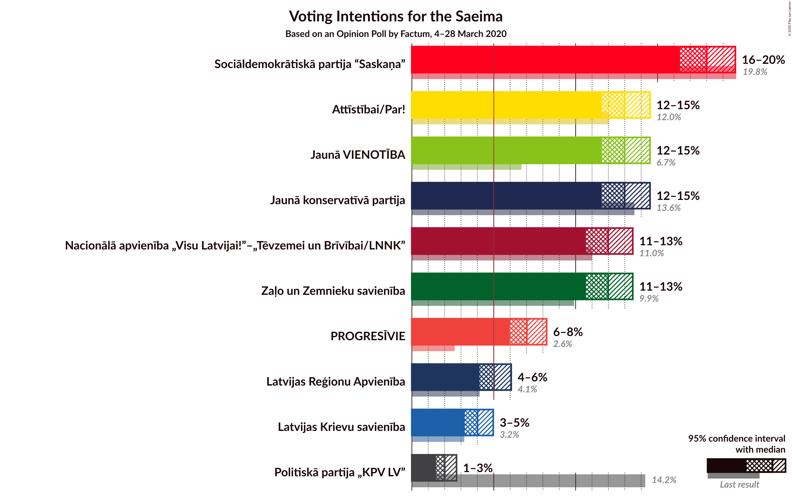

### Confidence Intervals

| Party | Last Result | Poll Result | 80% Confidence Interval | 90% Confidence Interval | 95% Confidence Interval | 99% Confidence Interval |
|:-----:|:-----------:|:-----------:|:-----------------------:|:-----------------------:|:-----------------------:|:-----------------------:|
| Sociāldemokrātiskā partija “Saskaņa” | 19.8% | 18.0% | 16.9–19.2% |16.6–19.5% |16.4–19.8% |15.9–20.3% |
| Jaunā konservatīvā partija | 13.6% | 13.0% | 12.1–14.0% |11.8–14.3% |11.6–14.5% |11.2–15.0% |
| Attīstībai/Par! | 12.0% | 13.0% | 12.1–14.0% |11.8–14.3% |11.6–14.5% |11.2–15.0% |
| Jaunā VIENOTĪBA | 6.7% | 13.0% | 12.1–14.0% |11.8–14.3% |11.6–14.5% |11.2–15.0% |
| Nacionālā apvienība „Visu Latvijai!”–„Tēvzemei un Brīvībai/LNNK” | 11.0% | 12.0% | 11.1–13.0% |10.8–13.2% |10.6–13.5% |10.2–14.0% |
| Zaļo un Zemnieku savienība | 9.9% | 12.0% | 11.1–13.0% |10.8–13.2% |10.6–13.5% |10.2–14.0% |
| PROGRESĪVIE | 2.6% | 7.0% | 6.3–7.8% |6.1–8.0% |6.0–8.2% |5.7–8.6% |
| Latvijas Reģionu Apvienība | 4.1% | 5.0% | 4.4–5.7% |4.3–5.9% |4.1–6.1% |3.9–6.4% |
| Latvijas Krievu savienība | 3.2% | 4.0% | 3.5–4.6% |3.4–4.8% |3.2–5.0% |3.0–5.3% |
| Politiskā partija „KPV LV” | 14.2% | 2.0% | 1.6–2.5% |1.6–2.6% |1.5–2.7% |1.3–3.0% |

*Note:* The poll result column reflects the actual value used in the calculations. Published results may vary slightly, and in addition be rounded to fewer digits.

## Seats

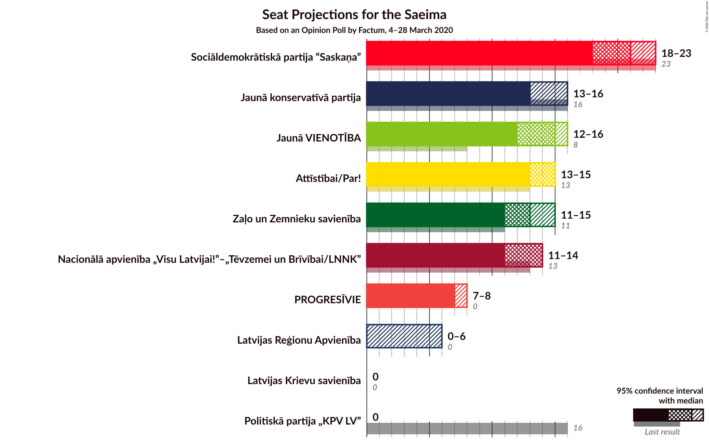

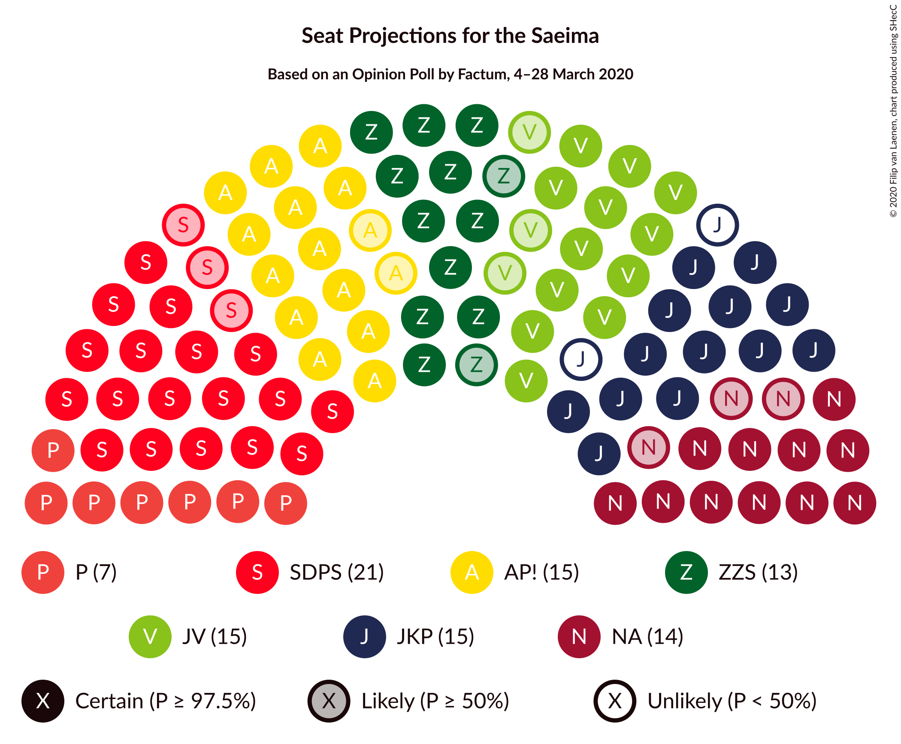

### Confidence Intervals

| Party | Last Result | Median | 80% Confidence Interval | 90% Confidence Interval | 95% Confidence Interval | 99% Confidence Interval |
|:-----:|:-----------:|:------:|:-----------------------:|:-----------------------:|:-----------------------:|:-----------------------:|
| <a href="#sociāldemokrātiskā-partija-“saskaņa”">Sociāldemokrātiskā partija “Saskaņa”</a> | 23 | 21 | 19–22 |19–23 |18–23 |18–24 |
| <a href="#jaunā-konservatīvā-partija">Jaunā konservatīvā partija</a> | 16 | 13 | 13–15 |13–15 |13–16 |12–17 |
| <a href="#attīstībai/par!">Attīstībai/Par!</a> | 13 | 15 | 14–15 |14–15 |13–15 |12–16 |
| <a href="#jaunā-vienotība">Jaunā VIENOTĪBA</a> | 8 | 15 | 13–16 |12–16 |12–16 |11–17 |
| <a href="#nacionālā-apvienība-„visu-latvijai!”–„tēvzemei-un-brīvībai/lnnk”">Nacionālā apvienība „Visu Latvijai!”–„Tēvzemei un Brīvībai/LNNK”</a> | 13 | 14 | 12–14 |11–14 |11–14 |11–15 |
| <a href="#zaļo-un-zemnieku-savienība">Zaļo un Zemnieku savienība</a> | 11 | 13 | 12–14 |12–15 |11–15 |11–16 |
| <a href="#progresīvie">PROGRESĪVIE</a> | 0 | 7 | 7–8 |7–8 |7–8 |6–9 |
| <a href="#latvijas-reģionu-apvienība">Latvijas Reģionu Apvienība</a> | 0 | 0 | 0–6 |0–6 |0–6 |0–6 |
| <a href="#latvijas-krievu-savienība">Latvijas Krievu savienība</a> | 0 | 0 | 0 |0 |0 |0–6 |
| <a href="#politiskā-partija-„kpv-lv”">Politiskā partija „KPV LV”</a> | 16 | 0 | 0 |0 |0 |0 |

### Sociāldemokrātiskā partija “Saskaņa”

*For a full overview of the results for this party, see the [Sociāldemokrātiskā partija “Saskaņa”](party-sociāldemokrātiskāpartija“saskaņa”.html) page.*

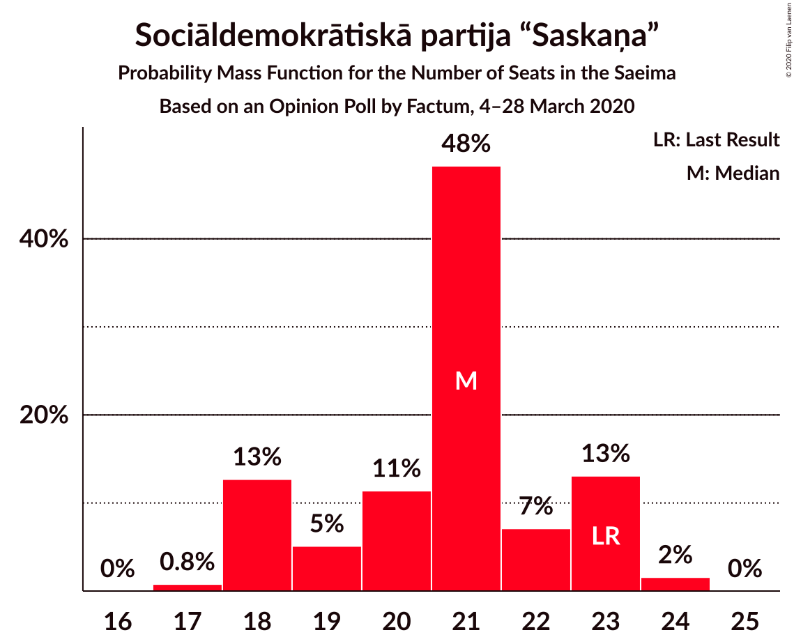

| Number of Seats | Probability | Accumulated | Special Marks |
|:---------------:|:-----------:|:-----------:|:-------------:|
| 17 | 0.3% | 100% |  |
| 18 | 4% | 99.7% |  |
| 19 | 24% | 96% |  |
| 20 | 11% | 72% |  |
| 21 | 40% | 61% | Median |
| 22 | 13% | 20% |  |
| 23 | 6% | 7% | Last Result |
| 24 | 2% | 2% |  |
| 25 | 0% | 0% |  |

### Jaunā konservatīvā partija

*For a full overview of the results for this party, see the [Jaunā konservatīvā partija](party-jaunākonservatīvāpartija.html) page.*

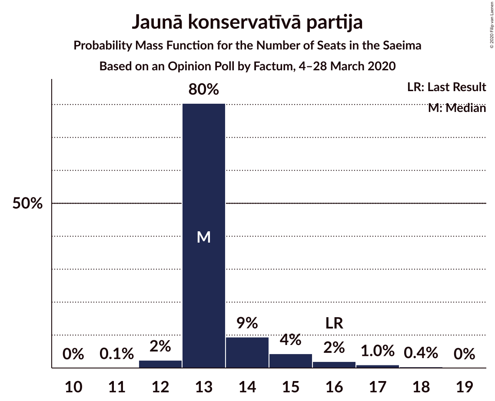

| Number of Seats | Probability | Accumulated | Special Marks |
|:---------------:|:-----------:|:-----------:|:-------------:|
| 12 | 1.0% | 100% |  |
| 13 | 50% | 99.0% | Median |
| 14 | 18% | 49% |  |
| 15 | 26% | 30% |  |
| 16 | 2% | 5% | Last Result |
| 17 | 2% | 2% |  |
| 18 | 0.1% | 0.1% |  |
| 19 | 0% | 0% |  |

### Attīstībai/Par!

*For a full overview of the results for this party, see the [Attīstībai/Par!](party-attīstībaipar.html) page.*

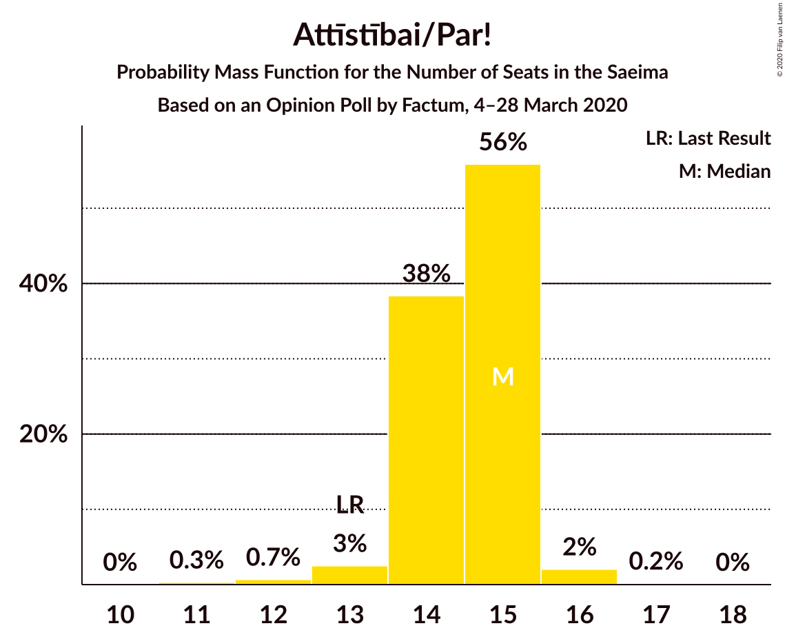

| Number of Seats | Probability | Accumulated | Special Marks |
|:---------------:|:-----------:|:-----------:|:-------------:|
| 11 | 0.3% | 100% |  |
| 12 | 0.7% | 99.7% |  |
| 13 | 3% | 99.0% | Last Result |
| 14 | 38% | 96% |  |
| 15 | 56% | 58% | Median |
| 16 | 2% | 2% |  |
| 17 | 0.2% | 0.2% |  |
| 18 | 0% | 0% |  |

### Jaunā VIENOTĪBA

*For a full overview of the results for this party, see the [Jaunā VIENOTĪBA](party-jaunāvienotība.html) page.*

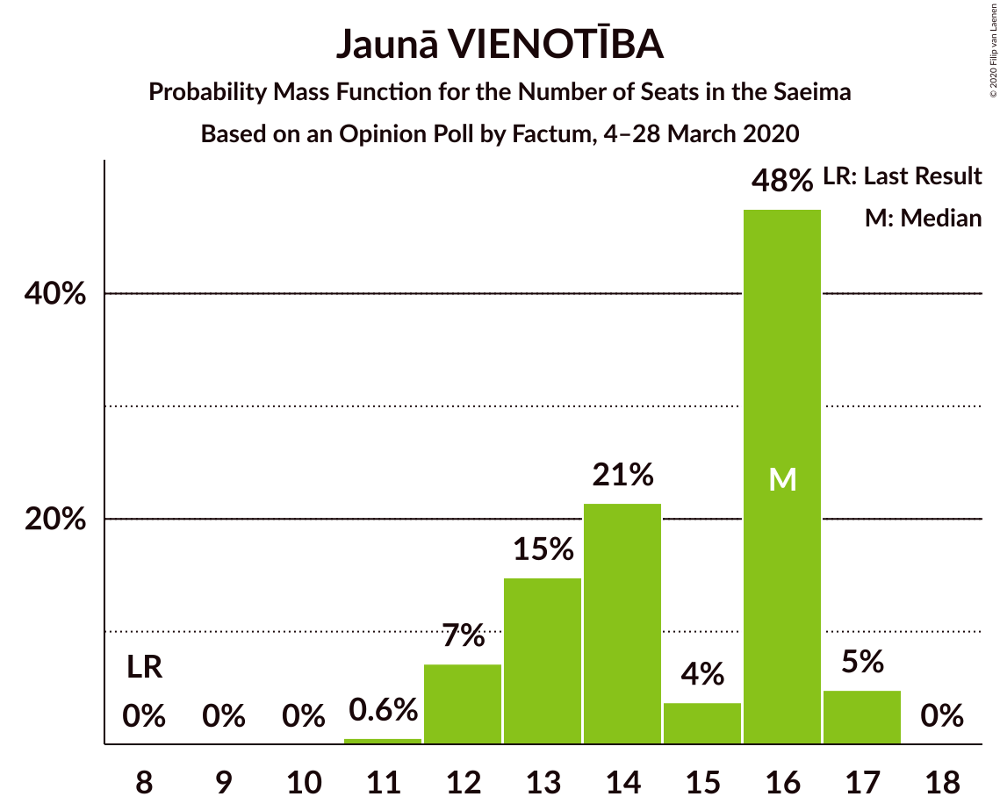

| Number of Seats | Probability | Accumulated | Special Marks |
|:---------------:|:-----------:|:-----------:|:-------------:|
| 8 | 0% | 100% | Last Result |
| 9 | 0% | 100% |  |
| 10 | 0% | 100% |  |
| 11 | 1.1% | 100% |  |
| 12 | 7% | 98.9% |  |
| 13 | 23% | 91% |  |
| 14 | 14% | 68% |  |
| 15 | 31% | 54% | Median |
| 16 | 21% | 24% |  |
| 17 | 2% | 2% |  |
| 18 | 0% | 0% |  |

### Nacionālā apvienība „Visu Latvijai!”–„Tēvzemei un Brīvībai/LNNK”

*For a full overview of the results for this party, see the [Nacionālā apvienība „Visu Latvijai!”–„Tēvzemei un Brīvībai/LNNK”](party-nacionālāapvienība„visulatvijai”–„tēvzemeiunbrīvībailnnk”.html) page.*

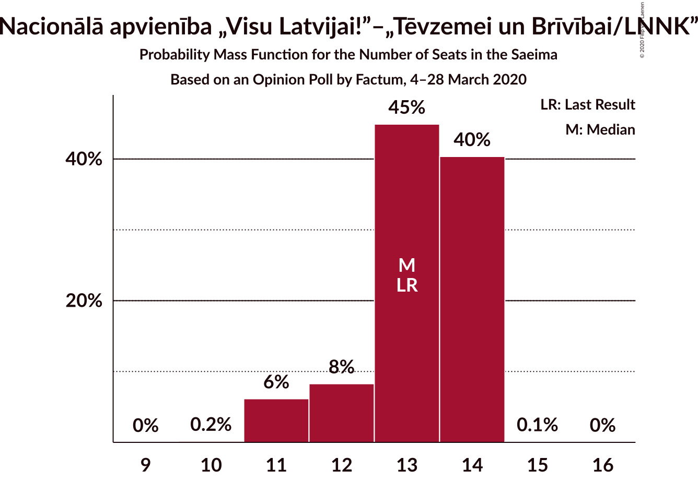

| Number of Seats | Probability | Accumulated | Special Marks |
|:---------------:|:-----------:|:-----------:|:-------------:|
| 10 | 0.2% | 100% |  |
| 11 | 7% | 99.8% |  |
| 12 | 11% | 93% |  |
| 13 | 20% | 82% | Last Result |
| 14 | 61% | 62% | Median |
| 15 | 0.7% | 0.9% |  |
| 16 | 0.2% | 0.2% |  |
| 17 | 0% | 0% |  |

### Zaļo un Zemnieku savienība

*For a full overview of the results for this party, see the [Zaļo un Zemnieku savienība](party-zaļounzemniekusavienība.html) page.*

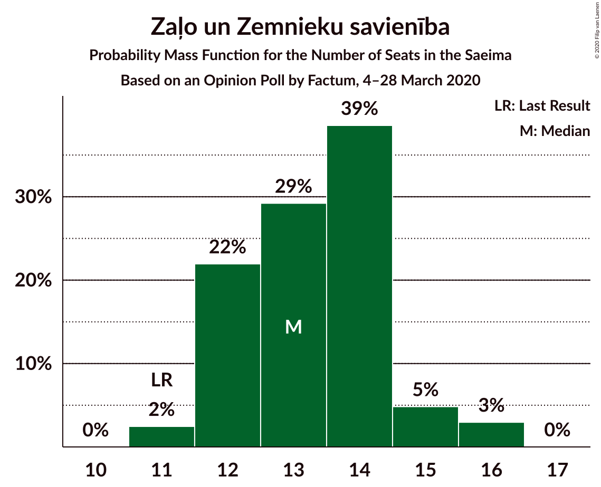

| Number of Seats | Probability | Accumulated | Special Marks |
|:---------------:|:-----------:|:-----------:|:-------------:|
| 11 | 3% | 100% | Last Result |
| 12 | 17% | 97% |  |
| 13 | 52% | 80% | Median |
| 14 | 21% | 28% |  |
| 15 | 5% | 7% |  |
| 16 | 2% | 2% |  |
| 17 | 0.1% | 0.1% |  |
| 18 | 0% | 0% |  |

### PROGRESĪVIE

*For a full overview of the results for this party, see the [PROGRESĪVIE](party-progresīvie.html) page.*

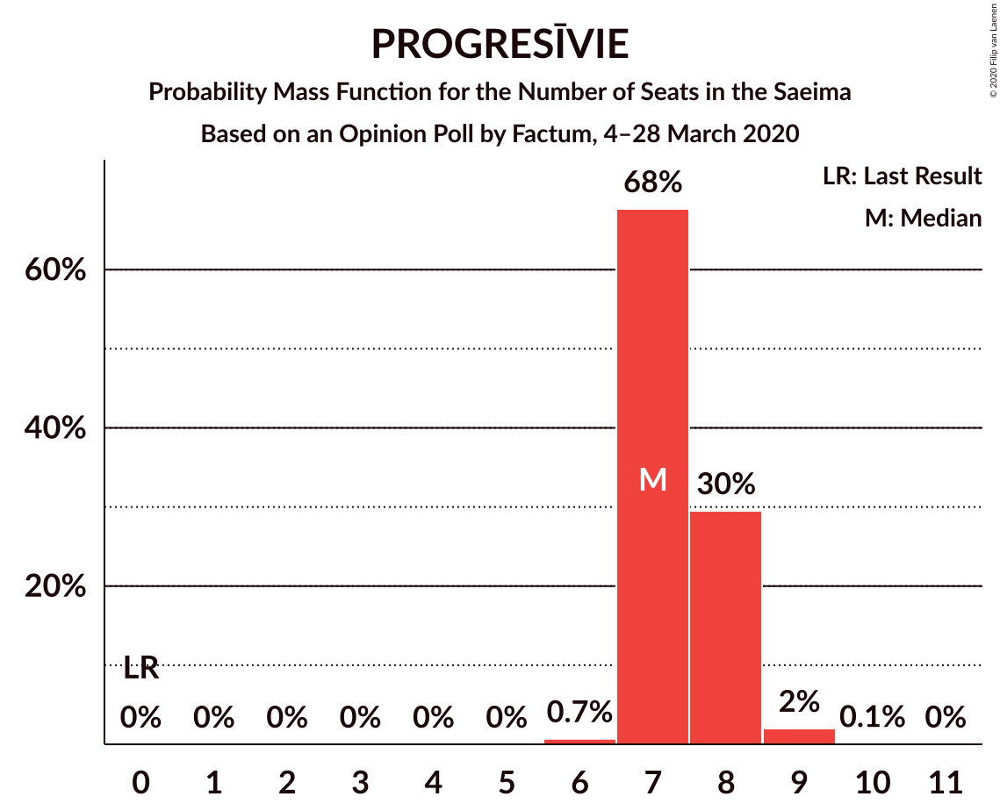

| Number of Seats | Probability | Accumulated | Special Marks |
|:---------------:|:-----------:|:-----------:|:-------------:|
| 0 | 0% | 100% | Last Result |
| 1 | 0% | 100% |  |
| 2 | 0% | 100% |  |
| 3 | 0% | 100% |  |
| 4 | 0% | 100% |  |
| 5 | 0% | 100% |  |
| 6 | 0.7% | 100% |  |
| 7 | 68% | 99.3% | Median |
| 8 | 30% | 32% |  |
| 9 | 2% | 2% |  |
| 10 | 0.1% | 0.1% |  |
| 11 | 0% | 0% |  |

### Latvijas Reģionu Apvienība

*For a full overview of the results for this party, see the [Latvijas Reģionu Apvienība](party-latvijasreģionuapvienība.html) page.*

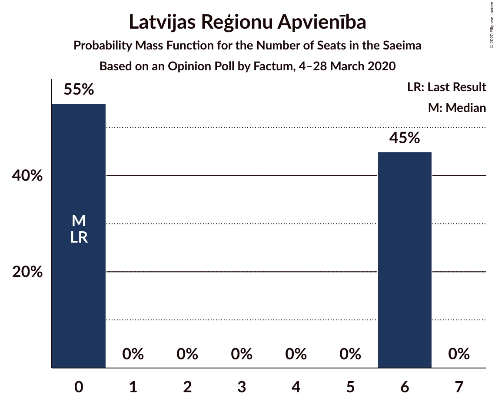

| Number of Seats | Probability | Accumulated | Special Marks |
|:---------------:|:-----------:|:-----------:|:-------------:|
| 0 | 55% | 100% | Last Result, Median |
| 1 | 0% | 45% |  |
| 2 | 0% | 45% |  |
| 3 | 0% | 45% |  |
| 4 | 0% | 45% |  |
| 5 | 0% | 45% |  |
| 6 | 45% | 45% |  |
| 7 | 0% | 0% |  |

### Latvijas Krievu savienība

*For a full overview of the results for this party, see the [Latvijas Krievu savienība](party-latvijaskrievusavienība.html) page.*

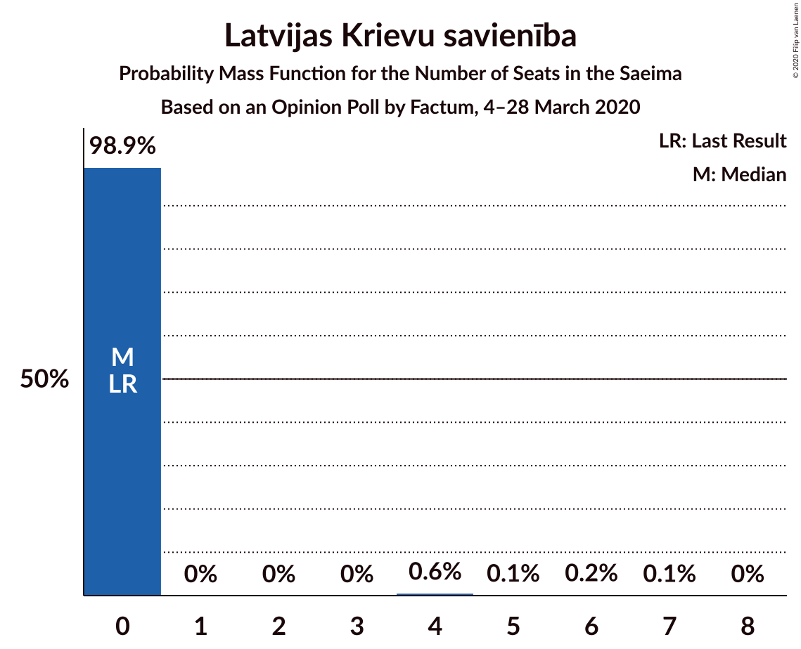

| Number of Seats | Probability | Accumulated | Special Marks |
|:---------------:|:-----------:|:-----------:|:-------------:|
| 0 | 98% | 100% | Last Result, Median |
| 1 | 0% | 2% |  |
| 2 | 0% | 2% |  |
| 3 | 0% | 2% |  |
| 4 | 0.1% | 2% |  |
| 5 | 1.1% | 2% |  |
| 6 | 0.4% | 0.5% |  |
| 7 | 0.1% | 0.1% |  |
| 8 | 0% | 0% |  |

### Politiskā partija „KPV LV”

*For a full overview of the results for this party, see the [Politiskā partija „KPV LV”](party-politiskāpartija„kpvlv”.html) page.*

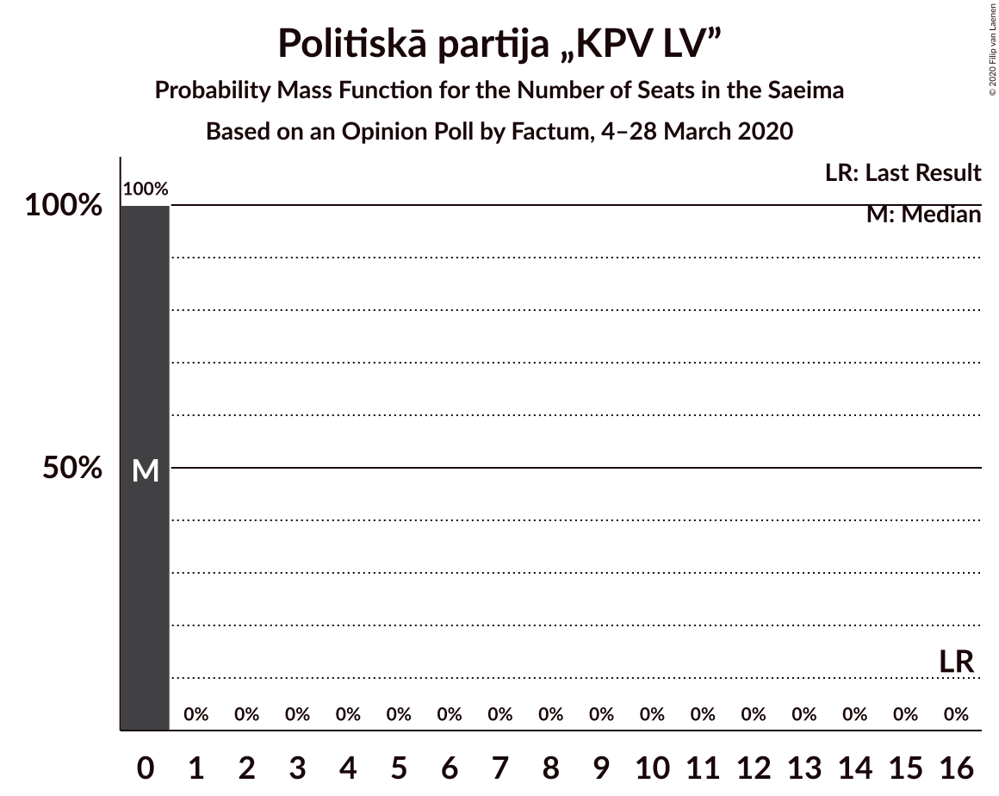

| Number of Seats | Probability | Accumulated | Special Marks |
|:---------------:|:-----------:|:-----------:|:-------------:|
| 0 | 100% | 100% | Median |
| 1 | 0% | 0% |  |
| 2 | 0% | 0% |  |
| 3 | 0% | 0% |  |
| 4 | 0% | 0% |  |
| 5 | 0% | 0% |  |
| 6 | 0% | 0% |  |
| 7 | 0% | 0% |  |
| 8 | 0% | 0% |  |
| 9 | 0% | 0% |  |
| 10 | 0% | 0% |  |
| 11 | 0% | 0% |  |
| 12 | 0% | 0% |  |
| 13 | 0% | 0% |  |
| 14 | 0% | 0% |  |
| 15 | 0% | 0% |  |
| 16 | 0% | 0% | Last Result |

## Coalitions

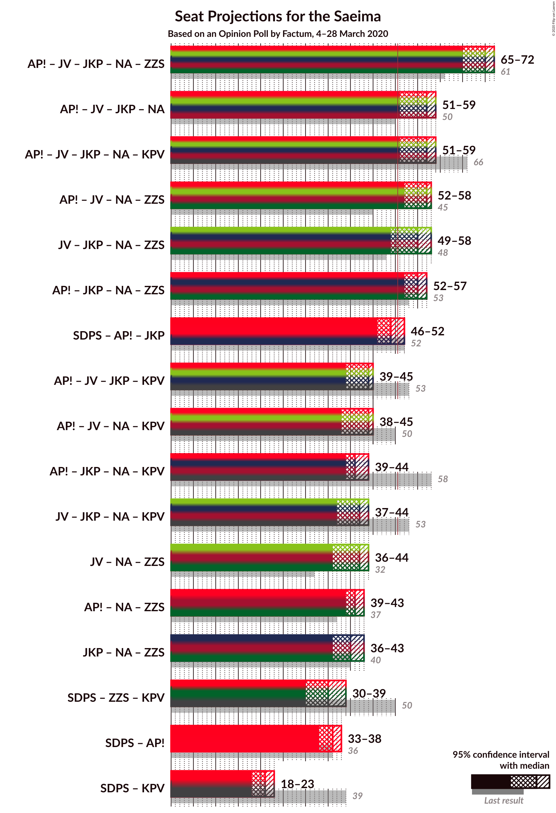

### Confidence Intervals

| Coalition | Last Result | Median | Majority? | 80% Confidence Interval | 90% Confidence Interval | 95% Confidence Interval | 99% Confidence Interval |
|:---------:|:-----------:|:------:|:---------:|:-----------------------:|:-----------------------:|:-----------------------:|:-----------------------:|
| Attīstībai/Par! – Jaunā VIENOTĪBA – Jaunā konservatīvā partija – Nacionālā apvienība „Visu Latvijai!”–„Tēvzemei un Brīvībai/LNNK” – Zaļo un Zemnieku savienība | 61 | 70 | 100% | 66–72 | 65–72 | 65–73 | 63–74 |
| Attīstībai/Par! – Jaunā VIENOTĪBA – Jaunā konservatīvā partija – Nacionālā apvienība „Visu Latvijai!”–„Tēvzemei un Brīvībai/LNNK” | 50 | 56 | 99.9% | 53–59 | 52–59 | 51–60 | 51–61 |
| Attīstībai/Par! – Jaunā VIENOTĪBA – Jaunā konservatīvā partija – Nacionālā apvienība „Visu Latvijai!”–„Tēvzemei un Brīvībai/LNNK” – Politiskā partija „KPV LV” | 66 | 56 | 99.9% | 53–59 | 52–59 | 51–60 | 51–61 |
| Attīstībai/Par! – Jaunā konservatīvā partija – Nacionālā apvienība „Visu Latvijai!”–„Tēvzemei un Brīvībai/LNNK” – Zaļo un Zemnieku savienība | 53 | 55 | 98.7% | 53–57 | 52–57 | 52–58 | 50–59 |
| Attīstībai/Par! – Jaunā VIENOTĪBA – Nacionālā apvienība „Visu Latvijai!”–„Tēvzemei un Brīvībai/LNNK” – Zaļo un Zemnieku savienība | 45 | 56 | 98% | 52–58 | 52–58 | 51–58 | 50–59 |
| Jaunā VIENOTĪBA – Jaunā konservatīvā partija – Nacionālā apvienība „Visu Latvijai!”–„Tēvzemei un Brīvībai/LNNK” – Zaļo un Zemnieku savienība | 48 | 55 | 98% | 51–57 | 51–58 | 51–58 | 49–59 |
| Sociāldemokrātiskā partija “Saskaņa” – Attīstībai/Par! – Jaunā konservatīvā partija | 52 | 49 | 32% | 47–51 | 46–51 | 46–52 | 44–53 |
| Attīstībai/Par! – Jaunā VIENOTĪBA – Jaunā konservatīvā partija – Politiskā partija „KPV LV” | 53 | 43 | 0% | 40–45 | 40–45 | 39–47 | 38–47 |
| Jaunā VIENOTĪBA – Jaunā konservatīvā partija – Nacionālā apvienība „Visu Latvijai!”–„Tēvzemei un Brīvībai/LNNK” – Politiskā partija „KPV LV” | 53 | 42 | 0% | 39–44 | 38–44 | 37–46 | 37–46 |
| Attīstībai/Par! – Jaunā VIENOTĪBA – Nacionālā apvienība „Visu Latvijai!”–„Tēvzemei un Brīvībai/LNNK” – Politiskā partija „KPV LV” | 50 | 43 | 0% | 40–44 | 39–45 | 38–45 | 38–46 |
| Attīstībai/Par! – Jaunā konservatīvā partija – Nacionālā apvienība „Visu Latvijai!”–„Tēvzemei un Brīvībai/LNNK” – Politiskā partija „KPV LV” | 58 | 42 | 0% | 40–44 | 39–44 | 38–45 | 38–46 |
| Jaunā VIENOTĪBA – Nacionālā apvienība „Visu Latvijai!”–„Tēvzemei un Brīvībai/LNNK” – Zaļo un Zemnieku savienība | 32 | 42 | 0% | 38–43 | 38–43 | 37–44 | 36–44 |
| Attīstībai/Par! – Nacionālā apvienība „Visu Latvijai!”–„Tēvzemei un Brīvībai/LNNK” – Zaļo un Zemnieku savienība | 37 | 41 | 0% | 39–42 | 38–43 | 38–43 | 36–45 |
| Jaunā konservatīvā partija – Nacionālā apvienība „Visu Latvijai!”–„Tēvzemei un Brīvībai/LNNK” – Zaļo un Zemnieku savienība | 40 | 40 | 0% | 38–42 | 38–43 | 37–43 | 36–45 |
| Sociāldemokrātiskā partija “Saskaņa” – Attīstībai/Par! | 36 | 36 | 0% | 33–37 | 33–37 | 33–38 | 31–39 |
| Sociāldemokrātiskā partija “Saskaņa” – Zaļo un Zemnieku savienība – Politiskā partija „KPV LV” | 50 | 34 | 0% | 32–36 | 31–36 | 30–38 | 30–39 |
| Sociāldemokrātiskā partija “Saskaņa” – Politiskā partija „KPV LV” | 39 | 21 | 0% | 19–22 | 19–23 | 18–23 | 18–24 |

### Attīstībai/Par! – Jaunā VIENOTĪBA – Jaunā konservatīvā partija – Nacionālā apvienība „Visu Latvijai!”–„Tēvzemei un Brīvībai/LNNK” – Zaļo un Zemnieku savienība

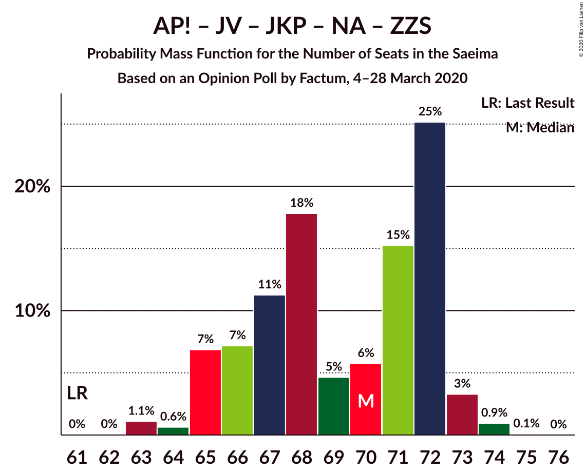

| Number of Seats | Probability | Accumulated | Special Marks |
|:---------------:|:-----------:|:-----------:|:-------------:|
| 61 | 0% | 100% | Last Result |
| 62 | 0% | 100% |  |
| 63 | 1.1% | 99.9% |  |
| 64 | 0.6% | 98.8% |  |
| 65 | 7% | 98% |  |
| 66 | 7% | 91% |  |
| 67 | 11% | 84% |  |
| 68 | 18% | 73% |  |
| 69 | 5% | 55% |  |
| 70 | 6% | 50% | Median |
| 71 | 15% | 45% |  |
| 72 | 25% | 29% |  |
| 73 | 3% | 4% |  |
| 74 | 0.9% | 1.0% |  |
| 75 | 0.1% | 0.1% |  |
| 76 | 0% | 0% |  |

### Attīstībai/Par! – Jaunā VIENOTĪBA – Jaunā konservatīvā partija – Nacionālā apvienība „Visu Latvijai!”–„Tēvzemei un Brīvībai/LNNK”

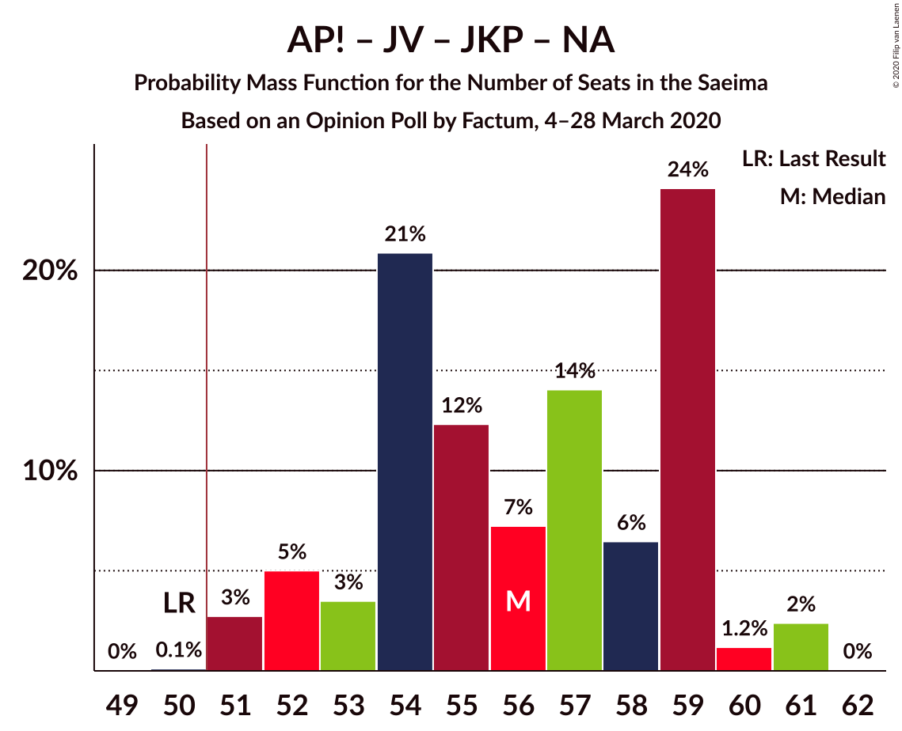

| Number of Seats | Probability | Accumulated | Special Marks |
|:---------------:|:-----------:|:-----------:|:-------------:|
| 50 | 0.1% | 100% | Last Result |
| 51 | 3% | 99.9% | Majority |
| 52 | 5% | 97% |  |
| 53 | 3% | 92% |  |
| 54 | 21% | 89% |  |
| 55 | 12% | 68% |  |
| 56 | 7% | 55% |  |
| 57 | 14% | 48% | Median |
| 58 | 6% | 34% |  |
| 59 | 24% | 28% |  |
| 60 | 1.2% | 4% |  |
| 61 | 2% | 2% |  |
| 62 | 0% | 0% |  |

### Attīstībai/Par! – Jaunā VIENOTĪBA – Jaunā konservatīvā partija – Nacionālā apvienība „Visu Latvijai!”–„Tēvzemei un Brīvībai/LNNK” – Politiskā partija „KPV LV”

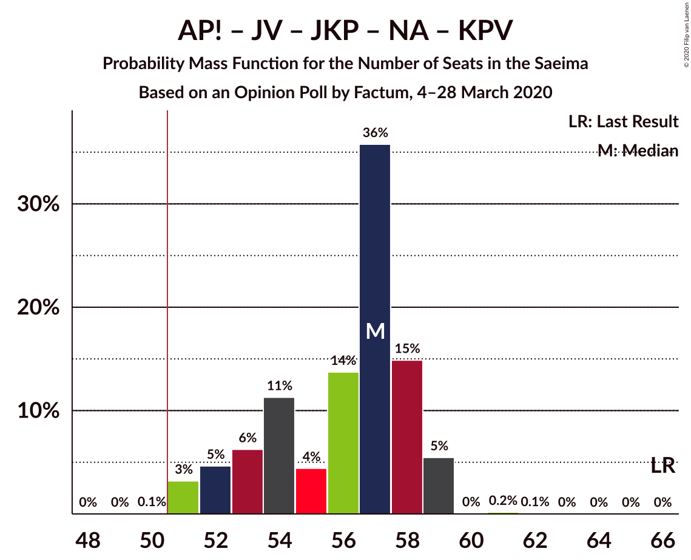

| Number of Seats | Probability | Accumulated | Special Marks |
|:---------------:|:-----------:|:-----------:|:-------------:|
| 50 | 0.1% | 100% |  |
| 51 | 3% | 99.9% | Majority |
| 52 | 5% | 97% |  |
| 53 | 3% | 92% |  |
| 54 | 21% | 89% |  |
| 55 | 12% | 68% |  |
| 56 | 7% | 55% |  |
| 57 | 14% | 48% | Median |
| 58 | 6% | 34% |  |
| 59 | 24% | 28% |  |
| 60 | 1.2% | 4% |  |
| 61 | 2% | 2% |  |
| 62 | 0% | 0% |  |
| 63 | 0% | 0% |  |
| 64 | 0% | 0% |  |
| 65 | 0% | 0% |  |
| 66 | 0% | 0% | Last Result |

### Attīstībai/Par! – Jaunā konservatīvā partija – Nacionālā apvienība „Visu Latvijai!”–„Tēvzemei un Brīvībai/LNNK” – Zaļo un Zemnieku savienība

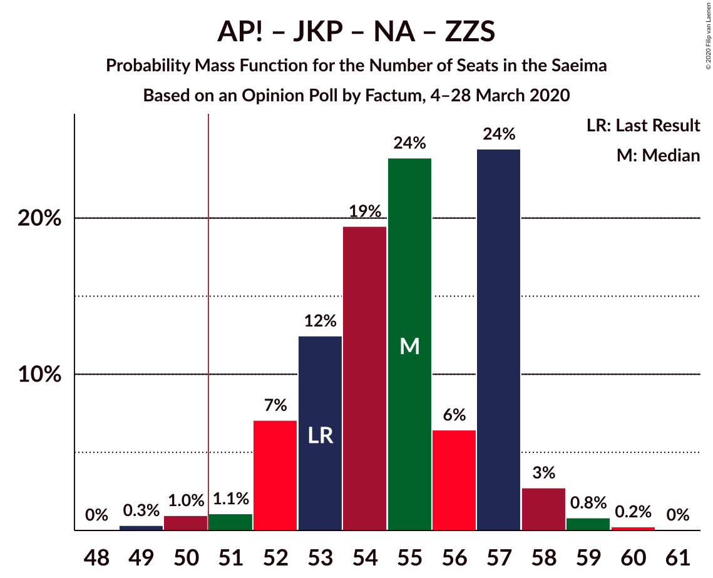

| Number of Seats | Probability | Accumulated | Special Marks |
|:---------------:|:-----------:|:-----------:|:-------------:|
| 49 | 0.3% | 100% |  |
| 50 | 1.0% | 99.6% |  |
| 51 | 1.1% | 98.7% | Majority |
| 52 | 7% | 98% |  |
| 53 | 12% | 91% | Last Result |
| 54 | 19% | 78% |  |
| 55 | 24% | 59% | Median |
| 56 | 6% | 35% |  |
| 57 | 24% | 28% |  |
| 58 | 3% | 4% |  |
| 59 | 0.8% | 1.1% |  |
| 60 | 0.2% | 0.3% |  |
| 61 | 0% | 0% |  |

### Attīstībai/Par! – Jaunā VIENOTĪBA – Nacionālā apvienība „Visu Latvijai!”–„Tēvzemei un Brīvībai/LNNK” – Zaļo un Zemnieku savienība

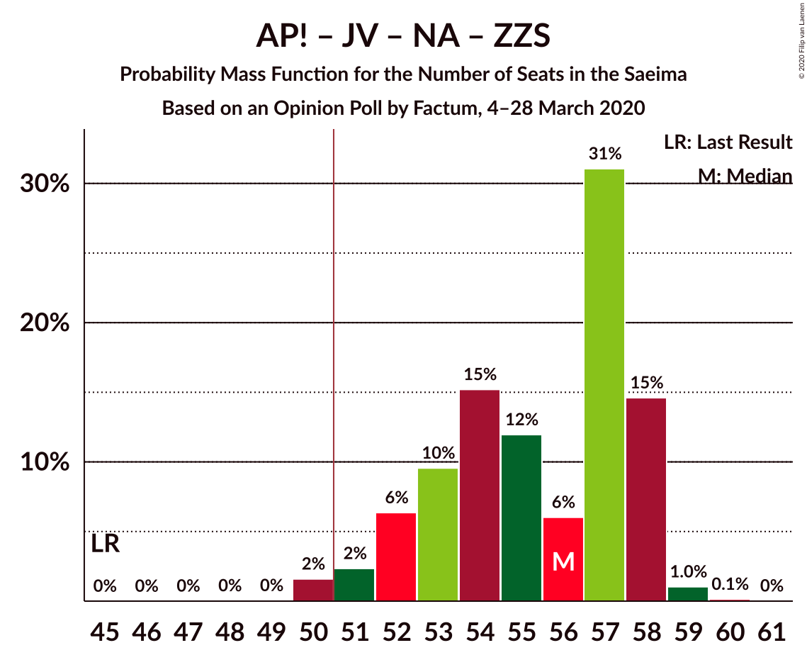

| Number of Seats | Probability | Accumulated | Special Marks |
|:---------------:|:-----------:|:-----------:|:-------------:|
| 45 | 0% | 100% | Last Result |
| 46 | 0% | 100% |  |
| 47 | 0% | 100% |  |
| 48 | 0% | 100% |  |
| 49 | 0% | 100% |  |
| 50 | 2% | 99.9% |  |
| 51 | 2% | 98% | Majority |
| 52 | 6% | 96% |  |
| 53 | 10% | 90% |  |
| 54 | 15% | 80% |  |
| 55 | 12% | 65% |  |
| 56 | 6% | 53% |  |
| 57 | 31% | 47% | Median |
| 58 | 15% | 16% |  |
| 59 | 1.0% | 1.2% |  |
| 60 | 0.1% | 0.2% |  |
| 61 | 0% | 0% |  |

### Jaunā VIENOTĪBA – Jaunā konservatīvā partija – Nacionālā apvienība „Visu Latvijai!”–„Tēvzemei un Brīvībai/LNNK” – Zaļo un Zemnieku savienība

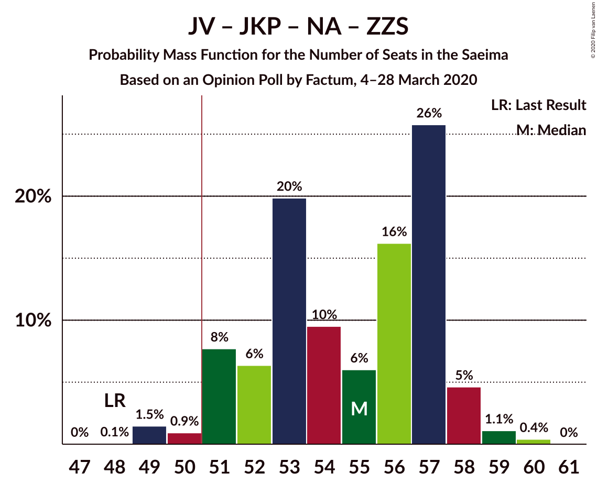

| Number of Seats | Probability | Accumulated | Special Marks |
|:---------------:|:-----------:|:-----------:|:-------------:|
| 48 | 0.1% | 100% | Last Result |
| 49 | 1.5% | 99.9% |  |
| 50 | 0.9% | 98% |  |
| 51 | 8% | 98% | Majority |
| 52 | 6% | 90% |  |
| 53 | 20% | 83% |  |
| 54 | 10% | 64% |  |
| 55 | 6% | 54% | Median |
| 56 | 16% | 48% |  |
| 57 | 26% | 32% |  |
| 58 | 5% | 6% |  |
| 59 | 1.1% | 2% |  |
| 60 | 0.4% | 0.4% |  |
| 61 | 0% | 0% |  |

### Sociāldemokrātiskā partija “Saskaņa” – Attīstībai/Par! – Jaunā konservatīvā partija

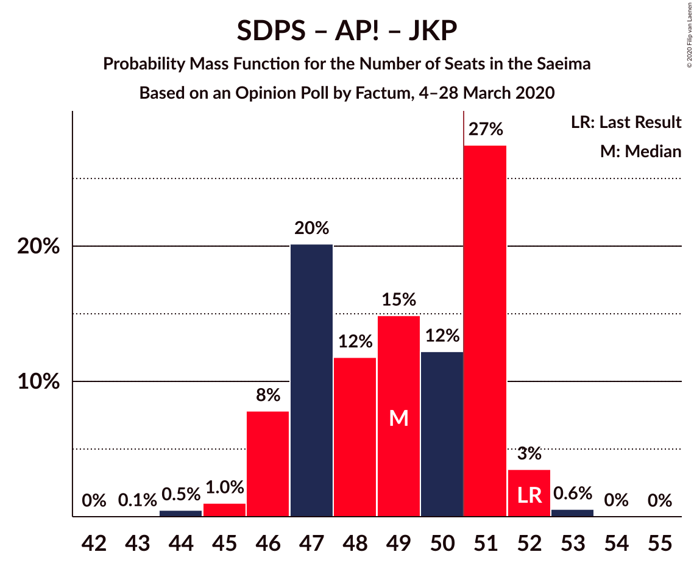

| Number of Seats | Probability | Accumulated | Special Marks |
|:---------------:|:-----------:|:-----------:|:-------------:|
| 43 | 0.1% | 100% |  |
| 44 | 0.5% | 99.9% |  |
| 45 | 1.0% | 99.4% |  |
| 46 | 8% | 98% |  |
| 47 | 20% | 91% |  |
| 48 | 12% | 70% |  |
| 49 | 15% | 59% | Median |
| 50 | 12% | 44% |  |
| 51 | 27% | 32% | Majority |
| 52 | 3% | 4% | Last Result |
| 53 | 0.6% | 0.6% |  |
| 54 | 0% | 0.1% |  |
| 55 | 0% | 0% |  |

### Attīstībai/Par! – Jaunā VIENOTĪBA – Jaunā konservatīvā partija – Politiskā partija „KPV LV”

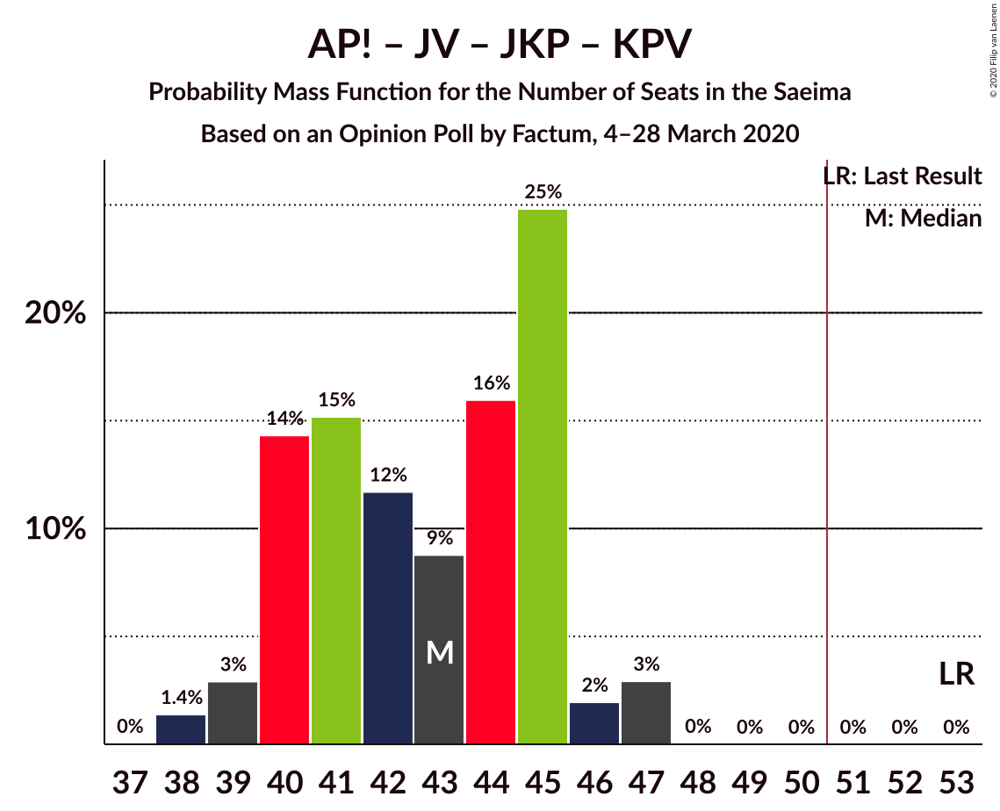

| Number of Seats | Probability | Accumulated | Special Marks |
|:---------------:|:-----------:|:-----------:|:-------------:|
| 37 | 0% | 100% |  |
| 38 | 1.4% | 99.9% |  |
| 39 | 3% | 98.6% |  |
| 40 | 14% | 96% |  |
| 41 | 15% | 81% |  |
| 42 | 12% | 66% |  |
| 43 | 9% | 54% | Median |
| 44 | 16% | 46% |  |
| 45 | 25% | 30% |  |
| 46 | 2% | 5% |  |
| 47 | 3% | 3% |  |
| 48 | 0% | 0% |  |
| 49 | 0% | 0% |  |
| 50 | 0% | 0% |  |
| 51 | 0% | 0% | Majority |
| 52 | 0% | 0% |  |
| 53 | 0% | 0% | Last Result |

### Jaunā VIENOTĪBA – Jaunā konservatīvā partija – Nacionālā apvienība „Visu Latvijai!”–„Tēvzemei un Brīvībai/LNNK” – Politiskā partija „KPV LV”

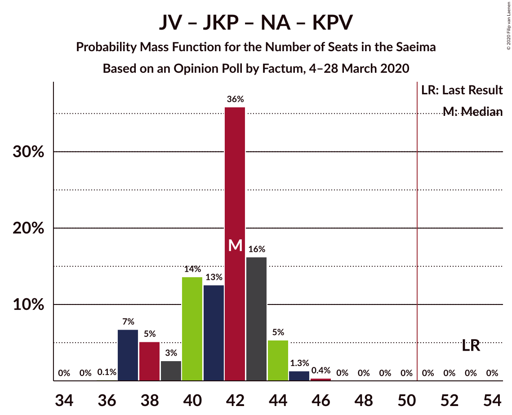

| Number of Seats | Probability | Accumulated | Special Marks |
|:---------------:|:-----------:|:-----------:|:-------------:|
| 36 | 0.2% | 100% |  |
| 37 | 3% | 99.8% |  |
| 38 | 5% | 97% |  |
| 39 | 11% | 92% |  |
| 40 | 14% | 81% |  |
| 41 | 16% | 66% |  |
| 42 | 13% | 50% | Median |
| 43 | 8% | 38% |  |
| 44 | 25% | 30% |  |
| 45 | 2% | 5% |  |
| 46 | 3% | 3% |  |
| 47 | 0% | 0% |  |
| 48 | 0% | 0% |  |
| 49 | 0% | 0% |  |
| 50 | 0% | 0% |  |
| 51 | 0% | 0% | Majority |
| 52 | 0% | 0% |  |
| 53 | 0% | 0% | Last Result |

### Attīstībai/Par! – Jaunā VIENOTĪBA – Nacionālā apvienība „Visu Latvijai!”–„Tēvzemei un Brīvībai/LNNK” – Politiskā partija „KPV LV”

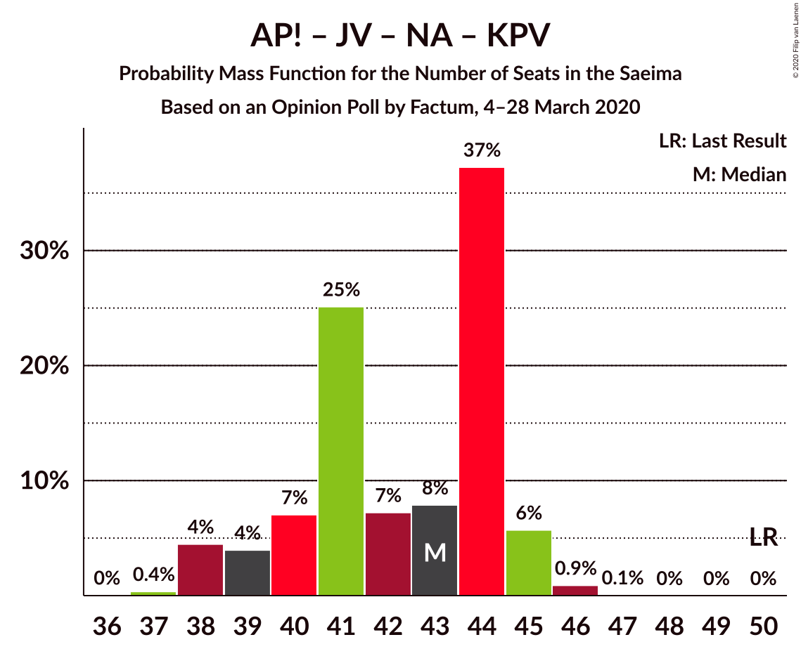

| Number of Seats | Probability | Accumulated | Special Marks |
|:---------------:|:-----------:|:-----------:|:-------------:|
| 37 | 0.4% | 100% |  |
| 38 | 4% | 99.6% |  |
| 39 | 4% | 95% |  |
| 40 | 7% | 91% |  |
| 41 | 25% | 84% |  |
| 42 | 7% | 59% |  |
| 43 | 8% | 52% |  |
| 44 | 37% | 44% | Median |
| 45 | 6% | 7% |  |
| 46 | 0.9% | 1.0% |  |
| 47 | 0.1% | 0.1% |  |
| 48 | 0% | 0% |  |
| 49 | 0% | 0% |  |
| 50 | 0% | 0% | Last Result |

### Attīstībai/Par! – Jaunā konservatīvā partija – Nacionālā apvienība „Visu Latvijai!”–„Tēvzemei un Brīvībai/LNNK” – Politiskā partija „KPV LV”

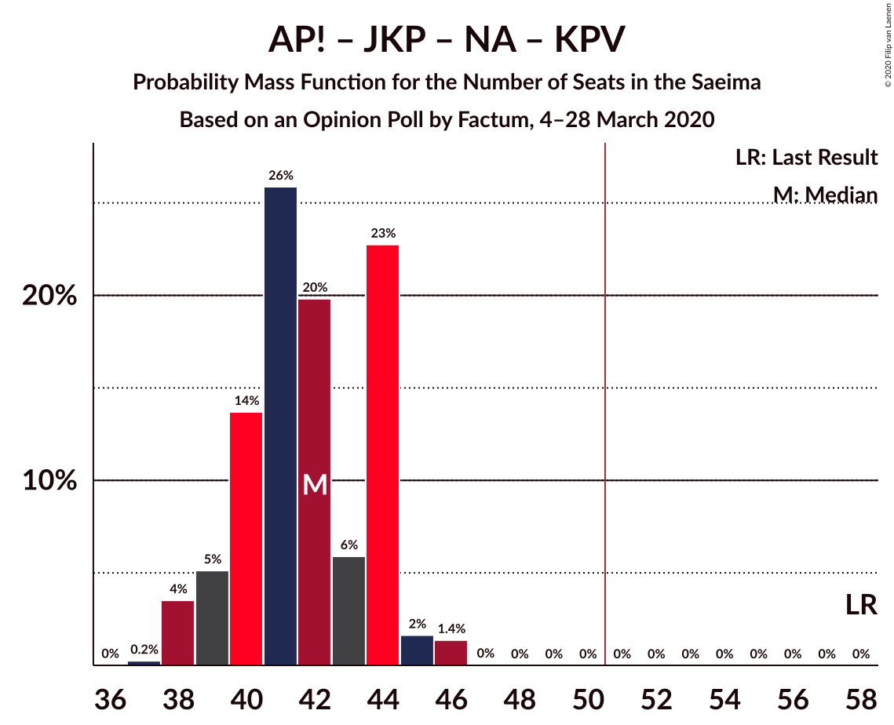

| Number of Seats | Probability | Accumulated | Special Marks |
|:---------------:|:-----------:|:-----------:|:-------------:|
| 37 | 0.2% | 100% |  |
| 38 | 4% | 99.7% |  |
| 39 | 5% | 96% |  |
| 40 | 14% | 91% |  |
| 41 | 26% | 77% |  |
| 42 | 20% | 52% | Median |
| 43 | 6% | 32% |  |
| 44 | 23% | 26% |  |
| 45 | 2% | 3% |  |
| 46 | 1.4% | 1.4% |  |
| 47 | 0% | 0% |  |
| 48 | 0% | 0% |  |
| 49 | 0% | 0% |  |
| 50 | 0% | 0% |  |
| 51 | 0% | 0% | Majority |
| 52 | 0% | 0% |  |
| 53 | 0% | 0% |  |
| 54 | 0% | 0% |  |
| 55 | 0% | 0% |  |
| 56 | 0% | 0% |  |
| 57 | 0% | 0% |  |
| 58 | 0% | 0% | Last Result |

### Jaunā VIENOTĪBA – Nacionālā apvienība „Visu Latvijai!”–„Tēvzemei un Brīvībai/LNNK” – Zaļo un Zemnieku savienība

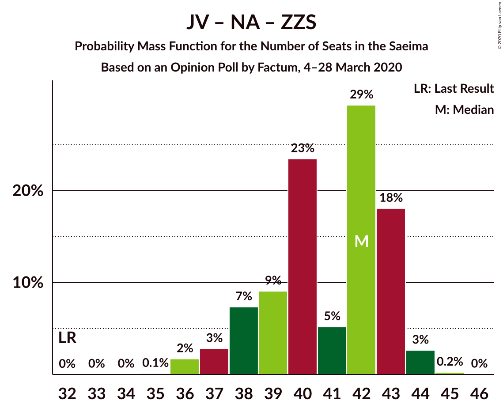

| Number of Seats | Probability | Accumulated | Special Marks |
|:---------------:|:-----------:|:-----------:|:-------------:|
| 32 | 0% | 100% | Last Result |
| 33 | 0% | 100% |  |
| 34 | 0% | 100% |  |
| 35 | 0.1% | 100% |  |
| 36 | 2% | 99.9% |  |
| 37 | 3% | 98% |  |
| 38 | 7% | 95% |  |
| 39 | 9% | 88% |  |
| 40 | 23% | 79% |  |
| 41 | 5% | 55% |  |
| 42 | 29% | 50% | Median |
| 43 | 18% | 21% |  |
| 44 | 3% | 3% |  |
| 45 | 0.2% | 0.3% |  |
| 46 | 0% | 0% |  |

### Attīstībai/Par! – Nacionālā apvienība „Visu Latvijai!”–„Tēvzemei un Brīvībai/LNNK” – Zaļo un Zemnieku savienība

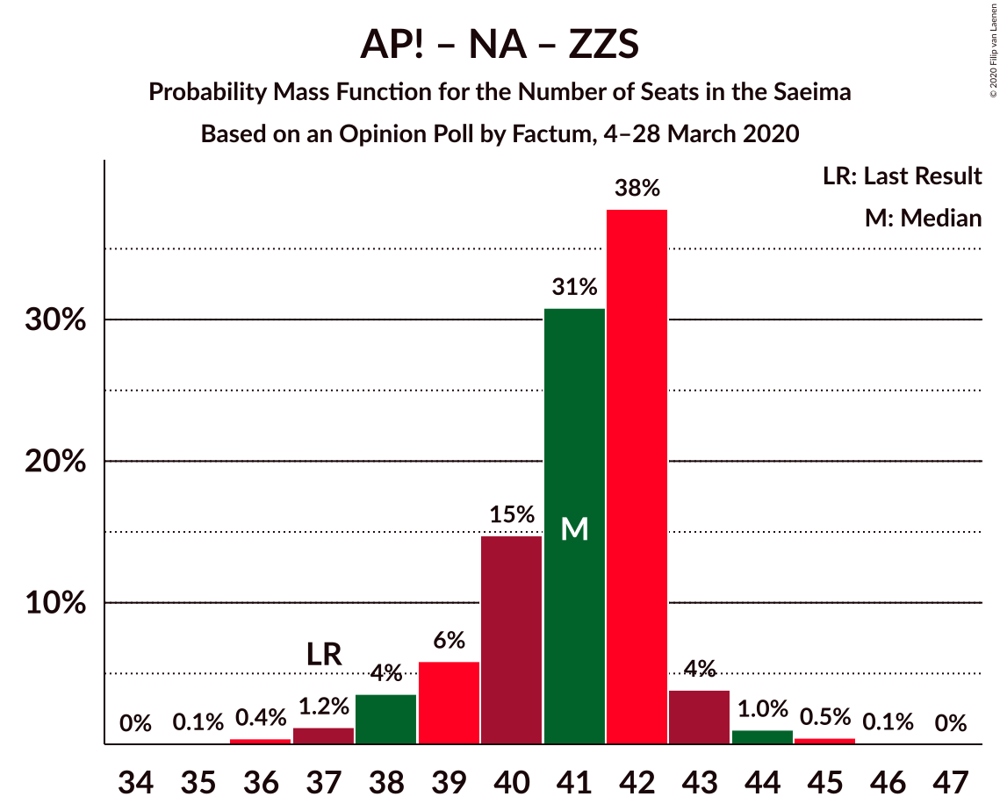

| Number of Seats | Probability | Accumulated | Special Marks |
|:---------------:|:-----------:|:-----------:|:-------------:|
| 35 | 0.1% | 100% |  |
| 36 | 0.4% | 99.9% |  |
| 37 | 1.2% | 99.5% | Last Result |
| 38 | 4% | 98% |  |
| 39 | 6% | 95% |  |
| 40 | 15% | 89% |  |
| 41 | 31% | 74% |  |
| 42 | 38% | 43% | Median |
| 43 | 4% | 5% |  |
| 44 | 1.0% | 2% |  |
| 45 | 0.5% | 0.6% |  |
| 46 | 0.1% | 0.1% |  |
| 47 | 0% | 0% |  |

### Jaunā konservatīvā partija – Nacionālā apvienība „Visu Latvijai!”–„Tēvzemei un Brīvībai/LNNK” – Zaļo un Zemnieku savienība

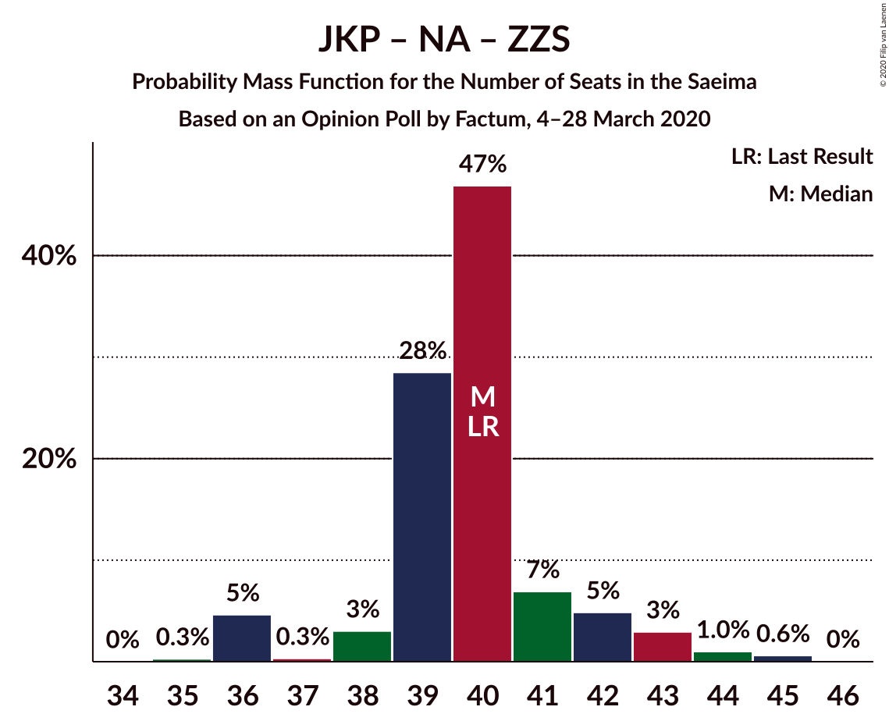

| Number of Seats | Probability | Accumulated | Special Marks |
|:---------------:|:-----------:|:-----------:|:-------------:|
| 35 | 0.3% | 100% |  |
| 36 | 1.3% | 99.7% |  |
| 37 | 1.4% | 98% |  |
| 38 | 10% | 97% |  |
| 39 | 18% | 87% |  |
| 40 | 22% | 69% | Last Result, Median |
| 41 | 15% | 46% |  |
| 42 | 26% | 31% |  |
| 43 | 4% | 5% |  |
| 44 | 0.9% | 1.5% |  |
| 45 | 0.6% | 0.6% |  |
| 46 | 0% | 0% |  |

### Sociāldemokrātiskā partija “Saskaņa” – Attīstībai/Par!

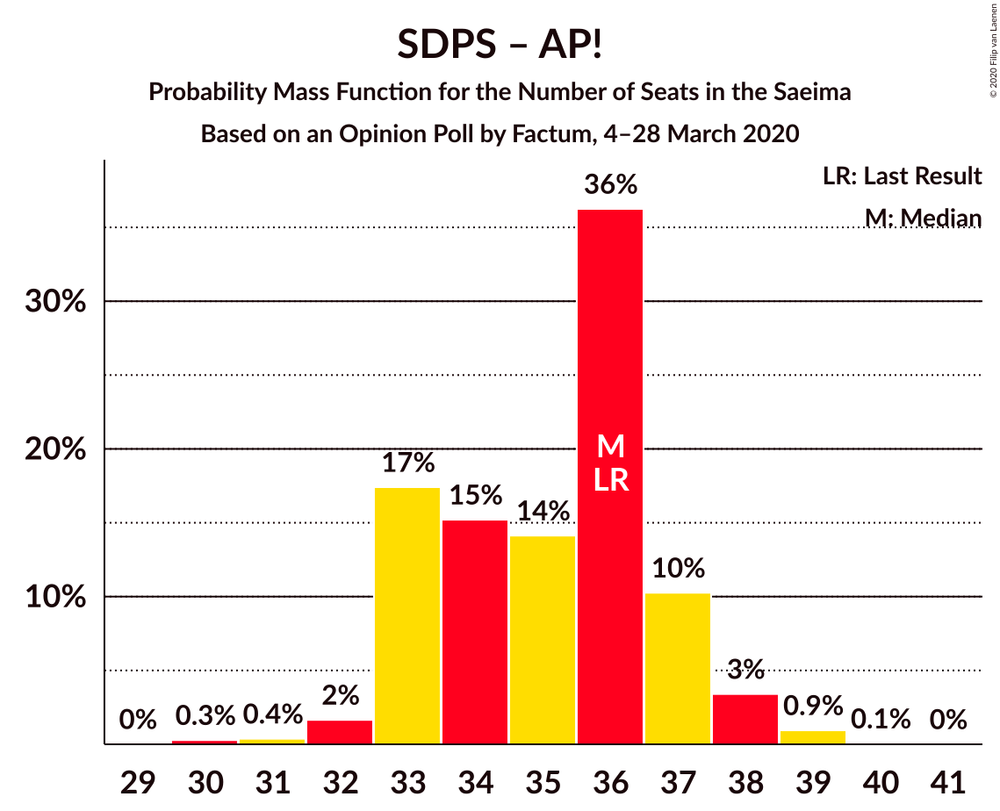

| Number of Seats | Probability | Accumulated | Special Marks |
|:---------------:|:-----------:|:-----------:|:-------------:|
| 30 | 0.3% | 100% |  |
| 31 | 0.4% | 99.7% |  |
| 32 | 2% | 99.3% |  |
| 33 | 17% | 98% |  |
| 34 | 15% | 80% |  |
| 35 | 14% | 65% |  |
| 36 | 36% | 51% | Last Result, Median |
| 37 | 10% | 15% |  |
| 38 | 3% | 4% |  |
| 39 | 0.9% | 1.0% |  |
| 40 | 0.1% | 0.1% |  |
| 41 | 0% | 0% |  |

### Sociāldemokrātiskā partija “Saskaņa” – Zaļo un Zemnieku savienība – Politiskā partija „KPV LV”

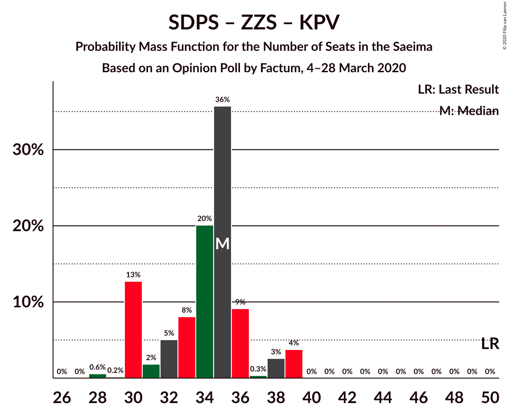

| Number of Seats | Probability | Accumulated | Special Marks |
|:---------------:|:-----------:|:-----------:|:-------------:|
| 28 | 0.2% | 100% |  |
| 29 | 0.1% | 99.8% |  |
| 30 | 3% | 99.7% |  |
| 31 | 5% | 97% |  |
| 32 | 16% | 92% |  |
| 33 | 19% | 75% |  |
| 34 | 29% | 57% | Median |
| 35 | 13% | 28% |  |
| 36 | 11% | 15% |  |
| 37 | 2% | 5% |  |
| 38 | 2% | 3% |  |
| 39 | 0.6% | 0.6% |  |
| 40 | 0% | 0% |  |
| 41 | 0% | 0% |  |
| 42 | 0% | 0% |  |
| 43 | 0% | 0% |  |
| 44 | 0% | 0% |  |
| 45 | 0% | 0% |  |
| 46 | 0% | 0% |  |
| 47 | 0% | 0% |  |
| 48 | 0% | 0% |  |
| 49 | 0% | 0% |  |
| 50 | 0% | 0% | Last Result |

### Sociāldemokrātiskā partija “Saskaņa” – Politiskā partija „KPV LV”

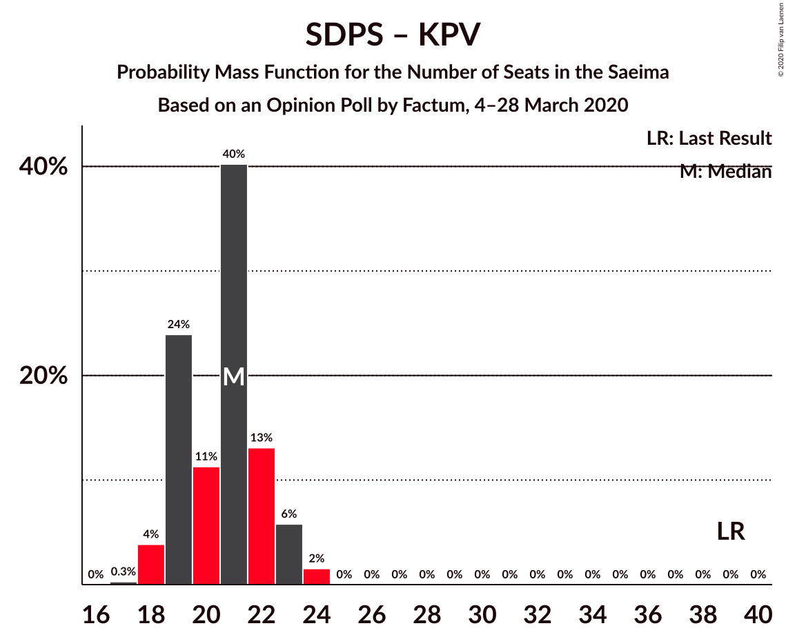

| Number of Seats | Probability | Accumulated | Special Marks |
|:---------------:|:-----------:|:-----------:|:-------------:|
| 17 | 0.3% | 100% |  |
| 18 | 4% | 99.7% |  |
| 19 | 24% | 96% |  |
| 20 | 11% | 72% |  |
| 21 | 40% | 61% | Median |
| 22 | 13% | 20% |  |
| 23 | 6% | 7% |  |
| 24 | 2% | 2% |  |
| 25 | 0% | 0% |  |
| 26 | 0% | 0% |  |
| 27 | 0% | 0% |  |
| 28 | 0% | 0% |  |
| 29 | 0% | 0% |  |
| 30 | 0% | 0% |  |
| 31 | 0% | 0% |  |
| 32 | 0% | 0% |  |
| 33 | 0% | 0% |  |
| 34 | 0% | 0% |  |
| 35 | 0% | 0% |  |
| 36 | 0% | 0% |  |
| 37 | 0% | 0% |  |
| 38 | 0% | 0% |  |
| 39 | 0% | 0% | Last Result |

## Technical Information

### Opinion Poll

+ **Polling firm:** Factum
+ **Commissioner(s):** —
+ **Fieldwork period:** 4–28 March 2020

### Calculations

+ **Sample size:** 1994
+ **Simulations done:** 1,048,576
+ **Error estimate:** 1.66%

