# Opinion Poll by SKDS for Latvijas Televīzija, 1–31 March 2020

<a href="#voting-intentions">Voting Intentions</a> | <a href="#seats">Seats</a> | <a href="#coalitions">Coalitions</a> | <a href="#technical-information">Technical Information</a>

## Voting Intentions

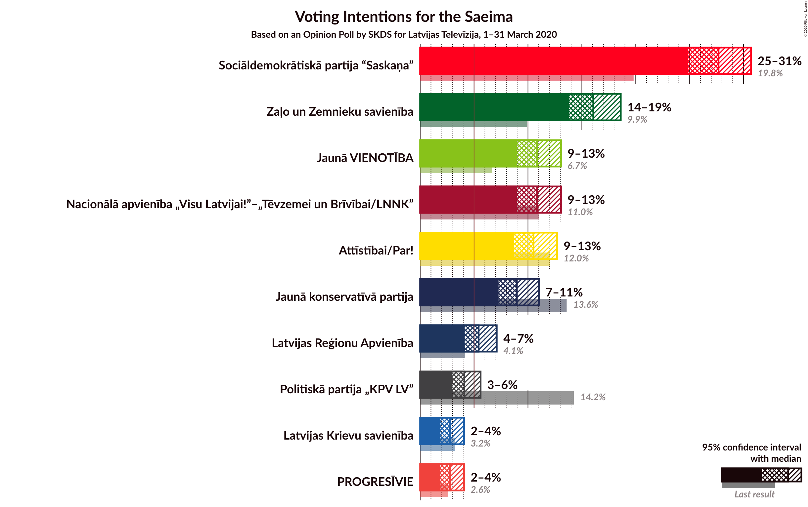

### Confidence Intervals

| Party | Last Result | Poll Result | 80% Confidence Interval | 90% Confidence Interval | 95% Confidence Interval | 99% Confidence Interval |
|:-----:|:-----------:|:-----------:|:-----------------------:|:-----------------------:|:-----------------------:|:-----------------------:|
| Sociāldemokrātiskā partija “Saskaņa” | 19.8% | 27.7% | 25.8–29.7% |25.3–30.2% |24.9–30.7% |24.0–31.7% |
| Zaļo un Zemnieku savienība | 9.9% | 16.1% | 14.6–17.7% |14.2–18.2% |13.8–18.6% |13.1–19.4% |
| Nacionālā apvienība „Visu Latvijai!”–„Tēvzemei un Brīvībai/LNNK” | 11.0% | 10.9% | 9.6–12.3% |9.3–12.7% |9.0–13.1% |8.4–13.8% |
| Jaunā VIENOTĪBA | 6.7% | 10.9% | 9.6–12.3% |9.3–12.7% |9.0–13.1% |8.4–13.8% |
| Attīstībai/Par! | 12.0% | 10.5% | 9.3–11.9% |9.0–12.3% |8.7–12.7% |8.1–13.4% |
| Jaunā konservatīvā partija | 13.6% | 9.0% | 7.8–10.3% |7.5–10.7% |7.3–11.0% |6.8–11.7% |
| Latvijas Reģionu Apvienība | 4.1% | 5.4% | 4.6–6.5% |4.3–6.8% |4.1–7.1% |3.7–7.7% |
| Politiskā partija „KPV LV” | 14.2% | 4.1% | 3.4–5.1% |3.2–5.3% |3.0–5.6% |2.7–6.1% |
| Latvijas Krievu savienība | 3.2% | 2.8% | 2.2–3.6% |2.0–3.8% |1.9–4.1% |1.6–4.5% |
| PROGRESĪVIE | 2.6% | 2.8% | 2.2–3.6% |2.0–3.8% |1.9–4.1% |1.6–4.5% |

*Note:* The poll result column reflects the actual value used in the calculations. Published results may vary slightly, and in addition be rounded to fewer digits.

## Seats

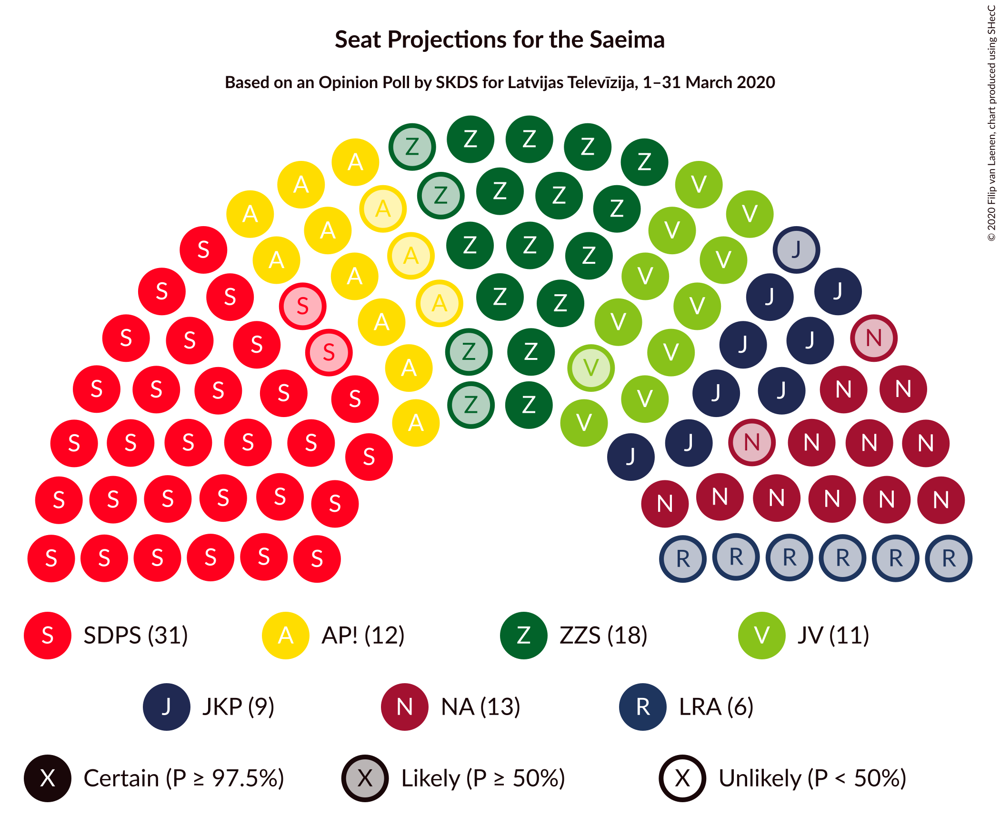

### Confidence Intervals

| Party | Last Result | Median | 80% Confidence Interval | 90% Confidence Interval | 95% Confidence Interval | 99% Confidence Interval |
|:-----:|:-----------:|:------:|:-----------------------:|:-----------------------:|:-----------------------:|:-----------------------:|
| <a href="#sociāldemokrātiskā-partija-“saskaņa”">Sociāldemokrātiskā partija “Saskaņa”</a> | 23 | 32 | 28–33 |27–33 |27–34 |26–35 |
| <a href="#zaļo-un-zemnieku-savienība">Zaļo un Zemnieku savienība</a> | 11 | 17 | 17–20 |17–22 |17–22 |15–22 |
| <a href="#nacionālā-apvienība-„visu-latvijai!”–„tēvzemei-un-brīvībai/lnnk”">Nacionālā apvienība „Visu Latvijai!”–„Tēvzemei un Brīvībai/LNNK”</a> | 13 | 14 | 11–14 |11–14 |11–14 |9–16 |
| <a href="#jaunā-vienotība">Jaunā VIENOTĪBA</a> | 8 | 11 | 11–12 |10–12 |10–12 |9–14 |
| <a href="#attīstībai/par!">Attīstībai/Par!</a> | 13 | 9 | 9–14 |9–14 |9–14 |8–14 |
| <a href="#jaunā-konservatīvā-partija">Jaunā konservatīvā partija</a> | 16 | 11 | 9–12 |7–12 |7–12 |7–13 |
| <a href="#latvijas-reģionu-apvienība">Latvijas Reģionu Apvienība</a> | 0 | 6 | 6–7 |0–7 |0–7 |0–7 |
| <a href="#politiskā-partija-„kpv-lv”">Politiskā partija „KPV LV”</a> | 16 | 0 | 0 |0–5 |0–6 |0–6 |
| <a href="#latvijas-krievu-savienība">Latvijas Krievu savienība</a> | 0 | 0 | 0 |0 |0 |0 |
| <a href="#progresīvie">PROGRESĪVIE</a> | 0 | 0 | 0 |0 |0 |0 |

### Sociāldemokrātiskā partija “Saskaņa”

*For a full overview of the results for this party, see the [Sociāldemokrātiskā partija “Saskaņa”](party-sociāldemokrātiskāpartija“saskaņa”.html) page.*

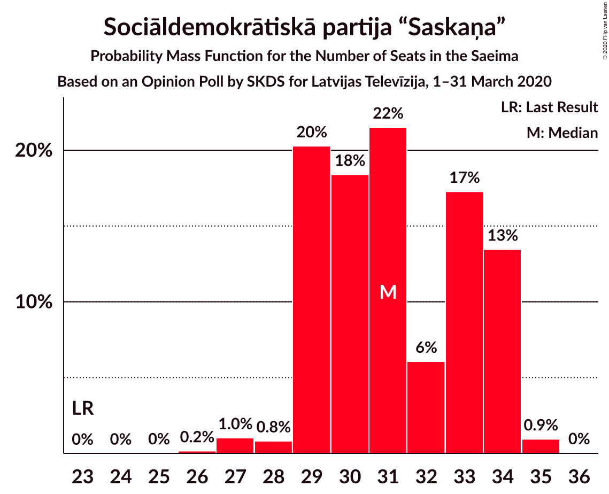

| Number of Seats | Probability | Accumulated | Special Marks |
|:---------------:|:-----------:|:-----------:|:-------------:|
| 23 | 0% | 100% | Last Result |
| 24 | 0% | 100% |  |
| 25 | 0.1% | 100% |  |
| 26 | 0.4% | 99.9% |  |
| 27 | 6% | 99.5% |  |
| 28 | 4% | 94% |  |
| 29 | 14% | 90% |  |
| 30 | 6% | 76% |  |
| 31 | 5% | 70% |  |
| 32 | 47% | 64% | Median |
| 33 | 14% | 17% |  |
| 34 | 0.8% | 3% |  |
| 35 | 2% | 2% |  |
| 36 | 0.1% | 0.2% |  |
| 37 | 0% | 0% |  |

### Zaļo un Zemnieku savienība

*For a full overview of the results for this party, see the [Zaļo un Zemnieku savienība](party-zaļounzemniekusavienība.html) page.*

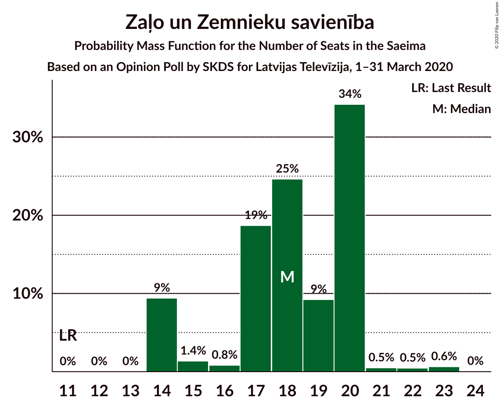

| Number of Seats | Probability | Accumulated | Special Marks |
|:---------------:|:-----------:|:-----------:|:-------------:|
| 11 | 0% | 100% | Last Result |
| 12 | 0% | 100% |  |
| 13 | 0% | 100% |  |
| 14 | 0.1% | 100% |  |
| 15 | 0.5% | 99.8% |  |
| 16 | 0.5% | 99.4% |  |
| 17 | 76% | 98.9% | Median |
| 18 | 3% | 23% |  |
| 19 | 7% | 21% |  |
| 20 | 8% | 14% |  |
| 21 | 0.5% | 6% |  |
| 22 | 5% | 5% |  |
| 23 | 0.2% | 0.5% |  |
| 24 | 0.3% | 0.3% |  |
| 25 | 0% | 0% |  |

### Nacionālā apvienība „Visu Latvijai!”–„Tēvzemei un Brīvībai/LNNK”

*For a full overview of the results for this party, see the [Nacionālā apvienība „Visu Latvijai!”–„Tēvzemei un Brīvībai/LNNK”](party-nacionālāapvienība„visulatvijai”–„tēvzemeiunbrīvībailnnk”.html) page.*

| Number of Seats | Probability | Accumulated | Special Marks |
|:---------------:|:-----------:|:-----------:|:-------------:|
| 8 | 0% | 100% |  |
| 9 | 0.9% | 99.9% |  |
| 10 | 0.5% | 99.0% |  |
| 11 | 22% | 98.5% |  |
| 12 | 5% | 76% |  |
| 13 | 20% | 72% | Last Result |
| 14 | 51% | 52% | Median |
| 15 | 0.4% | 1.1% |  |
| 16 | 0.4% | 0.6% |  |
| 17 | 0.2% | 0.2% |  |
| 18 | 0% | 0% |  |

### Jaunā VIENOTĪBA

*For a full overview of the results for this party, see the [Jaunā VIENOTĪBA](party-jaunāvienotība.html) page.*

| Number of Seats | Probability | Accumulated | Special Marks |
|:---------------:|:-----------:|:-----------:|:-------------:|
| 8 | 0% | 100% | Last Result |
| 9 | 1.0% | 100% |  |
| 10 | 7% | 99.0% |  |
| 11 | 74% | 92% | Median |
| 12 | 17% | 18% |  |
| 13 | 0.4% | 1.1% |  |
| 14 | 0.4% | 0.8% |  |
| 15 | 0.3% | 0.4% |  |
| 16 | 0.1% | 0.1% |  |
| 17 | 0% | 0% |  |

### Attīstībai/Par!

*For a full overview of the results for this party, see the [Attīstībai/Par!](party-attīstībaipar.html) page.*

| Number of Seats | Probability | Accumulated | Special Marks |
|:---------------:|:-----------:|:-----------:|:-------------:|
| 7 | 0.1% | 100% |  |
| 8 | 2% | 99.9% |  |
| 9 | 56% | 98% | Median |
| 10 | 15% | 42% |  |
| 11 | 2% | 28% |  |
| 12 | 3% | 25% |  |
| 13 | 8% | 22% | Last Result |
| 14 | 13% | 14% |  |
| 15 | 0.2% | 0.4% |  |
| 16 | 0.1% | 0.1% |  |
| 17 | 0% | 0% |  |

### Jaunā konservatīvā partija

*For a full overview of the results for this party, see the [Jaunā konservatīvā partija](party-jaunākonservatīvāpartija.html) page.*

| Number of Seats | Probability | Accumulated | Special Marks |
|:---------------:|:-----------:|:-----------:|:-------------:|
| 7 | 6% | 100% |  |
| 8 | 2% | 94% |  |
| 9 | 7% | 92% |  |
| 10 | 13% | 85% |  |
| 11 | 61% | 72% | Median |
| 12 | 8% | 11% |  |
| 13 | 2% | 2% |  |
| 14 | 0% | 0% |  |
| 15 | 0% | 0% |  |
| 16 | 0% | 0% | Last Result |

### Latvijas Reģionu Apvienība

*For a full overview of the results for this party, see the [Latvijas Reģionu Apvienība](party-latvijasreģionuapvienība.html) page.*

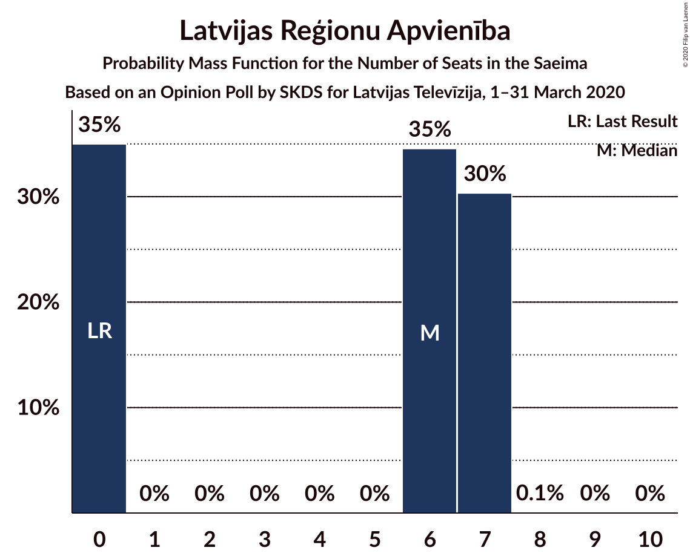

| Number of Seats | Probability | Accumulated | Special Marks |
|:---------------:|:-----------:|:-----------:|:-------------:|
| 0 | 8% | 100% | Last Result |
| 1 | 0% | 92% |  |
| 2 | 0% | 92% |  |
| 3 | 0% | 92% |  |
| 4 | 0% | 92% |  |
| 5 | 0% | 92% |  |
| 6 | 68% | 92% | Median |
| 7 | 23% | 23% |  |
| 8 | 0% | 0.1% |  |
| 9 | 0% | 0.1% |  |
| 10 | 0.1% | 0.1% |  |
| 11 | 0% | 0% |  |

### Politiskā partija „KPV LV”

*For a full overview of the results for this party, see the [Politiskā partija „KPV LV”](party-politiskāpartija„kpvlv”.html) page.*

| Number of Seats | Probability | Accumulated | Special Marks |
|:---------------:|:-----------:|:-----------:|:-------------:|
| 0 | 91% | 100% | Median |
| 1 | 0% | 9% |  |
| 2 | 0% | 9% |  |
| 3 | 0% | 9% |  |
| 4 | 0% | 9% |  |
| 5 | 4% | 9% |  |
| 6 | 4% | 4% |  |
| 7 | 0% | 0% |  |
| 8 | 0% | 0% |  |
| 9 | 0% | 0% |  |
| 10 | 0% | 0% |  |
| 11 | 0% | 0% |  |
| 12 | 0% | 0% |  |
| 13 | 0% | 0% |  |
| 14 | 0% | 0% |  |
| 15 | 0% | 0% |  |
| 16 | 0% | 0% | Last Result |

### Latvijas Krievu savienība

*For a full overview of the results for this party, see the [Latvijas Krievu savienība](party-latvijaskrievusavienība.html) page.*

| Number of Seats | Probability | Accumulated | Special Marks |
|:---------------:|:-----------:|:-----------:|:-------------:|
| 0 | 99.9% | 100% | Last Result, Median |
| 1 | 0% | 0.1% |  |
| 2 | 0% | 0.1% |  |
| 3 | 0% | 0.1% |  |
| 4 | 0% | 0.1% |  |
| 5 | 0% | 0.1% |  |
| 6 | 0% | 0% |  |

### PROGRESĪVIE

*For a full overview of the results for this party, see the [PROGRESĪVIE](party-progresīvie.html) page.*

| Number of Seats | Probability | Accumulated | Special Marks |
|:---------------:|:-----------:|:-----------:|:-------------:|
| 0 | 99.8% | 100% | Last Result, Median |
| 1 | 0% | 0.2% |  |
| 2 | 0% | 0.2% |  |
| 3 | 0% | 0.2% |  |
| 4 | 0% | 0.2% |  |
| 5 | 0.2% | 0.2% |  |
| 6 | 0% | 0% |  |

## Coalitions

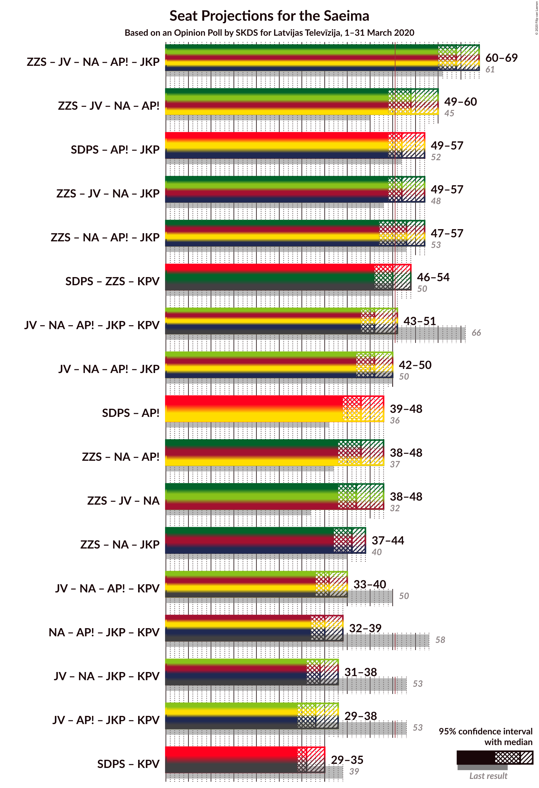

### Confidence Intervals

| Coalition | Last Result | Median | Majority? | 80% Confidence Interval | 90% Confidence Interval | 95% Confidence Interval | 99% Confidence Interval |
|:---------:|:-----------:|:------:|:---------:|:-----------------------:|:-----------------------:|:-----------------------:|:-----------------------:|
| Zaļo un Zemnieku savienība – Jaunā VIENOTĪBA – Nacionālā apvienība „Visu Latvijai!”–„Tēvzemei un Brīvībai/LNNK” – Attīstībai/Par! – Jaunā konservatīvā partija | 61 | 62 | 100% | 60–65 | 60–67 | 59–67 | 58–68 |
| Zaļo un Zemnieku savienība – Jaunā VIENOTĪBA – Nacionālā apvienība „Visu Latvijai!”–„Tēvzemei un Brīvībai/LNNK” – Jaunā konservatīvā partija | 48 | 53 | 77% | 50–54 | 50–58 | 49–58 | 47–58 |
| Zaļo un Zemnieku savienība – Nacionālā apvienība „Visu Latvijai!”–„Tēvzemei un Brīvībai/LNNK” – Attīstībai/Par! – Jaunā konservatīvā partija | 53 | 51 | 82% | 49–54 | 49–55 | 49–57 | 46–57 |
| Sociāldemokrātiskā partija “Saskaņa” – Attīstībai/Par! – Jaunā konservatīvā partija | 52 | 52 | 82% | 49–55 | 47–55 | 47–57 | 47–57 |
| Zaļo un Zemnieku savienība – Jaunā VIENOTĪBA – Nacionālā apvienība „Visu Latvijai!”–„Tēvzemei un Brīvībai/LNNK” – Attīstībai/Par! | 45 | 51 | 90% | 50–56 | 49–56 | 48–56 | 47–58 |
| Sociāldemokrātiskā partija “Saskaņa” – Zaļo un Zemnieku savienība – Politiskā partija „KPV LV” | 50 | 49 | 19% | 46–52 | 46–53 | 46–53 | 45–57 |
| Jaunā VIENOTĪBA – Nacionālā apvienība „Visu Latvijai!”–„Tēvzemei un Brīvībai/LNNK” – Attīstībai/Par! – Jaunā konservatīvā partija – Politiskā partija „KPV LV” | 66 | 45 | 2% | 43–48 | 41–49 | 41–50 | 41–53 |
| Jaunā VIENOTĪBA – Nacionālā apvienība „Visu Latvijai!”–„Tēvzemei un Brīvībai/LNNK” – Attīstībai/Par! – Jaunā konservatīvā partija | 50 | 45 | 0.2% | 43–47 | 41–47 | 41–48 | 41–48 |
| Zaļo un Zemnieku savienība – Jaunā VIENOTĪBA – Nacionālā apvienība „Visu Latvijai!”–„Tēvzemei un Brīvībai/LNNK” | 32 | 42 | 0% | 40–43 | 39–47 | 39–47 | 37–47 |
| Zaļo un Zemnieku savienība – Nacionālā apvienība „Visu Latvijai!”–„Tēvzemei un Brīvībai/LNNK” – Attīstībai/Par! | 37 | 40 | 0% | 39–44 | 38–45 | 38–46 | 36–46 |
| Zaļo un Zemnieku savienība – Nacionālā apvienība „Visu Latvijai!”–„Tēvzemei un Brīvībai/LNNK” – Jaunā konservatīvā partija | 40 | 42 | 0% | 38–43 | 38–46 | 38–46 | 36–46 |
| Sociāldemokrātiskā partija “Saskaņa” – Attīstībai/Par! | 36 | 41 | 0% | 39–43 | 37–45 | 36–46 | 36–47 |
| Jaunā VIENOTĪBA – Nacionālā apvienība „Visu Latvijai!”–„Tēvzemei un Brīvībai/LNNK” – Attīstībai/Par! – Politiskā partija „KPV LV” | 50 | 34 | 0% | 34–37 | 32–40 | 32–40 | 31–42 |
| Jaunā VIENOTĪBA – Nacionālā apvienība „Visu Latvijai!”–„Tēvzemei un Brīvībai/LNNK” – Jaunā konservatīvā partija – Politiskā partija „KPV LV” | 53 | 36 | 0% | 32–36 | 31–39 | 31–40 | 29–40 |
| Nacionālā apvienība „Visu Latvijai!”–„Tēvzemei un Brīvībai/LNNK” – Attīstībai/Par! – Jaunā konservatīvā partija – Politiskā partija „KPV LV” | 58 | 34 | 0% | 32–37 | 30–38 | 30–40 | 30–43 |
| Jaunā VIENOTĪBA – Attīstībai/Par! – Jaunā konservatīvā partija – Politiskā partija „KPV LV” | 53 | 31 | 0% | 31–36 | 28–37 | 28–39 | 28–40 |
| Sociāldemokrātiskā partija “Saskaņa” – Politiskā partija „KPV LV” | 39 | 32 | 0% | 29–33 | 27–35 | 27–36 | 27–37 |

### Zaļo un Zemnieku savienība – Jaunā VIENOTĪBA – Nacionālā apvienība „Visu Latvijai!”–„Tēvzemei un Brīvībai/LNNK” – Attīstībai/Par! – Jaunā konservatīvā partija

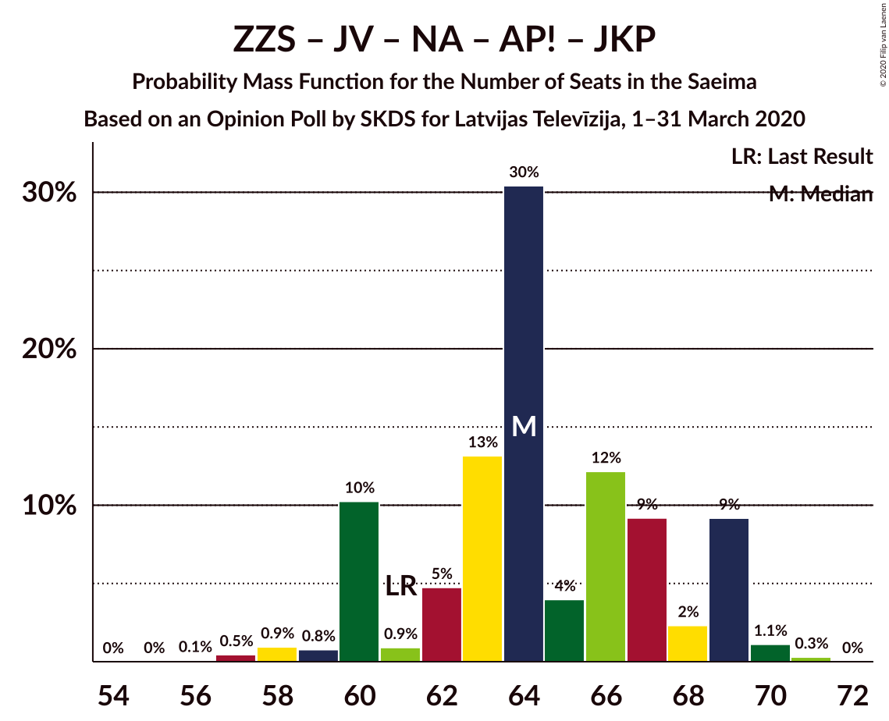

| Number of Seats | Probability | Accumulated | Special Marks |
|:---------------:|:-----------:|:-----------:|:-------------:|
| 56 | 0.4% | 100% |  |
| 57 | 0.1% | 99.6% |  |
| 58 | 0.5% | 99.5% |  |
| 59 | 2% | 99.0% |  |
| 60 | 7% | 97% |  |
| 61 | 8% | 90% | Last Result |
| 62 | 49% | 82% | Median |
| 63 | 5% | 34% |  |
| 64 | 16% | 29% |  |
| 65 | 3% | 13% |  |
| 66 | 0.3% | 10% |  |
| 67 | 9% | 9% |  |
| 68 | 0.1% | 0.5% |  |
| 69 | 0.1% | 0.4% |  |
| 70 | 0% | 0.3% |  |
| 71 | 0.2% | 0.3% |  |
| 72 | 0.1% | 0.1% |  |
| 73 | 0% | 0% |  |

### Zaļo un Zemnieku savienība – Jaunā VIENOTĪBA – Nacionālā apvienība „Visu Latvijai!”–„Tēvzemei un Brīvībai/LNNK” – Jaunā konservatīvā partija

| Number of Seats | Probability | Accumulated | Special Marks |
|:---------------:|:-----------:|:-----------:|:-------------:|
| 45 | 0% | 100% |  |
| 46 | 0.1% | 99.9% |  |
| 47 | 0.5% | 99.8% |  |
| 48 | 0.5% | 99.4% | Last Result |
| 49 | 2% | 98.9% |  |
| 50 | 20% | 97% |  |
| 51 | 11% | 77% | Majority |
| 52 | 5% | 65% |  |
| 53 | 49% | 61% | Median |
| 54 | 4% | 11% |  |
| 55 | 2% | 7% |  |
| 56 | 0.1% | 6% |  |
| 57 | 0.4% | 5% |  |
| 58 | 5% | 5% |  |
| 59 | 0.1% | 0.1% |  |
| 60 | 0% | 0.1% |  |
| 61 | 0% | 0% |  |

### Zaļo un Zemnieku savienība – Nacionālā apvienība „Visu Latvijai!”–„Tēvzemei un Brīvībai/LNNK” – Attīstībai/Par! – Jaunā konservatīvā partija

| Number of Seats | Probability | Accumulated | Special Marks |
|:---------------:|:-----------:|:-----------:|:-------------:|
| 45 | 0.4% | 100% |  |
| 46 | 0.1% | 99.6% |  |
| 47 | 0.3% | 99.5% |  |
| 48 | 1.1% | 99.2% |  |
| 49 | 9% | 98% |  |
| 50 | 7% | 90% |  |
| 51 | 48% | 82% | Median, Majority |
| 52 | 16% | 34% |  |
| 53 | 3% | 17% | Last Result |
| 54 | 5% | 14% |  |
| 55 | 5% | 9% |  |
| 56 | 1.1% | 4% |  |
| 57 | 3% | 3% |  |
| 58 | 0.1% | 0.3% |  |
| 59 | 0% | 0.2% |  |
| 60 | 0.2% | 0.2% |  |
| 61 | 0% | 0% |  |

### Sociāldemokrātiskā partija “Saskaņa” – Attīstībai/Par! – Jaunā konservatīvā partija

| Number of Seats | Probability | Accumulated | Special Marks |
|:---------------:|:-----------:|:-----------:|:-------------:|
| 44 | 0% | 100% |  |
| 45 | 0% | 99.9% |  |
| 46 | 0.1% | 99.9% |  |
| 47 | 7% | 99.8% |  |
| 48 | 1.0% | 93% |  |
| 49 | 2% | 92% |  |
| 50 | 8% | 90% |  |
| 51 | 2% | 82% | Majority |
| 52 | 50% | 80% | Last Result, Median |
| 53 | 14% | 30% |  |
| 54 | 5% | 16% |  |
| 55 | 6% | 11% |  |
| 56 | 1.3% | 4% |  |
| 57 | 3% | 3% |  |
| 58 | 0.2% | 0.3% |  |
| 59 | 0% | 0.1% |  |
| 60 | 0% | 0.1% |  |
| 61 | 0% | 0% |  |

### Zaļo un Zemnieku savienība – Jaunā VIENOTĪBA – Nacionālā apvienība „Visu Latvijai!”–„Tēvzemei un Brīvībai/LNNK” – Attīstībai/Par!

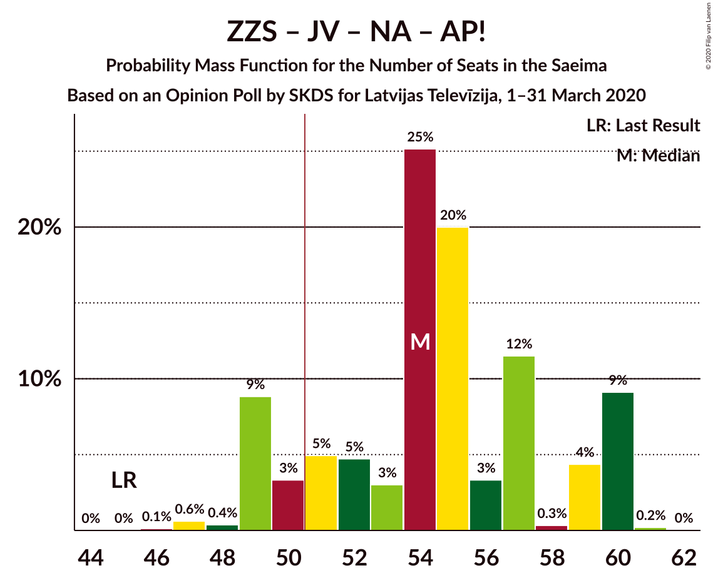

| Number of Seats | Probability | Accumulated | Special Marks |
|:---------------:|:-----------:|:-----------:|:-------------:|
| 45 | 0% | 100% | Last Result |
| 46 | 0.3% | 100% |  |
| 47 | 1.3% | 99.7% |  |
| 48 | 2% | 98% |  |
| 49 | 5% | 97% |  |
| 50 | 2% | 91% |  |
| 51 | 48% | 90% | Median, Majority |
| 52 | 4% | 42% |  |
| 53 | 11% | 38% |  |
| 54 | 14% | 27% |  |
| 55 | 2% | 13% |  |
| 56 | 9% | 11% |  |
| 57 | 1.2% | 2% |  |
| 58 | 0.2% | 0.5% |  |
| 59 | 0.2% | 0.3% |  |
| 60 | 0.1% | 0.1% |  |
| 61 | 0% | 0.1% |  |
| 62 | 0% | 0% |  |

### Sociāldemokrātiskā partija “Saskaņa” – Zaļo un Zemnieku savienība – Politiskā partija „KPV LV”

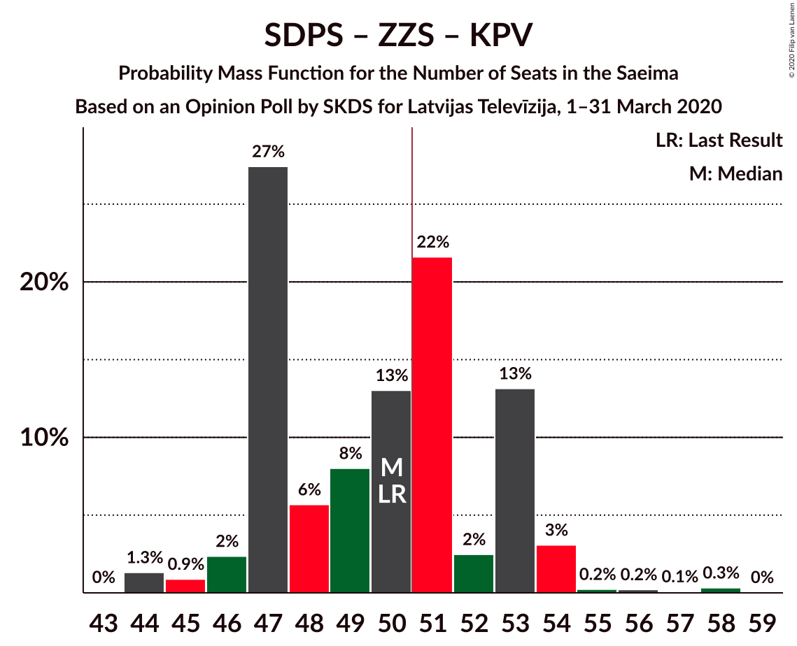

| Number of Seats | Probability | Accumulated | Special Marks |
|:---------------:|:-----------:|:-----------:|:-------------:|
| 43 | 0% | 100% |  |
| 44 | 0% | 99.9% |  |
| 45 | 2% | 99.9% |  |
| 46 | 12% | 98% |  |
| 47 | 0.4% | 85% |  |
| 48 | 5% | 85% |  |
| 49 | 52% | 80% | Median |
| 50 | 9% | 28% | Last Result |
| 51 | 2% | 19% | Majority |
| 52 | 8% | 17% |  |
| 53 | 7% | 9% |  |
| 54 | 0.3% | 2% |  |
| 55 | 0.1% | 2% |  |
| 56 | 0.4% | 2% |  |
| 57 | 1.2% | 2% |  |
| 58 | 0% | 0.4% |  |
| 59 | 0.3% | 0.4% |  |
| 60 | 0.1% | 0.1% |  |
| 61 | 0% | 0% |  |

### Jaunā VIENOTĪBA – Nacionālā apvienība „Visu Latvijai!”–„Tēvzemei un Brīvībai/LNNK” – Attīstībai/Par! – Jaunā konservatīvā partija – Politiskā partija „KPV LV”

| Number of Seats | Probability | Accumulated | Special Marks |
|:---------------:|:-----------:|:-----------:|:-------------:|
| 39 | 0% | 100% |  |
| 40 | 0% | 99.9% |  |
| 41 | 7% | 99.9% |  |
| 42 | 2% | 93% |  |
| 43 | 2% | 91% |  |
| 44 | 6% | 90% |  |
| 45 | 54% | 84% | Median |
| 46 | 4% | 30% |  |
| 47 | 16% | 27% |  |
| 48 | 4% | 11% |  |
| 49 | 4% | 7% |  |
| 50 | 0.6% | 3% |  |
| 51 | 0.2% | 2% | Majority |
| 52 | 0% | 2% |  |
| 53 | 2% | 2% |  |
| 54 | 0% | 0.1% |  |
| 55 | 0.1% | 0.1% |  |
| 56 | 0% | 0% |  |
| 57 | 0% | 0% |  |
| 58 | 0% | 0% |  |
| 59 | 0% | 0% |  |
| 60 | 0% | 0% |  |
| 61 | 0% | 0% |  |
| 62 | 0% | 0% |  |
| 63 | 0% | 0% |  |
| 64 | 0% | 0% |  |
| 65 | 0% | 0% |  |
| 66 | 0% | 0% | Last Result |

### Jaunā VIENOTĪBA – Nacionālā apvienība „Visu Latvijai!”–„Tēvzemei un Brīvībai/LNNK” – Attīstībai/Par! – Jaunā konservatīvā partija

| Number of Seats | Probability | Accumulated | Special Marks |
|:---------------:|:-----------:|:-----------:|:-------------:|
| 38 | 0.1% | 100% |  |
| 39 | 0% | 99.9% |  |
| 40 | 0.2% | 99.9% |  |
| 41 | 7% | 99.7% |  |
| 42 | 2% | 92% |  |
| 43 | 4% | 90% |  |
| 44 | 9% | 86% |  |
| 45 | 54% | 77% | Median |
| 46 | 3% | 24% |  |
| 47 | 17% | 21% |  |
| 48 | 3% | 3% |  |
| 49 | 0% | 0.3% |  |
| 50 | 0.1% | 0.3% | Last Result |
| 51 | 0.1% | 0.2% | Majority |
| 52 | 0% | 0.1% |  |
| 53 | 0.1% | 0.1% |  |
| 54 | 0% | 0.1% |  |
| 55 | 0.1% | 0.1% |  |
| 56 | 0% | 0% |  |

### Zaļo un Zemnieku savienība – Jaunā VIENOTĪBA – Nacionālā apvienība „Visu Latvijai!”–„Tēvzemei un Brīvībai/LNNK”

| Number of Seats | Probability | Accumulated | Special Marks |
|:---------------:|:-----------:|:-----------:|:-------------:|
| 32 | 0% | 100% | Last Result |
| 33 | 0% | 100% |  |
| 34 | 0% | 100% |  |
| 35 | 0% | 100% |  |
| 36 | 0.1% | 100% |  |
| 37 | 0.4% | 99.9% |  |
| 38 | 0.4% | 99.5% |  |
| 39 | 9% | 99.1% |  |
| 40 | 18% | 90% |  |
| 41 | 3% | 73% |  |
| 42 | 50% | 70% | Median |
| 43 | 10% | 19% |  |
| 44 | 2% | 9% |  |
| 45 | 0.8% | 7% |  |
| 46 | 0.5% | 6% |  |
| 47 | 5% | 5% |  |
| 48 | 0.1% | 0.1% |  |
| 49 | 0% | 0% |  |

### Zaļo un Zemnieku savienība – Nacionālā apvienība „Visu Latvijai!”–„Tēvzemei un Brīvībai/LNNK” – Attīstībai/Par!

| Number of Seats | Probability | Accumulated | Special Marks |
|:---------------:|:-----------:|:-----------:|:-------------:|
| 35 | 0.3% | 100% |  |
| 36 | 1.3% | 99.6% |  |
| 37 | 0.4% | 98% | Last Result |
| 38 | 6% | 98% |  |
| 39 | 2% | 92% |  |
| 40 | 48% | 90% | Median |
| 41 | 4% | 42% |  |
| 42 | 20% | 37% |  |
| 43 | 5% | 17% |  |
| 44 | 7% | 13% |  |
| 45 | 2% | 6% |  |
| 46 | 4% | 4% |  |
| 47 | 0.2% | 0.3% |  |
| 48 | 0.1% | 0.1% |  |
| 49 | 0% | 0.1% |  |
| 50 | 0% | 0% |  |

### Zaļo un Zemnieku savienība – Nacionālā apvienība „Visu Latvijai!”–„Tēvzemei un Brīvībai/LNNK” – Jaunā konservatīvā partija

| Number of Seats | Probability | Accumulated | Special Marks |
|:---------------:|:-----------:|:-----------:|:-------------:|
| 34 | 0.1% | 100% |  |
| 35 | 0% | 99.9% |  |
| 36 | 0.5% | 99.9% |  |
| 37 | 0.5% | 99.4% |  |
| 38 | 13% | 98.9% |  |
| 39 | 7% | 86% |  |
| 40 | 11% | 78% | Last Result |
| 41 | 7% | 68% |  |
| 42 | 49% | 61% | Median |
| 43 | 2% | 11% |  |
| 44 | 4% | 9% |  |
| 45 | 0.1% | 5% |  |
| 46 | 5% | 5% |  |
| 47 | 0.2% | 0.3% |  |
| 48 | 0.1% | 0.1% |  |
| 49 | 0% | 0% |  |

### Sociāldemokrātiskā partija “Saskaņa” – Attīstībai/Par!

| Number of Seats | Probability | Accumulated | Special Marks |
|:---------------:|:-----------:|:-----------:|:-------------:|
| 36 | 5% | 100% | Last Result |
| 37 | 2% | 95% |  |
| 38 | 2% | 93% |  |
| 39 | 1.2% | 91% |  |
| 40 | 3% | 89% |  |
| 41 | 49% | 86% | Median |
| 42 | 2% | 37% |  |
| 43 | 26% | 35% |  |
| 44 | 3% | 9% |  |
| 45 | 2% | 6% |  |
| 46 | 3% | 4% |  |
| 47 | 0.3% | 0.5% |  |
| 48 | 0.1% | 0.2% |  |
| 49 | 0.1% | 0.1% |  |
| 50 | 0% | 0% |  |

### Jaunā VIENOTĪBA – Nacionālā apvienība „Visu Latvijai!”–„Tēvzemei un Brīvībai/LNNK” – Attīstībai/Par! – Politiskā partija „KPV LV”

| Number of Seats | Probability | Accumulated | Special Marks |
|:---------------:|:-----------:|:-----------:|:-------------:|
| 31 | 2% | 100% |  |
| 32 | 5% | 98% |  |
| 33 | 2% | 93% |  |
| 34 | 58% | 91% | Median |
| 35 | 6% | 33% |  |
| 36 | 8% | 28% |  |
| 37 | 13% | 20% |  |
| 38 | 0.7% | 7% |  |
| 39 | 0.6% | 7% |  |
| 40 | 4% | 6% |  |
| 41 | 0.1% | 2% |  |
| 42 | 2% | 2% |  |
| 43 | 0.1% | 0.1% |  |
| 44 | 0% | 0% |  |
| 45 | 0% | 0% |  |
| 46 | 0% | 0% |  |
| 47 | 0% | 0% |  |
| 48 | 0% | 0% |  |
| 49 | 0% | 0% |  |
| 50 | 0% | 0% | Last Result |

### Jaunā VIENOTĪBA – Nacionālā apvienība „Visu Latvijai!”–„Tēvzemei un Brīvībai/LNNK” – Jaunā konservatīvā partija – Politiskā partija „KPV LV”

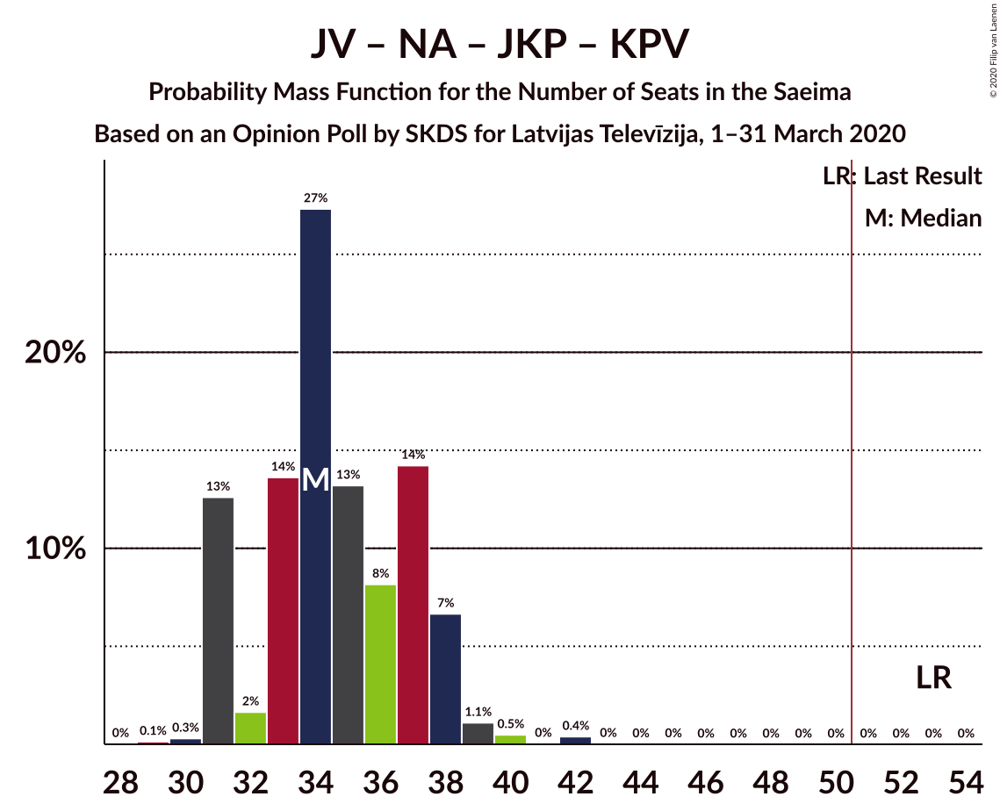

| Number of Seats | Probability | Accumulated | Special Marks |
|:---------------:|:-----------:|:-----------:|:-------------:|
| 28 | 0.1% | 100% |  |
| 29 | 1.0% | 99.8% |  |
| 30 | 0.1% | 98.9% |  |
| 31 | 8% | 98.7% |  |
| 32 | 1.3% | 91% |  |
| 33 | 16% | 90% |  |
| 34 | 7% | 74% |  |
| 35 | 3% | 67% |  |
| 36 | 54% | 64% | Median |
| 37 | 0.9% | 10% |  |
| 38 | 2% | 9% |  |
| 39 | 2% | 6% |  |
| 40 | 4% | 4% |  |
| 41 | 0.1% | 0.1% |  |
| 42 | 0% | 0% |  |
| 43 | 0% | 0% |  |
| 44 | 0% | 0% |  |
| 45 | 0% | 0% |  |
| 46 | 0% | 0% |  |
| 47 | 0% | 0% |  |
| 48 | 0% | 0% |  |
| 49 | 0% | 0% |  |
| 50 | 0% | 0% |  |
| 51 | 0% | 0% | Majority |
| 52 | 0% | 0% |  |
| 53 | 0% | 0% | Last Result |

### Nacionālā apvienība „Visu Latvijai!”–„Tēvzemei un Brīvībai/LNNK” – Attīstībai/Par! – Jaunā konservatīvā partija – Politiskā partija „KPV LV”

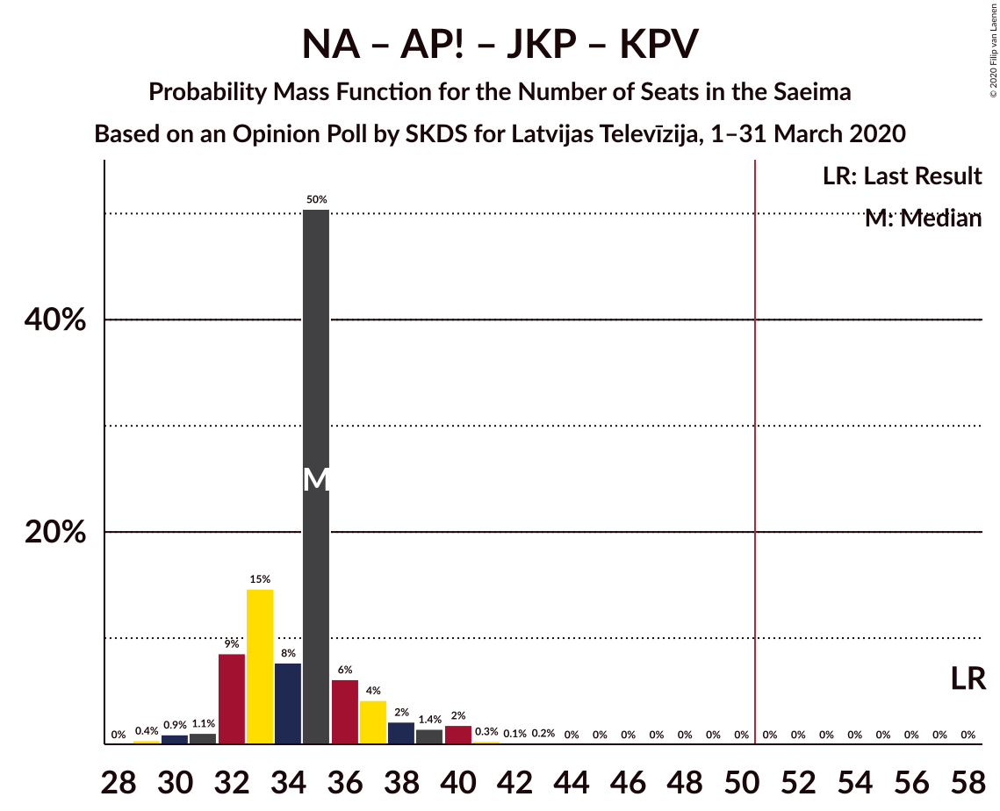

| Number of Seats | Probability | Accumulated | Special Marks |
|:---------------:|:-----------:|:-----------:|:-------------:|
| 27 | 0% | 100% |  |
| 28 | 0% | 99.9% |  |
| 29 | 0.3% | 99.9% |  |
| 30 | 7% | 99.6% |  |
| 31 | 0.8% | 93% |  |
| 32 | 3% | 92% |  |
| 33 | 10% | 89% |  |
| 34 | 50% | 80% | Median |
| 35 | 14% | 30% |  |
| 36 | 2% | 16% |  |
| 37 | 7% | 13% |  |
| 38 | 3% | 7% |  |
| 39 | 0.8% | 3% |  |
| 40 | 0.5% | 3% |  |
| 41 | 0.1% | 2% |  |
| 42 | 0.1% | 2% |  |
| 43 | 2% | 2% |  |
| 44 | 0% | 0% |  |
| 45 | 0% | 0% |  |
| 46 | 0% | 0% |  |
| 47 | 0% | 0% |  |
| 48 | 0% | 0% |  |
| 49 | 0% | 0% |  |
| 50 | 0% | 0% |  |
| 51 | 0% | 0% | Majority |
| 52 | 0% | 0% |  |
| 53 | 0% | 0% |  |
| 54 | 0% | 0% |  |
| 55 | 0% | 0% |  |
| 56 | 0% | 0% |  |
| 57 | 0% | 0% |  |
| 58 | 0% | 0% | Last Result |

### Jaunā VIENOTĪBA – Attīstībai/Par! – Jaunā konservatīvā partija – Politiskā partija „KPV LV”

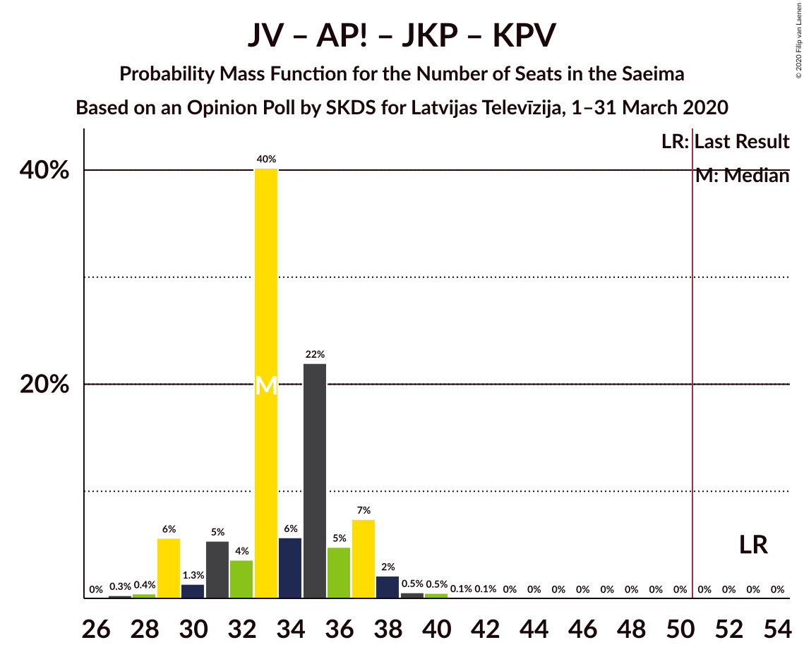

| Number of Seats | Probability | Accumulated | Special Marks |
|:---------------:|:-----------:|:-----------:|:-------------:|
| 27 | 0.2% | 100% |  |
| 28 | 6% | 99.8% |  |
| 29 | 0.6% | 94% |  |
| 30 | 3% | 94% |  |
| 31 | 48% | 91% | Median |
| 32 | 6% | 43% |  |
| 33 | 6% | 36% |  |
| 34 | 6% | 30% |  |
| 35 | 6% | 25% |  |
| 36 | 13% | 18% |  |
| 37 | 3% | 5% |  |
| 38 | 0.1% | 3% |  |
| 39 | 0.5% | 3% |  |
| 40 | 2% | 2% |  |
| 41 | 0% | 0.1% |  |
| 42 | 0.1% | 0.1% |  |
| 43 | 0% | 0% |  |
| 44 | 0% | 0% |  |
| 45 | 0% | 0% |  |
| 46 | 0% | 0% |  |
| 47 | 0% | 0% |  |
| 48 | 0% | 0% |  |
| 49 | 0% | 0% |  |
| 50 | 0% | 0% |  |
| 51 | 0% | 0% | Majority |
| 52 | 0% | 0% |  |
| 53 | 0% | 0% | Last Result |

### Sociāldemokrātiskā partija “Saskaņa” – Politiskā partija „KPV LV”

| Number of Seats | Probability | Accumulated | Special Marks |
|:---------------:|:-----------:|:-----------:|:-------------:|
| 26 | 0.1% | 100% |  |
| 27 | 5% | 99.9% |  |
| 28 | 2% | 95% |  |
| 29 | 12% | 93% |  |
| 30 | 4% | 80% |  |
| 31 | 4% | 76% |  |
| 32 | 47% | 73% | Median |
| 33 | 17% | 25% |  |
| 34 | 2% | 9% |  |
| 35 | 2% | 7% |  |
| 36 | 3% | 4% |  |
| 37 | 2% | 2% |  |
| 38 | 0% | 0.2% |  |
| 39 | 0% | 0.1% | Last Result |
| 40 | 0% | 0.1% |  |
| 41 | 0.1% | 0.1% |  |
| 42 | 0% | 0% |  |

## Technical Information

### Opinion Poll

+ **Polling firm:** SKDS
+ **Commissioner(s):** Latvijas Televīzija
+ **Fieldwork period:** 1–31 March 2020

### Calculations

+ **Sample size:** 903
+ **Simulations done:** 131,072
+ **Error estimate:** 5.20%

