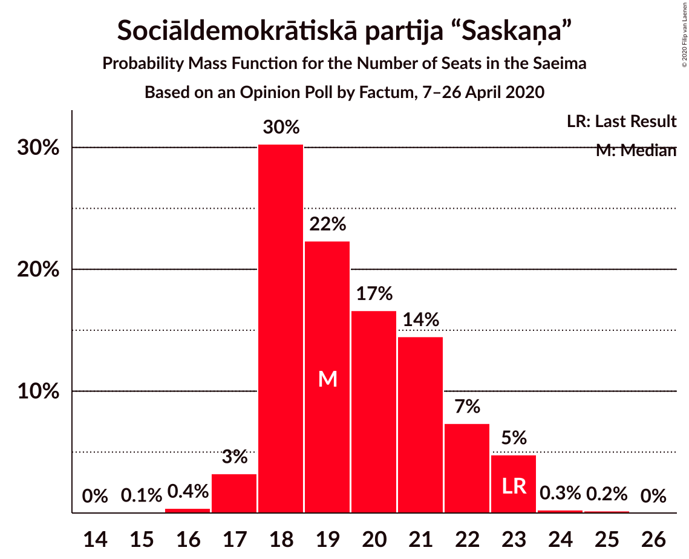
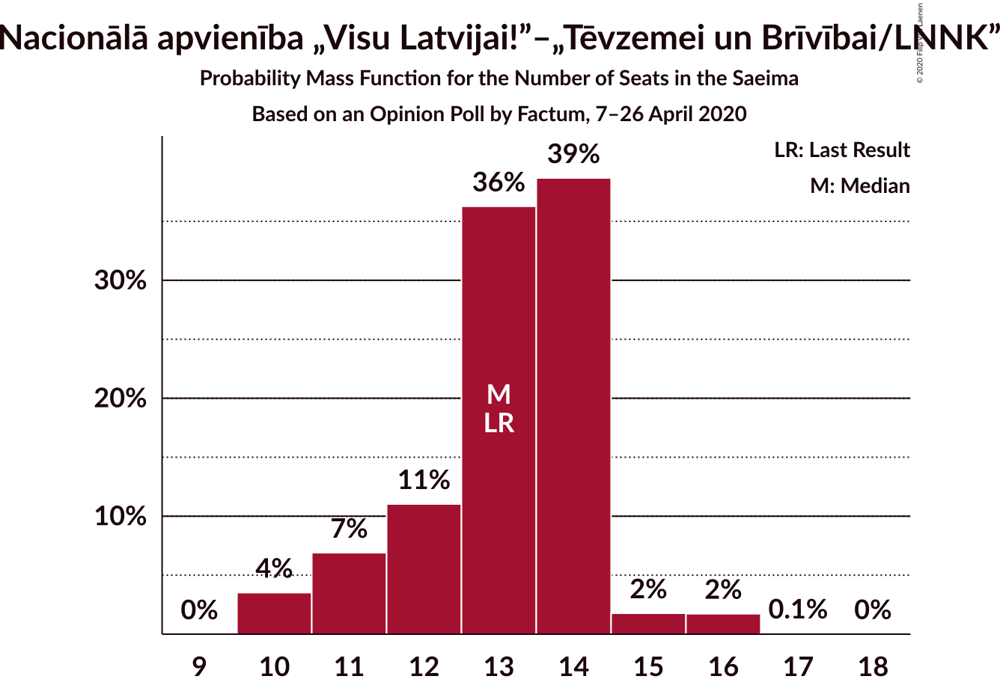
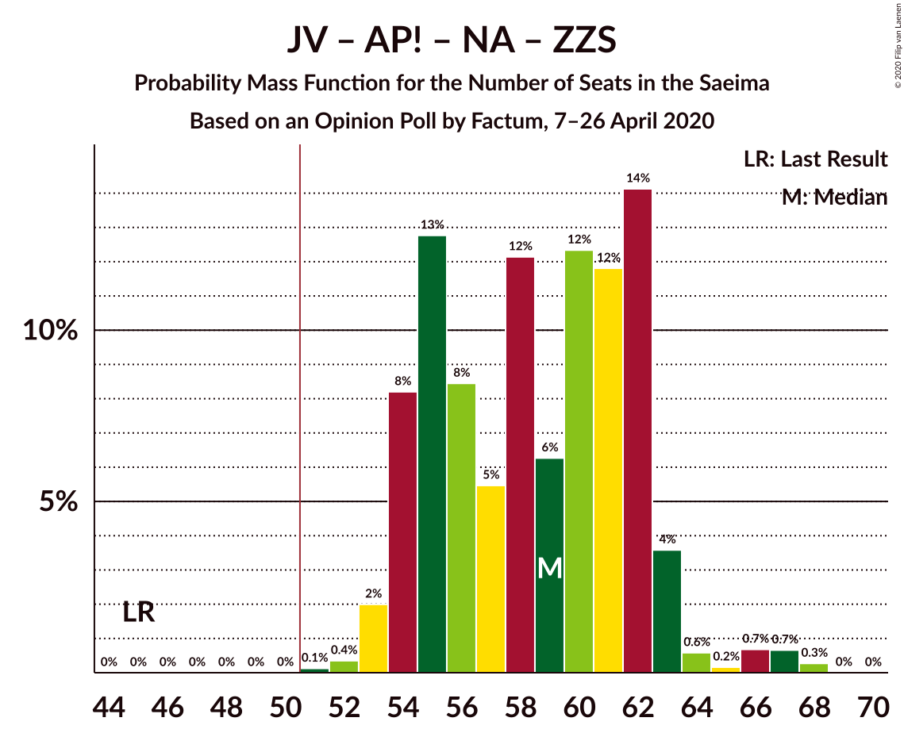
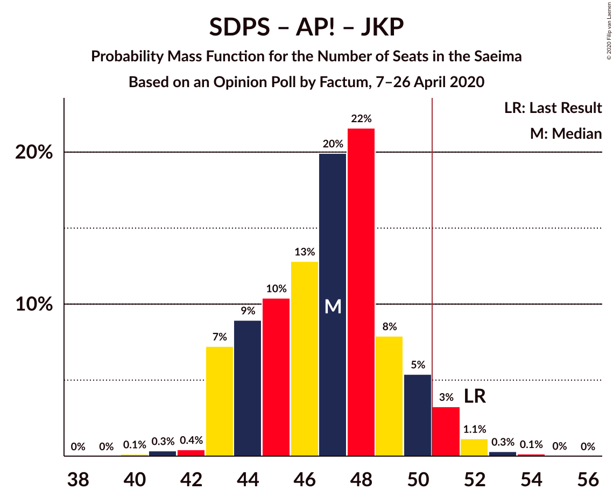
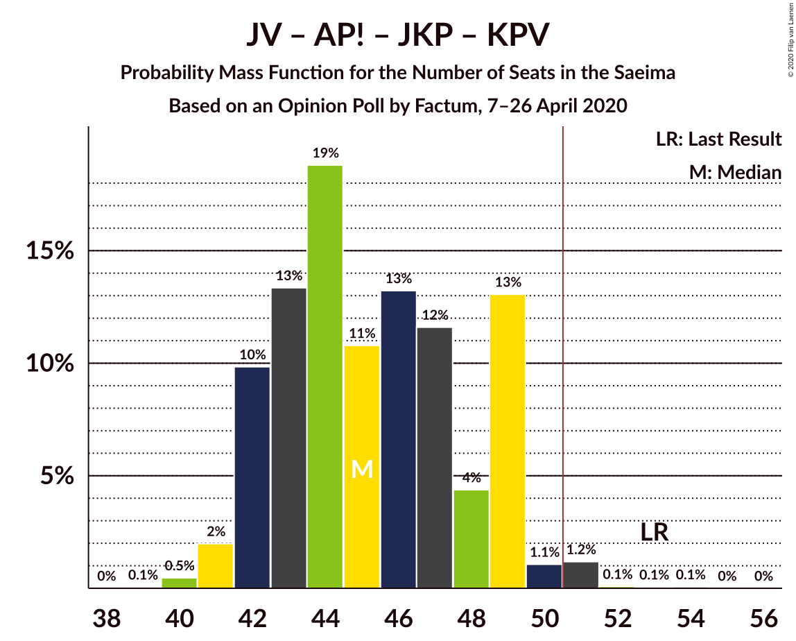
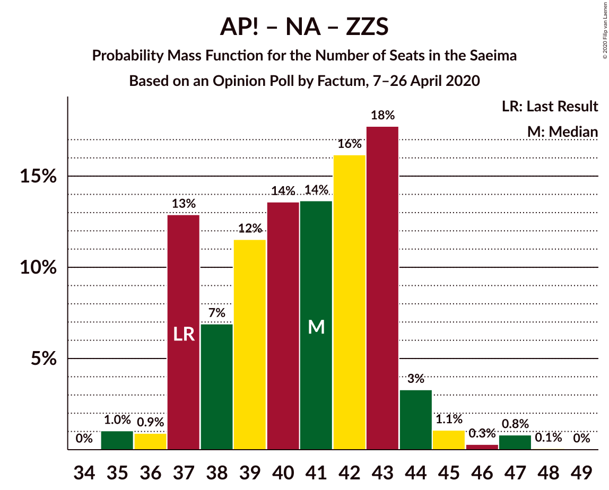

# Opinion Poll by Factum, 7–26 April 2020

<a href="#voting-intentions">Voting Intentions</a> | <a href="#seats">Seats</a> | <a href="#coalitions">Coalitions</a> | <a href="#technical-information">Technical Information</a>

## Voting Intentions

### Confidence Intervals

| Party | Last Result | Poll Result | 80% Confidence Interval | 90% Confidence Interval | 95% Confidence Interval | 99% Confidence Interval |
|:-----:|:-----------:|:-----------:|:-----------------------:|:-----------------------:|:-----------------------:|:-----------------------:|
| Sociāldemokrātiskā partija “Saskaņa” | 19.8% | 17.0% | 15.7–18.4% |15.4–18.8% |15.0–19.1% |14.5–19.8% |
| Jaunā VIENOTĪBA | 6.7% | 16.0% | 14.8–17.4% |14.4–17.7% |14.1–18.1% |13.5–18.7% |
| Attīstībai/Par! | 12.0% | 14.0% | 12.9–15.3% |12.5–15.7% |12.3–16.0% |11.7–16.7% |
| Nacionālā apvienība „Visu Latvijai!”–„Tēvzemei un Brīvībai/LNNK” | 11.0% | 12.0% | 10.9–13.2% |10.6–13.6% |10.3–13.9% |9.9–14.5% |
| Jaunā konservatīvā partija | 13.6% | 11.0% | 10.0–12.2% |9.7–12.5% |9.4–12.8% |9.0–13.4% |
| Zaļo un Zemnieku savienība | 9.9% | 11.0% | 10.0–12.2% |9.7–12.5% |9.4–12.8% |9.0–13.4% |
| PROGRESĪVIE | 2.6% | 6.0% | 5.3–7.0% |5.1–7.2% |4.9–7.5% |4.5–7.9% |
| Latvijas Reģionu Apvienība | 4.1% | 5.0% | 4.3–5.8% |4.1–6.1% |3.9–6.3% |3.6–6.7% |
| Latvijas Krievu savienība | 3.2% | 4.0% | 3.4–4.8% |3.2–5.0% |3.1–5.2% |2.8–5.6% |
| Politiskā partija „KPV LV” | 14.2% | 2.0% | 1.6–2.6% |1.5–2.8% |1.4–3.0% |1.2–3.3% |

*Note:* The poll result column reflects the actual value used in the calculations. Published results may vary slightly, and in addition be rounded to fewer digits.

## Seats

### Confidence Intervals

| Party | Last Result | Median | 80% Confidence Interval | 90% Confidence Interval | 95% Confidence Interval | 99% Confidence Interval |
|:-----:|:-----------:|:------:|:-----------------------:|:-----------------------:|:-----------------------:|:-----------------------:|
| <a href="#sociāldemokrātiskā-partija-“saskaņa”">Sociāldemokrātiskā partija “Saskaņa”</a> | 23 | 19 | 18–22 |18–23 |17–23 |17–23 |
| <a href="#jaunā-vienotība">Jaunā VIENOTĪBA</a> | 8 | 18 | 16–20 |16–20 |15–20 |14–21 |
| <a href="#attīstībai/par!">Attīstībai/Par!</a> | 13 | 15 | 13–17 |13–17 |13–17 |13–18 |
| <a href="#nacionālā-apvienība-„visu-latvijai!”–„tēvzemei-un-brīvībai/lnnk”">Nacionālā apvienība „Visu Latvijai!”–„Tēvzemei un Brīvībai/LNNK”</a> | 13 | 13 | 11–14 |11–14 |10–15 |10–16 |
| <a href="#jaunā-konservatīvā-partija">Jaunā konservatīvā partija</a> | 16 | 13 | 10–13 |9–13 |9–14 |9–15 |
| <a href="#zaļo-un-zemnieku-savienība">Zaļo un Zemnieku savienība</a> | 11 | 12 | 11–13 |11–14 |11–14 |11–15 |
| <a href="#progresīvie">PROGRESĪVIE</a> | 0 | 7 | 6–7 |5–8 |0–8 |0–9 |
| <a href="#latvijas-reģionu-apvienība">Latvijas Reģionu Apvienība</a> | 0 | 6 | 0–6 |0–6 |0–6 |0–7 |
| <a href="#latvijas-krievu-savienība">Latvijas Krievu savienība</a> | 0 | 0 | 0 |0 |0–5 |0–7 |
| <a href="#politiskā-partija-„kpv-lv”">Politiskā partija „KPV LV”</a> | 16 | 0 | 0 |0 |0 |0 |

### Sociāldemokrātiskā partija “Saskaņa”

*For a full overview of the results for this party, see the [Sociāldemokrātiskā partija “Saskaņa”](party-sociāldemokrātiskāpartija“saskaņa”.html) page.*

| Number of Seats | Probability | Accumulated | Special Marks |
|:---------------:|:-----------:|:-----------:|:-------------:|
| 15 | 0.1% | 100% |  |
| 16 | 0.4% | 99.9% |  |
| 17 | 3% | 99.5% |  |
| 18 | 30% | 96% |  |
| 19 | 22% | 66% | Median |
| 20 | 17% | 44% |  |
| 21 | 14% | 27% |  |
| 22 | 7% | 13% |  |
| 23 | 5% | 5% | Last Result |
| 24 | 0.3% | 0.4% |  |
| 25 | 0.2% | 0.2% |  |
| 26 | 0% | 0% |  |

### Jaunā VIENOTĪBA

*For a full overview of the results for this party, see the [Jaunā VIENOTĪBA](party-jaunāvienotība.html) page.*

| Number of Seats | Probability | Accumulated | Special Marks |
|:---------------:|:-----------:|:-----------:|:-------------:|
| 8 | 0% | 100% | Last Result |
| 9 | 0% | 100% |  |
| 10 | 0% | 100% |  |
| 11 | 0% | 100% |  |
| 12 | 0% | 100% |  |
| 13 | 0.1% | 100% |  |
| 14 | 0.7% | 99.9% |  |
| 15 | 3% | 99.2% |  |
| 16 | 8% | 96% |  |
| 17 | 23% | 89% |  |
| 18 | 29% | 65% | Median |
| 19 | 25% | 36% |  |
| 20 | 9% | 12% |  |
| 21 | 2% | 2% |  |
| 22 | 0.1% | 0.3% |  |
| 23 | 0.2% | 0.2% |  |
| 24 | 0% | 0% |  |

### Attīstībai/Par!

*For a full overview of the results for this party, see the [Attīstībai/Par!](party-attīstībaipar.html) page.*

| Number of Seats | Probability | Accumulated | Special Marks |
|:---------------:|:-----------:|:-----------:|:-------------:|
| 12 | 0.3% | 100% |  |
| 13 | 14% | 99.6% | Last Result |
| 14 | 14% | 85% |  |
| 15 | 34% | 71% | Median |
| 16 | 19% | 37% |  |
| 17 | 18% | 19% |  |
| 18 | 0.7% | 0.9% |  |
| 19 | 0.1% | 0.2% |  |
| 20 | 0% | 0.1% |  |
| 21 | 0.1% | 0.1% |  |
| 22 | 0% | 0% |  |

### Nacionālā apvienība „Visu Latvijai!”–„Tēvzemei un Brīvībai/LNNK”

*For a full overview of the results for this party, see the [Nacionālā apvienība „Visu Latvijai!”–„Tēvzemei un Brīvībai/LNNK”](party-nacionālāapvienība„visulatvijai”–„tēvzemeiunbrīvībailnnk”.html) page.*

| Number of Seats | Probability | Accumulated | Special Marks |
|:---------------:|:-----------:|:-----------:|:-------------:|
| 10 | 4% | 100% |  |
| 11 | 7% | 96% |  |
| 12 | 11% | 90% |  |
| 13 | 36% | 79% | Last Result, Median |
| 14 | 39% | 42% |  |
| 15 | 2% | 4% |  |
| 16 | 2% | 2% |  |
| 17 | 0.1% | 0.1% |  |
| 18 | 0% | 0% |  |

### Jaunā konservatīvā partija

*For a full overview of the results for this party, see the [Jaunā konservatīvā partija](party-jaunākonservatīvāpartija.html) page.*

| Number of Seats | Probability | Accumulated | Special Marks |
|:---------------:|:-----------:|:-----------:|:-------------:|
| 9 | 5% | 100% |  |
| 10 | 5% | 95% |  |
| 11 | 15% | 90% |  |
| 12 | 21% | 75% |  |
| 13 | 51% | 54% | Median |
| 14 | 2% | 3% |  |
| 15 | 0.8% | 1.0% |  |
| 16 | 0.1% | 0.1% | Last Result |
| 17 | 0% | 0% |  |

### Zaļo un Zemnieku savienība

*For a full overview of the results for this party, see the [Zaļo un Zemnieku savienība](party-zaļounzemniekusavienība.html) page.*

| Number of Seats | Probability | Accumulated | Special Marks |
|:---------------:|:-----------:|:-----------:|:-------------:|
| 10 | 0% | 100% |  |
| 11 | 21% | 99.9% | Last Result |
| 12 | 43% | 79% | Median |
| 13 | 28% | 37% |  |
| 14 | 7% | 9% |  |
| 15 | 2% | 2% |  |
| 16 | 0.3% | 0.4% |  |
| 17 | 0.1% | 0.1% |  |
| 18 | 0% | 0% |  |

### PROGRESĪVIE

*For a full overview of the results for this party, see the [PROGRESĪVIE](party-progresīvie.html) page.*

| Number of Seats | Probability | Accumulated | Special Marks |
|:---------------:|:-----------:|:-----------:|:-------------:|
| 0 | 4% | 100% | Last Result |
| 1 | 0% | 96% |  |
| 2 | 0% | 96% |  |
| 3 | 0% | 96% |  |
| 4 | 0% | 96% |  |
| 5 | 4% | 96% |  |
| 6 | 23% | 92% |  |
| 7 | 63% | 69% | Median |
| 8 | 5% | 6% |  |
| 9 | 0.6% | 0.6% |  |
| 10 | 0% | 0% |  |

### Latvijas Reģionu Apvienība

*For a full overview of the results for this party, see the [Latvijas Reģionu Apvienība](party-latvijasreģionuapvienība.html) page.*

| Number of Seats | Probability | Accumulated | Special Marks |
|:---------------:|:-----------:|:-----------:|:-------------:|
| 0 | 49% | 100% | Last Result |
| 1 | 0% | 51% |  |
| 2 | 0% | 51% |  |
| 3 | 0% | 51% |  |
| 4 | 0% | 51% |  |
| 5 | 0% | 51% |  |
| 6 | 49% | 51% | Median |
| 7 | 1.3% | 1.3% |  |
| 8 | 0% | 0% |  |

### Latvijas Krievu savienība

*For a full overview of the results for this party, see the [Latvijas Krievu savienība](party-latvijaskrievusavienība.html) page.*

| Number of Seats | Probability | Accumulated | Special Marks |
|:---------------:|:-----------:|:-----------:|:-------------:|
| 0 | 95% | 100% | Last Result, Median |
| 1 | 0% | 5% |  |
| 2 | 0% | 5% |  |
| 3 | 0% | 5% |  |
| 4 | 0% | 5% |  |
| 5 | 2% | 5% |  |
| 6 | 1.2% | 2% |  |
| 7 | 1.0% | 1.3% |  |
| 8 | 0.2% | 0.2% |  |
| 9 | 0% | 0% |  |

### Politiskā partija „KPV LV”

*For a full overview of the results for this party, see the [Politiskā partija „KPV LV”](party-politiskāpartija„kpvlv”.html) page.*

| Number of Seats | Probability | Accumulated | Special Marks |
|:---------------:|:-----------:|:-----------:|:-------------:|
| 0 | 100% | 100% | Median |
| 1 | 0% | 0% |  |
| 2 | 0% | 0% |  |
| 3 | 0% | 0% |  |
| 4 | 0% | 0% |  |
| 5 | 0% | 0% |  |
| 6 | 0% | 0% |  |
| 7 | 0% | 0% |  |
| 8 | 0% | 0% |  |
| 9 | 0% | 0% |  |
| 10 | 0% | 0% |  |
| 11 | 0% | 0% |  |
| 12 | 0% | 0% |  |
| 13 | 0% | 0% |  |
| 14 | 0% | 0% |  |
| 15 | 0% | 0% |  |
| 16 | 0% | 0% | Last Result |

## Coalitions

### Confidence Intervals

| Coalition | Last Result | Median | Majority? | 80% Confidence Interval | 90% Confidence Interval | 95% Confidence Interval | 99% Confidence Interval |
|:---------:|:-----------:|:------:|:---------:|:-----------------------:|:-----------------------:|:-----------------------:|:-----------------------:|
| Jaunā VIENOTĪBA – Attīstībai/Par! – Nacionālā apvienība „Visu Latvijai!”–„Tēvzemei un Brīvībai/LNNK” – Jaunā konservatīvā partija – Zaļo un Zemnieku savienība | 61 | 70 | 100% | 67–75 | 66–75 | 65–76 | 65–80 |
| Jaunā VIENOTĪBA – Attīstībai/Par! – Nacionālā apvienība „Visu Latvijai!”–„Tēvzemei un Brīvībai/LNNK” – Jaunā konservatīvā partija | 50 | 57 | 100% | 55–63 | 55–63 | 54–63 | 53–65 |
| Jaunā VIENOTĪBA – Attīstībai/Par! – Nacionālā apvienība „Visu Latvijai!”–„Tēvzemei un Brīvībai/LNNK” – Jaunā konservatīvā partija – Politiskā partija „KPV LV” | 66 | 57 | 100% | 55–63 | 55–63 | 54–63 | 53–65 |
| Jaunā VIENOTĪBA – Attīstībai/Par! – Nacionālā apvienība „Visu Latvijai!”–„Tēvzemei un Brīvībai/LNNK” – Zaļo un Zemnieku savienība | 45 | 59 | 100% | 54–62 | 54–63 | 54–63 | 53–67 |
| Jaunā VIENOTĪBA – Nacionālā apvienība „Visu Latvijai!”–„Tēvzemei un Brīvībai/LNNK” – Jaunā konservatīvā partija – Zaļo un Zemnieku savienība | 48 | 55 | 97% | 52–59 | 52–59 | 50–60 | 49–63 |
| Attīstībai/Par! – Nacionālā apvienība „Visu Latvijai!”–„Tēvzemei un Brīvībai/LNNK” – Jaunā konservatīvā partija – Zaļo un Zemnieku savienība | 53 | 52 | 76% | 50–56 | 49–56 | 49–57 | 47–60 |
| Sociāldemokrātiskā partija “Saskaņa” – Attīstībai/Par! – Jaunā konservatīvā partija | 52 | 47 | 5% | 44–50 | 43–50 | 43–51 | 42–53 |
| Jaunā VIENOTĪBA – Attīstībai/Par! – Nacionālā apvienība „Visu Latvijai!”–„Tēvzemei un Brīvībai/LNNK” – Politiskā partija „KPV LV” | 50 | 46 | 2% | 43–50 | 43–50 | 42–50 | 41–52 |
| Jaunā VIENOTĪBA – Attīstībai/Par! – Jaunā konservatīvā partija – Politiskā partija „KPV LV” | 53 | 45 | 1.4% | 42–49 | 42–49 | 41–49 | 40–51 |
| Jaunā VIENOTĪBA – Nacionālā apvienība „Visu Latvijai!”–„Tēvzemei un Brīvībai/LNNK” – Jaunā konservatīvā partija – Politiskā partija „KPV LV” | 53 | 43 | 0.1% | 40–46 | 40–46 | 39–47 | 38–48 |
| Jaunā VIENOTĪBA – Nacionālā apvienība „Visu Latvijai!”–„Tēvzemei un Brīvībai/LNNK” – Zaļo un Zemnieku savienība | 32 | 43 | 0.3% | 40–46 | 40–47 | 39–47 | 38–50 |
| Attīstībai/Par! – Nacionālā apvienība „Visu Latvijai!”–„Tēvzemei un Brīvībai/LNNK” – Jaunā konservatīvā partija – Politiskā partija „KPV LV” | 58 | 40 | 0% | 38–44 | 38–44 | 37–44 | 36–45 |
| Attīstībai/Par! – Nacionālā apvienība „Visu Latvijai!”–„Tēvzemei un Brīvībai/LNNK” – Zaļo un Zemnieku savienība | 37 | 41 | 0% | 37–43 | 37–44 | 37–44 | 35–47 |
| Nacionālā apvienība „Visu Latvijai!”–„Tēvzemei un Brīvībai/LNNK” – Jaunā konservatīvā partija – Zaļo un Zemnieku savienība | 40 | 38 | 0% | 35–40 | 34–41 | 34–41 | 32–43 |
| Sociāldemokrātiskā partija “Saskaņa” – Attīstībai/Par! | 36 | 34 | 0% | 33–37 | 32–38 | 32–39 | 30–39 |
| Sociāldemokrātiskā partija “Saskaņa” – Zaļo un Zemnieku savienība – Politiskā partija „KPV LV” | 50 | 32 | 0% | 30–34 | 29–36 | 28–36 | 28–37 |
| Sociāldemokrātiskā partija “Saskaņa” – Politiskā partija „KPV LV” | 39 | 19 | 0% | 18–22 | 18–23 | 17–23 | 17–23 |

### Jaunā VIENOTĪBA – Attīstībai/Par! – Nacionālā apvienība „Visu Latvijai!”–„Tēvzemei un Brīvībai/LNNK” – Jaunā konservatīvā partija – Zaļo un Zemnieku savienība

| Number of Seats | Probability | Accumulated | Special Marks |
|:---------------:|:-----------:|:-----------:|:-------------:|
| 61 | 0% | 100% | Last Result |
| 62 | 0.1% | 100% |  |
| 63 | 0.1% | 99.9% |  |
| 64 | 0.3% | 99.8% |  |
| 65 | 2% | 99.5% |  |
| 66 | 3% | 97% |  |
| 67 | 12% | 94% |  |
| 68 | 13% | 82% |  |
| 69 | 17% | 69% |  |
| 70 | 6% | 52% |  |
| 71 | 4% | 45% | Median |
| 72 | 5% | 41% |  |
| 73 | 9% | 36% |  |
| 74 | 10% | 27% |  |
| 75 | 15% | 17% |  |
| 76 | 0.6% | 3% |  |
| 77 | 0.1% | 2% |  |
| 78 | 0.1% | 2% |  |
| 79 | 0.8% | 2% |  |
| 80 | 0.7% | 0.9% |  |
| 81 | 0.2% | 0.2% |  |
| 82 | 0% | 0% |  |

### Jaunā VIENOTĪBA – Attīstībai/Par! – Nacionālā apvienība „Visu Latvijai!”–„Tēvzemei un Brīvībai/LNNK” – Jaunā konservatīvā partija

| Number of Seats | Probability | Accumulated | Special Marks |
|:---------------:|:-----------:|:-----------:|:-------------:|
| 50 | 0% | 100% | Last Result |
| 51 | 0.1% | 100% | Majority |
| 52 | 0.1% | 99.9% |  |
| 53 | 0.6% | 99.8% |  |
| 54 | 3% | 99.2% |  |
| 55 | 8% | 96% |  |
| 56 | 23% | 88% |  |
| 57 | 15% | 64% |  |
| 58 | 7% | 49% |  |
| 59 | 3% | 43% | Median |
| 60 | 13% | 40% |  |
| 61 | 8% | 26% |  |
| 62 | 3% | 18% |  |
| 63 | 13% | 15% |  |
| 64 | 0.4% | 2% |  |
| 65 | 1.4% | 2% |  |
| 66 | 0% | 0.2% |  |
| 67 | 0.1% | 0.2% |  |
| 68 | 0.1% | 0.1% |  |
| 69 | 0% | 0% |  |

### Jaunā VIENOTĪBA – Attīstībai/Par! – Nacionālā apvienība „Visu Latvijai!”–„Tēvzemei un Brīvībai/LNNK” – Jaunā konservatīvā partija – Politiskā partija „KPV LV”

| Number of Seats | Probability | Accumulated | Special Marks |
|:---------------:|:-----------:|:-----------:|:-------------:|
| 51 | 0.1% | 100% | Majority |
| 52 | 0.1% | 99.9% |  |
| 53 | 0.6% | 99.8% |  |
| 54 | 3% | 99.2% |  |
| 55 | 8% | 96% |  |
| 56 | 23% | 88% |  |
| 57 | 15% | 64% |  |
| 58 | 7% | 49% |  |
| 59 | 3% | 43% | Median |
| 60 | 13% | 40% |  |
| 61 | 8% | 26% |  |
| 62 | 3% | 18% |  |
| 63 | 13% | 15% |  |
| 64 | 0.4% | 2% |  |
| 65 | 1.4% | 2% |  |
| 66 | 0% | 0.2% | Last Result |
| 67 | 0.1% | 0.2% |  |
| 68 | 0.1% | 0.1% |  |
| 69 | 0% | 0% |  |

### Jaunā VIENOTĪBA – Attīstībai/Par! – Nacionālā apvienība „Visu Latvijai!”–„Tēvzemei un Brīvībai/LNNK” – Zaļo un Zemnieku savienība

| Number of Seats | Probability | Accumulated | Special Marks |
|:---------------:|:-----------:|:-----------:|:-------------:|
| 45 | 0% | 100% | Last Result |
| 46 | 0% | 100% |  |
| 47 | 0% | 100% |  |
| 48 | 0% | 100% |  |
| 49 | 0% | 100% |  |
| 50 | 0% | 100% |  |
| 51 | 0.1% | 100% | Majority |
| 52 | 0.4% | 99.9% |  |
| 53 | 2% | 99.5% |  |
| 54 | 8% | 98% |  |
| 55 | 13% | 89% |  |
| 56 | 8% | 77% |  |
| 57 | 5% | 68% |  |
| 58 | 12% | 63% | Median |
| 59 | 6% | 50% |  |
| 60 | 12% | 44% |  |
| 61 | 12% | 32% |  |
| 62 | 14% | 20% |  |
| 63 | 4% | 6% |  |
| 64 | 0.6% | 2% |  |
| 65 | 0.2% | 2% |  |
| 66 | 0.7% | 2% |  |
| 67 | 0.7% | 0.9% |  |
| 68 | 0.3% | 0.3% |  |
| 69 | 0% | 0% |  |

### Jaunā VIENOTĪBA – Nacionālā apvienība „Visu Latvijai!”–„Tēvzemei un Brīvībai/LNNK” – Jaunā konservatīvā partija – Zaļo un Zemnieku savienība

| Number of Seats | Probability | Accumulated | Special Marks |
|:---------------:|:-----------:|:-----------:|:-------------:|
| 48 | 0.2% | 100% | Last Result |
| 49 | 0.3% | 99.8% |  |
| 50 | 2% | 99.5% |  |
| 51 | 2% | 97% | Majority |
| 52 | 5% | 95% |  |
| 53 | 9% | 90% |  |
| 54 | 25% | 80% |  |
| 55 | 10% | 55% |  |
| 56 | 6% | 45% | Median |
| 57 | 4% | 39% |  |
| 58 | 21% | 34% |  |
| 59 | 10% | 13% |  |
| 60 | 0.9% | 3% |  |
| 61 | 0.4% | 2% |  |
| 62 | 0.8% | 2% |  |
| 63 | 0.7% | 0.9% |  |
| 64 | 0.1% | 0.2% |  |
| 65 | 0.1% | 0.1% |  |
| 66 | 0% | 0% |  |

### Attīstībai/Par! – Nacionālā apvienība „Visu Latvijai!”–„Tēvzemei un Brīvībai/LNNK” – Jaunā konservatīvā partija – Zaļo un Zemnieku savienība

| Number of Seats | Probability | Accumulated | Special Marks |
|:---------------:|:-----------:|:-----------:|:-------------:|
| 46 | 0% | 100% |  |
| 47 | 1.2% | 99.9% |  |
| 48 | 1.1% | 98.7% |  |
| 49 | 5% | 98% |  |
| 50 | 17% | 93% |  |
| 51 | 16% | 76% | Majority |
| 52 | 10% | 60% |  |
| 53 | 12% | 50% | Last Result, Median |
| 54 | 9% | 38% |  |
| 55 | 10% | 29% |  |
| 56 | 15% | 19% |  |
| 57 | 2% | 4% |  |
| 58 | 1.2% | 2% |  |
| 59 | 0.2% | 1.0% |  |
| 60 | 0.7% | 0.8% |  |
| 61 | 0.1% | 0.1% |  |
| 62 | 0% | 0% |  |

### Sociāldemokrātiskā partija “Saskaņa” – Attīstībai/Par! – Jaunā konservatīvā partija

| Number of Seats | Probability | Accumulated | Special Marks |
|:---------------:|:-----------:|:-----------:|:-------------:|
| 40 | 0.1% | 100% |  |
| 41 | 0.3% | 99.9% |  |
| 42 | 0.4% | 99.5% |  |
| 43 | 7% | 99.1% |  |
| 44 | 9% | 92% |  |
| 45 | 10% | 83% |  |
| 46 | 13% | 73% |  |
| 47 | 20% | 60% | Median |
| 48 | 22% | 40% |  |
| 49 | 8% | 18% |  |
| 50 | 5% | 10% |  |
| 51 | 3% | 5% | Majority |
| 52 | 1.1% | 2% | Last Result |
| 53 | 0.3% | 0.5% |  |
| 54 | 0.1% | 0.2% |  |
| 55 | 0% | 0.1% |  |
| 56 | 0% | 0% |  |

### Jaunā VIENOTĪBA – Attīstībai/Par! – Nacionālā apvienība „Visu Latvijai!”–„Tēvzemei un Brīvībai/LNNK” – Politiskā partija „KPV LV”

| Number of Seats | Probability | Accumulated | Special Marks |
|:---------------:|:-----------:|:-----------:|:-------------:|
| 40 | 0.2% | 100% |  |
| 41 | 0.8% | 99.8% |  |
| 42 | 4% | 99.1% |  |
| 43 | 17% | 95% |  |
| 44 | 11% | 79% |  |
| 45 | 7% | 67% |  |
| 46 | 11% | 60% | Median |
| 47 | 14% | 49% |  |
| 48 | 13% | 34% |  |
| 49 | 4% | 22% |  |
| 50 | 16% | 18% | Last Result |
| 51 | 0.3% | 2% | Majority |
| 52 | 1.4% | 2% |  |
| 53 | 0% | 0.2% |  |
| 54 | 0.1% | 0.2% |  |
| 55 | 0.1% | 0.1% |  |
| 56 | 0% | 0% |  |

### Jaunā VIENOTĪBA – Attīstībai/Par! – Jaunā konservatīvā partija – Politiskā partija „KPV LV”

| Number of Seats | Probability | Accumulated | Special Marks |
|:---------------:|:-----------:|:-----------:|:-------------:|
| 39 | 0.1% | 100% |  |
| 40 | 0.5% | 99.9% |  |
| 41 | 2% | 99.5% |  |
| 42 | 10% | 97% |  |
| 43 | 13% | 88% |  |
| 44 | 19% | 74% |  |
| 45 | 11% | 55% |  |
| 46 | 13% | 45% | Median |
| 47 | 12% | 31% |  |
| 48 | 4% | 20% |  |
| 49 | 13% | 16% |  |
| 50 | 1.1% | 2% |  |
| 51 | 1.2% | 1.4% | Majority |
| 52 | 0.1% | 0.2% |  |
| 53 | 0.1% | 0.1% | Last Result |
| 54 | 0.1% | 0.1% |  |
| 55 | 0% | 0% |  |

### Jaunā VIENOTĪBA – Nacionālā apvienība „Visu Latvijai!”–„Tēvzemei un Brīvībai/LNNK” – Jaunā konservatīvā partija – Politiskā partija „KPV LV”

| Number of Seats | Probability | Accumulated | Special Marks |
|:---------------:|:-----------:|:-----------:|:-------------:|
| 37 | 0.2% | 100% |  |
| 38 | 1.0% | 99.7% |  |
| 39 | 2% | 98.7% |  |
| 40 | 7% | 96% |  |
| 41 | 15% | 89% |  |
| 42 | 13% | 74% |  |
| 43 | 20% | 61% |  |
| 44 | 7% | 42% | Median |
| 45 | 7% | 34% |  |
| 46 | 23% | 27% |  |
| 47 | 2% | 4% |  |
| 48 | 2% | 2% |  |
| 49 | 0.1% | 0.3% |  |
| 50 | 0.1% | 0.2% |  |
| 51 | 0.1% | 0.1% | Majority |
| 52 | 0% | 0% |  |
| 53 | 0% | 0% | Last Result |

### Jaunā VIENOTĪBA – Nacionālā apvienība „Visu Latvijai!”–„Tēvzemei un Brīvībai/LNNK” – Zaļo un Zemnieku savienība

| Number of Seats | Probability | Accumulated | Special Marks |
|:---------------:|:-----------:|:-----------:|:-------------:|
| 32 | 0% | 100% | Last Result |
| 33 | 0% | 100% |  |
| 34 | 0% | 100% |  |
| 35 | 0% | 100% |  |
| 36 | 0% | 100% |  |
| 37 | 0.3% | 100% |  |
| 38 | 1.0% | 99.7% |  |
| 39 | 2% | 98.7% |  |
| 40 | 11% | 96% |  |
| 41 | 9% | 86% |  |
| 42 | 14% | 76% |  |
| 43 | 14% | 62% | Median |
| 44 | 8% | 48% |  |
| 45 | 24% | 40% |  |
| 46 | 7% | 17% |  |
| 47 | 7% | 10% |  |
| 48 | 0.8% | 2% |  |
| 49 | 0.8% | 2% |  |
| 50 | 0.6% | 0.9% |  |
| 51 | 0.2% | 0.3% | Majority |
| 52 | 0.1% | 0.1% |  |
| 53 | 0% | 0% |  |

### Attīstībai/Par! – Nacionālā apvienība „Visu Latvijai!”–„Tēvzemei un Brīvībai/LNNK” – Jaunā konservatīvā partija – Politiskā partija „KPV LV”

| Number of Seats | Probability | Accumulated | Special Marks |
|:---------------:|:-----------:|:-----------:|:-------------:|
| 35 | 0.1% | 100% |  |
| 36 | 2% | 99.9% |  |
| 37 | 2% | 98% |  |
| 38 | 19% | 96% |  |
| 39 | 19% | 77% |  |
| 40 | 17% | 59% |  |
| 41 | 11% | 41% | Median |
| 42 | 8% | 30% |  |
| 43 | 7% | 23% |  |
| 44 | 14% | 16% |  |
| 45 | 1.2% | 2% |  |
| 46 | 0.1% | 0.3% |  |
| 47 | 0.1% | 0.1% |  |
| 48 | 0.1% | 0.1% |  |
| 49 | 0% | 0% |  |
| 50 | 0% | 0% |  |
| 51 | 0% | 0% | Majority |
| 52 | 0% | 0% |  |
| 53 | 0% | 0% |  |
| 54 | 0% | 0% |  |
| 55 | 0% | 0% |  |
| 56 | 0% | 0% |  |
| 57 | 0% | 0% |  |
| 58 | 0% | 0% | Last Result |

### Attīstībai/Par! – Nacionālā apvienība „Visu Latvijai!”–„Tēvzemei un Brīvībai/LNNK” – Zaļo un Zemnieku savienība

| Number of Seats | Probability | Accumulated | Special Marks |
|:---------------:|:-----------:|:-----------:|:-------------:|
| 35 | 1.0% | 100% |  |
| 36 | 0.9% | 98.9% |  |
| 37 | 13% | 98% | Last Result |
| 38 | 7% | 85% |  |
| 39 | 12% | 78% |  |
| 40 | 14% | 67% | Median |
| 41 | 14% | 53% |  |
| 42 | 16% | 39% |  |
| 43 | 18% | 23% |  |
| 44 | 3% | 6% |  |
| 45 | 1.1% | 2% |  |
| 46 | 0.3% | 1.2% |  |
| 47 | 0.8% | 0.9% |  |
| 48 | 0.1% | 0.1% |  |
| 49 | 0% | 0% |  |

### Nacionālā apvienība „Visu Latvijai!”–„Tēvzemei un Brīvībai/LNNK” – Jaunā konservatīvā partija – Zaļo un Zemnieku savienība

| Number of Seats | Probability | Accumulated | Special Marks |
|:---------------:|:-----------:|:-----------:|:-------------:|
| 32 | 0.7% | 100% |  |
| 33 | 1.3% | 99.3% |  |
| 34 | 4% | 98% |  |
| 35 | 7% | 94% |  |
| 36 | 20% | 87% |  |
| 37 | 17% | 67% |  |
| 38 | 10% | 50% | Median |
| 39 | 28% | 40% |  |
| 40 | 7% | 12% | Last Result |
| 41 | 3% | 5% |  |
| 42 | 0.9% | 2% |  |
| 43 | 0.9% | 1.0% |  |
| 44 | 0% | 0.1% |  |
| 45 | 0% | 0% |  |

### Sociāldemokrātiskā partija “Saskaņa” – Attīstībai/Par!

| Number of Seats | Probability | Accumulated | Special Marks |
|:---------------:|:-----------:|:-----------:|:-------------:|
| 29 | 0.1% | 100% |  |
| 30 | 1.2% | 99.9% |  |
| 31 | 0.8% | 98.7% |  |
| 32 | 7% | 98% |  |
| 33 | 14% | 91% |  |
| 34 | 28% | 77% | Median |
| 35 | 27% | 50% |  |
| 36 | 6% | 23% | Last Result |
| 37 | 9% | 16% |  |
| 38 | 3% | 7% |  |
| 39 | 3% | 4% |  |
| 40 | 0.2% | 0.4% |  |
| 41 | 0.2% | 0.2% |  |
| 42 | 0% | 0% |  |

### Sociāldemokrātiskā partija “Saskaņa” – Zaļo un Zemnieku savienība – Politiskā partija „KPV LV”

| Number of Seats | Probability | Accumulated | Special Marks |
|:---------------:|:-----------:|:-----------:|:-------------:|
| 26 | 0.1% | 100% |  |
| 27 | 0.2% | 99.9% |  |
| 28 | 2% | 99.7% |  |
| 29 | 3% | 97% |  |
| 30 | 24% | 94% |  |
| 31 | 13% | 70% | Median |
| 32 | 25% | 56% |  |
| 33 | 18% | 32% |  |
| 34 | 4% | 13% |  |
| 35 | 4% | 9% |  |
| 36 | 5% | 6% |  |
| 37 | 0.5% | 0.7% |  |
| 38 | 0.1% | 0.2% |  |
| 39 | 0.1% | 0.1% |  |
| 40 | 0% | 0% |  |
| 41 | 0% | 0% |  |
| 42 | 0% | 0% |  |
| 43 | 0% | 0% |  |
| 44 | 0% | 0% |  |
| 45 | 0% | 0% |  |
| 46 | 0% | 0% |  |
| 47 | 0% | 0% |  |
| 48 | 0% | 0% |  |
| 49 | 0% | 0% |  |
| 50 | 0% | 0% | Last Result |

### Sociāldemokrātiskā partija “Saskaņa” – Politiskā partija „KPV LV”

| Number of Seats | Probability | Accumulated | Special Marks |
|:---------------:|:-----------:|:-----------:|:-------------:|
| 15 | 0.1% | 100% |  |
| 16 | 0.4% | 99.9% |  |
| 17 | 3% | 99.5% |  |
| 18 | 30% | 96% |  |
| 19 | 22% | 66% | Median |
| 20 | 17% | 44% |  |
| 21 | 14% | 27% |  |
| 22 | 7% | 13% |  |
| 23 | 5% | 5% |  |
| 24 | 0.3% | 0.4% |  |
| 25 | 0.2% | 0.2% |  |
| 26 | 0% | 0% |  |
| 27 | 0% | 0% |  |
| 28 | 0% | 0% |  |
| 29 | 0% | 0% |  |
| 30 | 0% | 0% |  |
| 31 | 0% | 0% |  |
| 32 | 0% | 0% |  |
| 33 | 0% | 0% |  |
| 34 | 0% | 0% |  |
| 35 | 0% | 0% |  |
| 36 | 0% | 0% |  |
| 37 | 0% | 0% |  |
| 38 | 0% | 0% |  |
| 39 | 0% | 0% | Last Result |

## Technical Information

### Opinion Poll

+ **Polling firm:** Factum
+ **Commissioner(s):** —
+ **Fieldwork period:** 7–26 April 2020

### Calculations

+ **Sample size:** 1325
+ **Simulations done:** 1,048,576
+ **Error estimate:** 2.41%

