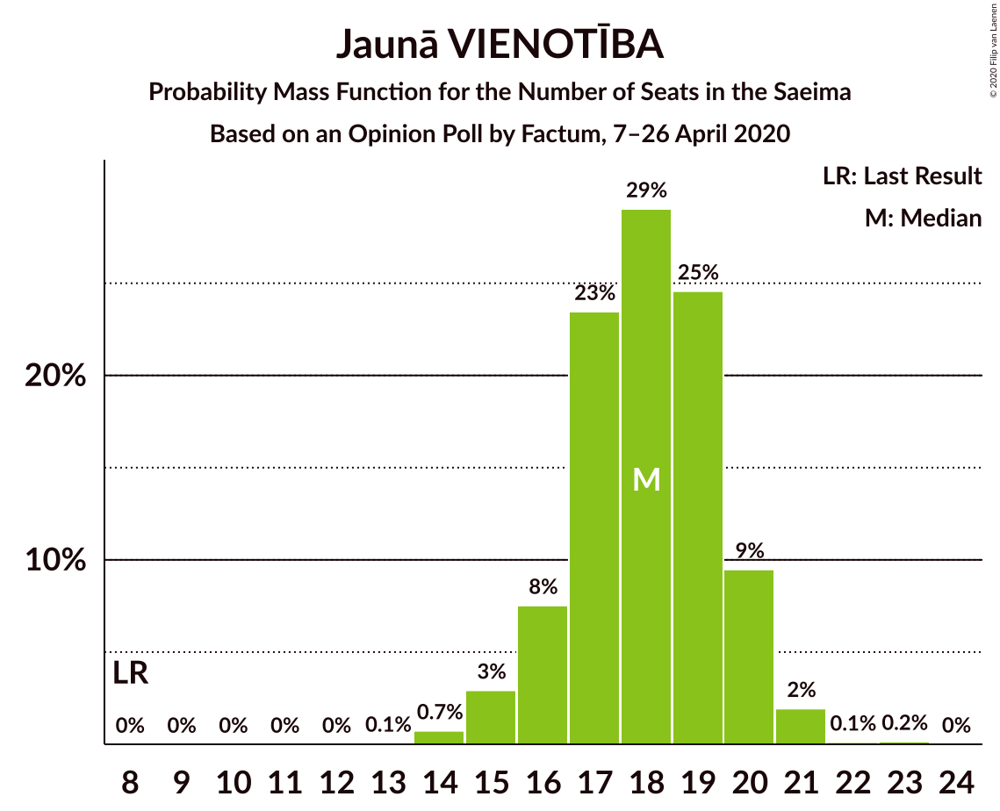
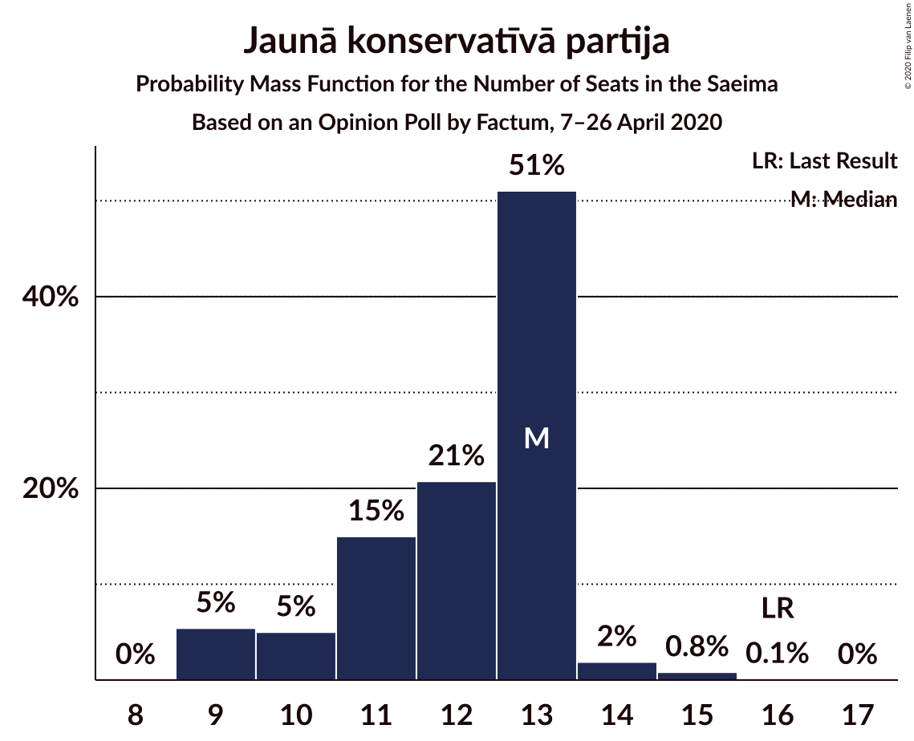
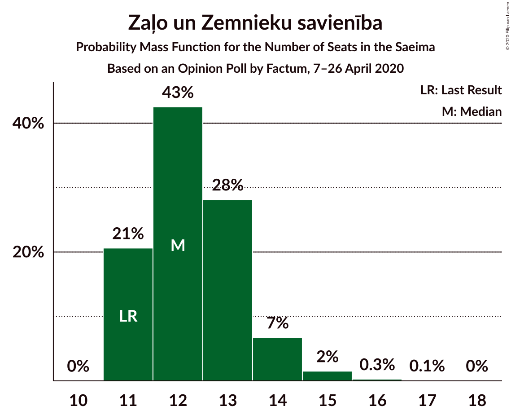
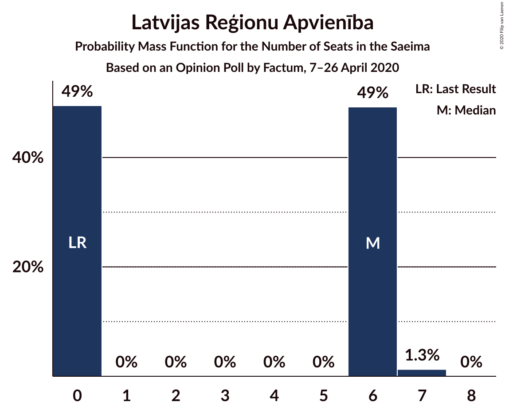
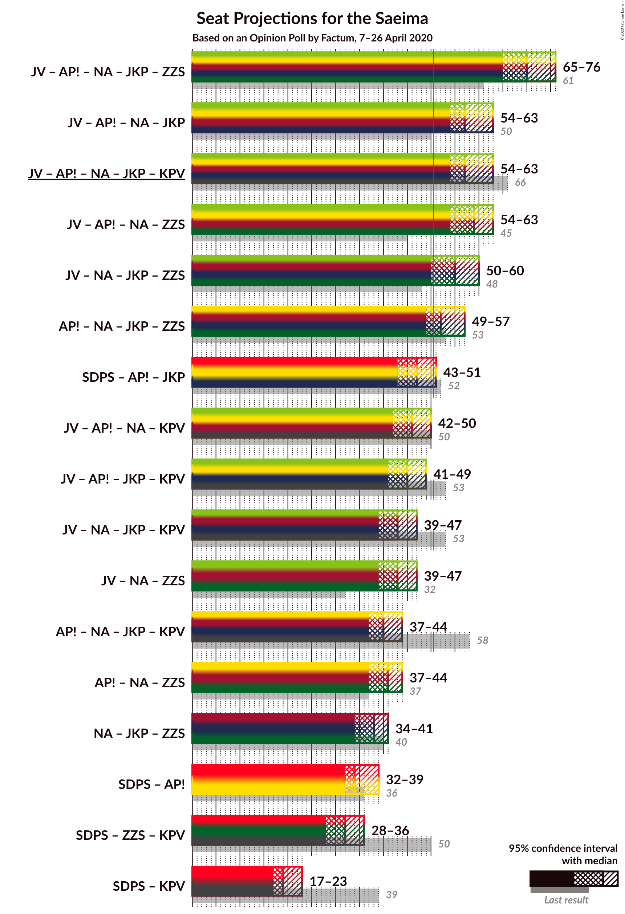
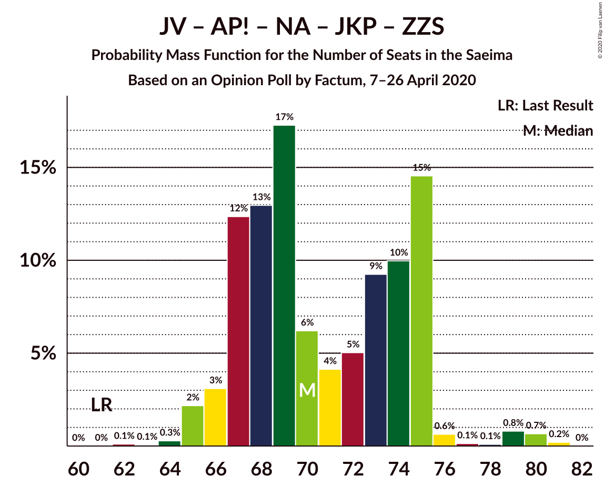
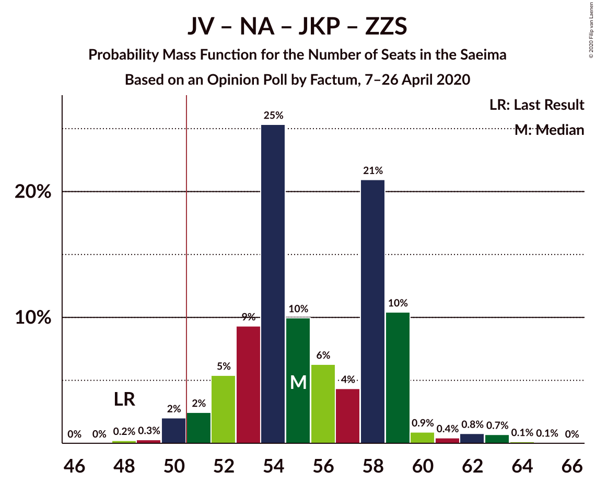
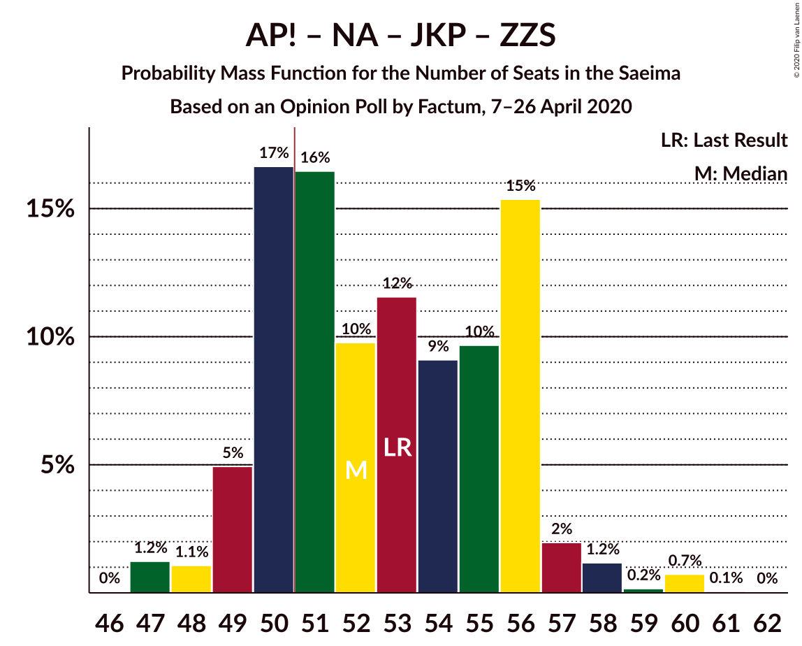
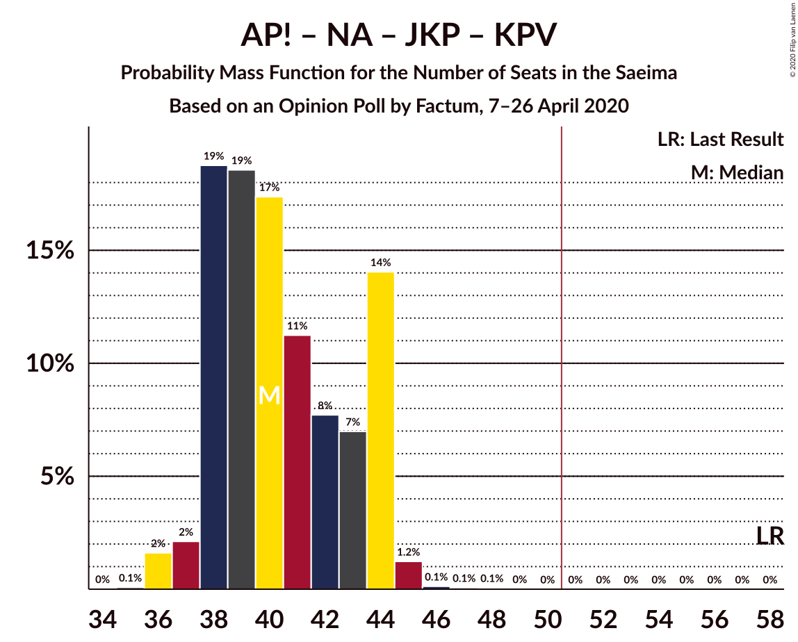
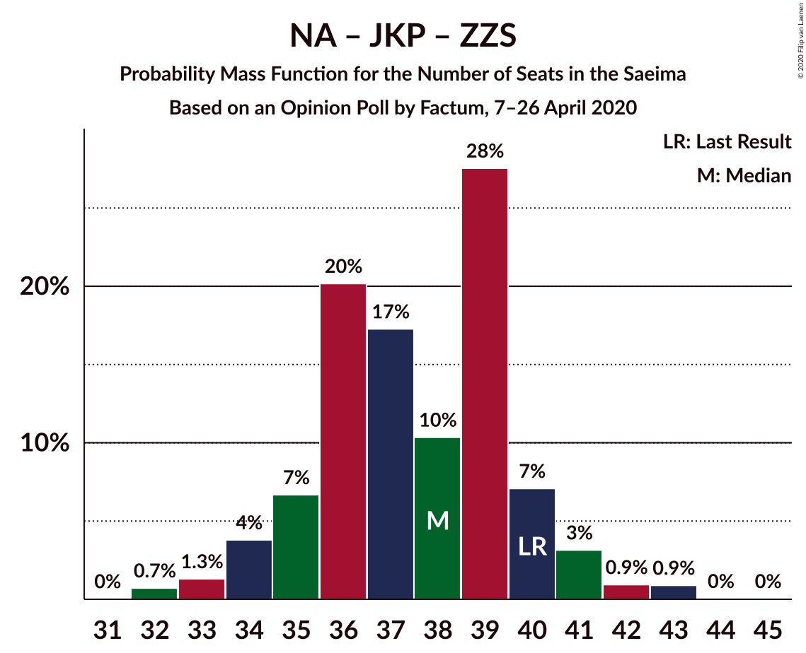

# Opinion Poll by Factum, 7–26 April 2020

<a href="#voting-intentions">Voting Intentions</a> | <a href="#seats">Seats</a> | <a href="#coalitions">Coalitions</a> | <a href="#technical-information">Technical Information</a>

## Voting Intentions

### Confidence Intervals

| Party | Last Result | Poll Result | 80% Confidence Interval | 90% Confidence Interval | 95% Confidence Interval | 99% Confidence Interval |
|:-----:|:-----------:|:-----------:|:-----------------------:|:-----------------------:|:-----------------------:|:-----------------------:|
| Sociāldemokrātiskā partija “Saskaņa” | 19.8% | 17.0% | 15.7–18.4% |15.4–18.8% |15.0–19.1% |14.5–19.8% |
| Jaunā VIENOTĪBA | 6.7% | 16.0% | 14.8–17.4% |14.4–17.7% |14.1–18.1% |13.5–18.7% |
| Attīstībai/Par! | 12.0% | 14.0% | 12.9–15.3% |12.5–15.7% |12.3–16.0% |11.7–16.7% |
| Nacionālā apvienība „Visu Latvijai!”–„Tēvzemei un Brīvībai/LNNK” | 11.0% | 12.0% | 10.9–13.2% |10.6–13.6% |10.3–13.9% |9.9–14.5% |
| Jaunā konservatīvā partija | 13.6% | 11.0% | 10.0–12.2% |9.7–12.5% |9.4–12.8% |9.0–13.4% |
| Zaļo un Zemnieku savienība | 9.9% | 11.0% | 10.0–12.2% |9.7–12.5% |9.4–12.8% |9.0–13.4% |
| PROGRESĪVIE | 2.6% | 6.0% | 5.3–7.0% |5.1–7.2% |4.9–7.5% |4.5–7.9% |
| Latvijas Reģionu Apvienība | 4.1% | 5.0% | 4.3–5.8% |4.1–6.1% |3.9–6.3% |3.6–6.7% |
| Latvijas Krievu savienība | 3.2% | 4.0% | 3.4–4.8% |3.2–5.0% |3.1–5.2% |2.8–5.6% |
| Politiskā partija „KPV LV” | 14.2% | 2.0% | 1.6–2.6% |1.5–2.8% |1.4–3.0% |1.2–3.3% |

*Note:* The poll result column reflects the actual value used in the calculations. Published results may vary slightly, and in addition be rounded to fewer digits.

## Seats

### Confidence Intervals

| Party | Last Result | Median | 80% Confidence Interval | 90% Confidence Interval | 95% Confidence Interval | 99% Confidence Interval |
|:-----:|:-----------:|:------:|:-----------------------:|:-----------------------:|:-----------------------:|:-----------------------:|
| <a href="#sociāldemokrātiskā-partija-“saskaņa”">Sociāldemokrātiskā partija “Saskaņa”</a> | 23 | 20 | 19–22 |18–22 |18–22 |17–23 |
| <a href="#jaunā-vienotība">Jaunā VIENOTĪBA</a> | 8 | 18 | 17–18 |16–18 |15–19 |15–20 |
| <a href="#attīstībai/par!">Attīstībai/Par!</a> | 13 | 15 | 13–16 |13–16 |13–17 |13–17 |
| <a href="#nacionālā-apvienība-„visu-latvijai!”–„tēvzemei-un-brīvībai/lnnk”">Nacionālā apvienība „Visu Latvijai!”–„Tēvzemei un Brīvībai/LNNK”</a> | 13 | 13 | 12–14 |11–14 |10–14 |10–16 |
| <a href="#jaunā-konservatīvā-partija">Jaunā konservatīvā partija</a> | 16 | 12 | 9–13 |9–13 |9–13 |9–14 |
| <a href="#zaļo-un-zemnieku-savienība">Zaļo un Zemnieku savienība</a> | 11 | 12 | 11–13 |11–13 |11–14 |11–15 |
| <a href="#progresīvie">PROGRESĪVIE</a> | 0 | 6 | 5–7 |0–7 |0–8 |0–8 |
| <a href="#latvijas-reģionu-apvienība">Latvijas Reģionu Apvienība</a> | 0 | 6 | 0–6 |0–6 |0–6 |0–6 |
| <a href="#latvijas-krievu-savienība">Latvijas Krievu savienība</a> | 0 | 0 | 0 |0 |0 |0–6 |
| <a href="#politiskā-partija-„kpv-lv”">Politiskā partija „KPV LV”</a> | 16 | 0 | 0 |0 |0 |0 |

### Sociāldemokrātiskā partija “Saskaņa”

*For a full overview of the results for this party, see the [Sociāldemokrātiskā partija “Saskaņa”](party-sociāldemokrātiskāpartija“saskaņa”.html) page.*

| Number of Seats | Probability | Accumulated | Special Marks |
|:---------------:|:-----------:|:-----------:|:-------------:|
| 16 | 0.2% | 100% |  |
| 17 | 2% | 99.8% |  |
| 18 | 7% | 98% |  |
| 19 | 37% | 91% |  |
| 20 | 15% | 54% | Median |
| 21 | 15% | 39% |  |
| 22 | 23% | 24% |  |
| 23 | 1.2% | 1.3% | Last Result |
| 24 | 0.1% | 0.2% |  |
| 25 | 0% | 0% |  |

### Jaunā VIENOTĪBA

*For a full overview of the results for this party, see the [Jaunā VIENOTĪBA](party-jaunāvienotība.html) page.*

| Number of Seats | Probability | Accumulated | Special Marks |
|:---------------:|:-----------:|:-----------:|:-------------:|
| 8 | 0% | 100% | Last Result |
| 9 | 0% | 100% |  |
| 10 | 0% | 100% |  |
| 11 | 0% | 100% |  |
| 12 | 0% | 100% |  |
| 13 | 0.1% | 100% |  |
| 14 | 0.2% | 99.9% |  |
| 15 | 3% | 99.8% |  |
| 16 | 3% | 97% |  |
| 17 | 30% | 94% |  |
| 18 | 59% | 64% | Median |
| 19 | 3% | 5% |  |
| 20 | 1.2% | 1.4% |  |
| 21 | 0.1% | 0.1% |  |
| 22 | 0% | 0.1% |  |
| 23 | 0% | 0% |  |

### Attīstībai/Par!

*For a full overview of the results for this party, see the [Attīstībai/Par!](party-attīstībaipar.html) page.*

| Number of Seats | Probability | Accumulated | Special Marks |
|:---------------:|:-----------:|:-----------:|:-------------:|
| 13 | 23% | 100% | Last Result |
| 14 | 4% | 77% |  |
| 15 | 50% | 72% | Median |
| 16 | 18% | 22% |  |
| 17 | 3% | 4% |  |
| 18 | 0.2% | 0.3% |  |
| 19 | 0.1% | 0.1% |  |
| 20 | 0% | 0% |  |

### Nacionālā apvienība „Visu Latvijai!”–„Tēvzemei un Brīvībai/LNNK”

*For a full overview of the results for this party, see the [Nacionālā apvienība „Visu Latvijai!”–„Tēvzemei un Brīvībai/LNNK”](party-nacionālāapvienība„visulatvijai”–„tēvzemeiunbrīvībailnnk”.html) page.*

| Number of Seats | Probability | Accumulated | Special Marks |
|:---------------:|:-----------:|:-----------:|:-------------:|
| 10 | 4% | 100% |  |
| 11 | 4% | 96% |  |
| 12 | 11% | 91% |  |
| 13 | 36% | 80% | Last Result, Median |
| 14 | 42% | 44% |  |
| 15 | 0.3% | 2% |  |
| 16 | 2% | 2% |  |
| 17 | 0% | 0% |  |

### Jaunā konservatīvā partija

*For a full overview of the results for this party, see the [Jaunā konservatīvā partija](party-jaunākonservatīvāpartija.html) page.*

| Number of Seats | Probability | Accumulated | Special Marks |
|:---------------:|:-----------:|:-----------:|:-------------:|
| 9 | 33% | 100% |  |
| 10 | 6% | 67% |  |
| 11 | 4% | 61% |  |
| 12 | 41% | 57% | Median |
| 13 | 14% | 16% |  |
| 14 | 0.9% | 1.1% |  |
| 15 | 0.2% | 0.2% |  |
| 16 | 0% | 0% | Last Result |

### Zaļo un Zemnieku savienība

*For a full overview of the results for this party, see the [Zaļo un Zemnieku savienība](party-zaļounzemniekusavienība.html) page.*

| Number of Seats | Probability | Accumulated | Special Marks |
|:---------------:|:-----------:|:-----------:|:-------------:|
| 11 | 30% | 100% | Last Result |
| 12 | 21% | 70% | Median |
| 13 | 46% | 49% |  |
| 14 | 2% | 3% |  |
| 15 | 0.4% | 0.6% |  |
| 16 | 0.1% | 0.2% |  |
| 17 | 0% | 0% |  |

### PROGRESĪVIE

*For a full overview of the results for this party, see the [PROGRESĪVIE](party-progresīvie.html) page.*

| Number of Seats | Probability | Accumulated | Special Marks |
|:---------------:|:-----------:|:-----------:|:-------------:|
| 0 | 5% | 100% | Last Result |
| 1 | 0% | 95% |  |
| 2 | 0% | 95% |  |
| 3 | 0% | 95% |  |
| 4 | 0% | 95% |  |
| 5 | 25% | 95% |  |
| 6 | 42% | 70% | Median |
| 7 | 24% | 27% |  |
| 8 | 3% | 4% |  |
| 9 | 0.4% | 0.4% |  |
| 10 | 0% | 0% |  |

### Latvijas Reģionu Apvienība

*For a full overview of the results for this party, see the [Latvijas Reģionu Apvienība](party-latvijasreģionuapvienība.html) page.*

| Number of Seats | Probability | Accumulated | Special Marks |
|:---------------:|:-----------:|:-----------:|:-------------:|
| 0 | 11% | 100% | Last Result |
| 1 | 0% | 89% |  |
| 2 | 0% | 89% |  |
| 3 | 0% | 89% |  |
| 4 | 0% | 89% |  |
| 5 | 0% | 89% |  |
| 6 | 89% | 89% | Median |
| 7 | 0.2% | 0.2% |  |
| 8 | 0% | 0% |  |

### Latvijas Krievu savienība

*For a full overview of the results for this party, see the [Latvijas Krievu savienība](party-latvijaskrievusavienība.html) page.*

| Number of Seats | Probability | Accumulated | Special Marks |
|:---------------:|:-----------:|:-----------:|:-------------:|
| 0 | 98% | 100% | Last Result, Median |
| 1 | 0% | 2% |  |
| 2 | 0% | 2% |  |
| 3 | 0% | 2% |  |
| 4 | 0% | 2% |  |
| 5 | 1.2% | 2% |  |
| 6 | 0.2% | 0.5% |  |
| 7 | 0.1% | 0.3% |  |
| 8 | 0.2% | 0.2% |  |
| 9 | 0% | 0% |  |

### Politiskā partija „KPV LV”

*For a full overview of the results for this party, see the [Politiskā partija „KPV LV”](party-politiskāpartija„kpvlv”.html) page.*

| Number of Seats | Probability | Accumulated | Special Marks |
|:---------------:|:-----------:|:-----------:|:-------------:|
| 0 | 100% | 100% | Median |
| 1 | 0% | 0% |  |
| 2 | 0% | 0% |  |
| 3 | 0% | 0% |  |
| 4 | 0% | 0% |  |
| 5 | 0% | 0% |  |
| 6 | 0% | 0% |  |
| 7 | 0% | 0% |  |
| 8 | 0% | 0% |  |
| 9 | 0% | 0% |  |
| 10 | 0% | 0% |  |
| 11 | 0% | 0% |  |
| 12 | 0% | 0% |  |
| 13 | 0% | 0% |  |
| 14 | 0% | 0% |  |
| 15 | 0% | 0% |  |
| 16 | 0% | 0% | Last Result |

## Coalitions

### Confidence Intervals

| Coalition | Last Result | Median | Majority? | 80% Confidence Interval | 90% Confidence Interval | 95% Confidence Interval | 99% Confidence Interval |
|:---------:|:-----------:|:------:|:---------:|:-----------------------:|:-----------------------:|:-----------------------:|:-----------------------:|
| Jaunā VIENOTĪBA – Attīstībai/Par! – Nacionālā apvienība „Visu Latvijai!”–„Tēvzemei un Brīvībai/LNNK” – Jaunā konservatīvā partija – Zaļo un Zemnieku savienība | 61 | 69 | 100% | 67–72 | 67–72 | 67–73 | 65–74 |
| Jaunā VIENOTĪBA – Attīstībai/Par! – Nacionālā apvienība „Visu Latvijai!”–„Tēvzemei un Brīvībai/LNNK” – Zaļo un Zemnieku savienība | 45 | 59 | 100% | 55–60 | 55–60 | 55–61 | 52–63 |
| Jaunā VIENOTĪBA – Attīstībai/Par! – Nacionālā apvienība „Visu Latvijai!”–„Tēvzemei un Brīvībai/LNNK” – Jaunā konservatīvā partija | 50 | 56 | 100% | 55–59 | 55–59 | 55–60 | 54–62 |
| Jaunā VIENOTĪBA – Attīstībai/Par! – Nacionālā apvienība „Visu Latvijai!”–„Tēvzemei un Brīvībai/LNNK” – Jaunā konservatīvā partija – Politiskā partija „KPV LV” | 66 | 56 | 100% | 55–59 | 55–59 | 55–60 | 54–62 |
| Jaunā VIENOTĪBA – Nacionālā apvienība „Visu Latvijai!”–„Tēvzemei un Brīvībai/LNNK” – Jaunā konservatīvā partija – Zaļo un Zemnieku savienība | 48 | 54 | 99.6% | 52–56 | 52–57 | 51–57 | 51–59 |
| Attīstībai/Par! – Nacionālā apvienība „Visu Latvijai!”–„Tēvzemei un Brīvībai/LNNK” – Jaunā konservatīvā partija – Zaļo un Zemnieku savienība | 53 | 51 | 74% | 49–54 | 49–54 | 49–55 | 48–57 |
| Sociāldemokrātiskā partija “Saskaņa” – Attīstībai/Par! – Jaunā konservatīvā partija | 52 | 46 | 2% | 43–49 | 43–49 | 43–50 | 42–51 |
| Jaunā VIENOTĪBA – Attīstībai/Par! – Nacionālā apvienība „Visu Latvijai!”–„Tēvzemei un Brīvībai/LNNK” – Politiskā partija „KPV LV” | 50 | 46 | 0.1% | 43–47 | 43–48 | 42–48 | 41–49 |
| Jaunā VIENOTĪBA – Attīstībai/Par! – Jaunā konservatīvā partija – Politiskā partija „KPV LV” | 53 | 43 | 0.1% | 42–45 | 42–46 | 42–47 | 40–48 |
| Jaunā VIENOTĪBA – Nacionālā apvienība „Visu Latvijai!”–„Tēvzemei un Brīvībai/LNNK” – Zaļo un Zemnieku savienība | 32 | 43 | 0% | 40–45 | 40–45 | 39–45 | 38–46 |
| Jaunā VIENOTĪBA – Nacionālā apvienība „Visu Latvijai!”–„Tēvzemei un Brīvībai/LNNK” – Jaunā konservatīvā partija – Politiskā partija „KPV LV” | 53 | 41 | 0% | 40–43 | 40–44 | 40–44 | 39–46 |
| Attīstībai/Par! – Nacionālā apvienība „Visu Latvijai!”–„Tēvzemei un Brīvībai/LNNK” – Zaļo un Zemnieku savienība | 37 | 41 | 0% | 37–42 | 37–42 | 37–44 | 35–45 |
| Attīstībai/Par! – Nacionālā apvienība „Visu Latvijai!”–„Tēvzemei un Brīvībai/LNNK” – Jaunā konservatīvā partija – Politiskā partija „KPV LV” | 58 | 38 | 0% | 38–41 | 37–42 | 37–43 | 37–44 |
| Nacionālā apvienība „Visu Latvijai!”–„Tēvzemei un Brīvībai/LNNK” – Jaunā konservatīvā partija – Zaļo un Zemnieku savienība | 40 | 36 | 0% | 35–39 | 35–39 | 34–40 | 33–40 |
| Sociāldemokrātiskā partija “Saskaņa” – Attīstībai/Par! | 36 | 35 | 0% | 33–37 | 32–37 | 32–37 | 31–39 |
| Sociāldemokrātiskā partija “Saskaņa” – Zaļo un Zemnieku savienība – Politiskā partija „KPV LV” | 50 | 32 | 0% | 31–34 | 30–35 | 30–35 | 28–36 |
| Sociāldemokrātiskā partija “Saskaņa” – Politiskā partija „KPV LV” | 39 | 20 | 0% | 19–22 | 18–22 | 18–22 | 17–23 |

### Jaunā VIENOTĪBA – Attīstībai/Par! – Nacionālā apvienība „Visu Latvijai!”–„Tēvzemei un Brīvībai/LNNK” – Jaunā konservatīvā partija – Zaļo un Zemnieku savienība

| Number of Seats | Probability | Accumulated | Special Marks |
|:---------------:|:-----------:|:-----------:|:-------------:|
| 61 | 0% | 100% | Last Result |
| 62 | 0% | 100% |  |
| 63 | 0% | 100% |  |
| 64 | 0% | 99.9% |  |
| 65 | 2% | 99.9% |  |
| 66 | 0.3% | 98% |  |
| 67 | 23% | 98% |  |
| 68 | 20% | 75% |  |
| 69 | 37% | 55% |  |
| 70 | 3% | 18% | Median |
| 71 | 4% | 15% |  |
| 72 | 7% | 10% |  |
| 73 | 3% | 4% |  |
| 74 | 0.5% | 1.0% |  |
| 75 | 0.3% | 0.5% |  |
| 76 | 0.1% | 0.2% |  |
| 77 | 0% | 0.1% |  |
| 78 | 0% | 0.1% |  |
| 79 | 0% | 0.1% |  |
| 80 | 0% | 0.1% |  |
| 81 | 0% | 0% |  |

### Jaunā VIENOTĪBA – Attīstībai/Par! – Nacionālā apvienība „Visu Latvijai!”–„Tēvzemei un Brīvībai/LNNK” – Zaļo un Zemnieku savienība

| Number of Seats | Probability | Accumulated | Special Marks |
|:---------------:|:-----------:|:-----------:|:-------------:|
| 45 | 0% | 100% | Last Result |
| 46 | 0% | 100% |  |
| 47 | 0% | 100% |  |
| 48 | 0% | 100% |  |
| 49 | 0% | 100% |  |
| 50 | 0% | 100% |  |
| 51 | 0% | 100% | Majority |
| 52 | 1.3% | 100% |  |
| 53 | 0.2% | 98.7% |  |
| 54 | 0.6% | 98.6% |  |
| 55 | 28% | 98% |  |
| 56 | 15% | 70% |  |
| 57 | 1.3% | 55% |  |
| 58 | 3% | 54% | Median |
| 59 | 7% | 50% |  |
| 60 | 40% | 43% |  |
| 61 | 1.4% | 3% |  |
| 62 | 0.6% | 1.2% |  |
| 63 | 0.5% | 0.6% |  |
| 64 | 0% | 0.1% |  |
| 65 | 0.1% | 0.1% |  |
| 66 | 0% | 0% |  |

### Jaunā VIENOTĪBA – Attīstībai/Par! – Nacionālā apvienība „Visu Latvijai!”–„Tēvzemei un Brīvībai/LNNK” – Jaunā konservatīvā partija

| Number of Seats | Probability | Accumulated | Special Marks |
|:---------------:|:-----------:|:-----------:|:-------------:|
| 50 | 0% | 100% | Last Result |
| 51 | 0% | 100% | Majority |
| 52 | 0.1% | 100% |  |
| 53 | 0.2% | 99.9% |  |
| 54 | 2% | 99.7% |  |
| 55 | 11% | 98% |  |
| 56 | 54% | 86% |  |
| 57 | 15% | 32% |  |
| 58 | 7% | 17% | Median |
| 59 | 6% | 10% |  |
| 60 | 3% | 5% |  |
| 61 | 2% | 2% |  |
| 62 | 0.2% | 0.5% |  |
| 63 | 0.2% | 0.4% |  |
| 64 | 0.1% | 0.1% |  |
| 65 | 0% | 0.1% |  |
| 66 | 0% | 0% |  |

### Jaunā VIENOTĪBA – Attīstībai/Par! – Nacionālā apvienība „Visu Latvijai!”–„Tēvzemei un Brīvībai/LNNK” – Jaunā konservatīvā partija – Politiskā partija „KPV LV”

| Number of Seats | Probability | Accumulated | Special Marks |
|:---------------:|:-----------:|:-----------:|:-------------:|
| 52 | 0.1% | 100% |  |
| 53 | 0.2% | 99.9% |  |
| 54 | 2% | 99.7% |  |
| 55 | 11% | 98% |  |
| 56 | 54% | 86% |  |
| 57 | 15% | 32% |  |
| 58 | 7% | 17% | Median |
| 59 | 6% | 10% |  |
| 60 | 3% | 5% |  |
| 61 | 2% | 2% |  |
| 62 | 0.2% | 0.5% |  |
| 63 | 0.2% | 0.4% |  |
| 64 | 0.1% | 0.1% |  |
| 65 | 0% | 0.1% |  |
| 66 | 0% | 0% | Last Result |

### Jaunā VIENOTĪBA – Nacionālā apvienība „Visu Latvijai!”–„Tēvzemei un Brīvībai/LNNK” – Jaunā konservatīvā partija – Zaļo un Zemnieku savienība

| Number of Seats | Probability | Accumulated | Special Marks |
|:---------------:|:-----------:|:-----------:|:-------------:|
| 48 | 0% | 100% | Last Result |
| 49 | 0.2% | 100% |  |
| 50 | 0.2% | 99.8% |  |
| 51 | 3% | 99.6% | Majority |
| 52 | 15% | 97% |  |
| 53 | 7% | 82% |  |
| 54 | 56% | 75% |  |
| 55 | 5% | 20% | Median |
| 56 | 7% | 15% |  |
| 57 | 6% | 8% |  |
| 58 | 2% | 2% |  |
| 59 | 0.4% | 0.6% |  |
| 60 | 0.1% | 0.2% |  |
| 61 | 0% | 0.1% |  |
| 62 | 0% | 0.1% |  |
| 63 | 0% | 0.1% |  |
| 64 | 0% | 0% |  |

### Attīstībai/Par! – Nacionālā apvienība „Visu Latvijai!”–„Tēvzemei un Brīvībai/LNNK” – Jaunā konservatīvā partija – Zaļo un Zemnieku savienība

| Number of Seats | Probability | Accumulated | Special Marks |
|:---------------:|:-----------:|:-----------:|:-------------:|
| 47 | 0.2% | 100% |  |
| 48 | 2% | 99.8% |  |
| 49 | 17% | 98% |  |
| 50 | 7% | 81% |  |
| 51 | 51% | 74% | Majority |
| 52 | 5% | 23% | Median |
| 53 | 6% | 18% | Last Result |
| 54 | 7% | 12% |  |
| 55 | 3% | 5% |  |
| 56 | 0.8% | 2% |  |
| 57 | 0.8% | 1.0% |  |
| 58 | 0% | 0.1% |  |
| 59 | 0% | 0.1% |  |
| 60 | 0% | 0% |  |

### Sociāldemokrātiskā partija “Saskaņa” – Attīstībai/Par! – Jaunā konservatīvā partija

| Number of Seats | Probability | Accumulated | Special Marks |
|:---------------:|:-----------:|:-----------:|:-------------:|
| 40 | 0.3% | 100% |  |
| 41 | 0.2% | 99.7% |  |
| 42 | 0.8% | 99.5% |  |
| 43 | 34% | 98.8% |  |
| 44 | 2% | 65% |  |
| 45 | 13% | 63% |  |
| 46 | 3% | 51% |  |
| 47 | 17% | 48% | Median |
| 48 | 9% | 31% |  |
| 49 | 18% | 22% |  |
| 50 | 2% | 4% |  |
| 51 | 1.4% | 2% | Majority |
| 52 | 0.3% | 0.3% | Last Result |
| 53 | 0% | 0% |  |

### Jaunā VIENOTĪBA – Attīstībai/Par! – Nacionālā apvienība „Visu Latvijai!”–„Tēvzemei un Brīvībai/LNNK” – Politiskā partija „KPV LV”

| Number of Seats | Probability | Accumulated | Special Marks |
|:---------------:|:-----------:|:-----------:|:-------------:|
| 41 | 1.3% | 100% |  |
| 42 | 3% | 98.6% |  |
| 43 | 9% | 95% |  |
| 44 | 21% | 86% |  |
| 45 | 13% | 65% |  |
| 46 | 6% | 52% | Median |
| 47 | 40% | 46% |  |
| 48 | 4% | 6% |  |
| 49 | 1.0% | 2% |  |
| 50 | 0.4% | 0.5% | Last Result |
| 51 | 0% | 0.1% | Majority |
| 52 | 0% | 0% |  |

### Jaunā VIENOTĪBA – Attīstībai/Par! – Jaunā konservatīvā partija – Politiskā partija „KPV LV”

| Number of Seats | Probability | Accumulated | Special Marks |
|:---------------:|:-----------:|:-----------:|:-------------:|
| 39 | 0.1% | 100% |  |
| 40 | 0.7% | 99.9% |  |
| 41 | 1.0% | 99.2% |  |
| 42 | 39% | 98% |  |
| 43 | 22% | 59% |  |
| 44 | 5% | 37% |  |
| 45 | 26% | 32% | Median |
| 46 | 4% | 6% |  |
| 47 | 2% | 3% |  |
| 48 | 0.4% | 0.8% |  |
| 49 | 0.2% | 0.4% |  |
| 50 | 0.1% | 0.2% |  |
| 51 | 0% | 0.1% | Majority |
| 52 | 0% | 0% |  |
| 53 | 0% | 0% | Last Result |

### Jaunā VIENOTĪBA – Nacionālā apvienība „Visu Latvijai!”–„Tēvzemei un Brīvībai/LNNK” – Zaļo un Zemnieku savienība

| Number of Seats | Probability | Accumulated | Special Marks |
|:---------------:|:-----------:|:-----------:|:-------------:|
| 32 | 0% | 100% | Last Result |
| 33 | 0% | 100% |  |
| 34 | 0% | 100% |  |
| 35 | 0% | 100% |  |
| 36 | 0% | 100% |  |
| 37 | 0% | 100% |  |
| 38 | 1.3% | 100% |  |
| 39 | 2% | 98.7% |  |
| 40 | 16% | 97% |  |
| 41 | 2% | 81% |  |
| 42 | 27% | 79% |  |
| 43 | 6% | 52% | Median |
| 44 | 6% | 46% |  |
| 45 | 38% | 40% |  |
| 46 | 2% | 2% |  |
| 47 | 0.1% | 0.4% |  |
| 48 | 0.2% | 0.3% |  |
| 49 | 0.1% | 0.1% |  |
| 50 | 0% | 0% |  |

### Jaunā VIENOTĪBA – Nacionālā apvienība „Visu Latvijai!”–„Tēvzemei un Brīvībai/LNNK” – Jaunā konservatīvā partija – Politiskā partija „KPV LV”

| Number of Seats | Probability | Accumulated | Special Marks |
|:---------------:|:-----------:|:-----------:|:-------------:|
| 37 | 0.1% | 100% |  |
| 38 | 0.2% | 99.9% |  |
| 39 | 0.6% | 99.7% |  |
| 40 | 11% | 99.1% |  |
| 41 | 45% | 88% |  |
| 42 | 10% | 43% |  |
| 43 | 23% | 33% | Median |
| 44 | 8% | 10% |  |
| 45 | 0.4% | 2% |  |
| 46 | 1.5% | 2% |  |
| 47 | 0.1% | 0.2% |  |
| 48 | 0% | 0.1% |  |
| 49 | 0.1% | 0.1% |  |
| 50 | 0% | 0% |  |
| 51 | 0% | 0% | Majority |
| 52 | 0% | 0% |  |
| 53 | 0% | 0% | Last Result |

### Attīstībai/Par! – Nacionālā apvienība „Visu Latvijai!”–„Tēvzemei un Brīvībai/LNNK” – Zaļo un Zemnieku savienība

| Number of Seats | Probability | Accumulated | Special Marks |
|:---------------:|:-----------:|:-----------:|:-------------:|
| 35 | 1.4% | 100% |  |
| 36 | 0.2% | 98.6% |  |
| 37 | 15% | 98% | Last Result |
| 38 | 13% | 83% |  |
| 39 | 14% | 70% |  |
| 40 | 5% | 56% | Median |
| 41 | 6% | 51% |  |
| 42 | 41% | 46% |  |
| 43 | 2% | 4% |  |
| 44 | 2% | 3% |  |
| 45 | 0.5% | 0.6% |  |
| 46 | 0% | 0.1% |  |
| 47 | 0% | 0.1% |  |
| 48 | 0% | 0% |  |

### Attīstībai/Par! – Nacionālā apvienība „Visu Latvijai!”–„Tēvzemei un Brīvībai/LNNK” – Jaunā konservatīvā partija – Politiskā partija „KPV LV”

| Number of Seats | Probability | Accumulated | Special Marks |
|:---------------:|:-----------:|:-----------:|:-------------:|
| 35 | 0.1% | 100% |  |
| 36 | 0.2% | 99.9% |  |
| 37 | 5% | 99.7% |  |
| 38 | 56% | 94% |  |
| 39 | 6% | 39% |  |
| 40 | 18% | 32% | Median |
| 41 | 7% | 14% |  |
| 42 | 4% | 7% |  |
| 43 | 2% | 3% |  |
| 44 | 0.9% | 1.1% |  |
| 45 | 0.2% | 0.2% |  |
| 46 | 0.1% | 0.1% |  |
| 47 | 0% | 0% |  |
| 48 | 0% | 0% |  |
| 49 | 0% | 0% |  |
| 50 | 0% | 0% |  |
| 51 | 0% | 0% | Majority |
| 52 | 0% | 0% |  |
| 53 | 0% | 0% |  |
| 54 | 0% | 0% |  |
| 55 | 0% | 0% |  |
| 56 | 0% | 0% |  |
| 57 | 0% | 0% |  |
| 58 | 0% | 0% | Last Result |

### Nacionālā apvienība „Visu Latvijai!”–„Tēvzemei un Brīvībai/LNNK” – Jaunā konservatīvā partija – Zaļo un Zemnieku savienība

| Number of Seats | Probability | Accumulated | Special Marks |
|:---------------:|:-----------:|:-----------:|:-------------:|
| 32 | 0.2% | 100% |  |
| 33 | 0.4% | 99.8% |  |
| 34 | 4% | 99.4% |  |
| 35 | 16% | 96% |  |
| 36 | 52% | 79% |  |
| 37 | 7% | 28% | Median |
| 38 | 9% | 21% |  |
| 39 | 10% | 12% |  |
| 40 | 2% | 3% | Last Result |
| 41 | 0.1% | 0.3% |  |
| 42 | 0.1% | 0.2% |  |
| 43 | 0% | 0.1% |  |
| 44 | 0% | 0% |  |

### Sociāldemokrātiskā partija “Saskaņa” – Attīstībai/Par!

| Number of Seats | Probability | Accumulated | Special Marks |
|:---------------:|:-----------:|:-----------:|:-------------:|
| 29 | 0.1% | 100% |  |
| 30 | 0% | 99.9% |  |
| 31 | 0.5% | 99.9% |  |
| 32 | 5% | 99.4% |  |
| 33 | 9% | 95% |  |
| 34 | 34% | 86% |  |
| 35 | 25% | 52% | Median |
| 36 | 5% | 26% | Last Result |
| 37 | 19% | 22% |  |
| 38 | 2% | 2% |  |
| 39 | 0.4% | 0.5% |  |
| 40 | 0.1% | 0.2% |  |
| 41 | 0.1% | 0.1% |  |
| 42 | 0% | 0% |  |

### Sociāldemokrātiskā partija “Saskaņa” – Zaļo un Zemnieku savienība – Politiskā partija „KPV LV”

| Number of Seats | Probability | Accumulated | Special Marks |
|:---------------:|:-----------:|:-----------:|:-------------:|
| 27 | 0% | 100% |  |
| 28 | 0.6% | 99.9% |  |
| 29 | 1.2% | 99.4% |  |
| 30 | 5% | 98% |  |
| 31 | 8% | 93% |  |
| 32 | 53% | 85% | Median |
| 33 | 21% | 32% |  |
| 34 | 2% | 11% |  |
| 35 | 7% | 9% |  |
| 36 | 1.5% | 2% |  |
| 37 | 0.2% | 0.2% |  |
| 38 | 0% | 0% |  |
| 39 | 0% | 0% |  |
| 40 | 0% | 0% |  |
| 41 | 0% | 0% |  |
| 42 | 0% | 0% |  |
| 43 | 0% | 0% |  |
| 44 | 0% | 0% |  |
| 45 | 0% | 0% |  |
| 46 | 0% | 0% |  |
| 47 | 0% | 0% |  |
| 48 | 0% | 0% |  |
| 49 | 0% | 0% |  |
| 50 | 0% | 0% | Last Result |

### Sociāldemokrātiskā partija “Saskaņa” – Politiskā partija „KPV LV”

| Number of Seats | Probability | Accumulated | Special Marks |
|:---------------:|:-----------:|:-----------:|:-------------:|
| 16 | 0.2% | 100% |  |
| 17 | 2% | 99.8% |  |
| 18 | 7% | 98% |  |
| 19 | 37% | 91% |  |
| 20 | 15% | 54% | Median |
| 21 | 15% | 39% |  |
| 22 | 23% | 24% |  |
| 23 | 1.2% | 1.3% |  |
| 24 | 0.1% | 0.2% |  |
| 25 | 0% | 0% |  |
| 26 | 0% | 0% |  |
| 27 | 0% | 0% |  |
| 28 | 0% | 0% |  |
| 29 | 0% | 0% |  |
| 30 | 0% | 0% |  |
| 31 | 0% | 0% |  |
| 32 | 0% | 0% |  |
| 33 | 0% | 0% |  |
| 34 | 0% | 0% |  |
| 35 | 0% | 0% |  |
| 36 | 0% | 0% |  |
| 37 | 0% | 0% |  |
| 38 | 0% | 0% |  |
| 39 | 0% | 0% | Last Result |

## Technical Information

### Opinion Poll

+ **Polling firm:** Factum
+ **Commissioner(s):** —
+ **Fieldwork period:** 7–26 April 2020

### Calculations

+ **Sample size:** 1325
+ **Simulations done:** 131,072
+ **Error estimate:** 1.94%

