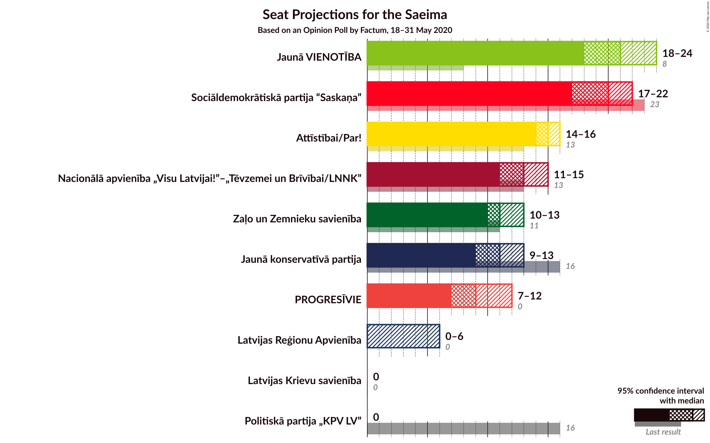
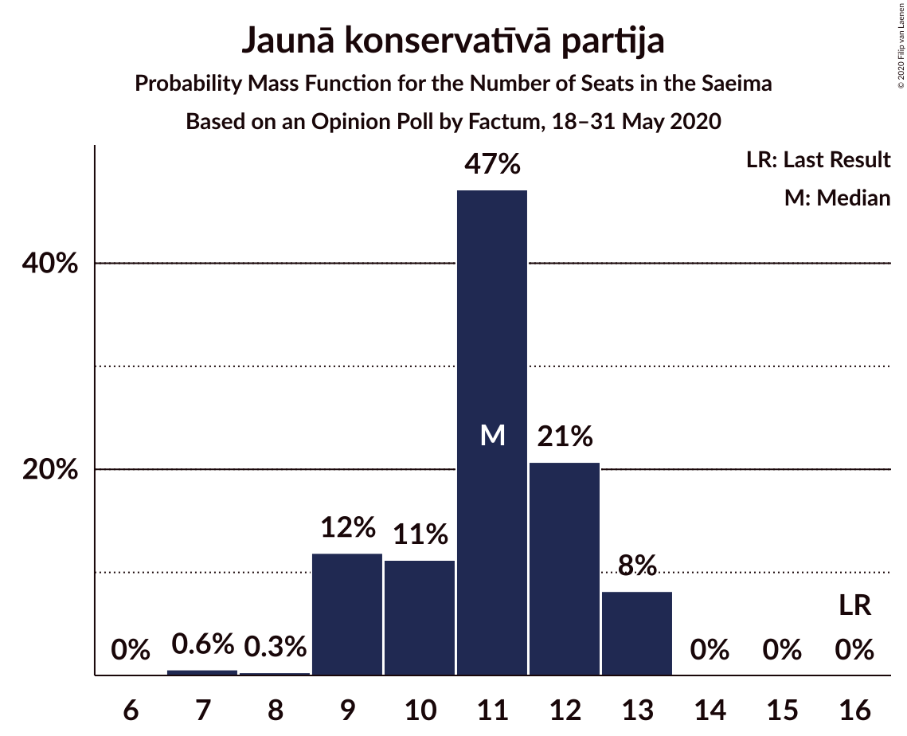
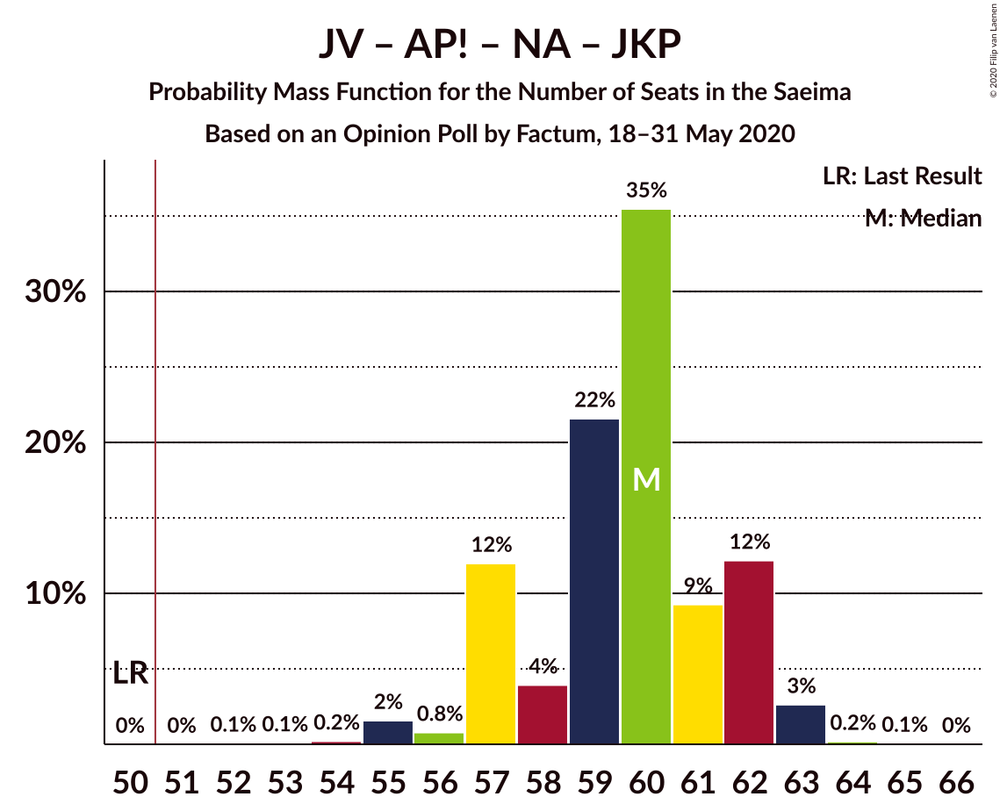
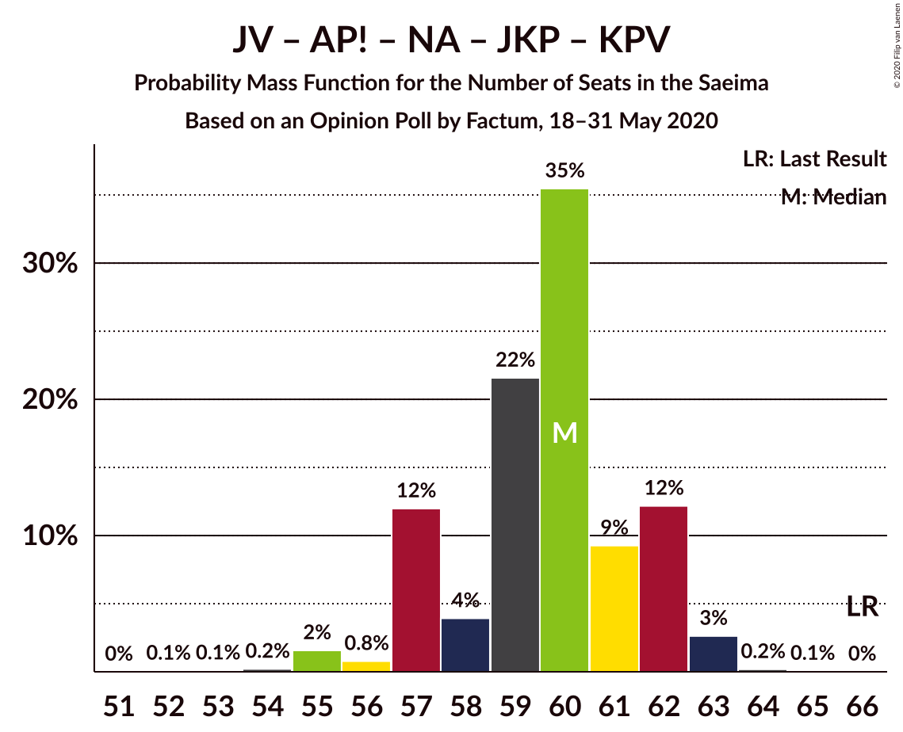
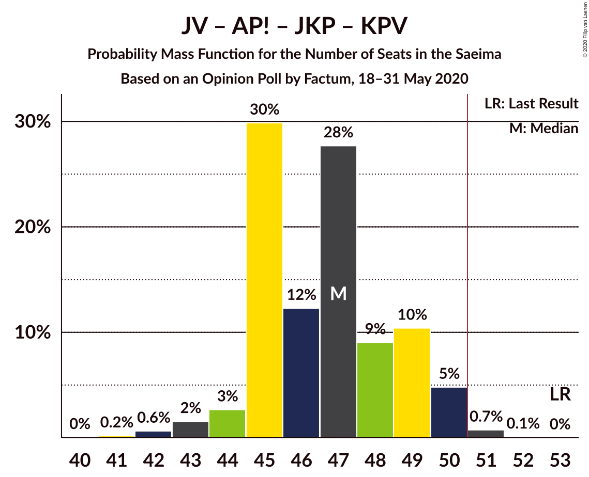

# Opinion Poll by Factum, 18–31 May 2020

<a href="#voting-intentions">Voting Intentions</a> | <a href="#seats">Seats</a> | <a href="#coalitions">Coalitions</a> | <a href="#technical-information">Technical Information</a>

## Voting Intentions

### Confidence Intervals

| Party | Last Result | Poll Result | 80% Confidence Interval | 90% Confidence Interval | 95% Confidence Interval | 99% Confidence Interval |
|:-----:|:-----------:|:-----------:|:-----------------------:|:-----------------------:|:-----------------------:|:-----------------------:|
| Jaunā VIENOTĪBA | 6.7% | 18.0% | 16.6–19.5% |16.3–20.0% |15.9–20.3% |15.3–21.1% |
| Sociāldemokrātiskā partija “Saskaņa” | 19.8% | 16.0% | 14.7–17.4% |14.3–17.8% |14.0–18.2% |13.4–18.9% |
| Attīstībai/Par! | 12.0% | 13.0% | 11.8–14.4% |11.5–14.7% |11.2–15.1% |10.7–15.7% |
| Nacionālā apvienība „Visu Latvijai!”–„Tēvzemei un Brīvībai/LNNK” | 11.0% | 11.0% | 9.9–12.3% |9.6–12.6% |9.3–12.9% |8.8–13.5% |
| Jaunā konservatīvā partija | 13.6% | 9.0% | 8.0–10.1% |7.7–10.5% |7.5–10.7% |7.0–11.3% |
| Zaļo un Zemnieku savienība | 9.9% | 9.0% | 8.0–10.1% |7.7–10.5% |7.5–10.7% |7.0–11.3% |
| PROGRESĪVIE | 2.6% | 8.0% | 7.1–9.1% |6.8–9.5% |6.6–9.7% |6.2–10.3% |
| Latvijas Reģionu Apvienība | 4.1% | 4.0% | 3.3–4.8% |3.2–5.0% |3.0–5.3% |2.7–5.7% |
| Latvijas Krievu savienība | 3.2% | 3.0% | 2.4–3.7% |2.3–3.9% |2.1–4.1% |1.9–4.5% |
| Politiskā partija „KPV LV” | 14.2% | 2.0% | 1.6–2.7% |1.5–2.9% |1.4–3.0% |1.2–3.3% |

*Note:* The poll result column reflects the actual value used in the calculations. Published results may vary slightly, and in addition be rounded to fewer digits.

## Seats

### Confidence Intervals

| Party | Last Result | Median | 80% Confidence Interval | 90% Confidence Interval | 95% Confidence Interval | 99% Confidence Interval |
|:-----:|:-----------:|:------:|:-----------------------:|:-----------------------:|:-----------------------:|:-----------------------:|
| <a href="#jaunā-vienotība">Jaunā VIENOTĪBA</a> | 8 | 21 | 19–23 |18–23 |18–24 |18–24 |
| <a href="#sociāldemokrātiskā-partija-“saskaņa”">Sociāldemokrātiskā partija “Saskaņa”</a> | 23 | 20 | 18–21 |18–21 |17–22 |16–23 |
| <a href="#attīstībai/par!">Attīstībai/Par!</a> | 13 | 15 | 14–16 |14–16 |14–16 |13–17 |
| <a href="#nacionālā-apvienība-„visu-latvijai!”–„tēvzemei-un-brīvībai/lnnk”">Nacionālā apvienība „Visu Latvijai!”–„Tēvzemei un Brīvībai/LNNK”</a> | 13 | 13 | 12–14 |11–14 |11–15 |11–16 |
| <a href="#jaunā-konservatīvā-partija">Jaunā konservatīvā partija</a> | 16 | 11 | 9–12 |9–13 |9–13 |7–13 |
| <a href="#zaļo-un-zemnieku-savienība">Zaļo un Zemnieku savienība</a> | 11 | 11 | 11–12 |10–13 |10–13 |8–14 |
| <a href="#progresīvie">PROGRESĪVIE</a> | 0 | 9 | 8–11 |8–12 |7–12 |7–12 |
| <a href="#latvijas-reģionu-apvienība">Latvijas Reģionu Apvienība</a> | 0 | 0 | 0 |0 |0–6 |0–6 |
| <a href="#latvijas-krievu-savienība">Latvijas Krievu savienība</a> | 0 | 0 | 0 |0 |0 |0 |
| <a href="#politiskā-partija-„kpv-lv”">Politiskā partija „KPV LV”</a> | 16 | 0 | 0 |0 |0 |0 |

### Jaunā VIENOTĪBA

*For a full overview of the results for this party, see the [Jaunā VIENOTĪBA](party-jaunāvienotība.html) page.*

| Number of Seats | Probability | Accumulated | Special Marks |
|:---------------:|:-----------:|:-----------:|:-------------:|
| 8 | 0% | 100% | Last Result |
| 9 | 0% | 100% |  |
| 10 | 0% | 100% |  |
| 11 | 0% | 100% |  |
| 12 | 0% | 100% |  |
| 13 | 0% | 100% |  |
| 14 | 0% | 100% |  |
| 15 | 0% | 100% |  |
| 16 | 0% | 100% |  |
| 17 | 0.1% | 100% |  |
| 18 | 6% | 99.9% |  |
| 19 | 25% | 94% |  |
| 20 | 8% | 69% |  |
| 21 | 28% | 61% | Median |
| 22 | 20% | 33% |  |
| 23 | 9% | 12% |  |
| 24 | 3% | 4% |  |
| 25 | 0.3% | 0.4% |  |
| 26 | 0.1% | 0.1% |  |
| 27 | 0% | 0% |  |

### Sociāldemokrātiskā partija “Saskaņa”

*For a full overview of the results for this party, see the [Sociāldemokrātiskā partija “Saskaņa”](party-sociāldemokrātiskāpartija“saskaņa”.html) page.*

| Number of Seats | Probability | Accumulated | Special Marks |
|:---------------:|:-----------:|:-----------:|:-------------:|
| 16 | 0.7% | 100% |  |
| 17 | 3% | 99.3% |  |
| 18 | 24% | 97% |  |
| 19 | 7% | 73% |  |
| 20 | 48% | 66% | Median |
| 21 | 13% | 18% |  |
| 22 | 3% | 5% |  |
| 23 | 1.5% | 2% | Last Result |
| 24 | 0% | 0% |  |

### Attīstībai/Par!

*For a full overview of the results for this party, see the [Attīstībai/Par!](party-attīstībaipar.html) page.*

| Number of Seats | Probability | Accumulated | Special Marks |
|:---------------:|:-----------:|:-----------:|:-------------:|
| 12 | 0.1% | 100% |  |
| 13 | 0.4% | 99.9% | Last Result |
| 14 | 43% | 99.5% |  |
| 15 | 30% | 56% | Median |
| 16 | 24% | 26% |  |
| 17 | 2% | 2% |  |
| 18 | 0.3% | 0.4% |  |
| 19 | 0.1% | 0.1% |  |
| 20 | 0% | 0% |  |

### Nacionālā apvienība „Visu Latvijai!”–„Tēvzemei un Brīvībai/LNNK”

*For a full overview of the results for this party, see the [Nacionālā apvienība „Visu Latvijai!”–„Tēvzemei un Brīvībai/LNNK”](party-nacionālāapvienība„visulatvijai”–„tēvzemeiunbrīvībailnnk”.html) page.*

| Number of Seats | Probability | Accumulated | Special Marks |
|:---------------:|:-----------:|:-----------:|:-------------:|
| 10 | 0.1% | 100% |  |
| 11 | 9% | 99.9% |  |
| 12 | 19% | 91% |  |
| 13 | 31% | 72% | Last Result, Median |
| 14 | 38% | 41% |  |
| 15 | 2% | 3% |  |
| 16 | 0.4% | 0.6% |  |
| 17 | 0.1% | 0.1% |  |
| 18 | 0% | 0% |  |

### Jaunā konservatīvā partija

*For a full overview of the results for this party, see the [Jaunā konservatīvā partija](party-jaunākonservatīvāpartija.html) page.*

| Number of Seats | Probability | Accumulated | Special Marks |
|:---------------:|:-----------:|:-----------:|:-------------:|
| 7 | 0.6% | 100% |  |
| 8 | 0.3% | 99.4% |  |
| 9 | 12% | 99.1% |  |
| 10 | 11% | 87% |  |
| 11 | 47% | 76% | Median |
| 12 | 21% | 29% |  |
| 13 | 8% | 8% |  |
| 14 | 0% | 0% |  |
| 15 | 0% | 0% |  |
| 16 | 0% | 0% | Last Result |

### Zaļo un Zemnieku savienība

*For a full overview of the results for this party, see the [Zaļo un Zemnieku savienība](party-zaļounzemniekusavienība.html) page.*

| Number of Seats | Probability | Accumulated | Special Marks |
|:---------------:|:-----------:|:-----------:|:-------------:|
| 7 | 0.3% | 100% |  |
| 8 | 0.3% | 99.7% |  |
| 9 | 1.1% | 99.4% |  |
| 10 | 4% | 98% |  |
| 11 | 78% | 95% | Last Result, Median |
| 12 | 10% | 17% |  |
| 13 | 6% | 7% |  |
| 14 | 1.2% | 1.4% |  |
| 15 | 0.3% | 0.3% |  |
| 16 | 0% | 0% |  |

### PROGRESĪVIE

*For a full overview of the results for this party, see the [PROGRESĪVIE](party-progresīvie.html) page.*

| Number of Seats | Probability | Accumulated | Special Marks |
|:---------------:|:-----------:|:-----------:|:-------------:|
| 0 | 0% | 100% | Last Result |
| 1 | 0% | 100% |  |
| 2 | 0% | 100% |  |
| 3 | 0% | 100% |  |
| 4 | 0% | 100% |  |
| 5 | 0% | 100% |  |
| 6 | 0% | 100% |  |
| 7 | 4% | 100% |  |
| 8 | 17% | 96% |  |
| 9 | 43% | 80% | Median |
| 10 | 18% | 37% |  |
| 11 | 11% | 18% |  |
| 12 | 8% | 8% |  |
| 13 | 0% | 0% |  |

### Latvijas Reģionu Apvienība

*For a full overview of the results for this party, see the [Latvijas Reģionu Apvienība](party-latvijasreģionuapvienība.html) page.*

| Number of Seats | Probability | Accumulated | Special Marks |
|:---------------:|:-----------:|:-----------:|:-------------:|
| 0 | 97% | 100% | Last Result, Median |
| 1 | 0% | 3% |  |
| 2 | 0% | 3% |  |
| 3 | 0% | 3% |  |
| 4 | 0% | 3% |  |
| 5 | 0% | 3% |  |
| 6 | 3% | 3% |  |
| 7 | 0% | 0% |  |

### Latvijas Krievu savienība

*For a full overview of the results for this party, see the [Latvijas Krievu savienība](party-latvijaskrievusavienība.html) page.*

| Number of Seats | Probability | Accumulated | Special Marks |
|:---------------:|:-----------:|:-----------:|:-------------:|
| 0 | 100% | 100% | Last Result, Median |

### Politiskā partija „KPV LV”

*For a full overview of the results for this party, see the [Politiskā partija „KPV LV”](party-politiskāpartija„kpvlv”.html) page.*

| Number of Seats | Probability | Accumulated | Special Marks |
|:---------------:|:-----------:|:-----------:|:-------------:|
| 0 | 100% | 100% | Median |
| 1 | 0% | 0% |  |
| 2 | 0% | 0% |  |
| 3 | 0% | 0% |  |
| 4 | 0% | 0% |  |
| 5 | 0% | 0% |  |
| 6 | 0% | 0% |  |
| 7 | 0% | 0% |  |
| 8 | 0% | 0% |  |
| 9 | 0% | 0% |  |
| 10 | 0% | 0% |  |
| 11 | 0% | 0% |  |
| 12 | 0% | 0% |  |
| 13 | 0% | 0% |  |
| 14 | 0% | 0% |  |
| 15 | 0% | 0% |  |
| 16 | 0% | 0% | Last Result |

## Coalitions

### Confidence Intervals

| Coalition | Last Result | Median | Majority? | 80% Confidence Interval | 90% Confidence Interval | 95% Confidence Interval | 99% Confidence Interval |
|:---------:|:-----------:|:------:|:---------:|:-----------------------:|:-----------------------:|:-----------------------:|:-----------------------:|
| Jaunā VIENOTĪBA – Attīstībai/Par! – Nacionālā apvienība „Visu Latvijai!”–„Tēvzemei un Brīvībai/LNNK” – Jaunā konservatīvā partija – Zaļo un Zemnieku savienība | 61 | 71 | 100% | 68–73 | 68–74 | 67–74 | 66–75 |
| Jaunā VIENOTĪBA – Attīstībai/Par! – Nacionālā apvienība „Visu Latvijai!”–„Tēvzemei un Brīvībai/LNNK” – Zaļo un Zemnieku savienība | 45 | 59 | 100% | 58–62 | 58–63 | 57–64 | 55–65 |
| Jaunā VIENOTĪBA – Attīstībai/Par! – Nacionālā apvienība „Visu Latvijai!”–„Tēvzemei un Brīvībai/LNNK” – Jaunā konservatīvā partija | 50 | 60 | 100% | 57–62 | 57–62 | 56–63 | 55–63 |
| Jaunā VIENOTĪBA – Attīstībai/Par! – Nacionālā apvienība „Visu Latvijai!”–„Tēvzemei un Brīvībai/LNNK” – Jaunā konservatīvā partija – Politiskā partija „KPV LV” | 66 | 60 | 100% | 57–62 | 57–62 | 56–63 | 55–63 |
| Jaunā VIENOTĪBA – Nacionālā apvienība „Visu Latvijai!”–„Tēvzemei un Brīvībai/LNNK” – Jaunā konservatīvā partija – Zaļo un Zemnieku savienība | 48 | 56 | 99.6% | 54–58 | 53–59 | 52–59 | 51–60 |
| Attīstībai/Par! – Nacionālā apvienība „Visu Latvijai!”–„Tēvzemei un Brīvībai/LNNK” – Jaunā konservatīvā partija – Zaļo un Zemnieku savienība | 53 | 50 | 48% | 47–52 | 47–52 | 46–53 | 45–54 |
| Jaunā VIENOTĪBA – Attīstībai/Par! – Nacionālā apvienība „Visu Latvijai!”–„Tēvzemei un Brīvībai/LNNK” – Politiskā partija „KPV LV” | 50 | 48 | 14% | 47–51 | 46–51 | 46–52 | 44–54 |
| Jaunā VIENOTĪBA – Attīstībai/Par! – Jaunā konservatīvā partija – Politiskā partija „KPV LV” | 53 | 47 | 0.8% | 45–49 | 44–50 | 44–50 | 42–51 |
| Jaunā VIENOTĪBA – Nacionālā apvienība „Visu Latvijai!”–„Tēvzemei un Brīvībai/LNNK” – Zaļo un Zemnieku savienība | 32 | 45 | 0.1% | 44–47 | 43–48 | 42–49 | 40–50 |
| Sociāldemokrātiskā partija “Saskaņa” – Attīstībai/Par! – Jaunā konservatīvā partija | 52 | 46 | 0.2% | 43–47 | 41–48 | 41–48 | 40–50 |
| Jaunā VIENOTĪBA – Nacionālā apvienība „Visu Latvijai!”–„Tēvzemei un Brīvībai/LNNK” – Jaunā konservatīvā partija – Politiskā partija „KPV LV” | 53 | 45 | 0% | 43–47 | 42–48 | 41–48 | 40–48 |
| Attīstībai/Par! – Nacionālā apvienība „Visu Latvijai!”–„Tēvzemei un Brīvībai/LNNK” – Zaļo un Zemnieku savienība | 37 | 39 | 0% | 37–41 | 37–41 | 36–42 | 35–43 |
| Attīstībai/Par! – Nacionālā apvienība „Visu Latvijai!”–„Tēvzemei un Brīvībai/LNNK” – Jaunā konservatīvā partija – Politiskā partija „KPV LV” | 58 | 39 | 0% | 36–41 | 36–41 | 35–42 | 34–42 |
| Nacionālā apvienība „Visu Latvijai!”–„Tēvzemei un Brīvībai/LNNK” – Jaunā konservatīvā partija – Zaļo un Zemnieku savienība | 40 | 36 | 0% | 33–37 | 32–37 | 31–38 | 30–39 |
| Sociāldemokrātiskā partija “Saskaņa” – Attīstībai/Par! | 36 | 34 | 0% | 32–36 | 32–37 | 32–37 | 31–39 |
| Sociāldemokrātiskā partija “Saskaņa” – Zaļo un Zemnieku savienība – Politiskā partija „KPV LV” | 50 | 31 | 0% | 29–32 | 29–34 | 28–34 | 27–34 |
| Sociāldemokrātiskā partija “Saskaņa” – Politiskā partija „KPV LV” | 39 | 20 | 0% | 18–21 | 18–21 | 17–22 | 16–23 |

### Jaunā VIENOTĪBA – Attīstībai/Par! – Nacionālā apvienība „Visu Latvijai!”–„Tēvzemei un Brīvībai/LNNK” – Jaunā konservatīvā partija – Zaļo un Zemnieku savienība

| Number of Seats | Probability | Accumulated | Special Marks |
|:---------------:|:-----------:|:-----------:|:-------------:|
| 61 | 0% | 100% | Last Result |
| 62 | 0% | 100% |  |
| 63 | 0.1% | 100% |  |
| 64 | 0.1% | 99.9% |  |
| 65 | 0.2% | 99.8% |  |
| 66 | 2% | 99.6% |  |
| 67 | 1.0% | 98% |  |
| 68 | 8% | 97% |  |
| 69 | 4% | 89% |  |
| 70 | 26% | 85% |  |
| 71 | 33% | 60% | Median |
| 72 | 9% | 27% |  |
| 73 | 11% | 18% |  |
| 74 | 6% | 7% |  |
| 75 | 0.9% | 0.9% |  |
| 76 | 0% | 0% |  |

### Jaunā VIENOTĪBA – Attīstībai/Par! – Nacionālā apvienība „Visu Latvijai!”–„Tēvzemei un Brīvībai/LNNK” – Zaļo un Zemnieku savienība

| Number of Seats | Probability | Accumulated | Special Marks |
|:---------------:|:-----------:|:-----------:|:-------------:|
| 45 | 0% | 100% | Last Result |
| 46 | 0% | 100% |  |
| 47 | 0% | 100% |  |
| 48 | 0% | 100% |  |
| 49 | 0% | 100% |  |
| 50 | 0% | 100% |  |
| 51 | 0% | 100% | Majority |
| 52 | 0% | 100% |  |
| 53 | 0% | 100% |  |
| 54 | 0.3% | 100% |  |
| 55 | 0.4% | 99.7% |  |
| 56 | 1.1% | 99.4% |  |
| 57 | 2% | 98% |  |
| 58 | 8% | 96% |  |
| 59 | 43% | 88% |  |
| 60 | 16% | 45% | Median |
| 61 | 12% | 29% |  |
| 62 | 10% | 17% |  |
| 63 | 4% | 7% |  |
| 64 | 2% | 3% |  |
| 65 | 1.1% | 1.2% |  |
| 66 | 0.1% | 0.1% |  |
| 67 | 0% | 0% |  |

### Jaunā VIENOTĪBA – Attīstībai/Par! – Nacionālā apvienība „Visu Latvijai!”–„Tēvzemei un Brīvībai/LNNK” – Jaunā konservatīvā partija

| Number of Seats | Probability | Accumulated | Special Marks |
|:---------------:|:-----------:|:-----------:|:-------------:|
| 50 | 0% | 100% | Last Result |
| 51 | 0% | 100% | Majority |
| 52 | 0.1% | 100% |  |
| 53 | 0.1% | 99.9% |  |
| 54 | 0.2% | 99.8% |  |
| 55 | 2% | 99.6% |  |
| 56 | 0.8% | 98% |  |
| 57 | 12% | 97% |  |
| 58 | 4% | 85% |  |
| 59 | 22% | 81% |  |
| 60 | 35% | 60% | Median |
| 61 | 9% | 24% |  |
| 62 | 12% | 15% |  |
| 63 | 3% | 3% |  |
| 64 | 0.2% | 0.3% |  |
| 65 | 0.1% | 0.1% |  |
| 66 | 0% | 0% |  |

### Jaunā VIENOTĪBA – Attīstībai/Par! – Nacionālā apvienība „Visu Latvijai!”–„Tēvzemei un Brīvībai/LNNK” – Jaunā konservatīvā partija – Politiskā partija „KPV LV”

| Number of Seats | Probability | Accumulated | Special Marks |
|:---------------:|:-----------:|:-----------:|:-------------:|
| 52 | 0.1% | 100% |  |
| 53 | 0.1% | 99.9% |  |
| 54 | 0.2% | 99.8% |  |
| 55 | 2% | 99.6% |  |
| 56 | 0.8% | 98% |  |
| 57 | 12% | 97% |  |
| 58 | 4% | 85% |  |
| 59 | 22% | 81% |  |
| 60 | 35% | 60% | Median |
| 61 | 9% | 24% |  |
| 62 | 12% | 15% |  |
| 63 | 3% | 3% |  |
| 64 | 0.2% | 0.3% |  |
| 65 | 0.1% | 0.1% |  |
| 66 | 0% | 0% | Last Result |

### Jaunā VIENOTĪBA – Nacionālā apvienība „Visu Latvijai!”–„Tēvzemei un Brīvībai/LNNK” – Jaunā konservatīvā partija – Zaļo un Zemnieku savienība

| Number of Seats | Probability | Accumulated | Special Marks |
|:---------------:|:-----------:|:-----------:|:-------------:|
| 48 | 0% | 100% | Last Result |
| 49 | 0.1% | 100% |  |
| 50 | 0.2% | 99.9% |  |
| 51 | 0.3% | 99.6% | Majority |
| 52 | 3% | 99.3% |  |
| 53 | 2% | 97% |  |
| 54 | 12% | 95% |  |
| 55 | 28% | 82% |  |
| 56 | 8% | 54% | Median |
| 57 | 30% | 46% |  |
| 58 | 9% | 17% |  |
| 59 | 6% | 7% |  |
| 60 | 1.1% | 1.2% |  |
| 61 | 0% | 0% |  |

### Attīstībai/Par! – Nacionālā apvienība „Visu Latvijai!”–„Tēvzemei un Brīvībai/LNNK” – Jaunā konservatīvā partija – Zaļo un Zemnieku savienība

| Number of Seats | Probability | Accumulated | Special Marks |
|:---------------:|:-----------:|:-----------:|:-------------:|
| 44 | 0.2% | 100% |  |
| 45 | 1.0% | 99.8% |  |
| 46 | 2% | 98.8% |  |
| 47 | 9% | 97% |  |
| 48 | 8% | 88% |  |
| 49 | 7% | 80% |  |
| 50 | 25% | 73% | Median |
| 51 | 30% | 48% | Majority |
| 52 | 14% | 18% |  |
| 53 | 3% | 4% | Last Result |
| 54 | 0.9% | 1.2% |  |
| 55 | 0.3% | 0.3% |  |
| 56 | 0% | 0% |  |

### Jaunā VIENOTĪBA – Attīstībai/Par! – Nacionālā apvienība „Visu Latvijai!”–„Tēvzemei un Brīvībai/LNNK” – Politiskā partija „KPV LV”

| Number of Seats | Probability | Accumulated | Special Marks |
|:---------------:|:-----------:|:-----------:|:-------------:|
| 43 | 0.2% | 100% |  |
| 44 | 0.4% | 99.8% |  |
| 45 | 0.9% | 99.4% |  |
| 46 | 6% | 98.5% |  |
| 47 | 9% | 93% |  |
| 48 | 40% | 84% |  |
| 49 | 20% | 44% | Median |
| 50 | 10% | 24% | Last Result |
| 51 | 10% | 14% | Majority |
| 52 | 3% | 5% |  |
| 53 | 0.9% | 2% |  |
| 54 | 0.9% | 1.0% |  |
| 55 | 0% | 0% |  |

### Jaunā VIENOTĪBA – Attīstībai/Par! – Jaunā konservatīvā partija – Politiskā partija „KPV LV”

| Number of Seats | Probability | Accumulated | Special Marks |
|:---------------:|:-----------:|:-----------:|:-------------:|
| 41 | 0.2% | 100% |  |
| 42 | 0.6% | 99.8% |  |
| 43 | 2% | 99.1% |  |
| 44 | 3% | 98% |  |
| 45 | 30% | 95% |  |
| 46 | 12% | 65% |  |
| 47 | 28% | 53% | Median |
| 48 | 9% | 25% |  |
| 49 | 10% | 16% |  |
| 50 | 5% | 6% |  |
| 51 | 0.7% | 0.8% | Majority |
| 52 | 0.1% | 0.1% |  |
| 53 | 0% | 0% | Last Result |

### Jaunā VIENOTĪBA – Nacionālā apvienība „Visu Latvijai!”–„Tēvzemei un Brīvībai/LNNK” – Zaļo un Zemnieku savienība

| Number of Seats | Probability | Accumulated | Special Marks |
|:---------------:|:-----------:|:-----------:|:-------------:|
| 32 | 0% | 100% | Last Result |
| 33 | 0% | 100% |  |
| 34 | 0% | 100% |  |
| 35 | 0% | 100% |  |
| 36 | 0% | 100% |  |
| 37 | 0% | 100% |  |
| 38 | 0% | 100% |  |
| 39 | 0.1% | 100% |  |
| 40 | 0.5% | 99.9% |  |
| 41 | 0.7% | 99.4% |  |
| 42 | 2% | 98.8% |  |
| 43 | 7% | 97% |  |
| 44 | 34% | 90% |  |
| 45 | 27% | 56% | Median |
| 46 | 14% | 29% |  |
| 47 | 6% | 15% |  |
| 48 | 6% | 9% |  |
| 49 | 2% | 3% |  |
| 50 | 0.6% | 0.7% |  |
| 51 | 0.1% | 0.1% | Majority |
| 52 | 0% | 0% |  |

### Sociāldemokrātiskā partija “Saskaņa” – Attīstībai/Par! – Jaunā konservatīvā partija

| Number of Seats | Probability | Accumulated | Special Marks |
|:---------------:|:-----------:|:-----------:|:-------------:|
| 39 | 0.1% | 100% |  |
| 40 | 0.7% | 99.9% |  |
| 41 | 5% | 99.2% |  |
| 42 | 3% | 94% |  |
| 43 | 5% | 91% |  |
| 44 | 11% | 87% |  |
| 45 | 14% | 76% |  |
| 46 | 41% | 62% | Median |
| 47 | 12% | 21% |  |
| 48 | 8% | 9% |  |
| 49 | 0.5% | 1.4% |  |
| 50 | 0.6% | 0.9% |  |
| 51 | 0.2% | 0.2% | Majority |
| 52 | 0% | 0% | Last Result |

### Jaunā VIENOTĪBA – Nacionālā apvienība „Visu Latvijai!”–„Tēvzemei un Brīvībai/LNNK” – Jaunā konservatīvā partija – Politiskā partija „KPV LV”

| Number of Seats | Probability | Accumulated | Special Marks |
|:---------------:|:-----------:|:-----------:|:-------------:|
| 38 | 0.1% | 100% |  |
| 39 | 0.3% | 99.9% |  |
| 40 | 0.3% | 99.6% |  |
| 41 | 3% | 99.3% |  |
| 42 | 5% | 96% |  |
| 43 | 12% | 91% |  |
| 44 | 27% | 78% |  |
| 45 | 6% | 52% | Median |
| 46 | 34% | 45% |  |
| 47 | 6% | 12% |  |
| 48 | 6% | 6% |  |
| 49 | 0.2% | 0.3% |  |
| 50 | 0% | 0% |  |
| 51 | 0% | 0% | Majority |
| 52 | 0% | 0% |  |
| 53 | 0% | 0% | Last Result |

### Attīstībai/Par! – Nacionālā apvienība „Visu Latvijai!”–„Tēvzemei un Brīvībai/LNNK” – Zaļo un Zemnieku savienība

| Number of Seats | Probability | Accumulated | Special Marks |
|:---------------:|:-----------:|:-----------:|:-------------:|
| 33 | 0.2% | 100% |  |
| 34 | 0.2% | 99.8% |  |
| 35 | 0.4% | 99.6% |  |
| 36 | 2% | 99.2% |  |
| 37 | 10% | 97% | Last Result |
| 38 | 29% | 87% |  |
| 39 | 14% | 59% | Median |
| 40 | 28% | 45% |  |
| 41 | 15% | 17% |  |
| 42 | 1.1% | 3% |  |
| 43 | 1.1% | 2% |  |
| 44 | 0.4% | 0.4% |  |
| 45 | 0.1% | 0.1% |  |
| 46 | 0% | 0% |  |

### Attīstībai/Par! – Nacionālā apvienība „Visu Latvijai!”–„Tēvzemei un Brīvībai/LNNK” – Jaunā konservatīvā partija – Politiskā partija „KPV LV”

| Number of Seats | Probability | Accumulated | Special Marks |
|:---------------:|:-----------:|:-----------:|:-------------:|
| 34 | 0.6% | 100% |  |
| 35 | 2% | 99.4% |  |
| 36 | 8% | 97% |  |
| 37 | 8% | 89% |  |
| 38 | 15% | 80% |  |
| 39 | 24% | 66% | Median |
| 40 | 28% | 42% |  |
| 41 | 11% | 14% |  |
| 42 | 2% | 3% |  |
| 43 | 0.4% | 0.4% |  |
| 44 | 0% | 0% |  |
| 45 | 0% | 0% |  |
| 46 | 0% | 0% |  |
| 47 | 0% | 0% |  |
| 48 | 0% | 0% |  |
| 49 | 0% | 0% |  |
| 50 | 0% | 0% |  |
| 51 | 0% | 0% | Majority |
| 52 | 0% | 0% |  |
| 53 | 0% | 0% |  |
| 54 | 0% | 0% |  |
| 55 | 0% | 0% |  |
| 56 | 0% | 0% |  |
| 57 | 0% | 0% |  |
| 58 | 0% | 0% | Last Result |

### Nacionālā apvienība „Visu Latvijai!”–„Tēvzemei un Brīvībai/LNNK” – Jaunā konservatīvā partija – Zaļo un Zemnieku savienība

| Number of Seats | Probability | Accumulated | Special Marks |
|:---------------:|:-----------:|:-----------:|:-------------:|
| 30 | 0.6% | 100% |  |
| 31 | 2% | 99.4% |  |
| 32 | 3% | 97% |  |
| 33 | 9% | 94% |  |
| 34 | 13% | 85% |  |
| 35 | 10% | 71% | Median |
| 36 | 49% | 61% |  |
| 37 | 9% | 12% |  |
| 38 | 3% | 4% |  |
| 39 | 0.5% | 0.5% |  |
| 40 | 0.1% | 0.1% | Last Result |
| 41 | 0% | 0% |  |

### Sociāldemokrātiskā partija “Saskaņa” – Attīstībai/Par!

| Number of Seats | Probability | Accumulated | Special Marks |
|:---------------:|:-----------:|:-----------:|:-------------:|
| 30 | 0.1% | 100% |  |
| 31 | 1.2% | 99.8% |  |
| 32 | 13% | 98.7% |  |
| 33 | 7% | 86% |  |
| 34 | 35% | 79% |  |
| 35 | 22% | 44% | Median |
| 36 | 12% | 22% | Last Result |
| 37 | 8% | 10% |  |
| 38 | 2% | 2% |  |
| 39 | 0.8% | 0.8% |  |
| 40 | 0% | 0% |  |

### Sociāldemokrātiskā partija “Saskaņa” – Zaļo un Zemnieku savienība – Politiskā partija „KPV LV”

| Number of Seats | Probability | Accumulated | Special Marks |
|:---------------:|:-----------:|:-----------:|:-------------:|
| 25 | 0.3% | 100% |  |
| 26 | 0.1% | 99.7% |  |
| 27 | 0.4% | 99.6% |  |
| 28 | 3% | 99.2% |  |
| 29 | 19% | 96% |  |
| 30 | 11% | 78% |  |
| 31 | 45% | 67% | Median |
| 32 | 12% | 22% |  |
| 33 | 4% | 9% |  |
| 34 | 5% | 6% |  |
| 35 | 0.2% | 0.4% |  |
| 36 | 0.3% | 0.3% |  |
| 37 | 0% | 0% |  |
| 38 | 0% | 0% |  |
| 39 | 0% | 0% |  |
| 40 | 0% | 0% |  |
| 41 | 0% | 0% |  |
| 42 | 0% | 0% |  |
| 43 | 0% | 0% |  |
| 44 | 0% | 0% |  |
| 45 | 0% | 0% |  |
| 46 | 0% | 0% |  |
| 47 | 0% | 0% |  |
| 48 | 0% | 0% |  |
| 49 | 0% | 0% |  |
| 50 | 0% | 0% | Last Result |

### Sociāldemokrātiskā partija “Saskaņa” – Politiskā partija „KPV LV”

| Number of Seats | Probability | Accumulated | Special Marks |
|:---------------:|:-----------:|:-----------:|:-------------:|
| 16 | 0.7% | 100% |  |
| 17 | 3% | 99.3% |  |
| 18 | 24% | 97% |  |
| 19 | 7% | 73% |  |
| 20 | 48% | 66% | Median |
| 21 | 13% | 18% |  |
| 22 | 3% | 5% |  |
| 23 | 1.5% | 2% |  |
| 24 | 0% | 0% |  |
| 25 | 0% | 0% |  |
| 26 | 0% | 0% |  |
| 27 | 0% | 0% |  |
| 28 | 0% | 0% |  |
| 29 | 0% | 0% |  |
| 30 | 0% | 0% |  |
| 31 | 0% | 0% |  |
| 32 | 0% | 0% |  |
| 33 | 0% | 0% |  |
| 34 | 0% | 0% |  |
| 35 | 0% | 0% |  |
| 36 | 0% | 0% |  |
| 37 | 0% | 0% |  |
| 38 | 0% | 0% |  |
| 39 | 0% | 0% | Last Result |

## Technical Information

### Opinion Poll

+ **Polling firm:** Factum
+ **Commissioner(s):** —
+ **Fieldwork period:** 18–31 May 2020

### Calculations

+ **Sample size:** 1182
+ **Simulations done:** 1,048,576
+ **Error estimate:** 0.99%

