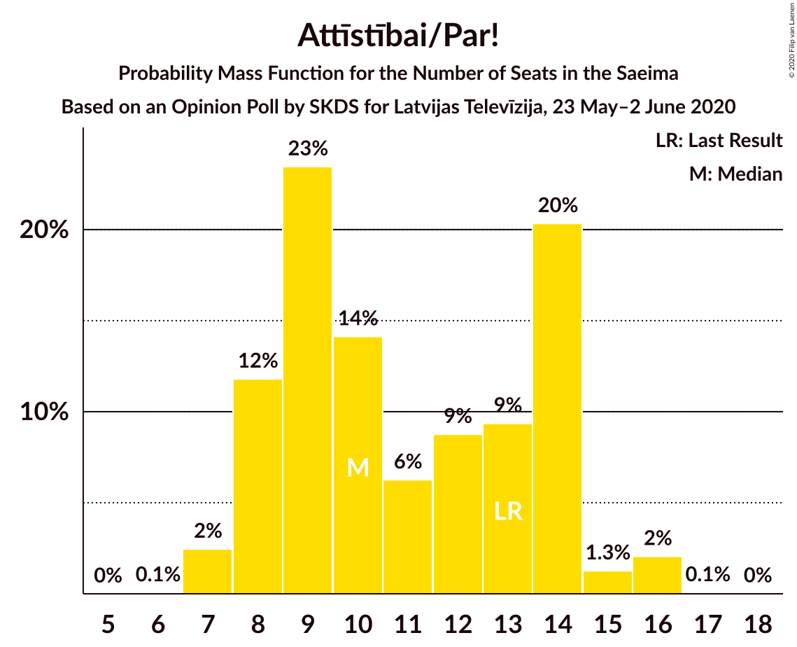
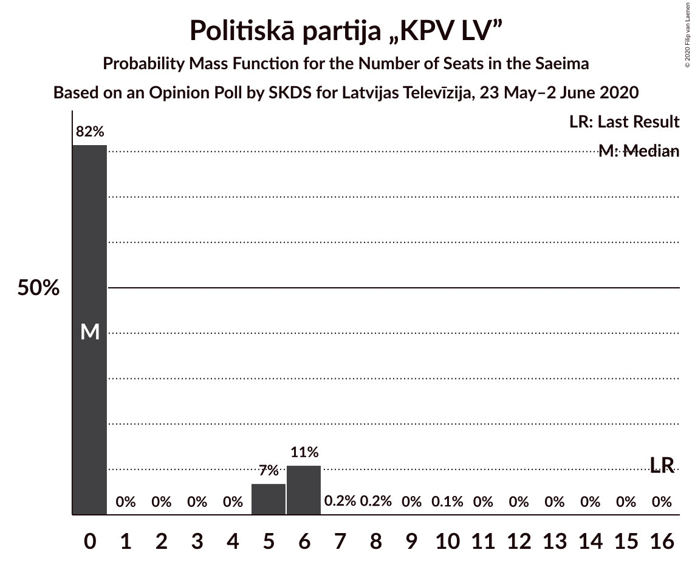
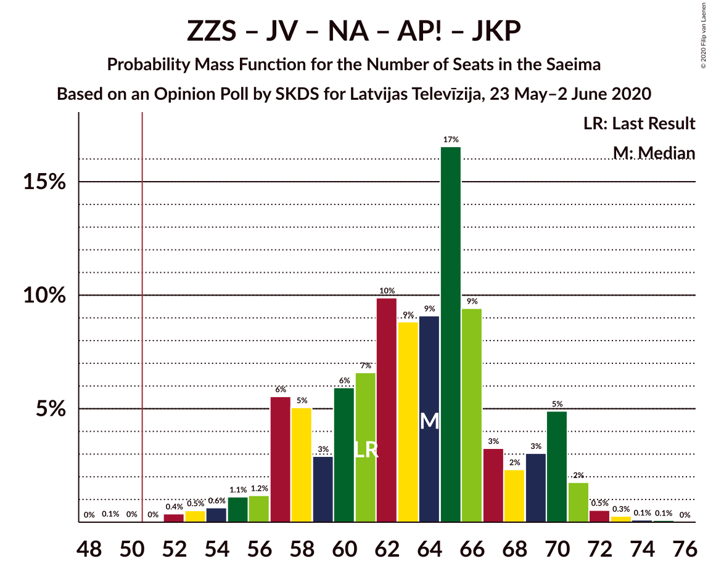
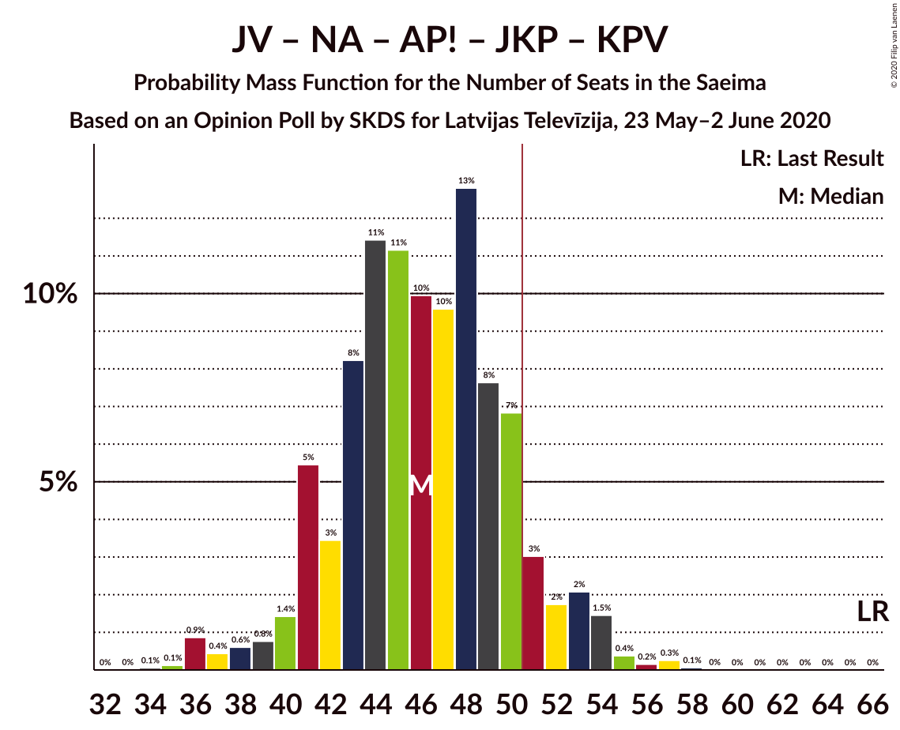
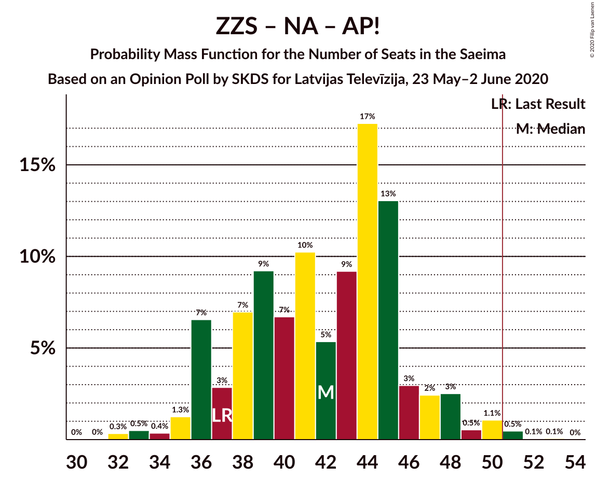
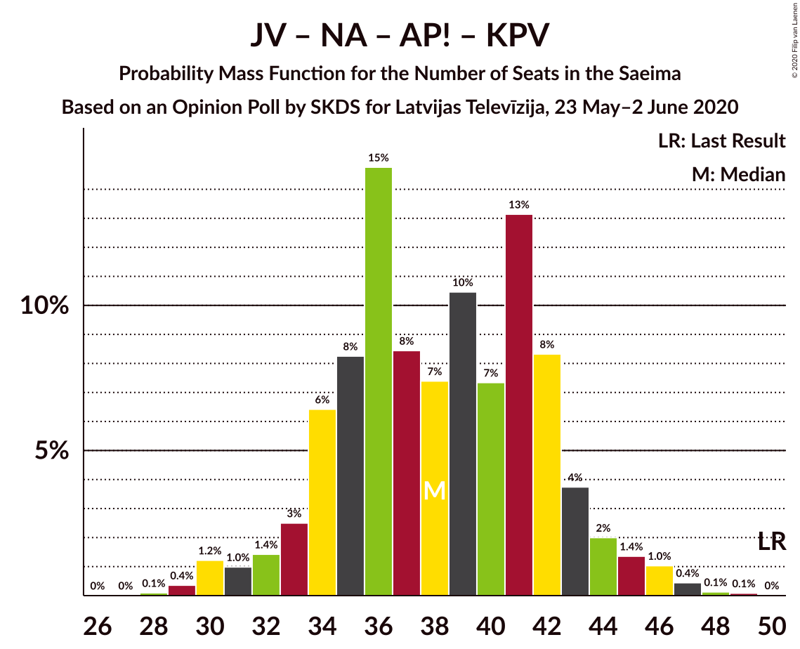

# Opinion Poll by SKDS for Latvijas Televīzija, 23 May–2 June 2020

<a href="#voting-intentions">Voting Intentions</a> | <a href="#seats">Seats</a> | <a href="#coalitions">Coalitions</a> | <a href="#technical-information">Technical Information</a>

## Voting Intentions

### Confidence Intervals

| Party | Last Result | Poll Result | 80% Confidence Interval | 90% Confidence Interval | 95% Confidence Interval | 99% Confidence Interval |
|:-----:|:-----------:|:-----------:|:-----------------------:|:-----------------------:|:-----------------------:|:-----------------------:|
| Sociāldemokrātiskā partija “Saskaņa” | 19.8% | 26.0% | 23.5–28.7% |22.8–29.5% |22.2–30.2% |21.0–31.5% |
| Zaļo un Zemnieku savienība | 9.9% | 15.9% | 13.9–18.3% |13.4–19.0% |12.9–19.6% |12.0–20.8% |
| Jaunā VIENOTĪBA | 6.7% | 12.0% | 10.3–14.2% |9.8–14.8% |9.3–15.3% |8.6–16.4% |
| Nacionālā apvienība „Visu Latvijai!”–„Tēvzemei un Brīvībai/LNNK” | 11.0% | 10.9% | 9.3–13.0% |8.8–13.6% |8.4–14.1% |7.6–15.2% |
| Attīstībai/Par! | 12.0% | 9.8% | 8.2–11.8% |7.8–12.4% |7.4–12.9% |6.7–13.9% |
| Jaunā konservatīvā partija | 13.6% | 7.2% | 5.9–9.0% |5.5–9.5% |5.2–10.0% |4.6–10.9% |
| Latvijas Reģionu Apvienība | 4.1% | 5.2% | 4.1–6.8% |3.8–7.3% |3.6–7.7% |3.1–8.5% |
| Latvijas Krievu savienība | 3.2% | 4.6% | 3.6–6.1% |3.3–6.5% |3.0–6.9% |2.6–7.7% |
| Politiskā partija „KPV LV” | 14.2% | 3.9% | 3.0–5.4% |2.7–5.8% |2.5–6.1% |2.1–6.9% |
| PROGRESĪVIE | 2.6% | 3.1% | 2.2–4.4% |2.0–4.7% |1.8–5.1% |1.5–5.8% |

*Note:* The poll result column reflects the actual value used in the calculations. Published results may vary slightly, and in addition be rounded to fewer digits.

## Seats

### Confidence Intervals

| Party | Last Result | Median | 80% Confidence Interval | 90% Confidence Interval | 95% Confidence Interval | 99% Confidence Interval |
|:-----:|:-----------:|:------:|:-----------------------:|:-----------------------:|:-----------------------:|:-----------------------:|
| <a href="#sociāldemokrātiskā-partija-“saskaņa”">Sociāldemokrātiskā partija “Saskaņa”</a> | 23 | 29 | 26–33 |25–34 |24–34 |23–36 |
| <a href="#zaļo-un-zemnieku-savienība">Zaļo un Zemnieku savienība</a> | 11 | 17 | 16–22 |14–22 |14–23 |13–24 |
| <a href="#jaunā-vienotība">Jaunā VIENOTĪBA</a> | 8 | 14 | 11–17 |11–18 |11–18 |9–18 |
| <a href="#nacionālā-apvienība-„visu-latvijai!”–„tēvzemei-un-brīvībai/lnnk”">Nacionālā apvienība „Visu Latvijai!”–„Tēvzemei un Brīvībai/LNNK”</a> | 13 | 13 | 11–15 |10–15 |9–16 |8–19 |
| <a href="#attīstībai/par!">Attīstībai/Par!</a> | 13 | 10 | 8–14 |8–14 |7–15 |7–16 |
| <a href="#jaunā-konservatīvā-partija">Jaunā konservatīvā partija</a> | 16 | 8 | 6–10 |6–11 |6–12 |0–13 |
| <a href="#latvijas-reģionu-apvienība">Latvijas Reģionu Apvienība</a> | 0 | 6 | 0–7 |0–7 |0–8 |0–9 |
| <a href="#latvijas-krievu-savienība">Latvijas Krievu savienība</a> | 0 | 0 | 0–7 |0–8 |0–8 |0–9 |
| <a href="#politiskā-partija-„kpv-lv”">Politiskā partija „KPV LV”</a> | 16 | 0 | 0–6 |0–6 |0–6 |0–7 |
| <a href="#progresīvie">PROGRESĪVIE</a> | 0 | 0 | 0 |0 |0–5 |0–7 |

### Sociāldemokrātiskā partija “Saskaņa”

*For a full overview of the results for this party, see the [Sociāldemokrātiskā partija “Saskaņa”](party-sociāldemokrātiskāpartija“saskaņa”.html) page.*

| Number of Seats | Probability | Accumulated | Special Marks |
|:---------------:|:-----------:|:-----------:|:-------------:|
| 21 | 0% | 100% |  |
| 22 | 0.3% | 99.9% |  |
| 23 | 0.9% | 99.6% | Last Result |
| 24 | 2% | 98.8% |  |
| 25 | 6% | 97% |  |
| 26 | 5% | 91% |  |
| 27 | 7% | 87% |  |
| 28 | 17% | 79% |  |
| 29 | 20% | 63% | Median |
| 30 | 15% | 43% |  |
| 31 | 8% | 27% |  |
| 32 | 6% | 19% |  |
| 33 | 5% | 13% |  |
| 34 | 5% | 7% |  |
| 35 | 1.1% | 2% |  |
| 36 | 0.4% | 0.8% |  |
| 37 | 0.3% | 0.4% |  |
| 38 | 0.1% | 0.1% |  |
| 39 | 0% | 0% |  |

### Zaļo un Zemnieku savienība

*For a full overview of the results for this party, see the [Zaļo un Zemnieku savienība](party-zaļounzemniekusavienība.html) page.*

| Number of Seats | Probability | Accumulated | Special Marks |
|:---------------:|:-----------:|:-----------:|:-------------:|
| 11 | 0.1% | 100% | Last Result |
| 12 | 0.3% | 99.9% |  |
| 13 | 1.4% | 99.6% |  |
| 14 | 4% | 98% |  |
| 15 | 3% | 94% |  |
| 16 | 9% | 91% |  |
| 17 | 36% | 82% | Median |
| 18 | 5% | 46% |  |
| 19 | 10% | 41% |  |
| 20 | 13% | 31% |  |
| 21 | 5% | 18% |  |
| 22 | 9% | 13% |  |
| 23 | 3% | 4% |  |
| 24 | 0.2% | 0.7% |  |
| 25 | 0.4% | 0.5% |  |
| 26 | 0% | 0% |  |

### Jaunā VIENOTĪBA

*For a full overview of the results for this party, see the [Jaunā VIENOTĪBA](party-jaunāvienotība.html) page.*

| Number of Seats | Probability | Accumulated | Special Marks |
|:---------------:|:-----------:|:-----------:|:-------------:|
| 8 | 0.1% | 100% | Last Result |
| 9 | 0.4% | 99.9% |  |
| 10 | 2% | 99.5% |  |
| 11 | 25% | 98% |  |
| 12 | 9% | 73% |  |
| 13 | 12% | 64% |  |
| 14 | 22% | 51% | Median |
| 15 | 12% | 29% |  |
| 16 | 7% | 17% |  |
| 17 | 3% | 10% |  |
| 18 | 7% | 8% |  |
| 19 | 0.2% | 0.3% |  |
| 20 | 0% | 0.1% |  |
| 21 | 0.1% | 0.1% |  |
| 22 | 0% | 0% |  |

### Nacionālā apvienība „Visu Latvijai!”–„Tēvzemei un Brīvībai/LNNK”

*For a full overview of the results for this party, see the [Nacionālā apvienība „Visu Latvijai!”–„Tēvzemei un Brīvībai/LNNK”](party-nacionālāapvienība„visulatvijai”–„tēvzemeiunbrīvībailnnk”.html) page.*

| Number of Seats | Probability | Accumulated | Special Marks |
|:---------------:|:-----------:|:-----------:|:-------------:|
| 6 | 0.1% | 100% |  |
| 7 | 0.1% | 99.9% |  |
| 8 | 0.8% | 99.8% |  |
| 9 | 2% | 98.9% |  |
| 10 | 5% | 97% |  |
| 11 | 19% | 92% |  |
| 12 | 16% | 73% |  |
| 13 | 22% | 57% | Last Result, Median |
| 14 | 22% | 34% |  |
| 15 | 8% | 12% |  |
| 16 | 2% | 4% |  |
| 17 | 1.5% | 2% |  |
| 18 | 0.2% | 0.7% |  |
| 19 | 0.5% | 0.5% |  |
| 20 | 0% | 0% |  |

### Attīstībai/Par!

*For a full overview of the results for this party, see the [Attīstībai/Par!](party-attīstībaipar.html) page.*

| Number of Seats | Probability | Accumulated | Special Marks |
|:---------------:|:-----------:|:-----------:|:-------------:|
| 6 | 0.1% | 100% |  |
| 7 | 2% | 99.9% |  |
| 8 | 12% | 97% |  |
| 9 | 23% | 86% |  |
| 10 | 14% | 62% | Median |
| 11 | 6% | 48% |  |
| 12 | 9% | 42% |  |
| 13 | 9% | 33% | Last Result |
| 14 | 20% | 24% |  |
| 15 | 1.3% | 3% |  |
| 16 | 2% | 2% |  |
| 17 | 0.1% | 0.1% |  |
| 18 | 0% | 0% |  |

### Jaunā konservatīvā partija

*For a full overview of the results for this party, see the [Jaunā konservatīvā partija](party-jaunākonservatīvāpartija.html) page.*

| Number of Seats | Probability | Accumulated | Special Marks |
|:---------------:|:-----------:|:-----------:|:-------------:|
| 0 | 2% | 100% |  |
| 1 | 0% | 98% |  |
| 2 | 0% | 98% |  |
| 3 | 0% | 98% |  |
| 4 | 0% | 98% |  |
| 5 | 0% | 98% |  |
| 6 | 12% | 98% |  |
| 7 | 35% | 86% |  |
| 8 | 15% | 51% | Median |
| 9 | 18% | 36% |  |
| 10 | 10% | 18% |  |
| 11 | 4% | 8% |  |
| 12 | 3% | 4% |  |
| 13 | 1.1% | 1.1% |  |
| 14 | 0% | 0% |  |
| 15 | 0% | 0% |  |
| 16 | 0% | 0% | Last Result |

### Latvijas Reģionu Apvienība

*For a full overview of the results for this party, see the [Latvijas Reģionu Apvienība](party-latvijasreģionuapvienība.html) page.*

| Number of Seats | Probability | Accumulated | Special Marks |
|:---------------:|:-----------:|:-----------:|:-------------:|
| 0 | 41% | 100% | Last Result |
| 1 | 0% | 59% |  |
| 2 | 0% | 59% |  |
| 3 | 0% | 59% |  |
| 4 | 0% | 59% |  |
| 5 | 0% | 59% |  |
| 6 | 37% | 59% | Median |
| 7 | 20% | 23% |  |
| 8 | 1.5% | 3% |  |
| 9 | 1.3% | 2% |  |
| 10 | 0.2% | 0.4% |  |
| 11 | 0.2% | 0.2% |  |
| 12 | 0% | 0% |  |

### Latvijas Krievu savienība

*For a full overview of the results for this party, see the [Latvijas Krievu savienība](party-latvijaskrievusavienība.html) page.*

| Number of Seats | Probability | Accumulated | Special Marks |
|:---------------:|:-----------:|:-----------:|:-------------:|
| 0 | 65% | 100% | Last Result, Median |
| 1 | 0% | 35% |  |
| 2 | 0% | 35% |  |
| 3 | 0% | 35% |  |
| 4 | 0% | 35% |  |
| 5 | 3% | 35% |  |
| 6 | 13% | 32% |  |
| 7 | 9% | 19% |  |
| 8 | 9% | 10% |  |
| 9 | 0.5% | 0.5% |  |
| 10 | 0% | 0% |  |

### Politiskā partija „KPV LV”

*For a full overview of the results for this party, see the [Politiskā partija „KPV LV”](party-politiskāpartija„kpvlv”.html) page.*

| Number of Seats | Probability | Accumulated | Special Marks |
|:---------------:|:-----------:|:-----------:|:-------------:|
| 0 | 82% | 100% | Median |
| 1 | 0% | 18% |  |
| 2 | 0% | 18% |  |
| 3 | 0% | 18% |  |
| 4 | 0% | 18% |  |
| 5 | 7% | 18% |  |
| 6 | 11% | 12% |  |
| 7 | 0.2% | 0.6% |  |
| 8 | 0.2% | 0.3% |  |
| 9 | 0% | 0.1% |  |
| 10 | 0.1% | 0.1% |  |
| 11 | 0% | 0% |  |
| 12 | 0% | 0% |  |
| 13 | 0% | 0% |  |
| 14 | 0% | 0% |  |
| 15 | 0% | 0% |  |
| 16 | 0% | 0% | Last Result |

### PROGRESĪVIE

*For a full overview of the results for this party, see the [PROGRESĪVIE](party-progresīvie.html) page.*

| Number of Seats | Probability | Accumulated | Special Marks |
|:---------------:|:-----------:|:-----------:|:-------------:|
| 0 | 97% | 100% | Last Result, Median |
| 1 | 0% | 3% |  |
| 2 | 0% | 3% |  |
| 3 | 0% | 3% |  |
| 4 | 0% | 3% |  |
| 5 | 0.7% | 3% |  |
| 6 | 1.1% | 2% |  |
| 7 | 1.4% | 1.4% |  |
| 8 | 0% | 0% |  |

## Coalitions

### Confidence Intervals

| Coalition | Last Result | Median | Majority? | 80% Confidence Interval | 90% Confidence Interval | 95% Confidence Interval | 99% Confidence Interval |
|:---------:|:-----------:|:------:|:---------:|:-----------------------:|:-----------------------:|:-----------------------:|:-----------------------:|
| Zaļo un Zemnieku savienība – Jaunā VIENOTĪBA – Nacionālā apvienība „Visu Latvijai!”–„Tēvzemei un Brīvībai/LNNK” – Attīstībai/Par! – Jaunā konservatīvā partija | 61 | 64 | 99.9% | 58–69 | 57–70 | 55–71 | 52–72 |
| Zaļo un Zemnieku savienība – Jaunā VIENOTĪBA – Nacionālā apvienība „Visu Latvijai!”–„Tēvzemei un Brīvībai/LNNK” – Attīstībai/Par! | 45 | 56 | 86% | 50–61 | 49–62 | 47–63 | 45–64 |
| Zaļo un Zemnieku savienība – Jaunā VIENOTĪBA – Nacionālā apvienība „Visu Latvijai!”–„Tēvzemei un Brīvībai/LNNK” – Jaunā konservatīvā partija | 48 | 52 | 68% | 48–57 | 46–59 | 46–60 | 43–62 |
| Zaļo un Zemnieku savienība – Nacionālā apvienība „Visu Latvijai!”–„Tēvzemei un Brīvībai/LNNK” – Attīstībai/Par! – Jaunā konservatīvā partija | 53 | 50 | 49% | 45–53 | 43–56 | 43–57 | 40–59 |
| Sociāldemokrātiskā partija “Saskaņa” – Zaļo un Zemnieku savienība – Politiskā partija „KPV LV” | 50 | 49 | 27% | 44–53 | 43–54 | 41–56 | 40–58 |
| Sociāldemokrātiskā partija “Saskaņa” – Attīstībai/Par! – Jaunā konservatīvā partija | 52 | 48 | 26% | 44–53 | 41–54 | 40–55 | 39–57 |
| Jaunā VIENOTĪBA – Nacionālā apvienība „Visu Latvijai!”–„Tēvzemei un Brīvībai/LNNK” – Attīstībai/Par! – Jaunā konservatīvā partija – Politiskā partija „KPV LV” | 66 | 46 | 9% | 42–50 | 41–52 | 39–53 | 36–55 |
| Zaļo un Zemnieku savienība – Jaunā VIENOTĪBA – Nacionālā apvienība „Visu Latvijai!”–„Tēvzemei un Brīvībai/LNNK” | 32 | 44 | 6% | 40–49 | 39–51 | 38–53 | 36–53 |
| Jaunā VIENOTĪBA – Nacionālā apvienība „Visu Latvijai!”–„Tēvzemei un Brīvībai/LNNK” – Attīstībai/Par! – Jaunā konservatīvā partija | 50 | 45 | 5% | 40–50 | 39–51 | 38–52 | 35–54 |
| Zaļo un Zemnieku savienība – Nacionālā apvienība „Visu Latvijai!”–„Tēvzemei un Brīvībai/LNNK” – Attīstībai/Par! | 37 | 42 | 0.6% | 37–46 | 36–47 | 36–48 | 33–51 |
| Sociāldemokrātiskā partija “Saskaņa” – Attīstībai/Par! | 36 | 40 | 0.1% | 36–45 | 34–47 | 33–47 | 32–49 |
| Zaļo un Zemnieku savienība – Nacionālā apvienība „Visu Latvijai!”–„Tēvzemei un Brīvībai/LNNK” – Jaunā konservatīvā partija | 40 | 39 | 0% | 35–44 | 34–44 | 33–45 | 30–47 |
| Jaunā VIENOTĪBA – Nacionālā apvienība „Visu Latvijai!”–„Tēvzemei un Brīvībai/LNNK” – Attīstībai/Par! – Politiskā partija „KPV LV” | 50 | 38 | 0% | 34–42 | 33–44 | 31–45 | 30–47 |
| Jaunā VIENOTĪBA – Nacionālā apvienība „Visu Latvijai!”–„Tēvzemei un Brīvībai/LNNK” – Jaunā konservatīvā partija – Politiskā partija „KPV LV” | 53 | 35 | 0% | 31–39 | 29–41 | 28–42 | 27–45 |
| Jaunā VIENOTĪBA – Attīstībai/Par! – Jaunā konservatīvā partija – Politiskā partija „KPV LV” | 53 | 34 | 0% | 29–38 | 27–39 | 27–41 | 24–43 |
| Nacionālā apvienība „Visu Latvijai!”–„Tēvzemei un Brīvībai/LNNK” – Attīstībai/Par! – Jaunā konservatīvā partija – Politiskā partija „KPV LV” | 58 | 33 | 0% | 28–37 | 27–39 | 26–40 | 24–42 |
| Sociāldemokrātiskā partija “Saskaņa” – Politiskā partija „KPV LV” | 39 | 30 | 0% | 27–34 | 26–36 | 25–37 | 23–39 |

### Zaļo un Zemnieku savienība – Jaunā VIENOTĪBA – Nacionālā apvienība „Visu Latvijai!”–„Tēvzemei un Brīvībai/LNNK” – Attīstībai/Par! – Jaunā konservatīvā partija

| Number of Seats | Probability | Accumulated | Special Marks |
|:---------------:|:-----------:|:-----------:|:-------------:|
| 49 | 0.1% | 100% |  |
| 50 | 0% | 99.9% |  |
| 51 | 0% | 99.9% | Majority |
| 52 | 0.4% | 99.9% |  |
| 53 | 0.5% | 99.5% |  |
| 54 | 0.6% | 99.0% |  |
| 55 | 1.1% | 98% |  |
| 56 | 1.2% | 97% |  |
| 57 | 6% | 96% |  |
| 58 | 5% | 91% |  |
| 59 | 3% | 85% |  |
| 60 | 6% | 83% |  |
| 61 | 7% | 77% | Last Result |
| 62 | 10% | 70% | Median |
| 63 | 9% | 60% |  |
| 64 | 9% | 51% |  |
| 65 | 17% | 42% |  |
| 66 | 9% | 26% |  |
| 67 | 3% | 16% |  |
| 68 | 2% | 13% |  |
| 69 | 3% | 11% |  |
| 70 | 5% | 8% |  |
| 71 | 2% | 3% |  |
| 72 | 0.5% | 1.0% |  |
| 73 | 0.3% | 0.5% |  |
| 74 | 0.1% | 0.2% |  |
| 75 | 0.1% | 0.1% |  |
| 76 | 0% | 0% |  |

### Zaļo un Zemnieku savienība – Jaunā VIENOTĪBA – Nacionālā apvienība „Visu Latvijai!”–„Tēvzemei un Brīvībai/LNNK” – Attīstībai/Par!

| Number of Seats | Probability | Accumulated | Special Marks |
|:---------------:|:-----------:|:-----------:|:-------------:|
| 43 | 0.2% | 100% |  |
| 44 | 0.1% | 99.8% |  |
| 45 | 0.2% | 99.7% | Last Result |
| 46 | 0.5% | 99.5% |  |
| 47 | 2% | 99.0% |  |
| 48 | 1.0% | 97% |  |
| 49 | 3% | 96% |  |
| 50 | 8% | 93% |  |
| 51 | 4% | 86% | Majority |
| 52 | 8% | 82% |  |
| 53 | 5% | 74% |  |
| 54 | 9% | 69% | Median |
| 55 | 10% | 61% |  |
| 56 | 12% | 51% |  |
| 57 | 6% | 39% |  |
| 58 | 13% | 33% |  |
| 59 | 7% | 20% |  |
| 60 | 2% | 13% |  |
| 61 | 4% | 11% |  |
| 62 | 3% | 7% |  |
| 63 | 3% | 4% |  |
| 64 | 0.6% | 1.1% |  |
| 65 | 0.2% | 0.4% |  |
| 66 | 0.1% | 0.2% |  |
| 67 | 0.1% | 0.1% |  |
| 68 | 0% | 0% |  |

### Zaļo un Zemnieku savienība – Jaunā VIENOTĪBA – Nacionālā apvienība „Visu Latvijai!”–„Tēvzemei un Brīvībai/LNNK” – Jaunā konservatīvā partija

| Number of Seats | Probability | Accumulated | Special Marks |
|:---------------:|:-----------:|:-----------:|:-------------:|
| 39 | 0.1% | 100% |  |
| 40 | 0% | 99.9% |  |
| 41 | 0.1% | 99.9% |  |
| 42 | 0.1% | 99.8% |  |
| 43 | 0.2% | 99.7% |  |
| 44 | 0.8% | 99.5% |  |
| 45 | 0.8% | 98.6% |  |
| 46 | 4% | 98% |  |
| 47 | 4% | 94% |  |
| 48 | 3% | 90% | Last Result |
| 49 | 12% | 88% |  |
| 50 | 7% | 75% |  |
| 51 | 14% | 68% | Majority |
| 52 | 9% | 54% | Median |
| 53 | 8% | 45% |  |
| 54 | 9% | 36% |  |
| 55 | 5% | 27% |  |
| 56 | 10% | 22% |  |
| 57 | 6% | 13% |  |
| 58 | 2% | 7% |  |
| 59 | 0.9% | 5% |  |
| 60 | 3% | 5% |  |
| 61 | 0.6% | 2% |  |
| 62 | 0.9% | 1.0% |  |
| 63 | 0.1% | 0.1% |  |
| 64 | 0% | 0% |  |

### Zaļo un Zemnieku savienība – Nacionālā apvienība „Visu Latvijai!”–„Tēvzemei un Brīvībai/LNNK” – Attīstībai/Par! – Jaunā konservatīvā partija

| Number of Seats | Probability | Accumulated | Special Marks |
|:---------------:|:-----------:|:-----------:|:-------------:|
| 36 | 0% | 100% |  |
| 37 | 0% | 99.9% |  |
| 38 | 0.1% | 99.9% |  |
| 39 | 0.1% | 99.8% |  |
| 40 | 0.3% | 99.7% |  |
| 41 | 0.4% | 99.3% |  |
| 42 | 0.8% | 98.9% |  |
| 43 | 5% | 98% |  |
| 44 | 3% | 94% |  |
| 45 | 5% | 91% |  |
| 46 | 5% | 86% |  |
| 47 | 8% | 81% |  |
| 48 | 7% | 73% | Median |
| 49 | 10% | 66% |  |
| 50 | 6% | 55% |  |
| 51 | 15% | 49% | Majority |
| 52 | 12% | 34% |  |
| 53 | 13% | 23% | Last Result |
| 54 | 2% | 10% |  |
| 55 | 3% | 8% |  |
| 56 | 2% | 5% |  |
| 57 | 2% | 4% |  |
| 58 | 1.1% | 2% |  |
| 59 | 0.3% | 0.6% |  |
| 60 | 0.2% | 0.3% |  |
| 61 | 0% | 0.1% |  |
| 62 | 0.1% | 0.1% |  |
| 63 | 0% | 0% |  |

### Sociāldemokrātiskā partija “Saskaņa” – Zaļo un Zemnieku savienība – Politiskā partija „KPV LV”

| Number of Seats | Probability | Accumulated | Special Marks |
|:---------------:|:-----------:|:-----------:|:-------------:|
| 38 | 0.1% | 100% |  |
| 39 | 0.1% | 99.9% |  |
| 40 | 1.2% | 99.8% |  |
| 41 | 1.1% | 98.5% |  |
| 42 | 2% | 97% |  |
| 43 | 3% | 95% |  |
| 44 | 6% | 92% |  |
| 45 | 3% | 86% |  |
| 46 | 13% | 83% | Median |
| 47 | 11% | 70% |  |
| 48 | 8% | 60% |  |
| 49 | 10% | 51% |  |
| 50 | 14% | 41% | Last Result |
| 51 | 7% | 27% | Majority |
| 52 | 5% | 20% |  |
| 53 | 8% | 15% |  |
| 54 | 2% | 7% |  |
| 55 | 1.1% | 4% |  |
| 56 | 1.1% | 3% |  |
| 57 | 1.2% | 2% |  |
| 58 | 0.3% | 0.7% |  |
| 59 | 0.1% | 0.4% |  |
| 60 | 0.3% | 0.3% |  |
| 61 | 0% | 0.1% |  |
| 62 | 0% | 0% |  |

### Sociāldemokrātiskā partija “Saskaņa” – Attīstībai/Par! – Jaunā konservatīvā partija

| Number of Seats | Probability | Accumulated | Special Marks |
|:---------------:|:-----------:|:-----------:|:-------------:|
| 36 | 0.1% | 100% |  |
| 37 | 0.1% | 99.9% |  |
| 38 | 0.1% | 99.9% |  |
| 39 | 0.3% | 99.7% |  |
| 40 | 4% | 99.4% |  |
| 41 | 1.3% | 96% |  |
| 42 | 2% | 95% |  |
| 43 | 3% | 93% |  |
| 44 | 3% | 90% |  |
| 45 | 10% | 88% |  |
| 46 | 14% | 77% |  |
| 47 | 11% | 64% | Median |
| 48 | 5% | 53% |  |
| 49 | 8% | 48% |  |
| 50 | 14% | 40% |  |
| 51 | 6% | 26% | Majority |
| 52 | 8% | 20% | Last Result |
| 53 | 3% | 12% |  |
| 54 | 6% | 9% |  |
| 55 | 1.0% | 3% |  |
| 56 | 1.3% | 2% |  |
| 57 | 0.6% | 1.0% |  |
| 58 | 0.2% | 0.3% |  |
| 59 | 0.1% | 0.2% |  |
| 60 | 0.1% | 0.1% |  |
| 61 | 0% | 0% |  |

### Jaunā VIENOTĪBA – Nacionālā apvienība „Visu Latvijai!”–„Tēvzemei un Brīvībai/LNNK” – Attīstībai/Par! – Jaunā konservatīvā partija – Politiskā partija „KPV LV”

| Number of Seats | Probability | Accumulated | Special Marks |
|:---------------:|:-----------:|:-----------:|:-------------:|
| 34 | 0.1% | 100% |  |
| 35 | 0.1% | 99.9% |  |
| 36 | 0.9% | 99.8% |  |
| 37 | 0.4% | 98.9% |  |
| 38 | 0.6% | 98.5% |  |
| 39 | 0.8% | 98% |  |
| 40 | 1.4% | 97% |  |
| 41 | 5% | 96% |  |
| 42 | 3% | 90% |  |
| 43 | 8% | 87% |  |
| 44 | 11% | 79% |  |
| 45 | 11% | 67% | Median |
| 46 | 10% | 56% |  |
| 47 | 10% | 46% |  |
| 48 | 13% | 36% |  |
| 49 | 8% | 24% |  |
| 50 | 7% | 16% |  |
| 51 | 3% | 9% | Majority |
| 52 | 2% | 6% |  |
| 53 | 2% | 4% |  |
| 54 | 1.5% | 2% |  |
| 55 | 0.4% | 0.9% |  |
| 56 | 0.2% | 0.5% |  |
| 57 | 0.3% | 0.3% |  |
| 58 | 0.1% | 0.1% |  |
| 59 | 0% | 0% |  |
| 60 | 0% | 0% |  |
| 61 | 0% | 0% |  |
| 62 | 0% | 0% |  |
| 63 | 0% | 0% |  |
| 64 | 0% | 0% |  |
| 65 | 0% | 0% |  |
| 66 | 0% | 0% | Last Result |

### Zaļo un Zemnieku savienība – Jaunā VIENOTĪBA – Nacionālā apvienība „Visu Latvijai!”–„Tēvzemei un Brīvībai/LNNK”

| Number of Seats | Probability | Accumulated | Special Marks |
|:---------------:|:-----------:|:-----------:|:-------------:|
| 32 | 0% | 100% | Last Result |
| 33 | 0% | 100% |  |
| 34 | 0.1% | 99.9% |  |
| 35 | 0.3% | 99.9% |  |
| 36 | 0.3% | 99.6% |  |
| 37 | 1.1% | 99.3% |  |
| 38 | 1.2% | 98% |  |
| 39 | 6% | 97% |  |
| 40 | 5% | 91% |  |
| 41 | 5% | 86% |  |
| 42 | 15% | 82% |  |
| 43 | 10% | 67% |  |
| 44 | 15% | 57% | Median |
| 45 | 5% | 42% |  |
| 46 | 8% | 37% |  |
| 47 | 9% | 29% |  |
| 48 | 7% | 20% |  |
| 49 | 6% | 13% |  |
| 50 | 1.1% | 7% |  |
| 51 | 1.2% | 6% | Majority |
| 52 | 1.1% | 4% |  |
| 53 | 3% | 3% |  |
| 54 | 0.1% | 0.2% |  |
| 55 | 0% | 0.1% |  |
| 56 | 0% | 0.1% |  |
| 57 | 0% | 0% |  |

### Jaunā VIENOTĪBA – Nacionālā apvienība „Visu Latvijai!”–„Tēvzemei un Brīvībai/LNNK” – Attīstībai/Par! – Jaunā konservatīvā partija

| Number of Seats | Probability | Accumulated | Special Marks |
|:---------------:|:-----------:|:-----------:|:-------------:|
| 34 | 0.2% | 100% |  |
| 35 | 0.3% | 99.8% |  |
| 36 | 1.1% | 99.5% |  |
| 37 | 0.8% | 98% |  |
| 38 | 1.1% | 98% |  |
| 39 | 2% | 96% |  |
| 40 | 6% | 95% |  |
| 41 | 8% | 89% |  |
| 42 | 4% | 81% |  |
| 43 | 9% | 76% |  |
| 44 | 12% | 67% |  |
| 45 | 8% | 55% | Median |
| 46 | 9% | 47% |  |
| 47 | 8% | 37% |  |
| 48 | 12% | 29% |  |
| 49 | 7% | 17% |  |
| 50 | 5% | 11% | Last Result |
| 51 | 2% | 5% | Majority |
| 52 | 0.9% | 3% |  |
| 53 | 1.2% | 2% |  |
| 54 | 0.6% | 0.9% |  |
| 55 | 0.1% | 0.3% |  |
| 56 | 0% | 0.1% |  |
| 57 | 0.1% | 0.1% |  |
| 58 | 0% | 0% |  |

### Zaļo un Zemnieku savienība – Nacionālā apvienība „Visu Latvijai!”–„Tēvzemei un Brīvībai/LNNK” – Attīstībai/Par!

| Number of Seats | Probability | Accumulated | Special Marks |
|:---------------:|:-----------:|:-----------:|:-------------:|
| 31 | 0% | 100% |  |
| 32 | 0.3% | 99.9% |  |
| 33 | 0.5% | 99.6% |  |
| 34 | 0.4% | 99.1% |  |
| 35 | 1.3% | 98.8% |  |
| 36 | 7% | 98% |  |
| 37 | 3% | 91% | Last Result |
| 38 | 7% | 88% |  |
| 39 | 9% | 81% |  |
| 40 | 7% | 72% | Median |
| 41 | 10% | 65% |  |
| 42 | 5% | 55% |  |
| 43 | 9% | 50% |  |
| 44 | 17% | 40% |  |
| 45 | 13% | 23% |  |
| 46 | 3% | 10% |  |
| 47 | 2% | 7% |  |
| 48 | 3% | 5% |  |
| 49 | 0.5% | 2% |  |
| 50 | 1.1% | 2% |  |
| 51 | 0.5% | 0.6% | Majority |
| 52 | 0.1% | 0.1% |  |
| 53 | 0.1% | 0.1% |  |
| 54 | 0% | 0% |  |

### Sociāldemokrātiskā partija “Saskaņa” – Attīstībai/Par!

| Number of Seats | Probability | Accumulated | Special Marks |
|:---------------:|:-----------:|:-----------:|:-------------:|
| 30 | 0.1% | 100% |  |
| 31 | 0.1% | 99.9% |  |
| 32 | 0.5% | 99.8% |  |
| 33 | 4% | 99.3% |  |
| 34 | 2% | 96% |  |
| 35 | 2% | 94% |  |
| 36 | 4% | 91% | Last Result |
| 37 | 13% | 87% |  |
| 38 | 6% | 74% |  |
| 39 | 10% | 68% | Median |
| 40 | 15% | 58% |  |
| 41 | 6% | 43% |  |
| 42 | 8% | 37% |  |
| 43 | 11% | 29% |  |
| 44 | 6% | 19% |  |
| 45 | 5% | 13% |  |
| 46 | 2% | 8% |  |
| 47 | 5% | 6% |  |
| 48 | 1.2% | 2% |  |
| 49 | 0.3% | 0.5% |  |
| 50 | 0.2% | 0.2% |  |
| 51 | 0% | 0.1% | Majority |
| 52 | 0.1% | 0.1% |  |
| 53 | 0% | 0% |  |

### Zaļo un Zemnieku savienība – Nacionālā apvienība „Visu Latvijai!”–„Tēvzemei un Brīvībai/LNNK” – Jaunā konservatīvā partija

| Number of Seats | Probability | Accumulated | Special Marks |
|:---------------:|:-----------:|:-----------:|:-------------:|
| 26 | 0.1% | 100% |  |
| 27 | 0% | 99.9% |  |
| 28 | 0.1% | 99.9% |  |
| 29 | 0.2% | 99.8% |  |
| 30 | 0.2% | 99.6% |  |
| 31 | 0.8% | 99.4% |  |
| 32 | 0.6% | 98.7% |  |
| 33 | 1.4% | 98% |  |
| 34 | 3% | 97% |  |
| 35 | 12% | 93% |  |
| 36 | 6% | 82% |  |
| 37 | 14% | 75% |  |
| 38 | 9% | 61% | Median |
| 39 | 14% | 52% |  |
| 40 | 8% | 38% | Last Result |
| 41 | 5% | 29% |  |
| 42 | 7% | 24% |  |
| 43 | 5% | 17% |  |
| 44 | 9% | 11% |  |
| 45 | 0.9% | 3% |  |
| 46 | 1.1% | 2% |  |
| 47 | 0.4% | 0.7% |  |
| 48 | 0.1% | 0.3% |  |
| 49 | 0.1% | 0.1% |  |
| 50 | 0% | 0% |  |

### Jaunā VIENOTĪBA – Nacionālā apvienība „Visu Latvijai!”–„Tēvzemei un Brīvībai/LNNK” – Attīstībai/Par! – Politiskā partija „KPV LV”

| Number of Seats | Probability | Accumulated | Special Marks |
|:---------------:|:-----------:|:-----------:|:-------------:|
| 28 | 0.1% | 100% |  |
| 29 | 0.4% | 99.9% |  |
| 30 | 1.2% | 99.5% |  |
| 31 | 1.0% | 98% |  |
| 32 | 1.4% | 97% |  |
| 33 | 3% | 96% |  |
| 34 | 6% | 93% |  |
| 35 | 8% | 87% |  |
| 36 | 15% | 79% |  |
| 37 | 8% | 64% | Median |
| 38 | 7% | 56% |  |
| 39 | 10% | 48% |  |
| 40 | 7% | 38% |  |
| 41 | 13% | 30% |  |
| 42 | 8% | 17% |  |
| 43 | 4% | 9% |  |
| 44 | 2% | 5% |  |
| 45 | 1.4% | 3% |  |
| 46 | 1.0% | 2% |  |
| 47 | 0.4% | 0.7% |  |
| 48 | 0.1% | 0.3% |  |
| 49 | 0.1% | 0.1% |  |
| 50 | 0% | 0% | Last Result |

### Jaunā VIENOTĪBA – Nacionālā apvienība „Visu Latvijai!”–„Tēvzemei un Brīvībai/LNNK” – Jaunā konservatīvā partija – Politiskā partija „KPV LV”

| Number of Seats | Probability | Accumulated | Special Marks |
|:---------------:|:-----------:|:-----------:|:-------------:|
| 25 | 0.1% | 100% |  |
| 26 | 0.2% | 99.9% |  |
| 27 | 2% | 99.6% |  |
| 28 | 0.8% | 98% |  |
| 29 | 4% | 97% |  |
| 30 | 3% | 93% |  |
| 31 | 4% | 90% |  |
| 32 | 5% | 87% |  |
| 33 | 4% | 82% |  |
| 34 | 15% | 78% |  |
| 35 | 14% | 63% | Median |
| 36 | 21% | 50% |  |
| 37 | 13% | 28% |  |
| 38 | 4% | 16% |  |
| 39 | 3% | 12% |  |
| 40 | 3% | 9% |  |
| 41 | 3% | 6% |  |
| 42 | 0.8% | 3% |  |
| 43 | 0.8% | 2% |  |
| 44 | 0.6% | 1.3% |  |
| 45 | 0.6% | 0.7% |  |
| 46 | 0.1% | 0.1% |  |
| 47 | 0% | 0% |  |
| 48 | 0% | 0% |  |
| 49 | 0% | 0% |  |
| 50 | 0% | 0% |  |
| 51 | 0% | 0% | Majority |
| 52 | 0% | 0% |  |
| 53 | 0% | 0% | Last Result |

### Jaunā VIENOTĪBA – Attīstībai/Par! – Jaunā konservatīvā partija – Politiskā partija „KPV LV”

| Number of Seats | Probability | Accumulated | Special Marks |
|:---------------:|:-----------:|:-----------:|:-------------:|
| 22 | 0% | 100% |  |
| 23 | 0% | 99.9% |  |
| 24 | 0.5% | 99.9% |  |
| 25 | 0.4% | 99.4% |  |
| 26 | 1.5% | 99.0% |  |
| 27 | 3% | 98% |  |
| 28 | 2% | 95% |  |
| 29 | 4% | 93% |  |
| 30 | 12% | 89% |  |
| 31 | 7% | 77% |  |
| 32 | 6% | 70% | Median |
| 33 | 11% | 64% |  |
| 34 | 16% | 53% |  |
| 35 | 16% | 38% |  |
| 36 | 6% | 22% |  |
| 37 | 4% | 15% |  |
| 38 | 3% | 12% |  |
| 39 | 4% | 9% |  |
| 40 | 2% | 5% |  |
| 41 | 2% | 3% |  |
| 42 | 0.4% | 1.2% |  |
| 43 | 0.3% | 0.7% |  |
| 44 | 0.4% | 0.5% |  |
| 45 | 0.1% | 0.1% |  |
| 46 | 0% | 0% |  |
| 47 | 0% | 0% |  |
| 48 | 0% | 0% |  |
| 49 | 0% | 0% |  |
| 50 | 0% | 0% |  |
| 51 | 0% | 0% | Majority |
| 52 | 0% | 0% |  |
| 53 | 0% | 0% | Last Result |

### Nacionālā apvienība „Visu Latvijai!”–„Tēvzemei un Brīvībai/LNNK” – Attīstībai/Par! – Jaunā konservatīvā partija – Politiskā partija „KPV LV”

| Number of Seats | Probability | Accumulated | Special Marks |
|:---------------:|:-----------:|:-----------:|:-------------:|
| 19 | 0.1% | 100% |  |
| 20 | 0% | 99.9% |  |
| 21 | 0% | 99.9% |  |
| 22 | 0.1% | 99.9% |  |
| 23 | 0.1% | 99.8% |  |
| 24 | 0.3% | 99.7% |  |
| 25 | 2% | 99.3% |  |
| 26 | 1.1% | 98% |  |
| 27 | 2% | 97% |  |
| 28 | 7% | 95% |  |
| 29 | 6% | 88% |  |
| 30 | 7% | 82% |  |
| 31 | 15% | 75% | Median |
| 32 | 7% | 60% |  |
| 33 | 10% | 52% |  |
| 34 | 14% | 42% |  |
| 35 | 10% | 28% |  |
| 36 | 7% | 18% |  |
| 37 | 4% | 11% |  |
| 38 | 2% | 8% |  |
| 39 | 1.2% | 5% |  |
| 40 | 2% | 4% |  |
| 41 | 0.6% | 2% |  |
| 42 | 0.9% | 1.2% |  |
| 43 | 0.2% | 0.3% |  |
| 44 | 0% | 0.1% |  |
| 45 | 0% | 0% |  |
| 46 | 0% | 0% |  |
| 47 | 0% | 0% |  |
| 48 | 0% | 0% |  |
| 49 | 0% | 0% |  |
| 50 | 0% | 0% |  |
| 51 | 0% | 0% | Majority |
| 52 | 0% | 0% |  |
| 53 | 0% | 0% |  |
| 54 | 0% | 0% |  |
| 55 | 0% | 0% |  |
| 56 | 0% | 0% |  |
| 57 | 0% | 0% |  |
| 58 | 0% | 0% | Last Result |

### Sociāldemokrātiskā partija “Saskaņa” – Politiskā partija „KPV LV”

| Number of Seats | Probability | Accumulated | Special Marks |
|:---------------:|:-----------:|:-----------:|:-------------:|
| 22 | 0.3% | 100% |  |
| 23 | 0.3% | 99.7% |  |
| 24 | 1.0% | 99.4% |  |
| 25 | 1.2% | 98% |  |
| 26 | 4% | 97% |  |
| 27 | 6% | 93% |  |
| 28 | 15% | 87% |  |
| 29 | 18% | 73% | Median |
| 30 | 16% | 55% |  |
| 31 | 8% | 39% |  |
| 32 | 7% | 31% |  |
| 33 | 7% | 23% |  |
| 34 | 7% | 17% |  |
| 35 | 4% | 9% |  |
| 36 | 3% | 6% |  |
| 37 | 2% | 3% |  |
| 38 | 0.3% | 1.0% |  |
| 39 | 0.2% | 0.6% | Last Result |
| 40 | 0.4% | 0.5% |  |
| 41 | 0% | 0.1% |  |
| 42 | 0% | 0% |  |

## Technical Information

### Opinion Poll

+ **Polling firm:** SKDS
+ **Commissioner(s):** Latvijas Televīzija
+ **Fieldwork period:** 23 May–2 June 2020

### Calculations

+ **Sample size:** 458
+ **Simulations done:** 1,048,576
+ **Error estimate:** 3.02%

