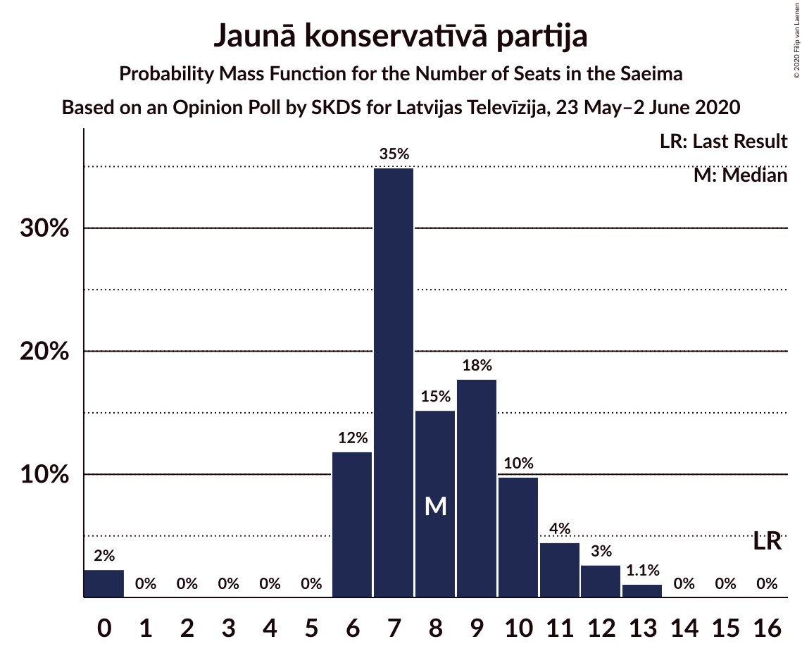
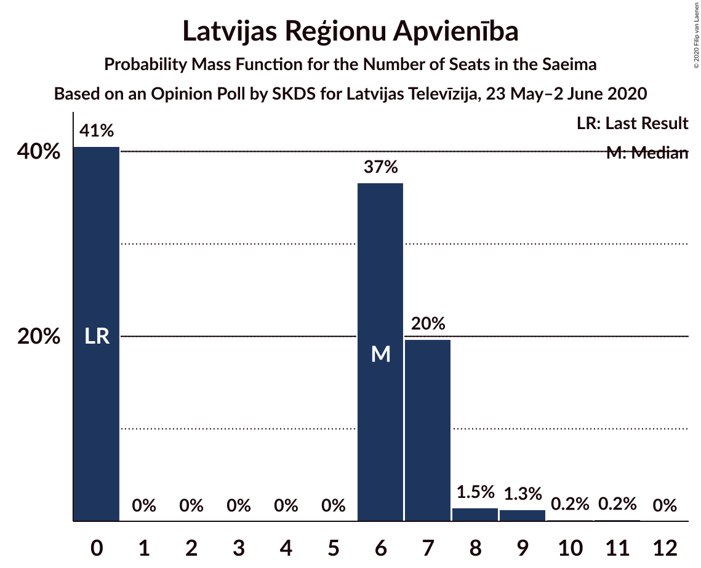
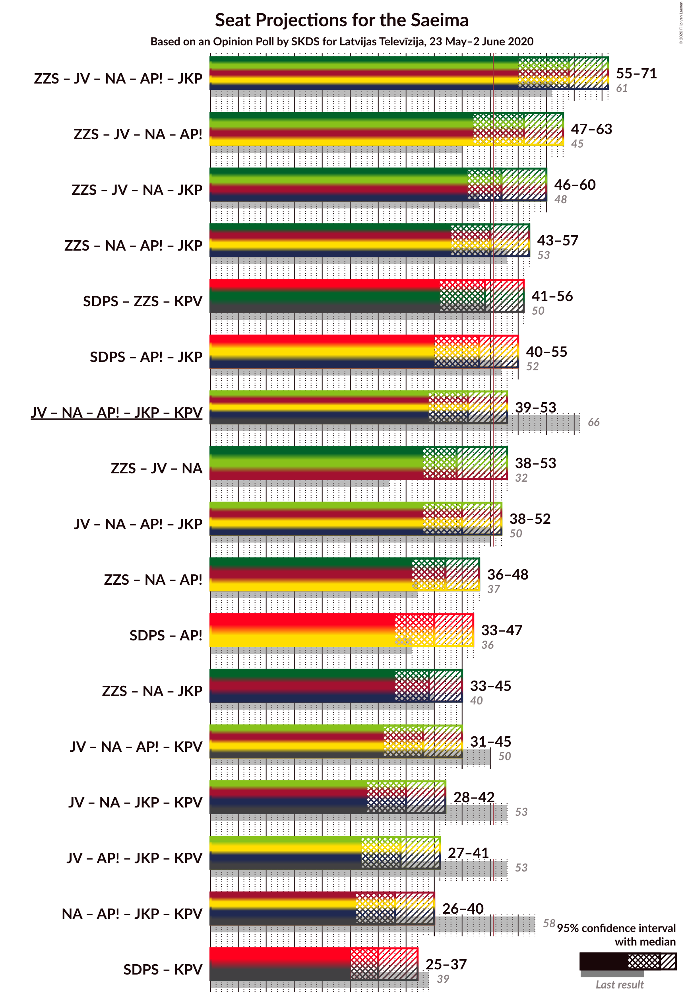
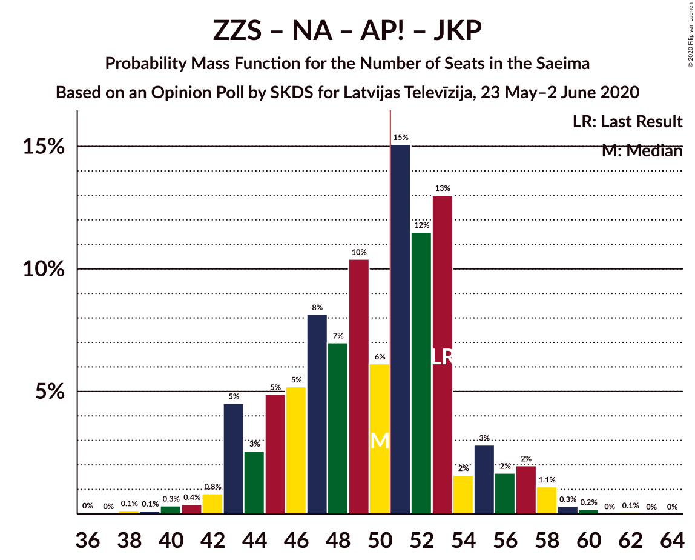
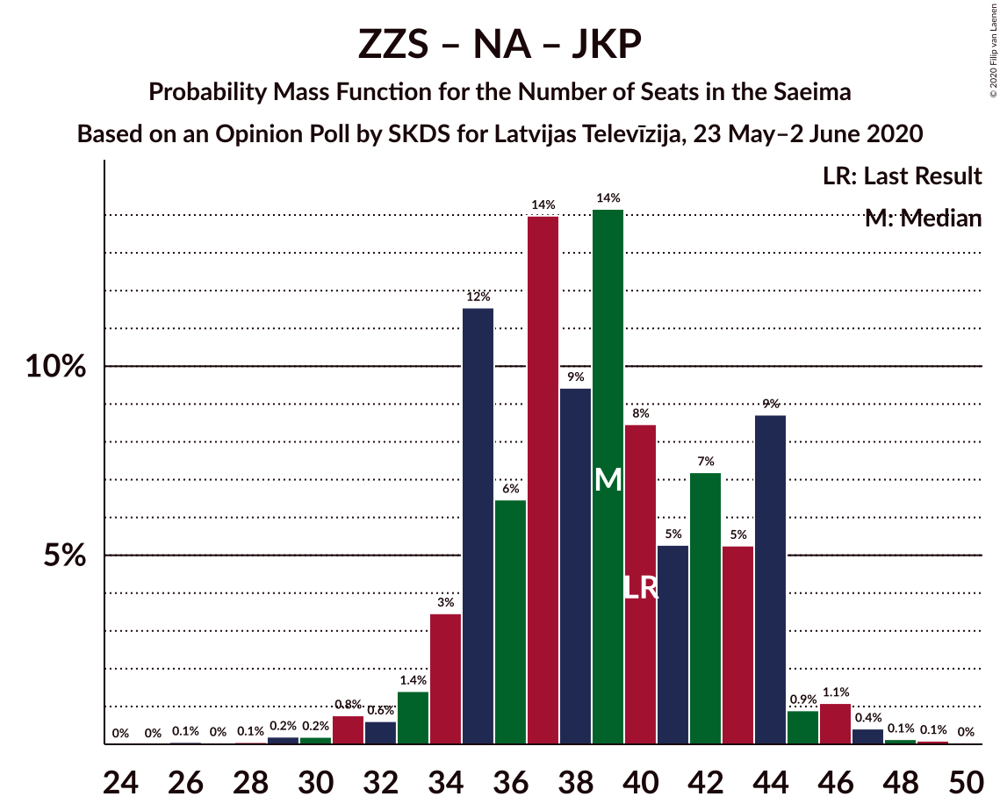
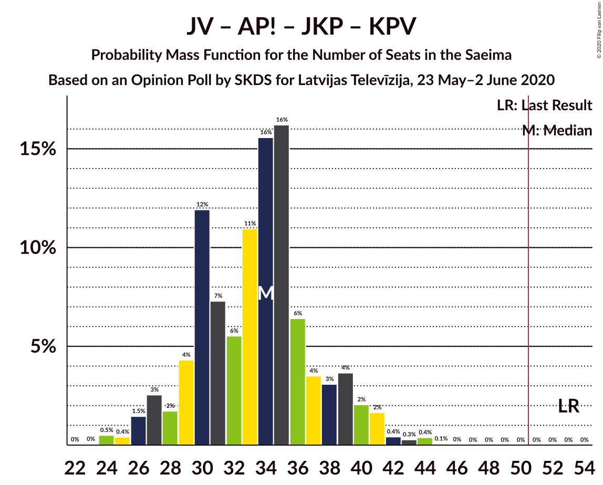
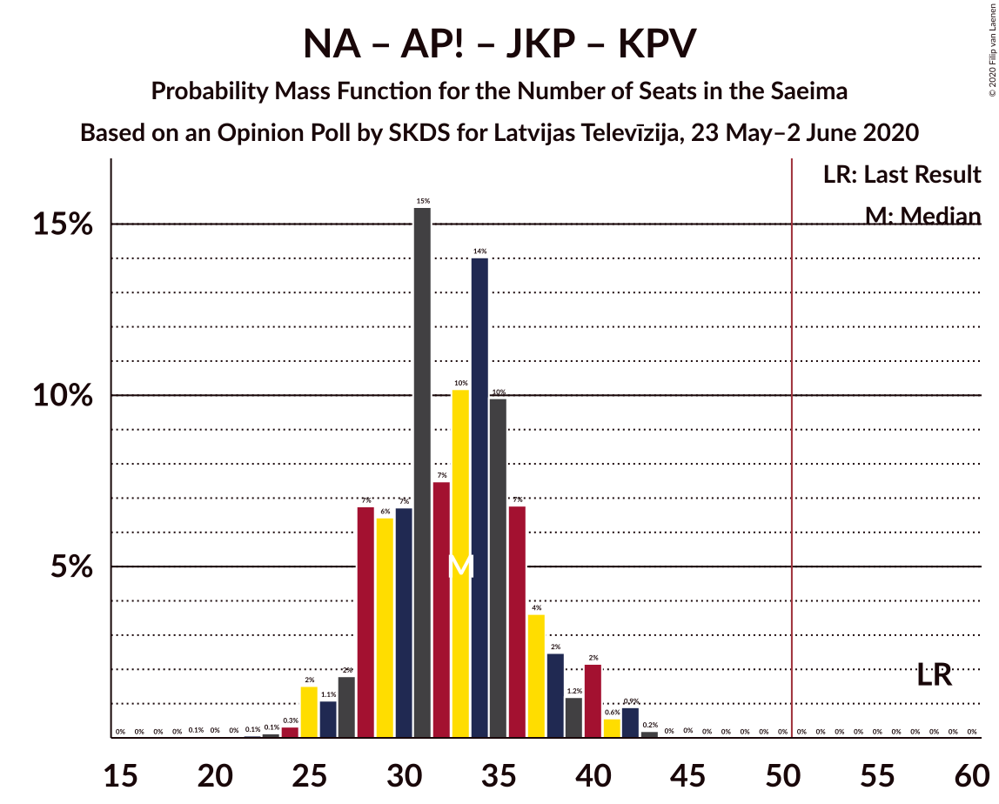

# Opinion Poll by SKDS for Latvijas Televīzija, 23 May–2 June 2020

<a href="#voting-intentions">Voting Intentions</a> | <a href="#seats">Seats</a> | <a href="#coalitions">Coalitions</a> | <a href="#technical-information">Technical Information</a>

## Voting Intentions

### Confidence Intervals

| Party | Last Result | Poll Result | 80% Confidence Interval | 90% Confidence Interval | 95% Confidence Interval | 99% Confidence Interval |
|:-----:|:-----------:|:-----------:|:-----------------------:|:-----------------------:|:-----------------------:|:-----------------------:|
| Sociāldemokrātiskā partija “Saskaņa” | 19.8% | 26.0% | 23.5–28.7% |22.8–29.5% |22.2–30.2% |21.0–31.5% |
| Zaļo un Zemnieku savienība | 9.9% | 15.9% | 13.9–18.3% |13.4–19.0% |12.9–19.6% |12.0–20.8% |
| Jaunā VIENOTĪBA | 6.7% | 12.0% | 10.3–14.2% |9.8–14.8% |9.3–15.3% |8.6–16.4% |
| Nacionālā apvienība „Visu Latvijai!”–„Tēvzemei un Brīvībai/LNNK” | 11.0% | 10.9% | 9.3–13.0% |8.8–13.6% |8.4–14.1% |7.6–15.2% |
| Attīstībai/Par! | 12.0% | 9.8% | 8.2–11.8% |7.8–12.4% |7.4–12.9% |6.7–13.9% |
| Jaunā konservatīvā partija | 13.6% | 7.2% | 5.9–9.0% |5.5–9.5% |5.2–10.0% |4.6–10.9% |
| Latvijas Reģionu Apvienība | 4.1% | 5.2% | 4.1–6.8% |3.8–7.3% |3.6–7.7% |3.1–8.5% |
| Latvijas Krievu savienība | 3.2% | 4.6% | 3.6–6.1% |3.3–6.5% |3.0–6.9% |2.6–7.7% |
| Politiskā partija „KPV LV” | 14.2% | 3.9% | 3.0–5.4% |2.7–5.8% |2.5–6.1% |2.1–6.9% |
| PROGRESĪVIE | 2.6% | 3.1% | 2.2–4.4% |2.0–4.7% |1.8–5.1% |1.5–5.8% |

*Note:* The poll result column reflects the actual value used in the calculations. Published results may vary slightly, and in addition be rounded to fewer digits.

## Seats

### Confidence Intervals

| Party | Last Result | Median | 80% Confidence Interval | 90% Confidence Interval | 95% Confidence Interval | 99% Confidence Interval |
|:-----:|:-----------:|:------:|:-----------------------:|:-----------------------:|:-----------------------:|:-----------------------:|
| <a href="#sociāldemokrātiskā-partija-“saskaņa”">Sociāldemokrātiskā partija “Saskaņa”</a> | 23 | 25 | 25–26 |24–31 |24–34 |23–35 |
| <a href="#zaļo-un-zemnieku-savienība">Zaļo un Zemnieku savienība</a> | 11 | 13 | 13–17 |13–17 |13–18 |13–20 |
| <a href="#jaunā-vienotība">Jaunā VIENOTĪBA</a> | 8 | 14 | 14–15 |12–16 |11–16 |11–17 |
| <a href="#nacionālā-apvienība-„visu-latvijai!”–„tēvzemei-un-brīvībai/lnnk”">Nacionālā apvienība „Visu Latvijai!”–„Tēvzemei un Brīvībai/LNNK”</a> | 13 | 12 | 12–13 |12–17 |10–17 |6–20 |
| <a href="#attīstībai/par!">Attīstībai/Par!</a> | 13 | 8 | 8–10 |7–11 |7–12 |6–15 |
| <a href="#jaunā-konservatīvā-partija">Jaunā konservatīvā partija</a> | 16 | 10 | 10 |9–10 |9–13 |7–13 |
| <a href="#latvijas-reģionu-apvienība">Latvijas Reģionu Apvienība</a> | 0 | 0 | 0–6 |0–6 |0–7 |0–9 |
| <a href="#latvijas-krievu-savienība">Latvijas Krievu savienība</a> | 0 | 8 | 0–8 |0–8 |0–8 |0–11 |
| <a href="#politiskā-partija-„kpv-lv”">Politiskā partija „KPV LV”</a> | 16 | 5 | 0–5 |0–5 |0–5 |0–8 |
| <a href="#progresīvie">PROGRESĪVIE</a> | 0 | 5 | 0–5 |0–7 |0–7 |0–7 |

### Sociāldemokrātiskā partija “Saskaņa”

*For a full overview of the results for this party, see the [Sociāldemokrātiskā partija “Saskaņa”](party-sociāldemokrātiskāpartija“saskaņa”.html) page.*

| Number of Seats | Probability | Accumulated | Special Marks |
|:---------------:|:-----------:|:-----------:|:-------------:|
| 21 | 0% | 100% |  |
| 22 | 0% | 99.9% |  |
| 23 | 0.5% | 99.9% | Last Result |
| 24 | 6% | 99.5% |  |
| 25 | 79% | 93% | Median |
| 26 | 6% | 14% |  |
| 27 | 0.2% | 8% |  |
| 28 | 0% | 8% |  |
| 29 | 0.1% | 8% |  |
| 30 | 2% | 8% |  |
| 31 | 3% | 6% |  |
| 32 | 0% | 4% |  |
| 33 | 0.5% | 4% |  |
| 34 | 0.9% | 3% |  |
| 35 | 2% | 2% |  |
| 36 | 0% | 0% |  |

### Zaļo un Zemnieku savienība

*For a full overview of the results for this party, see the [Zaļo un Zemnieku savienība](party-zaļounzemniekusavienība.html) page.*

| Number of Seats | Probability | Accumulated | Special Marks |
|:---------------:|:-----------:|:-----------:|:-------------:|
| 11 | 0% | 100% | Last Result |
| 12 | 0% | 100% |  |
| 13 | 79% | 100% | Median |
| 14 | 1.4% | 21% |  |
| 15 | 0.5% | 20% |  |
| 16 | 4% | 19% |  |
| 17 | 12% | 15% |  |
| 18 | 0.9% | 3% |  |
| 19 | 0.5% | 2% |  |
| 20 | 2% | 2% |  |
| 21 | 0% | 0.1% |  |
| 22 | 0.1% | 0.1% |  |
| 23 | 0% | 0% |  |

### Jaunā VIENOTĪBA

*For a full overview of the results for this party, see the [Jaunā VIENOTĪBA](party-jaunāvienotība.html) page.*

| Number of Seats | Probability | Accumulated | Special Marks |
|:---------------:|:-----------:|:-----------:|:-------------:|
| 8 | 0% | 100% | Last Result |
| 9 | 0.1% | 100% |  |
| 10 | 0% | 99.9% |  |
| 11 | 3% | 99.9% |  |
| 12 | 3% | 97% |  |
| 13 | 0.7% | 94% |  |
| 14 | 80% | 93% | Median |
| 15 | 6% | 13% |  |
| 16 | 6% | 7% |  |
| 17 | 0.7% | 0.8% |  |
| 18 | 0.1% | 0.1% |  |
| 19 | 0% | 0% |  |

### Nacionālā apvienība „Visu Latvijai!”–„Tēvzemei un Brīvībai/LNNK”

*For a full overview of the results for this party, see the [Nacionālā apvienība „Visu Latvijai!”–„Tēvzemei un Brīvībai/LNNK”](party-nacionālāapvienība„visulatvijai”–„tēvzemeiunbrīvībailnnk”.html) page.*

| Number of Seats | Probability | Accumulated | Special Marks |
|:---------------:|:-----------:|:-----------:|:-------------:|
| 6 | 1.1% | 100% |  |
| 7 | 0% | 98.9% |  |
| 8 | 0% | 98.9% |  |
| 9 | 0% | 98.9% |  |
| 10 | 2% | 98.9% |  |
| 11 | 0.2% | 96% |  |
| 12 | 83% | 96% | Median |
| 13 | 6% | 14% | Last Result |
| 14 | 0% | 8% |  |
| 15 | 1.2% | 8% |  |
| 16 | 0.2% | 7% |  |
| 17 | 6% | 6% |  |
| 18 | 0% | 0.6% |  |
| 19 | 0% | 0.6% |  |
| 20 | 0.6% | 0.6% |  |
| 21 | 0% | 0% |  |

### Attīstībai/Par!

*For a full overview of the results for this party, see the [Attīstībai/Par!](party-attīstībaipar.html) page.*

| Number of Seats | Probability | Accumulated | Special Marks |
|:---------------:|:-----------:|:-----------:|:-------------:|
| 6 | 0.6% | 100% |  |
| 7 | 8% | 99.4% |  |
| 8 | 79% | 91% | Median |
| 9 | 0.2% | 12% |  |
| 10 | 6% | 11% |  |
| 11 | 0.4% | 5% |  |
| 12 | 3% | 5% |  |
| 13 | 0% | 2% | Last Result |
| 14 | 1.4% | 2% |  |
| 15 | 0.7% | 0.9% |  |
| 16 | 0.2% | 0.2% |  |
| 17 | 0% | 0% |  |

### Jaunā konservatīvā partija

*For a full overview of the results for this party, see the [Jaunā konservatīvā partija](party-jaunākonservatīvāpartija.html) page.*

| Number of Seats | Probability | Accumulated | Special Marks |
|:---------------:|:-----------:|:-----------:|:-------------:|
| 0 | 0.2% | 100% |  |
| 1 | 0% | 99.8% |  |
| 2 | 0% | 99.8% |  |
| 3 | 0% | 99.8% |  |
| 4 | 0% | 99.8% |  |
| 5 | 0% | 99.8% |  |
| 6 | 0% | 99.8% |  |
| 7 | 0.6% | 99.8% |  |
| 8 | 0% | 99.3% |  |
| 9 | 9% | 99.3% |  |
| 10 | 86% | 90% | Median |
| 11 | 0.7% | 4% |  |
| 12 | 0% | 4% |  |
| 13 | 4% | 4% |  |
| 14 | 0% | 0% |  |
| 15 | 0% | 0% |  |
| 16 | 0% | 0% | Last Result |

### Latvijas Reģionu Apvienība

*For a full overview of the results for this party, see the [Latvijas Reģionu Apvienība](party-latvijasreģionuapvienība.html) page.*

| Number of Seats | Probability | Accumulated | Special Marks |
|:---------------:|:-----------:|:-----------:|:-------------:|
| 0 | 89% | 100% | Last Result, Median |
| 1 | 0% | 11% |  |
| 2 | 0% | 11% |  |
| 3 | 0% | 11% |  |
| 4 | 0% | 11% |  |
| 5 | 0% | 11% |  |
| 6 | 7% | 11% |  |
| 7 | 3% | 4% |  |
| 8 | 0% | 0.6% |  |
| 9 | 0.5% | 0.6% |  |
| 10 | 0.1% | 0.1% |  |
| 11 | 0% | 0% |  |

### Latvijas Krievu savienība

*For a full overview of the results for this party, see the [Latvijas Krievu savienība](party-latvijaskrievusavienība.html) page.*

| Number of Seats | Probability | Accumulated | Special Marks |
|:---------------:|:-----------:|:-----------:|:-------------:|
| 0 | 14% | 100% | Last Result |
| 1 | 0% | 86% |  |
| 2 | 0% | 86% |  |
| 3 | 0% | 86% |  |
| 4 | 0% | 86% |  |
| 5 | 0% | 86% |  |
| 6 | 6% | 86% |  |
| 7 | 0% | 79% |  |
| 8 | 79% | 79% | Median |
| 9 | 0% | 0.7% |  |
| 10 | 0.1% | 0.6% |  |
| 11 | 0.5% | 0.5% |  |
| 12 | 0% | 0% |  |

### Politiskā partija „KPV LV”

*For a full overview of the results for this party, see the [Politiskā partija „KPV LV”](party-politiskāpartija„kpvlv”.html) page.*

| Number of Seats | Probability | Accumulated | Special Marks |
|:---------------:|:-----------:|:-----------:|:-------------:|
| 0 | 20% | 100% |  |
| 1 | 0% | 80% |  |
| 2 | 0% | 80% |  |
| 3 | 0% | 80% |  |
| 4 | 0% | 80% |  |
| 5 | 79% | 80% | Median |
| 6 | 0.1% | 2% |  |
| 7 | 0.1% | 2% |  |
| 8 | 1.3% | 1.4% |  |
| 9 | 0% | 0% |  |
| 10 | 0% | 0% |  |
| 11 | 0% | 0% |  |
| 12 | 0% | 0% |  |
| 13 | 0% | 0% |  |
| 14 | 0% | 0% |  |
| 15 | 0% | 0% |  |
| 16 | 0% | 0% | Last Result |

### PROGRESĪVIE

*For a full overview of the results for this party, see the [PROGRESĪVIE](party-progresīvie.html) page.*

| Number of Seats | Probability | Accumulated | Special Marks |
|:---------------:|:-----------:|:-----------:|:-------------:|
| 0 | 15% | 100% | Last Result |
| 1 | 0% | 85% |  |
| 2 | 0% | 85% |  |
| 3 | 0% | 85% |  |
| 4 | 0% | 85% |  |
| 5 | 79% | 85% | Median |
| 6 | 0% | 6% |  |
| 7 | 5% | 6% |  |
| 8 | 0.3% | 0.3% |  |
| 9 | 0% | 0% |  |

## Coalitions

### Confidence Intervals

| Coalition | Last Result | Median | Majority? | 80% Confidence Interval | 90% Confidence Interval | 95% Confidence Interval | 99% Confidence Interval |
|:---------:|:-----------:|:------:|:---------:|:-----------------------:|:-----------------------:|:-----------------------:|:-----------------------:|
| Zaļo un Zemnieku savienība – Jaunā VIENOTĪBA – Nacionālā apvienība „Visu Latvijai!”–„Tēvzemei un Brīvībai/LNNK” – Attīstībai/Par! – Jaunā konservatīvā partija | 61 | 57 | 100% | 57–65 | 57–68 | 57–68 | 55–70 |
| Zaļo un Zemnieku savienība – Jaunā VIENOTĪBA – Nacionālā apvienība „Visu Latvijai!”–„Tēvzemei un Brīvībai/LNNK” – Attīstībai/Par! | 45 | 47 | 17% | 47–53 | 47–59 | 47–59 | 46–61 |
| Zaļo un Zemnieku savienība – Jaunā VIENOTĪBA – Nacionālā apvienība „Visu Latvijai!”–„Tēvzemei un Brīvībai/LNNK” – Jaunā konservatīvā partija | 48 | 49 | 17% | 49–56 | 49–58 | 48–58 | 48–62 |
| Sociāldemokrātiskā partija “Saskaņa” – Attīstībai/Par! – Jaunā konservatīvā partija | 52 | 43 | 5% | 43–45 | 41–48 | 41–58 | 41–60 |
| Zaļo un Zemnieku savienība – Nacionālā apvienība „Visu Latvijai!”–„Tēvzemei un Brīvībai/LNNK” – Attīstībai/Par! – Jaunā konservatīvā partija | 53 | 43 | 12% | 43–52 | 43–53 | 43–53 | 43–54 |
| Sociāldemokrātiskā partija “Saskaņa” – Zaļo un Zemnieku savienība – Politiskā partija „KPV LV” | 50 | 43 | 5% | 43 | 41–51 | 41–52 | 38–55 |
| Jaunā VIENOTĪBA – Nacionālā apvienība „Visu Latvijai!”–„Tēvzemei un Brīvībai/LNNK” – Attīstībai/Par! – Jaunā konservatīvā partija – Politiskā partija „KPV LV” | 66 | 49 | 8% | 48–49 | 46–51 | 46–51 | 37–53 |
| Jaunā VIENOTĪBA – Nacionālā apvienība „Visu Latvijai!”–„Tēvzemei un Brīvībai/LNNK” – Attīstībai/Par! – Jaunā konservatīvā partija | 50 | 44 | 7% | 44–48 | 44–51 | 39–51 | 37–53 |
| Zaļo un Zemnieku savienība – Jaunā VIENOTĪBA – Nacionālā apvienība „Visu Latvijai!”–„Tēvzemei un Brīvībai/LNNK” | 32 | 39 | 0.6% | 39–46 | 39–49 | 39–49 | 35–53 |
| Sociāldemokrātiskā partija “Saskaņa” – Attīstībai/Par! | 36 | 33 | 0% | 33–36 | 31–39 | 31–47 | 31–47 |
| Zaļo un Zemnieku savienība – Nacionālā apvienība „Visu Latvijai!”–„Tēvzemei un Brīvībai/LNNK” – Attīstībai/Par! | 37 | 33 | 0% | 33–40 | 33–44 | 33–44 | 33–45 |
| Zaļo un Zemnieku savienība – Nacionālā apvienība „Visu Latvijai!”–„Tēvzemei un Brīvībai/LNNK” – Jaunā konservatīvā partija | 40 | 35 | 0% | 35–41 | 35–43 | 35–43 | 35–46 |
| Jaunā VIENOTĪBA – Nacionālā apvienība „Visu Latvijai!”–„Tēvzemei un Brīvībai/LNNK” – Attīstībai/Par! – Politiskā partija „KPV LV” | 50 | 39 | 0% | 36–39 | 36–42 | 35–42 | 27–44 |
| Jaunā VIENOTĪBA – Nacionālā apvienība „Visu Latvijai!”–„Tēvzemei un Brīvībai/LNNK” – Jaunā konservatīvā partija – Politiskā partija „KPV LV” | 53 | 41 | 0% | 39–41 | 37–41 | 34–41 | 30–45 |
| Jaunā VIENOTĪBA – Attīstībai/Par! – Jaunā konservatīvā partija – Politiskā partija „KPV LV” | 53 | 37 | 0% | 34–37 | 33–37 | 31–37 | 26–41 |
| Nacionālā apvienība „Visu Latvijai!”–„Tēvzemei un Brīvībai/LNNK” – Attīstībai/Par! – Jaunā konservatīvā partija – Politiskā partija „KPV LV” | 58 | 35 | 0% | 35–36 | 30–36 | 30–37 | 23–37 |
| Sociāldemokrātiskā partija “Saskaņa” – Politiskā partija „KPV LV” | 39 | 30 | 0% | 26–30 | 24–33 | 24–35 | 23–39 |

### Zaļo un Zemnieku savienība – Jaunā VIENOTĪBA – Nacionālā apvienība „Visu Latvijai!”–„Tēvzemei un Brīvībai/LNNK” – Attīstībai/Par! – Jaunā konservatīvā partija

| Number of Seats | Probability | Accumulated | Special Marks |
|:---------------:|:-----------:|:-----------:|:-------------:|
| 55 | 1.4% | 100% |  |
| 56 | 0.1% | 98.6% |  |
| 57 | 80% | 98.5% | Median |
| 58 | 0.5% | 19% |  |
| 59 | 0% | 18% |  |
| 60 | 0.5% | 18% |  |
| 61 | 0% | 18% | Last Result |
| 62 | 1.3% | 18% |  |
| 63 | 5% | 16% |  |
| 64 | 0.1% | 11% |  |
| 65 | 2% | 11% |  |
| 66 | 1.2% | 8% |  |
| 67 | 0% | 7% |  |
| 68 | 6% | 7% |  |
| 69 | 0.7% | 1.3% |  |
| 70 | 0.6% | 0.6% |  |
| 71 | 0% | 0% |  |

### Zaļo un Zemnieku savienība – Jaunā VIENOTĪBA – Nacionālā apvienība „Visu Latvijai!”–„Tēvzemei un Brīvībai/LNNK” – Attīstībai/Par!

| Number of Seats | Probability | Accumulated | Special Marks |
|:---------------:|:-----------:|:-----------:|:-------------:|
| 45 | 0.1% | 100% | Last Result |
| 46 | 1.3% | 99.9% |  |
| 47 | 80% | 98.6% | Median |
| 48 | 0% | 19% |  |
| 49 | 2% | 19% |  |
| 50 | 0% | 17% |  |
| 51 | 0.1% | 17% | Majority |
| 52 | 2% | 17% |  |
| 53 | 6% | 14% |  |
| 54 | 0% | 9% |  |
| 55 | 0.7% | 9% |  |
| 56 | 0.6% | 8% |  |
| 57 | 0% | 7% |  |
| 58 | 0% | 7% |  |
| 59 | 6% | 7% |  |
| 60 | 0.7% | 1.5% |  |
| 61 | 0.6% | 0.7% |  |
| 62 | 0% | 0.1% |  |
| 63 | 0% | 0.1% |  |
| 64 | 0.1% | 0.1% |  |
| 65 | 0% | 0% |  |

### Zaļo un Zemnieku savienība – Jaunā VIENOTĪBA – Nacionālā apvienība „Visu Latvijai!”–„Tēvzemei un Brīvībai/LNNK” – Jaunā konservatīvā partija

| Number of Seats | Probability | Accumulated | Special Marks |
|:---------------:|:-----------:|:-----------:|:-------------:|
| 46 | 0.1% | 100% |  |
| 47 | 0.1% | 99.9% |  |
| 48 | 3% | 99.8% | Last Result |
| 49 | 79% | 97% | Median |
| 50 | 1.4% | 18% |  |
| 51 | 0% | 17% | Majority |
| 52 | 0.5% | 17% |  |
| 53 | 2% | 16% |  |
| 54 | 0.8% | 14% |  |
| 55 | 0.5% | 13% |  |
| 56 | 5% | 12% |  |
| 57 | 0% | 7% |  |
| 58 | 6% | 7% |  |
| 59 | 0.7% | 1.3% |  |
| 60 | 0% | 0.6% |  |
| 61 | 0% | 0.6% |  |
| 62 | 0.6% | 0.6% |  |
| 63 | 0% | 0% |  |

### Sociāldemokrātiskā partija “Saskaņa” – Attīstībai/Par! – Jaunā konservatīvā partija

| Number of Seats | Probability | Accumulated | Special Marks |
|:---------------:|:-----------:|:-----------:|:-------------:|
| 41 | 5% | 100% |  |
| 42 | 0.2% | 95% |  |
| 43 | 79% | 94% | Median |
| 44 | 0.8% | 16% |  |
| 45 | 6% | 15% |  |
| 46 | 0.1% | 9% |  |
| 47 | 3% | 9% |  |
| 48 | 1.3% | 6% |  |
| 49 | 0% | 5% |  |
| 50 | 0% | 5% |  |
| 51 | 0% | 5% | Majority |
| 52 | 0.7% | 5% | Last Result |
| 53 | 0% | 4% |  |
| 54 | 0.1% | 4% |  |
| 55 | 0% | 4% |  |
| 56 | 0% | 4% |  |
| 57 | 0.1% | 4% |  |
| 58 | 1.3% | 4% |  |
| 59 | 0% | 2% |  |
| 60 | 2% | 2% |  |
| 61 | 0% | 0% |  |

### Zaļo un Zemnieku savienība – Nacionālā apvienība „Visu Latvijai!”–„Tēvzemei un Brīvībai/LNNK” – Attīstībai/Par! – Jaunā konservatīvā partija

| Number of Seats | Probability | Accumulated | Special Marks |
|:---------------:|:-----------:|:-----------:|:-------------:|
| 42 | 0% | 100% |  |
| 43 | 80% | 99.9% | Median |
| 44 | 1.4% | 20% |  |
| 45 | 0.1% | 19% |  |
| 46 | 0.3% | 19% |  |
| 47 | 6% | 18% |  |
| 48 | 0% | 12% |  |
| 49 | 0.2% | 12% |  |
| 50 | 0.1% | 12% |  |
| 51 | 2% | 12% | Majority |
| 52 | 0.7% | 10% |  |
| 53 | 9% | 9% | Last Result |
| 54 | 0.6% | 0.7% |  |
| 55 | 0% | 0.1% |  |
| 56 | 0% | 0.1% |  |
| 57 | 0.1% | 0.1% |  |
| 58 | 0% | 0% |  |

### Sociāldemokrātiskā partija “Saskaņa” – Zaļo un Zemnieku savienība – Politiskā partija „KPV LV”

| Number of Seats | Probability | Accumulated | Special Marks |
|:---------------:|:-----------:|:-----------:|:-------------:|
| 36 | 0% | 100% |  |
| 37 | 0% | 99.9% |  |
| 38 | 0.4% | 99.9% |  |
| 39 | 0% | 99.5% |  |
| 40 | 0% | 99.5% |  |
| 41 | 5% | 99.5% |  |
| 42 | 1.0% | 94% |  |
| 43 | 85% | 93% | Median |
| 44 | 0.1% | 9% |  |
| 45 | 1.3% | 9% |  |
| 46 | 0% | 7% |  |
| 47 | 0.6% | 7% |  |
| 48 | 0.2% | 7% |  |
| 49 | 0.1% | 6% |  |
| 50 | 1.1% | 6% | Last Result |
| 51 | 2% | 5% | Majority |
| 52 | 0.6% | 3% |  |
| 53 | 0% | 2% |  |
| 54 | 0.7% | 2% |  |
| 55 | 1.4% | 1.4% |  |
| 56 | 0% | 0% |  |

### Jaunā VIENOTĪBA – Nacionālā apvienība „Visu Latvijai!”–„Tēvzemei un Brīvībai/LNNK” – Attīstībai/Par! – Jaunā konservatīvā partija – Politiskā partija „KPV LV”

| Number of Seats | Probability | Accumulated | Special Marks |
|:---------------:|:-----------:|:-----------:|:-------------:|
| 37 | 1.1% | 100% |  |
| 38 | 0.1% | 98.9% |  |
| 39 | 0.5% | 98.8% |  |
| 40 | 0% | 98% |  |
| 41 | 0.1% | 98% |  |
| 42 | 0.1% | 98% |  |
| 43 | 0.3% | 98% |  |
| 44 | 0% | 98% |  |
| 45 | 0% | 98% |  |
| 46 | 6% | 98% |  |
| 47 | 1.4% | 92% |  |
| 48 | 1.4% | 90% |  |
| 49 | 81% | 89% | Median |
| 50 | 0% | 8% |  |
| 51 | 7% | 8% | Majority |
| 52 | 0% | 0.8% |  |
| 53 | 0.7% | 0.8% |  |
| 54 | 0% | 0.1% |  |
| 55 | 0% | 0.1% |  |
| 56 | 0% | 0% |  |
| 57 | 0% | 0% |  |
| 58 | 0% | 0% |  |
| 59 | 0% | 0% |  |
| 60 | 0% | 0% |  |
| 61 | 0% | 0% |  |
| 62 | 0% | 0% |  |
| 63 | 0% | 0% |  |
| 64 | 0% | 0% |  |
| 65 | 0% | 0% |  |
| 66 | 0% | 0% | Last Result |

### Jaunā VIENOTĪBA – Nacionālā apvienība „Visu Latvijai!”–„Tēvzemei un Brīvībai/LNNK” – Attīstībai/Par! – Jaunā konservatīvā partija

| Number of Seats | Probability | Accumulated | Special Marks |
|:---------------:|:-----------:|:-----------:|:-------------:|
| 37 | 1.1% | 100% |  |
| 38 | 0.1% | 98.9% |  |
| 39 | 2% | 98.8% |  |
| 40 | 0% | 97% |  |
| 41 | 0.1% | 97% |  |
| 42 | 0.1% | 97% |  |
| 43 | 0.3% | 97% |  |
| 44 | 79% | 96% | Median |
| 45 | 0.1% | 18% |  |
| 46 | 6% | 18% |  |
| 47 | 0.1% | 11% |  |
| 48 | 1.4% | 11% |  |
| 49 | 2% | 10% |  |
| 50 | 0% | 7% | Last Result |
| 51 | 7% | 7% | Majority |
| 52 | 0% | 0.6% |  |
| 53 | 0.6% | 0.6% |  |
| 54 | 0% | 0% |  |

### Zaļo un Zemnieku savienība – Jaunā VIENOTĪBA – Nacionālā apvienība „Visu Latvijai!”–„Tēvzemei un Brīvībai/LNNK”

| Number of Seats | Probability | Accumulated | Special Marks |
|:---------------:|:-----------:|:-----------:|:-------------:|
| 32 | 0% | 100% | Last Result |
| 33 | 0% | 100% |  |
| 34 | 0% | 100% |  |
| 35 | 1.3% | 100% |  |
| 36 | 0.1% | 98.7% |  |
| 37 | 0% | 98.6% |  |
| 38 | 0% | 98.6% |  |
| 39 | 80% | 98.6% | Median |
| 40 | 4% | 18% |  |
| 41 | 0.4% | 15% |  |
| 42 | 0% | 14% |  |
| 43 | 0.6% | 14% |  |
| 44 | 0% | 14% |  |
| 45 | 1.2% | 14% |  |
| 46 | 5% | 13% |  |
| 47 | 0% | 7% |  |
| 48 | 0.8% | 7% |  |
| 49 | 6% | 6% |  |
| 50 | 0% | 0.6% |  |
| 51 | 0% | 0.6% | Majority |
| 52 | 0% | 0.6% |  |
| 53 | 0.6% | 0.6% |  |
| 54 | 0% | 0% |  |

### Sociāldemokrātiskā partija “Saskaņa” – Attīstībai/Par!

| Number of Seats | Probability | Accumulated | Special Marks |
|:---------------:|:-----------:|:-----------:|:-------------:|
| 31 | 5% | 100% |  |
| 32 | 0% | 95% |  |
| 33 | 79% | 95% | Median |
| 34 | 0.5% | 16% |  |
| 35 | 0% | 15% |  |
| 36 | 6% | 15% | Last Result |
| 37 | 2% | 9% |  |
| 38 | 2% | 8% |  |
| 39 | 1.3% | 6% |  |
| 40 | 0% | 5% |  |
| 41 | 0.7% | 5% |  |
| 42 | 0.1% | 4% |  |
| 43 | 0.1% | 4% |  |
| 44 | 0% | 4% |  |
| 45 | 1.3% | 4% |  |
| 46 | 0% | 3% |  |
| 47 | 2% | 3% |  |
| 48 | 0% | 0.1% |  |
| 49 | 0% | 0.1% |  |
| 50 | 0.1% | 0.1% |  |
| 51 | 0% | 0% | Majority |

### Zaļo un Zemnieku savienība – Nacionālā apvienība „Visu Latvijai!”–„Tēvzemei un Brīvībai/LNNK” – Attīstībai/Par!

| Number of Seats | Probability | Accumulated | Special Marks |
|:---------------:|:-----------:|:-----------:|:-------------:|
| 33 | 80% | 100% | Median |
| 34 | 0.1% | 20% |  |
| 35 | 1.3% | 20% |  |
| 36 | 0% | 19% |  |
| 37 | 5% | 19% | Last Result |
| 38 | 2% | 13% |  |
| 39 | 0.3% | 11% |  |
| 40 | 3% | 11% |  |
| 41 | 0.5% | 9% |  |
| 42 | 0.8% | 8% |  |
| 43 | 0.7% | 7% |  |
| 44 | 6% | 6% |  |
| 45 | 0.6% | 0.8% |  |
| 46 | 0% | 0.2% |  |
| 47 | 0% | 0.2% |  |
| 48 | 0% | 0.2% |  |
| 49 | 0.1% | 0.2% |  |
| 50 | 0.1% | 0.1% |  |
| 51 | 0% | 0% | Majority |

### Zaļo un Zemnieku savienība – Nacionālā apvienība „Visu Latvijai!”–„Tēvzemei un Brīvībai/LNNK” – Jaunā konservatīvā partija

| Number of Seats | Probability | Accumulated | Special Marks |
|:---------------:|:-----------:|:-----------:|:-------------:|
| 28 | 0.1% | 100% |  |
| 29 | 0% | 99.9% |  |
| 30 | 0% | 99.9% |  |
| 31 | 0% | 99.9% |  |
| 32 | 0% | 99.9% |  |
| 33 | 0.1% | 99.9% |  |
| 34 | 0.3% | 99.8% |  |
| 35 | 79% | 99.5% | Median |
| 36 | 1.2% | 21% |  |
| 37 | 3% | 19% |  |
| 38 | 0.1% | 16% |  |
| 39 | 0.1% | 16% |  |
| 40 | 6% | 16% | Last Result |
| 41 | 3% | 10% |  |
| 42 | 0.1% | 7% |  |
| 43 | 6% | 7% |  |
| 44 | 0% | 1.3% |  |
| 45 | 0% | 1.3% |  |
| 46 | 1.3% | 1.3% |  |
| 47 | 0% | 0% |  |

### Jaunā VIENOTĪBA – Nacionālā apvienība „Visu Latvijai!”–„Tēvzemei un Brīvībai/LNNK” – Attīstībai/Par! – Politiskā partija „KPV LV”

| Number of Seats | Probability | Accumulated | Special Marks |
|:---------------:|:-----------:|:-----------:|:-------------:|
| 27 | 1.1% | 100% |  |
| 28 | 0.1% | 98.9% |  |
| 29 | 0% | 98.8% |  |
| 30 | 0.6% | 98.8% |  |
| 31 | 0% | 98% |  |
| 32 | 0% | 98% |  |
| 33 | 0% | 98% |  |
| 34 | 0% | 98% |  |
| 35 | 2% | 98% |  |
| 36 | 8% | 96% |  |
| 37 | 0% | 88% |  |
| 38 | 1.4% | 88% |  |
| 39 | 79% | 87% | Median |
| 40 | 0% | 8% |  |
| 41 | 0.6% | 8% |  |
| 42 | 7% | 7% |  |
| 43 | 0% | 0.8% |  |
| 44 | 0.7% | 0.8% |  |
| 45 | 0% | 0.1% |  |
| 46 | 0% | 0.1% |  |
| 47 | 0% | 0.1% |  |
| 48 | 0% | 0.1% |  |
| 49 | 0% | 0.1% |  |
| 50 | 0% | 0% | Last Result |

### Jaunā VIENOTĪBA – Nacionālā apvienība „Visu Latvijai!”–„Tēvzemei un Brīvībai/LNNK” – Jaunā konservatīvā partija – Politiskā partija „KPV LV”

| Number of Seats | Probability | Accumulated | Special Marks |
|:---------------:|:-----------:|:-----------:|:-------------:|
| 26 | 0.1% | 100% |  |
| 27 | 0% | 99.9% |  |
| 28 | 0% | 99.9% |  |
| 29 | 0% | 99.9% |  |
| 30 | 1.1% | 99.8% |  |
| 31 | 0.3% | 98.7% |  |
| 32 | 0.2% | 98% |  |
| 33 | 0.5% | 98% |  |
| 34 | 1.3% | 98% |  |
| 35 | 0% | 96% |  |
| 36 | 0.7% | 96% |  |
| 37 | 3% | 96% |  |
| 38 | 0% | 93% |  |
| 39 | 6% | 93% |  |
| 40 | 2% | 87% |  |
| 41 | 85% | 85% | Median |
| 42 | 0% | 0.8% |  |
| 43 | 0.1% | 0.8% |  |
| 44 | 0% | 0.7% |  |
| 45 | 0.6% | 0.6% |  |
| 46 | 0% | 0.1% |  |
| 47 | 0% | 0% |  |
| 48 | 0% | 0% |  |
| 49 | 0% | 0% |  |
| 50 | 0% | 0% |  |
| 51 | 0% | 0% | Majority |
| 52 | 0% | 0% |  |
| 53 | 0% | 0% | Last Result |

### Jaunā VIENOTĪBA – Attīstībai/Par! – Jaunā konservatīvā partija – Politiskā partija „KPV LV”

| Number of Seats | Probability | Accumulated | Special Marks |
|:---------------:|:-----------:|:-----------:|:-------------:|
| 26 | 0.5% | 100% |  |
| 27 | 0% | 99.5% |  |
| 28 | 0.1% | 99.4% |  |
| 29 | 0% | 99.4% |  |
| 30 | 0.1% | 99.4% |  |
| 31 | 2% | 99.3% |  |
| 32 | 0.1% | 97% |  |
| 33 | 6% | 97% |  |
| 34 | 6% | 91% |  |
| 35 | 1.3% | 85% |  |
| 36 | 0.5% | 84% |  |
| 37 | 81% | 83% | Median |
| 38 | 1.4% | 2% |  |
| 39 | 0% | 0.8% |  |
| 40 | 0% | 0.8% |  |
| 41 | 0.7% | 0.7% |  |
| 42 | 0% | 0.1% |  |
| 43 | 0% | 0% |  |
| 44 | 0% | 0% |  |
| 45 | 0% | 0% |  |
| 46 | 0% | 0% |  |
| 47 | 0% | 0% |  |
| 48 | 0% | 0% |  |
| 49 | 0% | 0% |  |
| 50 | 0% | 0% |  |
| 51 | 0% | 0% | Majority |
| 52 | 0% | 0% |  |
| 53 | 0% | 0% | Last Result |

### Nacionālā apvienība „Visu Latvijai!”–„Tēvzemei un Brīvībai/LNNK” – Attīstībai/Par! – Jaunā konservatīvā partija – Politiskā partija „KPV LV”

| Number of Seats | Probability | Accumulated | Special Marks |
|:---------------:|:-----------:|:-----------:|:-------------:|
| 23 | 1.1% | 100% |  |
| 24 | 0% | 98.9% |  |
| 25 | 0% | 98.9% |  |
| 26 | 0.1% | 98.8% |  |
| 27 | 0.2% | 98.8% |  |
| 28 | 0.5% | 98.6% |  |
| 29 | 0.3% | 98% |  |
| 30 | 5% | 98% |  |
| 31 | 0% | 92% |  |
| 32 | 0.1% | 92% |  |
| 33 | 0.7% | 92% |  |
| 34 | 0.7% | 92% |  |
| 35 | 79% | 91% | Median |
| 36 | 7% | 12% |  |
| 37 | 4% | 5% |  |
| 38 | 0% | 0.3% |  |
| 39 | 0.1% | 0.3% |  |
| 40 | 0% | 0.2% |  |
| 41 | 0% | 0.1% |  |
| 42 | 0.1% | 0.1% |  |
| 43 | 0% | 0% |  |
| 44 | 0% | 0% |  |
| 45 | 0% | 0% |  |
| 46 | 0% | 0% |  |
| 47 | 0% | 0% |  |
| 48 | 0% | 0% |  |
| 49 | 0% | 0% |  |
| 50 | 0% | 0% |  |
| 51 | 0% | 0% | Majority |
| 52 | 0% | 0% |  |
| 53 | 0% | 0% |  |
| 54 | 0% | 0% |  |
| 55 | 0% | 0% |  |
| 56 | 0% | 0% |  |
| 57 | 0% | 0% |  |
| 58 | 0% | 0% | Last Result |

### Sociāldemokrātiskā partija “Saskaņa” – Politiskā partija „KPV LV”

| Number of Seats | Probability | Accumulated | Special Marks |
|:---------------:|:-----------:|:-----------:|:-------------:|
| 22 | 0% | 100% |  |
| 23 | 0.5% | 99.9% |  |
| 24 | 6% | 99.5% |  |
| 25 | 0.3% | 93% |  |
| 26 | 6% | 93% |  |
| 27 | 0.1% | 87% |  |
| 28 | 0% | 87% |  |
| 29 | 0.1% | 87% |  |
| 30 | 80% | 87% | Median |
| 31 | 1.3% | 7% |  |
| 32 | 0% | 5% |  |
| 33 | 0.5% | 5% |  |
| 34 | 1.0% | 5% |  |
| 35 | 2% | 4% |  |
| 36 | 0% | 1.4% |  |
| 37 | 0.1% | 1.4% |  |
| 38 | 0% | 1.4% |  |
| 39 | 1.3% | 1.4% | Last Result |
| 40 | 0.1% | 0.1% |  |
| 41 | 0% | 0% |  |

## Technical Information

### Opinion Poll

+ **Polling firm:** SKDS
+ **Commissioner(s):** Latvijas Televīzija
+ **Fieldwork period:** 23 May–2 June 2020

### Calculations

+ **Sample size:** 458
+ **Simulations done:** 1,024
+ **Error estimate:** 4.37%

