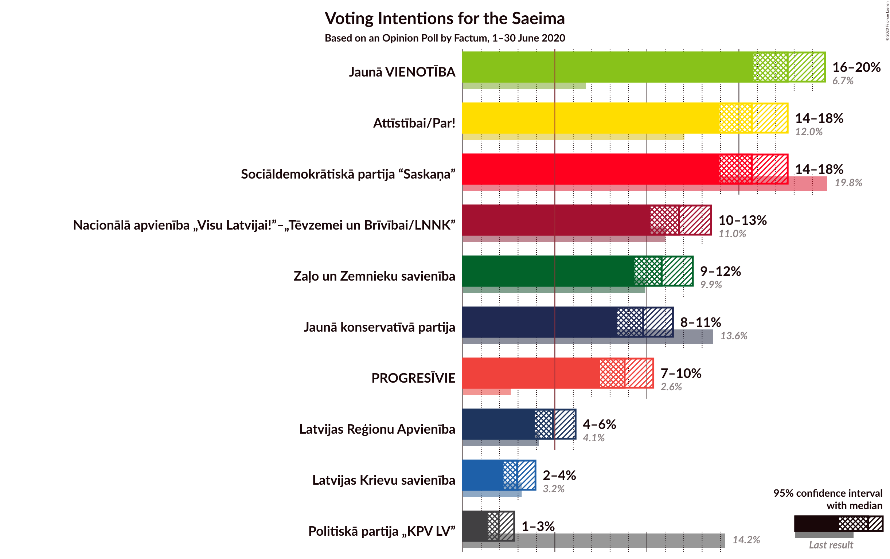
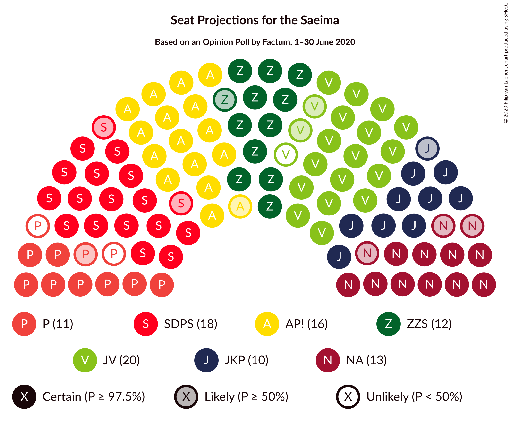
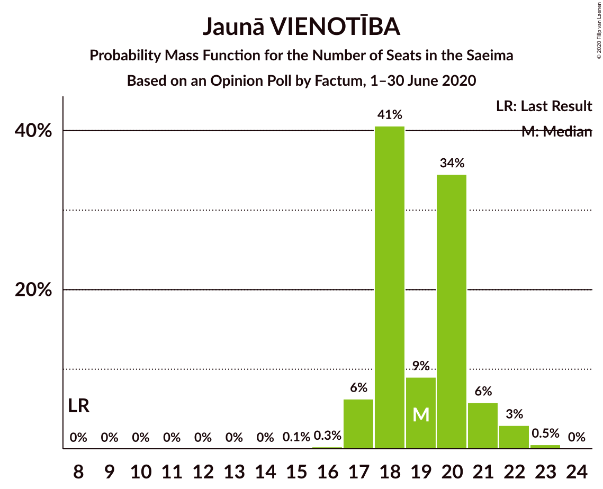
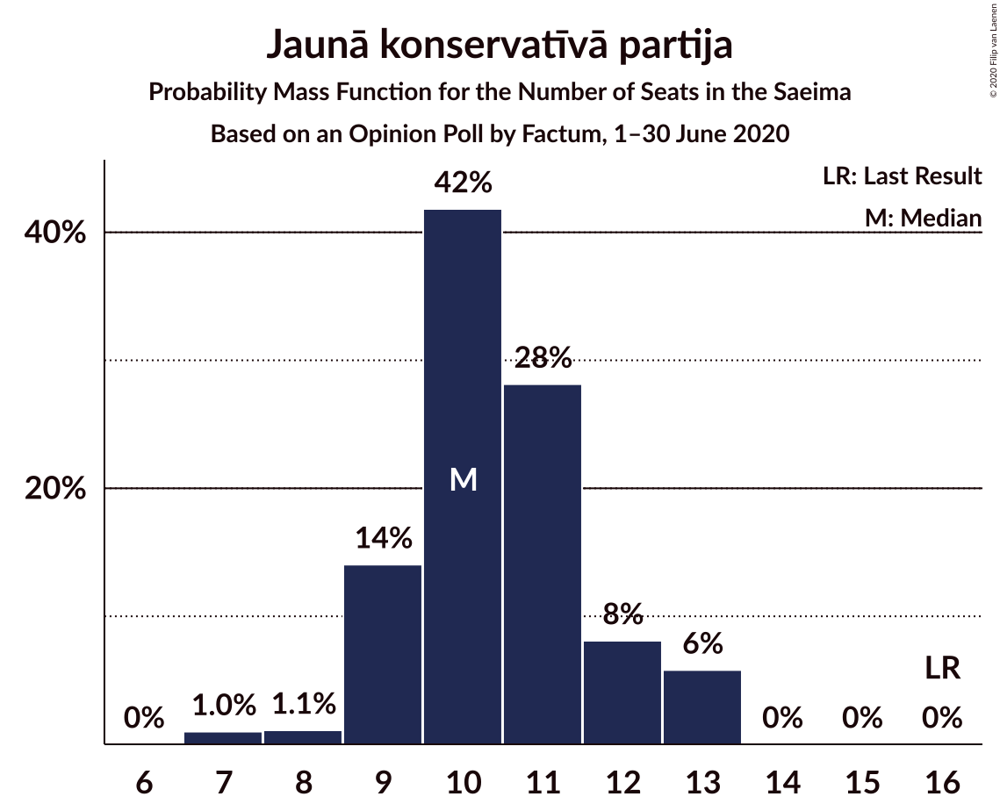
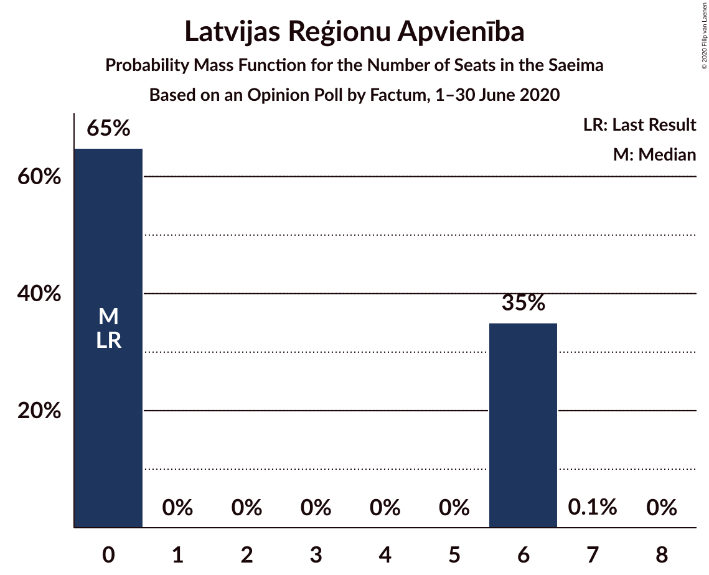
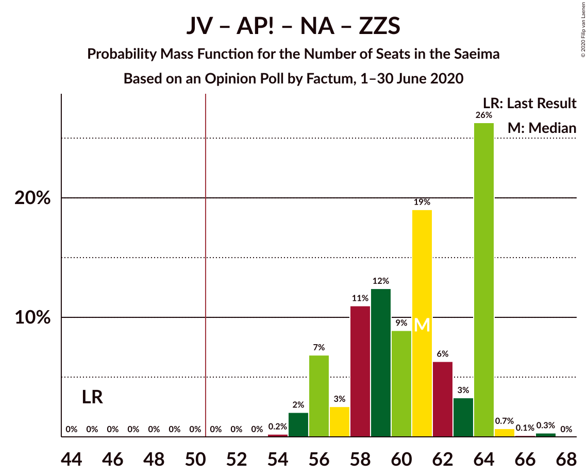
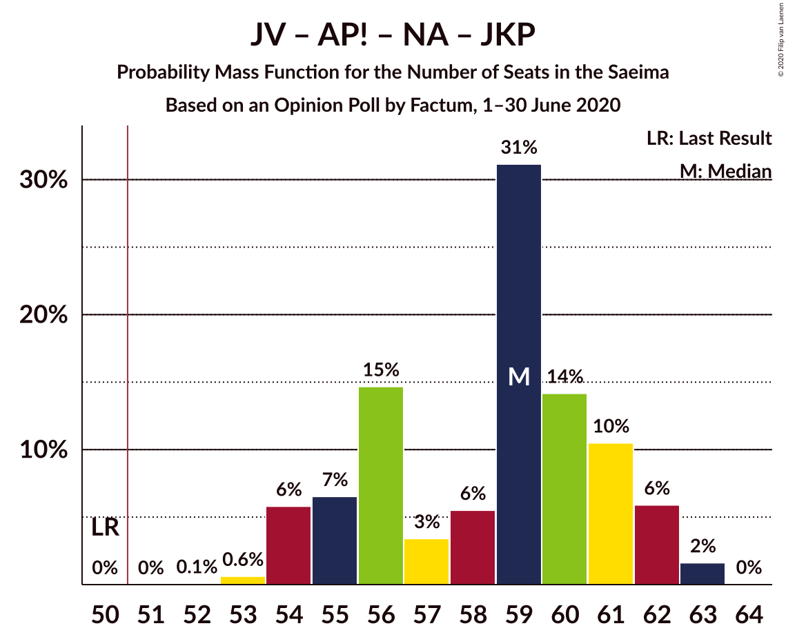
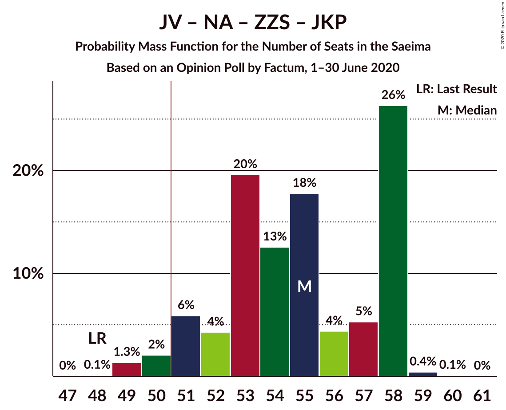
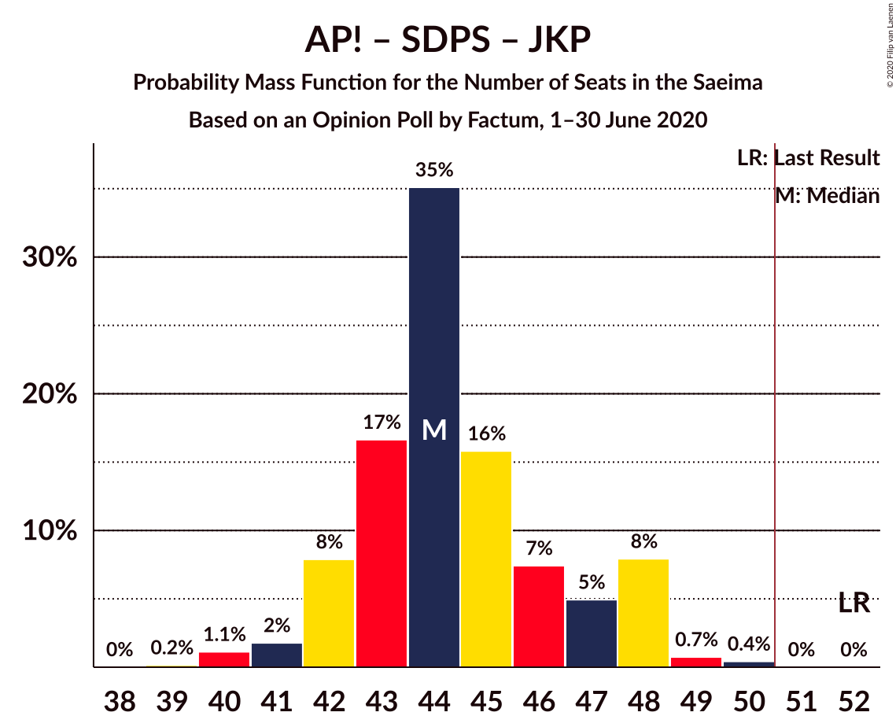
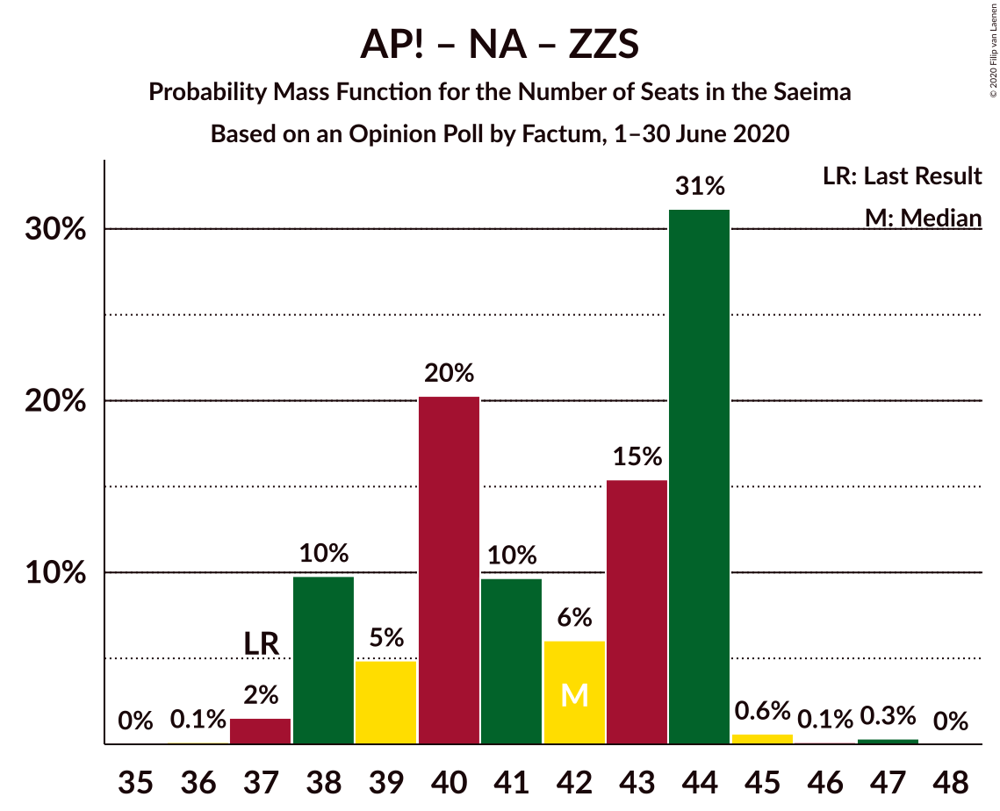

# Opinion Poll by Factum, 1–30 June 2020

<a href="#voting-intentions">Voting Intentions</a> | <a href="#seats">Seats</a> | <a href="#coalitions">Coalitions</a> | <a href="#technical-information">Technical Information</a>

## Voting Intentions

### Confidence Intervals

| Party | Last Result | Poll Result | 80% Confidence Interval | 90% Confidence Interval | 95% Confidence Interval | 99% Confidence Interval |
|:-----:|:-----------:|:-----------:|:-----------------------:|:-----------------------:|:-----------------------:|:-----------------------:|
| Jaunā VIENOTĪBA | 6.7% | 17.7% | 16.4–19.0% |16.1–19.4% |15.8–19.7% |15.2–20.3% |
| Sociāldemokrātiskā partija “Saskaņa” | 19.8% | 15.7% | 14.5–17.0% |14.2–17.3% |13.9–17.6% |13.4–18.3% |
| Attīstībai/Par! | 12.0% | 15.7% | 14.5–17.0% |14.2–17.3% |13.9–17.6% |13.4–18.3% |
| Nacionālā apvienība „Visu Latvijai!”–„Tēvzemei un Brīvībai/LNNK” | 11.0% | 11.7% | 10.7–12.9% |10.4–13.2% |10.2–13.5% |9.7–14.1% |
| Zaļo un Zemnieku savienība | 9.9% | 10.8% | 9.8–11.9% |9.6–12.2% |9.3–12.5% |8.9–13.0% |
| Jaunā konservatīvā partija | 13.6% | 9.8% | 8.9–10.9% |8.6–11.2% |8.4–11.4% |8.0–11.9% |
| PROGRESĪVIE | 2.6% | 8.8% | 7.9–9.8% |7.7–10.1% |7.5–10.3% |7.1–10.9% |
| Latvijas Reģionu Apvienība | 4.1% | 4.9% | 4.3–5.7% |4.1–5.9% |3.9–6.1% |3.6–6.5% |
| Latvijas Krievu savienība | 3.2% | 3.0% | 2.5–3.6% |2.3–3.8% |2.2–3.9% |2.0–4.3% |
| Politiskā partija „KPV LV” | 14.2% | 1.9% | 1.6–2.5% |1.4–2.7% |1.4–2.8% |1.2–3.1% |

*Note:* The poll result column reflects the actual value used in the calculations. Published results may vary slightly, and in addition be rounded to fewer digits.

## Seats

### Confidence Intervals

| Party | Last Result | Median | 80% Confidence Interval | 90% Confidence Interval | 95% Confidence Interval | 99% Confidence Interval |
|:-----:|:-----------:|:------:|:-----------------------:|:-----------------------:|:-----------------------:|:-----------------------:|
| <a href="#jaunā-vienotība">Jaunā VIENOTĪBA</a> | 8 | 18 | 18–21 |18–21 |17–23 |17–23 |
| <a href="#sociāldemokrātiskā-partija-“saskaņa”">Sociāldemokrātiskā partija “Saskaņa”</a> | 23 | 17 | 17–18 |17–18 |16–20 |16–20 |
| <a href="#attīstībai/par!">Attīstībai/Par!</a> | 13 | 15 | 15–17 |15–18 |15–18 |13–18 |
| <a href="#nacionālā-apvienība-„visu-latvijai!”–„tēvzemei-un-brīvībai/lnnk”">Nacionālā apvienība „Visu Latvijai!”–„Tēvzemei un Brīvībai/LNNK”</a> | 13 | 10 | 10–14 |10–14 |10–14 |10–14 |
| <a href="#zaļo-un-zemnieku-savienība">Zaļo un Zemnieku savienība</a> | 11 | 13 | 11–13 |11–13 |11–13 |11–15 |
| <a href="#jaunā-konservatīvā-partija">Jaunā konservatīvā partija</a> | 16 | 12 | 10–13 |9–13 |8–13 |8–13 |
| <a href="#progresīvie">PROGRESĪVIE</a> | 0 | 9 | 8–11 |8–11 |8–11 |7–11 |
| <a href="#latvijas-reģionu-apvienība">Latvijas Reģionu Apvienība</a> | 0 | 6 | 0–6 |0–6 |0–6 |0–6 |
| <a href="#latvijas-krievu-savienība">Latvijas Krievu savienība</a> | 0 | 0 | 0 |0 |0 |0 |
| <a href="#politiskā-partija-„kpv-lv”">Politiskā partija „KPV LV”</a> | 16 | 0 | 0 |0 |0 |0 |

### Jaunā VIENOTĪBA

*For a full overview of the results for this party, see the [Jaunā VIENOTĪBA](party-jaunāvienotība.html) page.*

| Number of Seats | Probability | Accumulated | Special Marks |
|:---------------:|:-----------:|:-----------:|:-------------:|
| 8 | 0% | 100% | Last Result |
| 9 | 0% | 100% |  |
| 10 | 0% | 100% |  |
| 11 | 0% | 100% |  |
| 12 | 0% | 100% |  |
| 13 | 0% | 100% |  |
| 14 | 0% | 100% |  |
| 15 | 0% | 100% |  |
| 16 | 0.2% | 100% |  |
| 17 | 2% | 99.8% |  |
| 18 | 64% | 97% | Median |
| 19 | 8% | 33% |  |
| 20 | 4% | 25% |  |
| 21 | 17% | 21% |  |
| 22 | 0.1% | 4% |  |
| 23 | 4% | 4% |  |
| 24 | 0.1% | 0.1% |  |
| 25 | 0% | 0% |  |

### Sociāldemokrātiskā partija “Saskaņa”

*For a full overview of the results for this party, see the [Sociāldemokrātiskā partija “Saskaņa”](party-sociāldemokrātiskāpartija“saskaņa”.html) page.*

| Number of Seats | Probability | Accumulated | Special Marks |
|:---------------:|:-----------:|:-----------:|:-------------:|
| 15 | 0.1% | 100% |  |
| 16 | 4% | 99.9% |  |
| 17 | 66% | 96% | Median |
| 18 | 25% | 30% |  |
| 19 | 0.2% | 5% |  |
| 20 | 5% | 5% |  |
| 21 | 0.1% | 0.3% |  |
| 22 | 0.2% | 0.2% |  |
| 23 | 0.1% | 0.1% | Last Result |
| 24 | 0% | 0% |  |

### Attīstībai/Par!

*For a full overview of the results for this party, see the [Attīstībai/Par!](party-attīstībaipar.html) page.*

| Number of Seats | Probability | Accumulated | Special Marks |
|:---------------:|:-----------:|:-----------:|:-------------:|
| 13 | 0.7% | 100% | Last Result |
| 14 | 0.7% | 99.3% |  |
| 15 | 59% | 98.6% | Median |
| 16 | 28% | 40% |  |
| 17 | 5% | 11% |  |
| 18 | 6% | 6% |  |
| 19 | 0.1% | 0.4% |  |
| 20 | 0.3% | 0.3% |  |
| 21 | 0% | 0% |  |

### Nacionālā apvienība „Visu Latvijai!”–„Tēvzemei un Brīvībai/LNNK”

*For a full overview of the results for this party, see the [Nacionālā apvienība „Visu Latvijai!”–„Tēvzemei un Brīvībai/LNNK”](party-nacionālāapvienība„visulatvijai”–„tēvzemeiunbrīvībailnnk”.html) page.*

| Number of Seats | Probability | Accumulated | Special Marks |
|:---------------:|:-----------:|:-----------:|:-------------:|
| 10 | 52% | 100% | Median |
| 11 | 17% | 48% |  |
| 12 | 0.6% | 31% |  |
| 13 | 15% | 31% | Last Result |
| 14 | 16% | 16% |  |
| 15 | 0% | 0% |  |

### Zaļo un Zemnieku savienība

*For a full overview of the results for this party, see the [Zaļo un Zemnieku savienība](party-zaļounzemniekusavienība.html) page.*

| Number of Seats | Probability | Accumulated | Special Marks |
|:---------------:|:-----------:|:-----------:|:-------------:|
| 10 | 0.3% | 100% |  |
| 11 | 27% | 99.7% | Last Result |
| 12 | 13% | 72% |  |
| 13 | 58% | 59% | Median |
| 14 | 0.2% | 0.8% |  |
| 15 | 0.6% | 0.6% |  |
| 16 | 0% | 0% |  |

### Jaunā konservatīvā partija

*For a full overview of the results for this party, see the [Jaunā konservatīvā partija](party-jaunākonservatīvāpartija.html) page.*

| Number of Seats | Probability | Accumulated | Special Marks |
|:---------------:|:-----------:|:-----------:|:-------------:|
| 8 | 3% | 100% |  |
| 9 | 4% | 97% |  |
| 10 | 9% | 92% |  |
| 11 | 21% | 83% |  |
| 12 | 52% | 62% | Median |
| 13 | 10% | 10% |  |
| 14 | 0% | 0% |  |
| 15 | 0% | 0% |  |
| 16 | 0% | 0% | Last Result |

### PROGRESĪVIE

*For a full overview of the results for this party, see the [PROGRESĪVIE](party-progresīvie.html) page.*

| Number of Seats | Probability | Accumulated | Special Marks |
|:---------------:|:-----------:|:-----------:|:-------------:|
| 0 | 0% | 100% | Last Result |
| 1 | 0% | 100% |  |
| 2 | 0% | 100% |  |
| 3 | 0% | 100% |  |
| 4 | 0% | 100% |  |
| 5 | 0% | 100% |  |
| 6 | 0% | 100% |  |
| 7 | 1.3% | 100% |  |
| 8 | 12% | 98.7% |  |
| 9 | 59% | 87% | Median |
| 10 | 7% | 28% |  |
| 11 | 21% | 21% |  |
| 12 | 0.1% | 0.1% |  |
| 13 | 0% | 0% |  |

### Latvijas Reģionu Apvienība

*For a full overview of the results for this party, see the [Latvijas Reģionu Apvienība](party-latvijasreģionuapvienība.html) page.*

| Number of Seats | Probability | Accumulated | Special Marks |
|:---------------:|:-----------:|:-----------:|:-------------:|
| 0 | 36% | 100% | Last Result |
| 1 | 0% | 64% |  |
| 2 | 0% | 64% |  |
| 3 | 0% | 64% |  |
| 4 | 0% | 64% |  |
| 5 | 0% | 64% |  |
| 6 | 64% | 64% | Median |
| 7 | 0.1% | 0.1% |  |
| 8 | 0% | 0% |  |

### Latvijas Krievu savienība

*For a full overview of the results for this party, see the [Latvijas Krievu savienība](party-latvijaskrievusavienība.html) page.*

| Number of Seats | Probability | Accumulated | Special Marks |
|:---------------:|:-----------:|:-----------:|:-------------:|
| 0 | 100% | 100% | Last Result, Median |

### Politiskā partija „KPV LV”

*For a full overview of the results for this party, see the [Politiskā partija „KPV LV”](party-politiskāpartija„kpvlv”.html) page.*

| Number of Seats | Probability | Accumulated | Special Marks |
|:---------------:|:-----------:|:-----------:|:-------------:|
| 0 | 100% | 100% | Median |
| 1 | 0% | 0% |  |
| 2 | 0% | 0% |  |
| 3 | 0% | 0% |  |
| 4 | 0% | 0% |  |
| 5 | 0% | 0% |  |
| 6 | 0% | 0% |  |
| 7 | 0% | 0% |  |
| 8 | 0% | 0% |  |
| 9 | 0% | 0% |  |
| 10 | 0% | 0% |  |
| 11 | 0% | 0% |  |
| 12 | 0% | 0% |  |
| 13 | 0% | 0% |  |
| 14 | 0% | 0% |  |
| 15 | 0% | 0% |  |
| 16 | 0% | 0% | Last Result |

## Coalitions

### Confidence Intervals

| Coalition | Last Result | Median | Majority? | 80% Confidence Interval | 90% Confidence Interval | 95% Confidence Interval | 99% Confidence Interval |
|:---------:|:-----------:|:------:|:---------:|:-----------------------:|:-----------------------:|:-----------------------:|:-----------------------:|
| Jaunā VIENOTĪBA – Attīstībai/Par! – Nacionālā apvienība „Visu Latvijai!”–„Tēvzemei un Brīvībai/LNNK” – Zaļo un Zemnieku savienība – Jaunā konservatīvā partija | 61 | 68 | 100% | 68–74 | 65–74 | 65–74 | 65–75 |
| Jaunā VIENOTĪBA – Attīstībai/Par! – Nacionālā apvienība „Visu Latvijai!”–„Tēvzemei un Brīvībai/LNNK” – Zaļo un Zemnieku savienība | 45 | 56 | 100% | 56–61 | 55–63 | 55–65 | 54–65 |
| Jaunā VIENOTĪBA – Attīstībai/Par! – Nacionālā apvienība „Visu Latvijai!”–„Tēvzemei un Brīvībai/LNNK” – Jaunā konservatīvā partija | 50 | 55 | 100% | 55–62 | 54–62 | 54–62 | 54–63 |
| Jaunā VIENOTĪBA – Attīstībai/Par! – Nacionālā apvienība „Visu Latvijai!”–„Tēvzemei un Brīvībai/LNNK” – Jaunā konservatīvā partija – Politiskā partija „KPV LV” | 66 | 55 | 100% | 55–62 | 54–62 | 54–62 | 54–63 |
| Jaunā VIENOTĪBA – Nacionālā apvienība „Visu Latvijai!”–„Tēvzemei un Brīvībai/LNNK” – Zaļo un Zemnieku savienība – Jaunā konservatīvā partija | 48 | 53 | 92% | 52–58 | 50–58 | 50–58 | 49–58 |
| Attīstībai/Par! – Nacionālā apvienība „Visu Latvijai!”–„Tēvzemei un Brīvībai/LNNK” – Zaļo un Zemnieku savienība – Jaunā konservatīvā partija | 53 | 50 | 33% | 49–55 | 47–55 | 47–55 | 46–56 |
| Jaunā VIENOTĪBA – Attīstībai/Par! – Nacionālā apvienība „Visu Latvijai!”–„Tēvzemei un Brīvībai/LNNK” – Politiskā partija „KPV LV” | 50 | 43 | 8% | 43–50 | 43–51 | 43–53 | 43–53 |
| Jaunā VIENOTĪBA – Attīstībai/Par! – Jaunā konservatīvā partija – Politiskā partija „KPV LV” | 53 | 45 | 0.3% | 43–48 | 43–49 | 43–49 | 42–49 |
| Attīstībai/Par! – Sociāldemokrātiskā partija “Saskaņa” – Jaunā konservatīvā partija | 52 | 44 | 0% | 43–47 | 43–48 | 42–49 | 39–49 |
| Jaunā VIENOTĪBA – Nacionālā apvienība „Visu Latvijai!”–„Tēvzemei un Brīvībai/LNNK” – Zaļo un Zemnieku savienība | 32 | 41 | 0% | 41–45 | 40–47 | 40–49 | 39–49 |
| Jaunā VIENOTĪBA – Nacionālā apvienība „Visu Latvijai!”–„Tēvzemei un Brīvībai/LNNK” – Jaunā konservatīvā partija – Politiskā partija „KPV LV” | 53 | 40 | 0% | 40–45 | 39–46 | 39–46 | 38–46 |
| Attīstībai/Par! – Nacionālā apvienība „Visu Latvijai!”–„Tēvzemei un Brīvībai/LNNK” – Zaļo un Zemnieku savienība | 37 | 38 | 0% | 38–42 | 37–43 | 37–43 | 36–44 |
| Attīstībai/Par! – Nacionālā apvienība „Visu Latvijai!”–„Tēvzemei un Brīvībai/LNNK” – Jaunā konservatīvā partija – Politiskā partija „KPV LV” | 58 | 37 | 0% | 37–42 | 36–43 | 36–43 | 35–44 |
| Nacionālā apvienība „Visu Latvijai!”–„Tēvzemei un Brīvībai/LNNK” – Zaļo un Zemnieku savienība – Jaunā konservatīvā partija | 40 | 35 | 0% | 33–37 | 32–39 | 32–39 | 32–39 |
| Attīstībai/Par! – Sociāldemokrātiskā partija “Saskaņa” | 36 | 32 | 0% | 32–36 | 32–36 | 32–36 | 31–37 |
| Sociāldemokrātiskā partija “Saskaņa” – Zaļo un Zemnieku savienība – Politiskā partija „KPV LV” | 50 | 30 | 0% | 28–31 | 28–31 | 28–31 | 28–33 |
| Sociāldemokrātiskā partija “Saskaņa” – Politiskā partija „KPV LV” | 39 | 17 | 0% | 17–18 | 17–18 | 16–20 | 16–20 |

### Jaunā VIENOTĪBA – Attīstībai/Par! – Nacionālā apvienība „Visu Latvijai!”–„Tēvzemei un Brīvībai/LNNK” – Zaļo un Zemnieku savienība – Jaunā konservatīvā partija

| Number of Seats | Probability | Accumulated | Special Marks |
|:---------------:|:-----------:|:-----------:|:-------------:|
| 61 | 0% | 100% | Last Result |
| 62 | 0% | 100% |  |
| 63 | 0% | 100% |  |
| 64 | 0% | 100% |  |
| 65 | 8% | 100% |  |
| 66 | 0.5% | 92% |  |
| 67 | 0.9% | 92% |  |
| 68 | 52% | 91% | Median |
| 69 | 3% | 39% |  |
| 70 | 4% | 36% |  |
| 71 | 0.5% | 32% |  |
| 72 | 13% | 31% |  |
| 73 | 5% | 18% |  |
| 74 | 11% | 13% |  |
| 75 | 2% | 2% |  |
| 76 | 0% | 0% |  |

### Jaunā VIENOTĪBA – Attīstībai/Par! – Nacionālā apvienība „Visu Latvijai!”–„Tēvzemei un Brīvībai/LNNK” – Zaļo un Zemnieku savienība

| Number of Seats | Probability | Accumulated | Special Marks |
|:---------------:|:-----------:|:-----------:|:-------------:|
| 45 | 0% | 100% | Last Result |
| 46 | 0% | 100% |  |
| 47 | 0% | 100% |  |
| 48 | 0% | 100% |  |
| 49 | 0% | 100% |  |
| 50 | 0% | 100% |  |
| 51 | 0% | 100% | Majority |
| 52 | 0% | 100% |  |
| 53 | 0% | 100% |  |
| 54 | 0.7% | 100% |  |
| 55 | 8% | 99.3% |  |
| 56 | 52% | 91% | Median |
| 57 | 0.3% | 39% |  |
| 58 | 0.3% | 39% |  |
| 59 | 4% | 39% |  |
| 60 | 5% | 35% |  |
| 61 | 20% | 30% |  |
| 62 | 2% | 10% |  |
| 63 | 4% | 8% |  |
| 64 | 0.3% | 4% |  |
| 65 | 4% | 4% |  |
| 66 | 0.4% | 0.4% |  |
| 67 | 0% | 0% |  |

### Jaunā VIENOTĪBA – Attīstībai/Par! – Nacionālā apvienība „Visu Latvijai!”–„Tēvzemei un Brīvībai/LNNK” – Jaunā konservatīvā partija

| Number of Seats | Probability | Accumulated | Special Marks |
|:---------------:|:-----------:|:-----------:|:-------------:|
| 50 | 0% | 100% | Last Result |
| 51 | 0% | 100% | Majority |
| 52 | 0% | 100% |  |
| 53 | 0.1% | 100% |  |
| 54 | 8% | 99.9% |  |
| 55 | 52% | 92% | Median |
| 56 | 2% | 40% |  |
| 57 | 1.4% | 38% |  |
| 58 | 2% | 37% |  |
| 59 | 4% | 35% |  |
| 60 | 5% | 31% |  |
| 61 | 14% | 26% |  |
| 62 | 11% | 12% |  |
| 63 | 1.1% | 1.1% |  |
| 64 | 0% | 0% |  |

### Jaunā VIENOTĪBA – Attīstībai/Par! – Nacionālā apvienība „Visu Latvijai!”–„Tēvzemei un Brīvībai/LNNK” – Jaunā konservatīvā partija – Politiskā partija „KPV LV”

| Number of Seats | Probability | Accumulated | Special Marks |
|:---------------:|:-----------:|:-----------:|:-------------:|
| 53 | 0.1% | 100% |  |
| 54 | 8% | 99.9% |  |
| 55 | 52% | 92% | Median |
| 56 | 2% | 40% |  |
| 57 | 1.4% | 38% |  |
| 58 | 2% | 37% |  |
| 59 | 4% | 35% |  |
| 60 | 5% | 31% |  |
| 61 | 14% | 26% |  |
| 62 | 11% | 12% |  |
| 63 | 1.1% | 1.1% |  |
| 64 | 0% | 0% |  |
| 65 | 0% | 0% |  |
| 66 | 0% | 0% | Last Result |

### Jaunā VIENOTĪBA – Nacionālā apvienība „Visu Latvijai!”–„Tēvzemei un Brīvībai/LNNK” – Zaļo un Zemnieku savienība – Jaunā konservatīvā partija

| Number of Seats | Probability | Accumulated | Special Marks |
|:---------------:|:-----------:|:-----------:|:-------------:|
| 48 | 0% | 100% | Last Result |
| 49 | 1.3% | 100% |  |
| 50 | 6% | 98.6% |  |
| 51 | 1.5% | 92% | Majority |
| 52 | 1.5% | 91% |  |
| 53 | 52% | 89% | Median |
| 54 | 6% | 37% |  |
| 55 | 5% | 31% |  |
| 56 | 13% | 26% |  |
| 57 | 3% | 13% |  |
| 58 | 10% | 10% |  |
| 59 | 0% | 0.1% |  |
| 60 | 0.1% | 0.1% |  |
| 61 | 0% | 0% |  |

### Attīstībai/Par! – Nacionālā apvienība „Visu Latvijai!”–„Tēvzemei un Brīvībai/LNNK” – Zaļo un Zemnieku savienība – Jaunā konservatīvā partija

| Number of Seats | Probability | Accumulated | Special Marks |
|:---------------:|:-----------:|:-----------:|:-------------:|
| 46 | 0.5% | 100% |  |
| 47 | 6% | 99.5% |  |
| 48 | 2% | 93% |  |
| 49 | 4% | 92% |  |
| 50 | 54% | 87% | Median |
| 51 | 18% | 33% | Majority |
| 52 | 0.8% | 15% |  |
| 53 | 0.3% | 14% | Last Result |
| 54 | 4% | 14% |  |
| 55 | 10% | 10% |  |
| 56 | 0.8% | 0.8% |  |
| 57 | 0% | 0% |  |

### Jaunā VIENOTĪBA – Attīstībai/Par! – Nacionālā apvienība „Visu Latvijai!”–„Tēvzemei un Brīvībai/LNNK” – Politiskā partija „KPV LV”

| Number of Seats | Probability | Accumulated | Special Marks |
|:---------------:|:-----------:|:-----------:|:-------------:|
| 43 | 52% | 100% | Median |
| 44 | 8% | 48% |  |
| 45 | 0.6% | 40% |  |
| 46 | 0.4% | 39% |  |
| 47 | 5% | 39% |  |
| 48 | 5% | 34% |  |
| 49 | 6% | 29% |  |
| 50 | 15% | 23% | Last Result |
| 51 | 3% | 8% | Majority |
| 52 | 0.4% | 4% |  |
| 53 | 4% | 4% |  |
| 54 | 0% | 0% |  |

### Jaunā VIENOTĪBA – Attīstībai/Par! – Jaunā konservatīvā partija – Politiskā partija „KPV LV”

| Number of Seats | Probability | Accumulated | Special Marks |
|:---------------:|:-----------:|:-----------:|:-------------:|
| 41 | 0.1% | 100% |  |
| 42 | 0.9% | 99.9% |  |
| 43 | 10% | 99.0% |  |
| 44 | 0.9% | 89% |  |
| 45 | 53% | 88% | Median |
| 46 | 0.8% | 35% |  |
| 47 | 2% | 35% |  |
| 48 | 27% | 33% |  |
| 49 | 6% | 6% |  |
| 50 | 0.1% | 0.4% |  |
| 51 | 0.3% | 0.3% | Majority |
| 52 | 0% | 0% |  |
| 53 | 0% | 0% | Last Result |

### Attīstībai/Par! – Sociāldemokrātiskā partija “Saskaņa” – Jaunā konservatīvā partija

| Number of Seats | Probability | Accumulated | Special Marks |
|:---------------:|:-----------:|:-----------:|:-------------:|
| 39 | 0.9% | 100% |  |
| 40 | 0.2% | 99.1% |  |
| 41 | 0.3% | 99.0% |  |
| 42 | 2% | 98.7% |  |
| 43 | 11% | 97% |  |
| 44 | 69% | 86% | Median |
| 45 | 1.2% | 17% |  |
| 46 | 0.9% | 16% |  |
| 47 | 9% | 15% |  |
| 48 | 0.8% | 6% |  |
| 49 | 5% | 5% |  |
| 50 | 0.1% | 0.1% |  |
| 51 | 0% | 0% | Majority |
| 52 | 0% | 0% | Last Result |

### Jaunā VIENOTĪBA – Nacionālā apvienība „Visu Latvijai!”–„Tēvzemei un Brīvībai/LNNK” – Zaļo un Zemnieku savienība

| Number of Seats | Probability | Accumulated | Special Marks |
|:---------------:|:-----------:|:-----------:|:-------------:|
| 32 | 0% | 100% | Last Result |
| 33 | 0% | 100% |  |
| 34 | 0% | 100% |  |
| 35 | 0% | 100% |  |
| 36 | 0% | 100% |  |
| 37 | 0% | 100% |  |
| 38 | 0% | 100% |  |
| 39 | 1.4% | 100% |  |
| 40 | 6% | 98.6% |  |
| 41 | 53% | 92% | Median |
| 42 | 5% | 39% |  |
| 43 | 5% | 34% |  |
| 44 | 2% | 29% |  |
| 45 | 18% | 27% |  |
| 46 | 3% | 9% |  |
| 47 | 2% | 6% |  |
| 48 | 0% | 4% |  |
| 49 | 4% | 4% |  |
| 50 | 0% | 0% |  |

### Jaunā VIENOTĪBA – Nacionālā apvienība „Visu Latvijai!”–„Tēvzemei un Brīvībai/LNNK” – Jaunā konservatīvā partija – Politiskā partija „KPV LV”

| Number of Seats | Probability | Accumulated | Special Marks |
|:---------------:|:-----------:|:-----------:|:-------------:|
| 36 | 0.1% | 100% |  |
| 37 | 0% | 99.9% |  |
| 38 | 1.4% | 99.9% |  |
| 39 | 7% | 98.5% |  |
| 40 | 54% | 92% | Median |
| 41 | 1.4% | 38% |  |
| 42 | 5% | 36% |  |
| 43 | 5% | 31% |  |
| 44 | 0.6% | 26% |  |
| 45 | 16% | 25% |  |
| 46 | 9% | 9% |  |
| 47 | 0.1% | 0.1% |  |
| 48 | 0% | 0% |  |
| 49 | 0% | 0% |  |
| 50 | 0% | 0% |  |
| 51 | 0% | 0% | Majority |
| 52 | 0% | 0% |  |
| 53 | 0% | 0% | Last Result |

### Attīstībai/Par! – Nacionālā apvienība „Visu Latvijai!”–„Tēvzemei un Brīvībai/LNNK” – Zaļo un Zemnieku savienība

| Number of Seats | Probability | Accumulated | Special Marks |
|:---------------:|:-----------:|:-----------:|:-------------:|
| 36 | 0.5% | 100% |  |
| 37 | 7% | 99.5% | Last Result |
| 38 | 57% | 93% | Median |
| 39 | 0.2% | 35% |  |
| 40 | 13% | 35% |  |
| 41 | 1.0% | 22% |  |
| 42 | 15% | 21% |  |
| 43 | 5% | 7% |  |
| 44 | 0.7% | 1.1% |  |
| 45 | 0% | 0.4% |  |
| 46 | 0.4% | 0.4% |  |
| 47 | 0% | 0% |  |

### Attīstībai/Par! – Nacionālā apvienība „Visu Latvijai!”–„Tēvzemei un Brīvībai/LNNK” – Jaunā konservatīvā partija – Politiskā partija „KPV LV”

| Number of Seats | Probability | Accumulated | Special Marks |
|:---------------:|:-----------:|:-----------:|:-------------:|
| 35 | 0.6% | 100% |  |
| 36 | 6% | 99.4% |  |
| 37 | 54% | 93% | Median |
| 38 | 5% | 39% |  |
| 39 | 7% | 34% |  |
| 40 | 14% | 28% |  |
| 41 | 1.2% | 14% |  |
| 42 | 7% | 13% |  |
| 43 | 5% | 6% |  |
| 44 | 0.8% | 0.8% |  |
| 45 | 0% | 0% |  |
| 46 | 0% | 0% |  |
| 47 | 0% | 0% |  |
| 48 | 0% | 0% |  |
| 49 | 0% | 0% |  |
| 50 | 0% | 0% |  |
| 51 | 0% | 0% | Majority |
| 52 | 0% | 0% |  |
| 53 | 0% | 0% |  |
| 54 | 0% | 0% |  |
| 55 | 0% | 0% |  |
| 56 | 0% | 0% |  |
| 57 | 0% | 0% |  |
| 58 | 0% | 0% | Last Result |

### Nacionālā apvienība „Visu Latvijai!”–„Tēvzemei un Brīvībai/LNNK” – Zaļo un Zemnieku savienība – Jaunā konservatīvā partija

| Number of Seats | Probability | Accumulated | Special Marks |
|:---------------:|:-----------:|:-----------:|:-------------:|
| 31 | 0.1% | 100% |  |
| 32 | 9% | 99.9% |  |
| 33 | 5% | 91% |  |
| 34 | 2% | 86% |  |
| 35 | 69% | 85% | Median |
| 36 | 1.0% | 15% |  |
| 37 | 8% | 15% |  |
| 38 | 2% | 7% |  |
| 39 | 5% | 5% |  |
| 40 | 0.1% | 0.1% | Last Result |
| 41 | 0% | 0% |  |

### Attīstībai/Par! – Sociāldemokrātiskā partija “Saskaņa”

| Number of Seats | Probability | Accumulated | Special Marks |
|:---------------:|:-----------:|:-----------:|:-------------:|
| 31 | 2% | 100% |  |
| 32 | 52% | 98% | Median |
| 33 | 22% | 46% |  |
| 34 | 12% | 24% |  |
| 35 | 2% | 12% |  |
| 36 | 9% | 10% | Last Result |
| 37 | 0.2% | 0.6% |  |
| 38 | 0.5% | 0.5% |  |
| 39 | 0% | 0% |  |

### Sociāldemokrātiskā partija “Saskaņa” – Zaļo un Zemnieku savienība – Politiskā partija „KPV LV”

| Number of Seats | Probability | Accumulated | Special Marks |
|:---------------:|:-----------:|:-----------:|:-------------:|
| 27 | 0.3% | 100% |  |
| 28 | 16% | 99.7% |  |
| 29 | 12% | 83% |  |
| 30 | 61% | 72% | Median |
| 31 | 10% | 11% |  |
| 32 | 0.4% | 1.1% |  |
| 33 | 0.4% | 0.6% |  |
| 34 | 0.2% | 0.2% |  |
| 35 | 0% | 0.1% |  |
| 36 | 0.1% | 0.1% |  |
| 37 | 0% | 0% |  |
| 38 | 0% | 0% |  |
| 39 | 0% | 0% |  |
| 40 | 0% | 0% |  |
| 41 | 0% | 0% |  |
| 42 | 0% | 0% |  |
| 43 | 0% | 0% |  |
| 44 | 0% | 0% |  |
| 45 | 0% | 0% |  |
| 46 | 0% | 0% |  |
| 47 | 0% | 0% |  |
| 48 | 0% | 0% |  |
| 49 | 0% | 0% |  |
| 50 | 0% | 0% | Last Result |

### Sociāldemokrātiskā partija “Saskaņa” – Politiskā partija „KPV LV”

| Number of Seats | Probability | Accumulated | Special Marks |
|:---------------:|:-----------:|:-----------:|:-------------:|
| 15 | 0.1% | 100% |  |
| 16 | 4% | 99.9% |  |
| 17 | 66% | 96% | Median |
| 18 | 25% | 30% |  |
| 19 | 0.2% | 5% |  |
| 20 | 5% | 5% |  |
| 21 | 0.1% | 0.3% |  |
| 22 | 0.2% | 0.2% |  |
| 23 | 0.1% | 0.1% |  |
| 24 | 0% | 0% |  |
| 25 | 0% | 0% |  |
| 26 | 0% | 0% |  |
| 27 | 0% | 0% |  |
| 28 | 0% | 0% |  |
| 29 | 0% | 0% |  |
| 30 | 0% | 0% |  |
| 31 | 0% | 0% |  |
| 32 | 0% | 0% |  |
| 33 | 0% | 0% |  |
| 34 | 0% | 0% |  |
| 35 | 0% | 0% |  |
| 36 | 0% | 0% |  |
| 37 | 0% | 0% |  |
| 38 | 0% | 0% |  |
| 39 | 0% | 0% | Last Result |

## Technical Information

### Opinion Poll

+ **Polling firm:** Factum
+ **Commissioner(s):** —
+ **Fieldwork period:** 1–30 June 2020

### Calculations

+ **Sample size:** 1490
+ **Simulations done:** 131,072
+ **Error estimate:** 2.03%

