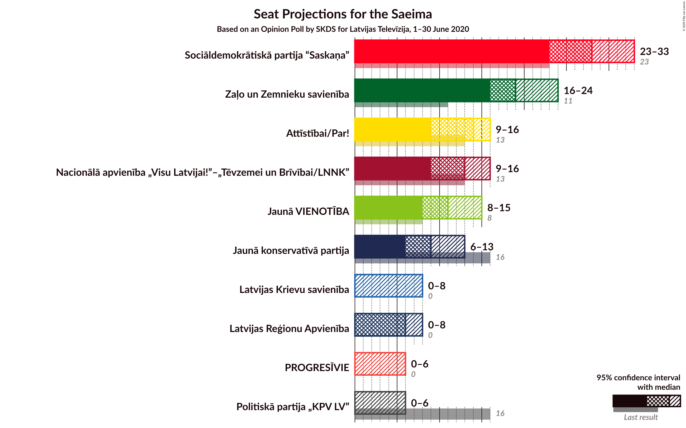
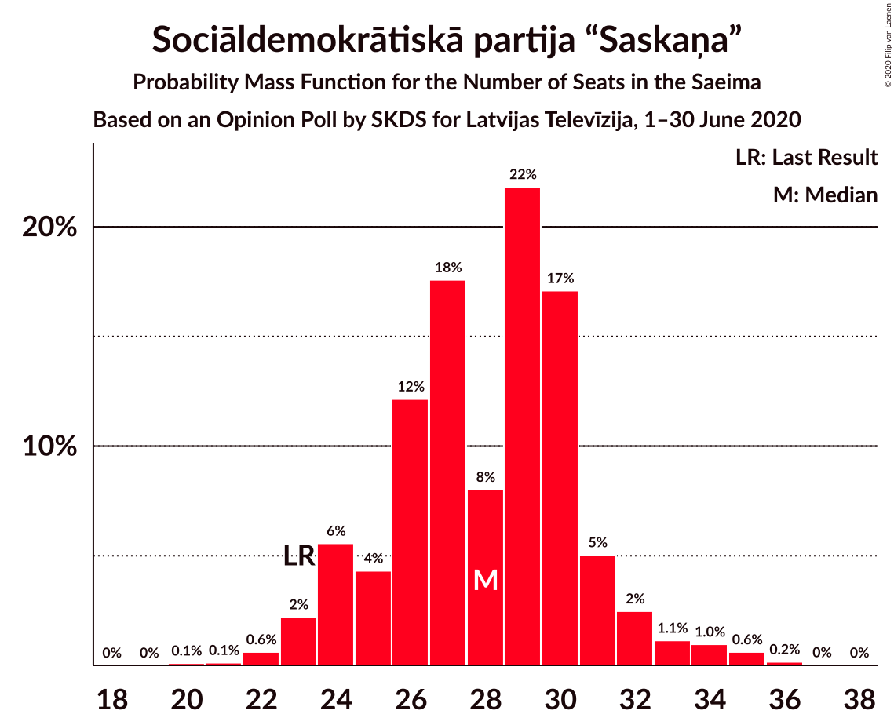
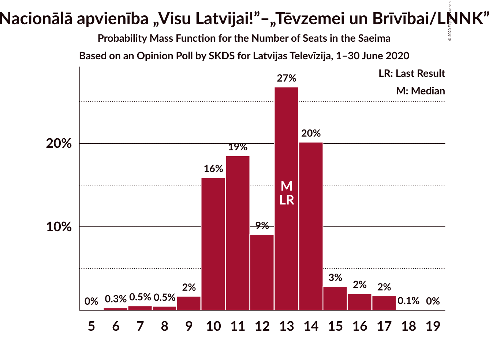
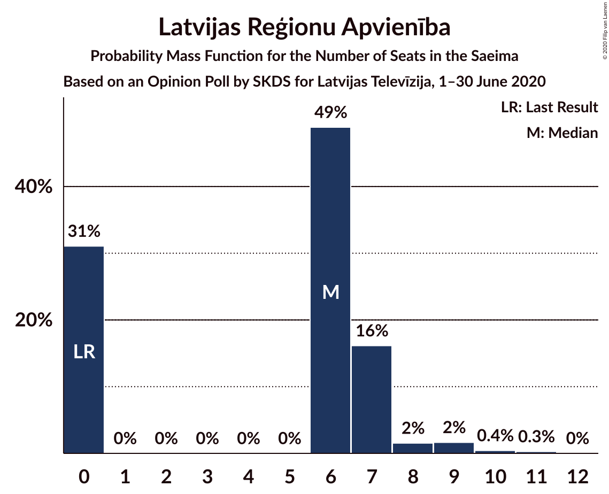
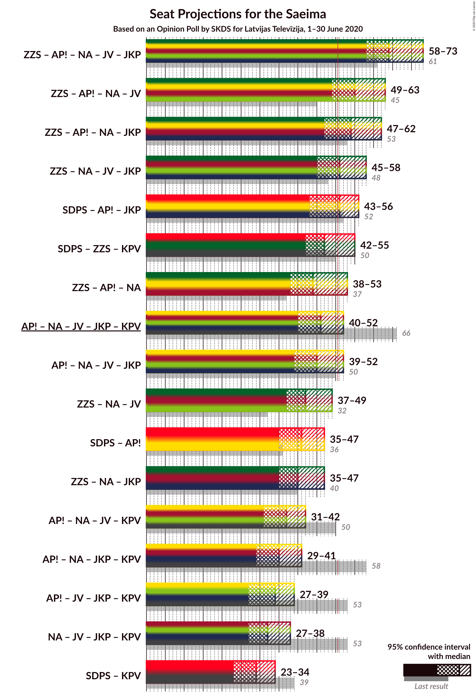
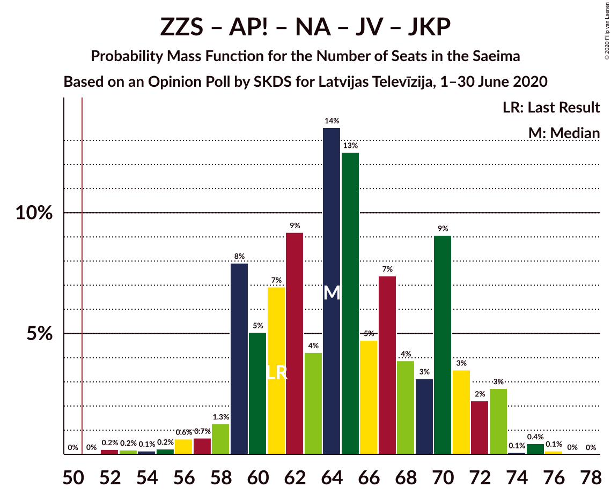
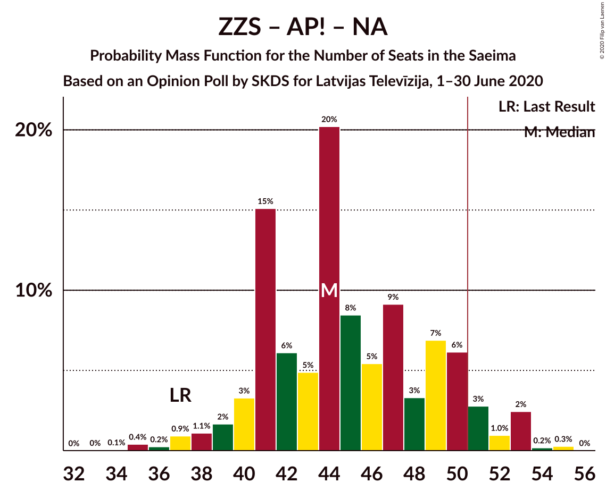
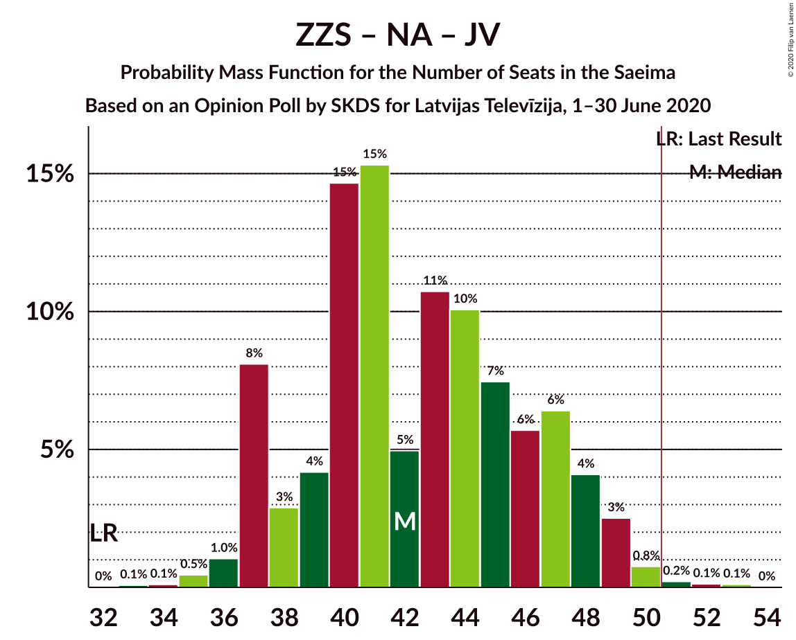
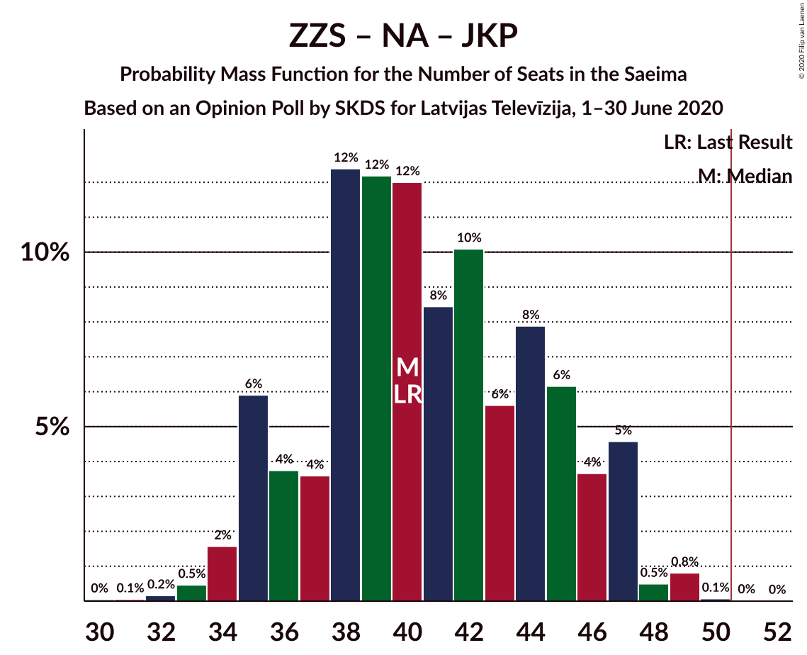
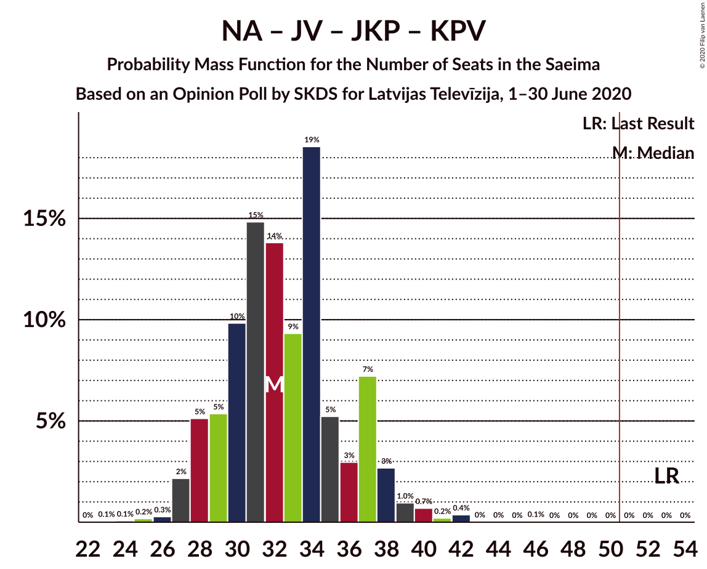

# Opinion Poll by SKDS for Latvijas Televīzija, 1–30 June 2020

<a href="#voting-intentions">Voting Intentions</a> | <a href="#seats">Seats</a> | <a href="#coalitions">Coalitions</a> | <a href="#technical-information">Technical Information</a>

## Voting Intentions

### Confidence Intervals

| Party | Last Result | Poll Result | 80% Confidence Interval | 90% Confidence Interval | 95% Confidence Interval | 99% Confidence Interval |
|:-----:|:-----------:|:-----------:|:-----------------------:|:-----------------------:|:-----------------------:|:-----------------------:|
| Sociāldemokrātiskā partija “Saskaņa” | 19.8% | 25.0% | 22.5–27.7% |21.8–28.5% |21.3–29.2% |20.1–30.5% |
| Zaļo un Zemnieku savienība | 9.9% | 17.2% | 15.1–19.6% |14.5–20.3% |14.0–20.9% |13.0–22.1% |
| Attīstībai/Par! | 12.0% | 11.3% | 9.6–13.4% |9.1–14.0% |8.7–14.5% |8.0–15.6% |
| Nacionālā apvienība „Visu Latvijai!”–„Tēvzemei un Brīvībai/LNNK” | 11.0% | 10.9% | 9.2–12.9% |8.7–13.5% |8.3–14.1% |7.6–15.1% |
| Jaunā VIENOTĪBA | 6.7% | 9.8% | 8.2–11.8% |7.8–12.3% |7.4–12.8% |6.7–13.9% |
| Jaunā konservatīvā partija | 13.6% | 8.0% | 6.6–9.9% |6.2–10.4% |5.9–10.9% |5.3–11.9% |
| Latvijas Reģionu Apvienība | 4.1% | 5.4% | 4.3–7.0% |4.0–7.5% |3.7–7.9% |3.2–8.7% |
| Latvijas Krievu savienība | 3.2% | 4.3% | 3.4–5.8% |3.1–6.2% |2.8–6.6% |2.4–7.4% |
| Politiskā partija „KPV LV” | 14.2% | 3.5% | 2.6–4.8% |2.4–5.2% |2.1–5.6% |1.8–6.3% |
| PROGRESĪVIE | 2.6% | 3.3% | 2.4–4.6% |2.2–5.0% |2.0–5.3% |1.6–6.0% |

*Note:* The poll result column reflects the actual value used in the calculations. Published results may vary slightly, and in addition be rounded to fewer digits.

## Seats

### Confidence Intervals

| Party | Last Result | Median | 80% Confidence Interval | 90% Confidence Interval | 95% Confidence Interval | 99% Confidence Interval |
|:-----:|:-----------:|:------:|:-----------------------:|:-----------------------:|:-----------------------:|:-----------------------:|
| <a href="#sociāldemokrātiskā-partija-“saskaņa”">Sociāldemokrātiskā partija “Saskaņa”</a> | 23 | 29 | 25–31 |25–33 |24–34 |22–34 |
| <a href="#zaļo-un-zemnieku-savienība">Zaļo un Zemnieku savienība</a> | 11 | 17 | 17–22 |16–24 |16–25 |15–25 |
| <a href="#attīstībai/par!">Attīstībai/Par!</a> | 13 | 14 | 10–15 |10–16 |9–16 |7–19 |
| <a href="#nacionālā-apvienība-„visu-latvijai!”–„tēvzemei-un-brīvībai/lnnk”">Nacionālā apvienība „Visu Latvijai!”–„Tēvzemei un Brīvībai/LNNK”</a> | 13 | 11 | 10–15 |10–16 |9–16 |7–17 |
| <a href="#jaunā-vienotība">Jaunā VIENOTĪBA</a> | 8 | 10 | 10–12 |9–13 |8–14 |7–16 |
| <a href="#jaunā-konservatīvā-partija">Jaunā konservatīvā partija</a> | 16 | 8 | 7–10 |7–11 |7–13 |6–13 |
| <a href="#latvijas-reģionu-apvienība">Latvijas Reģionu Apvienība</a> | 0 | 6 | 0–7 |0–7 |0–8 |0–11 |
| <a href="#latvijas-krievu-savienība">Latvijas Krievu savienība</a> | 0 | 6 | 0–6 |0–7 |0–7 |0–9 |
| <a href="#politiskā-partija-„kpv-lv”">Politiskā partija „KPV LV”</a> | 16 | 0 | 0 |0–5 |0–6 |0–6 |
| <a href="#progresīvie">PROGRESĪVIE</a> | 0 | 0 | 0 |0–5 |0–6 |0–7 |

### Sociāldemokrātiskā partija “Saskaņa”

*For a full overview of the results for this party, see the [Sociāldemokrātiskā partija “Saskaņa”](party-sociāldemokrātiskāpartija“saskaņa”.html) page.*

| Number of Seats | Probability | Accumulated | Special Marks |
|:---------------:|:-----------:|:-----------:|:-------------:|
| 20 | 0.1% | 100% |  |
| 21 | 0% | 99.9% |  |
| 22 | 0.4% | 99.8% |  |
| 23 | 0.6% | 99.4% | Last Result |
| 24 | 2% | 98.8% |  |
| 25 | 7% | 97% |  |
| 26 | 13% | 90% |  |
| 27 | 9% | 76% |  |
| 28 | 11% | 67% |  |
| 29 | 39% | 56% | Median |
| 30 | 5% | 17% |  |
| 31 | 5% | 12% |  |
| 32 | 1.0% | 7% |  |
| 33 | 4% | 6% |  |
| 34 | 3% | 3% |  |
| 35 | 0.1% | 0.2% |  |
| 36 | 0% | 0.1% |  |
| 37 | 0% | 0% |  |

### Zaļo un Zemnieku savienība

*For a full overview of the results for this party, see the [Zaļo un Zemnieku savienība](party-zaļounzemniekusavienība.html) page.*

| Number of Seats | Probability | Accumulated | Special Marks |
|:---------------:|:-----------:|:-----------:|:-------------:|
| 11 | 0% | 100% | Last Result |
| 12 | 0.1% | 100% |  |
| 13 | 0.1% | 99.9% |  |
| 14 | 0.2% | 99.9% |  |
| 15 | 1.4% | 99.7% |  |
| 16 | 5% | 98% |  |
| 17 | 45% | 93% | Median |
| 18 | 5% | 48% |  |
| 19 | 3% | 43% |  |
| 20 | 8% | 40% |  |
| 21 | 21% | 32% |  |
| 22 | 2% | 12% |  |
| 23 | 0.8% | 9% |  |
| 24 | 4% | 9% |  |
| 25 | 4% | 5% |  |
| 26 | 0.1% | 0.1% |  |
| 27 | 0.1% | 0.1% |  |
| 28 | 0% | 0% |  |

### Attīstībai/Par!

*For a full overview of the results for this party, see the [Attīstībai/Par!](party-attīstībaipar.html) page.*

| Number of Seats | Probability | Accumulated | Special Marks |
|:---------------:|:-----------:|:-----------:|:-------------:|
| 7 | 0.7% | 100% |  |
| 8 | 0.3% | 99.3% |  |
| 9 | 4% | 99.0% |  |
| 10 | 10% | 95% |  |
| 11 | 3% | 85% |  |
| 12 | 1.2% | 82% |  |
| 13 | 5% | 80% | Last Result |
| 14 | 58% | 76% | Median |
| 15 | 12% | 18% |  |
| 16 | 4% | 6% |  |
| 17 | 0.4% | 1.1% |  |
| 18 | 0% | 0.8% |  |
| 19 | 0.7% | 0.7% |  |
| 20 | 0% | 0% |  |

### Nacionālā apvienība „Visu Latvijai!”–„Tēvzemei un Brīvībai/LNNK”

*For a full overview of the results for this party, see the [Nacionālā apvienība „Visu Latvijai!”–„Tēvzemei un Brīvībai/LNNK”](party-nacionālāapvienība„visulatvijai”–„tēvzemeiunbrīvībailnnk”.html) page.*

| Number of Seats | Probability | Accumulated | Special Marks |
|:---------------:|:-----------:|:-----------:|:-------------:|
| 6 | 0.4% | 100% |  |
| 7 | 0.1% | 99.6% |  |
| 8 | 0.8% | 99.4% |  |
| 9 | 3% | 98.7% |  |
| 10 | 40% | 96% |  |
| 11 | 23% | 56% | Median |
| 12 | 8% | 33% |  |
| 13 | 5% | 25% | Last Result |
| 14 | 8% | 20% |  |
| 15 | 3% | 12% |  |
| 16 | 8% | 9% |  |
| 17 | 0.9% | 1.2% |  |
| 18 | 0.3% | 0.4% |  |
| 19 | 0% | 0% |  |

### Jaunā VIENOTĪBA

*For a full overview of the results for this party, see the [Jaunā VIENOTĪBA](party-jaunāvienotība.html) page.*

| Number of Seats | Probability | Accumulated | Special Marks |
|:---------------:|:-----------:|:-----------:|:-------------:|
| 7 | 1.0% | 100% |  |
| 8 | 2% | 99.0% | Last Result |
| 9 | 3% | 97% |  |
| 10 | 48% | 94% | Median |
| 11 | 24% | 46% |  |
| 12 | 14% | 21% |  |
| 13 | 5% | 8% |  |
| 14 | 1.2% | 3% |  |
| 15 | 1.0% | 2% |  |
| 16 | 0.3% | 0.5% |  |
| 17 | 0.2% | 0.2% |  |
| 18 | 0.1% | 0.1% |  |
| 19 | 0% | 0% |  |

### Jaunā konservatīvā partija

*For a full overview of the results for this party, see the [Jaunā konservatīvā partija](party-jaunākonservatīvāpartija.html) page.*

| Number of Seats | Probability | Accumulated | Special Marks |
|:---------------:|:-----------:|:-----------:|:-------------:|
| 0 | 0.3% | 100% |  |
| 1 | 0% | 99.7% |  |
| 2 | 0% | 99.7% |  |
| 3 | 0% | 99.7% |  |
| 4 | 0% | 99.7% |  |
| 5 | 0% | 99.7% |  |
| 6 | 1.4% | 99.7% |  |
| 7 | 9% | 98% |  |
| 8 | 41% | 89% | Median |
| 9 | 35% | 49% |  |
| 10 | 6% | 14% |  |
| 11 | 2% | 7% |  |
| 12 | 1.4% | 5% |  |
| 13 | 3% | 3% |  |
| 14 | 0.1% | 0.1% |  |
| 15 | 0% | 0% |  |
| 16 | 0% | 0% | Last Result |

### Latvijas Reģionu Apvienība

*For a full overview of the results for this party, see the [Latvijas Reģionu Apvienība](party-latvijasreģionuapvienība.html) page.*

| Number of Seats | Probability | Accumulated | Special Marks |
|:---------------:|:-----------:|:-----------:|:-------------:|
| 0 | 28% | 100% | Last Result |
| 1 | 0% | 72% |  |
| 2 | 0% | 72% |  |
| 3 | 0% | 72% |  |
| 4 | 0% | 72% |  |
| 5 | 0% | 72% |  |
| 6 | 51% | 72% | Median |
| 7 | 17% | 20% |  |
| 8 | 1.2% | 4% |  |
| 9 | 0.3% | 2% |  |
| 10 | 1.4% | 2% |  |
| 11 | 0.5% | 0.6% |  |
| 12 | 0% | 0.1% |  |
| 13 | 0% | 0% |  |

### Latvijas Krievu savienība

*For a full overview of the results for this party, see the [Latvijas Krievu savienība](party-latvijaskrievusavienība.html) page.*

| Number of Seats | Probability | Accumulated | Special Marks |
|:---------------:|:-----------:|:-----------:|:-------------:|
| 0 | 47% | 100% | Last Result |
| 1 | 0% | 53% |  |
| 2 | 0% | 53% |  |
| 3 | 0% | 53% |  |
| 4 | 0% | 53% |  |
| 5 | 2% | 53% |  |
| 6 | 43% | 51% | Median |
| 7 | 6% | 8% |  |
| 8 | 2% | 2% |  |
| 9 | 0.5% | 0.6% |  |
| 10 | 0% | 0% |  |

### Politiskā partija „KPV LV”

*For a full overview of the results for this party, see the [Politiskā partija „KPV LV”](party-politiskāpartija„kpvlv”.html) page.*

| Number of Seats | Probability | Accumulated | Special Marks |
|:---------------:|:-----------:|:-----------:|:-------------:|
| 0 | 94% | 100% | Median |
| 1 | 0% | 6% |  |
| 2 | 0% | 6% |  |
| 3 | 0% | 6% |  |
| 4 | 0% | 6% |  |
| 5 | 2% | 6% |  |
| 6 | 4% | 5% |  |
| 7 | 0.3% | 0.3% |  |
| 8 | 0% | 0% |  |
| 9 | 0% | 0% |  |
| 10 | 0% | 0% |  |
| 11 | 0% | 0% |  |
| 12 | 0% | 0% |  |
| 13 | 0% | 0% |  |
| 14 | 0% | 0% |  |
| 15 | 0% | 0% |  |
| 16 | 0% | 0% | Last Result |

### PROGRESĪVIE

*For a full overview of the results for this party, see the [PROGRESĪVIE](party-progresīvie.html) page.*

| Number of Seats | Probability | Accumulated | Special Marks |
|:---------------:|:-----------:|:-----------:|:-------------:|
| 0 | 94% | 100% | Last Result, Median |
| 1 | 0% | 6% |  |
| 2 | 0% | 6% |  |
| 3 | 0% | 6% |  |
| 4 | 0% | 6% |  |
| 5 | 2% | 6% |  |
| 6 | 2% | 4% |  |
| 7 | 2% | 2% |  |
| 8 | 0% | 0% |  |

## Coalitions

### Confidence Intervals

| Coalition | Last Result | Median | Majority? | 80% Confidence Interval | 90% Confidence Interval | 95% Confidence Interval | 99% Confidence Interval |
|:---------:|:-----------:|:------:|:---------:|:-----------------------:|:-----------------------:|:-----------------------:|:-----------------------:|
| Zaļo un Zemnieku savienība – Attīstībai/Par! – Nacionālā apvienība „Visu Latvijai!”–„Tēvzemei un Brīvībai/LNNK” – Jaunā VIENOTĪBA – Jaunā konservatīvā partija | 61 | 61 | 100% | 59–70 | 59–72 | 58–72 | 55–73 |
| Zaļo un Zemnieku savienība – Attīstībai/Par! – Nacionālā apvienība „Visu Latvijai!”–„Tēvzemei un Brīvībai/LNNK” – Jaunā VIENOTĪBA | 45 | 52 | 93% | 51–62 | 50–63 | 50–63 | 47–64 |
| Zaļo un Zemnieku savienība – Attīstībai/Par! – Nacionālā apvienība „Visu Latvijai!”–„Tēvzemei un Brīvībai/LNNK” – Jaunā konservatīvā partija | 53 | 51 | 51% | 49–59 | 48–60 | 48–60 | 46–62 |
| Zaļo un Zemnieku savienība – Nacionālā apvienība „Visu Latvijai!”–„Tēvzemei un Brīvībai/LNNK” – Jaunā VIENOTĪBA – Jaunā konservatīvā partija | 48 | 49 | 40% | 45–58 | 45–58 | 45–58 | 43–60 |
| Sociāldemokrātiskā partija “Saskaņa” – Attīstībai/Par! – Jaunā konservatīvā partija | 52 | 51 | 58% | 47–53 | 45–56 | 43–58 | 41–59 |
| Sociāldemokrātiskā partija “Saskaņa” – Zaļo un Zemnieku savienība – Politiskā partija „KPV LV” | 50 | 46 | 15% | 44–51 | 43–55 | 43–58 | 41–58 |
| Attīstībai/Par! – Nacionālā apvienība „Visu Latvijai!”–„Tēvzemei un Brīvībai/LNNK” – Jaunā VIENOTĪBA – Jaunā konservatīvā partija – Politiskā partija „KPV LV” | 66 | 43 | 12% | 42–51 | 42–51 | 40–52 | 38–55 |
| Attīstībai/Par! – Nacionālā apvienība „Visu Latvijai!”–„Tēvzemei un Brīvībai/LNNK” – Jaunā VIENOTĪBA – Jaunā konservatīvā partija | 50 | 43 | 10% | 42–50 | 41–51 | 40–51 | 37–54 |
| Zaļo un Zemnieku savienība – Attīstībai/Par! – Nacionālā apvienība „Visu Latvijai!”–„Tēvzemei un Brīvībai/LNNK” | 37 | 41 | 10% | 41–51 | 40–51 | 38–51 | 37–53 |
| Zaļo un Zemnieku savienība – Nacionālā apvienība „Visu Latvijai!”–„Tēvzemei un Brīvībai/LNNK” – Jaunā VIENOTĪBA | 32 | 40 | 0.4% | 37–49 | 37–49 | 37–50 | 36–50 |
| Sociāldemokrātiskā partija “Saskaņa” – Attīstībai/Par! | 36 | 43 | 0.1% | 38–44 | 36–45 | 35–48 | 33–50 |
| Zaļo un Zemnieku savienība – Nacionālā apvienība „Visu Latvijai!”–„Tēvzemei un Brīvībai/LNNK” – Jaunā konservatīvā partija | 40 | 38 | 0% | 35–46 | 35–46 | 35–47 | 32–49 |
| Attīstībai/Par! – Nacionālā apvienība „Visu Latvijai!”–„Tēvzemei un Brīvībai/LNNK” – Jaunā VIENOTĪBA – Politiskā partija „KPV LV” | 50 | 35 | 0% | 34–42 | 32–42 | 31–42 | 29–45 |
| Attīstībai/Par! – Nacionālā apvienība „Visu Latvijai!”–„Tēvzemei un Brīvībai/LNNK” – Jaunā konservatīvā partija – Politiskā partija „KPV LV” | 58 | 33 | 0% | 31–39 | 30–39 | 29–41 | 28–43 |
| Attīstībai/Par! – Jaunā VIENOTĪBA – Jaunā konservatīvā partija – Politiskā partija „KPV LV” | 53 | 32 | 0% | 30–36 | 29–38 | 28–39 | 25–42 |
| Nacionālā apvienība „Visu Latvijai!”–„Tēvzemei un Brīvībai/LNNK” – Jaunā VIENOTĪBA – Jaunā konservatīvā partija – Politiskā partija „KPV LV” | 53 | 31 | 0% | 28–37 | 28–37 | 28–39 | 27–42 |
| Sociāldemokrātiskā partija “Saskaņa” – Politiskā partija „KPV LV” | 39 | 29 | 0% | 26–31 | 25–33 | 24–34 | 23–36 |

### Zaļo un Zemnieku savienība – Attīstībai/Par! – Nacionālā apvienība „Visu Latvijai!”–„Tēvzemei un Brīvībai/LNNK” – Jaunā VIENOTĪBA – Jaunā konservatīvā partija

| Number of Seats | Probability | Accumulated | Special Marks |
|:---------------:|:-----------:|:-----------:|:-------------:|
| 53 | 0.1% | 100% |  |
| 54 | 0.2% | 99.9% |  |
| 55 | 0.3% | 99.7% |  |
| 56 | 0.2% | 99.5% |  |
| 57 | 1.0% | 99.3% |  |
| 58 | 2% | 98% |  |
| 59 | 37% | 97% |  |
| 60 | 8% | 59% | Median |
| 61 | 3% | 52% | Last Result |
| 62 | 2% | 49% |  |
| 63 | 5% | 47% |  |
| 64 | 2% | 42% |  |
| 65 | 4% | 40% |  |
| 66 | 5% | 36% |  |
| 67 | 14% | 31% |  |
| 68 | 2% | 17% |  |
| 69 | 4% | 16% |  |
| 70 | 2% | 11% |  |
| 71 | 0.7% | 9% |  |
| 72 | 7% | 9% |  |
| 73 | 1.4% | 2% |  |
| 74 | 0% | 0.4% |  |
| 75 | 0.3% | 0.3% |  |
| 76 | 0% | 0% |  |

### Zaļo un Zemnieku savienība – Attīstībai/Par! – Nacionālā apvienība „Visu Latvijai!”–„Tēvzemei un Brīvībai/LNNK” – Jaunā VIENOTĪBA

| Number of Seats | Probability | Accumulated | Special Marks |
|:---------------:|:-----------:|:-----------:|:-------------:|
| 44 | 0% | 100% |  |
| 45 | 0.1% | 99.9% | Last Result |
| 46 | 0.4% | 99.9% |  |
| 47 | 0.2% | 99.5% |  |
| 48 | 0.2% | 99.3% |  |
| 49 | 0.5% | 99.2% |  |
| 50 | 6% | 98.6% |  |
| 51 | 42% | 93% | Majority |
| 52 | 4% | 51% | Median |
| 53 | 2% | 47% |  |
| 54 | 4% | 45% |  |
| 55 | 3% | 41% |  |
| 56 | 3% | 39% |  |
| 57 | 4% | 35% |  |
| 58 | 12% | 31% |  |
| 59 | 0.7% | 19% |  |
| 60 | 8% | 19% |  |
| 61 | 0.3% | 11% |  |
| 62 | 2% | 11% |  |
| 63 | 7% | 9% |  |
| 64 | 1.3% | 2% |  |
| 65 | 0.1% | 0.3% |  |
| 66 | 0% | 0.2% |  |
| 67 | 0.2% | 0.2% |  |
| 68 | 0% | 0% |  |

### Zaļo un Zemnieku savienība – Attīstībai/Par! – Nacionālā apvienība „Visu Latvijai!”–„Tēvzemei un Brīvībai/LNNK” – Jaunā konservatīvā partija

| Number of Seats | Probability | Accumulated | Special Marks |
|:---------------:|:-----------:|:-----------:|:-------------:|
| 42 | 0.1% | 100% |  |
| 43 | 0.1% | 99.9% |  |
| 44 | 0.1% | 99.8% |  |
| 45 | 0.2% | 99.8% |  |
| 46 | 0.6% | 99.6% |  |
| 47 | 0.6% | 99.0% |  |
| 48 | 5% | 98% |  |
| 49 | 38% | 94% |  |
| 50 | 4% | 56% | Median |
| 51 | 5% | 51% | Majority |
| 52 | 3% | 46% |  |
| 53 | 4% | 44% | Last Result |
| 54 | 8% | 40% |  |
| 55 | 2% | 32% |  |
| 56 | 12% | 30% |  |
| 57 | 3% | 17% |  |
| 58 | 1.3% | 14% |  |
| 59 | 4% | 13% |  |
| 60 | 8% | 9% |  |
| 61 | 0.2% | 2% |  |
| 62 | 1.4% | 1.5% |  |
| 63 | 0% | 0.1% |  |
| 64 | 0% | 0.1% |  |
| 65 | 0% | 0% |  |

### Zaļo un Zemnieku savienība – Nacionālā apvienība „Visu Latvijai!”–„Tēvzemei un Brīvībai/LNNK” – Jaunā VIENOTĪBA – Jaunā konservatīvā partija

| Number of Seats | Probability | Accumulated | Special Marks |
|:---------------:|:-----------:|:-----------:|:-------------:|
| 39 | 0% | 100% |  |
| 40 | 0% | 99.9% |  |
| 41 | 0.1% | 99.9% |  |
| 42 | 0% | 99.8% |  |
| 43 | 0.4% | 99.8% |  |
| 44 | 0.3% | 99.4% |  |
| 45 | 36% | 99.1% |  |
| 46 | 4% | 63% | Median |
| 47 | 2% | 59% |  |
| 48 | 3% | 57% | Last Result |
| 49 | 7% | 54% |  |
| 50 | 7% | 47% |  |
| 51 | 2% | 40% | Majority |
| 52 | 13% | 39% |  |
| 53 | 3% | 25% |  |
| 54 | 2% | 22% |  |
| 55 | 0.9% | 20% |  |
| 56 | 5% | 19% |  |
| 57 | 3% | 14% |  |
| 58 | 8% | 10% |  |
| 59 | 0.3% | 2% |  |
| 60 | 1.4% | 2% |  |
| 61 | 0.2% | 0.4% |  |
| 62 | 0% | 0.3% |  |
| 63 | 0.2% | 0.3% |  |
| 64 | 0% | 0% |  |

### Sociāldemokrātiskā partija “Saskaņa” – Attīstībai/Par! – Jaunā konservatīvā partija

| Number of Seats | Probability | Accumulated | Special Marks |
|:---------------:|:-----------:|:-----------:|:-------------:|
| 38 | 0.1% | 100% |  |
| 39 | 0.1% | 99.9% |  |
| 40 | 0.3% | 99.9% |  |
| 41 | 0.3% | 99.6% |  |
| 42 | 0.8% | 99.3% |  |
| 43 | 2% | 98.5% |  |
| 44 | 0.8% | 96% |  |
| 45 | 2% | 95% |  |
| 46 | 2% | 94% |  |
| 47 | 5% | 92% |  |
| 48 | 4% | 87% |  |
| 49 | 4% | 83% |  |
| 50 | 21% | 79% |  |
| 51 | 46% | 58% | Median, Majority |
| 52 | 1.2% | 12% | Last Result |
| 53 | 2% | 11% |  |
| 54 | 4% | 9% |  |
| 55 | 0.7% | 6% |  |
| 56 | 0.2% | 5% |  |
| 57 | 2% | 5% |  |
| 58 | 1.1% | 3% |  |
| 59 | 2% | 2% |  |
| 60 | 0% | 0% |  |

### Sociāldemokrātiskā partija “Saskaņa” – Zaļo un Zemnieku savienība – Politiskā partija „KPV LV”

| Number of Seats | Probability | Accumulated | Special Marks |
|:---------------:|:-----------:|:-----------:|:-------------:|
| 39 | 0.1% | 100% |  |
| 40 | 0.2% | 99.9% |  |
| 41 | 0.3% | 99.7% |  |
| 42 | 2% | 99.4% |  |
| 43 | 5% | 98% |  |
| 44 | 3% | 93% |  |
| 45 | 3% | 89% |  |
| 46 | 39% | 87% | Median |
| 47 | 12% | 47% |  |
| 48 | 4% | 35% |  |
| 49 | 12% | 31% |  |
| 50 | 4% | 19% | Last Result |
| 51 | 6% | 15% | Majority |
| 52 | 1.0% | 9% |  |
| 53 | 0.7% | 8% |  |
| 54 | 1.2% | 7% |  |
| 55 | 3% | 6% |  |
| 56 | 0.2% | 3% |  |
| 57 | 0% | 3% |  |
| 58 | 3% | 3% |  |
| 59 | 0.1% | 0.1% |  |
| 60 | 0% | 0% |  |

### Attīstībai/Par! – Nacionālā apvienība „Visu Latvijai!”–„Tēvzemei un Brīvībai/LNNK” – Jaunā VIENOTĪBA – Jaunā konservatīvā partija – Politiskā partija „KPV LV”

| Number of Seats | Probability | Accumulated | Special Marks |
|:---------------:|:-----------:|:-----------:|:-------------:|
| 34 | 0.1% | 100% |  |
| 35 | 0.1% | 99.9% |  |
| 36 | 0.2% | 99.8% |  |
| 37 | 0% | 99.7% |  |
| 38 | 0.3% | 99.7% |  |
| 39 | 0.7% | 99.4% |  |
| 40 | 2% | 98.7% |  |
| 41 | 2% | 97% |  |
| 42 | 42% | 95% |  |
| 43 | 4% | 54% | Median |
| 44 | 7% | 50% |  |
| 45 | 8% | 43% |  |
| 46 | 12% | 35% |  |
| 47 | 4% | 23% |  |
| 48 | 2% | 19% |  |
| 49 | 3% | 17% |  |
| 50 | 3% | 14% |  |
| 51 | 9% | 12% | Majority |
| 52 | 1.3% | 3% |  |
| 53 | 0.4% | 2% |  |
| 54 | 0.8% | 1.3% |  |
| 55 | 0.2% | 0.5% |  |
| 56 | 0.2% | 0.3% |  |
| 57 | 0% | 0.1% |  |
| 58 | 0.1% | 0.1% |  |
| 59 | 0% | 0% |  |
| 60 | 0% | 0% |  |
| 61 | 0% | 0% |  |
| 62 | 0% | 0% |  |
| 63 | 0% | 0% |  |
| 64 | 0% | 0% |  |
| 65 | 0% | 0% |  |
| 66 | 0% | 0% | Last Result |

### Attīstībai/Par! – Nacionālā apvienība „Visu Latvijai!”–„Tēvzemei un Brīvībai/LNNK” – Jaunā VIENOTĪBA – Jaunā konservatīvā partija

| Number of Seats | Probability | Accumulated | Special Marks |
|:---------------:|:-----------:|:-----------:|:-------------:|
| 34 | 0.1% | 100% |  |
| 35 | 0.1% | 99.9% |  |
| 36 | 0.2% | 99.8% |  |
| 37 | 0.1% | 99.6% |  |
| 38 | 0.4% | 99.5% |  |
| 39 | 0.9% | 99.0% |  |
| 40 | 2% | 98% |  |
| 41 | 3% | 96% |  |
| 42 | 42% | 93% |  |
| 43 | 4% | 51% | Median |
| 44 | 7% | 46% |  |
| 45 | 8% | 39% |  |
| 46 | 13% | 31% |  |
| 47 | 2% | 18% |  |
| 48 | 0.9% | 16% |  |
| 49 | 3% | 15% |  |
| 50 | 2% | 12% | Last Result |
| 51 | 8% | 10% | Majority |
| 52 | 0.3% | 2% |  |
| 53 | 0.3% | 1.2% |  |
| 54 | 0.7% | 0.9% |  |
| 55 | 0% | 0.2% |  |
| 56 | 0.1% | 0.2% |  |
| 57 | 0% | 0% |  |

### Zaļo un Zemnieku savienība – Attīstībai/Par! – Nacionālā apvienība „Visu Latvijai!”–„Tēvzemei un Brīvībai/LNNK”

| Number of Seats | Probability | Accumulated | Special Marks |
|:---------------:|:-----------:|:-----------:|:-------------:|
| 35 | 0.2% | 100% |  |
| 36 | 0.1% | 99.7% |  |
| 37 | 0.4% | 99.6% | Last Result |
| 38 | 2% | 99.2% |  |
| 39 | 1.2% | 97% |  |
| 40 | 4% | 96% |  |
| 41 | 42% | 92% |  |
| 42 | 4% | 50% | Median |
| 43 | 4% | 45% |  |
| 44 | 3% | 41% |  |
| 45 | 3% | 38% |  |
| 46 | 3% | 35% |  |
| 47 | 15% | 32% |  |
| 48 | 3% | 17% |  |
| 49 | 2% | 14% |  |
| 50 | 1.1% | 11% |  |
| 51 | 8% | 10% | Majority |
| 52 | 1.0% | 2% |  |
| 53 | 1.1% | 1.3% |  |
| 54 | 0.2% | 0.2% |  |
| 55 | 0% | 0% |  |

### Zaļo un Zemnieku savienība – Nacionālā apvienība „Visu Latvijai!”–„Tēvzemei un Brīvībai/LNNK” – Jaunā VIENOTĪBA

| Number of Seats | Probability | Accumulated | Special Marks |
|:---------------:|:-----------:|:-----------:|:-------------:|
| 31 | 0.1% | 100% |  |
| 32 | 0% | 99.9% | Last Result |
| 33 | 0.1% | 99.9% |  |
| 34 | 0.1% | 99.8% |  |
| 35 | 0.1% | 99.8% |  |
| 36 | 0.4% | 99.7% |  |
| 37 | 41% | 99.2% |  |
| 38 | 2% | 59% | Median |
| 39 | 3% | 56% |  |
| 40 | 8% | 53% |  |
| 41 | 5% | 46% |  |
| 42 | 4% | 41% |  |
| 43 | 13% | 37% |  |
| 44 | 1.5% | 23% |  |
| 45 | 2% | 22% |  |
| 46 | 2% | 20% |  |
| 47 | 3% | 18% |  |
| 48 | 1.5% | 15% |  |
| 49 | 9% | 14% |  |
| 50 | 4% | 5% |  |
| 51 | 0% | 0.4% | Majority |
| 52 | 0% | 0.3% |  |
| 53 | 0% | 0.3% |  |
| 54 | 0% | 0.2% |  |
| 55 | 0.2% | 0.2% |  |
| 56 | 0% | 0% |  |

### Sociāldemokrātiskā partija “Saskaņa” – Attīstībai/Par!

| Number of Seats | Probability | Accumulated | Special Marks |
|:---------------:|:-----------:|:-----------:|:-------------:|
| 31 | 0.1% | 100% |  |
| 32 | 0.2% | 99.8% |  |
| 33 | 0.5% | 99.6% |  |
| 34 | 1.2% | 99.1% |  |
| 35 | 3% | 98% |  |
| 36 | 1.0% | 95% | Last Result |
| 37 | 2% | 94% |  |
| 38 | 7% | 92% |  |
| 39 | 3% | 85% |  |
| 40 | 5% | 82% |  |
| 41 | 16% | 77% |  |
| 42 | 9% | 61% |  |
| 43 | 40% | 52% | Median |
| 44 | 4% | 12% |  |
| 45 | 3% | 8% |  |
| 46 | 0.8% | 5% |  |
| 47 | 0.4% | 4% |  |
| 48 | 1.2% | 4% |  |
| 49 | 0.1% | 2% |  |
| 50 | 2% | 2% |  |
| 51 | 0% | 0.1% | Majority |
| 52 | 0% | 0% |  |

### Zaļo un Zemnieku savienība – Nacionālā apvienība „Visu Latvijai!”–„Tēvzemei un Brīvībai/LNNK” – Jaunā konservatīvā partija

| Number of Seats | Probability | Accumulated | Special Marks |
|:---------------:|:-----------:|:-----------:|:-------------:|
| 30 | 0% | 100% |  |
| 31 | 0.1% | 99.9% |  |
| 32 | 0.4% | 99.9% |  |
| 33 | 0.2% | 99.5% |  |
| 34 | 0.5% | 99.3% |  |
| 35 | 37% | 98.7% |  |
| 36 | 4% | 62% | Median |
| 37 | 5% | 58% |  |
| 38 | 4% | 54% |  |
| 39 | 7% | 50% |  |
| 40 | 4% | 43% | Last Result |
| 41 | 14% | 39% |  |
| 42 | 4% | 25% |  |
| 43 | 2% | 21% |  |
| 44 | 6% | 19% |  |
| 45 | 1.2% | 13% |  |
| 46 | 8% | 12% |  |
| 47 | 1.4% | 4% |  |
| 48 | 0.7% | 2% |  |
| 49 | 1.4% | 2% |  |
| 50 | 0.3% | 0.4% |  |
| 51 | 0% | 0% | Majority |

### Attīstībai/Par! – Nacionālā apvienība „Visu Latvijai!”–„Tēvzemei un Brīvībai/LNNK” – Jaunā VIENOTĪBA – Politiskā partija „KPV LV”

| Number of Seats | Probability | Accumulated | Special Marks |
|:---------------:|:-----------:|:-----------:|:-------------:|
| 26 | 0.1% | 100% |  |
| 27 | 0% | 99.9% |  |
| 28 | 0.1% | 99.9% |  |
| 29 | 0.5% | 99.8% |  |
| 30 | 2% | 99.3% |  |
| 31 | 0.5% | 98% |  |
| 32 | 4% | 97% |  |
| 33 | 0.7% | 93% |  |
| 34 | 40% | 92% |  |
| 35 | 10% | 52% | Median |
| 36 | 6% | 42% |  |
| 37 | 14% | 36% |  |
| 38 | 3% | 22% |  |
| 39 | 3% | 20% |  |
| 40 | 2% | 17% |  |
| 41 | 2% | 14% |  |
| 42 | 9% | 12% |  |
| 43 | 1.1% | 2% |  |
| 44 | 0.8% | 1.3% |  |
| 45 | 0.1% | 0.5% |  |
| 46 | 0.1% | 0.4% |  |
| 47 | 0.1% | 0.3% |  |
| 48 | 0.2% | 0.2% |  |
| 49 | 0% | 0% |  |
| 50 | 0% | 0% | Last Result |

### Attīstībai/Par! – Nacionālā apvienība „Visu Latvijai!”–„Tēvzemei un Brīvībai/LNNK” – Jaunā konservatīvā partija – Politiskā partija „KPV LV”

| Number of Seats | Probability | Accumulated | Special Marks |
|:---------------:|:-----------:|:-----------:|:-------------:|
| 23 | 0% | 100% |  |
| 24 | 0% | 99.9% |  |
| 25 | 0% | 99.9% |  |
| 26 | 0.1% | 99.9% |  |
| 27 | 0.3% | 99.8% |  |
| 28 | 0.2% | 99.5% |  |
| 29 | 3% | 99.3% |  |
| 30 | 3% | 96% |  |
| 31 | 3% | 93% |  |
| 32 | 39% | 90% |  |
| 33 | 6% | 51% | Median |
| 34 | 8% | 45% |  |
| 35 | 13% | 37% |  |
| 36 | 3% | 24% |  |
| 37 | 4% | 21% |  |
| 38 | 4% | 17% |  |
| 39 | 10% | 13% |  |
| 40 | 0.5% | 3% |  |
| 41 | 2% | 3% |  |
| 42 | 0.2% | 1.3% |  |
| 43 | 0.9% | 1.1% |  |
| 44 | 0% | 0.2% |  |
| 45 | 0.1% | 0.2% |  |
| 46 | 0% | 0.1% |  |
| 47 | 0.1% | 0.1% |  |
| 48 | 0% | 0% |  |
| 49 | 0% | 0% |  |
| 50 | 0% | 0% |  |
| 51 | 0% | 0% | Majority |
| 52 | 0% | 0% |  |
| 53 | 0% | 0% |  |
| 54 | 0% | 0% |  |
| 55 | 0% | 0% |  |
| 56 | 0% | 0% |  |
| 57 | 0% | 0% |  |
| 58 | 0% | 0% | Last Result |

### Attīstībai/Par! – Jaunā VIENOTĪBA – Jaunā konservatīvā partija – Politiskā partija „KPV LV”

| Number of Seats | Probability | Accumulated | Special Marks |
|:---------------:|:-----------:|:-----------:|:-------------:|
| 24 | 0.4% | 100% |  |
| 25 | 0.2% | 99.5% |  |
| 26 | 0.3% | 99.4% |  |
| 27 | 1.4% | 99.1% |  |
| 28 | 0.8% | 98% |  |
| 29 | 2% | 97% |  |
| 30 | 5% | 94% |  |
| 31 | 3% | 89% |  |
| 32 | 38% | 86% | Median |
| 33 | 10% | 48% |  |
| 34 | 7% | 37% |  |
| 35 | 19% | 31% |  |
| 36 | 3% | 12% |  |
| 37 | 3% | 8% |  |
| 38 | 0.7% | 5% |  |
| 39 | 2% | 4% |  |
| 40 | 1.1% | 2% |  |
| 41 | 0.1% | 0.9% |  |
| 42 | 0.5% | 0.8% |  |
| 43 | 0.1% | 0.2% |  |
| 44 | 0% | 0.1% |  |
| 45 | 0% | 0% |  |
| 46 | 0% | 0% |  |
| 47 | 0% | 0% |  |
| 48 | 0% | 0% |  |
| 49 | 0% | 0% |  |
| 50 | 0% | 0% |  |
| 51 | 0% | 0% | Majority |
| 52 | 0% | 0% |  |
| 53 | 0% | 0% | Last Result |

### Nacionālā apvienība „Visu Latvijai!”–„Tēvzemei un Brīvībai/LNNK” – Jaunā VIENOTĪBA – Jaunā konservatīvā partija – Politiskā partija „KPV LV”

| Number of Seats | Probability | Accumulated | Special Marks |
|:---------------:|:-----------:|:-----------:|:-------------:|
| 20 | 0.1% | 100% |  |
| 21 | 0% | 99.9% |  |
| 22 | 0% | 99.9% |  |
| 23 | 0% | 99.9% |  |
| 24 | 0% | 99.9% |  |
| 25 | 0.1% | 99.9% |  |
| 26 | 0.2% | 99.7% |  |
| 27 | 0.7% | 99.5% |  |
| 28 | 37% | 98.9% |  |
| 29 | 4% | 62% | Median |
| 30 | 8% | 58% |  |
| 31 | 15% | 50% |  |
| 32 | 8% | 35% |  |
| 33 | 2% | 27% |  |
| 34 | 4% | 25% |  |
| 35 | 5% | 21% |  |
| 36 | 2% | 16% |  |
| 37 | 11% | 15% |  |
| 38 | 1.4% | 4% |  |
| 39 | 1.1% | 3% |  |
| 40 | 0.4% | 2% |  |
| 41 | 0.2% | 1.4% |  |
| 42 | 1.1% | 1.2% |  |
| 43 | 0% | 0.1% |  |
| 44 | 0% | 0.1% |  |
| 45 | 0% | 0.1% |  |
| 46 | 0.1% | 0.1% |  |
| 47 | 0% | 0% |  |
| 48 | 0% | 0% |  |
| 49 | 0% | 0% |  |
| 50 | 0% | 0% |  |
| 51 | 0% | 0% | Majority |
| 52 | 0% | 0% |  |
| 53 | 0% | 0% | Last Result |

### Sociāldemokrātiskā partija “Saskaņa” – Politiskā partija „KPV LV”

| Number of Seats | Probability | Accumulated | Special Marks |
|:---------------:|:-----------:|:-----------:|:-------------:|
| 20 | 0.1% | 100% |  |
| 21 | 0% | 99.9% |  |
| 22 | 0.3% | 99.9% |  |
| 23 | 0.4% | 99.5% |  |
| 24 | 2% | 99.1% |  |
| 25 | 4% | 97% |  |
| 26 | 13% | 94% |  |
| 27 | 9% | 81% |  |
| 28 | 10% | 72% |  |
| 29 | 39% | 62% | Median |
| 30 | 5% | 22% |  |
| 31 | 8% | 17% |  |
| 32 | 2% | 10% |  |
| 33 | 5% | 8% |  |
| 34 | 3% | 3% |  |
| 35 | 0.2% | 0.7% |  |
| 36 | 0.3% | 0.5% |  |
| 37 | 0.2% | 0.3% |  |
| 38 | 0% | 0.1% |  |
| 39 | 0% | 0% | Last Result |

## Technical Information

### Opinion Poll

+ **Polling firm:** SKDS
+ **Commissioner(s):** Latvijas Televīzija
+ **Fieldwork period:** 1–30 June 2020

### Calculations

+ **Sample size:** 460
+ **Simulations done:** 131,072
+ **Error estimate:** 5.23%

