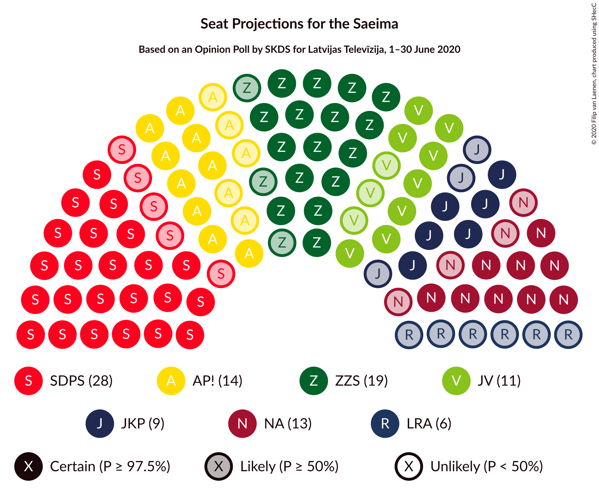
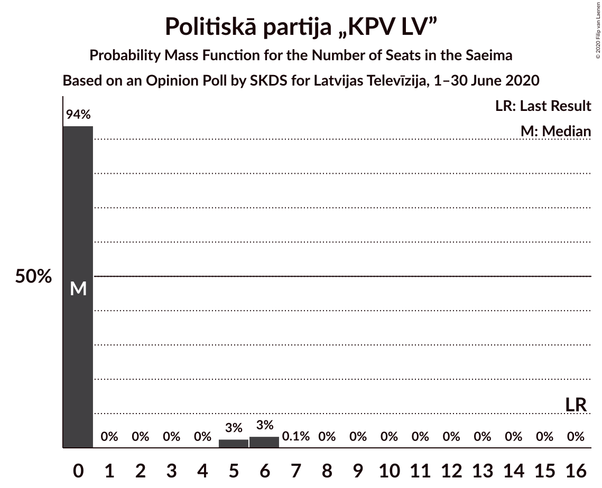
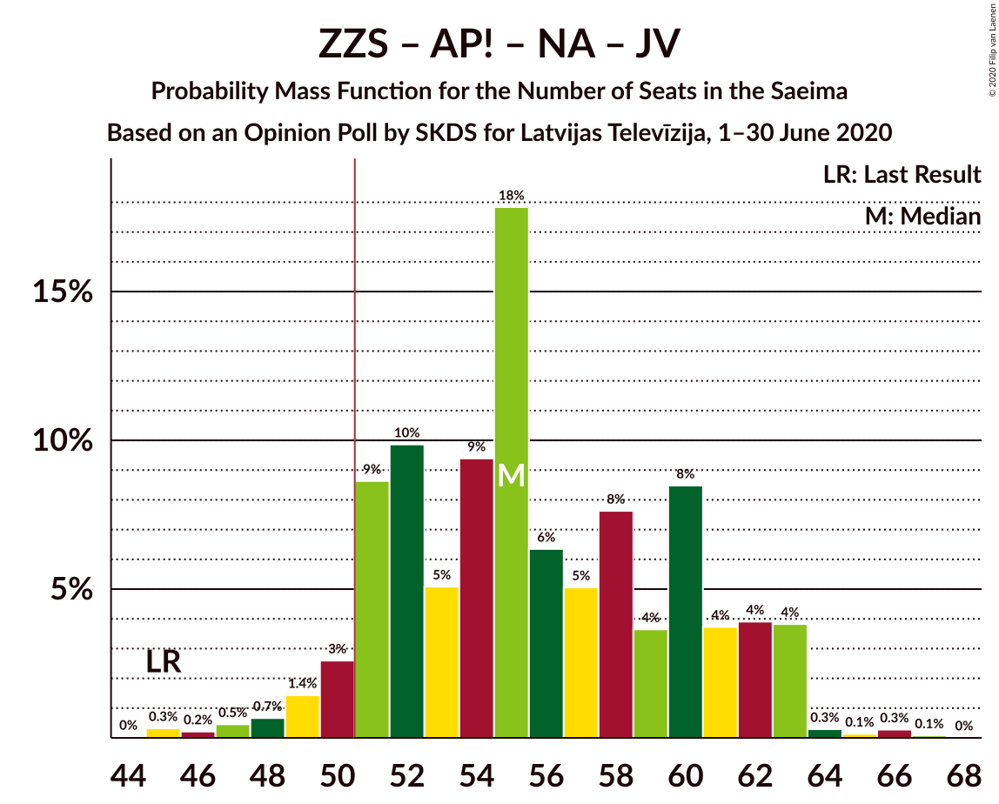
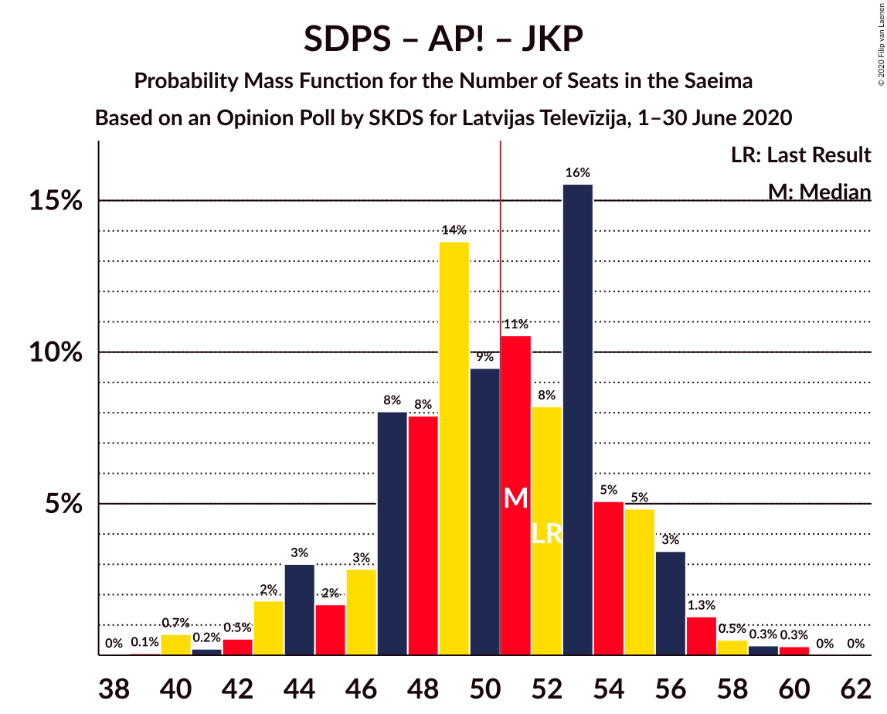
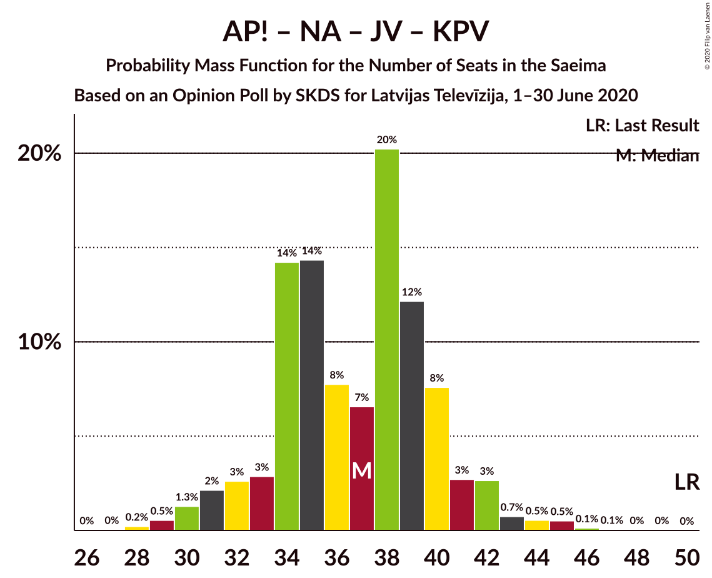
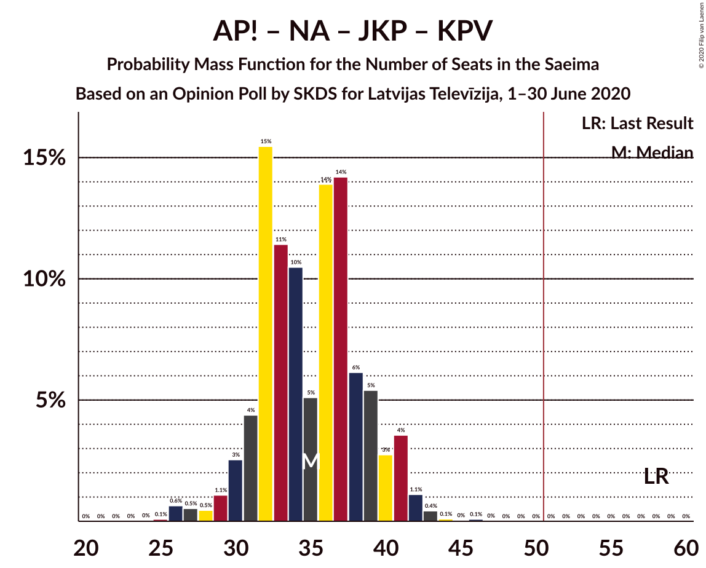

# Opinion Poll by SKDS for Latvijas Televīzija, 1–30 June 2020

<a href="#voting-intentions">Voting Intentions</a> | <a href="#seats">Seats</a> | <a href="#coalitions">Coalitions</a> | <a href="#technical-information">Technical Information</a>

## Voting Intentions

### Confidence Intervals

| Party | Last Result | Poll Result | 80% Confidence Interval | 90% Confidence Interval | 95% Confidence Interval | 99% Confidence Interval |
|:-----:|:-----------:|:-----------:|:-----------------------:|:-----------------------:|:-----------------------:|:-----------------------:|
| Sociāldemokrātiskā partija “Saskaņa” | 19.8% | 25.0% | 22.5–27.7% |21.8–28.5% |21.3–29.2% |20.1–30.5% |
| Zaļo un Zemnieku savienība | 9.9% | 17.2% | 15.1–19.6% |14.5–20.3% |14.0–20.9% |13.0–22.1% |
| Attīstībai/Par! | 12.0% | 11.3% | 9.6–13.4% |9.1–14.0% |8.7–14.5% |8.0–15.6% |
| Nacionālā apvienība „Visu Latvijai!”–„Tēvzemei un Brīvībai/LNNK” | 11.0% | 10.9% | 9.2–12.9% |8.7–13.5% |8.3–14.1% |7.6–15.1% |
| Jaunā VIENOTĪBA | 6.7% | 9.8% | 8.2–11.8% |7.8–12.3% |7.4–12.8% |6.7–13.9% |
| Jaunā konservatīvā partija | 13.6% | 8.0% | 6.6–9.9% |6.2–10.4% |5.9–10.9% |5.3–11.9% |
| Latvijas Reģionu Apvienība | 4.1% | 5.4% | 4.3–7.0% |4.0–7.5% |3.7–7.9% |3.2–8.7% |
| Latvijas Krievu savienība | 3.2% | 4.3% | 3.4–5.8% |3.1–6.2% |2.8–6.6% |2.4–7.4% |
| Politiskā partija „KPV LV” | 14.2% | 3.5% | 2.6–4.8% |2.4–5.2% |2.1–5.6% |1.8–6.3% |
| PROGRESĪVIE | 2.6% | 3.3% | 2.4–4.6% |2.2–5.0% |2.0–5.3% |1.6–6.0% |

*Note:* The poll result column reflects the actual value used in the calculations. Published results may vary slightly, and in addition be rounded to fewer digits.

## Seats

### Confidence Intervals

| Party | Last Result | Median | 80% Confidence Interval | 90% Confidence Interval | 95% Confidence Interval | 99% Confidence Interval |
|:-----:|:-----------:|:------:|:-----------------------:|:-----------------------:|:-----------------------:|:-----------------------:|
| <a href="#sociāldemokrātiskā-partija-“saskaņa”">Sociāldemokrātiskā partija “Saskaņa”</a> | 23 | 28 | 25–31 |24–32 |23–33 |22–35 |
| <a href="#zaļo-un-zemnieku-savienība">Zaļo un Zemnieku savienība</a> | 11 | 19 | 16–22 |16–23 |16–24 |14–27 |
| <a href="#attīstībai/par!">Attīstībai/Par!</a> | 13 | 14 | 9–16 |9–16 |9–16 |8–17 |
| <a href="#nacionālā-apvienība-„visu-latvijai!”–„tēvzemei-un-brīvībai/lnnk”">Nacionālā apvienība „Visu Latvijai!”–„Tēvzemei un Brīvībai/LNNK”</a> | 13 | 13 | 10–14 |10–15 |9–16 |7–17 |
| <a href="#jaunā-vienotība">Jaunā VIENOTĪBA</a> | 8 | 11 | 10–12 |8–13 |8–15 |8–16 |
| <a href="#jaunā-konservatīvā-partija">Jaunā konservatīvā partija</a> | 16 | 9 | 7–12 |7–13 |6–13 |6–13 |
| <a href="#latvijas-reģionu-apvienība">Latvijas Reģionu Apvienība</a> | 0 | 6 | 0–7 |0–7 |0–8 |0–10 |
| <a href="#latvijas-krievu-savienība">Latvijas Krievu savienība</a> | 0 | 0 | 0–7 |0–7 |0–8 |0–8 |
| <a href="#politiskā-partija-„kpv-lv”">Politiskā partija „KPV LV”</a> | 16 | 0 | 0 |0–5 |0–6 |0–6 |
| <a href="#progresīvie">PROGRESĪVIE</a> | 0 | 0 | 0 |0 |0–6 |0–7 |

### Sociāldemokrātiskā partija “Saskaņa”

*For a full overview of the results for this party, see the [Sociāldemokrātiskā partija “Saskaņa”](party-sociāldemokrātiskāpartija“saskaņa”.html) page.*

| Number of Seats | Probability | Accumulated | Special Marks |
|:---------------:|:-----------:|:-----------:|:-------------:|
| 20 | 0.1% | 100% |  |
| 21 | 0.1% | 99.9% |  |
| 22 | 0.6% | 99.8% |  |
| 23 | 2% | 99.2% | Last Result |
| 24 | 6% | 97% |  |
| 25 | 4% | 91% |  |
| 26 | 12% | 87% |  |
| 27 | 18% | 75% |  |
| 28 | 8% | 57% | Median |
| 29 | 22% | 49% |  |
| 30 | 17% | 27% |  |
| 31 | 5% | 10% |  |
| 32 | 2% | 5% |  |
| 33 | 1.1% | 3% |  |
| 34 | 1.0% | 2% |  |
| 35 | 0.6% | 0.8% |  |
| 36 | 0.2% | 0.2% |  |
| 37 | 0% | 0% |  |

### Zaļo un Zemnieku savienība

*For a full overview of the results for this party, see the [Zaļo un Zemnieku savienība](party-zaļounzemniekusavienība.html) page.*

| Number of Seats | Probability | Accumulated | Special Marks |
|:---------------:|:-----------:|:-----------:|:-------------:|
| 11 | 0% | 100% | Last Result |
| 12 | 0.1% | 100% |  |
| 13 | 0.1% | 99.9% |  |
| 14 | 0.6% | 99.8% |  |
| 15 | 2% | 99.2% |  |
| 16 | 9% | 98% |  |
| 17 | 23% | 89% |  |
| 18 | 9% | 66% |  |
| 19 | 8% | 57% | Median |
| 20 | 18% | 49% |  |
| 21 | 10% | 31% |  |
| 22 | 12% | 21% |  |
| 23 | 5% | 9% |  |
| 24 | 2% | 4% |  |
| 25 | 0.6% | 2% |  |
| 26 | 0.2% | 1.0% |  |
| 27 | 0.8% | 0.8% |  |
| 28 | 0% | 0% |  |

### Attīstībai/Par!

*For a full overview of the results for this party, see the [Attīstībai/Par!](party-attīstībaipar.html) page.*

| Number of Seats | Probability | Accumulated | Special Marks |
|:---------------:|:-----------:|:-----------:|:-------------:|
| 7 | 0.2% | 100% |  |
| 8 | 0.4% | 99.8% |  |
| 9 | 11% | 99.4% |  |
| 10 | 6% | 89% |  |
| 11 | 4% | 83% |  |
| 12 | 7% | 79% |  |
| 13 | 5% | 72% | Last Result |
| 14 | 44% | 67% | Median |
| 15 | 13% | 23% |  |
| 16 | 9% | 10% |  |
| 17 | 1.0% | 1.2% |  |
| 18 | 0% | 0.2% |  |
| 19 | 0.1% | 0.1% |  |
| 20 | 0% | 0% |  |

### Nacionālā apvienība „Visu Latvijai!”–„Tēvzemei un Brīvībai/LNNK”

*For a full overview of the results for this party, see the [Nacionālā apvienība „Visu Latvijai!”–„Tēvzemei un Brīvībai/LNNK”](party-nacionālāapvienība„visulatvijai”–„tēvzemeiunbrīvībailnnk”.html) page.*

| Number of Seats | Probability | Accumulated | Special Marks |
|:---------------:|:-----------:|:-----------:|:-------------:|
| 6 | 0.3% | 100% |  |
| 7 | 0.5% | 99.7% |  |
| 8 | 0.5% | 99.2% |  |
| 9 | 2% | 98.7% |  |
| 10 | 16% | 97% |  |
| 11 | 19% | 81% |  |
| 12 | 9% | 63% |  |
| 13 | 27% | 54% | Last Result, Median |
| 14 | 20% | 27% |  |
| 15 | 3% | 7% |  |
| 16 | 2% | 4% |  |
| 17 | 2% | 2% |  |
| 18 | 0.1% | 0.1% |  |
| 19 | 0% | 0% |  |

### Jaunā VIENOTĪBA

*For a full overview of the results for this party, see the [Jaunā VIENOTĪBA](party-jaunāvienotība.html) page.*

| Number of Seats | Probability | Accumulated | Special Marks |
|:---------------:|:-----------:|:-----------:|:-------------:|
| 7 | 0.3% | 100% |  |
| 8 | 5% | 99.7% | Last Result |
| 9 | 5% | 95% |  |
| 10 | 24% | 90% |  |
| 11 | 52% | 66% | Median |
| 12 | 5% | 14% |  |
| 13 | 5% | 9% |  |
| 14 | 2% | 5% |  |
| 15 | 2% | 3% |  |
| 16 | 0.7% | 1.1% |  |
| 17 | 0.2% | 0.3% |  |
| 18 | 0.1% | 0.1% |  |
| 19 | 0% | 0% |  |

### Jaunā konservatīvā partija

*For a full overview of the results for this party, see the [Jaunā konservatīvā partija](party-jaunākonservatīvāpartija.html) page.*

| Number of Seats | Probability | Accumulated | Special Marks |
|:---------------:|:-----------:|:-----------:|:-------------:|
| 0 | 0.2% | 100% |  |
| 1 | 0% | 99.8% |  |
| 2 | 0% | 99.8% |  |
| 3 | 0% | 99.8% |  |
| 4 | 0% | 99.8% |  |
| 5 | 0% | 99.8% |  |
| 6 | 3% | 99.8% |  |
| 7 | 13% | 97% |  |
| 8 | 15% | 84% |  |
| 9 | 40% | 68% | Median |
| 10 | 13% | 28% |  |
| 11 | 6% | 16% |  |
| 12 | 2% | 10% |  |
| 13 | 8% | 8% |  |
| 14 | 0.1% | 0.1% |  |
| 15 | 0% | 0% |  |
| 16 | 0% | 0% | Last Result |

### Latvijas Reģionu Apvienība

*For a full overview of the results for this party, see the [Latvijas Reģionu Apvienība](party-latvijasreģionuapvienība.html) page.*

| Number of Seats | Probability | Accumulated | Special Marks |
|:---------------:|:-----------:|:-----------:|:-------------:|
| 0 | 31% | 100% | Last Result |
| 1 | 0% | 69% |  |
| 2 | 0% | 69% |  |
| 3 | 0% | 69% |  |
| 4 | 0% | 69% |  |
| 5 | 0% | 69% |  |
| 6 | 49% | 69% | Median |
| 7 | 16% | 20% |  |
| 8 | 2% | 4% |  |
| 9 | 2% | 2% |  |
| 10 | 0.4% | 0.7% |  |
| 11 | 0.3% | 0.3% |  |
| 12 | 0% | 0% |  |

### Latvijas Krievu savienība

*For a full overview of the results for this party, see the [Latvijas Krievu savienība](party-latvijaskrievusavienība.html) page.*

| Number of Seats | Probability | Accumulated | Special Marks |
|:---------------:|:-----------:|:-----------:|:-------------:|
| 0 | 65% | 100% | Last Result, Median |
| 1 | 0% | 35% |  |
| 2 | 0% | 35% |  |
| 3 | 0% | 35% |  |
| 4 | 0% | 35% |  |
| 5 | 7% | 35% |  |
| 6 | 12% | 28% |  |
| 7 | 13% | 17% |  |
| 8 | 3% | 3% |  |
| 9 | 0.3% | 0.3% |  |
| 10 | 0% | 0% |  |

### Politiskā partija „KPV LV”

*For a full overview of the results for this party, see the [Politiskā partija „KPV LV”](party-politiskāpartija„kpvlv”.html) page.*

| Number of Seats | Probability | Accumulated | Special Marks |
|:---------------:|:-----------:|:-----------:|:-------------:|
| 0 | 94% | 100% | Median |
| 1 | 0% | 6% |  |
| 2 | 0% | 6% |  |
| 3 | 0% | 6% |  |
| 4 | 0% | 6% |  |
| 5 | 3% | 6% |  |
| 6 | 3% | 4% |  |
| 7 | 0.1% | 0.1% |  |
| 8 | 0% | 0% |  |
| 9 | 0% | 0% |  |
| 10 | 0% | 0% |  |
| 11 | 0% | 0% |  |
| 12 | 0% | 0% |  |
| 13 | 0% | 0% |  |
| 14 | 0% | 0% |  |
| 15 | 0% | 0% |  |
| 16 | 0% | 0% | Last Result |

### PROGRESĪVIE

*For a full overview of the results for this party, see the [PROGRESĪVIE](party-progresīvie.html) page.*

| Number of Seats | Probability | Accumulated | Special Marks |
|:---------------:|:-----------:|:-----------:|:-------------:|
| 0 | 97% | 100% | Last Result, Median |
| 1 | 0% | 3% |  |
| 2 | 0% | 3% |  |
| 3 | 0% | 3% |  |
| 4 | 0% | 3% |  |
| 5 | 0.6% | 3% |  |
| 6 | 1.1% | 3% |  |
| 7 | 2% | 2% |  |
| 8 | 0% | 0% |  |

## Coalitions

### Confidence Intervals

| Coalition | Last Result | Median | Majority? | 80% Confidence Interval | 90% Confidence Interval | 95% Confidence Interval | 99% Confidence Interval |
|:---------:|:-----------:|:------:|:---------:|:-----------------------:|:-----------------------:|:-----------------------:|:-----------------------:|
| Zaļo un Zemnieku savienība – Attīstībai/Par! – Nacionālā apvienība „Visu Latvijai!”–„Tēvzemei un Brīvībai/LNNK” – Jaunā VIENOTĪBA – Jaunā konservatīvā partija | 61 | 64 | 100% | 59–70 | 59–72 | 58–73 | 54–75 |
| Zaļo un Zemnieku savienība – Attīstībai/Par! – Nacionālā apvienība „Visu Latvijai!”–„Tēvzemei un Brīvībai/LNNK” – Jaunā VIENOTĪBA | 45 | 55 | 94% | 51–61 | 50–62 | 49–63 | 46–65 |
| Zaļo un Zemnieku savienība – Attīstībai/Par! – Nacionālā apvienība „Visu Latvijai!”–„Tēvzemei un Brīvībai/LNNK” – Jaunā konservatīvā partija | 53 | 54 | 77% | 49–60 | 48–61 | 47–62 | 44–63 |
| Zaļo un Zemnieku savienība – Nacionālā apvienība „Visu Latvijai!”–„Tēvzemei un Brīvībai/LNNK” – Jaunā VIENOTĪBA – Jaunā konservatīvā partija | 48 | 51 | 58% | 46–57 | 45–58 | 45–58 | 43–60 |
| Sociāldemokrātiskā partija “Saskaņa” – Attīstībai/Par! – Jaunā konservatīvā partija | 52 | 51 | 50% | 46–55 | 44–56 | 43–56 | 40–59 |
| Sociāldemokrātiskā partija “Saskaņa” – Zaļo un Zemnieku savienība – Politiskā partija „KPV LV” | 50 | 47 | 21% | 43–52 | 42–53 | 42–55 | 40–58 |
| Zaļo un Zemnieku savienība – Attīstībai/Par! – Nacionālā apvienība „Visu Latvijai!”–„Tēvzemei un Brīvībai/LNNK” | 37 | 44 | 7% | 41–50 | 40–51 | 38–53 | 36–53 |
| Attīstībai/Par! – Nacionālā apvienība „Visu Latvijai!”–„Tēvzemei un Brīvībai/LNNK” – Jaunā VIENOTĪBA – Jaunā konservatīvā partija – Politiskā partija „KPV LV” | 66 | 46 | 9% | 42–50 | 41–52 | 40–52 | 36–54 |
| Attīstībai/Par! – Nacionālā apvienība „Visu Latvijai!”–„Tēvzemei un Brīvībai/LNNK” – Jaunā VIENOTĪBA – Jaunā konservatīvā partija | 50 | 45 | 8% | 42–50 | 41–51 | 39–52 | 36–54 |
| Zaļo un Zemnieku savienība – Nacionālā apvienība „Visu Latvijai!”–„Tēvzemei un Brīvībai/LNNK” – Jaunā VIENOTĪBA | 32 | 42 | 0.5% | 38–47 | 37–48 | 37–49 | 35–50 |
| Sociāldemokrātiskā partija “Saskaņa” – Attīstībai/Par! | 36 | 41 | 0% | 37–45 | 36–46 | 35–47 | 33–50 |
| Zaļo un Zemnieku savienība – Nacionālā apvienība „Visu Latvijai!”–„Tēvzemei un Brīvībai/LNNK” – Jaunā konservatīvā partija | 40 | 40 | 0% | 36–45 | 35–47 | 35–47 | 33–49 |
| Attīstībai/Par! – Nacionālā apvienība „Visu Latvijai!”–„Tēvzemei un Brīvībai/LNNK” – Jaunā VIENOTĪBA – Politiskā partija „KPV LV” | 50 | 37 | 0% | 34–40 | 32–41 | 31–42 | 29–45 |
| Attīstībai/Par! – Nacionālā apvienība „Visu Latvijai!”–„Tēvzemei un Brīvībai/LNNK” – Jaunā konservatīvā partija – Politiskā partija „KPV LV” | 58 | 35 | 0% | 32–39 | 30–41 | 29–41 | 26–43 |
| Attīstībai/Par! – Jaunā VIENOTĪBA – Jaunā konservatīvā partija – Politiskā partija „KPV LV” | 53 | 34 | 0% | 29–38 | 28–39 | 27–39 | 25–41 |
| Nacionālā apvienība „Visu Latvijai!”–„Tēvzemei un Brīvībai/LNNK” – Jaunā VIENOTĪBA – Jaunā konservatīvā partija – Politiskā partija „KPV LV” | 53 | 32 | 0% | 29–37 | 28–37 | 27–38 | 26–41 |
| Sociāldemokrātiskā partija “Saskaņa” – Politiskā partija „KPV LV” | 39 | 29 | 0% | 25–31 | 24–33 | 23–34 | 22–36 |

### Zaļo un Zemnieku savienība – Attīstībai/Par! – Nacionālā apvienība „Visu Latvijai!”–„Tēvzemei un Brīvībai/LNNK” – Jaunā VIENOTĪBA – Jaunā konservatīvā partija

| Number of Seats | Probability | Accumulated | Special Marks |
|:---------------:|:-----------:|:-----------:|:-------------:|
| 52 | 0.2% | 100% |  |
| 53 | 0.2% | 99.8% |  |
| 54 | 0.1% | 99.6% |  |
| 55 | 0.2% | 99.5% |  |
| 56 | 0.6% | 99.2% |  |
| 57 | 0.7% | 98.6% |  |
| 58 | 1.3% | 98% |  |
| 59 | 8% | 97% |  |
| 60 | 5% | 89% |  |
| 61 | 7% | 84% | Last Result |
| 62 | 9% | 77% |  |
| 63 | 4% | 68% |  |
| 64 | 14% | 63% |  |
| 65 | 13% | 50% |  |
| 66 | 5% | 37% | Median |
| 67 | 7% | 33% |  |
| 68 | 4% | 25% |  |
| 69 | 3% | 21% |  |
| 70 | 9% | 18% |  |
| 71 | 3% | 9% |  |
| 72 | 2% | 6% |  |
| 73 | 3% | 3% |  |
| 74 | 0.1% | 0.7% |  |
| 75 | 0.4% | 0.6% |  |
| 76 | 0.1% | 0.2% |  |
| 77 | 0% | 0% |  |

### Zaļo un Zemnieku savienība – Attīstībai/Par! – Nacionālā apvienība „Visu Latvijai!”–„Tēvzemei un Brīvībai/LNNK” – Jaunā VIENOTĪBA

| Number of Seats | Probability | Accumulated | Special Marks |
|:---------------:|:-----------:|:-----------:|:-------------:|
| 44 | 0% | 100% |  |
| 45 | 0.3% | 99.9% | Last Result |
| 46 | 0.2% | 99.6% |  |
| 47 | 0.5% | 99.4% |  |
| 48 | 0.7% | 98.9% |  |
| 49 | 1.4% | 98% |  |
| 50 | 3% | 97% |  |
| 51 | 9% | 94% | Majority |
| 52 | 10% | 86% |  |
| 53 | 5% | 76% |  |
| 54 | 9% | 71% |  |
| 55 | 18% | 61% |  |
| 56 | 6% | 43% |  |
| 57 | 5% | 37% | Median |
| 58 | 8% | 32% |  |
| 59 | 4% | 24% |  |
| 60 | 8% | 21% |  |
| 61 | 4% | 12% |  |
| 62 | 4% | 9% |  |
| 63 | 4% | 5% |  |
| 64 | 0.3% | 0.8% |  |
| 65 | 0.1% | 0.5% |  |
| 66 | 0.3% | 0.4% |  |
| 67 | 0.1% | 0.1% |  |
| 68 | 0% | 0% |  |

### Zaļo un Zemnieku savienība – Attīstībai/Par! – Nacionālā apvienība „Visu Latvijai!”–„Tēvzemei un Brīvībai/LNNK” – Jaunā konservatīvā partija

| Number of Seats | Probability | Accumulated | Special Marks |
|:---------------:|:-----------:|:-----------:|:-------------:|
| 42 | 0.3% | 100% |  |
| 43 | 0.1% | 99.6% |  |
| 44 | 0.2% | 99.6% |  |
| 45 | 0.2% | 99.4% |  |
| 46 | 1.2% | 99.2% |  |
| 47 | 1.2% | 98% |  |
| 48 | 4% | 97% |  |
| 49 | 7% | 93% |  |
| 50 | 9% | 86% |  |
| 51 | 6% | 77% | Majority |
| 52 | 8% | 72% |  |
| 53 | 11% | 64% | Last Result |
| 54 | 14% | 53% |  |
| 55 | 6% | 39% | Median |
| 56 | 10% | 33% |  |
| 57 | 3% | 23% |  |
| 58 | 3% | 20% |  |
| 59 | 7% | 18% |  |
| 60 | 6% | 11% |  |
| 61 | 1.4% | 5% |  |
| 62 | 3% | 4% |  |
| 63 | 0.4% | 0.9% |  |
| 64 | 0.4% | 0.5% |  |
| 65 | 0% | 0% |  |

### Zaļo un Zemnieku savienība – Nacionālā apvienība „Visu Latvijai!”–„Tēvzemei un Brīvībai/LNNK” – Jaunā VIENOTĪBA – Jaunā konservatīvā partija

| Number of Seats | Probability | Accumulated | Special Marks |
|:---------------:|:-----------:|:-----------:|:-------------:|
| 40 | 0% | 100% |  |
| 41 | 0% | 99.9% |  |
| 42 | 0% | 99.9% |  |
| 43 | 0.4% | 99.9% |  |
| 44 | 1.0% | 99.5% |  |
| 45 | 6% | 98% |  |
| 46 | 3% | 92% |  |
| 47 | 2% | 89% |  |
| 48 | 8% | 87% | Last Result |
| 49 | 11% | 80% |  |
| 50 | 11% | 69% |  |
| 51 | 11% | 58% | Majority |
| 52 | 8% | 46% | Median |
| 53 | 8% | 39% |  |
| 54 | 8% | 31% |  |
| 55 | 5% | 23% |  |
| 56 | 7% | 18% |  |
| 57 | 5% | 11% |  |
| 58 | 5% | 6% |  |
| 59 | 0.4% | 1.2% |  |
| 60 | 0.4% | 0.8% |  |
| 61 | 0.2% | 0.4% |  |
| 62 | 0.1% | 0.2% |  |
| 63 | 0% | 0.1% |  |
| 64 | 0% | 0% |  |

### Sociāldemokrātiskā partija “Saskaņa” – Attīstībai/Par! – Jaunā konservatīvā partija

| Number of Seats | Probability | Accumulated | Special Marks |
|:---------------:|:-----------:|:-----------:|:-------------:|
| 39 | 0.1% | 100% |  |
| 40 | 0.7% | 99.9% |  |
| 41 | 0.2% | 99.2% |  |
| 42 | 0.5% | 99.0% |  |
| 43 | 2% | 98% |  |
| 44 | 3% | 97% |  |
| 45 | 2% | 94% |  |
| 46 | 3% | 92% |  |
| 47 | 8% | 89% |  |
| 48 | 8% | 81% |  |
| 49 | 14% | 73% |  |
| 50 | 9% | 60% |  |
| 51 | 11% | 50% | Median, Majority |
| 52 | 8% | 40% | Last Result |
| 53 | 16% | 31% |  |
| 54 | 5% | 16% |  |
| 55 | 5% | 11% |  |
| 56 | 3% | 6% |  |
| 57 | 1.3% | 2% |  |
| 58 | 0.5% | 1.1% |  |
| 59 | 0.3% | 0.6% |  |
| 60 | 0.3% | 0.3% |  |
| 61 | 0% | 0% |  |

### Sociāldemokrātiskā partija “Saskaņa” – Zaļo un Zemnieku savienība – Politiskā partija „KPV LV”

| Number of Seats | Probability | Accumulated | Special Marks |
|:---------------:|:-----------:|:-----------:|:-------------:|
| 37 | 0.1% | 100% |  |
| 38 | 0% | 99.9% |  |
| 39 | 0.3% | 99.9% |  |
| 40 | 0.6% | 99.6% |  |
| 41 | 1.5% | 99.0% |  |
| 42 | 3% | 98% |  |
| 43 | 8% | 95% |  |
| 44 | 8% | 87% |  |
| 45 | 4% | 79% |  |
| 46 | 19% | 75% |  |
| 47 | 6% | 56% | Median |
| 48 | 9% | 50% |  |
| 49 | 7% | 41% |  |
| 50 | 13% | 34% | Last Result |
| 51 | 8% | 21% | Majority |
| 52 | 3% | 13% |  |
| 53 | 6% | 10% |  |
| 54 | 0.9% | 4% |  |
| 55 | 2% | 3% |  |
| 56 | 0.5% | 1.2% |  |
| 57 | 0.2% | 0.7% |  |
| 58 | 0.4% | 0.5% |  |
| 59 | 0.1% | 0.1% |  |
| 60 | 0% | 0% |  |

### Zaļo un Zemnieku savienība – Attīstībai/Par! – Nacionālā apvienība „Visu Latvijai!”–„Tēvzemei un Brīvībai/LNNK”

| Number of Seats | Probability | Accumulated | Special Marks |
|:---------------:|:-----------:|:-----------:|:-------------:|
| 34 | 0.1% | 100% |  |
| 35 | 0.4% | 99.9% |  |
| 36 | 0.2% | 99.5% |  |
| 37 | 0.9% | 99.3% | Last Result |
| 38 | 1.1% | 98% |  |
| 39 | 2% | 97% |  |
| 40 | 3% | 96% |  |
| 41 | 15% | 92% |  |
| 42 | 6% | 77% |  |
| 43 | 5% | 71% |  |
| 44 | 20% | 66% |  |
| 45 | 8% | 46% |  |
| 46 | 5% | 38% | Median |
| 47 | 9% | 32% |  |
| 48 | 3% | 23% |  |
| 49 | 7% | 20% |  |
| 50 | 6% | 13% |  |
| 51 | 3% | 7% | Majority |
| 52 | 1.0% | 4% |  |
| 53 | 2% | 3% |  |
| 54 | 0.2% | 0.5% |  |
| 55 | 0.3% | 0.3% |  |
| 56 | 0% | 0% |  |

### Attīstībai/Par! – Nacionālā apvienība „Visu Latvijai!”–„Tēvzemei un Brīvībai/LNNK” – Jaunā VIENOTĪBA – Jaunā konservatīvā partija – Politiskā partija „KPV LV”

| Number of Seats | Probability | Accumulated | Special Marks |
|:---------------:|:-----------:|:-----------:|:-------------:|
| 35 | 0% | 100% |  |
| 36 | 0.6% | 99.9% |  |
| 37 | 0.3% | 99.4% |  |
| 38 | 0.6% | 99.0% |  |
| 39 | 0.5% | 98% |  |
| 40 | 1.3% | 98% |  |
| 41 | 3% | 97% |  |
| 42 | 8% | 94% |  |
| 43 | 11% | 86% |  |
| 44 | 13% | 75% |  |
| 45 | 9% | 62% |  |
| 46 | 10% | 53% |  |
| 47 | 11% | 43% | Median |
| 48 | 14% | 32% |  |
| 49 | 5% | 18% |  |
| 50 | 3% | 12% |  |
| 51 | 4% | 9% | Majority |
| 52 | 3% | 5% |  |
| 53 | 1.1% | 2% |  |
| 54 | 0.6% | 0.9% |  |
| 55 | 0.1% | 0.3% |  |
| 56 | 0.1% | 0.2% |  |
| 57 | 0% | 0% |  |
| 58 | 0% | 0% |  |
| 59 | 0% | 0% |  |
| 60 | 0% | 0% |  |
| 61 | 0% | 0% |  |
| 62 | 0% | 0% |  |
| 63 | 0% | 0% |  |
| 64 | 0% | 0% |  |
| 65 | 0% | 0% |  |
| 66 | 0% | 0% | Last Result |

### Attīstībai/Par! – Nacionālā apvienība „Visu Latvijai!”–„Tēvzemei un Brīvībai/LNNK” – Jaunā VIENOTĪBA – Jaunā konservatīvā partija

| Number of Seats | Probability | Accumulated | Special Marks |
|:---------------:|:-----------:|:-----------:|:-------------:|
| 35 | 0.1% | 100% |  |
| 36 | 0.6% | 99.9% |  |
| 37 | 0.6% | 99.3% |  |
| 38 | 0.9% | 98.7% |  |
| 39 | 1.4% | 98% |  |
| 40 | 1.4% | 96% |  |
| 41 | 3% | 95% |  |
| 42 | 8% | 92% |  |
| 43 | 13% | 84% |  |
| 44 | 13% | 71% |  |
| 45 | 8% | 58% |  |
| 46 | 10% | 50% |  |
| 47 | 11% | 39% | Median |
| 48 | 13% | 29% |  |
| 49 | 5% | 16% |  |
| 50 | 3% | 11% | Last Result |
| 51 | 4% | 8% | Majority |
| 52 | 3% | 4% |  |
| 53 | 0.7% | 1.3% |  |
| 54 | 0.5% | 0.6% |  |
| 55 | 0% | 0.1% |  |
| 56 | 0.1% | 0.1% |  |
| 57 | 0% | 0% |  |

### Zaļo un Zemnieku savienība – Nacionālā apvienība „Visu Latvijai!”–„Tēvzemei un Brīvībai/LNNK” – Jaunā VIENOTĪBA

| Number of Seats | Probability | Accumulated | Special Marks |
|:---------------:|:-----------:|:-----------:|:-------------:|
| 32 | 0% | 100% | Last Result |
| 33 | 0.1% | 100% |  |
| 34 | 0.1% | 99.9% |  |
| 35 | 0.5% | 99.8% |  |
| 36 | 1.0% | 99.3% |  |
| 37 | 8% | 98% |  |
| 38 | 3% | 90% |  |
| 39 | 4% | 87% |  |
| 40 | 15% | 83% |  |
| 41 | 15% | 68% |  |
| 42 | 5% | 53% |  |
| 43 | 11% | 48% | Median |
| 44 | 10% | 37% |  |
| 45 | 7% | 27% |  |
| 46 | 6% | 20% |  |
| 47 | 6% | 14% |  |
| 48 | 4% | 8% |  |
| 49 | 3% | 4% |  |
| 50 | 0.8% | 1.2% |  |
| 51 | 0.2% | 0.5% | Majority |
| 52 | 0.1% | 0.3% |  |
| 53 | 0.1% | 0.1% |  |
| 54 | 0% | 0% |  |

### Sociāldemokrātiskā partija “Saskaņa” – Attīstībai/Par!

| Number of Seats | Probability | Accumulated | Special Marks |
|:---------------:|:-----------:|:-----------:|:-------------:|
| 31 | 0.1% | 100% |  |
| 32 | 0.1% | 99.9% |  |
| 33 | 0.9% | 99.8% |  |
| 34 | 0.8% | 98.9% |  |
| 35 | 2% | 98% |  |
| 36 | 2% | 96% | Last Result |
| 37 | 5% | 94% |  |
| 38 | 10% | 89% |  |
| 39 | 6% | 79% |  |
| 40 | 8% | 73% |  |
| 41 | 15% | 65% |  |
| 42 | 9% | 49% | Median |
| 43 | 17% | 40% |  |
| 44 | 10% | 22% |  |
| 45 | 4% | 12% |  |
| 46 | 4% | 8% |  |
| 47 | 2% | 3% |  |
| 48 | 0.9% | 2% |  |
| 49 | 0.3% | 0.8% |  |
| 50 | 0.5% | 0.5% |  |
| 51 | 0% | 0% | Majority |

### Zaļo un Zemnieku savienība – Nacionālā apvienība „Visu Latvijai!”–„Tēvzemei un Brīvībai/LNNK” – Jaunā konservatīvā partija

| Number of Seats | Probability | Accumulated | Special Marks |
|:---------------:|:-----------:|:-----------:|:-------------:|
| 30 | 0% | 100% |  |
| 31 | 0.1% | 99.9% |  |
| 32 | 0.2% | 99.9% |  |
| 33 | 0.5% | 99.7% |  |
| 34 | 2% | 99.3% |  |
| 35 | 6% | 98% |  |
| 36 | 4% | 92% |  |
| 37 | 4% | 88% |  |
| 38 | 12% | 84% |  |
| 39 | 12% | 72% |  |
| 40 | 12% | 60% | Last Result |
| 41 | 8% | 48% | Median |
| 42 | 10% | 39% |  |
| 43 | 6% | 29% |  |
| 44 | 8% | 24% |  |
| 45 | 6% | 16% |  |
| 46 | 4% | 10% |  |
| 47 | 5% | 6% |  |
| 48 | 0.5% | 1.4% |  |
| 49 | 0.8% | 0.9% |  |
| 50 | 0.1% | 0.1% |  |
| 51 | 0% | 0% | Majority |

### Attīstībai/Par! – Nacionālā apvienība „Visu Latvijai!”–„Tēvzemei un Brīvībai/LNNK” – Jaunā VIENOTĪBA – Politiskā partija „KPV LV”

| Number of Seats | Probability | Accumulated | Special Marks |
|:---------------:|:-----------:|:-----------:|:-------------:|
| 27 | 0% | 100% |  |
| 28 | 0.2% | 99.9% |  |
| 29 | 0.5% | 99.7% |  |
| 30 | 1.3% | 99.2% |  |
| 31 | 2% | 98% |  |
| 32 | 3% | 96% |  |
| 33 | 3% | 93% |  |
| 34 | 14% | 90% |  |
| 35 | 14% | 76% |  |
| 36 | 8% | 62% |  |
| 37 | 7% | 54% |  |
| 38 | 20% | 47% | Median |
| 39 | 12% | 27% |  |
| 40 | 8% | 15% |  |
| 41 | 3% | 7% |  |
| 42 | 3% | 5% |  |
| 43 | 0.7% | 2% |  |
| 44 | 0.5% | 1.3% |  |
| 45 | 0.5% | 0.8% |  |
| 46 | 0.1% | 0.3% |  |
| 47 | 0.1% | 0.1% |  |
| 48 | 0% | 0.1% |  |
| 49 | 0% | 0% |  |
| 50 | 0% | 0% | Last Result |

### Attīstībai/Par! – Nacionālā apvienība „Visu Latvijai!”–„Tēvzemei un Brīvībai/LNNK” – Jaunā konservatīvā partija – Politiskā partija „KPV LV”

| Number of Seats | Probability | Accumulated | Special Marks |
|:---------------:|:-----------:|:-----------:|:-------------:|
| 24 | 0% | 100% |  |
| 25 | 0.1% | 99.9% |  |
| 26 | 0.6% | 99.9% |  |
| 27 | 0.5% | 99.2% |  |
| 28 | 0.5% | 98.7% |  |
| 29 | 1.1% | 98% |  |
| 30 | 3% | 97% |  |
| 31 | 4% | 95% |  |
| 32 | 15% | 90% |  |
| 33 | 11% | 75% |  |
| 34 | 10% | 63% |  |
| 35 | 5% | 53% |  |
| 36 | 14% | 48% | Median |
| 37 | 14% | 34% |  |
| 38 | 6% | 20% |  |
| 39 | 5% | 14% |  |
| 40 | 3% | 8% |  |
| 41 | 4% | 5% |  |
| 42 | 1.1% | 2% |  |
| 43 | 0.4% | 0.7% |  |
| 44 | 0.1% | 0.3% |  |
| 45 | 0% | 0.2% |  |
| 46 | 0.1% | 0.1% |  |
| 47 | 0% | 0% |  |
| 48 | 0% | 0% |  |
| 49 | 0% | 0% |  |
| 50 | 0% | 0% |  |
| 51 | 0% | 0% | Majority |
| 52 | 0% | 0% |  |
| 53 | 0% | 0% |  |
| 54 | 0% | 0% |  |
| 55 | 0% | 0% |  |
| 56 | 0% | 0% |  |
| 57 | 0% | 0% |  |
| 58 | 0% | 0% | Last Result |

### Attīstībai/Par! – Jaunā VIENOTĪBA – Jaunā konservatīvā partija – Politiskā partija „KPV LV”

| Number of Seats | Probability | Accumulated | Special Marks |
|:---------------:|:-----------:|:-----------:|:-------------:|
| 24 | 0.1% | 100% |  |
| 25 | 0.7% | 99.9% |  |
| 26 | 0.6% | 99.2% |  |
| 27 | 2% | 98.5% |  |
| 28 | 2% | 97% |  |
| 29 | 5% | 95% |  |
| 30 | 2% | 90% |  |
| 31 | 4% | 88% |  |
| 32 | 22% | 84% |  |
| 33 | 9% | 62% |  |
| 34 | 17% | 53% | Median |
| 35 | 18% | 36% |  |
| 36 | 4% | 18% |  |
| 37 | 4% | 14% |  |
| 38 | 4% | 10% |  |
| 39 | 4% | 6% |  |
| 40 | 0.8% | 1.5% |  |
| 41 | 0.3% | 0.7% |  |
| 42 | 0.3% | 0.4% |  |
| 43 | 0.1% | 0.1% |  |
| 44 | 0% | 0.1% |  |
| 45 | 0% | 0% |  |
| 46 | 0% | 0% |  |
| 47 | 0% | 0% |  |
| 48 | 0% | 0% |  |
| 49 | 0% | 0% |  |
| 50 | 0% | 0% |  |
| 51 | 0% | 0% | Majority |
| 52 | 0% | 0% |  |
| 53 | 0% | 0% | Last Result |

### Nacionālā apvienība „Visu Latvijai!”–„Tēvzemei un Brīvībai/LNNK” – Jaunā VIENOTĪBA – Jaunā konservatīvā partija – Politiskā partija „KPV LV”

| Number of Seats | Probability | Accumulated | Special Marks |
|:---------------:|:-----------:|:-----------:|:-------------:|
| 23 | 0.1% | 100% |  |
| 24 | 0.1% | 99.9% |  |
| 25 | 0.2% | 99.8% |  |
| 26 | 0.3% | 99.7% |  |
| 27 | 2% | 99.4% |  |
| 28 | 5% | 97% |  |
| 29 | 5% | 92% |  |
| 30 | 10% | 87% |  |
| 31 | 15% | 77% |  |
| 32 | 14% | 62% |  |
| 33 | 9% | 48% | Median |
| 34 | 19% | 39% |  |
| 35 | 5% | 20% |  |
| 36 | 3% | 15% |  |
| 37 | 7% | 12% |  |
| 38 | 3% | 5% |  |
| 39 | 1.0% | 2% |  |
| 40 | 0.7% | 1.4% |  |
| 41 | 0.2% | 0.7% |  |
| 42 | 0.4% | 0.5% |  |
| 43 | 0% | 0.1% |  |
| 44 | 0% | 0.1% |  |
| 45 | 0% | 0.1% |  |
| 46 | 0.1% | 0.1% |  |
| 47 | 0% | 0% |  |
| 48 | 0% | 0% |  |
| 49 | 0% | 0% |  |
| 50 | 0% | 0% |  |
| 51 | 0% | 0% | Majority |
| 52 | 0% | 0% |  |
| 53 | 0% | 0% | Last Result |

### Sociāldemokrātiskā partija “Saskaņa” – Politiskā partija „KPV LV”

| Number of Seats | Probability | Accumulated | Special Marks |
|:---------------:|:-----------:|:-----------:|:-------------:|
| 20 | 0.1% | 100% |  |
| 21 | 0.1% | 99.9% |  |
| 22 | 0.6% | 99.8% |  |
| 23 | 2% | 99.3% |  |
| 24 | 5% | 97% |  |
| 25 | 4% | 93% |  |
| 26 | 12% | 89% |  |
| 27 | 17% | 77% |  |
| 28 | 7% | 60% | Median |
| 29 | 20% | 53% |  |
| 30 | 18% | 32% |  |
| 31 | 5% | 15% |  |
| 32 | 3% | 9% |  |
| 33 | 2% | 6% |  |
| 34 | 3% | 5% |  |
| 35 | 1.1% | 2% |  |
| 36 | 0.6% | 1.0% |  |
| 37 | 0.2% | 0.3% |  |
| 38 | 0% | 0.2% |  |
| 39 | 0% | 0.1% | Last Result |
| 40 | 0.1% | 0.1% |  |
| 41 | 0% | 0% |  |

## Technical Information

### Opinion Poll

+ **Polling firm:** SKDS
+ **Commissioner(s):** Latvijas Televīzija
+ **Fieldwork period:** 1–30 June 2020

### Calculations

+ **Sample size:** 460
+ **Simulations done:** 1,048,576
+ **Error estimate:** 2.38%

