# Opinion Poll by Factum, 8–31 July 2020

<a href="#voting-intentions">Voting Intentions</a> | <a href="#seats">Seats</a> | <a href="#coalitions">Coalitions</a> | <a href="#technical-information">Technical Information</a>

## Voting Intentions

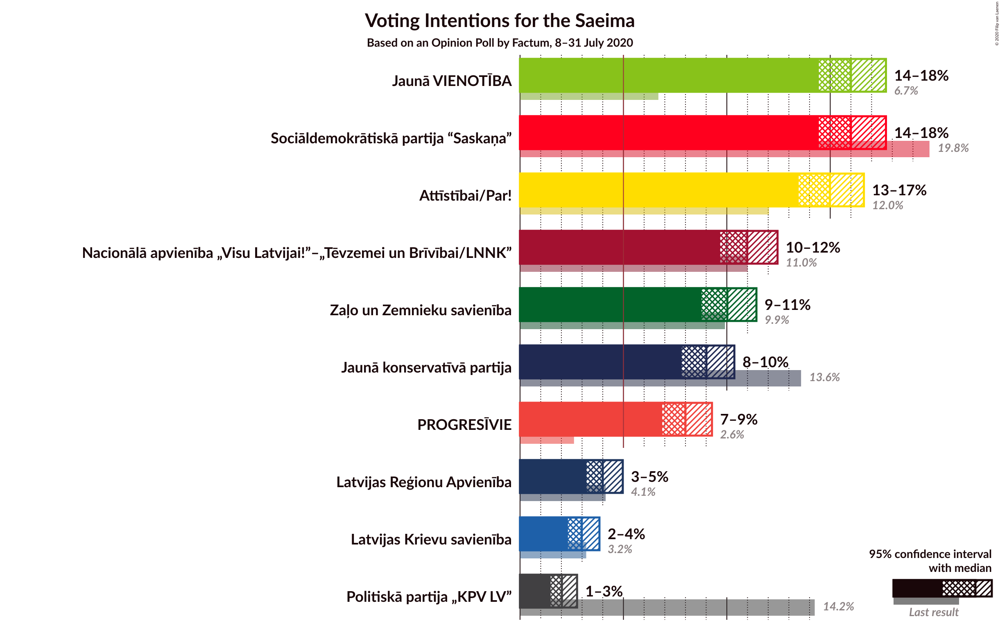

### Confidence Intervals

| Party | Last Result | Poll Result | 80% Confidence Interval | 90% Confidence Interval | 95% Confidence Interval | 99% Confidence Interval |
|:-----:|:-----------:|:-----------:|:-----------------------:|:-----------------------:|:-----------------------:|:-----------------------:|
| Sociāldemokrātiskā partija “Saskaņa” | 19.8% | 16.0% | 15.0–17.1% |14.7–17.4% |14.4–17.7% |14.0–18.2% |
| Jaunā VIENOTĪBA | 6.7% | 16.0% | 15.0–17.1% |14.7–17.4% |14.4–17.7% |14.0–18.2% |
| Attīstībai/Par! | 12.0% | 15.0% | 14.0–16.1% |13.7–16.4% |13.5–16.6% |13.0–17.2% |
| Nacionālā apvienība „Visu Latvijai!”–„Tēvzemei un Brīvībai/LNNK” | 11.0% | 11.0% | 10.1–11.9% |9.9–12.2% |9.7–12.5% |9.3–12.9% |
| Zaļo un Zemnieku savienība | 9.9% | 10.0% | 9.2–10.9% |9.0–11.2% |8.8–11.4% |8.4–11.9% |
| Jaunā konservatīvā partija | 13.6% | 9.0% | 8.2–9.9% |8.0–10.2% |7.8–10.4% |7.5–10.8% |
| PROGRESĪVIE | 2.6% | 8.0% | 7.3–8.8% |7.1–9.1% |6.9–9.3% |6.5–9.7% |
| Latvijas Reģionu Apvienība | 4.1% | 4.0% | 3.5–4.6% |3.3–4.8% |3.2–5.0% |3.0–5.3% |
| Latvijas Krievu savienība | 3.2% | 3.0% | 2.5–3.6% |2.4–3.7% |2.3–3.8% |2.1–4.1% |
| Politiskā partija „KPV LV” | 14.2% | 2.0% | 1.7–2.5% |1.6–2.6% |1.5–2.8% |1.3–3.0% |

*Note:* The poll result column reflects the actual value used in the calculations. Published results may vary slightly, and in addition be rounded to fewer digits.

## Seats

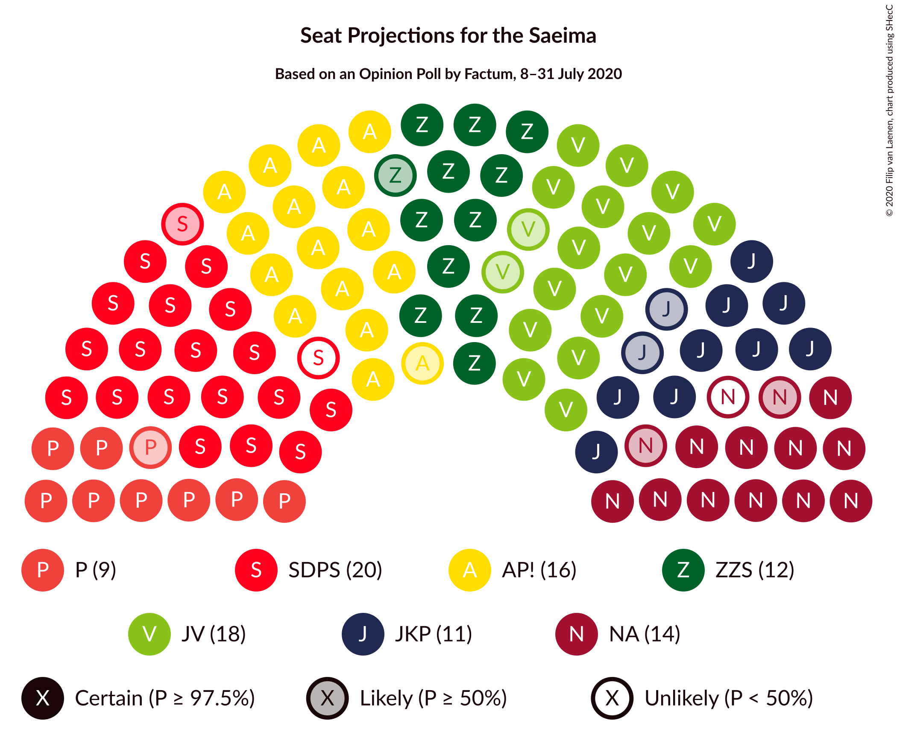

### Confidence Intervals

| Party | Last Result | Median | 80% Confidence Interval | 90% Confidence Interval | 95% Confidence Interval | 99% Confidence Interval |
|:-----:|:-----------:|:------:|:-----------------------:|:-----------------------:|:-----------------------:|:-----------------------:|
| <a href="#sociāldemokrātiskā-partija-“saskaņa”">Sociāldemokrātiskā partija “Saskaņa”</a> | 23 | 19 | 18–21 |18–22 |18–22 |17–23 |
| <a href="#jaunā-vienotība">Jaunā VIENOTĪBA</a> | 8 | 18 | 18–20 |17–21 |16–21 |16–22 |
| <a href="#attīstībai/par!">Attīstībai/Par!</a> | 13 | 16 | 16–18 |16–18 |15–19 |15–20 |
| <a href="#nacionālā-apvienība-„visu-latvijai!”–„tēvzemei-un-brīvībai/lnnk”">Nacionālā apvienība „Visu Latvijai!”–„Tēvzemei un Brīvībai/LNNK”</a> | 13 | 13 | 12–14 |11–14 |11–14 |11–14 |
| <a href="#zaļo-un-zemnieku-savienība">Zaļo un Zemnieku savienība</a> | 11 | 12 | 11–13 |11–14 |11–14 |11–15 |
| <a href="#jaunā-konservatīvā-partija">Jaunā konservatīvā partija</a> | 16 | 11 | 10–11 |10–13 |9–13 |9–13 |
| <a href="#progresīvie">PROGRESĪVIE</a> | 0 | 9 | 8–10 |8–11 |8–11 |7–12 |
| <a href="#latvijas-reģionu-apvienība">Latvijas Reģionu Apvienība</a> | 0 | 0 | 0 |0 |0 |0–6 |
| <a href="#latvijas-krievu-savienība">Latvijas Krievu savienība</a> | 0 | 0 | 0 |0 |0 |0 |
| <a href="#politiskā-partija-„kpv-lv”">Politiskā partija „KPV LV”</a> | 16 | 0 | 0 |0 |0 |0 |

### Sociāldemokrātiskā partija “Saskaņa”

*For a full overview of the results for this party, see the [Sociāldemokrātiskā partija “Saskaņa”](party-sociāldemokrātiskāpartija“saskaņa”.html) page.*

| Number of Seats | Probability | Accumulated | Special Marks |
|:---------------:|:-----------:|:-----------:|:-------------:|
| 16 | 0.1% | 100% |  |
| 17 | 1.2% | 99.9% |  |
| 18 | 36% | 98.7% |  |
| 19 | 16% | 62% | Median |
| 20 | 25% | 47% |  |
| 21 | 16% | 21% |  |
| 22 | 4% | 5% |  |
| 23 | 0.6% | 0.6% | Last Result |
| 24 | 0% | 0% |  |

### Jaunā VIENOTĪBA

*For a full overview of the results for this party, see the [Jaunā VIENOTĪBA](party-jaunāvienotība.html) page.*

| Number of Seats | Probability | Accumulated | Special Marks |
|:---------------:|:-----------:|:-----------:|:-------------:|
| 8 | 0% | 100% | Last Result |
| 9 | 0% | 100% |  |
| 10 | 0% | 100% |  |
| 11 | 0% | 100% |  |
| 12 | 0% | 100% |  |
| 13 | 0% | 100% |  |
| 14 | 0% | 100% |  |
| 15 | 0% | 100% |  |
| 16 | 3% | 100% |  |
| 17 | 6% | 97% |  |
| 18 | 59% | 90% | Median |
| 19 | 14% | 31% |  |
| 20 | 11% | 17% |  |
| 21 | 5% | 6% |  |
| 22 | 1.3% | 1.4% |  |
| 23 | 0.1% | 0.1% |  |
| 24 | 0% | 0% |  |

### Attīstībai/Par!

*For a full overview of the results for this party, see the [Attīstībai/Par!](party-attīstībaipar.html) page.*

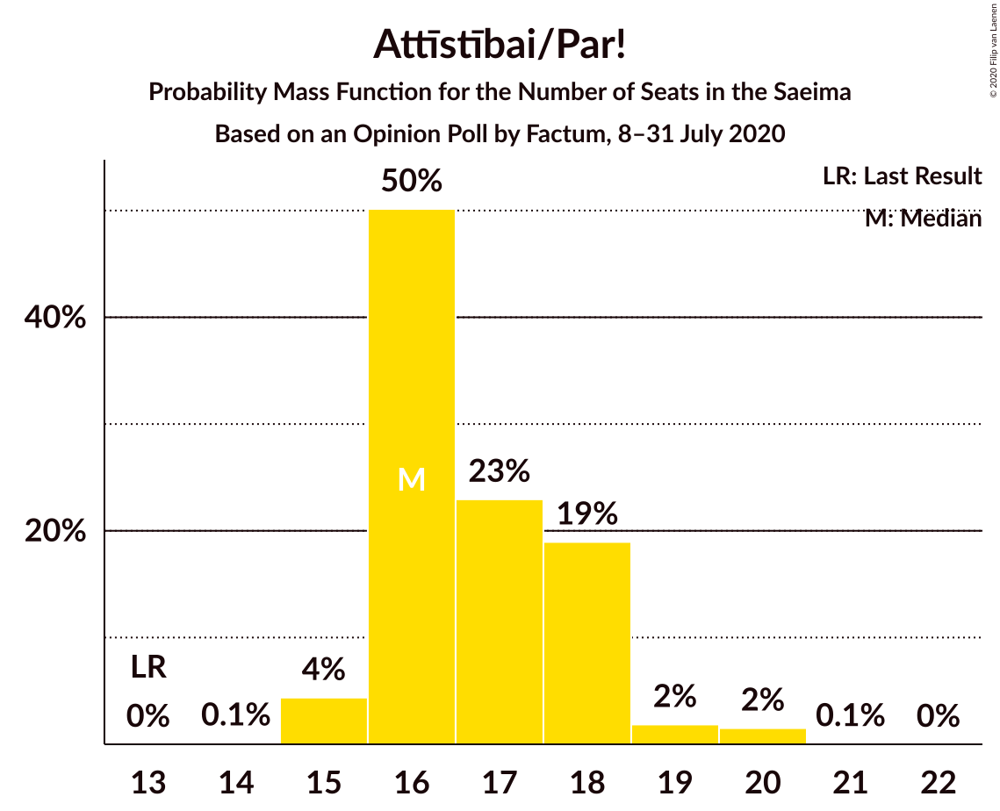

| Number of Seats | Probability | Accumulated | Special Marks |
|:---------------:|:-----------:|:-----------:|:-------------:|
| 13 | 0% | 100% | Last Result |
| 14 | 0.1% | 100% |  |
| 15 | 4% | 99.9% |  |
| 16 | 50% | 95% | Median |
| 17 | 23% | 45% |  |
| 18 | 19% | 22% |  |
| 19 | 2% | 3% |  |
| 20 | 2% | 2% |  |
| 21 | 0.1% | 0.1% |  |
| 22 | 0% | 0% |  |

### Nacionālā apvienība „Visu Latvijai!”–„Tēvzemei un Brīvībai/LNNK”

*For a full overview of the results for this party, see the [Nacionālā apvienība „Visu Latvijai!”–„Tēvzemei un Brīvībai/LNNK”](party-nacionālāapvienība„visulatvijai”–„tēvzemeiunbrīvībailnnk”.html) page.*

| Number of Seats | Probability | Accumulated | Special Marks |
|:---------------:|:-----------:|:-----------:|:-------------:|
| 11 | 10% | 100% |  |
| 12 | 30% | 90% |  |
| 13 | 10% | 60% | Last Result, Median |
| 14 | 49% | 49% |  |
| 15 | 0.5% | 0.5% |  |
| 16 | 0% | 0% |  |

### Zaļo un Zemnieku savienība

*For a full overview of the results for this party, see the [Zaļo un Zemnieku savienība](party-zaļounzemniekusavienība.html) page.*

| Number of Seats | Probability | Accumulated | Special Marks |
|:---------------:|:-----------:|:-----------:|:-------------:|
| 10 | 0.1% | 100% |  |
| 11 | 23% | 99.9% | Last Result |
| 12 | 31% | 77% | Median |
| 13 | 37% | 46% |  |
| 14 | 7% | 8% |  |
| 15 | 2% | 2% |  |
| 16 | 0% | 0% |  |

### Jaunā konservatīvā partija

*For a full overview of the results for this party, see the [Jaunā konservatīvā partija](party-jaunākonservatīvāpartija.html) page.*

| Number of Seats | Probability | Accumulated | Special Marks |
|:---------------:|:-----------:|:-----------:|:-------------:|
| 7 | 0.1% | 100% |  |
| 8 | 0.1% | 99.9% |  |
| 9 | 4% | 99.8% |  |
| 10 | 10% | 95% |  |
| 11 | 76% | 85% | Median |
| 12 | 3% | 10% |  |
| 13 | 7% | 7% |  |
| 14 | 0% | 0% |  |
| 15 | 0% | 0% |  |
| 16 | 0% | 0% | Last Result |

### PROGRESĪVIE

*For a full overview of the results for this party, see the [PROGRESĪVIE](party-progresīvie.html) page.*

| Number of Seats | Probability | Accumulated | Special Marks |
|:---------------:|:-----------:|:-----------:|:-------------:|
| 0 | 0% | 100% | Last Result |
| 1 | 0% | 100% |  |
| 2 | 0% | 100% |  |
| 3 | 0% | 100% |  |
| 4 | 0% | 100% |  |
| 5 | 0% | 100% |  |
| 6 | 0% | 100% |  |
| 7 | 2% | 100% |  |
| 8 | 13% | 98% |  |
| 9 | 63% | 86% | Median |
| 10 | 15% | 22% |  |
| 11 | 5% | 7% |  |
| 12 | 2% | 2% |  |
| 13 | 0% | 0% |  |

### Latvijas Reģionu Apvienība

*For a full overview of the results for this party, see the [Latvijas Reģionu Apvienība](party-latvijasreģionuapvienība.html) page.*

| Number of Seats | Probability | Accumulated | Special Marks |
|:---------------:|:-----------:|:-----------:|:-------------:|
| 0 | 98% | 100% | Last Result, Median |
| 1 | 0% | 2% |  |
| 2 | 0% | 2% |  |
| 3 | 0% | 2% |  |
| 4 | 0% | 2% |  |
| 5 | 0% | 2% |  |
| 6 | 2% | 2% |  |
| 7 | 0% | 0% |  |

### Latvijas Krievu savienība

*For a full overview of the results for this party, see the [Latvijas Krievu savienība](party-latvijaskrievusavienība.html) page.*

| Number of Seats | Probability | Accumulated | Special Marks |
|:---------------:|:-----------:|:-----------:|:-------------:|
| 0 | 100% | 100% | Last Result, Median |

### Politiskā partija „KPV LV”

*For a full overview of the results for this party, see the [Politiskā partija „KPV LV”](party-politiskāpartija„kpvlv”.html) page.*

| Number of Seats | Probability | Accumulated | Special Marks |
|:---------------:|:-----------:|:-----------:|:-------------:|
| 0 | 100% | 100% | Median |
| 1 | 0% | 0% |  |
| 2 | 0% | 0% |  |
| 3 | 0% | 0% |  |
| 4 | 0% | 0% |  |
| 5 | 0% | 0% |  |
| 6 | 0% | 0% |  |
| 7 | 0% | 0% |  |
| 8 | 0% | 0% |  |
| 9 | 0% | 0% |  |
| 10 | 0% | 0% |  |
| 11 | 0% | 0% |  |
| 12 | 0% | 0% |  |
| 13 | 0% | 0% |  |
| 14 | 0% | 0% |  |
| 15 | 0% | 0% |  |
| 16 | 0% | 0% | Last Result |

## Coalitions

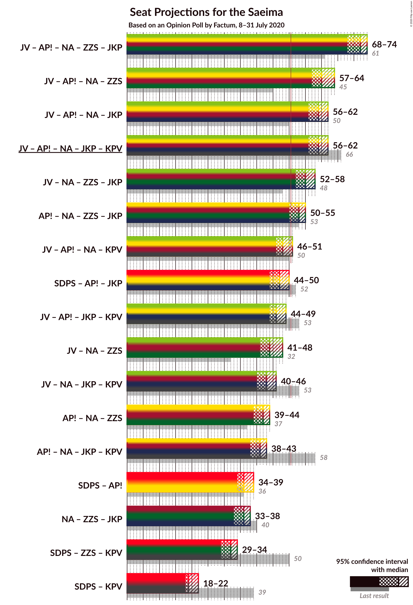

### Confidence Intervals

| Coalition | Last Result | Median | Majority? | 80% Confidence Interval | 90% Confidence Interval | 95% Confidence Interval | 99% Confidence Interval |
|:---------:|:-----------:|:------:|:---------:|:-----------------------:|:-----------------------:|:-----------------------:|:-----------------------:|
| Jaunā VIENOTĪBA – Attīstībai/Par! – Nacionālā apvienība „Visu Latvijai!”–„Tēvzemei un Brīvībai/LNNK” – Zaļo un Zemnieku savienība – Jaunā konservatīvā partija | 61 | 72 | 100% | 70–73 | 68–74 | 68–74 | 67–74 |
| Jaunā VIENOTĪBA – Attīstībai/Par! – Nacionālā apvienība „Visu Latvijai!”–„Tēvzemei un Brīvībai/LNNK” – Zaļo un Zemnieku savienība | 45 | 60 | 100% | 59–62 | 58–63 | 57–64 | 56–64 |
| Jaunā VIENOTĪBA – Attīstībai/Par! – Nacionālā apvienība „Visu Latvijai!”–„Tēvzemei un Brīvībai/LNNK” – Jaunā konservatīvā partija | 50 | 59 | 100% | 57–61 | 57–61 | 56–62 | 55–63 |
| Jaunā VIENOTĪBA – Attīstībai/Par! – Nacionālā apvienība „Visu Latvijai!”–„Tēvzemei un Brīvībai/LNNK” – Jaunā konservatīvā partija – Politiskā partija „KPV LV” | 66 | 59 | 100% | 57–61 | 57–61 | 56–62 | 55–63 |
| Jaunā VIENOTĪBA – Nacionālā apvienība „Visu Latvijai!”–„Tēvzemei un Brīvībai/LNNK” – Zaļo un Zemnieku savienība – Jaunā konservatīvā partija | 48 | 55 | 99.0% | 53–57 | 52–57 | 52–58 | 50–58 |
| Attīstībai/Par! – Nacionālā apvienība „Visu Latvijai!”–„Tēvzemei un Brīvībai/LNNK” – Zaļo un Zemnieku savienība – Jaunā konservatīvā partija | 53 | 53 | 95% | 51–55 | 50–55 | 50–55 | 48–56 |
| Jaunā VIENOTĪBA – Attīstībai/Par! – Nacionālā apvienība „Visu Latvijai!”–„Tēvzemei un Brīvībai/LNNK” – Politiskā partija „KPV LV” | 50 | 48 | 3% | 46–50 | 46–50 | 46–51 | 45–52 |
| Sociāldemokrātiskā partija “Saskaņa” – Attīstībai/Par! – Jaunā konservatīvā partija | 52 | 47 | 1.1% | 45–49 | 44–49 | 44–50 | 43–51 |
| Jaunā VIENOTĪBA – Attīstībai/Par! – Jaunā konservatīvā partija – Politiskā partija „KPV LV” | 53 | 46 | 0.2% | 44–48 | 44–49 | 44–49 | 43–50 |
| Jaunā VIENOTĪBA – Nacionālā apvienība „Visu Latvijai!”–„Tēvzemei un Brīvībai/LNNK” – Zaļo un Zemnieku savienība | 32 | 44 | 0% | 42–46 | 41–47 | 41–48 | 40–48 |
| Jaunā VIENOTĪBA – Nacionālā apvienība „Visu Latvijai!”–„Tēvzemei un Brīvībai/LNNK” – Jaunā konservatīvā partija – Politiskā partija „KPV LV” | 53 | 43 | 0% | 41–44 | 40–45 | 40–46 | 39–46 |
| Attīstībai/Par! – Nacionālā apvienība „Visu Latvijai!”–„Tēvzemei un Brīvībai/LNNK” – Zaļo un Zemnieku savienība | 37 | 42 | 0% | 40–44 | 39–44 | 39–44 | 38–45 |
| Attīstībai/Par! – Nacionālā apvienība „Visu Latvijai!”–„Tēvzemei un Brīvībai/LNNK” – Jaunā konservatīvā partija – Politiskā partija „KPV LV” | 58 | 41 | 0% | 39–42 | 38–43 | 38–43 | 37–44 |
| Sociāldemokrātiskā partija “Saskaņa” – Attīstībai/Par! | 36 | 36 | 0% | 34–38 | 34–38 | 34–39 | 33–40 |
| Nacionālā apvienība „Visu Latvijai!”–„Tēvzemei un Brīvībai/LNNK” – Zaļo un Zemnieku savienība – Jaunā konservatīvā partija | 40 | 36 | 0% | 34–38 | 34–38 | 33–38 | 32–39 |
| Sociāldemokrātiskā partija “Saskaņa” – Zaļo un Zemnieku savienība – Politiskā partija „KPV LV” | 50 | 32 | 0% | 30–34 | 29–34 | 29–34 | 28–35 |
| Sociāldemokrātiskā partija “Saskaņa” – Politiskā partija „KPV LV” | 39 | 19 | 0% | 18–21 | 18–22 | 18–22 | 17–23 |

### Jaunā VIENOTĪBA – Attīstībai/Par! – Nacionālā apvienība „Visu Latvijai!”–„Tēvzemei un Brīvībai/LNNK” – Zaļo un Zemnieku savienība – Jaunā konservatīvā partija

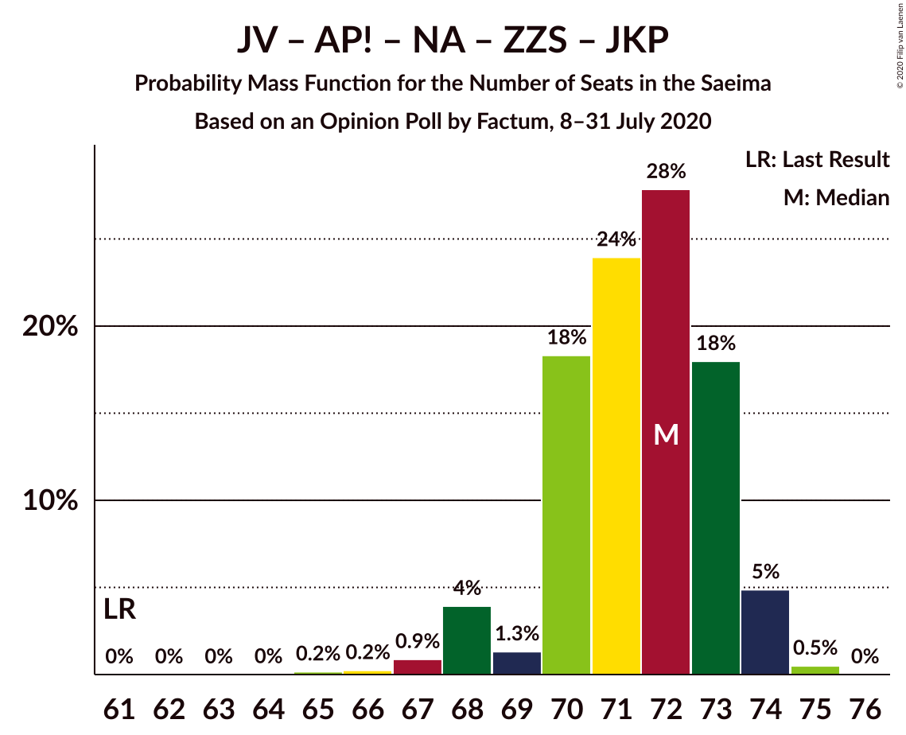

| Number of Seats | Probability | Accumulated | Special Marks |
|:---------------:|:-----------:|:-----------:|:-------------:|
| 61 | 0% | 100% | Last Result |
| 62 | 0% | 100% |  |
| 63 | 0% | 100% |  |
| 64 | 0% | 100% |  |
| 65 | 0.2% | 100% |  |
| 66 | 0.2% | 99.8% |  |
| 67 | 0.9% | 99.6% |  |
| 68 | 4% | 98.7% |  |
| 69 | 1.3% | 95% |  |
| 70 | 18% | 93% | Median |
| 71 | 24% | 75% |  |
| 72 | 28% | 51% |  |
| 73 | 18% | 23% |  |
| 74 | 5% | 5% |  |
| 75 | 0.5% | 0.5% |  |
| 76 | 0% | 0% |  |

### Jaunā VIENOTĪBA – Attīstībai/Par! – Nacionālā apvienība „Visu Latvijai!”–„Tēvzemei un Brīvībai/LNNK” – Zaļo un Zemnieku savienība

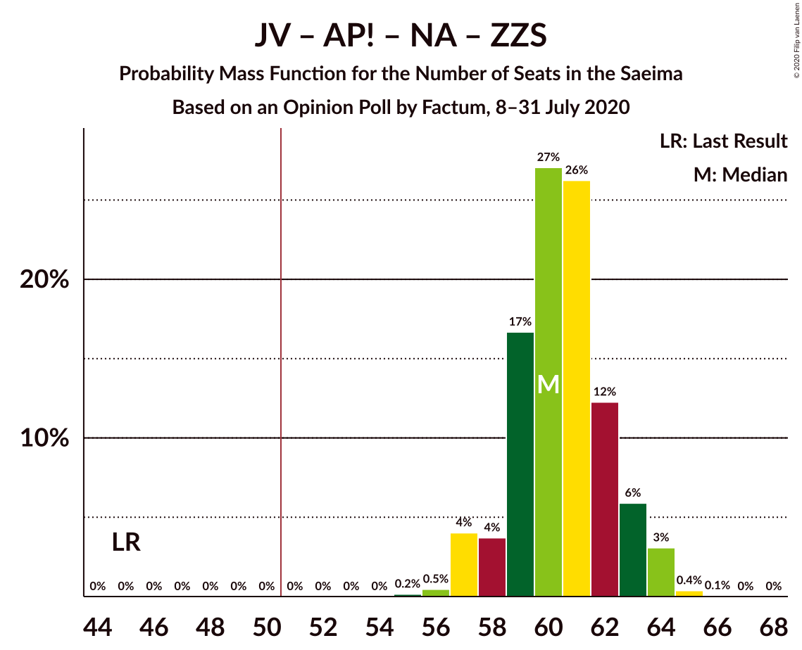

| Number of Seats | Probability | Accumulated | Special Marks |
|:---------------:|:-----------:|:-----------:|:-------------:|
| 45 | 0% | 100% | Last Result |
| 46 | 0% | 100% |  |
| 47 | 0% | 100% |  |
| 48 | 0% | 100% |  |
| 49 | 0% | 100% |  |
| 50 | 0% | 100% |  |
| 51 | 0% | 100% | Majority |
| 52 | 0% | 100% |  |
| 53 | 0% | 100% |  |
| 54 | 0% | 100% |  |
| 55 | 0.2% | 100% |  |
| 56 | 0.5% | 99.8% |  |
| 57 | 4% | 99.4% |  |
| 58 | 4% | 95% |  |
| 59 | 17% | 92% | Median |
| 60 | 27% | 75% |  |
| 61 | 26% | 48% |  |
| 62 | 12% | 22% |  |
| 63 | 6% | 9% |  |
| 64 | 3% | 4% |  |
| 65 | 0.4% | 0.4% |  |
| 66 | 0.1% | 0.1% |  |
| 67 | 0% | 0% |  |

### Jaunā VIENOTĪBA – Attīstībai/Par! – Nacionālā apvienība „Visu Latvijai!”–„Tēvzemei un Brīvībai/LNNK” – Jaunā konservatīvā partija

| Number of Seats | Probability | Accumulated | Special Marks |
|:---------------:|:-----------:|:-----------:|:-------------:|
| 50 | 0% | 100% | Last Result |
| 51 | 0% | 100% | Majority |
| 52 | 0% | 100% |  |
| 53 | 0% | 100% |  |
| 54 | 0.2% | 100% |  |
| 55 | 0.4% | 99.7% |  |
| 56 | 2% | 99.3% |  |
| 57 | 17% | 97% |  |
| 58 | 11% | 80% | Median |
| 59 | 25% | 69% |  |
| 60 | 27% | 43% |  |
| 61 | 11% | 16% |  |
| 62 | 4% | 5% |  |
| 63 | 0.7% | 0.7% |  |
| 64 | 0% | 0% |  |

### Jaunā VIENOTĪBA – Attīstībai/Par! – Nacionālā apvienība „Visu Latvijai!”–„Tēvzemei un Brīvībai/LNNK” – Jaunā konservatīvā partija – Politiskā partija „KPV LV”

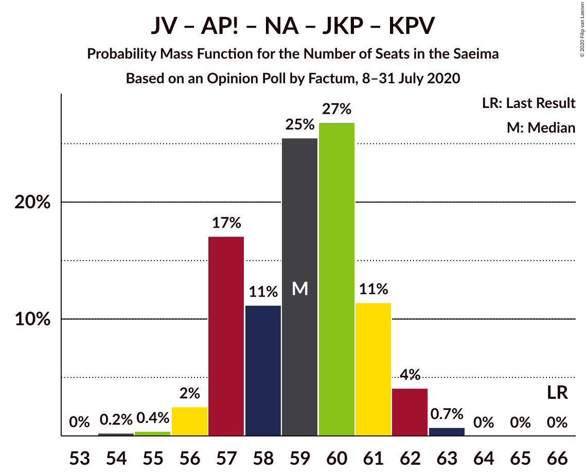

| Number of Seats | Probability | Accumulated | Special Marks |
|:---------------:|:-----------:|:-----------:|:-------------:|
| 54 | 0.2% | 100% |  |
| 55 | 0.4% | 99.7% |  |
| 56 | 2% | 99.3% |  |
| 57 | 17% | 97% |  |
| 58 | 11% | 80% | Median |
| 59 | 25% | 69% |  |
| 60 | 27% | 43% |  |
| 61 | 11% | 16% |  |
| 62 | 4% | 5% |  |
| 63 | 0.7% | 0.7% |  |
| 64 | 0% | 0% |  |
| 65 | 0% | 0% |  |
| 66 | 0% | 0% | Last Result |

### Jaunā VIENOTĪBA – Nacionālā apvienība „Visu Latvijai!”–„Tēvzemei un Brīvībai/LNNK” – Zaļo un Zemnieku savienība – Jaunā konservatīvā partija

| Number of Seats | Probability | Accumulated | Special Marks |
|:---------------:|:-----------:|:-----------:|:-------------:|
| 48 | 0% | 100% | Last Result |
| 49 | 0.1% | 100% |  |
| 50 | 0.9% | 99.9% |  |
| 51 | 1.3% | 99.0% | Majority |
| 52 | 5% | 98% |  |
| 53 | 9% | 93% |  |
| 54 | 26% | 83% | Median |
| 55 | 29% | 57% |  |
| 56 | 16% | 28% |  |
| 57 | 8% | 12% |  |
| 58 | 4% | 4% |  |
| 59 | 0.2% | 0.2% |  |
| 60 | 0% | 0% |  |

### Attīstībai/Par! – Nacionālā apvienība „Visu Latvijai!”–„Tēvzemei un Brīvībai/LNNK” – Zaļo un Zemnieku savienība – Jaunā konservatīvā partija

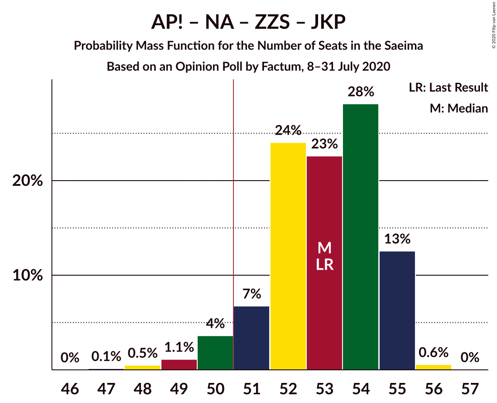

| Number of Seats | Probability | Accumulated | Special Marks |
|:---------------:|:-----------:|:-----------:|:-------------:|
| 47 | 0.1% | 100% |  |
| 48 | 0.5% | 99.9% |  |
| 49 | 1.1% | 99.4% |  |
| 50 | 4% | 98% |  |
| 51 | 7% | 95% | Majority |
| 52 | 24% | 88% | Median |
| 53 | 23% | 64% | Last Result |
| 54 | 28% | 41% |  |
| 55 | 13% | 13% |  |
| 56 | 0.6% | 0.6% |  |
| 57 | 0% | 0% |  |

### Jaunā VIENOTĪBA – Attīstībai/Par! – Nacionālā apvienība „Visu Latvijai!”–„Tēvzemei un Brīvībai/LNNK” – Politiskā partija „KPV LV”

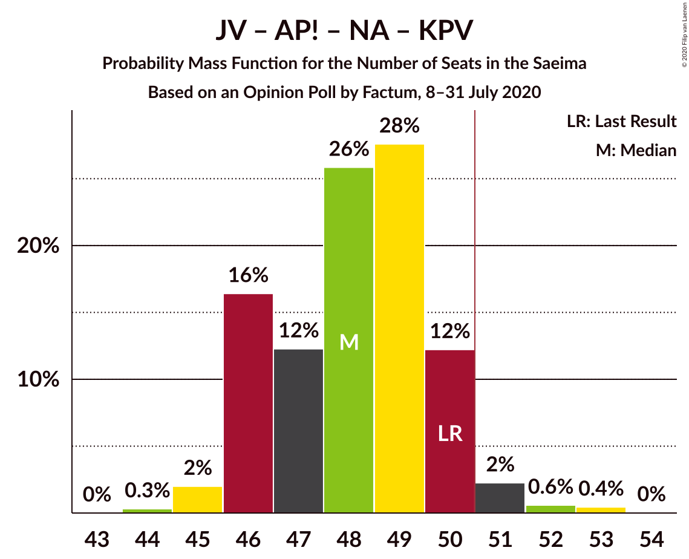

| Number of Seats | Probability | Accumulated | Special Marks |
|:---------------:|:-----------:|:-----------:|:-------------:|
| 44 | 0.3% | 100% |  |
| 45 | 2% | 99.7% |  |
| 46 | 16% | 98% |  |
| 47 | 12% | 81% | Median |
| 48 | 26% | 69% |  |
| 49 | 28% | 43% |  |
| 50 | 12% | 16% | Last Result |
| 51 | 2% | 3% | Majority |
| 52 | 0.6% | 1.1% |  |
| 53 | 0.4% | 0.5% |  |
| 54 | 0% | 0% |  |

### Sociāldemokrātiskā partija “Saskaņa” – Attīstībai/Par! – Jaunā konservatīvā partija

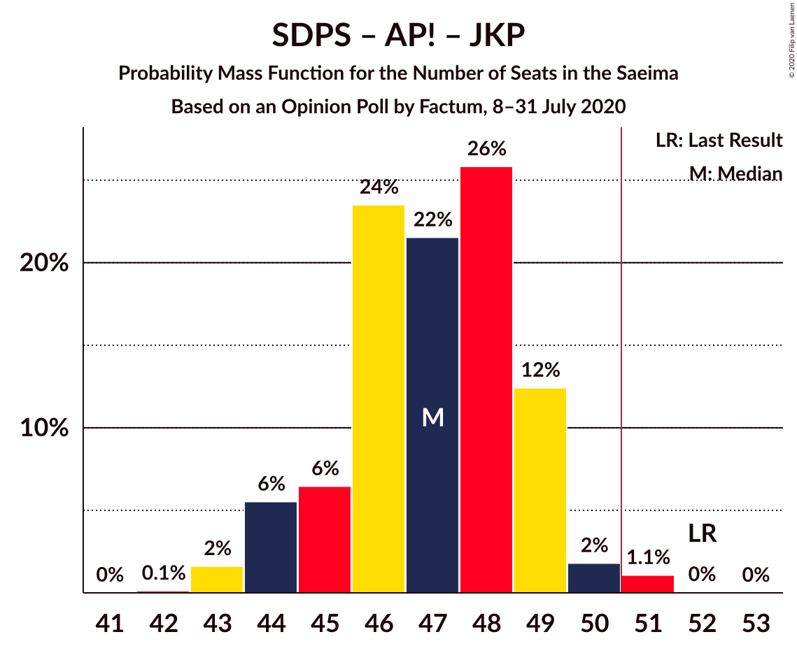

| Number of Seats | Probability | Accumulated | Special Marks |
|:---------------:|:-----------:|:-----------:|:-------------:|
| 42 | 0.1% | 100% |  |
| 43 | 2% | 99.9% |  |
| 44 | 6% | 98% |  |
| 45 | 6% | 93% |  |
| 46 | 24% | 86% | Median |
| 47 | 22% | 63% |  |
| 48 | 26% | 41% |  |
| 49 | 12% | 15% |  |
| 50 | 2% | 3% |  |
| 51 | 1.1% | 1.1% | Majority |
| 52 | 0% | 0.1% | Last Result |
| 53 | 0% | 0% |  |

### Jaunā VIENOTĪBA – Attīstībai/Par! – Jaunā konservatīvā partija – Politiskā partija „KPV LV”

| Number of Seats | Probability | Accumulated | Special Marks |
|:---------------:|:-----------:|:-----------:|:-------------:|
| 41 | 0.1% | 100% |  |
| 42 | 0.3% | 99.9% |  |
| 43 | 1.2% | 99.6% |  |
| 44 | 10% | 98% |  |
| 45 | 29% | 88% | Median |
| 46 | 21% | 59% |  |
| 47 | 20% | 38% |  |
| 48 | 11% | 18% |  |
| 49 | 4% | 6% |  |
| 50 | 2% | 2% |  |
| 51 | 0.2% | 0.2% | Majority |
| 52 | 0% | 0% |  |
| 53 | 0% | 0% | Last Result |

### Jaunā VIENOTĪBA – Nacionālā apvienība „Visu Latvijai!”–„Tēvzemei un Brīvībai/LNNK” – Zaļo un Zemnieku savienība

| Number of Seats | Probability | Accumulated | Special Marks |
|:---------------:|:-----------:|:-----------:|:-------------:|
| 32 | 0% | 100% | Last Result |
| 33 | 0% | 100% |  |
| 34 | 0% | 100% |  |
| 35 | 0% | 100% |  |
| 36 | 0% | 100% |  |
| 37 | 0% | 100% |  |
| 38 | 0% | 100% |  |
| 39 | 0.1% | 100% |  |
| 40 | 2% | 99.8% |  |
| 41 | 5% | 98% |  |
| 42 | 12% | 93% |  |
| 43 | 25% | 81% | Median |
| 44 | 29% | 56% |  |
| 45 | 15% | 27% |  |
| 46 | 4% | 11% |  |
| 47 | 4% | 7% |  |
| 48 | 3% | 3% |  |
| 49 | 0.1% | 0.1% |  |
| 50 | 0% | 0% |  |

### Jaunā VIENOTĪBA – Nacionālā apvienība „Visu Latvijai!”–„Tēvzemei un Brīvībai/LNNK” – Jaunā konservatīvā partija – Politiskā partija „KPV LV”

| Number of Seats | Probability | Accumulated | Special Marks |
|:---------------:|:-----------:|:-----------:|:-------------:|
| 38 | 0.4% | 100% |  |
| 39 | 1.4% | 99.6% |  |
| 40 | 6% | 98% |  |
| 41 | 27% | 92% |  |
| 42 | 11% | 65% | Median |
| 43 | 33% | 54% |  |
| 44 | 12% | 21% |  |
| 45 | 6% | 9% |  |
| 46 | 2% | 3% |  |
| 47 | 0.2% | 0.2% |  |
| 48 | 0% | 0% |  |
| 49 | 0% | 0% |  |
| 50 | 0% | 0% |  |
| 51 | 0% | 0% | Majority |
| 52 | 0% | 0% |  |
| 53 | 0% | 0% | Last Result |

### Attīstībai/Par! – Nacionālā apvienība „Visu Latvijai!”–„Tēvzemei un Brīvībai/LNNK” – Zaļo un Zemnieku savienība

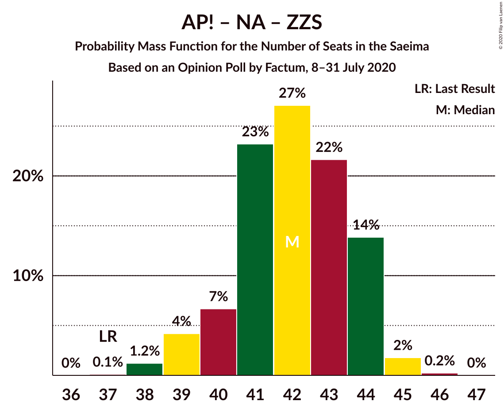

| Number of Seats | Probability | Accumulated | Special Marks |
|:---------------:|:-----------:|:-----------:|:-------------:|
| 37 | 0.1% | 100% | Last Result |
| 38 | 1.2% | 99.9% |  |
| 39 | 4% | 98.7% |  |
| 40 | 7% | 94% |  |
| 41 | 23% | 88% | Median |
| 42 | 27% | 65% |  |
| 43 | 22% | 38% |  |
| 44 | 14% | 16% |  |
| 45 | 2% | 2% |  |
| 46 | 0.2% | 0.3% |  |
| 47 | 0% | 0% |  |

### Attīstībai/Par! – Nacionālā apvienība „Visu Latvijai!”–„Tēvzemei un Brīvībai/LNNK” – Jaunā konservatīvā partija – Politiskā partija „KPV LV”

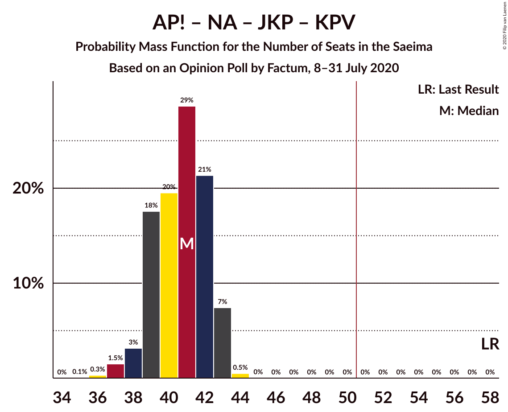

| Number of Seats | Probability | Accumulated | Special Marks |
|:---------------:|:-----------:|:-----------:|:-------------:|
| 35 | 0.1% | 100% |  |
| 36 | 0.3% | 99.9% |  |
| 37 | 1.5% | 99.6% |  |
| 38 | 3% | 98% |  |
| 39 | 18% | 95% |  |
| 40 | 20% | 77% | Median |
| 41 | 29% | 58% |  |
| 42 | 21% | 29% |  |
| 43 | 7% | 8% |  |
| 44 | 0.5% | 0.5% |  |
| 45 | 0% | 0% |  |
| 46 | 0% | 0% |  |
| 47 | 0% | 0% |  |
| 48 | 0% | 0% |  |
| 49 | 0% | 0% |  |
| 50 | 0% | 0% |  |
| 51 | 0% | 0% | Majority |
| 52 | 0% | 0% |  |
| 53 | 0% | 0% |  |
| 54 | 0% | 0% |  |
| 55 | 0% | 0% |  |
| 56 | 0% | 0% |  |
| 57 | 0% | 0% |  |
| 58 | 0% | 0% | Last Result |

### Sociāldemokrātiskā partija “Saskaņa” – Attīstībai/Par!

| Number of Seats | Probability | Accumulated | Special Marks |
|:---------------:|:-----------:|:-----------:|:-------------:|
| 33 | 0.5% | 100% |  |
| 34 | 14% | 99.5% |  |
| 35 | 24% | 86% | Median |
| 36 | 23% | 62% | Last Result |
| 37 | 26% | 39% |  |
| 38 | 10% | 13% |  |
| 39 | 2% | 3% |  |
| 40 | 0.4% | 0.6% |  |
| 41 | 0.1% | 0.2% |  |
| 42 | 0.1% | 0.1% |  |
| 43 | 0% | 0% |  |

### Nacionālā apvienība „Visu Latvijai!”–„Tēvzemei un Brīvībai/LNNK” – Zaļo un Zemnieku savienība – Jaunā konservatīvā partija

| Number of Seats | Probability | Accumulated | Special Marks |
|:---------------:|:-----------:|:-----------:|:-------------:|
| 31 | 0.1% | 100% |  |
| 32 | 1.1% | 99.9% |  |
| 33 | 2% | 98.8% |  |
| 34 | 7% | 97% |  |
| 35 | 11% | 90% |  |
| 36 | 31% | 78% | Median |
| 37 | 28% | 47% |  |
| 38 | 19% | 20% |  |
| 39 | 0.6% | 0.7% |  |
| 40 | 0% | 0% | Last Result |

### Sociāldemokrātiskā partija “Saskaņa” – Zaļo un Zemnieku savienība – Politiskā partija „KPV LV”

| Number of Seats | Probability | Accumulated | Special Marks |
|:---------------:|:-----------:|:-----------:|:-------------:|
| 28 | 0.7% | 100% |  |
| 29 | 8% | 99.3% |  |
| 30 | 18% | 92% |  |
| 31 | 17% | 74% | Median |
| 32 | 29% | 56% |  |
| 33 | 10% | 27% |  |
| 34 | 15% | 17% |  |
| 35 | 2% | 2% |  |
| 36 | 0.1% | 0.2% |  |
| 37 | 0% | 0% |  |
| 38 | 0% | 0% |  |
| 39 | 0% | 0% |  |
| 40 | 0% | 0% |  |
| 41 | 0% | 0% |  |
| 42 | 0% | 0% |  |
| 43 | 0% | 0% |  |
| 44 | 0% | 0% |  |
| 45 | 0% | 0% |  |
| 46 | 0% | 0% |  |
| 47 | 0% | 0% |  |
| 48 | 0% | 0% |  |
| 49 | 0% | 0% |  |
| 50 | 0% | 0% | Last Result |

### Sociāldemokrātiskā partija “Saskaņa” – Politiskā partija „KPV LV”

| Number of Seats | Probability | Accumulated | Special Marks |
|:---------------:|:-----------:|:-----------:|:-------------:|
| 16 | 0.1% | 100% |  |
| 17 | 1.2% | 99.9% |  |
| 18 | 36% | 98.7% |  |
| 19 | 16% | 62% | Median |
| 20 | 25% | 47% |  |
| 21 | 16% | 21% |  |
| 22 | 4% | 5% |  |
| 23 | 0.6% | 0.6% |  |
| 24 | 0% | 0% |  |
| 25 | 0% | 0% |  |
| 26 | 0% | 0% |  |
| 27 | 0% | 0% |  |
| 28 | 0% | 0% |  |
| 29 | 0% | 0% |  |
| 30 | 0% | 0% |  |
| 31 | 0% | 0% |  |
| 32 | 0% | 0% |  |
| 33 | 0% | 0% |  |
| 34 | 0% | 0% |  |
| 35 | 0% | 0% |  |
| 36 | 0% | 0% |  |
| 37 | 0% | 0% |  |
| 38 | 0% | 0% |  |
| 39 | 0% | 0% | Last Result |

## Technical Information

### Opinion Poll

+ **Polling firm:** Factum
+ **Commissioner(s):** —
+ **Fieldwork period:** 8–31 July 2020

### Calculations

+ **Sample size:** 1975
+ **Simulations done:** 1,048,576
+ **Error estimate:** 1.43%

