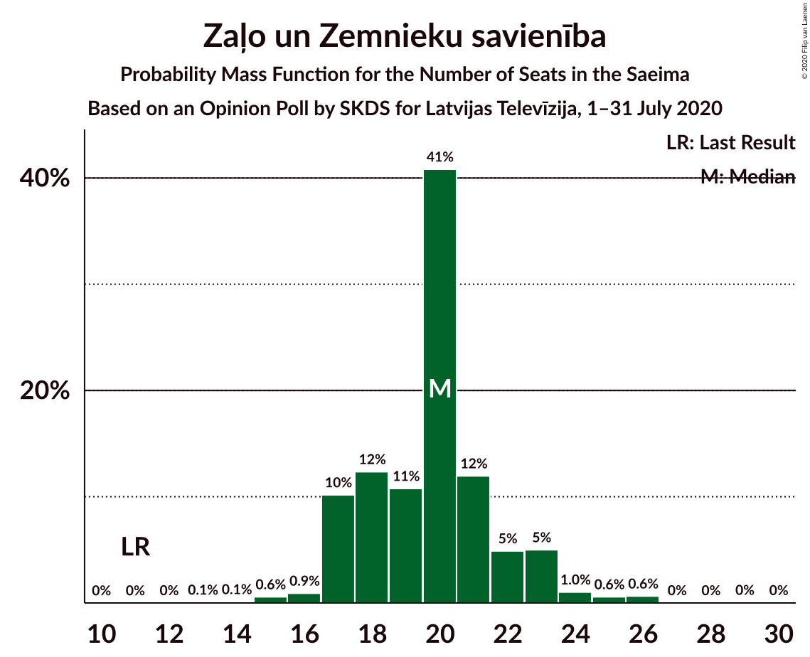
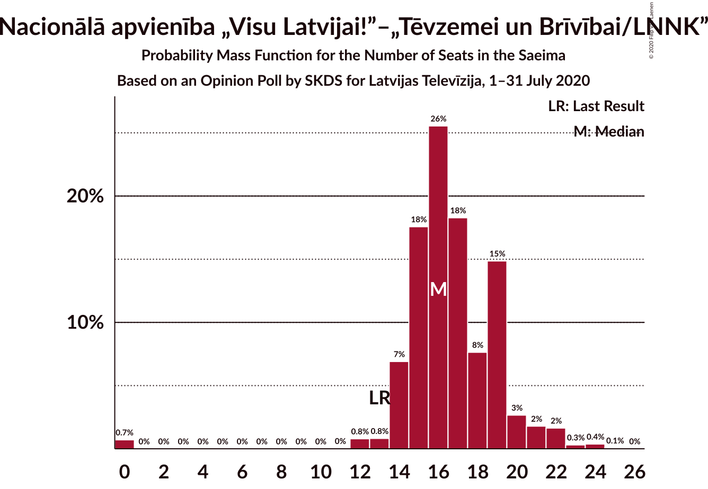
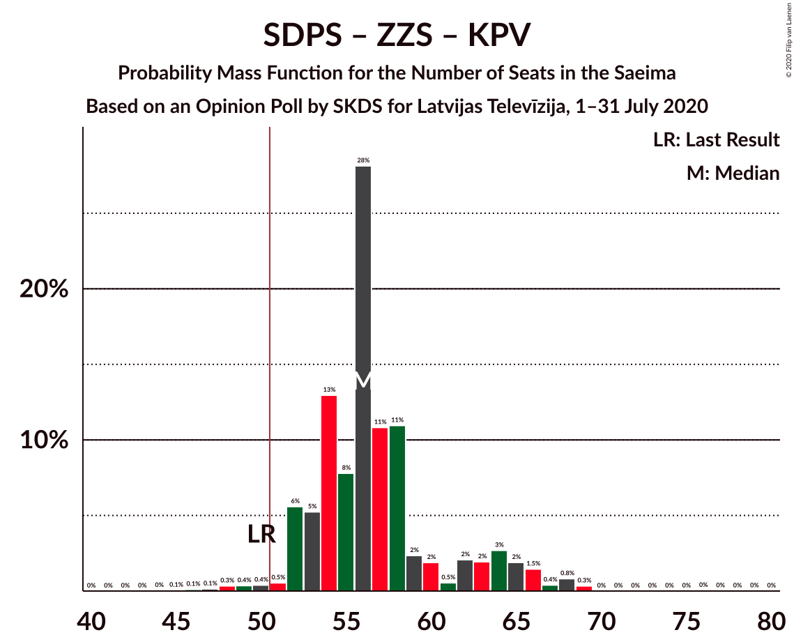

# Opinion Poll by SKDS for Latvijas Televīzija, 1–31 July 2020

<a href="#voting-intentions">Voting Intentions</a> | <a href="#seats">Seats</a> | <a href="#coalitions">Coalitions</a> | <a href="#technical-information">Technical Information</a>

## Voting Intentions

### Confidence Intervals

| Party | Last Result | Poll Result | 80% Confidence Interval | 90% Confidence Interval | 95% Confidence Interval | 99% Confidence Interval |
|:-----:|:-----------:|:-----------:|:-----------------------:|:-----------------------:|:-----------------------:|:-----------------------:|
| Sociāldemokrātiskā partija “Saskaņa” | 19.8% | 15.5% | 14.0–17.2% |13.6–17.6% |13.3–18.0% |12.6–18.9% |
| Zaļo un Zemnieku savienība | 9.9% | 8.3% | 7.2–9.6% |6.9–9.9% |6.6–10.3% |6.1–10.9% |
| Nacionālā apvienība „Visu Latvijai!”–„Tēvzemei un Brīvībai/LNNK” | 11.0% | 6.8% | 5.8–8.0% |5.5–8.3% |5.3–8.6% |4.9–9.3% |
| Jaunā VIENOTĪBA | 6.7% | 5.8% | 4.9–6.9% |4.6–7.2% |4.4–7.5% |4.0–8.1% |
| Attīstībai/Par! | 12.0% | 5.7% | 4.8–6.8% |4.5–7.1% |4.3–7.4% |3.9–8.0% |
| Jaunā konservatīvā partija | 13.6% | 3.8% | 3.1–4.8% |2.9–5.1% |2.8–5.3% |2.5–5.8% |
| Latvijas Reģionu Apvienība | 4.1% | 2.9% | 2.3–3.8% |2.1–4.1% |2.0–4.3% |1.8–4.7% |
| Latvijas Krievu savienība | 3.2% | 2.1% | 1.6–2.9% |1.5–3.1% |1.4–3.3% |1.2–3.7% |
| PROGRESĪVIE | 2.6% | 2.1% | 1.6–2.9% |1.5–3.1% |1.4–3.3% |1.2–3.7% |
| Politiskā partija „KPV LV” | 14.2% | 2.0% | 1.5–2.8% |1.4–3.0% |1.3–3.2% |1.1–3.6% |

*Note:* The poll result column reflects the actual value used in the calculations. Published results may vary slightly, and in addition be rounded to fewer digits.

## Seats

### Confidence Intervals

| Party | Last Result | Median | 80% Confidence Interval | 90% Confidence Interval | 95% Confidence Interval | 99% Confidence Interval |
|:-----:|:-----------:|:------:|:-----------------------:|:-----------------------:|:-----------------------:|:-----------------------:|
| <a href="#sociāldemokrātiskā-partija-“saskaņa”">Sociāldemokrātiskā partija “Saskaņa”</a> | 23 | 37 | 33–41 |33–43 |33–45 |30–46 |
| <a href="#zaļo-un-zemnieku-savienība">Zaļo un Zemnieku savienība</a> | 11 | 20 | 17–22 |17–23 |17–23 |15–26 |
| <a href="#nacionālā-apvienība-„visu-latvijai!”–„tēvzemei-un-brīvībai/lnnk”">Nacionālā apvienība „Visu Latvijai!”–„Tēvzemei un Brīvībai/LNNK”</a> | 13 | 16 | 15–19 |14–20 |14–21 |0–23 |
| <a href="#jaunā-vienotība">Jaunā VIENOTĪBA</a> | 8 | 13 | 12–17 |0–18 |0–18 |0–19 |
| <a href="#attīstībai/par!">Attīstībai/Par!</a> | 13 | 14 | 13–16 |0–16 |0–18 |0–20 |
| <a href="#jaunā-konservatīvā-partija">Jaunā konservatīvā partija</a> | 16 | 0 | 0 |0 |0 |0–11 |
| <a href="#latvijas-reģionu-apvienība">Latvijas Reģionu Apvienība</a> | 0 | 0 | 0 |0 |0 |0 |
| <a href="#latvijas-krievu-savienība">Latvijas Krievu savienība</a> | 0 | 0 | 0 |0 |0 |0 |
| <a href="#progresīvie">PROGRESĪVIE</a> | 0 | 0 | 0 |0 |0 |0 |
| <a href="#politiskā-partija-„kpv-lv”">Politiskā partija „KPV LV”</a> | 16 | 0 | 0 |0 |0 |0 |

### Sociāldemokrātiskā partija “Saskaņa”

*For a full overview of the results for this party, see the [Sociāldemokrātiskā partija “Saskaņa”](party-sociāldemokrātiskāpartija“saskaņa”.html) page.*

| Number of Seats | Probability | Accumulated | Special Marks |
|:---------------:|:-----------:|:-----------:|:-------------:|
| 23 | 0% | 100% | Last Result |
| 24 | 0% | 100% |  |
| 25 | 0% | 100% |  |
| 26 | 0% | 100% |  |
| 27 | 0% | 100% |  |
| 28 | 0.1% | 100% |  |
| 29 | 0.3% | 99.9% |  |
| 30 | 0.3% | 99.6% |  |
| 31 | 0.7% | 99.3% |  |
| 32 | 1.0% | 98.6% |  |
| 33 | 10% | 98% |  |
| 34 | 7% | 87% |  |
| 35 | 9% | 80% |  |
| 36 | 18% | 71% |  |
| 37 | 14% | 53% | Median |
| 38 | 22% | 39% |  |
| 39 | 5% | 17% |  |
| 40 | 0.8% | 12% |  |
| 41 | 1.0% | 11% |  |
| 42 | 3% | 10% |  |
| 43 | 3% | 7% |  |
| 44 | 1.2% | 4% |  |
| 45 | 2% | 3% |  |
| 46 | 0.5% | 1.0% |  |
| 47 | 0.3% | 0.5% |  |
| 48 | 0.1% | 0.2% |  |
| 49 | 0% | 0.1% |  |
| 50 | 0% | 0.1% |  |
| 51 | 0% | 0.1% | Majority |
| 52 | 0% | 0.1% |  |
| 53 | 0% | 0% |  |

### Zaļo un Zemnieku savienība

*For a full overview of the results for this party, see the [Zaļo un Zemnieku savienība](party-zaļounzemniekusavienība.html) page.*

| Number of Seats | Probability | Accumulated | Special Marks |
|:---------------:|:-----------:|:-----------:|:-------------:|
| 11 | 0% | 100% | Last Result |
| 12 | 0% | 100% |  |
| 13 | 0.1% | 100% |  |
| 14 | 0.1% | 99.9% |  |
| 15 | 0.6% | 99.8% |  |
| 16 | 0.9% | 99.2% |  |
| 17 | 10% | 98% |  |
| 18 | 12% | 88% |  |
| 19 | 11% | 76% |  |
| 20 | 41% | 65% | Median |
| 21 | 12% | 24% |  |
| 22 | 5% | 12% |  |
| 23 | 5% | 7% |  |
| 24 | 1.0% | 2% |  |
| 25 | 0.6% | 1.3% |  |
| 26 | 0.6% | 0.7% |  |
| 27 | 0% | 0.1% |  |
| 28 | 0% | 0.1% |  |
| 29 | 0% | 0.1% |  |
| 30 | 0% | 0% |  |

### Nacionālā apvienība „Visu Latvijai!”–„Tēvzemei un Brīvībai/LNNK”

*For a full overview of the results for this party, see the [Nacionālā apvienība „Visu Latvijai!”–„Tēvzemei un Brīvībai/LNNK”](party-nacionālāapvienība„visulatvijai”–„tēvzemeiunbrīvībailnnk”.html) page.*

| Number of Seats | Probability | Accumulated | Special Marks |
|:---------------:|:-----------:|:-----------:|:-------------:|
| 0 | 0.7% | 100% |  |
| 1 | 0% | 99.3% |  |
| 2 | 0% | 99.3% |  |
| 3 | 0% | 99.3% |  |
| 4 | 0% | 99.3% |  |
| 5 | 0% | 99.3% |  |
| 6 | 0% | 99.3% |  |
| 7 | 0% | 99.3% |  |
| 8 | 0% | 99.3% |  |
| 9 | 0% | 99.3% |  |
| 10 | 0% | 99.3% |  |
| 11 | 0% | 99.3% |  |
| 12 | 0.8% | 99.3% |  |
| 13 | 0.8% | 98% | Last Result |
| 14 | 7% | 98% |  |
| 15 | 18% | 91% |  |
| 16 | 26% | 73% | Median |
| 17 | 18% | 48% |  |
| 18 | 8% | 29% |  |
| 19 | 15% | 22% |  |
| 20 | 3% | 7% |  |
| 21 | 2% | 4% |  |
| 22 | 2% | 2% |  |
| 23 | 0.3% | 0.8% |  |
| 24 | 0.4% | 0.5% |  |
| 25 | 0.1% | 0.1% |  |
| 26 | 0% | 0% |  |

### Jaunā VIENOTĪBA

*For a full overview of the results for this party, see the [Jaunā VIENOTĪBA](party-jaunāvienotība.html) page.*

| Number of Seats | Probability | Accumulated | Special Marks |
|:---------------:|:-----------:|:-----------:|:-------------:|
| 0 | 6% | 100% |  |
| 1 | 0% | 94% |  |
| 2 | 0% | 94% |  |
| 3 | 0% | 94% |  |
| 4 | 0% | 94% |  |
| 5 | 0% | 94% |  |
| 6 | 0% | 94% |  |
| 7 | 0% | 94% |  |
| 8 | 0% | 94% | Last Result |
| 9 | 0% | 94% |  |
| 10 | 0% | 94% |  |
| 11 | 2% | 94% |  |
| 12 | 24% | 92% |  |
| 13 | 22% | 68% | Median |
| 14 | 16% | 46% |  |
| 15 | 9% | 30% |  |
| 16 | 11% | 21% |  |
| 17 | 4% | 10% |  |
| 18 | 5% | 6% |  |
| 19 | 0.7% | 1.2% |  |
| 20 | 0.2% | 0.5% |  |
| 21 | 0.2% | 0.3% |  |
| 22 | 0% | 0.1% |  |
| 23 | 0% | 0% |  |

### Attīstībai/Par!

*For a full overview of the results for this party, see the [Attīstībai/Par!](party-attīstībaipar.html) page.*

| Number of Seats | Probability | Accumulated | Special Marks |
|:---------------:|:-----------:|:-----------:|:-------------:|
| 0 | 8% | 100% |  |
| 1 | 0% | 92% |  |
| 2 | 0% | 92% |  |
| 3 | 0% | 92% |  |
| 4 | 0% | 92% |  |
| 5 | 0% | 92% |  |
| 6 | 0% | 92% |  |
| 7 | 0% | 92% |  |
| 8 | 0% | 92% |  |
| 9 | 0% | 92% |  |
| 10 | 0% | 92% |  |
| 11 | 0.2% | 92% |  |
| 12 | 1.0% | 92% |  |
| 13 | 10% | 91% | Last Result |
| 14 | 32% | 80% | Median |
| 15 | 32% | 48% |  |
| 16 | 12% | 16% |  |
| 17 | 0.3% | 4% |  |
| 18 | 2% | 4% |  |
| 19 | 0.5% | 2% |  |
| 20 | 1.0% | 1.1% |  |
| 21 | 0.1% | 0.2% |  |
| 22 | 0% | 0.1% |  |
| 23 | 0% | 0% |  |

### Jaunā konservatīvā partija

*For a full overview of the results for this party, see the [Jaunā konservatīvā partija](party-jaunākonservatīvāpartija.html) page.*

| Number of Seats | Probability | Accumulated | Special Marks |
|:---------------:|:-----------:|:-----------:|:-------------:|
| 0 | 99.0% | 100% | Median |
| 1 | 0% | 1.0% |  |
| 2 | 0% | 1.0% |  |
| 3 | 0% | 1.0% |  |
| 4 | 0% | 1.0% |  |
| 5 | 0% | 1.0% |  |
| 6 | 0% | 1.0% |  |
| 7 | 0% | 1.0% |  |
| 8 | 0% | 1.0% |  |
| 9 | 0% | 1.0% |  |
| 10 | 0% | 1.0% |  |
| 11 | 0.5% | 1.0% |  |
| 12 | 0.1% | 0.5% |  |
| 13 | 0.3% | 0.3% |  |
| 14 | 0% | 0% |  |
| 15 | 0% | 0% |  |
| 16 | 0% | 0% | Last Result |

### Latvijas Reģionu Apvienība

*For a full overview of the results for this party, see the [Latvijas Reģionu Apvienība](party-latvijasreģionuapvienība.html) page.*

| Number of Seats | Probability | Accumulated | Special Marks |
|:---------------:|:-----------:|:-----------:|:-------------:|
| 0 | 99.9% | 100% | Last Result, Median |
| 1 | 0% | 0.1% |  |
| 2 | 0% | 0.1% |  |
| 3 | 0% | 0.1% |  |
| 4 | 0% | 0.1% |  |
| 5 | 0% | 0.1% |  |
| 6 | 0% | 0.1% |  |
| 7 | 0% | 0.1% |  |
| 8 | 0% | 0.1% |  |
| 9 | 0% | 0.1% |  |
| 10 | 0% | 0.1% |  |
| 11 | 0% | 0.1% |  |
| 12 | 0% | 0% |  |

### Latvijas Krievu savienība

*For a full overview of the results for this party, see the [Latvijas Krievu savienība](party-latvijaskrievusavienība.html) page.*

| Number of Seats | Probability | Accumulated | Special Marks |
|:---------------:|:-----------:|:-----------:|:-------------:|
| 0 | 100% | 100% | Last Result, Median |

### PROGRESĪVIE

*For a full overview of the results for this party, see the [PROGRESĪVIE](party-progresīvie.html) page.*

| Number of Seats | Probability | Accumulated | Special Marks |
|:---------------:|:-----------:|:-----------:|:-------------:|
| 0 | 100% | 100% | Last Result, Median |

### Politiskā partija „KPV LV”

*For a full overview of the results for this party, see the [Politiskā partija „KPV LV”](party-politiskāpartija„kpvlv”.html) page.*

| Number of Seats | Probability | Accumulated | Special Marks |
|:---------------:|:-----------:|:-----------:|:-------------:|
| 0 | 100% | 100% | Median |
| 1 | 0% | 0% |  |
| 2 | 0% | 0% |  |
| 3 | 0% | 0% |  |
| 4 | 0% | 0% |  |
| 5 | 0% | 0% |  |
| 6 | 0% | 0% |  |
| 7 | 0% | 0% |  |
| 8 | 0% | 0% |  |
| 9 | 0% | 0% |  |
| 10 | 0% | 0% |  |
| 11 | 0% | 0% |  |
| 12 | 0% | 0% |  |
| 13 | 0% | 0% |  |
| 14 | 0% | 0% |  |
| 15 | 0% | 0% |  |
| 16 | 0% | 0% | Last Result |

## Coalitions

### Confidence Intervals

| Coalition | Last Result | Median | Majority? | 80% Confidence Interval | 90% Confidence Interval | 95% Confidence Interval | 99% Confidence Interval |
|:---------:|:-----------:|:------:|:---------:|:-----------------------:|:-----------------------:|:-----------------------:|:-----------------------:|
| Zaļo un Zemnieku savienība – Nacionālā apvienība „Visu Latvijai!”–„Tēvzemei un Brīvībai/LNNK” – Jaunā VIENOTĪBA – Attīstībai/Par! – Jaunā konservatīvā partija | 61 | 63 | 99.9% | 58–67 | 57–67 | 55–67 | 53–70 |
| Zaļo un Zemnieku savienība – Nacionālā apvienība „Visu Latvijai!”–„Tēvzemei un Brīvībai/LNNK” – Jaunā VIENOTĪBA – Attīstībai/Par! | 45 | 63 | 99.9% | 58–67 | 57–67 | 55–67 | 53–69 |
| Sociāldemokrātiskā partija “Saskaņa” – Zaļo un Zemnieku savienība – Politiskā partija „KPV LV” | 50 | 56 | 98.5% | 53–62 | 52–65 | 52–66 | 48–68 |
| Sociāldemokrātiskā partija “Saskaņa” – Attīstībai/Par! – Jaunā konservatīvā partija | 52 | 51 | 61% | 46–53 | 42–58 | 41–60 | 38–63 |
| Sociāldemokrātiskā partija “Saskaņa” – Attīstībai/Par! | 36 | 51 | 60% | 46–53 | 42–58 | 40–60 | 38–63 |
| Zaļo un Zemnieku savienība – Nacionālā apvienība „Visu Latvijai!”–„Tēvzemei un Brīvībai/LNNK” – Jaunā VIENOTĪBA – Jaunā konservatīvā partija | 48 | 49 | 27% | 47–54 | 42–58 | 40–60 | 37–62 |
| Zaļo un Zemnieku savienība – Nacionālā apvienība „Visu Latvijai!”–„Tēvzemei un Brīvībai/LNNK” – Jaunā VIENOTĪBA | 32 | 49 | 26% | 47–54 | 42–58 | 40–59 | 37–62 |
| Zaļo un Zemnieku savienība – Nacionālā apvienība „Visu Latvijai!”–„Tēvzemei un Brīvībai/LNNK” – Attīstībai/Par! – Jaunā konservatīvā partija | 53 | 50 | 42% | 46–53 | 41–56 | 40–57 | 38–62 |
| Zaļo un Zemnieku savienība – Nacionālā apvienība „Visu Latvijai!”–„Tēvzemei un Brīvībai/LNNK” – Attīstībai/Par! | 37 | 50 | 41% | 45–53 | 41–55 | 40–57 | 37–62 |
| Nacionālā apvienība „Visu Latvijai!”–„Tēvzemei un Brīvībai/LNNK” – Jaunā VIENOTĪBA – Attīstībai/Par! – Jaunā konservatīvā partija | 50 | 44 | 1.0% | 38–47 | 35–48 | 34–48 | 32–52 |
| Nacionālā apvienība „Visu Latvijai!”–„Tēvzemei un Brīvībai/LNNK” – Jaunā VIENOTĪBA – Attīstībai/Par! – Jaunā konservatīvā partija – Politiskā partija „KPV LV” | 66 | 44 | 1.0% | 38–47 | 35–48 | 34–48 | 32–52 |
| Nacionālā apvienība „Visu Latvijai!”–„Tēvzemei un Brīvībai/LNNK” – Jaunā VIENOTĪBA – Attīstībai/Par! – Politiskā partija „KPV LV” | 50 | 44 | 0.2% | 38–47 | 35–48 | 34–48 | 31–49 |
| Sociāldemokrātiskā partija “Saskaņa” – Politiskā partija „KPV LV” | 39 | 37 | 0.1% | 33–41 | 33–43 | 33–45 | 30–46 |
| Zaļo un Zemnieku savienība – Nacionālā apvienība „Visu Latvijai!”–„Tēvzemei un Brīvībai/LNNK” – Jaunā konservatīvā partija | 40 | 36 | 0% | 34–40 | 33–42 | 33–43 | 26–45 |
| Nacionālā apvienība „Visu Latvijai!”–„Tēvzemei un Brīvībai/LNNK” – Jaunā VIENOTĪBA – Jaunā konservatīvā partija – Politiskā partija „KPV LV” | 53 | 29 | 0% | 27–34 | 20–37 | 17–39 | 15–41 |
| Nacionālā apvienība „Visu Latvijai!”–„Tēvzemei un Brīvībai/LNNK” – Attīstībai/Par! – Jaunā konservatīvā partija – Politiskā partija „KPV LV” | 58 | 31 | 0% | 28–33 | 20–35 | 19–37 | 16–40 |
| Jaunā VIENOTĪBA – Attīstībai/Par! – Jaunā konservatīvā partija – Politiskā partija „KPV LV” | 53 | 28 | 0% | 18–30 | 17–31 | 15–32 | 15–38 |

### Zaļo un Zemnieku savienība – Nacionālā apvienība „Visu Latvijai!”–„Tēvzemei un Brīvībai/LNNK” – Jaunā VIENOTĪBA – Attīstībai/Par! – Jaunā konservatīvā partija

| Number of Seats | Probability | Accumulated | Special Marks |
|:---------------:|:-----------:|:-----------:|:-------------:|
| 48 | 0% | 100% |  |
| 49 | 0% | 99.9% |  |
| 50 | 0% | 99.9% |  |
| 51 | 0% | 99.9% | Majority |
| 52 | 0.1% | 99.9% |  |
| 53 | 0.3% | 99.8% |  |
| 54 | 0.5% | 99.5% |  |
| 55 | 2% | 99.0% |  |
| 56 | 1.2% | 97% |  |
| 57 | 3% | 96% |  |
| 58 | 3% | 93% |  |
| 59 | 1.0% | 90% |  |
| 60 | 0.8% | 89% |  |
| 61 | 5% | 88% | Last Result |
| 62 | 22% | 83% |  |
| 63 | 14% | 61% | Median |
| 64 | 18% | 47% |  |
| 65 | 9% | 29% |  |
| 66 | 7% | 20% |  |
| 67 | 10% | 13% |  |
| 68 | 1.0% | 2% |  |
| 69 | 0.7% | 1.4% |  |
| 70 | 0.3% | 0.7% |  |
| 71 | 0.3% | 0.4% |  |
| 72 | 0.1% | 0.1% |  |
| 73 | 0% | 0% |  |

### Zaļo un Zemnieku savienība – Nacionālā apvienība „Visu Latvijai!”–„Tēvzemei un Brīvībai/LNNK” – Jaunā VIENOTĪBA – Attīstībai/Par!

| Number of Seats | Probability | Accumulated | Special Marks |
|:---------------:|:-----------:|:-----------:|:-------------:|
| 45 | 0% | 100% | Last Result |
| 46 | 0% | 100% |  |
| 47 | 0% | 100% |  |
| 48 | 0% | 99.9% |  |
| 49 | 0% | 99.9% |  |
| 50 | 0% | 99.9% |  |
| 51 | 0% | 99.9% | Majority |
| 52 | 0.2% | 99.8% |  |
| 53 | 0.4% | 99.7% |  |
| 54 | 0.6% | 99.3% |  |
| 55 | 2% | 98.7% |  |
| 56 | 1.3% | 97% |  |
| 57 | 3% | 96% |  |
| 58 | 3% | 92% |  |
| 59 | 1.1% | 89% |  |
| 60 | 0.8% | 88% |  |
| 61 | 5% | 87% |  |
| 62 | 22% | 82% |  |
| 63 | 14% | 60% | Median |
| 64 | 18% | 46% |  |
| 65 | 9% | 28% |  |
| 66 | 7% | 19% |  |
| 67 | 10% | 12% |  |
| 68 | 0.8% | 2% |  |
| 69 | 0.7% | 1.1% |  |
| 70 | 0.2% | 0.4% |  |
| 71 | 0.1% | 0.2% |  |
| 72 | 0.1% | 0.1% |  |
| 73 | 0% | 0% |  |

### Sociāldemokrātiskā partija “Saskaņa” – Zaļo un Zemnieku savienība – Politiskā partija „KPV LV”

| Number of Seats | Probability | Accumulated | Special Marks |
|:---------------:|:-----------:|:-----------:|:-------------:|
| 44 | 0% | 100% |  |
| 45 | 0.1% | 99.9% |  |
| 46 | 0.1% | 99.9% |  |
| 47 | 0.1% | 99.8% |  |
| 48 | 0.3% | 99.6% |  |
| 49 | 0.4% | 99.3% |  |
| 50 | 0.4% | 98.9% | Last Result |
| 51 | 0.5% | 98.5% | Majority |
| 52 | 6% | 98% |  |
| 53 | 5% | 92% |  |
| 54 | 13% | 87% |  |
| 55 | 8% | 74% |  |
| 56 | 28% | 66% |  |
| 57 | 11% | 38% | Median |
| 58 | 11% | 27% |  |
| 59 | 2% | 17% |  |
| 60 | 2% | 14% |  |
| 61 | 0.5% | 12% |  |
| 62 | 2% | 12% |  |
| 63 | 2% | 10% |  |
| 64 | 3% | 8% |  |
| 65 | 2% | 5% |  |
| 66 | 1.5% | 3% |  |
| 67 | 0.4% | 2% |  |
| 68 | 0.8% | 1.3% |  |
| 69 | 0.3% | 0.5% |  |
| 70 | 0% | 0.1% |  |
| 71 | 0% | 0.1% |  |
| 72 | 0% | 0.1% |  |
| 73 | 0% | 0.1% |  |
| 74 | 0% | 0.1% |  |
| 75 | 0% | 0.1% |  |
| 76 | 0% | 0.1% |  |
| 77 | 0% | 0.1% |  |
| 78 | 0% | 0.1% |  |
| 79 | 0% | 0% |  |

### Sociāldemokrātiskā partija “Saskaņa” – Attīstībai/Par! – Jaunā konservatīvā partija

| Number of Seats | Probability | Accumulated | Special Marks |
|:---------------:|:-----------:|:-----------:|:-------------:|
| 35 | 0.1% | 100% |  |
| 36 | 0% | 99.9% |  |
| 37 | 0.1% | 99.8% |  |
| 38 | 0.4% | 99.8% |  |
| 39 | 2% | 99.3% |  |
| 40 | 0.1% | 98% |  |
| 41 | 0.2% | 98% |  |
| 42 | 3% | 97% |  |
| 43 | 1.5% | 94% |  |
| 44 | 0.5% | 93% |  |
| 45 | 0.4% | 92% |  |
| 46 | 3% | 92% |  |
| 47 | 9% | 89% |  |
| 48 | 4% | 81% |  |
| 49 | 3% | 77% |  |
| 50 | 13% | 74% |  |
| 51 | 29% | 61% | Median, Majority |
| 52 | 12% | 32% | Last Result |
| 53 | 12% | 21% |  |
| 54 | 1.0% | 9% |  |
| 55 | 0.4% | 8% |  |
| 56 | 1.1% | 7% |  |
| 57 | 0.5% | 6% |  |
| 58 | 0.8% | 6% |  |
| 59 | 0.6% | 5% |  |
| 60 | 2% | 4% |  |
| 61 | 0.9% | 2% |  |
| 62 | 0.1% | 1.5% |  |
| 63 | 1.1% | 1.3% |  |
| 64 | 0.1% | 0.2% |  |
| 65 | 0% | 0.1% |  |
| 66 | 0% | 0.1% |  |
| 67 | 0% | 0.1% |  |
| 68 | 0% | 0.1% |  |
| 69 | 0% | 0% |  |

### Sociāldemokrātiskā partija “Saskaņa” – Attīstībai/Par!

| Number of Seats | Probability | Accumulated | Special Marks |
|:---------------:|:-----------:|:-----------:|:-------------:|
| 35 | 0.2% | 100% |  |
| 36 | 0% | 99.8% | Last Result |
| 37 | 0.1% | 99.8% |  |
| 38 | 0.4% | 99.7% |  |
| 39 | 2% | 99.3% |  |
| 40 | 0.1% | 98% |  |
| 41 | 0.3% | 97% |  |
| 42 | 3% | 97% |  |
| 43 | 2% | 94% |  |
| 44 | 0.5% | 93% |  |
| 45 | 0.5% | 92% |  |
| 46 | 3% | 92% |  |
| 47 | 9% | 89% |  |
| 48 | 4% | 80% |  |
| 49 | 3% | 76% |  |
| 50 | 13% | 73% |  |
| 51 | 29% | 60% | Median, Majority |
| 52 | 12% | 31% |  |
| 53 | 12% | 20% |  |
| 54 | 0.9% | 8% |  |
| 55 | 0.3% | 7% |  |
| 56 | 1.0% | 7% |  |
| 57 | 0.3% | 6% |  |
| 58 | 0.6% | 5% |  |
| 59 | 0.5% | 5% |  |
| 60 | 2% | 4% |  |
| 61 | 0.8% | 2% |  |
| 62 | 0.1% | 1.4% |  |
| 63 | 1.1% | 1.3% |  |
| 64 | 0.1% | 0.2% |  |
| 65 | 0% | 0.1% |  |
| 66 | 0% | 0% |  |

### Zaļo un Zemnieku savienība – Nacionālā apvienība „Visu Latvijai!”–„Tēvzemei un Brīvībai/LNNK” – Jaunā VIENOTĪBA – Jaunā konservatīvā partija

| Number of Seats | Probability | Accumulated | Special Marks |
|:---------------:|:-----------:|:-----------:|:-------------:|
| 35 | 0% | 100% |  |
| 36 | 0.1% | 99.9% |  |
| 37 | 1.1% | 99.8% |  |
| 38 | 0.1% | 98.7% |  |
| 39 | 0.8% | 98.6% |  |
| 40 | 2% | 98% |  |
| 41 | 0.5% | 96% |  |
| 42 | 0.6% | 95% |  |
| 43 | 0.3% | 95% |  |
| 44 | 1.0% | 94% |  |
| 45 | 0.3% | 93% |  |
| 46 | 0.9% | 93% |  |
| 47 | 12% | 92% |  |
| 48 | 12% | 80% | Last Result |
| 49 | 29% | 69% | Median |
| 50 | 13% | 40% |  |
| 51 | 3% | 27% | Majority |
| 52 | 4% | 24% |  |
| 53 | 9% | 20% |  |
| 54 | 3% | 11% |  |
| 55 | 0.5% | 8% |  |
| 56 | 0.5% | 8% |  |
| 57 | 2% | 7% |  |
| 58 | 3% | 6% |  |
| 59 | 0.3% | 3% |  |
| 60 | 0.1% | 3% |  |
| 61 | 2% | 2% |  |
| 62 | 0.4% | 0.7% |  |
| 63 | 0.1% | 0.3% |  |
| 64 | 0% | 0.2% |  |
| 65 | 0.2% | 0.2% |  |
| 66 | 0% | 0% |  |

### Zaļo un Zemnieku savienība – Nacionālā apvienība „Visu Latvijai!”–„Tēvzemei un Brīvībai/LNNK” – Jaunā VIENOTĪBA

| Number of Seats | Probability | Accumulated | Special Marks |
|:---------------:|:-----------:|:-----------:|:-------------:|
| 32 | 0% | 100% | Last Result |
| 33 | 0% | 99.9% |  |
| 34 | 0% | 99.9% |  |
| 35 | 0% | 99.9% |  |
| 36 | 0.1% | 99.9% |  |
| 37 | 1.1% | 99.8% |  |
| 38 | 0.1% | 98.7% |  |
| 39 | 0.9% | 98.5% |  |
| 40 | 2% | 98% |  |
| 41 | 0.6% | 96% |  |
| 42 | 0.8% | 95% |  |
| 43 | 0.5% | 94% |  |
| 44 | 1.1% | 94% |  |
| 45 | 0.4% | 93% |  |
| 46 | 1.0% | 92% |  |
| 47 | 12% | 91% |  |
| 48 | 12% | 79% |  |
| 49 | 29% | 68% | Median |
| 50 | 13% | 39% |  |
| 51 | 3% | 26% | Majority |
| 52 | 4% | 23% |  |
| 53 | 9% | 19% |  |
| 54 | 3% | 11% |  |
| 55 | 0.4% | 8% |  |
| 56 | 0.5% | 8% |  |
| 57 | 1.5% | 7% |  |
| 58 | 3% | 6% |  |
| 59 | 0.2% | 3% |  |
| 60 | 0.1% | 2% |  |
| 61 | 2% | 2% |  |
| 62 | 0.4% | 0.6% |  |
| 63 | 0.1% | 0.2% |  |
| 64 | 0% | 0.1% |  |
| 65 | 0.1% | 0.1% |  |
| 66 | 0% | 0% |  |

### Zaļo un Zemnieku savienība – Nacionālā apvienība „Visu Latvijai!”–„Tēvzemei un Brīvībai/LNNK” – Attīstībai/Par! – Jaunā konservatīvā partija

| Number of Seats | Probability | Accumulated | Special Marks |
|:---------------:|:-----------:|:-----------:|:-------------:|
| 34 | 0% | 100% |  |
| 35 | 0% | 99.9% |  |
| 36 | 0.1% | 99.9% |  |
| 37 | 0.3% | 99.8% |  |
| 38 | 0.4% | 99.6% |  |
| 39 | 0.6% | 99.2% |  |
| 40 | 2% | 98.6% |  |
| 41 | 2% | 97% |  |
| 42 | 1.2% | 95% |  |
| 43 | 2% | 94% |  |
| 44 | 0.7% | 92% |  |
| 45 | 0.6% | 91% |  |
| 46 | 2% | 91% |  |
| 47 | 0.7% | 89% |  |
| 48 | 7% | 88% |  |
| 49 | 21% | 81% |  |
| 50 | 18% | 60% | Median |
| 51 | 9% | 42% | Majority |
| 52 | 16% | 33% |  |
| 53 | 7% | 16% | Last Result |
| 54 | 1.1% | 10% |  |
| 55 | 3% | 8% |  |
| 56 | 1.4% | 5% |  |
| 57 | 2% | 4% |  |
| 58 | 0.2% | 2% |  |
| 59 | 0.3% | 2% |  |
| 60 | 0.4% | 2% |  |
| 61 | 0.3% | 1.2% |  |
| 62 | 0.8% | 0.9% |  |
| 63 | 0% | 0.1% |  |
| 64 | 0% | 0.1% |  |
| 65 | 0% | 0% |  |

### Zaļo un Zemnieku savienība – Nacionālā apvienība „Visu Latvijai!”–„Tēvzemei un Brīvībai/LNNK” – Attīstībai/Par!

| Number of Seats | Probability | Accumulated | Special Marks |
|:---------------:|:-----------:|:-----------:|:-------------:|
| 32 | 0% | 100% |  |
| 33 | 0% | 99.9% |  |
| 34 | 0% | 99.9% |  |
| 35 | 0.1% | 99.9% |  |
| 36 | 0.1% | 99.9% |  |
| 37 | 0.3% | 99.8% | Last Result |
| 38 | 0.4% | 99.5% |  |
| 39 | 0.7% | 99.1% |  |
| 40 | 2% | 98% |  |
| 41 | 2% | 96% |  |
| 42 | 1.2% | 95% |  |
| 43 | 2% | 93% |  |
| 44 | 0.8% | 92% |  |
| 45 | 0.8% | 91% |  |
| 46 | 2% | 90% |  |
| 47 | 0.7% | 88% |  |
| 48 | 7% | 87% |  |
| 49 | 21% | 80% |  |
| 50 | 18% | 59% | Median |
| 51 | 9% | 41% | Majority |
| 52 | 16% | 32% |  |
| 53 | 7% | 16% |  |
| 54 | 1.0% | 9% |  |
| 55 | 3% | 8% |  |
| 56 | 1.3% | 5% |  |
| 57 | 2% | 3% |  |
| 58 | 0.1% | 2% |  |
| 59 | 0.2% | 2% |  |
| 60 | 0.4% | 2% |  |
| 61 | 0.3% | 1.1% |  |
| 62 | 0.8% | 0.9% |  |
| 63 | 0% | 0.1% |  |
| 64 | 0% | 0.1% |  |
| 65 | 0% | 0% |  |

### Nacionālā apvienība „Visu Latvijai!”–„Tēvzemei un Brīvībai/LNNK” – Jaunā VIENOTĪBA – Attīstībai/Par! – Jaunā konservatīvā partija

| Number of Seats | Probability | Accumulated | Special Marks |
|:---------------:|:-----------:|:-----------:|:-------------:|
| 22 | 0% | 100% |  |
| 23 | 0% | 99.9% |  |
| 24 | 0% | 99.9% |  |
| 25 | 0% | 99.9% |  |
| 26 | 0% | 99.9% |  |
| 27 | 0% | 99.9% |  |
| 28 | 0% | 99.9% |  |
| 29 | 0% | 99.9% |  |
| 30 | 0% | 99.9% |  |
| 31 | 0.3% | 99.9% |  |
| 32 | 0.8% | 99.5% |  |
| 33 | 0.4% | 98.7% |  |
| 34 | 1.5% | 98% |  |
| 35 | 2% | 97% |  |
| 36 | 3% | 95% |  |
| 37 | 2% | 92% |  |
| 38 | 2% | 90% |  |
| 39 | 0.6% | 88% |  |
| 40 | 2% | 88% |  |
| 41 | 2% | 86% |  |
| 42 | 11% | 83% |  |
| 43 | 11% | 72% | Median |
| 44 | 28% | 62% |  |
| 45 | 8% | 34% |  |
| 46 | 13% | 26% |  |
| 47 | 5% | 13% |  |
| 48 | 6% | 8% |  |
| 49 | 0.5% | 2% |  |
| 50 | 0.4% | 1.4% | Last Result |
| 51 | 0.3% | 1.0% | Majority |
| 52 | 0.3% | 0.7% |  |
| 53 | 0.1% | 0.4% |  |
| 54 | 0.1% | 0.2% |  |
| 55 | 0.1% | 0.1% |  |
| 56 | 0% | 0.1% |  |
| 57 | 0% | 0% |  |

### Nacionālā apvienība „Visu Latvijai!”–„Tēvzemei un Brīvībai/LNNK” – Jaunā VIENOTĪBA – Attīstībai/Par! – Jaunā konservatīvā partija – Politiskā partija „KPV LV”

| Number of Seats | Probability | Accumulated | Special Marks |
|:---------------:|:-----------:|:-----------:|:-------------:|
| 22 | 0% | 100% |  |
| 23 | 0% | 99.9% |  |
| 24 | 0% | 99.9% |  |
| 25 | 0% | 99.9% |  |
| 26 | 0% | 99.9% |  |
| 27 | 0% | 99.9% |  |
| 28 | 0% | 99.9% |  |
| 29 | 0% | 99.9% |  |
| 30 | 0% | 99.9% |  |
| 31 | 0.3% | 99.9% |  |
| 32 | 0.8% | 99.5% |  |
| 33 | 0.4% | 98.7% |  |
| 34 | 1.5% | 98% |  |
| 35 | 2% | 97% |  |
| 36 | 3% | 95% |  |
| 37 | 2% | 92% |  |
| 38 | 2% | 90% |  |
| 39 | 0.6% | 88% |  |
| 40 | 2% | 88% |  |
| 41 | 2% | 86% |  |
| 42 | 11% | 83% |  |
| 43 | 11% | 72% | Median |
| 44 | 28% | 62% |  |
| 45 | 8% | 34% |  |
| 46 | 13% | 26% |  |
| 47 | 5% | 13% |  |
| 48 | 6% | 8% |  |
| 49 | 0.5% | 2% |  |
| 50 | 0.4% | 1.4% |  |
| 51 | 0.3% | 1.0% | Majority |
| 52 | 0.3% | 0.7% |  |
| 53 | 0.1% | 0.4% |  |
| 54 | 0.1% | 0.2% |  |
| 55 | 0.1% | 0.1% |  |
| 56 | 0% | 0.1% |  |
| 57 | 0% | 0% |  |
| 58 | 0% | 0% |  |
| 59 | 0% | 0% |  |
| 60 | 0% | 0% |  |
| 61 | 0% | 0% |  |
| 62 | 0% | 0% |  |
| 63 | 0% | 0% |  |
| 64 | 0% | 0% |  |
| 65 | 0% | 0% |  |
| 66 | 0% | 0% | Last Result |

### Nacionālā apvienība „Visu Latvijai!”–„Tēvzemei un Brīvībai/LNNK” – Jaunā VIENOTĪBA – Attīstībai/Par! – Politiskā partija „KPV LV”

| Number of Seats | Probability | Accumulated | Special Marks |
|:---------------:|:-----------:|:-----------:|:-------------:|
| 22 | 0% | 100% |  |
| 23 | 0% | 99.9% |  |
| 24 | 0% | 99.9% |  |
| 25 | 0% | 99.9% |  |
| 26 | 0% | 99.9% |  |
| 27 | 0% | 99.9% |  |
| 28 | 0% | 99.9% |  |
| 29 | 0% | 99.9% |  |
| 30 | 0% | 99.9% |  |
| 31 | 0.4% | 99.9% |  |
| 32 | 0.8% | 99.5% |  |
| 33 | 0.4% | 98.7% |  |
| 34 | 1.5% | 98% |  |
| 35 | 2% | 97% |  |
| 36 | 3% | 95% |  |
| 37 | 2% | 92% |  |
| 38 | 2% | 90% |  |
| 39 | 0.7% | 88% |  |
| 40 | 2% | 87% |  |
| 41 | 3% | 85% |  |
| 42 | 11% | 83% |  |
| 43 | 11% | 72% | Median |
| 44 | 28% | 61% |  |
| 45 | 8% | 33% |  |
| 46 | 13% | 25% |  |
| 47 | 5% | 12% |  |
| 48 | 6% | 7% |  |
| 49 | 0.5% | 1.0% |  |
| 50 | 0.3% | 0.5% | Last Result |
| 51 | 0.1% | 0.2% | Majority |
| 52 | 0.1% | 0.1% |  |
| 53 | 0% | 0% |  |

### Sociāldemokrātiskā partija “Saskaņa” – Politiskā partija „KPV LV”

| Number of Seats | Probability | Accumulated | Special Marks |
|:---------------:|:-----------:|:-----------:|:-------------:|
| 28 | 0.1% | 100% |  |
| 29 | 0.3% | 99.9% |  |
| 30 | 0.3% | 99.6% |  |
| 31 | 0.7% | 99.3% |  |
| 32 | 1.0% | 98.6% |  |
| 33 | 10% | 98% |  |
| 34 | 7% | 87% |  |
| 35 | 9% | 80% |  |
| 36 | 18% | 71% |  |
| 37 | 14% | 53% | Median |
| 38 | 22% | 39% |  |
| 39 | 5% | 17% | Last Result |
| 40 | 0.8% | 12% |  |
| 41 | 1.0% | 11% |  |
| 42 | 3% | 10% |  |
| 43 | 3% | 7% |  |
| 44 | 1.2% | 4% |  |
| 45 | 2% | 3% |  |
| 46 | 0.5% | 1.0% |  |
| 47 | 0.3% | 0.5% |  |
| 48 | 0.1% | 0.2% |  |
| 49 | 0% | 0.1% |  |
| 50 | 0% | 0.1% |  |
| 51 | 0% | 0.1% | Majority |
| 52 | 0% | 0.1% |  |
| 53 | 0% | 0% |  |

### Zaļo un Zemnieku savienība – Nacionālā apvienība „Visu Latvijai!”–„Tēvzemei un Brīvībai/LNNK” – Jaunā konservatīvā partija

| Number of Seats | Probability | Accumulated | Special Marks |
|:---------------:|:-----------:|:-----------:|:-------------:|
| 21 | 0.1% | 100% |  |
| 22 | 0.1% | 99.9% |  |
| 23 | 0.1% | 99.9% |  |
| 24 | 0% | 99.8% |  |
| 25 | 0.1% | 99.8% |  |
| 26 | 0.3% | 99.7% |  |
| 27 | 0% | 99.4% |  |
| 28 | 0% | 99.4% |  |
| 29 | 0.1% | 99.4% |  |
| 30 | 0.4% | 99.3% |  |
| 31 | 0.2% | 98.9% |  |
| 32 | 0.2% | 98.7% |  |
| 33 | 4% | 98.5% |  |
| 34 | 16% | 94% |  |
| 35 | 18% | 79% |  |
| 36 | 12% | 61% | Median |
| 37 | 25% | 49% |  |
| 38 | 4% | 24% |  |
| 39 | 6% | 19% |  |
| 40 | 5% | 13% | Last Result |
| 41 | 3% | 8% |  |
| 42 | 2% | 5% |  |
| 43 | 2% | 4% |  |
| 44 | 1.0% | 2% |  |
| 45 | 0.3% | 0.6% |  |
| 46 | 0.2% | 0.3% |  |
| 47 | 0.1% | 0.2% |  |
| 48 | 0% | 0.1% |  |
| 49 | 0% | 0% |  |

### Nacionālā apvienība „Visu Latvijai!”–„Tēvzemei un Brīvībai/LNNK” – Jaunā VIENOTĪBA – Jaunā konservatīvā partija – Politiskā partija „KPV LV”

| Number of Seats | Probability | Accumulated | Special Marks |
|:---------------:|:-----------:|:-----------:|:-------------:|
| 14 | 0% | 100% |  |
| 15 | 0.9% | 99.9% |  |
| 16 | 0.8% | 99.0% |  |
| 17 | 0.9% | 98% |  |
| 18 | 0.3% | 97% |  |
| 19 | 2% | 97% |  |
| 20 | 0.7% | 95% |  |
| 21 | 0.3% | 94% |  |
| 22 | 0.1% | 94% |  |
| 23 | 0.3% | 94% |  |
| 24 | 0.1% | 94% |  |
| 25 | 0.2% | 94% |  |
| 26 | 0.6% | 93% |  |
| 27 | 6% | 93% |  |
| 28 | 13% | 87% |  |
| 29 | 28% | 74% | Median |
| 30 | 8% | 46% |  |
| 31 | 4% | 38% |  |
| 32 | 14% | 34% |  |
| 33 | 7% | 20% |  |
| 34 | 4% | 13% |  |
| 35 | 1.1% | 9% |  |
| 36 | 2% | 8% |  |
| 37 | 2% | 6% |  |
| 38 | 2% | 4% |  |
| 39 | 0.3% | 3% |  |
| 40 | 2% | 2% |  |
| 41 | 0.4% | 0.8% |  |
| 42 | 0.3% | 0.4% |  |
| 43 | 0% | 0.1% |  |
| 44 | 0% | 0.1% |  |
| 45 | 0% | 0.1% |  |
| 46 | 0% | 0% |  |
| 47 | 0% | 0% |  |
| 48 | 0% | 0% |  |
| 49 | 0% | 0% |  |
| 50 | 0% | 0% |  |
| 51 | 0% | 0% | Majority |
| 52 | 0% | 0% |  |
| 53 | 0% | 0% | Last Result |

### Nacionālā apvienība „Visu Latvijai!”–„Tēvzemei un Brīvībai/LNNK” – Attīstībai/Par! – Jaunā konservatīvā partija – Politiskā partija „KPV LV”

| Number of Seats | Probability | Accumulated | Special Marks |
|:---------------:|:-----------:|:-----------:|:-------------:|
| 14 | 0% | 100% |  |
| 15 | 0.4% | 99.9% |  |
| 16 | 0.4% | 99.6% |  |
| 17 | 0.2% | 99.2% |  |
| 18 | 0.6% | 99.0% |  |
| 19 | 2% | 98% |  |
| 20 | 2% | 96% |  |
| 21 | 1.4% | 95% |  |
| 22 | 1.5% | 93% |  |
| 23 | 0.1% | 92% |  |
| 24 | 0.4% | 92% |  |
| 25 | 0.2% | 91% |  |
| 26 | 0.4% | 91% |  |
| 27 | 0.4% | 91% |  |
| 28 | 3% | 90% |  |
| 29 | 12% | 87% |  |
| 30 | 23% | 75% | Median |
| 31 | 13% | 52% |  |
| 32 | 18% | 38% |  |
| 33 | 12% | 20% |  |
| 34 | 2% | 8% |  |
| 35 | 2% | 6% |  |
| 36 | 0.7% | 4% |  |
| 37 | 0.8% | 3% |  |
| 38 | 0.7% | 2% |  |
| 39 | 0.5% | 1.4% |  |
| 40 | 0.4% | 0.9% |  |
| 41 | 0.3% | 0.4% |  |
| 42 | 0.1% | 0.2% |  |
| 43 | 0% | 0.1% |  |
| 44 | 0% | 0% |  |
| 45 | 0% | 0% |  |
| 46 | 0% | 0% |  |
| 47 | 0% | 0% |  |
| 48 | 0% | 0% |  |
| 49 | 0% | 0% |  |
| 50 | 0% | 0% |  |
| 51 | 0% | 0% | Majority |
| 52 | 0% | 0% |  |
| 53 | 0% | 0% |  |
| 54 | 0% | 0% |  |
| 55 | 0% | 0% |  |
| 56 | 0% | 0% |  |
| 57 | 0% | 0% |  |
| 58 | 0% | 0% | Last Result |

### Jaunā VIENOTĪBA – Attīstībai/Par! – Jaunā konservatīvā partija – Politiskā partija „KPV LV”

| Number of Seats | Probability | Accumulated | Special Marks |
|:---------------:|:-----------:|:-----------:|:-------------:|
| 13 | 0.1% | 100% |  |
| 14 | 0.1% | 99.8% |  |
| 15 | 3% | 99.7% |  |
| 16 | 2% | 97% |  |
| 17 | 1.1% | 95% |  |
| 18 | 5% | 94% |  |
| 19 | 1.2% | 89% |  |
| 20 | 1.1% | 88% |  |
| 21 | 0.3% | 86% |  |
| 22 | 0.1% | 86% |  |
| 23 | 0% | 86% |  |
| 24 | 0.2% | 86% |  |
| 25 | 3% | 86% |  |
| 26 | 10% | 83% |  |
| 27 | 18% | 73% | Median |
| 28 | 24% | 54% |  |
| 29 | 13% | 31% |  |
| 30 | 9% | 17% |  |
| 31 | 6% | 9% |  |
| 32 | 1.1% | 3% |  |
| 33 | 0.1% | 2% |  |
| 34 | 0.3% | 1.5% |  |
| 35 | 0% | 1.1% |  |
| 36 | 0.1% | 1.1% |  |
| 37 | 0.4% | 1.0% |  |
| 38 | 0.2% | 0.6% |  |
| 39 | 0.1% | 0.4% |  |
| 40 | 0.3% | 0.3% |  |
| 41 | 0% | 0.1% |  |
| 42 | 0% | 0% |  |
| 43 | 0% | 0% |  |
| 44 | 0% | 0% |  |
| 45 | 0% | 0% |  |
| 46 | 0% | 0% |  |
| 47 | 0% | 0% |  |
| 48 | 0% | 0% |  |
| 49 | 0% | 0% |  |
| 50 | 0% | 0% |  |
| 51 | 0% | 0% | Majority |
| 52 | 0% | 0% |  |
| 53 | 0% | 0% | Last Result |

## Technical Information

### Opinion Poll

+ **Polling firm:** SKDS
+ **Commissioner(s):** Latvijas Televīzija
+ **Fieldwork period:** 1–31 July 2020

### Calculations

+ **Sample size:** 884
+ **Simulations done:** 1,048,576
+ **Error estimate:** 1.62%

