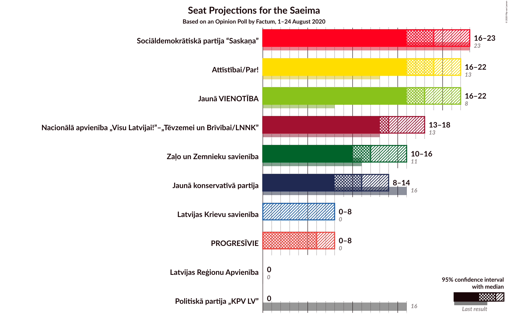
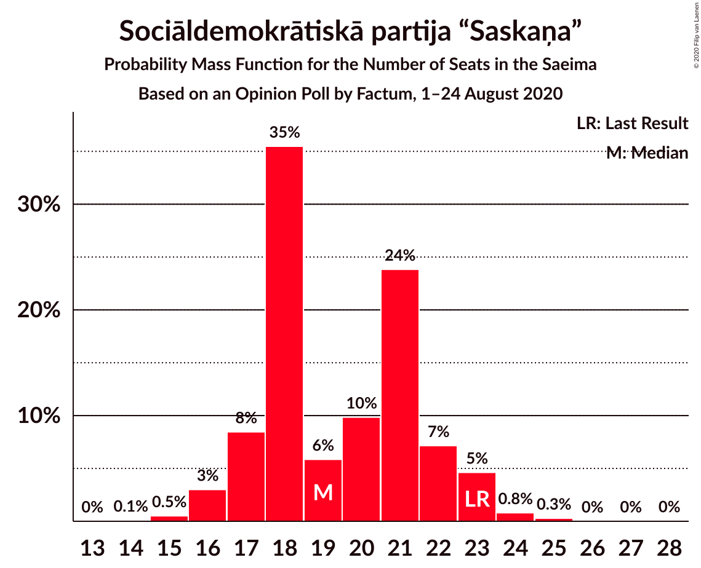
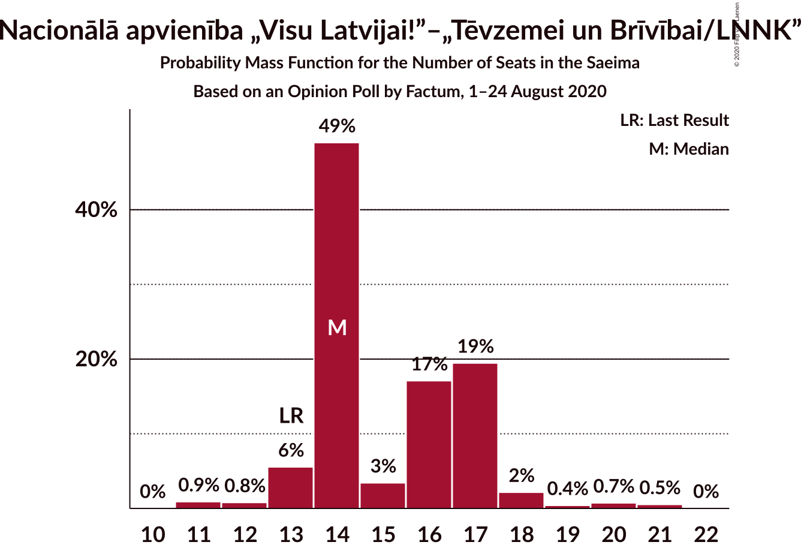
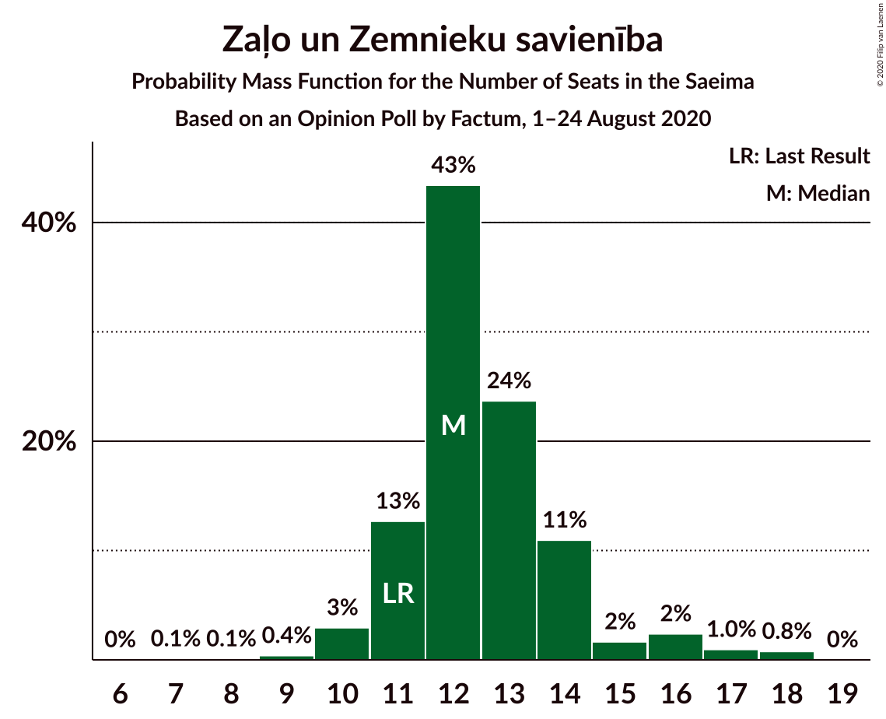
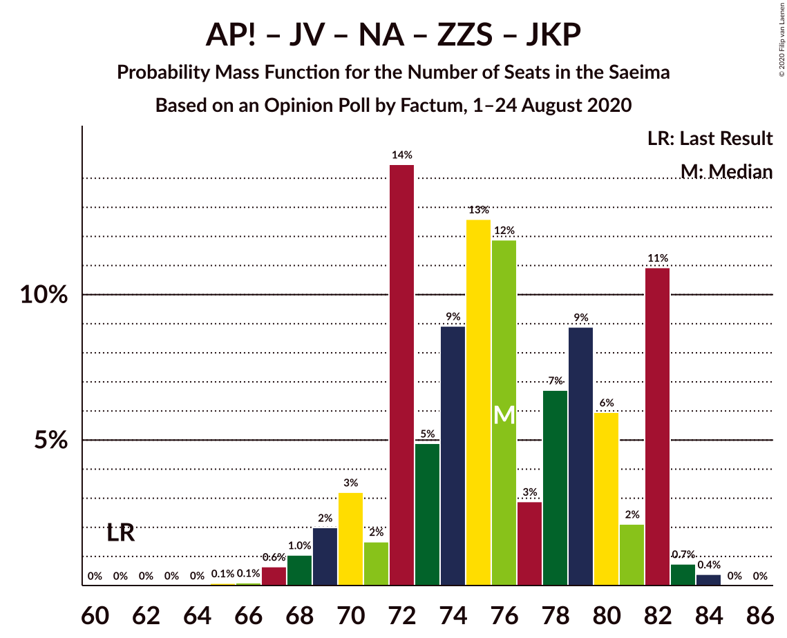
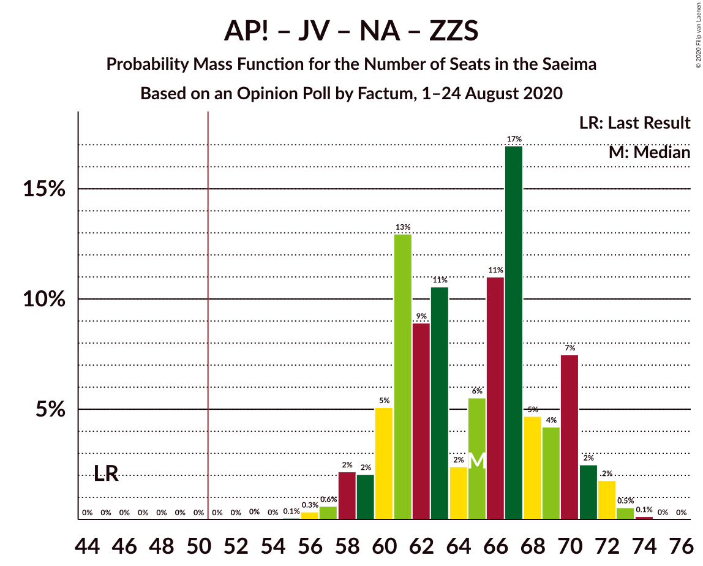
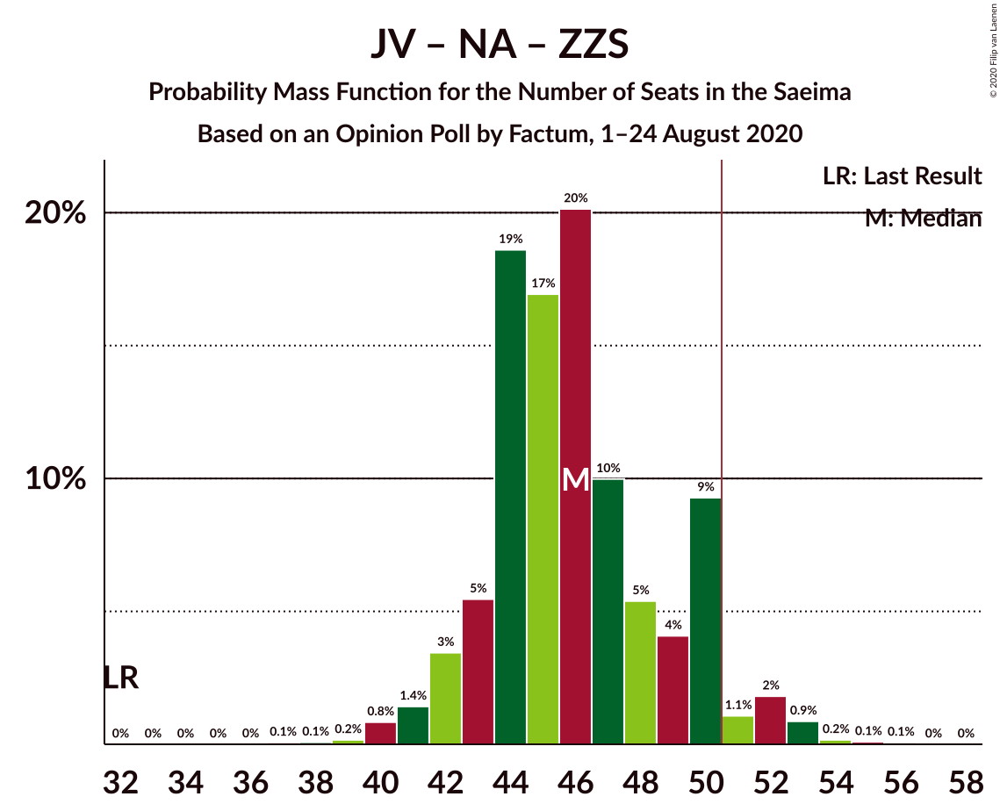

# Opinion Poll by Factum, 1–24 August 2020

<a href="#voting-intentions">Voting Intentions</a> | <a href="#seats">Seats</a> | <a href="#coalitions">Coalitions</a> | <a href="#technical-information">Technical Information</a>

## Voting Intentions

### Confidence Intervals

| Party | Last Result | Poll Result | 80% Confidence Interval | 90% Confidence Interval | 95% Confidence Interval | 99% Confidence Interval |
|:-----:|:-----------:|:-----------:|:-----------------------:|:-----------------------:|:-----------------------:|:-----------------------:|
| Attīstībai/Par! | 12.0% | 16.2% | 14.4–18.2% |13.9–18.7% |13.5–19.2% |12.7–20.2% |
| Sociāldemokrātiskā partija “Saskaņa” | 19.8% | 15.2% | 13.5–17.2% |13.0–17.7% |12.7–18.2% |11.9–19.2% |
| Jaunā VIENOTĪBA | 6.7% | 15.2% | 13.5–17.2% |13.0–17.7% |12.7–18.2% |11.9–19.2% |
| Nacionālā apvienība „Visu Latvijai!”–„Tēvzemei un Brīvībai/LNNK” | 11.0% | 13.2% | 11.6–15.1% |11.2–15.6% |10.8–16.0% |10.1–17.0% |
| Zaļo un Zemnieku savienība | 9.9% | 10.0% | 8.7–11.7% |8.3–12.2% |7.9–12.6% |7.3–13.5% |
| Jaunā konservatīvā partija | 13.6% | 9.1% | 7.8–10.7% |7.4–11.2% |7.1–11.6% |6.5–12.4% |
| PROGRESĪVIE | 2.6% | 5.0% | 4.1–6.3% |3.8–6.7% |3.6–7.0% |3.2–7.7% |
| Latvijas Krievu savienība | 3.2% | 4.1% | 3.2–5.3% |3.0–5.6% |2.8–5.9% |2.4–6.5% |
| Latvijas Reģionu Apvienība | 4.1% | 3.0% | 2.3–4.0% |2.1–4.3% |1.9–4.6% |1.6–5.2% |
| Politiskā partija „KPV LV” | 14.2% | 2.0% | 1.5–3.0% |1.3–3.2% |1.2–3.5% |1.0–4.0% |

*Note:* The poll result column reflects the actual value used in the calculations. Published results may vary slightly, and in addition be rounded to fewer digits.

## Seats

### Confidence Intervals

| Party | Last Result | Median | 80% Confidence Interval | 90% Confidence Interval | 95% Confidence Interval | 99% Confidence Interval |
|:-----:|:-----------:|:------:|:-----------------------:|:-----------------------:|:-----------------------:|:-----------------------:|
| <a href="#attīstībai/par!">Attīstībai/Par!</a> | 13 | 18 | 17–21 |16–21 |16–21 |15–23 |
| <a href="#sociāldemokrātiskā-partija-“saskaņa”">Sociāldemokrātiskā partija “Saskaņa”</a> | 23 | 18 | 16–21 |16–23 |16–24 |15–28 |
| <a href="#jaunā-vienotība">Jaunā VIENOTĪBA</a> | 8 | 19 | 17–23 |16–23 |15–23 |14–23 |
| <a href="#nacionālā-apvienība-„visu-latvijai!”–„tēvzemei-un-brīvībai/lnnk”">Nacionālā apvienība „Visu Latvijai!”–„Tēvzemei un Brīvībai/LNNK”</a> | 13 | 17 | 14–17 |14–18 |13–20 |12–21 |
| <a href="#zaļo-un-zemnieku-savienība">Zaļo un Zemnieku savienība</a> | 11 | 11 | 11–14 |10–15 |10–16 |9–18 |
| <a href="#jaunā-konservatīvā-partija">Jaunā konservatīvā partija</a> | 16 | 11 | 9–13 |9–15 |8–15 |7–15 |
| <a href="#progresīvie">PROGRESĪVIE</a> | 0 | 0 | 0–7 |0–8 |0–9 |0–9 |
| <a href="#latvijas-krievu-savienība">Latvijas Krievu savienība</a> | 0 | 0 | 0–8 |0–8 |0–8 |0–8 |
| <a href="#latvijas-reģionu-apvienība">Latvijas Reģionu Apvienība</a> | 0 | 0 | 0 |0 |0 |0–6 |
| <a href="#politiskā-partija-„kpv-lv”">Politiskā partija „KPV LV”</a> | 16 | 0 | 0 |0 |0 |0 |

### Attīstībai/Par!

*For a full overview of the results for this party, see the [Attīstībai/Par!](party-attīstībaipar.html) page.*

| Number of Seats | Probability | Accumulated | Special Marks |
|:---------------:|:-----------:|:-----------:|:-------------:|
| 13 | 0% | 100% | Last Result |
| 14 | 0.3% | 100% |  |
| 15 | 0.7% | 99.7% |  |
| 16 | 8% | 99.0% |  |
| 17 | 31% | 91% |  |
| 18 | 25% | 60% | Median |
| 19 | 11% | 35% |  |
| 20 | 11% | 24% |  |
| 21 | 10% | 13% |  |
| 22 | 2% | 2% |  |
| 23 | 0.4% | 0.6% |  |
| 24 | 0.1% | 0.2% |  |
| 25 | 0.1% | 0.1% |  |
| 26 | 0% | 0% |  |

### Sociāldemokrātiskā partija “Saskaņa”

*For a full overview of the results for this party, see the [Sociāldemokrātiskā partija “Saskaņa”](party-sociāldemokrātiskāpartija“saskaņa”.html) page.*

| Number of Seats | Probability | Accumulated | Special Marks |
|:---------------:|:-----------:|:-----------:|:-------------:|
| 13 | 0.1% | 100% |  |
| 14 | 0.1% | 99.9% |  |
| 15 | 1.0% | 99.8% |  |
| 16 | 25% | 98.8% |  |
| 17 | 22% | 74% |  |
| 18 | 18% | 52% | Median |
| 19 | 4% | 34% |  |
| 20 | 16% | 30% |  |
| 21 | 5% | 13% |  |
| 22 | 4% | 9% |  |
| 23 | 1.0% | 5% | Last Result |
| 24 | 3% | 4% |  |
| 25 | 0.5% | 1.2% |  |
| 26 | 0% | 0.7% |  |
| 27 | 0% | 0.7% |  |
| 28 | 0.7% | 0.7% |  |
| 29 | 0% | 0% |  |

### Jaunā VIENOTĪBA

*For a full overview of the results for this party, see the [Jaunā VIENOTĪBA](party-jaunāvienotība.html) page.*

| Number of Seats | Probability | Accumulated | Special Marks |
|:---------------:|:-----------:|:-----------:|:-------------:|
| 8 | 0% | 100% | Last Result |
| 9 | 0% | 100% |  |
| 10 | 0% | 100% |  |
| 11 | 0% | 100% |  |
| 12 | 0.1% | 100% |  |
| 13 | 0% | 99.9% |  |
| 14 | 1.0% | 99.8% |  |
| 15 | 2% | 98.8% |  |
| 16 | 6% | 97% |  |
| 17 | 3% | 92% |  |
| 18 | 18% | 89% |  |
| 19 | 29% | 71% | Median |
| 20 | 14% | 42% |  |
| 21 | 3% | 28% |  |
| 22 | 1.3% | 25% |  |
| 23 | 23% | 24% |  |
| 24 | 0.1% | 0.1% |  |
| 25 | 0% | 0% |  |

### Nacionālā apvienība „Visu Latvijai!”–„Tēvzemei un Brīvībai/LNNK”

*For a full overview of the results for this party, see the [Nacionālā apvienība „Visu Latvijai!”–„Tēvzemei un Brīvībai/LNNK”](party-nacionālāapvienība„visulatvijai”–„tēvzemeiunbrīvībailnnk”.html) page.*

| Number of Seats | Probability | Accumulated | Special Marks |
|:---------------:|:-----------:|:-----------:|:-------------:|
| 11 | 0.4% | 100% |  |
| 12 | 0.3% | 99.5% |  |
| 13 | 4% | 99.3% | Last Result |
| 14 | 8% | 96% |  |
| 15 | 5% | 88% |  |
| 16 | 9% | 83% |  |
| 17 | 68% | 74% | Median |
| 18 | 2% | 5% |  |
| 19 | 0.4% | 3% |  |
| 20 | 1.0% | 3% |  |
| 21 | 1.5% | 2% |  |
| 22 | 0.2% | 0.2% |  |
| 23 | 0.1% | 0.1% |  |
| 24 | 0% | 0% |  |

### Zaļo un Zemnieku savienība

*For a full overview of the results for this party, see the [Zaļo un Zemnieku savienība](party-zaļounzemniekusavienība.html) page.*

| Number of Seats | Probability | Accumulated | Special Marks |
|:---------------:|:-----------:|:-----------:|:-------------:|
| 7 | 0.2% | 100% |  |
| 8 | 0.1% | 99.8% |  |
| 9 | 2% | 99.7% |  |
| 10 | 4% | 98% |  |
| 11 | 46% | 93% | Last Result, Median |
| 12 | 30% | 47% |  |
| 13 | 6% | 17% |  |
| 14 | 4% | 10% |  |
| 15 | 2% | 6% |  |
| 16 | 2% | 4% |  |
| 17 | 1.1% | 2% |  |
| 18 | 0.7% | 0.7% |  |
| 19 | 0% | 0% |  |

### Jaunā konservatīvā partija

*For a full overview of the results for this party, see the [Jaunā konservatīvā partija](party-jaunākonservatīvāpartija.html) page.*

| Number of Seats | Probability | Accumulated | Special Marks |
|:---------------:|:-----------:|:-----------:|:-------------:|
| 7 | 1.5% | 100% |  |
| 8 | 1.4% | 98% |  |
| 9 | 20% | 97% |  |
| 10 | 13% | 77% |  |
| 11 | 40% | 64% | Median |
| 12 | 6% | 24% |  |
| 13 | 8% | 18% |  |
| 14 | 3% | 10% |  |
| 15 | 6% | 6% |  |
| 16 | 0% | 0% | Last Result |

### PROGRESĪVIE

*For a full overview of the results for this party, see the [PROGRESĪVIE](party-progresīvie.html) page.*

| Number of Seats | Probability | Accumulated | Special Marks |
|:---------------:|:-----------:|:-----------:|:-------------:|
| 0 | 78% | 100% | Last Result, Median |
| 1 | 0% | 22% |  |
| 2 | 0% | 22% |  |
| 3 | 0% | 22% |  |
| 4 | 0% | 22% |  |
| 5 | 0% | 22% |  |
| 6 | 2% | 22% |  |
| 7 | 12% | 20% |  |
| 8 | 4% | 9% |  |
| 9 | 5% | 5% |  |
| 10 | 0% | 0% |  |

### Latvijas Krievu savienība

*For a full overview of the results for this party, see the [Latvijas Krievu savienība](party-latvijaskrievusavienība.html) page.*

| Number of Seats | Probability | Accumulated | Special Marks |
|:---------------:|:-----------:|:-----------:|:-------------:|
| 0 | 63% | 100% | Last Result, Median |
| 1 | 0% | 37% |  |
| 2 | 0% | 37% |  |
| 3 | 0% | 37% |  |
| 4 | 0% | 37% |  |
| 5 | 0% | 37% |  |
| 6 | 0.2% | 37% |  |
| 7 | 0.3% | 37% |  |
| 8 | 36% | 36% |  |
| 9 | 0.2% | 0.2% |  |
| 10 | 0% | 0% |  |

### Latvijas Reģionu Apvienība

*For a full overview of the results for this party, see the [Latvijas Reģionu Apvienība](party-latvijasreģionuapvienība.html) page.*

| Number of Seats | Probability | Accumulated | Special Marks |
|:---------------:|:-----------:|:-----------:|:-------------:|
| 0 | 99.5% | 100% | Last Result, Median |
| 1 | 0% | 0.5% |  |
| 2 | 0% | 0.5% |  |
| 3 | 0% | 0.5% |  |
| 4 | 0% | 0.5% |  |
| 5 | 0% | 0.5% |  |
| 6 | 0.5% | 0.5% |  |
| 7 | 0% | 0% |  |

### Politiskā partija „KPV LV”

*For a full overview of the results for this party, see the [Politiskā partija „KPV LV”](party-politiskāpartija„kpvlv”.html) page.*

| Number of Seats | Probability | Accumulated | Special Marks |
|:---------------:|:-----------:|:-----------:|:-------------:|
| 0 | 100% | 100% | Median |
| 1 | 0% | 0% |  |
| 2 | 0% | 0% |  |
| 3 | 0% | 0% |  |
| 4 | 0% | 0% |  |
| 5 | 0% | 0% |  |
| 6 | 0% | 0% |  |
| 7 | 0% | 0% |  |
| 8 | 0% | 0% |  |
| 9 | 0% | 0% |  |
| 10 | 0% | 0% |  |
| 11 | 0% | 0% |  |
| 12 | 0% | 0% |  |
| 13 | 0% | 0% |  |
| 14 | 0% | 0% |  |
| 15 | 0% | 0% |  |
| 16 | 0% | 0% | Last Result |

## Coalitions

### Confidence Intervals

| Coalition | Last Result | Median | Majority? | 80% Confidence Interval | 90% Confidence Interval | 95% Confidence Interval | 99% Confidence Interval |
|:---------:|:-----------:|:------:|:---------:|:-----------------------:|:-----------------------:|:-----------------------:|:-----------------------:|
| Attīstībai/Par! – Jaunā VIENOTĪBA – Nacionālā apvienība „Visu Latvijai!”–„Tēvzemei un Brīvībai/LNNK” – Zaļo un Zemnieku savienība – Jaunā konservatīvā partija | 61 | 76 | 100% | 73–82 | 72–83 | 71–84 | 69–84 |
| Attīstībai/Par! – Jaunā VIENOTĪBA – Nacionālā apvienība „Visu Latvijai!”–„Tēvzemei un Brīvībai/LNNK” – Zaļo un Zemnieku savienība | 45 | 65 | 100% | 62–69 | 61–70 | 60–72 | 57–74 |
| Attīstībai/Par! – Jaunā VIENOTĪBA – Nacionālā apvienība „Visu Latvijai!”–„Tēvzemei un Brīvībai/LNNK” – Jaunā konservatīvā partija | 50 | 65 | 100% | 61–70 | 60–71 | 59–72 | 54–72 |
| Attīstībai/Par! – Jaunā VIENOTĪBA – Nacionālā apvienība „Visu Latvijai!”–„Tēvzemei un Brīvībai/LNNK” – Jaunā konservatīvā partija – Politiskā partija „KPV LV” | 66 | 65 | 100% | 61–70 | 60–71 | 59–72 | 54–72 |
| Jaunā VIENOTĪBA – Nacionālā apvienība „Visu Latvijai!”–„Tēvzemei un Brīvībai/LNNK” – Zaļo un Zemnieku savienība – Jaunā konservatīvā partija | 48 | 58 | 99.6% | 54–64 | 54–65 | 53–65 | 51–66 |
| Attīstībai/Par! – Nacionālā apvienība „Visu Latvijai!”–„Tēvzemei un Brīvībai/LNNK” – Zaļo un Zemnieku savienība – Jaunā konservatīvā partija | 53 | 57 | 99.7% | 54–62 | 52–63 | 52–64 | 51–64 |
| Attīstībai/Par! – Jaunā VIENOTĪBA – Nacionālā apvienība „Visu Latvijai!”–„Tēvzemei un Brīvībai/LNNK” – Politiskā partija „KPV LV” | 50 | 54 | 89% | 50–57 | 49–58 | 47–60 | 45–61 |
| Attīstībai/Par! – Jaunā VIENOTĪBA – Jaunā konservatīvā partija – Politiskā partija „KPV LV” | 53 | 48 | 34% | 46–54 | 45–54 | 43–55 | 41–55 |
| Attīstībai/Par! – Sociāldemokrātiskā partija “Saskaņa” – Jaunā konservatīvā partija | 52 | 47 | 16% | 45–51 | 44–53 | 44–54 | 41–57 |
| Jaunā VIENOTĪBA – Nacionālā apvienība „Visu Latvijai!”–„Tēvzemei un Brīvībai/LNNK” – Zaļo un Zemnieku savienība | 32 | 47 | 27% | 45–52 | 43–52 | 42–53 | 39–56 |
| Attīstībai/Par! – Nacionālā apvienība „Visu Latvijai!”–„Tēvzemei un Brīvībai/LNNK” – Zaļo un Zemnieku savienība | 37 | 46 | 6% | 44–49 | 42–51 | 41–53 | 40–54 |
| Jaunā VIENOTĪBA – Nacionālā apvienība „Visu Latvijai!”–„Tēvzemei un Brīvībai/LNNK” – Jaunā konservatīvā partija – Politiskā partija „KPV LV” | 53 | 47 | 30% | 43–52 | 42–52 | 40–53 | 38–54 |
| Attīstībai/Par! – Nacionālā apvienība „Visu Latvijai!”–„Tēvzemei un Brīvībai/LNNK” – Jaunā konservatīvā partija – Politiskā partija „KPV LV” | 58 | 46 | 8% | 42–49 | 41–52 | 41–52 | 38–52 |
| Nacionālā apvienība „Visu Latvijai!”–„Tēvzemei un Brīvībai/LNNK” – Zaļo un Zemnieku savienība – Jaunā konservatīvā partija | 40 | 39 | 0% | 36–43 | 35–44 | 35–44 | 33–45 |
| Attīstībai/Par! – Sociāldemokrātiskā partija “Saskaņa” | 36 | 36 | 0% | 34–40 | 34–42 | 33–44 | 32–45 |
| Sociāldemokrātiskā partija “Saskaņa” – Zaļo un Zemnieku savienība – Politiskā partija „KPV LV” | 50 | 29 | 0% | 27–33 | 27–38 | 27–39 | 26–40 |
| Sociāldemokrātiskā partija “Saskaņa” – Politiskā partija „KPV LV” | 39 | 18 | 0% | 16–21 | 16–23 | 16–24 | 15–28 |

### Attīstībai/Par! – Jaunā VIENOTĪBA – Nacionālā apvienība „Visu Latvijai!”–„Tēvzemei un Brīvībai/LNNK” – Zaļo un Zemnieku savienība – Jaunā konservatīvā partija

| Number of Seats | Probability | Accumulated | Special Marks |
|:---------------:|:-----------:|:-----------:|:-------------:|
| 61 | 0% | 100% | Last Result |
| 62 | 0% | 100% |  |
| 63 | 0% | 100% |  |
| 64 | 0% | 100% |  |
| 65 | 0% | 100% |  |
| 66 | 0% | 100% |  |
| 67 | 0.2% | 99.9% |  |
| 68 | 0.1% | 99.7% |  |
| 69 | 1.0% | 99.6% |  |
| 70 | 0.6% | 98.6% |  |
| 71 | 2% | 98% |  |
| 72 | 5% | 96% |  |
| 73 | 2% | 91% |  |
| 74 | 7% | 89% |  |
| 75 | 17% | 81% |  |
| 76 | 25% | 64% | Median |
| 77 | 0.9% | 39% |  |
| 78 | 3% | 39% |  |
| 79 | 0.8% | 36% |  |
| 80 | 16% | 35% |  |
| 81 | 0.9% | 19% |  |
| 82 | 11% | 18% |  |
| 83 | 3% | 7% |  |
| 84 | 4% | 4% |  |
| 85 | 0% | 0% |  |

### Attīstībai/Par! – Jaunā VIENOTĪBA – Nacionālā apvienība „Visu Latvijai!”–„Tēvzemei un Brīvībai/LNNK” – Zaļo un Zemnieku savienība

| Number of Seats | Probability | Accumulated | Special Marks |
|:---------------:|:-----------:|:-----------:|:-------------:|
| 45 | 0% | 100% | Last Result |
| 46 | 0% | 100% |  |
| 47 | 0% | 100% |  |
| 48 | 0% | 100% |  |
| 49 | 0% | 100% |  |
| 50 | 0% | 100% |  |
| 51 | 0% | 100% | Majority |
| 52 | 0% | 100% |  |
| 53 | 0% | 100% |  |
| 54 | 0% | 100% |  |
| 55 | 0.1% | 100% |  |
| 56 | 0.3% | 99.9% |  |
| 57 | 0.3% | 99.7% |  |
| 58 | 0.3% | 99.4% |  |
| 59 | 0.7% | 99.1% |  |
| 60 | 3% | 98% |  |
| 61 | 4% | 95% |  |
| 62 | 2% | 91% |  |
| 63 | 4% | 89% |  |
| 64 | 2% | 85% |  |
| 65 | 36% | 83% | Median |
| 66 | 5% | 47% |  |
| 67 | 6% | 41% |  |
| 68 | 3% | 36% |  |
| 69 | 25% | 33% |  |
| 70 | 4% | 8% |  |
| 71 | 1.0% | 4% |  |
| 72 | 1.1% | 3% |  |
| 73 | 0.1% | 2% |  |
| 74 | 2% | 2% |  |
| 75 | 0% | 0% |  |

### Attīstībai/Par! – Jaunā VIENOTĪBA – Nacionālā apvienība „Visu Latvijai!”–„Tēvzemei un Brīvībai/LNNK” – Jaunā konservatīvā partija

| Number of Seats | Probability | Accumulated | Special Marks |
|:---------------:|:-----------:|:-----------:|:-------------:|
| 50 | 0% | 100% | Last Result |
| 51 | 0% | 100% | Majority |
| 52 | 0% | 100% |  |
| 53 | 0% | 100% |  |
| 54 | 0.6% | 100% |  |
| 55 | 0.2% | 99.4% |  |
| 56 | 0.4% | 99.2% |  |
| 57 | 0.2% | 98.8% |  |
| 58 | 0.7% | 98.6% |  |
| 59 | 1.5% | 98% |  |
| 60 | 2% | 96% |  |
| 61 | 5% | 94% |  |
| 62 | 10% | 89% |  |
| 63 | 4% | 78% |  |
| 64 | 14% | 74% |  |
| 65 | 24% | 60% | Median |
| 66 | 0.9% | 36% |  |
| 67 | 1.0% | 35% |  |
| 68 | 13% | 34% |  |
| 69 | 7% | 21% |  |
| 70 | 4% | 14% |  |
| 71 | 6% | 10% |  |
| 72 | 4% | 4% |  |
| 73 | 0% | 0.1% |  |
| 74 | 0% | 0% |  |

### Attīstībai/Par! – Jaunā VIENOTĪBA – Nacionālā apvienība „Visu Latvijai!”–„Tēvzemei un Brīvībai/LNNK” – Jaunā konservatīvā partija – Politiskā partija „KPV LV”

| Number of Seats | Probability | Accumulated | Special Marks |
|:---------------:|:-----------:|:-----------:|:-------------:|
| 54 | 0.6% | 100% |  |
| 55 | 0.2% | 99.4% |  |
| 56 | 0.4% | 99.2% |  |
| 57 | 0.2% | 98.8% |  |
| 58 | 0.7% | 98.6% |  |
| 59 | 1.5% | 98% |  |
| 60 | 2% | 96% |  |
| 61 | 5% | 94% |  |
| 62 | 10% | 89% |  |
| 63 | 4% | 78% |  |
| 64 | 14% | 74% |  |
| 65 | 24% | 60% | Median |
| 66 | 0.9% | 36% | Last Result |
| 67 | 1.0% | 35% |  |
| 68 | 13% | 34% |  |
| 69 | 7% | 21% |  |
| 70 | 4% | 14% |  |
| 71 | 6% | 10% |  |
| 72 | 4% | 4% |  |
| 73 | 0% | 0.1% |  |
| 74 | 0% | 0% |  |

### Jaunā VIENOTĪBA – Nacionālā apvienība „Visu Latvijai!”–„Tēvzemei un Brīvībai/LNNK” – Zaļo un Zemnieku savienība – Jaunā konservatīvā partija

| Number of Seats | Probability | Accumulated | Special Marks |
|:---------------:|:-----------:|:-----------:|:-------------:|
| 48 | 0.1% | 100% | Last Result |
| 49 | 0% | 99.9% |  |
| 50 | 0.3% | 99.9% |  |
| 51 | 0.7% | 99.6% | Majority |
| 52 | 1.1% | 98.9% |  |
| 53 | 2% | 98% |  |
| 54 | 7% | 96% |  |
| 55 | 5% | 89% |  |
| 56 | 15% | 84% |  |
| 57 | 5% | 70% |  |
| 58 | 24% | 64% | Median |
| 59 | 4% | 40% |  |
| 60 | 0.9% | 36% |  |
| 61 | 3% | 35% |  |
| 62 | 6% | 31% |  |
| 63 | 13% | 25% |  |
| 64 | 4% | 12% |  |
| 65 | 7% | 8% |  |
| 66 | 1.0% | 1.2% |  |
| 67 | 0.2% | 0.2% |  |
| 68 | 0% | 0% |  |

### Attīstībai/Par! – Nacionālā apvienība „Visu Latvijai!”–„Tēvzemei un Brīvībai/LNNK” – Zaļo un Zemnieku savienība – Jaunā konservatīvā partija

| Number of Seats | Probability | Accumulated | Special Marks |
|:---------------:|:-----------:|:-----------:|:-------------:|
| 49 | 0.2% | 100% |  |
| 50 | 0.1% | 99.8% |  |
| 51 | 1.3% | 99.7% | Majority |
| 52 | 4% | 98% |  |
| 53 | 2% | 95% | Last Result |
| 54 | 7% | 93% |  |
| 55 | 2% | 85% |  |
| 56 | 4% | 83% |  |
| 57 | 50% | 79% | Median |
| 58 | 2% | 30% |  |
| 59 | 9% | 27% |  |
| 60 | 3% | 18% |  |
| 61 | 0.9% | 14% |  |
| 62 | 4% | 13% |  |
| 63 | 5% | 9% |  |
| 64 | 4% | 4% |  |
| 65 | 0.1% | 0.1% |  |
| 66 | 0% | 0.1% |  |
| 67 | 0% | 0% |  |

### Attīstībai/Par! – Jaunā VIENOTĪBA – Nacionālā apvienība „Visu Latvijai!”–„Tēvzemei un Brīvībai/LNNK” – Politiskā partija „KPV LV”

| Number of Seats | Probability | Accumulated | Special Marks |
|:---------------:|:-----------:|:-----------:|:-------------:|
| 43 | 0% | 100% |  |
| 44 | 0.1% | 99.9% |  |
| 45 | 1.1% | 99.8% |  |
| 46 | 0.9% | 98.7% |  |
| 47 | 0.7% | 98% |  |
| 48 | 1.1% | 97% |  |
| 49 | 2% | 96% |  |
| 50 | 5% | 94% | Last Result |
| 51 | 4% | 89% | Majority |
| 52 | 3% | 85% |  |
| 53 | 9% | 82% |  |
| 54 | 31% | 73% | Median |
| 55 | 2% | 42% |  |
| 56 | 7% | 40% |  |
| 57 | 26% | 33% |  |
| 58 | 4% | 7% |  |
| 59 | 0.1% | 3% |  |
| 60 | 1.4% | 3% |  |
| 61 | 1.2% | 1.2% |  |
| 62 | 0.1% | 0.1% |  |
| 63 | 0% | 0% |  |

### Attīstībai/Par! – Jaunā VIENOTĪBA – Jaunā konservatīvā partija – Politiskā partija „KPV LV”

| Number of Seats | Probability | Accumulated | Special Marks |
|:---------------:|:-----------:|:-----------:|:-------------:|
| 40 | 0.1% | 100% |  |
| 41 | 1.0% | 99.9% |  |
| 42 | 0.4% | 98.9% |  |
| 43 | 2% | 98.6% |  |
| 44 | 1.1% | 96% |  |
| 45 | 4% | 95% |  |
| 46 | 8% | 92% |  |
| 47 | 20% | 84% |  |
| 48 | 25% | 64% | Median |
| 49 | 4% | 39% |  |
| 50 | 1.2% | 35% |  |
| 51 | 14% | 34% | Majority |
| 52 | 6% | 20% |  |
| 53 | 4% | 14% | Last Result |
| 54 | 6% | 10% |  |
| 55 | 4% | 4% |  |
| 56 | 0% | 0.1% |  |
| 57 | 0% | 0% |  |

### Attīstībai/Par! – Sociāldemokrātiskā partija “Saskaņa” – Jaunā konservatīvā partija

| Number of Seats | Probability | Accumulated | Special Marks |
|:---------------:|:-----------:|:-----------:|:-------------:|
| 39 | 0.1% | 100% |  |
| 40 | 0.3% | 99.9% |  |
| 41 | 0.3% | 99.7% |  |
| 42 | 0.5% | 99.4% |  |
| 43 | 0.9% | 98.8% |  |
| 44 | 7% | 98% |  |
| 45 | 21% | 91% |  |
| 46 | 14% | 70% |  |
| 47 | 9% | 56% | Median |
| 48 | 22% | 46% |  |
| 49 | 6% | 25% |  |
| 50 | 3% | 18% |  |
| 51 | 7% | 16% | Majority |
| 52 | 0.7% | 9% | Last Result |
| 53 | 4% | 8% |  |
| 54 | 2% | 4% |  |
| 55 | 0.9% | 2% |  |
| 56 | 0.2% | 1.3% |  |
| 57 | 0.8% | 1.1% |  |
| 58 | 0.2% | 0.3% |  |
| 59 | 0% | 0% |  |

### Jaunā VIENOTĪBA – Nacionālā apvienība „Visu Latvijai!”–„Tēvzemei un Brīvībai/LNNK” – Zaļo un Zemnieku savienība

| Number of Seats | Probability | Accumulated | Special Marks |
|:---------------:|:-----------:|:-----------:|:-------------:|
| 32 | 0% | 100% | Last Result |
| 33 | 0% | 100% |  |
| 34 | 0% | 100% |  |
| 35 | 0% | 100% |  |
| 36 | 0% | 100% |  |
| 37 | 0% | 100% |  |
| 38 | 0.1% | 100% |  |
| 39 | 0.5% | 99.9% |  |
| 40 | 0.4% | 99.4% |  |
| 41 | 0.4% | 99.0% |  |
| 42 | 1.3% | 98.6% |  |
| 43 | 2% | 97% |  |
| 44 | 4% | 95% |  |
| 45 | 9% | 91% |  |
| 46 | 15% | 82% |  |
| 47 | 25% | 67% | Median |
| 48 | 6% | 42% |  |
| 49 | 7% | 36% |  |
| 50 | 2% | 29% |  |
| 51 | 4% | 27% | Majority |
| 52 | 18% | 23% |  |
| 53 | 4% | 5% |  |
| 54 | 0.1% | 1.0% |  |
| 55 | 0% | 0.9% |  |
| 56 | 0.8% | 0.9% |  |
| 57 | 0% | 0% |  |

### Attīstībai/Par! – Nacionālā apvienība „Visu Latvijai!”–„Tēvzemei un Brīvībai/LNNK” – Zaļo un Zemnieku savienība

| Number of Seats | Probability | Accumulated | Special Marks |
|:---------------:|:-----------:|:-----------:|:-------------:|
| 37 | 0% | 100% | Last Result |
| 38 | 0.1% | 100% |  |
| 39 | 0.1% | 99.9% |  |
| 40 | 0.4% | 99.8% |  |
| 41 | 4% | 99.4% |  |
| 42 | 2% | 95% |  |
| 43 | 2% | 93% |  |
| 44 | 3% | 91% |  |
| 45 | 8% | 88% |  |
| 46 | 40% | 80% | Median |
| 47 | 16% | 40% |  |
| 48 | 7% | 25% |  |
| 49 | 8% | 18% |  |
| 50 | 3% | 9% |  |
| 51 | 2% | 6% | Majority |
| 52 | 0.5% | 4% |  |
| 53 | 2% | 4% |  |
| 54 | 1.2% | 1.3% |  |
| 55 | 0% | 0.1% |  |
| 56 | 0% | 0.1% |  |
| 57 | 0% | 0% |  |

### Jaunā VIENOTĪBA – Nacionālā apvienība „Visu Latvijai!”–„Tēvzemei un Brīvībai/LNNK” – Jaunā konservatīvā partija – Politiskā partija „KPV LV”

| Number of Seats | Probability | Accumulated | Special Marks |
|:---------------:|:-----------:|:-----------:|:-------------:|
| 35 | 0.1% | 100% |  |
| 36 | 0.1% | 99.9% |  |
| 37 | 0.1% | 99.9% |  |
| 38 | 0.9% | 99.8% |  |
| 39 | 0.8% | 98.8% |  |
| 40 | 1.1% | 98% |  |
| 41 | 2% | 97% |  |
| 42 | 4% | 95% |  |
| 43 | 3% | 91% |  |
| 44 | 8% | 88% |  |
| 45 | 21% | 81% |  |
| 46 | 2% | 60% |  |
| 47 | 23% | 58% | Median |
| 48 | 2% | 34% |  |
| 49 | 2% | 32% |  |
| 50 | 1.3% | 31% |  |
| 51 | 18% | 30% | Majority |
| 52 | 7% | 12% |  |
| 53 | 3% | 5% | Last Result |
| 54 | 2% | 2% |  |
| 55 | 0% | 0% |  |

### Attīstībai/Par! – Nacionālā apvienība „Visu Latvijai!”–„Tēvzemei un Brīvībai/LNNK” – Jaunā konservatīvā partija – Politiskā partija „KPV LV”

| Number of Seats | Probability | Accumulated | Special Marks |
|:---------------:|:-----------:|:-----------:|:-------------:|
| 38 | 0.9% | 100% |  |
| 39 | 0.2% | 99.1% |  |
| 40 | 1.3% | 98.8% |  |
| 41 | 3% | 98% |  |
| 42 | 5% | 94% |  |
| 43 | 7% | 89% |  |
| 44 | 5% | 83% |  |
| 45 | 18% | 77% |  |
| 46 | 37% | 60% | Median |
| 47 | 8% | 23% |  |
| 48 | 3% | 15% |  |
| 49 | 2% | 12% |  |
| 50 | 0.7% | 9% |  |
| 51 | 1.0% | 8% | Majority |
| 52 | 7% | 7% |  |
| 53 | 0.1% | 0.1% |  |
| 54 | 0% | 0.1% |  |
| 55 | 0% | 0% |  |
| 56 | 0% | 0% |  |
| 57 | 0% | 0% |  |
| 58 | 0% | 0% | Last Result |

### Nacionālā apvienība „Visu Latvijai!”–„Tēvzemei un Brīvībai/LNNK” – Zaļo un Zemnieku savienība – Jaunā konservatīvā partija

| Number of Seats | Probability | Accumulated | Special Marks |
|:---------------:|:-----------:|:-----------:|:-------------:|
| 32 | 0.5% | 100% |  |
| 33 | 0.2% | 99.5% |  |
| 34 | 1.4% | 99.3% |  |
| 35 | 4% | 98% |  |
| 36 | 9% | 94% |  |
| 37 | 8% | 86% |  |
| 38 | 13% | 78% |  |
| 39 | 24% | 64% | Median |
| 40 | 15% | 41% | Last Result |
| 41 | 4% | 25% |  |
| 42 | 12% | 22% |  |
| 43 | 5% | 10% |  |
| 44 | 4% | 5% |  |
| 45 | 1.0% | 1.4% |  |
| 46 | 0.2% | 0.4% |  |
| 47 | 0.2% | 0.3% |  |
| 48 | 0% | 0% |  |

### Attīstībai/Par! – Sociāldemokrātiskā partija “Saskaņa”

| Number of Seats | Probability | Accumulated | Special Marks |
|:---------------:|:-----------:|:-----------:|:-------------:|
| 30 | 0.1% | 100% |  |
| 31 | 0.3% | 99.9% |  |
| 32 | 0.4% | 99.6% |  |
| 33 | 2% | 99.1% |  |
| 34 | 22% | 97% |  |
| 35 | 14% | 74% |  |
| 36 | 16% | 61% | Last Result, Median |
| 37 | 19% | 45% |  |
| 38 | 11% | 26% |  |
| 39 | 5% | 15% |  |
| 40 | 3% | 10% |  |
| 41 | 2% | 8% |  |
| 42 | 3% | 6% |  |
| 43 | 0.2% | 3% |  |
| 44 | 0.3% | 3% |  |
| 45 | 2% | 2% |  |
| 46 | 0% | 0.1% |  |
| 47 | 0% | 0.1% |  |
| 48 | 0% | 0% |  |

### Sociāldemokrātiskā partija “Saskaņa” – Zaļo un Zemnieku savienība – Politiskā partija „KPV LV”

| Number of Seats | Probability | Accumulated | Special Marks |
|:---------------:|:-----------:|:-----------:|:-------------:|
| 24 | 0.1% | 100% |  |
| 25 | 0.1% | 99.8% |  |
| 26 | 0.3% | 99.7% |  |
| 27 | 24% | 99.4% |  |
| 28 | 17% | 75% |  |
| 29 | 11% | 58% | Median |
| 30 | 10% | 47% |  |
| 31 | 10% | 38% |  |
| 32 | 17% | 28% |  |
| 33 | 1.3% | 11% |  |
| 34 | 0.8% | 9% |  |
| 35 | 1.0% | 9% |  |
| 36 | 0.6% | 8% |  |
| 37 | 0.7% | 7% |  |
| 38 | 3% | 6% |  |
| 39 | 2% | 3% |  |
| 40 | 0.3% | 0.7% |  |
| 41 | 0.4% | 0.4% |  |
| 42 | 0% | 0% |  |
| 43 | 0% | 0% |  |
| 44 | 0% | 0% |  |
| 45 | 0% | 0% |  |
| 46 | 0% | 0% |  |
| 47 | 0% | 0% |  |
| 48 | 0% | 0% |  |
| 49 | 0% | 0% |  |
| 50 | 0% | 0% | Last Result |

### Sociāldemokrātiskā partija “Saskaņa” – Politiskā partija „KPV LV”

| Number of Seats | Probability | Accumulated | Special Marks |
|:---------------:|:-----------:|:-----------:|:-------------:|
| 13 | 0.1% | 100% |  |
| 14 | 0.1% | 99.9% |  |
| 15 | 1.0% | 99.8% |  |
| 16 | 25% | 98.8% |  |
| 17 | 22% | 74% |  |
| 18 | 18% | 52% | Median |
| 19 | 4% | 34% |  |
| 20 | 16% | 30% |  |
| 21 | 5% | 13% |  |
| 22 | 4% | 9% |  |
| 23 | 1.0% | 5% |  |
| 24 | 3% | 4% |  |
| 25 | 0.5% | 1.2% |  |
| 26 | 0% | 0.7% |  |
| 27 | 0% | 0.7% |  |
| 28 | 0.7% | 0.7% |  |
| 29 | 0% | 0% |  |
| 30 | 0% | 0% |  |
| 31 | 0% | 0% |  |
| 32 | 0% | 0% |  |
| 33 | 0% | 0% |  |
| 34 | 0% | 0% |  |
| 35 | 0% | 0% |  |
| 36 | 0% | 0% |  |
| 37 | 0% | 0% |  |
| 38 | 0% | 0% |  |
| 39 | 0% | 0% | Last Result |

## Technical Information

### Opinion Poll

+ **Polling firm:** Factum
+ **Commissioner(s):** —
+ **Fieldwork period:** 1–24 August 2020

### Calculations

+ **Sample size:** 637
+ **Simulations done:** 131,072
+ **Error estimate:** 2.97%

