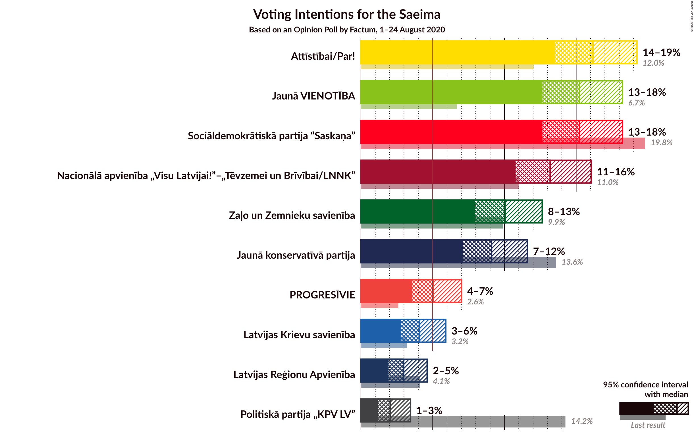
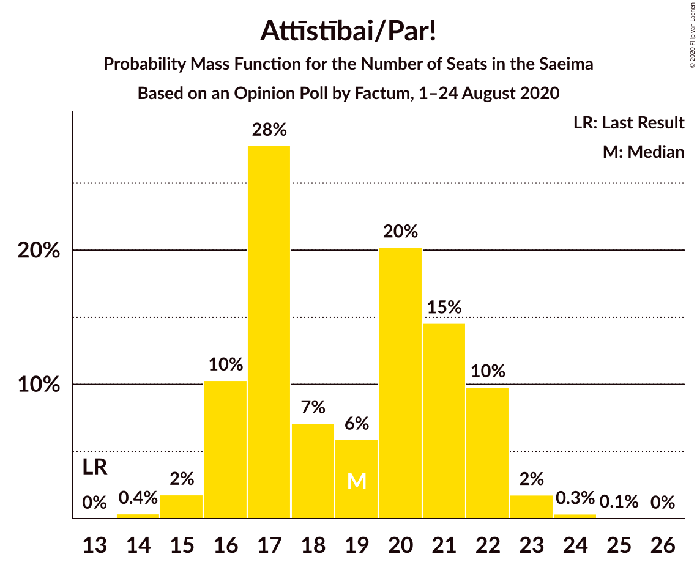
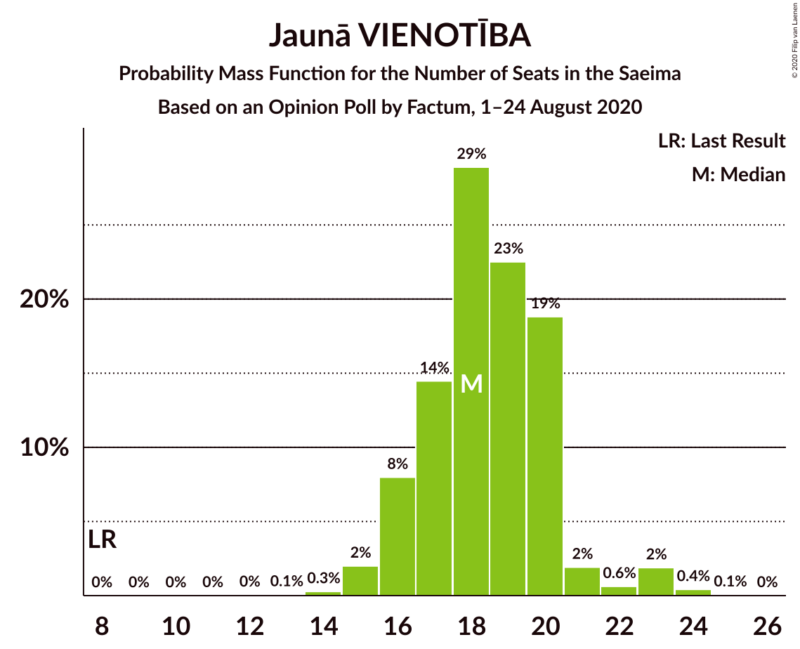
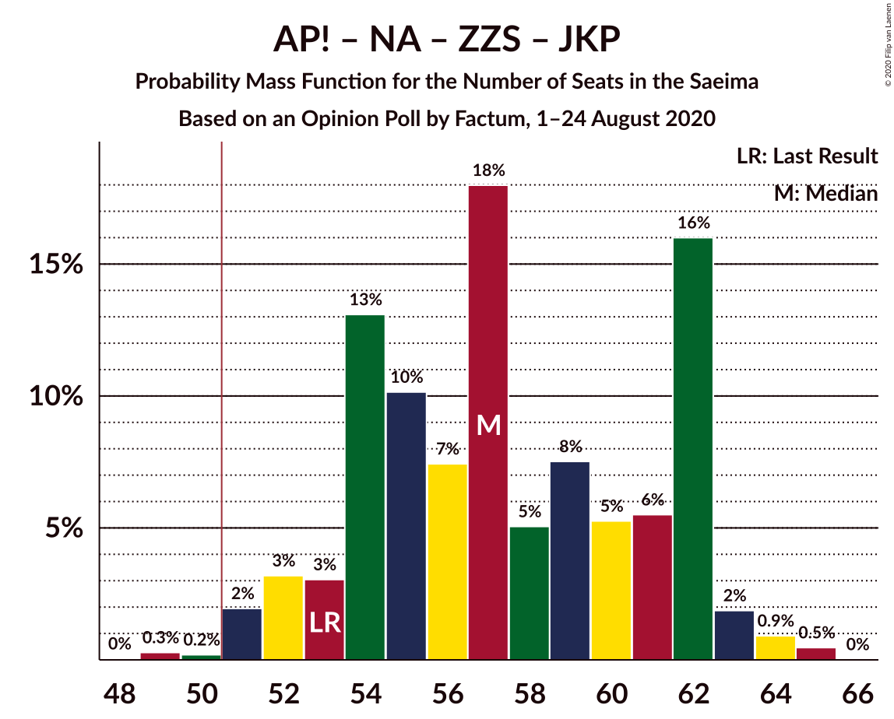
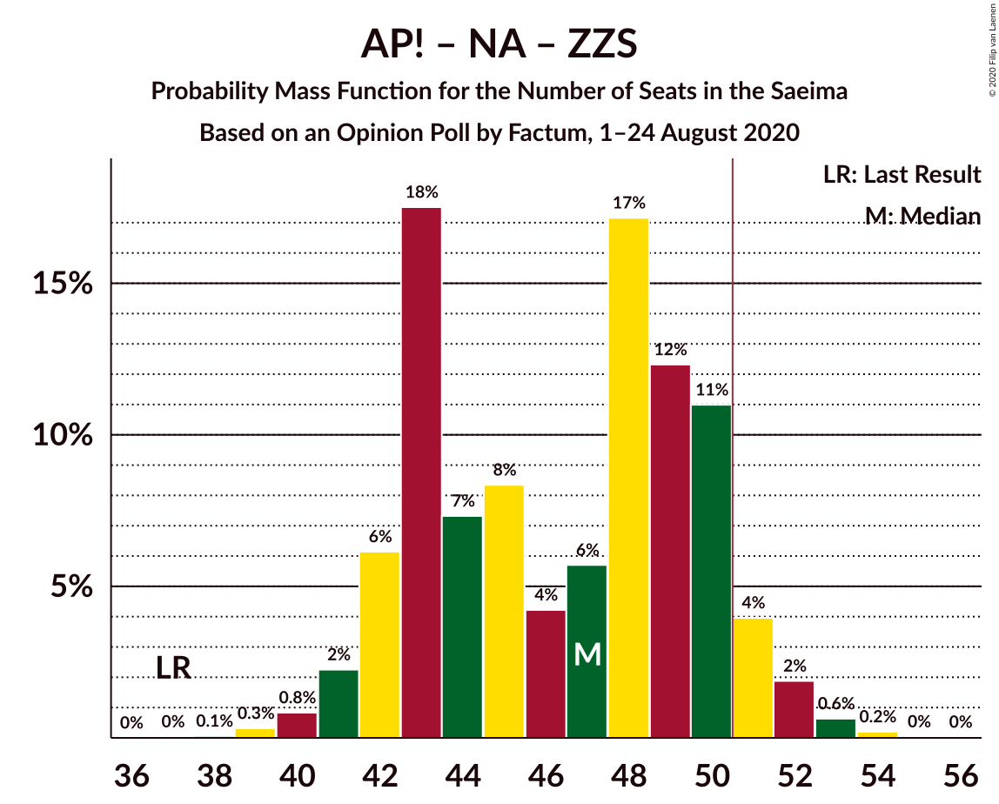
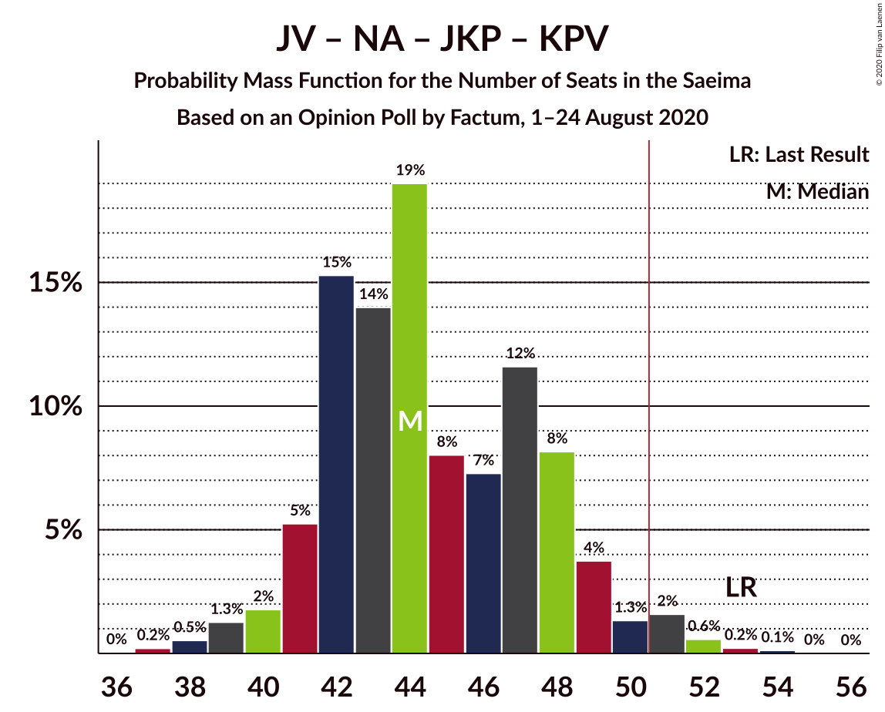
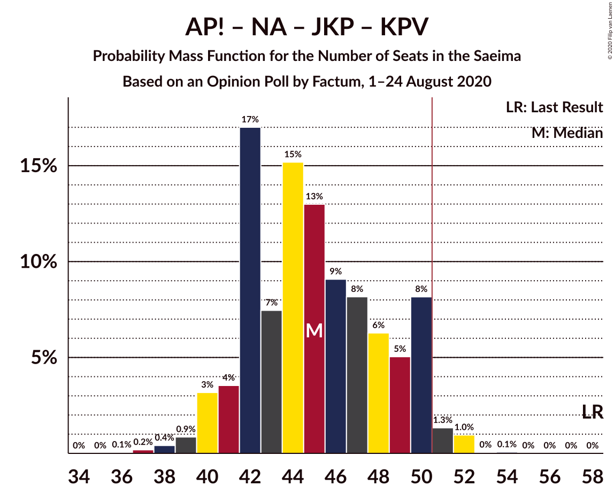
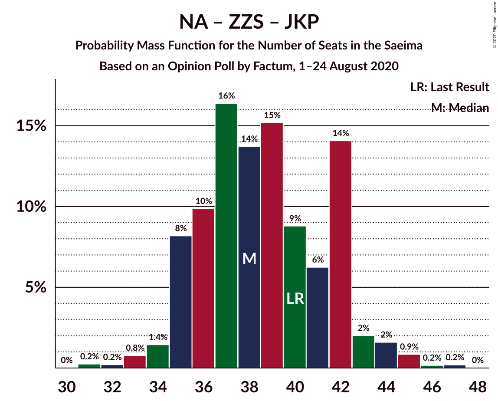

# Opinion Poll by Factum, 1–24 August 2020

<a href="#voting-intentions">Voting Intentions</a> | <a href="#seats">Seats</a> | <a href="#coalitions">Coalitions</a> | <a href="#technical-information">Technical Information</a>

## Voting Intentions

### Confidence Intervals

| Party | Last Result | Poll Result | 80% Confidence Interval | 90% Confidence Interval | 95% Confidence Interval | 99% Confidence Interval |
|:-----:|:-----------:|:-----------:|:-----------------------:|:-----------------------:|:-----------------------:|:-----------------------:|
| Attīstībai/Par! | 12.0% | 16.2% | 14.4–18.2% |13.9–18.7% |13.5–19.2% |12.7–20.2% |
| Sociāldemokrātiskā partija “Saskaņa” | 19.8% | 15.2% | 13.5–17.2% |13.0–17.7% |12.7–18.2% |11.9–19.2% |
| Jaunā VIENOTĪBA | 6.7% | 15.2% | 13.5–17.2% |13.0–17.7% |12.7–18.2% |11.9–19.2% |
| Nacionālā apvienība „Visu Latvijai!”–„Tēvzemei un Brīvībai/LNNK” | 11.0% | 13.2% | 11.6–15.1% |11.2–15.6% |10.8–16.0% |10.1–17.0% |
| Zaļo un Zemnieku savienība | 9.9% | 10.0% | 8.7–11.7% |8.3–12.2% |7.9–12.6% |7.3–13.5% |
| Jaunā konservatīvā partija | 13.6% | 9.1% | 7.8–10.7% |7.4–11.2% |7.1–11.6% |6.5–12.4% |
| PROGRESĪVIE | 2.6% | 5.0% | 4.1–6.3% |3.8–6.7% |3.6–7.0% |3.2–7.7% |
| Latvijas Krievu savienība | 3.2% | 4.1% | 3.2–5.3% |3.0–5.6% |2.8–5.9% |2.4–6.5% |
| Latvijas Reģionu Apvienība | 4.1% | 3.0% | 2.3–4.0% |2.1–4.3% |1.9–4.6% |1.6–5.2% |
| Politiskā partija „KPV LV” | 14.2% | 2.0% | 1.5–3.0% |1.3–3.2% |1.2–3.5% |1.0–4.0% |

*Note:* The poll result column reflects the actual value used in the calculations. Published results may vary slightly, and in addition be rounded to fewer digits.

## Seats

### Confidence Intervals

| Party | Last Result | Median | 80% Confidence Interval | 90% Confidence Interval | 95% Confidence Interval | 99% Confidence Interval |
|:-----:|:-----------:|:------:|:-----------------------:|:-----------------------:|:-----------------------:|:-----------------------:|
| <a href="#attīstībai/par!">Attīstībai/Par!</a> | 13 | 19 | 16–22 |16–22 |16–22 |15–23 |
| <a href="#sociāldemokrātiskā-partija-“saskaņa”">Sociāldemokrātiskā partija “Saskaņa”</a> | 23 | 19 | 17–22 |17–23 |16–23 |15–24 |
| <a href="#jaunā-vienotība">Jaunā VIENOTĪBA</a> | 8 | 18 | 16–20 |16–20 |16–22 |15–23 |
| <a href="#nacionālā-apvienība-„visu-latvijai!”–„tēvzemei-un-brīvībai/lnnk”">Nacionālā apvienība „Visu Latvijai!”–„Tēvzemei un Brīvībai/LNNK”</a> | 13 | 14 | 14–17 |13–17 |13–18 |11–21 |
| <a href="#zaļo-un-zemnieku-savienība">Zaļo un Zemnieku savienība</a> | 11 | 12 | 11–14 |11–15 |10–16 |9–18 |
| <a href="#jaunā-konservatīvā-partija">Jaunā konservatīvā partija</a> | 16 | 11 | 9–13 |9–13 |8–14 |7–15 |
| <a href="#progresīvie">PROGRESĪVIE</a> | 0 | 6 | 0–7 |0–8 |0–8 |0–9 |
| <a href="#latvijas-krievu-savienība">Latvijas Krievu savienība</a> | 0 | 0 | 0–6 |0–8 |0–8 |0–8 |
| <a href="#latvijas-reģionu-apvienība">Latvijas Reģionu Apvienība</a> | 0 | 0 | 0 |0 |0 |0–6 |
| <a href="#politiskā-partija-„kpv-lv”">Politiskā partija „KPV LV”</a> | 16 | 0 | 0 |0 |0 |0 |

### Attīstībai/Par!

*For a full overview of the results for this party, see the [Attīstībai/Par!](party-attīstībaipar.html) page.*

| Number of Seats | Probability | Accumulated | Special Marks |
|:---------------:|:-----------:|:-----------:|:-------------:|
| 13 | 0% | 100% | Last Result |
| 14 | 0.4% | 100% |  |
| 15 | 2% | 99.6% |  |
| 16 | 10% | 98% |  |
| 17 | 28% | 88% |  |
| 18 | 7% | 60% |  |
| 19 | 6% | 53% | Median |
| 20 | 20% | 47% |  |
| 21 | 15% | 27% |  |
| 22 | 10% | 12% |  |
| 23 | 2% | 2% |  |
| 24 | 0.3% | 0.4% |  |
| 25 | 0.1% | 0.1% |  |
| 26 | 0% | 0% |  |

### Sociāldemokrātiskā partija “Saskaņa”

*For a full overview of the results for this party, see the [Sociāldemokrātiskā partija “Saskaņa”](party-sociāldemokrātiskāpartija“saskaņa”.html) page.*

| Number of Seats | Probability | Accumulated | Special Marks |
|:---------------:|:-----------:|:-----------:|:-------------:|
| 14 | 0.1% | 100% |  |
| 15 | 0.5% | 99.9% |  |
| 16 | 3% | 99.4% |  |
| 17 | 8% | 96% |  |
| 18 | 35% | 88% |  |
| 19 | 6% | 52% | Median |
| 20 | 10% | 47% |  |
| 21 | 24% | 37% |  |
| 22 | 7% | 13% |  |
| 23 | 5% | 6% | Last Result |
| 24 | 0.8% | 1.1% |  |
| 25 | 0.3% | 0.3% |  |
| 26 | 0% | 0.1% |  |
| 27 | 0% | 0.1% |  |
| 28 | 0% | 0% |  |

### Jaunā VIENOTĪBA

*For a full overview of the results for this party, see the [Jaunā VIENOTĪBA](party-jaunāvienotība.html) page.*

| Number of Seats | Probability | Accumulated | Special Marks |
|:---------------:|:-----------:|:-----------:|:-------------:|
| 8 | 0% | 100% | Last Result |
| 9 | 0% | 100% |  |
| 10 | 0% | 100% |  |
| 11 | 0% | 100% |  |
| 12 | 0% | 100% |  |
| 13 | 0.1% | 99.9% |  |
| 14 | 0.3% | 99.9% |  |
| 15 | 2% | 99.6% |  |
| 16 | 8% | 98% |  |
| 17 | 14% | 90% |  |
| 18 | 29% | 75% | Median |
| 19 | 23% | 46% |  |
| 20 | 19% | 24% |  |
| 21 | 2% | 5% |  |
| 22 | 0.6% | 3% |  |
| 23 | 2% | 2% |  |
| 24 | 0.4% | 0.5% |  |
| 25 | 0.1% | 0.1% |  |
| 26 | 0% | 0% |  |

### Nacionālā apvienība „Visu Latvijai!”–„Tēvzemei un Brīvībai/LNNK”

*For a full overview of the results for this party, see the [Nacionālā apvienība „Visu Latvijai!”–„Tēvzemei un Brīvībai/LNNK”](party-nacionālāapvienība„visulatvijai”–„tēvzemeiunbrīvībailnnk”.html) page.*

| Number of Seats | Probability | Accumulated | Special Marks |
|:---------------:|:-----------:|:-----------:|:-------------:|
| 11 | 0.9% | 100% |  |
| 12 | 0.8% | 99.1% |  |
| 13 | 6% | 98% | Last Result |
| 14 | 49% | 93% | Median |
| 15 | 3% | 44% |  |
| 16 | 17% | 40% |  |
| 17 | 19% | 23% |  |
| 18 | 2% | 4% |  |
| 19 | 0.4% | 2% |  |
| 20 | 0.7% | 1.3% |  |
| 21 | 0.5% | 0.5% |  |
| 22 | 0% | 0% |  |

### Zaļo un Zemnieku savienība

*For a full overview of the results for this party, see the [Zaļo un Zemnieku savienība](party-zaļounzemniekusavienība.html) page.*

| Number of Seats | Probability | Accumulated | Special Marks |
|:---------------:|:-----------:|:-----------:|:-------------:|
| 7 | 0.1% | 100% |  |
| 8 | 0.1% | 99.9% |  |
| 9 | 0.4% | 99.8% |  |
| 10 | 3% | 99.4% |  |
| 11 | 13% | 96% | Last Result |
| 12 | 43% | 84% | Median |
| 13 | 24% | 40% |  |
| 14 | 11% | 17% |  |
| 15 | 2% | 6% |  |
| 16 | 2% | 4% |  |
| 17 | 1.0% | 2% |  |
| 18 | 0.8% | 0.8% |  |
| 19 | 0% | 0% |  |

### Jaunā konservatīvā partija

*For a full overview of the results for this party, see the [Jaunā konservatīvā partija](party-jaunākonservatīvāpartija.html) page.*

| Number of Seats | Probability | Accumulated | Special Marks |
|:---------------:|:-----------:|:-----------:|:-------------:|
| 7 | 2% | 100% |  |
| 8 | 1.1% | 98% |  |
| 9 | 19% | 97% |  |
| 10 | 10% | 78% |  |
| 11 | 29% | 68% | Median |
| 12 | 17% | 40% |  |
| 13 | 20% | 23% |  |
| 14 | 1.4% | 3% |  |
| 15 | 1.1% | 1.4% |  |
| 16 | 0.2% | 0.2% | Last Result |
| 17 | 0% | 0% |  |

### PROGRESĪVIE

*For a full overview of the results for this party, see the [PROGRESĪVIE](party-progresīvie.html) page.*

| Number of Seats | Probability | Accumulated | Special Marks |
|:---------------:|:-----------:|:-----------:|:-------------:|
| 0 | 45% | 100% | Last Result |
| 1 | 0% | 55% |  |
| 2 | 0% | 55% |  |
| 3 | 0% | 55% |  |
| 4 | 0% | 55% |  |
| 5 | 0.5% | 55% |  |
| 6 | 10% | 55% | Median |
| 7 | 37% | 45% |  |
| 8 | 6% | 8% |  |
| 9 | 2% | 2% |  |
| 10 | 0% | 0% |  |

### Latvijas Krievu savienība

*For a full overview of the results for this party, see the [Latvijas Krievu savienība](party-latvijaskrievusavienība.html) page.*

| Number of Seats | Probability | Accumulated | Special Marks |
|:---------------:|:-----------:|:-----------:|:-------------:|
| 0 | 89% | 100% | Last Result, Median |
| 1 | 0% | 11% |  |
| 2 | 0% | 11% |  |
| 3 | 0% | 11% |  |
| 4 | 0% | 11% |  |
| 5 | 0% | 11% |  |
| 6 | 0.9% | 11% |  |
| 7 | 4% | 10% |  |
| 8 | 6% | 6% |  |
| 9 | 0% | 0% |  |

### Latvijas Reģionu Apvienība

*For a full overview of the results for this party, see the [Latvijas Reģionu Apvienība](party-latvijasreģionuapvienība.html) page.*

| Number of Seats | Probability | Accumulated | Special Marks |
|:---------------:|:-----------:|:-----------:|:-------------:|
| 0 | 99.4% | 100% | Last Result, Median |
| 1 | 0% | 0.6% |  |
| 2 | 0% | 0.6% |  |
| 3 | 0% | 0.6% |  |
| 4 | 0% | 0.6% |  |
| 5 | 0% | 0.6% |  |
| 6 | 0.6% | 0.6% |  |
| 7 | 0% | 0% |  |

### Politiskā partija „KPV LV”

*For a full overview of the results for this party, see the [Politiskā partija „KPV LV”](party-politiskāpartija„kpvlv”.html) page.*

| Number of Seats | Probability | Accumulated | Special Marks |
|:---------------:|:-----------:|:-----------:|:-------------:|
| 0 | 100% | 100% | Median |
| 1 | 0% | 0% |  |
| 2 | 0% | 0% |  |
| 3 | 0% | 0% |  |
| 4 | 0% | 0% |  |
| 5 | 0% | 0% |  |
| 6 | 0% | 0% |  |
| 7 | 0% | 0% |  |
| 8 | 0% | 0% |  |
| 9 | 0% | 0% |  |
| 10 | 0% | 0% |  |
| 11 | 0% | 0% |  |
| 12 | 0% | 0% |  |
| 13 | 0% | 0% |  |
| 14 | 0% | 0% |  |
| 15 | 0% | 0% |  |
| 16 | 0% | 0% | Last Result |

## Coalitions

### Confidence Intervals

| Coalition | Last Result | Median | Majority? | 80% Confidence Interval | 90% Confidence Interval | 95% Confidence Interval | 99% Confidence Interval |
|:---------:|:-----------:|:------:|:---------:|:-----------------------:|:-----------------------:|:-----------------------:|:-----------------------:|
| Attīstībai/Par! – Jaunā VIENOTĪBA – Nacionālā apvienība „Visu Latvijai!”–„Tēvzemei un Brīvībai/LNNK” – Zaļo un Zemnieku savienība – Jaunā konservatīvā partija | 61 | 76 | 100% | 72–82 | 70–82 | 69–82 | 67–83 |
| Attīstībai/Par! – Jaunā VIENOTĪBA – Nacionālā apvienība „Visu Latvijai!”–„Tēvzemei un Brīvībai/LNNK” – Zaļo un Zemnieku savienība | 45 | 65 | 100% | 60–70 | 59–70 | 58–71 | 57–73 |
| Attīstībai/Par! – Jaunā VIENOTĪBA – Nacionālā apvienība „Visu Latvijai!”–„Tēvzemei un Brīvībai/LNNK” – Jaunā konservatīvā partija | 50 | 63 | 100% | 60–68 | 58–69 | 57–70 | 55–71 |
| Attīstībai/Par! – Jaunā VIENOTĪBA – Nacionālā apvienība „Visu Latvijai!”–„Tēvzemei un Brīvībai/LNNK” – Jaunā konservatīvā partija – Politiskā partija „KPV LV” | 66 | 63 | 100% | 60–68 | 58–69 | 57–70 | 55–71 |
| Attīstībai/Par! – Nacionālā apvienība „Visu Latvijai!”–„Tēvzemei un Brīvībai/LNNK” – Zaļo un Zemnieku savienība – Jaunā konservatīvā partija | 53 | 57 | 99.5% | 54–62 | 52–62 | 52–63 | 50–65 |
| Jaunā VIENOTĪBA – Nacionālā apvienība „Visu Latvijai!”–„Tēvzemei un Brīvībai/LNNK” – Zaļo un Zemnieku savienība – Jaunā konservatīvā partija | 48 | 57 | 99.1% | 54–62 | 53–62 | 52–63 | 50–65 |
| Attīstībai/Par! – Jaunā VIENOTĪBA – Nacionālā apvienība „Visu Latvijai!”–„Tēvzemei un Brīvībai/LNNK” – Politiskā partija „KPV LV” | 50 | 53 | 60% | 49–57 | 47–58 | 46–59 | 45–60 |
| Attīstībai/Par! – Sociāldemokrātiskā partija “Saskaņa” – Jaunā konservatīvā partija | 52 | 49 | 29% | 46–54 | 44–54 | 43–55 | 42–56 |
| Attīstībai/Par! – Jaunā VIENOTĪBA – Jaunā konservatīvā partija – Politiskā partija „KPV LV” | 53 | 48 | 27% | 45–52 | 43–53 | 43–54 | 40–55 |
| Attīstībai/Par! – Nacionālā apvienība „Visu Latvijai!”–„Tēvzemei un Brīvībai/LNNK” – Zaļo un Zemnieku savienība | 37 | 47 | 7% | 43–50 | 42–51 | 41–52 | 40–53 |
| Jaunā VIENOTĪBA – Nacionālā apvienība „Visu Latvijai!”–„Tēvzemei un Brīvībai/LNNK” – Zaļo un Zemnieku savienība | 32 | 46 | 4% | 43–50 | 42–50 | 41–52 | 40–53 |
| Jaunā VIENOTĪBA – Nacionālā apvienība „Visu Latvijai!”–„Tēvzemei un Brīvībai/LNNK” – Jaunā konservatīvā partija – Politiskā partija „KPV LV” | 53 | 44 | 3% | 42–48 | 41–49 | 40–51 | 38–52 |
| Attīstībai/Par! – Nacionālā apvienība „Visu Latvijai!”–„Tēvzemei un Brīvībai/LNNK” – Jaunā konservatīvā partija – Politiskā partija „KPV LV” | 58 | 45 | 2% | 42–50 | 41–50 | 40–50 | 38–52 |
| Nacionālā apvienība „Visu Latvijai!”–„Tēvzemei un Brīvībai/LNNK” – Zaļo un Zemnieku savienība – Jaunā konservatīvā partija | 40 | 38 | 0% | 35–42 | 35–42 | 34–44 | 33–45 |
| Attīstībai/Par! – Sociāldemokrātiskā partija “Saskaņa” | 36 | 38 | 0% | 35–42 | 34–43 | 33–43 | 32–46 |
| Sociāldemokrātiskā partija “Saskaņa” – Zaļo un Zemnieku savienība – Politiskā partija „KPV LV” | 50 | 32 | 0% | 29–35 | 28–36 | 27–37 | 26–39 |
| Sociāldemokrātiskā partija “Saskaņa” – Politiskā partija „KPV LV” | 39 | 19 | 0% | 17–22 | 17–23 | 16–23 | 15–24 |

### Attīstībai/Par! – Jaunā VIENOTĪBA – Nacionālā apvienība „Visu Latvijai!”–„Tēvzemei un Brīvībai/LNNK” – Zaļo un Zemnieku savienība – Jaunā konservatīvā partija

| Number of Seats | Probability | Accumulated | Special Marks |
|:---------------:|:-----------:|:-----------:|:-------------:|
| 61 | 0% | 100% | Last Result |
| 62 | 0% | 100% |  |
| 63 | 0% | 100% |  |
| 64 | 0% | 100% |  |
| 65 | 0.1% | 100% |  |
| 66 | 0.1% | 99.9% |  |
| 67 | 0.6% | 99.8% |  |
| 68 | 1.0% | 99.2% |  |
| 69 | 2% | 98% |  |
| 70 | 3% | 96% |  |
| 71 | 2% | 93% |  |
| 72 | 14% | 91% |  |
| 73 | 5% | 77% |  |
| 74 | 9% | 72% | Median |
| 75 | 13% | 63% |  |
| 76 | 12% | 51% |  |
| 77 | 3% | 39% |  |
| 78 | 7% | 36% |  |
| 79 | 9% | 29% |  |
| 80 | 6% | 20% |  |
| 81 | 2% | 14% |  |
| 82 | 11% | 12% |  |
| 83 | 0.7% | 1.1% |  |
| 84 | 0.4% | 0.4% |  |
| 85 | 0% | 0% |  |

### Attīstībai/Par! – Jaunā VIENOTĪBA – Nacionālā apvienība „Visu Latvijai!”–„Tēvzemei un Brīvībai/LNNK” – Zaļo un Zemnieku savienība

| Number of Seats | Probability | Accumulated | Special Marks |
|:---------------:|:-----------:|:-----------:|:-------------:|
| 45 | 0% | 100% | Last Result |
| 46 | 0% | 100% |  |
| 47 | 0% | 100% |  |
| 48 | 0% | 100% |  |
| 49 | 0% | 100% |  |
| 50 | 0% | 100% |  |
| 51 | 0% | 100% | Majority |
| 52 | 0% | 100% |  |
| 53 | 0% | 100% |  |
| 54 | 0% | 100% |  |
| 55 | 0.1% | 99.9% |  |
| 56 | 0.3% | 99.9% |  |
| 57 | 0.6% | 99.5% |  |
| 58 | 2% | 98.9% |  |
| 59 | 2% | 97% |  |
| 60 | 5% | 95% |  |
| 61 | 13% | 90% |  |
| 62 | 9% | 77% |  |
| 63 | 11% | 68% | Median |
| 64 | 2% | 57% |  |
| 65 | 6% | 55% |  |
| 66 | 11% | 49% |  |
| 67 | 17% | 38% |  |
| 68 | 5% | 21% |  |
| 69 | 4% | 17% |  |
| 70 | 7% | 12% |  |
| 71 | 2% | 5% |  |
| 72 | 2% | 2% |  |
| 73 | 0.5% | 0.7% |  |
| 74 | 0.1% | 0.2% |  |
| 75 | 0% | 0% |  |

### Attīstībai/Par! – Jaunā VIENOTĪBA – Nacionālā apvienība „Visu Latvijai!”–„Tēvzemei un Brīvībai/LNNK” – Jaunā konservatīvā partija

| Number of Seats | Probability | Accumulated | Special Marks |
|:---------------:|:-----------:|:-----------:|:-------------:|
| 50 | 0% | 100% | Last Result |
| 51 | 0% | 100% | Majority |
| 52 | 0% | 100% |  |
| 53 | 0.1% | 100% |  |
| 54 | 0.1% | 99.9% |  |
| 55 | 0.3% | 99.8% |  |
| 56 | 0.6% | 99.5% |  |
| 57 | 1.4% | 98.9% |  |
| 58 | 4% | 97% |  |
| 59 | 3% | 93% |  |
| 60 | 15% | 90% |  |
| 61 | 9% | 75% |  |
| 62 | 8% | 66% | Median |
| 63 | 12% | 58% |  |
| 64 | 12% | 46% |  |
| 65 | 7% | 35% |  |
| 66 | 4% | 27% |  |
| 67 | 6% | 24% |  |
| 68 | 9% | 18% |  |
| 69 | 6% | 9% |  |
| 70 | 2% | 3% |  |
| 71 | 1.0% | 1.2% |  |
| 72 | 0.2% | 0.3% |  |
| 73 | 0% | 0% |  |

### Attīstībai/Par! – Jaunā VIENOTĪBA – Nacionālā apvienība „Visu Latvijai!”–„Tēvzemei un Brīvībai/LNNK” – Jaunā konservatīvā partija – Politiskā partija „KPV LV”

| Number of Seats | Probability | Accumulated | Special Marks |
|:---------------:|:-----------:|:-----------:|:-------------:|
| 53 | 0.1% | 100% |  |
| 54 | 0.1% | 99.9% |  |
| 55 | 0.3% | 99.8% |  |
| 56 | 0.6% | 99.5% |  |
| 57 | 1.4% | 98.9% |  |
| 58 | 4% | 97% |  |
| 59 | 3% | 93% |  |
| 60 | 15% | 90% |  |
| 61 | 9% | 75% |  |
| 62 | 8% | 66% | Median |
| 63 | 12% | 58% |  |
| 64 | 12% | 46% |  |
| 65 | 7% | 35% |  |
| 66 | 4% | 27% | Last Result |
| 67 | 6% | 24% |  |
| 68 | 9% | 18% |  |
| 69 | 6% | 9% |  |
| 70 | 2% | 3% |  |
| 71 | 1.0% | 1.2% |  |
| 72 | 0.2% | 0.3% |  |
| 73 | 0% | 0% |  |

### Attīstībai/Par! – Nacionālā apvienība „Visu Latvijai!”–„Tēvzemei un Brīvībai/LNNK” – Zaļo un Zemnieku savienība – Jaunā konservatīvā partija

| Number of Seats | Probability | Accumulated | Special Marks |
|:---------------:|:-----------:|:-----------:|:-------------:|
| 48 | 0% | 100% |  |
| 49 | 0.3% | 99.9% |  |
| 50 | 0.2% | 99.7% |  |
| 51 | 2% | 99.5% | Majority |
| 52 | 3% | 98% |  |
| 53 | 3% | 94% | Last Result |
| 54 | 13% | 91% |  |
| 55 | 10% | 78% |  |
| 56 | 7% | 68% | Median |
| 57 | 18% | 61% |  |
| 58 | 5% | 43% |  |
| 59 | 8% | 38% |  |
| 60 | 5% | 30% |  |
| 61 | 6% | 25% |  |
| 62 | 16% | 19% |  |
| 63 | 2% | 3% |  |
| 64 | 0.9% | 1.4% |  |
| 65 | 0.5% | 0.5% |  |
| 66 | 0% | 0% |  |

### Jaunā VIENOTĪBA – Nacionālā apvienība „Visu Latvijai!”–„Tēvzemei un Brīvībai/LNNK” – Zaļo un Zemnieku savienība – Jaunā konservatīvā partija

| Number of Seats | Probability | Accumulated | Special Marks |
|:---------------:|:-----------:|:-----------:|:-------------:|
| 48 | 0.1% | 100% | Last Result |
| 49 | 0.4% | 99.9% |  |
| 50 | 0.5% | 99.5% |  |
| 51 | 1.1% | 99.1% | Majority |
| 52 | 2% | 98% |  |
| 53 | 5% | 96% |  |
| 54 | 12% | 92% |  |
| 55 | 17% | 79% | Median |
| 56 | 5% | 62% |  |
| 57 | 14% | 57% |  |
| 58 | 14% | 43% |  |
| 59 | 8% | 29% |  |
| 60 | 7% | 21% |  |
| 61 | 3% | 14% |  |
| 62 | 8% | 11% |  |
| 63 | 2% | 3% |  |
| 64 | 0.7% | 2% |  |
| 65 | 1.0% | 1.1% |  |
| 66 | 0.1% | 0.1% |  |
| 67 | 0% | 0% |  |

### Attīstībai/Par! – Jaunā VIENOTĪBA – Nacionālā apvienība „Visu Latvijai!”–„Tēvzemei un Brīvībai/LNNK” – Politiskā partija „KPV LV”

| Number of Seats | Probability | Accumulated | Special Marks |
|:---------------:|:-----------:|:-----------:|:-------------:|
| 44 | 0.1% | 100% |  |
| 45 | 0.6% | 99.9% |  |
| 46 | 2% | 99.2% |  |
| 47 | 3% | 97% |  |
| 48 | 4% | 94% |  |
| 49 | 14% | 91% |  |
| 50 | 16% | 77% | Last Result |
| 51 | 6% | 60% | Median, Majority |
| 52 | 3% | 54% |  |
| 53 | 9% | 51% |  |
| 54 | 11% | 42% |  |
| 55 | 15% | 31% |  |
| 56 | 6% | 16% |  |
| 57 | 4% | 10% |  |
| 58 | 3% | 6% |  |
| 59 | 1.2% | 3% |  |
| 60 | 1.5% | 2% |  |
| 61 | 0.2% | 0.3% |  |
| 62 | 0% | 0% |  |

### Attīstībai/Par! – Sociāldemokrātiskā partija “Saskaņa” – Jaunā konservatīvā partija

| Number of Seats | Probability | Accumulated | Special Marks |
|:---------------:|:-----------:|:-----------:|:-------------:|
| 40 | 0.2% | 100% |  |
| 41 | 0.2% | 99.7% |  |
| 42 | 2% | 99.5% |  |
| 43 | 0.8% | 98% |  |
| 44 | 2% | 97% |  |
| 45 | 4% | 95% |  |
| 46 | 8% | 91% |  |
| 47 | 6% | 83% |  |
| 48 | 13% | 77% |  |
| 49 | 21% | 64% | Median |
| 50 | 15% | 43% |  |
| 51 | 6% | 29% | Majority |
| 52 | 4% | 23% | Last Result |
| 53 | 8% | 19% |  |
| 54 | 7% | 11% |  |
| 55 | 3% | 4% |  |
| 56 | 1.3% | 2% |  |
| 57 | 0.3% | 0.4% |  |
| 58 | 0.1% | 0.1% |  |
| 59 | 0% | 0% |  |

### Attīstībai/Par! – Jaunā VIENOTĪBA – Jaunā konservatīvā partija – Politiskā partija „KPV LV”

| Number of Seats | Probability | Accumulated | Special Marks |
|:---------------:|:-----------:|:-----------:|:-------------:|
| 39 | 0% | 100% |  |
| 40 | 0.9% | 99.9% |  |
| 41 | 0.7% | 99.1% |  |
| 42 | 0.8% | 98% |  |
| 43 | 3% | 98% |  |
| 44 | 3% | 95% |  |
| 45 | 7% | 92% |  |
| 46 | 16% | 85% |  |
| 47 | 9% | 68% |  |
| 48 | 9% | 59% | Median |
| 49 | 12% | 50% |  |
| 50 | 11% | 38% |  |
| 51 | 10% | 27% | Majority |
| 52 | 11% | 18% |  |
| 53 | 3% | 6% | Last Result |
| 54 | 2% | 3% |  |
| 55 | 0.9% | 1.2% |  |
| 56 | 0.1% | 0.3% |  |
| 57 | 0% | 0.1% |  |
| 58 | 0.1% | 0.1% |  |
| 59 | 0% | 0% |  |

### Attīstībai/Par! – Nacionālā apvienība „Visu Latvijai!”–„Tēvzemei un Brīvībai/LNNK” – Zaļo un Zemnieku savienība

| Number of Seats | Probability | Accumulated | Special Marks |
|:---------------:|:-----------:|:-----------:|:-------------:|
| 37 | 0% | 100% | Last Result |
| 38 | 0.1% | 100% |  |
| 39 | 0.3% | 99.9% |  |
| 40 | 0.8% | 99.6% |  |
| 41 | 2% | 98.7% |  |
| 42 | 6% | 96% |  |
| 43 | 18% | 90% |  |
| 44 | 7% | 73% |  |
| 45 | 8% | 66% | Median |
| 46 | 4% | 57% |  |
| 47 | 6% | 53% |  |
| 48 | 17% | 47% |  |
| 49 | 12% | 30% |  |
| 50 | 11% | 18% |  |
| 51 | 4% | 7% | Majority |
| 52 | 2% | 3% |  |
| 53 | 0.6% | 0.9% |  |
| 54 | 0.2% | 0.3% |  |
| 55 | 0% | 0.1% |  |
| 56 | 0% | 0% |  |

### Jaunā VIENOTĪBA – Nacionālā apvienība „Visu Latvijai!”–„Tēvzemei un Brīvībai/LNNK” – Zaļo un Zemnieku savienība

| Number of Seats | Probability | Accumulated | Special Marks |
|:---------------:|:-----------:|:-----------:|:-------------:|
| 32 | 0% | 100% | Last Result |
| 33 | 0% | 100% |  |
| 34 | 0% | 100% |  |
| 35 | 0% | 100% |  |
| 36 | 0% | 100% |  |
| 37 | 0.1% | 100% |  |
| 38 | 0.1% | 99.9% |  |
| 39 | 0.2% | 99.8% |  |
| 40 | 0.8% | 99.7% |  |
| 41 | 1.4% | 98.8% |  |
| 42 | 3% | 97% |  |
| 43 | 5% | 94% |  |
| 44 | 19% | 89% | Median |
| 45 | 17% | 70% |  |
| 46 | 20% | 53% |  |
| 47 | 10% | 33% |  |
| 48 | 5% | 23% |  |
| 49 | 4% | 17% |  |
| 50 | 9% | 13% |  |
| 51 | 1.1% | 4% | Majority |
| 52 | 2% | 3% |  |
| 53 | 0.9% | 1.2% |  |
| 54 | 0.2% | 0.3% |  |
| 55 | 0.1% | 0.2% |  |
| 56 | 0.1% | 0.1% |  |
| 57 | 0% | 0% |  |

### Jaunā VIENOTĪBA – Nacionālā apvienība „Visu Latvijai!”–„Tēvzemei un Brīvībai/LNNK” – Jaunā konservatīvā partija – Politiskā partija „KPV LV”

| Number of Seats | Probability | Accumulated | Special Marks |
|:---------------:|:-----------:|:-----------:|:-------------:|
| 36 | 0% | 100% |  |
| 37 | 0.2% | 99.9% |  |
| 38 | 0.5% | 99.7% |  |
| 39 | 1.3% | 99.2% |  |
| 40 | 2% | 98% |  |
| 41 | 5% | 96% |  |
| 42 | 15% | 91% |  |
| 43 | 14% | 76% | Median |
| 44 | 19% | 62% |  |
| 45 | 8% | 43% |  |
| 46 | 7% | 35% |  |
| 47 | 12% | 27% |  |
| 48 | 8% | 16% |  |
| 49 | 4% | 8% |  |
| 50 | 1.3% | 4% |  |
| 51 | 2% | 3% | Majority |
| 52 | 0.6% | 0.9% |  |
| 53 | 0.2% | 0.4% | Last Result |
| 54 | 0.1% | 0.1% |  |
| 55 | 0% | 0% |  |

### Attīstībai/Par! – Nacionālā apvienība „Visu Latvijai!”–„Tēvzemei un Brīvībai/LNNK” – Jaunā konservatīvā partija – Politiskā partija „KPV LV”

| Number of Seats | Probability | Accumulated | Special Marks |
|:---------------:|:-----------:|:-----------:|:-------------:|
| 36 | 0.1% | 100% |  |
| 37 | 0.2% | 99.9% |  |
| 38 | 0.4% | 99.8% |  |
| 39 | 0.9% | 99.3% |  |
| 40 | 3% | 98% |  |
| 41 | 4% | 95% |  |
| 42 | 17% | 92% |  |
| 43 | 7% | 75% |  |
| 44 | 15% | 67% | Median |
| 45 | 13% | 52% |  |
| 46 | 9% | 39% |  |
| 47 | 8% | 30% |  |
| 48 | 6% | 22% |  |
| 49 | 5% | 16% |  |
| 50 | 8% | 11% |  |
| 51 | 1.3% | 2% | Majority |
| 52 | 1.0% | 1.1% |  |
| 53 | 0% | 0.1% |  |
| 54 | 0.1% | 0.1% |  |
| 55 | 0% | 0% |  |
| 56 | 0% | 0% |  |
| 57 | 0% | 0% |  |
| 58 | 0% | 0% | Last Result |

### Nacionālā apvienība „Visu Latvijai!”–„Tēvzemei un Brīvībai/LNNK” – Zaļo un Zemnieku savienība – Jaunā konservatīvā partija

| Number of Seats | Probability | Accumulated | Special Marks |
|:---------------:|:-----------:|:-----------:|:-------------:|
| 31 | 0.2% | 100% |  |
| 32 | 0.2% | 99.7% |  |
| 33 | 0.8% | 99.5% |  |
| 34 | 1.4% | 98.7% |  |
| 35 | 8% | 97% |  |
| 36 | 10% | 89% |  |
| 37 | 16% | 79% | Median |
| 38 | 14% | 63% |  |
| 39 | 15% | 49% |  |
| 40 | 9% | 34% | Last Result |
| 41 | 6% | 25% |  |
| 42 | 14% | 19% |  |
| 43 | 2% | 5% |  |
| 44 | 2% | 3% |  |
| 45 | 0.9% | 1.2% |  |
| 46 | 0.2% | 0.4% |  |
| 47 | 0.2% | 0.2% |  |
| 48 | 0% | 0% |  |

### Attīstībai/Par! – Sociāldemokrātiskā partija “Saskaņa”

| Number of Seats | Probability | Accumulated | Special Marks |
|:---------------:|:-----------:|:-----------:|:-------------:|
| 30 | 0.1% | 100% |  |
| 31 | 0.3% | 99.9% |  |
| 32 | 0.6% | 99.7% |  |
| 33 | 3% | 99.1% |  |
| 34 | 5% | 96% |  |
| 35 | 12% | 91% |  |
| 36 | 7% | 80% | Last Result |
| 37 | 7% | 72% |  |
| 38 | 21% | 65% | Median |
| 39 | 11% | 45% |  |
| 40 | 14% | 34% |  |
| 41 | 7% | 20% |  |
| 42 | 7% | 13% |  |
| 43 | 4% | 6% |  |
| 44 | 1.0% | 2% |  |
| 45 | 0.5% | 1.2% |  |
| 46 | 0.5% | 0.7% |  |
| 47 | 0.2% | 0.2% |  |
| 48 | 0% | 0% |  |

### Sociāldemokrātiskā partija “Saskaņa” – Zaļo un Zemnieku savienība – Politiskā partija „KPV LV”

| Number of Seats | Probability | Accumulated | Special Marks |
|:---------------:|:-----------:|:-----------:|:-------------:|
| 25 | 0.2% | 100% |  |
| 26 | 0.4% | 99.8% |  |
| 27 | 2% | 99.4% |  |
| 28 | 4% | 97% |  |
| 29 | 5% | 93% |  |
| 30 | 17% | 88% |  |
| 31 | 19% | 71% | Median |
| 32 | 13% | 53% |  |
| 33 | 19% | 40% |  |
| 34 | 6% | 20% |  |
| 35 | 8% | 15% |  |
| 36 | 4% | 7% |  |
| 37 | 1.3% | 3% |  |
| 38 | 1.3% | 2% |  |
| 39 | 0.5% | 0.5% |  |
| 40 | 0% | 0.1% |  |
| 41 | 0% | 0% |  |
| 42 | 0% | 0% |  |
| 43 | 0% | 0% |  |
| 44 | 0% | 0% |  |
| 45 | 0% | 0% |  |
| 46 | 0% | 0% |  |
| 47 | 0% | 0% |  |
| 48 | 0% | 0% |  |
| 49 | 0% | 0% |  |
| 50 | 0% | 0% | Last Result |

### Sociāldemokrātiskā partija “Saskaņa” – Politiskā partija „KPV LV”

| Number of Seats | Probability | Accumulated | Special Marks |
|:---------------:|:-----------:|:-----------:|:-------------:|
| 14 | 0.1% | 100% |  |
| 15 | 0.5% | 99.9% |  |
| 16 | 3% | 99.4% |  |
| 17 | 8% | 96% |  |
| 18 | 35% | 88% |  |
| 19 | 6% | 52% | Median |
| 20 | 10% | 47% |  |
| 21 | 24% | 37% |  |
| 22 | 7% | 13% |  |
| 23 | 5% | 6% |  |
| 24 | 0.8% | 1.1% |  |
| 25 | 0.3% | 0.3% |  |
| 26 | 0% | 0.1% |  |
| 27 | 0% | 0.1% |  |
| 28 | 0% | 0% |  |
| 29 | 0% | 0% |  |
| 30 | 0% | 0% |  |
| 31 | 0% | 0% |  |
| 32 | 0% | 0% |  |
| 33 | 0% | 0% |  |
| 34 | 0% | 0% |  |
| 35 | 0% | 0% |  |
| 36 | 0% | 0% |  |
| 37 | 0% | 0% |  |
| 38 | 0% | 0% |  |
| 39 | 0% | 0% | Last Result |

## Technical Information

### Opinion Poll

+ **Polling firm:** Factum
+ **Commissioner(s):** —
+ **Fieldwork period:** 1–24 August 2020

### Calculations

+ **Sample size:** 637
+ **Simulations done:** 1,048,576
+ **Error estimate:** 2.15%

