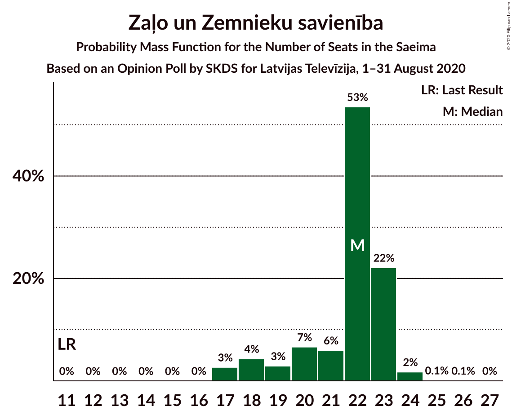
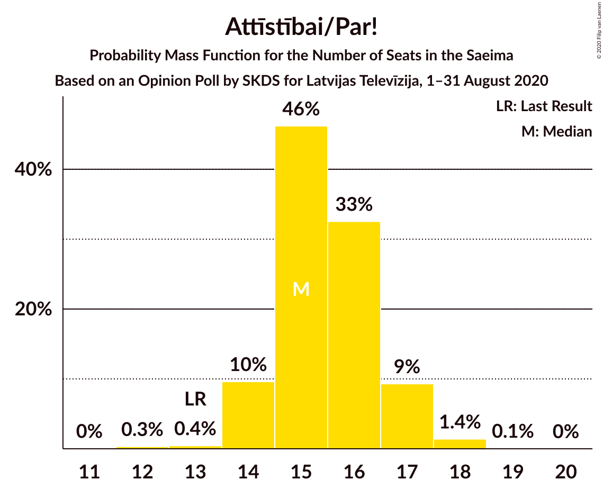
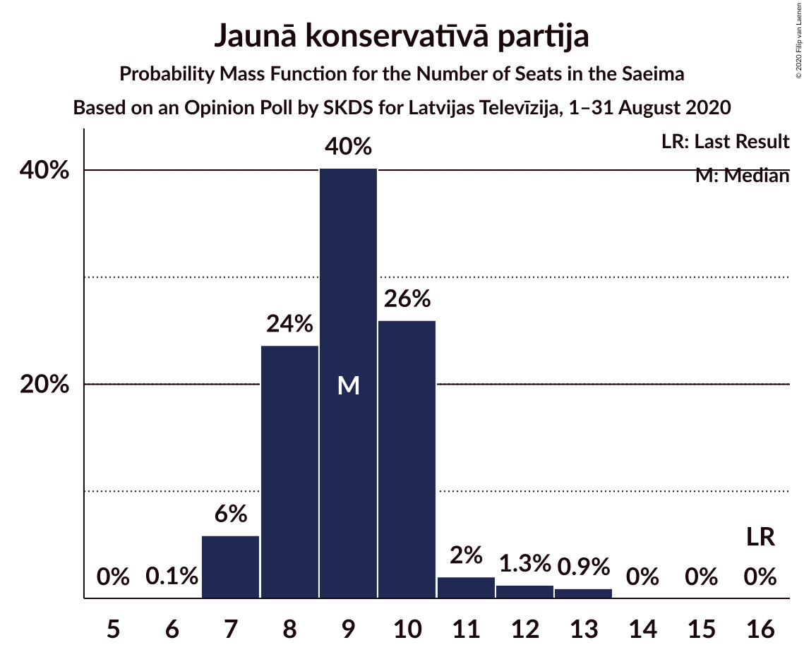
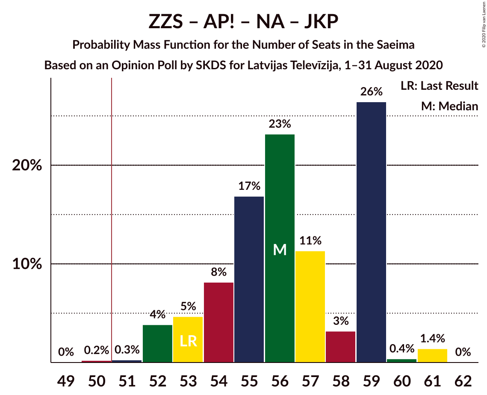

# Opinion Poll by SKDS for Latvijas Televīzija, 1–31 August 2020

<a href="#voting-intentions">Voting Intentions</a> | <a href="#seats">Seats</a> | <a href="#coalitions">Coalitions</a> | <a href="#technical-information">Technical Information</a>

## Voting Intentions

### Confidence Intervals

| Party | Last Result | Poll Result | 80% Confidence Interval | 90% Confidence Interval | 95% Confidence Interval | 99% Confidence Interval |
|:-----:|:-----------:|:-----------:|:-----------------------:|:-----------------------:|:-----------------------:|:-----------------------:|
| Sociāldemokrātiskā partija “Saskaņa” | 19.8% | 21.9% | 20.3–23.7% |19.8–24.2% |19.4–24.7% |18.6–25.6% |
| Zaļo un Zemnieku savienība | 9.9% | 19.3% | 17.7–21.0% |17.2–21.5% |16.8–21.9% |16.1–22.8% |
| Attīstībai/Par! | 12.0% | 14.0% | 12.6–15.6% |12.3–16.0% |11.9–16.4% |11.3–17.2% |
| Jaunā VIENOTĪBA | 6.7% | 11.9% | 10.6–13.3% |10.3–13.7% |10.0–14.1% |9.4–14.8% |
| Nacionālā apvienība „Visu Latvijai!”–„Tēvzemei un Brīvībai/LNNK” | 11.0% | 9.3% | 8.2–10.6% |7.9–11.0% |7.6–11.3% |7.1–12.0% |
| Jaunā konservatīvā partija | 13.6% | 8.2% | 7.2–9.5% |6.9–9.9% |6.6–10.2% |6.2–10.8% |
| Latvijas Reģionu Apvienība | 4.1% | 6.8% | 5.9–8.0% |5.6–8.4% |5.4–8.7% |5.0–9.3% |
| Politiskā partija „KPV LV” | 14.2% | 3.4% | 2.8–4.3% |2.6–4.6% |2.4–4.8% |2.1–5.3% |
| Latvijas Krievu savienība | 3.2% | 2.7% | 2.1–3.5% |2.0–3.7% |1.8–3.9% |1.6–4.3% |
| PROGRESĪVIE | 2.6% | 2.5% | 1.9–3.2% |1.8–3.5% |1.6–3.7% |1.4–4.1% |

*Note:* The poll result column reflects the actual value used in the calculations. Published results may vary slightly, and in addition be rounded to fewer digits.

## Seats

### Confidence Intervals

| Party | Last Result | Median | 80% Confidence Interval | 90% Confidence Interval | 95% Confidence Interval | 99% Confidence Interval |
|:-----:|:-----------:|:------:|:-----------------------:|:-----------------------:|:-----------------------:|:-----------------------:|
| <a href="#sociāldemokrātiskā-partija-“saskaņa”">Sociāldemokrātiskā partija “Saskaņa”</a> | 23 | 24 | 23–28 |23–28 |22–28 |21–29 |
| <a href="#zaļo-un-zemnieku-savienība">Zaļo un Zemnieku savienība</a> | 11 | 22 | 20–23 |18–23 |17–23 |17–24 |
| <a href="#attīstībai/par!">Attīstībai/Par!</a> | 13 | 15 | 14–17 |14–17 |14–17 |13–18 |
| <a href="#jaunā-vienotība">Jaunā VIENOTĪBA</a> | 8 | 13 | 11–15 |11–15 |11–15 |11–17 |
| <a href="#nacionālā-apvienība-„visu-latvijai!”–„tēvzemei-un-brīvībai/lnnk”">Nacionālā apvienība „Visu Latvijai!”–„Tēvzemei un Brīvībai/LNNK”</a> | 13 | 10 | 9–11 |8–12 |8–12 |7–13 |
| <a href="#jaunā-konservatīvā-partija">Jaunā konservatīvā partija</a> | 16 | 9 | 8–10 |7–10 |7–11 |7–13 |
| <a href="#latvijas-reģionu-apvienība">Latvijas Reģionu Apvienība</a> | 0 | 6 | 0–8 |0–9 |0–11 |0–11 |
| <a href="#politiskā-partija-„kpv-lv”">Politiskā partija „KPV LV”</a> | 16 | 0 | 0 |0 |0 |0–5 |
| <a href="#latvijas-krievu-savienība">Latvijas Krievu savienība</a> | 0 | 0 | 0 |0 |0 |0 |
| <a href="#progresīvie">PROGRESĪVIE</a> | 0 | 0 | 0 |0 |0 |0 |

### Sociāldemokrātiskā partija “Saskaņa”

*For a full overview of the results for this party, see the [Sociāldemokrātiskā partija “Saskaņa”](party-sociāldemokrātiskāpartija“saskaņa”.html) page.*

| Number of Seats | Probability | Accumulated | Special Marks |
|:---------------:|:-----------:|:-----------:|:-------------:|
| 20 | 0.1% | 100% |  |
| 21 | 0.4% | 99.9% |  |
| 22 | 2% | 99.5% |  |
| 23 | 11% | 97% | Last Result |
| 24 | 37% | 87% | Median |
| 25 | 8% | 49% |  |
| 26 | 10% | 41% |  |
| 27 | 2% | 31% |  |
| 28 | 28% | 28% |  |
| 29 | 0.5% | 0.5% |  |
| 30 | 0.1% | 0.1% |  |
| 31 | 0% | 0% |  |

### Zaļo un Zemnieku savienība

*For a full overview of the results for this party, see the [Zaļo un Zemnieku savienība](party-zaļounzemniekusavienība.html) page.*

| Number of Seats | Probability | Accumulated | Special Marks |
|:---------------:|:-----------:|:-----------:|:-------------:|
| 11 | 0% | 100% | Last Result |
| 12 | 0% | 100% |  |
| 13 | 0% | 100% |  |
| 14 | 0% | 100% |  |
| 15 | 0% | 100% |  |
| 16 | 0% | 100% |  |
| 17 | 3% | 100% |  |
| 18 | 4% | 97% |  |
| 19 | 3% | 93% |  |
| 20 | 7% | 90% |  |
| 21 | 6% | 83% |  |
| 22 | 53% | 78% | Median |
| 23 | 22% | 24% |  |
| 24 | 2% | 2% |  |
| 25 | 0.1% | 0.2% |  |
| 26 | 0.1% | 0.1% |  |
| 27 | 0% | 0% |  |

### Attīstībai/Par!

*For a full overview of the results for this party, see the [Attīstībai/Par!](party-attīstībaipar.html) page.*

| Number of Seats | Probability | Accumulated | Special Marks |
|:---------------:|:-----------:|:-----------:|:-------------:|
| 11 | 0% | 100% |  |
| 12 | 0.3% | 99.9% |  |
| 13 | 0.4% | 99.6% | Last Result |
| 14 | 10% | 99.1% |  |
| 15 | 46% | 90% | Median |
| 16 | 33% | 43% |  |
| 17 | 9% | 11% |  |
| 18 | 1.4% | 1.5% |  |
| 19 | 0.1% | 0.1% |  |
| 20 | 0% | 0% |  |

### Jaunā VIENOTĪBA

*For a full overview of the results for this party, see the [Jaunā VIENOTĪBA](party-jaunāvienotība.html) page.*

| Number of Seats | Probability | Accumulated | Special Marks |
|:---------------:|:-----------:|:-----------:|:-------------:|
| 8 | 0% | 100% | Last Result |
| 9 | 0.1% | 100% |  |
| 10 | 0% | 99.9% |  |
| 11 | 22% | 99.9% |  |
| 12 | 16% | 78% |  |
| 13 | 24% | 62% | Median |
| 14 | 27% | 38% |  |
| 15 | 8% | 11% |  |
| 16 | 0.9% | 2% |  |
| 17 | 1.3% | 1.3% |  |
| 18 | 0% | 0% |  |

### Nacionālā apvienība „Visu Latvijai!”–„Tēvzemei un Brīvībai/LNNK”

*For a full overview of the results for this party, see the [Nacionālā apvienība „Visu Latvijai!”–„Tēvzemei un Brīvībai/LNNK”](party-nacionālāapvienība„visulatvijai”–„tēvzemeiunbrīvībailnnk”.html) page.*

| Number of Seats | Probability | Accumulated | Special Marks |
|:---------------:|:-----------:|:-----------:|:-------------:|
| 6 | 0.5% | 100% |  |
| 7 | 1.1% | 99.5% |  |
| 8 | 8% | 98% |  |
| 9 | 5% | 91% |  |
| 10 | 43% | 86% | Median |
| 11 | 37% | 43% |  |
| 12 | 5% | 7% |  |
| 13 | 1.4% | 2% | Last Result |
| 14 | 0.3% | 0.3% |  |
| 15 | 0% | 0% |  |

### Jaunā konservatīvā partija

*For a full overview of the results for this party, see the [Jaunā konservatīvā partija](party-jaunākonservatīvāpartija.html) page.*

| Number of Seats | Probability | Accumulated | Special Marks |
|:---------------:|:-----------:|:-----------:|:-------------:|
| 6 | 0.1% | 100% |  |
| 7 | 6% | 99.9% |  |
| 8 | 24% | 94% |  |
| 9 | 40% | 70% | Median |
| 10 | 26% | 30% |  |
| 11 | 2% | 4% |  |
| 12 | 1.3% | 2% |  |
| 13 | 0.9% | 0.9% |  |
| 14 | 0% | 0% |  |
| 15 | 0% | 0% |  |
| 16 | 0% | 0% | Last Result |

### Latvijas Reģionu Apvienība

*For a full overview of the results for this party, see the [Latvijas Reģionu Apvienība](party-latvijasreģionuapvienība.html) page.*

| Number of Seats | Probability | Accumulated | Special Marks |
|:---------------:|:-----------:|:-----------:|:-------------:|
| 0 | 24% | 100% | Last Result |
| 1 | 0% | 76% |  |
| 2 | 0% | 76% |  |
| 3 | 0% | 76% |  |
| 4 | 0% | 76% |  |
| 5 | 0% | 76% |  |
| 6 | 31% | 76% | Median |
| 7 | 30% | 45% |  |
| 8 | 8% | 15% |  |
| 9 | 4% | 7% |  |
| 10 | 0.4% | 3% |  |
| 11 | 2% | 3% |  |
| 12 | 0% | 0% |  |

### Politiskā partija „KPV LV”

*For a full overview of the results for this party, see the [Politiskā partija „KPV LV”](party-politiskāpartija„kpvlv”.html) page.*

| Number of Seats | Probability | Accumulated | Special Marks |
|:---------------:|:-----------:|:-----------:|:-------------:|
| 0 | 98% | 100% | Median |
| 1 | 0% | 2% |  |
| 2 | 0% | 2% |  |
| 3 | 0% | 2% |  |
| 4 | 0% | 2% |  |
| 5 | 2% | 2% |  |
| 6 | 0% | 0% |  |
| 7 | 0% | 0% |  |
| 8 | 0% | 0% |  |
| 9 | 0% | 0% |  |
| 10 | 0% | 0% |  |
| 11 | 0% | 0% |  |
| 12 | 0% | 0% |  |
| 13 | 0% | 0% |  |
| 14 | 0% | 0% |  |
| 15 | 0% | 0% |  |
| 16 | 0% | 0% | Last Result |

### Latvijas Krievu savienība

*For a full overview of the results for this party, see the [Latvijas Krievu savienība](party-latvijaskrievusavienība.html) page.*

| Number of Seats | Probability | Accumulated | Special Marks |
|:---------------:|:-----------:|:-----------:|:-------------:|
| 0 | 99.9% | 100% | Last Result, Median |
| 1 | 0% | 0.1% |  |
| 2 | 0% | 0.1% |  |
| 3 | 0% | 0.1% |  |
| 4 | 0% | 0.1% |  |
| 5 | 0.1% | 0.1% |  |
| 6 | 0% | 0% |  |

### PROGRESĪVIE

*For a full overview of the results for this party, see the [PROGRESĪVIE](party-progresīvie.html) page.*

| Number of Seats | Probability | Accumulated | Special Marks |
|:---------------:|:-----------:|:-----------:|:-------------:|
| 0 | 100% | 100% | Last Result, Median |

## Coalitions

### Confidence Intervals

| Coalition | Last Result | Median | Majority? | 80% Confidence Interval | 90% Confidence Interval | 95% Confidence Interval | 99% Confidence Interval |
|:---------:|:-----------:|:------:|:---------:|:-----------------------:|:-----------------------:|:-----------------------:|:-----------------------:|
| Zaļo un Zemnieku savienība – Attīstībai/Par! – Jaunā VIENOTĪBA – Nacionālā apvienība „Visu Latvijai!”–„Tēvzemei un Brīvībai/LNNK” – Jaunā konservatīvā partija | 61 | 70 | 100% | 66–72 | 64–72 | 63–72 | 63–73 |
| Zaļo un Zemnieku savienība – Attīstībai/Par! – Jaunā VIENOTĪBA – Nacionālā apvienība „Visu Latvijai!”–„Tēvzemei un Brīvībai/LNNK” | 45 | 61 | 100% | 57–62 | 55–62 | 54–63 | 54–64 |
| Zaļo un Zemnieku savienība – Attīstībai/Par! – Nacionālā apvienība „Visu Latvijai!”–„Tēvzemei un Brīvībai/LNNK” – Jaunā konservatīvā partija | 53 | 56 | 99.7% | 54–59 | 53–59 | 52–59 | 51–61 |
| Zaļo un Zemnieku savienība – Jaunā VIENOTĪBA – Nacionālā apvienība „Visu Latvijai!”–„Tēvzemei un Brīvībai/LNNK” – Jaunā konservatīvā partija | 48 | 55 | 90% | 51–56 | 49–56 | 48–56 | 48–57 |
| Sociāldemokrātiskā partija “Saskaņa” – Attīstībai/Par! – Jaunā konservatīvā partija | 52 | 49 | 34% | 47–54 | 47–54 | 46–54 | 45–55 |
| Attīstībai/Par! – Jaunā VIENOTĪBA – Nacionālā apvienība „Visu Latvijai!”–„Tēvzemei un Brīvībai/LNNK” – Jaunā konservatīvā partija – Politiskā partija „KPV LV” | 66 | 48 | 3% | 45–50 | 45–50 | 44–51 | 43–53 |
| Zaļo un Zemnieku savienība – Attīstībai/Par! – Nacionālā apvienība „Visu Latvijai!”–„Tēvzemei un Brīvībai/LNNK” | 37 | 48 | 3% | 45–49 | 43–50 | 43–51 | 41–52 |
| Attīstībai/Par! – Jaunā VIENOTĪBA – Nacionālā apvienība „Visu Latvijai!”–„Tēvzemei un Brīvībai/LNNK” – Jaunā konservatīvā partija | 50 | 48 | 2% | 45–50 | 44–50 | 44–50 | 41–53 |
| Sociāldemokrātiskā partija “Saskaņa” – Zaļo un Zemnieku savienība – Politiskā partija „KPV LV” | 50 | 47 | 2% | 44–50 | 44–50 | 43–50 | 41–52 |
| Zaļo un Zemnieku savienība – Jaunā VIENOTĪBA – Nacionālā apvienība „Visu Latvijai!”–„Tēvzemei un Brīvībai/LNNK” | 32 | 46 | 0.1% | 42–47 | 40–47 | 39–47 | 39–48 |
| Sociāldemokrātiskā partija “Saskaņa” – Attīstībai/Par! | 36 | 40 | 0% | 39–44 | 38–44 | 38–45 | 36–46 |
| Zaļo un Zemnieku savienība – Nacionālā apvienība „Visu Latvijai!”–„Tēvzemei un Brīvībai/LNNK” – Jaunā konservatīvā partija | 40 | 41 | 0% | 38–43 | 37–43 | 37–43 | 36–44 |
| Attīstībai/Par! – Jaunā VIENOTĪBA – Nacionālā apvienība „Visu Latvijai!”–„Tēvzemei un Brīvībai/LNNK” – Politiskā partija „KPV LV” | 50 | 39 | 0% | 36–40 | 36–40 | 36–42 | 34–44 |
| Attīstībai/Par! – Jaunā VIENOTĪBA – Jaunā konservatīvā partija – Politiskā partija „KPV LV” | 53 | 38 | 0% | 35–40 | 35–40 | 34–41 | 33–42 |
| Attīstībai/Par! – Nacionālā apvienība „Visu Latvijai!”–„Tēvzemei un Brīvībai/LNNK” – Jaunā konservatīvā partija – Politiskā partija „KPV LV” | 58 | 34 | 0% | 33–37 | 32–37 | 32–38 | 31–39 |
| Jaunā VIENOTĪBA – Nacionālā apvienība „Visu Latvijai!”–„Tēvzemei un Brīvībai/LNNK” – Jaunā konservatīvā partija – Politiskā partija „KPV LV” | 53 | 32 | 0% | 30–34 | 29–34 | 29–35 | 27–38 |
| Sociāldemokrātiskā partija “Saskaņa” – Politiskā partija „KPV LV” | 39 | 25 | 0% | 23–28 | 23–28 | 23–28 | 22–29 |

### Zaļo un Zemnieku savienība – Attīstībai/Par! – Jaunā VIENOTĪBA – Nacionālā apvienība „Visu Latvijai!”–„Tēvzemei un Brīvībai/LNNK” – Jaunā konservatīvā partija

| Number of Seats | Probability | Accumulated | Special Marks |
|:---------------:|:-----------:|:-----------:|:-------------:|
| 61 | 0% | 100% | Last Result |
| 62 | 0% | 100% |  |
| 63 | 3% | 99.9% |  |
| 64 | 2% | 97% |  |
| 65 | 3% | 95% |  |
| 66 | 5% | 92% |  |
| 67 | 7% | 86% |  |
| 68 | 11% | 79% |  |
| 69 | 8% | 68% | Median |
| 70 | 33% | 60% |  |
| 71 | 2% | 27% |  |
| 72 | 24% | 25% |  |
| 73 | 0.3% | 0.6% |  |
| 74 | 0.1% | 0.3% |  |
| 75 | 0% | 0.2% |  |
| 76 | 0.2% | 0.2% |  |
| 77 | 0% | 0% |  |

### Zaļo un Zemnieku savienība – Attīstībai/Par! – Jaunā VIENOTĪBA – Nacionālā apvienība „Visu Latvijai!”–„Tēvzemei un Brīvībai/LNNK”

| Number of Seats | Probability | Accumulated | Special Marks |
|:---------------:|:-----------:|:-----------:|:-------------:|
| 45 | 0% | 100% | Last Result |
| 46 | 0% | 100% |  |
| 47 | 0% | 100% |  |
| 48 | 0% | 100% |  |
| 49 | 0% | 100% |  |
| 50 | 0% | 100% |  |
| 51 | 0% | 100% | Majority |
| 52 | 0% | 100% |  |
| 53 | 0.2% | 100% |  |
| 54 | 3% | 99.8% |  |
| 55 | 2% | 96% |  |
| 56 | 4% | 95% |  |
| 57 | 4% | 91% |  |
| 58 | 8% | 87% |  |
| 59 | 8% | 80% |  |
| 60 | 11% | 72% | Median |
| 61 | 19% | 61% |  |
| 62 | 39% | 42% |  |
| 63 | 3% | 3% |  |
| 64 | 0.3% | 0.6% |  |
| 65 | 0.2% | 0.4% |  |
| 66 | 0.1% | 0.2% |  |
| 67 | 0.1% | 0.1% |  |
| 68 | 0% | 0% |  |

### Zaļo un Zemnieku savienība – Attīstībai/Par! – Nacionālā apvienība „Visu Latvijai!”–„Tēvzemei un Brīvībai/LNNK” – Jaunā konservatīvā partija

| Number of Seats | Probability | Accumulated | Special Marks |
|:---------------:|:-----------:|:-----------:|:-------------:|
| 49 | 0% | 100% |  |
| 50 | 0.2% | 99.9% |  |
| 51 | 0.3% | 99.7% | Majority |
| 52 | 4% | 99.5% |  |
| 53 | 5% | 96% | Last Result |
| 54 | 8% | 91% |  |
| 55 | 17% | 83% |  |
| 56 | 23% | 66% | Median |
| 57 | 11% | 43% |  |
| 58 | 3% | 31% |  |
| 59 | 26% | 28% |  |
| 60 | 0.4% | 2% |  |
| 61 | 1.4% | 1.4% |  |
| 62 | 0% | 0% |  |

### Zaļo un Zemnieku savienība – Jaunā VIENOTĪBA – Nacionālā apvienība „Visu Latvijai!”–„Tēvzemei un Brīvībai/LNNK” – Jaunā konservatīvā partija

| Number of Seats | Probability | Accumulated | Special Marks |
|:---------------:|:-----------:|:-----------:|:-------------:|
| 47 | 0.1% | 100% |  |
| 48 | 3% | 99.8% | Last Result |
| 49 | 5% | 97% |  |
| 50 | 2% | 92% |  |
| 51 | 5% | 90% | Majority |
| 52 | 7% | 86% |  |
| 53 | 12% | 79% |  |
| 54 | 17% | 67% | Median |
| 55 | 25% | 50% |  |
| 56 | 24% | 25% |  |
| 57 | 0.6% | 1.0% |  |
| 58 | 0.2% | 0.5% |  |
| 59 | 0.1% | 0.3% |  |
| 60 | 0.1% | 0.1% |  |
| 61 | 0% | 0% |  |

### Sociāldemokrātiskā partija “Saskaņa” – Attīstībai/Par! – Jaunā konservatīvā partija

| Number of Seats | Probability | Accumulated | Special Marks |
|:---------------:|:-----------:|:-----------:|:-------------:|
| 43 | 0.1% | 100% |  |
| 44 | 0.2% | 99.9% |  |
| 45 | 0.6% | 99.7% |  |
| 46 | 3% | 99.2% |  |
| 47 | 23% | 97% |  |
| 48 | 24% | 74% | Median |
| 49 | 6% | 50% |  |
| 50 | 10% | 44% |  |
| 51 | 4% | 34% | Majority |
| 52 | 5% | 30% | Last Result |
| 53 | 0.6% | 25% |  |
| 54 | 23% | 25% |  |
| 55 | 2% | 2% |  |
| 56 | 0% | 0% |  |

### Attīstībai/Par! – Jaunā VIENOTĪBA – Nacionālā apvienība „Visu Latvijai!”–„Tēvzemei un Brīvībai/LNNK” – Jaunā konservatīvā partija – Politiskā partija „KPV LV”

| Number of Seats | Probability | Accumulated | Special Marks |
|:---------------:|:-----------:|:-----------:|:-------------:|
| 41 | 0.1% | 100% |  |
| 42 | 0.1% | 99.9% |  |
| 43 | 0.5% | 99.8% |  |
| 44 | 4% | 99.3% |  |
| 45 | 11% | 95% |  |
| 46 | 9% | 85% |  |
| 47 | 23% | 76% | Median |
| 48 | 19% | 52% |  |
| 49 | 5% | 33% |  |
| 50 | 25% | 28% |  |
| 51 | 1.0% | 3% | Majority |
| 52 | 1.3% | 2% |  |
| 53 | 0.4% | 0.6% |  |
| 54 | 0.1% | 0.2% |  |
| 55 | 0.1% | 0.1% |  |
| 56 | 0% | 0% |  |
| 57 | 0% | 0% |  |
| 58 | 0% | 0% |  |
| 59 | 0% | 0% |  |
| 60 | 0% | 0% |  |
| 61 | 0% | 0% |  |
| 62 | 0% | 0% |  |
| 63 | 0% | 0% |  |
| 64 | 0% | 0% |  |
| 65 | 0% | 0% |  |
| 66 | 0% | 0% | Last Result |

### Zaļo un Zemnieku savienība – Attīstībai/Par! – Nacionālā apvienība „Visu Latvijai!”–„Tēvzemei un Brīvībai/LNNK”

| Number of Seats | Probability | Accumulated | Special Marks |
|:---------------:|:-----------:|:-----------:|:-------------:|
| 37 | 0% | 100% | Last Result |
| 38 | 0% | 100% |  |
| 39 | 0% | 100% |  |
| 40 | 0% | 100% |  |
| 41 | 0.8% | 100% |  |
| 42 | 0.4% | 99.2% |  |
| 43 | 4% | 98.7% |  |
| 44 | 2% | 95% |  |
| 45 | 6% | 92% |  |
| 46 | 19% | 86% |  |
| 47 | 11% | 67% | Median |
| 48 | 23% | 56% |  |
| 49 | 26% | 33% |  |
| 50 | 4% | 7% |  |
| 51 | 1.2% | 3% | Majority |
| 52 | 1.4% | 1.4% |  |
| 53 | 0% | 0% |  |

### Attīstībai/Par! – Jaunā VIENOTĪBA – Nacionālā apvienība „Visu Latvijai!”–„Tēvzemei un Brīvībai/LNNK” – Jaunā konservatīvā partija

| Number of Seats | Probability | Accumulated | Special Marks |
|:---------------:|:-----------:|:-----------:|:-------------:|
| 41 | 0.8% | 100% |  |
| 42 | 0.1% | 99.2% |  |
| 43 | 0.5% | 99.0% |  |
| 44 | 5% | 98.5% |  |
| 45 | 11% | 94% |  |
| 46 | 9% | 83% |  |
| 47 | 23% | 75% | Median |
| 48 | 19% | 51% |  |
| 49 | 5% | 32% |  |
| 50 | 25% | 27% | Last Result |
| 51 | 0.7% | 2% | Majority |
| 52 | 1.2% | 2% |  |
| 53 | 0.3% | 0.5% |  |
| 54 | 0.1% | 0.2% |  |
| 55 | 0.1% | 0.1% |  |
| 56 | 0% | 0% |  |

### Sociāldemokrātiskā partija “Saskaņa” – Zaļo un Zemnieku savienība – Politiskā partija „KPV LV”

| Number of Seats | Probability | Accumulated | Special Marks |
|:---------------:|:-----------:|:-----------:|:-------------:|
| 40 | 0.4% | 100% |  |
| 41 | 0.7% | 99.6% |  |
| 42 | 1.2% | 98.9% |  |
| 43 | 1.0% | 98% |  |
| 44 | 7% | 97% |  |
| 45 | 12% | 90% |  |
| 46 | 21% | 77% | Median |
| 47 | 24% | 56% |  |
| 48 | 2% | 33% |  |
| 49 | 3% | 30% |  |
| 50 | 25% | 27% | Last Result |
| 51 | 1.3% | 2% | Majority |
| 52 | 0.9% | 0.9% |  |
| 53 | 0% | 0% |  |

### Zaļo un Zemnieku savienība – Jaunā VIENOTĪBA – Nacionālā apvienība „Visu Latvijai!”–„Tēvzemei un Brīvībai/LNNK”

| Number of Seats | Probability | Accumulated | Special Marks |
|:---------------:|:-----------:|:-----------:|:-------------:|
| 32 | 0% | 100% | Last Result |
| 33 | 0% | 100% |  |
| 34 | 0% | 100% |  |
| 35 | 0% | 100% |  |
| 36 | 0% | 100% |  |
| 37 | 0% | 100% |  |
| 38 | 0.1% | 100% |  |
| 39 | 4% | 99.8% |  |
| 40 | 2% | 96% |  |
| 41 | 3% | 94% |  |
| 42 | 5% | 91% |  |
| 43 | 8% | 86% |  |
| 44 | 8% | 77% |  |
| 45 | 14% | 69% | Median |
| 46 | 41% | 56% |  |
| 47 | 14% | 15% |  |
| 48 | 0.8% | 1.2% |  |
| 49 | 0.2% | 0.4% |  |
| 50 | 0.1% | 0.2% |  |
| 51 | 0.1% | 0.1% | Majority |
| 52 | 0% | 0% |  |

### Sociāldemokrātiskā partija “Saskaņa” – Attīstībai/Par!

| Number of Seats | Probability | Accumulated | Special Marks |
|:---------------:|:-----------:|:-----------:|:-------------:|
| 34 | 0.1% | 100% |  |
| 35 | 0.1% | 99.9% |  |
| 36 | 0.3% | 99.8% | Last Result |
| 37 | 1.1% | 99.4% |  |
| 38 | 4% | 98% |  |
| 39 | 43% | 94% | Median |
| 40 | 6% | 50% |  |
| 41 | 12% | 44% |  |
| 42 | 4% | 32% |  |
| 43 | 2% | 28% |  |
| 44 | 23% | 26% |  |
| 45 | 2% | 3% |  |
| 46 | 1.3% | 1.3% |  |
| 47 | 0% | 0% |  |

### Zaļo un Zemnieku savienība – Nacionālā apvienība „Visu Latvijai!”–„Tēvzemei un Brīvībai/LNNK” – Jaunā konservatīvā partija

| Number of Seats | Probability | Accumulated | Special Marks |
|:---------------:|:-----------:|:-----------:|:-------------:|
| 34 | 0.1% | 100% |  |
| 35 | 0.1% | 99.9% |  |
| 36 | 0.7% | 99.8% |  |
| 37 | 4% | 99.0% |  |
| 38 | 7% | 95% |  |
| 39 | 10% | 87% |  |
| 40 | 12% | 77% | Last Result |
| 41 | 25% | 65% | Median |
| 42 | 10% | 40% |  |
| 43 | 29% | 31% |  |
| 44 | 2% | 2% |  |
| 45 | 0.4% | 0.4% |  |
| 46 | 0.1% | 0.1% |  |
| 47 | 0% | 0% |  |

### Attīstībai/Par! – Jaunā VIENOTĪBA – Nacionālā apvienība „Visu Latvijai!”–„Tēvzemei un Brīvībai/LNNK” – Politiskā partija „KPV LV”

| Number of Seats | Probability | Accumulated | Special Marks |
|:---------------:|:-----------:|:-----------:|:-------------:|
| 33 | 0.1% | 100% |  |
| 34 | 0.6% | 99.9% |  |
| 35 | 2% | 99.2% |  |
| 36 | 11% | 98% |  |
| 37 | 7% | 87% |  |
| 38 | 14% | 79% | Median |
| 39 | 33% | 65% |  |
| 40 | 27% | 32% |  |
| 41 | 2% | 5% |  |
| 42 | 1.0% | 3% |  |
| 43 | 1.3% | 2% |  |
| 44 | 0.7% | 0.9% |  |
| 45 | 0.1% | 0.2% |  |
| 46 | 0.1% | 0.1% |  |
| 47 | 0% | 0% |  |
| 48 | 0% | 0% |  |
| 49 | 0% | 0% |  |
| 50 | 0% | 0% | Last Result |

### Attīstībai/Par! – Jaunā VIENOTĪBA – Jaunā konservatīvā partija – Politiskā partija „KPV LV”

| Number of Seats | Probability | Accumulated | Special Marks |
|:---------------:|:-----------:|:-----------:|:-------------:|
| 32 | 0.2% | 100% |  |
| 33 | 0.8% | 99.8% |  |
| 34 | 3% | 99.0% |  |
| 35 | 16% | 96% |  |
| 36 | 13% | 80% |  |
| 37 | 17% | 67% | Median |
| 38 | 14% | 51% |  |
| 39 | 26% | 37% |  |
| 40 | 9% | 11% |  |
| 41 | 1.0% | 3% |  |
| 42 | 1.3% | 2% |  |
| 43 | 0.2% | 0.3% |  |
| 44 | 0.1% | 0.1% |  |
| 45 | 0% | 0% |  |
| 46 | 0% | 0% |  |
| 47 | 0% | 0% |  |
| 48 | 0% | 0% |  |
| 49 | 0% | 0% |  |
| 50 | 0% | 0% |  |
| 51 | 0% | 0% | Majority |
| 52 | 0% | 0% |  |
| 53 | 0% | 0% | Last Result |

### Attīstībai/Par! – Nacionālā apvienība „Visu Latvijai!”–„Tēvzemei un Brīvībai/LNNK” – Jaunā konservatīvā partija – Politiskā partija „KPV LV”

| Number of Seats | Probability | Accumulated | Special Marks |
|:---------------:|:-----------:|:-----------:|:-------------:|
| 29 | 0.1% | 100% |  |
| 30 | 0.1% | 99.9% |  |
| 31 | 1.5% | 99.8% |  |
| 32 | 5% | 98% |  |
| 33 | 25% | 94% |  |
| 34 | 19% | 68% | Median |
| 35 | 14% | 49% |  |
| 36 | 4% | 35% |  |
| 37 | 26% | 31% |  |
| 38 | 3% | 5% |  |
| 39 | 0.8% | 1.2% |  |
| 40 | 0.3% | 0.4% |  |
| 41 | 0.1% | 0.1% |  |
| 42 | 0% | 0% |  |
| 43 | 0% | 0% |  |
| 44 | 0% | 0% |  |
| 45 | 0% | 0% |  |
| 46 | 0% | 0% |  |
| 47 | 0% | 0% |  |
| 48 | 0% | 0% |  |
| 49 | 0% | 0% |  |
| 50 | 0% | 0% |  |
| 51 | 0% | 0% | Majority |
| 52 | 0% | 0% |  |
| 53 | 0% | 0% |  |
| 54 | 0% | 0% |  |
| 55 | 0% | 0% |  |
| 56 | 0% | 0% |  |
| 57 | 0% | 0% |  |
| 58 | 0% | 0% | Last Result |

### Jaunā VIENOTĪBA – Nacionālā apvienība „Visu Latvijai!”–„Tēvzemei un Brīvībai/LNNK” – Jaunā konservatīvā partija – Politiskā partija „KPV LV”

| Number of Seats | Probability | Accumulated | Special Marks |
|:---------------:|:-----------:|:-----------:|:-------------:|
| 26 | 0% | 100% |  |
| 27 | 1.4% | 99.9% |  |
| 28 | 0.3% | 98.5% |  |
| 29 | 4% | 98% |  |
| 30 | 12% | 94% |  |
| 31 | 8% | 82% |  |
| 32 | 31% | 75% | Median |
| 33 | 15% | 44% |  |
| 34 | 25% | 29% |  |
| 35 | 3% | 4% |  |
| 36 | 0.5% | 2% |  |
| 37 | 0.5% | 1.1% |  |
| 38 | 0.4% | 0.5% |  |
| 39 | 0.1% | 0.1% |  |
| 40 | 0% | 0% |  |
| 41 | 0% | 0% |  |
| 42 | 0% | 0% |  |
| 43 | 0% | 0% |  |
| 44 | 0% | 0% |  |
| 45 | 0% | 0% |  |
| 46 | 0% | 0% |  |
| 47 | 0% | 0% |  |
| 48 | 0% | 0% |  |
| 49 | 0% | 0% |  |
| 50 | 0% | 0% |  |
| 51 | 0% | 0% | Majority |
| 52 | 0% | 0% |  |
| 53 | 0% | 0% | Last Result |

### Sociāldemokrātiskā partija “Saskaņa” – Politiskā partija „KPV LV”

| Number of Seats | Probability | Accumulated | Special Marks |
|:---------------:|:-----------:|:-----------:|:-------------:|
| 20 | 0.1% | 100% |  |
| 21 | 0.4% | 99.9% |  |
| 22 | 2% | 99.5% |  |
| 23 | 11% | 98% |  |
| 24 | 36% | 87% | Median |
| 25 | 8% | 51% |  |
| 26 | 10% | 42% |  |
| 27 | 2% | 32% |  |
| 28 | 28% | 30% |  |
| 29 | 2% | 2% |  |
| 30 | 0.2% | 0.2% |  |
| 31 | 0% | 0% |  |
| 32 | 0% | 0% |  |
| 33 | 0% | 0% |  |
| 34 | 0% | 0% |  |
| 35 | 0% | 0% |  |
| 36 | 0% | 0% |  |
| 37 | 0% | 0% |  |
| 38 | 0% | 0% |  |
| 39 | 0% | 0% | Last Result |

## Technical Information

### Opinion Poll

+ **Polling firm:** SKDS
+ **Commissioner(s):** Latvijas Televīzija
+ **Fieldwork period:** 1–31 August 2020

### Calculations

+ **Sample size:** 935
+ **Simulations done:** 1,048,576
+ **Error estimate:** 1.94%

