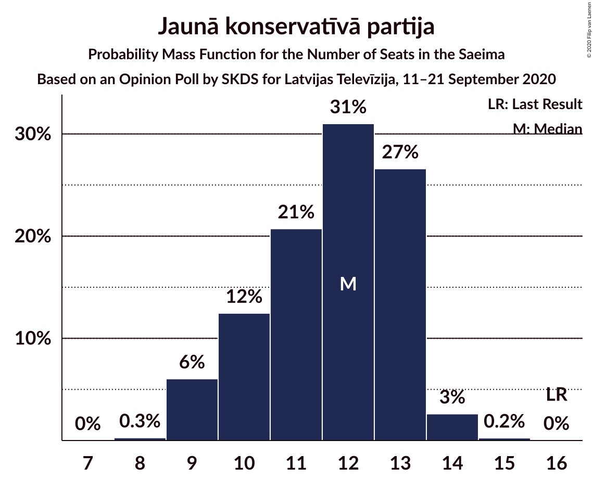

# Opinion Poll by SKDS for Latvijas Televīzija, 11–21 September 2020

<a href="#voting-intentions">Voting Intentions</a> | <a href="#seats">Seats</a> | <a href="#coalitions">Coalitions</a> | <a href="#technical-information">Technical Information</a>

## Voting Intentions

### Confidence Intervals

| Party | Last Result | Poll Result | 80% Confidence Interval | 90% Confidence Interval | 95% Confidence Interval | 99% Confidence Interval |
|:-----:|:-----------:|:-----------:|:-----------------------:|:-----------------------:|:-----------------------:|:-----------------------:|
| Sociāldemokrātiskā partija “Saskaņa” | 19.8% | 17.3% | 15.8–19.1% |15.4–19.6% |15.0–20.0% |14.3–20.8% |
| Zaļo un Zemnieku savienība | 9.9% | 16.6% | 15.0–18.2% |14.6–18.7% |14.3–19.1% |13.5–20.0% |
| Attīstībai/Par! | 12.0% | 13.0% | 11.6–14.5% |11.2–14.9% |10.9–15.3% |10.3–16.1% |
| Jaunā VIENOTĪBA | 6.7% | 11.1% | 9.9–12.6% |9.5–13.0% |9.2–13.4% |8.7–14.1% |
| Nacionālā apvienība „Visu Latvijai!”–„Tēvzemei un Brīvībai/LNNK” | 11.0% | 10.5% | 9.3–11.9% |8.9–12.3% |8.6–12.7% |8.1–13.4% |
| Jaunā konservatīvā partija | 13.6% | 10.4% | 9.1–11.8% |8.8–12.2% |8.5–12.5% |8.0–13.3% |
| Latvijas Reģionu Apvienība | 4.1% | 5.9% | 5.0–7.0% |4.7–7.3% |4.5–7.6% |4.1–8.2% |
| PROGRESĪVIE | 2.6% | 5.1% | 4.2–6.1% |4.0–6.4% |3.8–6.7% |3.4–7.3% |
| Latvijas Krievu savienība | 3.2% | 4.4% | 3.6–5.4% |3.4–5.7% |3.2–6.0% |2.9–6.5% |
| Politiskā partija „KPV LV” | 14.2% | 3.7% | 3.0–4.7% |2.8–4.9% |2.7–5.2% |2.4–5.7% |

*Note:* The poll result column reflects the actual value used in the calculations. Published results may vary slightly, and in addition be rounded to fewer digits.

## Seats

### Confidence Intervals

| Party | Last Result | Median | 80% Confidence Interval | 90% Confidence Interval | 95% Confidence Interval | 99% Confidence Interval |
|:-----:|:-----------:|:------:|:-----------------------:|:-----------------------:|:-----------------------:|:-----------------------:|
| <a href="#sociāldemokrātiskā-partija-“saskaņa”">Sociāldemokrātiskā partija “Saskaņa”</a> | 23 | 20 | 18–22 |18–23 |17–24 |16–25 |
| <a href="#zaļo-un-zemnieku-savienība">Zaļo un Zemnieku savienība</a> | 11 | 18 | 17–21 |17–22 |16–22 |15–22 |
| <a href="#attīstībai/par!">Attīstībai/Par!</a> | 13 | 15 | 13–16 |12–17 |12–17 |11–19 |
| <a href="#jaunā-vienotība">Jaunā VIENOTĪBA</a> | 8 | 12 | 11–14 |11–14 |11–15 |10–17 |
| <a href="#nacionālā-apvienība-„visu-latvijai!”–„tēvzemei-un-brīvībai/lnnk”">Nacionālā apvienība „Visu Latvijai!”–„Tēvzemei un Brīvībai/LNNK”</a> | 13 | 11 | 10–13 |10–13 |10–14 |10–15 |
| <a href="#jaunā-konservatīvā-partija">Jaunā konservatīvā partija</a> | 16 | 12 | 10–13 |9–13 |9–14 |9–14 |
| <a href="#latvijas-reģionu-apvienība">Latvijas Reģionu Apvienība</a> | 0 | 6 | 0–7 |0–7 |0–8 |0–9 |
| <a href="#progresīvie">PROGRESĪVIE</a> | 0 | 5 | 0–7 |0–7 |0–7 |0–8 |
| <a href="#latvijas-krievu-savienība">Latvijas Krievu savienība</a> | 0 | 0 | 0–7 |0–7 |0–7 |0–8 |
| <a href="#politiskā-partija-„kpv-lv”">Politiskā partija „KPV LV”</a> | 16 | 0 | 0 |0–5 |0–5 |0–6 |

### Sociāldemokrātiskā partija “Saskaņa”

*For a full overview of the results for this party, see the [Sociāldemokrātiskā partija “Saskaņa”](party-sociāldemokrātiskāpartija“saskaņa”.html) page.*

| Number of Seats | Probability | Accumulated | Special Marks |
|:---------------:|:-----------:|:-----------:|:-------------:|
| 15 | 0.1% | 100% |  |
| 16 | 0.7% | 99.9% |  |
| 17 | 4% | 99.2% |  |
| 18 | 18% | 95% |  |
| 19 | 15% | 77% |  |
| 20 | 19% | 62% | Median |
| 21 | 18% | 43% |  |
| 22 | 17% | 25% |  |
| 23 | 4% | 8% | Last Result |
| 24 | 2% | 4% |  |
| 25 | 2% | 2% |  |
| 26 | 0.1% | 0.1% |  |
| 27 | 0% | 0% |  |

### Zaļo un Zemnieku savienība

*For a full overview of the results for this party, see the [Zaļo un Zemnieku savienība](party-zaļounzemniekusavienība.html) page.*

| Number of Seats | Probability | Accumulated | Special Marks |
|:---------------:|:-----------:|:-----------:|:-------------:|
| 11 | 0% | 100% | Last Result |
| 12 | 0% | 100% |  |
| 13 | 0% | 100% |  |
| 14 | 0.2% | 99.9% |  |
| 15 | 0.4% | 99.7% |  |
| 16 | 3% | 99.3% |  |
| 17 | 35% | 96% |  |
| 18 | 21% | 62% | Median |
| 19 | 13% | 41% |  |
| 20 | 8% | 28% |  |
| 21 | 13% | 19% |  |
| 22 | 6% | 7% |  |
| 23 | 0.4% | 0.4% |  |
| 24 | 0% | 0.1% |  |
| 25 | 0% | 0% |  |

### Attīstībai/Par!

*For a full overview of the results for this party, see the [Attīstībai/Par!](party-attīstībaipar.html) page.*

| Number of Seats | Probability | Accumulated | Special Marks |
|:---------------:|:-----------:|:-----------:|:-------------:|
| 10 | 0.3% | 100% |  |
| 11 | 0.5% | 99.6% |  |
| 12 | 5% | 99.1% |  |
| 13 | 10% | 94% | Last Result |
| 14 | 14% | 84% |  |
| 15 | 52% | 70% | Median |
| 16 | 11% | 18% |  |
| 17 | 6% | 7% |  |
| 18 | 0.4% | 1.1% |  |
| 19 | 0.5% | 0.7% |  |
| 20 | 0.2% | 0.2% |  |
| 21 | 0% | 0% |  |

### Jaunā VIENOTĪBA

*For a full overview of the results for this party, see the [Jaunā VIENOTĪBA](party-jaunāvienotība.html) page.*

| Number of Seats | Probability | Accumulated | Special Marks |
|:---------------:|:-----------:|:-----------:|:-------------:|
| 8 | 0.1% | 100% | Last Result |
| 9 | 0.4% | 99.9% |  |
| 10 | 0.7% | 99.6% |  |
| 11 | 42% | 98.8% |  |
| 12 | 18% | 57% | Median |
| 13 | 18% | 39% |  |
| 14 | 17% | 21% |  |
| 15 | 2% | 3% |  |
| 16 | 0.6% | 2% |  |
| 17 | 1.3% | 1.3% |  |
| 18 | 0% | 0% |  |

### Nacionālā apvienība „Visu Latvijai!”–„Tēvzemei un Brīvībai/LNNK”

*For a full overview of the results for this party, see the [Nacionālā apvienība „Visu Latvijai!”–„Tēvzemei un Brīvībai/LNNK”](party-nacionālāapvienība„visulatvijai”–„tēvzemeiunbrīvībailnnk”.html) page.*

| Number of Seats | Probability | Accumulated | Special Marks |
|:---------------:|:-----------:|:-----------:|:-------------:|
| 8 | 0% | 100% |  |
| 9 | 0.4% | 99.9% |  |
| 10 | 11% | 99.6% |  |
| 11 | 42% | 88% | Median |
| 12 | 17% | 47% |  |
| 13 | 25% | 30% | Last Result |
| 14 | 4% | 5% |  |
| 15 | 1.0% | 1.2% |  |
| 16 | 0.3% | 0.3% |  |
| 17 | 0% | 0% |  |

### Jaunā konservatīvā partija

*For a full overview of the results for this party, see the [Jaunā konservatīvā partija](party-jaunākonservatīvāpartija.html) page.*

| Number of Seats | Probability | Accumulated | Special Marks |
|:---------------:|:-----------:|:-----------:|:-------------:|
| 8 | 0.3% | 100% |  |
| 9 | 6% | 99.7% |  |
| 10 | 12% | 94% |  |
| 11 | 21% | 81% |  |
| 12 | 31% | 60% | Median |
| 13 | 27% | 29% |  |
| 14 | 3% | 3% |  |
| 15 | 0.2% | 0.3% |  |
| 16 | 0% | 0% | Last Result |

### Latvijas Reģionu Apvienība

*For a full overview of the results for this party, see the [Latvijas Reģionu Apvienība](party-latvijasreģionuapvienība.html) page.*

| Number of Seats | Probability | Accumulated | Special Marks |
|:---------------:|:-----------:|:-----------:|:-------------:|
| 0 | 11% | 100% | Last Result |
| 1 | 0% | 89% |  |
| 2 | 0% | 89% |  |
| 3 | 0% | 89% |  |
| 4 | 0% | 89% |  |
| 5 | 0% | 89% |  |
| 6 | 61% | 89% | Median |
| 7 | 24% | 28% |  |
| 8 | 3% | 4% |  |
| 9 | 0.8% | 0.9% |  |
| 10 | 0.1% | 0.1% |  |
| 11 | 0% | 0% |  |

### PROGRESĪVIE

*For a full overview of the results for this party, see the [PROGRESĪVIE](party-progresīvie.html) page.*

| Number of Seats | Probability | Accumulated | Special Marks |
|:---------------:|:-----------:|:-----------:|:-------------:|
| 0 | 50% | 100% | Last Result |
| 1 | 0% | 50% |  |
| 2 | 0% | 50% |  |
| 3 | 0% | 50% |  |
| 4 | 0% | 50% |  |
| 5 | 0.5% | 50% | Median |
| 6 | 23% | 50% |  |
| 7 | 26% | 27% |  |
| 8 | 1.2% | 1.3% |  |
| 9 | 0% | 0% |  |

### Latvijas Krievu savienība

*For a full overview of the results for this party, see the [Latvijas Krievu savienība](party-latvijaskrievusavienība.html) page.*

| Number of Seats | Probability | Accumulated | Special Marks |
|:---------------:|:-----------:|:-----------:|:-------------:|
| 0 | 73% | 100% | Last Result, Median |
| 1 | 0% | 27% |  |
| 2 | 0% | 27% |  |
| 3 | 0% | 27% |  |
| 4 | 0% | 27% |  |
| 5 | 11% | 27% |  |
| 6 | 4% | 16% |  |
| 7 | 11% | 12% |  |
| 8 | 2% | 2% |  |
| 9 | 0% | 0% |  |

### Politiskā partija „KPV LV”

*For a full overview of the results for this party, see the [Politiskā partija „KPV LV”](party-politiskāpartija„kpvlv”.html) page.*

| Number of Seats | Probability | Accumulated | Special Marks |
|:---------------:|:-----------:|:-----------:|:-------------:|
| 0 | 93% | 100% | Median |
| 1 | 0% | 7% |  |
| 2 | 0% | 7% |  |
| 3 | 0% | 7% |  |
| 4 | 0% | 7% |  |
| 5 | 6% | 7% |  |
| 6 | 0.4% | 0.6% |  |
| 7 | 0.2% | 0.2% |  |
| 8 | 0% | 0% |  |
| 9 | 0% | 0% |  |
| 10 | 0% | 0% |  |
| 11 | 0% | 0% |  |
| 12 | 0% | 0% |  |
| 13 | 0% | 0% |  |
| 14 | 0% | 0% |  |
| 15 | 0% | 0% |  |
| 16 | 0% | 0% | Last Result |

## Coalitions

### Confidence Intervals

| Coalition | Last Result | Median | Majority? | 80% Confidence Interval | 90% Confidence Interval | 95% Confidence Interval | 99% Confidence Interval |
|:---------:|:-----------:|:------:|:---------:|:-----------------------:|:-----------------------:|:-----------------------:|:-----------------------:|
| Zaļo un Zemnieku savienība – Attīstībai/Par! – Jaunā VIENOTĪBA – Nacionālā apvienība „Visu Latvijai!”–„Tēvzemei un Brīvībai/LNNK” – Jaunā konservatīvā partija | 61 | 69 | 100% | 66–73 | 64–73 | 63–75 | 61–78 |
| Zaļo un Zemnieku savienība – Attīstībai/Par! – Jaunā VIENOTĪBA – Nacionālā apvienība „Visu Latvijai!”–„Tēvzemei un Brīvībai/LNNK” | 45 | 57 | 99.6% | 54–60 | 54–62 | 53–63 | 51–66 |
| Zaļo un Zemnieku savienība – Attīstībai/Par! – Nacionālā apvienība „Visu Latvijai!”–„Tēvzemei un Brīvībai/LNNK” – Jaunā konservatīvā partija | 53 | 57 | 99.1% | 53–60 | 52–62 | 52–62 | 50–64 |
| Zaļo un Zemnieku savienība – Jaunā VIENOTĪBA – Nacionālā apvienība „Visu Latvijai!”–„Tēvzemei un Brīvībai/LNNK” – Jaunā konservatīvā partija | 48 | 54 | 94% | 51–58 | 50–58 | 48–59 | 48–62 |
| Attīstībai/Par! – Jaunā VIENOTĪBA – Nacionālā apvienība „Visu Latvijai!”–„Tēvzemei un Brīvībai/LNNK” – Jaunā konservatīvā partija – Politiskā partija „KPV LV” | 66 | 50 | 45% | 48–54 | 46–56 | 46–57 | 44–60 |
| Attīstībai/Par! – Jaunā VIENOTĪBA – Nacionālā apvienība „Visu Latvijai!”–„Tēvzemei un Brīvībai/LNNK” – Jaunā konservatīvā partija | 50 | 50 | 42% | 48–53 | 46–54 | 45–56 | 44–59 |
| Sociāldemokrātiskā partija “Saskaņa” – Attīstībai/Par! – Jaunā konservatīvā partija | 52 | 47 | 7% | 43–50 | 42–51 | 41–52 | 40–53 |
| Zaļo un Zemnieku savienība – Attīstībai/Par! – Nacionālā apvienība „Visu Latvijai!”–„Tēvzemei un Brīvībai/LNNK” | 37 | 45 | 1.4% | 42–48 | 41–49 | 40–50 | 40–52 |
| Zaļo un Zemnieku savienība – Jaunā VIENOTĪBA – Nacionālā apvienība „Visu Latvijai!”–„Tēvzemei un Brīvībai/LNNK” | 32 | 42 | 0.1% | 40–45 | 39–46 | 39–47 | 38–49 |
| Zaļo un Zemnieku savienība – Nacionālā apvienība „Visu Latvijai!”–„Tēvzemei un Brīvībai/LNNK” – Jaunā konservatīvā partija | 40 | 42 | 0.1% | 39–45 | 38–46 | 37–47 | 36–48 |
| Attīstībai/Par! – Jaunā VIENOTĪBA – Nacionālā apvienība „Visu Latvijai!”–„Tēvzemei un Brīvībai/LNNK” – Politiskā partija „KPV LV” | 50 | 39 | 0% | 37–42 | 36–44 | 35–45 | 34–47 |
| Attīstībai/Par! – Jaunā VIENOTĪBA – Jaunā konservatīvā partija – Politiskā partija „KPV LV” | 53 | 39 | 0% | 36–42 | 35–43 | 35–44 | 33–47 |
| Attīstībai/Par! – Nacionālā apvienība „Visu Latvijai!”–„Tēvzemei un Brīvībai/LNNK” – Jaunā konservatīvā partija – Politiskā partija „KPV LV” | 58 | 39 | 0% | 35–41 | 35–43 | 35–44 | 33–46 |
| Sociāldemokrātiskā partija “Saskaņa” – Zaļo un Zemnieku savienība – Politiskā partija „KPV LV” | 50 | 39 | 0% | 35–43 | 35–44 | 34–44 | 34–46 |
| Jaunā VIENOTĪBA – Nacionālā apvienība „Visu Latvijai!”–„Tēvzemei un Brīvībai/LNNK” – Jaunā konservatīvā partija – Politiskā partija „KPV LV” | 53 | 36 | 0% | 33–39 | 32–41 | 31–41 | 30–44 |
| Sociāldemokrātiskā partija “Saskaņa” – Attīstībai/Par! | 36 | 35 | 0% | 32–37 | 31–39 | 31–40 | 29–41 |
| Sociāldemokrātiskā partija “Saskaņa” – Politiskā partija „KPV LV” | 39 | 20 | 0% | 18–23 | 18–25 | 17–26 | 16–27 |

### Zaļo un Zemnieku savienība – Attīstībai/Par! – Jaunā VIENOTĪBA – Nacionālā apvienība „Visu Latvijai!”–„Tēvzemei un Brīvībai/LNNK” – Jaunā konservatīvā partija

| Number of Seats | Probability | Accumulated | Special Marks |
|:---------------:|:-----------:|:-----------:|:-------------:|
| 59 | 0% | 100% |  |
| 60 | 0.2% | 99.9% |  |
| 61 | 0.5% | 99.8% | Last Result |
| 62 | 0.9% | 99.3% |  |
| 63 | 2% | 98% |  |
| 64 | 2% | 96% |  |
| 65 | 4% | 95% |  |
| 66 | 10% | 91% |  |
| 67 | 11% | 81% |  |
| 68 | 20% | 70% | Median |
| 69 | 15% | 51% |  |
| 70 | 8% | 36% |  |
| 71 | 11% | 28% |  |
| 72 | 5% | 17% |  |
| 73 | 7% | 12% |  |
| 74 | 2% | 5% |  |
| 75 | 1.2% | 3% |  |
| 76 | 0.9% | 2% |  |
| 77 | 0.4% | 1.2% |  |
| 78 | 0.3% | 0.8% |  |
| 79 | 0.4% | 0.5% |  |
| 80 | 0% | 0.1% |  |
| 81 | 0.1% | 0.1% |  |
| 82 | 0% | 0% |  |

### Zaļo un Zemnieku savienība – Attīstībai/Par! – Jaunā VIENOTĪBA – Nacionālā apvienība „Visu Latvijai!”–„Tēvzemei un Brīvībai/LNNK”

| Number of Seats | Probability | Accumulated | Special Marks |
|:---------------:|:-----------:|:-----------:|:-------------:|
| 45 | 0% | 100% | Last Result |
| 46 | 0% | 100% |  |
| 47 | 0% | 100% |  |
| 48 | 0% | 100% |  |
| 49 | 0.1% | 100% |  |
| 50 | 0.2% | 99.8% |  |
| 51 | 0.4% | 99.6% | Majority |
| 52 | 1.3% | 99.2% |  |
| 53 | 2% | 98% |  |
| 54 | 6% | 96% |  |
| 55 | 18% | 89% |  |
| 56 | 17% | 71% | Median |
| 57 | 16% | 54% |  |
| 58 | 8% | 38% |  |
| 59 | 7% | 31% |  |
| 60 | 15% | 23% |  |
| 61 | 4% | 9% |  |
| 62 | 2% | 5% |  |
| 63 | 2% | 3% |  |
| 64 | 0.7% | 1.4% |  |
| 65 | 0.2% | 0.8% |  |
| 66 | 0.4% | 0.6% |  |
| 67 | 0.1% | 0.1% |  |
| 68 | 0.1% | 0.1% |  |
| 69 | 0% | 0% |  |

### Zaļo un Zemnieku savienība – Attīstībai/Par! – Nacionālā apvienība „Visu Latvijai!”–„Tēvzemei un Brīvībai/LNNK” – Jaunā konservatīvā partija

| Number of Seats | Probability | Accumulated | Special Marks |
|:---------------:|:-----------:|:-----------:|:-------------:|
| 48 | 0% | 100% |  |
| 49 | 0.2% | 99.9% |  |
| 50 | 0.6% | 99.7% |  |
| 51 | 0.9% | 99.1% | Majority |
| 52 | 8% | 98% |  |
| 53 | 6% | 91% | Last Result |
| 54 | 5% | 85% |  |
| 55 | 8% | 80% |  |
| 56 | 21% | 72% | Median |
| 57 | 12% | 51% |  |
| 58 | 20% | 39% |  |
| 59 | 5% | 19% |  |
| 60 | 6% | 14% |  |
| 61 | 2% | 9% |  |
| 62 | 5% | 6% |  |
| 63 | 0.7% | 1.3% |  |
| 64 | 0.3% | 0.6% |  |
| 65 | 0.2% | 0.3% |  |
| 66 | 0% | 0.1% |  |
| 67 | 0.1% | 0.1% |  |
| 68 | 0% | 0% |  |

### Zaļo un Zemnieku savienība – Jaunā VIENOTĪBA – Nacionālā apvienība „Visu Latvijai!”–„Tēvzemei un Brīvībai/LNNK” – Jaunā konservatīvā partija

| Number of Seats | Probability | Accumulated | Special Marks |
|:---------------:|:-----------:|:-----------:|:-------------:|
| 46 | 0.1% | 100% |  |
| 47 | 0.3% | 99.9% |  |
| 48 | 2% | 99.6% | Last Result |
| 49 | 1.5% | 97% |  |
| 50 | 2% | 96% |  |
| 51 | 9% | 94% | Majority |
| 52 | 8% | 85% |  |
| 53 | 22% | 77% | Median |
| 54 | 17% | 55% |  |
| 55 | 8% | 38% |  |
| 56 | 13% | 31% |  |
| 57 | 8% | 18% |  |
| 58 | 6% | 10% |  |
| 59 | 2% | 4% |  |
| 60 | 0.8% | 2% |  |
| 61 | 0.4% | 2% |  |
| 62 | 0.7% | 1.1% |  |
| 63 | 0.3% | 0.4% |  |
| 64 | 0.1% | 0.1% |  |
| 65 | 0% | 0.1% |  |
| 66 | 0% | 0% |  |

### Attīstībai/Par! – Jaunā VIENOTĪBA – Nacionālā apvienība „Visu Latvijai!”–„Tēvzemei un Brīvībai/LNNK” – Jaunā konservatīvā partija – Politiskā partija „KPV LV”

| Number of Seats | Probability | Accumulated | Special Marks |
|:---------------:|:-----------:|:-----------:|:-------------:|
| 43 | 0.3% | 100% |  |
| 44 | 0.5% | 99.7% |  |
| 45 | 1.1% | 99.2% |  |
| 46 | 3% | 98% |  |
| 47 | 1.2% | 95% |  |
| 48 | 9% | 94% |  |
| 49 | 12% | 85% |  |
| 50 | 27% | 73% | Median |
| 51 | 16% | 45% | Majority |
| 52 | 12% | 30% |  |
| 53 | 8% | 18% |  |
| 54 | 2% | 10% |  |
| 55 | 1.5% | 8% |  |
| 56 | 4% | 6% |  |
| 57 | 1.0% | 3% |  |
| 58 | 1.0% | 2% |  |
| 59 | 0.2% | 0.8% |  |
| 60 | 0.5% | 0.6% |  |
| 61 | 0% | 0.2% |  |
| 62 | 0% | 0.1% |  |
| 63 | 0.1% | 0.1% |  |
| 64 | 0% | 0% |  |
| 65 | 0% | 0% |  |
| 66 | 0% | 0% | Last Result |

### Attīstībai/Par! – Jaunā VIENOTĪBA – Nacionālā apvienība „Visu Latvijai!”–„Tēvzemei un Brīvībai/LNNK” – Jaunā konservatīvā partija

| Number of Seats | Probability | Accumulated | Special Marks |
|:---------------:|:-----------:|:-----------:|:-------------:|
| 42 | 0.1% | 100% |  |
| 43 | 0.4% | 99.9% |  |
| 44 | 0.7% | 99.6% |  |
| 45 | 1.4% | 98.8% |  |
| 46 | 3% | 97% |  |
| 47 | 2% | 94% |  |
| 48 | 9% | 92% |  |
| 49 | 13% | 83% |  |
| 50 | 27% | 70% | Last Result, Median |
| 51 | 18% | 42% | Majority |
| 52 | 11% | 25% |  |
| 53 | 7% | 13% |  |
| 54 | 2% | 6% |  |
| 55 | 0.9% | 4% |  |
| 56 | 1.3% | 4% |  |
| 57 | 0.7% | 2% |  |
| 58 | 1.1% | 2% |  |
| 59 | 0.1% | 0.6% |  |
| 60 | 0.4% | 0.5% |  |
| 61 | 0% | 0% |  |

### Sociāldemokrātiskā partija “Saskaņa” – Attīstībai/Par! – Jaunā konservatīvā partija

| Number of Seats | Probability | Accumulated | Special Marks |
|:---------------:|:-----------:|:-----------:|:-------------:|
| 38 | 0.2% | 100% |  |
| 39 | 0.2% | 99.7% |  |
| 40 | 0.3% | 99.5% |  |
| 41 | 3% | 99.2% |  |
| 42 | 5% | 97% |  |
| 43 | 7% | 92% |  |
| 44 | 5% | 84% |  |
| 45 | 15% | 79% |  |
| 46 | 11% | 64% |  |
| 47 | 11% | 53% | Median |
| 48 | 22% | 41% |  |
| 49 | 4% | 19% |  |
| 50 | 8% | 15% |  |
| 51 | 3% | 7% | Majority |
| 52 | 2% | 5% | Last Result |
| 53 | 2% | 2% |  |
| 54 | 0.4% | 0.5% |  |
| 55 | 0.1% | 0.1% |  |
| 56 | 0% | 0% |  |

### Zaļo un Zemnieku savienība – Attīstībai/Par! – Nacionālā apvienība „Visu Latvijai!”–„Tēvzemei un Brīvībai/LNNK”

| Number of Seats | Probability | Accumulated | Special Marks |
|:---------------:|:-----------:|:-----------:|:-------------:|
| 37 | 0.1% | 100% | Last Result |
| 38 | 0.2% | 99.9% |  |
| 39 | 0.2% | 99.7% |  |
| 40 | 3% | 99.5% |  |
| 41 | 5% | 96% |  |
| 42 | 6% | 91% |  |
| 43 | 8% | 86% |  |
| 44 | 18% | 77% | Median |
| 45 | 22% | 59% |  |
| 46 | 12% | 37% |  |
| 47 | 11% | 25% |  |
| 48 | 7% | 14% |  |
| 49 | 5% | 7% |  |
| 50 | 1.1% | 3% |  |
| 51 | 0.7% | 1.4% | Majority |
| 52 | 0.5% | 0.7% |  |
| 53 | 0.1% | 0.1% |  |
| 54 | 0% | 0% |  |

### Zaļo un Zemnieku savienība – Jaunā VIENOTĪBA – Nacionālā apvienība „Visu Latvijai!”–„Tēvzemei un Brīvībai/LNNK”

| Number of Seats | Probability | Accumulated | Special Marks |
|:---------------:|:-----------:|:-----------:|:-------------:|
| 32 | 0% | 100% | Last Result |
| 33 | 0% | 100% |  |
| 34 | 0% | 100% |  |
| 35 | 0% | 100% |  |
| 36 | 0.1% | 99.9% |  |
| 37 | 0.2% | 99.9% |  |
| 38 | 1.1% | 99.6% |  |
| 39 | 7% | 98.5% |  |
| 40 | 9% | 91% |  |
| 41 | 20% | 82% | Median |
| 42 | 23% | 62% |  |
| 43 | 7% | 39% |  |
| 44 | 10% | 33% |  |
| 45 | 14% | 23% |  |
| 46 | 6% | 9% |  |
| 47 | 2% | 3% |  |
| 48 | 0.6% | 2% |  |
| 49 | 0.7% | 1.1% |  |
| 50 | 0.2% | 0.4% |  |
| 51 | 0% | 0.1% | Majority |
| 52 | 0% | 0.1% |  |
| 53 | 0.1% | 0.1% |  |
| 54 | 0% | 0% |  |

### Zaļo un Zemnieku savienība – Nacionālā apvienība „Visu Latvijai!”–„Tēvzemei un Brīvībai/LNNK” – Jaunā konservatīvā partija

| Number of Seats | Probability | Accumulated | Special Marks |
|:---------------:|:-----------:|:-----------:|:-------------:|
| 35 | 0.1% | 100% |  |
| 36 | 0.5% | 99.9% |  |
| 37 | 3% | 99.3% |  |
| 38 | 4% | 97% |  |
| 39 | 5% | 93% |  |
| 40 | 16% | 88% | Last Result |
| 41 | 16% | 72% | Median |
| 42 | 15% | 56% |  |
| 43 | 21% | 41% |  |
| 44 | 6% | 19% |  |
| 45 | 5% | 14% |  |
| 46 | 6% | 9% |  |
| 47 | 2% | 3% |  |
| 48 | 0.5% | 0.9% |  |
| 49 | 0.2% | 0.3% |  |
| 50 | 0.1% | 0.1% |  |
| 51 | 0% | 0.1% | Majority |
| 52 | 0% | 0% |  |

### Attīstībai/Par! – Jaunā VIENOTĪBA – Nacionālā apvienība „Visu Latvijai!”–„Tēvzemei un Brīvībai/LNNK” – Politiskā partija „KPV LV”

| Number of Seats | Probability | Accumulated | Special Marks |
|:---------------:|:-----------:|:-----------:|:-------------:|
| 32 | 0.2% | 100% |  |
| 33 | 0.1% | 99.8% |  |
| 34 | 1.3% | 99.7% |  |
| 35 | 1.3% | 98% |  |
| 36 | 7% | 97% |  |
| 37 | 19% | 90% |  |
| 38 | 21% | 71% | Median |
| 39 | 18% | 51% |  |
| 40 | 10% | 33% |  |
| 41 | 9% | 23% |  |
| 42 | 6% | 14% |  |
| 43 | 1.1% | 8% |  |
| 44 | 3% | 7% |  |
| 45 | 3% | 4% |  |
| 46 | 0.4% | 1.2% |  |
| 47 | 0.6% | 0.8% |  |
| 48 | 0.1% | 0.2% |  |
| 49 | 0% | 0.1% |  |
| 50 | 0.1% | 0.1% | Last Result |
| 51 | 0% | 0% | Majority |

### Attīstībai/Par! – Jaunā VIENOTĪBA – Jaunā konservatīvā partija – Politiskā partija „KPV LV”

| Number of Seats | Probability | Accumulated | Special Marks |
|:---------------:|:-----------:|:-----------:|:-------------:|
| 32 | 0.3% | 100% |  |
| 33 | 0.6% | 99.7% |  |
| 34 | 1.3% | 99.1% |  |
| 35 | 3% | 98% |  |
| 36 | 5% | 95% |  |
| 37 | 10% | 89% |  |
| 38 | 17% | 80% |  |
| 39 | 31% | 63% | Median |
| 40 | 16% | 32% |  |
| 41 | 4% | 16% |  |
| 42 | 4% | 12% |  |
| 43 | 4% | 7% |  |
| 44 | 2% | 3% |  |
| 45 | 0.7% | 2% |  |
| 46 | 0.3% | 0.8% |  |
| 47 | 0.4% | 0.5% |  |
| 48 | 0% | 0.1% |  |
| 49 | 0% | 0.1% |  |
| 50 | 0.1% | 0.1% |  |
| 51 | 0% | 0% | Majority |
| 52 | 0% | 0% |  |
| 53 | 0% | 0% | Last Result |

### Attīstībai/Par! – Nacionālā apvienība „Visu Latvijai!”–„Tēvzemei un Brīvībai/LNNK” – Jaunā konservatīvā partija – Politiskā partija „KPV LV”

| Number of Seats | Probability | Accumulated | Special Marks |
|:---------------:|:-----------:|:-----------:|:-------------:|
| 32 | 0.3% | 100% |  |
| 33 | 0.7% | 99.7% |  |
| 34 | 1.5% | 99.0% |  |
| 35 | 8% | 98% |  |
| 36 | 10% | 89% |  |
| 37 | 16% | 79% |  |
| 38 | 11% | 64% | Median |
| 39 | 27% | 53% |  |
| 40 | 9% | 26% |  |
| 41 | 8% | 17% |  |
| 42 | 2% | 9% |  |
| 43 | 2% | 7% |  |
| 44 | 4% | 5% |  |
| 45 | 0.2% | 0.9% |  |
| 46 | 0.5% | 0.7% |  |
| 47 | 0.1% | 0.3% |  |
| 48 | 0.1% | 0.2% |  |
| 49 | 0% | 0% |  |
| 50 | 0% | 0% |  |
| 51 | 0% | 0% | Majority |
| 52 | 0% | 0% |  |
| 53 | 0% | 0% |  |
| 54 | 0% | 0% |  |
| 55 | 0% | 0% |  |
| 56 | 0% | 0% |  |
| 57 | 0% | 0% |  |
| 58 | 0% | 0% | Last Result |

### Sociāldemokrātiskā partija “Saskaņa” – Zaļo un Zemnieku savienība – Politiskā partija „KPV LV”

| Number of Seats | Probability | Accumulated | Special Marks |
|:---------------:|:-----------:|:-----------:|:-------------:|
| 32 | 0.1% | 100% |  |
| 33 | 0.3% | 99.9% |  |
| 34 | 2% | 99.6% |  |
| 35 | 7% | 97% |  |
| 36 | 13% | 90% |  |
| 37 | 11% | 77% |  |
| 38 | 14% | 66% | Median |
| 39 | 12% | 52% |  |
| 40 | 9% | 40% |  |
| 41 | 8% | 31% |  |
| 42 | 7% | 23% |  |
| 43 | 10% | 16% |  |
| 44 | 4% | 6% |  |
| 45 | 1.1% | 2% |  |
| 46 | 0.3% | 0.8% |  |
| 47 | 0.1% | 0.5% |  |
| 48 | 0.4% | 0.4% |  |
| 49 | 0% | 0% |  |
| 50 | 0% | 0% | Last Result |

### Jaunā VIENOTĪBA – Nacionālā apvienība „Visu Latvijai!”–„Tēvzemei un Brīvībai/LNNK” – Jaunā konservatīvā partija – Politiskā partija „KPV LV”

| Number of Seats | Probability | Accumulated | Special Marks |
|:---------------:|:-----------:|:-----------:|:-------------:|
| 29 | 0.1% | 100% |  |
| 30 | 0.8% | 99.9% |  |
| 31 | 2% | 99.1% |  |
| 32 | 2% | 97% |  |
| 33 | 6% | 95% |  |
| 34 | 10% | 89% |  |
| 35 | 26% | 78% | Median |
| 36 | 18% | 53% |  |
| 37 | 16% | 35% |  |
| 38 | 6% | 18% |  |
| 39 | 5% | 12% |  |
| 40 | 2% | 7% |  |
| 41 | 3% | 6% |  |
| 42 | 0.7% | 2% |  |
| 43 | 1.2% | 2% |  |
| 44 | 0.3% | 0.6% |  |
| 45 | 0.1% | 0.3% |  |
| 46 | 0.1% | 0.1% |  |
| 47 | 0% | 0% |  |
| 48 | 0% | 0% |  |
| 49 | 0% | 0% |  |
| 50 | 0% | 0% |  |
| 51 | 0% | 0% | Majority |
| 52 | 0% | 0% |  |
| 53 | 0% | 0% | Last Result |

### Sociāldemokrātiskā partija “Saskaņa” – Attīstībai/Par!

| Number of Seats | Probability | Accumulated | Special Marks |
|:---------------:|:-----------:|:-----------:|:-------------:|
| 27 | 0.1% | 100% |  |
| 28 | 0.3% | 99.9% |  |
| 29 | 0.4% | 99.6% |  |
| 30 | 0.7% | 99.3% |  |
| 31 | 6% | 98.6% |  |
| 32 | 6% | 93% |  |
| 33 | 16% | 87% |  |
| 34 | 15% | 72% |  |
| 35 | 18% | 57% | Median |
| 36 | 15% | 39% | Last Result |
| 37 | 16% | 24% |  |
| 38 | 3% | 9% |  |
| 39 | 1.4% | 6% |  |
| 40 | 4% | 4% |  |
| 41 | 0.5% | 0.6% |  |
| 42 | 0.1% | 0.1% |  |
| 43 | 0% | 0% |  |

### Sociāldemokrātiskā partija “Saskaņa” – Politiskā partija „KPV LV”

| Number of Seats | Probability | Accumulated | Special Marks |
|:---------------:|:-----------:|:-----------:|:-------------:|
| 15 | 0.1% | 100% |  |
| 16 | 0.6% | 99.9% |  |
| 17 | 4% | 99.2% |  |
| 18 | 17% | 96% |  |
| 19 | 14% | 79% |  |
| 20 | 19% | 64% | Median |
| 21 | 15% | 46% |  |
| 22 | 16% | 30% |  |
| 23 | 5% | 14% |  |
| 24 | 3% | 9% |  |
| 25 | 3% | 7% |  |
| 26 | 3% | 4% |  |
| 27 | 1.0% | 1.2% |  |
| 28 | 0.1% | 0.2% |  |
| 29 | 0% | 0.1% |  |
| 30 | 0% | 0.1% |  |
| 31 | 0% | 0% |  |
| 32 | 0% | 0% |  |
| 33 | 0% | 0% |  |
| 34 | 0% | 0% |  |
| 35 | 0% | 0% |  |
| 36 | 0% | 0% |  |
| 37 | 0% | 0% |  |
| 38 | 0% | 0% |  |
| 39 | 0% | 0% | Last Result |

## Technical Information

### Opinion Poll

+ **Polling firm:** SKDS
+ **Commissioner(s):** Latvijas Televīzija
+ **Fieldwork period:** 11–21 September 2020

### Calculations

+ **Sample size:** 888
+ **Simulations done:** 1,048,576
+ **Error estimate:** 1.98%

