# Opinion Poll by Factum, 29 September–4 October 2020

<a href="#voting-intentions">Voting Intentions</a> | <a href="#seats">Seats</a> | <a href="#coalitions">Coalitions</a> | <a href="#technical-information">Technical Information</a>

## Voting Intentions

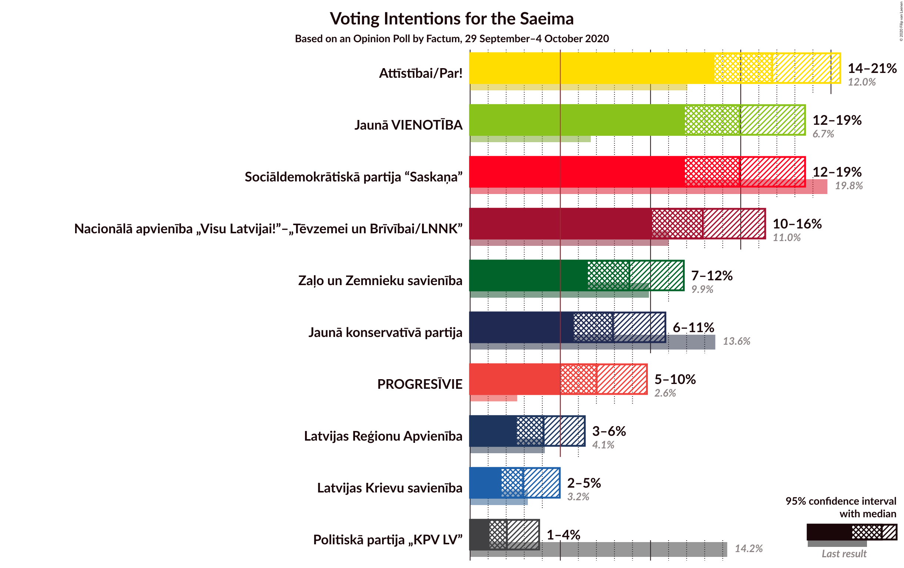

### Confidence Intervals

| Party | Last Result | Poll Result | 80% Confidence Interval | 90% Confidence Interval | 95% Confidence Interval | 99% Confidence Interval |
|:-----:|:-----------:|:-----------:|:-----------------------:|:-----------------------:|:-----------------------:|:-----------------------:|
| Attīstībai/Par! | 12.0% | 16.7% | 14.6–19.2% |14.1–19.9% |13.5–20.5% |12.6–21.7% |
| Sociāldemokrātiskā partija “Saskaņa” | 19.8% | 14.9% | 12.9–17.3% |12.4–18.0% |11.9–18.6% |11.0–19.8% |
| Jaunā VIENOTĪBA | 6.7% | 14.9% | 12.9–17.3% |12.4–18.0% |11.9–18.6% |11.0–19.8% |
| Nacionālā apvienība „Visu Latvijai!”–„Tēvzemei un Brīvībai/LNNK” | 11.0% | 12.9% | 11.1–15.2% |10.5–15.8% |10.1–16.4% |9.3–17.5% |
| Zaļo un Zemnieku savienība | 9.9% | 8.8% | 7.3–10.8% |6.9–11.4% |6.5–11.8% |5.9–12.8% |
| Jaunā konservatīvā partija | 13.6% | 7.9% | 6.5–9.8% |6.1–10.3% |5.7–10.8% |5.1–11.8% |
| PROGRESĪVIE | 2.6% | 7.0% | 5.7–8.8% |5.3–9.3% |5.0–9.8% |4.4–10.7% |
| Latvijas Reģionu Apvienība | 4.1% | 4.1% | 3.1–5.5% |2.8–6.0% |2.6–6.4% |2.2–7.1% |
| Latvijas Krievu savienība | 3.2% | 2.9% | 2.1–4.3% |1.9–4.6% |1.7–5.0% |1.4–5.7% |
| Politiskā partija „KPV LV” | 14.2% | 2.0% | 1.4–3.2% |1.2–3.5% |1.1–3.8% |0.8–4.5% |

*Note:* The poll result column reflects the actual value used in the calculations. Published results may vary slightly, and in addition be rounded to fewer digits.

## Seats

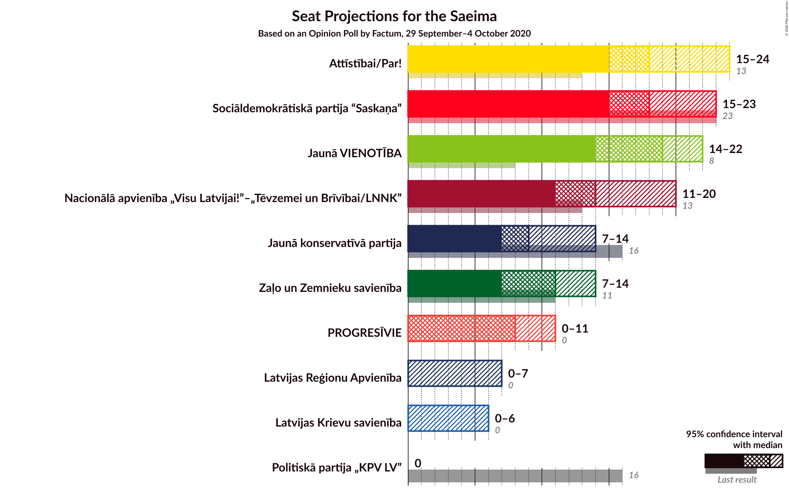

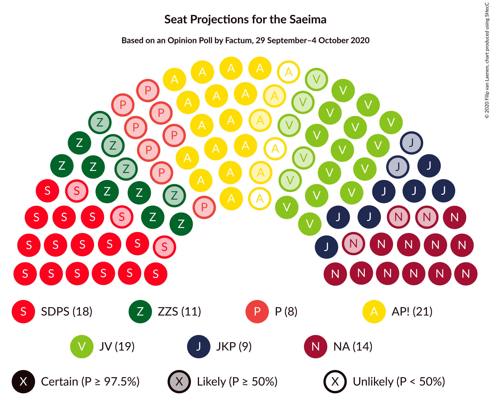

### Confidence Intervals

| Party | Last Result | Median | 80% Confidence Interval | 90% Confidence Interval | 95% Confidence Interval | 99% Confidence Interval |
|:-----:|:-----------:|:------:|:-----------------------:|:-----------------------:|:-----------------------:|:-----------------------:|
| <a href="#attīstībai/par!">Attīstībai/Par!</a> | 13 | 18 | 16–21 |16–23 |15–24 |14–25 |
| <a href="#sociāldemokrātiskā-partija-“saskaņa”">Sociāldemokrātiskā partija “Saskaņa”</a> | 23 | 18 | 16–21 |15–22 |15–23 |15–24 |
| <a href="#jaunā-vienotība">Jaunā VIENOTĪBA</a> | 8 | 19 | 16–20 |15–21 |14–22 |12–24 |
| <a href="#nacionālā-apvienība-„visu-latvijai!”–„tēvzemei-un-brīvībai/lnnk”">Nacionālā apvienība „Visu Latvijai!”–„Tēvzemei un Brīvībai/LNNK”</a> | 13 | 14 | 13–17 |12–18 |11–20 |11–21 |
| <a href="#zaļo-un-zemnieku-savienība">Zaļo un Zemnieku savienība</a> | 11 | 11 | 9–13 |7–13 |7–14 |7–16 |
| <a href="#jaunā-konservatīvā-partija">Jaunā konservatīvā partija</a> | 16 | 9 | 7–11 |7–13 |7–14 |0–14 |
| <a href="#progresīvie">PROGRESĪVIE</a> | 0 | 8 | 7–9 |6–11 |0–11 |0–12 |
| <a href="#latvijas-reģionu-apvienība">Latvijas Reģionu Apvienība</a> | 0 | 0 | 0–6 |0–6 |0–7 |0–8 |
| <a href="#latvijas-krievu-savienība">Latvijas Krievu savienība</a> | 0 | 0 | 0 |0 |0–6 |0–8 |
| <a href="#politiskā-partija-„kpv-lv”">Politiskā partija „KPV LV”</a> | 16 | 0 | 0 |0 |0 |0 |

### Attīstībai/Par!

*For a full overview of the results for this party, see the [Attīstībai/Par!](party-attīstībaipar.html) page.*

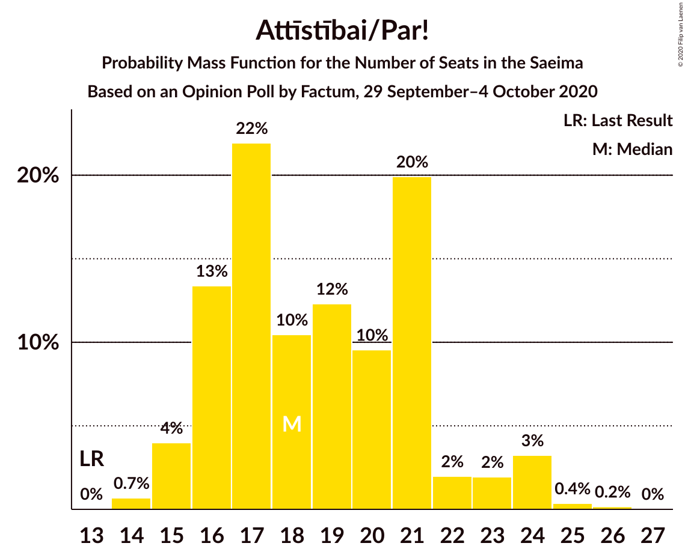

| Number of Seats | Probability | Accumulated | Special Marks |
|:---------------:|:-----------:|:-----------:|:-------------:|
| 13 | 0% | 100% | Last Result |
| 14 | 0.7% | 100% |  |
| 15 | 4% | 99.3% |  |
| 16 | 13% | 95% |  |
| 17 | 22% | 82% |  |
| 18 | 10% | 60% | Median |
| 19 | 12% | 50% |  |
| 20 | 10% | 37% |  |
| 21 | 20% | 28% |  |
| 22 | 2% | 8% |  |
| 23 | 2% | 6% |  |
| 24 | 3% | 4% |  |
| 25 | 0.4% | 0.6% |  |
| 26 | 0.2% | 0.2% |  |
| 27 | 0% | 0% |  |

### Sociāldemokrātiskā partija “Saskaņa”

*For a full overview of the results for this party, see the [Sociāldemokrātiskā partija “Saskaņa”](party-sociāldemokrātiskāpartija“saskaņa”.html) page.*

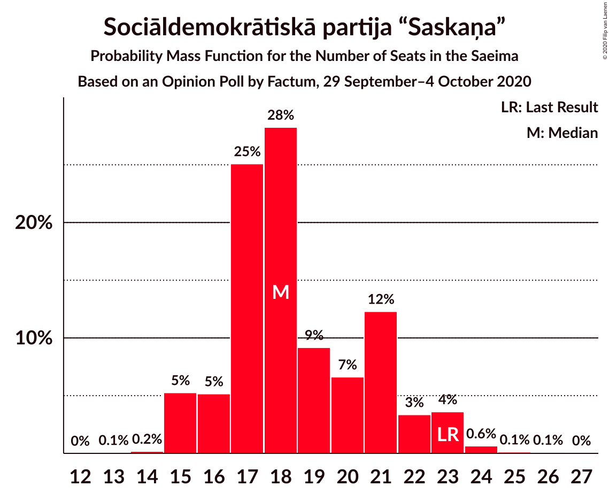

| Number of Seats | Probability | Accumulated | Special Marks |
|:---------------:|:-----------:|:-----------:|:-------------:|
| 13 | 0.1% | 100% |  |
| 14 | 0.2% | 99.9% |  |
| 15 | 5% | 99.7% |  |
| 16 | 5% | 94% |  |
| 17 | 25% | 89% |  |
| 18 | 28% | 64% | Median |
| 19 | 9% | 36% |  |
| 20 | 7% | 27% |  |
| 21 | 12% | 20% |  |
| 22 | 3% | 8% |  |
| 23 | 4% | 5% | Last Result |
| 24 | 0.6% | 0.9% |  |
| 25 | 0.1% | 0.3% |  |
| 26 | 0.1% | 0.1% |  |
| 27 | 0% | 0% |  |

### Jaunā VIENOTĪBA

*For a full overview of the results for this party, see the [Jaunā VIENOTĪBA](party-jaunāvienotība.html) page.*

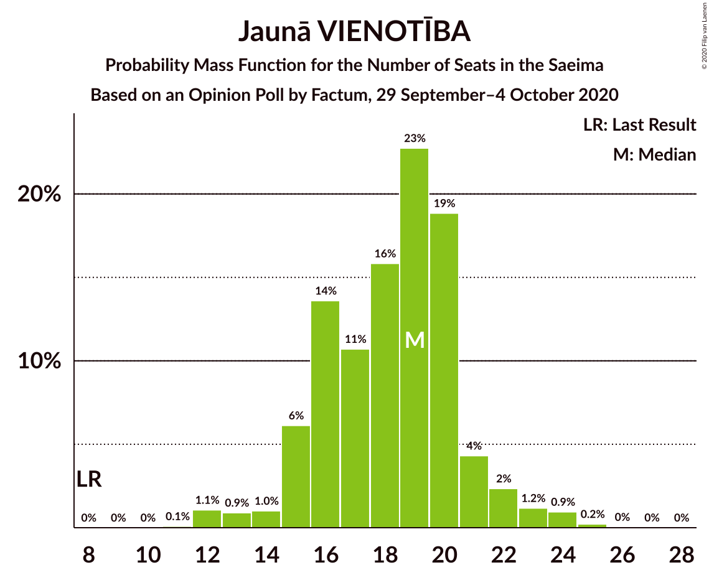

| Number of Seats | Probability | Accumulated | Special Marks |
|:---------------:|:-----------:|:-----------:|:-------------:|
| 8 | 0% | 100% | Last Result |
| 9 | 0% | 100% |  |
| 10 | 0% | 100% |  |
| 11 | 0.1% | 100% |  |
| 12 | 1.1% | 99.9% |  |
| 13 | 0.9% | 98.8% |  |
| 14 | 1.0% | 98% |  |
| 15 | 6% | 97% |  |
| 16 | 14% | 91% |  |
| 17 | 11% | 77% |  |
| 18 | 16% | 66% |  |
| 19 | 23% | 51% | Median |
| 20 | 19% | 28% |  |
| 21 | 4% | 9% |  |
| 22 | 2% | 5% |  |
| 23 | 1.2% | 2% |  |
| 24 | 0.9% | 1.2% |  |
| 25 | 0.2% | 0.3% |  |
| 26 | 0% | 0.1% |  |
| 27 | 0% | 0% |  |

### Nacionālā apvienība „Visu Latvijai!”–„Tēvzemei un Brīvībai/LNNK”

*For a full overview of the results for this party, see the [Nacionālā apvienība „Visu Latvijai!”–„Tēvzemei un Brīvībai/LNNK”](party-nacionālāapvienība„visulatvijai”–„tēvzemeiunbrīvībailnnk”.html) page.*

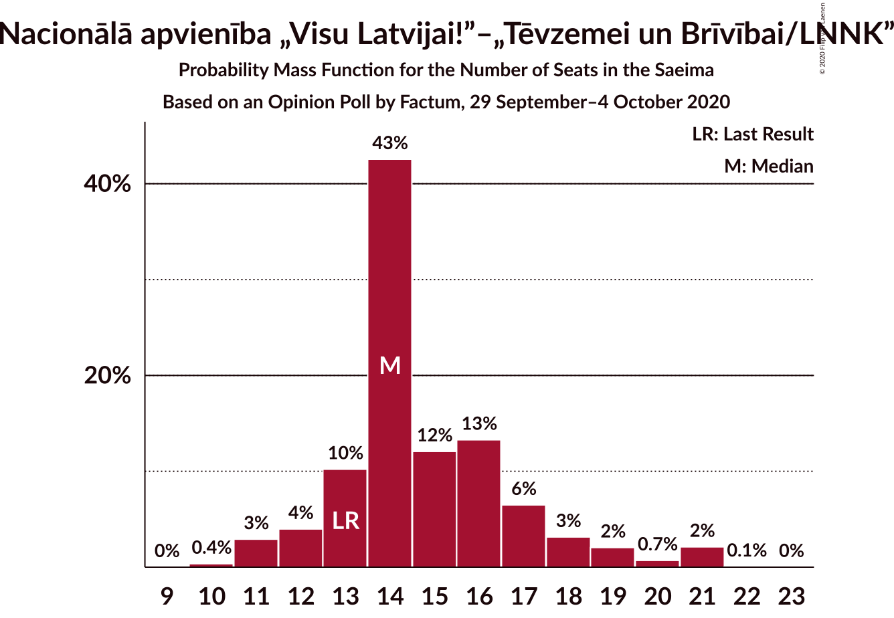

| Number of Seats | Probability | Accumulated | Special Marks |
|:---------------:|:-----------:|:-----------:|:-------------:|
| 10 | 0.4% | 100% |  |
| 11 | 3% | 99.6% |  |
| 12 | 4% | 97% |  |
| 13 | 10% | 93% | Last Result |
| 14 | 43% | 83% | Median |
| 15 | 12% | 40% |  |
| 16 | 13% | 28% |  |
| 17 | 6% | 15% |  |
| 18 | 3% | 8% |  |
| 19 | 2% | 5% |  |
| 20 | 0.7% | 3% |  |
| 21 | 2% | 2% |  |
| 22 | 0.1% | 0.1% |  |
| 23 | 0% | 0% |  |

### Zaļo un Zemnieku savienība

*For a full overview of the results for this party, see the [Zaļo un Zemnieku savienība](party-zaļounzemniekusavienība.html) page.*

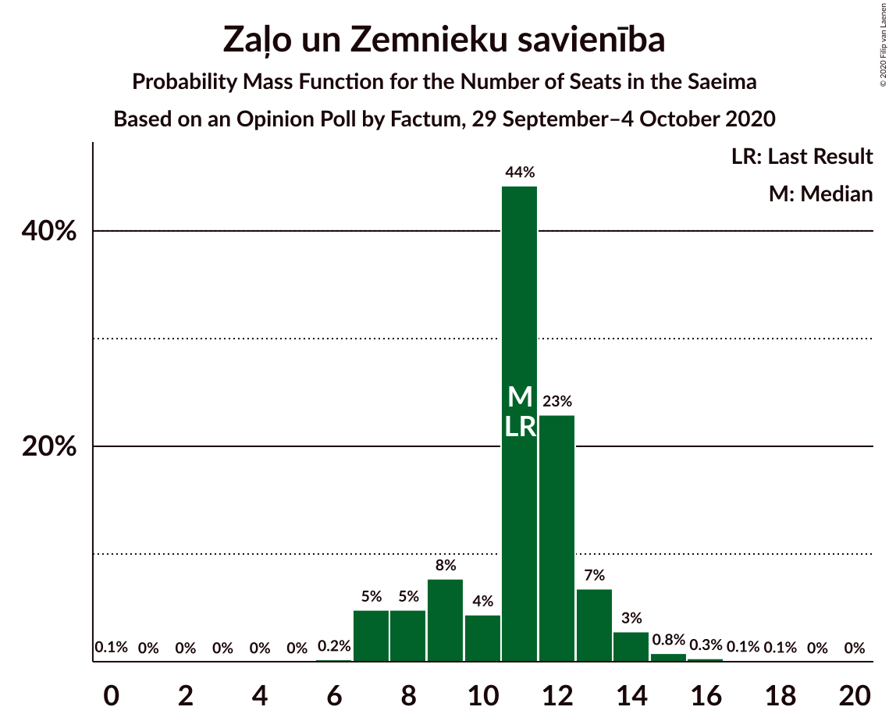

| Number of Seats | Probability | Accumulated | Special Marks |
|:---------------:|:-----------:|:-----------:|:-------------:|
| 0 | 0.1% | 100% |  |
| 1 | 0% | 99.9% |  |
| 2 | 0% | 99.9% |  |
| 3 | 0% | 99.9% |  |
| 4 | 0% | 99.9% |  |
| 5 | 0% | 99.9% |  |
| 6 | 0.2% | 99.9% |  |
| 7 | 5% | 99.7% |  |
| 8 | 5% | 95% |  |
| 9 | 8% | 90% |  |
| 10 | 4% | 82% |  |
| 11 | 44% | 78% | Last Result, Median |
| 12 | 23% | 34% |  |
| 13 | 7% | 11% |  |
| 14 | 3% | 4% |  |
| 15 | 0.8% | 1.3% |  |
| 16 | 0.3% | 0.5% |  |
| 17 | 0.1% | 0.2% |  |
| 18 | 0.1% | 0.1% |  |
| 19 | 0% | 0% |  |

### Jaunā konservatīvā partija

*For a full overview of the results for this party, see the [Jaunā konservatīvā partija](party-jaunākonservatīvāpartija.html) page.*

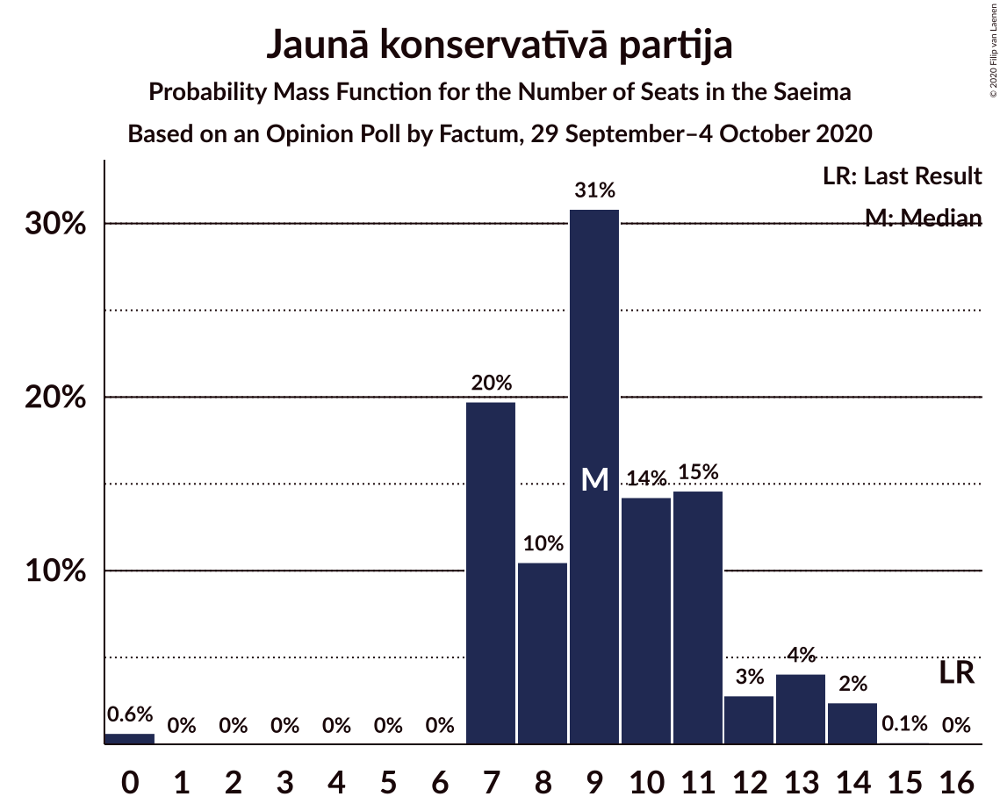

| Number of Seats | Probability | Accumulated | Special Marks |
|:---------------:|:-----------:|:-----------:|:-------------:|
| 0 | 0.6% | 100% |  |
| 1 | 0% | 99.4% |  |
| 2 | 0% | 99.4% |  |
| 3 | 0% | 99.4% |  |
| 4 | 0% | 99.4% |  |
| 5 | 0% | 99.4% |  |
| 6 | 0% | 99.4% |  |
| 7 | 20% | 99.3% |  |
| 8 | 10% | 80% |  |
| 9 | 31% | 69% | Median |
| 10 | 14% | 38% |  |
| 11 | 15% | 24% |  |
| 12 | 3% | 9% |  |
| 13 | 4% | 7% |  |
| 14 | 2% | 3% |  |
| 15 | 0.1% | 0.1% |  |
| 16 | 0% | 0% | Last Result |

### PROGRESĪVIE

*For a full overview of the results for this party, see the [PROGRESĪVIE](party-progresīvie.html) page.*

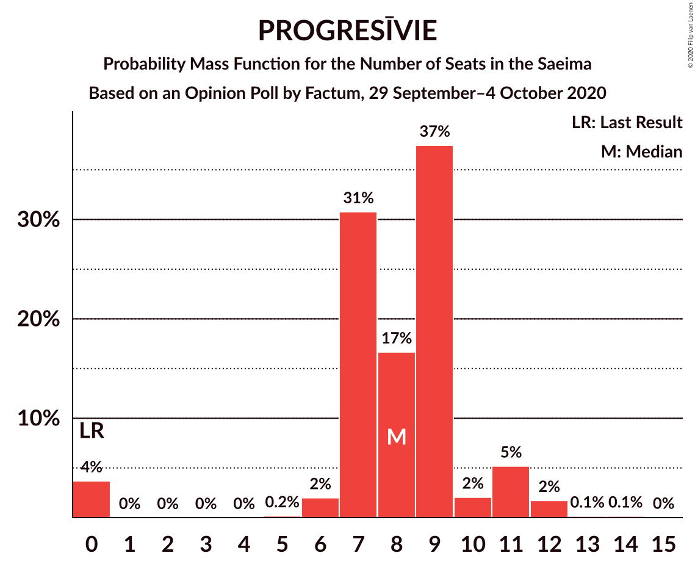

| Number of Seats | Probability | Accumulated | Special Marks |
|:---------------:|:-----------:|:-----------:|:-------------:|
| 0 | 4% | 100% | Last Result |
| 1 | 0% | 96% |  |
| 2 | 0% | 96% |  |
| 3 | 0% | 96% |  |
| 4 | 0% | 96% |  |
| 5 | 0.2% | 96% |  |
| 6 | 2% | 96% |  |
| 7 | 31% | 94% |  |
| 8 | 17% | 63% | Median |
| 9 | 37% | 47% |  |
| 10 | 2% | 9% |  |
| 11 | 5% | 7% |  |
| 12 | 2% | 2% |  |
| 13 | 0.1% | 0.3% |  |
| 14 | 0.1% | 0.2% |  |
| 15 | 0% | 0% |  |

### Latvijas Reģionu Apvienība

*For a full overview of the results for this party, see the [Latvijas Reģionu Apvienība](party-latvijasreģionuapvienība.html) page.*

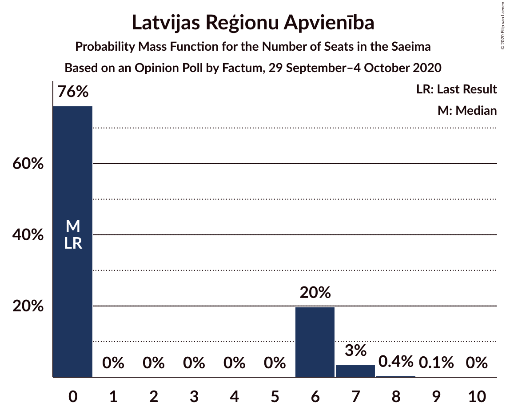

| Number of Seats | Probability | Accumulated | Special Marks |
|:---------------:|:-----------:|:-----------:|:-------------:|
| 0 | 76% | 100% | Last Result, Median |
| 1 | 0% | 24% |  |
| 2 | 0% | 24% |  |
| 3 | 0% | 24% |  |
| 4 | 0% | 24% |  |
| 5 | 0% | 24% |  |
| 6 | 20% | 24% |  |
| 7 | 3% | 4% |  |
| 8 | 0.4% | 0.5% |  |
| 9 | 0.1% | 0.1% |  |
| 10 | 0% | 0% |  |

### Latvijas Krievu savienība

*For a full overview of the results for this party, see the [Latvijas Krievu savienība](party-latvijaskrievusavienība.html) page.*

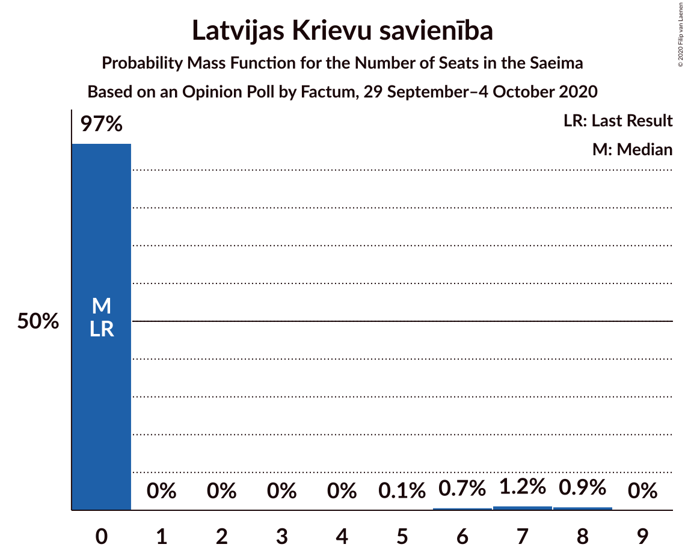

| Number of Seats | Probability | Accumulated | Special Marks |
|:---------------:|:-----------:|:-----------:|:-------------:|
| 0 | 97% | 100% | Last Result, Median |
| 1 | 0% | 3% |  |
| 2 | 0% | 3% |  |
| 3 | 0% | 3% |  |
| 4 | 0% | 3% |  |
| 5 | 0.1% | 3% |  |
| 6 | 0.7% | 3% |  |
| 7 | 1.2% | 2% |  |
| 8 | 0.9% | 1.0% |  |
| 9 | 0% | 0% |  |

### Politiskā partija „KPV LV”

*For a full overview of the results for this party, see the [Politiskā partija „KPV LV”](party-politiskāpartija„kpvlv”.html) page.*

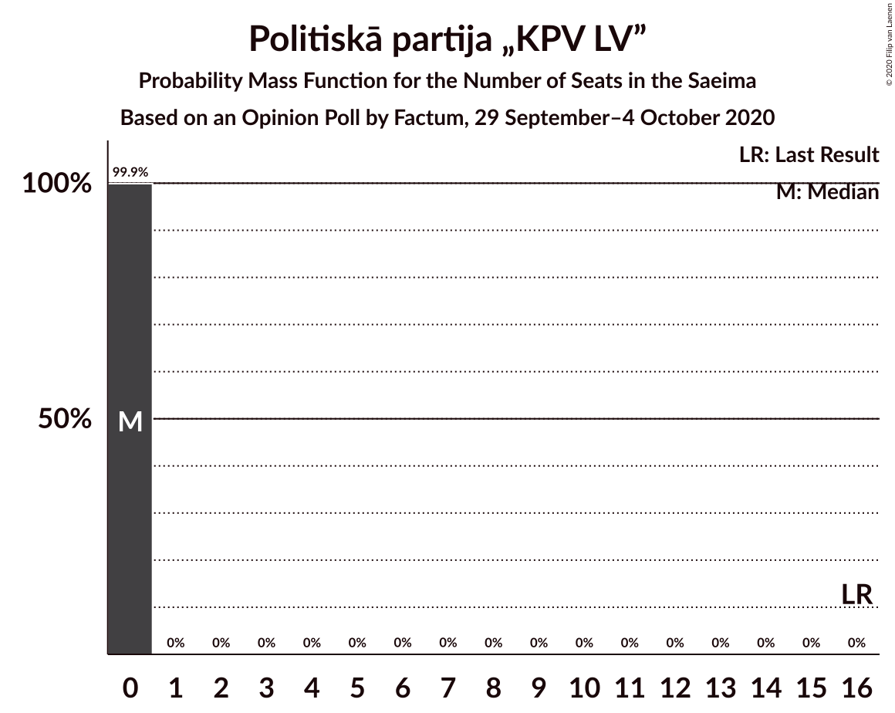

| Number of Seats | Probability | Accumulated | Special Marks |
|:---------------:|:-----------:|:-----------:|:-------------:|
| 0 | 99.9% | 100% | Median |
| 1 | 0% | 0.1% |  |
| 2 | 0% | 0.1% |  |
| 3 | 0% | 0.1% |  |
| 4 | 0% | 0.1% |  |
| 5 | 0% | 0.1% |  |
| 6 | 0% | 0.1% |  |
| 7 | 0% | 0% |  |
| 8 | 0% | 0% |  |
| 9 | 0% | 0% |  |
| 10 | 0% | 0% |  |
| 11 | 0% | 0% |  |
| 12 | 0% | 0% |  |
| 13 | 0% | 0% |  |
| 14 | 0% | 0% |  |
| 15 | 0% | 0% |  |
| 16 | 0% | 0% | Last Result |

## Coalitions

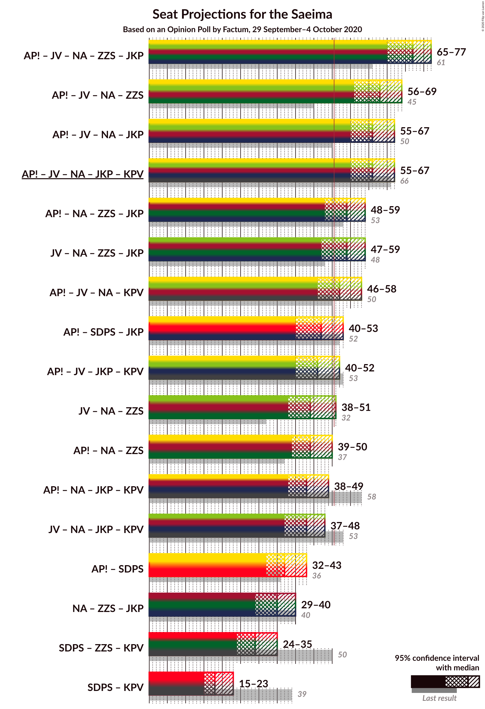

### Confidence Intervals

| Coalition | Last Result | Median | Majority? | 80% Confidence Interval | 90% Confidence Interval | 95% Confidence Interval | 99% Confidence Interval |
|:---------:|:-----------:|:------:|:---------:|:-----------------------:|:-----------------------:|:-----------------------:|:-----------------------:|
| Attīstībai/Par! – Jaunā VIENOTĪBA – Nacionālā apvienība „Visu Latvijai!”–„Tēvzemei un Brīvībai/LNNK” – Zaļo un Zemnieku savienība – Jaunā konservatīvā partija | 61 | 72 | 100% | 67–76 | 66–76 | 65–77 | 63–80 |
| Attīstībai/Par! – Jaunā VIENOTĪBA – Nacionālā apvienība „Visu Latvijai!”–„Tēvzemei un Brīvībai/LNNK” – Zaļo un Zemnieku savienība | 45 | 63 | 100% | 58–67 | 57–68 | 56–69 | 54–72 |
| Attīstībai/Par! – Jaunā VIENOTĪBA – Nacionālā apvienība „Visu Latvijai!”–„Tēvzemei un Brīvībai/LNNK” – Jaunā konservatīvā partija | 50 | 61 | 100% | 56–65 | 55–66 | 55–67 | 53–69 |
| Attīstībai/Par! – Jaunā VIENOTĪBA – Nacionālā apvienība „Visu Latvijai!”–„Tēvzemei un Brīvībai/LNNK” – Jaunā konservatīvā partija – Politiskā partija „KPV LV” | 66 | 61 | 100% | 56–65 | 55–66 | 55–67 | 53–69 |
| Attīstībai/Par! – Nacionālā apvienība „Visu Latvijai!”–„Tēvzemei un Brīvībai/LNNK” – Zaļo un Zemnieku savienība – Jaunā konservatīvā partija | 53 | 54 | 85% | 50–57 | 49–58 | 48–59 | 46–61 |
| Jaunā VIENOTĪBA – Nacionālā apvienība „Visu Latvijai!”–„Tēvzemei un Brīvībai/LNNK” – Zaļo un Zemnieku savienība – Jaunā konservatīvā partija | 48 | 54 | 81% | 49–57 | 48–58 | 47–59 | 45–62 |
| Attīstībai/Par! – Jaunā VIENOTĪBA – Nacionālā apvienība „Visu Latvijai!”–„Tēvzemei un Brīvībai/LNNK” – Politiskā partija „KPV LV” | 50 | 52 | 63% | 47–56 | 46–57 | 46–58 | 44–60 |
| Attīstībai/Par! – Sociāldemokrātiskā partija “Saskaņa” – Jaunā konservatīvā partija | 52 | 47 | 8% | 42–50 | 41–51 | 40–53 | 39–55 |
| Attīstībai/Par! – Jaunā VIENOTĪBA – Jaunā konservatīvā partija – Politiskā partija „KPV LV” | 53 | 46 | 7% | 42–50 | 41–51 | 40–52 | 39–54 |
| Jaunā VIENOTĪBA – Nacionālā apvienība „Visu Latvijai!”–„Tēvzemei un Brīvībai/LNNK” – Zaļo un Zemnieku savienība | 32 | 44 | 3% | 40–48 | 39–49 | 38–51 | 36–52 |
| Attīstībai/Par! – Nacionālā apvienība „Visu Latvijai!”–„Tēvzemei un Brīvībai/LNNK” – Zaļo un Zemnieku savienība | 37 | 44 | 2% | 41–48 | 40–49 | 39–50 | 38–52 |
| Attīstībai/Par! – Nacionālā apvienība „Visu Latvijai!”–„Tēvzemei un Brīvībai/LNNK” – Jaunā konservatīvā partija – Politiskā partija „KPV LV” | 58 | 43 | 0.5% | 39–47 | 38–48 | 38–49 | 36–51 |
| Jaunā VIENOTĪBA – Nacionālā apvienība „Visu Latvijai!”–„Tēvzemei un Brīvībai/LNNK” – Jaunā konservatīvā partija – Politiskā partija „KPV LV” | 53 | 43 | 0.3% | 38–46 | 37–47 | 37–48 | 34–50 |
| Attīstībai/Par! – Sociāldemokrātiskā partija “Saskaņa” | 36 | 37 | 0% | 33–41 | 33–42 | 32–43 | 31–45 |
| Nacionālā apvienība „Visu Latvijai!”–„Tēvzemei un Brīvībai/LNNK” – Zaļo un Zemnieku savienība – Jaunā konservatīvā partija | 40 | 35 | 0% | 31–39 | 31–39 | 29–40 | 27–42 |
| Sociāldemokrātiskā partija “Saskaņa” – Zaļo un Zemnieku savienība – Politiskā partija „KPV LV” | 50 | 29 | 0% | 27–32 | 25–33 | 24–35 | 23–36 |
| Sociāldemokrātiskā partija “Saskaņa” – Politiskā partija „KPV LV” | 39 | 18 | 0% | 16–21 | 15–22 | 15–23 | 15–24 |

### Attīstībai/Par! – Jaunā VIENOTĪBA – Nacionālā apvienība „Visu Latvijai!”–„Tēvzemei un Brīvībai/LNNK” – Zaļo un Zemnieku savienība – Jaunā konservatīvā partija

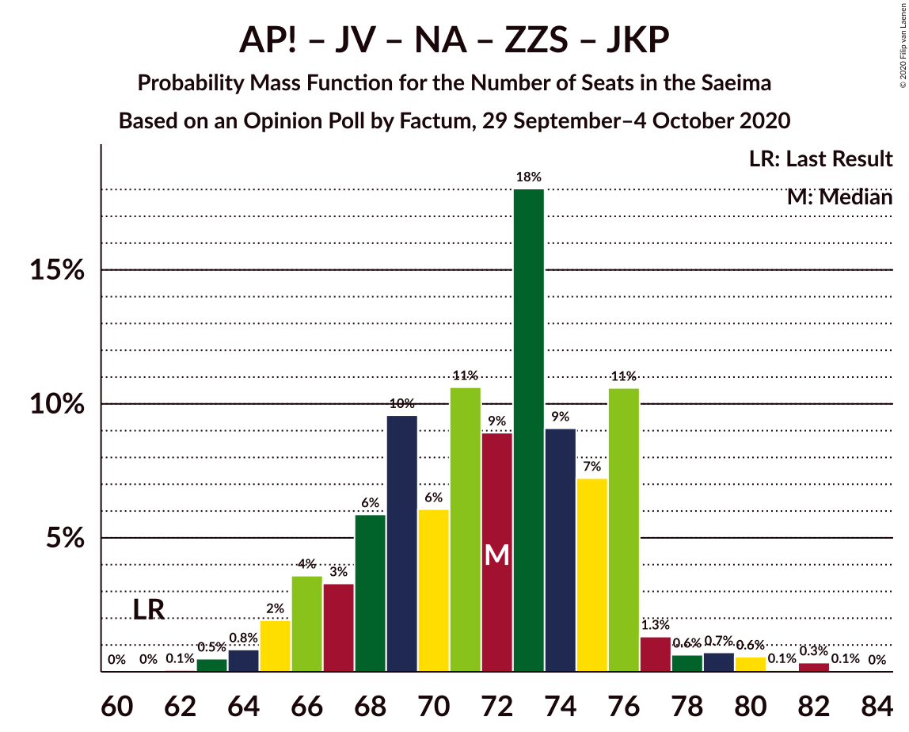

| Number of Seats | Probability | Accumulated | Special Marks |
|:---------------:|:-----------:|:-----------:|:-------------:|
| 61 | 0% | 100% | Last Result |
| 62 | 0.1% | 99.9% |  |
| 63 | 0.5% | 99.9% |  |
| 64 | 0.8% | 99.4% |  |
| 65 | 2% | 98.6% |  |
| 66 | 4% | 97% |  |
| 67 | 3% | 93% |  |
| 68 | 6% | 90% |  |
| 69 | 10% | 84% |  |
| 70 | 6% | 74% |  |
| 71 | 11% | 68% | Median |
| 72 | 9% | 58% |  |
| 73 | 18% | 49% |  |
| 74 | 9% | 31% |  |
| 75 | 7% | 22% |  |
| 76 | 11% | 14% |  |
| 77 | 1.3% | 4% |  |
| 78 | 0.6% | 2% |  |
| 79 | 0.7% | 2% |  |
| 80 | 0.6% | 1.0% |  |
| 81 | 0.1% | 0.5% |  |
| 82 | 0.3% | 0.4% |  |
| 83 | 0.1% | 0.1% |  |
| 84 | 0% | 0% |  |

### Attīstībai/Par! – Jaunā VIENOTĪBA – Nacionālā apvienība „Visu Latvijai!”–„Tēvzemei un Brīvībai/LNNK” – Zaļo un Zemnieku savienība

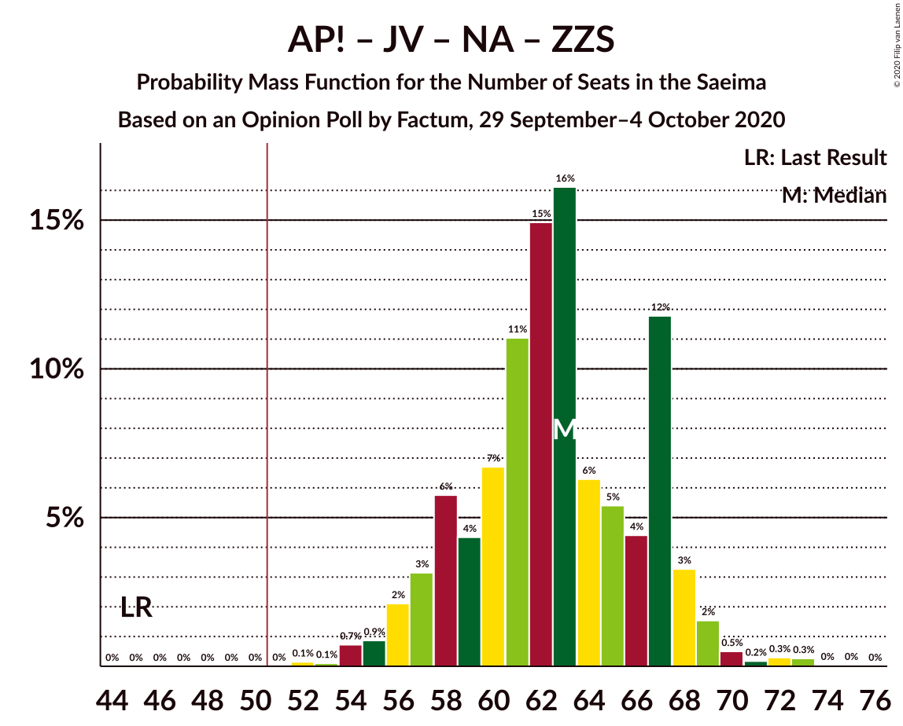

| Number of Seats | Probability | Accumulated | Special Marks |
|:---------------:|:-----------:|:-----------:|:-------------:|
| 45 | 0% | 100% | Last Result |
| 46 | 0% | 100% |  |
| 47 | 0% | 100% |  |
| 48 | 0% | 100% |  |
| 49 | 0% | 100% |  |
| 50 | 0% | 100% |  |
| 51 | 0% | 100% | Majority |
| 52 | 0.1% | 100% |  |
| 53 | 0.1% | 99.8% |  |
| 54 | 0.7% | 99.7% |  |
| 55 | 0.9% | 99.0% |  |
| 56 | 2% | 98% |  |
| 57 | 3% | 96% |  |
| 58 | 6% | 93% |  |
| 59 | 4% | 87% |  |
| 60 | 7% | 83% |  |
| 61 | 11% | 76% |  |
| 62 | 15% | 65% | Median |
| 63 | 16% | 50% |  |
| 64 | 6% | 34% |  |
| 65 | 5% | 28% |  |
| 66 | 4% | 22% |  |
| 67 | 12% | 18% |  |
| 68 | 3% | 6% |  |
| 69 | 2% | 3% |  |
| 70 | 0.5% | 1.3% |  |
| 71 | 0.2% | 0.8% |  |
| 72 | 0.3% | 0.6% |  |
| 73 | 0.3% | 0.3% |  |
| 74 | 0% | 0.1% |  |
| 75 | 0% | 0% |  |

### Attīstībai/Par! – Jaunā VIENOTĪBA – Nacionālā apvienība „Visu Latvijai!”–„Tēvzemei un Brīvībai/LNNK” – Jaunā konservatīvā partija

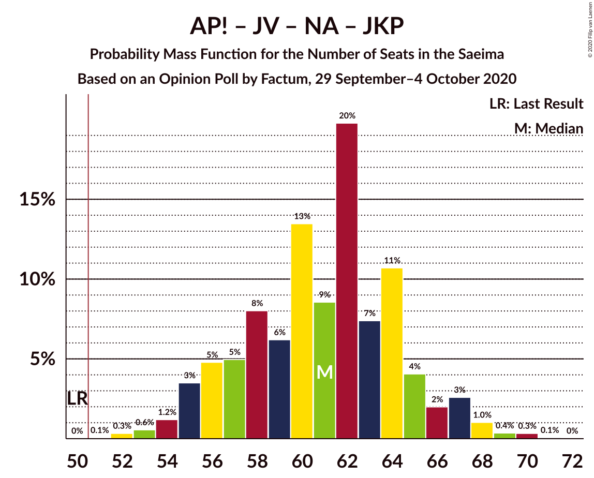

| Number of Seats | Probability | Accumulated | Special Marks |
|:---------------:|:-----------:|:-----------:|:-------------:|
| 50 | 0% | 100% | Last Result |
| 51 | 0.1% | 100% | Majority |
| 52 | 0.3% | 99.9% |  |
| 53 | 0.6% | 99.6% |  |
| 54 | 1.2% | 99.0% |  |
| 55 | 3% | 98% |  |
| 56 | 5% | 94% |  |
| 57 | 5% | 90% |  |
| 58 | 8% | 85% |  |
| 59 | 6% | 77% |  |
| 60 | 13% | 70% | Median |
| 61 | 9% | 57% |  |
| 62 | 20% | 48% |  |
| 63 | 7% | 29% |  |
| 64 | 11% | 21% |  |
| 65 | 4% | 10% |  |
| 66 | 2% | 6% |  |
| 67 | 3% | 4% |  |
| 68 | 1.0% | 2% |  |
| 69 | 0.4% | 0.8% |  |
| 70 | 0.3% | 0.4% |  |
| 71 | 0.1% | 0.1% |  |
| 72 | 0% | 0% |  |

### Attīstībai/Par! – Jaunā VIENOTĪBA – Nacionālā apvienība „Visu Latvijai!”–„Tēvzemei un Brīvībai/LNNK” – Jaunā konservatīvā partija – Politiskā partija „KPV LV”

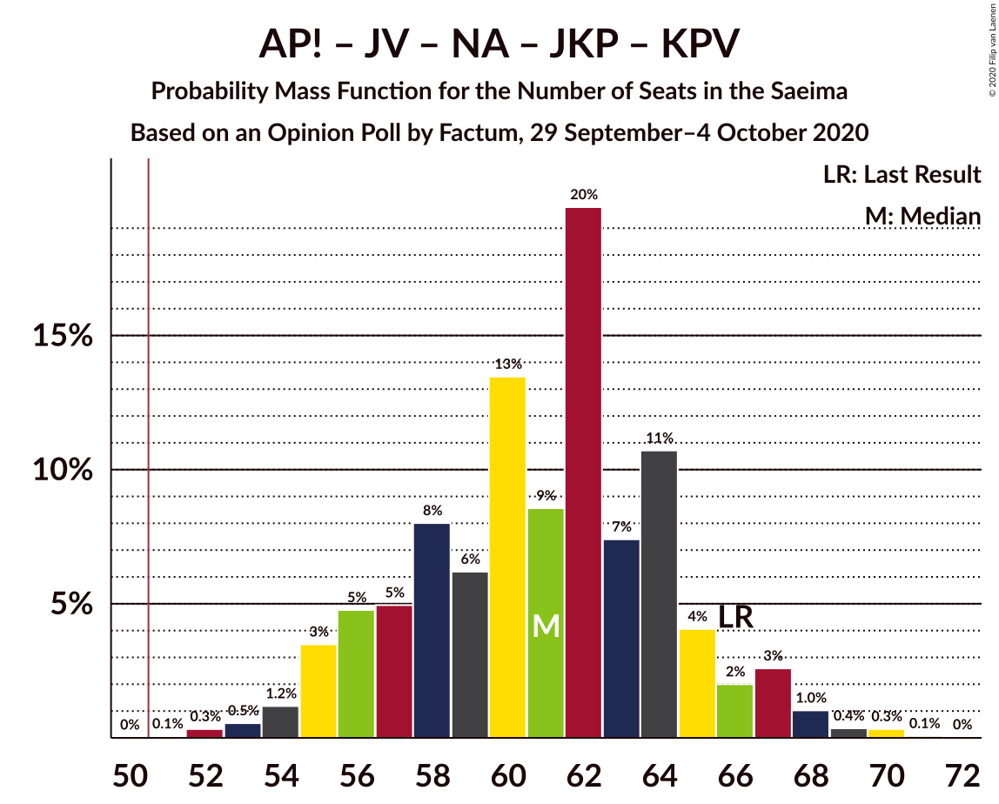

| Number of Seats | Probability | Accumulated | Special Marks |
|:---------------:|:-----------:|:-----------:|:-------------:|
| 51 | 0.1% | 100% | Majority |
| 52 | 0.3% | 99.9% |  |
| 53 | 0.5% | 99.6% |  |
| 54 | 1.2% | 99.0% |  |
| 55 | 3% | 98% |  |
| 56 | 5% | 94% |  |
| 57 | 5% | 90% |  |
| 58 | 8% | 85% |  |
| 59 | 6% | 77% |  |
| 60 | 13% | 70% | Median |
| 61 | 9% | 57% |  |
| 62 | 20% | 48% |  |
| 63 | 7% | 29% |  |
| 64 | 11% | 21% |  |
| 65 | 4% | 10% |  |
| 66 | 2% | 6% | Last Result |
| 67 | 3% | 4% |  |
| 68 | 1.0% | 2% |  |
| 69 | 0.4% | 0.8% |  |
| 70 | 0.3% | 0.4% |  |
| 71 | 0.1% | 0.1% |  |
| 72 | 0% | 0% |  |

### Attīstībai/Par! – Nacionālā apvienība „Visu Latvijai!”–„Tēvzemei un Brīvībai/LNNK” – Zaļo un Zemnieku savienība – Jaunā konservatīvā partija

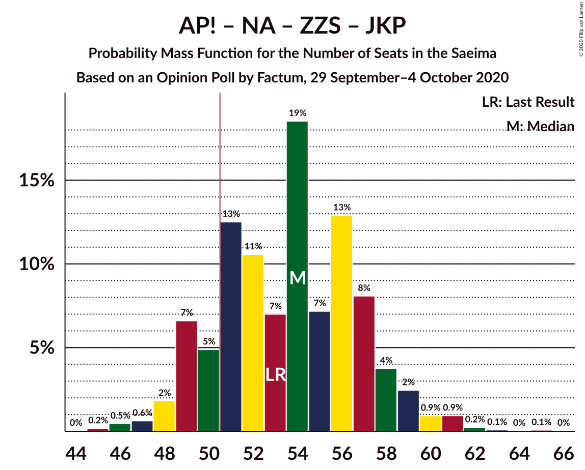

| Number of Seats | Probability | Accumulated | Special Marks |
|:---------------:|:-----------:|:-----------:|:-------------:|
| 44 | 0% | 100% |  |
| 45 | 0.2% | 99.9% |  |
| 46 | 0.5% | 99.8% |  |
| 47 | 0.6% | 99.3% |  |
| 48 | 2% | 98.7% |  |
| 49 | 7% | 97% |  |
| 50 | 5% | 90% |  |
| 51 | 13% | 85% | Majority |
| 52 | 11% | 73% | Median |
| 53 | 7% | 62% | Last Result |
| 54 | 19% | 55% |  |
| 55 | 7% | 37% |  |
| 56 | 13% | 30% |  |
| 57 | 8% | 17% |  |
| 58 | 4% | 9% |  |
| 59 | 2% | 5% |  |
| 60 | 0.9% | 2% |  |
| 61 | 0.9% | 1.4% |  |
| 62 | 0.2% | 0.5% |  |
| 63 | 0.1% | 0.2% |  |
| 64 | 0% | 0.2% |  |
| 65 | 0.1% | 0.1% |  |
| 66 | 0% | 0% |  |

### Jaunā VIENOTĪBA – Nacionālā apvienība „Visu Latvijai!”–„Tēvzemei un Brīvībai/LNNK” – Zaļo un Zemnieku savienība – Jaunā konservatīvā partija

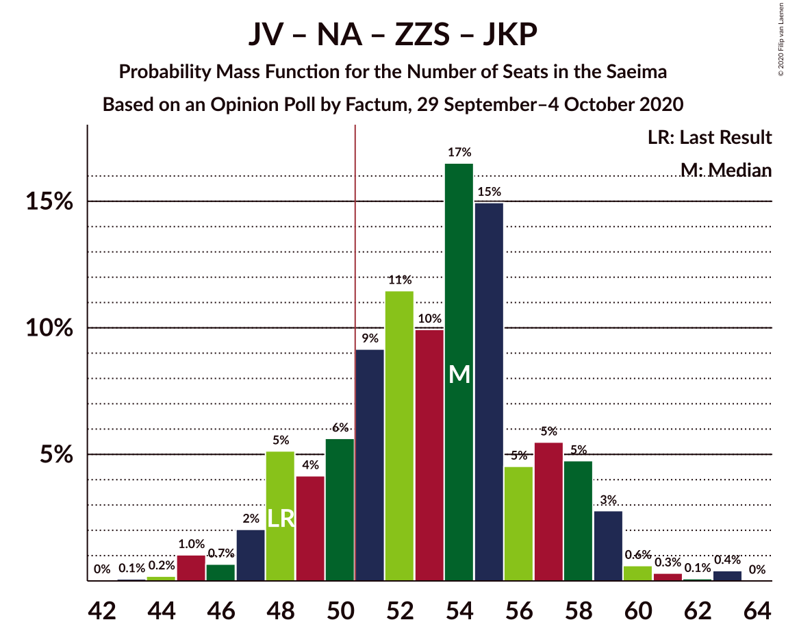

| Number of Seats | Probability | Accumulated | Special Marks |
|:---------------:|:-----------:|:-----------:|:-------------:|
| 42 | 0% | 100% |  |
| 43 | 0.1% | 99.9% |  |
| 44 | 0.2% | 99.9% |  |
| 45 | 1.0% | 99.7% |  |
| 46 | 0.7% | 98.6% |  |
| 47 | 2% | 98% |  |
| 48 | 5% | 96% | Last Result |
| 49 | 4% | 91% |  |
| 50 | 6% | 87% |  |
| 51 | 9% | 81% | Majority |
| 52 | 11% | 72% |  |
| 53 | 10% | 60% | Median |
| 54 | 17% | 50% |  |
| 55 | 15% | 34% |  |
| 56 | 5% | 19% |  |
| 57 | 5% | 14% |  |
| 58 | 5% | 9% |  |
| 59 | 3% | 4% |  |
| 60 | 0.6% | 1.5% |  |
| 61 | 0.3% | 0.8% |  |
| 62 | 0.1% | 0.5% |  |
| 63 | 0.4% | 0.5% |  |
| 64 | 0% | 0% |  |

### Attīstībai/Par! – Jaunā VIENOTĪBA – Nacionālā apvienība „Visu Latvijai!”–„Tēvzemei un Brīvībai/LNNK” – Politiskā partija „KPV LV”

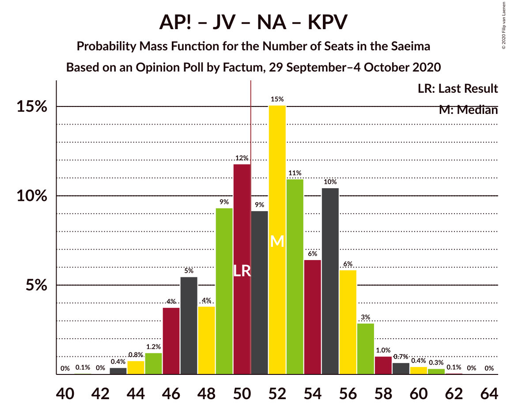

| Number of Seats | Probability | Accumulated | Special Marks |
|:---------------:|:-----------:|:-----------:|:-------------:|
| 41 | 0.1% | 100% |  |
| 42 | 0% | 99.9% |  |
| 43 | 0.4% | 99.9% |  |
| 44 | 0.8% | 99.5% |  |
| 45 | 1.2% | 98.7% |  |
| 46 | 4% | 98% |  |
| 47 | 5% | 94% |  |
| 48 | 4% | 88% |  |
| 49 | 9% | 84% |  |
| 50 | 12% | 75% | Last Result |
| 51 | 9% | 63% | Median, Majority |
| 52 | 15% | 54% |  |
| 53 | 11% | 39% |  |
| 54 | 6% | 28% |  |
| 55 | 10% | 22% |  |
| 56 | 6% | 11% |  |
| 57 | 3% | 5% |  |
| 58 | 1.0% | 3% |  |
| 59 | 0.7% | 2% |  |
| 60 | 0.4% | 0.9% |  |
| 61 | 0.3% | 0.5% |  |
| 62 | 0.1% | 0.1% |  |
| 63 | 0% | 0% |  |

### Attīstībai/Par! – Sociāldemokrātiskā partija “Saskaņa” – Jaunā konservatīvā partija

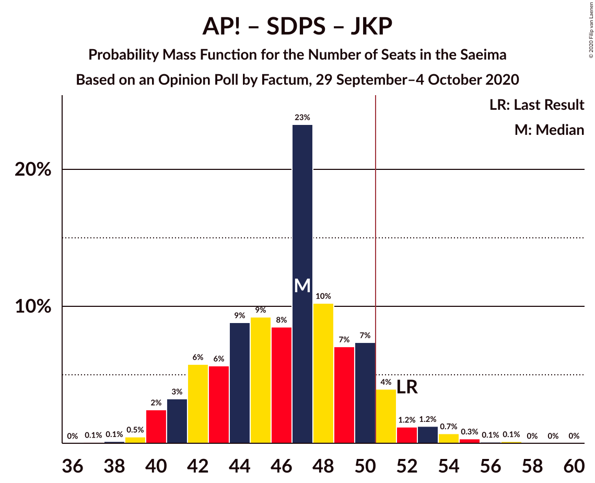

| Number of Seats | Probability | Accumulated | Special Marks |
|:---------------:|:-----------:|:-----------:|:-------------:|
| 37 | 0.1% | 100% |  |
| 38 | 0.1% | 99.9% |  |
| 39 | 0.5% | 99.8% |  |
| 40 | 2% | 99.3% |  |
| 41 | 3% | 97% |  |
| 42 | 6% | 94% |  |
| 43 | 6% | 88% |  |
| 44 | 9% | 82% |  |
| 45 | 9% | 73% | Median |
| 46 | 8% | 64% |  |
| 47 | 23% | 56% |  |
| 48 | 10% | 32% |  |
| 49 | 7% | 22% |  |
| 50 | 7% | 15% |  |
| 51 | 4% | 8% | Majority |
| 52 | 1.2% | 4% | Last Result |
| 53 | 1.2% | 3% |  |
| 54 | 0.7% | 1.3% |  |
| 55 | 0.3% | 0.6% |  |
| 56 | 0.1% | 0.3% |  |
| 57 | 0.1% | 0.2% |  |
| 58 | 0% | 0.1% |  |
| 59 | 0% | 0% |  |

### Attīstībai/Par! – Jaunā VIENOTĪBA – Jaunā konservatīvā partija – Politiskā partija „KPV LV”

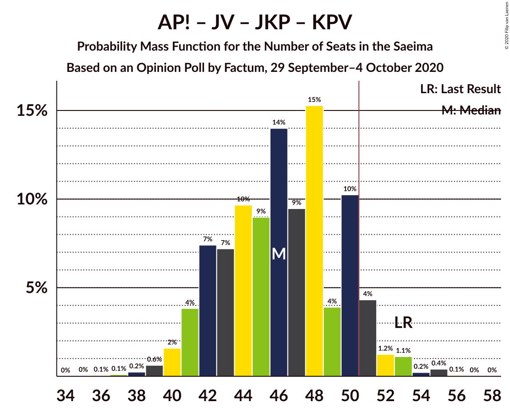

| Number of Seats | Probability | Accumulated | Special Marks |
|:---------------:|:-----------:|:-----------:|:-------------:|
| 35 | 0% | 100% |  |
| 36 | 0.1% | 99.9% |  |
| 37 | 0.1% | 99.9% |  |
| 38 | 0.2% | 99.8% |  |
| 39 | 0.6% | 99.5% |  |
| 40 | 2% | 98.9% |  |
| 41 | 4% | 97% |  |
| 42 | 7% | 94% |  |
| 43 | 7% | 86% |  |
| 44 | 10% | 79% |  |
| 45 | 9% | 69% |  |
| 46 | 14% | 60% | Median |
| 47 | 9% | 46% |  |
| 48 | 15% | 37% |  |
| 49 | 4% | 22% |  |
| 50 | 10% | 18% |  |
| 51 | 4% | 7% | Majority |
| 52 | 1.2% | 3% |  |
| 53 | 1.1% | 2% | Last Result |
| 54 | 0.2% | 0.7% |  |
| 55 | 0.4% | 0.5% |  |
| 56 | 0.1% | 0.1% |  |
| 57 | 0% | 0% |  |

### Jaunā VIENOTĪBA – Nacionālā apvienība „Visu Latvijai!”–„Tēvzemei un Brīvībai/LNNK” – Zaļo un Zemnieku savienība

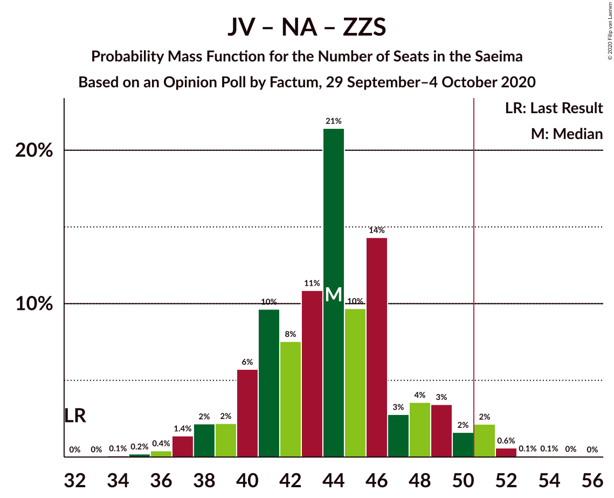

| Number of Seats | Probability | Accumulated | Special Marks |
|:---------------:|:-----------:|:-----------:|:-------------:|
| 32 | 0% | 100% | Last Result |
| 33 | 0% | 100% |  |
| 34 | 0.1% | 100% |  |
| 35 | 0.2% | 99.9% |  |
| 36 | 0.4% | 99.7% |  |
| 37 | 1.4% | 99.3% |  |
| 38 | 2% | 98% |  |
| 39 | 2% | 96% |  |
| 40 | 6% | 94% |  |
| 41 | 10% | 88% |  |
| 42 | 8% | 78% |  |
| 43 | 11% | 71% |  |
| 44 | 21% | 60% | Median |
| 45 | 10% | 38% |  |
| 46 | 14% | 29% |  |
| 47 | 3% | 14% |  |
| 48 | 4% | 12% |  |
| 49 | 3% | 8% |  |
| 50 | 2% | 5% |  |
| 51 | 2% | 3% | Majority |
| 52 | 0.6% | 0.8% |  |
| 53 | 0.1% | 0.2% |  |
| 54 | 0.1% | 0.1% |  |
| 55 | 0% | 0.1% |  |
| 56 | 0% | 0% |  |

### Attīstībai/Par! – Nacionālā apvienība „Visu Latvijai!”–„Tēvzemei un Brīvībai/LNNK” – Zaļo un Zemnieku savienība

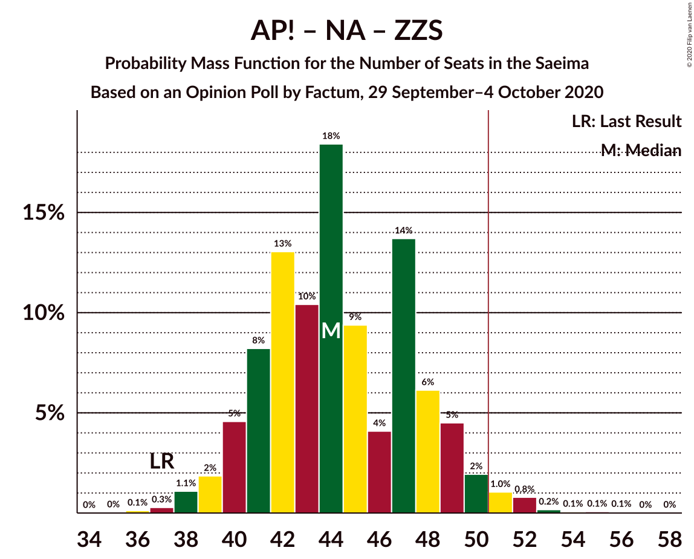

| Number of Seats | Probability | Accumulated | Special Marks |
|:---------------:|:-----------:|:-----------:|:-------------:|
| 36 | 0.1% | 100% |  |
| 37 | 0.3% | 99.8% | Last Result |
| 38 | 1.1% | 99.6% |  |
| 39 | 2% | 98% |  |
| 40 | 5% | 97% |  |
| 41 | 8% | 92% |  |
| 42 | 13% | 84% |  |
| 43 | 10% | 71% | Median |
| 44 | 18% | 60% |  |
| 45 | 9% | 42% |  |
| 46 | 4% | 33% |  |
| 47 | 14% | 28% |  |
| 48 | 6% | 15% |  |
| 49 | 5% | 9% |  |
| 50 | 2% | 4% |  |
| 51 | 1.0% | 2% | Majority |
| 52 | 0.8% | 1.2% |  |
| 53 | 0.2% | 0.4% |  |
| 54 | 0.1% | 0.2% |  |
| 55 | 0.1% | 0.2% |  |
| 56 | 0.1% | 0.1% |  |
| 57 | 0% | 0% |  |

### Attīstībai/Par! – Nacionālā apvienība „Visu Latvijai!”–„Tēvzemei un Brīvībai/LNNK” – Jaunā konservatīvā partija – Politiskā partija „KPV LV”

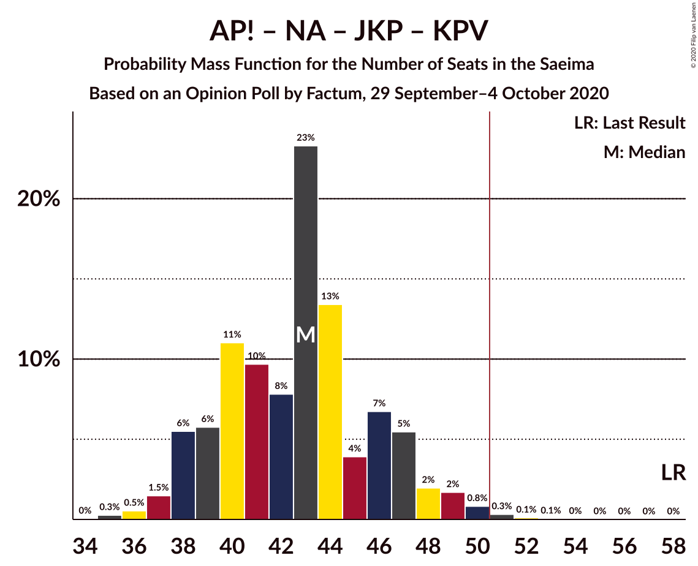

| Number of Seats | Probability | Accumulated | Special Marks |
|:---------------:|:-----------:|:-----------:|:-------------:|
| 34 | 0% | 100% |  |
| 35 | 0.3% | 99.9% |  |
| 36 | 0.5% | 99.6% |  |
| 37 | 1.5% | 99.1% |  |
| 38 | 6% | 98% |  |
| 39 | 6% | 92% |  |
| 40 | 11% | 86% |  |
| 41 | 10% | 75% | Median |
| 42 | 8% | 66% |  |
| 43 | 23% | 58% |  |
| 44 | 13% | 35% |  |
| 45 | 4% | 21% |  |
| 46 | 7% | 17% |  |
| 47 | 5% | 10% |  |
| 48 | 2% | 5% |  |
| 49 | 2% | 3% |  |
| 50 | 0.8% | 1.3% |  |
| 51 | 0.3% | 0.5% | Majority |
| 52 | 0.1% | 0.2% |  |
| 53 | 0.1% | 0.1% |  |
| 54 | 0% | 0% |  |
| 55 | 0% | 0% |  |
| 56 | 0% | 0% |  |
| 57 | 0% | 0% |  |
| 58 | 0% | 0% | Last Result |

### Jaunā VIENOTĪBA – Nacionālā apvienība „Visu Latvijai!”–„Tēvzemei un Brīvībai/LNNK” – Jaunā konservatīvā partija – Politiskā partija „KPV LV”

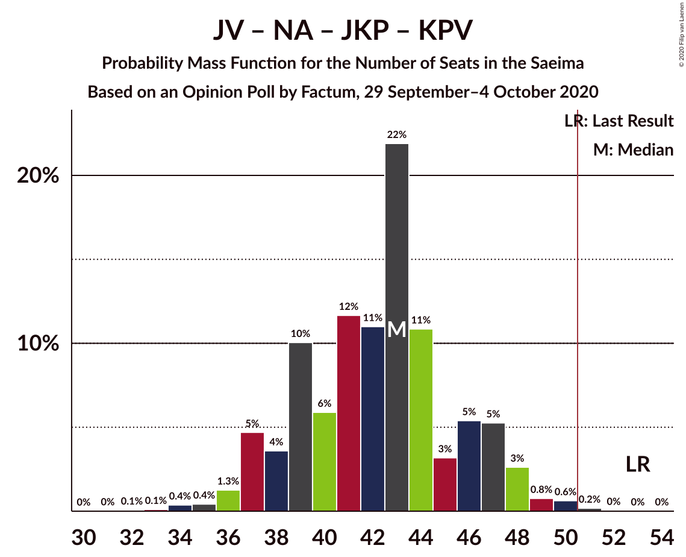

| Number of Seats | Probability | Accumulated | Special Marks |
|:---------------:|:-----------:|:-----------:|:-------------:|
| 32 | 0.1% | 100% |  |
| 33 | 0.1% | 99.9% |  |
| 34 | 0.4% | 99.8% |  |
| 35 | 0.4% | 99.4% |  |
| 36 | 1.3% | 99.0% |  |
| 37 | 5% | 98% |  |
| 38 | 4% | 93% |  |
| 39 | 10% | 89% |  |
| 40 | 6% | 79% |  |
| 41 | 12% | 74% |  |
| 42 | 11% | 62% | Median |
| 43 | 22% | 51% |  |
| 44 | 11% | 29% |  |
| 45 | 3% | 18% |  |
| 46 | 5% | 15% |  |
| 47 | 5% | 10% |  |
| 48 | 3% | 4% |  |
| 49 | 0.8% | 2% |  |
| 50 | 0.6% | 0.9% |  |
| 51 | 0.2% | 0.3% | Majority |
| 52 | 0% | 0.1% |  |
| 53 | 0% | 0% | Last Result |

### Attīstībai/Par! – Sociāldemokrātiskā partija “Saskaņa”

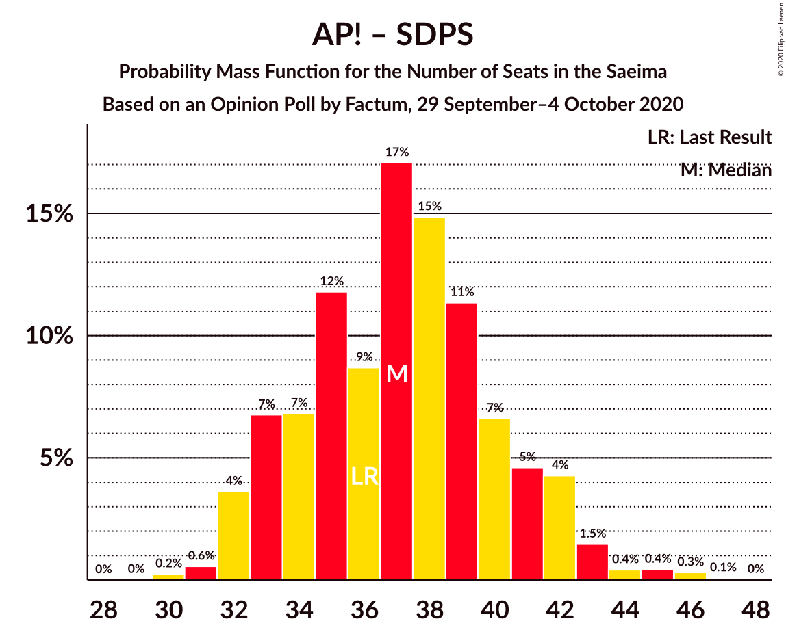

| Number of Seats | Probability | Accumulated | Special Marks |
|:---------------:|:-----------:|:-----------:|:-------------:|
| 30 | 0.2% | 100% |  |
| 31 | 0.6% | 99.7% |  |
| 32 | 4% | 99.2% |  |
| 33 | 7% | 96% |  |
| 34 | 7% | 89% |  |
| 35 | 12% | 82% |  |
| 36 | 9% | 70% | Last Result, Median |
| 37 | 17% | 61% |  |
| 38 | 15% | 44% |  |
| 39 | 11% | 30% |  |
| 40 | 7% | 18% |  |
| 41 | 5% | 12% |  |
| 42 | 4% | 7% |  |
| 43 | 1.5% | 3% |  |
| 44 | 0.4% | 1.3% |  |
| 45 | 0.4% | 0.9% |  |
| 46 | 0.3% | 0.4% |  |
| 47 | 0.1% | 0.1% |  |
| 48 | 0% | 0% |  |

### Nacionālā apvienība „Visu Latvijai!”–„Tēvzemei un Brīvībai/LNNK” – Zaļo un Zemnieku savienība – Jaunā konservatīvā partija

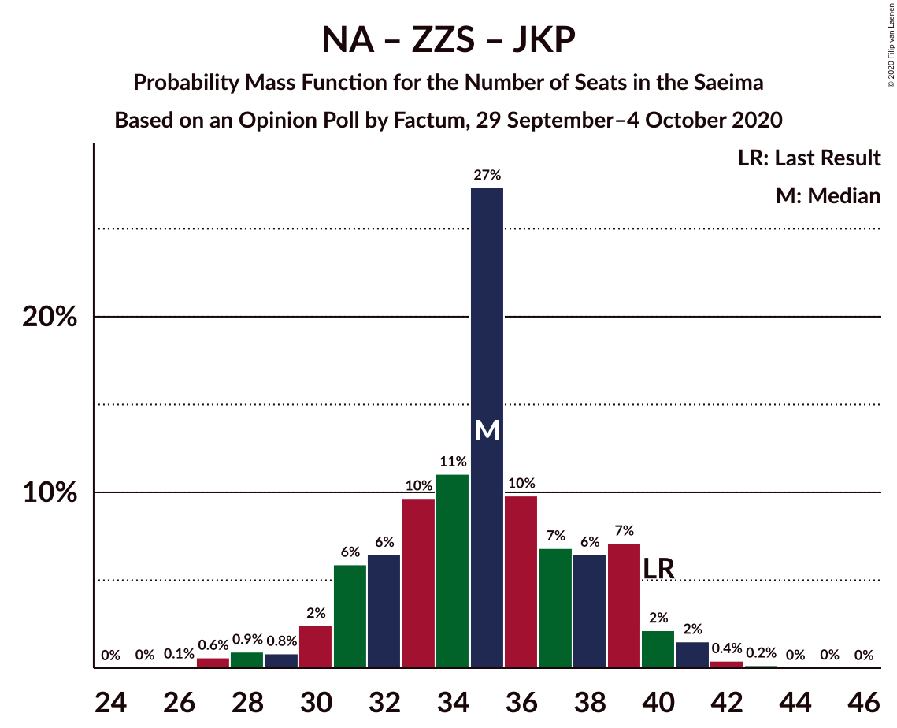

| Number of Seats | Probability | Accumulated | Special Marks |
|:---------------:|:-----------:|:-----------:|:-------------:|
| 25 | 0% | 100% |  |
| 26 | 0.1% | 99.9% |  |
| 27 | 0.6% | 99.8% |  |
| 28 | 0.9% | 99.2% |  |
| 29 | 0.8% | 98% |  |
| 30 | 2% | 97% |  |
| 31 | 6% | 95% |  |
| 32 | 6% | 89% |  |
| 33 | 10% | 83% |  |
| 34 | 11% | 73% | Median |
| 35 | 27% | 62% |  |
| 36 | 10% | 35% |  |
| 37 | 7% | 25% |  |
| 38 | 6% | 18% |  |
| 39 | 7% | 11% |  |
| 40 | 2% | 4% | Last Result |
| 41 | 2% | 2% |  |
| 42 | 0.4% | 0.7% |  |
| 43 | 0.2% | 0.3% |  |
| 44 | 0% | 0.1% |  |
| 45 | 0% | 0.1% |  |
| 46 | 0% | 0% |  |

### Sociāldemokrātiskā partija “Saskaņa” – Zaļo un Zemnieku savienība – Politiskā partija „KPV LV”

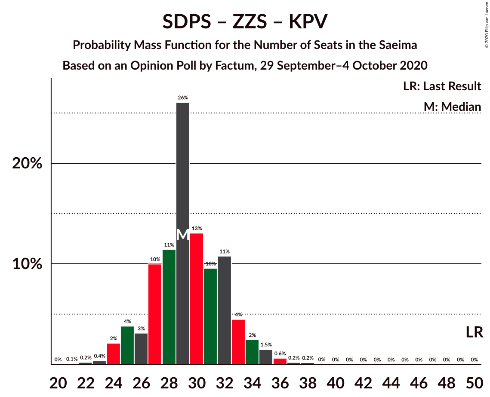

| Number of Seats | Probability | Accumulated | Special Marks |
|:---------------:|:-----------:|:-----------:|:-------------:|
| 21 | 0.1% | 100% |  |
| 22 | 0.2% | 99.9% |  |
| 23 | 0.4% | 99.7% |  |
| 24 | 2% | 99.3% |  |
| 25 | 4% | 97% |  |
| 26 | 3% | 93% |  |
| 27 | 10% | 90% |  |
| 28 | 11% | 80% |  |
| 29 | 26% | 69% | Median |
| 30 | 13% | 43% |  |
| 31 | 10% | 30% |  |
| 32 | 11% | 20% |  |
| 33 | 4% | 9% |  |
| 34 | 2% | 5% |  |
| 35 | 1.5% | 3% |  |
| 36 | 0.6% | 1.0% |  |
| 37 | 0.2% | 0.4% |  |
| 38 | 0.2% | 0.2% |  |
| 39 | 0% | 0% |  |
| 40 | 0% | 0% |  |
| 41 | 0% | 0% |  |
| 42 | 0% | 0% |  |
| 43 | 0% | 0% |  |
| 44 | 0% | 0% |  |
| 45 | 0% | 0% |  |
| 46 | 0% | 0% |  |
| 47 | 0% | 0% |  |
| 48 | 0% | 0% |  |
| 49 | 0% | 0% |  |
| 50 | 0% | 0% | Last Result |

### Sociāldemokrātiskā partija “Saskaņa” – Politiskā partija „KPV LV”

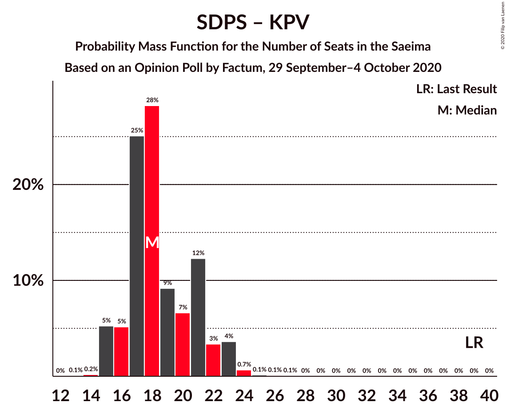

| Number of Seats | Probability | Accumulated | Special Marks |
|:---------------:|:-----------:|:-----------:|:-------------:|
| 13 | 0.1% | 100% |  |
| 14 | 0.2% | 99.9% |  |
| 15 | 5% | 99.7% |  |
| 16 | 5% | 94% |  |
| 17 | 25% | 89% |  |
| 18 | 28% | 64% | Median |
| 19 | 9% | 36% |  |
| 20 | 7% | 27% |  |
| 21 | 12% | 20% |  |
| 22 | 3% | 8% |  |
| 23 | 4% | 5% |  |
| 24 | 0.7% | 1.0% |  |
| 25 | 0.1% | 0.3% |  |
| 26 | 0.1% | 0.2% |  |
| 27 | 0.1% | 0.1% |  |
| 28 | 0% | 0% |  |
| 29 | 0% | 0% |  |
| 30 | 0% | 0% |  |
| 31 | 0% | 0% |  |
| 32 | 0% | 0% |  |
| 33 | 0% | 0% |  |
| 34 | 0% | 0% |  |
| 35 | 0% | 0% |  |
| 36 | 0% | 0% |  |
| 37 | 0% | 0% |  |
| 38 | 0% | 0% |  |
| 39 | 0% | 0% | Last Result |

## Technical Information

### Opinion Poll

+ **Polling firm:** Factum
+ **Commissioner(s):** —
+ **Fieldwork period:** 29 September–4 October 2020

### Calculations

+ **Sample size:** 442
+ **Simulations done:** 1,048,576
+ **Error estimate:** 1.80%

