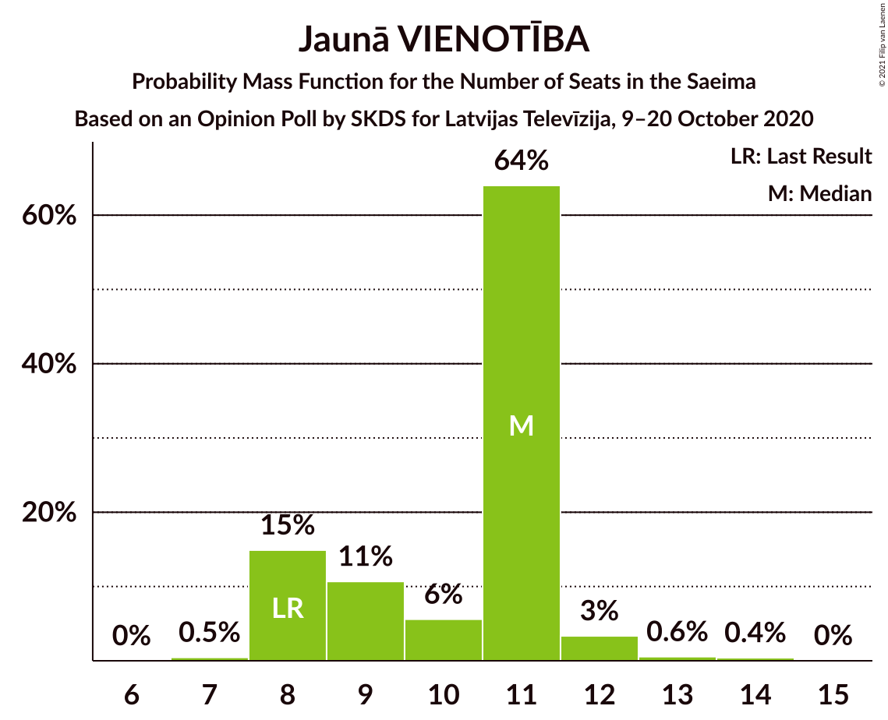
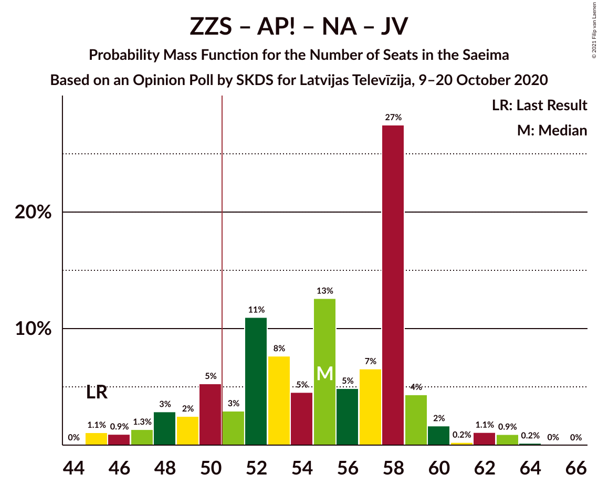
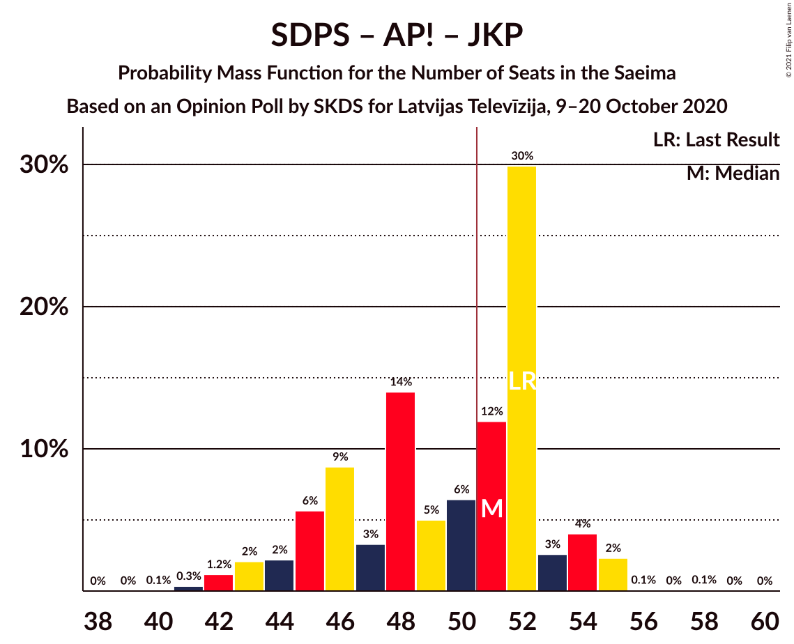
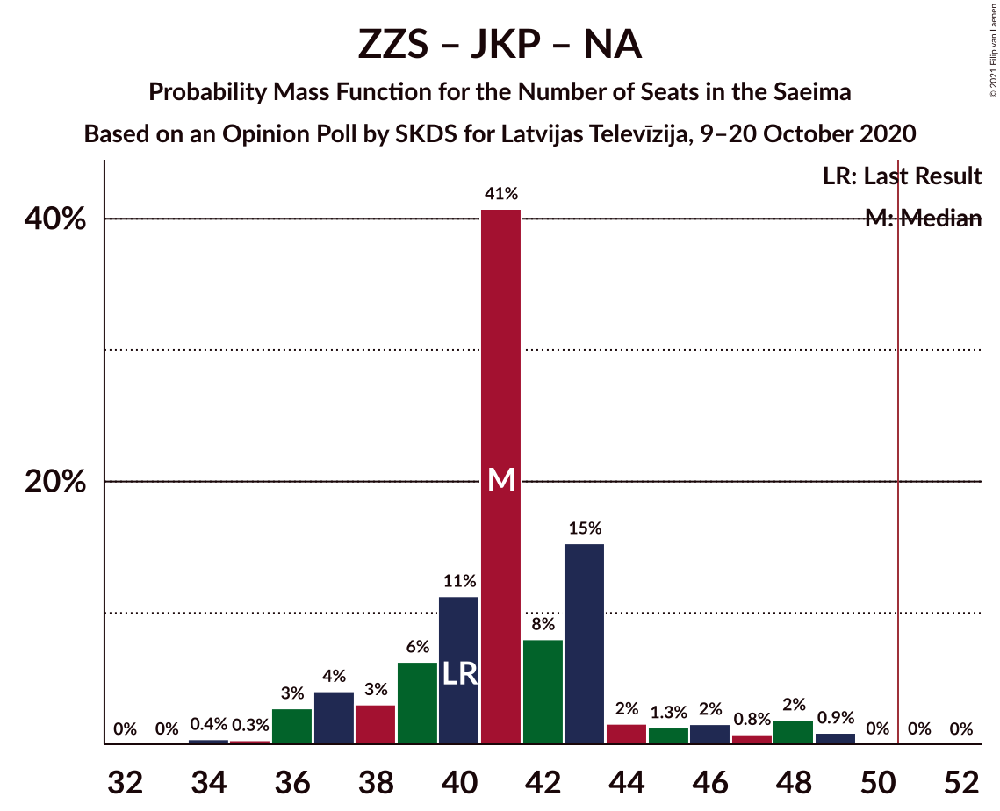

# Opinion Poll by SKDS for Latvijas Televīzija, 9–20 October 2020

<a href="#voting-intentions">Voting Intentions</a> | <a href="#seats">Seats</a> | <a href="#coalitions">Coalitions</a> | <a href="#technical-information">Technical Information</a>

## Voting Intentions

### Confidence Intervals

| Party | Last Result | Poll Result | 80% Confidence Interval | 90% Confidence Interval | 95% Confidence Interval | 99% Confidence Interval |
|:-----:|:-----------:|:-----------:|:-----------------------:|:-----------------------:|:-----------------------:|:-----------------------:|
| Sociāldemokrātiskā partija “Saskaņa” | 19.8% | 19.8% | 18.1–21.6% |17.7–22.1% |17.3–22.5% |16.5–23.4% |
| Zaļo un Zemnieku savienība | 9.9% | 15.6% | 14.1–17.3% |13.7–17.7% |13.4–18.1% |12.7–19.0% |
| Attīstībai/Par! | 12.0% | 13.6% | 12.2–15.2% |11.8–15.6% |11.5–16.0% |10.9–16.8% |
| Jaunā konservatīvā partija | 13.6% | 11.2% | 10.0–12.7% |9.6–13.1% |9.3–13.5% |8.7–14.2% |
| Nacionālā apvienība „Visu Latvijai!”–„Tēvzemei un Brīvībai/LNNK” | 11.0% | 11.2% | 10.0–12.7% |9.6–13.1% |9.3–13.5% |8.7–14.2% |
| Jaunā VIENOTĪBA | 6.7% | 9.4% | 8.3–10.8% |8.0–11.2% |7.7–11.5% |7.2–12.2% |
| PROGRESĪVIE | 2.6% | 5.8% | 4.9–7.0% |4.7–7.3% |4.5–7.6% |4.1–8.2% |
| Latvijas Reģionu Apvienība | 4.1% | 5.2% | 4.3–6.2% |4.1–6.6% |3.9–6.8% |3.5–7.4% |
| Latvijas Krievu savienība | 3.2% | 4.9% | 4.1–6.0% |3.9–6.3% |3.7–6.6% |3.3–7.1% |
| Politiskā partija „KPV LV” | 14.2% | 3.3% | 2.6–4.2% |2.4–4.4% |2.3–4.6% |2.0–5.1% |

*Note:* The poll result column reflects the actual value used in the calculations. Published results may vary slightly, and in addition be rounded to fewer digits.

## Seats

### Confidence Intervals

| Party | Last Result | Median | 80% Confidence Interval | 90% Confidence Interval | 95% Confidence Interval | 99% Confidence Interval |
|:-----:|:-----------:|:------:|:-----------------------:|:-----------------------:|:-----------------------:|:-----------------------:|
| <a href="#sociāldemokrātiskā-partija-“saskaņa”">Sociāldemokrātiskā partija “Saskaņa”</a> | 23 | 23 | 20–24 |19–25 |18–26 |17–27 |
| <a href="#zaļo-un-zemnieku-savienība">Zaļo un Zemnieku savienība</a> | 11 | 17 | 14–19 |13–20 |12–22 |12–22 |
| <a href="#attīstībai/par!">Attīstībai/Par!</a> | 13 | 16 | 13–17 |12–17 |11–17 |10–17 |
| <a href="#jaunā-konservatīvā-partija">Jaunā konservatīvā partija</a> | 16 | 12 | 10–13 |9–13 |9–14 |9–15 |
| <a href="#nacionālā-apvienība-„visu-latvijai!”–„tēvzemei-un-brīvībai/lnnk”">Nacionālā apvienība „Visu Latvijai!”–„Tēvzemei un Brīvībai/LNNK”</a> | 13 | 12 | 11–14 |10–14 |10–14 |9–16 |
| <a href="#jaunā-vienotība">Jaunā VIENOTĪBA</a> | 8 | 11 | 8–11 |8–11 |8–12 |8–13 |
| <a href="#progresīvie">PROGRESĪVIE</a> | 0 | 7 | 0–7 |0–7 |0–8 |0–8 |
| <a href="#latvijas-reģionu-apvienība">Latvijas Reģionu Apvienība</a> | 0 | 0 | 0–6 |0–7 |0–7 |0–7 |
| <a href="#latvijas-krievu-savienība">Latvijas Krievu savienība</a> | 0 | 0 | 0–7 |0–8 |0–8 |0–8 |
| <a href="#politiskā-partija-„kpv-lv”">Politiskā partija „KPV LV”</a> | 16 | 0 | 0 |0 |0 |0–5 |

### Sociāldemokrātiskā partija “Saskaņa”

*For a full overview of the results for this party, see the [Sociāldemokrātiskā partija “Saskaņa”](party-sociāldemokrātiskāpartija“saskaņa”.html) page.*

| Number of Seats | Probability | Accumulated | Special Marks |
|:---------------:|:-----------:|:-----------:|:-------------:|
| 16 | 0.1% | 100% |  |
| 17 | 1.1% | 99.9% |  |
| 18 | 3% | 98.8% |  |
| 19 | 6% | 96% |  |
| 20 | 5% | 91% |  |
| 21 | 18% | 86% |  |
| 22 | 14% | 68% |  |
| 23 | 15% | 54% | Last Result, Median |
| 24 | 32% | 39% |  |
| 25 | 4% | 8% |  |
| 26 | 2% | 4% |  |
| 27 | 2% | 2% |  |
| 28 | 0.1% | 0.1% |  |
| 29 | 0% | 0% |  |

### Zaļo un Zemnieku savienība

*For a full overview of the results for this party, see the [Zaļo un Zemnieku savienība](party-zaļounzemniekusavienība.html) page.*

| Number of Seats | Probability | Accumulated | Special Marks |
|:---------------:|:-----------:|:-----------:|:-------------:|
| 11 | 0% | 100% | Last Result |
| 12 | 3% | 100% |  |
| 13 | 4% | 97% |  |
| 14 | 4% | 94% |  |
| 15 | 4% | 89% |  |
| 16 | 16% | 85% |  |
| 17 | 19% | 69% | Median |
| 18 | 32% | 49% |  |
| 19 | 11% | 17% |  |
| 20 | 1.2% | 6% |  |
| 21 | 2% | 5% |  |
| 22 | 3% | 3% |  |
| 23 | 0.1% | 0.1% |  |
| 24 | 0% | 0% |  |

### Attīstībai/Par!

*For a full overview of the results for this party, see the [Attīstībai/Par!](party-attīstībaipar.html) page.*

| Number of Seats | Probability | Accumulated | Special Marks |
|:---------------:|:-----------:|:-----------:|:-------------:|
| 9 | 0.3% | 100% |  |
| 10 | 1.5% | 99.7% |  |
| 11 | 0.8% | 98% |  |
| 12 | 4% | 97% |  |
| 13 | 4% | 94% | Last Result |
| 14 | 21% | 89% |  |
| 15 | 18% | 69% |  |
| 16 | 21% | 51% | Median |
| 17 | 30% | 30% |  |
| 18 | 0.1% | 0.3% |  |
| 19 | 0.1% | 0.1% |  |
| 20 | 0% | 0.1% |  |
| 21 | 0% | 0% |  |

### Jaunā konservatīvā partija

*For a full overview of the results for this party, see the [Jaunā konservatīvā partija](party-jaunākonservatīvāpartija.html) page.*

| Number of Seats | Probability | Accumulated | Special Marks |
|:---------------:|:-----------:|:-----------:|:-------------:|
| 9 | 8% | 100% |  |
| 10 | 3% | 92% |  |
| 11 | 35% | 89% |  |
| 12 | 8% | 54% | Median |
| 13 | 41% | 46% |  |
| 14 | 4% | 5% |  |
| 15 | 0.5% | 0.8% |  |
| 16 | 0.2% | 0.2% | Last Result |
| 17 | 0% | 0% |  |

### Nacionālā apvienība „Visu Latvijai!”–„Tēvzemei un Brīvībai/LNNK”

*For a full overview of the results for this party, see the [Nacionālā apvienība „Visu Latvijai!”–„Tēvzemei un Brīvībai/LNNK”](party-nacionālāapvienība„visulatvijai”–„tēvzemeiunbrīvībailnnk”.html) page.*

| Number of Seats | Probability | Accumulated | Special Marks |
|:---------------:|:-----------:|:-----------:|:-------------:|
| 9 | 0.8% | 100% |  |
| 10 | 7% | 99.2% |  |
| 11 | 24% | 92% |  |
| 12 | 32% | 69% | Median |
| 13 | 22% | 37% | Last Result |
| 14 | 14% | 15% |  |
| 15 | 0.5% | 1.1% |  |
| 16 | 0.6% | 0.6% |  |
| 17 | 0% | 0% |  |

### Jaunā VIENOTĪBA

*For a full overview of the results for this party, see the [Jaunā VIENOTĪBA](party-jaunāvienotība.html) page.*

| Number of Seats | Probability | Accumulated | Special Marks |
|:---------------:|:-----------:|:-----------:|:-------------:|
| 7 | 0.5% | 100% |  |
| 8 | 15% | 99.5% | Last Result |
| 9 | 11% | 85% |  |
| 10 | 6% | 74% |  |
| 11 | 64% | 68% | Median |
| 12 | 3% | 4% |  |
| 13 | 0.6% | 1.0% |  |
| 14 | 0.4% | 0.4% |  |
| 15 | 0% | 0% |  |

### PROGRESĪVIE

*For a full overview of the results for this party, see the [PROGRESĪVIE](party-progresīvie.html) page.*

| Number of Seats | Probability | Accumulated | Special Marks |
|:---------------:|:-----------:|:-----------:|:-------------:|
| 0 | 20% | 100% | Last Result |
| 1 | 0% | 80% |  |
| 2 | 0% | 80% |  |
| 3 | 0% | 80% |  |
| 4 | 0% | 80% |  |
| 5 | 6% | 80% |  |
| 6 | 12% | 74% |  |
| 7 | 58% | 62% | Median |
| 8 | 4% | 4% |  |
| 9 | 0% | 0% |  |

### Latvijas Reģionu Apvienība

*For a full overview of the results for this party, see the [Latvijas Reģionu Apvienība](party-latvijasreģionuapvienība.html) page.*

| Number of Seats | Probability | Accumulated | Special Marks |
|:---------------:|:-----------:|:-----------:|:-------------:|
| 0 | 54% | 100% | Last Result, Median |
| 1 | 0% | 46% |  |
| 2 | 0% | 46% |  |
| 3 | 0% | 46% |  |
| 4 | 0% | 46% |  |
| 5 | 0% | 46% |  |
| 6 | 40% | 46% |  |
| 7 | 6% | 7% |  |
| 8 | 0.1% | 0.1% |  |
| 9 | 0% | 0% |  |

### Latvijas Krievu savienība

*For a full overview of the results for this party, see the [Latvijas Krievu savienība](party-latvijaskrievusavienība.html) page.*

| Number of Seats | Probability | Accumulated | Special Marks |
|:---------------:|:-----------:|:-----------:|:-------------:|
| 0 | 58% | 100% | Last Result, Median |
| 1 | 0% | 42% |  |
| 2 | 0% | 42% |  |
| 3 | 0% | 42% |  |
| 4 | 0.2% | 42% |  |
| 5 | 19% | 42% |  |
| 6 | 9% | 23% |  |
| 7 | 8% | 14% |  |
| 8 | 6% | 6% |  |
| 9 | 0% | 0% |  |

### Politiskā partija „KPV LV”

*For a full overview of the results for this party, see the [Politiskā partija „KPV LV”](party-politiskāpartija„kpvlv”.html) page.*

| Number of Seats | Probability | Accumulated | Special Marks |
|:---------------:|:-----------:|:-----------:|:-------------:|
| 0 | 99.3% | 100% | Median |
| 1 | 0% | 0.7% |  |
| 2 | 0% | 0.7% |  |
| 3 | 0% | 0.7% |  |
| 4 | 0% | 0.7% |  |
| 5 | 0.7% | 0.7% |  |
| 6 | 0% | 0% |  |
| 7 | 0% | 0% |  |
| 8 | 0% | 0% |  |
| 9 | 0% | 0% |  |
| 10 | 0% | 0% |  |
| 11 | 0% | 0% |  |
| 12 | 0% | 0% |  |
| 13 | 0% | 0% |  |
| 14 | 0% | 0% |  |
| 15 | 0% | 0% |  |
| 16 | 0% | 0% | Last Result |

## Coalitions

### Confidence Intervals

| Coalition | Last Result | Median | Majority? | 80% Confidence Interval | 90% Confidence Interval | 95% Confidence Interval | 99% Confidence Interval |
|:---------:|:-----------:|:------:|:---------:|:-----------------------:|:-----------------------:|:-----------------------:|:-----------------------:|
| Zaļo un Zemnieku savienība – Attīstībai/Par! – Jaunā konservatīvā partija – Nacionālā apvienība „Visu Latvijai!”–„Tēvzemei un Brīvībai/LNNK” – Jaunā VIENOTĪBA | 61 | 68 | 100% | 62–70 | 60–72 | 59–73 | 58–76 |
| Zaļo un Zemnieku savienība – Attīstībai/Par! – Jaunā konservatīvā partija – Nacionālā apvienība „Visu Latvijai!”–„Tēvzemei un Brīvībai/LNNK” | 53 | 57 | 96% | 52–59 | 51–61 | 50–63 | 49–65 |
| Zaļo un Zemnieku savienība – Attīstībai/Par! – Nacionālā apvienība „Visu Latvijai!”–„Tēvzemei un Brīvībai/LNNK” – Jaunā VIENOTĪBA | 45 | 55 | 86% | 50–58 | 48–59 | 47–60 | 45–63 |
| Zaļo un Zemnieku savienība – Jaunā konservatīvā partija – Nacionālā apvienība „Visu Latvijai!”–„Tēvzemei un Brīvībai/LNNK” – Jaunā VIENOTĪBA | 48 | 52 | 67% | 48–54 | 47–56 | 45–58 | 44–60 |
| Attīstībai/Par! – Jaunā konservatīvā partija – Nacionālā apvienība „Visu Latvijai!”–„Tēvzemei un Brīvībai/LNNK” – Jaunā VIENOTĪBA | 50 | 50 | 49% | 46–52 | 45–53 | 43–55 | 41–55 |
| Attīstībai/Par! – Jaunā konservatīvā partija – Nacionālā apvienība „Visu Latvijai!”–„Tēvzemei un Brīvībai/LNNK” – Jaunā VIENOTĪBA – Politiskā partija „KPV LV” | 66 | 50 | 49% | 46–52 | 45–54 | 43–55 | 41–55 |
| Sociāldemokrātiskā partija “Saskaņa” – Attīstībai/Par! – Jaunā konservatīvā partija | 52 | 51 | 51% | 45–52 | 44–54 | 43–55 | 42–55 |
| Zaļo un Zemnieku savienība – Attīstībai/Par! – Nacionālā apvienība „Visu Latvijai!”–„Tēvzemei un Brīvībai/LNNK” | 37 | 45 | 2% | 40–47 | 39–48 | 37–50 | 37–52 |
| Zaļo un Zemnieku savienība – Jaunā konservatīvā partija – Nacionālā apvienība „Visu Latvijai!”–„Tēvzemei un Brīvībai/LNNK” | 40 | 41 | 0% | 38–43 | 37–46 | 36–48 | 35–49 |
| Sociāldemokrātiskā partija “Saskaņa” – Zaļo un Zemnieku savienība – Politiskā partija „KPV LV” | 50 | 40 | 0% | 35–42 | 34–44 | 33–46 | 31–48 |
| Zaļo un Zemnieku savienība – Nacionālā apvienība „Visu Latvijai!”–„Tēvzemei un Brīvībai/LNNK” – Jaunā VIENOTĪBA | 32 | 41 | 0% | 36–43 | 35–43 | 34–45 | 32–46 |
| Attīstībai/Par! – Jaunā konservatīvā partija – Nacionālā apvienība „Visu Latvijai!”–„Tēvzemei un Brīvībai/LNNK” – Politiskā partija „KPV LV” | 58 | 40 | 0% | 37–41 | 35–43 | 34–43 | 33–44 |
| Attīstībai/Par! – Nacionālā apvienība „Visu Latvijai!”–„Tēvzemei un Brīvībai/LNNK” – Jaunā VIENOTĪBA – Politiskā partija „KPV LV” | 50 | 38 | 0% | 35–40 | 33–41 | 32–42 | 30–42 |
| Sociāldemokrātiskā partija “Saskaņa” – Attīstībai/Par! | 36 | 38 | 0% | 33–41 | 32–41 | 32–42 | 31–42 |
| Attīstībai/Par! – Jaunā konservatīvā partija – Jaunā VIENOTĪBA – Politiskā partija „KPV LV” | 53 | 38 | 0% | 35–40 | 34–41 | 32–41 | 31–43 |
| Jaunā konservatīvā partija – Nacionālā apvienība „Visu Latvijai!”–„Tēvzemei un Brīvībai/LNNK” – Jaunā VIENOTĪBA – Politiskā partija „KPV LV” | 53 | 34 | 0% | 32–38 | 31–38 | 30–39 | 27–40 |
| Sociāldemokrātiskā partija “Saskaņa” – Politiskā partija „KPV LV” | 39 | 23 | 0% | 20–24 | 19–25 | 18–26 | 17–27 |

### Zaļo un Zemnieku savienība – Attīstībai/Par! – Jaunā konservatīvā partija – Nacionālā apvienība „Visu Latvijai!”–„Tēvzemei un Brīvībai/LNNK” – Jaunā VIENOTĪBA

| Number of Seats | Probability | Accumulated | Special Marks |
|:---------------:|:-----------:|:-----------:|:-------------:|
| 57 | 0.3% | 100% |  |
| 58 | 2% | 99.6% |  |
| 59 | 1.3% | 98% |  |
| 60 | 2% | 97% |  |
| 61 | 2% | 94% | Last Result |
| 62 | 4% | 92% |  |
| 63 | 6% | 88% |  |
| 64 | 9% | 82% |  |
| 65 | 10% | 74% |  |
| 66 | 6% | 64% |  |
| 67 | 7% | 58% |  |
| 68 | 10% | 51% | Median |
| 69 | 28% | 41% |  |
| 70 | 7% | 14% |  |
| 71 | 0.5% | 6% |  |
| 72 | 2% | 6% |  |
| 73 | 1.5% | 4% |  |
| 74 | 0.1% | 2% |  |
| 75 | 0.2% | 2% |  |
| 76 | 2% | 2% |  |
| 77 | 0% | 0.1% |  |
| 78 | 0% | 0% |  |

### Zaļo un Zemnieku savienība – Attīstībai/Par! – Jaunā konservatīvā partija – Nacionālā apvienība „Visu Latvijai!”–„Tēvzemei un Brīvībai/LNNK”

| Number of Seats | Probability | Accumulated | Special Marks |
|:---------------:|:-----------:|:-----------:|:-------------:|
| 48 | 0.4% | 100% |  |
| 49 | 0.5% | 99.6% |  |
| 50 | 3% | 99.1% |  |
| 51 | 4% | 96% | Majority |
| 52 | 6% | 92% |  |
| 53 | 5% | 86% | Last Result |
| 54 | 4% | 82% |  |
| 55 | 8% | 77% |  |
| 56 | 9% | 69% |  |
| 57 | 16% | 60% | Median |
| 58 | 28% | 43% |  |
| 59 | 8% | 15% |  |
| 60 | 0.8% | 7% |  |
| 61 | 3% | 6% |  |
| 62 | 0.7% | 4% |  |
| 63 | 0.8% | 3% |  |
| 64 | 0.1% | 2% |  |
| 65 | 2% | 2% |  |
| 66 | 0% | 0.1% |  |
| 67 | 0% | 0% |  |

### Zaļo un Zemnieku savienība – Attīstībai/Par! – Nacionālā apvienība „Visu Latvijai!”–„Tēvzemei un Brīvībai/LNNK” – Jaunā VIENOTĪBA

| Number of Seats | Probability | Accumulated | Special Marks |
|:---------------:|:-----------:|:-----------:|:-------------:|
| 45 | 1.1% | 100% | Last Result |
| 46 | 0.9% | 98.9% |  |
| 47 | 1.3% | 98% |  |
| 48 | 3% | 97% |  |
| 49 | 2% | 94% |  |
| 50 | 5% | 91% |  |
| 51 | 3% | 86% | Majority |
| 52 | 11% | 83% |  |
| 53 | 8% | 72% |  |
| 54 | 5% | 64% |  |
| 55 | 13% | 60% |  |
| 56 | 5% | 47% | Median |
| 57 | 7% | 42% |  |
| 58 | 27% | 36% |  |
| 59 | 4% | 8% |  |
| 60 | 2% | 4% |  |
| 61 | 0.2% | 2% |  |
| 62 | 1.1% | 2% |  |
| 63 | 0.9% | 1.1% |  |
| 64 | 0.2% | 0.2% |  |
| 65 | 0% | 0% |  |

### Zaļo un Zemnieku savienība – Jaunā konservatīvā partija – Nacionālā apvienība „Visu Latvijai!”–„Tēvzemei un Brīvībai/LNNK” – Jaunā VIENOTĪBA

| Number of Seats | Probability | Accumulated | Special Marks |
|:---------------:|:-----------:|:-----------:|:-------------:|
| 43 | 0.4% | 100% |  |
| 44 | 0.8% | 99.6% |  |
| 45 | 1.3% | 98.8% |  |
| 46 | 2% | 97% |  |
| 47 | 2% | 95% |  |
| 48 | 6% | 93% | Last Result |
| 49 | 12% | 87% |  |
| 50 | 8% | 75% |  |
| 51 | 6% | 67% | Majority |
| 52 | 33% | 61% | Median |
| 53 | 6% | 27% |  |
| 54 | 14% | 21% |  |
| 55 | 1.3% | 7% |  |
| 56 | 2% | 6% |  |
| 57 | 2% | 5% |  |
| 58 | 0.9% | 3% |  |
| 59 | 1.1% | 2% |  |
| 60 | 0.9% | 1.0% |  |
| 61 | 0.1% | 0.1% |  |
| 62 | 0% | 0% |  |

### Attīstībai/Par! – Jaunā konservatīvā partija – Nacionālā apvienība „Visu Latvijai!”–„Tēvzemei un Brīvībai/LNNK” – Jaunā VIENOTĪBA

| Number of Seats | Probability | Accumulated | Special Marks |
|:---------------:|:-----------:|:-----------:|:-------------:|
| 41 | 0.7% | 100% |  |
| 42 | 0.4% | 99.3% |  |
| 43 | 2% | 98.9% |  |
| 44 | 0.9% | 97% |  |
| 45 | 3% | 96% |  |
| 46 | 4% | 93% |  |
| 47 | 6% | 89% |  |
| 48 | 18% | 83% |  |
| 49 | 7% | 65% |  |
| 50 | 9% | 58% | Last Result |
| 51 | 30% | 49% | Median, Majority |
| 52 | 13% | 19% |  |
| 53 | 1.1% | 6% |  |
| 54 | 2% | 5% |  |
| 55 | 2% | 3% |  |
| 56 | 0.2% | 0.4% |  |
| 57 | 0.1% | 0.1% |  |
| 58 | 0% | 0% |  |

### Attīstībai/Par! – Jaunā konservatīvā partija – Nacionālā apvienība „Visu Latvijai!”–„Tēvzemei un Brīvībai/LNNK” – Jaunā VIENOTĪBA – Politiskā partija „KPV LV”

| Number of Seats | Probability | Accumulated | Special Marks |
|:---------------:|:-----------:|:-----------:|:-------------:|
| 41 | 0.7% | 100% |  |
| 42 | 0.4% | 99.3% |  |
| 43 | 2% | 99.0% |  |
| 44 | 0.9% | 97% |  |
| 45 | 3% | 96% |  |
| 46 | 4% | 93% |  |
| 47 | 6% | 89% |  |
| 48 | 18% | 83% |  |
| 49 | 7% | 65% |  |
| 50 | 9% | 58% |  |
| 51 | 30% | 49% | Median, Majority |
| 52 | 13% | 20% |  |
| 53 | 1.3% | 6% |  |
| 54 | 2% | 5% |  |
| 55 | 3% | 3% |  |
| 56 | 0.2% | 0.4% |  |
| 57 | 0.1% | 0.1% |  |
| 58 | 0% | 0% |  |
| 59 | 0% | 0% |  |
| 60 | 0% | 0% |  |
| 61 | 0% | 0% |  |
| 62 | 0% | 0% |  |
| 63 | 0% | 0% |  |
| 64 | 0% | 0% |  |
| 65 | 0% | 0% |  |
| 66 | 0% | 0% | Last Result |

### Sociāldemokrātiskā partija “Saskaņa” – Attīstībai/Par! – Jaunā konservatīvā partija

| Number of Seats | Probability | Accumulated | Special Marks |
|:---------------:|:-----------:|:-----------:|:-------------:|
| 40 | 0.1% | 100% |  |
| 41 | 0.3% | 99.9% |  |
| 42 | 1.2% | 99.6% |  |
| 43 | 2% | 98% |  |
| 44 | 2% | 96% |  |
| 45 | 6% | 94% |  |
| 46 | 9% | 88% |  |
| 47 | 3% | 80% |  |
| 48 | 14% | 76% |  |
| 49 | 5% | 62% |  |
| 50 | 6% | 57% |  |
| 51 | 12% | 51% | Median, Majority |
| 52 | 30% | 39% | Last Result |
| 53 | 3% | 9% |  |
| 54 | 4% | 7% |  |
| 55 | 2% | 3% |  |
| 56 | 0.1% | 0.2% |  |
| 57 | 0% | 0.1% |  |
| 58 | 0.1% | 0.1% |  |
| 59 | 0% | 0% |  |

### Zaļo un Zemnieku savienība – Attīstībai/Par! – Nacionālā apvienība „Visu Latvijai!”–„Tēvzemei un Brīvībai/LNNK”

| Number of Seats | Probability | Accumulated | Special Marks |
|:---------------:|:-----------:|:-----------:|:-------------:|
| 36 | 0.2% | 100% |  |
| 37 | 2% | 99.8% | Last Result |
| 38 | 1.5% | 97% |  |
| 39 | 5% | 96% |  |
| 40 | 4% | 91% |  |
| 41 | 5% | 87% |  |
| 42 | 5% | 82% |  |
| 43 | 5% | 77% |  |
| 44 | 22% | 73% |  |
| 45 | 5% | 50% | Median |
| 46 | 8% | 46% |  |
| 47 | 29% | 38% |  |
| 48 | 4% | 8% |  |
| 49 | 1.3% | 5% |  |
| 50 | 1.1% | 3% |  |
| 51 | 1.1% | 2% | Majority |
| 52 | 0.9% | 1.1% |  |
| 53 | 0.2% | 0.2% |  |
| 54 | 0% | 0% |  |

### Zaļo un Zemnieku savienība – Jaunā konservatīvā partija – Nacionālā apvienība „Visu Latvijai!”–„Tēvzemei un Brīvībai/LNNK”

| Number of Seats | Probability | Accumulated | Special Marks |
|:---------------:|:-----------:|:-----------:|:-------------:|
| 34 | 0.4% | 100% |  |
| 35 | 0.3% | 99.6% |  |
| 36 | 3% | 99.3% |  |
| 37 | 4% | 97% |  |
| 38 | 3% | 93% |  |
| 39 | 6% | 90% |  |
| 40 | 11% | 83% | Last Result |
| 41 | 41% | 72% | Median |
| 42 | 8% | 31% |  |
| 43 | 15% | 23% |  |
| 44 | 2% | 8% |  |
| 45 | 1.3% | 6% |  |
| 46 | 2% | 5% |  |
| 47 | 0.8% | 4% |  |
| 48 | 2% | 3% |  |
| 49 | 0.9% | 0.9% |  |
| 50 | 0% | 0.1% |  |
| 51 | 0% | 0% | Majority |

### Sociāldemokrātiskā partija “Saskaņa” – Zaļo un Zemnieku savienība – Politiskā partija „KPV LV”

| Number of Seats | Probability | Accumulated | Special Marks |
|:---------------:|:-----------:|:-----------:|:-------------:|
| 29 | 0.4% | 100% |  |
| 30 | 0.1% | 99.6% |  |
| 31 | 0.8% | 99.6% |  |
| 32 | 0.5% | 98.7% |  |
| 33 | 1.0% | 98% |  |
| 34 | 2% | 97% |  |
| 35 | 7% | 95% |  |
| 36 | 3% | 88% |  |
| 37 | 13% | 85% |  |
| 38 | 8% | 72% |  |
| 39 | 11% | 65% |  |
| 40 | 8% | 54% | Median |
| 41 | 7% | 46% |  |
| 42 | 31% | 40% |  |
| 43 | 0.6% | 9% |  |
| 44 | 3% | 8% |  |
| 45 | 2% | 5% |  |
| 46 | 2% | 3% |  |
| 47 | 0.1% | 0.9% |  |
| 48 | 0.7% | 0.8% |  |
| 49 | 0% | 0.1% |  |
| 50 | 0.1% | 0.1% | Last Result |
| 51 | 0% | 0% | Majority |

### Zaļo un Zemnieku savienība – Nacionālā apvienība „Visu Latvijai!”–„Tēvzemei un Brīvībai/LNNK” – Jaunā VIENOTĪBA

| Number of Seats | Probability | Accumulated | Special Marks |
|:---------------:|:-----------:|:-----------:|:-------------:|
| 32 | 0.9% | 100% | Last Result |
| 33 | 0.9% | 99.0% |  |
| 34 | 2% | 98% |  |
| 35 | 5% | 96% |  |
| 36 | 9% | 91% |  |
| 37 | 6% | 82% |  |
| 38 | 7% | 76% |  |
| 39 | 9% | 69% |  |
| 40 | 9% | 60% | Median |
| 41 | 36% | 51% |  |
| 42 | 3% | 15% |  |
| 43 | 7% | 12% |  |
| 44 | 1.0% | 4% |  |
| 45 | 1.0% | 3% |  |
| 46 | 2% | 2% |  |
| 47 | 0.4% | 0.5% |  |
| 48 | 0.1% | 0.1% |  |
| 49 | 0% | 0% |  |

### Attīstībai/Par! – Jaunā konservatīvā partija – Nacionālā apvienība „Visu Latvijai!”–„Tēvzemei un Brīvībai/LNNK” – Politiskā partija „KPV LV”

| Number of Seats | Probability | Accumulated | Special Marks |
|:---------------:|:-----------:|:-----------:|:-------------:|
| 32 | 0.3% | 100% |  |
| 33 | 0.9% | 99.7% |  |
| 34 | 2% | 98.8% |  |
| 35 | 3% | 97% |  |
| 36 | 3% | 94% |  |
| 37 | 9% | 91% |  |
| 38 | 10% | 82% |  |
| 39 | 11% | 72% |  |
| 40 | 39% | 61% | Median |
| 41 | 15% | 22% |  |
| 42 | 2% | 7% |  |
| 43 | 3% | 5% |  |
| 44 | 1.4% | 2% |  |
| 45 | 0.3% | 0.4% |  |
| 46 | 0.1% | 0.1% |  |
| 47 | 0% | 0% |  |
| 48 | 0% | 0% |  |
| 49 | 0% | 0% |  |
| 50 | 0% | 0% |  |
| 51 | 0% | 0% | Majority |
| 52 | 0% | 0% |  |
| 53 | 0% | 0% |  |
| 54 | 0% | 0% |  |
| 55 | 0% | 0% |  |
| 56 | 0% | 0% |  |
| 57 | 0% | 0% |  |
| 58 | 0% | 0% | Last Result |

### Attīstībai/Par! – Nacionālā apvienība „Visu Latvijai!”–„Tēvzemei un Brīvībai/LNNK” – Jaunā VIENOTĪBA – Politiskā partija „KPV LV”

| Number of Seats | Probability | Accumulated | Special Marks |
|:---------------:|:-----------:|:-----------:|:-------------:|
| 29 | 0.1% | 100% |  |
| 30 | 1.4% | 99.9% |  |
| 31 | 0.4% | 98% |  |
| 32 | 2% | 98% |  |
| 33 | 1.3% | 96% |  |
| 34 | 4% | 95% |  |
| 35 | 12% | 90% |  |
| 36 | 9% | 78% |  |
| 37 | 11% | 69% |  |
| 38 | 10% | 58% |  |
| 39 | 13% | 48% | Median |
| 40 | 28% | 36% |  |
| 41 | 4% | 7% |  |
| 42 | 3% | 3% |  |
| 43 | 0.1% | 0.5% |  |
| 44 | 0.3% | 0.4% |  |
| 45 | 0.1% | 0.1% |  |
| 46 | 0% | 0% |  |
| 47 | 0% | 0% |  |
| 48 | 0% | 0% |  |
| 49 | 0% | 0% |  |
| 50 | 0% | 0% | Last Result |

### Sociāldemokrātiskā partija “Saskaņa” – Attīstībai/Par!

| Number of Seats | Probability | Accumulated | Special Marks |
|:---------------:|:-----------:|:-----------:|:-------------:|
| 28 | 0.1% | 100% |  |
| 29 | 0% | 99.9% |  |
| 30 | 0.3% | 99.8% |  |
| 31 | 1.4% | 99.5% |  |
| 32 | 3% | 98% |  |
| 33 | 6% | 95% |  |
| 34 | 4% | 89% |  |
| 35 | 11% | 85% |  |
| 36 | 8% | 74% | Last Result |
| 37 | 11% | 66% |  |
| 38 | 10% | 55% |  |
| 39 | 10% | 45% | Median |
| 40 | 5% | 35% |  |
| 41 | 26% | 30% |  |
| 42 | 4% | 4% |  |
| 43 | 0.1% | 0.3% |  |
| 44 | 0% | 0.1% |  |
| 45 | 0.1% | 0.1% |  |
| 46 | 0% | 0% |  |

### Attīstībai/Par! – Jaunā konservatīvā partija – Jaunā VIENOTĪBA – Politiskā partija „KPV LV”

| Number of Seats | Probability | Accumulated | Special Marks |
|:---------------:|:-----------:|:-----------:|:-------------:|
| 30 | 0.2% | 100% |  |
| 31 | 2% | 99.8% |  |
| 32 | 1.1% | 98% |  |
| 33 | 1.4% | 97% |  |
| 34 | 5% | 95% |  |
| 35 | 12% | 91% |  |
| 36 | 9% | 79% |  |
| 37 | 11% | 70% |  |
| 38 | 16% | 58% |  |
| 39 | 29% | 43% | Median |
| 40 | 8% | 13% |  |
| 41 | 4% | 5% |  |
| 42 | 0.7% | 1.4% |  |
| 43 | 0.6% | 0.7% |  |
| 44 | 0% | 0.2% |  |
| 45 | 0.1% | 0.1% |  |
| 46 | 0% | 0% |  |
| 47 | 0% | 0% |  |
| 48 | 0% | 0% |  |
| 49 | 0% | 0% |  |
| 50 | 0% | 0% |  |
| 51 | 0% | 0% | Majority |
| 52 | 0% | 0% |  |
| 53 | 0% | 0% | Last Result |

### Jaunā konservatīvā partija – Nacionālā apvienība „Visu Latvijai!”–„Tēvzemei un Brīvībai/LNNK” – Jaunā VIENOTĪBA – Politiskā partija „KPV LV”

| Number of Seats | Probability | Accumulated | Special Marks |
|:---------------:|:-----------:|:-----------:|:-------------:|
| 27 | 0.9% | 100% |  |
| 28 | 0.1% | 99.1% |  |
| 29 | 1.2% | 99.0% |  |
| 30 | 3% | 98% |  |
| 31 | 3% | 95% |  |
| 32 | 8% | 92% |  |
| 33 | 13% | 84% |  |
| 34 | 31% | 71% |  |
| 35 | 16% | 40% | Median |
| 36 | 6% | 24% |  |
| 37 | 5% | 18% |  |
| 38 | 10% | 13% |  |
| 39 | 2% | 3% |  |
| 40 | 0.5% | 0.8% |  |
| 41 | 0.2% | 0.3% |  |
| 42 | 0.1% | 0.1% |  |
| 43 | 0% | 0% |  |
| 44 | 0% | 0% |  |
| 45 | 0% | 0% |  |
| 46 | 0% | 0% |  |
| 47 | 0% | 0% |  |
| 48 | 0% | 0% |  |
| 49 | 0% | 0% |  |
| 50 | 0% | 0% |  |
| 51 | 0% | 0% | Majority |
| 52 | 0% | 0% |  |
| 53 | 0% | 0% | Last Result |

### Sociāldemokrātiskā partija “Saskaņa” – Politiskā partija „KPV LV”

| Number of Seats | Probability | Accumulated | Special Marks |
|:---------------:|:-----------:|:-----------:|:-------------:|
| 16 | 0.1% | 100% |  |
| 17 | 1.1% | 99.9% |  |
| 18 | 2% | 98.8% |  |
| 19 | 6% | 96% |  |
| 20 | 5% | 91% |  |
| 21 | 18% | 86% |  |
| 22 | 14% | 69% |  |
| 23 | 15% | 54% | Median |
| 24 | 32% | 40% |  |
| 25 | 4% | 8% |  |
| 26 | 2% | 4% |  |
| 27 | 2% | 2% |  |
| 28 | 0.2% | 0.4% |  |
| 29 | 0% | 0.1% |  |
| 30 | 0.1% | 0.1% |  |
| 31 | 0% | 0% |  |
| 32 | 0% | 0% |  |
| 33 | 0% | 0% |  |
| 34 | 0% | 0% |  |
| 35 | 0% | 0% |  |
| 36 | 0% | 0% |  |
| 37 | 0% | 0% |  |
| 38 | 0% | 0% |  |
| 39 | 0% | 0% | Last Result |

## Technical Information

### Opinion Poll

+ **Polling firm:** SKDS
+ **Commissioner(s):** Latvijas Televīzija
+ **Fieldwork period:** 9–20 October 2020

### Calculations

+ **Sample size:** 891
+ **Simulations done:** 1,048,576
+ **Error estimate:** 3.78%

