# Opinion Poll by Factum, 26–30 October 2020

<a href="#voting-intentions">Voting Intentions</a> | <a href="#seats">Seats</a> | <a href="#coalitions">Coalitions</a> | <a href="#technical-information">Technical Information</a>

## Voting Intentions

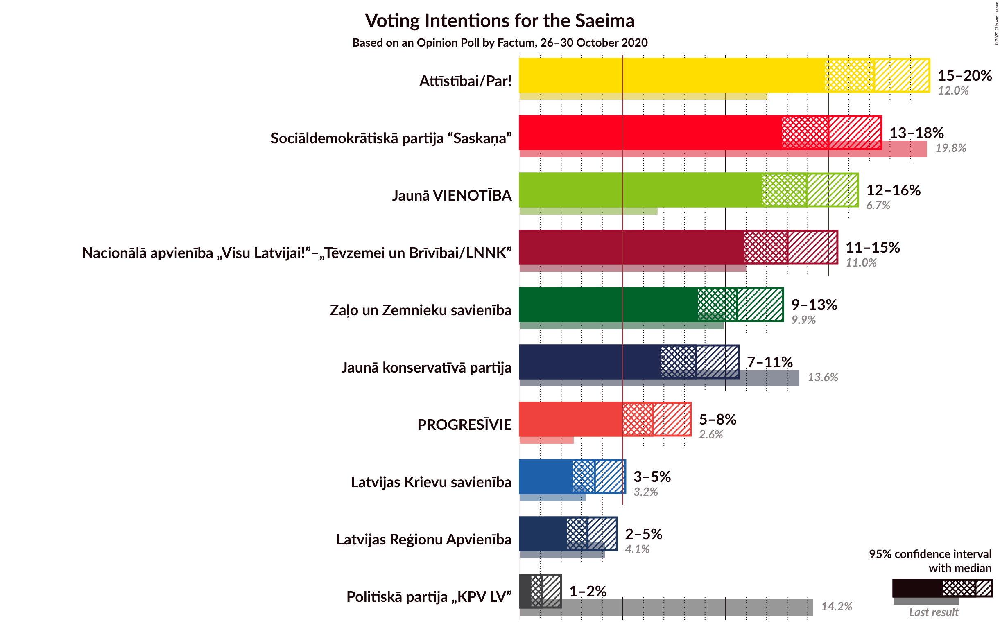

### Confidence Intervals

| Party | Last Result | Poll Result | 80% Confidence Interval | 90% Confidence Interval | 95% Confidence Interval | 99% Confidence Interval |
|:-----:|:-----------:|:-----------:|:-----------------------:|:-----------------------:|:-----------------------:|:-----------------------:|
| Attīstībai/Par! | 12.0% | 17.2% | 15.7–19.0% |15.2–19.5% |14.8–19.9% |14.1–20.8% |
| Sociāldemokrātiskā partija “Saskaņa” | 19.8% | 15.0% | 13.5–16.7% |13.1–17.1% |12.8–17.6% |12.1–18.4% |
| Jaunā VIENOTĪBA | 6.7% | 14.0% | 12.5–15.6% |12.1–16.0% |11.8–16.4% |11.1–17.3% |
| Nacionālā apvienība „Visu Latvijai!”–„Tēvzemei un Brīvībai/LNNK” | 11.0% | 13.0% | 11.6–14.6% |11.2–15.0% |10.9–15.4% |10.3–16.2% |
| Zaļo un Zemnieku savienība | 9.9% | 10.6% | 9.3–12.0% |9.0–12.4% |8.7–12.8% |8.1–13.5% |
| Jaunā konservatīvā partija | 13.6% | 8.6% | 7.4–9.9% |7.1–10.3% |6.9–10.6% |6.4–11.3% |
| PROGRESĪVIE | 2.6% | 6.4% | 5.5–7.7% |5.2–8.0% |5.0–8.3% |4.6–8.9% |
| Latvijas Krievu savienība | 3.2% | 3.6% | 2.9–4.6% |2.7–4.9% |2.6–5.1% |2.3–5.6% |
| Latvijas Reģionu Apvienība | 4.1% | 3.3% | 2.6–4.2% |2.4–4.5% |2.3–4.7% |2.0–5.2% |
| Politiskā partija „KPV LV” | 14.2% | 1.1% | 0.7–1.7% |0.6–1.8% |0.5–2.0% |0.4–2.3% |

*Note:* The poll result column reflects the actual value used in the calculations. Published results may vary slightly, and in addition be rounded to fewer digits.

## Seats

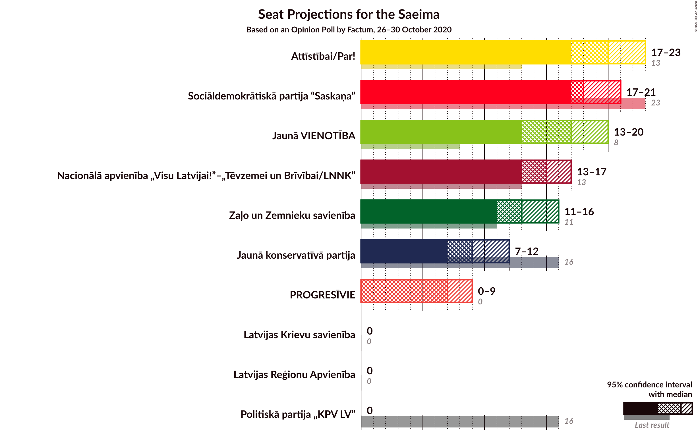

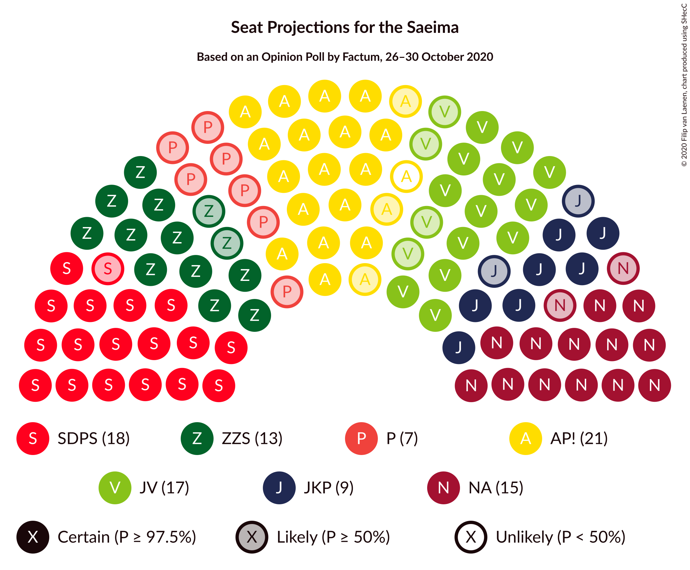

### Confidence Intervals

| Party | Last Result | Median | 80% Confidence Interval | 90% Confidence Interval | 95% Confidence Interval | 99% Confidence Interval |
|:-----:|:-----------:|:------:|:-----------------------:|:-----------------------:|:-----------------------:|:-----------------------:|
| <a href="#attīstībai/par!">Attīstībai/Par!</a> | 13 | 20 | 17–21 |17–23 |17–23 |16–24 |
| <a href="#sociāldemokrātiskā-partija-“saskaņa”">Sociāldemokrātiskā partija “Saskaņa”</a> | 23 | 18 | 17–20 |17–21 |17–21 |16–23 |
| <a href="#jaunā-vienotība">Jaunā VIENOTĪBA</a> | 8 | 17 | 16–19 |15–19 |13–20 |12–20 |
| <a href="#nacionālā-apvienība-„visu-latvijai!”–„tēvzemei-un-brīvībai/lnnk”">Nacionālā apvienība „Visu Latvijai!”–„Tēvzemei un Brīvībai/LNNK”</a> | 13 | 15 | 14–17 |13–17 |13–17 |12–19 |
| <a href="#zaļo-un-zemnieku-savienība">Zaļo un Zemnieku savienība</a> | 11 | 13 | 12–14 |12–15 |11–16 |11–17 |
| <a href="#jaunā-konservatīvā-partija">Jaunā konservatīvā partija</a> | 16 | 9 | 8–11 |8–12 |7–12 |7–13 |
| <a href="#progresīvie">PROGRESĪVIE</a> | 0 | 7 | 7–9 |6–9 |0–9 |0–9 |
| <a href="#latvijas-krievu-savienība">Latvijas Krievu savienība</a> | 0 | 0 | 0 |0 |0 |0–7 |
| <a href="#latvijas-reģionu-apvienība">Latvijas Reģionu Apvienība</a> | 0 | 0 | 0 |0 |0 |0–6 |
| <a href="#politiskā-partija-„kpv-lv”">Politiskā partija „KPV LV”</a> | 16 | 0 | 0 |0 |0 |0 |

### Attīstībai/Par!

*For a full overview of the results for this party, see the [Attīstībai/Par!](party-attīstībaipar.html) page.*

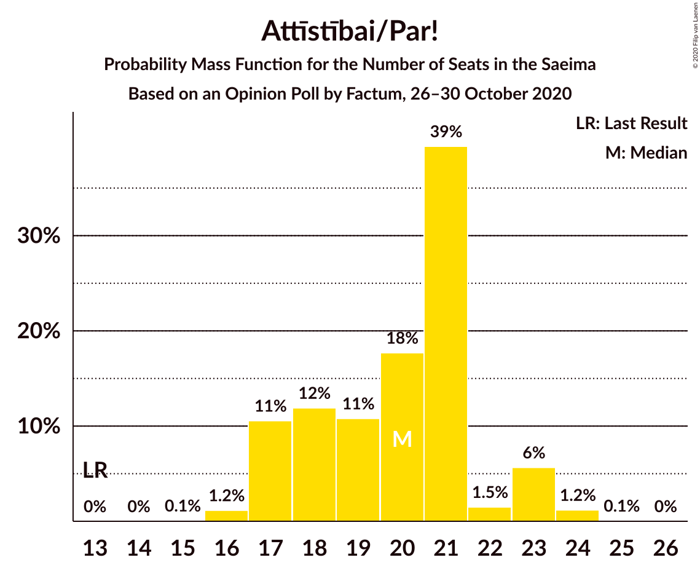

| Number of Seats | Probability | Accumulated | Special Marks |
|:---------------:|:-----------:|:-----------:|:-------------:|
| 13 | 0% | 100% | Last Result |
| 14 | 0% | 100% |  |
| 15 | 0.1% | 100% |  |
| 16 | 1.2% | 99.9% |  |
| 17 | 11% | 98.8% |  |
| 18 | 12% | 88% |  |
| 19 | 11% | 76% |  |
| 20 | 18% | 66% | Median |
| 21 | 39% | 48% |  |
| 22 | 1.5% | 8% |  |
| 23 | 6% | 7% |  |
| 24 | 1.2% | 1.3% |  |
| 25 | 0.1% | 0.1% |  |
| 26 | 0% | 0% |  |

### Sociāldemokrātiskā partija “Saskaņa”

*For a full overview of the results for this party, see the [Sociāldemokrātiskā partija “Saskaņa”](party-sociāldemokrātiskāpartija“saskaņa”.html) page.*

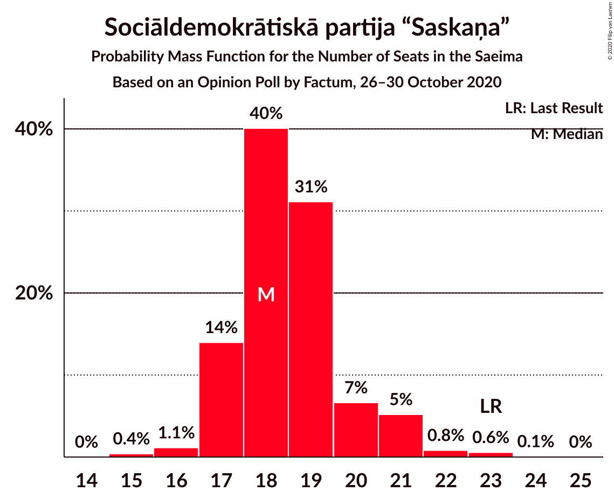

| Number of Seats | Probability | Accumulated | Special Marks |
|:---------------:|:-----------:|:-----------:|:-------------:|
| 15 | 0.4% | 100% |  |
| 16 | 1.1% | 99.6% |  |
| 17 | 14% | 98% |  |
| 18 | 40% | 84% | Median |
| 19 | 31% | 44% |  |
| 20 | 7% | 13% |  |
| 21 | 5% | 7% |  |
| 22 | 0.8% | 1.5% |  |
| 23 | 0.6% | 0.6% | Last Result |
| 24 | 0.1% | 0.1% |  |
| 25 | 0% | 0% |  |

### Jaunā VIENOTĪBA

*For a full overview of the results for this party, see the [Jaunā VIENOTĪBA](party-jaunāvienotība.html) page.*

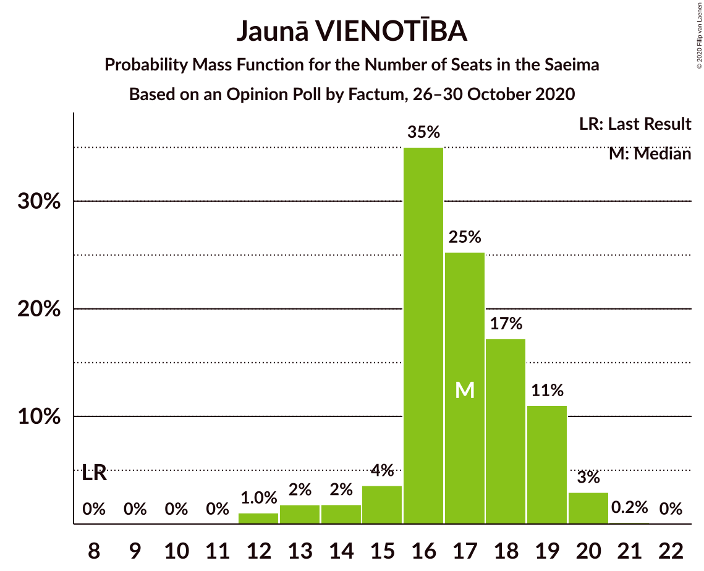

| Number of Seats | Probability | Accumulated | Special Marks |
|:---------------:|:-----------:|:-----------:|:-------------:|
| 8 | 0% | 100% | Last Result |
| 9 | 0% | 100% |  |
| 10 | 0% | 100% |  |
| 11 | 0% | 100% |  |
| 12 | 1.0% | 100% |  |
| 13 | 2% | 98.9% |  |
| 14 | 2% | 97% |  |
| 15 | 4% | 95% |  |
| 16 | 35% | 92% |  |
| 17 | 25% | 57% | Median |
| 18 | 17% | 31% |  |
| 19 | 11% | 14% |  |
| 20 | 3% | 3% |  |
| 21 | 0.2% | 0.2% |  |
| 22 | 0% | 0% |  |

### Nacionālā apvienība „Visu Latvijai!”–„Tēvzemei un Brīvībai/LNNK”

*For a full overview of the results for this party, see the [Nacionālā apvienība „Visu Latvijai!”–„Tēvzemei un Brīvībai/LNNK”](party-nacionālāapvienība„visulatvijai”–„tēvzemeiunbrīvībailnnk”.html) page.*

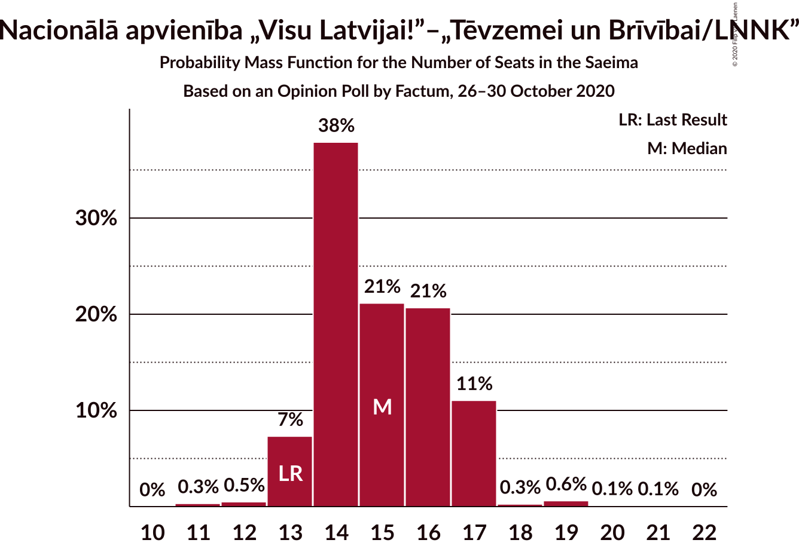

| Number of Seats | Probability | Accumulated | Special Marks |
|:---------------:|:-----------:|:-----------:|:-------------:|
| 11 | 0.3% | 100% |  |
| 12 | 0.5% | 99.7% |  |
| 13 | 7% | 99.2% | Last Result |
| 14 | 38% | 92% |  |
| 15 | 21% | 54% | Median |
| 16 | 21% | 33% |  |
| 17 | 11% | 12% |  |
| 18 | 0.3% | 1.1% |  |
| 19 | 0.6% | 0.8% |  |
| 20 | 0.1% | 0.2% |  |
| 21 | 0.1% | 0.1% |  |
| 22 | 0% | 0% |  |

### Zaļo un Zemnieku savienība

*For a full overview of the results for this party, see the [Zaļo un Zemnieku savienība](party-zaļounzemniekusavienība.html) page.*

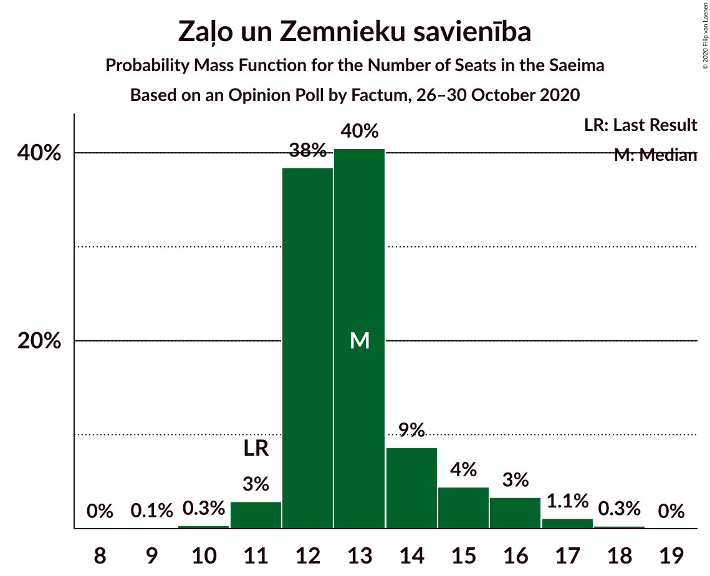

| Number of Seats | Probability | Accumulated | Special Marks |
|:---------------:|:-----------:|:-----------:|:-------------:|
| 9 | 0.1% | 100% |  |
| 10 | 0.3% | 99.9% |  |
| 11 | 3% | 99.6% | Last Result |
| 12 | 38% | 97% |  |
| 13 | 40% | 58% | Median |
| 14 | 9% | 18% |  |
| 15 | 4% | 9% |  |
| 16 | 3% | 5% |  |
| 17 | 1.1% | 1.4% |  |
| 18 | 0.3% | 0.3% |  |
| 19 | 0% | 0% |  |

### Jaunā konservatīvā partija

*For a full overview of the results for this party, see the [Jaunā konservatīvā partija](party-jaunākonservatīvāpartija.html) page.*

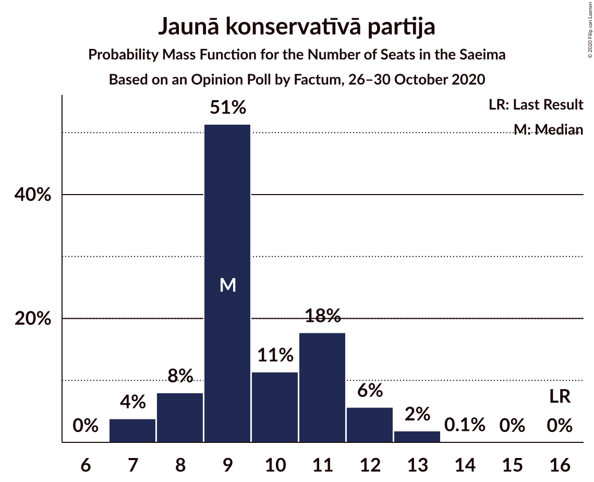

| Number of Seats | Probability | Accumulated | Special Marks |
|:---------------:|:-----------:|:-----------:|:-------------:|
| 7 | 4% | 100% |  |
| 8 | 8% | 96% |  |
| 9 | 51% | 88% | Median |
| 10 | 11% | 37% |  |
| 11 | 18% | 25% |  |
| 12 | 6% | 8% |  |
| 13 | 2% | 2% |  |
| 14 | 0.1% | 0.1% |  |
| 15 | 0% | 0% |  |
| 16 | 0% | 0% | Last Result |

### PROGRESĪVIE

*For a full overview of the results for this party, see the [PROGRESĪVIE](party-progresīvie.html) page.*

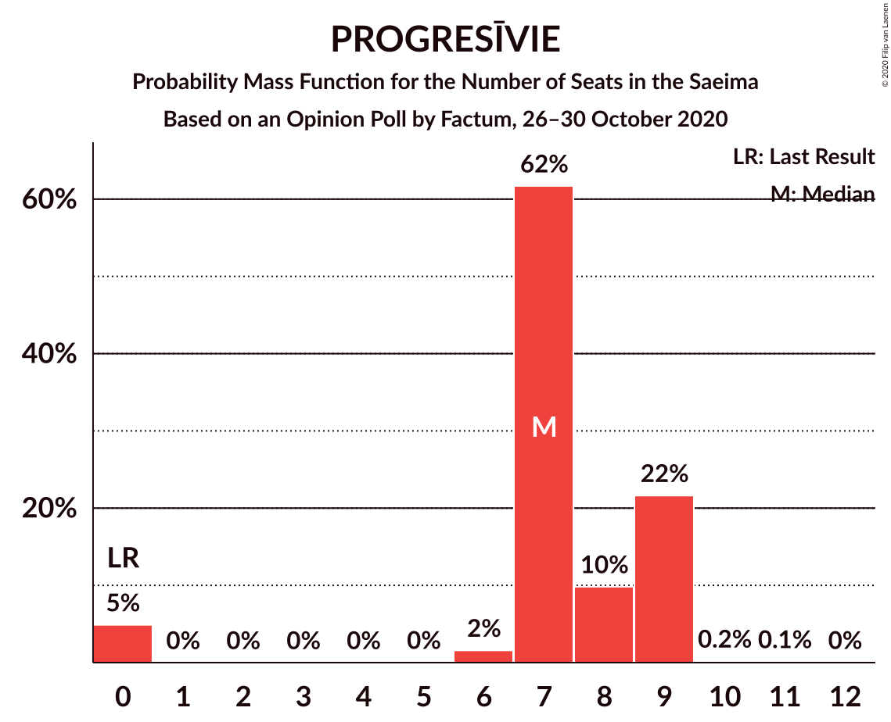

| Number of Seats | Probability | Accumulated | Special Marks |
|:---------------:|:-----------:|:-----------:|:-------------:|
| 0 | 5% | 100% | Last Result |
| 1 | 0% | 95% |  |
| 2 | 0% | 95% |  |
| 3 | 0% | 95% |  |
| 4 | 0% | 95% |  |
| 5 | 0% | 95% |  |
| 6 | 2% | 95% |  |
| 7 | 62% | 93% | Median |
| 8 | 10% | 32% |  |
| 9 | 22% | 22% |  |
| 10 | 0.2% | 0.3% |  |
| 11 | 0.1% | 0.1% |  |
| 12 | 0% | 0% |  |

### Latvijas Krievu savienība

*For a full overview of the results for this party, see the [Latvijas Krievu savienība](party-latvijaskrievusavienība.html) page.*

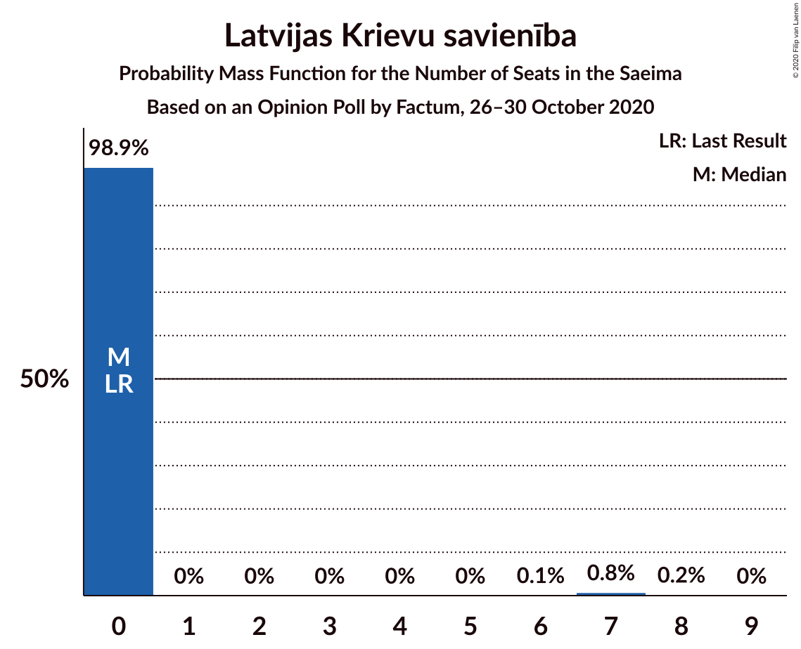

| Number of Seats | Probability | Accumulated | Special Marks |
|:---------------:|:-----------:|:-----------:|:-------------:|
| 0 | 98.9% | 100% | Last Result, Median |
| 1 | 0% | 1.1% |  |
| 2 | 0% | 1.1% |  |
| 3 | 0% | 1.1% |  |
| 4 | 0% | 1.1% |  |
| 5 | 0% | 1.1% |  |
| 6 | 0.1% | 1.1% |  |
| 7 | 0.8% | 1.0% |  |
| 8 | 0.2% | 0.2% |  |
| 9 | 0% | 0% |  |

### Latvijas Reģionu Apvienība

*For a full overview of the results for this party, see the [Latvijas Reģionu Apvienība](party-latvijasreģionuapvienība.html) page.*

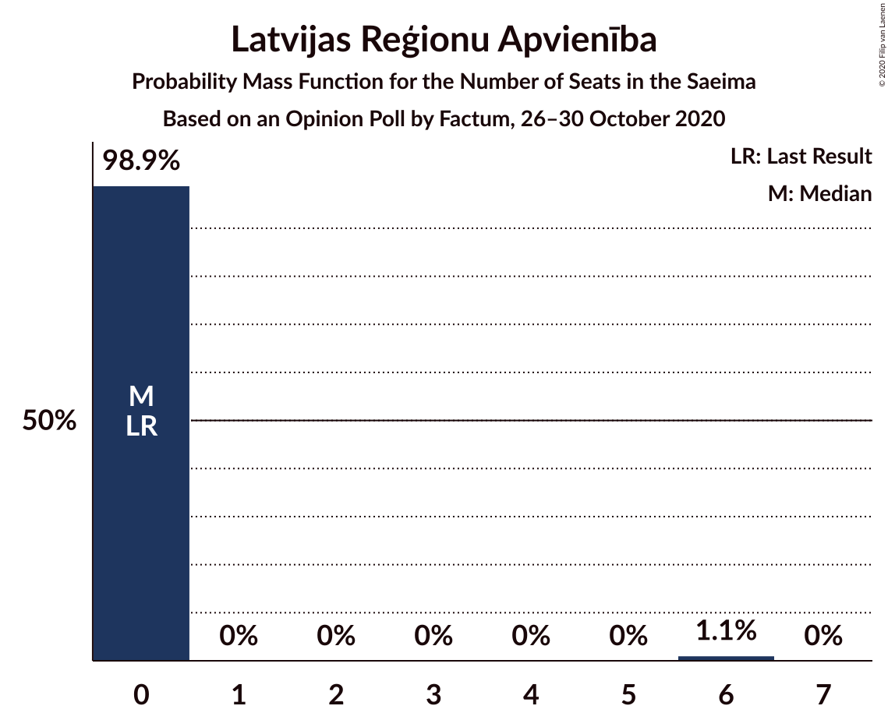

| Number of Seats | Probability | Accumulated | Special Marks |
|:---------------:|:-----------:|:-----------:|:-------------:|
| 0 | 98.9% | 100% | Last Result, Median |
| 1 | 0% | 1.1% |  |
| 2 | 0% | 1.1% |  |
| 3 | 0% | 1.1% |  |
| 4 | 0% | 1.1% |  |
| 5 | 0% | 1.1% |  |
| 6 | 1.1% | 1.1% |  |
| 7 | 0% | 0% |  |

### Politiskā partija „KPV LV”

*For a full overview of the results for this party, see the [Politiskā partija „KPV LV”](party-politiskāpartija„kpvlv”.html) page.*

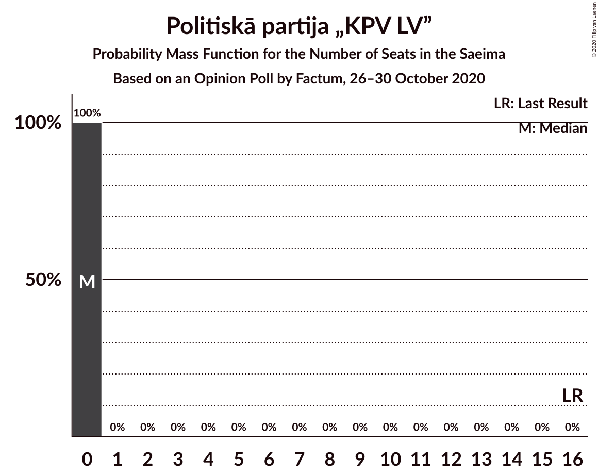

| Number of Seats | Probability | Accumulated | Special Marks |
|:---------------:|:-----------:|:-----------:|:-------------:|
| 0 | 100% | 100% | Median |
| 1 | 0% | 0% |  |
| 2 | 0% | 0% |  |
| 3 | 0% | 0% |  |
| 4 | 0% | 0% |  |
| 5 | 0% | 0% |  |
| 6 | 0% | 0% |  |
| 7 | 0% | 0% |  |
| 8 | 0% | 0% |  |
| 9 | 0% | 0% |  |
| 10 | 0% | 0% |  |
| 11 | 0% | 0% |  |
| 12 | 0% | 0% |  |
| 13 | 0% | 0% |  |
| 14 | 0% | 0% |  |
| 15 | 0% | 0% |  |
| 16 | 0% | 0% | Last Result |

## Coalitions

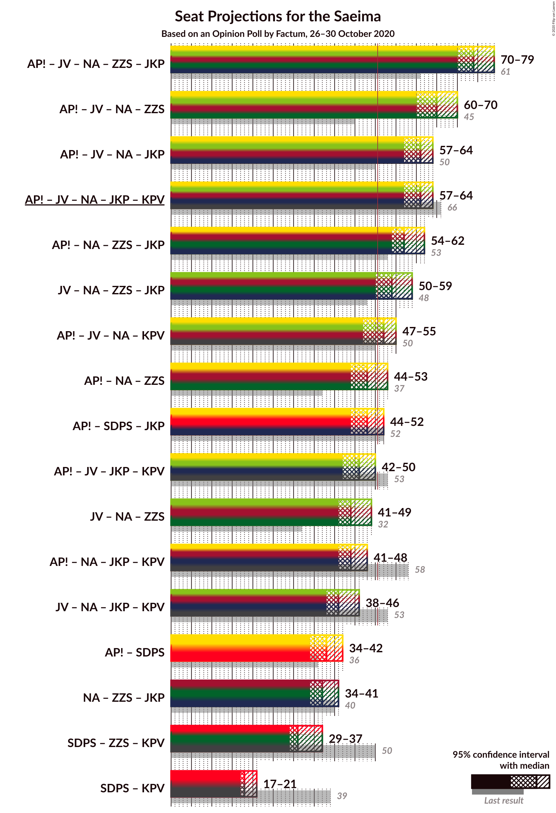

### Confidence Intervals

| Coalition | Last Result | Median | Majority? | 80% Confidence Interval | 90% Confidence Interval | 95% Confidence Interval | 99% Confidence Interval |
|:---------:|:-----------:|:------:|:---------:|:-----------------------:|:-----------------------:|:-----------------------:|:-----------------------:|
| Attīstībai/Par! – Jaunā VIENOTĪBA – Nacionālā apvienība „Visu Latvijai!”–„Tēvzemei un Brīvībai/LNNK” – Zaļo un Zemnieku savienība – Jaunā konservatīvā partija | 61 | 74 | 100% | 72–75 | 71–77 | 70–79 | 68–81 |
| Attīstībai/Par! – Jaunā VIENOTĪBA – Nacionālā apvienība „Visu Latvijai!”–„Tēvzemei un Brīvībai/LNNK” – Zaļo un Zemnieku savienība | 45 | 65 | 100% | 62–66 | 61–68 | 60–70 | 58–70 |
| Attīstībai/Par! – Jaunā VIENOTĪBA – Nacionālā apvienība „Visu Latvijai!”–„Tēvzemei un Brīvībai/LNNK” – Jaunā konservatīvā partija | 50 | 61 | 100% | 59–63 | 58–63 | 57–64 | 56–67 |
| Attīstībai/Par! – Jaunā VIENOTĪBA – Nacionālā apvienība „Visu Latvijai!”–„Tēvzemei un Brīvībai/LNNK” – Jaunā konservatīvā partija – Politiskā partija „KPV LV” | 66 | 61 | 100% | 59–63 | 58–63 | 57–64 | 56–67 |
| Attīstībai/Par! – Nacionālā apvienība „Visu Latvijai!”–„Tēvzemei un Brīvībai/LNNK” – Zaļo un Zemnieku savienība – Jaunā konservatīvā partija | 53 | 57 | 100% | 55–59 | 55–61 | 54–62 | 52–63 |
| Jaunā VIENOTĪBA – Nacionālā apvienība „Visu Latvijai!”–„Tēvzemei un Brīvībai/LNNK” – Zaļo un Zemnieku savienība – Jaunā konservatīvā partija | 48 | 54 | 97% | 52–57 | 51–58 | 50–59 | 49–61 |
| Attīstībai/Par! – Jaunā VIENOTĪBA – Nacionālā apvienība „Visu Latvijai!”–„Tēvzemei un Brīvībai/LNNK” – Politiskā partija „KPV LV” | 50 | 52 | 79% | 49–54 | 49–54 | 47–55 | 46–57 |
| Attīstībai/Par! – Nacionālā apvienība „Visu Latvijai!”–„Tēvzemei un Brīvībai/LNNK” – Zaļo un Zemnieku savienība | 37 | 48 | 5% | 45–50 | 44–51 | 44–53 | 42–53 |
| Attīstībai/Par! – Sociāldemokrātiskā partija “Saskaņa” – Jaunā konservatīvā partija | 52 | 48 | 7% | 46–50 | 45–51 | 44–52 | 43–54 |
| Attīstībai/Par! – Jaunā VIENOTĪBA – Jaunā konservatīvā partija – Politiskā partija „KPV LV” | 53 | 46 | 2% | 44–49 | 43–49 | 42–50 | 41–52 |
| Jaunā VIENOTĪBA – Nacionālā apvienība „Visu Latvijai!”–„Tēvzemei un Brīvībai/LNNK” – Zaļo un Zemnieku savienība | 32 | 44 | 0.1% | 43–47 | 42–49 | 41–49 | 39–50 |
| Attīstībai/Par! – Nacionālā apvienība „Visu Latvijai!”–„Tēvzemei un Brīvībai/LNNK” – Jaunā konservatīvā partija – Politiskā partija „KPV LV” | 58 | 44 | 0.3% | 42–46 | 42–47 | 41–48 | 40–49 |
| Jaunā VIENOTĪBA – Nacionālā apvienība „Visu Latvijai!”–„Tēvzemei un Brīvībai/LNNK” – Jaunā konservatīvā partija – Politiskā partija „KPV LV” | 53 | 41 | 0% | 39–45 | 39–45 | 38–46 | 36–47 |
| Attīstībai/Par! – Sociāldemokrātiskā partija “Saskaņa” | 36 | 38 | 0% | 36–41 | 35–41 | 34–42 | 33–43 |
| Nacionālā apvienība „Visu Latvijai!”–„Tēvzemei un Brīvībai/LNNK” – Zaļo un Zemnieku savienība – Jaunā konservatīvā partija | 40 | 37 | 0% | 35–40 | 35–41 | 34–41 | 33–43 |
| Sociāldemokrātiskā partija “Saskaņa” – Zaļo un Zemnieku savienība – Politiskā partija „KPV LV” | 50 | 31 | 0% | 30–34 | 29–35 | 29–37 | 27–37 |
| Sociāldemokrātiskā partija “Saskaņa” – Politiskā partija „KPV LV” | 39 | 18 | 0% | 17–20 | 17–21 | 17–21 | 16–23 |

### Attīstībai/Par! – Jaunā VIENOTĪBA – Nacionālā apvienība „Visu Latvijai!”–„Tēvzemei un Brīvībai/LNNK” – Zaļo un Zemnieku savienība – Jaunā konservatīvā partija

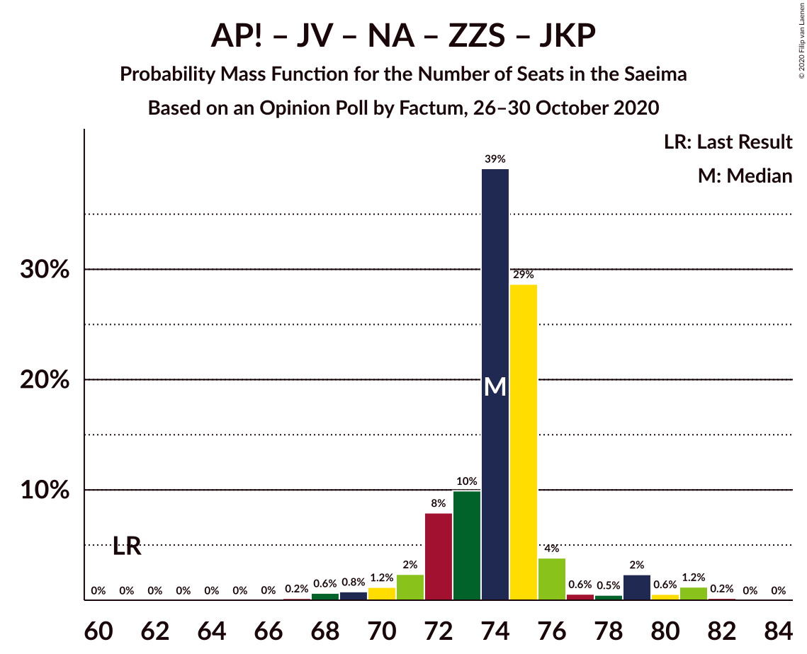

| Number of Seats | Probability | Accumulated | Special Marks |
|:---------------:|:-----------:|:-----------:|:-------------:|
| 61 | 0% | 100% | Last Result |
| 62 | 0% | 100% |  |
| 63 | 0% | 100% |  |
| 64 | 0% | 100% |  |
| 65 | 0% | 100% |  |
| 66 | 0% | 100% |  |
| 67 | 0.2% | 100% |  |
| 68 | 0.6% | 99.8% |  |
| 69 | 0.8% | 99.1% |  |
| 70 | 1.2% | 98% |  |
| 71 | 2% | 97% |  |
| 72 | 8% | 95% |  |
| 73 | 10% | 87% |  |
| 74 | 39% | 77% | Median |
| 75 | 29% | 38% |  |
| 76 | 4% | 9% |  |
| 77 | 0.6% | 5% |  |
| 78 | 0.5% | 5% |  |
| 79 | 2% | 4% |  |
| 80 | 0.6% | 2% |  |
| 81 | 1.2% | 1.4% |  |
| 82 | 0.2% | 0.2% |  |
| 83 | 0% | 0% |  |

### Attīstībai/Par! – Jaunā VIENOTĪBA – Nacionālā apvienība „Visu Latvijai!”–„Tēvzemei un Brīvībai/LNNK” – Zaļo un Zemnieku savienība

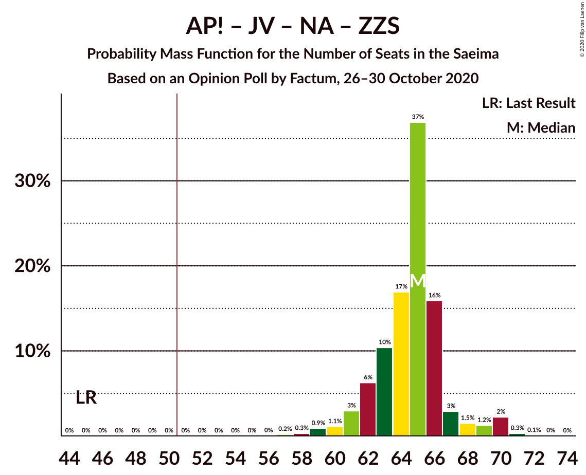

| Number of Seats | Probability | Accumulated | Special Marks |
|:---------------:|:-----------:|:-----------:|:-------------:|
| 45 | 0% | 100% | Last Result |
| 46 | 0% | 100% |  |
| 47 | 0% | 100% |  |
| 48 | 0% | 100% |  |
| 49 | 0% | 100% |  |
| 50 | 0% | 100% |  |
| 51 | 0% | 100% | Majority |
| 52 | 0% | 100% |  |
| 53 | 0% | 100% |  |
| 54 | 0% | 100% |  |
| 55 | 0% | 100% |  |
| 56 | 0% | 100% |  |
| 57 | 0.2% | 100% |  |
| 58 | 0.3% | 99.8% |  |
| 59 | 0.9% | 99.5% |  |
| 60 | 1.1% | 98.6% |  |
| 61 | 3% | 97% |  |
| 62 | 6% | 95% |  |
| 63 | 10% | 88% |  |
| 64 | 17% | 78% |  |
| 65 | 37% | 61% | Median |
| 66 | 16% | 24% |  |
| 67 | 3% | 8% |  |
| 68 | 1.5% | 5% |  |
| 69 | 1.2% | 4% |  |
| 70 | 2% | 3% |  |
| 71 | 0.3% | 0.4% |  |
| 72 | 0.1% | 0.1% |  |
| 73 | 0% | 0% |  |

### Attīstībai/Par! – Jaunā VIENOTĪBA – Nacionālā apvienība „Visu Latvijai!”–„Tēvzemei un Brīvībai/LNNK” – Jaunā konservatīvā partija

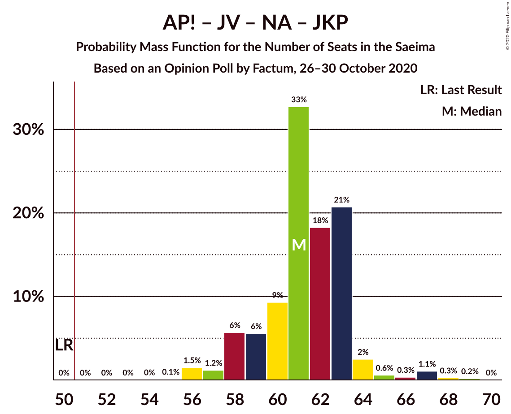

| Number of Seats | Probability | Accumulated | Special Marks |
|:---------------:|:-----------:|:-----------:|:-------------:|
| 50 | 0% | 100% | Last Result |
| 51 | 0% | 100% | Majority |
| 52 | 0% | 100% |  |
| 53 | 0% | 100% |  |
| 54 | 0% | 100% |  |
| 55 | 0.1% | 99.9% |  |
| 56 | 1.5% | 99.8% |  |
| 57 | 1.2% | 98% |  |
| 58 | 6% | 97% |  |
| 59 | 6% | 91% |  |
| 60 | 9% | 86% |  |
| 61 | 33% | 77% | Median |
| 62 | 18% | 44% |  |
| 63 | 21% | 26% |  |
| 64 | 2% | 5% |  |
| 65 | 0.6% | 2% |  |
| 66 | 0.3% | 2% |  |
| 67 | 1.1% | 2% |  |
| 68 | 0.3% | 0.5% |  |
| 69 | 0.2% | 0.2% |  |
| 70 | 0% | 0% |  |

### Attīstībai/Par! – Jaunā VIENOTĪBA – Nacionālā apvienība „Visu Latvijai!”–„Tēvzemei un Brīvībai/LNNK” – Jaunā konservatīvā partija – Politiskā partija „KPV LV”

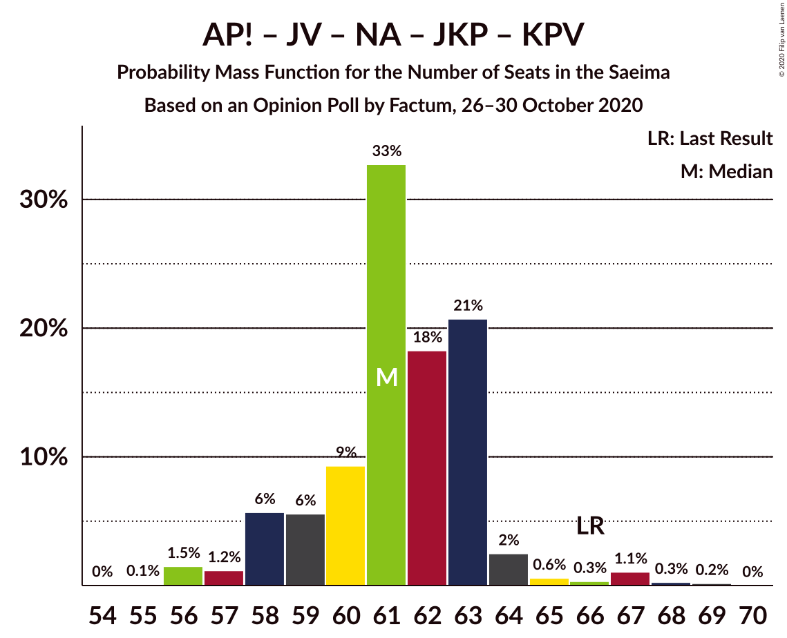

| Number of Seats | Probability | Accumulated | Special Marks |
|:---------------:|:-----------:|:-----------:|:-------------:|
| 54 | 0% | 100% |  |
| 55 | 0.1% | 99.9% |  |
| 56 | 1.5% | 99.8% |  |
| 57 | 1.2% | 98% |  |
| 58 | 6% | 97% |  |
| 59 | 6% | 91% |  |
| 60 | 9% | 86% |  |
| 61 | 33% | 77% | Median |
| 62 | 18% | 44% |  |
| 63 | 21% | 26% |  |
| 64 | 2% | 5% |  |
| 65 | 0.6% | 2% |  |
| 66 | 0.3% | 2% | Last Result |
| 67 | 1.1% | 2% |  |
| 68 | 0.3% | 0.5% |  |
| 69 | 0.2% | 0.2% |  |
| 70 | 0% | 0% |  |

### Attīstībai/Par! – Nacionālā apvienība „Visu Latvijai!”–„Tēvzemei un Brīvībai/LNNK” – Zaļo un Zemnieku savienība – Jaunā konservatīvā partija

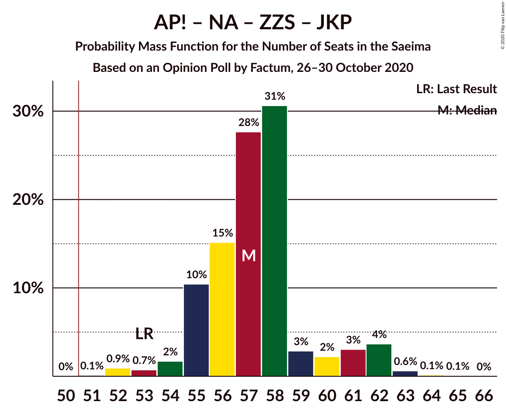

| Number of Seats | Probability | Accumulated | Special Marks |
|:---------------:|:-----------:|:-----------:|:-------------:|
| 51 | 0.1% | 100% | Majority |
| 52 | 0.9% | 99.8% |  |
| 53 | 0.7% | 98.9% | Last Result |
| 54 | 2% | 98% |  |
| 55 | 10% | 96% |  |
| 56 | 15% | 86% |  |
| 57 | 28% | 71% | Median |
| 58 | 31% | 43% |  |
| 59 | 3% | 13% |  |
| 60 | 2% | 10% |  |
| 61 | 3% | 8% |  |
| 62 | 4% | 4% |  |
| 63 | 0.6% | 0.8% |  |
| 64 | 0.1% | 0.2% |  |
| 65 | 0.1% | 0.1% |  |
| 66 | 0% | 0% |  |

### Jaunā VIENOTĪBA – Nacionālā apvienība „Visu Latvijai!”–„Tēvzemei un Brīvībai/LNNK” – Zaļo un Zemnieku savienība – Jaunā konservatīvā partija

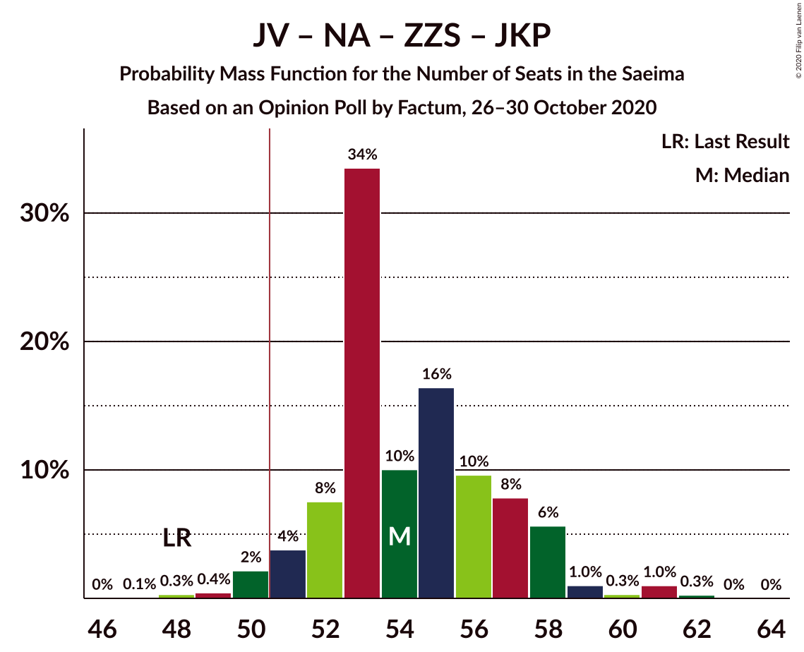

| Number of Seats | Probability | Accumulated | Special Marks |
|:---------------:|:-----------:|:-----------:|:-------------:|
| 47 | 0.1% | 100% |  |
| 48 | 0.3% | 99.9% | Last Result |
| 49 | 0.4% | 99.6% |  |
| 50 | 2% | 99.1% |  |
| 51 | 4% | 97% | Majority |
| 52 | 8% | 93% |  |
| 53 | 34% | 86% |  |
| 54 | 10% | 52% | Median |
| 55 | 16% | 42% |  |
| 56 | 10% | 26% |  |
| 57 | 8% | 16% |  |
| 58 | 6% | 8% |  |
| 59 | 1.0% | 3% |  |
| 60 | 0.3% | 2% |  |
| 61 | 1.0% | 1.3% |  |
| 62 | 0.3% | 0.3% |  |
| 63 | 0% | 0% |  |

### Attīstībai/Par! – Jaunā VIENOTĪBA – Nacionālā apvienība „Visu Latvijai!”–„Tēvzemei un Brīvībai/LNNK” – Politiskā partija „KPV LV”

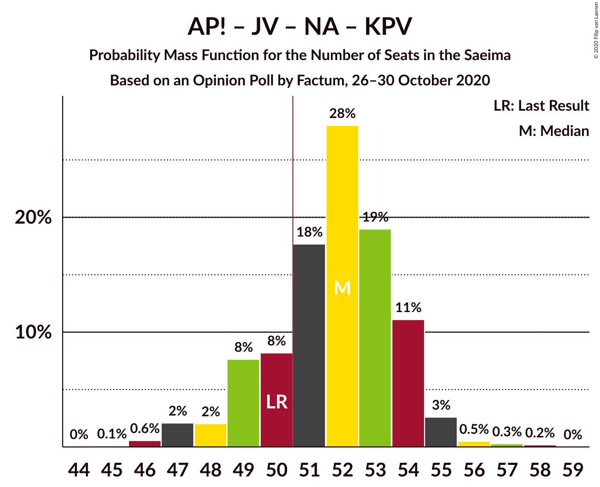

| Number of Seats | Probability | Accumulated | Special Marks |
|:---------------:|:-----------:|:-----------:|:-------------:|
| 44 | 0% | 100% |  |
| 45 | 0.1% | 99.9% |  |
| 46 | 0.6% | 99.9% |  |
| 47 | 2% | 99.3% |  |
| 48 | 2% | 97% |  |
| 49 | 8% | 95% |  |
| 50 | 8% | 88% | Last Result |
| 51 | 18% | 79% | Majority |
| 52 | 28% | 62% | Median |
| 53 | 19% | 34% |  |
| 54 | 11% | 15% |  |
| 55 | 3% | 4% |  |
| 56 | 0.5% | 1.0% |  |
| 57 | 0.3% | 0.5% |  |
| 58 | 0.2% | 0.2% |  |
| 59 | 0% | 0% |  |

### Attīstībai/Par! – Nacionālā apvienība „Visu Latvijai!”–„Tēvzemei un Brīvībai/LNNK” – Zaļo un Zemnieku savienība

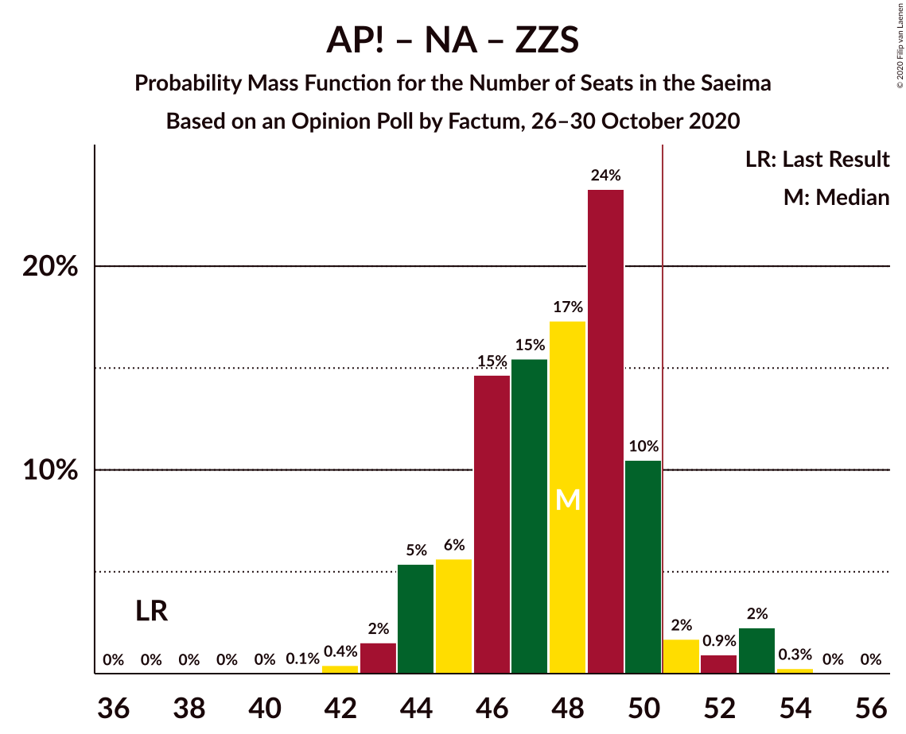

| Number of Seats | Probability | Accumulated | Special Marks |
|:---------------:|:-----------:|:-----------:|:-------------:|
| 37 | 0% | 100% | Last Result |
| 38 | 0% | 100% |  |
| 39 | 0% | 100% |  |
| 40 | 0% | 100% |  |
| 41 | 0.1% | 100% |  |
| 42 | 0.4% | 99.9% |  |
| 43 | 2% | 99.5% |  |
| 44 | 5% | 98% |  |
| 45 | 6% | 93% |  |
| 46 | 15% | 87% |  |
| 47 | 15% | 72% |  |
| 48 | 17% | 57% | Median |
| 49 | 24% | 39% |  |
| 50 | 10% | 16% |  |
| 51 | 2% | 5% | Majority |
| 52 | 0.9% | 4% |  |
| 53 | 2% | 3% |  |
| 54 | 0.3% | 0.3% |  |
| 55 | 0% | 0% |  |

### Attīstībai/Par! – Sociāldemokrātiskā partija “Saskaņa” – Jaunā konservatīvā partija

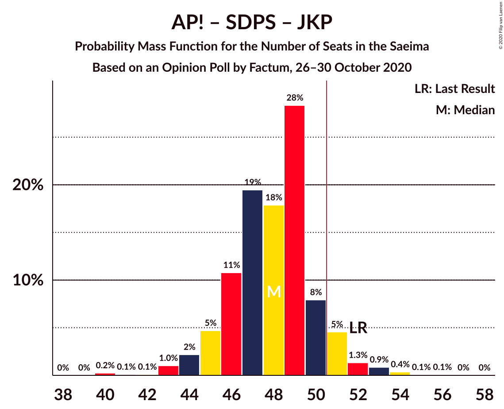

| Number of Seats | Probability | Accumulated | Special Marks |
|:---------------:|:-----------:|:-----------:|:-------------:|
| 40 | 0.2% | 100% |  |
| 41 | 0.1% | 99.7% |  |
| 42 | 0.1% | 99.6% |  |
| 43 | 1.0% | 99.5% |  |
| 44 | 2% | 98.5% |  |
| 45 | 5% | 96% |  |
| 46 | 11% | 92% |  |
| 47 | 19% | 81% | Median |
| 48 | 18% | 61% |  |
| 49 | 28% | 44% |  |
| 50 | 8% | 15% |  |
| 51 | 5% | 7% | Majority |
| 52 | 1.3% | 3% | Last Result |
| 53 | 0.9% | 1.4% |  |
| 54 | 0.4% | 0.5% |  |
| 55 | 0.1% | 0.2% |  |
| 56 | 0.1% | 0.1% |  |
| 57 | 0% | 0% |  |

### Attīstībai/Par! – Jaunā VIENOTĪBA – Jaunā konservatīvā partija – Politiskā partija „KPV LV”

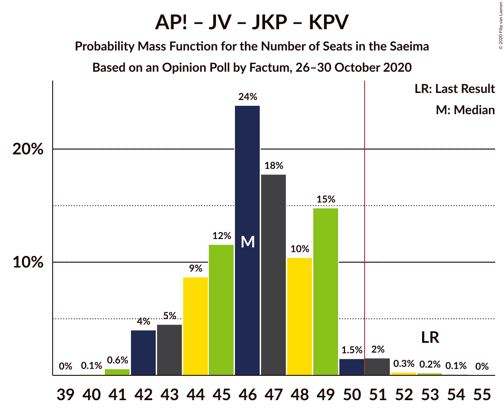

| Number of Seats | Probability | Accumulated | Special Marks |
|:---------------:|:-----------:|:-----------:|:-------------:|
| 39 | 0% | 100% |  |
| 40 | 0.1% | 99.9% |  |
| 41 | 0.6% | 99.8% |  |
| 42 | 4% | 99.3% |  |
| 43 | 5% | 95% |  |
| 44 | 9% | 91% |  |
| 45 | 12% | 82% |  |
| 46 | 24% | 70% | Median |
| 47 | 18% | 47% |  |
| 48 | 10% | 29% |  |
| 49 | 15% | 18% |  |
| 50 | 1.5% | 4% |  |
| 51 | 2% | 2% | Majority |
| 52 | 0.3% | 0.6% |  |
| 53 | 0.2% | 0.3% | Last Result |
| 54 | 0.1% | 0.1% |  |
| 55 | 0% | 0% |  |

### Jaunā VIENOTĪBA – Nacionālā apvienība „Visu Latvijai!”–„Tēvzemei un Brīvībai/LNNK” – Zaļo un Zemnieku savienība

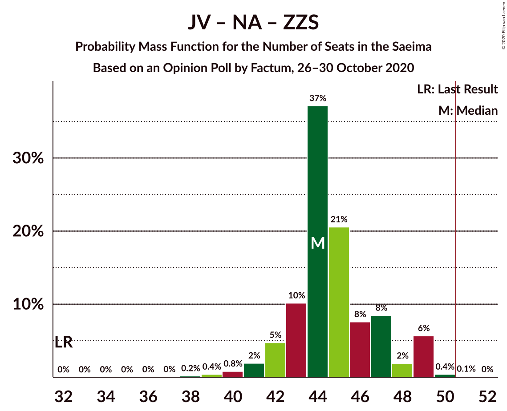

| Number of Seats | Probability | Accumulated | Special Marks |
|:---------------:|:-----------:|:-----------:|:-------------:|
| 32 | 0% | 100% | Last Result |
| 33 | 0% | 100% |  |
| 34 | 0% | 100% |  |
| 35 | 0% | 100% |  |
| 36 | 0% | 100% |  |
| 37 | 0% | 100% |  |
| 38 | 0.2% | 99.9% |  |
| 39 | 0.4% | 99.8% |  |
| 40 | 0.8% | 99.4% |  |
| 41 | 2% | 98.6% |  |
| 42 | 5% | 97% |  |
| 43 | 10% | 92% |  |
| 44 | 37% | 82% |  |
| 45 | 21% | 45% | Median |
| 46 | 8% | 24% |  |
| 47 | 8% | 17% |  |
| 48 | 2% | 8% |  |
| 49 | 6% | 6% |  |
| 50 | 0.4% | 0.5% |  |
| 51 | 0.1% | 0.1% | Majority |
| 52 | 0% | 0% |  |

### Attīstībai/Par! – Nacionālā apvienība „Visu Latvijai!”–„Tēvzemei un Brīvībai/LNNK” – Jaunā konservatīvā partija – Politiskā partija „KPV LV”

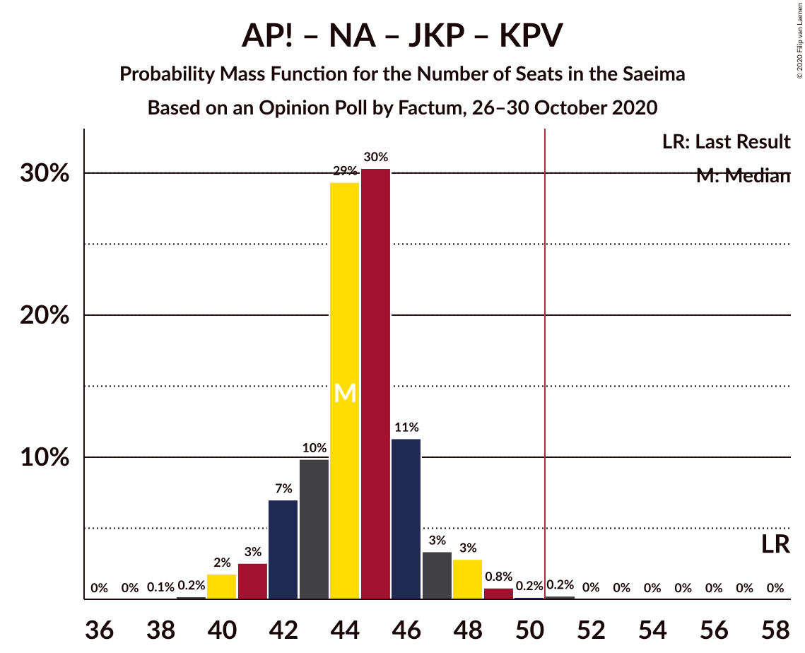

| Number of Seats | Probability | Accumulated | Special Marks |
|:---------------:|:-----------:|:-----------:|:-------------:|
| 38 | 0.1% | 100% |  |
| 39 | 0.2% | 99.9% |  |
| 40 | 2% | 99.7% |  |
| 41 | 3% | 98% |  |
| 42 | 7% | 95% |  |
| 43 | 10% | 88% |  |
| 44 | 29% | 78% | Median |
| 45 | 30% | 49% |  |
| 46 | 11% | 19% |  |
| 47 | 3% | 7% |  |
| 48 | 3% | 4% |  |
| 49 | 0.8% | 1.3% |  |
| 50 | 0.2% | 0.5% |  |
| 51 | 0.2% | 0.3% | Majority |
| 52 | 0% | 0.1% |  |
| 53 | 0% | 0% |  |
| 54 | 0% | 0% |  |
| 55 | 0% | 0% |  |
| 56 | 0% | 0% |  |
| 57 | 0% | 0% |  |
| 58 | 0% | 0% | Last Result |

### Jaunā VIENOTĪBA – Nacionālā apvienība „Visu Latvijai!”–„Tēvzemei un Brīvībai/LNNK” – Jaunā konservatīvā partija – Politiskā partija „KPV LV”

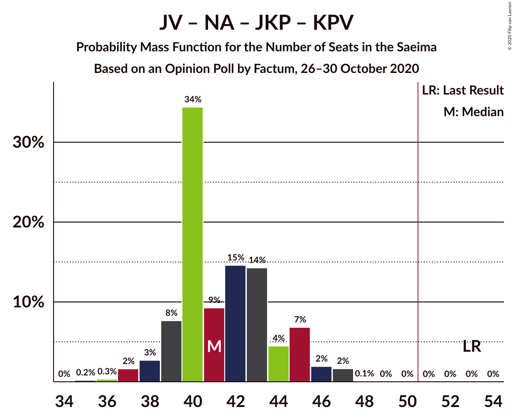

| Number of Seats | Probability | Accumulated | Special Marks |
|:---------------:|:-----------:|:-----------:|:-------------:|
| 35 | 0.2% | 100% |  |
| 36 | 0.3% | 99.8% |  |
| 37 | 2% | 99.5% |  |
| 38 | 3% | 98% |  |
| 39 | 8% | 95% |  |
| 40 | 34% | 87% |  |
| 41 | 9% | 53% | Median |
| 42 | 15% | 44% |  |
| 43 | 14% | 29% |  |
| 44 | 4% | 15% |  |
| 45 | 7% | 10% |  |
| 46 | 2% | 4% |  |
| 47 | 2% | 2% |  |
| 48 | 0.1% | 0.1% |  |
| 49 | 0% | 0% |  |
| 50 | 0% | 0% |  |
| 51 | 0% | 0% | Majority |
| 52 | 0% | 0% |  |
| 53 | 0% | 0% | Last Result |

### Attīstībai/Par! – Sociāldemokrātiskā partija “Saskaņa”

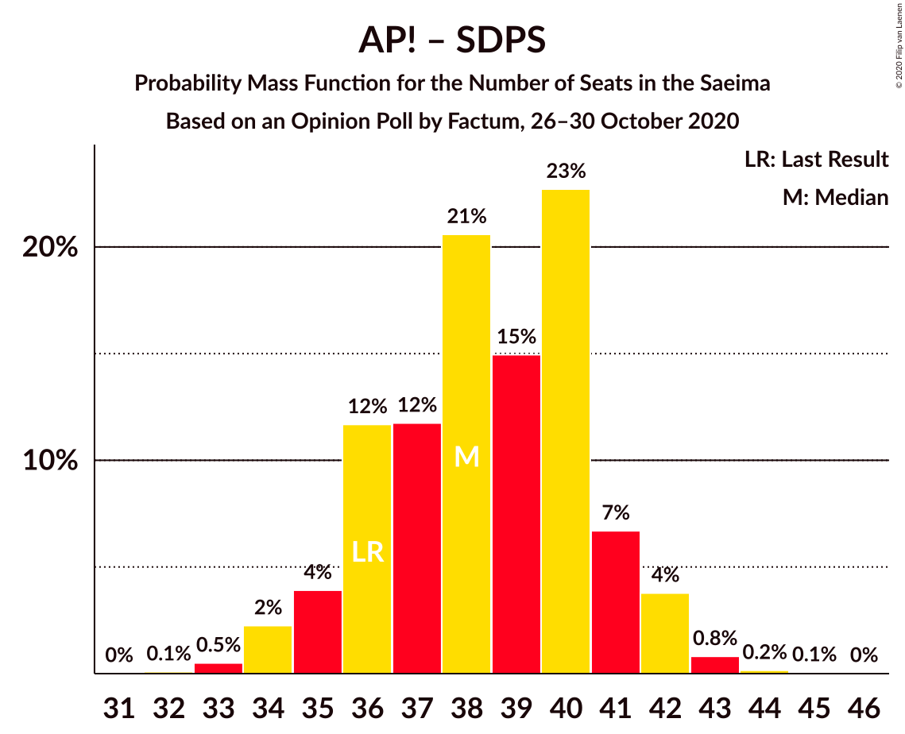

| Number of Seats | Probability | Accumulated | Special Marks |
|:---------------:|:-----------:|:-----------:|:-------------:|
| 32 | 0.1% | 100% |  |
| 33 | 0.5% | 99.9% |  |
| 34 | 2% | 99.4% |  |
| 35 | 4% | 97% |  |
| 36 | 12% | 93% | Last Result |
| 37 | 12% | 82% |  |
| 38 | 21% | 70% | Median |
| 39 | 15% | 49% |  |
| 40 | 23% | 34% |  |
| 41 | 7% | 12% |  |
| 42 | 4% | 5% |  |
| 43 | 0.8% | 1.1% |  |
| 44 | 0.2% | 0.3% |  |
| 45 | 0.1% | 0.1% |  |
| 46 | 0% | 0% |  |

### Nacionālā apvienība „Visu Latvijai!”–„Tēvzemei un Brīvībai/LNNK” – Zaļo un Zemnieku savienība – Jaunā konservatīvā partija

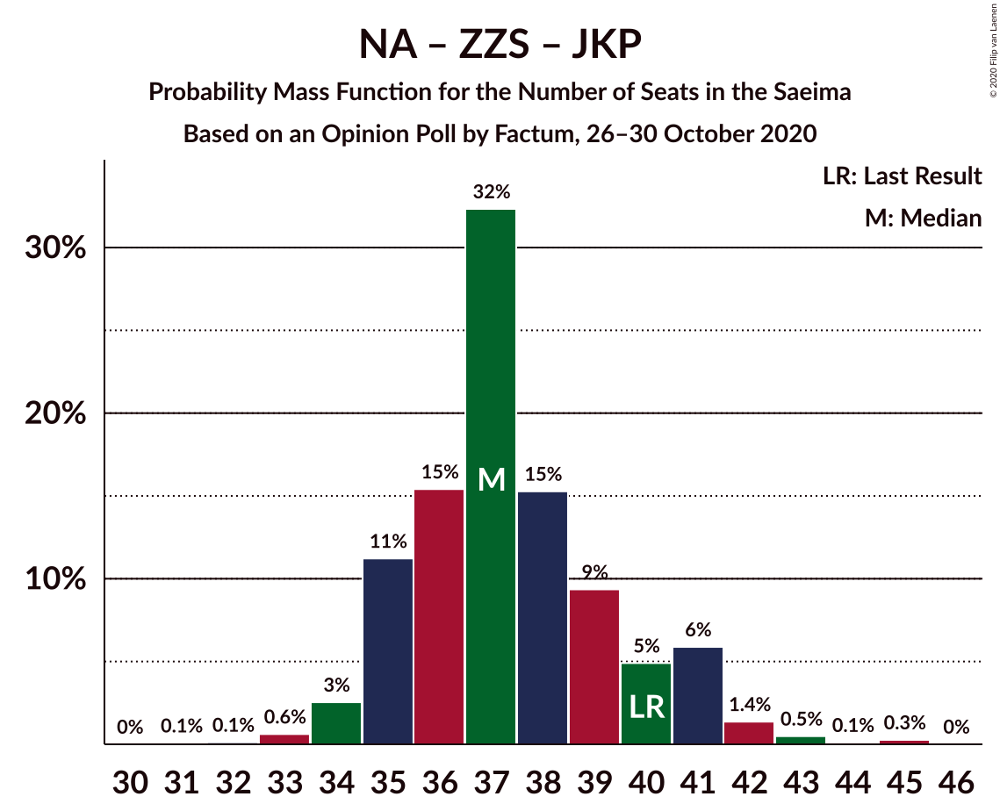

| Number of Seats | Probability | Accumulated | Special Marks |
|:---------------:|:-----------:|:-----------:|:-------------:|
| 31 | 0.1% | 100% |  |
| 32 | 0.1% | 99.9% |  |
| 33 | 0.6% | 99.8% |  |
| 34 | 3% | 99.2% |  |
| 35 | 11% | 97% |  |
| 36 | 15% | 85% |  |
| 37 | 32% | 70% | Median |
| 38 | 15% | 38% |  |
| 39 | 9% | 22% |  |
| 40 | 5% | 13% | Last Result |
| 41 | 6% | 8% |  |
| 42 | 1.4% | 2% |  |
| 43 | 0.5% | 0.9% |  |
| 44 | 0.1% | 0.4% |  |
| 45 | 0.3% | 0.3% |  |
| 46 | 0% | 0% |  |

### Sociāldemokrātiskā partija “Saskaņa” – Zaļo un Zemnieku savienība – Politiskā partija „KPV LV”

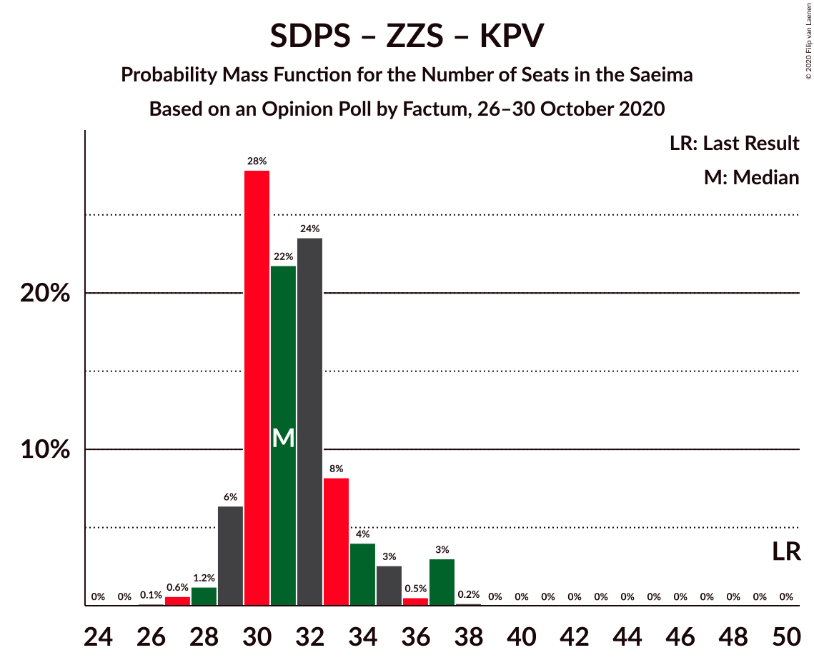

| Number of Seats | Probability | Accumulated | Special Marks |
|:---------------:|:-----------:|:-----------:|:-------------:|
| 26 | 0.1% | 100% |  |
| 27 | 0.6% | 99.9% |  |
| 28 | 1.2% | 99.3% |  |
| 29 | 6% | 98% |  |
| 30 | 28% | 92% |  |
| 31 | 22% | 64% | Median |
| 32 | 24% | 42% |  |
| 33 | 8% | 18% |  |
| 34 | 4% | 10% |  |
| 35 | 3% | 6% |  |
| 36 | 0.5% | 4% |  |
| 37 | 3% | 3% |  |
| 38 | 0.2% | 0.2% |  |
| 39 | 0% | 0% |  |
| 40 | 0% | 0% |  |
| 41 | 0% | 0% |  |
| 42 | 0% | 0% |  |
| 43 | 0% | 0% |  |
| 44 | 0% | 0% |  |
| 45 | 0% | 0% |  |
| 46 | 0% | 0% |  |
| 47 | 0% | 0% |  |
| 48 | 0% | 0% |  |
| 49 | 0% | 0% |  |
| 50 | 0% | 0% | Last Result |

### Sociāldemokrātiskā partija “Saskaņa” – Politiskā partija „KPV LV”

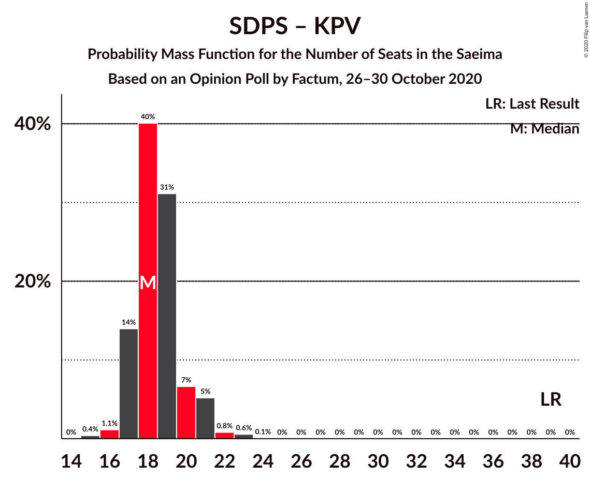

| Number of Seats | Probability | Accumulated | Special Marks |
|:---------------:|:-----------:|:-----------:|:-------------:|
| 15 | 0.4% | 100% |  |
| 16 | 1.1% | 99.6% |  |
| 17 | 14% | 98% |  |
| 18 | 40% | 84% | Median |
| 19 | 31% | 44% |  |
| 20 | 7% | 13% |  |
| 21 | 5% | 7% |  |
| 22 | 0.8% | 1.5% |  |
| 23 | 0.6% | 0.6% |  |
| 24 | 0.1% | 0.1% |  |
| 25 | 0% | 0% |  |
| 26 | 0% | 0% |  |
| 27 | 0% | 0% |  |
| 28 | 0% | 0% |  |
| 29 | 0% | 0% |  |
| 30 | 0% | 0% |  |
| 31 | 0% | 0% |  |
| 32 | 0% | 0% |  |
| 33 | 0% | 0% |  |
| 34 | 0% | 0% |  |
| 35 | 0% | 0% |  |
| 36 | 0% | 0% |  |
| 37 | 0% | 0% |  |
| 38 | 0% | 0% |  |
| 39 | 0% | 0% | Last Result |

## Technical Information

### Opinion Poll

+ **Polling firm:** Factum
+ **Commissioner(s):** —
+ **Fieldwork period:** 26–30 October 2020

### Calculations

+ **Sample size:** 853
+ **Simulations done:** 1,048,576
+ **Error estimate:** 0.99%

