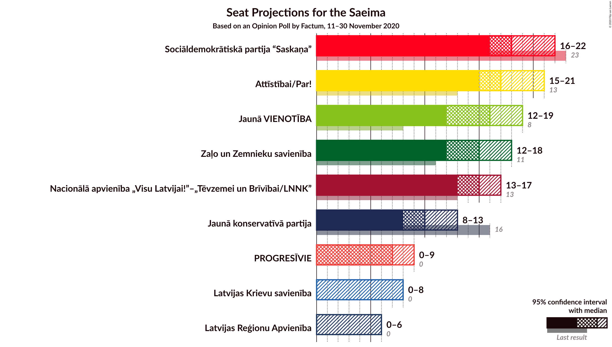

# Opinion Poll by Factum, 11–30 November 2020

<a href="#voting-intentions">Voting Intentions</a> | <a href="#seats">Seats</a> | <a href="#coalitions">Coalitions</a> | <a href="#technical-information">Technical Information</a>

## Voting Intentions

### Confidence Intervals

| Party | Last Result | Poll Result | 80% Confidence Interval | 90% Confidence Interval | 95% Confidence Interval | 99% Confidence Interval |
|:-----:|:-----------:|:-----------:|:-----------------------:|:-----------------------:|:-----------------------:|:-----------------------:|
| Sociāldemokrātiskā partija “Saskaņa” | 19.8% | 15.2% | 13.7–16.9% |13.2–17.4% |12.9–17.8% |12.2–18.7% |
| Attīstībai/Par! | 12.0% | 15.2% | 13.7–16.9% |13.2–17.4% |12.9–17.8% |12.2–18.7% |
| Nacionālā apvienība „Visu Latvijai!”–„Tēvzemei un Brīvībai/LNNK” | 11.0% | 13.1% | 11.7–14.7% |11.3–15.2% |11.0–15.6% |10.3–16.4% |
| Jaunā VIENOTĪBA | 6.7% | 13.1% | 11.7–14.7% |11.3–15.2% |11.0–15.6% |10.3–16.4% |
| Zaļo un Zemnieku savienība | 9.9% | 12.1% | 10.8–13.7% |10.4–14.1% |10.0–14.5% |9.4–15.3% |
| Jaunā konservatīvā partija | 13.6% | 9.1% | 7.9–10.5% |7.6–10.9% |7.3–11.2% |6.8–11.9% |
| PROGRESĪVIE | 2.6% | 6.1% | 5.2–7.3% |4.9–7.7% |4.7–8.0% |4.3–8.6% |
| Latvijas Reģionu Apvienība | 4.1% | 4.0% | 3.3–5.1% |3.1–5.4% |2.9–5.6% |2.6–6.2% |
| Latvijas Krievu savienība | 3.2% | 4.0% | 3.3–5.1% |3.1–5.4% |2.9–5.6% |2.6–6.2% |

*Note:* The poll result column reflects the actual value used in the calculations. Published results may vary slightly, and in addition be rounded to fewer digits.

## Seats

### Confidence Intervals

| Party | Last Result | Median | 80% Confidence Interval | 90% Confidence Interval | 95% Confidence Interval | 99% Confidence Interval |
|:-----:|:-----------:|:------:|:-----------------------:|:-----------------------:|:-----------------------:|:-----------------------:|
| <a href="#sociāldemokrātiskā-partija-“saskaņa”">Sociāldemokrātiskā partija “Saskaņa”</a> | 23 | 18 | 17–21 |17–21 |16–22 |15–23 |
| <a href="#attīstībai/par!">Attīstībai/Par!</a> | 13 | 17 | 15–19 |15–20 |15–21 |14–22 |
| <a href="#nacionālā-apvienība-„visu-latvijai!”–„tēvzemei-un-brīvībai/lnnk”">Nacionālā apvienība „Visu Latvijai!”–„Tēvzemei un Brīvībai/LNNK”</a> | 13 | 15 | 14–16 |13–17 |13–17 |11–19 |
| <a href="#jaunā-vienotība">Jaunā VIENOTĪBA</a> | 8 | 16 | 14–18 |13–18 |12–19 |11–20 |
| <a href="#zaļo-un-zemnieku-savienība">Zaļo un Zemnieku savienība</a> | 11 | 15 | 13–18 |12–18 |12–18 |11–18 |
| <a href="#jaunā-konservatīvā-partija">Jaunā konservatīvā partija</a> | 16 | 10 | 9–13 |9–13 |8–13 |7–13 |
| <a href="#progresīvie">PROGRESĪVIE</a> | 0 | 7 | 6–8 |0–9 |0–9 |0–10 |
| <a href="#latvijas-reģionu-apvienība">Latvijas Reģionu Apvienība</a> | 0 | 0 | 0 |0 |0–6 |0–6 |
| <a href="#latvijas-krievu-savienība">Latvijas Krievu savienība</a> | 0 | 0 | 0–6 |0–7 |0–8 |0–8 |

### Sociāldemokrātiskā partija “Saskaņa”

*For a full overview of the results for this party, see the [Sociāldemokrātiskā partija “Saskaņa”](party-sociāldemokrātiskāpartija“saskaņa”.html) page.*

| Number of Seats | Probability | Accumulated | Special Marks |
|:---------------:|:-----------:|:-----------:|:-------------:|
| 14 | 0.2% | 100% |  |
| 15 | 0.5% | 99.8% |  |
| 16 | 3% | 99.3% |  |
| 17 | 15% | 96% |  |
| 18 | 37% | 81% | Median |
| 19 | 14% | 44% |  |
| 20 | 10% | 31% |  |
| 21 | 15% | 20% |  |
| 22 | 3% | 5% |  |
| 23 | 1.5% | 2% | Last Result |
| 24 | 0.4% | 0.4% |  |
| 25 | 0% | 0% |  |

### Attīstībai/Par!

*For a full overview of the results for this party, see the [Attīstībai/Par!](party-attīstībaipar.html) page.*

| Number of Seats | Probability | Accumulated | Special Marks |
|:---------------:|:-----------:|:-----------:|:-------------:|
| 13 | 0% | 100% | Last Result |
| 14 | 0.9% | 100% |  |
| 15 | 11% | 99.1% |  |
| 16 | 20% | 88% |  |
| 17 | 49% | 68% | Median |
| 18 | 4% | 19% |  |
| 19 | 8% | 15% |  |
| 20 | 4% | 7% |  |
| 21 | 2% | 3% |  |
| 22 | 0.2% | 0.5% |  |
| 23 | 0.2% | 0.3% |  |
| 24 | 0.1% | 0.1% |  |
| 25 | 0% | 0% |  |

### Nacionālā apvienība „Visu Latvijai!”–„Tēvzemei un Brīvībai/LNNK”

*For a full overview of the results for this party, see the [Nacionālā apvienība „Visu Latvijai!”–„Tēvzemei un Brīvībai/LNNK”](party-nacionālāapvienība„visulatvijai”–„tēvzemeiunbrīvībailnnk”.html) page.*

| Number of Seats | Probability | Accumulated | Special Marks |
|:---------------:|:-----------:|:-----------:|:-------------:|
| 11 | 0.5% | 100% |  |
| 12 | 0.6% | 99.5% |  |
| 13 | 8% | 98.8% | Last Result |
| 14 | 37% | 91% |  |
| 15 | 11% | 53% | Median |
| 16 | 33% | 42% |  |
| 17 | 7% | 9% |  |
| 18 | 1.1% | 2% |  |
| 19 | 0.8% | 1.3% |  |
| 20 | 0.4% | 0.5% |  |
| 21 | 0.1% | 0.1% |  |
| 22 | 0% | 0% |  |

### Jaunā VIENOTĪBA

*For a full overview of the results for this party, see the [Jaunā VIENOTĪBA](party-jaunāvienotība.html) page.*

| Number of Seats | Probability | Accumulated | Special Marks |
|:---------------:|:-----------:|:-----------:|:-------------:|
| 8 | 0% | 100% | Last Result |
| 9 | 0% | 100% |  |
| 10 | 0% | 100% |  |
| 11 | 1.1% | 100% |  |
| 12 | 3% | 98.9% |  |
| 13 | 4% | 96% |  |
| 14 | 15% | 92% |  |
| 15 | 15% | 77% |  |
| 16 | 23% | 63% | Median |
| 17 | 27% | 40% |  |
| 18 | 9% | 13% |  |
| 19 | 3% | 4% |  |
| 20 | 0.6% | 0.7% |  |
| 21 | 0.1% | 0.1% |  |
| 22 | 0% | 0% |  |

### Zaļo un Zemnieku savienība

*For a full overview of the results for this party, see the [Zaļo un Zemnieku savienība](party-zaļounzemniekusavienība.html) page.*

| Number of Seats | Probability | Accumulated | Special Marks |
|:---------------:|:-----------:|:-----------:|:-------------:|
| 11 | 1.3% | 100% | Last Result |
| 12 | 9% | 98.7% |  |
| 13 | 16% | 90% |  |
| 14 | 15% | 74% |  |
| 15 | 19% | 58% | Median |
| 16 | 14% | 40% |  |
| 17 | 9% | 26% |  |
| 18 | 17% | 17% |  |
| 19 | 0.1% | 0.1% |  |
| 20 | 0% | 0% |  |

### Jaunā konservatīvā partija

*For a full overview of the results for this party, see the [Jaunā konservatīvā partija](party-jaunākonservatīvāpartija.html) page.*

| Number of Seats | Probability | Accumulated | Special Marks |
|:---------------:|:-----------:|:-----------:|:-------------:|
| 7 | 1.1% | 100% |  |
| 8 | 2% | 98.9% |  |
| 9 | 32% | 97% |  |
| 10 | 19% | 66% | Median |
| 11 | 22% | 46% |  |
| 12 | 12% | 25% |  |
| 13 | 12% | 12% |  |
| 14 | 0.3% | 0.4% |  |
| 15 | 0.1% | 0.1% |  |
| 16 | 0% | 0% | Last Result |

### PROGRESĪVIE

*For a full overview of the results for this party, see the [PROGRESĪVIE](party-progresīvie.html) page.*

| Number of Seats | Probability | Accumulated | Special Marks |
|:---------------:|:-----------:|:-----------:|:-------------:|
| 0 | 9% | 100% | Last Result |
| 1 | 0% | 91% |  |
| 2 | 0% | 91% |  |
| 3 | 0% | 91% |  |
| 4 | 0% | 91% |  |
| 5 | 0.1% | 91% |  |
| 6 | 6% | 91% |  |
| 7 | 54% | 85% | Median |
| 8 | 23% | 31% |  |
| 9 | 7% | 8% |  |
| 10 | 0.3% | 0.5% |  |
| 11 | 0.2% | 0.2% |  |
| 12 | 0% | 0% |  |

### Latvijas Reģionu Apvienība

*For a full overview of the results for this party, see the [Latvijas Reģionu Apvienība](party-latvijasreģionuapvienība.html) page.*

| Number of Seats | Probability | Accumulated | Special Marks |
|:---------------:|:-----------:|:-----------:|:-------------:|
| 0 | 97% | 100% | Last Result, Median |
| 1 | 0% | 3% |  |
| 2 | 0% | 3% |  |
| 3 | 0% | 3% |  |
| 4 | 0% | 3% |  |
| 5 | 0% | 3% |  |
| 6 | 3% | 3% |  |
| 7 | 0.3% | 0.3% |  |
| 8 | 0% | 0% |  |

### Latvijas Krievu savienība

*For a full overview of the results for this party, see the [Latvijas Krievu savienība](party-latvijaskrievusavienība.html) page.*

| Number of Seats | Probability | Accumulated | Special Marks |
|:---------------:|:-----------:|:-----------:|:-------------:|
| 0 | 85% | 100% | Last Result, Median |
| 1 | 0% | 15% |  |
| 2 | 0% | 15% |  |
| 3 | 0% | 15% |  |
| 4 | 0% | 15% |  |
| 5 | 5% | 15% |  |
| 6 | 3% | 11% |  |
| 7 | 4% | 7% |  |
| 8 | 3% | 3% |  |
| 9 | 0% | 0% |  |

## Coalitions

### Confidence Intervals

| Coalition | Last Result | Median | Majority? | 80% Confidence Interval | 90% Confidence Interval | 95% Confidence Interval | 99% Confidence Interval |
|:---------:|:-----------:|:------:|:---------:|:-----------------------:|:-----------------------:|:-----------------------:|:-----------------------:|
| Attīstībai/Par! – Jaunā VIENOTĪBA – Nacionālā apvienība „Visu Latvijai!”–„Tēvzemei un Brīvībai/LNNK” – Zaļo un Zemnieku savienība – Jaunā konservatīvā partija | 61 | 74 | 100% | 70–76 | 69–79 | 68–81 | 64–82 |
| Attīstībai/Par! – Jaunā VIENOTĪBA – Nacionālā apvienība „Visu Latvijai!”–„Tēvzemei un Brīvībai/LNNK” – Zaļo un Zemnieku savienība | 45 | 63 | 100% | 59–66 | 58–68 | 57–69 | 55–72 |
| Attīstībai/Par! – Nacionālā apvienība „Visu Latvijai!”–„Tēvzemei un Brīvībai/LNNK” – Zaļo un Zemnieku savienība – Jaunā konservatīvā partija | 53 | 57 | 99.6% | 54–61 | 53–63 | 53–64 | 51–65 |
| Attīstībai/Par! – Jaunā VIENOTĪBA – Nacionālā apvienība „Visu Latvijai!”–„Tēvzemei un Brīvībai/LNNK” – Jaunā konservatīvā partija | 50 | 58 | 99.5% | 56–62 | 55–63 | 53–63 | 50–65 |
| Jaunā VIENOTĪBA – Nacionālā apvienība „Visu Latvijai!”–„Tēvzemei un Brīvībai/LNNK” – Zaļo un Zemnieku savienība – Jaunā konservatīvā partija | 48 | 56 | 98% | 53–59 | 52–61 | 51–62 | 48–64 |
| Attīstībai/Par! – Nacionālā apvienība „Visu Latvijai!”–„Tēvzemei un Brīvībai/LNNK” – Zaļo un Zemnieku savienība | 37 | 47 | 8% | 44–50 | 42–51 | 42–53 | 41–55 |
| Attīstībai/Par! – Sociāldemokrātiskā partija “Saskaņa” – Jaunā konservatīvā partija | 52 | 46 | 6% | 43–49 | 42–51 | 42–52 | 40–55 |
| Jaunā VIENOTĪBA – Nacionālā apvienība „Visu Latvijai!”–„Tēvzemei un Brīvībai/LNNK” – Zaļo un Zemnieku savienība | 32 | 46 | 4% | 43–49 | 41–50 | 41–51 | 38–52 |
| Nacionālā apvienība „Visu Latvijai!”–„Tēvzemei un Brīvībai/LNNK” – Zaļo un Zemnieku savienība – Jaunā konservatīvā partija | 40 | 40 | 0% | 38–43 | 37–45 | 36–45 | 34–47 |
| Attīstībai/Par! – Sociāldemokrātiskā partija “Saskaņa” | 36 | 35 | 0% | 33–38 | 32–40 | 32–40 | 31–43 |

### Attīstībai/Par! – Jaunā VIENOTĪBA – Nacionālā apvienība „Visu Latvijai!”–„Tēvzemei un Brīvībai/LNNK” – Zaļo un Zemnieku savienība – Jaunā konservatīvā partija

| Number of Seats | Probability | Accumulated | Special Marks |
|:---------------:|:-----------:|:-----------:|:-------------:|
| 61 | 0% | 100% | Last Result |
| 62 | 0.2% | 100% |  |
| 63 | 0.2% | 99.8% |  |
| 64 | 0.2% | 99.6% |  |
| 65 | 0.5% | 99.4% |  |
| 66 | 0.4% | 98.9% |  |
| 67 | 0.6% | 98% |  |
| 68 | 2% | 98% |  |
| 69 | 4% | 96% |  |
| 70 | 5% | 92% |  |
| 71 | 10% | 86% |  |
| 72 | 15% | 76% |  |
| 73 | 9% | 61% | Median |
| 74 | 21% | 53% |  |
| 75 | 19% | 31% |  |
| 76 | 4% | 12% |  |
| 77 | 1.1% | 8% |  |
| 78 | 1.0% | 7% |  |
| 79 | 2% | 6% |  |
| 80 | 2% | 5% |  |
| 81 | 2% | 3% |  |
| 82 | 0.5% | 0.6% |  |
| 83 | 0.1% | 0.1% |  |
| 84 | 0% | 0% |  |

### Attīstībai/Par! – Jaunā VIENOTĪBA – Nacionālā apvienība „Visu Latvijai!”–„Tēvzemei un Brīvībai/LNNK” – Zaļo un Zemnieku savienība

| Number of Seats | Probability | Accumulated | Special Marks |
|:---------------:|:-----------:|:-----------:|:-------------:|
| 45 | 0% | 100% | Last Result |
| 46 | 0% | 100% |  |
| 47 | 0% | 100% |  |
| 48 | 0% | 100% |  |
| 49 | 0% | 100% |  |
| 50 | 0% | 100% |  |
| 51 | 0.1% | 100% | Majority |
| 52 | 0.1% | 99.9% |  |
| 53 | 0.1% | 99.8% |  |
| 54 | 0.2% | 99.7% |  |
| 55 | 0.5% | 99.5% |  |
| 56 | 0.7% | 99.0% |  |
| 57 | 2% | 98% |  |
| 58 | 2% | 96% |  |
| 59 | 7% | 94% |  |
| 60 | 7% | 87% |  |
| 61 | 9% | 80% |  |
| 62 | 14% | 71% |  |
| 63 | 19% | 57% | Median |
| 64 | 12% | 38% |  |
| 65 | 5% | 26% |  |
| 66 | 13% | 21% |  |
| 67 | 2% | 8% |  |
| 68 | 3% | 6% |  |
| 69 | 0.6% | 3% |  |
| 70 | 1.5% | 2% |  |
| 71 | 0.2% | 0.7% |  |
| 72 | 0.5% | 0.5% |  |
| 73 | 0% | 0.1% |  |
| 74 | 0% | 0% |  |

### Attīstībai/Par! – Nacionālā apvienība „Visu Latvijai!”–„Tēvzemei un Brīvībai/LNNK” – Zaļo un Zemnieku savienība – Jaunā konservatīvā partija

| Number of Seats | Probability | Accumulated | Special Marks |
|:---------------:|:-----------:|:-----------:|:-------------:|
| 48 | 0.1% | 100% |  |
| 49 | 0.1% | 99.9% |  |
| 50 | 0.2% | 99.7% |  |
| 51 | 0.8% | 99.6% | Majority |
| 52 | 1.1% | 98.8% |  |
| 53 | 4% | 98% | Last Result |
| 54 | 5% | 94% |  |
| 55 | 19% | 88% |  |
| 56 | 9% | 70% |  |
| 57 | 13% | 61% | Median |
| 58 | 11% | 47% |  |
| 59 | 14% | 37% |  |
| 60 | 10% | 23% |  |
| 61 | 3% | 13% |  |
| 62 | 4% | 9% |  |
| 63 | 2% | 6% |  |
| 64 | 3% | 3% |  |
| 65 | 0.3% | 0.7% |  |
| 66 | 0.3% | 0.4% |  |
| 67 | 0.1% | 0.1% |  |
| 68 | 0% | 0.1% |  |
| 69 | 0% | 0% |  |

### Attīstībai/Par! – Jaunā VIENOTĪBA – Nacionālā apvienība „Visu Latvijai!”–„Tēvzemei un Brīvībai/LNNK” – Jaunā konservatīvā partija

| Number of Seats | Probability | Accumulated | Special Marks |
|:---------------:|:-----------:|:-----------:|:-------------:|
| 49 | 0.1% | 100% |  |
| 50 | 0.4% | 99.9% | Last Result |
| 51 | 0.3% | 99.5% | Majority |
| 52 | 0.5% | 99.2% |  |
| 53 | 1.2% | 98.6% |  |
| 54 | 2% | 97% |  |
| 55 | 5% | 96% |  |
| 56 | 11% | 90% |  |
| 57 | 22% | 79% |  |
| 58 | 23% | 57% | Median |
| 59 | 5% | 34% |  |
| 60 | 6% | 29% |  |
| 61 | 10% | 23% |  |
| 62 | 6% | 13% |  |
| 63 | 6% | 8% |  |
| 64 | 1.1% | 2% |  |
| 65 | 0.6% | 0.8% |  |
| 66 | 0.1% | 0.2% |  |
| 67 | 0.1% | 0.1% |  |
| 68 | 0% | 0.1% |  |
| 69 | 0% | 0% |  |

### Jaunā VIENOTĪBA – Nacionālā apvienība „Visu Latvijai!”–„Tēvzemei un Brīvībai/LNNK” – Zaļo un Zemnieku savienība – Jaunā konservatīvā partija

| Number of Seats | Probability | Accumulated | Special Marks |
|:---------------:|:-----------:|:-----------:|:-------------:|
| 45 | 0.1% | 100% |  |
| 46 | 0.2% | 99.9% |  |
| 47 | 0.2% | 99.8% |  |
| 48 | 0.3% | 99.6% | Last Result |
| 49 | 0.5% | 99.3% |  |
| 50 | 0.4% | 98.8% |  |
| 51 | 1.2% | 98% | Majority |
| 52 | 5% | 97% |  |
| 53 | 4% | 92% |  |
| 54 | 5% | 87% |  |
| 55 | 19% | 83% |  |
| 56 | 16% | 64% | Median |
| 57 | 16% | 48% |  |
| 58 | 19% | 32% |  |
| 59 | 4% | 13% |  |
| 60 | 3% | 9% |  |
| 61 | 3% | 6% |  |
| 62 | 2% | 3% |  |
| 63 | 0.5% | 1.2% |  |
| 64 | 0.5% | 0.8% |  |
| 65 | 0.3% | 0.3% |  |
| 66 | 0% | 0% |  |

### Attīstībai/Par! – Nacionālā apvienība „Visu Latvijai!”–„Tēvzemei un Brīvībai/LNNK” – Zaļo un Zemnieku savienība

| Number of Seats | Probability | Accumulated | Special Marks |
|:---------------:|:-----------:|:-----------:|:-------------:|
| 37 | 0% | 100% | Last Result |
| 38 | 0% | 100% |  |
| 39 | 0.1% | 100% |  |
| 40 | 0.3% | 99.8% |  |
| 41 | 1.4% | 99.5% |  |
| 42 | 4% | 98% |  |
| 43 | 4% | 95% |  |
| 44 | 9% | 91% |  |
| 45 | 11% | 82% |  |
| 46 | 17% | 71% |  |
| 47 | 8% | 54% | Median |
| 48 | 11% | 46% |  |
| 49 | 21% | 35% |  |
| 50 | 5% | 13% |  |
| 51 | 4% | 8% | Majority |
| 52 | 1.1% | 5% |  |
| 53 | 2% | 3% |  |
| 54 | 0.3% | 1.0% |  |
| 55 | 0.5% | 0.6% |  |
| 56 | 0.1% | 0.1% |  |
| 57 | 0% | 0% |  |

### Attīstībai/Par! – Sociāldemokrātiskā partija “Saskaņa” – Jaunā konservatīvā partija

| Number of Seats | Probability | Accumulated | Special Marks |
|:---------------:|:-----------:|:-----------:|:-------------:|
| 38 | 0.1% | 100% |  |
| 39 | 0.2% | 99.9% |  |
| 40 | 0.3% | 99.7% |  |
| 41 | 0.7% | 99.4% |  |
| 42 | 7% | 98.7% |  |
| 43 | 6% | 92% |  |
| 44 | 14% | 85% |  |
| 45 | 10% | 72% | Median |
| 46 | 16% | 62% |  |
| 47 | 16% | 46% |  |
| 48 | 12% | 30% |  |
| 49 | 8% | 17% |  |
| 50 | 3% | 9% |  |
| 51 | 4% | 6% | Majority |
| 52 | 1.5% | 3% | Last Result |
| 53 | 0.4% | 1.3% |  |
| 54 | 0.3% | 0.9% |  |
| 55 | 0.5% | 0.6% |  |
| 56 | 0.2% | 0.2% |  |
| 57 | 0% | 0% |  |

### Jaunā VIENOTĪBA – Nacionālā apvienība „Visu Latvijai!”–„Tēvzemei un Brīvībai/LNNK” – Zaļo un Zemnieku savienība

| Number of Seats | Probability | Accumulated | Special Marks |
|:---------------:|:-----------:|:-----------:|:-------------:|
| 32 | 0% | 100% | Last Result |
| 33 | 0% | 100% |  |
| 34 | 0% | 100% |  |
| 35 | 0.1% | 100% |  |
| 36 | 0.2% | 99.9% |  |
| 37 | 0.1% | 99.7% |  |
| 38 | 0.1% | 99.6% |  |
| 39 | 0.6% | 99.5% |  |
| 40 | 0.9% | 98.9% |  |
| 41 | 3% | 98% |  |
| 42 | 4% | 95% |  |
| 43 | 8% | 91% |  |
| 44 | 10% | 83% |  |
| 45 | 14% | 73% |  |
| 46 | 23% | 59% | Median |
| 47 | 11% | 36% |  |
| 48 | 7% | 25% |  |
| 49 | 12% | 18% |  |
| 50 | 2% | 6% |  |
| 51 | 3% | 4% | Majority |
| 52 | 0.3% | 0.7% |  |
| 53 | 0.2% | 0.3% |  |
| 54 | 0.1% | 0.1% |  |
| 55 | 0% | 0% |  |

### Nacionālā apvienība „Visu Latvijai!”–„Tēvzemei un Brīvībai/LNNK” – Zaļo un Zemnieku savienība – Jaunā konservatīvā partija

| Number of Seats | Probability | Accumulated | Special Marks |
|:---------------:|:-----------:|:-----------:|:-------------:|
| 32 | 0.1% | 100% |  |
| 33 | 0.1% | 99.9% |  |
| 34 | 0.4% | 99.8% |  |
| 35 | 0.8% | 99.4% |  |
| 36 | 2% | 98.6% |  |
| 37 | 6% | 96% |  |
| 38 | 18% | 90% |  |
| 39 | 10% | 73% |  |
| 40 | 16% | 63% | Last Result, Median |
| 41 | 10% | 47% |  |
| 42 | 12% | 37% |  |
| 43 | 15% | 25% |  |
| 44 | 5% | 10% |  |
| 45 | 3% | 5% |  |
| 46 | 1.1% | 2% |  |
| 47 | 0.8% | 1.0% |  |
| 48 | 0.2% | 0.2% |  |
| 49 | 0% | 0% |  |

### Attīstībai/Par! – Sociāldemokrātiskā partija “Saskaņa”

| Number of Seats | Probability | Accumulated | Special Marks |
|:---------------:|:-----------:|:-----------:|:-------------:|
| 29 | 0.1% | 100% |  |
| 30 | 0.2% | 99.9% |  |
| 31 | 0.5% | 99.8% |  |
| 32 | 7% | 99.3% |  |
| 33 | 6% | 92% |  |
| 34 | 12% | 86% |  |
| 35 | 26% | 74% | Median |
| 36 | 13% | 48% | Last Result |
| 37 | 11% | 35% |  |
| 38 | 15% | 24% |  |
| 39 | 4% | 9% |  |
| 40 | 3% | 5% |  |
| 41 | 1.2% | 2% |  |
| 42 | 0.6% | 1.1% |  |
| 43 | 0.3% | 0.5% |  |
| 44 | 0.2% | 0.3% |  |
| 45 | 0% | 0% |  |

## Technical Information

### Opinion Poll

+ **Polling firm:** Factum
+ **Commissioner(s):** —
+ **Fieldwork period:** 11–30 November 2020

### Calculations

+ **Sample size:** 817
+ **Simulations done:** 1,048,576
+ **Error estimate:** 2.01%

