# Opinion Poll by SKDS for Latvijas Televīzija, 1–30 November 2020

<a href="#voting-intentions">Voting Intentions</a> | <a href="#seats">Seats</a> | <a href="#coalitions">Coalitions</a> | <a href="#technical-information">Technical Information</a>

## Voting Intentions

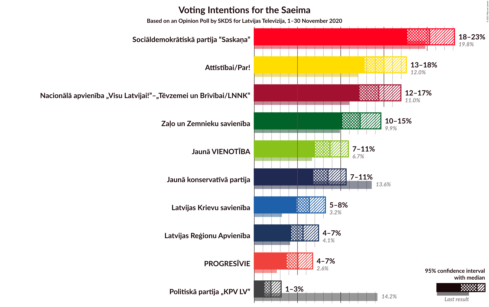

### Confidence Intervals

| Party | Last Result | Poll Result | 80% Confidence Interval | 90% Confidence Interval | 95% Confidence Interval | 99% Confidence Interval |
|:-----:|:-----------:|:-----------:|:-----------------------:|:-----------------------:|:-----------------------:|:-----------------------:|
| Sociāldemokrātiskā partija “Saskaņa” | 19.8% | 20.3% | 18.6–22.2% |18.1–22.7% |17.7–23.2% |16.9–24.1% |
| Attīstībai/Par! | 12.0% | 15.0% | 13.5–16.7% |13.1–17.2% |12.7–17.6% |12.1–18.4% |
| Nacionālā apvienība „Visu Latvijai!”–„Tēvzemei un Brīvībai/LNNK” | 11.0% | 14.4% | 12.9–16.1% |12.5–16.6% |12.2–17.0% |11.5–17.8% |
| Zaļo un Zemnieku savienība | 9.9% | 12.2% | 10.9–13.8% |10.5–14.3% |10.2–14.6% |9.6–15.4% |
| Jaunā VIENOTĪBA | 6.7% | 8.8% | 7.6–10.2% |7.3–10.5% |7.0–10.9% |6.5–11.6% |
| Jaunā konservatīvā partija | 13.6% | 8.5% | 7.4–9.9% |7.1–10.3% |6.8–10.6% |6.3–11.3% |
| Latvijas Krievu savienība | 3.2% | 6.4% | 5.4–7.6% |5.1–7.9% |4.9–8.2% |4.5–8.9% |
| Latvijas Reģionu Apvienība | 4.1% | 5.6% | 4.7–6.8% |4.5–7.1% |4.3–7.4% |3.9–8.0% |
| PROGRESĪVIE | 2.6% | 5.0% | 4.2–6.2% |3.9–6.5% |3.7–6.8% |3.4–7.3% |
| Politiskā partija „KPV LV” | 14.2% | 1.9% | 1.4–2.7% |1.3–2.9% |1.2–3.1% |1.0–3.5% |

*Note:* The poll result column reflects the actual value used in the calculations. Published results may vary slightly, and in addition be rounded to fewer digits.

## Seats

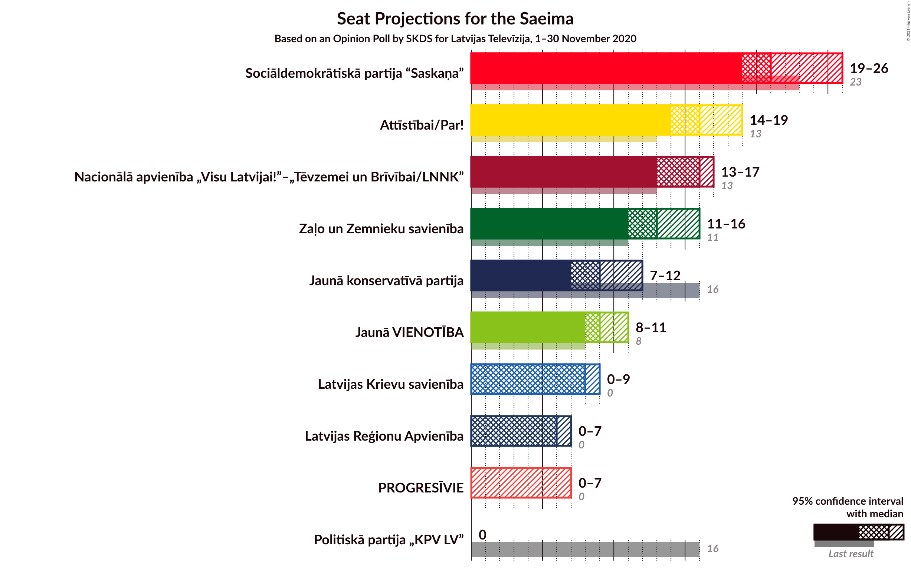

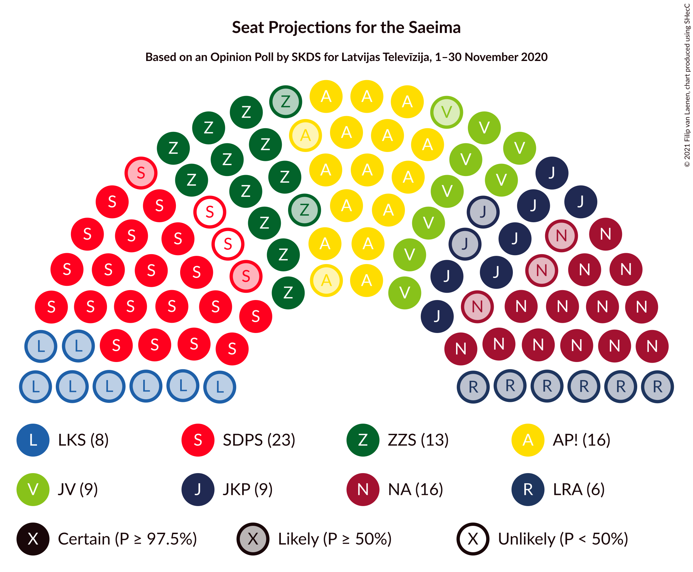

### Confidence Intervals

| Party | Last Result | Median | 80% Confidence Interval | 90% Confidence Interval | 95% Confidence Interval | 99% Confidence Interval |
|:-----:|:-----------:|:------:|:-----------------------:|:-----------------------:|:-----------------------:|:-----------------------:|
| <a href="#sociāldemokrātiskā-partija-“saskaņa”">Sociāldemokrātiskā partija “Saskaņa”</a> | 23 | 21 | 19–23 |19–25 |19–26 |17–27 |
| <a href="#attīstībai/par!">Attīstībai/Par!</a> | 13 | 16 | 14–17 |14–18 |14–19 |14–20 |
| <a href="#nacionālā-apvienība-„visu-latvijai!”–„tēvzemei-un-brīvībai/lnnk”">Nacionālā apvienība „Visu Latvijai!”–„Tēvzemei un Brīvībai/LNNK”</a> | 13 | 16 | 14–17 |13–17 |13–17 |12–19 |
| <a href="#zaļo-un-zemnieku-savienība">Zaļo un Zemnieku savienība</a> | 11 | 13 | 11–14 |11–16 |11–16 |11–17 |
| <a href="#jaunā-vienotība">Jaunā VIENOTĪBA</a> | 8 | 9 | 8–11 |8–11 |8–11 |7–11 |
| <a href="#jaunā-konservatīvā-partija">Jaunā konservatīvā partija</a> | 16 | 9 | 7–11 |7–11 |7–12 |6–13 |
| <a href="#latvijas-krievu-savienība">Latvijas Krievu savienība</a> | 0 | 8 | 6–8 |5–8 |0–9 |0–9 |
| <a href="#latvijas-reģionu-apvienība">Latvijas Reģionu Apvienība</a> | 0 | 6 | 0–7 |0–7 |0–7 |0–8 |
| <a href="#progresīvie">PROGRESĪVIE</a> | 0 | 0 | 0–7 |0–7 |0–7 |0–7 |
| <a href="#politiskā-partija-„kpv-lv”">Politiskā partija „KPV LV”</a> | 16 | 0 | 0 |0 |0 |0 |

### Sociāldemokrātiskā partija “Saskaņa”

*For a full overview of the results for this party, see the [Sociāldemokrātiskā partija “Saskaņa”](party-sociāldemokrātiskāpartija“saskaņa”.html) page.*

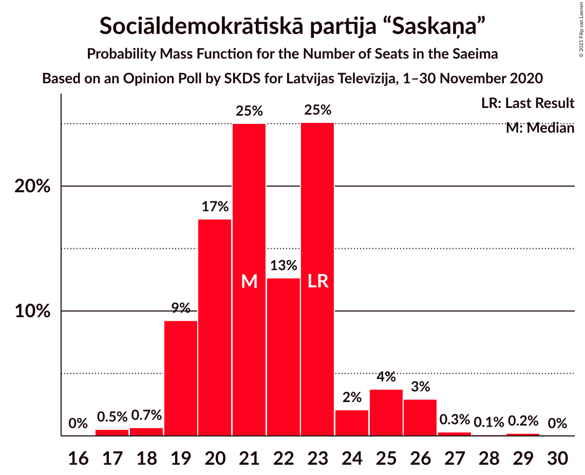

| Number of Seats | Probability | Accumulated | Special Marks |
|:---------------:|:-----------:|:-----------:|:-------------:|
| 17 | 0.5% | 100% |  |
| 18 | 0.7% | 99.5% |  |
| 19 | 9% | 98.8% |  |
| 20 | 17% | 90% |  |
| 21 | 25% | 72% | Median |
| 22 | 13% | 47% |  |
| 23 | 25% | 35% | Last Result |
| 24 | 2% | 9% |  |
| 25 | 4% | 7% |  |
| 26 | 3% | 4% |  |
| 27 | 0.3% | 0.6% |  |
| 28 | 0.1% | 0.3% |  |
| 29 | 0.2% | 0.2% |  |
| 30 | 0% | 0% |  |

### Attīstībai/Par!

*For a full overview of the results for this party, see the [Attīstībai/Par!](party-attīstībaipar.html) page.*

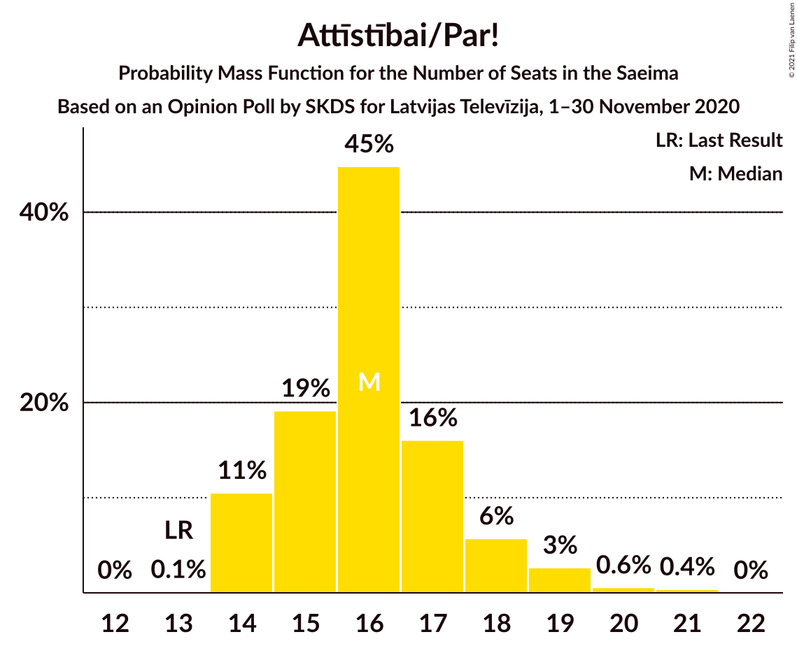

| Number of Seats | Probability | Accumulated | Special Marks |
|:---------------:|:-----------:|:-----------:|:-------------:|
| 12 | 0% | 100% |  |
| 13 | 0.1% | 99.9% | Last Result |
| 14 | 11% | 99.8% |  |
| 15 | 19% | 89% |  |
| 16 | 45% | 70% | Median |
| 17 | 16% | 25% |  |
| 18 | 6% | 9% |  |
| 19 | 3% | 4% |  |
| 20 | 0.6% | 1.0% |  |
| 21 | 0.4% | 0.4% |  |
| 22 | 0% | 0% |  |

### Nacionālā apvienība „Visu Latvijai!”–„Tēvzemei un Brīvībai/LNNK”

*For a full overview of the results for this party, see the [Nacionālā apvienība „Visu Latvijai!”–„Tēvzemei un Brīvībai/LNNK”](party-nacionālāapvienība„visulatvijai”–„tēvzemeiunbrīvībailnnk”.html) page.*

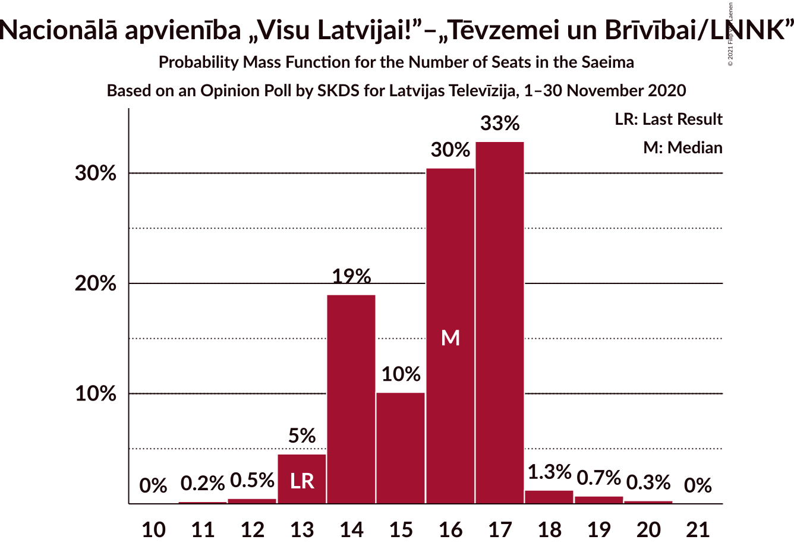

| Number of Seats | Probability | Accumulated | Special Marks |
|:---------------:|:-----------:|:-----------:|:-------------:|
| 11 | 0.2% | 100% |  |
| 12 | 0.5% | 99.8% |  |
| 13 | 5% | 99.3% | Last Result |
| 14 | 19% | 95% |  |
| 15 | 10% | 76% |  |
| 16 | 30% | 66% | Median |
| 17 | 33% | 35% |  |
| 18 | 1.3% | 2% |  |
| 19 | 0.7% | 1.0% |  |
| 20 | 0.3% | 0.3% |  |
| 21 | 0% | 0% |  |

### Zaļo un Zemnieku savienība

*For a full overview of the results for this party, see the [Zaļo un Zemnieku savienība](party-zaļounzemniekusavienība.html) page.*

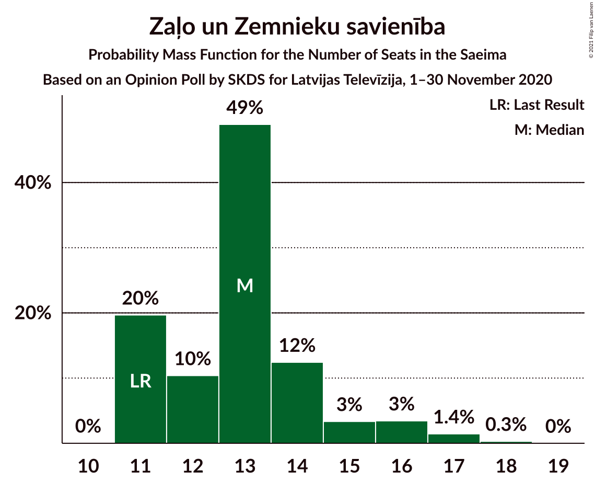

| Number of Seats | Probability | Accumulated | Special Marks |
|:---------------:|:-----------:|:-----------:|:-------------:|
| 10 | 0% | 100% |  |
| 11 | 20% | 99.9% | Last Result |
| 12 | 10% | 80% |  |
| 13 | 49% | 70% | Median |
| 14 | 12% | 21% |  |
| 15 | 3% | 9% |  |
| 16 | 3% | 5% |  |
| 17 | 1.4% | 2% |  |
| 18 | 0.3% | 0.3% |  |
| 19 | 0% | 0% |  |

### Jaunā VIENOTĪBA

*For a full overview of the results for this party, see the [Jaunā VIENOTĪBA](party-jaunāvienotība.html) page.*

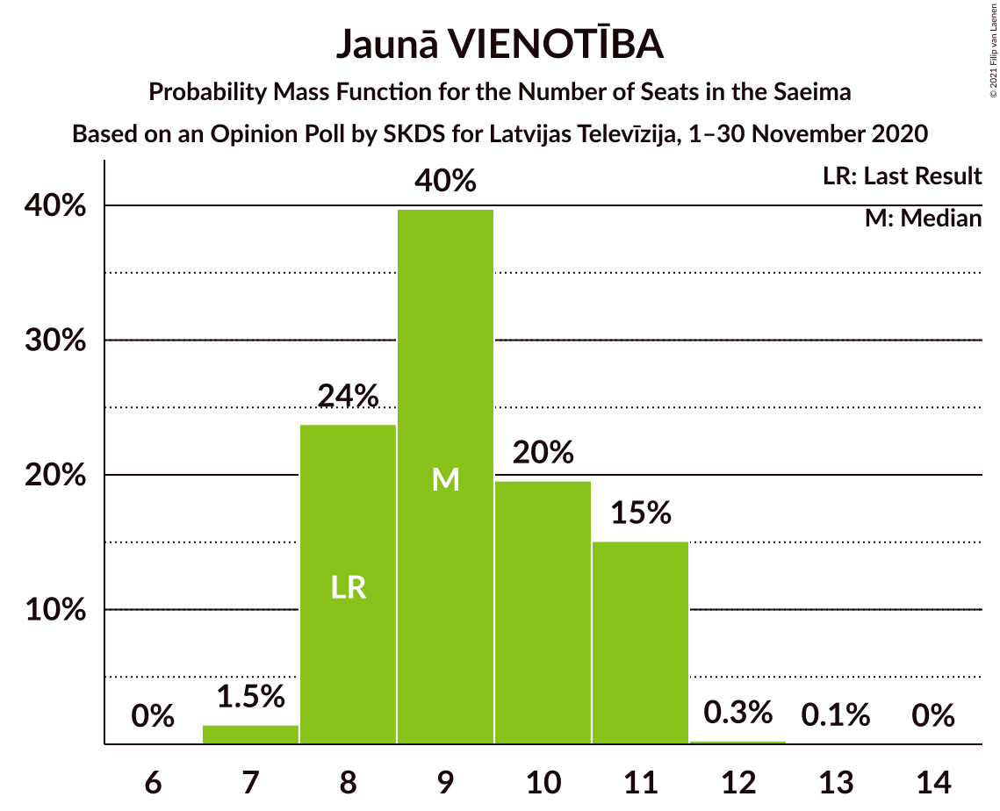

| Number of Seats | Probability | Accumulated | Special Marks |
|:---------------:|:-----------:|:-----------:|:-------------:|
| 7 | 1.5% | 100% |  |
| 8 | 24% | 98.5% | Last Result |
| 9 | 40% | 75% | Median |
| 10 | 20% | 35% |  |
| 11 | 15% | 15% |  |
| 12 | 0.3% | 0.4% |  |
| 13 | 0.1% | 0.1% |  |
| 14 | 0% | 0% |  |

### Jaunā konservatīvā partija

*For a full overview of the results for this party, see the [Jaunā konservatīvā partija](party-jaunākonservatīvāpartija.html) page.*

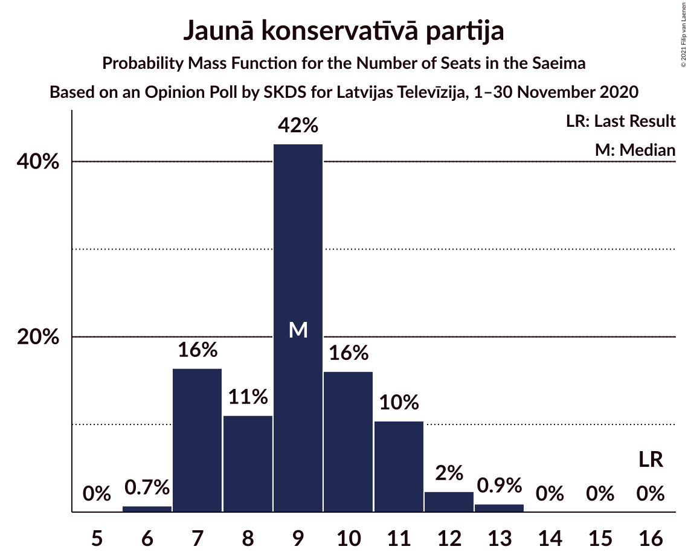

| Number of Seats | Probability | Accumulated | Special Marks |
|:---------------:|:-----------:|:-----------:|:-------------:|
| 6 | 0.7% | 100% |  |
| 7 | 16% | 99.3% |  |
| 8 | 11% | 83% |  |
| 9 | 42% | 72% | Median |
| 10 | 16% | 30% |  |
| 11 | 10% | 14% |  |
| 12 | 2% | 3% |  |
| 13 | 0.9% | 0.9% |  |
| 14 | 0% | 0% |  |
| 15 | 0% | 0% |  |
| 16 | 0% | 0% | Last Result |

### Latvijas Krievu savienība

*For a full overview of the results for this party, see the [Latvijas Krievu savienība](party-latvijaskrievusavienība.html) page.*

| Number of Seats | Probability | Accumulated | Special Marks |
|:---------------:|:-----------:|:-----------:|:-------------:|
| 0 | 3% | 100% | Last Result |
| 1 | 0% | 97% |  |
| 2 | 0% | 97% |  |
| 3 | 0% | 97% |  |
| 4 | 0% | 97% |  |
| 5 | 4% | 97% |  |
| 6 | 9% | 92% |  |
| 7 | 24% | 84% |  |
| 8 | 56% | 59% | Median |
| 9 | 4% | 4% |  |
| 10 | 0.2% | 0.3% |  |
| 11 | 0% | 0% |  |

### Latvijas Reģionu Apvienība

*For a full overview of the results for this party, see the [Latvijas Reģionu Apvienība](party-latvijasreģionuapvienība.html) page.*

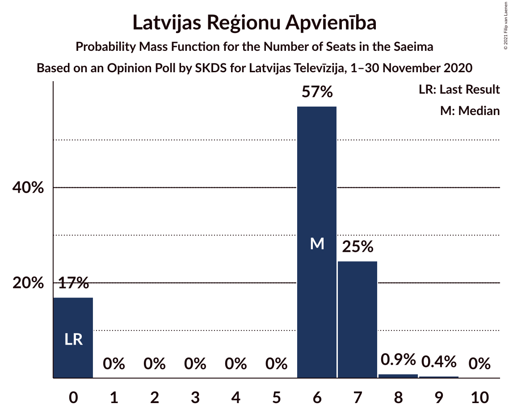

| Number of Seats | Probability | Accumulated | Special Marks |
|:---------------:|:-----------:|:-----------:|:-------------:|
| 0 | 17% | 100% | Last Result |
| 1 | 0% | 83% |  |
| 2 | 0% | 83% |  |
| 3 | 0% | 83% |  |
| 4 | 0% | 83% |  |
| 5 | 0% | 83% |  |
| 6 | 57% | 83% | Median |
| 7 | 25% | 26% |  |
| 8 | 0.9% | 1.3% |  |
| 9 | 0.4% | 0.4% |  |
| 10 | 0% | 0% |  |

### PROGRESĪVIE

*For a full overview of the results for this party, see the [PROGRESĪVIE](party-progresīvie.html) page.*

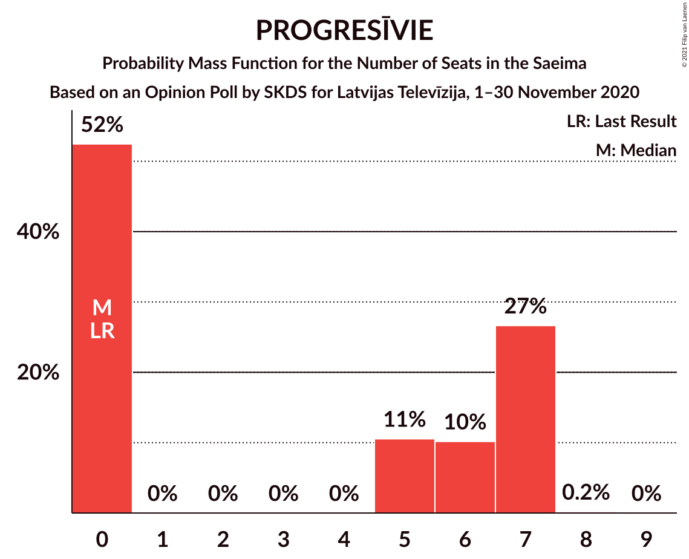

| Number of Seats | Probability | Accumulated | Special Marks |
|:---------------:|:-----------:|:-----------:|:-------------:|
| 0 | 52% | 100% | Last Result, Median |
| 1 | 0% | 48% |  |
| 2 | 0% | 48% |  |
| 3 | 0% | 48% |  |
| 4 | 0% | 48% |  |
| 5 | 11% | 48% |  |
| 6 | 10% | 37% |  |
| 7 | 27% | 27% |  |
| 8 | 0.2% | 0.2% |  |
| 9 | 0% | 0% |  |

### Politiskā partija „KPV LV”

*For a full overview of the results for this party, see the [Politiskā partija „KPV LV”](party-politiskāpartija„kpvlv”.html) page.*

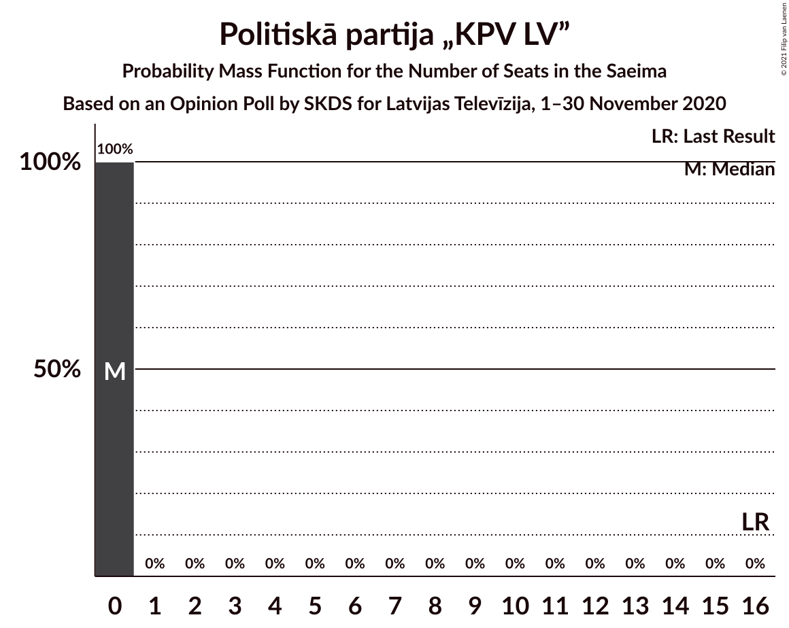

| Number of Seats | Probability | Accumulated | Special Marks |
|:---------------:|:-----------:|:-----------:|:-------------:|
| 0 | 100% | 100% | Median |
| 1 | 0% | 0% |  |
| 2 | 0% | 0% |  |
| 3 | 0% | 0% |  |
| 4 | 0% | 0% |  |
| 5 | 0% | 0% |  |
| 6 | 0% | 0% |  |
| 7 | 0% | 0% |  |
| 8 | 0% | 0% |  |
| 9 | 0% | 0% |  |
| 10 | 0% | 0% |  |
| 11 | 0% | 0% |  |
| 12 | 0% | 0% |  |
| 13 | 0% | 0% |  |
| 14 | 0% | 0% |  |
| 15 | 0% | 0% |  |
| 16 | 0% | 0% | Last Result |

## Coalitions

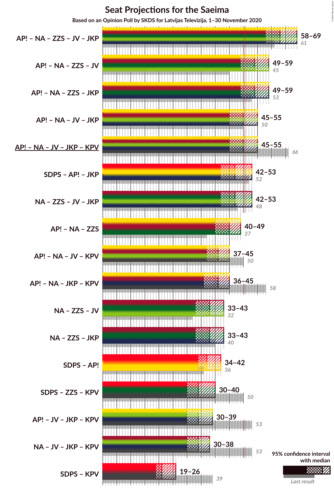

### Confidence Intervals

| Coalition | Last Result | Median | Majority? | 80% Confidence Interval | 90% Confidence Interval | 95% Confidence Interval | 99% Confidence Interval |
|:---------:|:-----------:|:------:|:---------:|:-----------------------:|:-----------------------:|:-----------------------:|:-----------------------:|
| Attīstībai/Par! – Nacionālā apvienība „Visu Latvijai!”–„Tēvzemei un Brīvībai/LNNK” – Zaļo un Zemnieku savienība – Jaunā VIENOTĪBA – Jaunā konservatīvā partija | 61 | 63 | 100% | 58–66 | 58–68 | 58–69 | 57–71 |
| Attīstībai/Par! – Nacionālā apvienība „Visu Latvijai!”–„Tēvzemei un Brīvībai/LNNK” – Zaļo un Zemnieku savienība – Jaunā VIENOTĪBA | 45 | 54 | 94% | 51–57 | 50–59 | 49–59 | 47–61 |
| Attīstībai/Par! – Nacionālā apvienība „Visu Latvijai!”–„Tēvzemei un Brīvībai/LNNK” – Zaļo un Zemnieku savienība – Jaunā konservatīvā partija | 53 | 54 | 86% | 50–57 | 50–59 | 49–59 | 47–61 |
| Attīstībai/Par! – Nacionālā apvienība „Visu Latvijai!”–„Tēvzemei un Brīvībai/LNNK” – Jaunā VIENOTĪBA – Jaunā konservatīvā partija | 50 | 50 | 40% | 47–53 | 46–54 | 45–55 | 44–57 |
| Attīstībai/Par! – Nacionālā apvienība „Visu Latvijai!”–„Tēvzemei un Brīvībai/LNNK” – Jaunā VIENOTĪBA – Jaunā konservatīvā partija – Politiskā partija „KPV LV” | 66 | 50 | 40% | 47–53 | 46–54 | 45–55 | 44–57 |
| Sociāldemokrātiskā partija “Saskaņa” – Attīstībai/Par! – Jaunā konservatīvā partija | 52 | 47 | 7% | 44–49 | 43–51 | 42–53 | 41–55 |
| Nacionālā apvienība „Visu Latvijai!”–„Tēvzemei un Brīvībai/LNNK” – Zaļo un Zemnieku savienība – Jaunā VIENOTĪBA – Jaunā konservatīvā partija | 48 | 47 | 8% | 43–50 | 42–52 | 42–53 | 41–54 |
| Attīstībai/Par! – Nacionālā apvienība „Visu Latvijai!”–„Tēvzemei un Brīvībai/LNNK” – Zaļo un Zemnieku savienība | 37 | 45 | 0.8% | 42–47 | 41–48 | 40–49 | 38–51 |
| Attīstībai/Par! – Nacionālā apvienība „Visu Latvijai!”–„Tēvzemei un Brīvībai/LNNK” – Jaunā VIENOTĪBA – Politiskā partija „KPV LV” | 50 | 41 | 0% | 38–43 | 38–44 | 37–45 | 35–48 |
| Attīstībai/Par! – Nacionālā apvienība „Visu Latvijai!”–„Tēvzemei un Brīvībai/LNNK” – Jaunā konservatīvā partija – Politiskā partija „KPV LV” | 58 | 41 | 0% | 38–43 | 37–44 | 36–45 | 34–47 |
| Nacionālā apvienība „Visu Latvijai!”–„Tēvzemei un Brīvībai/LNNK” – Zaļo un Zemnieku savienība – Jaunā VIENOTĪBA | 32 | 38 | 0% | 35–41 | 34–42 | 33–43 | 32–44 |
| Nacionālā apvienība „Visu Latvijai!”–„Tēvzemei un Brīvībai/LNNK” – Zaļo un Zemnieku savienība – Jaunā konservatīvā partija | 40 | 38 | 0% | 34–40 | 34–42 | 33–43 | 33–43 |
| Sociāldemokrātiskā partija “Saskaņa” – Attīstībai/Par! | 36 | 37 | 0% | 35–40 | 35–42 | 34–42 | 33–44 |
| Sociāldemokrātiskā partija “Saskaņa” – Zaļo un Zemnieku savienība – Politiskā partija „KPV LV” | 50 | 34 | 0% | 32–37 | 31–39 | 30–40 | 30–42 |
| Attīstībai/Par! – Jaunā VIENOTĪBA – Jaunā konservatīvā partija – Politiskā partija „KPV LV” | 53 | 34 | 0% | 31–37 | 31–39 | 30–39 | 29–40 |
| Nacionālā apvienība „Visu Latvijai!”–„Tēvzemei un Brīvībai/LNNK” – Jaunā VIENOTĪBA – Jaunā konservatīvā partija – Politiskā partija „KPV LV” | 53 | 34 | 0% | 31–37 | 30–38 | 30–38 | 29–40 |
| Sociāldemokrātiskā partija “Saskaņa” – Politiskā partija „KPV LV” | 39 | 21 | 0% | 19–23 | 19–25 | 19–26 | 17–27 |

### Attīstībai/Par! – Nacionālā apvienība „Visu Latvijai!”–„Tēvzemei un Brīvībai/LNNK” – Zaļo un Zemnieku savienība – Jaunā VIENOTĪBA – Jaunā konservatīvā partija

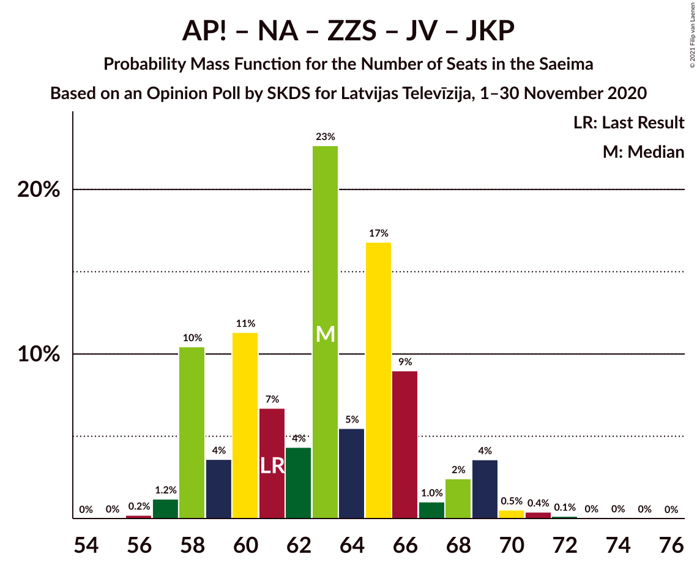

| Number of Seats | Probability | Accumulated | Special Marks |
|:---------------:|:-----------:|:-----------:|:-------------:|
| 56 | 0.2% | 100% |  |
| 57 | 1.2% | 99.8% |  |
| 58 | 10% | 98.6% |  |
| 59 | 4% | 88% |  |
| 60 | 11% | 85% |  |
| 61 | 7% | 73% | Last Result |
| 62 | 4% | 66% |  |
| 63 | 23% | 62% | Median |
| 64 | 5% | 39% |  |
| 65 | 17% | 34% |  |
| 66 | 9% | 17% |  |
| 67 | 1.0% | 8% |  |
| 68 | 2% | 7% |  |
| 69 | 4% | 5% |  |
| 70 | 0.5% | 1.2% |  |
| 71 | 0.4% | 0.7% |  |
| 72 | 0.1% | 0.3% |  |
| 73 | 0% | 0.1% |  |
| 74 | 0% | 0.1% |  |
| 75 | 0% | 0% |  |

### Attīstībai/Par! – Nacionālā apvienība „Visu Latvijai!”–„Tēvzemei un Brīvībai/LNNK” – Zaļo un Zemnieku savienība – Jaunā VIENOTĪBA

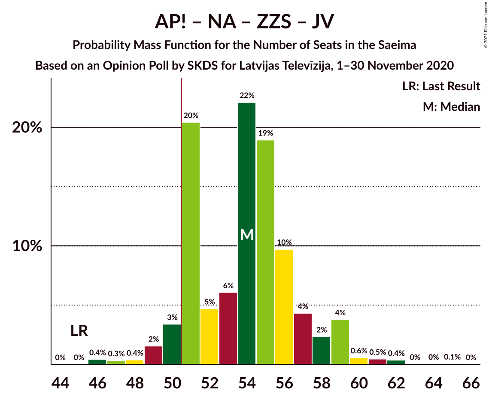

| Number of Seats | Probability | Accumulated | Special Marks |
|:---------------:|:-----------:|:-----------:|:-------------:|
| 45 | 0% | 100% | Last Result |
| 46 | 0.4% | 100% |  |
| 47 | 0.3% | 99.6% |  |
| 48 | 0.4% | 99.3% |  |
| 49 | 2% | 98.9% |  |
| 50 | 3% | 97% |  |
| 51 | 20% | 94% | Majority |
| 52 | 5% | 73% |  |
| 53 | 6% | 69% |  |
| 54 | 22% | 63% | Median |
| 55 | 19% | 41% |  |
| 56 | 10% | 22% |  |
| 57 | 4% | 12% |  |
| 58 | 2% | 8% |  |
| 59 | 4% | 5% |  |
| 60 | 0.6% | 2% |  |
| 61 | 0.5% | 0.9% |  |
| 62 | 0.4% | 0.5% |  |
| 63 | 0% | 0.1% |  |
| 64 | 0% | 0.1% |  |
| 65 | 0.1% | 0.1% |  |
| 66 | 0% | 0% |  |

### Attīstībai/Par! – Nacionālā apvienība „Visu Latvijai!”–„Tēvzemei un Brīvībai/LNNK” – Zaļo un Zemnieku savienība – Jaunā konservatīvā partija

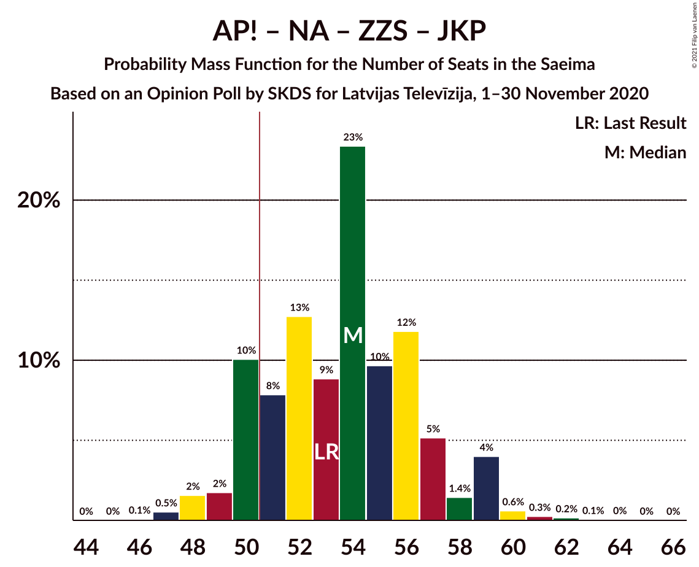

| Number of Seats | Probability | Accumulated | Special Marks |
|:---------------:|:-----------:|:-----------:|:-------------:|
| 46 | 0.1% | 100% |  |
| 47 | 0.5% | 99.9% |  |
| 48 | 2% | 99.4% |  |
| 49 | 2% | 98% |  |
| 50 | 10% | 96% |  |
| 51 | 8% | 86% | Majority |
| 52 | 13% | 78% |  |
| 53 | 9% | 65% | Last Result |
| 54 | 23% | 57% | Median |
| 55 | 10% | 33% |  |
| 56 | 12% | 24% |  |
| 57 | 5% | 12% |  |
| 58 | 1.4% | 7% |  |
| 59 | 4% | 5% |  |
| 60 | 0.6% | 1.1% |  |
| 61 | 0.3% | 0.5% |  |
| 62 | 0.2% | 0.3% |  |
| 63 | 0.1% | 0.1% |  |
| 64 | 0% | 0.1% |  |
| 65 | 0% | 0% |  |

### Attīstībai/Par! – Nacionālā apvienība „Visu Latvijai!”–„Tēvzemei un Brīvībai/LNNK” – Jaunā VIENOTĪBA – Jaunā konservatīvā partija

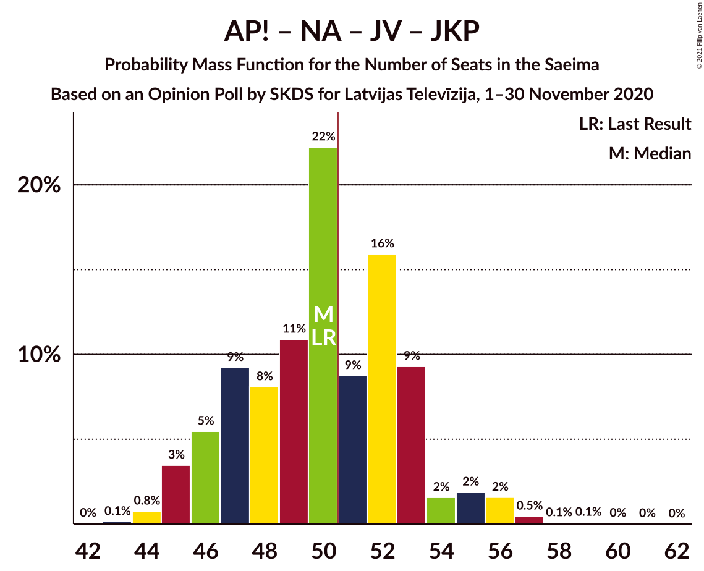

| Number of Seats | Probability | Accumulated | Special Marks |
|:---------------:|:-----------:|:-----------:|:-------------:|
| 43 | 0.1% | 100% |  |
| 44 | 0.8% | 99.8% |  |
| 45 | 3% | 99.1% |  |
| 46 | 5% | 96% |  |
| 47 | 9% | 90% |  |
| 48 | 8% | 81% |  |
| 49 | 11% | 73% |  |
| 50 | 22% | 62% | Last Result, Median |
| 51 | 9% | 40% | Majority |
| 52 | 16% | 31% |  |
| 53 | 9% | 15% |  |
| 54 | 2% | 6% |  |
| 55 | 2% | 4% |  |
| 56 | 2% | 2% |  |
| 57 | 0.5% | 0.7% |  |
| 58 | 0.1% | 0.2% |  |
| 59 | 0.1% | 0.2% |  |
| 60 | 0% | 0.1% |  |
| 61 | 0% | 0% |  |

### Attīstībai/Par! – Nacionālā apvienība „Visu Latvijai!”–„Tēvzemei un Brīvībai/LNNK” – Jaunā VIENOTĪBA – Jaunā konservatīvā partija – Politiskā partija „KPV LV”

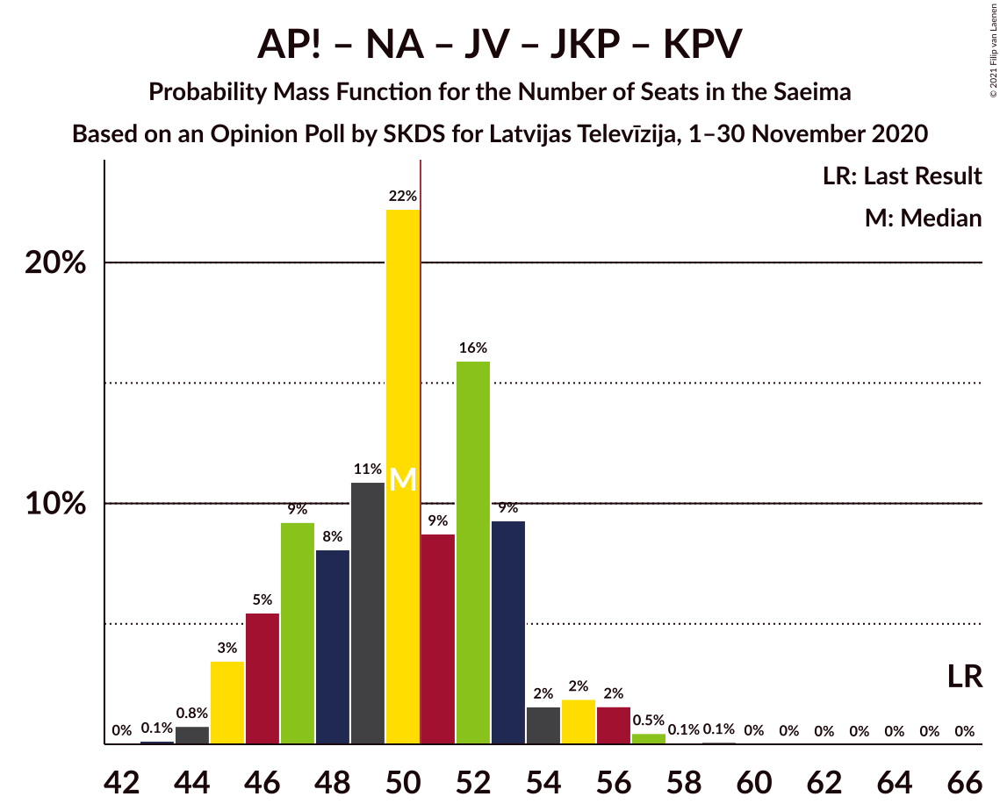

| Number of Seats | Probability | Accumulated | Special Marks |
|:---------------:|:-----------:|:-----------:|:-------------:|
| 43 | 0.1% | 100% |  |
| 44 | 0.8% | 99.8% |  |
| 45 | 3% | 99.1% |  |
| 46 | 5% | 96% |  |
| 47 | 9% | 90% |  |
| 48 | 8% | 81% |  |
| 49 | 11% | 73% |  |
| 50 | 22% | 62% | Median |
| 51 | 9% | 40% | Majority |
| 52 | 16% | 31% |  |
| 53 | 9% | 15% |  |
| 54 | 2% | 6% |  |
| 55 | 2% | 4% |  |
| 56 | 2% | 2% |  |
| 57 | 0.5% | 0.7% |  |
| 58 | 0.1% | 0.2% |  |
| 59 | 0.1% | 0.2% |  |
| 60 | 0% | 0.1% |  |
| 61 | 0% | 0% |  |
| 62 | 0% | 0% |  |
| 63 | 0% | 0% |  |
| 64 | 0% | 0% |  |
| 65 | 0% | 0% |  |
| 66 | 0% | 0% | Last Result |

### Sociāldemokrātiskā partija “Saskaņa” – Attīstībai/Par! – Jaunā konservatīvā partija

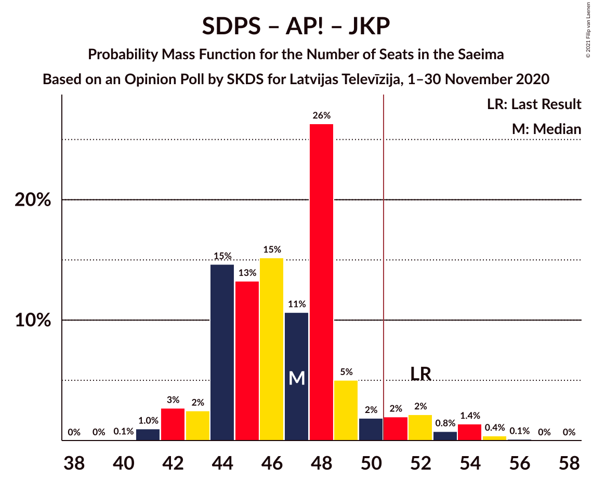

| Number of Seats | Probability | Accumulated | Special Marks |
|:---------------:|:-----------:|:-----------:|:-------------:|
| 40 | 0.1% | 100% |  |
| 41 | 1.0% | 99.9% |  |
| 42 | 3% | 98.9% |  |
| 43 | 2% | 96% |  |
| 44 | 15% | 94% |  |
| 45 | 13% | 79% |  |
| 46 | 15% | 66% | Median |
| 47 | 11% | 51% |  |
| 48 | 26% | 40% |  |
| 49 | 5% | 14% |  |
| 50 | 2% | 9% |  |
| 51 | 2% | 7% | Majority |
| 52 | 2% | 5% | Last Result |
| 53 | 0.8% | 3% |  |
| 54 | 1.4% | 2% |  |
| 55 | 0.4% | 0.5% |  |
| 56 | 0.1% | 0.1% |  |
| 57 | 0% | 0% |  |

### Nacionālā apvienība „Visu Latvijai!”–„Tēvzemei un Brīvībai/LNNK” – Zaļo un Zemnieku savienība – Jaunā VIENOTĪBA – Jaunā konservatīvā partija

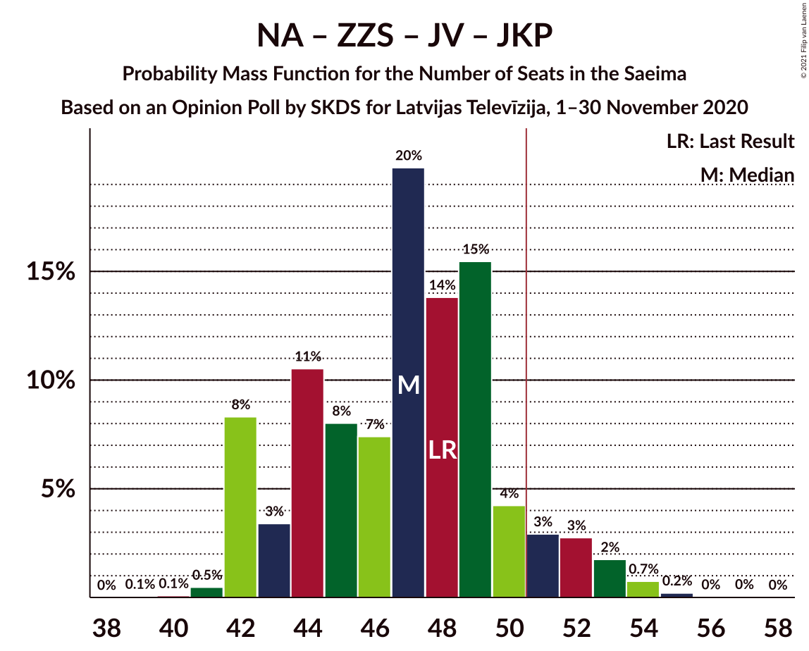

| Number of Seats | Probability | Accumulated | Special Marks |
|:---------------:|:-----------:|:-----------:|:-------------:|
| 39 | 0.1% | 100% |  |
| 40 | 0.1% | 99.9% |  |
| 41 | 0.5% | 99.9% |  |
| 42 | 8% | 99.4% |  |
| 43 | 3% | 91% |  |
| 44 | 11% | 88% |  |
| 45 | 8% | 77% |  |
| 46 | 7% | 69% |  |
| 47 | 20% | 62% | Median |
| 48 | 14% | 42% | Last Result |
| 49 | 15% | 28% |  |
| 50 | 4% | 13% |  |
| 51 | 3% | 8% | Majority |
| 52 | 3% | 6% |  |
| 53 | 2% | 3% |  |
| 54 | 0.7% | 1.0% |  |
| 55 | 0.2% | 0.3% |  |
| 56 | 0% | 0.1% |  |
| 57 | 0% | 0.1% |  |
| 58 | 0% | 0% |  |

### Attīstībai/Par! – Nacionālā apvienība „Visu Latvijai!”–„Tēvzemei un Brīvībai/LNNK” – Zaļo un Zemnieku savienība

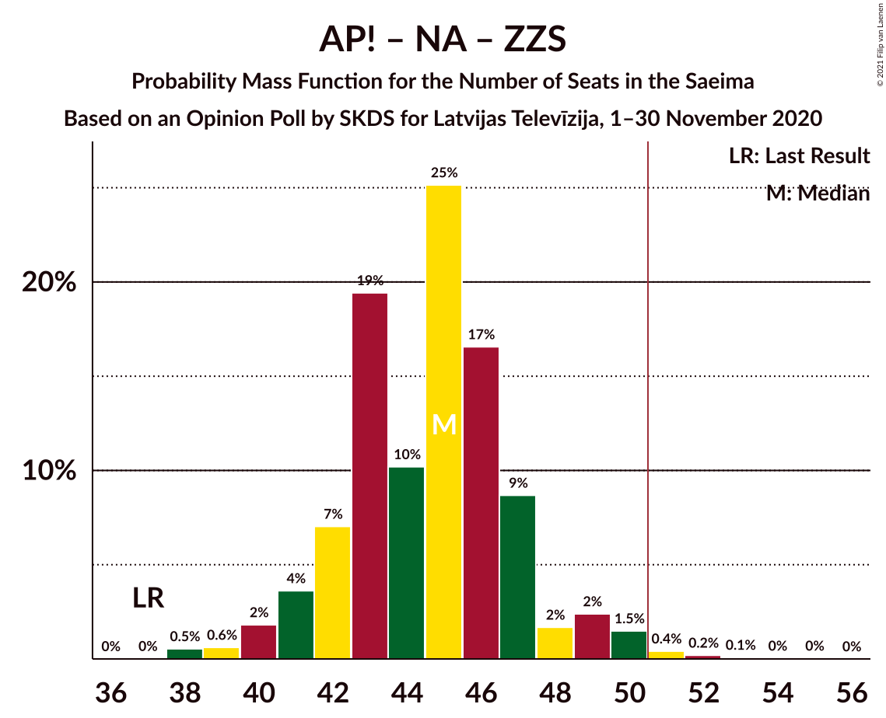

| Number of Seats | Probability | Accumulated | Special Marks |
|:---------------:|:-----------:|:-----------:|:-------------:|
| 37 | 0% | 100% | Last Result |
| 38 | 0.5% | 100% |  |
| 39 | 0.6% | 99.4% |  |
| 40 | 2% | 98.8% |  |
| 41 | 4% | 97% |  |
| 42 | 7% | 93% |  |
| 43 | 19% | 86% |  |
| 44 | 10% | 67% |  |
| 45 | 25% | 57% | Median |
| 46 | 17% | 32% |  |
| 47 | 9% | 15% |  |
| 48 | 2% | 6% |  |
| 49 | 2% | 5% |  |
| 50 | 1.5% | 2% |  |
| 51 | 0.4% | 0.8% | Majority |
| 52 | 0.2% | 0.4% |  |
| 53 | 0.1% | 0.2% |  |
| 54 | 0% | 0.1% |  |
| 55 | 0% | 0% |  |

### Attīstībai/Par! – Nacionālā apvienība „Visu Latvijai!”–„Tēvzemei un Brīvībai/LNNK” – Jaunā VIENOTĪBA – Politiskā partija „KPV LV”

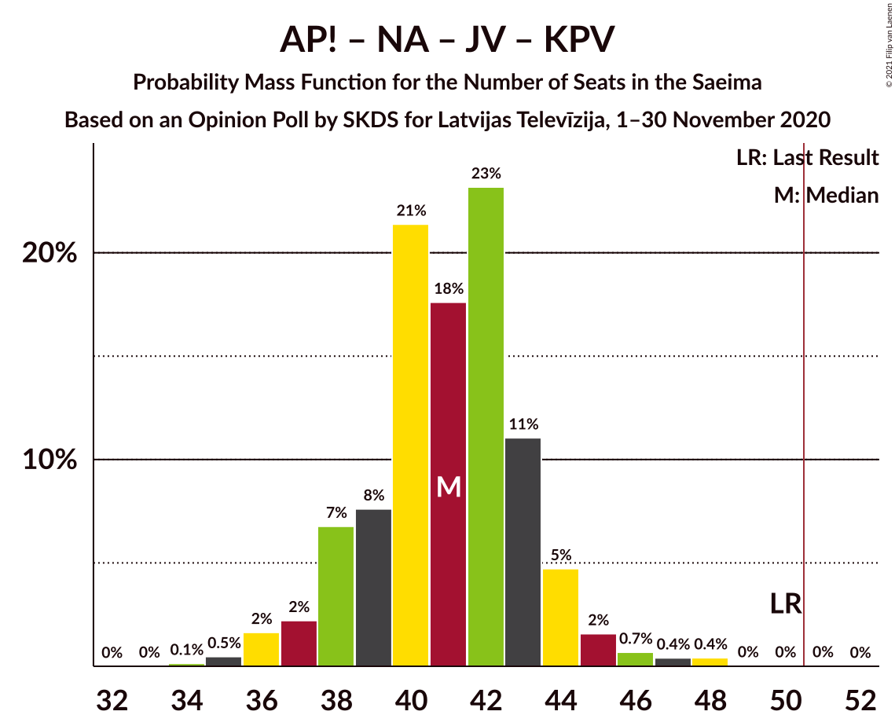

| Number of Seats | Probability | Accumulated | Special Marks |
|:---------------:|:-----------:|:-----------:|:-------------:|
| 34 | 0.1% | 100% |  |
| 35 | 0.5% | 99.8% |  |
| 36 | 2% | 99.4% |  |
| 37 | 2% | 98% |  |
| 38 | 7% | 96% |  |
| 39 | 8% | 89% |  |
| 40 | 21% | 81% |  |
| 41 | 18% | 60% | Median |
| 42 | 23% | 42% |  |
| 43 | 11% | 19% |  |
| 44 | 5% | 8% |  |
| 45 | 2% | 3% |  |
| 46 | 0.7% | 2% |  |
| 47 | 0.4% | 0.9% |  |
| 48 | 0.4% | 0.5% |  |
| 49 | 0% | 0.1% |  |
| 50 | 0% | 0.1% | Last Result |
| 51 | 0% | 0% | Majority |

### Attīstībai/Par! – Nacionālā apvienība „Visu Latvijai!”–„Tēvzemei un Brīvībai/LNNK” – Jaunā konservatīvā partija – Politiskā partija „KPV LV”

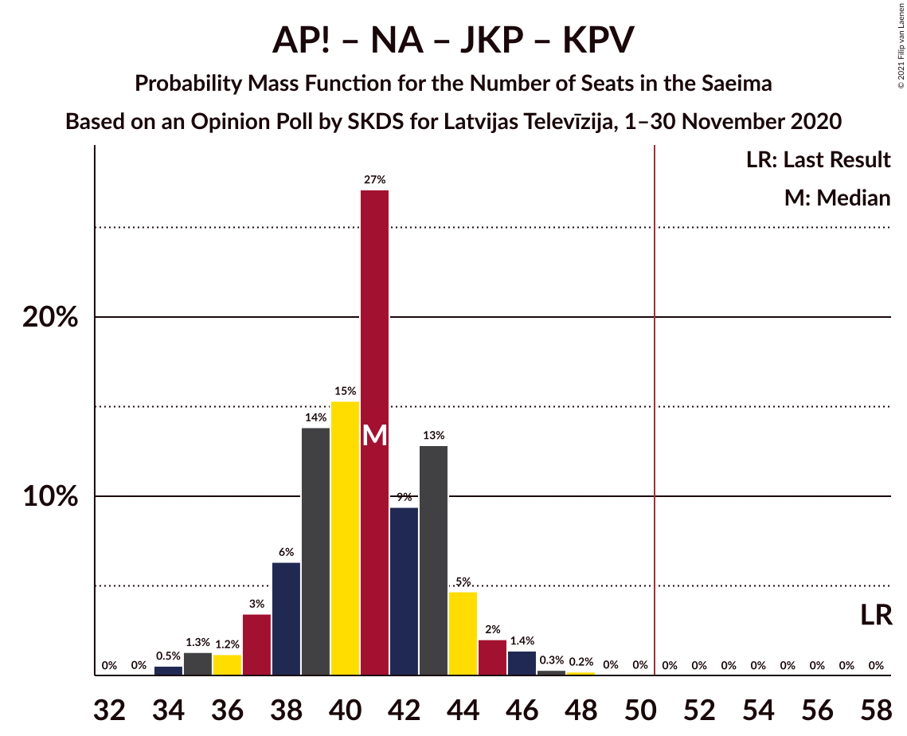

| Number of Seats | Probability | Accumulated | Special Marks |
|:---------------:|:-----------:|:-----------:|:-------------:|
| 34 | 0.5% | 100% |  |
| 35 | 1.3% | 99.4% |  |
| 36 | 1.2% | 98% |  |
| 37 | 3% | 97% |  |
| 38 | 6% | 94% |  |
| 39 | 14% | 87% |  |
| 40 | 15% | 73% |  |
| 41 | 27% | 58% | Median |
| 42 | 9% | 31% |  |
| 43 | 13% | 22% |  |
| 44 | 5% | 9% |  |
| 45 | 2% | 4% |  |
| 46 | 1.4% | 2% |  |
| 47 | 0.3% | 0.6% |  |
| 48 | 0.2% | 0.3% |  |
| 49 | 0% | 0.1% |  |
| 50 | 0% | 0% |  |
| 51 | 0% | 0% | Majority |
| 52 | 0% | 0% |  |
| 53 | 0% | 0% |  |
| 54 | 0% | 0% |  |
| 55 | 0% | 0% |  |
| 56 | 0% | 0% |  |
| 57 | 0% | 0% |  |
| 58 | 0% | 0% | Last Result |

### Nacionālā apvienība „Visu Latvijai!”–„Tēvzemei un Brīvībai/LNNK” – Zaļo un Zemnieku savienība – Jaunā VIENOTĪBA

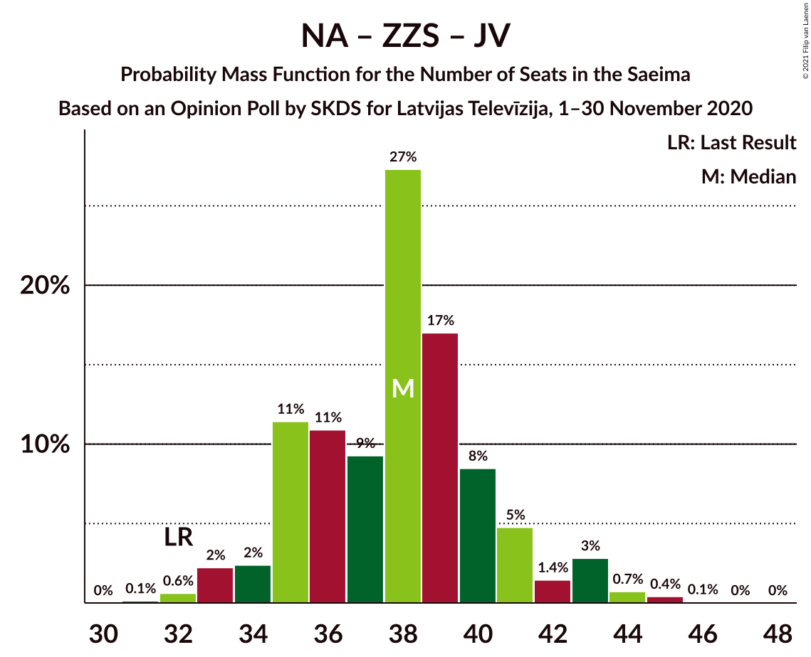

| Number of Seats | Probability | Accumulated | Special Marks |
|:---------------:|:-----------:|:-----------:|:-------------:|
| 31 | 0.1% | 100% |  |
| 32 | 0.6% | 99.9% | Last Result |
| 33 | 2% | 99.3% |  |
| 34 | 2% | 97% |  |
| 35 | 11% | 95% |  |
| 36 | 11% | 83% |  |
| 37 | 9% | 72% |  |
| 38 | 27% | 63% | Median |
| 39 | 17% | 36% |  |
| 40 | 8% | 19% |  |
| 41 | 5% | 10% |  |
| 42 | 1.4% | 5% |  |
| 43 | 3% | 4% |  |
| 44 | 0.7% | 1.2% |  |
| 45 | 0.4% | 0.5% |  |
| 46 | 0.1% | 0.1% |  |
| 47 | 0% | 0% |  |

### Nacionālā apvienība „Visu Latvijai!”–„Tēvzemei un Brīvībai/LNNK” – Zaļo un Zemnieku savienība – Jaunā konservatīvā partija

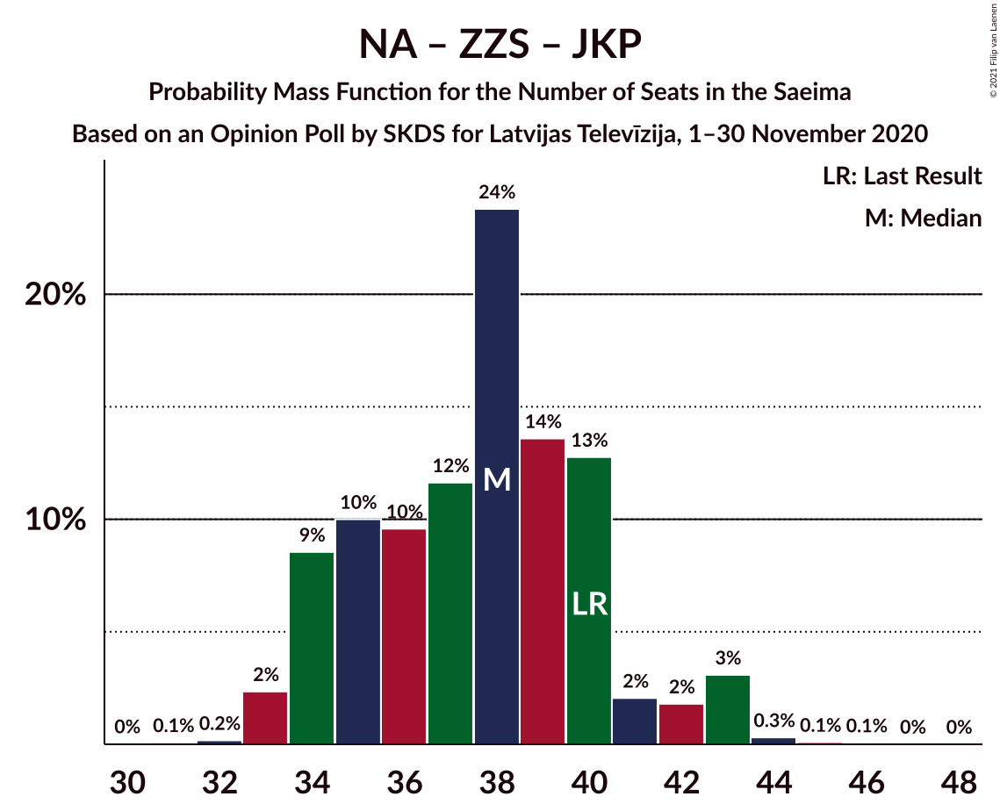

| Number of Seats | Probability | Accumulated | Special Marks |
|:---------------:|:-----------:|:-----------:|:-------------:|
| 31 | 0.1% | 100% |  |
| 32 | 0.2% | 99.9% |  |
| 33 | 2% | 99.7% |  |
| 34 | 9% | 97% |  |
| 35 | 10% | 89% |  |
| 36 | 10% | 79% |  |
| 37 | 12% | 69% |  |
| 38 | 24% | 58% | Median |
| 39 | 14% | 34% |  |
| 40 | 13% | 20% | Last Result |
| 41 | 2% | 7% |  |
| 42 | 2% | 5% |  |
| 43 | 3% | 4% |  |
| 44 | 0.3% | 0.5% |  |
| 45 | 0.1% | 0.2% |  |
| 46 | 0.1% | 0.1% |  |
| 47 | 0% | 0% |  |

### Sociāldemokrātiskā partija “Saskaņa” – Attīstībai/Par!

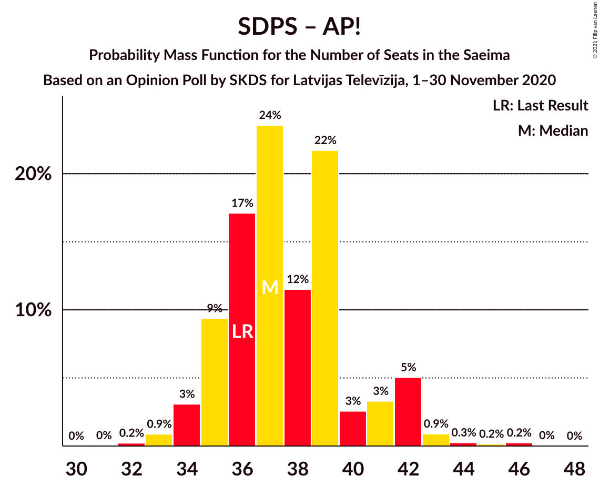

| Number of Seats | Probability | Accumulated | Special Marks |
|:---------------:|:-----------:|:-----------:|:-------------:|
| 31 | 0% | 100% |  |
| 32 | 0.2% | 99.9% |  |
| 33 | 0.9% | 99.7% |  |
| 34 | 3% | 98.8% |  |
| 35 | 9% | 96% |  |
| 36 | 17% | 86% | Last Result |
| 37 | 24% | 69% | Median |
| 38 | 12% | 46% |  |
| 39 | 22% | 34% |  |
| 40 | 3% | 12% |  |
| 41 | 3% | 10% |  |
| 42 | 5% | 7% |  |
| 43 | 0.9% | 2% |  |
| 44 | 0.3% | 0.7% |  |
| 45 | 0.2% | 0.4% |  |
| 46 | 0.2% | 0.3% |  |
| 47 | 0% | 0.1% |  |
| 48 | 0% | 0% |  |

### Sociāldemokrātiskā partija “Saskaņa” – Zaļo un Zemnieku savienība – Politiskā partija „KPV LV”

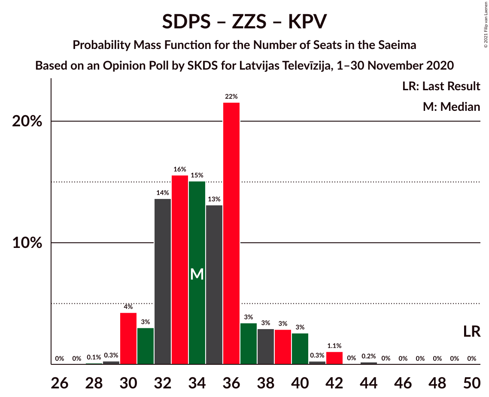

| Number of Seats | Probability | Accumulated | Special Marks |
|:---------------:|:-----------:|:-----------:|:-------------:|
| 28 | 0.1% | 100% |  |
| 29 | 0.3% | 99.9% |  |
| 30 | 4% | 99.6% |  |
| 31 | 3% | 95% |  |
| 32 | 14% | 92% |  |
| 33 | 16% | 79% |  |
| 34 | 15% | 63% | Median |
| 35 | 13% | 48% |  |
| 36 | 22% | 35% |  |
| 37 | 3% | 13% |  |
| 38 | 3% | 10% |  |
| 39 | 3% | 7% |  |
| 40 | 3% | 4% |  |
| 41 | 0.3% | 2% |  |
| 42 | 1.1% | 1.3% |  |
| 43 | 0% | 0.3% |  |
| 44 | 0.2% | 0.2% |  |
| 45 | 0% | 0% |  |
| 46 | 0% | 0% |  |
| 47 | 0% | 0% |  |
| 48 | 0% | 0% |  |
| 49 | 0% | 0% |  |
| 50 | 0% | 0% | Last Result |

### Attīstībai/Par! – Jaunā VIENOTĪBA – Jaunā konservatīvā partija – Politiskā partija „KPV LV”

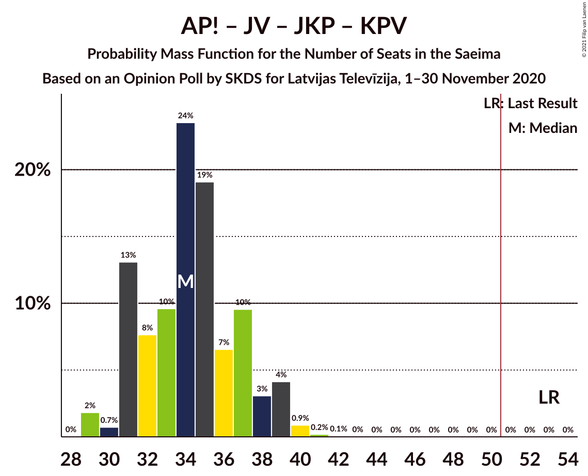

| Number of Seats | Probability | Accumulated | Special Marks |
|:---------------:|:-----------:|:-----------:|:-------------:|
| 29 | 2% | 100% |  |
| 30 | 0.7% | 98% |  |
| 31 | 13% | 97% |  |
| 32 | 8% | 84% |  |
| 33 | 10% | 77% |  |
| 34 | 24% | 67% | Median |
| 35 | 19% | 44% |  |
| 36 | 7% | 24% |  |
| 37 | 10% | 18% |  |
| 38 | 3% | 8% |  |
| 39 | 4% | 5% |  |
| 40 | 0.9% | 1.2% |  |
| 41 | 0.2% | 0.3% |  |
| 42 | 0.1% | 0.1% |  |
| 43 | 0% | 0% |  |
| 44 | 0% | 0% |  |
| 45 | 0% | 0% |  |
| 46 | 0% | 0% |  |
| 47 | 0% | 0% |  |
| 48 | 0% | 0% |  |
| 49 | 0% | 0% |  |
| 50 | 0% | 0% |  |
| 51 | 0% | 0% | Majority |
| 52 | 0% | 0% |  |
| 53 | 0% | 0% | Last Result |

### Nacionālā apvienība „Visu Latvijai!”–„Tēvzemei un Brīvībai/LNNK” – Jaunā VIENOTĪBA – Jaunā konservatīvā partija – Politiskā partija „KPV LV”

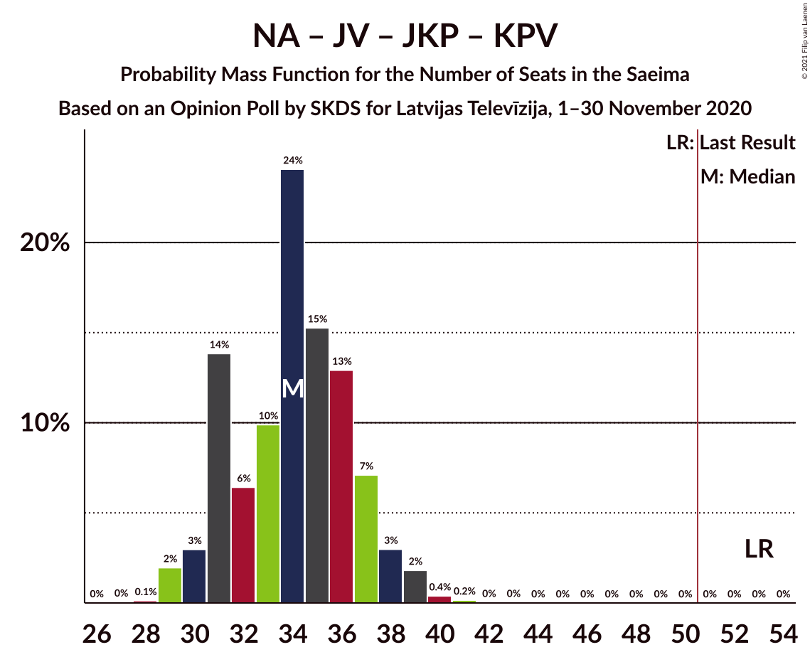

| Number of Seats | Probability | Accumulated | Special Marks |
|:---------------:|:-----------:|:-----------:|:-------------:|
| 27 | 0% | 100% |  |
| 28 | 0.1% | 99.9% |  |
| 29 | 2% | 99.8% |  |
| 30 | 3% | 98% |  |
| 31 | 14% | 95% |  |
| 32 | 6% | 81% |  |
| 33 | 10% | 75% |  |
| 34 | 24% | 65% | Median |
| 35 | 15% | 41% |  |
| 36 | 13% | 25% |  |
| 37 | 7% | 12% |  |
| 38 | 3% | 5% |  |
| 39 | 2% | 2% |  |
| 40 | 0.4% | 0.6% |  |
| 41 | 0.2% | 0.2% |  |
| 42 | 0% | 0.1% |  |
| 43 | 0% | 0% |  |
| 44 | 0% | 0% |  |
| 45 | 0% | 0% |  |
| 46 | 0% | 0% |  |
| 47 | 0% | 0% |  |
| 48 | 0% | 0% |  |
| 49 | 0% | 0% |  |
| 50 | 0% | 0% |  |
| 51 | 0% | 0% | Majority |
| 52 | 0% | 0% |  |
| 53 | 0% | 0% | Last Result |

### Sociāldemokrātiskā partija “Saskaņa” – Politiskā partija „KPV LV”

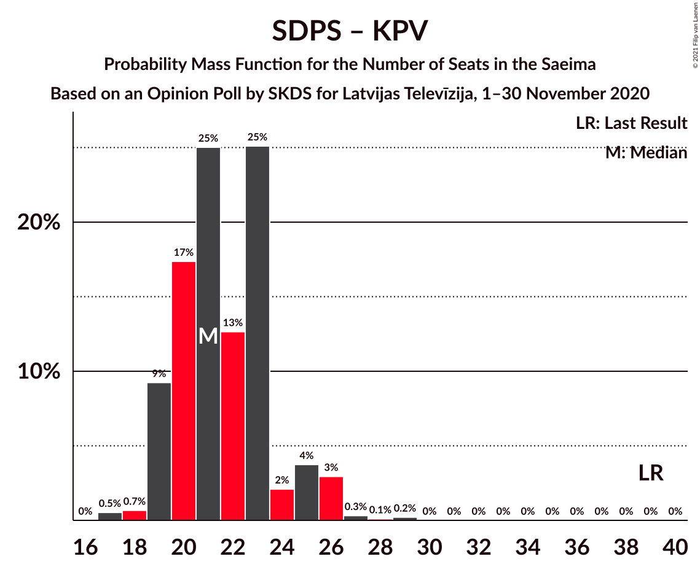

| Number of Seats | Probability | Accumulated | Special Marks |
|:---------------:|:-----------:|:-----------:|:-------------:|
| 17 | 0.5% | 100% |  |
| 18 | 0.7% | 99.5% |  |
| 19 | 9% | 98.8% |  |
| 20 | 17% | 90% |  |
| 21 | 25% | 72% | Median |
| 22 | 13% | 47% |  |
| 23 | 25% | 35% |  |
| 24 | 2% | 9% |  |
| 25 | 4% | 7% |  |
| 26 | 3% | 4% |  |
| 27 | 0.3% | 0.6% |  |
| 28 | 0.1% | 0.3% |  |
| 29 | 0.2% | 0.2% |  |
| 30 | 0% | 0% |  |
| 31 | 0% | 0% |  |
| 32 | 0% | 0% |  |
| 33 | 0% | 0% |  |
| 34 | 0% | 0% |  |
| 35 | 0% | 0% |  |
| 36 | 0% | 0% |  |
| 37 | 0% | 0% |  |
| 38 | 0% | 0% |  |
| 39 | 0% | 0% | Last Result |

## Technical Information

### Opinion Poll

+ **Polling firm:** SKDS
+ **Commissioner(s):** Latvijas Televīzija
+ **Fieldwork period:** 1–30 November 2020

### Calculations

+ **Sample size:** 833
+ **Simulations done:** 1,048,576
+ **Error estimate:** 2.67%

