# Opinion Poll by Factum, 1–17 December 2020

<a href="#voting-intentions">Voting Intentions</a> | <a href="#seats">Seats</a> | <a href="#coalitions">Coalitions</a> | <a href="#technical-information">Technical Information</a>

## Voting Intentions

### Confidence Intervals

| Party | Last Result | Poll Result | 80% Confidence Interval | 90% Confidence Interval | 95% Confidence Interval | 99% Confidence Interval |
|:-----:|:-----------:|:-----------:|:-----------------------:|:-----------------------:|:-----------------------:|:-----------------------:|
| Sociāldemokrātiskā partija “Saskaņa” | 19.8% | 13.1% | 12.3–14.1% |12.0–14.3% |11.8–14.5% |11.4–15.0% |
| Attīstībai/Par! | 12.0% | 13.1% | 12.3–14.1% |12.0–14.3% |11.8–14.5% |11.4–15.0% |
| Nacionālā apvienība „Visu Latvijai!”–„Tēvzemei un Brīvībai/LNNK” | 11.0% | 13.1% | 12.3–14.1% |12.0–14.3% |11.8–14.5% |11.4–15.0% |
| Zaļo un Zemnieku savienība | 9.9% | 13.1% | 12.3–14.1% |12.0–14.3% |11.8–14.5% |11.4–15.0% |
| Jaunā VIENOTĪBA | 6.7% | 13.1% | 12.3–14.1% |12.0–14.3% |11.8–14.5% |11.4–15.0% |
| Jaunā konservatīvā partija | 13.6% | 8.1% | 7.4–8.9% |7.2–9.1% |7.1–9.3% |6.8–9.6% |
| PROGRESĪVIE | 2.6% | 8.1% | 7.4–8.9% |7.2–9.1% |7.1–9.3% |6.8–9.6% |
| Latvijas Krievu savienība | 3.2% | 4.0% | 3.6–4.6% |3.4–4.8% |3.3–4.9% |3.1–5.2% |
| Latvijas Reģionu Apvienība | 4.1% | 3.0% | 2.6–3.5% |2.5–3.7% |2.4–3.8% |2.2–4.0% |
| Politiskā partija „KPV LV” | 14.2% | 2.0% | 1.7–2.5% |1.6–2.6% |1.5–2.7% |1.4–2.9% |

*Note:* The poll result column reflects the actual value used in the calculations. Published results may vary slightly, and in addition be rounded to fewer digits.

## Seats

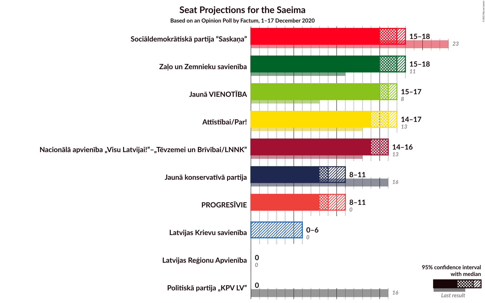

### Confidence Intervals

| Party | Last Result | Median | 80% Confidence Interval | 90% Confidence Interval | 95% Confidence Interval | 99% Confidence Interval |
|:-----:|:-----------:|:------:|:-----------------------:|:-----------------------:|:-----------------------:|:-----------------------:|
| <a href="#sociāldemokrātiskā-partija-“saskaņa”">Sociāldemokrātiskā partija “Saskaņa”</a> | 23 | 17 | 16–18 |16–18 |15–18 |14–18 |
| <a href="#attīstībai/par!">Attīstībai/Par!</a> | 13 | 16 | 15–16 |14–17 |14–17 |14–17 |
| <a href="#nacionālā-apvienība-„visu-latvijai!”–„tēvzemei-un-brīvībai/lnnk”">Nacionālā apvienība „Visu Latvijai!”–„Tēvzemei un Brīvībai/LNNK”</a> | 13 | 16 | 14–16 |14–16 |14–16 |14–16 |
| <a href="#zaļo-un-zemnieku-savienība">Zaļo un Zemnieku savienība</a> | 11 | 17 | 16–18 |16–18 |15–18 |15–18 |
| <a href="#jaunā-vienotība">Jaunā VIENOTĪBA</a> | 8 | 16 | 15–17 |15–17 |15–17 |14–18 |
| <a href="#jaunā-konservatīvā-partija">Jaunā konservatīvā partija</a> | 16 | 9 | 9–10 |9–10 |8–11 |8–12 |
| <a href="#progresīvie">PROGRESĪVIE</a> | 0 | 9 | 8–11 |8–11 |8–11 |8–11 |
| <a href="#latvijas-krievu-savienība">Latvijas Krievu savienība</a> | 0 | 0 | 0 |0 |0–6 |0–8 |
| <a href="#latvijas-reģionu-apvienība">Latvijas Reģionu Apvienība</a> | 0 | 0 | 0 |0 |0 |0 |
| <a href="#politiskā-partija-„kpv-lv”">Politiskā partija „KPV LV”</a> | 16 | 0 | 0 |0 |0 |0 |

### Sociāldemokrātiskā partija “Saskaņa”

*For a full overview of the results for this party, see the [Sociāldemokrātiskā partija “Saskaņa”](party-sociāldemokrātiskāpartija“saskaņa”.html) page.*

| Number of Seats | Probability | Accumulated | Special Marks |
|:---------------:|:-----------:|:-----------:|:-------------:|
| 14 | 1.4% | 100% |  |
| 15 | 2% | 98.6% |  |
| 16 | 33% | 96% |  |
| 17 | 20% | 63% | Median |
| 18 | 43% | 43% |  |
| 19 | 0.2% | 0.2% |  |
| 20 | 0% | 0% |  |
| 21 | 0% | 0% |  |
| 22 | 0% | 0% |  |
| 23 | 0% | 0% | Last Result |

### Attīstībai/Par!

*For a full overview of the results for this party, see the [Attīstībai/Par!](party-attīstībaipar.html) page.*

| Number of Seats | Probability | Accumulated | Special Marks |
|:---------------:|:-----------:|:-----------:|:-------------:|
| 13 | 0.1% | 100% | Last Result |
| 14 | 5% | 99.9% |  |
| 15 | 36% | 95% |  |
| 16 | 50% | 59% | Median |
| 17 | 9% | 9% |  |
| 18 | 0% | 0% |  |

### Nacionālā apvienība „Visu Latvijai!”–„Tēvzemei un Brīvībai/LNNK”

*For a full overview of the results for this party, see the [Nacionālā apvienība „Visu Latvijai!”–„Tēvzemei un Brīvībai/LNNK”](party-nacionālāapvienība„visulatvijai”–„tēvzemeiunbrīvībailnnk”.html) page.*

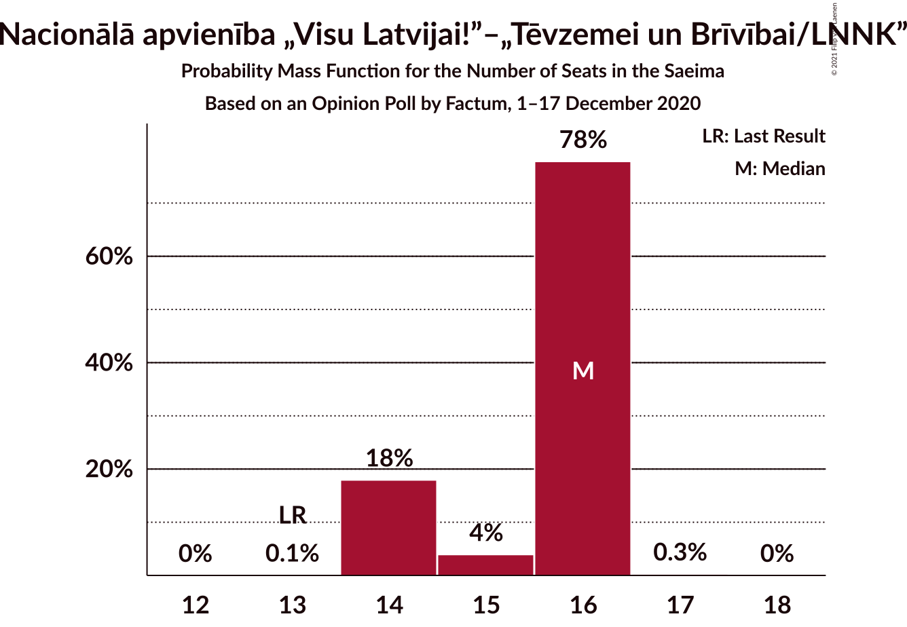

| Number of Seats | Probability | Accumulated | Special Marks |
|:---------------:|:-----------:|:-----------:|:-------------:|
| 13 | 0.1% | 100% | Last Result |
| 14 | 18% | 99.9% |  |
| 15 | 4% | 82% |  |
| 16 | 78% | 78% | Median |
| 17 | 0.3% | 0.3% |  |
| 18 | 0% | 0% |  |

### Zaļo un Zemnieku savienība

*For a full overview of the results for this party, see the [Zaļo un Zemnieku savienība](party-zaļounzemniekusavienība.html) page.*

| Number of Seats | Probability | Accumulated | Special Marks |
|:---------------:|:-----------:|:-----------:|:-------------:|
| 11 | 0% | 100% | Last Result |
| 12 | 0% | 100% |  |
| 13 | 0.1% | 100% |  |
| 14 | 0.2% | 99.9% |  |
| 15 | 3% | 99.7% |  |
| 16 | 45% | 97% |  |
| 17 | 28% | 52% | Median |
| 18 | 24% | 24% |  |
| 19 | 0% | 0% |  |

### Jaunā VIENOTĪBA

*For a full overview of the results for this party, see the [Jaunā VIENOTĪBA](party-jaunāvienotība.html) page.*

| Number of Seats | Probability | Accumulated | Special Marks |
|:---------------:|:-----------:|:-----------:|:-------------:|
| 8 | 0% | 100% | Last Result |
| 9 | 0% | 100% |  |
| 10 | 0% | 100% |  |
| 11 | 0% | 100% |  |
| 12 | 0% | 100% |  |
| 13 | 0% | 100% |  |
| 14 | 2% | 100% |  |
| 15 | 15% | 98% |  |
| 16 | 49% | 83% | Median |
| 17 | 33% | 34% |  |
| 18 | 1.1% | 1.2% |  |
| 19 | 0% | 0% |  |

### Jaunā konservatīvā partija

*For a full overview of the results for this party, see the [Jaunā konservatīvā partija](party-jaunākonservatīvāpartija.html) page.*

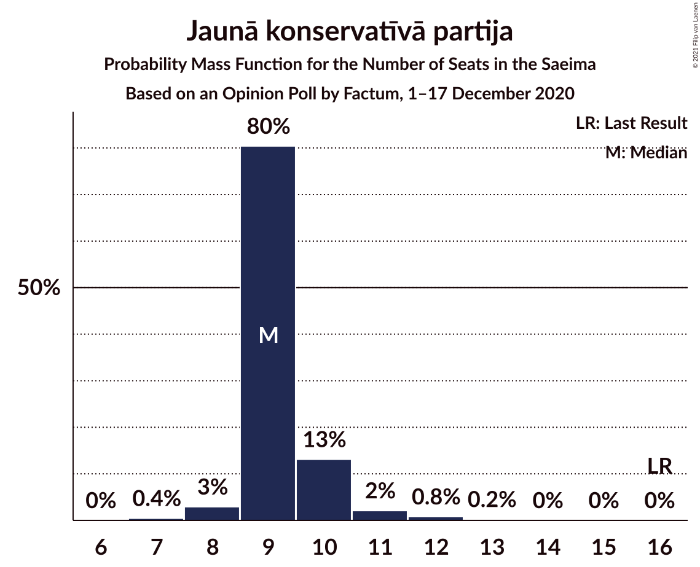

| Number of Seats | Probability | Accumulated | Special Marks |
|:---------------:|:-----------:|:-----------:|:-------------:|
| 7 | 0.4% | 100% |  |
| 8 | 3% | 99.6% |  |
| 9 | 80% | 97% | Median |
| 10 | 13% | 16% |  |
| 11 | 2% | 3% |  |
| 12 | 0.8% | 1.0% |  |
| 13 | 0.2% | 0.2% |  |
| 14 | 0% | 0% |  |
| 15 | 0% | 0% |  |
| 16 | 0% | 0% | Last Result |

### PROGRESĪVIE

*For a full overview of the results for this party, see the [PROGRESĪVIE](party-progresīvie.html) page.*

| Number of Seats | Probability | Accumulated | Special Marks |
|:---------------:|:-----------:|:-----------:|:-------------:|
| 0 | 0% | 100% | Last Result |
| 1 | 0% | 100% |  |
| 2 | 0% | 100% |  |
| 3 | 0% | 100% |  |
| 4 | 0% | 100% |  |
| 5 | 0% | 100% |  |
| 6 | 0% | 100% |  |
| 7 | 0.2% | 100% |  |
| 8 | 12% | 99.8% |  |
| 9 | 55% | 88% | Median |
| 10 | 12% | 33% |  |
| 11 | 21% | 21% |  |
| 12 | 0% | 0% |  |

### Latvijas Krievu savienība

*For a full overview of the results for this party, see the [Latvijas Krievu savienība](party-latvijaskrievusavienība.html) page.*

| Number of Seats | Probability | Accumulated | Special Marks |
|:---------------:|:-----------:|:-----------:|:-------------:|
| 0 | 96% | 100% | Last Result, Median |
| 1 | 0% | 4% |  |
| 2 | 0% | 4% |  |
| 3 | 0% | 4% |  |
| 4 | 0% | 4% |  |
| 5 | 0.3% | 4% |  |
| 6 | 2% | 4% |  |
| 7 | 0.5% | 2% |  |
| 8 | 1.3% | 1.3% |  |
| 9 | 0% | 0% |  |

### Latvijas Reģionu Apvienība

*For a full overview of the results for this party, see the [Latvijas Reģionu Apvienība](party-latvijasreģionuapvienība.html) page.*

| Number of Seats | Probability | Accumulated | Special Marks |
|:---------------:|:-----------:|:-----------:|:-------------:|
| 0 | 100% | 100% | Last Result, Median |

### Politiskā partija „KPV LV”

*For a full overview of the results for this party, see the [Politiskā partija „KPV LV”](party-politiskāpartija„kpvlv”.html) page.*

| Number of Seats | Probability | Accumulated | Special Marks |
|:---------------:|:-----------:|:-----------:|:-------------:|
| 0 | 100% | 100% | Median |
| 1 | 0% | 0% |  |
| 2 | 0% | 0% |  |
| 3 | 0% | 0% |  |
| 4 | 0% | 0% |  |
| 5 | 0% | 0% |  |
| 6 | 0% | 0% |  |
| 7 | 0% | 0% |  |
| 8 | 0% | 0% |  |
| 9 | 0% | 0% |  |
| 10 | 0% | 0% |  |
| 11 | 0% | 0% |  |
| 12 | 0% | 0% |  |
| 13 | 0% | 0% |  |
| 14 | 0% | 0% |  |
| 15 | 0% | 0% |  |
| 16 | 0% | 0% | Last Result |

## Coalitions

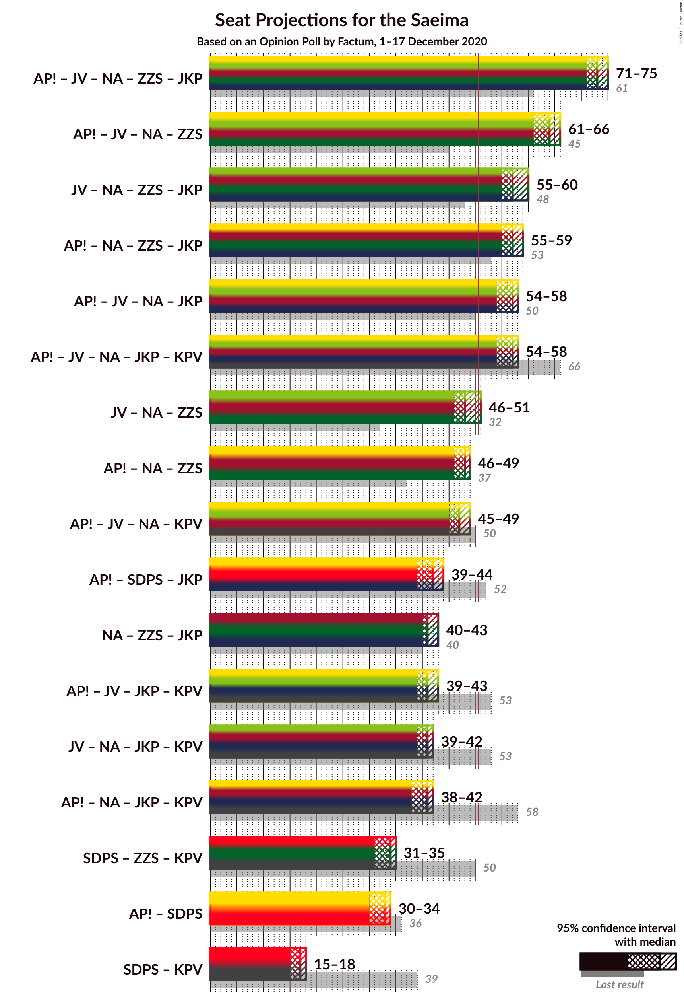

### Confidence Intervals

| Coalition | Last Result | Median | Majority? | 80% Confidence Interval | 90% Confidence Interval | 95% Confidence Interval | 99% Confidence Interval |
|:---------:|:-----------:|:------:|:---------:|:-----------------------:|:-----------------------:|:-----------------------:|:-----------------------:|
| Attīstībai/Par! – Jaunā VIENOTĪBA – Nacionālā apvienība „Visu Latvijai!”–„Tēvzemei un Brīvībai/LNNK” – Zaļo un Zemnieku savienība – Jaunā konservatīvā partija | 61 | 73 | 100% | 72–75 | 71–75 | 71–75 | 69–75 |
| Attīstībai/Par! – Jaunā VIENOTĪBA – Nacionālā apvienība „Visu Latvijai!”–„Tēvzemei un Brīvībai/LNNK” – Zaļo un Zemnieku savienība | 45 | 64 | 100% | 62–66 | 62–66 | 61–66 | 60–67 |
| Jaunā VIENOTĪBA – Nacionālā apvienība „Visu Latvijai!”–„Tēvzemei un Brīvībai/LNNK” – Zaļo un Zemnieku savienība – Jaunā konservatīvā partija | 48 | 57 | 100% | 57–59 | 56–60 | 55–60 | 54–60 |
| Attīstībai/Par! – Nacionālā apvienība „Visu Latvijai!”–„Tēvzemei un Brīvībai/LNNK” – Zaļo un Zemnieku savienība – Jaunā konservatīvā partija | 53 | 57 | 100% | 56–58 | 55–58 | 55–59 | 54–60 |
| Attīstībai/Par! – Jaunā VIENOTĪBA – Nacionālā apvienība „Visu Latvijai!”–„Tēvzemei un Brīvībai/LNNK” – Jaunā konservatīvā partija | 50 | 57 | 100% | 55–58 | 55–58 | 54–58 | 53–60 |
| Attīstībai/Par! – Jaunā VIENOTĪBA – Nacionālā apvienība „Visu Latvijai!”–„Tēvzemei un Brīvībai/LNNK” – Jaunā konservatīvā partija – Politiskā partija „KPV LV” | 66 | 57 | 100% | 55–58 | 55–58 | 54–58 | 53–60 |
| Jaunā VIENOTĪBA – Nacionālā apvienība „Visu Latvijai!”–„Tēvzemei un Brīvībai/LNNK” – Zaļo un Zemnieku savienība | 32 | 48 | 9% | 47–50 | 47–51 | 46–51 | 44–51 |
| Attīstībai/Par! – Nacionālā apvienība „Visu Latvijai!”–„Tēvzemei un Brīvībai/LNNK” – Zaļo un Zemnieku savienība | 37 | 48 | 0% | 47–49 | 46–49 | 46–49 | 45–50 |
| Attīstībai/Par! – Jaunā VIENOTĪBA – Nacionālā apvienība „Visu Latvijai!”–„Tēvzemei un Brīvībai/LNNK” – Politiskā partija „KPV LV” | 50 | 47 | 0.4% | 46–49 | 45–49 | 45–49 | 44–50 |
| Attīstībai/Par! – Sociāldemokrātiskā partija “Saskaņa” – Jaunā konservatīvā partija | 52 | 42 | 0% | 40–43 | 40–44 | 39–44 | 38–45 |
| Nacionālā apvienība „Visu Latvijai!”–„Tēvzemei un Brīvībai/LNNK” – Zaļo un Zemnieku savienība – Jaunā konservatīvā partija | 40 | 41 | 0% | 41–43 | 40–43 | 40–43 | 39–44 |
| Attīstībai/Par! – Jaunā VIENOTĪBA – Jaunā konservatīvā partija – Politiskā partija „KPV LV” | 53 | 41 | 0% | 40–42 | 40–42 | 39–43 | 39–43 |
| Jaunā VIENOTĪBA – Nacionālā apvienība „Visu Latvijai!”–„Tēvzemei un Brīvībai/LNNK” – Jaunā konservatīvā partija – Politiskā partija „KPV LV” | 53 | 41 | 0% | 39–42 | 39–42 | 39–42 | 38–43 |
| Attīstībai/Par! – Nacionālā apvienība „Visu Latvijai!”–„Tēvzemei un Brīvībai/LNNK” – Jaunā konservatīvā partija – Politiskā partija „KPV LV” | 58 | 41 | 0% | 39–41 | 38–42 | 38–42 | 38–44 |
| Sociāldemokrātiskā partija “Saskaņa” – Zaļo un Zemnieku savienība – Politiskā partija „KPV LV” | 50 | 34 | 0% | 33–35 | 32–35 | 31–35 | 30–36 |
| Attīstībai/Par! – Sociāldemokrātiskā partija “Saskaņa” | 36 | 33 | 0% | 31–34 | 31–34 | 30–34 | 29–35 |
| Sociāldemokrātiskā partija “Saskaņa” – Politiskā partija „KPV LV” | 39 | 17 | 0% | 16–18 | 16–18 | 15–18 | 14–18 |

### Attīstībai/Par! – Jaunā VIENOTĪBA – Nacionālā apvienība „Visu Latvijai!”–„Tēvzemei un Brīvībai/LNNK” – Zaļo un Zemnieku savienība – Jaunā konservatīvā partija

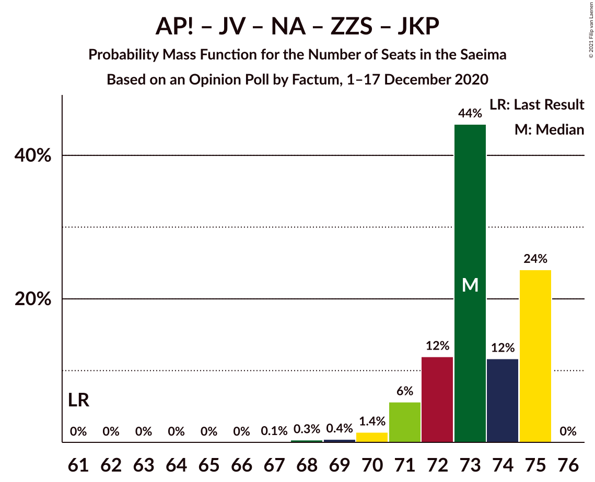

| Number of Seats | Probability | Accumulated | Special Marks |
|:---------------:|:-----------:|:-----------:|:-------------:|
| 61 | 0% | 100% | Last Result |
| 62 | 0% | 100% |  |
| 63 | 0% | 100% |  |
| 64 | 0% | 100% |  |
| 65 | 0% | 100% |  |
| 66 | 0% | 100% |  |
| 67 | 0.1% | 100% |  |
| 68 | 0.3% | 99.9% |  |
| 69 | 0.4% | 99.6% |  |
| 70 | 1.4% | 99.1% |  |
| 71 | 6% | 98% |  |
| 72 | 12% | 92% |  |
| 73 | 44% | 80% |  |
| 74 | 12% | 36% | Median |
| 75 | 24% | 24% |  |
| 76 | 0% | 0% |  |

### Attīstībai/Par! – Jaunā VIENOTĪBA – Nacionālā apvienība „Visu Latvijai!”–„Tēvzemei un Brīvībai/LNNK” – Zaļo un Zemnieku savienība

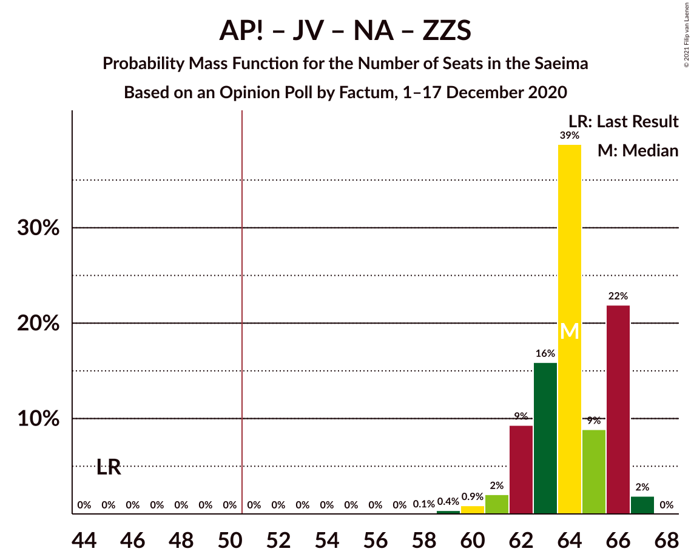

| Number of Seats | Probability | Accumulated | Special Marks |
|:---------------:|:-----------:|:-----------:|:-------------:|
| 45 | 0% | 100% | Last Result |
| 46 | 0% | 100% |  |
| 47 | 0% | 100% |  |
| 48 | 0% | 100% |  |
| 49 | 0% | 100% |  |
| 50 | 0% | 100% |  |
| 51 | 0% | 100% | Majority |
| 52 | 0% | 100% |  |
| 53 | 0% | 100% |  |
| 54 | 0% | 100% |  |
| 55 | 0% | 100% |  |
| 56 | 0% | 100% |  |
| 57 | 0% | 100% |  |
| 58 | 0.1% | 100% |  |
| 59 | 0.4% | 99.9% |  |
| 60 | 0.9% | 99.5% |  |
| 61 | 2% | 98.6% |  |
| 62 | 9% | 97% |  |
| 63 | 16% | 87% |  |
| 64 | 39% | 71% |  |
| 65 | 9% | 33% | Median |
| 66 | 22% | 24% |  |
| 67 | 2% | 2% |  |
| 68 | 0% | 0% |  |

### Jaunā VIENOTĪBA – Nacionālā apvienība „Visu Latvijai!”–„Tēvzemei un Brīvībai/LNNK” – Zaļo un Zemnieku savienība – Jaunā konservatīvā partija

| Number of Seats | Probability | Accumulated | Special Marks |
|:---------------:|:-----------:|:-----------:|:-------------:|
| 48 | 0% | 100% | Last Result |
| 49 | 0% | 100% |  |
| 50 | 0% | 100% |  |
| 51 | 0% | 100% | Majority |
| 52 | 0% | 100% |  |
| 53 | 0.4% | 100% |  |
| 54 | 0.5% | 99.6% |  |
| 55 | 2% | 99.1% |  |
| 56 | 6% | 97% |  |
| 57 | 46% | 91% |  |
| 58 | 19% | 46% | Median |
| 59 | 19% | 26% |  |
| 60 | 7% | 7% |  |
| 61 | 0% | 0% |  |

### Attīstībai/Par! – Nacionālā apvienība „Visu Latvijai!”–„Tēvzemei un Brīvībai/LNNK” – Zaļo un Zemnieku savienība – Jaunā konservatīvā partija

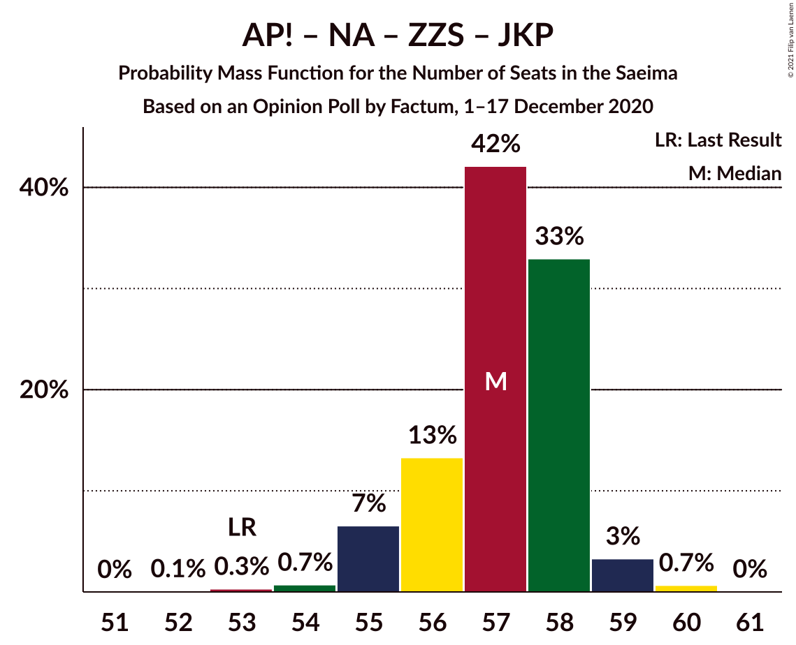

| Number of Seats | Probability | Accumulated | Special Marks |
|:---------------:|:-----------:|:-----------:|:-------------:|
| 52 | 0.1% | 100% |  |
| 53 | 0.3% | 99.9% | Last Result |
| 54 | 0.7% | 99.6% |  |
| 55 | 7% | 98.9% |  |
| 56 | 13% | 92% |  |
| 57 | 42% | 79% |  |
| 58 | 33% | 37% | Median |
| 59 | 3% | 4% |  |
| 60 | 0.7% | 0.7% |  |
| 61 | 0% | 0% |  |

### Attīstībai/Par! – Jaunā VIENOTĪBA – Nacionālā apvienība „Visu Latvijai!”–„Tēvzemei un Brīvībai/LNNK” – Jaunā konservatīvā partija

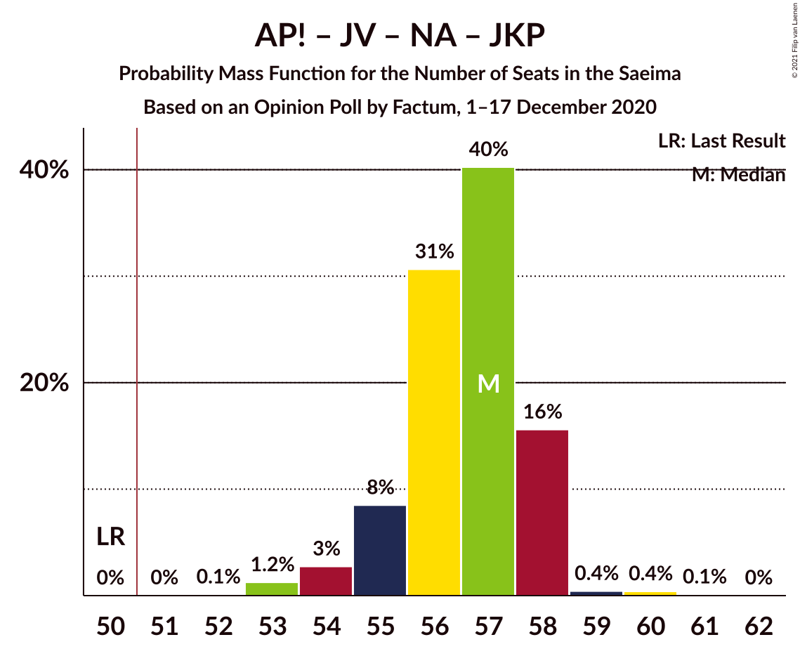

| Number of Seats | Probability | Accumulated | Special Marks |
|:---------------:|:-----------:|:-----------:|:-------------:|
| 50 | 0% | 100% | Last Result |
| 51 | 0% | 100% | Majority |
| 52 | 0.1% | 100% |  |
| 53 | 1.2% | 99.9% |  |
| 54 | 3% | 98.6% |  |
| 55 | 8% | 96% |  |
| 56 | 31% | 87% |  |
| 57 | 40% | 57% | Median |
| 58 | 16% | 17% |  |
| 59 | 0.4% | 0.9% |  |
| 60 | 0.4% | 0.5% |  |
| 61 | 0.1% | 0.1% |  |
| 62 | 0% | 0% |  |

### Attīstībai/Par! – Jaunā VIENOTĪBA – Nacionālā apvienība „Visu Latvijai!”–„Tēvzemei un Brīvībai/LNNK” – Jaunā konservatīvā partija – Politiskā partija „KPV LV”

| Number of Seats | Probability | Accumulated | Special Marks |
|:---------------:|:-----------:|:-----------:|:-------------:|
| 52 | 0.1% | 100% |  |
| 53 | 1.2% | 99.9% |  |
| 54 | 3% | 98.6% |  |
| 55 | 8% | 96% |  |
| 56 | 31% | 87% |  |
| 57 | 40% | 57% | Median |
| 58 | 16% | 17% |  |
| 59 | 0.4% | 0.9% |  |
| 60 | 0.4% | 0.5% |  |
| 61 | 0.1% | 0.1% |  |
| 62 | 0% | 0% |  |
| 63 | 0% | 0% |  |
| 64 | 0% | 0% |  |
| 65 | 0% | 0% |  |
| 66 | 0% | 0% | Last Result |

### Jaunā VIENOTĪBA – Nacionālā apvienība „Visu Latvijai!”–„Tēvzemei un Brīvībai/LNNK” – Zaļo un Zemnieku savienība

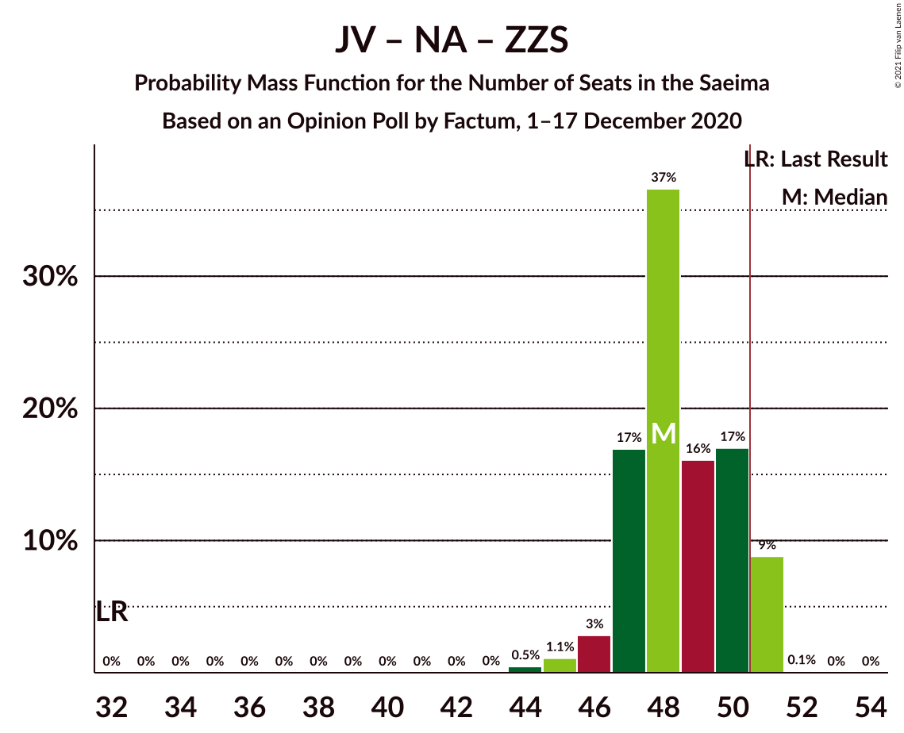

| Number of Seats | Probability | Accumulated | Special Marks |
|:---------------:|:-----------:|:-----------:|:-------------:|
| 32 | 0% | 100% | Last Result |
| 33 | 0% | 100% |  |
| 34 | 0% | 100% |  |
| 35 | 0% | 100% |  |
| 36 | 0% | 100% |  |
| 37 | 0% | 100% |  |
| 38 | 0% | 100% |  |
| 39 | 0% | 100% |  |
| 40 | 0% | 100% |  |
| 41 | 0% | 100% |  |
| 42 | 0% | 100% |  |
| 43 | 0% | 100% |  |
| 44 | 0.5% | 100% |  |
| 45 | 1.1% | 99.5% |  |
| 46 | 3% | 98% |  |
| 47 | 17% | 96% |  |
| 48 | 37% | 79% |  |
| 49 | 16% | 42% | Median |
| 50 | 17% | 26% |  |
| 51 | 9% | 9% | Majority |
| 52 | 0.1% | 0.1% |  |
| 53 | 0% | 0% |  |

### Attīstībai/Par! – Nacionālā apvienība „Visu Latvijai!”–„Tēvzemei un Brīvībai/LNNK” – Zaļo un Zemnieku savienība

| Number of Seats | Probability | Accumulated | Special Marks |
|:---------------:|:-----------:|:-----------:|:-------------:|
| 37 | 0% | 100% | Last Result |
| 38 | 0% | 100% |  |
| 39 | 0% | 100% |  |
| 40 | 0% | 100% |  |
| 41 | 0% | 100% |  |
| 42 | 0% | 100% |  |
| 43 | 0.1% | 100% |  |
| 44 | 0.3% | 99.9% |  |
| 45 | 0.8% | 99.6% |  |
| 46 | 7% | 98.8% |  |
| 47 | 18% | 92% |  |
| 48 | 46% | 74% |  |
| 49 | 26% | 28% | Median |
| 50 | 2% | 2% |  |
| 51 | 0% | 0% | Majority |

### Attīstībai/Par! – Jaunā VIENOTĪBA – Nacionālā apvienība „Visu Latvijai!”–„Tēvzemei un Brīvībai/LNNK” – Politiskā partija „KPV LV”

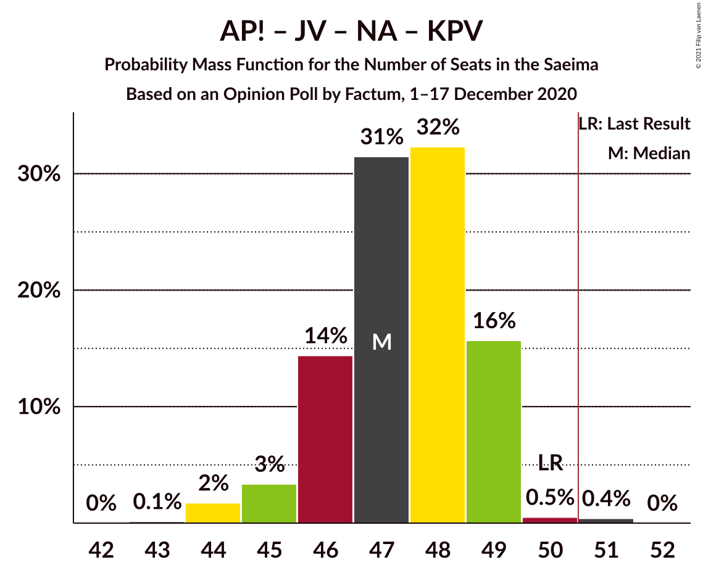

| Number of Seats | Probability | Accumulated | Special Marks |
|:---------------:|:-----------:|:-----------:|:-------------:|
| 43 | 0.1% | 100% |  |
| 44 | 2% | 99.8% |  |
| 45 | 3% | 98% |  |
| 46 | 14% | 95% |  |
| 47 | 31% | 80% |  |
| 48 | 32% | 49% | Median |
| 49 | 16% | 17% |  |
| 50 | 0.5% | 0.9% | Last Result |
| 51 | 0.4% | 0.4% | Majority |
| 52 | 0% | 0% |  |

### Attīstībai/Par! – Sociāldemokrātiskā partija “Saskaņa” – Jaunā konservatīvā partija

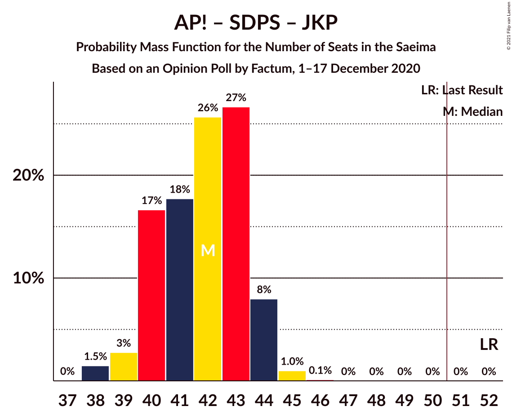

| Number of Seats | Probability | Accumulated | Special Marks |
|:---------------:|:-----------:|:-----------:|:-------------:|
| 38 | 1.5% | 100% |  |
| 39 | 3% | 98% |  |
| 40 | 17% | 96% |  |
| 41 | 18% | 79% |  |
| 42 | 26% | 61% | Median |
| 43 | 27% | 36% |  |
| 44 | 8% | 9% |  |
| 45 | 1.0% | 1.1% |  |
| 46 | 0.1% | 0.1% |  |
| 47 | 0% | 0% |  |
| 48 | 0% | 0% |  |
| 49 | 0% | 0% |  |
| 50 | 0% | 0% |  |
| 51 | 0% | 0% | Majority |
| 52 | 0% | 0% | Last Result |

### Nacionālā apvienība „Visu Latvijai!”–„Tēvzemei un Brīvībai/LNNK” – Zaļo un Zemnieku savienība – Jaunā konservatīvā partija

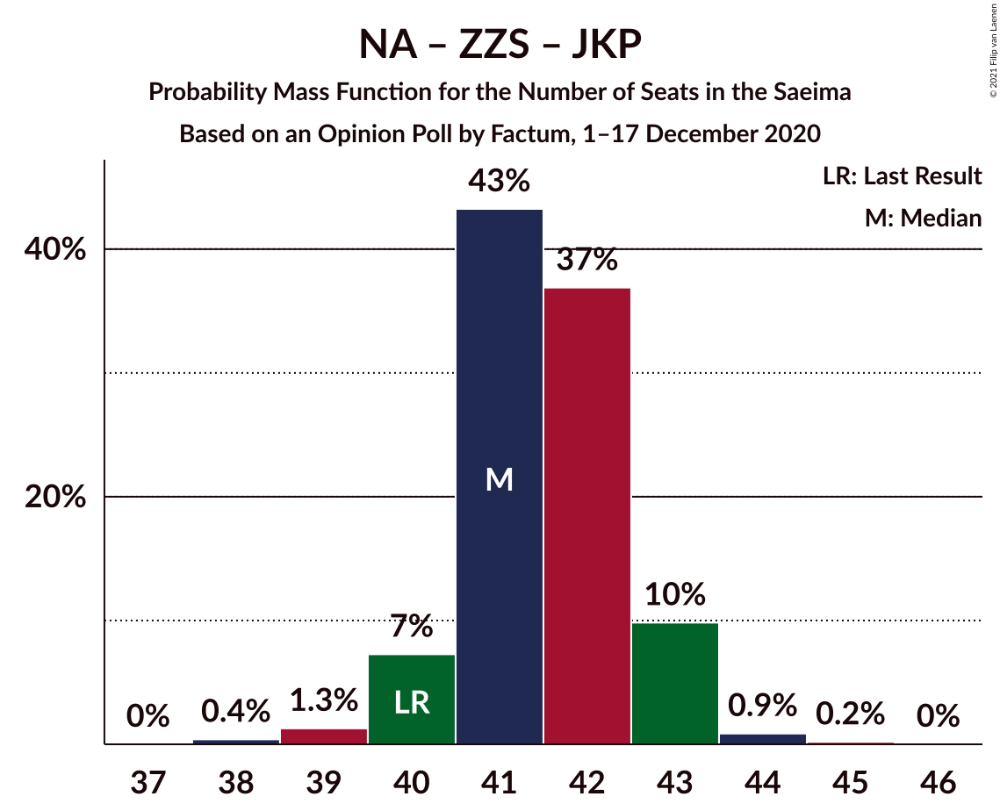

| Number of Seats | Probability | Accumulated | Special Marks |
|:---------------:|:-----------:|:-----------:|:-------------:|
| 38 | 0.4% | 100% |  |
| 39 | 1.3% | 99.6% |  |
| 40 | 7% | 98% | Last Result |
| 41 | 43% | 91% |  |
| 42 | 37% | 48% | Median |
| 43 | 10% | 11% |  |
| 44 | 0.9% | 1.1% |  |
| 45 | 0.2% | 0.2% |  |
| 46 | 0% | 0% |  |

### Attīstībai/Par! – Jaunā VIENOTĪBA – Jaunā konservatīvā partija – Politiskā partija „KPV LV”

| Number of Seats | Probability | Accumulated | Special Marks |
|:---------------:|:-----------:|:-----------:|:-------------:|
| 38 | 0.4% | 100% |  |
| 39 | 4% | 99.6% |  |
| 40 | 24% | 95% |  |
| 41 | 45% | 71% | Median |
| 42 | 22% | 26% |  |
| 43 | 3% | 4% |  |
| 44 | 0.4% | 0.5% |  |
| 45 | 0% | 0.1% |  |
| 46 | 0% | 0% |  |
| 47 | 0% | 0% |  |
| 48 | 0% | 0% |  |
| 49 | 0% | 0% |  |
| 50 | 0% | 0% |  |
| 51 | 0% | 0% | Majority |
| 52 | 0% | 0% |  |
| 53 | 0% | 0% | Last Result |

### Jaunā VIENOTĪBA – Nacionālā apvienība „Visu Latvijai!”–„Tēvzemei un Brīvībai/LNNK” – Jaunā konservatīvā partija – Politiskā partija „KPV LV”

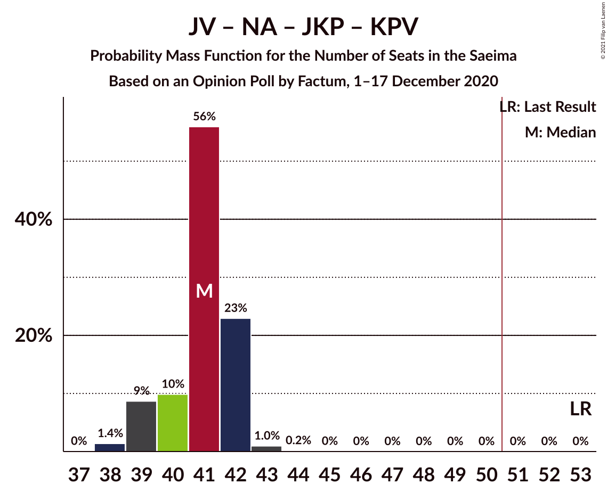

| Number of Seats | Probability | Accumulated | Special Marks |
|:---------------:|:-----------:|:-----------:|:-------------:|
| 37 | 0% | 100% |  |
| 38 | 1.4% | 99.9% |  |
| 39 | 9% | 98.6% |  |
| 40 | 10% | 90% |  |
| 41 | 56% | 80% | Median |
| 42 | 23% | 24% |  |
| 43 | 1.0% | 1.2% |  |
| 44 | 0.2% | 0.2% |  |
| 45 | 0% | 0.1% |  |
| 46 | 0% | 0% |  |
| 47 | 0% | 0% |  |
| 48 | 0% | 0% |  |
| 49 | 0% | 0% |  |
| 50 | 0% | 0% |  |
| 51 | 0% | 0% | Majority |
| 52 | 0% | 0% |  |
| 53 | 0% | 0% | Last Result |

### Attīstībai/Par! – Nacionālā apvienība „Visu Latvijai!”–„Tēvzemei un Brīvībai/LNNK” – Jaunā konservatīvā partija – Politiskā partija „KPV LV”

| Number of Seats | Probability | Accumulated | Special Marks |
|:---------------:|:-----------:|:-----------:|:-------------:|
| 37 | 0.1% | 100% |  |
| 38 | 9% | 99.9% |  |
| 39 | 9% | 91% |  |
| 40 | 28% | 82% |  |
| 41 | 44% | 54% | Median |
| 42 | 8% | 10% |  |
| 43 | 1.5% | 2% |  |
| 44 | 0.7% | 0.7% |  |
| 45 | 0% | 0% |  |
| 46 | 0% | 0% |  |
| 47 | 0% | 0% |  |
| 48 | 0% | 0% |  |
| 49 | 0% | 0% |  |
| 50 | 0% | 0% |  |
| 51 | 0% | 0% | Majority |
| 52 | 0% | 0% |  |
| 53 | 0% | 0% |  |
| 54 | 0% | 0% |  |
| 55 | 0% | 0% |  |
| 56 | 0% | 0% |  |
| 57 | 0% | 0% |  |
| 58 | 0% | 0% | Last Result |

### Sociāldemokrātiskā partija “Saskaņa” – Zaļo un Zemnieku savienība – Politiskā partija „KPV LV”

| Number of Seats | Probability | Accumulated | Special Marks |
|:---------------:|:-----------:|:-----------:|:-------------:|
| 30 | 1.2% | 100% |  |
| 31 | 2% | 98.8% |  |
| 32 | 2% | 97% |  |
| 33 | 25% | 95% |  |
| 34 | 58% | 70% | Median |
| 35 | 10% | 12% |  |
| 36 | 1.1% | 1.2% |  |
| 37 | 0.1% | 0.1% |  |
| 38 | 0% | 0% |  |
| 39 | 0% | 0% |  |
| 40 | 0% | 0% |  |
| 41 | 0% | 0% |  |
| 42 | 0% | 0% |  |
| 43 | 0% | 0% |  |
| 44 | 0% | 0% |  |
| 45 | 0% | 0% |  |
| 46 | 0% | 0% |  |
| 47 | 0% | 0% |  |
| 48 | 0% | 0% |  |
| 49 | 0% | 0% |  |
| 50 | 0% | 0% | Last Result |

### Attīstībai/Par! – Sociāldemokrātiskā partija “Saskaņa”

| Number of Seats | Probability | Accumulated | Special Marks |
|:---------------:|:-----------:|:-----------:|:-------------:|
| 29 | 1.4% | 100% |  |
| 30 | 3% | 98.5% |  |
| 31 | 15% | 96% |  |
| 32 | 23% | 80% |  |
| 33 | 27% | 58% | Median |
| 34 | 30% | 31% |  |
| 35 | 0.9% | 0.9% |  |
| 36 | 0% | 0% | Last Result |

### Sociāldemokrātiskā partija “Saskaņa” – Politiskā partija „KPV LV”

| Number of Seats | Probability | Accumulated | Special Marks |
|:---------------:|:-----------:|:-----------:|:-------------:|
| 14 | 1.4% | 100% |  |
| 15 | 2% | 98.6% |  |
| 16 | 33% | 96% |  |
| 17 | 20% | 63% | Median |
| 18 | 43% | 43% |  |
| 19 | 0.2% | 0.2% |  |
| 20 | 0% | 0% |  |
| 21 | 0% | 0% |  |
| 22 | 0% | 0% |  |
| 23 | 0% | 0% |  |
| 24 | 0% | 0% |  |
| 25 | 0% | 0% |  |
| 26 | 0% | 0% |  |
| 27 | 0% | 0% |  |
| 28 | 0% | 0% |  |
| 29 | 0% | 0% |  |
| 30 | 0% | 0% |  |
| 31 | 0% | 0% |  |
| 32 | 0% | 0% |  |
| 33 | 0% | 0% |  |
| 34 | 0% | 0% |  |
| 35 | 0% | 0% |  |
| 36 | 0% | 0% |  |
| 37 | 0% | 0% |  |
| 38 | 0% | 0% |  |
| 39 | 0% | 0% | Last Result |

## Technical Information

### Opinion Poll

+ **Polling firm:** Factum
+ **Commissioner(s):** —
+ **Fieldwork period:** 1–17 December 2020

### Calculations

+ **Sample size:** 2421
+ **Simulations done:** 1,048,576
+ **Error estimate:** 0.55%

