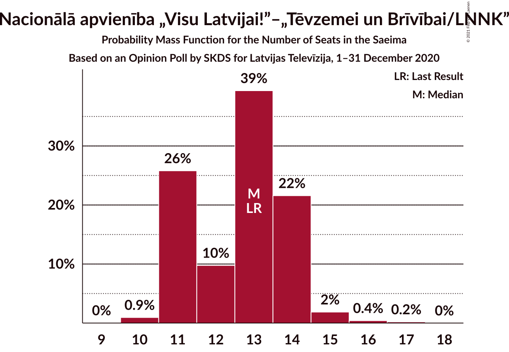
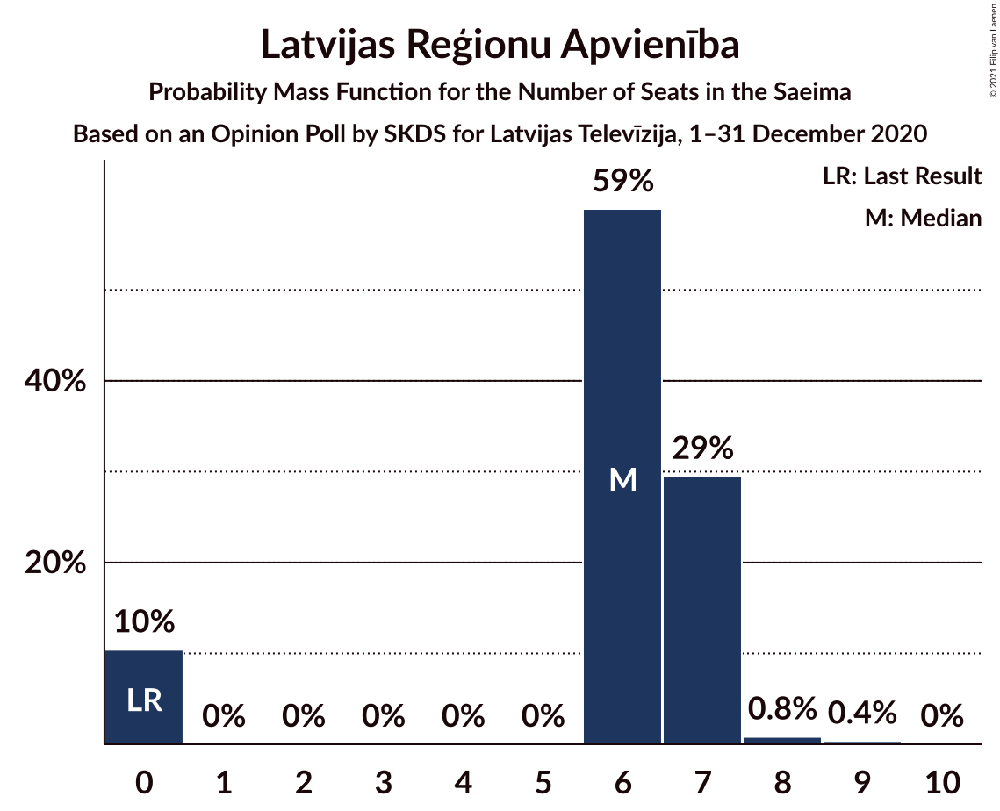
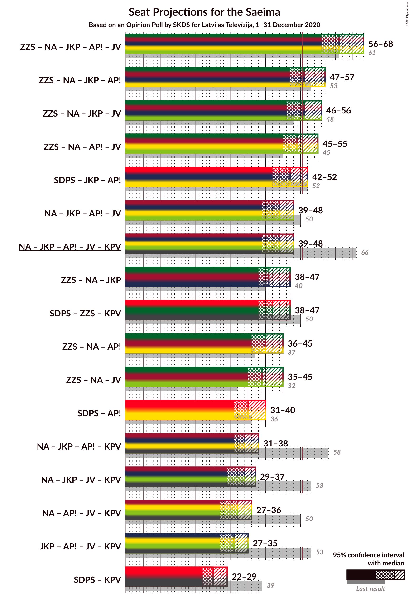
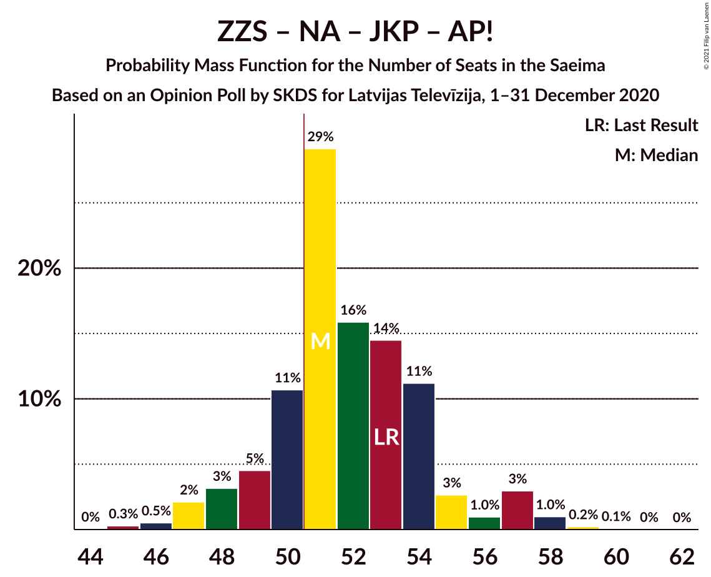
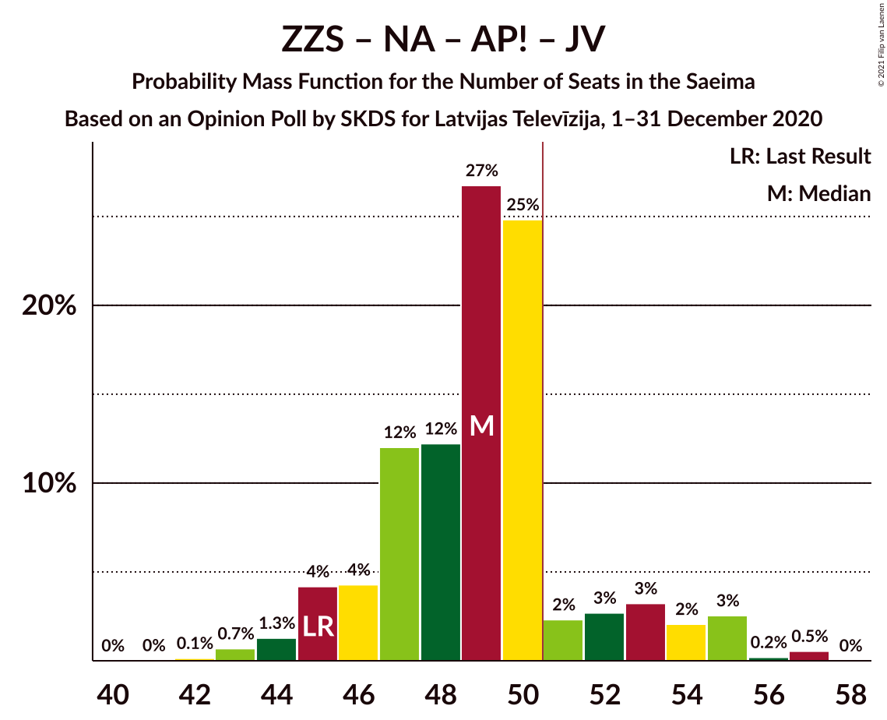
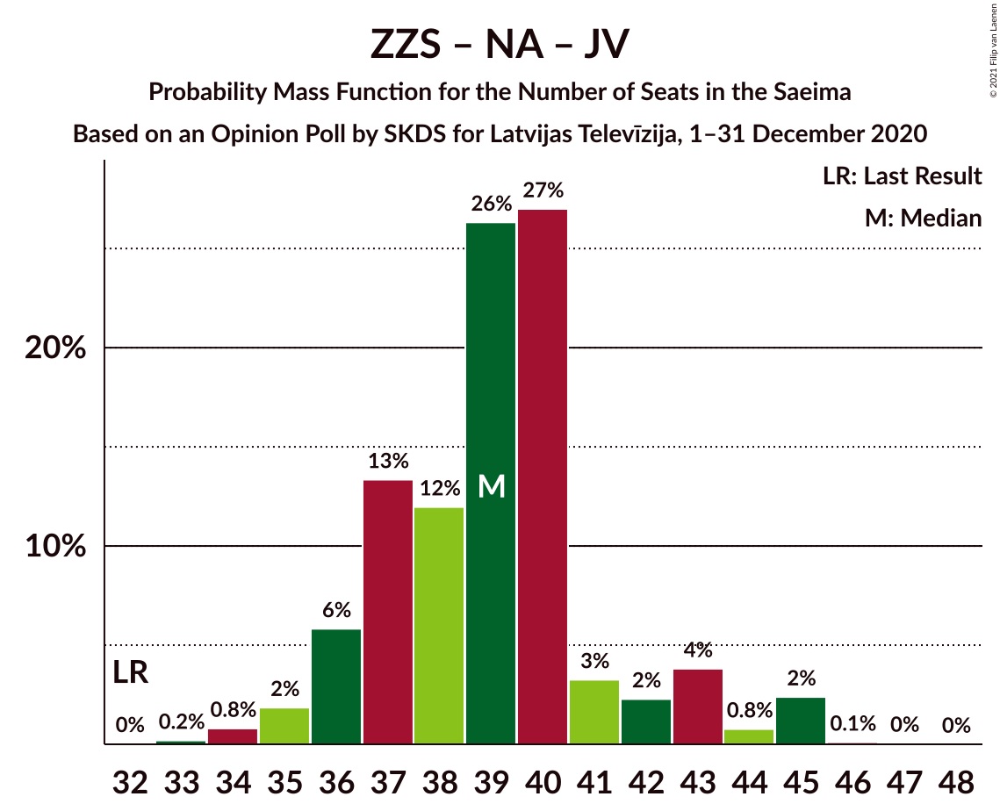
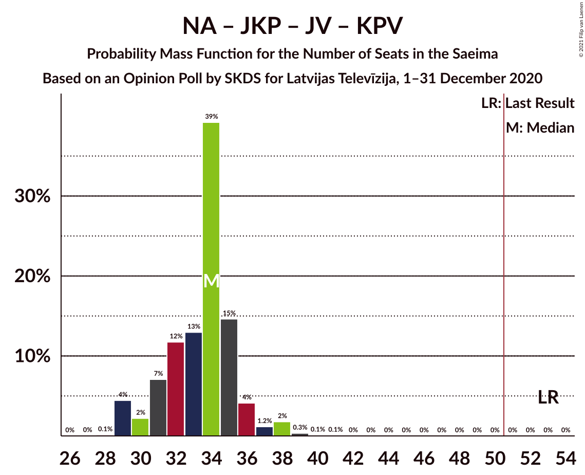

# Opinion Poll by SKDS for Latvijas Televīzija, 1–31 December 2020

<a href="#voting-intentions">Voting Intentions</a> | <a href="#seats">Seats</a> | <a href="#coalitions">Coalitions</a> | <a href="#technical-information">Technical Information</a>

## Voting Intentions

### Confidence Intervals

| Party | Last Result | Poll Result | 80% Confidence Interval | 90% Confidence Interval | 95% Confidence Interval | 99% Confidence Interval |
|:-----:|:-----------:|:-----------:|:-----------------------:|:-----------------------:|:-----------------------:|:-----------------------:|
| Sociāldemokrātiskā partija “Saskaņa” | 19.8% | 22.0% | 20.3–23.9% |19.8–24.4% |19.4–24.8% |18.6–25.7% |
| Zaļo un Zemnieku savienība | 9.9% | 15.6% | 14.1–17.2% |13.7–17.7% |13.3–18.1% |12.7–18.9% |
| Nacionālā apvienība „Visu Latvijai!”–„Tēvzemei un Brīvībai/LNNK” | 11.0% | 11.3% | 10.1–12.8% |9.7–13.2% |9.4–13.6% |8.9–14.3% |
| Jaunā konservatīvā partija | 13.6% | 10.3% | 9.1–11.8% |8.8–12.1% |8.5–12.5% |8.0–13.2% |
| Attīstībai/Par! | 12.0% | 9.3% | 8.2–10.7% |7.9–11.1% |7.6–11.4% |7.1–12.1% |
| Jaunā VIENOTĪBA | 6.7% | 8.0% | 7.0–9.3% |6.6–9.6% |6.4–10.0% |5.9–10.6% |
| PROGRESĪVIE | 2.6% | 7.6% | 6.5–8.8% |6.2–9.2% |6.0–9.5% |5.5–10.1% |
| Latvijas Reģionu Apvienība | 4.1% | 5.8% | 4.9–6.9% |4.6–7.2% |4.4–7.5% |4.0–8.1% |
| Latvijas Krievu savienība | 3.2% | 4.1% | 3.4–5.1% |3.2–5.4% |3.0–5.6% |2.7–6.1% |
| Politiskā partija „KPV LV” | 14.2% | 3.7% | 3.0–4.6% |2.8–4.9% |2.6–5.1% |2.3–5.6% |

*Note:* The poll result column reflects the actual value used in the calculations. Published results may vary slightly, and in addition be rounded to fewer digits.

## Seats

### Confidence Intervals

| Party | Last Result | Median | 80% Confidence Interval | 90% Confidence Interval | 95% Confidence Interval | 99% Confidence Interval |
|:-----:|:-----------:|:------:|:-----------------------:|:-----------------------:|:-----------------------:|:-----------------------:|
| <a href="#sociāldemokrātiskā-partija-“saskaņa”">Sociāldemokrātiskā partija “Saskaņa”</a> | 23 | 25 | 23–27 |22–28 |22–28 |21–29 |
| <a href="#zaļo-un-zemnieku-savienība">Zaļo un Zemnieku savienība</a> | 11 | 17 | 16–19 |16–19 |15–21 |14–22 |
| <a href="#nacionālā-apvienība-„visu-latvijai!”–„tēvzemei-un-brīvībai/lnnk”">Nacionālā apvienība „Visu Latvijai!”–„Tēvzemei un Brīvībai/LNNK”</a> | 13 | 13 | 11–14 |11–14 |11–15 |10–16 |
| <a href="#jaunā-konservatīvā-partija">Jaunā konservatīvā partija</a> | 16 | 12 | 10–13 |10–13 |9–13 |9–14 |
| <a href="#attīstībai/par!">Attīstībai/Par!</a> | 13 | 10 | 9–12 |8–13 |7–14 |7–14 |
| <a href="#jaunā-vienotība">Jaunā VIENOTĪBA</a> | 8 | 9 | 8–10 |8–11 |7–11 |7–11 |
| <a href="#progresīvie">PROGRESĪVIE</a> | 0 | 8 | 7–8 |7–10 |7–10 |6–11 |
| <a href="#latvijas-reģionu-apvienība">Latvijas Reģionu Apvienība</a> | 0 | 6 | 0–7 |0–7 |0–7 |0–8 |
| <a href="#latvijas-krievu-savienība">Latvijas Krievu savienība</a> | 0 | 0 | 0 |0–5 |0–6 |0–8 |
| <a href="#politiskā-partija-„kpv-lv”">Politiskā partija „KPV LV”</a> | 16 | 0 | 0 |0 |0–5 |0–5 |

### Sociāldemokrātiskā partija “Saskaņa”

*For a full overview of the results for this party, see the [Sociāldemokrātiskā partija “Saskaņa”](party-sociāldemokrātiskāpartija“saskaņa”.html) page.*

| Number of Seats | Probability | Accumulated | Special Marks |
|:---------------:|:-----------:|:-----------:|:-------------:|
| 19 | 0.1% | 100% |  |
| 20 | 0.1% | 99.9% |  |
| 21 | 1.0% | 99.8% |  |
| 22 | 4% | 98.7% |  |
| 23 | 6% | 95% | Last Result |
| 24 | 20% | 88% |  |
| 25 | 44% | 68% | Median |
| 26 | 8% | 25% |  |
| 27 | 11% | 17% |  |
| 28 | 3% | 6% |  |
| 29 | 2% | 2% |  |
| 30 | 0.4% | 0.4% |  |
| 31 | 0% | 0% |  |

### Zaļo un Zemnieku savienība

*For a full overview of the results for this party, see the [Zaļo un Zemnieku savienība](party-zaļounzemniekusavienība.html) page.*

| Number of Seats | Probability | Accumulated | Special Marks |
|:---------------:|:-----------:|:-----------:|:-------------:|
| 11 | 0% | 100% | Last Result |
| 12 | 0% | 100% |  |
| 13 | 0.1% | 100% |  |
| 14 | 1.1% | 99.9% |  |
| 15 | 2% | 98.8% |  |
| 16 | 9% | 96% |  |
| 17 | 52% | 88% | Median |
| 18 | 20% | 36% |  |
| 19 | 11% | 16% |  |
| 20 | 1.4% | 5% |  |
| 21 | 3% | 4% |  |
| 22 | 0.5% | 0.6% |  |
| 23 | 0.1% | 0.1% |  |
| 24 | 0% | 0% |  |

### Nacionālā apvienība „Visu Latvijai!”–„Tēvzemei un Brīvībai/LNNK”

*For a full overview of the results for this party, see the [Nacionālā apvienība „Visu Latvijai!”–„Tēvzemei un Brīvībai/LNNK”](party-nacionālāapvienība„visulatvijai”–„tēvzemeiunbrīvībailnnk”.html) page.*

| Number of Seats | Probability | Accumulated | Special Marks |
|:---------------:|:-----------:|:-----------:|:-------------:|
| 9 | 0% | 100% |  |
| 10 | 0.8% | 99.9% |  |
| 11 | 34% | 99.1% |  |
| 12 | 7% | 65% |  |
| 13 | 38% | 58% | Last Result, Median |
| 14 | 17% | 20% |  |
| 15 | 2% | 3% |  |
| 16 | 0.4% | 0.7% |  |
| 17 | 0.3% | 0.3% |  |
| 18 | 0% | 0% |  |

### Jaunā konservatīvā partija

*For a full overview of the results for this party, see the [Jaunā konservatīvā partija](party-jaunākonservatīvāpartija.html) page.*

| Number of Seats | Probability | Accumulated | Special Marks |
|:---------------:|:-----------:|:-----------:|:-------------:|
| 7 | 0.1% | 100% |  |
| 8 | 0.2% | 99.9% |  |
| 9 | 4% | 99.8% |  |
| 10 | 7% | 95% |  |
| 11 | 30% | 89% |  |
| 12 | 18% | 58% | Median |
| 13 | 39% | 40% |  |
| 14 | 0.7% | 1.1% |  |
| 15 | 0.4% | 0.4% |  |
| 16 | 0% | 0% | Last Result |

### Attīstībai/Par!

*For a full overview of the results for this party, see the [Attīstībai/Par!](party-attīstībaipar.html) page.*

| Number of Seats | Probability | Accumulated | Special Marks |
|:---------------:|:-----------:|:-----------:|:-------------:|
| 7 | 4% | 100% |  |
| 8 | 6% | 96% |  |
| 9 | 16% | 91% |  |
| 10 | 54% | 74% | Median |
| 11 | 8% | 20% |  |
| 12 | 4% | 12% |  |
| 13 | 3% | 8% | Last Result |
| 14 | 5% | 5% |  |
| 15 | 0.1% | 0.1% |  |
| 16 | 0% | 0% |  |

### Jaunā VIENOTĪBA

*For a full overview of the results for this party, see the [Jaunā VIENOTĪBA](party-jaunāvienotība.html) page.*

| Number of Seats | Probability | Accumulated | Special Marks |
|:---------------:|:-----------:|:-----------:|:-------------:|
| 7 | 3% | 100% |  |
| 8 | 42% | 97% | Last Result |
| 9 | 20% | 54% | Median |
| 10 | 27% | 35% |  |
| 11 | 8% | 8% |  |
| 12 | 0% | 0% |  |

### PROGRESĪVIE

*For a full overview of the results for this party, see the [PROGRESĪVIE](party-progresīvie.html) page.*

| Number of Seats | Probability | Accumulated | Special Marks |
|:---------------:|:-----------:|:-----------:|:-------------:|
| 0 | 0.1% | 100% | Last Result |
| 1 | 0% | 99.9% |  |
| 2 | 0% | 99.9% |  |
| 3 | 0% | 99.9% |  |
| 4 | 0% | 99.9% |  |
| 5 | 0% | 99.9% |  |
| 6 | 0.4% | 99.9% |  |
| 7 | 17% | 99.5% |  |
| 8 | 76% | 82% | Median |
| 9 | 1.1% | 6% |  |
| 10 | 3% | 5% |  |
| 11 | 2% | 2% |  |
| 12 | 0.2% | 0.2% |  |
| 13 | 0% | 0% |  |

### Latvijas Reģionu Apvienība

*For a full overview of the results for this party, see the [Latvijas Reģionu Apvienība](party-latvijasreģionuapvienība.html) page.*

| Number of Seats | Probability | Accumulated | Special Marks |
|:---------------:|:-----------:|:-----------:|:-------------:|
| 0 | 11% | 100% | Last Result |
| 1 | 0% | 89% |  |
| 2 | 0% | 89% |  |
| 3 | 0% | 89% |  |
| 4 | 0% | 89% |  |
| 5 | 0% | 89% |  |
| 6 | 53% | 89% | Median |
| 7 | 34% | 35% |  |
| 8 | 0.9% | 1.1% |  |
| 9 | 0.1% | 0.2% |  |
| 10 | 0% | 0% |  |

### Latvijas Krievu savienība

*For a full overview of the results for this party, see the [Latvijas Krievu savienība](party-latvijaskrievusavienība.html) page.*

| Number of Seats | Probability | Accumulated | Special Marks |
|:---------------:|:-----------:|:-----------:|:-------------:|
| 0 | 91% | 100% | Last Result, Median |
| 1 | 0% | 9% |  |
| 2 | 0% | 9% |  |
| 3 | 0% | 9% |  |
| 4 | 0% | 9% |  |
| 5 | 4% | 9% |  |
| 6 | 3% | 5% |  |
| 7 | 1.3% | 2% |  |
| 8 | 0.5% | 0.5% |  |
| 9 | 0% | 0% |  |

### Politiskā partija „KPV LV”

*For a full overview of the results for this party, see the [Politiskā partija „KPV LV”](party-politiskāpartija„kpvlv”.html) page.*

| Number of Seats | Probability | Accumulated | Special Marks |
|:---------------:|:-----------:|:-----------:|:-------------:|
| 0 | 97% | 100% | Median |
| 1 | 0% | 3% |  |
| 2 | 0% | 3% |  |
| 3 | 0% | 3% |  |
| 4 | 0% | 3% |  |
| 5 | 2% | 3% |  |
| 6 | 0.4% | 0.4% |  |
| 7 | 0.1% | 0.1% |  |
| 8 | 0% | 0% |  |
| 9 | 0% | 0% |  |
| 10 | 0% | 0% |  |
| 11 | 0% | 0% |  |
| 12 | 0% | 0% |  |
| 13 | 0% | 0% |  |
| 14 | 0% | 0% |  |
| 15 | 0% | 0% |  |
| 16 | 0% | 0% | Last Result |

## Coalitions

### Confidence Intervals

| Coalition | Last Result | Median | Majority? | 80% Confidence Interval | 90% Confidence Interval | 95% Confidence Interval | 99% Confidence Interval |
|:---------:|:-----------:|:------:|:---------:|:-----------------------:|:-----------------------:|:-----------------------:|:-----------------------:|
| Zaļo un Zemnieku savienība – Nacionālā apvienība „Visu Latvijai!”–„Tēvzemei un Brīvībai/LNNK” – Jaunā konservatīvā partija – Attīstībai/Par! – Jaunā VIENOTĪBA | 61 | 61 | 100% | 58–63 | 57–65 | 56–66 | 55–68 |
| Zaļo un Zemnieku savienība – Nacionālā apvienība „Visu Latvijai!”–„Tēvzemei un Brīvībai/LNNK” – Jaunā konservatīvā partija – Attīstībai/Par! | 53 | 52 | 81% | 50–54 | 48–55 | 47–57 | 46–59 |
| Zaļo un Zemnieku savienība – Nacionālā apvienība „Visu Latvijai!”–„Tēvzemei un Brīvībai/LNNK” – Jaunā konservatīvā partija – Jaunā VIENOTĪBA | 48 | 51 | 63% | 48–53 | 47–54 | 47–55 | 44–56 |
| Zaļo un Zemnieku savienība – Nacionālā apvienība „Visu Latvijai!”–„Tēvzemei un Brīvībai/LNNK” – Attīstībai/Par! – Jaunā VIENOTĪBA | 45 | 49 | 12% | 47–51 | 45–54 | 45–54 | 43–57 |
| Sociāldemokrātiskā partija “Saskaņa” – Jaunā konservatīvā partija – Attīstībai/Par! | 52 | 47 | 6% | 45–49 | 43–51 | 42–52 | 40–53 |
| Nacionālā apvienība „Visu Latvijai!”–„Tēvzemei un Brīvībai/LNNK” – Jaunā konservatīvā partija – Attīstībai/Par! – Jaunā VIENOTĪBA | 50 | 44 | 0.1% | 41–45 | 40–47 | 39–48 | 38–49 |
| Nacionālā apvienība „Visu Latvijai!”–„Tēvzemei un Brīvībai/LNNK” – Jaunā konservatīvā partija – Attīstībai/Par! – Jaunā VIENOTĪBA – Politiskā partija „KPV LV” | 66 | 44 | 0.2% | 41–46 | 40–47 | 39–48 | 38–49 |
| Sociāldemokrātiskā partija “Saskaņa” – Zaļo un Zemnieku savienība – Politiskā partija „KPV LV” | 50 | 42 | 0.1% | 41–45 | 39–46 | 38–48 | 37–49 |
| Zaļo un Zemnieku savienība – Nacionālā apvienība „Visu Latvijai!”–„Tēvzemei un Brīvībai/LNNK” – Attīstībai/Par! | 37 | 40 | 0% | 38–42 | 37–44 | 36–46 | 35–46 |
| Zaļo un Zemnieku savienība – Nacionālā apvienība „Visu Latvijai!”–„Tēvzemei un Brīvībai/LNNK” – Jaunā konservatīvā partija | 40 | 42 | 0% | 39–44 | 39–45 | 38–45 | 35–47 |
| Zaļo un Zemnieku savienība – Nacionālā apvienība „Visu Latvijai!”–„Tēvzemei un Brīvībai/LNNK” – Jaunā VIENOTĪBA | 32 | 39 | 0% | 37–40 | 36–42 | 35–44 | 34–45 |
| Sociāldemokrātiskā partija “Saskaņa” – Attīstībai/Par! | 36 | 35 | 0% | 33–38 | 32–39 | 31–41 | 30–41 |
| Nacionālā apvienība „Visu Latvijai!”–„Tēvzemei un Brīvībai/LNNK” – Jaunā konservatīvā partija – Attīstībai/Par! – Politiskā partija „KPV LV” | 58 | 34 | 0% | 32–37 | 32–38 | 31–39 | 30–41 |
| Nacionālā apvienība „Visu Latvijai!”–„Tēvzemei un Brīvībai/LNNK” – Attīstībai/Par! – Jaunā VIENOTĪBA – Politiskā partija „KPV LV” | 50 | 32 | 0% | 29–34 | 28–36 | 27–37 | 27–38 |
| Nacionālā apvienība „Visu Latvijai!”–„Tēvzemei un Brīvībai/LNNK” – Jaunā konservatīvā partija – Jaunā VIENOTĪBA – Politiskā partija „KPV LV” | 53 | 34 | 0% | 31–35 | 30–36 | 29–36 | 29–39 |
| Jaunā konservatīvā partija – Attīstībai/Par! – Jaunā VIENOTĪBA – Politiskā partija „KPV LV” | 53 | 31 | 0% | 29–33 | 28–34 | 27–35 | 25–37 |
| Sociāldemokrātiskā partija “Saskaņa” – Politiskā partija „KPV LV” | 39 | 25 | 0% | 23–27 | 23–28 | 22–29 | 21–30 |

### Zaļo un Zemnieku savienība – Nacionālā apvienība „Visu Latvijai!”–„Tēvzemei un Brīvībai/LNNK” – Jaunā konservatīvā partija – Attīstībai/Par! – Jaunā VIENOTĪBA

| Number of Seats | Probability | Accumulated | Special Marks |
|:---------------:|:-----------:|:-----------:|:-------------:|
| 52 | 0.1% | 100% |  |
| 53 | 0.1% | 99.9% |  |
| 54 | 0.2% | 99.8% |  |
| 55 | 2% | 99.6% |  |
| 56 | 2% | 98% |  |
| 57 | 2% | 96% |  |
| 58 | 8% | 94% |  |
| 59 | 7% | 86% |  |
| 60 | 17% | 79% |  |
| 61 | 39% | 62% | Last Result, Median |
| 62 | 9% | 23% |  |
| 63 | 5% | 14% |  |
| 64 | 3% | 9% |  |
| 65 | 3% | 7% |  |
| 66 | 1.5% | 3% |  |
| 67 | 0.2% | 2% |  |
| 68 | 2% | 2% |  |
| 69 | 0.1% | 0.1% |  |
| 70 | 0% | 0% |  |

### Zaļo un Zemnieku savienība – Nacionālā apvienība „Visu Latvijai!”–„Tēvzemei un Brīvībai/LNNK” – Jaunā konservatīvā partija – Attīstībai/Par!

| Number of Seats | Probability | Accumulated | Special Marks |
|:---------------:|:-----------:|:-----------:|:-------------:|
| 44 | 0.1% | 100% |  |
| 45 | 0.2% | 99.9% |  |
| 46 | 0.6% | 99.8% |  |
| 47 | 3% | 99.2% |  |
| 48 | 3% | 97% |  |
| 49 | 3% | 93% |  |
| 50 | 9% | 90% |  |
| 51 | 26% | 81% | Majority |
| 52 | 24% | 55% | Median |
| 53 | 14% | 31% | Last Result |
| 54 | 8% | 17% |  |
| 55 | 4% | 9% |  |
| 56 | 1.2% | 4% |  |
| 57 | 1.5% | 3% |  |
| 58 | 1.3% | 2% |  |
| 59 | 0.4% | 0.5% |  |
| 60 | 0.1% | 0.1% |  |
| 61 | 0% | 0% |  |

### Zaļo un Zemnieku savienība – Nacionālā apvienība „Visu Latvijai!”–„Tēvzemei un Brīvībai/LNNK” – Jaunā konservatīvā partija – Jaunā VIENOTĪBA

| Number of Seats | Probability | Accumulated | Special Marks |
|:---------------:|:-----------:|:-----------:|:-------------:|
| 43 | 0.1% | 100% |  |
| 44 | 0.5% | 99.9% |  |
| 45 | 1.0% | 99.4% |  |
| 46 | 0.7% | 98% |  |
| 47 | 6% | 98% |  |
| 48 | 5% | 92% | Last Result |
| 49 | 8% | 87% |  |
| 50 | 16% | 79% |  |
| 51 | 36% | 63% | Median, Majority |
| 52 | 15% | 27% |  |
| 53 | 6% | 12% |  |
| 54 | 3% | 6% |  |
| 55 | 0.9% | 3% |  |
| 56 | 2% | 2% |  |
| 57 | 0.1% | 0.4% |  |
| 58 | 0.4% | 0.4% |  |
| 59 | 0% | 0% |  |

### Zaļo un Zemnieku savienība – Nacionālā apvienība „Visu Latvijai!”–„Tēvzemei un Brīvībai/LNNK” – Attīstībai/Par! – Jaunā VIENOTĪBA

| Number of Seats | Probability | Accumulated | Special Marks |
|:---------------:|:-----------:|:-----------:|:-------------:|
| 42 | 0.1% | 100% |  |
| 43 | 0.4% | 99.8% |  |
| 44 | 1.1% | 99.4% |  |
| 45 | 5% | 98% | Last Result |
| 46 | 3% | 94% |  |
| 47 | 15% | 91% |  |
| 48 | 18% | 75% |  |
| 49 | 20% | 57% | Median |
| 50 | 24% | 36% |  |
| 51 | 3% | 12% | Majority |
| 52 | 2% | 10% |  |
| 53 | 2% | 7% |  |
| 54 | 3% | 6% |  |
| 55 | 1.1% | 2% |  |
| 56 | 0.2% | 1.2% |  |
| 57 | 1.0% | 1.0% |  |
| 58 | 0% | 0% |  |

### Sociāldemokrātiskā partija “Saskaņa” – Jaunā konservatīvā partija – Attīstībai/Par!

| Number of Seats | Probability | Accumulated | Special Marks |
|:---------------:|:-----------:|:-----------:|:-------------:|
| 38 | 0.1% | 100% |  |
| 39 | 0.1% | 99.9% |  |
| 40 | 0.4% | 99.8% |  |
| 41 | 0.5% | 99.4% |  |
| 42 | 3% | 98.9% |  |
| 43 | 3% | 96% |  |
| 44 | 2% | 93% |  |
| 45 | 5% | 91% |  |
| 46 | 29% | 86% |  |
| 47 | 23% | 57% | Median |
| 48 | 20% | 34% |  |
| 49 | 5% | 14% |  |
| 50 | 3% | 9% |  |
| 51 | 2% | 6% | Majority |
| 52 | 2% | 4% | Last Result |
| 53 | 1.2% | 2% |  |
| 54 | 0.4% | 0.4% |  |
| 55 | 0.1% | 0.1% |  |
| 56 | 0% | 0% |  |

### Nacionālā apvienība „Visu Latvijai!”–„Tēvzemei un Brīvībai/LNNK” – Jaunā konservatīvā partija – Attīstībai/Par! – Jaunā VIENOTĪBA

| Number of Seats | Probability | Accumulated | Special Marks |
|:---------------:|:-----------:|:-----------:|:-------------:|
| 36 | 0.1% | 100% |  |
| 37 | 0.2% | 99.9% |  |
| 38 | 2% | 99.7% |  |
| 39 | 2% | 98% |  |
| 40 | 5% | 96% |  |
| 41 | 4% | 91% |  |
| 42 | 20% | 87% |  |
| 43 | 14% | 67% |  |
| 44 | 33% | 53% | Median |
| 45 | 10% | 20% |  |
| 46 | 3% | 9% |  |
| 47 | 3% | 7% |  |
| 48 | 3% | 4% |  |
| 49 | 1.4% | 2% |  |
| 50 | 0.1% | 0.2% | Last Result |
| 51 | 0.1% | 0.1% | Majority |
| 52 | 0% | 0% |  |

### Nacionālā apvienība „Visu Latvijai!”–„Tēvzemei un Brīvībai/LNNK” – Jaunā konservatīvā partija – Attīstībai/Par! – Jaunā VIENOTĪBA – Politiskā partija „KPV LV”

| Number of Seats | Probability | Accumulated | Special Marks |
|:---------------:|:-----------:|:-----------:|:-------------:|
| 37 | 0.1% | 100% |  |
| 38 | 1.4% | 99.8% |  |
| 39 | 1.2% | 98% |  |
| 40 | 5% | 97% |  |
| 41 | 4% | 92% |  |
| 42 | 20% | 89% |  |
| 43 | 14% | 69% |  |
| 44 | 33% | 54% | Median |
| 45 | 11% | 21% |  |
| 46 | 3% | 10% |  |
| 47 | 3% | 7% |  |
| 48 | 3% | 5% |  |
| 49 | 1.5% | 2% |  |
| 50 | 0.2% | 0.4% |  |
| 51 | 0.1% | 0.2% | Majority |
| 52 | 0% | 0% |  |
| 53 | 0% | 0% |  |
| 54 | 0% | 0% |  |
| 55 | 0% | 0% |  |
| 56 | 0% | 0% |  |
| 57 | 0% | 0% |  |
| 58 | 0% | 0% |  |
| 59 | 0% | 0% |  |
| 60 | 0% | 0% |  |
| 61 | 0% | 0% |  |
| 62 | 0% | 0% |  |
| 63 | 0% | 0% |  |
| 64 | 0% | 0% |  |
| 65 | 0% | 0% |  |
| 66 | 0% | 0% | Last Result |

### Sociāldemokrātiskā partija “Saskaņa” – Zaļo un Zemnieku savienība – Politiskā partija „KPV LV”

| Number of Seats | Probability | Accumulated | Special Marks |
|:---------------:|:-----------:|:-----------:|:-------------:|
| 35 | 0.1% | 100% |  |
| 36 | 0.1% | 99.9% |  |
| 37 | 1.0% | 99.8% |  |
| 38 | 2% | 98.9% |  |
| 39 | 3% | 97% |  |
| 40 | 4% | 94% |  |
| 41 | 17% | 90% |  |
| 42 | 29% | 73% | Median |
| 43 | 15% | 45% |  |
| 44 | 17% | 30% |  |
| 45 | 6% | 13% |  |
| 46 | 3% | 7% |  |
| 47 | 2% | 5% |  |
| 48 | 1.3% | 3% |  |
| 49 | 1.1% | 1.3% |  |
| 50 | 0.1% | 0.2% | Last Result |
| 51 | 0% | 0.1% | Majority |
| 52 | 0% | 0% |  |

### Zaļo un Zemnieku savienība – Nacionālā apvienība „Visu Latvijai!”–„Tēvzemei un Brīvībai/LNNK” – Attīstībai/Par!

| Number of Seats | Probability | Accumulated | Special Marks |
|:---------------:|:-----------:|:-----------:|:-------------:|
| 34 | 0.2% | 100% |  |
| 35 | 1.0% | 99.8% |  |
| 36 | 2% | 98.8% |  |
| 37 | 6% | 96% | Last Result |
| 38 | 9% | 90% |  |
| 39 | 21% | 81% |  |
| 40 | 26% | 60% | Median |
| 41 | 20% | 34% |  |
| 42 | 4% | 14% |  |
| 43 | 2% | 9% |  |
| 44 | 4% | 7% |  |
| 45 | 1.1% | 4% |  |
| 46 | 2% | 3% |  |
| 47 | 0.2% | 0.2% |  |
| 48 | 0.1% | 0.1% |  |
| 49 | 0% | 0% |  |

### Zaļo un Zemnieku savienība – Nacionālā apvienība „Visu Latvijai!”–„Tēvzemei un Brīvībai/LNNK” – Jaunā konservatīvā partija

| Number of Seats | Probability | Accumulated | Special Marks |
|:---------------:|:-----------:|:-----------:|:-------------:|
| 35 | 0.6% | 100% |  |
| 36 | 0.2% | 99.4% |  |
| 37 | 1.1% | 99.2% |  |
| 38 | 2% | 98% |  |
| 39 | 7% | 96% |  |
| 40 | 4% | 89% | Last Result |
| 41 | 31% | 84% |  |
| 42 | 20% | 53% | Median |
| 43 | 19% | 32% |  |
| 44 | 7% | 13% |  |
| 45 | 3% | 6% |  |
| 46 | 0.9% | 2% |  |
| 47 | 0.9% | 1.3% |  |
| 48 | 0.3% | 0.4% |  |
| 49 | 0.1% | 0.2% |  |
| 50 | 0% | 0% |  |

### Zaļo un Zemnieku savienība – Nacionālā apvienība „Visu Latvijai!”–„Tēvzemei un Brīvībai/LNNK” – Jaunā VIENOTĪBA

| Number of Seats | Probability | Accumulated | Special Marks |
|:---------------:|:-----------:|:-----------:|:-------------:|
| 32 | 0% | 100% | Last Result |
| 33 | 0.3% | 100% |  |
| 34 | 0.4% | 99.6% |  |
| 35 | 2% | 99.2% |  |
| 36 | 5% | 97% |  |
| 37 | 19% | 92% |  |
| 38 | 14% | 74% |  |
| 39 | 23% | 60% | Median |
| 40 | 27% | 37% |  |
| 41 | 4% | 10% |  |
| 42 | 2% | 6% |  |
| 43 | 2% | 4% |  |
| 44 | 1.1% | 3% |  |
| 45 | 1.5% | 2% |  |
| 46 | 0% | 0.1% |  |
| 47 | 0% | 0% |  |

### Sociāldemokrātiskā partija “Saskaņa” – Attīstībai/Par!

| Number of Seats | Probability | Accumulated | Special Marks |
|:---------------:|:-----------:|:-----------:|:-------------:|
| 28 | 0.2% | 100% |  |
| 29 | 0.3% | 99.8% |  |
| 30 | 2% | 99.6% |  |
| 31 | 2% | 98% |  |
| 32 | 3% | 96% |  |
| 33 | 6% | 93% |  |
| 34 | 22% | 87% |  |
| 35 | 37% | 65% | Median |
| 36 | 10% | 27% | Last Result |
| 37 | 7% | 18% |  |
| 38 | 5% | 11% |  |
| 39 | 2% | 6% |  |
| 40 | 1.4% | 4% |  |
| 41 | 3% | 3% |  |
| 42 | 0.1% | 0.1% |  |
| 43 | 0% | 0% |  |

### Nacionālā apvienība „Visu Latvijai!”–„Tēvzemei un Brīvībai/LNNK” – Jaunā konservatīvā partija – Attīstībai/Par! – Politiskā partija „KPV LV”

| Number of Seats | Probability | Accumulated | Special Marks |
|:---------------:|:-----------:|:-----------:|:-------------:|
| 28 | 0.1% | 100% |  |
| 29 | 0.4% | 99.9% |  |
| 30 | 2% | 99.5% |  |
| 31 | 2% | 98% |  |
| 32 | 9% | 96% |  |
| 33 | 13% | 87% |  |
| 34 | 33% | 74% |  |
| 35 | 12% | 42% | Median |
| 36 | 17% | 30% |  |
| 37 | 7% | 13% |  |
| 38 | 3% | 6% |  |
| 39 | 0.7% | 3% |  |
| 40 | 0.9% | 2% |  |
| 41 | 1.0% | 1.1% |  |
| 42 | 0.1% | 0.1% |  |
| 43 | 0.1% | 0.1% |  |
| 44 | 0% | 0% |  |
| 45 | 0% | 0% |  |
| 46 | 0% | 0% |  |
| 47 | 0% | 0% |  |
| 48 | 0% | 0% |  |
| 49 | 0% | 0% |  |
| 50 | 0% | 0% |  |
| 51 | 0% | 0% | Majority |
| 52 | 0% | 0% |  |
| 53 | 0% | 0% |  |
| 54 | 0% | 0% |  |
| 55 | 0% | 0% |  |
| 56 | 0% | 0% |  |
| 57 | 0% | 0% |  |
| 58 | 0% | 0% | Last Result |

### Nacionālā apvienība „Visu Latvijai!”–„Tēvzemei un Brīvībai/LNNK” – Attīstībai/Par! – Jaunā VIENOTĪBA – Politiskā partija „KPV LV”

| Number of Seats | Probability | Accumulated | Special Marks |
|:---------------:|:-----------:|:-----------:|:-------------:|
| 25 | 0% | 100% |  |
| 26 | 0.1% | 99.9% |  |
| 27 | 3% | 99.8% |  |
| 28 | 2% | 96% |  |
| 29 | 17% | 95% |  |
| 30 | 10% | 78% |  |
| 31 | 10% | 68% |  |
| 32 | 23% | 57% | Median |
| 33 | 22% | 34% |  |
| 34 | 3% | 12% |  |
| 35 | 3% | 9% |  |
| 36 | 3% | 6% |  |
| 37 | 3% | 3% |  |
| 38 | 0.5% | 0.7% |  |
| 39 | 0.1% | 0.2% |  |
| 40 | 0% | 0% |  |
| 41 | 0% | 0% |  |
| 42 | 0% | 0% |  |
| 43 | 0% | 0% |  |
| 44 | 0% | 0% |  |
| 45 | 0% | 0% |  |
| 46 | 0% | 0% |  |
| 47 | 0% | 0% |  |
| 48 | 0% | 0% |  |
| 49 | 0% | 0% |  |
| 50 | 0% | 0% | Last Result |

### Nacionālā apvienība „Visu Latvijai!”–„Tēvzemei un Brīvībai/LNNK” – Jaunā konservatīvā partija – Jaunā VIENOTĪBA – Politiskā partija „KPV LV”

| Number of Seats | Probability | Accumulated | Special Marks |
|:---------------:|:-----------:|:-----------:|:-------------:|
| 28 | 0.1% | 100% |  |
| 29 | 3% | 99.8% |  |
| 30 | 2% | 97% |  |
| 31 | 5% | 94% |  |
| 32 | 17% | 90% |  |
| 33 | 15% | 72% |  |
| 34 | 39% | 57% | Median |
| 35 | 12% | 18% |  |
| 36 | 4% | 6% |  |
| 37 | 1.2% | 2% |  |
| 38 | 0.4% | 0.9% |  |
| 39 | 0.3% | 0.5% |  |
| 40 | 0.1% | 0.2% |  |
| 41 | 0.1% | 0.1% |  |
| 42 | 0% | 0% |  |
| 43 | 0% | 0% |  |
| 44 | 0% | 0% |  |
| 45 | 0% | 0% |  |
| 46 | 0% | 0% |  |
| 47 | 0% | 0% |  |
| 48 | 0% | 0% |  |
| 49 | 0% | 0% |  |
| 50 | 0% | 0% |  |
| 51 | 0% | 0% | Majority |
| 52 | 0% | 0% |  |
| 53 | 0% | 0% | Last Result |

### Jaunā konservatīvā partija – Attīstībai/Par! – Jaunā VIENOTĪBA – Politiskā partija „KPV LV”

| Number of Seats | Probability | Accumulated | Special Marks |
|:---------------:|:-----------:|:-----------:|:-------------:|
| 24 | 0.1% | 100% |  |
| 25 | 0.8% | 99.9% |  |
| 26 | 0.5% | 99.2% |  |
| 27 | 2% | 98.7% |  |
| 28 | 3% | 97% |  |
| 29 | 11% | 94% |  |
| 30 | 16% | 83% |  |
| 31 | 38% | 67% | Median |
| 32 | 14% | 29% |  |
| 33 | 6% | 15% |  |
| 34 | 4% | 8% |  |
| 35 | 3% | 4% |  |
| 36 | 1.2% | 2% |  |
| 37 | 0.3% | 0.5% |  |
| 38 | 0.1% | 0.2% |  |
| 39 | 0.1% | 0.1% |  |
| 40 | 0% | 0% |  |
| 41 | 0% | 0% |  |
| 42 | 0% | 0% |  |
| 43 | 0% | 0% |  |
| 44 | 0% | 0% |  |
| 45 | 0% | 0% |  |
| 46 | 0% | 0% |  |
| 47 | 0% | 0% |  |
| 48 | 0% | 0% |  |
| 49 | 0% | 0% |  |
| 50 | 0% | 0% |  |
| 51 | 0% | 0% | Majority |
| 52 | 0% | 0% |  |
| 53 | 0% | 0% | Last Result |

### Sociāldemokrātiskā partija “Saskaņa” – Politiskā partija „KPV LV”

| Number of Seats | Probability | Accumulated | Special Marks |
|:---------------:|:-----------:|:-----------:|:-------------:|
| 19 | 0.1% | 100% |  |
| 20 | 0.1% | 99.9% |  |
| 21 | 0.9% | 99.8% |  |
| 22 | 4% | 98.9% |  |
| 23 | 6% | 95% |  |
| 24 | 18% | 89% |  |
| 25 | 44% | 70% | Median |
| 26 | 7% | 27% |  |
| 27 | 12% | 19% |  |
| 28 | 3% | 8% |  |
| 29 | 3% | 4% |  |
| 30 | 0.8% | 1.2% |  |
| 31 | 0.2% | 0.4% |  |
| 32 | 0.1% | 0.2% |  |
| 33 | 0% | 0.1% |  |
| 34 | 0% | 0% |  |
| 35 | 0% | 0% |  |
| 36 | 0% | 0% |  |
| 37 | 0% | 0% |  |
| 38 | 0% | 0% |  |
| 39 | 0% | 0% | Last Result |

## Technical Information

### Opinion Poll

+ **Polling firm:** SKDS
+ **Commissioner(s):** Latvijas Televīzija
+ **Fieldwork period:** 1–31 December 2020

### Calculations

+ **Sample size:** 900
+ **Simulations done:** 524,288
+ **Error estimate:** 1.60%

