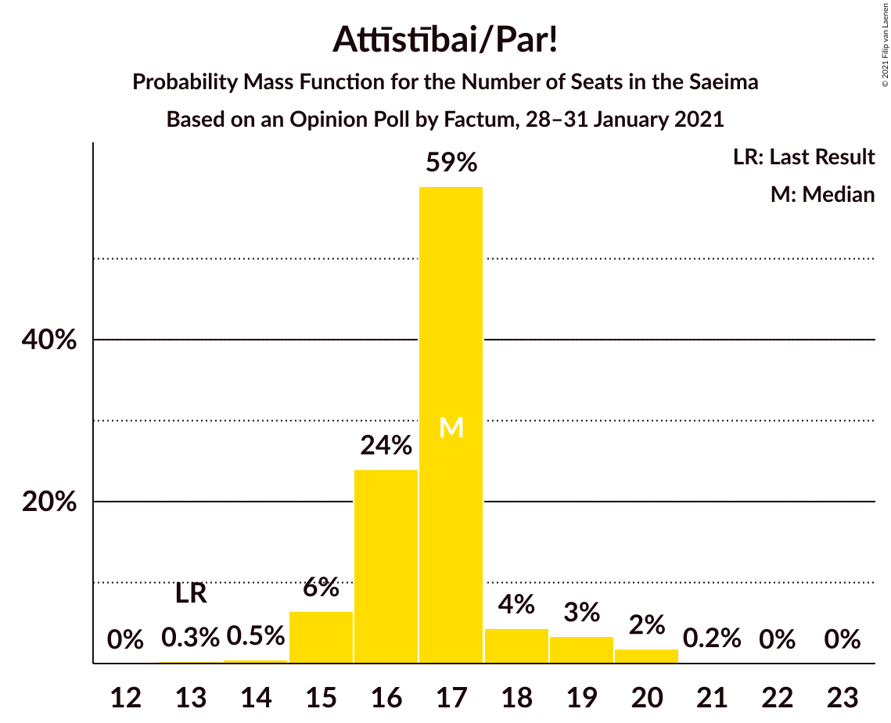
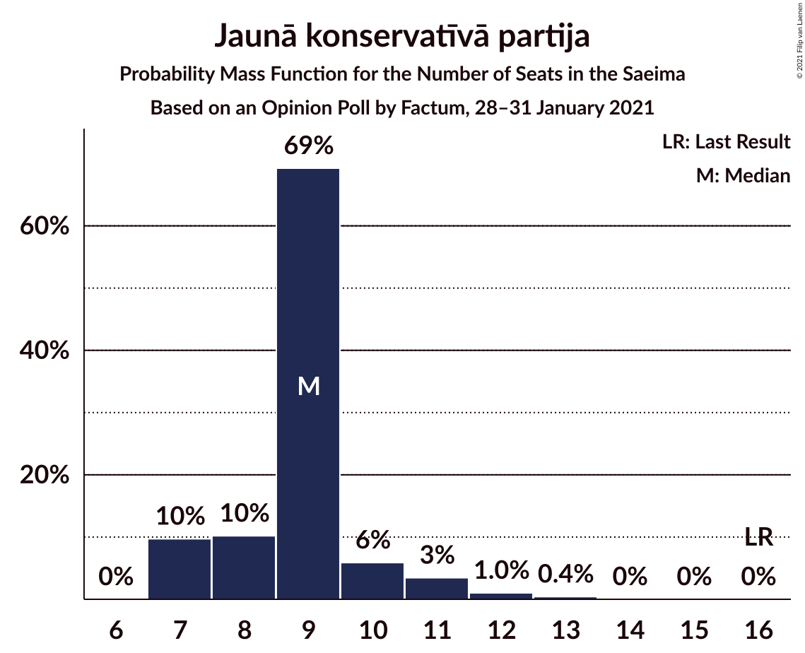
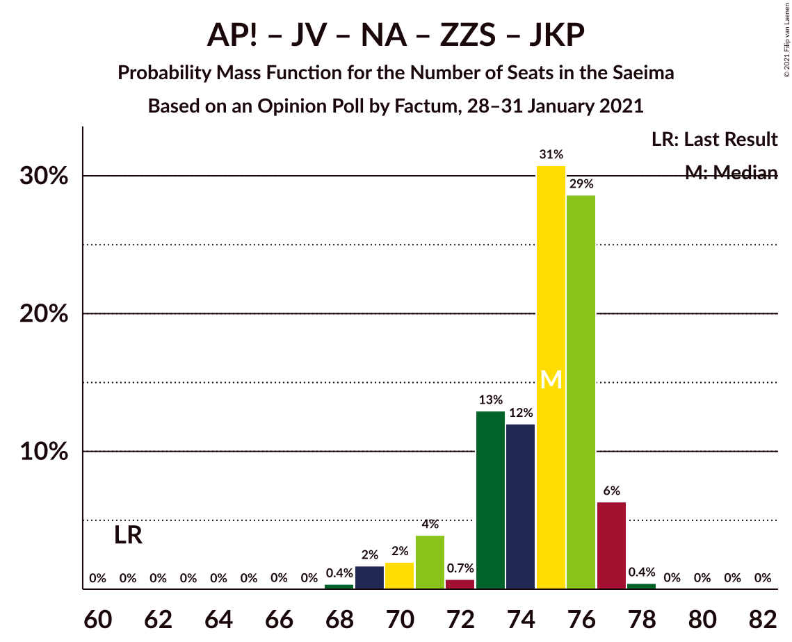
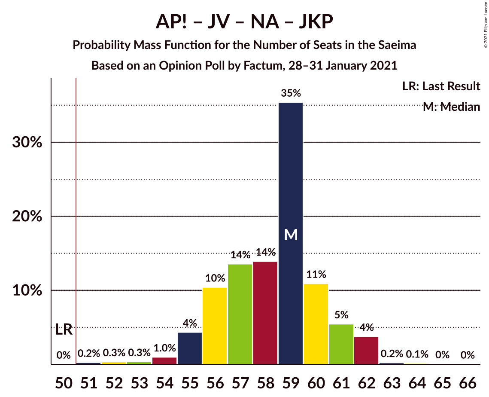
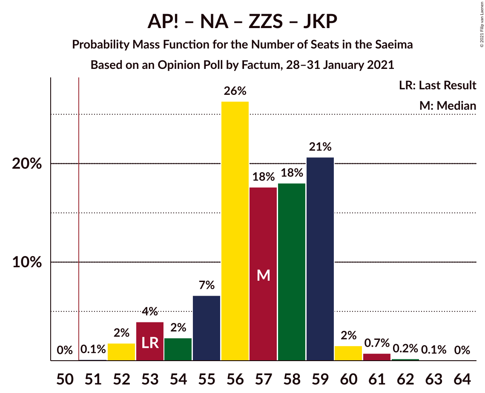
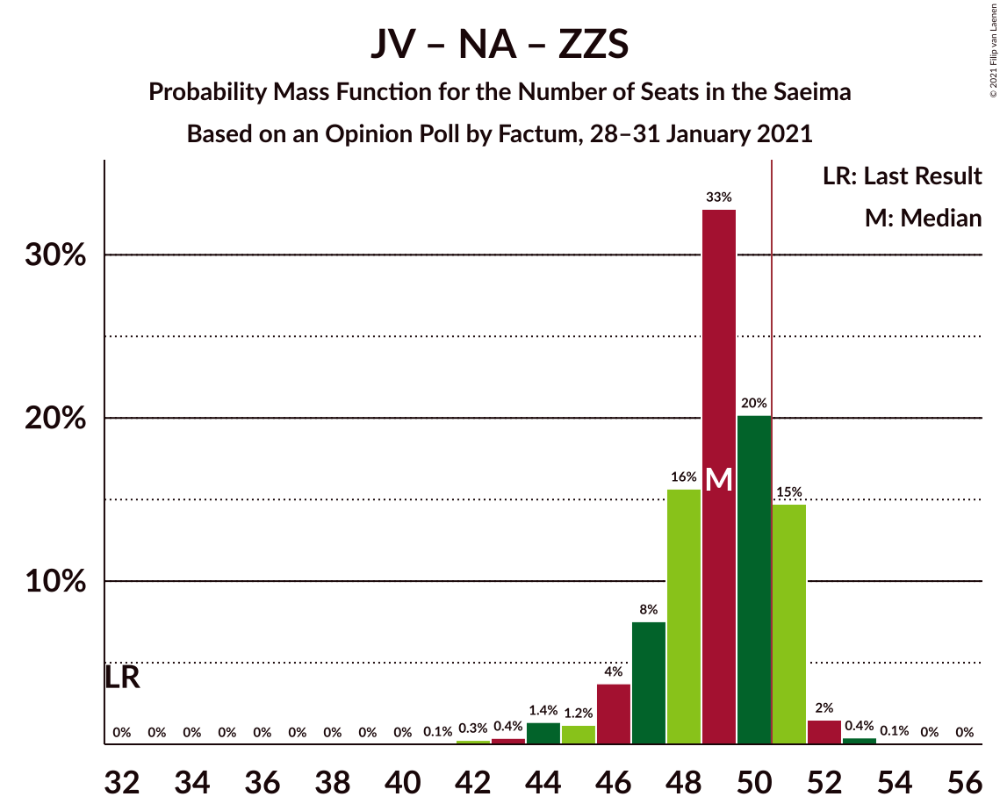
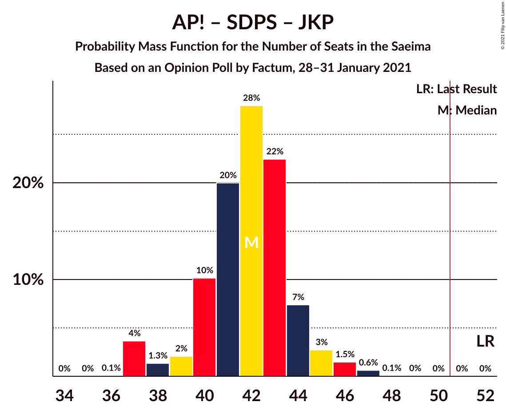
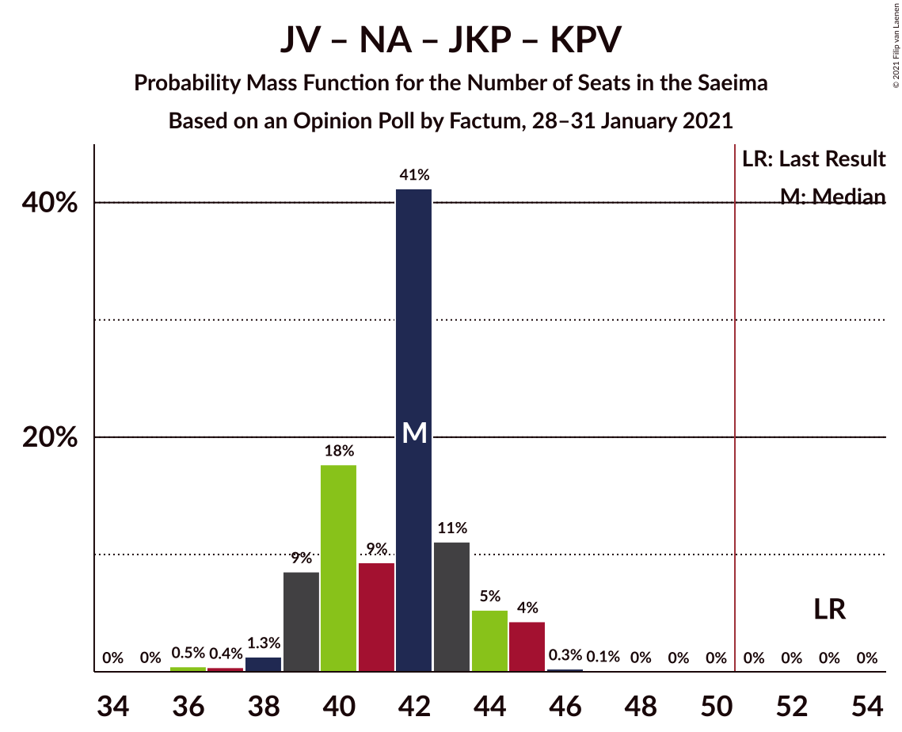

# Opinion Poll by Factum, 28–31 January 2021

<a href="#voting-intentions">Voting Intentions</a> | <a href="#seats">Seats</a> | <a href="#coalitions">Coalitions</a> | <a href="#technical-information">Technical Information</a>

## Voting Intentions

### Confidence Intervals

| Party | Last Result | Poll Result | 80% Confidence Interval | 90% Confidence Interval | 95% Confidence Interval | 99% Confidence Interval |
|:-----:|:-----------:|:-----------:|:-----------------------:|:-----------------------:|:-----------------------:|:-----------------------:|
| Attīstībai/Par! | 12.0% | 14.0% | 12.8–15.3% |12.5–15.7% |12.2–16.0% |11.6–16.7% |
| Jaunā VIENOTĪBA | 6.7% | 13.7% | 12.5–15.0% |12.2–15.4% |11.9–15.7% |11.3–16.4% |
| Nacionālā apvienība „Visu Latvijai!”–„Tēvzemei un Brīvībai/LNNK” | 11.0% | 12.4% | 11.3–13.7% |11.0–14.0% |10.7–14.4% |10.2–15.0% |
| Zaļo un Zemnieku savienība | 9.9% | 12.3% | 11.2–13.6% |10.9–13.9% |10.6–14.3% |10.1–14.9% |
| Sociāldemokrātiskā partija “Saskaņa” | 19.8% | 11.8% | 10.7–13.1% |10.4–13.4% |10.2–13.8% |9.6–14.4% |
| Jaunā konservatīvā partija | 13.6% | 7.5% | 6.6–8.6% |6.4–8.9% |6.2–9.1% |5.8–9.6% |
| PROGRESĪVIE | 2.6% | 6.8% | 6.0–7.8% |5.7–8.1% |5.5–8.3% |5.2–8.8% |
| Latvijas Krievu savienība | 3.2% | 4.1% | 3.4–4.9% |3.3–5.1% |3.1–5.3% |2.8–5.7% |
| Likums un kārtība | 0.0% | 3.5% | 2.9–4.3% |2.8–4.5% |2.6–4.7% |2.4–5.1% |
| Latvijas Reģionu Apvienība | 4.1% | 3.0% | 2.5–3.8% |2.3–4.0% |2.2–4.1% |2.0–4.5% |
| Politiskā partija „KPV LV” | 14.2% | 2.5% | 2.0–3.2% |1.9–3.3% |1.8–3.5% |1.5–3.9% |

*Note:* The poll result column reflects the actual value used in the calculations. Published results may vary slightly, and in addition be rounded to fewer digits.

## Seats

### Confidence Intervals

| Party | Last Result | Median | 80% Confidence Interval | 90% Confidence Interval | 95% Confidence Interval | 99% Confidence Interval |
|:-----:|:-----------:|:------:|:-----------------------:|:-----------------------:|:-----------------------:|:-----------------------:|
| <a href="#attīstībai/par!">Attīstībai/Par!</a> | 13 | 17 | 16–18 |15–20 |15–20 |15–20 |
| <a href="#jaunā-vienotība">Jaunā VIENOTĪBA</a> | 8 | 17 | 16–20 |16–20 |16–20 |14–20 |
| <a href="#nacionālā-apvienība-„visu-latvijai!”–„tēvzemei-un-brīvībai/lnnk”">Nacionālā apvienība „Visu Latvijai!”–„Tēvzemei un Brīvībai/LNNK”</a> | 13 | 15 | 13–16 |13–16 |13–16 |13–20 |
| <a href="#zaļo-un-zemnieku-savienība">Zaļo un Zemnieku savienība</a> | 11 | 17 | 13–18 |13–18 |13–18 |13–18 |
| <a href="#sociāldemokrātiskā-partija-“saskaņa”">Sociāldemokrātiskā partija “Saskaņa”</a> | 23 | 16 | 15–18 |15–18 |15–18 |14–18 |
| <a href="#jaunā-konservatīvā-partija">Jaunā konservatīvā partija</a> | 16 | 9 | 7–11 |7–11 |7–11 |7–12 |
| <a href="#progresīvie">PROGRESĪVIE</a> | 0 | 9 | 7–10 |7–10 |7–10 |6–11 |
| <a href="#latvijas-krievu-savienība">Latvijas Krievu savienība</a> | 0 | 0 | 0 |0–8 |0–8 |0–8 |
| <a href="#likums-un-kārtība">Likums un kārtība</a> | 0 | 0 | 0 |0 |0 |0 |
| <a href="#latvijas-reģionu-apvienība">Latvijas Reģionu Apvienība</a> | 0 | 0 | 0 |0 |0 |0 |
| <a href="#politiskā-partija-„kpv-lv”">Politiskā partija „KPV LV”</a> | 16 | 0 | 0 |0 |0 |0 |

### Attīstībai/Par!

*For a full overview of the results for this party, see the [Attīstībai/Par!](party-attīstībaipar.html) page.*

| Number of Seats | Probability | Accumulated | Special Marks |
|:---------------:|:-----------:|:-----------:|:-------------:|
| 13 | 0% | 100% | Last Result |
| 14 | 0.3% | 100% |  |
| 15 | 8% | 99.7% |  |
| 16 | 13% | 92% |  |
| 17 | 61% | 79% | Median |
| 18 | 11% | 18% |  |
| 19 | 0.7% | 7% |  |
| 20 | 6% | 6% |  |
| 21 | 0.3% | 0.4% |  |
| 22 | 0.1% | 0.2% |  |
| 23 | 0.1% | 0.1% |  |
| 24 | 0% | 0% |  |

### Jaunā VIENOTĪBA

*For a full overview of the results for this party, see the [Jaunā VIENOTĪBA](party-jaunāvienotība.html) page.*

| Number of Seats | Probability | Accumulated | Special Marks |
|:---------------:|:-----------:|:-----------:|:-------------:|
| 8 | 0% | 100% | Last Result |
| 9 | 0% | 100% |  |
| 10 | 0% | 100% |  |
| 11 | 0% | 100% |  |
| 12 | 0% | 100% |  |
| 13 | 0% | 100% |  |
| 14 | 1.0% | 100% |  |
| 15 | 1.5% | 99.0% |  |
| 16 | 10% | 98% |  |
| 17 | 38% | 88% | Median |
| 18 | 20% | 50% |  |
| 19 | 16% | 30% |  |
| 20 | 14% | 14% |  |
| 21 | 0.2% | 0.2% |  |
| 22 | 0% | 0% |  |

### Nacionālā apvienība „Visu Latvijai!”–„Tēvzemei un Brīvībai/LNNK”

*For a full overview of the results for this party, see the [Nacionālā apvienība „Visu Latvijai!”–„Tēvzemei un Brīvībai/LNNK”](party-nacionālāapvienība„visulatvijai”–„tēvzemeiunbrīvībailnnk”.html) page.*

| Number of Seats | Probability | Accumulated | Special Marks |
|:---------------:|:-----------:|:-----------:|:-------------:|
| 12 | 0% | 100% |  |
| 13 | 10% | 99.9% | Last Result |
| 14 | 35% | 90% |  |
| 15 | 23% | 55% | Median |
| 16 | 29% | 32% |  |
| 17 | 0.4% | 2% |  |
| 18 | 0.4% | 2% |  |
| 19 | 0.1% | 1.2% |  |
| 20 | 1.1% | 1.1% |  |
| 21 | 0% | 0% |  |

### Zaļo un Zemnieku savienība

*For a full overview of the results for this party, see the [Zaļo un Zemnieku savienība](party-zaļounzemniekusavienība.html) page.*

| Number of Seats | Probability | Accumulated | Special Marks |
|:---------------:|:-----------:|:-----------:|:-------------:|
| 11 | 0% | 100% | Last Result |
| 12 | 0.4% | 100% |  |
| 13 | 13% | 99.6% |  |
| 14 | 3% | 87% |  |
| 15 | 5% | 84% |  |
| 16 | 17% | 79% |  |
| 17 | 21% | 63% | Median |
| 18 | 42% | 42% |  |
| 19 | 0% | 0.1% |  |
| 20 | 0% | 0% |  |

### Sociāldemokrātiskā partija “Saskaņa”

*For a full overview of the results for this party, see the [Sociāldemokrātiskā partija “Saskaņa”](party-sociāldemokrātiskāpartija“saskaņa”.html) page.*

| Number of Seats | Probability | Accumulated | Special Marks |
|:---------------:|:-----------:|:-----------:|:-------------:|
| 12 | 0.1% | 100% |  |
| 13 | 0.2% | 99.9% |  |
| 14 | 2% | 99.7% |  |
| 15 | 32% | 98% |  |
| 16 | 41% | 66% | Median |
| 17 | 13% | 25% |  |
| 18 | 11% | 12% |  |
| 19 | 0.3% | 0.3% |  |
| 20 | 0% | 0.1% |  |
| 21 | 0% | 0% |  |
| 22 | 0% | 0% |  |
| 23 | 0% | 0% | Last Result |

### Jaunā konservatīvā partija

*For a full overview of the results for this party, see the [Jaunā konservatīvā partija](party-jaunākonservatīvāpartija.html) page.*

| Number of Seats | Probability | Accumulated | Special Marks |
|:---------------:|:-----------:|:-----------:|:-------------:|
| 7 | 12% | 100% |  |
| 8 | 15% | 88% |  |
| 9 | 57% | 73% | Median |
| 10 | 5% | 16% |  |
| 11 | 9% | 10% |  |
| 12 | 0.7% | 0.8% |  |
| 13 | 0.1% | 0.2% |  |
| 14 | 0% | 0% |  |
| 15 | 0% | 0% |  |
| 16 | 0% | 0% | Last Result |

### PROGRESĪVIE

*For a full overview of the results for this party, see the [PROGRESĪVIE](party-progresīvie.html) page.*

| Number of Seats | Probability | Accumulated | Special Marks |
|:---------------:|:-----------:|:-----------:|:-------------:|
| 0 | 0.1% | 100% | Last Result |
| 1 | 0% | 99.9% |  |
| 2 | 0% | 99.9% |  |
| 3 | 0% | 99.9% |  |
| 4 | 0% | 99.9% |  |
| 5 | 0% | 99.9% |  |
| 6 | 0.4% | 99.9% |  |
| 7 | 17% | 99.5% |  |
| 8 | 29% | 83% |  |
| 9 | 41% | 53% | Median |
| 10 | 11% | 13% |  |
| 11 | 1.3% | 1.3% |  |
| 12 | 0% | 0% |  |

### Latvijas Krievu savienība

*For a full overview of the results for this party, see the [Latvijas Krievu savienība](party-latvijaskrievusavienība.html) page.*

| Number of Seats | Probability | Accumulated | Special Marks |
|:---------------:|:-----------:|:-----------:|:-------------:|
| 0 | 94% | 100% | Last Result, Median |
| 1 | 0% | 6% |  |
| 2 | 0% | 6% |  |
| 3 | 0% | 6% |  |
| 4 | 0% | 6% |  |
| 5 | 0% | 6% |  |
| 6 | 0% | 6% |  |
| 7 | 0.4% | 6% |  |
| 8 | 5% | 5% |  |
| 9 | 0% | 0% |  |

### Likums un kārtība

*For a full overview of the results for this party, see the [Likums un kārtība](party-likumsunkārtība.html) page.*

| Number of Seats | Probability | Accumulated | Special Marks |
|:---------------:|:-----------:|:-----------:|:-------------:|
| 0 | 99.7% | 100% | Last Result, Median |
| 1 | 0% | 0.3% |  |
| 2 | 0% | 0.3% |  |
| 3 | 0% | 0.3% |  |
| 4 | 0% | 0.3% |  |
| 5 | 0% | 0.3% |  |
| 6 | 0% | 0.3% |  |
| 7 | 0.3% | 0.3% |  |
| 8 | 0% | 0% |  |

### Latvijas Reģionu Apvienība

*For a full overview of the results for this party, see the [Latvijas Reģionu Apvienība](party-latvijasreģionuapvienība.html) page.*

| Number of Seats | Probability | Accumulated | Special Marks |
|:---------------:|:-----------:|:-----------:|:-------------:|
| 0 | 100% | 100% | Last Result, Median |

### Politiskā partija „KPV LV”

*For a full overview of the results for this party, see the [Politiskā partija „KPV LV”](party-politiskāpartija„kpvlv”.html) page.*

| Number of Seats | Probability | Accumulated | Special Marks |
|:---------------:|:-----------:|:-----------:|:-------------:|
| 0 | 100% | 100% | Median |
| 1 | 0% | 0% |  |
| 2 | 0% | 0% |  |
| 3 | 0% | 0% |  |
| 4 | 0% | 0% |  |
| 5 | 0% | 0% |  |
| 6 | 0% | 0% |  |
| 7 | 0% | 0% |  |
| 8 | 0% | 0% |  |
| 9 | 0% | 0% |  |
| 10 | 0% | 0% |  |
| 11 | 0% | 0% |  |
| 12 | 0% | 0% |  |
| 13 | 0% | 0% |  |
| 14 | 0% | 0% |  |
| 15 | 0% | 0% |  |
| 16 | 0% | 0% | Last Result |

## Coalitions

### Confidence Intervals

| Coalition | Last Result | Median | Majority? | 80% Confidence Interval | 90% Confidence Interval | 95% Confidence Interval | 99% Confidence Interval |
|:---------:|:-----------:|:------:|:---------:|:-----------------------:|:-----------------------:|:-----------------------:|:-----------------------:|
| Attīstībai/Par! – Jaunā VIENOTĪBA – Nacionālā apvienība „Visu Latvijai!”–„Tēvzemei un Brīvībai/LNNK” – Zaļo un Zemnieku savienība – Jaunā konservatīvā partija | 61 | 75 | 100% | 73–77 | 71–77 | 68–77 | 68–77 |
| Attīstībai/Par! – Jaunā VIENOTĪBA – Nacionālā apvienība „Visu Latvijai!”–„Tēvzemei un Brīvībai/LNNK” – Zaļo un Zemnieku savienība | 45 | 67 | 100% | 64–68 | 62–68 | 59–68 | 59–70 |
| Attīstībai/Par! – Jaunā VIENOTĪBA – Nacionālā apvienība „Visu Latvijai!”–„Tēvzemei un Brīvībai/LNNK” – Jaunā konservatīvā partija | 50 | 58 | 100% | 56–61 | 56–62 | 55–62 | 53–62 |
| Attīstībai/Par! – Jaunā VIENOTĪBA – Nacionālā apvienība „Visu Latvijai!”–„Tēvzemei un Brīvībai/LNNK” – Jaunā konservatīvā partija – Politiskā partija „KPV LV” | 66 | 58 | 100% | 56–61 | 56–62 | 55–62 | 53–62 |
| Jaunā VIENOTĪBA – Nacionālā apvienība „Visu Latvijai!”–„Tēvzemei un Brīvībai/LNNK” – Zaļo un Zemnieku savienība – Jaunā konservatīvā partija | 48 | 58 | 100% | 56–60 | 55–60 | 52–61 | 52–62 |
| Attīstībai/Par! – Nacionālā apvienība „Visu Latvijai!”–„Tēvzemei un Brīvībai/LNNK” – Zaļo un Zemnieku savienība – Jaunā konservatīvā partija | 53 | 58 | 100% | 55–59 | 54–59 | 52–59 | 52–62 |
| Attīstībai/Par! – Jaunā VIENOTĪBA – Nacionālā apvienība „Visu Latvijai!”–„Tēvzemei un Brīvībai/LNNK” – Politiskā partija „KPV LV” | 50 | 50 | 42% | 47–51 | 47–51 | 46–52 | 45–54 |
| Jaunā VIENOTĪBA – Nacionālā apvienība „Visu Latvijai!”–„Tēvzemei un Brīvībai/LNNK” – Zaļo un Zemnieku savienība | 32 | 50 | 31% | 47–51 | 46–51 | 43–52 | 43–53 |
| Attīstībai/Par! – Nacionālā apvienība „Visu Latvijai!”–„Tēvzemei un Brīvībai/LNNK” – Zaļo un Zemnieku savienība | 37 | 49 | 16% | 44–51 | 44–51 | 43–51 | 43–52 |
| Attīstībai/Par! – Jaunā VIENOTĪBA – Jaunā konservatīvā partija – Politiskā partija „KPV LV” | 53 | 44 | 0.1% | 41–47 | 41–48 | 40–48 | 39–48 |
| Attīstībai/Par! – Sociāldemokrātiskā partija “Saskaņa” – Jaunā konservatīvā partija | 52 | 41 | 0% | 40–44 | 40–45 | 40–45 | 38–46 |
| Jaunā VIENOTĪBA – Nacionālā apvienība „Visu Latvijai!”–„Tēvzemei un Brīvībai/LNNK” – Jaunā konservatīvā partija – Politiskā partija „KPV LV” | 53 | 41 | 0% | 39–44 | 39–45 | 39–45 | 37–45 |
| Attīstībai/Par! – Nacionālā apvienība „Visu Latvijai!”–„Tēvzemei un Brīvībai/LNNK” – Jaunā konservatīvā partija – Politiskā partija „KPV LV” | 58 | 41 | 0% | 38–43 | 38–43 | 38–43 | 37–45 |
| Nacionālā apvienība „Visu Latvijai!”–„Tēvzemei un Brīvībai/LNNK” – Zaļo un Zemnieku savienība – Jaunā konservatīvā partija | 40 | 41 | 0% | 38–42 | 37–42 | 36–42 | 36–46 |
| Attīstībai/Par! – Sociāldemokrātiskā partija “Saskaņa” | 36 | 33 | 0% | 32–35 | 31–36 | 31–36 | 30–37 |
| Zaļo un Zemnieku savienība – Sociāldemokrātiskā partija “Saskaņa” – Politiskā partija „KPV LV” | 50 | 33 | 0% | 29–34 | 29–36 | 29–36 | 28–36 |
| Sociāldemokrātiskā partija “Saskaņa” – Politiskā partija „KPV LV” | 39 | 16 | 0% | 15–18 | 15–18 | 15–18 | 14–18 |

### Attīstībai/Par! – Jaunā VIENOTĪBA – Nacionālā apvienība „Visu Latvijai!”–„Tēvzemei un Brīvībai/LNNK” – Zaļo un Zemnieku savienība – Jaunā konservatīvā partija

| Number of Seats | Probability | Accumulated | Special Marks |
|:---------------:|:-----------:|:-----------:|:-------------:|
| 61 | 0% | 100% | Last Result |
| 62 | 0% | 100% |  |
| 63 | 0% | 100% |  |
| 64 | 0% | 100% |  |
| 65 | 0% | 100% |  |
| 66 | 0% | 100% |  |
| 67 | 0% | 100% |  |
| 68 | 3% | 100% |  |
| 69 | 0.4% | 97% |  |
| 70 | 2% | 97% |  |
| 71 | 0.6% | 95% |  |
| 72 | 0.8% | 95% |  |
| 73 | 8% | 94% |  |
| 74 | 12% | 86% |  |
| 75 | 26% | 74% | Median |
| 76 | 32% | 48% |  |
| 77 | 16% | 17% |  |
| 78 | 0.3% | 0.4% |  |
| 79 | 0% | 0.1% |  |
| 80 | 0% | 0.1% |  |
| 81 | 0% | 0.1% |  |
| 82 | 0% | 0.1% |  |
| 83 | 0% | 0.1% |  |
| 84 | 0% | 0% |  |

### Attīstībai/Par! – Jaunā VIENOTĪBA – Nacionālā apvienība „Visu Latvijai!”–„Tēvzemei un Brīvībai/LNNK” – Zaļo un Zemnieku savienība

| Number of Seats | Probability | Accumulated | Special Marks |
|:---------------:|:-----------:|:-----------:|:-------------:|
| 45 | 0% | 100% | Last Result |
| 46 | 0% | 100% |  |
| 47 | 0% | 100% |  |
| 48 | 0% | 100% |  |
| 49 | 0% | 100% |  |
| 50 | 0% | 100% |  |
| 51 | 0% | 100% | Majority |
| 52 | 0% | 100% |  |
| 53 | 0% | 100% |  |
| 54 | 0% | 100% |  |
| 55 | 0% | 100% |  |
| 56 | 0% | 100% |  |
| 57 | 0% | 100% |  |
| 58 | 0% | 100% |  |
| 59 | 3% | 100% |  |
| 60 | 0.3% | 97% |  |
| 61 | 2% | 97% |  |
| 62 | 0.6% | 95% |  |
| 63 | 2% | 95% |  |
| 64 | 16% | 93% |  |
| 65 | 7% | 77% |  |
| 66 | 10% | 71% | Median |
| 67 | 33% | 61% |  |
| 68 | 27% | 28% |  |
| 69 | 0.4% | 1.0% |  |
| 70 | 0.4% | 0.6% |  |
| 71 | 0.1% | 0.2% |  |
| 72 | 0% | 0.1% |  |
| 73 | 0.1% | 0.1% |  |
| 74 | 0% | 0% |  |

### Attīstībai/Par! – Jaunā VIENOTĪBA – Nacionālā apvienība „Visu Latvijai!”–„Tēvzemei un Brīvībai/LNNK” – Jaunā konservatīvā partija

| Number of Seats | Probability | Accumulated | Special Marks |
|:---------------:|:-----------:|:-----------:|:-------------:|
| 50 | 0% | 100% | Last Result |
| 51 | 0% | 100% | Majority |
| 52 | 0.2% | 100% |  |
| 53 | 0.4% | 99.8% |  |
| 54 | 0.4% | 99.4% |  |
| 55 | 3% | 99.0% |  |
| 56 | 14% | 96% |  |
| 57 | 17% | 81% |  |
| 58 | 20% | 65% | Median |
| 59 | 3% | 45% |  |
| 60 | 31% | 42% |  |
| 61 | 1.5% | 11% |  |
| 62 | 9% | 10% |  |
| 63 | 0% | 0.2% |  |
| 64 | 0% | 0.2% |  |
| 65 | 0.1% | 0.1% |  |
| 66 | 0% | 0% |  |

### Attīstībai/Par! – Jaunā VIENOTĪBA – Nacionālā apvienība „Visu Latvijai!”–„Tēvzemei un Brīvībai/LNNK” – Jaunā konservatīvā partija – Politiskā partija „KPV LV”

| Number of Seats | Probability | Accumulated | Special Marks |
|:---------------:|:-----------:|:-----------:|:-------------:|
| 52 | 0.2% | 100% |  |
| 53 | 0.4% | 99.8% |  |
| 54 | 0.4% | 99.4% |  |
| 55 | 3% | 99.0% |  |
| 56 | 14% | 96% |  |
| 57 | 17% | 81% |  |
| 58 | 20% | 65% | Median |
| 59 | 3% | 45% |  |
| 60 | 31% | 42% |  |
| 61 | 1.5% | 11% |  |
| 62 | 9% | 10% |  |
| 63 | 0% | 0.2% |  |
| 64 | 0% | 0.2% |  |
| 65 | 0.1% | 0.1% |  |
| 66 | 0% | 0% | Last Result |

### Jaunā VIENOTĪBA – Nacionālā apvienība „Visu Latvijai!”–„Tēvzemei un Brīvībai/LNNK” – Zaļo un Zemnieku savienība – Jaunā konservatīvā partija

| Number of Seats | Probability | Accumulated | Special Marks |
|:---------------:|:-----------:|:-----------:|:-------------:|
| 48 | 0% | 100% | Last Result |
| 49 | 0% | 100% |  |
| 50 | 0% | 100% |  |
| 51 | 0% | 100% | Majority |
| 52 | 3% | 99.9% |  |
| 53 | 0.5% | 97% |  |
| 54 | 2% | 97% |  |
| 55 | 2% | 95% |  |
| 56 | 11% | 93% |  |
| 57 | 11% | 83% |  |
| 58 | 32% | 72% | Median |
| 59 | 19% | 39% |  |
| 60 | 16% | 20% |  |
| 61 | 4% | 4% |  |
| 62 | 0.5% | 0.6% |  |
| 63 | 0% | 0.1% |  |
| 64 | 0% | 0.1% |  |
| 65 | 0% | 0.1% |  |
| 66 | 0% | 0% |  |

### Attīstībai/Par! – Nacionālā apvienība „Visu Latvijai!”–„Tēvzemei un Brīvībai/LNNK” – Zaļo un Zemnieku savienība – Jaunā konservatīvā partija

| Number of Seats | Probability | Accumulated | Special Marks |
|:---------------:|:-----------:|:-----------:|:-------------:|
| 51 | 0.1% | 100% | Majority |
| 52 | 3% | 99.9% |  |
| 53 | 1.4% | 97% | Last Result |
| 54 | 2% | 96% |  |
| 55 | 13% | 94% |  |
| 56 | 15% | 81% |  |
| 57 | 6% | 66% |  |
| 58 | 32% | 60% | Median |
| 59 | 26% | 28% |  |
| 60 | 0.8% | 2% |  |
| 61 | 1.1% | 2% |  |
| 62 | 0.4% | 0.5% |  |
| 63 | 0.1% | 0.1% |  |
| 64 | 0% | 0% |  |

### Attīstībai/Par! – Jaunā VIENOTĪBA – Nacionālā apvienība „Visu Latvijai!”–„Tēvzemei un Brīvībai/LNNK” – Politiskā partija „KPV LV”

| Number of Seats | Probability | Accumulated | Special Marks |
|:---------------:|:-----------:|:-----------:|:-------------:|
| 44 | 0.4% | 100% |  |
| 45 | 0.4% | 99.6% |  |
| 46 | 3% | 99.1% |  |
| 47 | 10% | 96% |  |
| 48 | 9% | 87% |  |
| 49 | 22% | 77% | Median |
| 50 | 13% | 55% | Last Result |
| 51 | 39% | 42% | Majority |
| 52 | 0.9% | 3% |  |
| 53 | 0.6% | 2% |  |
| 54 | 0.8% | 1.1% |  |
| 55 | 0.3% | 0.3% |  |
| 56 | 0% | 0% |  |

### Jaunā VIENOTĪBA – Nacionālā apvienība „Visu Latvijai!”–„Tēvzemei un Brīvībai/LNNK” – Zaļo un Zemnieku savienība

| Number of Seats | Probability | Accumulated | Special Marks |
|:---------------:|:-----------:|:-----------:|:-------------:|
| 32 | 0% | 100% | Last Result |
| 33 | 0% | 100% |  |
| 34 | 0% | 100% |  |
| 35 | 0% | 100% |  |
| 36 | 0% | 100% |  |
| 37 | 0% | 100% |  |
| 38 | 0% | 100% |  |
| 39 | 0% | 100% |  |
| 40 | 0% | 100% |  |
| 41 | 0% | 100% |  |
| 42 | 0.1% | 100% |  |
| 43 | 3% | 99.9% |  |
| 44 | 0.3% | 97% |  |
| 45 | 2% | 97% |  |
| 46 | 2% | 95% |  |
| 47 | 19% | 93% |  |
| 48 | 6% | 74% |  |
| 49 | 17% | 68% | Median |
| 50 | 20% | 52% |  |
| 51 | 26% | 31% | Majority |
| 52 | 4% | 5% |  |
| 53 | 1.0% | 1.2% |  |
| 54 | 0.1% | 0.2% |  |
| 55 | 0% | 0.1% |  |
| 56 | 0.1% | 0.1% |  |
| 57 | 0% | 0% |  |

### Attīstībai/Par! – Nacionālā apvienība „Visu Latvijai!”–„Tēvzemei un Brīvībai/LNNK” – Zaļo un Zemnieku savienība

| Number of Seats | Probability | Accumulated | Special Marks |
|:---------------:|:-----------:|:-----------:|:-------------:|
| 37 | 0% | 100% | Last Result |
| 38 | 0% | 100% |  |
| 39 | 0% | 100% |  |
| 40 | 0% | 100% |  |
| 41 | 0% | 100% |  |
| 42 | 0.1% | 100% |  |
| 43 | 3% | 99.8% |  |
| 44 | 10% | 97% |  |
| 45 | 1.5% | 87% |  |
| 46 | 5% | 85% |  |
| 47 | 5% | 80% |  |
| 48 | 9% | 76% |  |
| 49 | 38% | 67% | Median |
| 50 | 13% | 29% |  |
| 51 | 15% | 16% | Majority |
| 52 | 0.7% | 0.9% |  |
| 53 | 0.1% | 0.2% |  |
| 54 | 0.1% | 0.2% |  |
| 55 | 0.1% | 0.1% |  |
| 56 | 0% | 0% |  |

### Attīstībai/Par! – Jaunā VIENOTĪBA – Jaunā konservatīvā partija – Politiskā partija „KPV LV”

| Number of Seats | Probability | Accumulated | Special Marks |
|:---------------:|:-----------:|:-----------:|:-------------:|
| 36 | 0% | 100% |  |
| 37 | 0.1% | 99.9% |  |
| 38 | 0.1% | 99.8% |  |
| 39 | 0.5% | 99.7% |  |
| 40 | 3% | 99.2% |  |
| 41 | 9% | 96% |  |
| 42 | 29% | 87% |  |
| 43 | 3% | 58% | Median |
| 44 | 22% | 55% |  |
| 45 | 16% | 32% |  |
| 46 | 0.9% | 16% |  |
| 47 | 6% | 15% |  |
| 48 | 9% | 9% |  |
| 49 | 0.1% | 0.2% |  |
| 50 | 0% | 0.1% |  |
| 51 | 0.1% | 0.1% | Majority |
| 52 | 0% | 0% |  |
| 53 | 0% | 0% | Last Result |

### Attīstībai/Par! – Sociāldemokrātiskā partija “Saskaņa” – Jaunā konservatīvā partija

| Number of Seats | Probability | Accumulated | Special Marks |
|:---------------:|:-----------:|:-----------:|:-------------:|
| 35 | 0.1% | 100% |  |
| 36 | 0.1% | 99.9% |  |
| 37 | 0.1% | 99.7% |  |
| 38 | 0.7% | 99.7% |  |
| 39 | 1.4% | 99.0% |  |
| 40 | 27% | 98% |  |
| 41 | 25% | 71% |  |
| 42 | 6% | 46% | Median |
| 43 | 10% | 40% |  |
| 44 | 23% | 30% |  |
| 45 | 6% | 7% |  |
| 46 | 0.3% | 0.7% |  |
| 47 | 0.2% | 0.4% |  |
| 48 | 0.2% | 0.2% |  |
| 49 | 0% | 0% |  |
| 50 | 0% | 0% |  |
| 51 | 0% | 0% | Majority |
| 52 | 0% | 0% | Last Result |

### Jaunā VIENOTĪBA – Nacionālā apvienība „Visu Latvijai!”–„Tēvzemei un Brīvībai/LNNK” – Jaunā konservatīvā partija – Politiskā partija „KPV LV”

| Number of Seats | Probability | Accumulated | Special Marks |
|:---------------:|:-----------:|:-----------:|:-------------:|
| 35 | 0.1% | 100% |  |
| 36 | 0% | 99.9% |  |
| 37 | 0.4% | 99.9% |  |
| 38 | 0.8% | 99.5% |  |
| 39 | 13% | 98.7% |  |
| 40 | 18% | 85% |  |
| 41 | 25% | 68% | Median |
| 42 | 11% | 43% |  |
| 43 | 21% | 32% |  |
| 44 | 1.4% | 11% |  |
| 45 | 10% | 10% |  |
| 46 | 0.2% | 0.2% |  |
| 47 | 0% | 0.1% |  |
| 48 | 0% | 0.1% |  |
| 49 | 0% | 0% |  |
| 50 | 0% | 0% |  |
| 51 | 0% | 0% | Majority |
| 52 | 0% | 0% |  |
| 53 | 0% | 0% | Last Result |

### Attīstībai/Par! – Nacionālā apvienība „Visu Latvijai!”–„Tēvzemei un Brīvībai/LNNK” – Jaunā konservatīvā partija – Politiskā partija „KPV LV”

| Number of Seats | Probability | Accumulated | Special Marks |
|:---------------:|:-----------:|:-----------:|:-------------:|
| 36 | 0.2% | 100% |  |
| 37 | 0.4% | 99.8% |  |
| 38 | 14% | 99.5% |  |
| 39 | 6% | 86% |  |
| 40 | 19% | 80% |  |
| 41 | 32% | 61% | Median |
| 42 | 15% | 29% |  |
| 43 | 11% | 13% |  |
| 44 | 2% | 2% |  |
| 45 | 0.5% | 0.7% |  |
| 46 | 0.1% | 0.2% |  |
| 47 | 0.1% | 0.1% |  |
| 48 | 0% | 0% |  |
| 49 | 0% | 0% |  |
| 50 | 0% | 0% |  |
| 51 | 0% | 0% | Majority |
| 52 | 0% | 0% |  |
| 53 | 0% | 0% |  |
| 54 | 0% | 0% |  |
| 55 | 0% | 0% |  |
| 56 | 0% | 0% |  |
| 57 | 0% | 0% |  |
| 58 | 0% | 0% | Last Result |

### Nacionālā apvienība „Visu Latvijai!”–„Tēvzemei un Brīvībai/LNNK” – Zaļo un Zemnieku savienība – Jaunā konservatīvā partija

| Number of Seats | Probability | Accumulated | Special Marks |
|:---------------:|:-----------:|:-----------:|:-------------:|
| 34 | 0.1% | 100% |  |
| 35 | 0.2% | 99.9% |  |
| 36 | 3% | 99.7% |  |
| 37 | 2% | 97% |  |
| 38 | 19% | 95% |  |
| 39 | 11% | 75% |  |
| 40 | 3% | 65% | Last Result |
| 41 | 36% | 61% | Median |
| 42 | 24% | 26% |  |
| 43 | 0.2% | 2% |  |
| 44 | 0.6% | 2% |  |
| 45 | 0.4% | 1.0% |  |
| 46 | 0.5% | 0.6% |  |
| 47 | 0.1% | 0.1% |  |
| 48 | 0% | 0% |  |

### Attīstībai/Par! – Sociāldemokrātiskā partija “Saskaņa”

| Number of Seats | Probability | Accumulated | Special Marks |
|:---------------:|:-----------:|:-----------:|:-------------:|
| 28 | 0.1% | 100% |  |
| 29 | 0.3% | 99.8% |  |
| 30 | 1.4% | 99.6% |  |
| 31 | 7% | 98% |  |
| 32 | 36% | 92% |  |
| 33 | 27% | 55% | Median |
| 34 | 4% | 28% |  |
| 35 | 17% | 24% |  |
| 36 | 6% | 6% | Last Result |
| 37 | 0.2% | 0.6% |  |
| 38 | 0.3% | 0.3% |  |
| 39 | 0% | 0% |  |

### Zaļo un Zemnieku savienība – Sociāldemokrātiskā partija “Saskaņa” – Politiskā partija „KPV LV”

| Number of Seats | Probability | Accumulated | Special Marks |
|:---------------:|:-----------:|:-----------:|:-------------:|
| 27 | 0.2% | 100% |  |
| 28 | 0.4% | 99.8% |  |
| 29 | 13% | 99.4% |  |
| 30 | 3% | 86% |  |
| 31 | 2% | 84% |  |
| 32 | 24% | 82% |  |
| 33 | 25% | 58% | Median |
| 34 | 23% | 33% |  |
| 35 | 4% | 9% |  |
| 36 | 5% | 5% |  |
| 37 | 0% | 0.1% |  |
| 38 | 0% | 0.1% |  |
| 39 | 0% | 0% |  |
| 40 | 0% | 0% |  |
| 41 | 0% | 0% |  |
| 42 | 0% | 0% |  |
| 43 | 0% | 0% |  |
| 44 | 0% | 0% |  |
| 45 | 0% | 0% |  |
| 46 | 0% | 0% |  |
| 47 | 0% | 0% |  |
| 48 | 0% | 0% |  |
| 49 | 0% | 0% |  |
| 50 | 0% | 0% | Last Result |

### Sociāldemokrātiskā partija “Saskaņa” – Politiskā partija „KPV LV”

| Number of Seats | Probability | Accumulated | Special Marks |
|:---------------:|:-----------:|:-----------:|:-------------:|
| 12 | 0.1% | 100% |  |
| 13 | 0.2% | 99.9% |  |
| 14 | 2% | 99.7% |  |
| 15 | 32% | 98% |  |
| 16 | 41% | 66% | Median |
| 17 | 13% | 25% |  |
| 18 | 11% | 12% |  |
| 19 | 0.3% | 0.3% |  |
| 20 | 0% | 0.1% |  |
| 21 | 0% | 0% |  |
| 22 | 0% | 0% |  |
| 23 | 0% | 0% |  |
| 24 | 0% | 0% |  |
| 25 | 0% | 0% |  |
| 26 | 0% | 0% |  |
| 27 | 0% | 0% |  |
| 28 | 0% | 0% |  |
| 29 | 0% | 0% |  |
| 30 | 0% | 0% |  |
| 31 | 0% | 0% |  |
| 32 | 0% | 0% |  |
| 33 | 0% | 0% |  |
| 34 | 0% | 0% |  |
| 35 | 0% | 0% |  |
| 36 | 0% | 0% |  |
| 37 | 0% | 0% |  |
| 38 | 0% | 0% |  |
| 39 | 0% | 0% | Last Result |

## Technical Information

### Opinion Poll

+ **Polling firm:** Factum
+ **Commissioner(s):** —
+ **Fieldwork period:** 28–31 January 2021

### Calculations

+ **Sample size:** 1250
+ **Simulations done:** 131,072
+ **Error estimate:** 1.60%

