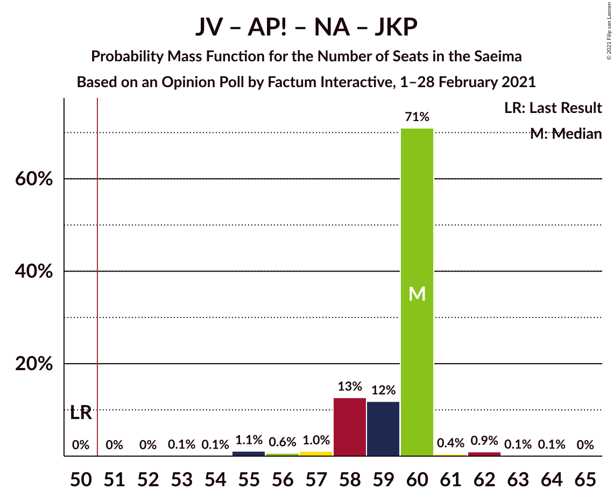

# Opinion Poll by Factum Interactive, 1–28 February 2021

<a href="#voting-intentions">Voting Intentions</a> | <a href="#seats">Seats</a> | <a href="#coalitions">Coalitions</a> | <a href="#technical-information">Technical Information</a>

## Voting Intentions

### Confidence Intervals

| Party | Last Result | Poll Result | 80% Confidence Interval | 90% Confidence Interval | 95% Confidence Interval | 99% Confidence Interval |
|:-----:|:-----------:|:-----------:|:-----------------------:|:-----------------------:|:-----------------------:|:-----------------------:|
| Jaunā VIENOTĪBA | 6.7% | 15.1% | 14.1–16.2% |13.8–16.6% |13.6–16.8% |13.1–17.4% |
| Attīstībai/Par! | 12.0% | 14.6% | 13.6–15.7% |13.3–16.0% |13.1–16.3% |12.6–16.8% |
| Sociāldemokrātiskā partija “Saskaņa” | 19.8% | 12.0% | 11.1–13.0% |10.9–13.3% |10.6–13.6% |10.2–14.1% |
| Zaļo un Zemnieku savienība | 9.9% | 11.9% | 11.0–12.9% |10.8–13.2% |10.5–13.5% |10.1–14.0% |
| Nacionālā apvienība „Visu Latvijai!”–„Tēvzemei un Brīvībai/LNNK” | 11.0% | 11.1% | 10.2–12.1% |10.0–12.3% |9.8–12.6% |9.3–13.1% |
| Jaunā konservatīvā partija | 13.6% | 8.0% | 7.2–8.8% |7.0–9.1% |6.8–9.3% |6.5–9.7% |
| PROGRESĪVIE | 2.6% | 7.0% | 6.3–7.8% |6.1–8.0% |5.9–8.2% |5.6–8.6% |
| Likums un kārtība | 0.0% | 4.3% | 3.8–5.0% |3.6–5.2% |3.5–5.3% |3.2–5.7% |
| Latvijas Krievu savienība | 3.2% | 3.9% | 3.4–4.5% |3.2–4.7% |3.1–4.9% |2.9–5.2% |
| Latvijas Reģionu Apvienība | 4.1% | 3.6% | 3.1–4.2% |3.0–4.4% |2.9–4.6% |2.7–4.9% |
| Politiskā partija „KPV LV” | 14.2% | 1.9% | 1.5–2.4% |1.4–2.5% |1.4–2.6% |1.2–2.9% |

*Note:* The poll result column reflects the actual value used in the calculations. Published results may vary slightly, and in addition be rounded to fewer digits.

## Seats

### Confidence Intervals

| Party | Last Result | Median | 80% Confidence Interval | 90% Confidence Interval | 95% Confidence Interval | 99% Confidence Interval |
|:-----:|:-----------:|:------:|:-----------------------:|:-----------------------:|:-----------------------:|:-----------------------:|
| <a href="#jaunā-vienotība">Jaunā VIENOTĪBA</a> | 8 | 20 | 18–20 |18–20 |17–20 |16–20 |
| <a href="#attīstībai/par!">Attīstībai/Par!</a> | 13 | 17 | 17 |17–18 |16–20 |15–20 |
| <a href="#sociāldemokrātiskā-partija-“saskaņa”">Sociāldemokrātiskā partija “Saskaņa”</a> | 23 | 16 | 15–18 |15–18 |15–18 |15–18 |
| <a href="#zaļo-un-zemnieku-savienība">Zaļo un Zemnieku savienība</a> | 11 | 15 | 15–17 |14–17 |14–17 |13–18 |
| <a href="#nacionālā-apvienība-„visu-latvijai!”–„tēvzemei-un-brīvībai/lnnk”">Nacionālā apvienība „Visu Latvijai!”–„Tēvzemei un Brīvībai/LNNK”</a> | 13 | 14 | 13–14 |13–14 |13–14 |12–14 |
| <a href="#jaunā-konservatīvā-partija">Jaunā konservatīvā partija</a> | 16 | 9 | 9–10 |9–10 |8–11 |8–12 |
| <a href="#progresīvie">PROGRESĪVIE</a> | 0 | 9 | 8–9 |8–9 |7–9 |7–9 |
| <a href="#likums-un-kārtība">Likums un kārtība</a> | 0 | 0 | 0 |0 |0 |0–7 |
| <a href="#latvijas-krievu-savienība">Latvijas Krievu savienība</a> | 0 | 0 | 0 |0 |0 |0–6 |
| <a href="#latvijas-reģionu-apvienība">Latvijas Reģionu Apvienība</a> | 0 | 0 | 0 |0 |0 |0 |
| <a href="#politiskā-partija-„kpv-lv”">Politiskā partija „KPV LV”</a> | 16 | 0 | 0 |0 |0 |0 |

### Jaunā VIENOTĪBA

*For a full overview of the results for this party, see the [Jaunā VIENOTĪBA](party-jaunāvienotība.html) page.*

| Number of Seats | Probability | Accumulated | Special Marks |
|:---------------:|:-----------:|:-----------:|:-------------:|
| 8 | 0% | 100% | Last Result |
| 9 | 0% | 100% |  |
| 10 | 0% | 100% |  |
| 11 | 0% | 100% |  |
| 12 | 0% | 100% |  |
| 13 | 0% | 100% |  |
| 14 | 0% | 100% |  |
| 15 | 0% | 100% |  |
| 16 | 0.6% | 100% |  |
| 17 | 4% | 99.3% |  |
| 18 | 13% | 95% |  |
| 19 | 13% | 82% |  |
| 20 | 69% | 70% | Median |
| 21 | 0.3% | 0.4% |  |
| 22 | 0% | 0.1% |  |
| 23 | 0.1% | 0.1% |  |
| 24 | 0% | 0% |  |

### Attīstībai/Par!

*For a full overview of the results for this party, see the [Attīstībai/Par!](party-attīstībaipar.html) page.*

| Number of Seats | Probability | Accumulated | Special Marks |
|:---------------:|:-----------:|:-----------:|:-------------:|
| 13 | 0% | 100% | Last Result |
| 14 | 0% | 100% |  |
| 15 | 0.7% | 100% |  |
| 16 | 2% | 99.3% |  |
| 17 | 91% | 97% | Median |
| 18 | 1.4% | 6% |  |
| 19 | 2% | 5% |  |
| 20 | 3% | 3% |  |
| 21 | 0% | 0% |  |

### Sociāldemokrātiskā partija “Saskaņa”

*For a full overview of the results for this party, see the [Sociāldemokrātiskā partija “Saskaņa”](party-sociāldemokrātiskāpartija“saskaņa”.html) page.*

| Number of Seats | Probability | Accumulated | Special Marks |
|:---------------:|:-----------:|:-----------:|:-------------:|
| 14 | 0.3% | 100% |  |
| 15 | 27% | 99.7% |  |
| 16 | 46% | 72% | Median |
| 17 | 12% | 26% |  |
| 18 | 15% | 15% |  |
| 19 | 0% | 0% |  |
| 20 | 0% | 0% |  |
| 21 | 0% | 0% |  |
| 22 | 0% | 0% |  |
| 23 | 0% | 0% | Last Result |

### Zaļo un Zemnieku savienība

*For a full overview of the results for this party, see the [Zaļo un Zemnieku savienība](party-zaļounzemniekusavienība.html) page.*

| Number of Seats | Probability | Accumulated | Special Marks |
|:---------------:|:-----------:|:-----------:|:-------------:|
| 11 | 0% | 100% | Last Result |
| 12 | 0.2% | 100% |  |
| 13 | 1.3% | 99.7% |  |
| 14 | 4% | 98% |  |
| 15 | 56% | 95% | Median |
| 16 | 7% | 39% |  |
| 17 | 30% | 31% |  |
| 18 | 2% | 2% |  |
| 19 | 0% | 0% |  |

### Nacionālā apvienība „Visu Latvijai!”–„Tēvzemei un Brīvībai/LNNK”

*For a full overview of the results for this party, see the [Nacionālā apvienība „Visu Latvijai!”–„Tēvzemei un Brīvībai/LNNK”](party-nacionālāapvienība„visulatvijai”–„tēvzemeiunbrīvībailnnk”.html) page.*

| Number of Seats | Probability | Accumulated | Special Marks |
|:---------------:|:-----------:|:-----------:|:-------------:|
| 11 | 0.4% | 100% |  |
| 12 | 0.6% | 99.6% |  |
| 13 | 14% | 98.9% | Last Result |
| 14 | 84% | 84% | Median |
| 15 | 0.1% | 0.3% |  |
| 16 | 0.1% | 0.2% |  |
| 17 | 0% | 0% |  |

### Jaunā konservatīvā partija

*For a full overview of the results for this party, see the [Jaunā konservatīvā partija](party-jaunākonservatīvāpartija.html) page.*

| Number of Seats | Probability | Accumulated | Special Marks |
|:---------------:|:-----------:|:-----------:|:-------------:|
| 7 | 0.2% | 100% |  |
| 8 | 3% | 99.8% |  |
| 9 | 85% | 97% | Median |
| 10 | 10% | 12% |  |
| 11 | 2% | 3% |  |
| 12 | 0.6% | 0.7% |  |
| 13 | 0.1% | 0.1% |  |
| 14 | 0% | 0% |  |
| 15 | 0% | 0% |  |
| 16 | 0% | 0% | Last Result |

### PROGRESĪVIE

*For a full overview of the results for this party, see the [PROGRESĪVIE](party-progresīvie.html) page.*

| Number of Seats | Probability | Accumulated | Special Marks |
|:---------------:|:-----------:|:-----------:|:-------------:|
| 0 | 0% | 100% | Last Result |
| 1 | 0% | 100% |  |
| 2 | 0% | 100% |  |
| 3 | 0% | 100% |  |
| 4 | 0% | 100% |  |
| 5 | 0% | 100% |  |
| 6 | 0% | 100% |  |
| 7 | 3% | 100% |  |
| 8 | 41% | 97% |  |
| 9 | 56% | 56% | Median |
| 10 | 0% | 0.3% |  |
| 11 | 0.3% | 0.3% |  |
| 12 | 0% | 0% |  |

### Likums un kārtība

*For a full overview of the results for this party, see the [Likums un kārtība](party-likumsunkārtība.html) page.*

| Number of Seats | Probability | Accumulated | Special Marks |
|:---------------:|:-----------:|:-----------:|:-------------:|
| 0 | 98.9% | 100% | Last Result, Median |
| 1 | 0% | 1.1% |  |
| 2 | 0% | 1.1% |  |
| 3 | 0% | 1.1% |  |
| 4 | 0% | 1.1% |  |
| 5 | 0% | 1.1% |  |
| 6 | 0.2% | 1.1% |  |
| 7 | 0.8% | 0.8% |  |
| 8 | 0% | 0% |  |

### Latvijas Krievu savienība

*For a full overview of the results for this party, see the [Latvijas Krievu savienība](party-latvijaskrievusavienība.html) page.*

| Number of Seats | Probability | Accumulated | Special Marks |
|:---------------:|:-----------:|:-----------:|:-------------:|
| 0 | 99.0% | 100% | Last Result, Median |
| 1 | 0% | 1.0% |  |
| 2 | 0% | 1.0% |  |
| 3 | 0% | 1.0% |  |
| 4 | 0% | 1.0% |  |
| 5 | 0% | 1.0% |  |
| 6 | 0.6% | 1.0% |  |
| 7 | 0% | 0.4% |  |
| 8 | 0.4% | 0.4% |  |
| 9 | 0% | 0% |  |

### Latvijas Reģionu Apvienība

*For a full overview of the results for this party, see the [Latvijas Reģionu Apvienība](party-latvijasreģionuapvienība.html) page.*

| Number of Seats | Probability | Accumulated | Special Marks |
|:---------------:|:-----------:|:-----------:|:-------------:|
| 0 | 99.9% | 100% | Last Result, Median |
| 1 | 0% | 0.1% |  |
| 2 | 0% | 0.1% |  |
| 3 | 0% | 0.1% |  |
| 4 | 0% | 0.1% |  |
| 5 | 0% | 0.1% |  |
| 6 | 0.1% | 0.1% |  |
| 7 | 0% | 0% |  |

### Politiskā partija „KPV LV”

*For a full overview of the results for this party, see the [Politiskā partija „KPV LV”](party-politiskāpartija„kpvlv”.html) page.*

| Number of Seats | Probability | Accumulated | Special Marks |
|:---------------:|:-----------:|:-----------:|:-------------:|
| 0 | 100% | 100% | Median |
| 1 | 0% | 0% |  |
| 2 | 0% | 0% |  |
| 3 | 0% | 0% |  |
| 4 | 0% | 0% |  |
| 5 | 0% | 0% |  |
| 6 | 0% | 0% |  |
| 7 | 0% | 0% |  |
| 8 | 0% | 0% |  |
| 9 | 0% | 0% |  |
| 10 | 0% | 0% |  |
| 11 | 0% | 0% |  |
| 12 | 0% | 0% |  |
| 13 | 0% | 0% |  |
| 14 | 0% | 0% |  |
| 15 | 0% | 0% |  |
| 16 | 0% | 0% | Last Result |

## Coalitions

### Confidence Intervals

| Coalition | Last Result | Median | Majority? | 80% Confidence Interval | 90% Confidence Interval | 95% Confidence Interval | 99% Confidence Interval |
|:---------:|:-----------:|:------:|:---------:|:-----------------------:|:-----------------------:|:-----------------------:|:-----------------------:|
| Jaunā VIENOTĪBA – Attīstībai/Par! – Zaļo un Zemnieku savienība – Nacionālā apvienība „Visu Latvijai!”–„Tēvzemei un Brīvībai/LNNK” – Jaunā konservatīvā partija | 61 | 75 | 100% | 74–77 | 74–77 | 73–77 | 70–77 |
| Jaunā VIENOTĪBA – Attīstībai/Par! – Zaļo un Zemnieku savienība – Nacionālā apvienība „Visu Latvijai!”–„Tēvzemei un Brīvībai/LNNK” | 45 | 66 | 100% | 64–68 | 64–68 | 63–68 | 61–68 |
| Jaunā VIENOTĪBA – Attīstībai/Par! – Nacionālā apvienība „Visu Latvijai!”–„Tēvzemei un Brīvībai/LNNK” – Jaunā konservatīvā partija | 50 | 60 | 100% | 58–60 | 58–60 | 57–60 | 55–62 |
| Jaunā VIENOTĪBA – Attīstībai/Par! – Nacionālā apvienība „Visu Latvijai!”–„Tēvzemei un Brīvībai/LNNK” – Jaunā konservatīvā partija – Politiskā partija „KPV LV” | 66 | 60 | 100% | 58–60 | 58–60 | 57–60 | 55–62 |
| Jaunā VIENOTĪBA – Zaļo un Zemnieku savienība – Nacionālā apvienība „Visu Latvijai!”–„Tēvzemei un Brīvībai/LNNK” – Jaunā konservatīvā partija | 48 | 58 | 100% | 57–60 | 55–60 | 54–60 | 53–61 |
| Attīstībai/Par! – Zaļo un Zemnieku savienība – Nacionālā apvienība „Visu Latvijai!”–„Tēvzemei un Brīvībai/LNNK” – Jaunā konservatīvā partija | 53 | 55 | 99.9% | 55–57 | 55–57 | 54–57 | 52–59 |
| Jaunā VIENOTĪBA – Attīstībai/Par! – Nacionālā apvienība „Visu Latvijai!”–„Tēvzemei un Brīvībai/LNNK” – Politiskā partija „KPV LV” | 50 | 51 | 70% | 48–51 | 48–51 | 48–51 | 46–53 |
| Jaunā VIENOTĪBA – Zaļo un Zemnieku savienība – Nacionālā apvienība „Visu Latvijai!”–„Tēvzemei un Brīvībai/LNNK” | 32 | 49 | 24% | 47–51 | 46–51 | 45–51 | 44–51 |
| Attīstībai/Par! – Zaļo un Zemnieku savienība – Nacionālā apvienība „Visu Latvijai!”–„Tēvzemei un Brīvībai/LNNK” | 37 | 46 | 0% | 46–48 | 46–48 | 45–49 | 43–50 |
| Jaunā VIENOTĪBA – Attīstībai/Par! – Jaunā konservatīvā partija – Politiskā partija „KPV LV” | 53 | 46 | 0.1% | 45–46 | 45–46 | 44–47 | 42–48 |
| Attīstībai/Par! – Sociāldemokrātiskā partija “Saskaņa” – Jaunā konservatīvā partija | 52 | 42 | 0% | 41–44 | 41–45 | 41–46 | 39–46 |
| Attīstībai/Par! – Nacionālā apvienība „Visu Latvijai!”–„Tēvzemei un Brīvībai/LNNK” – Jaunā konservatīvā partija – Politiskā partija „KPV LV” | 58 | 40 | 0% | 40 | 40–41 | 39–43 | 38–43 |
| Jaunā VIENOTĪBA – Nacionālā apvienība „Visu Latvijai!”–„Tēvzemei un Brīvībai/LNNK” – Jaunā konservatīvā partija – Politiskā partija „KPV LV” | 53 | 43 | 0% | 41–43 | 40–43 | 39–43 | 38–45 |
| Zaļo un Zemnieku savienība – Nacionālā apvienība „Visu Latvijai!”–„Tēvzemei un Brīvībai/LNNK” – Jaunā konservatīvā partija | 40 | 38 | 0% | 38–40 | 37–40 | 37–41 | 35–41 |
| Attīstībai/Par! – Sociāldemokrātiskā partija “Saskaņa” | 36 | 33 | 0% | 32–35 | 32–36 | 32–37 | 30–37 |
| Sociāldemokrātiskā partija “Saskaņa” – Zaļo un Zemnieku savienība – Politiskā partija „KPV LV” | 50 | 32 | 0% | 31–33 | 31–34 | 30–34 | 28–35 |
| Sociāldemokrātiskā partija “Saskaņa” – Politiskā partija „KPV LV” | 39 | 16 | 0% | 15–18 | 15–18 | 15–18 | 15–18 |

### Jaunā VIENOTĪBA – Attīstībai/Par! – Zaļo un Zemnieku savienība – Nacionālā apvienība „Visu Latvijai!”–„Tēvzemei un Brīvībai/LNNK” – Jaunā konservatīvā partija

| Number of Seats | Probability | Accumulated | Special Marks |
|:---------------:|:-----------:|:-----------:|:-------------:|
| 61 | 0% | 100% | Last Result |
| 62 | 0% | 100% |  |
| 63 | 0% | 100% |  |
| 64 | 0% | 100% |  |
| 65 | 0% | 100% |  |
| 66 | 0% | 100% |  |
| 67 | 0% | 100% |  |
| 68 | 0% | 100% |  |
| 69 | 0.4% | 99.9% |  |
| 70 | 1.5% | 99.5% |  |
| 71 | 0.2% | 98% |  |
| 72 | 0.1% | 98% |  |
| 73 | 1.4% | 98% |  |
| 74 | 20% | 96% |  |
| 75 | 49% | 76% | Median |
| 76 | 2% | 27% |  |
| 77 | 25% | 26% |  |
| 78 | 0.1% | 0.1% |  |
| 79 | 0% | 0% |  |

### Jaunā VIENOTĪBA – Attīstībai/Par! – Zaļo un Zemnieku savienība – Nacionālā apvienība „Visu Latvijai!”–„Tēvzemei un Brīvībai/LNNK”

| Number of Seats | Probability | Accumulated | Special Marks |
|:---------------:|:-----------:|:-----------:|:-------------:|
| 45 | 0% | 100% | Last Result |
| 46 | 0% | 100% |  |
| 47 | 0% | 100% |  |
| 48 | 0% | 100% |  |
| 49 | 0% | 100% |  |
| 50 | 0% | 100% |  |
| 51 | 0% | 100% | Majority |
| 52 | 0% | 100% |  |
| 53 | 0% | 100% |  |
| 54 | 0% | 100% |  |
| 55 | 0% | 100% |  |
| 56 | 0% | 100% |  |
| 57 | 0% | 100% |  |
| 58 | 0% | 100% |  |
| 59 | 0.1% | 100% |  |
| 60 | 0.1% | 99.9% |  |
| 61 | 1.5% | 99.8% |  |
| 62 | 0.6% | 98% |  |
| 63 | 2% | 98% |  |
| 64 | 7% | 96% |  |
| 65 | 16% | 89% |  |
| 66 | 46% | 73% | Median |
| 67 | 3% | 28% |  |
| 68 | 24% | 24% |  |
| 69 | 0% | 0% |  |

### Jaunā VIENOTĪBA – Attīstībai/Par! – Nacionālā apvienība „Visu Latvijai!”–„Tēvzemei un Brīvībai/LNNK” – Jaunā konservatīvā partija

| Number of Seats | Probability | Accumulated | Special Marks |
|:---------------:|:-----------:|:-----------:|:-------------:|
| 50 | 0% | 100% | Last Result |
| 51 | 0% | 100% | Majority |
| 52 | 0% | 100% |  |
| 53 | 0.1% | 100% |  |
| 54 | 0.1% | 99.9% |  |
| 55 | 1.1% | 99.8% |  |
| 56 | 0.6% | 98.7% |  |
| 57 | 1.0% | 98% |  |
| 58 | 13% | 97% |  |
| 59 | 12% | 84% |  |
| 60 | 71% | 73% | Median |
| 61 | 0.4% | 2% |  |
| 62 | 0.9% | 1.2% |  |
| 63 | 0.1% | 0.2% |  |
| 64 | 0.1% | 0.1% |  |
| 65 | 0% | 0% |  |

### Jaunā VIENOTĪBA – Attīstībai/Par! – Nacionālā apvienība „Visu Latvijai!”–„Tēvzemei un Brīvībai/LNNK” – Jaunā konservatīvā partija – Politiskā partija „KPV LV”

| Number of Seats | Probability | Accumulated | Special Marks |
|:---------------:|:-----------:|:-----------:|:-------------:|
| 53 | 0.1% | 100% |  |
| 54 | 0.1% | 99.9% |  |
| 55 | 1.1% | 99.8% |  |
| 56 | 0.6% | 98.7% |  |
| 57 | 1.0% | 98% |  |
| 58 | 13% | 97% |  |
| 59 | 12% | 84% |  |
| 60 | 71% | 73% | Median |
| 61 | 0.4% | 2% |  |
| 62 | 0.9% | 1.2% |  |
| 63 | 0.1% | 0.2% |  |
| 64 | 0.1% | 0.1% |  |
| 65 | 0% | 0% |  |
| 66 | 0% | 0% | Last Result |

### Jaunā VIENOTĪBA – Zaļo un Zemnieku savienība – Nacionālā apvienība „Visu Latvijai!”–„Tēvzemei un Brīvībai/LNNK” – Jaunā konservatīvā partija

| Number of Seats | Probability | Accumulated | Special Marks |
|:---------------:|:-----------:|:-----------:|:-------------:|
| 48 | 0% | 100% | Last Result |
| 49 | 0% | 100% |  |
| 50 | 0% | 100% |  |
| 51 | 0.1% | 100% | Majority |
| 52 | 0.3% | 99.9% |  |
| 53 | 1.1% | 99.6% |  |
| 54 | 3% | 98.5% |  |
| 55 | 0.9% | 95% |  |
| 56 | 3% | 95% |  |
| 57 | 18% | 92% |  |
| 58 | 47% | 74% | Median |
| 59 | 0.5% | 26% |  |
| 60 | 24% | 26% |  |
| 61 | 2% | 2% |  |
| 62 | 0% | 0% |  |

### Attīstībai/Par! – Zaļo un Zemnieku savienība – Nacionālā apvienība „Visu Latvijai!”–„Tēvzemei un Brīvībai/LNNK” – Jaunā konservatīvā partija

| Number of Seats | Probability | Accumulated | Special Marks |
|:---------------:|:-----------:|:-----------:|:-------------:|
| 50 | 0.1% | 100% |  |
| 51 | 0.2% | 99.9% | Majority |
| 52 | 1.0% | 99.7% |  |
| 53 | 0.2% | 98.6% | Last Result |
| 54 | 0.9% | 98% |  |
| 55 | 56% | 97% | Median |
| 56 | 8% | 42% |  |
| 57 | 32% | 34% |  |
| 58 | 0.2% | 1.3% |  |
| 59 | 1.1% | 1.1% |  |
| 60 | 0% | 0% |  |

### Jaunā VIENOTĪBA – Attīstībai/Par! – Nacionālā apvienība „Visu Latvijai!”–„Tēvzemei un Brīvībai/LNNK” – Politiskā partija „KPV LV”

| Number of Seats | Probability | Accumulated | Special Marks |
|:---------------:|:-----------:|:-----------:|:-------------:|
| 45 | 0.1% | 100% |  |
| 46 | 1.1% | 99.9% |  |
| 47 | 1.1% | 98.8% |  |
| 48 | 9% | 98% |  |
| 49 | 4% | 88% |  |
| 50 | 14% | 85% | Last Result |
| 51 | 69% | 70% | Median, Majority |
| 52 | 0.4% | 1.0% |  |
| 53 | 0.5% | 0.6% |  |
| 54 | 0.1% | 0.1% |  |
| 55 | 0% | 0% |  |

### Jaunā VIENOTĪBA – Zaļo un Zemnieku savienība – Nacionālā apvienība „Visu Latvijai!”–„Tēvzemei un Brīvībai/LNNK”

| Number of Seats | Probability | Accumulated | Special Marks |
|:---------------:|:-----------:|:-----------:|:-------------:|
| 32 | 0% | 100% | Last Result |
| 33 | 0% | 100% |  |
| 34 | 0% | 100% |  |
| 35 | 0% | 100% |  |
| 36 | 0% | 100% |  |
| 37 | 0% | 100% |  |
| 38 | 0% | 100% |  |
| 39 | 0% | 100% |  |
| 40 | 0% | 100% |  |
| 41 | 0% | 100% |  |
| 42 | 0.1% | 100% |  |
| 43 | 0.2% | 99.9% |  |
| 44 | 1.1% | 99.7% |  |
| 45 | 3% | 98.6% |  |
| 46 | 2% | 96% |  |
| 47 | 7% | 93% |  |
| 48 | 15% | 86% |  |
| 49 | 45% | 71% | Median |
| 50 | 2% | 26% |  |
| 51 | 24% | 24% | Majority |
| 52 | 0.3% | 0.3% |  |
| 53 | 0% | 0% |  |

### Attīstībai/Par! – Zaļo un Zemnieku savienība – Nacionālā apvienība „Visu Latvijai!”–„Tēvzemei un Brīvībai/LNNK”

| Number of Seats | Probability | Accumulated | Special Marks |
|:---------------:|:-----------:|:-----------:|:-------------:|
| 37 | 0% | 100% | Last Result |
| 38 | 0% | 100% |  |
| 39 | 0% | 100% |  |
| 40 | 0% | 100% |  |
| 41 | 0.1% | 100% |  |
| 42 | 0.3% | 99.8% |  |
| 43 | 0.9% | 99.5% |  |
| 44 | 0.8% | 98.7% |  |
| 45 | 2% | 98% |  |
| 46 | 63% | 96% | Median |
| 47 | 3% | 33% |  |
| 48 | 27% | 30% |  |
| 49 | 2% | 3% |  |
| 50 | 1.0% | 1.0% |  |
| 51 | 0% | 0% | Majority |

### Jaunā VIENOTĪBA – Attīstībai/Par! – Jaunā konservatīvā partija – Politiskā partija „KPV LV”

| Number of Seats | Probability | Accumulated | Special Marks |
|:---------------:|:-----------:|:-----------:|:-------------:|
| 40 | 0.1% | 100% |  |
| 41 | 0.1% | 99.9% |  |
| 42 | 1.2% | 99.8% |  |
| 43 | 0.4% | 98.7% |  |
| 44 | 3% | 98% |  |
| 45 | 23% | 96% |  |
| 46 | 70% | 73% | Median |
| 47 | 2% | 3% |  |
| 48 | 1.0% | 1.3% |  |
| 49 | 0.1% | 0.3% |  |
| 50 | 0.1% | 0.1% |  |
| 51 | 0% | 0.1% | Majority |
| 52 | 0% | 0% |  |
| 53 | 0% | 0% | Last Result |

### Attīstībai/Par! – Sociāldemokrātiskā partija “Saskaņa” – Jaunā konservatīvā partija

| Number of Seats | Probability | Accumulated | Special Marks |
|:---------------:|:-----------:|:-----------:|:-------------:|
| 38 | 0.2% | 100% |  |
| 39 | 0.5% | 99.8% |  |
| 40 | 0.5% | 99.3% |  |
| 41 | 24% | 98.8% |  |
| 42 | 47% | 74% | Median |
| 43 | 0.9% | 27% |  |
| 44 | 20% | 27% |  |
| 45 | 3% | 6% |  |
| 46 | 3% | 3% |  |
| 47 | 0.3% | 0.5% |  |
| 48 | 0.2% | 0.2% |  |
| 49 | 0% | 0% |  |
| 50 | 0% | 0% |  |
| 51 | 0% | 0% | Majority |
| 52 | 0% | 0% | Last Result |

### Attīstībai/Par! – Nacionālā apvienība „Visu Latvijai!”–„Tēvzemei un Brīvībai/LNNK” – Jaunā konservatīvā partija – Politiskā partija „KPV LV”

| Number of Seats | Probability | Accumulated | Special Marks |
|:---------------:|:-----------:|:-----------:|:-------------:|
| 36 | 0.2% | 100% |  |
| 37 | 0.3% | 99.8% |  |
| 38 | 1.3% | 99.5% |  |
| 39 | 1.5% | 98% |  |
| 40 | 92% | 97% | Median |
| 41 | 1.3% | 5% |  |
| 42 | 0.3% | 4% |  |
| 43 | 3% | 3% |  |
| 44 | 0.3% | 0.3% |  |
| 45 | 0% | 0% |  |
| 46 | 0% | 0% |  |
| 47 | 0% | 0% |  |
| 48 | 0% | 0% |  |
| 49 | 0% | 0% |  |
| 50 | 0% | 0% |  |
| 51 | 0% | 0% | Majority |
| 52 | 0% | 0% |  |
| 53 | 0% | 0% |  |
| 54 | 0% | 0% |  |
| 55 | 0% | 0% |  |
| 56 | 0% | 0% |  |
| 57 | 0% | 0% |  |
| 58 | 0% | 0% | Last Result |

### Jaunā VIENOTĪBA – Nacionālā apvienība „Visu Latvijai!”–„Tēvzemei un Brīvībai/LNNK” – Jaunā konservatīvā partija – Politiskā partija „KPV LV”

| Number of Seats | Probability | Accumulated | Special Marks |
|:---------------:|:-----------:|:-----------:|:-------------:|
| 36 | 0.1% | 100% |  |
| 37 | 0.1% | 99.9% |  |
| 38 | 0.8% | 99.8% |  |
| 39 | 2% | 99.0% |  |
| 40 | 4% | 97% |  |
| 41 | 10% | 92% |  |
| 42 | 12% | 82% |  |
| 43 | 67% | 70% | Median |
| 44 | 2% | 2% |  |
| 45 | 0.4% | 0.7% |  |
| 46 | 0.1% | 0.3% |  |
| 47 | 0.1% | 0.1% |  |
| 48 | 0% | 0% |  |
| 49 | 0% | 0% |  |
| 50 | 0% | 0% |  |
| 51 | 0% | 0% | Majority |
| 52 | 0% | 0% |  |
| 53 | 0% | 0% | Last Result |

### Zaļo un Zemnieku savienība – Nacionālā apvienība „Visu Latvijai!”–„Tēvzemei un Brīvībai/LNNK” – Jaunā konservatīvā partija

| Number of Seats | Probability | Accumulated | Special Marks |
|:---------------:|:-----------:|:-----------:|:-------------:|
| 33 | 0.1% | 100% |  |
| 34 | 0.1% | 99.9% |  |
| 35 | 0.8% | 99.8% |  |
| 36 | 0.7% | 99.0% |  |
| 37 | 4% | 98% |  |
| 38 | 57% | 94% | Median |
| 39 | 8% | 37% |  |
| 40 | 27% | 30% | Last Result |
| 41 | 3% | 3% |  |
| 42 | 0.2% | 0.2% |  |
| 43 | 0% | 0% |  |

### Attīstībai/Par! – Sociāldemokrātiskā partija “Saskaņa”

| Number of Seats | Probability | Accumulated | Special Marks |
|:---------------:|:-----------:|:-----------:|:-------------:|
| 30 | 0.5% | 100% |  |
| 31 | 2% | 99.5% |  |
| 32 | 25% | 98% |  |
| 33 | 46% | 73% | Median |
| 34 | 8% | 27% |  |
| 35 | 14% | 19% |  |
| 36 | 2% | 5% | Last Result |
| 37 | 3% | 3% |  |
| 38 | 0% | 0% |  |

### Sociāldemokrātiskā partija “Saskaņa” – Zaļo un Zemnieku savienība – Politiskā partija „KPV LV”

| Number of Seats | Probability | Accumulated | Special Marks |
|:---------------:|:-----------:|:-----------:|:-------------:|
| 27 | 0.1% | 100% |  |
| 28 | 0.4% | 99.9% |  |
| 29 | 1.0% | 99.5% |  |
| 30 | 1.3% | 98% |  |
| 31 | 46% | 97% | Median |
| 32 | 26% | 51% |  |
| 33 | 20% | 25% |  |
| 34 | 3% | 5% |  |
| 35 | 2% | 2% |  |
| 36 | 0% | 0% |  |
| 37 | 0% | 0% |  |
| 38 | 0% | 0% |  |
| 39 | 0% | 0% |  |
| 40 | 0% | 0% |  |
| 41 | 0% | 0% |  |
| 42 | 0% | 0% |  |
| 43 | 0% | 0% |  |
| 44 | 0% | 0% |  |
| 45 | 0% | 0% |  |
| 46 | 0% | 0% |  |
| 47 | 0% | 0% |  |
| 48 | 0% | 0% |  |
| 49 | 0% | 0% |  |
| 50 | 0% | 0% | Last Result |

### Sociāldemokrātiskā partija “Saskaņa” – Politiskā partija „KPV LV”

| Number of Seats | Probability | Accumulated | Special Marks |
|:---------------:|:-----------:|:-----------:|:-------------:|
| 14 | 0.3% | 100% |  |
| 15 | 27% | 99.7% |  |
| 16 | 46% | 72% | Median |
| 17 | 12% | 26% |  |
| 18 | 15% | 15% |  |
| 19 | 0% | 0% |  |
| 20 | 0% | 0% |  |
| 21 | 0% | 0% |  |
| 22 | 0% | 0% |  |
| 23 | 0% | 0% |  |
| 24 | 0% | 0% |  |
| 25 | 0% | 0% |  |
| 26 | 0% | 0% |  |
| 27 | 0% | 0% |  |
| 28 | 0% | 0% |  |
| 29 | 0% | 0% |  |
| 30 | 0% | 0% |  |
| 31 | 0% | 0% |  |
| 32 | 0% | 0% |  |
| 33 | 0% | 0% |  |
| 34 | 0% | 0% |  |
| 35 | 0% | 0% |  |
| 36 | 0% | 0% |  |
| 37 | 0% | 0% |  |
| 38 | 0% | 0% |  |
| 39 | 0% | 0% | Last Result |

## Technical Information

### Opinion Poll

+ **Polling firm:** Factum Interactive
+ **Commissioner(s):** —
+ **Fieldwork period:** 1–28 February 2021

### Calculations

+ **Sample size:** 1903
+ **Simulations done:** 131,072
+ **Error estimate:** 1.02%

