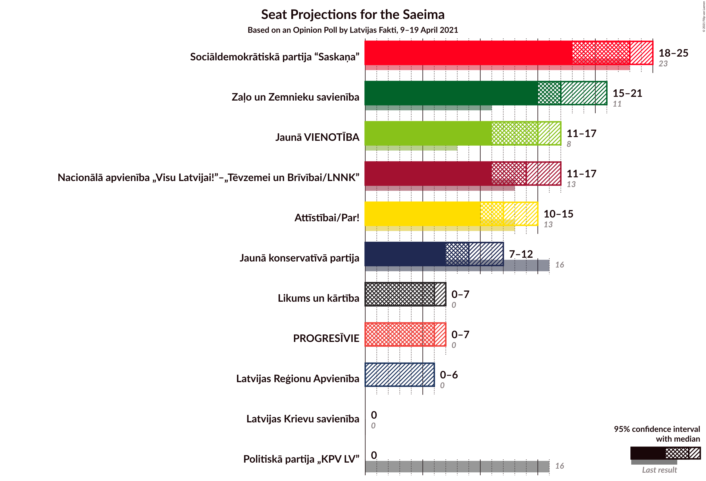
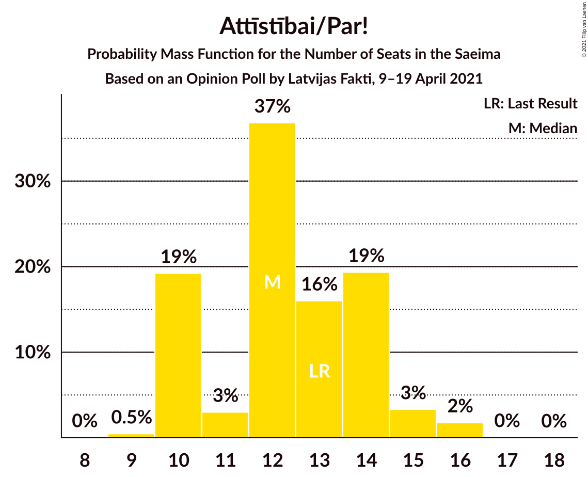
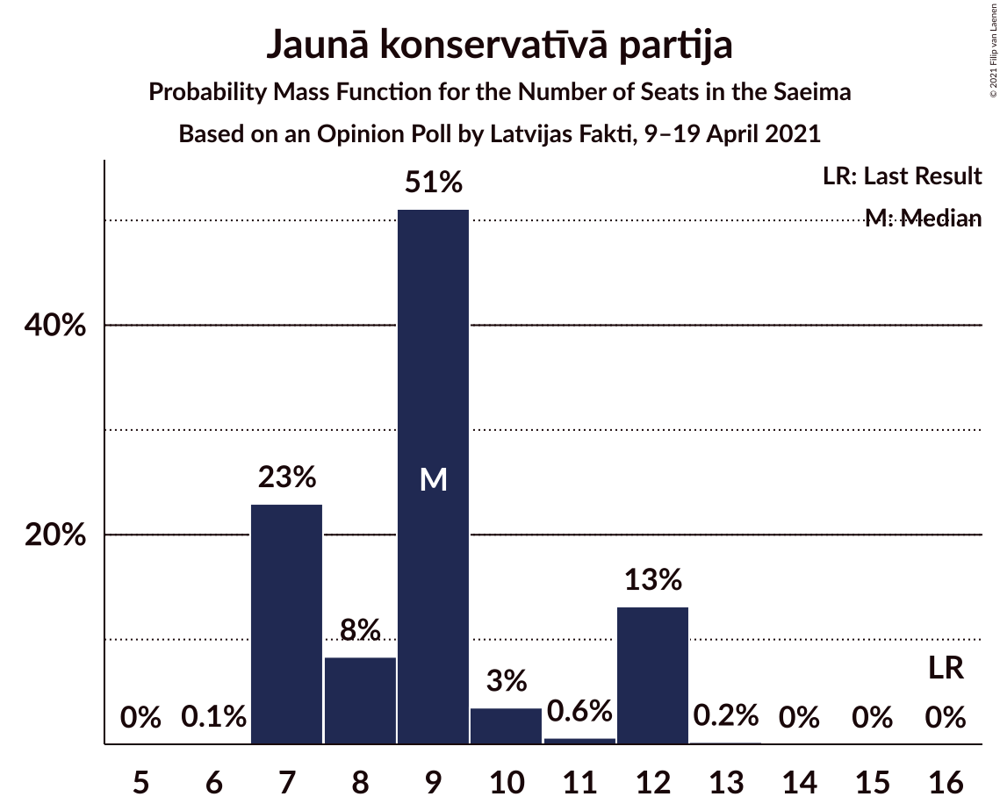
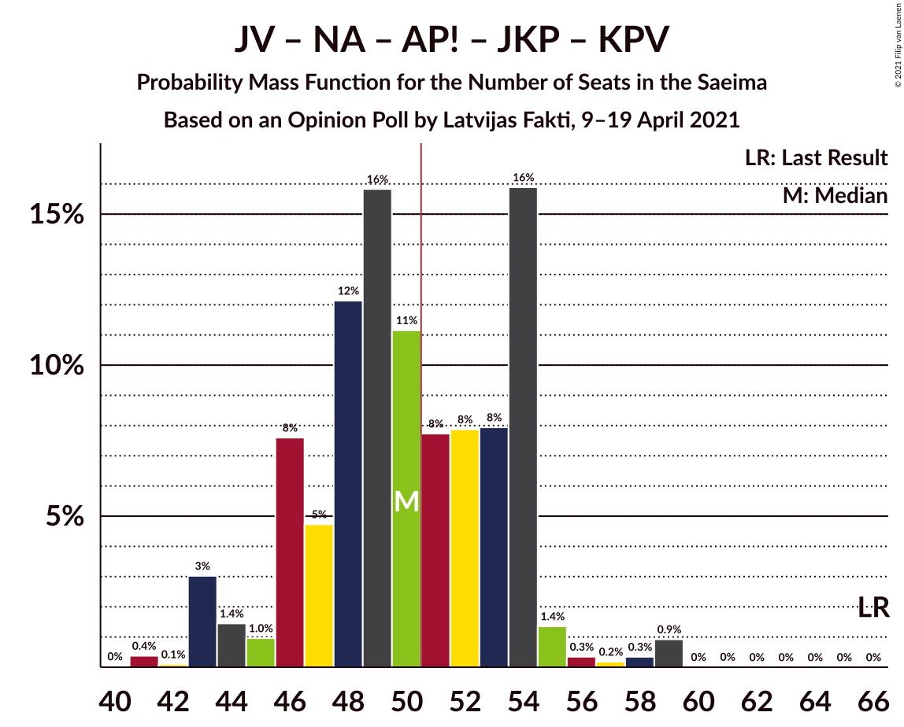

# Opinion Poll by Latvijas Fakti, 9–19 April 2021

<a href="#voting-intentions">Voting Intentions</a> | <a href="#seats">Seats</a> | <a href="#coalitions">Coalitions</a> | <a href="#technical-information">Technical Information</a>

## Voting Intentions

### Confidence Intervals

| Party | Last Result | Poll Result | 80% Confidence Interval | 90% Confidence Interval | 95% Confidence Interval | 99% Confidence Interval |
|:-----:|:-----------:|:-----------:|:-----------------------:|:-----------------------:|:-----------------------:|:-----------------------:|
| Sociāldemokrātiskā partija “Saskaņa” | 19.8% | 9.2% | 8.1–10.4% |7.8–10.8% |7.5–11.1% |7.0–11.8% |
| Zaļo un Zemnieku savienība | 9.9% | 7.3% | 6.3–8.4% |6.1–8.8% |5.8–9.1% |5.4–9.6% |
| Nacionālā apvienība „Visu Latvijai!”–„Tēvzemei un Brīvībai/LNNK” | 11.0% | 6.2% | 5.3–7.3% |5.1–7.6% |4.8–7.8% |4.5–8.4% |
| Jaunā VIENOTĪBA | 6.7% | 6.2% | 5.3–7.3% |5.1–7.6% |4.8–7.8% |4.5–8.4% |
| Attīstībai/Par! | 12.0% | 5.3% | 4.5–6.3% |4.3–6.6% |4.1–6.9% |3.7–7.4% |
| Jaunā konservatīvā partija | 13.6% | 3.7% | 3.0–4.6% |2.8–4.8% |2.7–5.0% |2.4–5.5% |
| Likums un kārtība | 0.0% | 2.7% | 2.1–3.5% |2.0–3.7% |1.9–3.9% |1.6–4.3% |
| PROGRESĪVIE | 2.6% | 2.6% | 2.0–3.4% |1.9–3.6% |1.8–3.8% |1.5–4.2% |
| Latvijas Reģionu Apvienība | 4.1% | 2.2% | 1.7–2.9% |1.6–3.1% |1.4–3.3% |1.2–3.7% |
| Latvijas Krievu savienība | 3.2% | 1.8% | 1.4–2.5% |1.2–2.7% |1.1–2.8% |1.0–3.2% |
| Politiskā partija „KPV LV” | 14.2% | 1.1% | 0.8–1.7% |0.7–1.8% |0.6–2.0% |0.5–2.3% |

*Note:* The poll result column reflects the actual value used in the calculations. Published results may vary slightly, and in addition be rounded to fewer digits.

## Seats

### Confidence Intervals

| Party | Last Result | Median | 80% Confidence Interval | 90% Confidence Interval | 95% Confidence Interval | 99% Confidence Interval |
|:-----:|:-----------:|:------:|:-----------------------:|:-----------------------:|:-----------------------:|:-----------------------:|
| <a href="#sociāldemokrātiskā-partija-“saskaņa”">Sociāldemokrātiskā partija “Saskaņa”</a> | 23 | 29 | 22–39 |21–39 |21–39 |21–39 |
| <a href="#zaļo-un-zemnieku-savienība">Zaļo un Zemnieku savienība</a> | 11 | 22 | 17–37 |17–37 |17–37 |17–37 |
| <a href="#nacionālā-apvienība-„visu-latvijai!”–„tēvzemei-un-brīvībai/lnnk”">Nacionālā apvienība „Visu Latvijai!”–„Tēvzemei un Brīvībai/LNNK”</a> | 13 | 20 | 0–21 |0–25 |0–28 |0–33 |
| <a href="#jaunā-vienotība">Jaunā VIENOTĪBA</a> | 8 | 18 | 16–24 |15–26 |0–26 |0–27 |
| <a href="#attīstībai/par!">Attīstībai/Par!</a> | 13 | 16 | 0–20 |0–20 |0–20 |0–21 |
| <a href="#jaunā-konservatīvā-partija">Jaunā konservatīvā partija</a> | 16 | 0 | 0 |0 |0 |0–13 |
| <a href="#likums-un-kārtība">Likums un kārtība</a> | 0 | 0 | 0 |0 |0 |0 |
| <a href="#progresīvie">PROGRESĪVIE</a> | 0 | 0 | 0 |0 |0 |0 |
| <a href="#latvijas-reģionu-apvienība">Latvijas Reģionu Apvienība</a> | 0 | 0 | 0 |0 |0 |0 |
| <a href="#latvijas-krievu-savienība">Latvijas Krievu savienība</a> | 0 | 0 | 0 |0 |0 |0 |
| <a href="#politiskā-partija-„kpv-lv”">Politiskā partija „KPV LV”</a> | 16 | 0 | 0 |0 |0 |0 |

### Sociāldemokrātiskā partija “Saskaņa”

*For a full overview of the results for this party, see the [Sociāldemokrātiskā partija “Saskaņa”](party-sociāldemokrātiskāpartija“saskaņa”.html) page.*

| Number of Seats | Probability | Accumulated | Special Marks |
|:---------------:|:-----------:|:-----------:|:-------------:|
| 21 | 10% | 100% |  |
| 22 | 1.2% | 90% |  |
| 23 | 12% | 89% | Last Result |
| 24 | 0.6% | 77% |  |
| 25 | 7% | 77% |  |
| 26 | 0.7% | 70% |  |
| 27 | 8% | 69% |  |
| 28 | 5% | 61% |  |
| 29 | 12% | 56% | Median |
| 30 | 11% | 45% |  |
| 31 | 0.6% | 33% |  |
| 32 | 2% | 33% |  |
| 33 | 9% | 30% |  |
| 34 | 2% | 21% |  |
| 35 | 2% | 19% |  |
| 36 | 0.2% | 16% |  |
| 37 | 2% | 16% |  |
| 38 | 0.4% | 14% |  |
| 39 | 13% | 14% |  |
| 40 | 0% | 0.5% |  |
| 41 | 0% | 0.5% |  |
| 42 | 0% | 0.4% |  |
| 43 | 0.1% | 0.4% |  |
| 44 | 0.2% | 0.4% |  |
| 45 | 0% | 0.2% |  |
| 46 | 0% | 0.2% |  |
| 47 | 0% | 0.2% |  |
| 48 | 0% | 0.2% |  |
| 49 | 0% | 0.2% |  |
| 50 | 0% | 0.2% |  |
| 51 | 0% | 0.2% | Majority |
| 52 | 0% | 0.2% |  |
| 53 | 0% | 0.2% |  |
| 54 | 0% | 0.2% |  |
| 55 | 0% | 0.2% |  |
| 56 | 0% | 0.2% |  |
| 57 | 0.1% | 0.2% |  |
| 58 | 0% | 0% |  |

### Zaļo un Zemnieku savienība

*For a full overview of the results for this party, see the [Zaļo un Zemnieku savienība](party-zaļounzemniekusavienība.html) page.*

| Number of Seats | Probability | Accumulated | Special Marks |
|:---------------:|:-----------:|:-----------:|:-------------:|
| 0 | 0.2% | 100% |  |
| 1 | 0% | 99.8% |  |
| 2 | 0% | 99.8% |  |
| 3 | 0% | 99.8% |  |
| 4 | 0% | 99.8% |  |
| 5 | 0% | 99.8% |  |
| 6 | 0% | 99.8% |  |
| 7 | 0% | 99.8% |  |
| 8 | 0% | 99.8% |  |
| 9 | 0% | 99.8% |  |
| 10 | 0% | 99.8% |  |
| 11 | 0% | 99.8% | Last Result |
| 12 | 0% | 99.8% |  |
| 13 | 0% | 99.8% |  |
| 14 | 0% | 99.8% |  |
| 15 | 0% | 99.8% |  |
| 16 | 0% | 99.8% |  |
| 17 | 10% | 99.8% |  |
| 18 | 1.3% | 90% |  |
| 19 | 0.5% | 88% |  |
| 20 | 17% | 88% |  |
| 21 | 5% | 71% |  |
| 22 | 20% | 66% | Median |
| 23 | 2% | 46% |  |
| 24 | 17% | 43% |  |
| 25 | 2% | 27% |  |
| 26 | 2% | 24% |  |
| 27 | 4% | 22% |  |
| 28 | 0.5% | 18% |  |
| 29 | 0% | 18% |  |
| 30 | 2% | 18% |  |
| 31 | 0.1% | 16% |  |
| 32 | 2% | 16% |  |
| 33 | 0.1% | 14% |  |
| 34 | 0% | 13% |  |
| 35 | 0% | 13% |  |
| 36 | 0.1% | 13% |  |
| 37 | 13% | 13% |  |
| 38 | 0% | 0.2% |  |
| 39 | 0% | 0.2% |  |
| 40 | 0% | 0.2% |  |
| 41 | 0% | 0.2% |  |
| 42 | 0% | 0.2% |  |
| 43 | 0.1% | 0.2% |  |
| 44 | 0% | 0% |  |

### Nacionālā apvienība „Visu Latvijai!”–„Tēvzemei un Brīvībai/LNNK”

*For a full overview of the results for this party, see the [Nacionālā apvienība „Visu Latvijai!”–„Tēvzemei un Brīvībai/LNNK”](party-nacionālāapvienība„visulatvijai”–„tēvzemeiunbrīvībailnnk”.html) page.*

| Number of Seats | Probability | Accumulated | Special Marks |
|:---------------:|:-----------:|:-----------:|:-------------:|
| 0 | 14% | 100% |  |
| 1 | 0% | 86% |  |
| 2 | 0% | 86% |  |
| 3 | 0% | 86% |  |
| 4 | 0% | 86% |  |
| 5 | 0% | 86% |  |
| 6 | 0% | 86% |  |
| 7 | 0% | 86% |  |
| 8 | 0% | 86% |  |
| 9 | 0% | 86% |  |
| 10 | 0% | 86% |  |
| 11 | 0% | 86% |  |
| 12 | 0% | 86% |  |
| 13 | 0% | 86% | Last Result |
| 14 | 2% | 86% |  |
| 15 | 5% | 84% |  |
| 16 | 7% | 79% |  |
| 17 | 5% | 73% |  |
| 18 | 0.6% | 67% |  |
| 19 | 8% | 67% |  |
| 20 | 39% | 59% | Median |
| 21 | 11% | 20% |  |
| 22 | 3% | 9% |  |
| 23 | 0.2% | 6% |  |
| 24 | 1.1% | 6% |  |
| 25 | 0.1% | 5% |  |
| 26 | 2% | 5% |  |
| 27 | 0.4% | 3% |  |
| 28 | 0.3% | 3% |  |
| 29 | 0.1% | 2% |  |
| 30 | 0% | 2% |  |
| 31 | 0% | 2% |  |
| 32 | 0.1% | 2% |  |
| 33 | 2% | 2% |  |
| 34 | 0% | 0% |  |

### Jaunā VIENOTĪBA

*For a full overview of the results for this party, see the [Jaunā VIENOTĪBA](party-jaunāvienotība.html) page.*

| Number of Seats | Probability | Accumulated | Special Marks |
|:---------------:|:-----------:|:-----------:|:-------------:|
| 0 | 3% | 100% |  |
| 1 | 0% | 97% |  |
| 2 | 0% | 97% |  |
| 3 | 0% | 97% |  |
| 4 | 0% | 97% |  |
| 5 | 0% | 97% |  |
| 6 | 0% | 97% |  |
| 7 | 0% | 97% |  |
| 8 | 0% | 97% | Last Result |
| 9 | 0% | 97% |  |
| 10 | 0% | 97% |  |
| 11 | 0% | 97% |  |
| 12 | 0% | 97% |  |
| 13 | 0% | 97% |  |
| 14 | 2% | 97% |  |
| 15 | 3% | 95% |  |
| 16 | 31% | 92% |  |
| 17 | 4% | 62% |  |
| 18 | 11% | 58% | Median |
| 19 | 3% | 47% |  |
| 20 | 13% | 44% |  |
| 21 | 0.2% | 32% |  |
| 22 | 2% | 31% |  |
| 23 | 0.3% | 30% |  |
| 24 | 21% | 30% |  |
| 25 | 2% | 9% |  |
| 26 | 6% | 7% |  |
| 27 | 0.1% | 0.6% |  |
| 28 | 0% | 0.5% |  |
| 29 | 0.2% | 0.5% |  |
| 30 | 0.2% | 0.2% |  |
| 31 | 0.1% | 0.1% |  |
| 32 | 0% | 0% |  |

### Attīstībai/Par!

*For a full overview of the results for this party, see the [Attīstībai/Par!](party-attīstībaipar.html) page.*

| Number of Seats | Probability | Accumulated | Special Marks |
|:---------------:|:-----------:|:-----------:|:-------------:|
| 0 | 41% | 100% |  |
| 1 | 0% | 59% |  |
| 2 | 0% | 59% |  |
| 3 | 0% | 59% |  |
| 4 | 0% | 59% |  |
| 5 | 0% | 59% |  |
| 6 | 0% | 59% |  |
| 7 | 0% | 59% |  |
| 8 | 0% | 59% |  |
| 9 | 0% | 59% |  |
| 10 | 0% | 59% |  |
| 11 | 0% | 59% |  |
| 12 | 0% | 59% |  |
| 13 | 0% | 59% | Last Result |
| 14 | 0% | 59% |  |
| 15 | 7% | 59% |  |
| 16 | 3% | 52% | Median |
| 17 | 26% | 48% |  |
| 18 | 9% | 22% |  |
| 19 | 1.0% | 13% |  |
| 20 | 11% | 12% |  |
| 21 | 0.6% | 0.9% |  |
| 22 | 0.1% | 0.3% |  |
| 23 | 0.1% | 0.2% |  |
| 24 | 0% | 0.1% |  |
| 25 | 0.1% | 0.1% |  |
| 26 | 0% | 0% |  |

### Jaunā konservatīvā partija

*For a full overview of the results for this party, see the [Jaunā konservatīvā partija](party-jaunākonservatīvāpartija.html) page.*

| Number of Seats | Probability | Accumulated | Special Marks |
|:---------------:|:-----------:|:-----------:|:-------------:|
| 0 | 98% | 100% | Median |
| 1 | 0% | 2% |  |
| 2 | 0% | 2% |  |
| 3 | 0% | 2% |  |
| 4 | 0% | 2% |  |
| 5 | 0% | 2% |  |
| 6 | 0% | 2% |  |
| 7 | 0% | 2% |  |
| 8 | 0% | 2% |  |
| 9 | 0% | 2% |  |
| 10 | 0% | 2% |  |
| 11 | 0% | 2% |  |
| 12 | 1.4% | 2% |  |
| 13 | 0.1% | 0.5% |  |
| 14 | 0.1% | 0.5% |  |
| 15 | 0.1% | 0.3% |  |
| 16 | 0% | 0.2% | Last Result |
| 17 | 0.2% | 0.2% |  |
| 18 | 0% | 0.1% |  |
| 19 | 0% | 0.1% |  |
| 20 | 0% | 0% |  |

### Likums un kārtība

*For a full overview of the results for this party, see the [Likums un kārtība](party-likumsunkārtība.html) page.*

| Number of Seats | Probability | Accumulated | Special Marks |
|:---------------:|:-----------:|:-----------:|:-------------:|
| 0 | 100% | 100% | Last Result, Median |

### PROGRESĪVIE

*For a full overview of the results for this party, see the [PROGRESĪVIE](party-progresīvie.html) page.*

| Number of Seats | Probability | Accumulated | Special Marks |
|:---------------:|:-----------:|:-----------:|:-------------:|
| 0 | 100% | 100% | Last Result, Median |

### Latvijas Reģionu Apvienība

*For a full overview of the results for this party, see the [Latvijas Reģionu Apvienība](party-latvijasreģionuapvienība.html) page.*

| Number of Seats | Probability | Accumulated | Special Marks |
|:---------------:|:-----------:|:-----------:|:-------------:|
| 0 | 100% | 100% | Last Result, Median |

### Latvijas Krievu savienība

*For a full overview of the results for this party, see the [Latvijas Krievu savienība](party-latvijaskrievusavienība.html) page.*

| Number of Seats | Probability | Accumulated | Special Marks |
|:---------------:|:-----------:|:-----------:|:-------------:|
| 0 | 100% | 100% | Last Result, Median |

### Politiskā partija „KPV LV”

*For a full overview of the results for this party, see the [Politiskā partija „KPV LV”](party-politiskāpartija„kpvlv”.html) page.*

| Number of Seats | Probability | Accumulated | Special Marks |
|:---------------:|:-----------:|:-----------:|:-------------:|
| 0 | 100% | 100% | Median |
| 1 | 0% | 0% |  |
| 2 | 0% | 0% |  |
| 3 | 0% | 0% |  |
| 4 | 0% | 0% |  |
| 5 | 0% | 0% |  |
| 6 | 0% | 0% |  |
| 7 | 0% | 0% |  |
| 8 | 0% | 0% |  |
| 9 | 0% | 0% |  |
| 10 | 0% | 0% |  |
| 11 | 0% | 0% |  |
| 12 | 0% | 0% |  |
| 13 | 0% | 0% |  |
| 14 | 0% | 0% |  |
| 15 | 0% | 0% |  |
| 16 | 0% | 0% | Last Result |

## Coalitions

### Confidence Intervals

| Coalition | Last Result | Median | Majority? | 80% Confidence Interval | 90% Confidence Interval | 95% Confidence Interval | 99% Confidence Interval |
|:---------:|:-----------:|:------:|:---------:|:-----------------------:|:-----------------------:|:-----------------------:|:-----------------------:|
| Zaļo un Zemnieku savienība – Jaunā VIENOTĪBA – Nacionālā apvienība „Visu Latvijai!”–„Tēvzemei un Brīvībai/LNNK” – Attīstībai/Par! – Jaunā konservatīvā partija | 61 | 71 | 99.8% | 61–78 | 61–79 | 61–79 | 61–79 |
| Zaļo un Zemnieku savienība – Jaunā VIENOTĪBA – Nacionālā apvienība „Visu Latvijai!”–„Tēvzemei un Brīvībai/LNNK” – Attīstībai/Par! | 45 | 71 | 99.8% | 61–77 | 61–79 | 61–79 | 56–79 |
| Sociāldemokrātiskā partija “Saskaņa” – Zaļo un Zemnieku savienība – Politiskā partija „KPV LV” | 50 | 50 | 47% | 43–76 | 43–76 | 43–76 | 43–76 |
| Zaļo un Zemnieku savienība – Jaunā VIENOTĪBA – Nacionālā apvienība „Visu Latvijai!”–„Tēvzemei un Brīvībai/LNNK” – Jaunā konservatīvā partija | 48 | 61 | 99.0% | 53–68 | 53–70 | 52–70 | 48–71 |
| Zaļo un Zemnieku savienība – Jaunā VIENOTĪBA – Nacionālā apvienība „Visu Latvijai!”–„Tēvzemei un Brīvībai/LNNK” | 32 | 60 | 98.7% | 53–68 | 53–70 | 52–70 | 47–71 |
| Zaļo un Zemnieku savienība – Nacionālā apvienība „Visu Latvijai!”–„Tēvzemei un Brīvībai/LNNK” – Attīstībai/Par! – Jaunā konservatīvā partija | 53 | 55 | 63% | 37–61 | 37–61 | 37–65 | 37–69 |
| Zaļo un Zemnieku savienība – Nacionālā apvienība „Visu Latvijai!”–„Tēvzemei un Brīvībai/LNNK” – Attīstībai/Par! | 37 | 55 | 63% | 37–61 | 37–61 | 37–64 | 37–65 |
| Zaļo un Zemnieku savienība – Nacionālā apvienība „Visu Latvijai!”–„Tēvzemei un Brīvībai/LNNK” – Jaunā konservatīvā partija | 40 | 42 | 5% | 37–48 | 35–50 | 35–57 | 33–65 |
| Jaunā VIENOTĪBA – Nacionālā apvienība „Visu Latvijai!”–„Tēvzemei un Brīvībai/LNNK” – Attīstībai/Par! – Jaunā konservatīvā partija | 50 | 50 | 49% | 24–57 | 24–57 | 24–57 | 24–57 |
| Jaunā VIENOTĪBA – Nacionālā apvienība „Visu Latvijai!”–„Tēvzemei un Brīvībai/LNNK” – Attīstībai/Par! – Jaunā konservatīvā partija – Politiskā partija „KPV LV” | 66 | 50 | 49% | 24–57 | 24–57 | 24–57 | 24–57 |
| Jaunā VIENOTĪBA – Nacionālā apvienība „Visu Latvijai!”–„Tēvzemei un Brīvībai/LNNK” – Attīstībai/Par! – Politiskā partija „KPV LV” | 50 | 50 | 47% | 24–55 | 24–57 | 24–57 | 24–57 |
| Sociāldemokrātiskā partija “Saskaņa” – Attīstībai/Par! – Jaunā konservatīvā partija | 52 | 40 | 0.7% | 32–47 | 30–47 | 30–48 | 29–52 |
| Sociāldemokrātiskā partija “Saskaņa” – Attīstībai/Par! | 36 | 39 | 0.6% | 32–47 | 30–47 | 30–48 | 29–52 |
| Jaunā VIENOTĪBA – Nacionālā apvienība „Visu Latvijai!”–„Tēvzemei un Brīvībai/LNNK” – Jaunā konservatīvā partija – Politiskā partija „KPV LV” | 53 | 36 | 0.2% | 24–46 | 24–46 | 24–46 | 22–47 |
| Sociāldemokrātiskā partija “Saskaņa” – Politiskā partija „KPV LV” | 39 | 29 | 0.2% | 22–39 | 21–39 | 21–39 | 21–39 |
| Jaunā VIENOTĪBA – Attīstībai/Par! – Jaunā konservatīvā partija – Politiskā partija „KPV LV” | 53 | 33 | 0% | 20–37 | 18–37 | 0–39 | 0–41 |
| Nacionālā apvienība „Visu Latvijai!”–„Tēvzemei un Brīvībai/LNNK” – Attīstībai/Par! – Jaunā konservatīvā partija – Politiskā partija „KPV LV” | 58 | 32 | 0% | 0–38 | 0–39 | 0–39 | 0–46 |

### Zaļo un Zemnieku savienība – Jaunā VIENOTĪBA – Nacionālā apvienība „Visu Latvijai!”–„Tēvzemei un Brīvībai/LNNK” – Attīstībai/Par! – Jaunā konservatīvā partija

| Number of Seats | Probability | Accumulated | Special Marks |
|:---------------:|:-----------:|:-----------:|:-------------:|
| 43 | 0.1% | 100% |  |
| 44 | 0% | 99.8% |  |
| 45 | 0% | 99.8% |  |
| 46 | 0% | 99.8% |  |
| 47 | 0% | 99.8% |  |
| 48 | 0% | 99.8% |  |
| 49 | 0% | 99.8% |  |
| 50 | 0% | 99.8% |  |
| 51 | 0% | 99.8% | Majority |
| 52 | 0% | 99.8% |  |
| 53 | 0% | 99.8% |  |
| 54 | 0% | 99.8% |  |
| 55 | 0% | 99.8% |  |
| 56 | 0.2% | 99.8% |  |
| 57 | 0.1% | 99.6% |  |
| 58 | 0% | 99.6% |  |
| 59 | 0% | 99.6% |  |
| 60 | 0% | 99.5% |  |
| 61 | 13% | 99.5% | Last Result |
| 62 | 0.4% | 86% |  |
| 63 | 2% | 86% |  |
| 64 | 0.2% | 84% |  |
| 65 | 2% | 84% |  |
| 66 | 2% | 81% |  |
| 67 | 9% | 79% |  |
| 68 | 2% | 70% |  |
| 69 | 0.6% | 67% |  |
| 70 | 11% | 67% |  |
| 71 | 12% | 55% |  |
| 72 | 5% | 44% |  |
| 73 | 8% | 39% |  |
| 74 | 0.7% | 31% |  |
| 75 | 7% | 30% |  |
| 76 | 0.6% | 23% | Median |
| 77 | 12% | 23% |  |
| 78 | 1.2% | 11% |  |
| 79 | 10% | 10% |  |
| 80 | 0% | 0% |  |

### Zaļo un Zemnieku savienība – Jaunā VIENOTĪBA – Nacionālā apvienība „Visu Latvijai!”–„Tēvzemei un Brīvībai/LNNK” – Attīstībai/Par!

| Number of Seats | Probability | Accumulated | Special Marks |
|:---------------:|:-----------:|:-----------:|:-------------:|
| 43 | 0.1% | 100% |  |
| 44 | 0% | 99.8% |  |
| 45 | 0% | 99.8% | Last Result |
| 46 | 0% | 99.8% |  |
| 47 | 0% | 99.8% |  |
| 48 | 0% | 99.8% |  |
| 49 | 0% | 99.8% |  |
| 50 | 0% | 99.8% |  |
| 51 | 0% | 99.8% | Majority |
| 52 | 0% | 99.8% |  |
| 53 | 0% | 99.8% |  |
| 54 | 0% | 99.7% |  |
| 55 | 0.2% | 99.7% |  |
| 56 | 0.2% | 99.6% |  |
| 57 | 0.1% | 99.3% |  |
| 58 | 0.1% | 99.3% |  |
| 59 | 0% | 99.2% |  |
| 60 | 0% | 99.2% |  |
| 61 | 13% | 99.1% |  |
| 62 | 0.5% | 86% |  |
| 63 | 2% | 85% |  |
| 64 | 0.2% | 84% |  |
| 65 | 3% | 83% |  |
| 66 | 2% | 81% |  |
| 67 | 11% | 79% |  |
| 68 | 2% | 68% |  |
| 69 | 0.6% | 65% |  |
| 70 | 11% | 65% |  |
| 71 | 12% | 53% |  |
| 72 | 5% | 42% |  |
| 73 | 8% | 37% |  |
| 74 | 0.7% | 30% |  |
| 75 | 7% | 29% |  |
| 76 | 0.6% | 22% | Median |
| 77 | 12% | 21% |  |
| 78 | 1.2% | 10% |  |
| 79 | 8% | 8% |  |
| 80 | 0% | 0% |  |

### Sociāldemokrātiskā partija “Saskaņa” – Zaļo un Zemnieku savienība – Politiskā partija „KPV LV”

| Number of Seats | Probability | Accumulated | Special Marks |
|:---------------:|:-----------:|:-----------:|:-------------:|
| 31 | 0.1% | 100% |  |
| 32 | 0% | 99.9% |  |
| 33 | 0% | 99.9% |  |
| 34 | 0% | 99.9% |  |
| 35 | 0% | 99.9% |  |
| 36 | 0% | 99.9% |  |
| 37 | 0.1% | 99.9% |  |
| 38 | 0% | 99.8% |  |
| 39 | 0% | 99.8% |  |
| 40 | 0% | 99.8% |  |
| 41 | 0.1% | 99.8% |  |
| 42 | 0% | 99.7% |  |
| 43 | 10% | 99.7% |  |
| 44 | 0.5% | 89% |  |
| 45 | 9% | 89% |  |
| 46 | 11% | 80% |  |
| 47 | 15% | 70% |  |
| 48 | 0.8% | 55% |  |
| 49 | 3% | 54% |  |
| 50 | 4% | 51% | Last Result |
| 51 | 0.2% | 47% | Median, Majority |
| 52 | 0.2% | 47% |  |
| 53 | 4% | 47% |  |
| 54 | 11% | 43% |  |
| 55 | 10% | 32% |  |
| 56 | 0.1% | 22% |  |
| 57 | 0.1% | 22% |  |
| 58 | 2% | 22% |  |
| 59 | 0.1% | 20% |  |
| 60 | 2% | 20% |  |
| 61 | 0.1% | 18% |  |
| 62 | 2% | 18% |  |
| 63 | 0% | 16% |  |
| 64 | 0% | 16% |  |
| 65 | 0% | 16% |  |
| 66 | 0% | 16% |  |
| 67 | 2% | 16% |  |
| 68 | 0% | 14% |  |
| 69 | 0% | 14% |  |
| 70 | 0.1% | 14% |  |
| 71 | 0% | 14% |  |
| 72 | 0.3% | 14% |  |
| 73 | 0% | 13% |  |
| 74 | 0% | 13% |  |
| 75 | 0.1% | 13% |  |
| 76 | 13% | 13% |  |
| 77 | 0% | 0.2% |  |
| 78 | 0% | 0.2% |  |
| 79 | 0% | 0.2% |  |
| 80 | 0% | 0.2% |  |
| 81 | 0% | 0.2% |  |
| 82 | 0% | 0.2% |  |
| 83 | 0% | 0.2% |  |
| 84 | 0% | 0.2% |  |
| 85 | 0% | 0.2% |  |
| 86 | 0% | 0.2% |  |
| 87 | 0% | 0.2% |  |
| 88 | 0% | 0.2% |  |
| 89 | 0% | 0.2% |  |
| 90 | 0% | 0.2% |  |
| 91 | 0% | 0.2% |  |
| 92 | 0% | 0.2% |  |
| 93 | 0% | 0.2% |  |
| 94 | 0% | 0.2% |  |
| 95 | 0% | 0.2% |  |
| 96 | 0% | 0.2% |  |
| 97 | 0% | 0.2% |  |
| 98 | 0% | 0.2% |  |
| 99 | 0% | 0.2% |  |
| 100 | 0.2% | 0.2% |  |

### Zaļo un Zemnieku savienība – Jaunā VIENOTĪBA – Nacionālā apvienība „Visu Latvijai!”–„Tēvzemei un Brīvībai/LNNK” – Jaunā konservatīvā partija

| Number of Seats | Probability | Accumulated | Special Marks |
|:---------------:|:-----------:|:-----------:|:-------------:|
| 43 | 0.2% | 100% |  |
| 44 | 0.2% | 99.8% |  |
| 45 | 0% | 99.6% |  |
| 46 | 0% | 99.6% |  |
| 47 | 0% | 99.6% |  |
| 48 | 0.1% | 99.6% | Last Result |
| 49 | 0.1% | 99.5% |  |
| 50 | 0.4% | 99.4% |  |
| 51 | 0.6% | 99.0% | Majority |
| 52 | 0.9% | 98% |  |
| 53 | 17% | 97% |  |
| 54 | 1.0% | 81% |  |
| 55 | 7% | 80% |  |
| 56 | 3% | 72% |  |
| 57 | 3% | 70% |  |
| 58 | 3% | 67% |  |
| 59 | 1.1% | 64% |  |
| 60 | 12% | 63% | Median |
| 61 | 14% | 52% |  |
| 62 | 9% | 37% |  |
| 63 | 2% | 29% |  |
| 64 | 2% | 27% |  |
| 65 | 2% | 25% |  |
| 66 | 2% | 23% |  |
| 67 | 9% | 21% |  |
| 68 | 2% | 11% |  |
| 69 | 0.1% | 9% |  |
| 70 | 7% | 9% |  |
| 71 | 2% | 2% |  |
| 72 | 0.2% | 0.4% |  |
| 73 | 0.2% | 0.2% |  |
| 74 | 0% | 0% |  |

### Zaļo un Zemnieku savienība – Jaunā VIENOTĪBA – Nacionālā apvienība „Visu Latvijai!”–„Tēvzemei un Brīvībai/LNNK”

| Number of Seats | Probability | Accumulated | Special Marks |
|:---------------:|:-----------:|:-----------:|:-------------:|
| 32 | 0% | 100% | Last Result |
| 33 | 0% | 100% |  |
| 34 | 0% | 100% |  |
| 35 | 0% | 100% |  |
| 36 | 0% | 100% |  |
| 37 | 0% | 100% |  |
| 38 | 0% | 100% |  |
| 39 | 0% | 100% |  |
| 40 | 0% | 100% |  |
| 41 | 0% | 100% |  |
| 42 | 0% | 100% |  |
| 43 | 0.2% | 100% |  |
| 44 | 0.2% | 99.8% |  |
| 45 | 0% | 99.6% |  |
| 46 | 0% | 99.6% |  |
| 47 | 0.1% | 99.6% |  |
| 48 | 0.1% | 99.5% |  |
| 49 | 0.1% | 99.4% |  |
| 50 | 0.5% | 99.3% |  |
| 51 | 0.6% | 98.7% | Majority |
| 52 | 2% | 98% |  |
| 53 | 17% | 96% |  |
| 54 | 1.0% | 79% |  |
| 55 | 7% | 78% |  |
| 56 | 3% | 71% |  |
| 57 | 3% | 68% |  |
| 58 | 3% | 65% |  |
| 59 | 1.1% | 63% |  |
| 60 | 12% | 62% | Median |
| 61 | 14% | 50% |  |
| 62 | 9% | 36% |  |
| 63 | 2% | 27% |  |
| 64 | 0.4% | 25% |  |
| 65 | 2% | 25% |  |
| 66 | 2% | 22% |  |
| 67 | 9% | 20% |  |
| 68 | 2% | 11% |  |
| 69 | 0.1% | 9% |  |
| 70 | 7% | 9% |  |
| 71 | 2% | 2% |  |
| 72 | 0% | 0.2% |  |
| 73 | 0.1% | 0.2% |  |
| 74 | 0% | 0% |  |

### Zaļo un Zemnieku savienība – Nacionālā apvienība „Visu Latvijai!”–„Tēvzemei un Brīvībai/LNNK” – Attīstībai/Par! – Jaunā konservatīvā partija

| Number of Seats | Probability | Accumulated | Special Marks |
|:---------------:|:-----------:|:-----------:|:-------------:|
| 32 | 0.1% | 100% |  |
| 33 | 0% | 99.9% |  |
| 34 | 0% | 99.9% |  |
| 35 | 0% | 99.9% |  |
| 36 | 0.1% | 99.9% |  |
| 37 | 13% | 99.8% |  |
| 38 | 0% | 87% |  |
| 39 | 0% | 87% |  |
| 40 | 0% | 87% |  |
| 41 | 2% | 87% |  |
| 42 | 0.5% | 84% |  |
| 43 | 9% | 84% |  |
| 44 | 6% | 75% |  |
| 45 | 1.0% | 68% |  |
| 46 | 0.3% | 67% |  |
| 47 | 0.4% | 67% |  |
| 48 | 0.1% | 67% |  |
| 49 | 2% | 66% |  |
| 50 | 2% | 65% |  |
| 51 | 0.1% | 63% | Majority |
| 52 | 9% | 63% |  |
| 53 | 0.2% | 54% | Last Result |
| 54 | 0.3% | 54% |  |
| 55 | 12% | 53% |  |
| 56 | 0.7% | 41% |  |
| 57 | 5% | 40% |  |
| 58 | 3% | 35% | Median |
| 59 | 16% | 32% |  |
| 60 | 0.1% | 16% |  |
| 61 | 11% | 15% |  |
| 62 | 0.1% | 4% |  |
| 63 | 0% | 4% |  |
| 64 | 0.1% | 4% |  |
| 65 | 3% | 4% |  |
| 66 | 0% | 0.7% |  |
| 67 | 0% | 0.7% |  |
| 68 | 0% | 0.6% |  |
| 69 | 0.3% | 0.6% |  |
| 70 | 0.1% | 0.3% |  |
| 71 | 0% | 0.2% |  |
| 72 | 0.2% | 0.2% |  |
| 73 | 0% | 0% |  |

### Zaļo un Zemnieku savienība – Nacionālā apvienība „Visu Latvijai!”–„Tēvzemei un Brīvībai/LNNK” – Attīstībai/Par!

| Number of Seats | Probability | Accumulated | Special Marks |
|:---------------:|:-----------:|:-----------:|:-------------:|
| 32 | 0.1% | 100% |  |
| 33 | 0% | 99.9% |  |
| 34 | 0% | 99.9% |  |
| 35 | 0% | 99.9% |  |
| 36 | 0.1% | 99.9% |  |
| 37 | 13% | 99.8% | Last Result |
| 38 | 0% | 87% |  |
| 39 | 0% | 87% |  |
| 40 | 0% | 87% |  |
| 41 | 2% | 87% |  |
| 42 | 0.5% | 84% |  |
| 43 | 9% | 84% |  |
| 44 | 6% | 75% |  |
| 45 | 1.0% | 68% |  |
| 46 | 0.3% | 67% |  |
| 47 | 0.4% | 67% |  |
| 48 | 0.2% | 66% |  |
| 49 | 2% | 66% |  |
| 50 | 2% | 65% |  |
| 51 | 0.2% | 63% | Majority |
| 52 | 9% | 62% |  |
| 53 | 2% | 53% |  |
| 54 | 0.3% | 52% |  |
| 55 | 13% | 52% |  |
| 56 | 0.7% | 39% |  |
| 57 | 5% | 38% |  |
| 58 | 3% | 33% | Median |
| 59 | 16% | 30% |  |
| 60 | 0.1% | 14% |  |
| 61 | 11% | 14% |  |
| 62 | 0.1% | 3% |  |
| 63 | 0% | 3% |  |
| 64 | 0.1% | 3% |  |
| 65 | 2% | 2% |  |
| 66 | 0% | 0.5% |  |
| 67 | 0% | 0.4% |  |
| 68 | 0% | 0.4% |  |
| 69 | 0.3% | 0.4% |  |
| 70 | 0.1% | 0.1% |  |
| 71 | 0% | 0% |  |

### Zaļo un Zemnieku savienība – Nacionālā apvienība „Visu Latvijai!”–„Tēvzemei un Brīvībai/LNNK” – Jaunā konservatīvā partija

| Number of Seats | Probability | Accumulated | Special Marks |
|:---------------:|:-----------:|:-----------:|:-------------:|
| 21 | 0.1% | 100% |  |
| 22 | 0% | 99.9% |  |
| 23 | 0% | 99.9% |  |
| 24 | 0% | 99.9% |  |
| 25 | 0% | 99.9% |  |
| 26 | 0.1% | 99.8% |  |
| 27 | 0% | 99.8% |  |
| 28 | 0% | 99.8% |  |
| 29 | 0% | 99.8% |  |
| 30 | 0% | 99.8% |  |
| 31 | 0.1% | 99.8% |  |
| 32 | 0.1% | 99.6% |  |
| 33 | 1.0% | 99.6% |  |
| 34 | 0.5% | 98.6% |  |
| 35 | 4% | 98% |  |
| 36 | 0.3% | 94% |  |
| 37 | 29% | 94% |  |
| 38 | 1.0% | 65% |  |
| 39 | 10% | 64% |  |
| 40 | 0.1% | 54% | Last Result |
| 41 | 3% | 54% |  |
| 42 | 10% | 51% | Median |
| 43 | 12% | 41% |  |
| 44 | 17% | 29% |  |
| 45 | 1.0% | 12% |  |
| 46 | 0.2% | 11% |  |
| 47 | 0.4% | 10% |  |
| 48 | 0.1% | 10% |  |
| 49 | 1.3% | 10% |  |
| 50 | 4% | 9% |  |
| 51 | 0% | 5% | Majority |
| 52 | 2% | 5% |  |
| 53 | 0% | 3% |  |
| 54 | 0% | 3% |  |
| 55 | 0% | 3% |  |
| 56 | 0.2% | 3% |  |
| 57 | 0.1% | 3% |  |
| 58 | 0% | 2% |  |
| 59 | 0% | 2% |  |
| 60 | 0% | 2% |  |
| 61 | 0.1% | 2% |  |
| 62 | 0% | 2% |  |
| 63 | 0% | 2% |  |
| 64 | 0% | 2% |  |
| 65 | 2% | 2% |  |
| 66 | 0% | 0.2% |  |
| 67 | 0% | 0.2% |  |
| 68 | 0% | 0.2% |  |
| 69 | 0% | 0.2% |  |
| 70 | 0% | 0.2% |  |
| 71 | 0% | 0.2% |  |
| 72 | 0.1% | 0.1% |  |
| 73 | 0% | 0% |  |

### Jaunā VIENOTĪBA – Nacionālā apvienība „Visu Latvijai!”–„Tēvzemei un Brīvībai/LNNK” – Attīstībai/Par! – Jaunā konservatīvā partija

| Number of Seats | Probability | Accumulated | Special Marks |
|:---------------:|:-----------:|:-----------:|:-------------:|
| 0 | 0.2% | 100% |  |
| 1 | 0% | 99.8% |  |
| 2 | 0% | 99.8% |  |
| 3 | 0% | 99.8% |  |
| 4 | 0% | 99.8% |  |
| 5 | 0% | 99.8% |  |
| 6 | 0% | 99.8% |  |
| 7 | 0% | 99.8% |  |
| 8 | 0% | 99.8% |  |
| 9 | 0% | 99.8% |  |
| 10 | 0% | 99.8% |  |
| 11 | 0% | 99.8% |  |
| 12 | 0% | 99.8% |  |
| 13 | 0% | 99.8% |  |
| 14 | 0% | 99.8% |  |
| 15 | 0% | 99.8% |  |
| 16 | 0% | 99.8% |  |
| 17 | 0% | 99.8% |  |
| 18 | 0% | 99.8% |  |
| 19 | 0% | 99.8% |  |
| 20 | 0% | 99.8% |  |
| 21 | 0% | 99.8% |  |
| 22 | 0% | 99.8% |  |
| 23 | 0% | 99.8% |  |
| 24 | 13% | 99.8% |  |
| 25 | 0.1% | 87% |  |
| 26 | 0% | 87% |  |
| 27 | 0% | 87% |  |
| 28 | 0.3% | 87% |  |
| 29 | 0% | 86% |  |
| 30 | 0.1% | 86% |  |
| 31 | 0% | 86% |  |
| 32 | 0% | 86% |  |
| 33 | 2% | 86% |  |
| 34 | 0% | 84% |  |
| 35 | 0% | 84% |  |
| 36 | 0% | 84% |  |
| 37 | 0% | 84% |  |
| 38 | 2% | 84% |  |
| 39 | 0.1% | 82% |  |
| 40 | 2% | 82% |  |
| 41 | 0.1% | 80% |  |
| 42 | 2% | 80% |  |
| 43 | 0.1% | 78% |  |
| 44 | 0.1% | 78% |  |
| 45 | 10% | 78% |  |
| 46 | 11% | 68% |  |
| 47 | 4% | 57% |  |
| 48 | 0.2% | 53% |  |
| 49 | 0.2% | 53% |  |
| 50 | 4% | 53% | Last Result |
| 51 | 3% | 49% | Majority |
| 52 | 0.8% | 46% |  |
| 53 | 15% | 45% |  |
| 54 | 11% | 30% | Median |
| 55 | 9% | 20% |  |
| 56 | 0.5% | 11% |  |
| 57 | 10% | 11% |  |
| 58 | 0% | 0.3% |  |
| 59 | 0.1% | 0.3% |  |
| 60 | 0% | 0.2% |  |
| 61 | 0% | 0.2% |  |
| 62 | 0% | 0.2% |  |
| 63 | 0.1% | 0.2% |  |
| 64 | 0% | 0.1% |  |
| 65 | 0% | 0.1% |  |
| 66 | 0% | 0.1% |  |
| 67 | 0% | 0.1% |  |
| 68 | 0% | 0.1% |  |
| 69 | 0.1% | 0.1% |  |
| 70 | 0% | 0% |  |

### Jaunā VIENOTĪBA – Nacionālā apvienība „Visu Latvijai!”–„Tēvzemei un Brīvībai/LNNK” – Attīstībai/Par! – Jaunā konservatīvā partija – Politiskā partija „KPV LV”

| Number of Seats | Probability | Accumulated | Special Marks |
|:---------------:|:-----------:|:-----------:|:-------------:|
| 0 | 0.2% | 100% |  |
| 1 | 0% | 99.8% |  |
| 2 | 0% | 99.8% |  |
| 3 | 0% | 99.8% |  |
| 4 | 0% | 99.8% |  |
| 5 | 0% | 99.8% |  |
| 6 | 0% | 99.8% |  |
| 7 | 0% | 99.8% |  |
| 8 | 0% | 99.8% |  |
| 9 | 0% | 99.8% |  |
| 10 | 0% | 99.8% |  |
| 11 | 0% | 99.8% |  |
| 12 | 0% | 99.8% |  |
| 13 | 0% | 99.8% |  |
| 14 | 0% | 99.8% |  |
| 15 | 0% | 99.8% |  |
| 16 | 0% | 99.8% |  |
| 17 | 0% | 99.8% |  |
| 18 | 0% | 99.8% |  |
| 19 | 0% | 99.8% |  |
| 20 | 0% | 99.8% |  |
| 21 | 0% | 99.8% |  |
| 22 | 0% | 99.8% |  |
| 23 | 0% | 99.8% |  |
| 24 | 13% | 99.8% |  |
| 25 | 0.1% | 87% |  |
| 26 | 0% | 87% |  |
| 27 | 0% | 87% |  |
| 28 | 0.3% | 87% |  |
| 29 | 0% | 86% |  |
| 30 | 0.1% | 86% |  |
| 31 | 0% | 86% |  |
| 32 | 0% | 86% |  |
| 33 | 2% | 86% |  |
| 34 | 0% | 84% |  |
| 35 | 0% | 84% |  |
| 36 | 0% | 84% |  |
| 37 | 0% | 84% |  |
| 38 | 2% | 84% |  |
| 39 | 0.1% | 82% |  |
| 40 | 2% | 82% |  |
| 41 | 0.1% | 80% |  |
| 42 | 2% | 80% |  |
| 43 | 0.1% | 78% |  |
| 44 | 0.1% | 78% |  |
| 45 | 10% | 78% |  |
| 46 | 11% | 68% |  |
| 47 | 4% | 57% |  |
| 48 | 0.2% | 53% |  |
| 49 | 0.2% | 53% |  |
| 50 | 4% | 53% |  |
| 51 | 3% | 49% | Majority |
| 52 | 0.8% | 46% |  |
| 53 | 15% | 45% |  |
| 54 | 11% | 30% | Median |
| 55 | 9% | 20% |  |
| 56 | 0.5% | 11% |  |
| 57 | 10% | 11% |  |
| 58 | 0% | 0.3% |  |
| 59 | 0.1% | 0.3% |  |
| 60 | 0% | 0.2% |  |
| 61 | 0% | 0.2% |  |
| 62 | 0% | 0.2% |  |
| 63 | 0.1% | 0.2% |  |
| 64 | 0% | 0.1% |  |
| 65 | 0% | 0.1% |  |
| 66 | 0% | 0.1% | Last Result |
| 67 | 0% | 0.1% |  |
| 68 | 0% | 0.1% |  |
| 69 | 0.1% | 0.1% |  |
| 70 | 0% | 0% |  |

### Jaunā VIENOTĪBA – Nacionālā apvienība „Visu Latvijai!”–„Tēvzemei un Brīvībai/LNNK” – Attīstībai/Par! – Politiskā partija „KPV LV”

| Number of Seats | Probability | Accumulated | Special Marks |
|:---------------:|:-----------:|:-----------:|:-------------:|
| 0 | 0.2% | 100% |  |
| 1 | 0% | 99.8% |  |
| 2 | 0% | 99.8% |  |
| 3 | 0% | 99.8% |  |
| 4 | 0% | 99.8% |  |
| 5 | 0% | 99.8% |  |
| 6 | 0% | 99.8% |  |
| 7 | 0% | 99.8% |  |
| 8 | 0% | 99.8% |  |
| 9 | 0% | 99.8% |  |
| 10 | 0% | 99.8% |  |
| 11 | 0% | 99.8% |  |
| 12 | 0% | 99.8% |  |
| 13 | 0% | 99.8% |  |
| 14 | 0% | 99.8% |  |
| 15 | 0% | 99.8% |  |
| 16 | 0% | 99.8% |  |
| 17 | 0% | 99.8% |  |
| 18 | 0% | 99.8% |  |
| 19 | 0% | 99.8% |  |
| 20 | 0% | 99.8% |  |
| 21 | 0% | 99.8% |  |
| 22 | 0.1% | 99.8% |  |
| 23 | 0% | 99.8% |  |
| 24 | 13% | 99.8% |  |
| 25 | 0.1% | 87% |  |
| 26 | 0% | 87% |  |
| 27 | 0% | 87% |  |
| 28 | 0.3% | 87% |  |
| 29 | 0.1% | 86% |  |
| 30 | 0.1% | 86% |  |
| 31 | 0% | 86% |  |
| 32 | 0% | 86% |  |
| 33 | 2% | 86% |  |
| 34 | 0% | 84% |  |
| 35 | 0% | 84% |  |
| 36 | 0.1% | 84% |  |
| 37 | 0% | 84% |  |
| 38 | 2% | 84% |  |
| 39 | 0.1% | 82% |  |
| 40 | 2% | 81% |  |
| 41 | 0.1% | 80% |  |
| 42 | 2% | 80% |  |
| 43 | 0.1% | 78% |  |
| 44 | 0.1% | 77% |  |
| 45 | 11% | 77% |  |
| 46 | 11% | 66% |  |
| 47 | 4% | 55% |  |
| 48 | 0.2% | 52% |  |
| 49 | 0.2% | 52% |  |
| 50 | 4% | 51% | Last Result |
| 51 | 3% | 47% | Majority |
| 52 | 0.8% | 45% |  |
| 53 | 15% | 44% |  |
| 54 | 11% | 29% | Median |
| 55 | 9% | 18% |  |
| 56 | 0.5% | 9% |  |
| 57 | 9% | 9% |  |
| 58 | 0% | 0.3% |  |
| 59 | 0.1% | 0.3% |  |
| 60 | 0% | 0.2% |  |
| 61 | 0% | 0.2% |  |
| 62 | 0% | 0.2% |  |
| 63 | 0.1% | 0.2% |  |
| 64 | 0% | 0.1% |  |
| 65 | 0% | 0.1% |  |
| 66 | 0% | 0.1% |  |
| 67 | 0% | 0.1% |  |
| 68 | 0% | 0.1% |  |
| 69 | 0.1% | 0.1% |  |
| 70 | 0% | 0% |  |

### Sociāldemokrātiskā partija “Saskaņa” – Attīstībai/Par! – Jaunā konservatīvā partija

| Number of Seats | Probability | Accumulated | Special Marks |
|:---------------:|:-----------:|:-----------:|:-------------:|
| 27 | 0.1% | 100% |  |
| 28 | 0% | 99.8% |  |
| 29 | 2% | 99.8% |  |
| 30 | 7% | 98% |  |
| 31 | 0.1% | 91% |  |
| 32 | 2% | 91% |  |
| 33 | 9% | 89% |  |
| 34 | 2% | 80% |  |
| 35 | 2% | 78% |  |
| 36 | 0.4% | 75% |  |
| 37 | 2% | 75% |  |
| 38 | 9% | 73% |  |
| 39 | 14% | 64% |  |
| 40 | 12% | 50% |  |
| 41 | 1.1% | 38% |  |
| 42 | 3% | 37% |  |
| 43 | 3% | 35% |  |
| 44 | 3% | 32% |  |
| 45 | 7% | 29% | Median |
| 46 | 1.0% | 22% |  |
| 47 | 17% | 21% |  |
| 48 | 2% | 4% |  |
| 49 | 0.6% | 2% |  |
| 50 | 0.5% | 1.3% |  |
| 51 | 0.1% | 0.7% | Majority |
| 52 | 0.1% | 0.6% | Last Result |
| 53 | 0.1% | 0.5% |  |
| 54 | 0% | 0.4% |  |
| 55 | 0% | 0.4% |  |
| 56 | 0.2% | 0.4% |  |
| 57 | 0.2% | 0.2% |  |
| 58 | 0% | 0% |  |

### Sociāldemokrātiskā partija “Saskaņa” – Attīstībai/Par!

| Number of Seats | Probability | Accumulated | Special Marks |
|:---------------:|:-----------:|:-----------:|:-------------:|
| 27 | 0.2% | 100% |  |
| 28 | 0.2% | 99.8% |  |
| 29 | 2% | 99.6% |  |
| 30 | 7% | 98% |  |
| 31 | 0.1% | 91% |  |
| 32 | 2% | 91% |  |
| 33 | 9% | 89% |  |
| 34 | 2% | 79% |  |
| 35 | 2% | 77% |  |
| 36 | 2% | 75% | Last Result |
| 37 | 2% | 73% |  |
| 38 | 9% | 71% |  |
| 39 | 14% | 63% |  |
| 40 | 12% | 48% |  |
| 41 | 1.1% | 37% |  |
| 42 | 3% | 36% |  |
| 43 | 3% | 33% |  |
| 44 | 3% | 30% |  |
| 45 | 7% | 28% | Median |
| 46 | 1.0% | 20% |  |
| 47 | 17% | 19% |  |
| 48 | 0.9% | 3% |  |
| 49 | 0.6% | 2% |  |
| 50 | 0.4% | 1.0% |  |
| 51 | 0.1% | 0.6% | Majority |
| 52 | 0.1% | 0.5% |  |
| 53 | 0% | 0.4% |  |
| 54 | 0% | 0.4% |  |
| 55 | 0% | 0.4% |  |
| 56 | 0.2% | 0.4% |  |
| 57 | 0.2% | 0.2% |  |
| 58 | 0% | 0% |  |

### Jaunā VIENOTĪBA – Nacionālā apvienība „Visu Latvijai!”–„Tēvzemei un Brīvībai/LNNK” – Jaunā konservatīvā partija – Politiskā partija „KPV LV”

| Number of Seats | Probability | Accumulated | Special Marks |
|:---------------:|:-----------:|:-----------:|:-------------:|
| 0 | 0.2% | 100% |  |
| 1 | 0% | 99.8% |  |
| 2 | 0% | 99.8% |  |
| 3 | 0% | 99.8% |  |
| 4 | 0% | 99.8% |  |
| 5 | 0% | 99.8% |  |
| 6 | 0% | 99.8% |  |
| 7 | 0% | 99.8% |  |
| 8 | 0% | 99.8% |  |
| 9 | 0% | 99.8% |  |
| 10 | 0% | 99.8% |  |
| 11 | 0% | 99.8% |  |
| 12 | 0% | 99.8% |  |
| 13 | 0% | 99.8% |  |
| 14 | 0% | 99.8% |  |
| 15 | 0% | 99.8% |  |
| 16 | 0% | 99.8% |  |
| 17 | 0% | 99.8% |  |
| 18 | 0.1% | 99.8% |  |
| 19 | 0% | 99.7% |  |
| 20 | 0% | 99.7% |  |
| 21 | 0.1% | 99.6% |  |
| 22 | 0.2% | 99.5% |  |
| 23 | 0% | 99.4% |  |
| 24 | 13% | 99.3% |  |
| 25 | 0.1% | 86% |  |
| 26 | 0% | 86% |  |
| 27 | 0.4% | 86% |  |
| 28 | 0.3% | 86% |  |
| 29 | 0% | 86% |  |
| 30 | 0.2% | 85% |  |
| 31 | 5% | 85% |  |
| 32 | 0.1% | 80% |  |
| 33 | 11% | 80% |  |
| 34 | 0.2% | 70% |  |
| 35 | 8% | 70% |  |
| 36 | 22% | 62% |  |
| 37 | 2% | 40% |  |
| 38 | 4% | 38% | Median |
| 39 | 0.1% | 34% |  |
| 40 | 10% | 34% |  |
| 41 | 0.1% | 24% |  |
| 42 | 4% | 24% |  |
| 43 | 0.1% | 20% |  |
| 44 | 0.1% | 20% |  |
| 45 | 9% | 20% |  |
| 46 | 8% | 10% |  |
| 47 | 1.3% | 2% |  |
| 48 | 0% | 0.3% |  |
| 49 | 0% | 0.3% |  |
| 50 | 0.1% | 0.3% |  |
| 51 | 0.1% | 0.2% | Majority |
| 52 | 0% | 0.1% |  |
| 53 | 0% | 0.1% | Last Result |
| 54 | 0% | 0.1% |  |
| 55 | 0% | 0.1% |  |
| 56 | 0% | 0.1% |  |
| 57 | 0% | 0.1% |  |
| 58 | 0% | 0.1% |  |
| 59 | 0% | 0.1% |  |
| 60 | 0% | 0.1% |  |
| 61 | 0% | 0.1% |  |
| 62 | 0% | 0.1% |  |
| 63 | 0.1% | 0.1% |  |
| 64 | 0% | 0% |  |

### Sociāldemokrātiskā partija “Saskaņa” – Politiskā partija „KPV LV”

| Number of Seats | Probability | Accumulated | Special Marks |
|:---------------:|:-----------:|:-----------:|:-------------:|
| 21 | 10% | 100% |  |
| 22 | 1.2% | 90% |  |
| 23 | 12% | 89% |  |
| 24 | 0.6% | 77% |  |
| 25 | 7% | 77% |  |
| 26 | 0.7% | 70% |  |
| 27 | 8% | 69% |  |
| 28 | 5% | 61% |  |
| 29 | 12% | 56% | Median |
| 30 | 11% | 45% |  |
| 31 | 0.6% | 33% |  |
| 32 | 2% | 33% |  |
| 33 | 9% | 30% |  |
| 34 | 2% | 21% |  |
| 35 | 2% | 19% |  |
| 36 | 0.2% | 16% |  |
| 37 | 2% | 16% |  |
| 38 | 0.4% | 14% |  |
| 39 | 13% | 14% | Last Result |
| 40 | 0% | 0.5% |  |
| 41 | 0% | 0.5% |  |
| 42 | 0% | 0.4% |  |
| 43 | 0.1% | 0.4% |  |
| 44 | 0.2% | 0.4% |  |
| 45 | 0% | 0.2% |  |
| 46 | 0% | 0.2% |  |
| 47 | 0% | 0.2% |  |
| 48 | 0% | 0.2% |  |
| 49 | 0% | 0.2% |  |
| 50 | 0% | 0.2% |  |
| 51 | 0% | 0.2% | Majority |
| 52 | 0% | 0.2% |  |
| 53 | 0% | 0.2% |  |
| 54 | 0% | 0.2% |  |
| 55 | 0% | 0.2% |  |
| 56 | 0% | 0.2% |  |
| 57 | 0.1% | 0.2% |  |
| 58 | 0% | 0% |  |

### Jaunā VIENOTĪBA – Attīstībai/Par! – Jaunā konservatīvā partija – Politiskā partija „KPV LV”

| Number of Seats | Probability | Accumulated | Special Marks |
|:---------------:|:-----------:|:-----------:|:-------------:|
| 0 | 3% | 100% |  |
| 1 | 0% | 97% |  |
| 2 | 0% | 97% |  |
| 3 | 0% | 97% |  |
| 4 | 0% | 97% |  |
| 5 | 0% | 97% |  |
| 6 | 0% | 97% |  |
| 7 | 0% | 97% |  |
| 8 | 0% | 97% |  |
| 9 | 0% | 97% |  |
| 10 | 0% | 97% |  |
| 11 | 0% | 97% |  |
| 12 | 0% | 97% |  |
| 13 | 0% | 97% |  |
| 14 | 0% | 97% |  |
| 15 | 0% | 97% |  |
| 16 | 0.1% | 97% |  |
| 17 | 0.2% | 97% |  |
| 18 | 3% | 97% |  |
| 19 | 3% | 94% |  |
| 20 | 2% | 91% |  |
| 21 | 0.1% | 89% |  |
| 22 | 1.0% | 89% |  |
| 23 | 0.1% | 88% |  |
| 24 | 21% | 88% |  |
| 25 | 2% | 67% |  |
| 26 | 6% | 65% |  |
| 27 | 0.1% | 59% |  |
| 28 | 0% | 59% |  |
| 29 | 0.3% | 59% |  |
| 30 | 3% | 59% |  |
| 31 | 0.2% | 56% |  |
| 32 | 0.3% | 56% |  |
| 33 | 13% | 55% |  |
| 34 | 11% | 43% | Median |
| 35 | 9% | 32% |  |
| 36 | 11% | 23% |  |
| 37 | 9% | 12% |  |
| 38 | 0% | 3% |  |
| 39 | 0.6% | 3% |  |
| 40 | 0.3% | 2% |  |
| 41 | 1.5% | 2% |  |
| 42 | 0.1% | 0.3% |  |
| 43 | 0.1% | 0.2% |  |
| 44 | 0% | 0.1% |  |
| 45 | 0% | 0.1% |  |
| 46 | 0% | 0.1% |  |
| 47 | 0% | 0.1% |  |
| 48 | 0.1% | 0.1% |  |
| 49 | 0% | 0% |  |
| 50 | 0% | 0% |  |
| 51 | 0% | 0% | Majority |
| 52 | 0% | 0% |  |
| 53 | 0% | 0% | Last Result |

### Nacionālā apvienība „Visu Latvijai!”–„Tēvzemei un Brīvībai/LNNK” – Attīstībai/Par! – Jaunā konservatīvā partija – Politiskā partija „KPV LV”

| Number of Seats | Probability | Accumulated | Special Marks |
|:---------------:|:-----------:|:-----------:|:-------------:|
| 0 | 13% | 100% |  |
| 1 | 0% | 87% |  |
| 2 | 0% | 87% |  |
| 3 | 0% | 87% |  |
| 4 | 0% | 87% |  |
| 5 | 0% | 87% |  |
| 6 | 0% | 87% |  |
| 7 | 0% | 87% |  |
| 8 | 0% | 87% |  |
| 9 | 0% | 87% |  |
| 10 | 0% | 87% |  |
| 11 | 0% | 87% |  |
| 12 | 0% | 87% |  |
| 13 | 0% | 87% |  |
| 14 | 0% | 87% |  |
| 15 | 0% | 87% |  |
| 16 | 0% | 87% |  |
| 17 | 0% | 87% |  |
| 18 | 0.4% | 87% |  |
| 19 | 0.3% | 86% |  |
| 20 | 8% | 86% |  |
| 21 | 10% | 78% |  |
| 22 | 3% | 68% |  |
| 23 | 0.2% | 65% |  |
| 24 | 1.1% | 64% |  |
| 25 | 0.1% | 63% |  |
| 26 | 2% | 63% |  |
| 27 | 0% | 61% |  |
| 28 | 0.3% | 61% |  |
| 29 | 0% | 61% |  |
| 30 | 2% | 61% |  |
| 31 | 5% | 59% |  |
| 32 | 4% | 54% |  |
| 33 | 2% | 49% |  |
| 34 | 0.9% | 47% |  |
| 35 | 1.1% | 46% |  |
| 36 | 0.5% | 45% | Median |
| 37 | 25% | 44% |  |
| 38 | 10% | 19% |  |
| 39 | 7% | 9% |  |
| 40 | 0% | 2% |  |
| 41 | 0% | 2% |  |
| 42 | 0% | 2% |  |
| 43 | 1.5% | 2% |  |
| 44 | 0.1% | 0.7% |  |
| 45 | 0.1% | 0.7% |  |
| 46 | 0.6% | 0.6% |  |
| 47 | 0% | 0% |  |
| 48 | 0% | 0% |  |
| 49 | 0% | 0% |  |
| 50 | 0% | 0% |  |
| 51 | 0% | 0% | Majority |
| 52 | 0% | 0% |  |
| 53 | 0% | 0% |  |
| 54 | 0% | 0% |  |
| 55 | 0% | 0% |  |
| 56 | 0% | 0% |  |
| 57 | 0% | 0% |  |
| 58 | 0% | 0% | Last Result |

## Technical Information

### Opinion Poll

+ **Polling firm:** Latvijas Fakti
+ **Commissioner(s):** —
+ **Fieldwork period:** 9–19 April 2021

### Calculations

+ **Sample size:** 1003
+ **Simulations done:** 131,072
+ **Error estimate:** 2.09%

