# Opinion Poll by Latvijas Fakti, 9–19 April 2021

<a href="#voting-intentions">Voting Intentions</a> | <a href="#seats">Seats</a> | <a href="#coalitions">Coalitions</a> | <a href="#technical-information">Technical Information</a>

## Voting Intentions

### Confidence Intervals

| Party | Last Result | Poll Result | 80% Confidence Interval | 90% Confidence Interval | 95% Confidence Interval | 99% Confidence Interval |
|:-----:|:-----------:|:-----------:|:-----------------------:|:-----------------------:|:-----------------------:|:-----------------------:|
| Sociāldemokrātiskā partija “Saskaņa” | 19.8% | 19.0% | 17.5–20.7% |17.1–21.2% |16.7–21.6% |16.0–22.4% |
| Zaļo un Zemnieku savienība | 9.9% | 15.1% | 13.7–16.6% |13.3–17.0% |13.0–17.4% |12.3–18.2% |
| Nacionālā apvienība „Visu Latvijai!”–„Tēvzemei un Brīvībai/LNNK” | 11.0% | 12.8% | 11.5–14.2% |11.1–14.6% |10.8–15.0% |10.3–15.7% |
| Jaunā VIENOTĪBA | 6.7% | 12.8% | 11.5–14.2% |11.1–14.6% |10.8–15.0% |10.3–15.7% |
| Attīstībai/Par! | 12.0% | 11.0% | 9.8–12.3% |9.5–12.7% |9.2–13.1% |8.6–13.7% |
| Jaunā konservatīvā partija | 13.6% | 7.6% | 6.6–8.8% |6.3–9.1% |6.1–9.4% |5.7–10.0% |
| Likums un kārtība | 0.0% | 5.6% | 4.8–6.6% |4.5–6.9% |4.3–7.2% |3.9–7.7% |
| PROGRESĪVIE | 2.6% | 5.4% | 4.6–6.4% |4.3–6.7% |4.1–7.0% |3.8–7.5% |
| Latvijas Reģionu Apvienība | 4.1% | 4.5% | 3.7–5.4% |3.5–5.7% |3.4–6.0% |3.0–6.4% |
| Latvijas Krievu savienība | 3.2% | 3.7% | 3.0–4.6% |2.8–4.8% |2.7–5.0% |2.4–5.5% |
| Politiskā partija „KPV LV” | 14.2% | 2.3% | 1.8–3.0% |1.6–3.2% |1.5–3.4% |1.3–3.8% |

*Note:* The poll result column reflects the actual value used in the calculations. Published results may vary slightly, and in addition be rounded to fewer digits.

## Seats

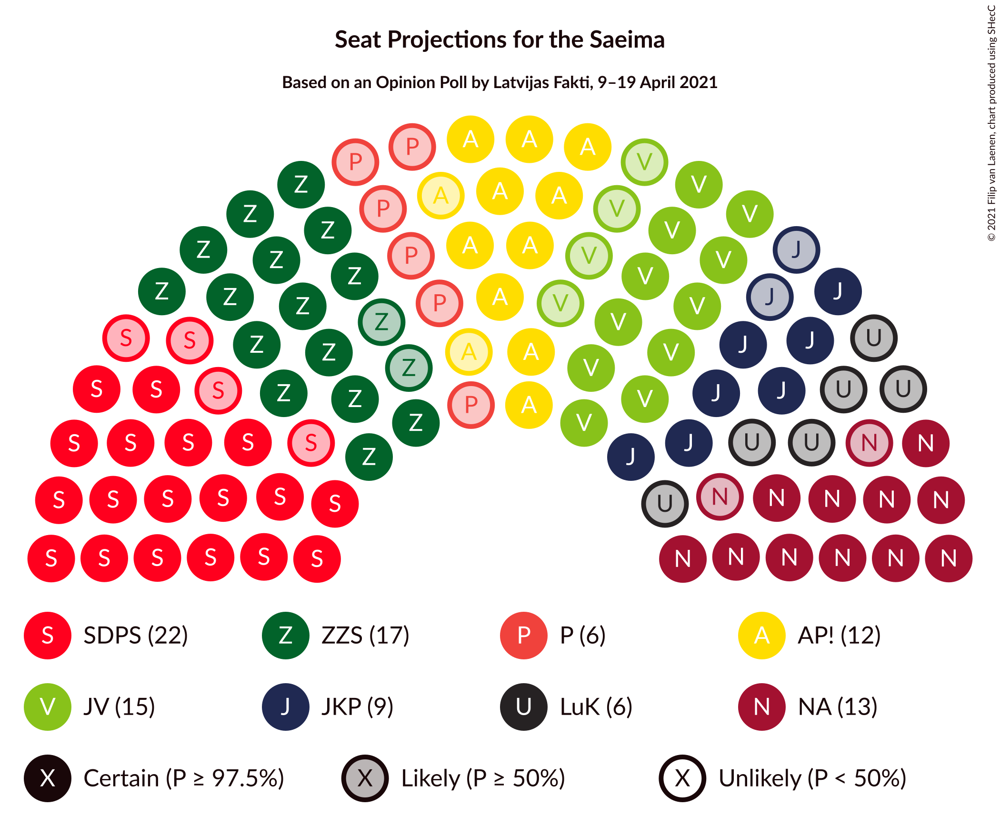

### Confidence Intervals

| Party | Last Result | Median | 80% Confidence Interval | 90% Confidence Interval | 95% Confidence Interval | 99% Confidence Interval |
|:-----:|:-----------:|:------:|:-----------------------:|:-----------------------:|:-----------------------:|:-----------------------:|
| <a href="#sociāldemokrātiskā-partija-“saskaņa”">Sociāldemokrātiskā partija “Saskaņa”</a> | 23 | 23 | 20–24 |19–25 |18–25 |18–27 |
| <a href="#zaļo-un-zemnieku-savienība">Zaļo un Zemnieku savienība</a> | 11 | 17 | 16–18 |15–19 |15–21 |13–22 |
| <a href="#nacionālā-apvienība-„visu-latvijai!”–„tēvzemei-un-brīvībai/lnnk”">Nacionālā apvienība „Visu Latvijai!”–„Tēvzemei un Brīvībai/LNNK”</a> | 13 | 14 | 13–15 |13–16 |11–17 |11–19 |
| <a href="#jaunā-vienotība">Jaunā VIENOTĪBA</a> | 8 | 15 | 13–17 |11–17 |11–17 |11–18 |
| <a href="#attīstībai/par!">Attīstībai/Par!</a> | 13 | 12 | 10–14 |10–15 |10–15 |9–16 |
| <a href="#jaunā-konservatīvā-partija">Jaunā konservatīvā partija</a> | 16 | 9 | 7–12 |7–12 |7–12 |7–12 |
| <a href="#likums-un-kārtība">Likums un kārtība</a> | 0 | 6 | 0–7 |0–7 |0–7 |0–9 |
| <a href="#progresīvie">PROGRESĪVIE</a> | 0 | 6 | 0–7 |0–7 |0–7 |0–8 |
| <a href="#latvijas-reģionu-apvienība">Latvijas Reģionu Apvienība</a> | 0 | 0 | 0–6 |0–6 |0–6 |0–6 |
| <a href="#latvijas-krievu-savienība">Latvijas Krievu savienība</a> | 0 | 0 | 0 |0 |0 |0–6 |
| <a href="#politiskā-partija-„kpv-lv”">Politiskā partija „KPV LV”</a> | 16 | 0 | 0 |0 |0 |0 |

### Sociāldemokrātiskā partija “Saskaņa”

*For a full overview of the results for this party, see the [Sociāldemokrātiskā partija “Saskaņa”](party-sociāldemokrātiskāpartija“saskaņa”.html) page.*

| Number of Seats | Probability | Accumulated | Special Marks |
|:---------------:|:-----------:|:-----------:|:-------------:|
| 17 | 0.2% | 100% |  |
| 18 | 2% | 99.8% |  |
| 19 | 3% | 97% |  |
| 20 | 15% | 94% |  |
| 21 | 14% | 79% |  |
| 22 | 13% | 65% |  |
| 23 | 24% | 52% | Last Result, Median |
| 24 | 23% | 28% |  |
| 25 | 3% | 5% |  |
| 26 | 0.7% | 2% |  |
| 27 | 0.9% | 1.1% |  |
| 28 | 0.2% | 0.2% |  |
| 29 | 0% | 0% |  |

### Zaļo un Zemnieku savienība

*For a full overview of the results for this party, see the [Zaļo un Zemnieku savienība](party-zaļounzemniekusavienība.html) page.*

| Number of Seats | Probability | Accumulated | Special Marks |
|:---------------:|:-----------:|:-----------:|:-------------:|
| 11 | 0% | 100% | Last Result |
| 12 | 0.1% | 100% |  |
| 13 | 1.1% | 99.9% |  |
| 14 | 0.7% | 98.9% |  |
| 15 | 5% | 98% |  |
| 16 | 4% | 94% |  |
| 17 | 65% | 90% | Median |
| 18 | 20% | 25% |  |
| 19 | 0.6% | 6% |  |
| 20 | 2% | 5% |  |
| 21 | 0.1% | 3% |  |
| 22 | 2% | 2% |  |
| 23 | 0% | 0% |  |

### Nacionālā apvienība „Visu Latvijai!”–„Tēvzemei un Brīvībai/LNNK”

*For a full overview of the results for this party, see the [Nacionālā apvienība „Visu Latvijai!”–„Tēvzemei un Brīvībai/LNNK”](party-nacionālāapvienība„visulatvijai”–„tēvzemeiunbrīvībailnnk”.html) page.*

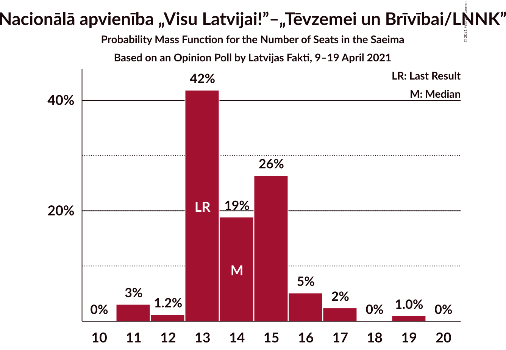

| Number of Seats | Probability | Accumulated | Special Marks |
|:---------------:|:-----------:|:-----------:|:-------------:|
| 11 | 3% | 100% |  |
| 12 | 1.2% | 97% |  |
| 13 | 42% | 96% | Last Result |
| 14 | 19% | 54% | Median |
| 15 | 26% | 35% |  |
| 16 | 5% | 9% |  |
| 17 | 2% | 3% |  |
| 18 | 0% | 1.0% |  |
| 19 | 1.0% | 1.0% |  |
| 20 | 0% | 0% |  |

### Jaunā VIENOTĪBA

*For a full overview of the results for this party, see the [Jaunā VIENOTĪBA](party-jaunāvienotība.html) page.*

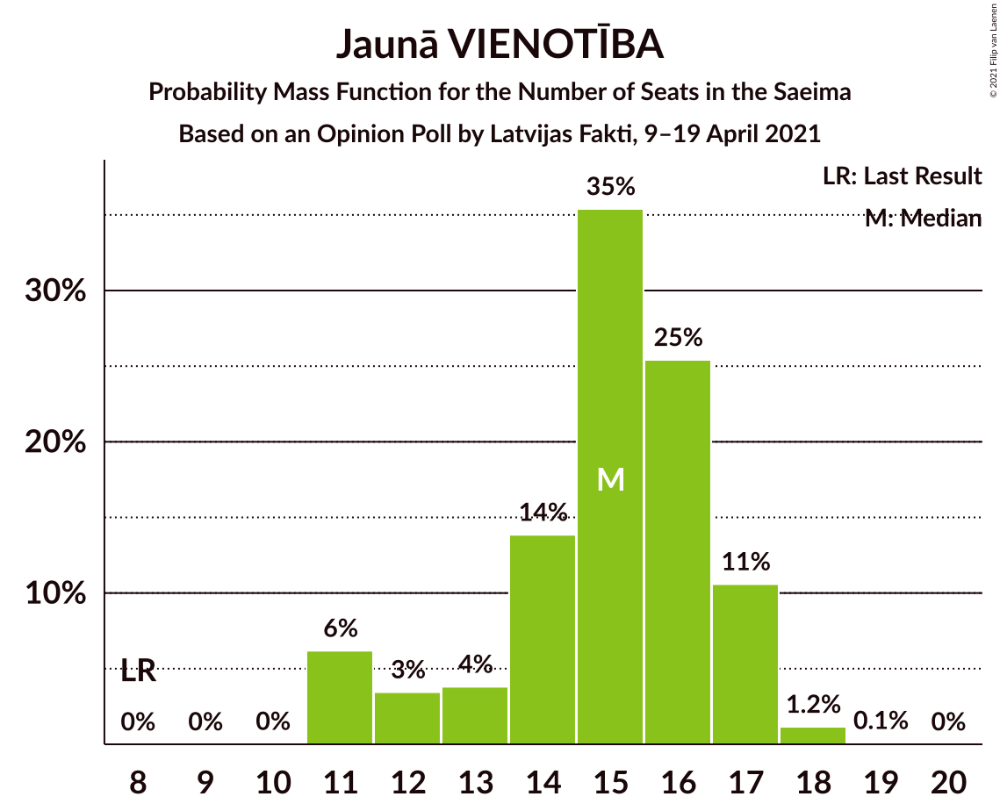

| Number of Seats | Probability | Accumulated | Special Marks |
|:---------------:|:-----------:|:-----------:|:-------------:|
| 8 | 0% | 100% | Last Result |
| 9 | 0% | 100% |  |
| 10 | 0% | 100% |  |
| 11 | 6% | 100% |  |
| 12 | 3% | 94% |  |
| 13 | 4% | 90% |  |
| 14 | 14% | 87% |  |
| 15 | 35% | 73% | Median |
| 16 | 25% | 37% |  |
| 17 | 11% | 12% |  |
| 18 | 1.2% | 1.3% |  |
| 19 | 0.1% | 0.1% |  |
| 20 | 0% | 0% |  |

### Attīstībai/Par!

*For a full overview of the results for this party, see the [Attīstībai/Par!](party-attīstībaipar.html) page.*

| Number of Seats | Probability | Accumulated | Special Marks |
|:---------------:|:-----------:|:-----------:|:-------------:|
| 9 | 0.5% | 100% |  |
| 10 | 19% | 99.5% |  |
| 11 | 3% | 80% |  |
| 12 | 37% | 77% | Median |
| 13 | 16% | 40% | Last Result |
| 14 | 19% | 24% |  |
| 15 | 3% | 5% |  |
| 16 | 2% | 2% |  |
| 17 | 0% | 0.1% |  |
| 18 | 0% | 0% |  |

### Jaunā konservatīvā partija

*For a full overview of the results for this party, see the [Jaunā konservatīvā partija](party-jaunākonservatīvāpartija.html) page.*

| Number of Seats | Probability | Accumulated | Special Marks |
|:---------------:|:-----------:|:-----------:|:-------------:|
| 6 | 0.1% | 100% |  |
| 7 | 23% | 99.9% |  |
| 8 | 8% | 77% |  |
| 9 | 51% | 69% | Median |
| 10 | 3% | 17% |  |
| 11 | 0.6% | 14% |  |
| 12 | 13% | 13% |  |
| 13 | 0.2% | 0.2% |  |
| 14 | 0% | 0% |  |
| 15 | 0% | 0% |  |
| 16 | 0% | 0% | Last Result |

### Likums un kārtība

*For a full overview of the results for this party, see the [Likums un kārtība](party-likumsunkārtība.html) page.*

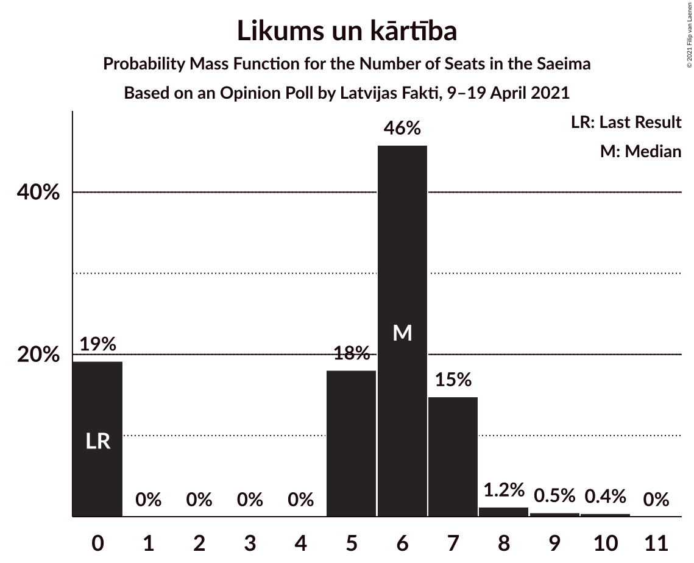

| Number of Seats | Probability | Accumulated | Special Marks |
|:---------------:|:-----------:|:-----------:|:-------------:|
| 0 | 19% | 100% | Last Result |
| 1 | 0% | 81% |  |
| 2 | 0% | 81% |  |
| 3 | 0% | 81% |  |
| 4 | 0% | 81% |  |
| 5 | 18% | 81% |  |
| 6 | 46% | 63% | Median |
| 7 | 15% | 17% |  |
| 8 | 1.2% | 2% |  |
| 9 | 0.5% | 0.9% |  |
| 10 | 0.4% | 0.4% |  |
| 11 | 0% | 0% |  |

### PROGRESĪVIE

*For a full overview of the results for this party, see the [PROGRESĪVIE](party-progresīvie.html) page.*

| Number of Seats | Probability | Accumulated | Special Marks |
|:---------------:|:-----------:|:-----------:|:-------------:|
| 0 | 43% | 100% | Last Result |
| 1 | 0% | 57% |  |
| 2 | 0% | 57% |  |
| 3 | 0% | 57% |  |
| 4 | 0% | 57% |  |
| 5 | 2% | 57% |  |
| 6 | 22% | 54% | Median |
| 7 | 31% | 33% |  |
| 8 | 1.2% | 1.4% |  |
| 9 | 0.2% | 0.2% |  |
| 10 | 0% | 0% |  |

### Latvijas Reģionu Apvienība

*For a full overview of the results for this party, see the [Latvijas Reģionu Apvienība](party-latvijasreģionuapvienība.html) page.*

| Number of Seats | Probability | Accumulated | Special Marks |
|:---------------:|:-----------:|:-----------:|:-------------:|
| 0 | 70% | 100% | Last Result, Median |
| 1 | 0% | 30% |  |
| 2 | 0% | 30% |  |
| 3 | 0% | 30% |  |
| 4 | 0% | 30% |  |
| 5 | 0% | 30% |  |
| 6 | 29% | 30% |  |
| 7 | 0.4% | 0.4% |  |
| 8 | 0% | 0% |  |

### Latvijas Krievu savienība

*For a full overview of the results for this party, see the [Latvijas Krievu savienība](party-latvijaskrievusavienība.html) page.*

| Number of Seats | Probability | Accumulated | Special Marks |
|:---------------:|:-----------:|:-----------:|:-------------:|
| 0 | 98.6% | 100% | Last Result, Median |
| 1 | 0% | 1.4% |  |
| 2 | 0% | 1.4% |  |
| 3 | 0% | 1.4% |  |
| 4 | 0% | 1.4% |  |
| 5 | 0.8% | 1.4% |  |
| 6 | 0.2% | 0.6% |  |
| 7 | 0.2% | 0.4% |  |
| 8 | 0.1% | 0.1% |  |
| 9 | 0% | 0% |  |

### Politiskā partija „KPV LV”

*For a full overview of the results for this party, see the [Politiskā partija „KPV LV”](party-politiskāpartija„kpvlv”.html) page.*

| Number of Seats | Probability | Accumulated | Special Marks |
|:---------------:|:-----------:|:-----------:|:-------------:|
| 0 | 100% | 100% | Median |
| 1 | 0% | 0% |  |
| 2 | 0% | 0% |  |
| 3 | 0% | 0% |  |
| 4 | 0% | 0% |  |
| 5 | 0% | 0% |  |
| 6 | 0% | 0% |  |
| 7 | 0% | 0% |  |
| 8 | 0% | 0% |  |
| 9 | 0% | 0% |  |
| 10 | 0% | 0% |  |
| 11 | 0% | 0% |  |
| 12 | 0% | 0% |  |
| 13 | 0% | 0% |  |
| 14 | 0% | 0% |  |
| 15 | 0% | 0% |  |
| 16 | 0% | 0% | Last Result |

## Coalitions

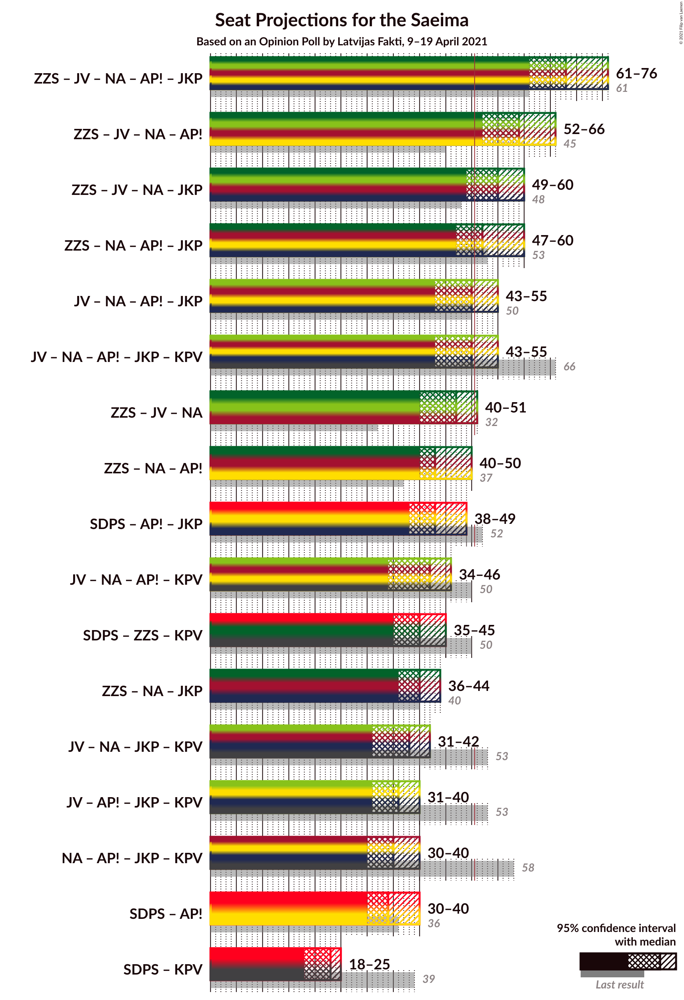

### Confidence Intervals

| Coalition | Last Result | Median | Majority? | 80% Confidence Interval | 90% Confidence Interval | 95% Confidence Interval | 99% Confidence Interval |
|:---------:|:-----------:|:------:|:---------:|:-----------------------:|:-----------------------:|:-----------------------:|:-----------------------:|
| Zaļo un Zemnieku savienība – Jaunā VIENOTĪBA – Nacionālā apvienība „Visu Latvijai!”–„Tēvzemei un Brīvībai/LNNK” – Attīstībai/Par! – Jaunā konservatīvā partija | 61 | 68 | 100% | 63–71 | 61–72 | 61–76 | 57–76 |
| Zaļo un Zemnieku savienība – Jaunā VIENOTĪBA – Nacionālā apvienība „Visu Latvijai!”–„Tēvzemei un Brīvībai/LNNK” – Attīstībai/Par! | 45 | 59 | 99.4% | 56–61 | 53–63 | 52–66 | 50–67 |
| Zaļo un Zemnieku savienība – Jaunā VIENOTĪBA – Nacionālā apvienība „Visu Latvijai!”–„Tēvzemei un Brīvībai/LNNK” – Jaunā konservatīvā partija | 48 | 55 | 94% | 52–59 | 49–59 | 49–60 | 47–63 |
| Zaļo un Zemnieku savienība – Nacionālā apvienība „Visu Latvijai!”–„Tēvzemei un Brīvībai/LNNK” – Attīstībai/Par! – Jaunā konservatīvā partija | 53 | 52 | 70% | 48–56 | 48–57 | 47–60 | 46–62 |
| Jaunā VIENOTĪBA – Nacionālā apvienība „Visu Latvijai!”–„Tēvzemei un Brīvībai/LNNK” – Attīstībai/Par! – Jaunā konservatīvā partija | 50 | 50 | 43% | 46–54 | 45–54 | 43–55 | 42–59 |
| Jaunā VIENOTĪBA – Nacionālā apvienība „Visu Latvijai!”–„Tēvzemei un Brīvībai/LNNK” – Attīstībai/Par! – Jaunā konservatīvā partija – Politiskā partija „KPV LV” | 66 | 50 | 43% | 46–54 | 45–54 | 43–55 | 42–59 |
| Zaļo un Zemnieku savienība – Jaunā VIENOTĪBA – Nacionālā apvienība „Visu Latvijai!”–„Tēvzemei un Brīvībai/LNNK” | 32 | 47 | 4% | 43–48 | 42–50 | 40–51 | 39–52 |
| Zaļo un Zemnieku savienība – Nacionālā apvienība „Visu Latvijai!”–„Tēvzemei un Brīvībai/LNNK” – Attīstībai/Par! | 37 | 43 | 2% | 40–46 | 40–48 | 40–50 | 38–53 |
| Sociāldemokrātiskā partija “Saskaņa” – Attīstībai/Par! – Jaunā konservatīvā partija | 52 | 43 | 0.3% | 40–47 | 39–48 | 38–49 | 37–50 |
| Jaunā VIENOTĪBA – Nacionālā apvienība „Visu Latvijai!”–„Tēvzemei un Brīvībai/LNNK” – Attīstībai/Par! – Politiskā partija „KPV LV” | 50 | 42 | 0% | 39–44 | 37–45 | 34–46 | 34–48 |
| Sociāldemokrātiskā partija “Saskaņa” – Zaļo un Zemnieku savienība – Politiskā partija „KPV LV” | 50 | 40 | 0% | 37–41 | 36–42 | 35–45 | 34–46 |
| Zaļo un Zemnieku savienība – Nacionālā apvienība „Visu Latvijai!”–„Tēvzemei un Brīvībai/LNNK” – Jaunā konservatīvā partija | 40 | 40 | 0% | 37–44 | 37–44 | 36–44 | 34–48 |
| Jaunā VIENOTĪBA – Nacionālā apvienība „Visu Latvijai!”–„Tēvzemei un Brīvībai/LNNK” – Jaunā konservatīvā partija – Politiskā partija „KPV LV” | 53 | 38 | 0% | 35–42 | 33–42 | 31–42 | 31–46 |
| Jaunā VIENOTĪBA – Attīstībai/Par! – Jaunā konservatīvā partija – Politiskā partija „KPV LV” | 53 | 36 | 0% | 33–40 | 32–40 | 31–40 | 29–41 |
| Nacionālā apvienība „Visu Latvijai!”–„Tēvzemei un Brīvībai/LNNK” – Attīstībai/Par! – Jaunā konservatīvā partija – Politiskā partija „KPV LV” | 58 | 35 | 0% | 32–39 | 30–39 | 30–40 | 30–44 |
| Sociāldemokrātiskā partija “Saskaņa” – Attīstībai/Par! | 36 | 34 | 0% | 32–38 | 30–38 | 30–40 | 29–41 |
| Sociāldemokrātiskā partija “Saskaņa” – Politiskā partija „KPV LV” | 39 | 23 | 0% | 20–24 | 19–25 | 18–25 | 18–27 |

### Zaļo un Zemnieku savienība – Jaunā VIENOTĪBA – Nacionālā apvienība „Visu Latvijai!”–„Tēvzemei un Brīvībai/LNNK” – Attīstībai/Par! – Jaunā konservatīvā partija

| Number of Seats | Probability | Accumulated | Special Marks |
|:---------------:|:-----------:|:-----------:|:-------------:|
| 57 | 0.5% | 100% |  |
| 58 | 0.2% | 99.5% |  |
| 59 | 0.1% | 99.3% |  |
| 60 | 0.5% | 99.1% |  |
| 61 | 4% | 98.7% | Last Result |
| 62 | 1.4% | 95% |  |
| 63 | 4% | 93% |  |
| 64 | 9% | 89% |  |
| 65 | 11% | 80% |  |
| 66 | 17% | 69% |  |
| 67 | 1.4% | 52% | Median |
| 68 | 16% | 51% |  |
| 69 | 7% | 35% |  |
| 70 | 8% | 27% |  |
| 71 | 13% | 19% |  |
| 72 | 2% | 6% |  |
| 73 | 0.8% | 4% |  |
| 74 | 0.1% | 4% |  |
| 75 | 0.4% | 4% |  |
| 76 | 3% | 3% |  |
| 77 | 0.1% | 0.1% |  |
| 78 | 0% | 0% |  |

### Zaļo un Zemnieku savienība – Jaunā VIENOTĪBA – Nacionālā apvienība „Visu Latvijai!”–„Tēvzemei un Brīvībai/LNNK” – Attīstībai/Par!

| Number of Seats | Probability | Accumulated | Special Marks |
|:---------------:|:-----------:|:-----------:|:-------------:|
| 45 | 0% | 100% | Last Result |
| 46 | 0% | 100% |  |
| 47 | 0% | 100% |  |
| 48 | 0% | 100% |  |
| 49 | 0.1% | 100% |  |
| 50 | 0.5% | 99.9% |  |
| 51 | 0.3% | 99.4% | Majority |
| 52 | 4% | 99.0% |  |
| 53 | 0.7% | 96% |  |
| 54 | 1.3% | 95% |  |
| 55 | 2% | 94% |  |
| 56 | 14% | 92% |  |
| 57 | 18% | 78% |  |
| 58 | 5% | 60% | Median |
| 59 | 31% | 55% |  |
| 60 | 3% | 24% |  |
| 61 | 12% | 21% |  |
| 62 | 3% | 9% |  |
| 63 | 2% | 7% |  |
| 64 | 1.3% | 5% |  |
| 65 | 0.7% | 3% |  |
| 66 | 0.4% | 3% |  |
| 67 | 2% | 2% |  |
| 68 | 0.1% | 0.1% |  |
| 69 | 0% | 0% |  |

### Zaļo un Zemnieku savienība – Jaunā VIENOTĪBA – Nacionālā apvienība „Visu Latvijai!”–„Tēvzemei un Brīvībai/LNNK” – Jaunā konservatīvā partija

| Number of Seats | Probability | Accumulated | Special Marks |
|:---------------:|:-----------:|:-----------:|:-------------:|
| 45 | 0.1% | 100% |  |
| 46 | 0.2% | 99.9% |  |
| 47 | 0.5% | 99.7% |  |
| 48 | 1.1% | 99.2% | Last Result |
| 49 | 3% | 98% |  |
| 50 | 1.0% | 95% |  |
| 51 | 3% | 94% | Majority |
| 52 | 8% | 91% |  |
| 53 | 7% | 83% |  |
| 54 | 21% | 77% |  |
| 55 | 19% | 56% | Median |
| 56 | 13% | 37% |  |
| 57 | 2% | 24% |  |
| 58 | 4% | 22% |  |
| 59 | 14% | 18% |  |
| 60 | 2% | 4% |  |
| 61 | 0.9% | 2% |  |
| 62 | 0.1% | 1.1% |  |
| 63 | 0.9% | 1.0% |  |
| 64 | 0% | 0% |  |

### Zaļo un Zemnieku savienība – Nacionālā apvienība „Visu Latvijai!”–„Tēvzemei un Brīvībai/LNNK” – Attīstībai/Par! – Jaunā konservatīvā partija

| Number of Seats | Probability | Accumulated | Special Marks |
|:---------------:|:-----------:|:-----------:|:-------------:|
| 45 | 0.1% | 100% |  |
| 46 | 0.8% | 99.9% |  |
| 47 | 3% | 99.1% |  |
| 48 | 6% | 96% |  |
| 49 | 11% | 90% |  |
| 50 | 9% | 79% |  |
| 51 | 7% | 70% | Majority |
| 52 | 19% | 63% | Median |
| 53 | 12% | 45% | Last Result |
| 54 | 10% | 32% |  |
| 55 | 3% | 23% |  |
| 56 | 13% | 19% |  |
| 57 | 2% | 6% |  |
| 58 | 0.5% | 4% |  |
| 59 | 0.5% | 4% |  |
| 60 | 1.3% | 3% |  |
| 61 | 1.0% | 2% |  |
| 62 | 0.9% | 0.9% |  |
| 63 | 0% | 0% |  |

### Jaunā VIENOTĪBA – Nacionālā apvienība „Visu Latvijai!”–„Tēvzemei un Brīvībai/LNNK” – Attīstībai/Par! – Jaunā konservatīvā partija

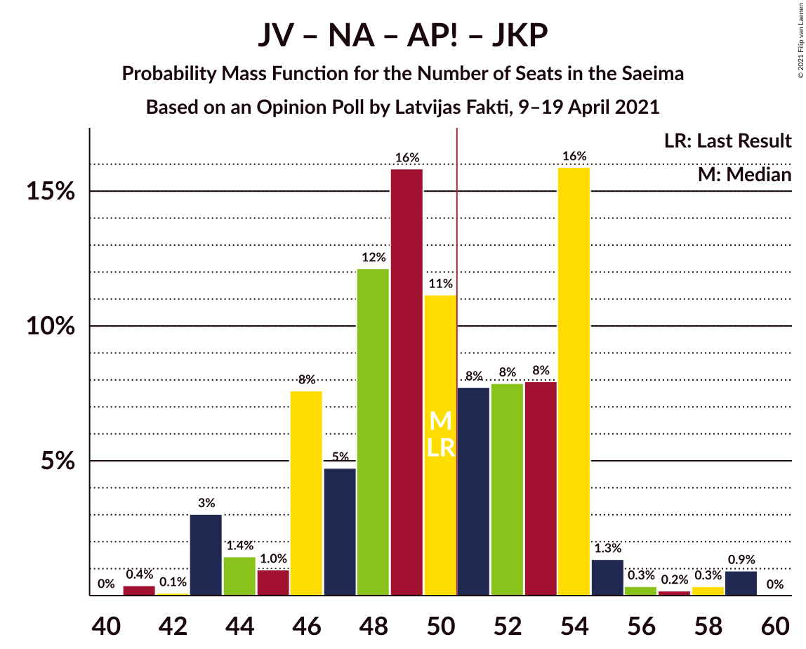

| Number of Seats | Probability | Accumulated | Special Marks |
|:---------------:|:-----------:|:-----------:|:-------------:|
| 41 | 0.4% | 100% |  |
| 42 | 0.1% | 99.6% |  |
| 43 | 3% | 99.5% |  |
| 44 | 1.4% | 96% |  |
| 45 | 1.0% | 95% |  |
| 46 | 8% | 94% |  |
| 47 | 5% | 86% |  |
| 48 | 12% | 82% |  |
| 49 | 16% | 70% |  |
| 50 | 11% | 54% | Last Result, Median |
| 51 | 8% | 43% | Majority |
| 52 | 8% | 35% |  |
| 53 | 8% | 27% |  |
| 54 | 16% | 19% |  |
| 55 | 1.3% | 3% |  |
| 56 | 0.3% | 2% |  |
| 57 | 0.2% | 1.5% |  |
| 58 | 0.3% | 1.3% |  |
| 59 | 0.9% | 0.9% |  |
| 60 | 0% | 0% |  |

### Jaunā VIENOTĪBA – Nacionālā apvienība „Visu Latvijai!”–„Tēvzemei un Brīvībai/LNNK” – Attīstībai/Par! – Jaunā konservatīvā partija – Politiskā partija „KPV LV”

| Number of Seats | Probability | Accumulated | Special Marks |
|:---------------:|:-----------:|:-----------:|:-------------:|
| 41 | 0.4% | 100% |  |
| 42 | 0.1% | 99.6% |  |
| 43 | 3% | 99.5% |  |
| 44 | 1.4% | 96% |  |
| 45 | 1.0% | 95% |  |
| 46 | 8% | 94% |  |
| 47 | 5% | 86% |  |
| 48 | 12% | 82% |  |
| 49 | 16% | 70% |  |
| 50 | 11% | 54% | Median |
| 51 | 8% | 43% | Majority |
| 52 | 8% | 35% |  |
| 53 | 8% | 27% |  |
| 54 | 16% | 19% |  |
| 55 | 1.4% | 3% |  |
| 56 | 0.3% | 2% |  |
| 57 | 0.2% | 1.5% |  |
| 58 | 0.3% | 1.3% |  |
| 59 | 0.9% | 0.9% |  |
| 60 | 0% | 0% |  |
| 61 | 0% | 0% |  |
| 62 | 0% | 0% |  |
| 63 | 0% | 0% |  |
| 64 | 0% | 0% |  |
| 65 | 0% | 0% |  |
| 66 | 0% | 0% | Last Result |

### Zaļo un Zemnieku savienība – Jaunā VIENOTĪBA – Nacionālā apvienība „Visu Latvijai!”–„Tēvzemei un Brīvībai/LNNK”

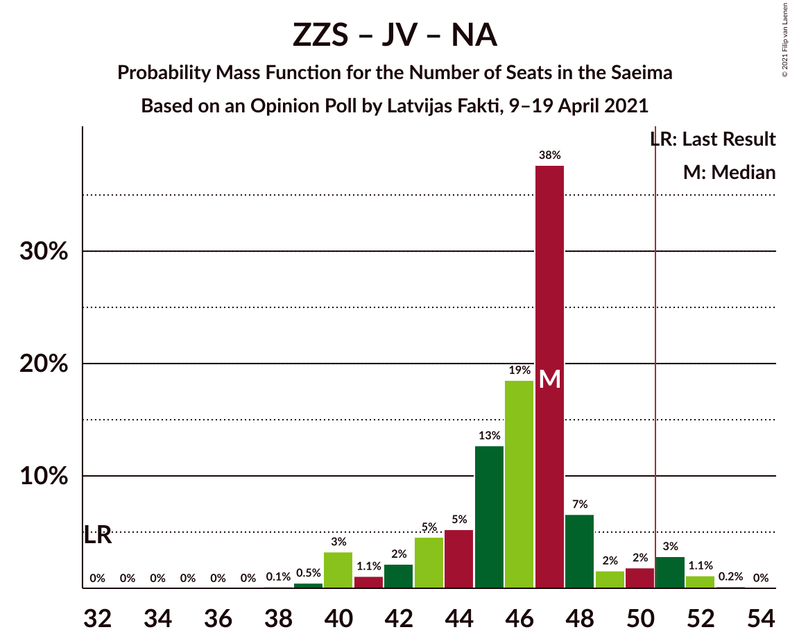

| Number of Seats | Probability | Accumulated | Special Marks |
|:---------------:|:-----------:|:-----------:|:-------------:|
| 32 | 0% | 100% | Last Result |
| 33 | 0% | 100% |  |
| 34 | 0% | 100% |  |
| 35 | 0% | 100% |  |
| 36 | 0% | 100% |  |
| 37 | 0% | 100% |  |
| 38 | 0.1% | 100% |  |
| 39 | 0.5% | 99.8% |  |
| 40 | 3% | 99.4% |  |
| 41 | 1.1% | 96% |  |
| 42 | 2% | 95% |  |
| 43 | 5% | 93% |  |
| 44 | 5% | 88% |  |
| 45 | 13% | 83% |  |
| 46 | 19% | 70% | Median |
| 47 | 38% | 52% |  |
| 48 | 7% | 14% |  |
| 49 | 2% | 8% |  |
| 50 | 2% | 6% |  |
| 51 | 3% | 4% | Majority |
| 52 | 1.1% | 1.3% |  |
| 53 | 0.2% | 0.2% |  |
| 54 | 0% | 0% |  |

### Zaļo un Zemnieku savienība – Nacionālā apvienība „Visu Latvijai!”–„Tēvzemei un Brīvībai/LNNK” – Attīstībai/Par!

| Number of Seats | Probability | Accumulated | Special Marks |
|:---------------:|:-----------:|:-----------:|:-------------:|
| 37 | 0.2% | 100% | Last Result |
| 38 | 0.3% | 99.8% |  |
| 39 | 1.0% | 99.5% |  |
| 40 | 9% | 98% |  |
| 41 | 13% | 89% |  |
| 42 | 7% | 77% |  |
| 43 | 21% | 69% | Median |
| 44 | 26% | 49% |  |
| 45 | 6% | 22% |  |
| 46 | 8% | 16% |  |
| 47 | 3% | 8% |  |
| 48 | 1.0% | 6% |  |
| 49 | 2% | 5% |  |
| 50 | 0.5% | 3% |  |
| 51 | 1.3% | 2% | Majority |
| 52 | 0.1% | 1.1% |  |
| 53 | 0.9% | 0.9% |  |
| 54 | 0% | 0% |  |

### Sociāldemokrātiskā partija “Saskaņa” – Attīstībai/Par! – Jaunā konservatīvā partija

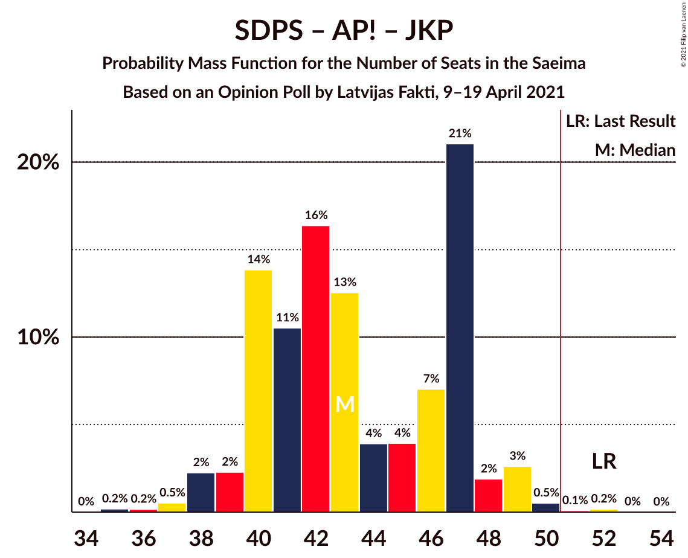

| Number of Seats | Probability | Accumulated | Special Marks |
|:---------------:|:-----------:|:-----------:|:-------------:|
| 35 | 0.2% | 100% |  |
| 36 | 0.2% | 99.8% |  |
| 37 | 0.5% | 99.6% |  |
| 38 | 2% | 99.1% |  |
| 39 | 2% | 97% |  |
| 40 | 14% | 95% |  |
| 41 | 11% | 81% |  |
| 42 | 16% | 70% |  |
| 43 | 13% | 54% |  |
| 44 | 4% | 41% | Median |
| 45 | 4% | 37% |  |
| 46 | 7% | 33% |  |
| 47 | 21% | 26% |  |
| 48 | 2% | 5% |  |
| 49 | 3% | 3% |  |
| 50 | 0.5% | 0.8% |  |
| 51 | 0.1% | 0.3% | Majority |
| 52 | 0.2% | 0.2% | Last Result |
| 53 | 0% | 0% |  |

### Jaunā VIENOTĪBA – Nacionālā apvienība „Visu Latvijai!”–„Tēvzemei un Brīvībai/LNNK” – Attīstībai/Par! – Politiskā partija „KPV LV”

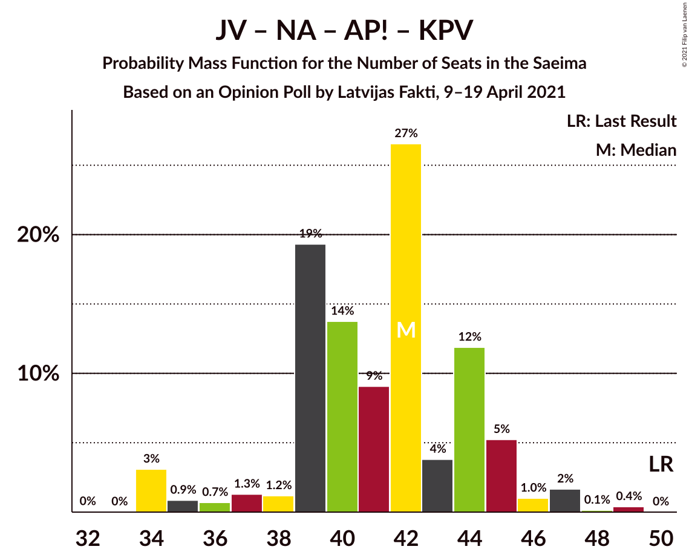

| Number of Seats | Probability | Accumulated | Special Marks |
|:---------------:|:-----------:|:-----------:|:-------------:|
| 33 | 0% | 100% |  |
| 34 | 3% | 99.9% |  |
| 35 | 0.9% | 97% |  |
| 36 | 0.7% | 96% |  |
| 37 | 1.3% | 95% |  |
| 38 | 1.2% | 94% |  |
| 39 | 19% | 93% |  |
| 40 | 14% | 74% |  |
| 41 | 9% | 60% | Median |
| 42 | 27% | 51% |  |
| 43 | 4% | 24% |  |
| 44 | 12% | 20% |  |
| 45 | 5% | 8% |  |
| 46 | 1.0% | 3% |  |
| 47 | 2% | 2% |  |
| 48 | 0.1% | 0.5% |  |
| 49 | 0.4% | 0.4% |  |
| 50 | 0% | 0% | Last Result |

### Sociāldemokrātiskā partija “Saskaņa” – Zaļo un Zemnieku savienība – Politiskā partija „KPV LV”

| Number of Seats | Probability | Accumulated | Special Marks |
|:---------------:|:-----------:|:-----------:|:-------------:|
| 31 | 0.1% | 100% |  |
| 32 | 0% | 99.9% |  |
| 33 | 0.1% | 99.9% |  |
| 34 | 2% | 99.8% |  |
| 35 | 2% | 98% |  |
| 36 | 2% | 96% |  |
| 37 | 9% | 94% |  |
| 38 | 13% | 84% |  |
| 39 | 21% | 72% |  |
| 40 | 21% | 50% | Median |
| 41 | 21% | 29% |  |
| 42 | 4% | 8% |  |
| 43 | 1.0% | 5% |  |
| 44 | 0.9% | 4% |  |
| 45 | 0.8% | 3% |  |
| 46 | 2% | 2% |  |
| 47 | 0.1% | 0.1% |  |
| 48 | 0% | 0% |  |
| 49 | 0% | 0% |  |
| 50 | 0% | 0% | Last Result |

### Zaļo un Zemnieku savienība – Nacionālā apvienība „Visu Latvijai!”–„Tēvzemei un Brīvībai/LNNK” – Jaunā konservatīvā partija

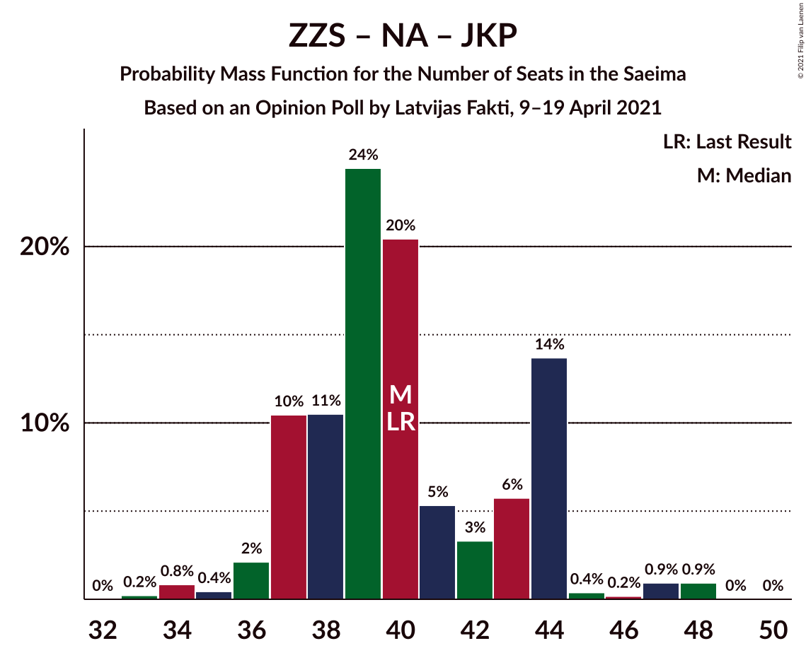

| Number of Seats | Probability | Accumulated | Special Marks |
|:---------------:|:-----------:|:-----------:|:-------------:|
| 33 | 0.2% | 100% |  |
| 34 | 0.8% | 99.8% |  |
| 35 | 0.4% | 98.9% |  |
| 36 | 2% | 98% |  |
| 37 | 10% | 96% |  |
| 38 | 11% | 86% |  |
| 39 | 24% | 75% |  |
| 40 | 20% | 51% | Last Result, Median |
| 41 | 5% | 31% |  |
| 42 | 3% | 25% |  |
| 43 | 6% | 22% |  |
| 44 | 14% | 16% |  |
| 45 | 0.4% | 2% |  |
| 46 | 0.2% | 2% |  |
| 47 | 0.9% | 2% |  |
| 48 | 0.9% | 1.0% |  |
| 49 | 0% | 0% |  |

### Jaunā VIENOTĪBA – Nacionālā apvienība „Visu Latvijai!”–„Tēvzemei un Brīvībai/LNNK” – Jaunā konservatīvā partija – Politiskā partija „KPV LV”

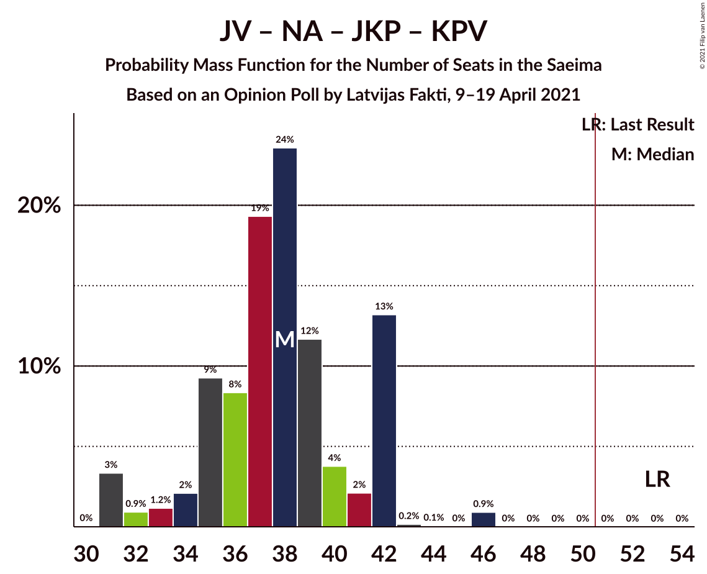

| Number of Seats | Probability | Accumulated | Special Marks |
|:---------------:|:-----------:|:-----------:|:-------------:|
| 30 | 0% | 100% |  |
| 31 | 3% | 99.9% |  |
| 32 | 0.9% | 97% |  |
| 33 | 1.2% | 96% |  |
| 34 | 2% | 95% |  |
| 35 | 9% | 92% |  |
| 36 | 8% | 83% |  |
| 37 | 19% | 75% |  |
| 38 | 24% | 55% | Median |
| 39 | 12% | 32% |  |
| 40 | 4% | 20% |  |
| 41 | 2% | 16% |  |
| 42 | 13% | 14% |  |
| 43 | 0.2% | 1.2% |  |
| 44 | 0.1% | 1.0% |  |
| 45 | 0% | 0.9% |  |
| 46 | 0.9% | 0.9% |  |
| 47 | 0% | 0% |  |
| 48 | 0% | 0% |  |
| 49 | 0% | 0% |  |
| 50 | 0% | 0% |  |
| 51 | 0% | 0% | Majority |
| 52 | 0% | 0% |  |
| 53 | 0% | 0% | Last Result |

### Jaunā VIENOTĪBA – Attīstībai/Par! – Jaunā konservatīvā partija – Politiskā partija „KPV LV”

| Number of Seats | Probability | Accumulated | Special Marks |
|:---------------:|:-----------:|:-----------:|:-------------:|
| 28 | 0.4% | 100% |  |
| 29 | 0.5% | 99.5% |  |
| 30 | 0.7% | 99.1% |  |
| 31 | 2% | 98% |  |
| 32 | 4% | 97% |  |
| 33 | 8% | 93% |  |
| 34 | 14% | 85% |  |
| 35 | 20% | 71% |  |
| 36 | 5% | 51% | Median |
| 37 | 12% | 46% |  |
| 38 | 9% | 34% |  |
| 39 | 13% | 25% |  |
| 40 | 9% | 11% |  |
| 41 | 2% | 2% |  |
| 42 | 0.1% | 0.1% |  |
| 43 | 0% | 0.1% |  |
| 44 | 0% | 0% |  |
| 45 | 0% | 0% |  |
| 46 | 0% | 0% |  |
| 47 | 0% | 0% |  |
| 48 | 0% | 0% |  |
| 49 | 0% | 0% |  |
| 50 | 0% | 0% |  |
| 51 | 0% | 0% | Majority |
| 52 | 0% | 0% |  |
| 53 | 0% | 0% | Last Result |

### Nacionālā apvienība „Visu Latvijai!”–„Tēvzemei un Brīvībai/LNNK” – Attīstībai/Par! – Jaunā konservatīvā partija – Politiskā partija „KPV LV”

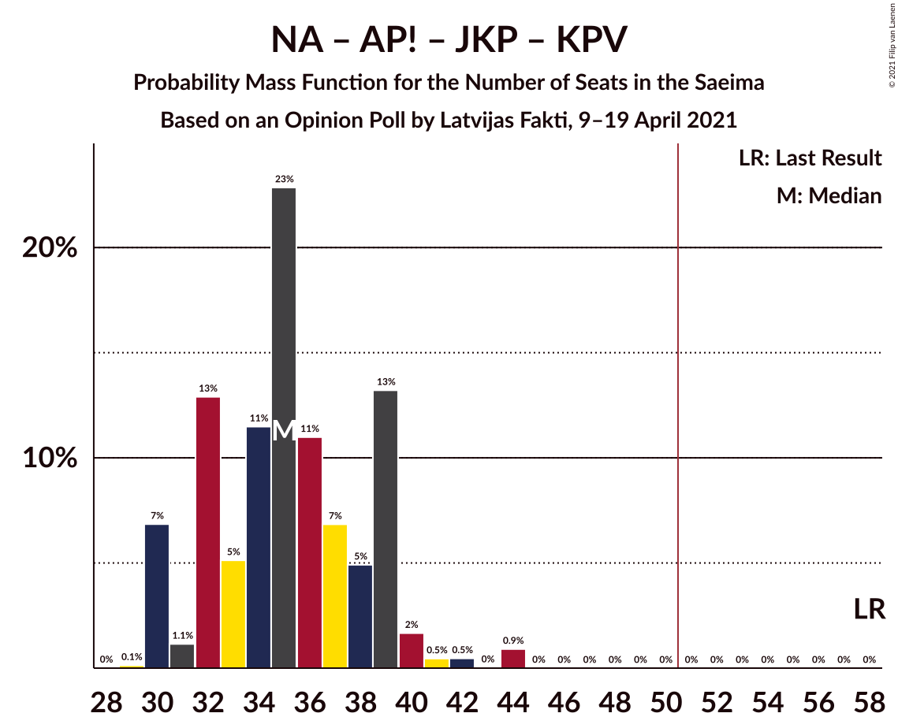

| Number of Seats | Probability | Accumulated | Special Marks |
|:---------------:|:-----------:|:-----------:|:-------------:|
| 29 | 0.1% | 100% |  |
| 30 | 7% | 99.8% |  |
| 31 | 1.1% | 93% |  |
| 32 | 13% | 92% |  |
| 33 | 5% | 79% |  |
| 34 | 11% | 74% |  |
| 35 | 23% | 62% | Median |
| 36 | 11% | 39% |  |
| 37 | 7% | 28% |  |
| 38 | 5% | 22% |  |
| 39 | 13% | 17% |  |
| 40 | 2% | 4% |  |
| 41 | 0.5% | 2% |  |
| 42 | 0.5% | 1.4% |  |
| 43 | 0% | 0.9% |  |
| 44 | 0.9% | 0.9% |  |
| 45 | 0% | 0% |  |
| 46 | 0% | 0% |  |
| 47 | 0% | 0% |  |
| 48 | 0% | 0% |  |
| 49 | 0% | 0% |  |
| 50 | 0% | 0% |  |
| 51 | 0% | 0% | Majority |
| 52 | 0% | 0% |  |
| 53 | 0% | 0% |  |
| 54 | 0% | 0% |  |
| 55 | 0% | 0% |  |
| 56 | 0% | 0% |  |
| 57 | 0% | 0% |  |
| 58 | 0% | 0% | Last Result |

### Sociāldemokrātiskā partija “Saskaņa” – Attīstībai/Par!

| Number of Seats | Probability | Accumulated | Special Marks |
|:---------------:|:-----------:|:-----------:|:-------------:|
| 27 | 0.1% | 100% |  |
| 28 | 0.1% | 99.8% |  |
| 29 | 0.6% | 99.7% |  |
| 30 | 5% | 99.2% |  |
| 31 | 2% | 94% |  |
| 32 | 8% | 92% |  |
| 33 | 24% | 84% |  |
| 34 | 16% | 60% |  |
| 35 | 15% | 44% | Median |
| 36 | 3% | 28% | Last Result |
| 37 | 8% | 26% |  |
| 38 | 14% | 18% |  |
| 39 | 2% | 5% |  |
| 40 | 1.5% | 3% |  |
| 41 | 1.1% | 1.2% |  |
| 42 | 0% | 0.1% |  |
| 43 | 0% | 0% |  |

### Sociāldemokrātiskā partija “Saskaņa” – Politiskā partija „KPV LV”

| Number of Seats | Probability | Accumulated | Special Marks |
|:---------------:|:-----------:|:-----------:|:-------------:|
| 17 | 0.2% | 100% |  |
| 18 | 2% | 99.8% |  |
| 19 | 3% | 97% |  |
| 20 | 15% | 94% |  |
| 21 | 14% | 79% |  |
| 22 | 13% | 65% |  |
| 23 | 24% | 52% | Median |
| 24 | 23% | 28% |  |
| 25 | 3% | 5% |  |
| 26 | 0.7% | 2% |  |
| 27 | 0.9% | 1.1% |  |
| 28 | 0.2% | 0.2% |  |
| 29 | 0% | 0% |  |
| 30 | 0% | 0% |  |
| 31 | 0% | 0% |  |
| 32 | 0% | 0% |  |
| 33 | 0% | 0% |  |
| 34 | 0% | 0% |  |
| 35 | 0% | 0% |  |
| 36 | 0% | 0% |  |
| 37 | 0% | 0% |  |
| 38 | 0% | 0% |  |
| 39 | 0% | 0% | Last Result |

## Technical Information

### Opinion Poll

+ **Polling firm:** Latvijas Fakti
+ **Commissioner(s):** —
+ **Fieldwork period:** 9–19 April 2021

### Calculations

+ **Sample size:** 1003
+ **Simulations done:** 1,048,576
+ **Error estimate:** 1.07%

