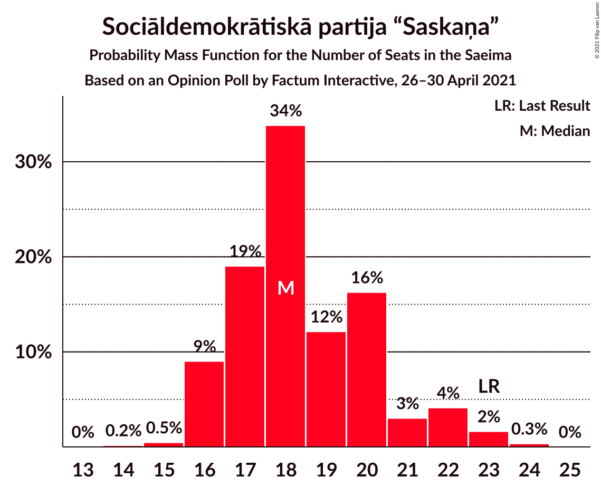
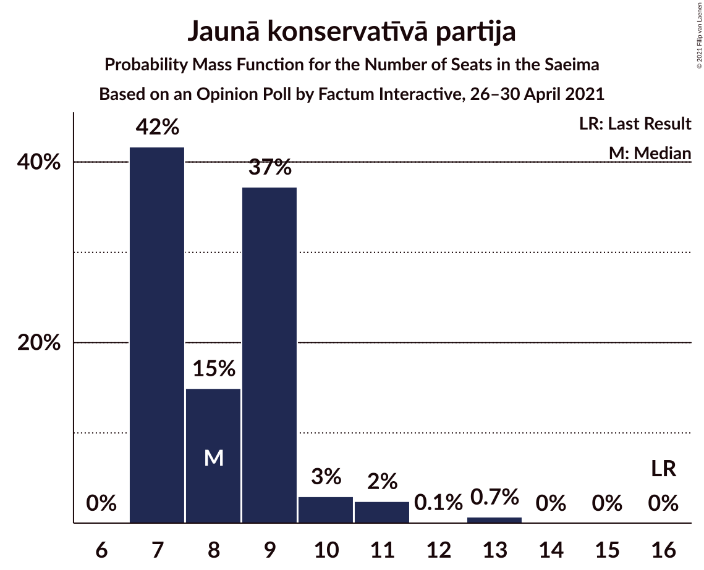
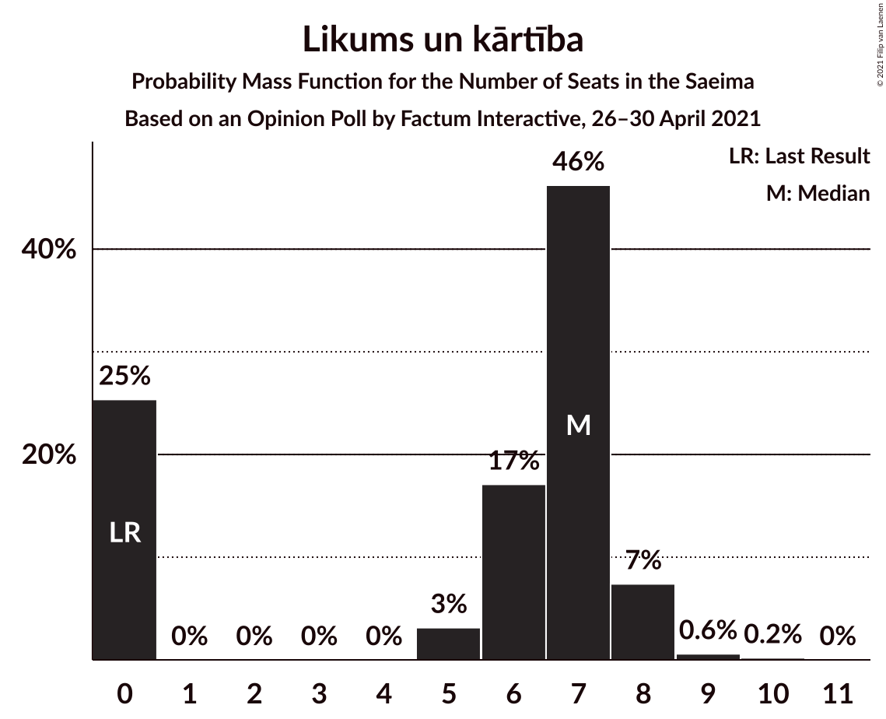
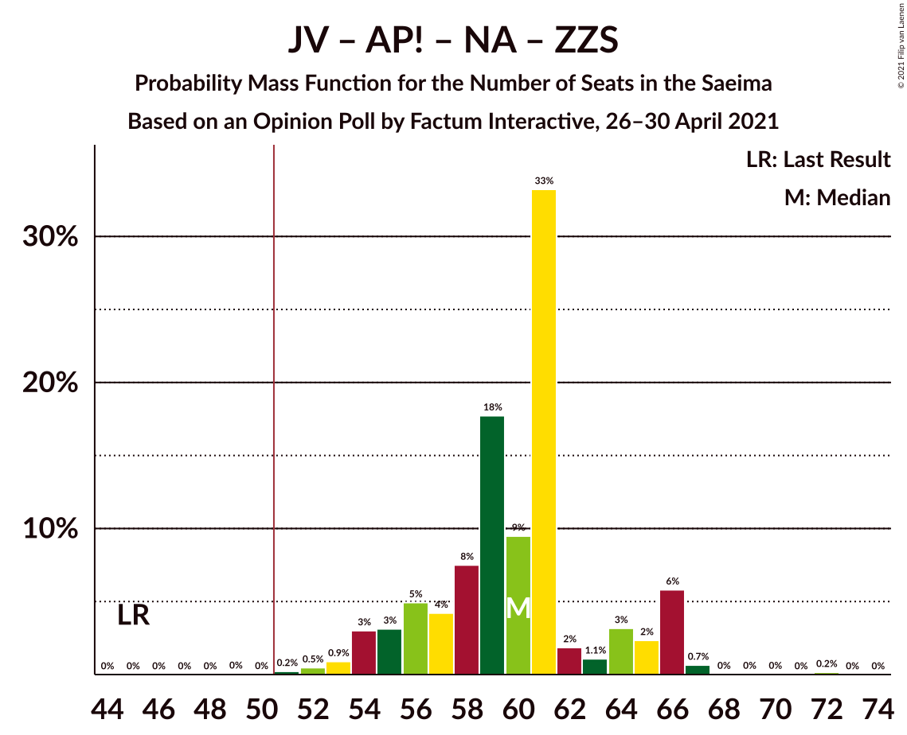
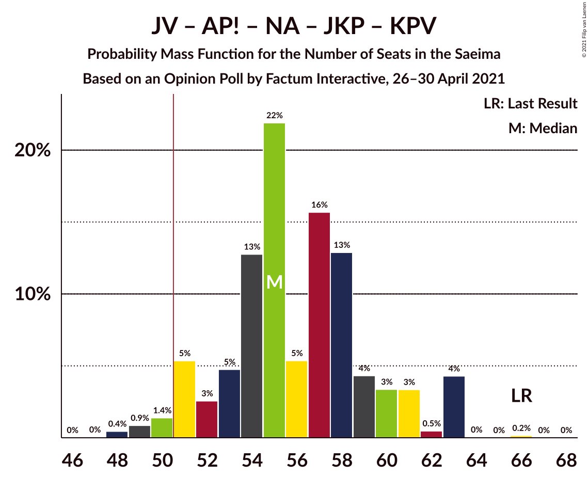
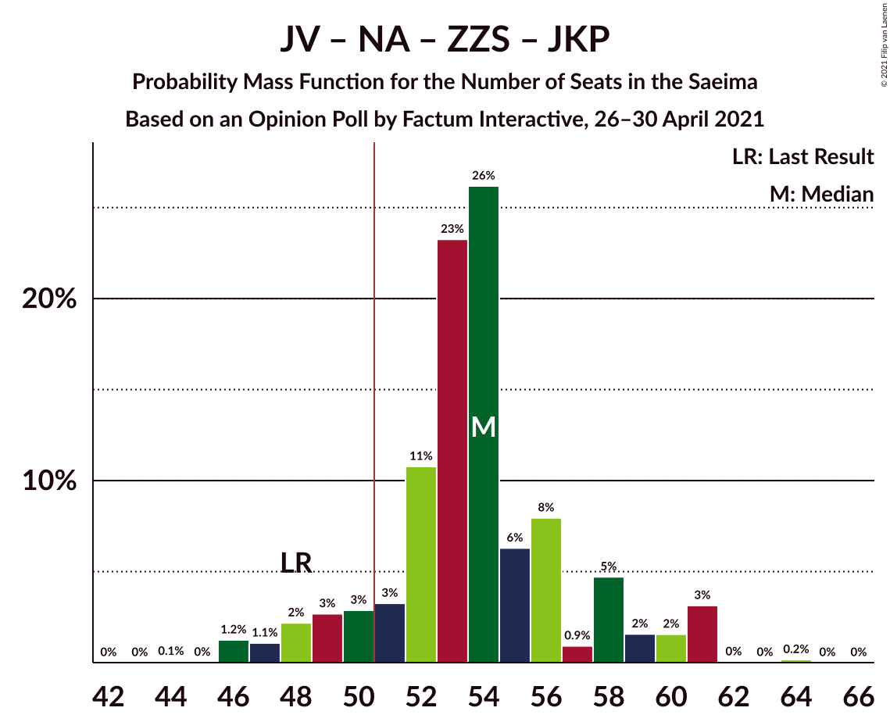
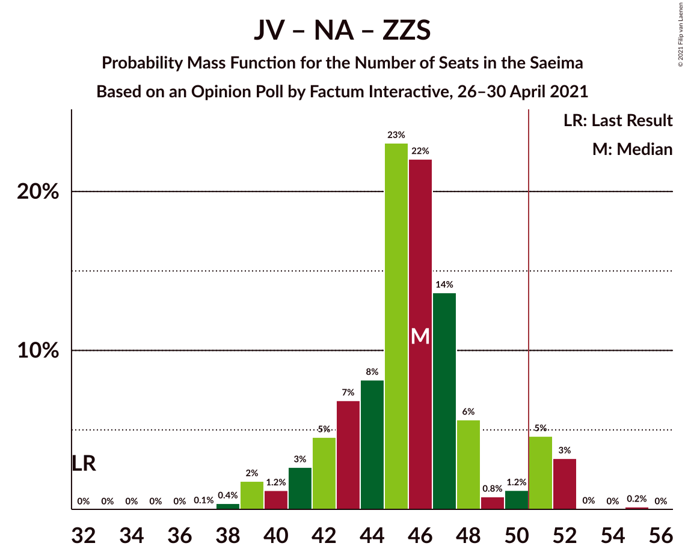
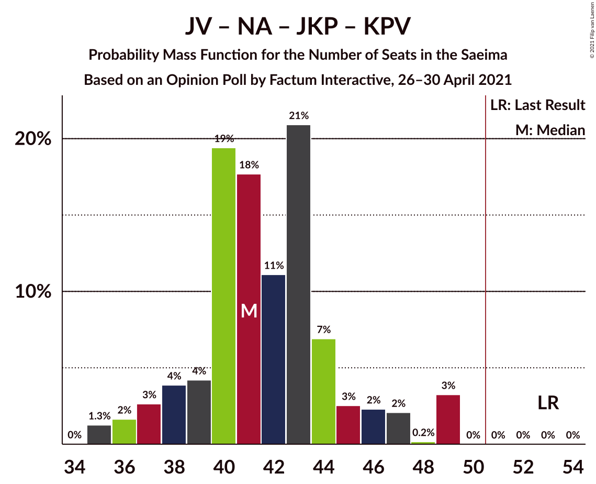
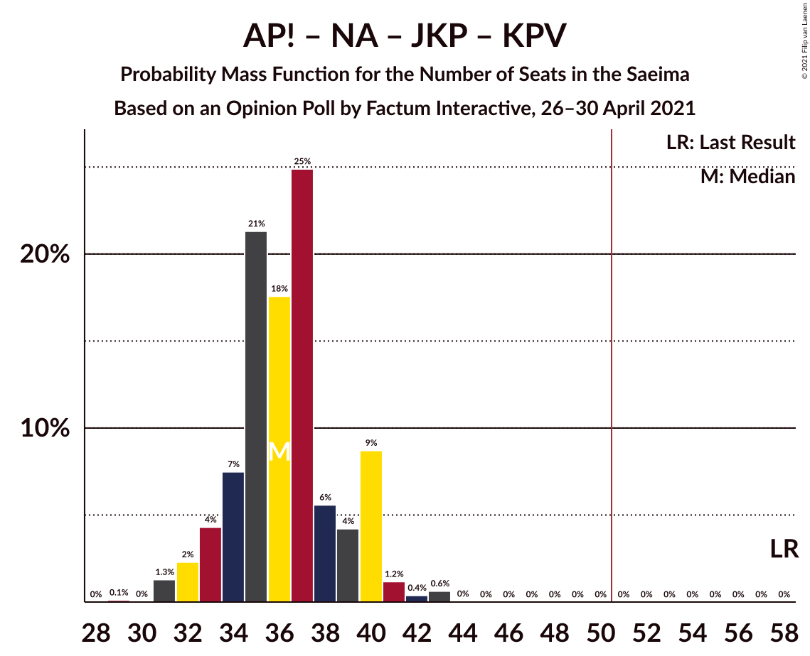
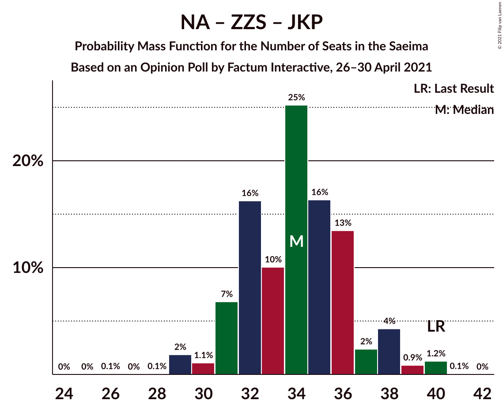

# Opinion Poll by Factum Interactive, 26–30 April 2021

<a href="#voting-intentions">Voting Intentions</a> | <a href="#seats">Seats</a> | <a href="#coalitions">Coalitions</a> | <a href="#technical-information">Technical Information</a>

## Voting Intentions

### Confidence Intervals

| Party | Last Result | Poll Result | 80% Confidence Interval | 90% Confidence Interval | 95% Confidence Interval | 99% Confidence Interval |
|:-----:|:-----------:|:-----------:|:-----------------------:|:-----------------------:|:-----------------------:|:-----------------------:|
| Jaunā VIENOTĪBA | 6.7% | 16.8% | 15.4–18.2% |15.0–18.6% |14.7–19.0% |14.1–19.7% |
| Sociāldemokrātiskā partija “Saskaņa” | 19.8% | 15.2% | 13.9–16.6% |13.6–17.0% |13.3–17.4% |12.7–18.1% |
| Attīstībai/Par! | 12.0% | 12.2% | 11.1–13.5% |10.7–13.9% |10.5–14.2% |9.9–14.9% |
| Nacionālā apvienība „Visu Latvijai!”–„Tēvzemei un Brīvībai/LNNK” | 11.0% | 11.9% | 10.7–13.2% |10.4–13.5% |10.2–13.9% |9.6–14.5% |
| Zaļo un Zemnieku savienība | 9.9% | 10.1% | 9.0–11.3% |8.7–11.6% |8.5–11.9% |8.0–12.6% |
| Jaunā konservatīvā partija | 13.6% | 7.4% | 6.4–8.4% |6.2–8.7% |6.0–9.0% |5.6–9.5% |
| PROGRESĪVIE | 2.6% | 6.4% | 5.6–7.4% |5.3–7.7% |5.1–8.0% |4.8–8.5% |
| Likums un kārtība | 0.0% | 5.6% | 4.8–6.5% |4.6–6.8% |4.4–7.0% |4.0–7.5% |
| Latvijas Reģionu Apvienība | 4.1% | 4.3% | 3.6–5.1% |3.4–5.4% |3.2–5.6% |3.0–6.0% |
| Latvijas Krievu savienība | 3.2% | 4.1% | 3.4–5.0% |3.3–5.2% |3.1–5.4% |2.8–5.8% |
| Politiskā partija „KPV LV” | 14.2% | 1.0% | 0.7–1.5% |0.7–1.7% |0.6–1.8% |0.5–2.1% |

*Note:* The poll result column reflects the actual value used in the calculations. Published results may vary slightly, and in addition be rounded to fewer digits.

## Seats

### Confidence Intervals

| Party | Last Result | Median | 80% Confidence Interval | 90% Confidence Interval | 95% Confidence Interval | 99% Confidence Interval |
|:-----:|:-----------:|:------:|:-----------------------:|:-----------------------:|:-----------------------:|:-----------------------:|
| <a href="#jaunā-vienotība">Jaunā VIENOTĪBA</a> | 8 | 20 | 18–23 |18–23 |18–23 |17–23 |
| <a href="#sociāldemokrātiskā-partija-“saskaņa”">Sociāldemokrātiskā partija “Saskaņa”</a> | 23 | 18 | 16–21 |16–23 |16–23 |16–23 |
| <a href="#attīstībai/par!">Attīstībai/Par!</a> | 13 | 14 | 14 |14–15 |13–16 |12–17 |
| <a href="#nacionālā-apvienība-„visu-latvijai!”–„tēvzemei-un-brīvībai/lnnk”">Nacionālā apvienība „Visu Latvijai!”–„Tēvzemei un Brīvībai/LNNK”</a> | 13 | 14 | 12–17 |11–17 |11–17 |11–17 |
| <a href="#zaļo-un-zemnieku-savienība">Zaļo un Zemnieku savienība</a> | 11 | 12 | 11–13 |11–14 |11–14 |11–15 |
| <a href="#jaunā-konservatīvā-partija">Jaunā konservatīvā partija</a> | 16 | 9 | 7–9 |7–10 |7–10 |7–11 |
| <a href="#progresīvie">PROGRESĪVIE</a> | 0 | 7 | 6–8 |6–8 |6–8 |0–9 |
| <a href="#likums-un-kārtība">Likums un kārtība</a> | 0 | 6 | 0–7 |0–7 |0–7 |0–8 |
| <a href="#latvijas-reģionu-apvienība">Latvijas Reģionu Apvienība</a> | 0 | 0 | 0 |0 |0–6 |0–6 |
| <a href="#latvijas-krievu-savienība">Latvijas Krievu savienība</a> | 0 | 0 | 0–6 |0–6 |0–6 |0–8 |
| <a href="#politiskā-partija-„kpv-lv”">Politiskā partija „KPV LV”</a> | 16 | 0 | 0 |0 |0 |0 |

### Jaunā VIENOTĪBA

*For a full overview of the results for this party, see the [Jaunā VIENOTĪBA](party-jaunāvienotība.html) page.*

| Number of Seats | Probability | Accumulated | Special Marks |
|:---------------:|:-----------:|:-----------:|:-------------:|
| 8 | 0% | 100% | Last Result |
| 9 | 0% | 100% |  |
| 10 | 0% | 100% |  |
| 11 | 0% | 100% |  |
| 12 | 0% | 100% |  |
| 13 | 0% | 100% |  |
| 14 | 0% | 100% |  |
| 15 | 0% | 100% |  |
| 16 | 0.3% | 100% |  |
| 17 | 2% | 99.7% |  |
| 18 | 22% | 98% |  |
| 19 | 13% | 76% |  |
| 20 | 21% | 63% | Median |
| 21 | 17% | 41% |  |
| 22 | 0.8% | 24% |  |
| 23 | 23% | 23% |  |
| 24 | 0.2% | 0.2% |  |
| 25 | 0% | 0% |  |

### Sociāldemokrātiskā partija “Saskaņa”

*For a full overview of the results for this party, see the [Sociāldemokrātiskā partija “Saskaņa”](party-sociāldemokrātiskāpartija“saskaņa”.html) page.*

| Number of Seats | Probability | Accumulated | Special Marks |
|:---------------:|:-----------:|:-----------:|:-------------:|
| 15 | 0.2% | 100% |  |
| 16 | 39% | 99.7% |  |
| 17 | 2% | 61% |  |
| 18 | 27% | 59% | Median |
| 19 | 10% | 32% |  |
| 20 | 9% | 22% |  |
| 21 | 5% | 13% |  |
| 22 | 0.1% | 9% |  |
| 23 | 9% | 9% | Last Result |
| 24 | 0% | 0% |  |

### Attīstībai/Par!

*For a full overview of the results for this party, see the [Attīstībai/Par!](party-attīstībaipar.html) page.*

| Number of Seats | Probability | Accumulated | Special Marks |
|:---------------:|:-----------:|:-----------:|:-------------:|
| 10 | 0.3% | 100% |  |
| 11 | 0.1% | 99.7% |  |
| 12 | 0.8% | 99.6% |  |
| 13 | 1.3% | 98.8% | Last Result |
| 14 | 88% | 97% | Median |
| 15 | 7% | 10% |  |
| 16 | 2% | 3% |  |
| 17 | 0.5% | 0.8% |  |
| 18 | 0.1% | 0.3% |  |
| 19 | 0% | 0.2% |  |
| 20 | 0% | 0.1% |  |
| 21 | 0.1% | 0.1% |  |
| 22 | 0% | 0% |  |

### Nacionālā apvienība „Visu Latvijai!”–„Tēvzemei un Brīvībai/LNNK”

*For a full overview of the results for this party, see the [Nacionālā apvienība „Visu Latvijai!”–„Tēvzemei un Brīvībai/LNNK”](party-nacionālāapvienība„visulatvijai”–„tēvzemeiunbrīvībailnnk”.html) page.*

| Number of Seats | Probability | Accumulated | Special Marks |
|:---------------:|:-----------:|:-----------:|:-------------:|
| 10 | 0.2% | 100% |  |
| 11 | 7% | 99.8% |  |
| 12 | 6% | 93% |  |
| 13 | 10% | 87% | Last Result |
| 14 | 54% | 78% | Median |
| 15 | 0.7% | 23% |  |
| 16 | 0.5% | 22% |  |
| 17 | 22% | 22% |  |
| 18 | 0% | 0% |  |

### Zaļo un Zemnieku savienība

*For a full overview of the results for this party, see the [Zaļo un Zemnieku savienība](party-zaļounzemniekusavienība.html) page.*

| Number of Seats | Probability | Accumulated | Special Marks |
|:---------------:|:-----------:|:-----------:|:-------------:|
| 10 | 0% | 100% |  |
| 11 | 41% | 99.9% | Last Result |
| 12 | 48% | 58% | Median |
| 13 | 3% | 11% |  |
| 14 | 7% | 7% |  |
| 15 | 0.6% | 0.7% |  |
| 16 | 0.1% | 0.1% |  |
| 17 | 0% | 0% |  |

### Jaunā konservatīvā partija

*For a full overview of the results for this party, see the [Jaunā konservatīvā partija](party-jaunākonservatīvāpartija.html) page.*

| Number of Seats | Probability | Accumulated | Special Marks |
|:---------------:|:-----------:|:-----------:|:-------------:|
| 7 | 39% | 100% |  |
| 8 | 1.4% | 61% |  |
| 9 | 53% | 60% | Median |
| 10 | 6% | 6% |  |
| 11 | 0.6% | 0.7% |  |
| 12 | 0% | 0.1% |  |
| 13 | 0% | 0% |  |
| 14 | 0% | 0% |  |
| 15 | 0% | 0% |  |
| 16 | 0% | 0% | Last Result |

### PROGRESĪVIE

*For a full overview of the results for this party, see the [PROGRESĪVIE](party-progresīvie.html) page.*

| Number of Seats | Probability | Accumulated | Special Marks |
|:---------------:|:-----------:|:-----------:|:-------------:|
| 0 | 1.3% | 100% | Last Result |
| 1 | 0% | 98.7% |  |
| 2 | 0% | 98.7% |  |
| 3 | 0% | 98.7% |  |
| 4 | 0% | 98.7% |  |
| 5 | 0% | 98.7% |  |
| 6 | 18% | 98.7% |  |
| 7 | 70% | 81% | Median |
| 8 | 9% | 11% |  |
| 9 | 2% | 2% |  |
| 10 | 0.1% | 0.1% |  |
| 11 | 0% | 0% |  |

### Likums un kārtība

*For a full overview of the results for this party, see the [Likums un kārtība](party-likumsunkārtība.html) page.*

| Number of Seats | Probability | Accumulated | Special Marks |
|:---------------:|:-----------:|:-----------:|:-------------:|
| 0 | 28% | 100% | Last Result |
| 1 | 0% | 72% |  |
| 2 | 0% | 72% |  |
| 3 | 0% | 72% |  |
| 4 | 0% | 72% |  |
| 5 | 0.7% | 72% |  |
| 6 | 23% | 71% | Median |
| 7 | 47% | 48% |  |
| 8 | 1.0% | 1.2% |  |
| 9 | 0% | 0.2% |  |
| 10 | 0.2% | 0.2% |  |
| 11 | 0% | 0% |  |

### Latvijas Reģionu Apvienība

*For a full overview of the results for this party, see the [Latvijas Reģionu Apvienība](party-latvijasreģionuapvienība.html) page.*

| Number of Seats | Probability | Accumulated | Special Marks |
|:---------------:|:-----------:|:-----------:|:-------------:|
| 0 | 96% | 100% | Last Result, Median |
| 1 | 0% | 4% |  |
| 2 | 0% | 4% |  |
| 3 | 0% | 4% |  |
| 4 | 0% | 4% |  |
| 5 | 0% | 4% |  |
| 6 | 4% | 4% |  |
| 7 | 0.3% | 0.3% |  |
| 8 | 0% | 0% |  |

### Latvijas Krievu savienība

*For a full overview of the results for this party, see the [Latvijas Krievu savienība](party-latvijaskrievusavienība.html) page.*

| Number of Seats | Probability | Accumulated | Special Marks |
|:---------------:|:-----------:|:-----------:|:-------------:|
| 0 | 77% | 100% | Last Result, Median |
| 1 | 0% | 23% |  |
| 2 | 0% | 23% |  |
| 3 | 0% | 23% |  |
| 4 | 0% | 23% |  |
| 5 | 0.1% | 23% |  |
| 6 | 22% | 23% |  |
| 7 | 0.1% | 1.1% |  |
| 8 | 0.9% | 0.9% |  |
| 9 | 0% | 0% |  |

### Politiskā partija „KPV LV”

*For a full overview of the results for this party, see the [Politiskā partija „KPV LV”](party-politiskāpartija„kpvlv”.html) page.*

| Number of Seats | Probability | Accumulated | Special Marks |
|:---------------:|:-----------:|:-----------:|:-------------:|
| 0 | 100% | 100% | Median |
| 1 | 0% | 0% |  |
| 2 | 0% | 0% |  |
| 3 | 0% | 0% |  |
| 4 | 0% | 0% |  |
| 5 | 0% | 0% |  |
| 6 | 0% | 0% |  |
| 7 | 0% | 0% |  |
| 8 | 0% | 0% |  |
| 9 | 0% | 0% |  |
| 10 | 0% | 0% |  |
| 11 | 0% | 0% |  |
| 12 | 0% | 0% |  |
| 13 | 0% | 0% |  |
| 14 | 0% | 0% |  |
| 15 | 0% | 0% |  |
| 16 | 0% | 0% | Last Result |

## Coalitions

### Confidence Intervals

| Coalition | Last Result | Median | Majority? | 80% Confidence Interval | 90% Confidence Interval | 95% Confidence Interval | 99% Confidence Interval |
|:---------:|:-----------:|:------:|:---------:|:-----------------------:|:-----------------------:|:-----------------------:|:-----------------------:|
| Jaunā VIENOTĪBA – Attīstībai/Par! – Nacionālā apvienība „Visu Latvijai!”–„Tēvzemei un Brīvībai/LNNK” – Zaļo un Zemnieku savienība – Jaunā konservatīvā partija | 61 | 67 | 100% | 65–75 | 63–75 | 63–75 | 62–75 |
| Jaunā VIENOTĪBA – Attīstībai/Par! – Nacionālā apvienība „Visu Latvijai!”–„Tēvzemei un Brīvībai/LNNK” – Zaļo un Zemnieku savienība | 45 | 59 | 100% | 56–66 | 56–66 | 56–66 | 53–66 |
| Jaunā VIENOTĪBA – Attīstībai/Par! – Nacionālā apvienība „Visu Latvijai!”–„Tēvzemei un Brīvībai/LNNK” – Jaunā konservatīvā partija | 50 | 56 | 99.3% | 52–63 | 52–63 | 51–63 | 50–63 |
| Jaunā VIENOTĪBA – Attīstībai/Par! – Nacionālā apvienība „Visu Latvijai!”–„Tēvzemei un Brīvībai/LNNK” – Jaunā konservatīvā partija – Politiskā partija „KPV LV” | 66 | 56 | 99.3% | 52–63 | 52–63 | 51–63 | 50–63 |
| Jaunā VIENOTĪBA – Nacionālā apvienība „Visu Latvijai!”–„Tēvzemei un Brīvībai/LNNK” – Zaļo un Zemnieku savienība – Jaunā konservatīvā partija | 48 | 53 | 87% | 50–61 | 49–61 | 49–61 | 49–61 |
| Jaunā VIENOTĪBA – Attīstībai/Par! – Nacionālā apvienība „Visu Latvijai!”–„Tēvzemei un Brīvībai/LNNK” – Politiskā partija „KPV LV” | 50 | 48 | 23% | 44–54 | 44–54 | 44–54 | 42–54 |
| Attīstībai/Par! – Nacionālā apvienība „Visu Latvijai!”–„Tēvzemei un Brīvībai/LNNK” – Zaļo un Zemnieku savienība – Jaunā konservatīvā partija | 53 | 48 | 26% | 46–52 | 45–52 | 45–52 | 44–53 |
| Jaunā VIENOTĪBA – Nacionālā apvienība „Visu Latvijai!”–„Tēvzemei un Brīvībai/LNNK” – Zaļo un Zemnieku savienība | 32 | 45 | 22% | 42–52 | 42–52 | 42–52 | 40–52 |
| Jaunā VIENOTĪBA – Nacionālā apvienība „Visu Latvijai!”–„Tēvzemei un Brīvībai/LNNK” – Jaunā konservatīvā partija – Politiskā partija „KPV LV” | 53 | 41 | 0% | 38–49 | 38–49 | 37–49 | 37–49 |
| Jaunā VIENOTĪBA – Attīstībai/Par! – Jaunā konservatīvā partija – Politiskā partija „KPV LV” | 53 | 42 | 0% | 39–46 | 39–46 | 39–46 | 37–49 |
| Sociāldemokrātiskā partija “Saskaņa” – Attīstībai/Par! – Jaunā konservatīvā partija | 52 | 41 | 0.1% | 37–44 | 37–44 | 37–44 | 37–46 |
| Attīstībai/Par! – Nacionālā apvienība „Visu Latvijai!”–„Tēvzemei un Brīvībai/LNNK” – Zaļo un Zemnieku savienība | 37 | 40 | 0% | 38–43 | 38–43 | 38–43 | 36–44 |
| Attīstībai/Par! – Nacionālā apvienība „Visu Latvijai!”–„Tēvzemei un Brīvībai/LNNK” – Jaunā konservatīvā partija – Politiskā partija „KPV LV” | 58 | 37 | 0% | 34–40 | 34–40 | 32–40 | 32–40 |
| Nacionālā apvienība „Visu Latvijai!”–„Tēvzemei un Brīvībai/LNNK” – Zaļo un Zemnieku savienība – Jaunā konservatīvā partija | 40 | 34 | 0% | 32–38 | 31–38 | 31–38 | 30–38 |
| Sociāldemokrātiskā partija “Saskaņa” – Attīstībai/Par! | 36 | 32 | 0% | 30–35 | 30–37 | 30–37 | 29–37 |
| Sociāldemokrātiskā partija “Saskaņa” – Zaļo un Zemnieku savienība – Politiskā partija „KPV LV” | 50 | 30 | 0% | 27–34 | 27–35 | 27–35 | 27–37 |
| Sociāldemokrātiskā partija “Saskaņa” – Politiskā partija „KPV LV” | 39 | 18 | 0% | 16–21 | 16–23 | 16–23 | 16–23 |

### Jaunā VIENOTĪBA – Attīstībai/Par! – Nacionālā apvienība „Visu Latvijai!”–„Tēvzemei un Brīvībai/LNNK” – Zaļo un Zemnieku savienība – Jaunā konservatīvā partija

| Number of Seats | Probability | Accumulated | Special Marks |
|:---------------:|:-----------:|:-----------:|:-------------:|
| 61 | 0.1% | 100% | Last Result |
| 62 | 0.9% | 99.9% |  |
| 63 | 7% | 99.0% |  |
| 64 | 0.6% | 92% |  |
| 65 | 11% | 91% |  |
| 66 | 23% | 80% |  |
| 67 | 11% | 57% |  |
| 68 | 2% | 46% |  |
| 69 | 3% | 43% | Median |
| 70 | 16% | 40% |  |
| 71 | 0.4% | 24% |  |
| 72 | 0.2% | 24% |  |
| 73 | 0.3% | 23% |  |
| 74 | 1.3% | 23% |  |
| 75 | 22% | 22% |  |
| 76 | 0% | 0.2% |  |
| 77 | 0% | 0.2% |  |
| 78 | 0% | 0.2% |  |
| 79 | 0.1% | 0.2% |  |
| 80 | 0% | 0% |  |

### Jaunā VIENOTĪBA – Attīstībai/Par! – Nacionālā apvienība „Visu Latvijai!”–„Tēvzemei un Brīvībai/LNNK” – Zaļo un Zemnieku savienība

| Number of Seats | Probability | Accumulated | Special Marks |
|:---------------:|:-----------:|:-----------:|:-------------:|
| 45 | 0% | 100% | Last Result |
| 46 | 0% | 100% |  |
| 47 | 0% | 100% |  |
| 48 | 0% | 100% |  |
| 49 | 0% | 100% |  |
| 50 | 0% | 100% |  |
| 51 | 0% | 100% | Majority |
| 52 | 0.1% | 100% |  |
| 53 | 0.6% | 99.9% |  |
| 54 | 0.1% | 99.3% |  |
| 55 | 1.0% | 99.2% |  |
| 56 | 12% | 98% |  |
| 57 | 0.3% | 86% |  |
| 58 | 21% | 86% |  |
| 59 | 19% | 64% |  |
| 60 | 3% | 45% | Median |
| 61 | 17% | 42% |  |
| 62 | 0.5% | 24% |  |
| 63 | 0.3% | 24% |  |
| 64 | 1.0% | 23% |  |
| 65 | 0.6% | 22% |  |
| 66 | 22% | 22% |  |
| 67 | 0% | 0.2% |  |
| 68 | 0% | 0.2% |  |
| 69 | 0% | 0.2% |  |
| 70 | 0.1% | 0.2% |  |
| 71 | 0% | 0% |  |

### Jaunā VIENOTĪBA – Attīstībai/Par! – Nacionālā apvienība „Visu Latvijai!”–„Tēvzemei un Brīvībai/LNNK” – Jaunā konservatīvā partija

| Number of Seats | Probability | Accumulated | Special Marks |
|:---------------:|:-----------:|:-----------:|:-------------:|
| 49 | 0.2% | 100% |  |
| 50 | 0.5% | 99.8% | Last Result |
| 51 | 4% | 99.3% | Majority |
| 52 | 7% | 95% |  |
| 53 | 4% | 88% |  |
| 54 | 12% | 84% |  |
| 55 | 22% | 72% |  |
| 56 | 8% | 51% |  |
| 57 | 2% | 42% | Median |
| 58 | 17% | 41% |  |
| 59 | 0.6% | 24% |  |
| 60 | 0.1% | 23% |  |
| 61 | 0.1% | 23% |  |
| 62 | 0.3% | 23% |  |
| 63 | 22% | 23% |  |
| 64 | 0.1% | 0.2% |  |
| 65 | 0% | 0% |  |

### Jaunā VIENOTĪBA – Attīstībai/Par! – Nacionālā apvienība „Visu Latvijai!”–„Tēvzemei un Brīvībai/LNNK” – Jaunā konservatīvā partija – Politiskā partija „KPV LV”

| Number of Seats | Probability | Accumulated | Special Marks |
|:---------------:|:-----------:|:-----------:|:-------------:|
| 49 | 0.2% | 100% |  |
| 50 | 0.5% | 99.8% |  |
| 51 | 4% | 99.3% | Majority |
| 52 | 7% | 95% |  |
| 53 | 4% | 88% |  |
| 54 | 12% | 84% |  |
| 55 | 22% | 72% |  |
| 56 | 8% | 51% |  |
| 57 | 2% | 42% | Median |
| 58 | 17% | 41% |  |
| 59 | 0.6% | 24% |  |
| 60 | 0.1% | 23% |  |
| 61 | 0.1% | 23% |  |
| 62 | 0.3% | 23% |  |
| 63 | 22% | 23% |  |
| 64 | 0.1% | 0.2% |  |
| 65 | 0% | 0% |  |
| 66 | 0% | 0% | Last Result |

### Jaunā VIENOTĪBA – Nacionālā apvienība „Visu Latvijai!”–„Tēvzemei un Brīvībai/LNNK” – Zaļo un Zemnieku savienība – Jaunā konservatīvā partija

| Number of Seats | Probability | Accumulated | Special Marks |
|:---------------:|:-----------:|:-----------:|:-------------:|
| 47 | 0.1% | 100% |  |
| 48 | 0.1% | 99.8% | Last Result |
| 49 | 8% | 99.7% |  |
| 50 | 5% | 92% |  |
| 51 | 8% | 87% | Majority |
| 52 | 24% | 79% |  |
| 53 | 11% | 55% |  |
| 54 | 1.5% | 44% |  |
| 55 | 2% | 43% | Median |
| 56 | 17% | 41% |  |
| 57 | 0.6% | 24% |  |
| 58 | 1.1% | 23% |  |
| 59 | 0.2% | 22% |  |
| 60 | 0.5% | 22% |  |
| 61 | 22% | 22% |  |
| 62 | 0% | 0% |  |

### Jaunā VIENOTĪBA – Attīstībai/Par! – Nacionālā apvienība „Visu Latvijai!”–„Tēvzemei un Brīvībai/LNNK” – Politiskā partija „KPV LV”

| Number of Seats | Probability | Accumulated | Special Marks |
|:---------------:|:-----------:|:-----------:|:-------------:|
| 41 | 0.1% | 100% |  |
| 42 | 1.1% | 99.9% |  |
| 43 | 0.2% | 98.8% |  |
| 44 | 9% | 98.6% |  |
| 45 | 10% | 89% |  |
| 46 | 6% | 80% |  |
| 47 | 12% | 73% |  |
| 48 | 19% | 61% | Median |
| 49 | 18% | 42% |  |
| 50 | 1.5% | 25% | Last Result |
| 51 | 0.2% | 23% | Majority |
| 52 | 0.1% | 23% |  |
| 53 | 1.0% | 23% |  |
| 54 | 22% | 22% |  |
| 55 | 0.2% | 0.2% |  |
| 56 | 0% | 0% |  |

### Attīstībai/Par! – Nacionālā apvienība „Visu Latvijai!”–„Tēvzemei un Brīvībai/LNNK” – Zaļo un Zemnieku savienība – Jaunā konservatīvā partija

| Number of Seats | Probability | Accumulated | Special Marks |
|:---------------:|:-----------:|:-----------:|:-------------:|
| 43 | 0.1% | 100% |  |
| 44 | 0.5% | 99.8% |  |
| 45 | 8% | 99.3% |  |
| 46 | 23% | 92% |  |
| 47 | 10% | 69% |  |
| 48 | 13% | 59% |  |
| 49 | 19% | 45% | Median |
| 50 | 0.6% | 26% |  |
| 51 | 3% | 26% | Majority |
| 52 | 22% | 22% |  |
| 53 | 0.2% | 0.5% | Last Result |
| 54 | 0.1% | 0.4% |  |
| 55 | 0.1% | 0.3% |  |
| 56 | 0% | 0.2% |  |
| 57 | 0% | 0.2% |  |
| 58 | 0% | 0.1% |  |
| 59 | 0.1% | 0.1% |  |
| 60 | 0% | 0% |  |

### Jaunā VIENOTĪBA – Nacionālā apvienība „Visu Latvijai!”–„Tēvzemei un Brīvībai/LNNK” – Zaļo un Zemnieku savienība

| Number of Seats | Probability | Accumulated | Special Marks |
|:---------------:|:-----------:|:-----------:|:-------------:|
| 32 | 0% | 100% | Last Result |
| 33 | 0% | 100% |  |
| 34 | 0% | 100% |  |
| 35 | 0% | 100% |  |
| 36 | 0% | 100% |  |
| 37 | 0% | 100% |  |
| 38 | 0.1% | 100% |  |
| 39 | 0% | 99.9% |  |
| 40 | 0.6% | 99.9% |  |
| 41 | 0.5% | 99.2% |  |
| 42 | 12% | 98.7% |  |
| 43 | 6% | 87% |  |
| 44 | 18% | 81% |  |
| 45 | 19% | 63% |  |
| 46 | 3% | 44% | Median |
| 47 | 17% | 41% |  |
| 48 | 1.5% | 24% |  |
| 49 | 0.3% | 23% |  |
| 50 | 0.2% | 22% |  |
| 51 | 0.5% | 22% | Majority |
| 52 | 22% | 22% |  |
| 53 | 0.1% | 0.1% |  |
| 54 | 0% | 0% |  |

### Jaunā VIENOTĪBA – Nacionālā apvienība „Visu Latvijai!”–„Tēvzemei un Brīvībai/LNNK” – Jaunā konservatīvā partija – Politiskā partija „KPV LV”

| Number of Seats | Probability | Accumulated | Special Marks |
|:---------------:|:-----------:|:-----------:|:-------------:|
| 36 | 0.2% | 100% |  |
| 37 | 4% | 99.8% |  |
| 38 | 8% | 96% |  |
| 39 | 9% | 88% |  |
| 40 | 7% | 79% |  |
| 41 | 22% | 72% |  |
| 42 | 8% | 49% |  |
| 43 | 1.1% | 41% | Median |
| 44 | 17% | 40% |  |
| 45 | 0.6% | 23% |  |
| 46 | 0.1% | 23% |  |
| 47 | 1.0% | 23% |  |
| 48 | 0.2% | 22% |  |
| 49 | 22% | 22% |  |
| 50 | 0% | 0% |  |
| 51 | 0% | 0% | Majority |
| 52 | 0% | 0% |  |
| 53 | 0% | 0% | Last Result |

### Jaunā VIENOTĪBA – Attīstībai/Par! – Jaunā konservatīvā partija – Politiskā partija „KPV LV”

| Number of Seats | Probability | Accumulated | Special Marks |
|:---------------:|:-----------:|:-----------:|:-------------:|
| 35 | 0.2% | 100% |  |
| 36 | 0% | 99.8% |  |
| 37 | 0.4% | 99.8% |  |
| 38 | 0.4% | 99.3% |  |
| 39 | 11% | 98.9% |  |
| 40 | 8% | 88% |  |
| 41 | 22% | 80% |  |
| 42 | 12% | 58% |  |
| 43 | 5% | 46% | Median |
| 44 | 17% | 41% |  |
| 45 | 0.3% | 24% |  |
| 46 | 23% | 24% |  |
| 47 | 0.1% | 1.3% |  |
| 48 | 0.1% | 1.2% |  |
| 49 | 0.9% | 1.1% |  |
| 50 | 0.2% | 0.3% |  |
| 51 | 0% | 0% | Majority |
| 52 | 0% | 0% |  |
| 53 | 0% | 0% | Last Result |

### Sociāldemokrātiskā partija “Saskaņa” – Attīstībai/Par! – Jaunā konservatīvā partija

| Number of Seats | Probability | Accumulated | Special Marks |
|:---------------:|:-----------:|:-----------:|:-------------:|
| 34 | 0.2% | 100% |  |
| 35 | 0% | 99.8% |  |
| 36 | 0.1% | 99.7% |  |
| 37 | 18% | 99.6% |  |
| 38 | 5% | 81% |  |
| 39 | 17% | 77% |  |
| 40 | 0.6% | 59% |  |
| 41 | 29% | 59% | Median |
| 42 | 12% | 30% |  |
| 43 | 3% | 18% |  |
| 44 | 12% | 15% |  |
| 45 | 0.2% | 2% |  |
| 46 | 2% | 2% |  |
| 47 | 0.1% | 0.4% |  |
| 48 | 0% | 0.2% |  |
| 49 | 0% | 0.2% |  |
| 50 | 0% | 0.2% |  |
| 51 | 0.1% | 0.1% | Majority |
| 52 | 0% | 0% | Last Result |

### Attīstībai/Par! – Nacionālā apvienība „Visu Latvijai!”–„Tēvzemei un Brīvībai/LNNK” – Zaļo un Zemnieku savienība

| Number of Seats | Probability | Accumulated | Special Marks |
|:---------------:|:-----------:|:-----------:|:-------------:|
| 34 | 0% | 100% |  |
| 35 | 0.1% | 99.9% |  |
| 36 | 0.9% | 99.8% |  |
| 37 | 0.4% | 98.9% | Last Result |
| 38 | 15% | 98% |  |
| 39 | 30% | 83% |  |
| 40 | 26% | 53% | Median |
| 41 | 2% | 28% |  |
| 42 | 3% | 26% |  |
| 43 | 22% | 23% |  |
| 44 | 0.2% | 0.6% |  |
| 45 | 0.2% | 0.5% |  |
| 46 | 0.1% | 0.3% |  |
| 47 | 0% | 0.2% |  |
| 48 | 0% | 0.2% |  |
| 49 | 0% | 0.1% |  |
| 50 | 0.1% | 0.1% |  |
| 51 | 0% | 0% | Majority |

### Attīstībai/Par! – Nacionālā apvienība „Visu Latvijai!”–„Tēvzemei un Brīvībai/LNNK” – Jaunā konservatīvā partija – Politiskā partija „KPV LV”

| Number of Seats | Probability | Accumulated | Special Marks |
|:---------------:|:-----------:|:-----------:|:-------------:|
| 31 | 0.2% | 100% |  |
| 32 | 4% | 99.8% |  |
| 33 | 0.8% | 96% |  |
| 34 | 10% | 95% |  |
| 35 | 23% | 86% |  |
| 36 | 10% | 63% |  |
| 37 | 28% | 52% | Median |
| 38 | 0.8% | 24% |  |
| 39 | 0.3% | 24% |  |
| 40 | 23% | 23% |  |
| 41 | 0.1% | 0.4% |  |
| 42 | 0% | 0.2% |  |
| 43 | 0% | 0.2% |  |
| 44 | 0.1% | 0.1% |  |
| 45 | 0% | 0% |  |
| 46 | 0% | 0% |  |
| 47 | 0% | 0% |  |
| 48 | 0% | 0% |  |
| 49 | 0% | 0% |  |
| 50 | 0% | 0% |  |
| 51 | 0% | 0% | Majority |
| 52 | 0% | 0% |  |
| 53 | 0% | 0% |  |
| 54 | 0% | 0% |  |
| 55 | 0% | 0% |  |
| 56 | 0% | 0% |  |
| 57 | 0% | 0% |  |
| 58 | 0% | 0% | Last Result |

### Nacionālā apvienība „Visu Latvijai!”–„Tēvzemei un Brīvībai/LNNK” – Zaļo un Zemnieku savienība – Jaunā konservatīvā partija

| Number of Seats | Probability | Accumulated | Special Marks |
|:---------------:|:-----------:|:-----------:|:-------------:|
| 28 | 0.1% | 100% |  |
| 29 | 0.1% | 99.9% |  |
| 30 | 0.8% | 99.9% |  |
| 31 | 7% | 99.1% |  |
| 32 | 27% | 92% |  |
| 33 | 7% | 65% |  |
| 34 | 13% | 58% |  |
| 35 | 18% | 44% | Median |
| 36 | 0.8% | 26% |  |
| 37 | 3% | 25% |  |
| 38 | 22% | 22% |  |
| 39 | 0.1% | 0.1% |  |
| 40 | 0% | 0.1% | Last Result |
| 41 | 0% | 0% |  |

### Sociāldemokrātiskā partija “Saskaņa” – Attīstībai/Par!

| Number of Seats | Probability | Accumulated | Special Marks |
|:---------------:|:-----------:|:-----------:|:-------------:|
| 27 | 0.2% | 100% |  |
| 28 | 0.2% | 99.7% |  |
| 29 | 0.6% | 99.5% |  |
| 30 | 35% | 99.0% |  |
| 31 | 5% | 64% |  |
| 32 | 26% | 59% | Median |
| 33 | 8% | 33% |  |
| 34 | 10% | 25% |  |
| 35 | 6% | 15% |  |
| 36 | 0.5% | 9% | Last Result |
| 37 | 9% | 9% |  |
| 38 | 0.1% | 0.2% |  |
| 39 | 0% | 0.2% |  |
| 40 | 0% | 0.2% |  |
| 41 | 0% | 0.2% |  |
| 42 | 0.1% | 0.1% |  |
| 43 | 0% | 0% |  |

### Sociāldemokrātiskā partija “Saskaņa” – Zaļo un Zemnieku savienība – Politiskā partija „KPV LV”

| Number of Seats | Probability | Accumulated | Special Marks |
|:---------------:|:-----------:|:-----------:|:-------------:|
| 26 | 0.2% | 100% |  |
| 27 | 22% | 99.8% |  |
| 28 | 18% | 78% |  |
| 29 | 2% | 60% |  |
| 30 | 31% | 58% | Median |
| 31 | 3% | 27% |  |
| 32 | 9% | 23% |  |
| 33 | 1.2% | 14% |  |
| 34 | 7% | 13% |  |
| 35 | 4% | 6% |  |
| 36 | 0.2% | 2% |  |
| 37 | 2% | 2% |  |
| 38 | 0% | 0% |  |
| 39 | 0% | 0% |  |
| 40 | 0% | 0% |  |
| 41 | 0% | 0% |  |
| 42 | 0% | 0% |  |
| 43 | 0% | 0% |  |
| 44 | 0% | 0% |  |
| 45 | 0% | 0% |  |
| 46 | 0% | 0% |  |
| 47 | 0% | 0% |  |
| 48 | 0% | 0% |  |
| 49 | 0% | 0% |  |
| 50 | 0% | 0% | Last Result |

### Sociāldemokrātiskā partija “Saskaņa” – Politiskā partija „KPV LV”

| Number of Seats | Probability | Accumulated | Special Marks |
|:---------------:|:-----------:|:-----------:|:-------------:|
| 15 | 0.2% | 100% |  |
| 16 | 39% | 99.7% |  |
| 17 | 2% | 61% |  |
| 18 | 27% | 59% | Median |
| 19 | 10% | 32% |  |
| 20 | 9% | 22% |  |
| 21 | 5% | 13% |  |
| 22 | 0.1% | 9% |  |
| 23 | 9% | 9% |  |
| 24 | 0% | 0% |  |
| 25 | 0% | 0% |  |
| 26 | 0% | 0% |  |
| 27 | 0% | 0% |  |
| 28 | 0% | 0% |  |
| 29 | 0% | 0% |  |
| 30 | 0% | 0% |  |
| 31 | 0% | 0% |  |
| 32 | 0% | 0% |  |
| 33 | 0% | 0% |  |
| 34 | 0% | 0% |  |
| 35 | 0% | 0% |  |
| 36 | 0% | 0% |  |
| 37 | 0% | 0% |  |
| 38 | 0% | 0% |  |
| 39 | 0% | 0% | Last Result |

## Technical Information

### Opinion Poll

+ **Polling firm:** Factum Interactive
+ **Commissioner(s):** —
+ **Fieldwork period:** 26–30 April 2021

### Calculations

+ **Sample size:** 1170
+ **Simulations done:** 131,072
+ **Error estimate:** 1.98%

