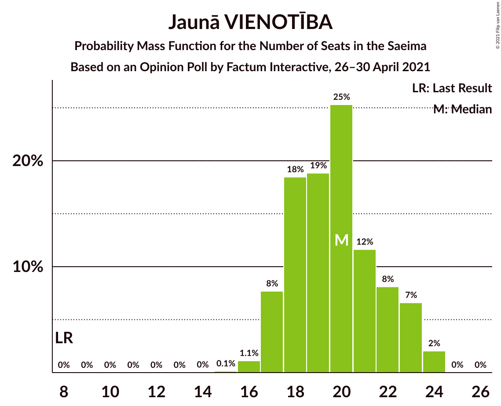
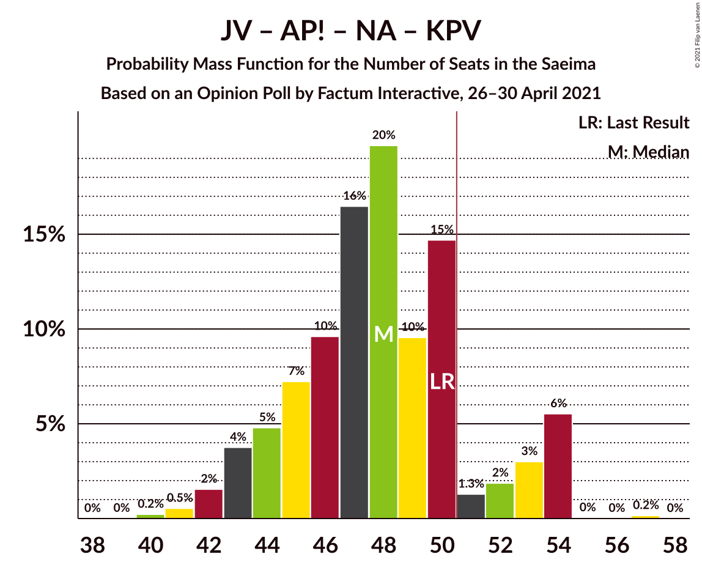
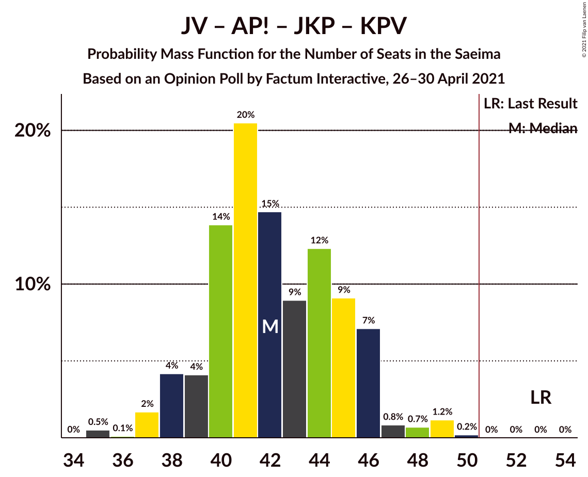
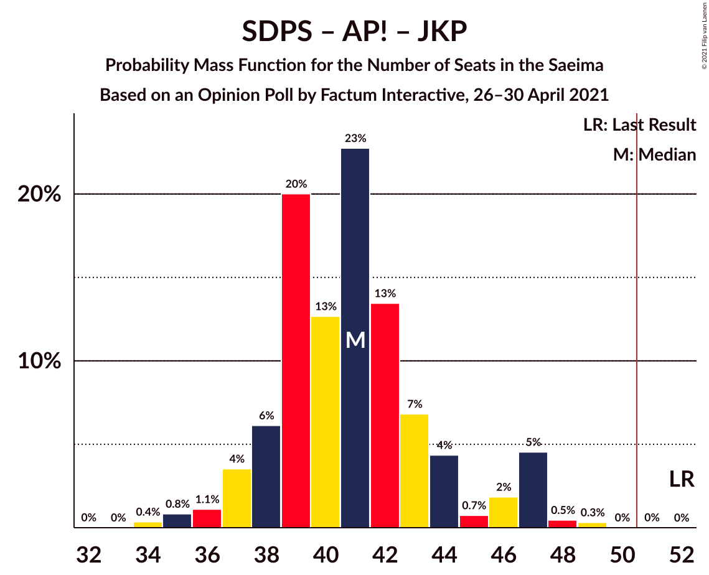

# Opinion Poll by Factum Interactive, 26–30 April 2021

<a href="#voting-intentions">Voting Intentions</a> | <a href="#seats">Seats</a> | <a href="#coalitions">Coalitions</a> | <a href="#technical-information">Technical Information</a>

## Voting Intentions

### Confidence Intervals

| Party | Last Result | Poll Result | 80% Confidence Interval | 90% Confidence Interval | 95% Confidence Interval | 99% Confidence Interval |
|:-----:|:-----------:|:-----------:|:-----------------------:|:-----------------------:|:-----------------------:|:-----------------------:|
| Jaunā VIENOTĪBA | 6.7% | 16.8% | 15.4–18.2% |15.0–18.6% |14.7–19.0% |14.1–19.7% |
| Sociāldemokrātiskā partija “Saskaņa” | 19.8% | 15.2% | 13.9–16.6% |13.6–17.0% |13.3–17.4% |12.7–18.1% |
| Attīstībai/Par! | 12.0% | 12.2% | 11.1–13.5% |10.7–13.9% |10.5–14.2% |9.9–14.9% |
| Nacionālā apvienība „Visu Latvijai!”–„Tēvzemei un Brīvībai/LNNK” | 11.0% | 11.9% | 10.7–13.2% |10.4–13.5% |10.2–13.9% |9.6–14.5% |
| Zaļo un Zemnieku savienība | 9.9% | 10.1% | 9.0–11.3% |8.7–11.6% |8.5–11.9% |8.0–12.6% |
| Jaunā konservatīvā partija | 13.6% | 7.4% | 6.4–8.4% |6.2–8.7% |6.0–9.0% |5.6–9.5% |
| PROGRESĪVIE | 2.6% | 6.4% | 5.6–7.4% |5.3–7.7% |5.1–8.0% |4.8–8.5% |
| Likums un kārtība | 0.0% | 5.6% | 4.8–6.5% |4.6–6.8% |4.4–7.0% |4.0–7.5% |
| Latvijas Reģionu Apvienība | 4.1% | 4.3% | 3.6–5.1% |3.4–5.4% |3.2–5.6% |3.0–6.0% |
| Latvijas Krievu savienība | 3.2% | 4.1% | 3.4–5.0% |3.3–5.2% |3.1–5.4% |2.8–5.8% |
| Politiskā partija „KPV LV” | 14.2% | 1.0% | 0.7–1.5% |0.7–1.7% |0.6–1.8% |0.5–2.1% |

*Note:* The poll result column reflects the actual value used in the calculations. Published results may vary slightly, and in addition be rounded to fewer digits.

## Seats

### Confidence Intervals

| Party | Last Result | Median | 80% Confidence Interval | 90% Confidence Interval | 95% Confidence Interval | 99% Confidence Interval |
|:-----:|:-----------:|:------:|:-----------------------:|:-----------------------:|:-----------------------:|:-----------------------:|
| <a href="#jaunā-vienotība">Jaunā VIENOTĪBA</a> | 8 | 20 | 18–22 |17–23 |17–23 |16–24 |
| <a href="#sociāldemokrātiskā-partija-“saskaņa”">Sociāldemokrātiskā partija “Saskaņa”</a> | 23 | 18 | 17–20 |16–22 |16–22 |15–23 |
| <a href="#attīstībai/par!">Attīstībai/Par!</a> | 13 | 14 | 13–16 |12–16 |11–16 |10–17 |
| <a href="#nacionālā-apvienība-„visu-latvijai!”–„tēvzemei-un-brīvībai/lnnk”">Nacionālā apvienība „Visu Latvijai!”–„Tēvzemei un Brīvībai/LNNK”</a> | 13 | 14 | 13–16 |11–17 |11–17 |10–17 |
| <a href="#zaļo-un-zemnieku-savienība">Zaļo un Zemnieku savienība</a> | 11 | 12 | 11–13 |11–14 |11–15 |10–16 |
| <a href="#jaunā-konservatīvā-partija">Jaunā konservatīvā partija</a> | 16 | 8 | 7–9 |7–10 |7–11 |7–13 |
| <a href="#progresīvie">PROGRESĪVIE</a> | 0 | 7 | 7–8 |6–9 |6–9 |0–10 |
| <a href="#likums-un-kārtība">Likums un kārtība</a> | 0 | 7 | 0–7 |0–8 |0–8 |0–9 |
| <a href="#latvijas-reģionu-apvienība">Latvijas Reģionu Apvienība</a> | 0 | 0 | 0–6 |0–6 |0–6 |0–6 |
| <a href="#latvijas-krievu-savienība">Latvijas Krievu savienība</a> | 0 | 0 | 0 |0–6 |0–7 |0–8 |
| <a href="#politiskā-partija-„kpv-lv”">Politiskā partija „KPV LV”</a> | 16 | 0 | 0 |0 |0 |0 |

### Jaunā VIENOTĪBA

*For a full overview of the results for this party, see the [Jaunā VIENOTĪBA](party-jaunāvienotība.html) page.*

| Number of Seats | Probability | Accumulated | Special Marks |
|:---------------:|:-----------:|:-----------:|:-------------:|
| 8 | 0% | 100% | Last Result |
| 9 | 0% | 100% |  |
| 10 | 0% | 100% |  |
| 11 | 0% | 100% |  |
| 12 | 0% | 100% |  |
| 13 | 0% | 100% |  |
| 14 | 0% | 100% |  |
| 15 | 0.1% | 100% |  |
| 16 | 1.1% | 99.8% |  |
| 17 | 8% | 98.7% |  |
| 18 | 18% | 91% |  |
| 19 | 19% | 73% |  |
| 20 | 25% | 54% | Median |
| 21 | 12% | 28% |  |
| 22 | 8% | 17% |  |
| 23 | 7% | 9% |  |
| 24 | 2% | 2% |  |
| 25 | 0% | 0% |  |

### Sociāldemokrātiskā partija “Saskaņa”

*For a full overview of the results for this party, see the [Sociāldemokrātiskā partija “Saskaņa”](party-sociāldemokrātiskāpartija“saskaņa”.html) page.*

| Number of Seats | Probability | Accumulated | Special Marks |
|:---------------:|:-----------:|:-----------:|:-------------:|
| 14 | 0.2% | 100% |  |
| 15 | 0.5% | 99.8% |  |
| 16 | 9% | 99.4% |  |
| 17 | 19% | 90% |  |
| 18 | 34% | 71% | Median |
| 19 | 12% | 38% |  |
| 20 | 16% | 25% |  |
| 21 | 3% | 9% |  |
| 22 | 4% | 6% |  |
| 23 | 2% | 2% | Last Result |
| 24 | 0.3% | 0.3% |  |
| 25 | 0% | 0% |  |

### Attīstībai/Par!

*For a full overview of the results for this party, see the [Attīstībai/Par!](party-attīstībaipar.html) page.*

| Number of Seats | Probability | Accumulated | Special Marks |
|:---------------:|:-----------:|:-----------:|:-------------:|
| 10 | 0.6% | 100% |  |
| 11 | 2% | 99.4% |  |
| 12 | 2% | 97% |  |
| 13 | 6% | 95% | Last Result |
| 14 | 54% | 89% | Median |
| 15 | 20% | 36% |  |
| 16 | 15% | 16% |  |
| 17 | 0.8% | 0.8% |  |
| 18 | 0% | 0.1% |  |
| 19 | 0% | 0% |  |

### Nacionālā apvienība „Visu Latvijai!”–„Tēvzemei un Brīvībai/LNNK”

*For a full overview of the results for this party, see the [Nacionālā apvienība „Visu Latvijai!”–„Tēvzemei un Brīvībai/LNNK”](party-nacionālāapvienība„visulatvijai”–„tēvzemeiunbrīvībailnnk”.html) page.*

| Number of Seats | Probability | Accumulated | Special Marks |
|:---------------:|:-----------:|:-----------:|:-------------:|
| 10 | 0.7% | 100% |  |
| 11 | 5% | 99.3% |  |
| 12 | 4% | 94% |  |
| 13 | 27% | 90% | Last Result |
| 14 | 43% | 63% | Median |
| 15 | 7% | 20% |  |
| 16 | 7% | 13% |  |
| 17 | 6% | 6% |  |
| 18 | 0.1% | 0.1% |  |
| 19 | 0% | 0% |  |

### Zaļo un Zemnieku savienība

*For a full overview of the results for this party, see the [Zaļo un Zemnieku savienība](party-zaļounzemniekusavienība.html) page.*

| Number of Seats | Probability | Accumulated | Special Marks |
|:---------------:|:-----------:|:-----------:|:-------------:|
| 7 | 0.1% | 100% |  |
| 8 | 0.1% | 99.9% |  |
| 9 | 0.1% | 99.9% |  |
| 10 | 0.3% | 99.7% |  |
| 11 | 39% | 99.5% | Last Result |
| 12 | 27% | 61% | Median |
| 13 | 28% | 34% |  |
| 14 | 3% | 7% |  |
| 15 | 3% | 4% |  |
| 16 | 0.8% | 0.9% |  |
| 17 | 0% | 0% |  |

### Jaunā konservatīvā partija

*For a full overview of the results for this party, see the [Jaunā konservatīvā partija](party-jaunākonservatīvāpartija.html) page.*

| Number of Seats | Probability | Accumulated | Special Marks |
|:---------------:|:-----------:|:-----------:|:-------------:|
| 7 | 42% | 100% |  |
| 8 | 15% | 58% | Median |
| 9 | 37% | 43% |  |
| 10 | 3% | 6% |  |
| 11 | 2% | 3% |  |
| 12 | 0.1% | 0.8% |  |
| 13 | 0.7% | 0.7% |  |
| 14 | 0% | 0% |  |
| 15 | 0% | 0% |  |
| 16 | 0% | 0% | Last Result |

### PROGRESĪVIE

*For a full overview of the results for this party, see the [PROGRESĪVIE](party-progresīvie.html) page.*

| Number of Seats | Probability | Accumulated | Special Marks |
|:---------------:|:-----------:|:-----------:|:-------------:|
| 0 | 2% | 100% | Last Result |
| 1 | 0% | 98% |  |
| 2 | 0% | 98% |  |
| 3 | 0% | 98% |  |
| 4 | 0% | 98% |  |
| 5 | 0% | 98% |  |
| 6 | 7% | 98% |  |
| 7 | 66% | 91% | Median |
| 8 | 20% | 25% |  |
| 9 | 4% | 5% |  |
| 10 | 0.5% | 0.7% |  |
| 11 | 0.1% | 0.1% |  |
| 12 | 0% | 0% |  |

### Likums un kārtība

*For a full overview of the results for this party, see the [Likums un kārtība](party-likumsunkārtība.html) page.*

| Number of Seats | Probability | Accumulated | Special Marks |
|:---------------:|:-----------:|:-----------:|:-------------:|
| 0 | 25% | 100% | Last Result |
| 1 | 0% | 75% |  |
| 2 | 0% | 75% |  |
| 3 | 0% | 75% |  |
| 4 | 0% | 75% |  |
| 5 | 3% | 75% |  |
| 6 | 17% | 72% |  |
| 7 | 46% | 54% | Median |
| 8 | 7% | 8% |  |
| 9 | 0.6% | 0.8% |  |
| 10 | 0.2% | 0.2% |  |
| 11 | 0% | 0% |  |

### Latvijas Reģionu Apvienība

*For a full overview of the results for this party, see the [Latvijas Reģionu Apvienība](party-latvijasreģionuapvienība.html) page.*

| Number of Seats | Probability | Accumulated | Special Marks |
|:---------------:|:-----------:|:-----------:|:-------------:|
| 0 | 86% | 100% | Last Result, Median |
| 1 | 0% | 14% |  |
| 2 | 0% | 14% |  |
| 3 | 0% | 14% |  |
| 4 | 0% | 14% |  |
| 5 | 0% | 14% |  |
| 6 | 14% | 14% |  |
| 7 | 0.1% | 0.1% |  |
| 8 | 0% | 0% |  |

### Latvijas Krievu savienība

*For a full overview of the results for this party, see the [Latvijas Krievu savienība](party-latvijaskrievusavienība.html) page.*

| Number of Seats | Probability | Accumulated | Special Marks |
|:---------------:|:-----------:|:-----------:|:-------------:|
| 0 | 93% | 100% | Last Result, Median |
| 1 | 0% | 7% |  |
| 2 | 0% | 7% |  |
| 3 | 0% | 7% |  |
| 4 | 0% | 7% |  |
| 5 | 0.8% | 7% |  |
| 6 | 4% | 7% |  |
| 7 | 2% | 3% |  |
| 8 | 1.0% | 1.0% |  |
| 9 | 0% | 0% |  |

### Politiskā partija „KPV LV”

*For a full overview of the results for this party, see the [Politiskā partija „KPV LV”](party-politiskāpartija„kpvlv”.html) page.*

| Number of Seats | Probability | Accumulated | Special Marks |
|:---------------:|:-----------:|:-----------:|:-------------:|
| 0 | 100% | 100% | Median |
| 1 | 0% | 0% |  |
| 2 | 0% | 0% |  |
| 3 | 0% | 0% |  |
| 4 | 0% | 0% |  |
| 5 | 0% | 0% |  |
| 6 | 0% | 0% |  |
| 7 | 0% | 0% |  |
| 8 | 0% | 0% |  |
| 9 | 0% | 0% |  |
| 10 | 0% | 0% |  |
| 11 | 0% | 0% |  |
| 12 | 0% | 0% |  |
| 13 | 0% | 0% |  |
| 14 | 0% | 0% |  |
| 15 | 0% | 0% |  |
| 16 | 0% | 0% | Last Result |

## Coalitions

### Confidence Intervals

| Coalition | Last Result | Median | Majority? | 80% Confidence Interval | 90% Confidence Interval | 95% Confidence Interval | 99% Confidence Interval |
|:---------:|:-----------:|:------:|:---------:|:-----------------------:|:-----------------------:|:-----------------------:|:-----------------------:|
| Jaunā VIENOTĪBA – Attīstībai/Par! – Nacionālā apvienība „Visu Latvijai!”–„Tēvzemei un Brīvībai/LNNK” – Zaļo un Zemnieku savienība – Jaunā konservatīvā partija | 61 | 68 | 100% | 64–72 | 62–74 | 61–75 | 59–76 |
| Jaunā VIENOTĪBA – Attīstībai/Par! – Nacionālā apvienība „Visu Latvijai!”–„Tēvzemei un Brīvībai/LNNK” – Zaļo un Zemnieku savienība | 45 | 60 | 99.9% | 56–64 | 55–66 | 54–66 | 52–67 |
| Jaunā VIENOTĪBA – Attīstībai/Par! – Nacionālā apvienība „Visu Latvijai!”–„Tēvzemei un Brīvībai/LNNK” – Jaunā konservatīvā partija | 50 | 55 | 97% | 52–60 | 51–61 | 50–63 | 48–63 |
| Jaunā VIENOTĪBA – Attīstībai/Par! – Nacionālā apvienība „Visu Latvijai!”–„Tēvzemei un Brīvībai/LNNK” – Jaunā konservatīvā partija – Politiskā partija „KPV LV” | 66 | 55 | 97% | 52–60 | 51–61 | 50–63 | 48–63 |
| Jaunā VIENOTĪBA – Nacionālā apvienība „Visu Latvijai!”–„Tēvzemei un Brīvībai/LNNK” – Zaļo un Zemnieku savienība – Jaunā konservatīvā partija | 48 | 54 | 90% | 50–58 | 49–59 | 48–61 | 46–61 |
| Jaunā VIENOTĪBA – Attīstībai/Par! – Nacionālā apvienība „Visu Latvijai!”–„Tēvzemei un Brīvībai/LNNK” – Politiskā partija „KPV LV” | 50 | 48 | 12% | 44–52 | 43–54 | 43–54 | 41–54 |
| Attīstībai/Par! – Nacionālā apvienība „Visu Latvijai!”–„Tēvzemei un Brīvībai/LNNK” – Zaļo un Zemnieku savienība – Jaunā konservatīvā partija | 53 | 48 | 16% | 46–52 | 44–52 | 44–53 | 42–55 |
| Jaunā VIENOTĪBA – Nacionālā apvienība „Visu Latvijai!”–„Tēvzemei un Brīvībai/LNNK” – Zaļo un Zemnieku savienība | 32 | 46 | 8% | 42–49 | 41–51 | 40–52 | 39–52 |
| Jaunā VIENOTĪBA – Nacionālā apvienība „Visu Latvijai!”–„Tēvzemei un Brīvībai/LNNK” – Jaunā konservatīvā partija – Politiskā partija „KPV LV” | 53 | 41 | 0% | 39–45 | 37–47 | 36–49 | 35–49 |
| Jaunā VIENOTĪBA – Attīstībai/Par! – Jaunā konservatīvā partija – Politiskā partija „KPV LV” | 53 | 42 | 0% | 39–46 | 38–46 | 38–47 | 35–49 |
| Sociāldemokrātiskā partija “Saskaņa” – Attīstībai/Par! – Jaunā konservatīvā partija | 52 | 41 | 0% | 38–44 | 37–47 | 37–47 | 35–48 |
| Attīstībai/Par! – Nacionālā apvienība „Visu Latvijai!”–„Tēvzemei un Brīvībai/LNNK” – Zaļo un Zemnieku savienība | 37 | 40 | 0% | 38–43 | 37–43 | 36–44 | 35–46 |
| Attīstībai/Par! – Nacionālā apvienība „Visu Latvijai!”–„Tēvzemei un Brīvībai/LNNK” – Jaunā konservatīvā partija – Politiskā partija „KPV LV” | 58 | 36 | 0% | 34–40 | 33–40 | 32–40 | 31–43 |
| Nacionālā apvienība „Visu Latvijai!”–„Tēvzemei un Brīvībai/LNNK” – Zaļo un Zemnieku savienība – Jaunā konservatīvā partija | 40 | 34 | 0% | 32–36 | 31–38 | 30–38 | 29–40 |
| Sociāldemokrātiskā partija “Saskaņa” – Attīstībai/Par! | 36 | 32 | 0% | 30–35 | 30–37 | 29–38 | 27–39 |
| Sociāldemokrātiskā partija “Saskaņa” – Zaļo un Zemnieku savienība – Politiskā partija „KPV LV” | 50 | 30 | 0% | 28–33 | 28–34 | 27–34 | 26–37 |
| Sociāldemokrātiskā partija “Saskaņa” – Politiskā partija „KPV LV” | 39 | 18 | 0% | 17–20 | 16–22 | 16–22 | 15–23 |

### Jaunā VIENOTĪBA – Attīstībai/Par! – Nacionālā apvienība „Visu Latvijai!”–„Tēvzemei un Brīvībai/LNNK” – Zaļo un Zemnieku savienība – Jaunā konservatīvā partija

| Number of Seats | Probability | Accumulated | Special Marks |
|:---------------:|:-----------:|:-----------:|:-------------:|
| 57 | 0% | 100% |  |
| 58 | 0% | 99.9% |  |
| 59 | 0.4% | 99.9% |  |
| 60 | 0.6% | 99.5% |  |
| 61 | 1.4% | 98.8% | Last Result |
| 62 | 3% | 97% |  |
| 63 | 2% | 94% |  |
| 64 | 3% | 92% |  |
| 65 | 4% | 89% |  |
| 66 | 8% | 85% |  |
| 67 | 16% | 77% |  |
| 68 | 26% | 61% | Median |
| 69 | 7% | 35% |  |
| 70 | 12% | 28% |  |
| 71 | 4% | 16% |  |
| 72 | 2% | 12% |  |
| 73 | 3% | 10% |  |
| 74 | 2% | 7% |  |
| 75 | 4% | 5% |  |
| 76 | 0.3% | 0.6% |  |
| 77 | 0% | 0.2% |  |
| 78 | 0% | 0.2% |  |
| 79 | 0% | 0.2% |  |
| 80 | 0% | 0.2% |  |
| 81 | 0.2% | 0.2% |  |
| 82 | 0% | 0% |  |

### Jaunā VIENOTĪBA – Attīstībai/Par! – Nacionālā apvienība „Visu Latvijai!”–„Tēvzemei un Brīvībai/LNNK” – Zaļo un Zemnieku savienība

| Number of Seats | Probability | Accumulated | Special Marks |
|:---------------:|:-----------:|:-----------:|:-------------:|
| 45 | 0% | 100% | Last Result |
| 46 | 0% | 100% |  |
| 47 | 0% | 100% |  |
| 48 | 0% | 100% |  |
| 49 | 0% | 100% |  |
| 50 | 0% | 100% |  |
| 51 | 0.2% | 99.9% | Majority |
| 52 | 0.5% | 99.7% |  |
| 53 | 0.9% | 99.2% |  |
| 54 | 3% | 98% |  |
| 55 | 3% | 95% |  |
| 56 | 5% | 92% |  |
| 57 | 4% | 87% |  |
| 58 | 8% | 83% |  |
| 59 | 18% | 76% |  |
| 60 | 9% | 58% | Median |
| 61 | 33% | 48% |  |
| 62 | 2% | 15% |  |
| 63 | 1.1% | 13% |  |
| 64 | 3% | 12% |  |
| 65 | 2% | 9% |  |
| 66 | 6% | 7% |  |
| 67 | 0.7% | 0.9% |  |
| 68 | 0% | 0.2% |  |
| 69 | 0% | 0.2% |  |
| 70 | 0% | 0.2% |  |
| 71 | 0% | 0.2% |  |
| 72 | 0.2% | 0.2% |  |
| 73 | 0% | 0% |  |

### Jaunā VIENOTĪBA – Attīstībai/Par! – Nacionālā apvienība „Visu Latvijai!”–„Tēvzemei un Brīvībai/LNNK” – Jaunā konservatīvā partija

| Number of Seats | Probability | Accumulated | Special Marks |
|:---------------:|:-----------:|:-----------:|:-------------:|
| 47 | 0% | 100% |  |
| 48 | 0.4% | 99.9% |  |
| 49 | 0.9% | 99.5% |  |
| 50 | 1.4% | 98.6% | Last Result |
| 51 | 5% | 97% | Majority |
| 52 | 3% | 92% |  |
| 53 | 5% | 89% |  |
| 54 | 13% | 85% |  |
| 55 | 22% | 72% |  |
| 56 | 5% | 50% | Median |
| 57 | 16% | 45% |  |
| 58 | 13% | 29% |  |
| 59 | 4% | 16% |  |
| 60 | 3% | 12% |  |
| 61 | 3% | 8% |  |
| 62 | 0.5% | 5% |  |
| 63 | 4% | 4% |  |
| 64 | 0% | 0.2% |  |
| 65 | 0% | 0.2% |  |
| 66 | 0.2% | 0.2% |  |
| 67 | 0% | 0% |  |

### Jaunā VIENOTĪBA – Attīstībai/Par! – Nacionālā apvienība „Visu Latvijai!”–„Tēvzemei un Brīvībai/LNNK” – Jaunā konservatīvā partija – Politiskā partija „KPV LV”

| Number of Seats | Probability | Accumulated | Special Marks |
|:---------------:|:-----------:|:-----------:|:-------------:|
| 47 | 0% | 100% |  |
| 48 | 0.4% | 99.9% |  |
| 49 | 0.9% | 99.5% |  |
| 50 | 1.4% | 98.6% |  |
| 51 | 5% | 97% | Majority |
| 52 | 3% | 92% |  |
| 53 | 5% | 89% |  |
| 54 | 13% | 85% |  |
| 55 | 22% | 72% |  |
| 56 | 5% | 50% | Median |
| 57 | 16% | 45% |  |
| 58 | 13% | 29% |  |
| 59 | 4% | 16% |  |
| 60 | 3% | 12% |  |
| 61 | 3% | 8% |  |
| 62 | 0.5% | 5% |  |
| 63 | 4% | 4% |  |
| 64 | 0% | 0.2% |  |
| 65 | 0% | 0.2% |  |
| 66 | 0.2% | 0.2% | Last Result |
| 67 | 0% | 0% |  |

### Jaunā VIENOTĪBA – Nacionālā apvienība „Visu Latvijai!”–„Tēvzemei un Brīvībai/LNNK” – Zaļo un Zemnieku savienība – Jaunā konservatīvā partija

| Number of Seats | Probability | Accumulated | Special Marks |
|:---------------:|:-----------:|:-----------:|:-------------:|
| 44 | 0.1% | 100% |  |
| 45 | 0% | 99.9% |  |
| 46 | 1.2% | 99.9% |  |
| 47 | 1.1% | 98.7% |  |
| 48 | 2% | 98% | Last Result |
| 49 | 3% | 95% |  |
| 50 | 3% | 93% |  |
| 51 | 3% | 90% | Majority |
| 52 | 11% | 87% |  |
| 53 | 23% | 76% |  |
| 54 | 26% | 53% | Median |
| 55 | 6% | 26% |  |
| 56 | 8% | 20% |  |
| 57 | 0.9% | 12% |  |
| 58 | 5% | 11% |  |
| 59 | 2% | 6% |  |
| 60 | 2% | 5% |  |
| 61 | 3% | 3% |  |
| 62 | 0% | 0.2% |  |
| 63 | 0% | 0.2% |  |
| 64 | 0.2% | 0.2% |  |
| 65 | 0% | 0% |  |

### Jaunā VIENOTĪBA – Attīstībai/Par! – Nacionālā apvienība „Visu Latvijai!”–„Tēvzemei un Brīvībai/LNNK” – Politiskā partija „KPV LV”

| Number of Seats | Probability | Accumulated | Special Marks |
|:---------------:|:-----------:|:-----------:|:-------------:|
| 40 | 0.2% | 100% |  |
| 41 | 0.5% | 99.8% |  |
| 42 | 2% | 99.2% |  |
| 43 | 4% | 98% |  |
| 44 | 5% | 94% |  |
| 45 | 7% | 89% |  |
| 46 | 10% | 82% |  |
| 47 | 16% | 72% |  |
| 48 | 20% | 56% | Median |
| 49 | 10% | 36% |  |
| 50 | 15% | 27% | Last Result |
| 51 | 1.3% | 12% | Majority |
| 52 | 2% | 11% |  |
| 53 | 3% | 9% |  |
| 54 | 6% | 6% |  |
| 55 | 0% | 0.2% |  |
| 56 | 0% | 0.2% |  |
| 57 | 0.2% | 0.2% |  |
| 58 | 0% | 0% |  |

### Attīstībai/Par! – Nacionālā apvienība „Visu Latvijai!”–„Tēvzemei un Brīvībai/LNNK” – Zaļo un Zemnieku savienība – Jaunā konservatīvā partija

| Number of Seats | Probability | Accumulated | Special Marks |
|:---------------:|:-----------:|:-----------:|:-------------:|
| 40 | 0% | 100% |  |
| 41 | 0% | 99.9% |  |
| 42 | 1.3% | 99.9% |  |
| 43 | 0.5% | 98.6% |  |
| 44 | 4% | 98% |  |
| 45 | 4% | 94% |  |
| 46 | 9% | 90% |  |
| 47 | 10% | 82% |  |
| 48 | 31% | 71% | Median |
| 49 | 17% | 41% |  |
| 50 | 8% | 24% |  |
| 51 | 3% | 16% | Majority |
| 52 | 9% | 13% |  |
| 53 | 2% | 4% | Last Result |
| 54 | 1.0% | 2% |  |
| 55 | 1.0% | 1.3% |  |
| 56 | 0.1% | 0.3% |  |
| 57 | 0.2% | 0.2% |  |
| 58 | 0% | 0% |  |

### Jaunā VIENOTĪBA – Nacionālā apvienība „Visu Latvijai!”–„Tēvzemei un Brīvībai/LNNK” – Zaļo un Zemnieku savienība

| Number of Seats | Probability | Accumulated | Special Marks |
|:---------------:|:-----------:|:-----------:|:-------------:|
| 32 | 0% | 100% | Last Result |
| 33 | 0% | 100% |  |
| 34 | 0% | 100% |  |
| 35 | 0% | 100% |  |
| 36 | 0% | 100% |  |
| 37 | 0.1% | 100% |  |
| 38 | 0.4% | 99.9% |  |
| 39 | 2% | 99.6% |  |
| 40 | 1.2% | 98% |  |
| 41 | 3% | 97% |  |
| 42 | 5% | 94% |  |
| 43 | 7% | 89% |  |
| 44 | 8% | 83% |  |
| 45 | 23% | 74% |  |
| 46 | 22% | 51% | Median |
| 47 | 14% | 29% |  |
| 48 | 6% | 16% |  |
| 49 | 0.8% | 10% |  |
| 50 | 1.2% | 9% |  |
| 51 | 5% | 8% | Majority |
| 52 | 3% | 3% |  |
| 53 | 0% | 0.2% |  |
| 54 | 0% | 0.2% |  |
| 55 | 0.2% | 0.2% |  |
| 56 | 0% | 0% |  |

### Jaunā VIENOTĪBA – Nacionālā apvienība „Visu Latvijai!”–„Tēvzemei un Brīvībai/LNNK” – Jaunā konservatīvā partija – Politiskā partija „KPV LV”

| Number of Seats | Probability | Accumulated | Special Marks |
|:---------------:|:-----------:|:-----------:|:-------------:|
| 35 | 1.3% | 100% |  |
| 36 | 2% | 98.7% |  |
| 37 | 3% | 97% |  |
| 38 | 4% | 94% |  |
| 39 | 4% | 91% |  |
| 40 | 19% | 86% |  |
| 41 | 18% | 67% |  |
| 42 | 11% | 49% | Median |
| 43 | 21% | 38% |  |
| 44 | 7% | 17% |  |
| 45 | 3% | 10% |  |
| 46 | 2% | 8% |  |
| 47 | 2% | 6% |  |
| 48 | 0.2% | 3% |  |
| 49 | 3% | 3% |  |
| 50 | 0% | 0% |  |
| 51 | 0% | 0% | Majority |
| 52 | 0% | 0% |  |
| 53 | 0% | 0% | Last Result |

### Jaunā VIENOTĪBA – Attīstībai/Par! – Jaunā konservatīvā partija – Politiskā partija „KPV LV”

| Number of Seats | Probability | Accumulated | Special Marks |
|:---------------:|:-----------:|:-----------:|:-------------:|
| 35 | 0.5% | 100% |  |
| 36 | 0.1% | 99.5% |  |
| 37 | 2% | 99.4% |  |
| 38 | 4% | 98% |  |
| 39 | 4% | 94% |  |
| 40 | 14% | 89% |  |
| 41 | 20% | 76% |  |
| 42 | 15% | 55% | Median |
| 43 | 9% | 40% |  |
| 44 | 12% | 31% |  |
| 45 | 9% | 19% |  |
| 46 | 7% | 10% |  |
| 47 | 0.8% | 3% |  |
| 48 | 0.7% | 2% |  |
| 49 | 1.2% | 1.4% |  |
| 50 | 0.2% | 0.2% |  |
| 51 | 0% | 0% | Majority |
| 52 | 0% | 0% |  |
| 53 | 0% | 0% | Last Result |

### Sociāldemokrātiskā partija “Saskaņa” – Attīstībai/Par! – Jaunā konservatīvā partija

| Number of Seats | Probability | Accumulated | Special Marks |
|:---------------:|:-----------:|:-----------:|:-------------:|
| 34 | 0.4% | 100% |  |
| 35 | 0.8% | 99.6% |  |
| 36 | 1.1% | 98.8% |  |
| 37 | 4% | 98% |  |
| 38 | 6% | 94% |  |
| 39 | 20% | 88% |  |
| 40 | 13% | 68% | Median |
| 41 | 23% | 55% |  |
| 42 | 13% | 33% |  |
| 43 | 7% | 19% |  |
| 44 | 4% | 12% |  |
| 45 | 0.7% | 8% |  |
| 46 | 2% | 7% |  |
| 47 | 5% | 5% |  |
| 48 | 0.5% | 0.8% |  |
| 49 | 0.3% | 0.4% |  |
| 50 | 0% | 0% |  |
| 51 | 0% | 0% | Majority |
| 52 | 0% | 0% | Last Result |

### Attīstībai/Par! – Nacionālā apvienība „Visu Latvijai!”–„Tēvzemei un Brīvībai/LNNK” – Zaļo un Zemnieku savienība

| Number of Seats | Probability | Accumulated | Special Marks |
|:---------------:|:-----------:|:-----------:|:-------------:|
| 32 | 0% | 100% |  |
| 33 | 0.2% | 99.9% |  |
| 34 | 0.2% | 99.7% |  |
| 35 | 1.4% | 99.6% |  |
| 36 | 3% | 98% |  |
| 37 | 4% | 95% | Last Result |
| 38 | 9% | 92% |  |
| 39 | 14% | 83% |  |
| 40 | 21% | 69% | Median |
| 41 | 30% | 48% |  |
| 42 | 5% | 18% |  |
| 43 | 8% | 13% |  |
| 44 | 2% | 5% |  |
| 45 | 2% | 2% |  |
| 46 | 0.1% | 0.6% |  |
| 47 | 0.3% | 0.5% |  |
| 48 | 0.2% | 0.2% |  |
| 49 | 0% | 0% |  |

### Attīstībai/Par! – Nacionālā apvienība „Visu Latvijai!”–„Tēvzemei un Brīvībai/LNNK” – Jaunā konservatīvā partija – Politiskā partija „KPV LV”

| Number of Seats | Probability | Accumulated | Special Marks |
|:---------------:|:-----------:|:-----------:|:-------------:|
| 29 | 0.1% | 100% |  |
| 30 | 0% | 99.9% |  |
| 31 | 1.3% | 99.9% |  |
| 32 | 2% | 98.6% |  |
| 33 | 4% | 96% |  |
| 34 | 7% | 92% |  |
| 35 | 21% | 84% |  |
| 36 | 18% | 63% | Median |
| 37 | 25% | 46% |  |
| 38 | 6% | 21% |  |
| 39 | 4% | 15% |  |
| 40 | 9% | 11% |  |
| 41 | 1.2% | 2% |  |
| 42 | 0.4% | 1.0% |  |
| 43 | 0.6% | 0.7% |  |
| 44 | 0% | 0% |  |
| 45 | 0% | 0% |  |
| 46 | 0% | 0% |  |
| 47 | 0% | 0% |  |
| 48 | 0% | 0% |  |
| 49 | 0% | 0% |  |
| 50 | 0% | 0% |  |
| 51 | 0% | 0% | Majority |
| 52 | 0% | 0% |  |
| 53 | 0% | 0% |  |
| 54 | 0% | 0% |  |
| 55 | 0% | 0% |  |
| 56 | 0% | 0% |  |
| 57 | 0% | 0% |  |
| 58 | 0% | 0% | Last Result |

### Nacionālā apvienība „Visu Latvijai!”–„Tēvzemei un Brīvībai/LNNK” – Zaļo un Zemnieku savienība – Jaunā konservatīvā partija

| Number of Seats | Probability | Accumulated | Special Marks |
|:---------------:|:-----------:|:-----------:|:-------------:|
| 26 | 0.1% | 100% |  |
| 27 | 0% | 99.9% |  |
| 28 | 0.1% | 99.9% |  |
| 29 | 2% | 99.9% |  |
| 30 | 1.1% | 98% |  |
| 31 | 7% | 97% |  |
| 32 | 16% | 90% |  |
| 33 | 10% | 74% |  |
| 34 | 25% | 64% | Median |
| 35 | 16% | 39% |  |
| 36 | 13% | 22% |  |
| 37 | 2% | 9% |  |
| 38 | 4% | 6% |  |
| 39 | 0.9% | 2% |  |
| 40 | 1.2% | 1.3% | Last Result |
| 41 | 0.1% | 0.1% |  |
| 42 | 0% | 0% |  |

### Sociāldemokrātiskā partija “Saskaņa” – Attīstībai/Par!

| Number of Seats | Probability | Accumulated | Special Marks |
|:---------------:|:-----------:|:-----------:|:-------------:|
| 26 | 0.3% | 100% |  |
| 27 | 0.2% | 99.7% |  |
| 28 | 2% | 99.4% |  |
| 29 | 1.3% | 98% |  |
| 30 | 9% | 97% |  |
| 31 | 5% | 87% |  |
| 32 | 38% | 82% | Median |
| 33 | 12% | 43% |  |
| 34 | 16% | 31% |  |
| 35 | 6% | 16% |  |
| 36 | 3% | 10% | Last Result |
| 37 | 2% | 6% |  |
| 38 | 4% | 5% |  |
| 39 | 0.3% | 0.6% |  |
| 40 | 0.3% | 0.3% |  |
| 41 | 0% | 0% |  |

### Sociāldemokrātiskā partija “Saskaņa” – Zaļo un Zemnieku savienība – Politiskā partija „KPV LV”

| Number of Seats | Probability | Accumulated | Special Marks |
|:---------------:|:-----------:|:-----------:|:-------------:|
| 24 | 0.1% | 100% |  |
| 25 | 0.2% | 99.9% |  |
| 26 | 0.4% | 99.7% |  |
| 27 | 4% | 99.3% |  |
| 28 | 14% | 95% |  |
| 29 | 15% | 81% |  |
| 30 | 19% | 66% | Median |
| 31 | 14% | 47% |  |
| 32 | 19% | 33% |  |
| 33 | 6% | 14% |  |
| 34 | 6% | 8% |  |
| 35 | 0.9% | 2% |  |
| 36 | 0.1% | 1.0% |  |
| 37 | 0.7% | 0.8% |  |
| 38 | 0.1% | 0.1% |  |
| 39 | 0% | 0% |  |
| 40 | 0% | 0% |  |
| 41 | 0% | 0% |  |
| 42 | 0% | 0% |  |
| 43 | 0% | 0% |  |
| 44 | 0% | 0% |  |
| 45 | 0% | 0% |  |
| 46 | 0% | 0% |  |
| 47 | 0% | 0% |  |
| 48 | 0% | 0% |  |
| 49 | 0% | 0% |  |
| 50 | 0% | 0% | Last Result |

### Sociāldemokrātiskā partija “Saskaņa” – Politiskā partija „KPV LV”

| Number of Seats | Probability | Accumulated | Special Marks |
|:---------------:|:-----------:|:-----------:|:-------------:|
| 14 | 0.2% | 100% |  |
| 15 | 0.5% | 99.8% |  |
| 16 | 9% | 99.4% |  |
| 17 | 19% | 90% |  |
| 18 | 34% | 71% | Median |
| 19 | 12% | 38% |  |
| 20 | 16% | 25% |  |
| 21 | 3% | 9% |  |
| 22 | 4% | 6% |  |
| 23 | 2% | 2% |  |
| 24 | 0.3% | 0.3% |  |
| 25 | 0% | 0% |  |
| 26 | 0% | 0% |  |
| 27 | 0% | 0% |  |
| 28 | 0% | 0% |  |
| 29 | 0% | 0% |  |
| 30 | 0% | 0% |  |
| 31 | 0% | 0% |  |
| 32 | 0% | 0% |  |
| 33 | 0% | 0% |  |
| 34 | 0% | 0% |  |
| 35 | 0% | 0% |  |
| 36 | 0% | 0% |  |
| 37 | 0% | 0% |  |
| 38 | 0% | 0% |  |
| 39 | 0% | 0% | Last Result |

## Technical Information

### Opinion Poll

+ **Polling firm:** Factum Interactive
+ **Commissioner(s):** —
+ **Fieldwork period:** 26–30 April 2021

### Calculations

+ **Sample size:** 1170
+ **Simulations done:** 1,048,576
+ **Error estimate:** 2.06%

