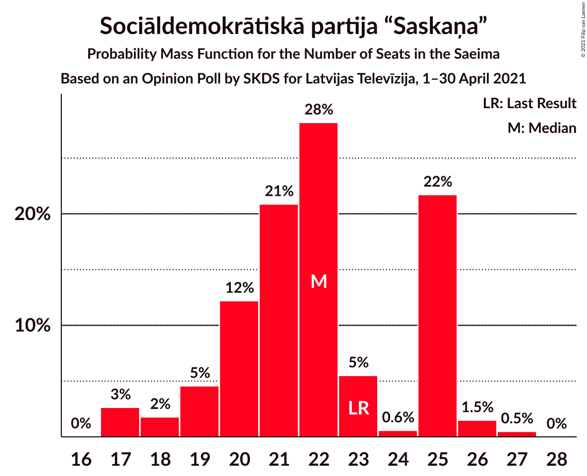
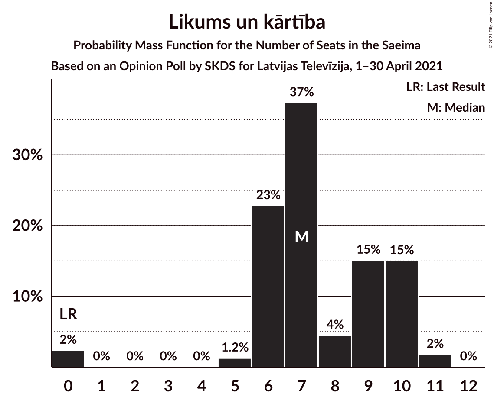
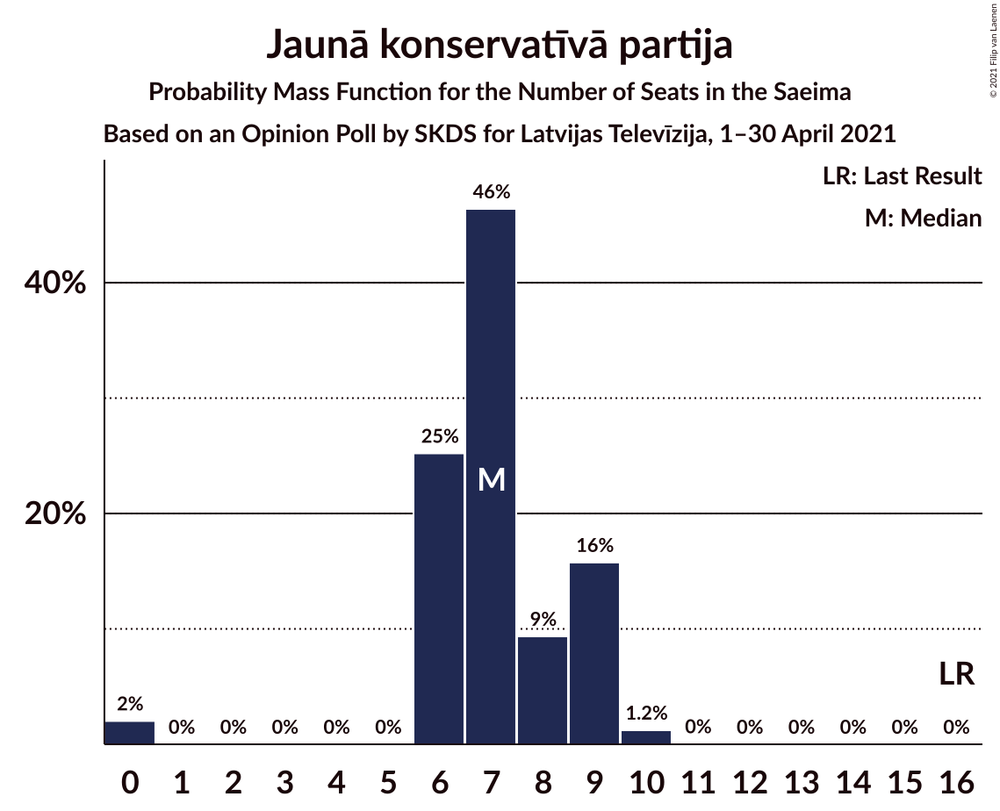
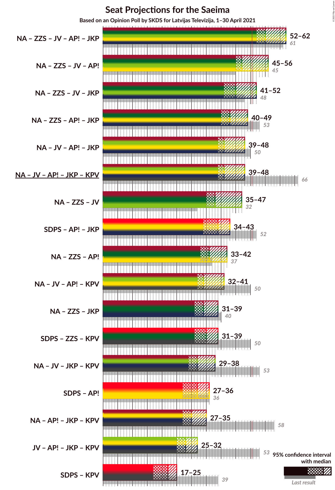
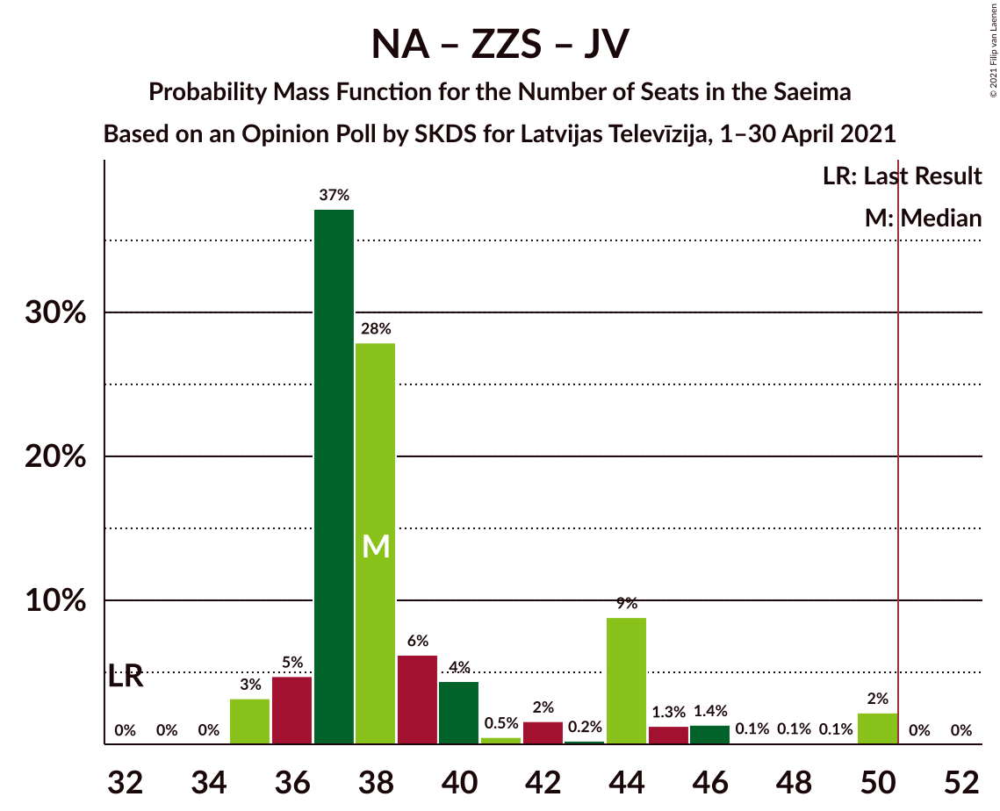
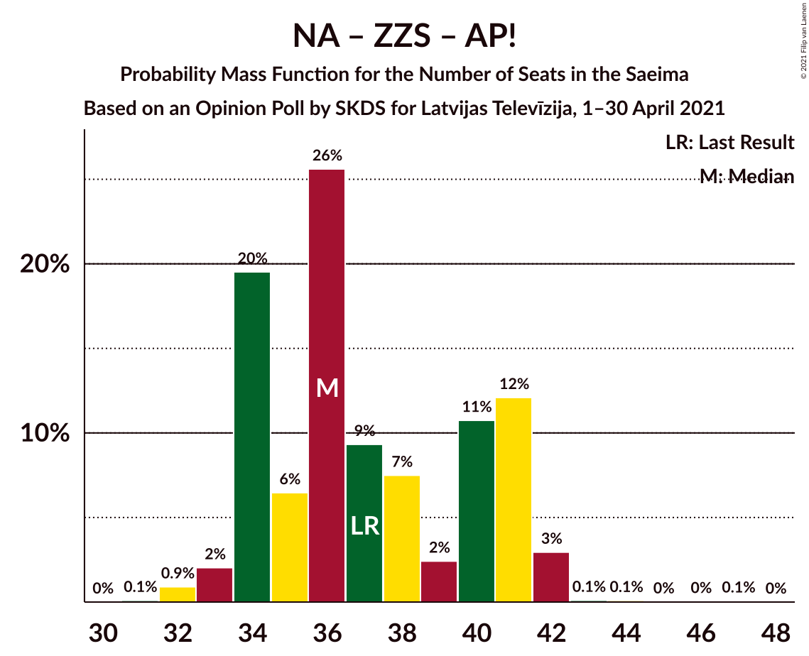

# Opinion Poll by SKDS for Latvijas Televīzija, 1–30 April 2021

<a href="#voting-intentions">Voting Intentions</a> | <a href="#seats">Seats</a> | <a href="#coalitions">Coalitions</a> | <a href="#technical-information">Technical Information</a>

## Voting Intentions

### Confidence Intervals

| Party | Last Result | Poll Result | 80% Confidence Interval | 90% Confidence Interval | 95% Confidence Interval | 99% Confidence Interval |
|:-----:|:-----------:|:-----------:|:-----------------------:|:-----------------------:|:-----------------------:|:-----------------------:|
| Sociāldemokrātiskā partija “Saskaņa” | 19.8% | 20.2% | 18.5–22.0% |18.0–22.6% |17.6–23.0% |16.8–24.0% |
| Nacionālā apvienība „Visu Latvijai!”–„Tēvzemei un Brīvībai/LNNK” | 11.0% | 13.4% | 12.0–15.1% |11.6–15.5% |11.3–15.9% |10.7–16.8% |
| Zaļo un Zemnieku savienība | 9.9% | 13.0% | 11.6–14.6% |11.2–15.0% |10.9–15.4% |10.2–16.2% |
| Jaunā VIENOTĪBA | 6.7% | 11.8% | 10.4–13.3% |10.1–13.7% |9.7–14.1% |9.1–14.9% |
| Attīstībai/Par! | 12.0% | 9.4% | 8.2–10.8% |7.8–11.2% |7.6–11.5% |7.0–12.3% |
| PROGRESĪVIE | 2.6% | 7.6% | 6.5–8.9% |6.2–9.2% |6.0–9.6% |5.5–10.2% |
| Latvijas Krievu savienība | 3.2% | 7.0% | 5.9–8.2% |5.7–8.6% |5.4–8.9% |5.0–9.5% |
| Likums un kārtība | 0.0% | 7.0% | 5.9–8.2% |5.7–8.6% |5.4–8.9% |5.0–9.5% |
| Jaunā konservatīvā partija | 13.6% | 6.5% | 5.5–7.7% |5.2–8.1% |5.0–8.4% |4.6–9.0% |
| Latvijas Reģionu Apvienība | 4.1% | 3.4% | 2.7–4.3% |2.5–4.6% |2.3–4.8% |2.0–5.3% |

*Note:* The poll result column reflects the actual value used in the calculations. Published results may vary slightly, and in addition be rounded to fewer digits.

## Seats

### Confidence Intervals

| Party | Last Result | Median | 80% Confidence Interval | 90% Confidence Interval | 95% Confidence Interval | 99% Confidence Interval |
|:-----:|:-----------:|:------:|:-----------------------:|:-----------------------:|:-----------------------:|:-----------------------:|
| <a href="#sociāldemokrātiskā-partija-“saskaņa”">Sociāldemokrātiskā partija “Saskaņa”</a> | 23 | 20 | 19–22 |19–23 |18–24 |17–25 |
| <a href="#nacionālā-apvienība-„visu-latvijai!”–„tēvzemei-un-brīvībai/lnnk”">Nacionālā apvienība „Visu Latvijai!”–„Tēvzemei un Brīvībai/LNNK”</a> | 13 | 14 | 13–16 |12–16 |12–17 |11–18 |
| <a href="#zaļo-un-zemnieku-savienība">Zaļo un Zemnieku savienība</a> | 11 | 13 | 11–15 |11–16 |11–17 |11–18 |
| <a href="#jaunā-vienotība">Jaunā VIENOTĪBA</a> | 8 | 12 | 11–14 |10–15 |10–15 |10–16 |
| <a href="#attīstībai/par!">Attīstībai/Par!</a> | 13 | 10 | 8–13 |8–14 |7–14 |7–14 |
| <a href="#progresīvie">PROGRESĪVIE</a> | 0 | 8 | 7–8 |7–9 |7–9 |7–11 |
| <a href="#latvijas-krievu-savienība">Latvijas Krievu savienība</a> | 0 | 8 | 7–8 |6–9 |5–10 |0–10 |
| <a href="#likums-un-kārtība">Likums un kārtība</a> | 0 | 8 | 6–9 |6–10 |6–11 |4–11 |
| <a href="#jaunā-konservatīvā-partija">Jaunā konservatīvā partija</a> | 16 | 7 | 6–7 |6–8 |0–9 |0–9 |
| <a href="#latvijas-reģionu-apvienība">Latvijas Reģionu Apvienība</a> | 0 | 0 | 0 |0 |0 |0 |

### Sociāldemokrātiskā partija “Saskaņa”

*For a full overview of the results for this party, see the [Sociāldemokrātiskā partija “Saskaņa”](party-sociāldemokrātiskāpartija“saskaņa”.html) page.*

| Number of Seats | Probability | Accumulated | Special Marks |
|:---------------:|:-----------:|:-----------:|:-------------:|
| 16 | 0% | 100% |  |
| 17 | 2% | 99.9% |  |
| 18 | 3% | 98% |  |
| 19 | 20% | 95% |  |
| 20 | 28% | 75% | Median |
| 21 | 14% | 47% |  |
| 22 | 27% | 33% |  |
| 23 | 3% | 6% | Last Result |
| 24 | 2% | 3% |  |
| 25 | 0.5% | 0.9% |  |
| 26 | 0.3% | 0.4% |  |
| 27 | 0.1% | 0.1% |  |
| 28 | 0% | 0% |  |

### Nacionālā apvienība „Visu Latvijai!”–„Tēvzemei un Brīvībai/LNNK”

*For a full overview of the results for this party, see the [Nacionālā apvienība „Visu Latvijai!”–„Tēvzemei un Brīvībai/LNNK”](party-nacionālāapvienība„visulatvijai”–„tēvzemeiunbrīvībailnnk”.html) page.*

| Number of Seats | Probability | Accumulated | Special Marks |
|:---------------:|:-----------:|:-----------:|:-------------:|
| 11 | 0.8% | 100% |  |
| 12 | 9% | 99.2% |  |
| 13 | 22% | 90% | Last Result |
| 14 | 31% | 68% | Median |
| 15 | 19% | 37% |  |
| 16 | 13% | 17% |  |
| 17 | 4% | 4% |  |
| 18 | 0.6% | 0.7% |  |
| 19 | 0% | 0% |  |

### Zaļo un Zemnieku savienība

*For a full overview of the results for this party, see the [Zaļo un Zemnieku savienība](party-zaļounzemniekusavienība.html) page.*

| Number of Seats | Probability | Accumulated | Special Marks |
|:---------------:|:-----------:|:-----------:|:-------------:|
| 11 | 16% | 100% | Last Result |
| 12 | 20% | 84% |  |
| 13 | 40% | 65% | Median |
| 14 | 12% | 25% |  |
| 15 | 7% | 13% |  |
| 16 | 2% | 6% |  |
| 17 | 4% | 4% |  |
| 18 | 0.6% | 0.6% |  |
| 19 | 0% | 0% |  |

### Jaunā VIENOTĪBA

*For a full overview of the results for this party, see the [Jaunā VIENOTĪBA](party-jaunāvienotība.html) page.*

| Number of Seats | Probability | Accumulated | Special Marks |
|:---------------:|:-----------:|:-----------:|:-------------:|
| 8 | 0% | 100% | Last Result |
| 9 | 0.1% | 100% |  |
| 10 | 8% | 99.8% |  |
| 11 | 41% | 92% |  |
| 12 | 13% | 51% | Median |
| 13 | 25% | 39% |  |
| 14 | 8% | 14% |  |
| 15 | 3% | 5% |  |
| 16 | 2% | 2% |  |
| 17 | 0.1% | 0.1% |  |
| 18 | 0.1% | 0.1% |  |
| 19 | 0% | 0% |  |

### Attīstībai/Par!

*For a full overview of the results for this party, see the [Attīstībai/Par!](party-attīstībaipar.html) page.*

| Number of Seats | Probability | Accumulated | Special Marks |
|:---------------:|:-----------:|:-----------:|:-------------:|
| 6 | 0.1% | 100% |  |
| 7 | 3% | 99.9% |  |
| 8 | 7% | 97% |  |
| 9 | 19% | 90% |  |
| 10 | 44% | 71% | Median |
| 11 | 6% | 27% |  |
| 12 | 5% | 20% |  |
| 13 | 8% | 15% | Last Result |
| 14 | 7% | 7% |  |
| 15 | 0% | 0% |  |

### PROGRESĪVIE

*For a full overview of the results for this party, see the [PROGRESĪVIE](party-progresīvie.html) page.*

| Number of Seats | Probability | Accumulated | Special Marks |
|:---------------:|:-----------:|:-----------:|:-------------:|
| 0 | 0% | 100% | Last Result |
| 1 | 0% | 100% |  |
| 2 | 0% | 100% |  |
| 3 | 0% | 100% |  |
| 4 | 0% | 100% |  |
| 5 | 0.2% | 100% |  |
| 6 | 0.2% | 99.7% |  |
| 7 | 48% | 99.6% |  |
| 8 | 41% | 51% | Median |
| 9 | 8% | 10% |  |
| 10 | 1.0% | 2% |  |
| 11 | 0.3% | 0.6% |  |
| 12 | 0.3% | 0.3% |  |
| 13 | 0% | 0% |  |

### Latvijas Krievu savienība

*For a full overview of the results for this party, see the [Latvijas Krievu savienība](party-latvijaskrievusavienība.html) page.*

| Number of Seats | Probability | Accumulated | Special Marks |
|:---------------:|:-----------:|:-----------:|:-------------:|
| 0 | 1.2% | 100% | Last Result |
| 1 | 0% | 98.8% |  |
| 2 | 0% | 98.8% |  |
| 3 | 0% | 98.8% |  |
| 4 | 0% | 98.8% |  |
| 5 | 2% | 98.8% |  |
| 6 | 6% | 97% |  |
| 7 | 5% | 91% |  |
| 8 | 78% | 86% | Median |
| 9 | 4% | 9% |  |
| 10 | 5% | 5% |  |
| 11 | 0% | 0% |  |

### Likums un kārtība

*For a full overview of the results for this party, see the [Likums un kārtība](party-likumsunkārtība.html) page.*

| Number of Seats | Probability | Accumulated | Special Marks |
|:---------------:|:-----------:|:-----------:|:-------------:|
| 0 | 0.3% | 100% | Last Result |
| 1 | 0% | 99.7% |  |
| 2 | 0% | 99.7% |  |
| 3 | 0% | 99.7% |  |
| 4 | 0.6% | 99.7% |  |
| 5 | 1.1% | 99.1% |  |
| 6 | 29% | 98% |  |
| 7 | 8% | 69% |  |
| 8 | 15% | 61% | Median |
| 9 | 37% | 46% |  |
| 10 | 7% | 9% |  |
| 11 | 3% | 3% |  |
| 12 | 0% | 0% |  |

### Jaunā konservatīvā partija

*For a full overview of the results for this party, see the [Jaunā konservatīvā partija](party-jaunākonservatīvāpartija.html) page.*

| Number of Seats | Probability | Accumulated | Special Marks |
|:---------------:|:-----------:|:-----------:|:-------------:|
| 0 | 4% | 100% |  |
| 1 | 0% | 96% |  |
| 2 | 0% | 96% |  |
| 3 | 0% | 96% |  |
| 4 | 0% | 96% |  |
| 5 | 0% | 96% |  |
| 6 | 16% | 96% |  |
| 7 | 74% | 80% | Median |
| 8 | 3% | 6% |  |
| 9 | 3% | 3% |  |
| 10 | 0.2% | 0.3% |  |
| 11 | 0.1% | 0.1% |  |
| 12 | 0% | 0% |  |
| 13 | 0% | 0% |  |
| 14 | 0% | 0% |  |
| 15 | 0% | 0% |  |
| 16 | 0% | 0% | Last Result |

### Latvijas Reģionu Apvienība

*For a full overview of the results for this party, see the [Latvijas Reģionu Apvienība](party-latvijasreģionuapvienība.html) page.*

| Number of Seats | Probability | Accumulated | Special Marks |
|:---------------:|:-----------:|:-----------:|:-------------:|
| 0 | 99.6% | 100% | Last Result, Median |
| 1 | 0% | 0.4% |  |
| 2 | 0% | 0.4% |  |
| 3 | 0% | 0.4% |  |
| 4 | 0% | 0.4% |  |
| 5 | 0% | 0.4% |  |
| 6 | 0.4% | 0.4% |  |
| 7 | 0% | 0% |  |

## Coalitions

### Confidence Intervals

| Coalition | Last Result | Median | Majority? | 80% Confidence Interval | 90% Confidence Interval | 95% Confidence Interval | 99% Confidence Interval |
|:---------:|:-----------:|:------:|:---------:|:-----------------------:|:-----------------------:|:-----------------------:|:-----------------------:|
| Nacionālā apvienība „Visu Latvijai!”–„Tēvzemei un Brīvībai/LNNK” – Zaļo un Zemnieku savienība – Jaunā VIENOTĪBA – Attīstībai/Par! – Jaunā konservatīvā partija | 61 | 56 | 99.6% | 54–59 | 52–60 | 52–60 | 51–62 |
| Nacionālā apvienība „Visu Latvijai!”–„Tēvzemei un Brīvībai/LNNK” – Zaļo un Zemnieku savienība – Jaunā VIENOTĪBA – Attīstībai/Par! | 45 | 49 | 28% | 47–53 | 46–53 | 45–54 | 44–56 |
| Nacionālā apvienība „Visu Latvijai!”–„Tēvzemei un Brīvībai/LNNK” – Zaļo un Zemnieku savienība – Jaunā VIENOTĪBA – Jaunā konservatīvā partija | 48 | 45 | 2% | 44–49 | 43–50 | 42–50 | 41–52 |
| Nacionālā apvienība „Visu Latvijai!”–„Tēvzemei un Brīvībai/LNNK” – Zaļo un Zemnieku savienība – Attīstībai/Par! – Jaunā konservatīvā partija | 53 | 44 | 0.2% | 42–47 | 41–48 | 40–48 | 38–50 |
| Nacionālā apvienība „Visu Latvijai!”–„Tēvzemei un Brīvībai/LNNK” – Jaunā VIENOTĪBA – Attīstībai/Par! – Jaunā konservatīvā partija | 50 | 43 | 0% | 40–46 | 39–47 | 38–47 | 37–49 |
| Nacionālā apvienība „Visu Latvijai!”–„Tēvzemei un Brīvībai/LNNK” – Zaļo un Zemnieku savienība – Jaunā VIENOTĪBA | 32 | 39 | 0% | 37–42 | 36–43 | 36–43 | 35–46 |
| Nacionālā apvienība „Visu Latvijai!”–„Tēvzemei un Brīvībai/LNNK” – Zaļo un Zemnieku savienība – Attīstībai/Par! | 37 | 37 | 0% | 35–41 | 34–41 | 34–42 | 32–43 |
| Sociāldemokrātiskā partija “Saskaņa” – Attīstībai/Par! – Jaunā konservatīvā partija | 52 | 37 | 0% | 35–41 | 34–41 | 33–42 | 31–44 |
| Nacionālā apvienība „Visu Latvijai!”–„Tēvzemei un Brīvībai/LNNK” – Zaļo un Zemnieku savienība – Jaunā konservatīvā partija | 40 | 34 | 0% | 32–36 | 31–37 | 30–38 | 28–40 |
| Sociāldemokrātiskā partija “Saskaņa” – Attīstībai/Par! | 36 | 30 | 0% | 29–34 | 28–34 | 27–35 | 26–37 |

### Nacionālā apvienība „Visu Latvijai!”–„Tēvzemei un Brīvībai/LNNK” – Zaļo un Zemnieku savienība – Jaunā VIENOTĪBA – Attīstībai/Par! – Jaunā konservatīvā partija

| Number of Seats | Probability | Accumulated | Special Marks |
|:---------------:|:-----------:|:-----------:|:-------------:|
| 49 | 0.1% | 100% |  |
| 50 | 0.3% | 99.9% |  |
| 51 | 1.1% | 99.6% | Majority |
| 52 | 4% | 98.5% |  |
| 53 | 3% | 95% |  |
| 54 | 8% | 92% |  |
| 55 | 31% | 84% |  |
| 56 | 16% | 53% | Median |
| 57 | 13% | 37% |  |
| 58 | 8% | 24% |  |
| 59 | 9% | 17% |  |
| 60 | 6% | 7% |  |
| 61 | 0.9% | 2% | Last Result |
| 62 | 0.6% | 0.8% |  |
| 63 | 0.1% | 0.2% |  |
| 64 | 0% | 0.1% |  |
| 65 | 0% | 0% |  |

### Nacionālā apvienība „Visu Latvijai!”–„Tēvzemei un Brīvībai/LNNK” – Zaļo un Zemnieku savienība – Jaunā VIENOTĪBA – Attīstībai/Par!

| Number of Seats | Probability | Accumulated | Special Marks |
|:---------------:|:-----------:|:-----------:|:-------------:|
| 43 | 0.1% | 100% |  |
| 44 | 0.6% | 99.9% |  |
| 45 | 2% | 99.3% | Last Result |
| 46 | 3% | 97% |  |
| 47 | 5% | 94% |  |
| 48 | 31% | 89% |  |
| 49 | 14% | 58% | Median |
| 50 | 16% | 44% |  |
| 51 | 8% | 28% | Majority |
| 52 | 9% | 20% |  |
| 53 | 7% | 10% |  |
| 54 | 2% | 3% |  |
| 55 | 0.8% | 2% |  |
| 56 | 0.6% | 0.8% |  |
| 57 | 0.2% | 0.2% |  |
| 58 | 0% | 0.1% |  |
| 59 | 0% | 0.1% |  |
| 60 | 0% | 0% |  |

### Nacionālā apvienība „Visu Latvijai!”–„Tēvzemei un Brīvībai/LNNK” – Zaļo un Zemnieku savienība – Jaunā VIENOTĪBA – Jaunā konservatīvā partija

| Number of Seats | Probability | Accumulated | Special Marks |
|:---------------:|:-----------:|:-----------:|:-------------:|
| 38 | 0.1% | 100% |  |
| 39 | 0.1% | 99.9% |  |
| 40 | 0.1% | 99.8% |  |
| 41 | 0.8% | 99.6% |  |
| 42 | 2% | 98.9% |  |
| 43 | 6% | 97% |  |
| 44 | 9% | 91% |  |
| 45 | 32% | 81% |  |
| 46 | 23% | 50% | Median |
| 47 | 10% | 27% |  |
| 48 | 6% | 17% | Last Result |
| 49 | 3% | 11% |  |
| 50 | 7% | 8% |  |
| 51 | 0.8% | 2% | Majority |
| 52 | 0.8% | 1.0% |  |
| 53 | 0.2% | 0.2% |  |
| 54 | 0.1% | 0.1% |  |
| 55 | 0% | 0% |  |

### Nacionālā apvienība „Visu Latvijai!”–„Tēvzemei un Brīvībai/LNNK” – Zaļo un Zemnieku savienība – Attīstībai/Par! – Jaunā konservatīvā partija

| Number of Seats | Probability | Accumulated | Special Marks |
|:---------------:|:-----------:|:-----------:|:-------------:|
| 36 | 0.1% | 100% |  |
| 37 | 0.1% | 99.9% |  |
| 38 | 0.7% | 99.8% |  |
| 39 | 1.0% | 99.1% |  |
| 40 | 3% | 98% |  |
| 41 | 5% | 96% |  |
| 42 | 26% | 90% |  |
| 43 | 6% | 64% |  |
| 44 | 18% | 57% | Median |
| 45 | 8% | 40% |  |
| 46 | 14% | 32% |  |
| 47 | 9% | 18% |  |
| 48 | 7% | 9% |  |
| 49 | 1.4% | 2% |  |
| 50 | 0.5% | 0.6% |  |
| 51 | 0.1% | 0.2% | Majority |
| 52 | 0% | 0.1% |  |
| 53 | 0% | 0% | Last Result |

### Nacionālā apvienība „Visu Latvijai!”–„Tēvzemei un Brīvībai/LNNK” – Jaunā VIENOTĪBA – Attīstībai/Par! – Jaunā konservatīvā partija

| Number of Seats | Probability | Accumulated | Special Marks |
|:---------------:|:-----------:|:-----------:|:-------------:|
| 35 | 0.1% | 100% |  |
| 36 | 0.2% | 99.9% |  |
| 37 | 0.7% | 99.7% |  |
| 38 | 2% | 99.0% |  |
| 39 | 5% | 97% |  |
| 40 | 5% | 93% |  |
| 41 | 10% | 88% |  |
| 42 | 10% | 78% |  |
| 43 | 26% | 69% | Median |
| 44 | 20% | 42% |  |
| 45 | 7% | 22% |  |
| 46 | 10% | 15% |  |
| 47 | 4% | 5% |  |
| 48 | 0.8% | 1.4% |  |
| 49 | 0.5% | 0.6% |  |
| 50 | 0.1% | 0.1% | Last Result |
| 51 | 0% | 0% | Majority |

### Nacionālā apvienība „Visu Latvijai!”–„Tēvzemei un Brīvībai/LNNK” – Zaļo un Zemnieku savienība – Jaunā VIENOTĪBA

| Number of Seats | Probability | Accumulated | Special Marks |
|:---------------:|:-----------:|:-----------:|:-------------:|
| 32 | 0% | 100% | Last Result |
| 33 | 0% | 100% |  |
| 34 | 0.2% | 100% |  |
| 35 | 1.3% | 99.8% |  |
| 36 | 4% | 98% |  |
| 37 | 7% | 94% |  |
| 38 | 31% | 87% |  |
| 39 | 25% | 57% | Median |
| 40 | 11% | 32% |  |
| 41 | 5% | 21% |  |
| 42 | 5% | 15% |  |
| 43 | 8% | 10% |  |
| 44 | 0.6% | 2% |  |
| 45 | 0.7% | 1.5% |  |
| 46 | 0.7% | 0.8% |  |
| 47 | 0.1% | 0.1% |  |
| 48 | 0% | 0% |  |

### Nacionālā apvienība „Visu Latvijai!”–„Tēvzemei un Brīvībai/LNNK” – Zaļo un Zemnieku savienība – Attīstībai/Par!

| Number of Seats | Probability | Accumulated | Special Marks |
|:---------------:|:-----------:|:-----------:|:-------------:|
| 31 | 0.4% | 100% |  |
| 32 | 0.6% | 99.6% |  |
| 33 | 0.9% | 99.0% |  |
| 34 | 4% | 98% |  |
| 35 | 25% | 94% |  |
| 36 | 8% | 69% |  |
| 37 | 17% | 61% | Last Result, Median |
| 38 | 8% | 44% |  |
| 39 | 14% | 36% |  |
| 40 | 11% | 22% |  |
| 41 | 7% | 11% |  |
| 42 | 3% | 4% |  |
| 43 | 0.8% | 1.2% |  |
| 44 | 0.3% | 0.4% |  |
| 45 | 0% | 0.1% |  |
| 46 | 0.1% | 0.1% |  |
| 47 | 0% | 0% |  |

### Sociāldemokrātiskā partija “Saskaņa” – Attīstībai/Par! – Jaunā konservatīvā partija

| Number of Seats | Probability | Accumulated | Special Marks |
|:---------------:|:-----------:|:-----------:|:-------------:|
| 28 | 0.1% | 100% |  |
| 29 | 0.3% | 99.9% |  |
| 30 | 0.1% | 99.6% |  |
| 31 | 0.5% | 99.5% |  |
| 32 | 0.9% | 99.1% |  |
| 33 | 2% | 98% |  |
| 34 | 5% | 96% |  |
| 35 | 5% | 91% |  |
| 36 | 22% | 86% |  |
| 37 | 18% | 65% | Median |
| 38 | 19% | 46% |  |
| 39 | 5% | 27% |  |
| 40 | 5% | 21% |  |
| 41 | 13% | 16% |  |
| 42 | 2% | 4% |  |
| 43 | 0.7% | 1.2% |  |
| 44 | 0.2% | 0.5% |  |
| 45 | 0.3% | 0.3% |  |
| 46 | 0% | 0% |  |
| 47 | 0% | 0% |  |
| 48 | 0% | 0% |  |
| 49 | 0% | 0% |  |
| 50 | 0% | 0% |  |
| 51 | 0% | 0% | Majority |
| 52 | 0% | 0% | Last Result |

### Nacionālā apvienība „Visu Latvijai!”–„Tēvzemei un Brīvībai/LNNK” – Zaļo un Zemnieku savienība – Jaunā konservatīvā partija

| Number of Seats | Probability | Accumulated | Special Marks |
|:---------------:|:-----------:|:-----------:|:-------------:|
| 26 | 0.1% | 100% |  |
| 27 | 0.2% | 99.9% |  |
| 28 | 0.8% | 99.8% |  |
| 29 | 0.2% | 99.0% |  |
| 30 | 2% | 98.7% |  |
| 31 | 5% | 97% |  |
| 32 | 18% | 92% |  |
| 33 | 16% | 74% |  |
| 34 | 30% | 58% | Median |
| 35 | 10% | 29% |  |
| 36 | 13% | 19% |  |
| 37 | 4% | 7% |  |
| 38 | 2% | 3% |  |
| 39 | 0.8% | 1.5% |  |
| 40 | 0.4% | 0.6% | Last Result |
| 41 | 0.3% | 0.3% |  |
| 42 | 0% | 0% |  |

### Sociāldemokrātiskā partija “Saskaņa” – Attīstībai/Par!

| Number of Seats | Probability | Accumulated | Special Marks |
|:---------------:|:-----------:|:-----------:|:-------------:|
| 25 | 0.1% | 100% |  |
| 26 | 0.8% | 99.8% |  |
| 27 | 3% | 99.0% |  |
| 28 | 4% | 96% |  |
| 29 | 23% | 92% |  |
| 30 | 20% | 68% | Median |
| 31 | 17% | 49% |  |
| 32 | 7% | 32% |  |
| 33 | 7% | 25% |  |
| 34 | 14% | 18% |  |
| 35 | 3% | 4% |  |
| 36 | 0.7% | 1.2% | Last Result |
| 37 | 0.1% | 0.5% |  |
| 38 | 0.3% | 0.4% |  |
| 39 | 0% | 0.1% |  |
| 40 | 0% | 0% |  |

## Technical Information

### Opinion Poll

+ **Polling firm:** SKDS
+ **Commissioner(s):** Latvijas Televīzija
+ **Fieldwork period:** 1–30 April 2021

### Calculations

+ **Sample size:** 833
+ **Simulations done:** 1,048,576
+ **Error estimate:** 1.66%

